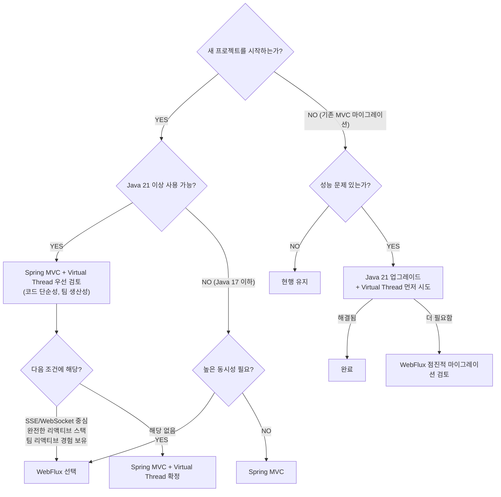

Tomcat 스레드 200개가 모두 외부 API 응답을 기다리며 블로킹되어 있다. 새 요청은 큐에서 대기하다 타임아웃이 난다. 이 상황에서 서버를 늘리는 것보다 더 근본적인 해법이 WebFlux다.

> **비유로 먼저 이해하기**: WebFlux는 1인 카페 바리스타와 같다. 아메리카노를 주문받으면 에스프레소가 내려지는 동안 멍하니 기다리지 않고 다음 손님 주문을 받는다. 커피가 완성되면 그때 가져다준다. 스레드(바리스타) 한 명이 수십 개의 요청을 동시에 처리할 수 있는 이유다.

Spring WebFlux는 Spring 5에서 도입된 리액티브 웹 프레임워크입니다. 기존 Spring MVC의 동기-블로킹 모델과 달리 비동기-논블로킹 방식으로 동작하여 높은 동시성 처리가 필요한 환경에서 강점을 발휘합니다. 이 글에서는 WebFlux의 개념부터 내부 동작, 실무 적용, 극한 시나리오까지 완전히 정리합니다.

---

## 1. WebFlux란?

### 왜 필요한가? — C10K 문제와 높은 동시성

C10K 문제(Client 10,000 Problem)는 1999년 Dan Kegel이 제기한 문제로, 단일 서버에서 동시에 10,000개의 클라이언트 연결을 처리하는 것이 당시 기술로는 매우 어렵다는 내용입니다. 현재는 C100K, C1M 수준의 동시성이 요구되는 시대입니다.

전통적인 Spring MVC는 **thread-per-request** 모델을 사용합니다. 요청 하나당 스레드 하나를 할당하고, 그 스레드가 요청 처리 완료까지 블로킹됩니다.

<div class="mermaid">
graph LR
    R1[요청 1] --> T1[Thread-1]
    R2[요청 2] --> T2[Thread-2]
    RN[요청 N] --> TN[Thread-N]
    T1 -->|"DB 쿼리 대기 블로킹"| A1[응답]
    T2 -->|"외부 API 대기 블로킹"| A2[응답]
    TN -->|"파일 I/O 대기 블로킹"| AN[응답]
</div>

문제는 스레드가 I/O 대기 중에도 메모리(기본 512KB~1MB)를 점유하며, 컨텍스트 스위칭 비용이 발생한다는 점입니다. 동시 요청이 10,000개라면 10,000개의 스레드가 필요하고, 이는 수 GB의 메모리를 소비합니다.

WebFlux는 **이벤트 루프(Event Loop)** 모델로 이 문제를 해결합니다. 소수의 스레드(CPU 코어 수)로 수만 개의 동시 연결을 처리합니다.

<div class="mermaid">
graph LR
    R1[요청 1] --> EL
    R2[요청 2] --> EL
    R3[요청 3] --> EL
    RN[요청 N] --> EL
    EL[Event Loop Thread] -->|논블로킹 I/O| IO[결과 콜백]
    IO --> RES[응답]
</div>

### Spring MVC vs WebFlux 아키텍처 비교

<div class="mermaid">
graph TD
    subgraph MVC["Spring MVC 아키텍처 - 스레드가 I/O 완료까지 점유됨, 직관적, 동기"]
        MC[Client] --> MS[Servlet Container]
        MS --> MDS[DispatcherServlet]
        MS --> MTP["Thread Pool (Tomcat, default:200)"]
        MTP --> MT1["Thread-1 → DB (블로킹 대기)"]
        MTP --> MT2["Thread-2 → REST API (블로킹 대기)"]
        MTP --> MT3["Thread-3 → File I/O (블로킹 대기)"]
        MDS --> MC2["Controller (블로킹)"]
    end

    subgraph WF["Spring WebFlux 아키텍처 - 스레드 수 << 동시 연결 수, 비동기, 리액티브"]
        WC[Client] --> WN["Netty/Undertow"]
        WN --> WH[DispatcherHandler]
        WN --> WEL["Event Loop (코어 수 = N개 스레드)"]
        WEL --> WL1[Loop-1]
        WEL --> WL2[Loop-2]
        WEL --> WLN[Loop-N]
        WH --> WRF["RouterFunction / @Controller"]
        WRF --> WIO["논블로킹 I/O → 결과가 준비되면 콜백으로 처리"]
    end
</div>

### 스레드 모델 차이

| 구분 | Spring MVC | Spring WebFlux |
|------|-----------|----------------|
| 기반 스펙 | Servlet API (블로킹) | Reactive Streams (논블로킹) |
| 기본 서버 | Tomcat (thread pool) | Netty (event loop) |
| 스레드 수 | 요청 수에 비례 | CPU 코어 수 |
| I/O 처리 | 블로킹 (스레드 점유) | 논블로킹 (콜백/이벤트) |
| 메모리 효율 | 낮음 (스레드당 ~512KB) | 높음 |
| 코드 스타일 | 동기, 명령형 | 비동기, 선언형 |
| 학습 곡선 | 낮음 | 높음 |
| 디버깅 | 쉬움 | 어려움 |

---

## 2. 리액티브 프로그래밍 기초

### Reactive Streams 스펙

Reactive Streams는 논블로킹 배압(Backpressure)을 지원하는 비동기 스트림 처리를 위한 표준 스펙입니다. Java 9의 `java.util.concurrent.Flow`로 표준화되었습니다.

4개의 핵심 인터페이스로 구성됩니다.

```java
// 1. Publisher: 데이터를 생산하는 쪽
public interface Publisher<T> {
    void subscribe(Subscriber<? super T> subscriber);
}

// 2. Subscriber: 데이터를 소비하는 쪽
public interface Subscriber<T> {
    void onSubscribe(Subscription s);   // 구독 시작
    void onNext(T t);                   // 데이터 수신
    void onError(Throwable t);          // 에러 발생
    void onComplete();                  // 완료
}

// 3. Subscription: Publisher-Subscriber 간 계약
public interface Subscription {
    void request(long n);   // n개 데이터 요청 (배압 핵심)
    void cancel();          // 구독 취소
}

// 4. Processor: Publisher + Subscriber (중간 처리자)
public interface Processor<T, R> extends Subscriber<T>, Publisher<R> {
}
```

동작 흐름은 다음과 같습니다.

<div class="mermaid">
sequenceDiagram
    participant P as Publisher
    participant S as Subscriber

    S->>P: subscribe(subscriber)
    P->>S: onSubscribe(sub)
    S->>P: sub.request(N) - N개 데이터 요청
    P->>S: onNext(item1)
    P->>S: onNext(item2)
    P->>S: onNext(itemN)
    P->>S: onComplete() 또는 onError()
</div>

### 배압(Backpressure) 개념

배압은 Subscriber가 처리할 수 있는 만큼만 Publisher에게 데이터를 요청하는 메커니즘입니다. 이를 통해 Producer가 Consumer보다 빠를 때 발생하는 OOM(Out of Memory)을 방지합니다.

<div class="mermaid">
graph LR
    subgraph "배압 없음 - 문제 상황"
        P1[Producer] -->|"데이터 폭주"| B1["버퍼 폭주"] --> C1["Consumer 처리 중... → OOM!"]
    end
    subgraph "배압 있음 - Reactive Streams"
        C2["Consumer 처리 완료"] -->|"request(5) - 5개 더 줘"| P2[Producer]
        P2 -->|"5개만 전송"| C2
    end
</div>

```java
// 배압 전략 예시 (Project Reactor)
Flux.range(1, 1_000_000)
    .onBackpressureBuffer(1000)     // 버퍼 1000개
    // .onBackpressureDrop()        // 넘치면 버림
    // .onBackpressureLatest()      // 최신 값만 유지
    // .onBackpressureError()       // 넘치면 에러
    .subscribe(item -> {
        // 느린 소비자
        Thread.sleep(10);
        System.out.println(item);
    });
```

### Project Reactor — Mono와 Flux

Project Reactor는 Reactive Streams를 구현한 Spring의 공식 리액티브 라이브러리입니다.

**Mono**: 0 또는 1개의 아이템을 방출하는 Publisher

```java
// Mono 생성
Mono<String> mono1 = Mono.just("Hello");
Mono<String> mono2 = Mono.empty();                    // 빈 Mono
Mono<String> mono3 = Mono.error(new RuntimeException("오류"));
Mono<String> mono4 = Mono.fromSupplier(() -> "지연 생성");
Mono<String> mono5 = Mono.fromCallable(() -> "동기 호출");  // boundedElastic 권장

// Mono 구독
mono1.subscribe(
    value -> System.out.println("값: " + value),
    error -> System.err.println("에러: " + error),
    () -> System.out.println("완료")
);
```

**Flux**: 0개 이상의 아이템을 방출하는 Publisher

```java
// Flux 생성
Flux<Integer> flux1 = Flux.just(1, 2, 3, 4, 5);
Flux<Integer> flux2 = Flux.range(1, 100);
Flux<Long>    flux3 = Flux.interval(Duration.ofSeconds(1));  // 1초마다 발행
Flux<String>  flux4 = Flux.fromIterable(List.of("a", "b", "c"));
Flux<String>  flux5 = Flux.fromStream(Stream.of("x", "y", "z"));

// 무한 Flux에 구독
flux3.take(5)  // 5개만
     .subscribe(tick -> System.out.println("Tick: " + tick));
```

### 핵심 연산자

**map — 동기 변환**

```java
Flux.just("hello", "world")
    .map(String::toUpperCase)
    .subscribe(System.out::println);
// HELLO
// WORLD
```

**flatMap — 비동기 변환 (내부 Publisher를 펼침)**

```java
// map과 달리 각 요소를 Publisher로 변환하고 병합
Flux.just("user1", "user2", "user3")
    .flatMap(userId -> fetchUserFromDB(userId))  // 비동기 DB 조회
    .subscribe(user -> System.out.println(user));

// 동시성 제한 (기본값: 256)
Flux.range(1, 100)
    .flatMap(i -> asyncOperation(i), 10)  // 동시 최대 10개
    .subscribe();
```

**filter — 조건 필터링**

```java
Flux.range(1, 10)
    .filter(n -> n % 2 == 0)
    .subscribe(System.out::println);
// 2, 4, 6, 8, 10
```

**zip — 여러 Publisher를 묶어 처리**

```java
Mono<String> nameMonο  = fetchName(userId);
Mono<Integer> ageMonο  = fetchAge(userId);
Mono<String> emailMonο = fetchEmail(userId);

Mono.zip(nameMonο, ageMonο, emailMonο)
    .map(tuple -> new UserDto(tuple.getT1(), tuple.getT2(), tuple.getT3()))
    .subscribe(user -> System.out.println(user));
```

**merge — 여러 Flux를 병렬로 합침 (순서 무보장)**

```java
Flux<String> flux1 = Flux.just("A", "B").delayElements(Duration.ofMillis(100));
Flux<String> flux2 = Flux.just("1", "2").delayElements(Duration.ofMillis(150));

Flux.merge(flux1, flux2)
    .subscribe(System.out::println);
// A, 1, B, 2 (타이밍에 따라 다름)
```

**concat — 순서를 보장하며 합침**

```java
Flux<String> flux1 = Flux.just("A", "B");
Flux<String> flux2 = Flux.just("1", "2");

Flux.concat(flux1, flux2)
    .subscribe(System.out::println);
// A, B, 1, 2 (항상 이 순서)
```

**switchIfEmpty — 빈 Publisher 대체**

```java
userRepository.findById(userId)
    .switchIfEmpty(Mono.error(new UserNotFoundException(userId)))
    .subscribe(user -> System.out.println(user));
```

**onErrorResume — 에러 시 대체 Publisher**

```java
fetchDataFromPrimary()
    .onErrorResume(ex -> fetchDataFromFallback())
    .subscribe(data -> System.out.println(data));
```

### Hot vs Cold Publisher

**Cold Publisher**: 구독할 때마다 처음부터 새로 실행됩니다. 기본적으로 모든 Mono/Flux는 Cold입니다.

```java
Flux<Integer> cold = Flux.range(1, 3);

cold.subscribe(i -> System.out.println("Sub1: " + i));
// Sub1: 1, Sub1: 2, Sub1: 3

cold.subscribe(i -> System.out.println("Sub2: " + i));
// Sub2: 1, Sub2: 2, Sub2: 3  ← 다시 처음부터 실행
```

**Hot Publisher**: 구독 여부와 관계없이 데이터를 발행합니다. 늦게 구독하면 그 이전 데이터는 놓칩니다.

```java
// ConnectableFlux: Cold → Hot 변환
Flux<Long> hotFlux = Flux.interval(Duration.ofSeconds(1))
    .publish()    // ConnectableFlux로 변환
    .autoConnect(); // 첫 구독 시 시작

hotFlux.subscribe(i -> System.out.println("Sub1: " + i));

Thread.sleep(2500);

// Sub2는 0, 1을 놓침
hotFlux.subscribe(i -> System.out.println("Sub2: " + i));
// Sub1: 0, Sub1: 1, Sub1: 2, Sub2: 2, Sub1: 3, Sub2: 3 ...

// share() = publish().autoConnect()의 단축형
Flux<String> shared = fetchLiveData().share();
```

---

## 3. WebFlux 내부 동작

### Netty 이벤트 루프 구조

WebFlux의 기본 서버인 Netty는 Boss/Worker 그룹 구조를 사용합니다.

<div class="mermaid">
graph TD
    C1[Client 1] --> BG
    C2[Client 2] --> BG
    C3[Client 3] --> BG
    CN[...] --> BG
    BG["Boss Group (1~2개 스레드)<br>연결 수락만 담당"]
    BG -->|연결 할당| W1
    BG -->|연결 할당| W2
    BG -->|연결 할당| WN
    W1["Worker-1 EventLoop<br>select/epoll로 I/O 감시<br>I/O 완료 이벤트 발생 시 핸들러 실행<br>블로킹 없이 루프 반복"]
    W2["Worker-2 EventLoop"]
    WN["Worker-N EventLoop<br>(CPU 코어 수)"]
</div>

### 논블로킹 I/O 동작 원리

<div class="mermaid">
graph TD
    subgraph "전통적 블로킹 I/O"
        T1[Thread] -->|DB 연결 요청| W1["대기... (스레드 블로킹)"]
        W1 -->|결과 수신 스레드 깨어남| P1[처리]
    end
    subgraph "논블로킹 I/O NIO"
        T2[Thread] -->|DB 연결 요청| IR[즉시 반환]
        IR --> OW[다른 작업 처리...]
        T2 --> SEL["Selector가 I/O 감시 중"]
        SEL -->|I/O 완료 이벤트 발생| CB[콜백 실행]
    end
</div>

실제 동작 수준에서는 Linux의 `epoll`, macOS의 `kqueue`, Windows의 `IOCP`를 사용하여 커널이 I/O 완료를 통지합니다.

### Schedulers

Reactor의 `Schedulers`는 어떤 스레드에서 실행할지 결정합니다.

```java
// 1. Schedulers.parallel() — CPU 집약 작업용
// 코어 수만큼의 스레드, 블로킹 금지
Flux.range(1, 100)
    .parallel()
    .runOn(Schedulers.parallel())
    .map(n -> n * n)  // CPU 집약 연산
    .sequential()
    .subscribe();

// 2. Schedulers.boundedElastic() — 블로킹 작업 격리용
// 필요에 따라 스레드 생성 (최대 10 * CPU코어, 큐 100K)
Mono.fromCallable(() -> {
        // 레거시 블로킹 코드
        return jdbcTemplate.queryForObject("SELECT ...", String.class);
    })
    .subscribeOn(Schedulers.boundedElastic())
    .subscribe();

// 3. Schedulers.single() — 단일 스레드, 순서 보장
Flux.range(1, 5)
    .publishOn(Schedulers.single())
    .subscribe(i -> System.out.println(Thread.currentThread().getName() + ": " + i));

// 4. Schedulers.immediate() — 현재 스레드에서 실행
// 5. Schedulers.fromExecutorService(executor) — 커스텀 Executor
```

### publishOn vs subscribeOn

이 두 연산자는 WebFlux에서 가장 혼동하기 쉬운 개념입니다.

<div class="mermaid">
graph TD
    subgraph "publishOn 동작 - 이 지점 이후 연산자들이 지정 스케줄러에서 실행"
        PA["Flux.just(1,2,3)<br>소스 - main 스레드"] --> PB["map(A)<br>main에서 실행"]
        PB --> PC["publishOn(Schedulers.parallel())"]
        PC --> PD["map(B)<br>parallel에서 실행"]
        PD --> PE["map(C)<br>parallel에서 실행"]
        PE --> PF[subscribe]
    end
    subgraph "subscribeOn 동작 - 소스 시작 스케줄러 지정, 체인 어디에 놓든 소스에 영향"
        SA["Flux.just(1,2,3)<br>boundedElastic에서 실행"] --> SB["map(A)<br>boundedElastic에서 실행"]
        SB --> SC["map(B)<br>boundedElastic에서 실행"]
        SC --> SD["subscribeOn(Schedulers.boundedElastic())"]
        SD --> SE["map(C)<br>boundedElastic에서 실행"]
        SE --> SF["subscribe()<br>main에서 구독 시작"]
    end
</div>

```java
// 실제 예시: 블로킹 DB 호출 격리
public Mono<User> getUserById(Long id) {
    return Mono.fromCallable(() -> {
            // 블로킹 JDBC 호출
            return userRepository.findById(id);
        })
        .subscribeOn(Schedulers.boundedElastic());  // 블로킹을 별도 스레드로
}
```

---

## 4. WebFlux 사용법

### 의존성 설정

```xml
<!-- Maven -->
<dependency>
    <groupId>org.springframework.boot</groupId>
    <artifactId>spring-boot-starter-webflux</artifactId>
</dependency>
```

```groovy
// Gradle
implementation 'org.springframework.boot:spring-boot-starter-webflux'
```

### 어노테이션 기반 (@RestController + Mono/Flux)

Spring MVC와 거의 동일한 어노테이션을 사용하지만 반환 타입이 `Mono`/`Flux`입니다.

```java
@RestController
@RequestMapping("/api/users")
public class UserController {

    private final UserService userService;

    public UserController(UserService userService) {
        this.userService = userService;
    }

    // 단건 조회 (Mono)
    @GetMapping("/{id}")
    public Mono<ResponseEntity<UserDto>> getUser(@PathVariable Long id) {
        return userService.findById(id)
            .map(user -> ResponseEntity.ok(user))
            .switchIfEmpty(Mono.just(ResponseEntity.notFound().build()));
    }

    // 목록 조회 (Flux)
    @GetMapping
    public Flux<UserDto> getAllUsers() {
        return userService.findAll();
    }

    // 생성
    @PostMapping
    @ResponseStatus(HttpStatus.CREATED)
    public Mono<UserDto> createUser(@RequestBody @Valid Mono<CreateUserRequest> request) {
        return request
            .flatMap(req -> userService.create(req));
    }

    // 수정
    @PutMapping("/{id}")
    public Mono<UserDto> updateUser(
            @PathVariable Long id,
            @RequestBody @Valid Mono<UpdateUserRequest> request) {
        return request.flatMap(req -> userService.update(id, req));
    }

    // 삭제
    @DeleteMapping("/{id}")
    @ResponseStatus(HttpStatus.NO_CONTENT)
    public Mono<Void> deleteUser(@PathVariable Long id) {
        return userService.delete(id);
    }

    // 쿼리 파라미터
    @GetMapping("/search")
    public Flux<UserDto> searchUsers(
            @RequestParam String keyword,
            @RequestParam(defaultValue = "0") int page,
            @RequestParam(defaultValue = "20") int size) {
        return userService.search(keyword, page, size);
    }
}
```

### 함수형 엔드포인트 (RouterFunction, HandlerFunction)

어노테이션 대신 순수 함수로 라우팅을 정의합니다. 더 명시적이고 테스트하기 쉽습니다.

```java
// Handler
@Component
public class UserHandler {

    private final UserService userService;

    public UserHandler(UserService userService) {
        this.userService = userService;
    }

    public Mono<ServerResponse> getUser(ServerRequest request) {
        Long id = Long.valueOf(request.pathVariable("id"));
        return userService.findById(id)
            .flatMap(user -> ServerResponse.ok()
                .contentType(MediaType.APPLICATION_JSON)
                .bodyValue(user))
            .switchIfEmpty(ServerResponse.notFound().build());
    }

    public Mono<ServerResponse> getAllUsers(ServerRequest request) {
        return ServerResponse.ok()
            .contentType(MediaType.APPLICATION_JSON)
            .body(userService.findAll(), UserDto.class);
    }

    public Mono<ServerResponse> createUser(ServerRequest request) {
        return request.bodyToMono(CreateUserRequest.class)
            .flatMap(userService::create)
            .flatMap(user -> ServerResponse.created(
                    URI.create("/api/users/" + user.getId()))
                .bodyValue(user));
    }
}

// Router
@Configuration
public class UserRouter {

    @Bean
    public RouterFunction<ServerResponse> userRoutes(UserHandler handler) {
        return RouterFunctions
            .route(GET("/api/users/{id}"), handler::getUser)
            .andRoute(GET("/api/users"), handler::getAllUsers)
            .andRoute(POST("/api/users"), handler::createUser);
    }
}
```

### WebClient — 리액티브 HTTP 클라이언트

WebFlux 환경에서 외부 API를 호출할 때는 RestTemplate 대신 WebClient를 사용해야 합니다.

```java
@Service
public class ExternalApiService {

    private final WebClient webClient;

    public ExternalApiService(WebClient.Builder webClientBuilder) {
        this.webClient = webClientBuilder
            .baseUrl("https://api.example.com")
            .defaultHeader(HttpHeaders.CONTENT_TYPE, MediaType.APPLICATION_JSON_VALUE)
            .clientConnector(new ReactorClientHttpConnector(
                HttpClient.create()
                    .option(ChannelOption.CONNECT_TIMEOUT_MILLIS, 5000)
                    .responseTimeout(Duration.ofSeconds(10))
            ))
            .build();
    }

    // GET 요청
    public Mono<UserDto> fetchUser(Long userId) {
        return webClient.get()
            .uri("/users/{id}", userId)
            .retrieve()
            .onStatus(HttpStatusCode::is4xxClientError, response ->
                response.bodyToMono(String.class)
                    .flatMap(body -> Mono.error(new UserNotFoundException("User not found: " + body)))
            )
            .onStatus(HttpStatusCode::is5xxServerError, response ->
                Mono.error(new ExternalApiException("External API error"))
            )
            .bodyToMono(UserDto.class)
            .timeout(Duration.ofSeconds(5))
            .retryWhen(Retry.backoff(3, Duration.ofMillis(500)));
    }

    // POST 요청
    public Mono<UserDto> createUser(CreateUserRequest request) {
        return webClient.post()
            .uri("/users")
            .bodyValue(request)
            .retrieve()
            .bodyToMono(UserDto.class);
    }

    // 병렬 요청
    public Mono<UserProfile> fetchUserProfile(Long userId) {
        Mono<UserDto> userMono      = fetchUser(userId);
        Mono<List<OrderDto>> orders = fetchOrders(userId);
        Mono<AddressDto> address    = fetchAddress(userId);

        return Mono.zip(userMono, orders, address)
            .map(tuple -> new UserProfile(tuple.getT1(), tuple.getT2(), tuple.getT3()));
    }

    // 스트림 응답
    public Flux<EventDto> streamEvents() {
        return webClient.get()
            .uri("/events/stream")
            .accept(MediaType.TEXT_EVENT_STREAM)
            .retrieve()
            .bodyToFlux(EventDto.class);
    }
}
```

### SSE (Server-Sent Events)

서버에서 클라이언트로 실시간 데이터를 단방향 스트림으로 전송합니다.

```java
@RestController
@RequestMapping("/api/events")
public class SseController {

    private final EventService eventService;

    // 어노테이션 방식
    @GetMapping(value = "/stream", produces = MediaType.TEXT_EVENT_STREAM_VALUE)
    public Flux<ServerSentEvent<String>> streamEvents() {
        return Flux.interval(Duration.ofSeconds(1))
            .map(sequence -> ServerSentEvent.<String>builder()
                .id(String.valueOf(sequence))
                .event("message")
                .data("Event #" + sequence + " at " + Instant.now())
                .comment("tick")
                .build());
    }

    // 실제 이벤트 스트림
    @GetMapping(value = "/notifications", produces = MediaType.TEXT_EVENT_STREAM_VALUE)
    public Flux<ServerSentEvent<NotificationDto>> streamNotifications(
            @RequestParam Long userId) {
        return eventService.getNotificationStream(userId)
            .map(notification -> ServerSentEvent.<NotificationDto>builder()
                .id(notification.getId())
                .event(notification.getType())
                .data(notification)
                .build())
            .doOnCancel(() -> log.info("Client disconnected: {}", userId));
    }
}
```

### WebSocket

```java
@Component
public class ChatWebSocketHandler implements WebSocketHandler {

    private final Sinks.Many<String> sink = Sinks.many().multicast().onBackpressureBuffer();

    @Override
    public Mono<Void> handle(WebSocketSession session) {
        // 수신: 클라이언트 메시지를 sink에 발행
        Mono<Void> input = session.receive()
            .map(WebSocketMessage::getPayloadAsText)
            .doOnNext(message -> {
                log.info("Received: {}", message);
                sink.tryEmitNext(message);
            })
            .then();

        // 송신: sink의 메시지를 클라이언트에게 전송
        Flux<WebSocketMessage> output = sink.asFlux()
            .map(session::textMessage);

        return session.send(output).and(input);
    }
}

@Configuration
public class WebSocketConfig {

    @Bean
    public HandlerMapping webSocketHandlerMapping(ChatWebSocketHandler handler) {
        Map<String, WebSocketHandler> map = new HashMap<>();
        map.put("/ws/chat", handler);

        SimpleUrlHandlerMapping mapping = new SimpleUrlHandlerMapping();
        mapping.setUrlMap(map);
        mapping.setOrder(-1);
        return mapping;
    }

    @Bean
    public WebSocketHandlerAdapter handlerAdapter() {
        return new WebSocketHandlerAdapter();
    }
}
```

---

## 5. 리액티브 데이터 액세스

### R2DBC — 리액티브 RDBMS

R2DBC(Reactive Relational Database Connectivity)는 관계형 DB를 논블로킹으로 접근하는 스펙입니다.

```xml
<dependency>
    <groupId>org.springframework.boot</groupId>
    <artifactId>spring-boot-starter-data-r2dbc</artifactId>
</dependency>
<dependency>
    <groupId>io.r2dbc</groupId>
    <artifactId>r2dbc-postgresql</artifactId>
</dependency>
```

```yaml
# application.yml
spring:
  r2dbc:
    url: r2dbc:postgresql://localhost:5432/mydb
    username: user
    password: password
    pool:
      initial-size: 5
      max-size: 20
      max-idle-time: 30m
```

### Spring Data R2DBC

```java
// Entity
@Table("users")
public class User {
    @Id
    private Long id;
    private String name;
    private String email;
    @Column("created_at")
    private LocalDateTime createdAt;
}

// Repository
public interface UserRepository extends ReactiveCrudRepository<User, Long> {

    Flux<User> findByName(String name);

    @Query("SELECT * FROM users WHERE email = :email")
    Mono<User> findByEmail(String email);

    @Query("SELECT * FROM users WHERE created_at > :since ORDER BY created_at DESC LIMIT :limit")
    Flux<User> findRecentUsers(LocalDateTime since, int limit);
}

// Service
@Service
@Transactional
public class UserService {

    private final UserRepository userRepository;
    private final R2dbcEntityTemplate template;

    public Mono<User> findById(Long id) {
        return userRepository.findById(id)
            .switchIfEmpty(Mono.error(new UserNotFoundException(id)));
    }

    public Flux<User> findAll() {
        return userRepository.findAll();
    }

    public Mono<User> create(CreateUserRequest request) {
        User user = User.builder()
            .name(request.getName())
            .email(request.getEmail())
            .createdAt(LocalDateTime.now())
            .build();
        return userRepository.save(user);
    }

    // 복잡한 쿼리 — R2dbcEntityTemplate 사용
    public Flux<User> searchByNameAndAge(String name, int minAge) {
        return template.select(User.class)
            .matching(Query.query(
                Criteria.where("name").like("%" + name + "%")
                    .and("age").greaterThanOrEquals(minAge)
            ))
            .all();
    }
}
```

### Reactive MongoDB

```xml
<dependency>
    <groupId>org.springframework.boot</groupId>
    <artifactId>spring-boot-starter-data-mongodb-reactive</artifactId>
</dependency>
```

```java
// Repository
public interface ProductRepository extends ReactiveMongoRepository<Product, String> {

    Flux<Product> findByCategory(String category);

    @Query("{ 'price': { $gte: ?0, $lte: ?1 } }")
    Flux<Product> findByPriceRange(BigDecimal min, BigDecimal max);

    Flux<Product> findByNameContainingIgnoreCase(String keyword);
}

// ReactiveMongoTemplate 직접 사용
@Service
public class ProductService {

    private final ReactiveMongoTemplate mongoTemplate;

    public Flux<Product> findByComplexCriteria(ProductSearchRequest request) {
        Query query = new Query();

        if (StringUtils.hasText(request.getKeyword())) {
            query.addCriteria(Criteria.where("name")
                .regex(request.getKeyword(), "i"));
        }
        if (request.getMinPrice() != null) {
            query.addCriteria(Criteria.where("price")
                .gte(request.getMinPrice()));
        }
        query.with(PageRequest.of(request.getPage(), request.getSize()));

        return mongoTemplate.find(query, Product.class);
    }

    // 집계 파이프라인
    public Flux<CategoryStats> getCategoryStats() {
        Aggregation aggregation = Aggregation.newAggregation(
            Aggregation.group("category")
                .count().as("count")
                .avg("price").as("avgPrice"),
            Aggregation.sort(Sort.Direction.DESC, "count")
        );

        return mongoTemplate.aggregate(aggregation, "products", CategoryStats.class);
    }
}
```

### Reactive Redis (Lettuce)

```xml
<dependency>
    <groupId>org.springframework.boot</groupId>
    <artifactId>spring-boot-starter-data-redis-reactive</artifactId>
</dependency>
```

```java
@Service
public class CacheService {

    private final ReactiveRedisTemplate<String, Object> redisTemplate;
    private final ReactiveValueOperations<String, Object> valueOps;

    public CacheService(ReactiveRedisTemplate<String, Object> redisTemplate) {
        this.redisTemplate = redisTemplate;
        this.valueOps = redisTemplate.opsForValue();
    }

    // 캐시 조회
    public Mono<UserDto> getCachedUser(Long userId) {
        String key = "user:" + userId;
        return valueOps.get(key)
            .cast(UserDto.class);
    }

    // 캐시 저장
    public Mono<Boolean> cacheUser(UserDto user) {
        String key = "user:" + user.getId();
        return valueOps.set(key, user, Duration.ofMinutes(30));
    }

    // Cache-Aside 패턴
    public Mono<UserDto> getUserWithCache(Long userId, UserService userService) {
        String key = "user:" + userId;
        return valueOps.get(key)
            .cast(UserDto.class)
            .switchIfEmpty(
                userService.findById(userId)
                    .flatMap(user ->
                        valueOps.set(key, user, Duration.ofMinutes(30))
                            .thenReturn(user)
                    )
            );
    }

    // Pub/Sub
    public Flux<String> subscribeToChannel(String channel) {
        return redisTemplate.listenToChannel(channel)
            .map(message -> message.getMessage().toString());
    }

    public Mono<Long> publishMessage(String channel, String message) {
        return redisTemplate.convertAndSend(channel, message);
    }
}
```

---

## 6. 에러 처리

### onErrorReturn, onErrorResume, onErrorMap

```java
// onErrorReturn: 에러 시 기본값 반환
Mono<UserDto> result = userService.findById(userId)
    .onErrorReturn(UserNotFoundException.class, UserDto.empty());

// onErrorResume: 에러 시 다른 Publisher로 폴백
Mono<UserDto> result2 = userService.findById(userId)
    .onErrorResume(UserNotFoundException.class, ex ->
        guestUserService.createGuestUser()
    );

// onErrorResume으로 조건부 처리
Mono<UserDto> result3 = userService.findById(userId)
    .onErrorResume(ex -> {
        if (ex instanceof UserNotFoundException) {
            return Mono.error(new ResponseStatusException(HttpStatus.NOT_FOUND, ex.getMessage()));
        }
        log.error("Unexpected error", ex);
        return Mono.error(new ResponseStatusException(HttpStatus.INTERNAL_SERVER_ERROR));
    });

// onErrorMap: 에러 타입 변환
Mono<UserDto> result4 = userService.findById(userId)
    .onErrorMap(DatabaseException.class, ex ->
        new ServiceUnavailableException("DB 오류: " + ex.getMessage())
    );
```

### @ExceptionHandler in WebFlux

```java
@RestControllerAdvice
public class GlobalExceptionHandler {

    @ExceptionHandler(UserNotFoundException.class)
    @ResponseStatus(HttpStatus.NOT_FOUND)
    public Mono<ErrorResponse> handleUserNotFound(UserNotFoundException ex) {
        return Mono.just(ErrorResponse.of(
            HttpStatus.NOT_FOUND.value(),
            ex.getMessage(),
            Instant.now()
        ));
    }

    @ExceptionHandler(WebExchangeBindException.class)
    @ResponseStatus(HttpStatus.BAD_REQUEST)
    public Mono<ErrorResponse> handleValidation(WebExchangeBindException ex) {
        List<String> errors = ex.getBindingResult()
            .getFieldErrors()
            .stream()
            .map(fe -> fe.getField() + ": " + fe.getDefaultMessage())
            .collect(Collectors.toList());

        return Mono.just(ErrorResponse.builder()
            .status(HttpStatus.BAD_REQUEST.value())
            .message("Validation failed")
            .errors(errors)
            .timestamp(Instant.now())
            .build());
    }

    @ExceptionHandler(Exception.class)
    @ResponseStatus(HttpStatus.INTERNAL_SERVER_ERROR)
    public Mono<ErrorResponse> handleGeneral(Exception ex) {
        log.error("Unhandled exception", ex);
        return Mono.just(ErrorResponse.of(500, "Internal Server Error", Instant.now()));
    }
}
```

### 글로벌 에러 핸들링 (WebExceptionHandler)

함수형 방식이나 더 낮은 레벨의 에러 처리가 필요할 때 사용합니다.

```java
@Component
@Order(-2)  // DefaultErrorWebExceptionHandler보다 우선순위 높게
public class GlobalWebExceptionHandler implements WebExceptionHandler {

    private final ObjectMapper objectMapper;

    @Override
    public Mono<Void> handle(ServerWebExchange exchange, Throwable ex) {
        ServerHttpResponse response = exchange.getResponse();

        HttpStatus status;
        String message;

        if (ex instanceof UserNotFoundException) {
            status = HttpStatus.NOT_FOUND;
            message = ex.getMessage();
        } else if (ex instanceof UnauthorizedException) {
            status = HttpStatus.UNAUTHORIZED;
            message = "인증이 필요합니다";
        } else {
            status = HttpStatus.INTERNAL_SERVER_ERROR;
            message = "서버 오류가 발생했습니다";
            log.error("Unhandled exception", ex);
        }

        response.setStatusCode(status);
        response.getHeaders().setContentType(MediaType.APPLICATION_JSON);

        ErrorResponse errorResponse = new ErrorResponse(status.value(), message);
        byte[] bytes;
        try {
            bytes = objectMapper.writeValueAsBytes(errorResponse);
        } catch (JsonProcessingException e) {
            bytes = "{}".getBytes();
        }

        DataBuffer buffer = response.bufferFactory().wrap(bytes);
        return response.writeWith(Mono.just(buffer));
    }
}
```

---

## 7. 테스트

### WebTestClient

Spring MVC의 MockMvc에 대응하는 리액티브 테스트 클라이언트입니다.

```java
@SpringBootTest(webEnvironment = SpringBootTest.WebEnvironment.RANDOM_PORT)
class UserControllerTest {

    @Autowired
    private WebTestClient webTestClient;

    @MockBean
    private UserService userService;

    @Test
    void getUser_Success() {
        UserDto user = new UserDto(1L, "김철수", "kim@example.com");
        when(userService.findById(1L)).thenReturn(Mono.just(user));

        webTestClient.get()
            .uri("/api/users/1")
            .exchange()
            .expectStatus().isOk()
            .expectBody(UserDto.class)
            .value(dto -> {
                assertThat(dto.getName()).isEqualTo("김철수");
                assertThat(dto.getEmail()).isEqualTo("kim@example.com");
            });
    }

    @Test
    void getUser_NotFound() {
        when(userService.findById(999L))
            .thenReturn(Mono.error(new UserNotFoundException(999L)));

        webTestClient.get()
            .uri("/api/users/999")
            .exchange()
            .expectStatus().isNotFound();
    }

    @Test
    void getAllUsers_ReturnsFlux() {
        Flux<UserDto> users = Flux.just(
            new UserDto(1L, "김철수", "kim@example.com"),
            new UserDto(2L, "이영희", "lee@example.com")
        );
        when(userService.findAll()).thenReturn(users);

        webTestClient.get()
            .uri("/api/users")
            .exchange()
            .expectStatus().isOk()
            .expectBodyList(UserDto.class)
            .hasSize(2);
    }

    @Test
    void createUser_Success() {
        CreateUserRequest request = new CreateUserRequest("박민수", "park@example.com");
        UserDto created = new UserDto(3L, "박민수", "park@example.com");
        when(userService.create(any())).thenReturn(Mono.just(created));

        webTestClient.post()
            .uri("/api/users")
            .contentType(MediaType.APPLICATION_JSON)
            .bodyValue(request)
            .exchange()
            .expectStatus().isCreated()
            .expectBody()
            .jsonPath("$.id").isEqualTo(3)
            .jsonPath("$.name").isEqualTo("박민수");
    }

    // SSE 테스트
    @Test
    void streamEvents() {
        webTestClient.get()
            .uri("/api/events/stream")
            .accept(MediaType.TEXT_EVENT_STREAM)
            .exchange()
            .expectStatus().isOk()
            .returnResult(ServerSentEvent.class)
            .getResponseBody()
            .take(3)
            .as(StepVerifier::create)
            .expectNextCount(3)
            .verifyComplete();
    }
}

// 슬라이스 테스트 (서버 없이)
@WebFluxTest(UserController.class)
class UserControllerSliceTest {

    @Autowired
    private WebTestClient webTestClient;

    @MockBean
    private UserService userService;

    // 위와 동일한 테스트...
}
```

### StepVerifier — Mono/Flux 단위 테스트

```java
class UserServiceTest {

    private UserService userService;
    private UserRepository userRepository;

    @BeforeEach
    void setUp() {
        userRepository = mock(UserRepository.class);
        userService = new UserService(userRepository);
    }

    @Test
    void findById_ReturnsUser() {
        User user = new User(1L, "김철수", "kim@example.com");
        when(userRepository.findById(1L)).thenReturn(Mono.just(user));

        StepVerifier.create(userService.findById(1L))
            .expectNextMatches(dto -> dto.getName().equals("김철수"))
            .verifyComplete();
    }

    @Test
    void findById_ThrowsWhenNotFound() {
        when(userRepository.findById(999L)).thenReturn(Mono.empty());

        StepVerifier.create(userService.findById(999L))
            .expectError(UserNotFoundException.class)
            .verify();
    }

    @Test
    void findAll_ReturnsAllUsers() {
        Flux<User> users = Flux.just(
            new User(1L, "김철수", "kim@example.com"),
            new User(2L, "이영희", "lee@example.com"),
            new User(3L, "박민수", "park@example.com")
        );
        when(userRepository.findAll()).thenReturn(users);

        StepVerifier.create(userService.findAll())
            .expectNextCount(3)
            .verifyComplete();
    }

    @Test
    void findAll_WithDelay() {
        // 가상 시간 사용 (실제 딜레이 없이 테스트)
        StepVerifier.withVirtualTime(() ->
                Flux.interval(Duration.ofSeconds(1)).take(3)
            )
            .expectSubscription()
            .thenAwait(Duration.ofSeconds(1))
            .expectNext(0L)
            .thenAwait(Duration.ofSeconds(1))
            .expectNext(1L)
            .thenAwait(Duration.ofSeconds(1))
            .expectNext(2L)
            .verifyComplete();
    }

    @Test
    void flux_ErrorHandling() {
        Flux<Integer> flux = Flux.just(1, 2, 3)
            .concatWith(Flux.error(new RuntimeException("테스트 에러")))
            .onErrorReturn(-1);

        StepVerifier.create(flux)
            .expectNext(1, 2, 3)
            .expectNext(-1)
            .verifyComplete();
    }
}
```

---

## 8. 성능 비교

### MVC vs WebFlux 벤치마크

아래는 개략적인 시나리오별 성능 특성입니다. 실제 수치는 환경에 따라 달라집니다.

<div class="mermaid">
graph TD
    subgraph S1["시나리오: 외부 API 호출 (응답 지연 100ms)"]
        U10["동시 10명<br>MVC: 95 TPS / WebFlux: 98 TPS"]
        U100["동시 100명<br>MVC: 520 TPS / WebFlux: 580 TPS"]
        U500["동시 500명<br>MVC: 1,200 TPS / WebFlux: 2,800 TPS"]
        U1K["동시 1,000명<br>MVC: 700 TPS (스레드 포화) / WebFlux: 3,100 TPS"]
        U2K["동시 2,000명<br>MVC: 500 TPS (GC 압박) / WebFlux: 3,200 TPS"]
        U5K["동시 5,000명<br>MVC: 300 TPS (타임아웃↑) / WebFlux: 3,100 TPS"]
        U10K["동시 10,000명<br>MVC: 실패 (OOM 위험) / WebFlux: 2,900 TPS"]
        MEM["메모리 (1,000 동시 요청)<br>Spring MVC: ~2GB / WebFlux: ~300MB"]
    end
    subgraph S2["시나리오: 단순 CPU 연산 (DB 없음)"]
        C10["동시 10명<br>MVC: 9,800 TPS / WebFlux: 9,200 TPS"]
        C100["동시 100명<br>MVC: 48,000 TPS / WebFlux: 44,000 TPS"]
        C500["동시 500명<br>MVC: 52,000 TPS / WebFlux: 50,000 TPS"]
        NOTE["CPU 집약 작업에서는 MVC가 약간 유리하거나 동등"]
    end
</div>

### 언제 WebFlux가 유리한가?

WebFlux가 유리한 경우는 다음과 같습니다.

- **많은 동시 연결 + 높은 I/O 지연**: 마이크로서비스 간 다수 API 호출, 긴 폴링, SSE/WebSocket
- **스트리밍 데이터**: 실시간 피드, 이벤트 스트림
- **리소스 제한 환경**: 메모리, 스레드 수가 제한된 컨테이너
- **리액티브 스택 전체 사용**: R2DBC, Reactive MongoDB, Reactive Redis

WebFlux가 불리한 경우는 다음과 같습니다.

- **팀이 리액티브 경험이 없는 경우**: 학습 곡선, 디버깅 난이도
- **블로킹 라이브러리 의존**: JDBC, 동기 SDK 등 블로킹 코드가 많을 때
- **단순 CRUD**: 동시성 요구가 낮은 내부 어드민, 배치 API
- **CPU 집약 작업**: 이미지 처리, 암호화 등은 MVC가 동등하거나 우세

---

## 9. 극한 시나리오

### 9-1. 블로킹 코드가 이벤트 루프에 들어갔을 때

이것은 WebFlux의 가장 위험한 함정입니다. 이벤트 루프 스레드에서 블로킹 연산이 실행되면 해당 루프가 담당하는 모든 요청이 멈춥니다.

```java
// 위험한 코드 - 절대 이렇게 하지 말 것
@GetMapping("/users/{id}")
public Mono<User> getUser(@PathVariable Long id) {
    // Thread.sleep(), JDBC 호출, 동기 파일 읽기 등은 이벤트 루프를 블로킹
    User user = jdbcTemplate.queryForObject(  // 블로킹!
        "SELECT * FROM users WHERE id = ?",
        User.class, id
    );
    return Mono.just(user);
}

// 올바른 코드 - boundedElastic으로 격리
@GetMapping("/users/{id}")
public Mono<User> getUser(@PathVariable Long id) {
    return Mono.fromCallable(() ->
            jdbcTemplate.queryForObject(
                "SELECT * FROM users WHERE id = ?",
                User.class, id
            )
        )
        .subscribeOn(Schedulers.boundedElastic());
}
```

블로킹 탐지 방법은 다음과 같습니다.

```java
// BlockHound 라이브러리로 블로킹 감지
@SpringBootApplication
public class Application {
    public static void main(String[] args) {
        // 테스트/개발 환경에서만 사용
        BlockHound.install();
        SpringApplication.run(Application.class, args);
    }
}
// 이벤트 루프에서 Thread.sleep() 호출 시 BlockingOperationError 발생
```

### 9-2. 배압 미처리 시 OOM

```java
// 위험: 소비자가 처리할 수 없는 속도로 데이터 생산
Flux.range(1, Integer.MAX_VALUE)
    .subscribe(item -> {
        // 느린 처리
        processSlowly(item);
    });
// → 내부 큐가 무한정 증가 → OOM

// 안전: 배압 처리
Flux.range(1, Integer.MAX_VALUE)
    .onBackpressureBuffer(10_000,
        dropped -> log.warn("Dropped: {}", dropped),
        BufferOverflowStrategy.DROP_OLDEST
    )
    .subscribe(item -> processSlowly(item));

// 또는 limitRate로 소비 속도 맞춤
Flux.range(1, Integer.MAX_VALUE)
    .limitRate(100)  // 한 번에 100개씩 요청
    .subscribe(item -> processSlowly(item));
```

### 9-3. 리액티브 체인에서의 예외 누락 (subscribe 안 함)

```java
// 문제: subscribe()를 호출하지 않으면 아무것도 실행되지 않음
public void saveUser(User user) {
    userRepository.save(user);  // 리턴값(Mono)을 무시
    // → 실제로 저장되지 않음! 경고 없음!
}

// 해결: 반드시 구독하거나 리턴
public Mono<User> saveUser(User user) {
    return userRepository.save(user);  // 호출자가 구독
}

// 또는 fire-and-forget 패턴 (에러 로깅 필수)
public void saveUserFireAndForget(User user) {
    userRepository.save(user)
        .subscribe(
            saved -> log.info("Saved: {}", saved),
            error -> log.error("Save failed", error)
        );
}
```

### 9-4. 디버깅 지옥 — 스택 트레이스 깨짐

리액티브 체인에서 에러가 발생하면 스택 트레이스가 실제 코드 위치를 나타내지 않습니다.

```java
// 문제: 스택 트레이스가 Reactor 내부만 보임
java.lang.NullPointerException
    at reactor.core.publisher.FluxMap$MapSubscriber.onNext(FluxMap.java:106)
    at reactor.core.publisher.FluxFlatMap$FlatMapMain.tryEmit(FluxFlatMap.java:...
    ... (Reactor 내부 코드만 수십 줄)
```

해결 방법은 다음과 같습니다.

```java
// 1. Hooks.onOperatorDebug() — 전역 활성화 (성능 비용 큼, 프로덕션 비권장)
@SpringBootApplication
public class Application {
    public static void main(String[] args) {
        Hooks.onOperatorDebug();  // 모든 연산자에서 스택 캡처
        SpringApplication.run(Application.class, args);
    }
}

// 2. checkpoint() — 특정 위치 표시 (권장)
userService.findById(userId)
    .checkpoint("findById")
    .flatMap(user -> enrichUser(user))
    .checkpoint("enrichUser")
    .subscribe();

// 3. ReactorDebugAgent — 성능 비용 없이 디버그 (권장)
// build.gradle
// testImplementation 'io.projectreactor:reactor-tools'
ReactorDebugAgent.init();  // main() 최상단에서

// 4. log() — 각 신호 로깅
userService.findById(userId)
    .log("userService.findById", Level.INFO)
    .flatMap(this::process)
    .log("process")
    .subscribe();
// 출력: onSubscribe, request(unbounded), onNext(User[id=1]), onComplete 등 상세 로그
```

### 9-5. DB 커넥션 풀 고갈

```java
// 문제: flatMap의 무제한 동시성
Flux.fromIterable(userIds)  // 10,000개
    .flatMap(id -> userRepository.findById(id))  // 10,000개 동시 DB 쿼리
    // R2DBC 커넥션 풀 기본값: 10개 → 대기 큐 폭주
    .subscribe();

// 해결: 동시성 제한
Flux.fromIterable(userIds)
    .flatMap(id -> userRepository.findById(id), 10)  // 최대 10개 동시
    .subscribe();

// 또는 concatMap (완전 순차, 느리지만 안전)
Flux.fromIterable(userIds)
    .concatMap(id -> userRepository.findById(id))
    .subscribe();

// 커넥션 풀 설정 최적화
spring:
  r2dbc:
    pool:
      initial-size: 10
      max-size: 30           # 피크 동시성에 맞춤
      max-idle-time: 30m
      max-acquire-time: 5s   # 5초 대기 후 에러
      validation-query: SELECT 1
```

### 9-6. flatMap 동시성 제어 미흡

```java
// 위험: 기본 동시성 256
Flux.range(1, 1000)
    .flatMap(i -> externalApiCall(i))  // 동시 최대 256개 외부 API 호출
    // 외부 API rate limit 초과 → 429 Too Many Requests

// 해결: 동시성 명시
Flux.range(1, 1000)
    .flatMap(i -> externalApiCall(i), 5)  // 동시 최대 5개

// 더 정교한 제어: 세마포어 패턴
Semaphore semaphore = new Semaphore(5);

Flux.range(1, 1000)
    .flatMap(i -> Mono.fromCallable(() -> {
            semaphore.acquire();
            try {
                return externalApiCall(i).block();
            } finally {
                semaphore.release();
            }
        })
        .subscribeOn(Schedulers.boundedElastic())
    )
    .subscribe();
```

### 9-7. Cold Publisher 다중 구독 시 중복 실행

```java
// 문제: Cold Publisher를 두 번 구독하면 두 번 실행
Mono<User> userMono = userRepository.findById(1L);  // DB 쿼리

userMono.subscribe(u -> log.info("Sub1: {}", u));  // 쿼리 1회
userMono.subscribe(u -> log.info("Sub2: {}", u));  // 쿼리 또 1회 실행!

// 해결 1: cache() — 첫 결과를 캐싱
Mono<User> cachedMono = userRepository.findById(1L).cache();

cachedMono.subscribe(u -> log.info("Sub1: {}", u));  // DB 쿼리
cachedMono.subscribe(u -> log.info("Sub2: {}", u));  // 캐시 사용

// 해결 2: 하나의 체인으로 구성
userRepository.findById(1L)
    .flatMap(user -> {
        doWithUser1(user);
        doWithUser2(user);
        return Mono.just(user);
    })
    .subscribe();
```

### 9-8. timeout + retry 폭풍

```java
// 위험: 무한 재시도 + 짧은 타임아웃 = 서버 과부하
Mono<Response> result = callExternalApi()
    .timeout(Duration.ofMillis(100))    // 100ms 타임아웃
    .retry(Long.MAX_VALUE);             // 무한 재시도 → 폭풍

// 안전한 패턴: 지수 백오프 + 최대 재시도 수
Mono<Response> result2 = callExternalApi()
    .timeout(Duration.ofSeconds(5))
    .retryWhen(
        Retry.backoff(3, Duration.ofMillis(500))  // 최대 3회, 500ms~
            .maxBackoff(Duration.ofSeconds(10))    // 최대 10초
            .jitter(0.5)                           // 지터로 재시도 분산
            .filter(ex -> !(ex instanceof BusinessException))  // 비즈니스 에러는 재시도 안 함
            .doBeforeRetry(signal -> log.warn("Retry #{}", signal.totalRetries()))
    )
    .onErrorResume(ex -> fallbackResponse());    // 최종 폴백
```

### 9-9. Context 전파 문제 (SecurityContext, MDC)

리액티브 환경에서는 ThreadLocal 기반의 SecurityContext나 MDC가 스레드를 넘나들며 작동하지 않습니다.

```java
// 문제: 스레드가 바뀌면 MDC 컨텍스트가 사라짐
Mono.just("data")
    .publishOn(Schedulers.boundedElastic())  // 스레드 전환
    .doOnNext(data -> {
        // MDC.get("traceId") == null  ← 사라짐
        log.info("Processing: {}", data);
    });

// 해결: Reactor Context 사용
Mono.just("data")
    .contextWrite(Context.of("traceId", "abc-123"))
    .flatMap(data -> Mono.deferContextual(ctx -> {
        String traceId = ctx.get("traceId");
        // MDC에 수동 설정
        MDC.put("traceId", traceId);
        try {
            return Mono.just(process(data));
        } finally {
            MDC.remove("traceId");
        }
    }));

// Spring Security WebFlux — ReactiveSecurityContextHolder
Mono<String> result = ReactiveSecurityContextHolder.getContext()
    .map(SecurityContext::getAuthentication)
    .map(Authentication::getName)
    .flatMap(username -> userService.findByUsername(username));
```

---

## 10. WebFlux vs Virtual Thread

### Java 21 Virtual Thread 개요

Java 21의 Virtual Thread(Project Loom)는 JVM이 관리하는 경량 스레드입니다. 수백만 개를 생성해도 메모리가 충분하며, 블로킹 작업 시 JVM이 자동으로 캐리어 스레드를 해제합니다.

```
Virtual Thread 동작:
VThread-1 ──→ DB 호출 블로킹 ──→ [JVM이 캐리어 스레드 해제]
                                           ↓
                                  [다른 VThread가 캐리어 사용]
VThread-1 ──→ DB 응답 도착 ──→ [JVM이 캐리어 스레드 재할당] ──→ 처리 계속
```

### 비교

| 구분 | Spring WebFlux | Spring MVC + Virtual Thread |
|------|---------------|----------------------------|
| 동시성 모델 | 이벤트 루프, 논블로킹 | thread-per-request, JVM이 블로킹 처리 |
| 코드 스타일 | 리액티브 (Mono/Flux) | 기존 동기 스타일 유지 |
| 학습 곡선 | 높음 | 낮음 (기존 코드 재사용) |
| 블로킹 라이브러리 | 격리 필요 (boundedElastic) | 그냥 사용 가능 |
| 메모리 | 매우 낮음 | 낮음 (VThread당 수KB) |
| 처리량 (I/O 집약) | 매우 높음 | 높음 |
| 처리량 (CPU 집약) | 높음 | 높음 |
| 디버깅 | 어려움 | 쉬움 (일반 스택 트레이스) |
| 성숙도 | 성숙 | Java 21 이상 필요 |

### 의사결정 트리



### 마이그레이션 전략

**Spring MVC → Spring MVC + Virtual Thread (권장: 기존 코드베이스)**

```java
// application.yml (Spring Boot 3.2+)
spring:
  threads:
    virtual:
      enabled: true
// 끝. 코드 변경 없음.
```

**Spring MVC → WebFlux (점진적)**

```java
// 1단계: WebClient 도입 (RestTemplate 대체)
// 기존
RestTemplate restTemplate = new RestTemplate();
UserDto user = restTemplate.getForObject("/users/1", UserDto.class);

// 변경
WebClient webClient = WebClient.create();
Mono<UserDto> userMono = webClient.get().uri("/users/1")
    .retrieve().bodyToMono(UserDto.class);

// 2단계: 신규 엔드포인트를 WebFlux로 작성
// 3단계: 기존 엔드포인트를 블로킹 허용 방식으로 유지하며 점진 전환
// Mono.fromCallable(...).subscribeOn(Schedulers.boundedElastic())

// 4단계: DB를 R2DBC로 전환 (가장 큰 작업)
```

---

## 11. 실무 Best Practice

### 블로킹 코드 격리

```java
// 레거시 서비스 래퍼
@Service
public class LegacyUserServiceWrapper {

    private final LegacyUserService legacyService;  // 블로킹 서비스

    public Mono<User> findById(Long id) {
        return Mono.fromCallable(() -> legacyService.findById(id))
            .subscribeOn(Schedulers.boundedElastic())
            .timeout(Duration.ofSeconds(5))
            .onErrorMap(TimeoutException.class,
                ex -> new ServiceTimeoutException("Legacy service timeout"));
    }

    public Flux<User> findAll() {
        return Flux.defer(() ->
                Flux.fromIterable(legacyService.findAll())
            )
            .subscribeOn(Schedulers.boundedElastic());
    }
}
```

### 리액티브 체인 설계 원칙

```java
// 원칙 1: 체인을 짧고 가독성 있게
public Mono<OrderSummary> getOrderSummary(Long orderId) {
    return orderRepository.findById(orderId)
        .switchIfEmpty(Mono.error(new OrderNotFoundException(orderId)))
        .flatMap(this::enrichWithUserInfo)
        .flatMap(this::enrichWithProductDetails)
        .map(this::toSummaryDto)
        .timeout(Duration.ofSeconds(10));
}

// 원칙 2: 사이드 이펙트는 doOn* 연산자로
public Mono<User> createUser(CreateUserRequest request) {
    return userRepository.save(toEntity(request))
        .doOnSuccess(user -> eventPublisher.publish(new UserCreatedEvent(user)))
        .doOnSuccess(user -> log.info("User created: {}", user.getId()))
        .doOnError(ex -> log.error("Failed to create user", ex));
}

// 원칙 3: 병렬 처리 명시적으로
public Mono<DashboardData> getDashboard(Long userId) {
    return Mono.zip(
        userService.findById(userId),
        orderService.findRecentOrders(userId),
        notificationService.findUnread(userId)
    ).map(tuple -> new DashboardData(
        tuple.getT1(), tuple.getT2(), tuple.getT3()
    ));
}

// 원칙 4: 중간 결과 재사용은 cache() 또는 zip
public Mono<ProcessResult> processUser(Long userId) {
    Mono<User> user = userService.findById(userId).cache();
    // user를 여러 번 사용해도 DB 쿼리는 1회
    return user
        .flatMap(u -> validateUser(u))
        .then(user)
        .flatMap(u -> doProcess(u));
}
```

### 모니터링 (Micrometer + Reactor)

```java
// 의존성
// implementation 'io.micrometer:micrometer-registry-prometheus'

@Service
public class MonitoredUserService {

    private final UserRepository userRepository;
    private final MeterRegistry meterRegistry;

    public Mono<User> findById(Long id) {
        return userRepository.findById(id)
            .name("user.findById")           // 메트릭 이름
            .tag("service", "user")
            .metrics()                        // Micrometer에 자동 등록
            .tap(Micrometer.observation(observationRegistry));  // Observation API
    }

    // 수동 타이머
    public Mono<User> findByIdWithTimer(Long id) {
        Timer.Sample sample = Timer.start(meterRegistry);
        return userRepository.findById(id)
            .doOnSuccess(user -> sample.stop(
                meterRegistry.timer("user.findById", "result", "success")
            ))
            .doOnError(ex -> sample.stop(
                meterRegistry.timer("user.findById", "result", "error")
            ));
    }
}

// application.yml: Reactor 메트릭 활성화
management:
  endpoints:
    web:
      exposure:
        include: prometheus, health, metrics
  metrics:
    tags:
      application: my-webflux-app
```

```java
// 배압/큐 모니터링
Flux.range(1, Integer.MAX_VALUE)
    .name("data.stream")
    .metrics()
    .onBackpressureBuffer(1000)
    .subscribe();
// prometheus에서 reactor_flow_duration_seconds, reactor_subscribed_value 확인 가능
```

---

## 정리

Spring WebFlux는 강력하지만 올바르게 사용하기 어려운 프레임워크입니다.

핵심 원칙을 정리하면 다음과 같습니다.

1. **이벤트 루프를 블로킹하지 말 것** — 가장 중요한 규칙입니다. 블로킹 코드는 반드시 `boundedElastic`으로 격리합니다.
2. **항상 구독(subscribe)하거나 리턴할 것** — 구독하지 않으면 아무것도 실행되지 않습니다.
3. **배압을 의식할 것** — 빠른 생산자와 느린 소비자 간의 균형을 맞춥니다.
4. **flatMap 동시성을 명시할 것** — 기본값 256은 대부분의 외부 API 호출에서 과도합니다.
5. **디버깅을 위해 checkpoint와 log를 활용할 것** — 개발 환경에서는 ReactorDebugAgent를 사용합니다.
6. **Java 21 이상이라면 Virtual Thread도 고려할 것** — 팀의 리액티브 경험이 없다면 Virtual Thread가 더 현실적인 선택일 수 있습니다.

WebFlux는 도구입니다. 모든 상황에 최적은 아니지만, 높은 동시성과 I/O 집약 환경에서는 기존 MVC 대비 압도적인 효율성을 보여줍니다. 팀의 역량, 레거시 코드베이스, 요구사항을 종합적으로 고려하여 선택하세요.
