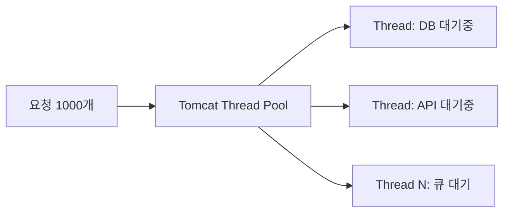
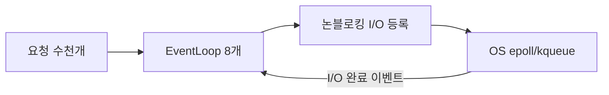
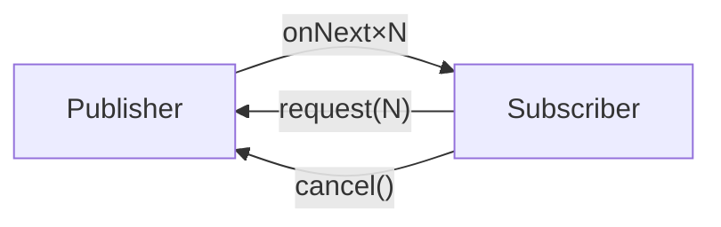
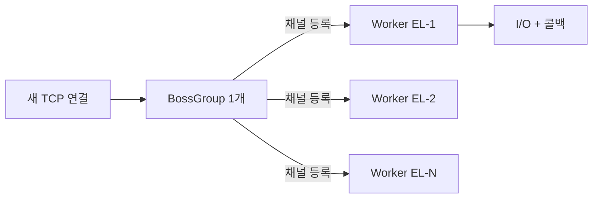
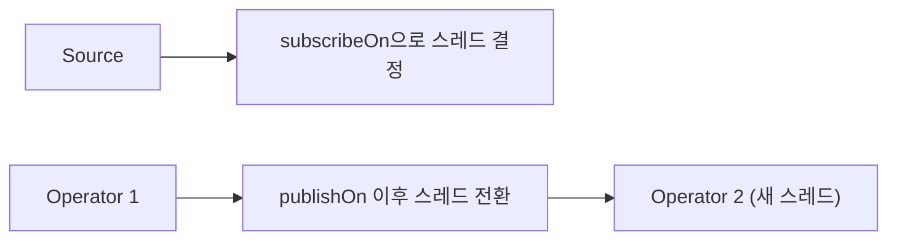
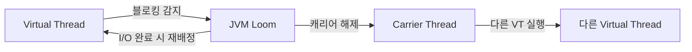

Tomcat 스레드 200개가 모두 외부 API 응답을 기다리며 블로킹되어 있다. 새 요청은 큐에서 대기하다 타임아웃이 터진다. 서버를 두 배 늘려도 스레드 수가 두 배가 될 뿐, 근본 구조는 바뀌지 않는다. 이 상황의 진짜 원인은 "스레드 하나가 요청 하나를 끝까지 점유하는" 설계다. WebFlux는 이 설계 자체를 바꾼다.

> **비유 — 1인 카페 바리스타**: 아메리카노를 주문받으면 에스프레소가 내려지는 동안 멍하니 기다리지 않고, 다음 손님 주문을 받는다. 커피가 완성되면 그때 가져다준다. 바리스타(스레드) 한 명이 수십 개의 요청을 처리하는 원리다. 핵심은 "기다리는 동안 손을 놓지 않는 것"이다.

이 글은 WebFlux의 표면(API)이 아니라 내부 메커니즘을 파고든다. Reactive Streams 프로토콜, Netty 이벤트 루프, 스케줄러 선택의 이유, 연산자 내부 구독 흐름, R2DBC가 JDBC를 대체해야 하는 이유, ThreadLocal이 동작하지 않는 이유까지 — WHY를 중심으로 정리한다.

---

## 1. 왜 WebFlux인가 — 블로킹 모델의 구조적 한계

### Thread-per-Request의 물리적 상한

전통적인 Tomcat 기반 Spring MVC는 요청 하나마다 스레드 하나를 할당한다. 그 스레드는 응답을 완성할 때까지 돌아오지 않는다. DB 쿼리가 50ms 걸리면, 스레드는 50ms 동안 OS 스케줄러 큐에서 잠든다. CPU를 쓰지 않는데도 메모리(기본 512KB~1MB 스택)는 점유한다.

```
동시 요청 1,000개 × 스레드 1개 = 스레드 1,000개
스레드 1,000개 × 512KB = 512MB (스택만)
```

OS 커널의 컨텍스트 스위칭 비용도 무시할 수 없다. 스레드가 잠들었다 깨어날 때마다 CPU 레지스터 저장/복원, TLB 플러시, 캐시 오염이 발생한다. 스레드가 수천 개로 늘어나면 이 비용이 실제 작업 비용을 초과한다.



### 이벤트 루프 — 스레드 수와 동시성을 분리하다

WebFlux(Netty)는 스레드 수 = CPU 코어 수라는 원칙을 쓴다. 8코어 서버라면 이벤트 루프 스레드가 8개다. 이 8개 스레드가 수만 개의 동시 연결을 처리한다.

가능한 이유는 I/O 완료를 운영체제가 통보하기 때문이다. Linux의 `epoll`, macOS의 `kqueue`, Windows의 `IOCP`는 모두 "어떤 파일 디스크립터에 I/O가 준비됐는지"를 커널이 이벤트로 알려주는 메커니즘이다. 스레드는 I/O를 등록해두고 즉시 다음 작업으로 넘어간다. I/O가 완료되면 커널이 깨워준다.



**결론**: Tomcat은 "요청마다 스레드"로 동시성을 표현하고, Netty는 "I/O 이벤트 콜백"으로 동시성을 표현한다. 후자에서 스레드는 절대 잠들지 않는다.

---

## 2. Reactive Streams 스펙 — 배압 프로토콜의 WHY

### 4개 인터페이스의 의미

Reactive Streams는 Java 9의 `java.util.concurrent.Flow`로 표준화된 스펙이다. 핵심은 **Subscriber가 자신이 소화할 수 있는 만큼만 Publisher에게 요청한다**는 배압(Backpressure) 프로토콜이다.

```java
// Publisher: 데이터를 생산하는 쪽 — subscribe()만 노출한다
public interface Publisher<T> {
    void subscribe(Subscriber<? super T> subscriber);
}

// Subscriber: 데이터를 소비하는 쪽
public interface Subscriber<T> {
    void onSubscribe(Subscription s);  // 구독 성립 시 호출 — 여기서 request(n)을 처음 해야 시작
    void onNext(T t);                  // 데이터 수신
    void onError(Throwable t);         // 에러 — 이후 onNext/onComplete 불가
    void onComplete();                 // 정상 종료
}

// Subscription: Publisher↔Subscriber 간의 단방향 계약
public interface Subscription {
    void request(long n);  // "n개 더 줘" — 배압의 핵심
    void cancel();         // 구독 취소 — Publisher는 즉시 중단해야 함
}

// Processor: Publisher이자 Subscriber — 중간 변환기 역할
public interface Processor<T, R> extends Subscriber<T>, Publisher<R> {}
```

### 배압이 없으면 어떻게 되는가

카프카에서 초당 100만 건을 읽는 Publisher와, 초당 1천 건을 처리하는 Subscriber가 있다. 배압이 없으면 두 가지 중 하나다.

1. Publisher가 데이터를 계속 밀어넣는다 → Subscriber 앞에 버퍼가 쌓인다 → 힙 폭발 → OOM
2. Publisher가 속도를 줄인다 → 다른 Subscriber에게 미치는 영향

배압 프로토콜에서 Subscriber는 `request(1000)`을 호출해 "1,000개까지만 줘"라고 선언한다. Publisher는 1,000개를 다 보낸 뒤 추가 `request()`가 올 때까지 멈춘다.



### 구독 수립 프로토콜 순서 (Reactive Streams Rule §1.9)

```
1. Publisher.subscribe(subscriber) 호출
2. Publisher → subscriber.onSubscribe(subscription) 호출
3. Subscriber → subscription.request(n) 호출 (이 시점에 데이터 흐름 시작)
4. Publisher → subscriber.onNext(item) × n 호출
5. Publisher → subscriber.onComplete() 또는 subscriber.onError(t)
```

`request()`를 호출하기 전까지 Publisher는 데이터를 보내지 않는다. 이것이 **Cold Publisher**가 구독 전까지 실행되지 않는 이유다.

---

## 3. Project Reactor — Mono, Flux, Cold/Hot Publisher

### Mono vs Flux — 타입이 다른 이유

`Mono<T>`는 0~1개, `Flux<T>`는 0~N개를 방출한다. 이 구분은 단순한 편의가 아니라 컴파일 타임 의미 표현이다. `Mono<User>`는 "결과가 없거나 하나"라는 계약을 타입으로 강제한다. `findById`가 `Flux<User>`를 반환하면 "여러 개일 수도 있다"는 잘못된 신호를 준다.

```java
// Mono 생성 팩토리들
Mono<String> m1 = Mono.just("hello");                         // 즉시 값
Mono<String> m2 = Mono.empty();                               // 값 없음(onComplete만)
Mono<String> m3 = Mono.error(new RuntimeException("실패"));   // 에러
Mono<String> m4 = Mono.fromSupplier(() -> computeValue());    // 구독 시점에 실행
Mono<String> m5 = Mono.fromCallable(() -> blockingCall());    // Callable, boundedElastic 권장
Mono<String> m6 = Mono.defer(() -> Mono.just(dynamicValue())); // 구독마다 새 Publisher 생성

// Flux 생성 팩토리들
Flux<Integer> f1 = Flux.just(1, 2, 3, 4, 5);
Flux<Integer> f2 = Flux.range(1, 100);                        // 1~100
Flux<Long>    f3 = Flux.interval(Duration.ofSeconds(1));      // 1초마다, Hot
Flux<String>  f4 = Flux.fromIterable(List.of("a", "b", "c"));
Flux<String>  f5 = Flux.generate(sink -> sink.next(UUID.randomUUID().toString())); // 무한
```

### Assembly Time vs Subscription Time — 핵심 개념

Reactor 체인은 **두 단계**로 실행된다.

**Assembly Time**: `.map()`, `.flatMap()`, `.filter()` 등을 호출하는 시점. 아무것도 실행되지 않는다. Operator들이 연결된 파이프라인 구조(Publisher 객체 그래프)만 만들어진다.

**Subscription Time**: `.subscribe()`가 호출되는 시점. 구독 신호가 소스까지 역방향으로 전파되고, 소스가 데이터를 방출하기 시작한다.

```java
// Assembly: 이 코드는 아무것도 실행하지 않는다
Flux<String> pipeline = Flux.range(1, 1000)
    .filter(n -> n % 2 == 0)
    .map(n -> "item-" + n)
    .take(10);

// Subscription: 여기서 실제 실행
pipeline.subscribe(System.out::println);
// 1,2,3,...을 생성하다가 짝수 10개(2,4,6..20)를 얻으면 cancel() 신호로 중단
```

이 설계의 이점: 파이프라인을 재사용할 수 있고, 구독 전에 operator를 조립할 수 있다. 하지만 함정도 있다: `subscribe()`를 빠뜨리면 아무것도 실행되지 않고 경고도 없다.

### Cold Publisher vs Hot Publisher

**Cold Publisher**: 각 Subscriber마다 독립적인 실행 흐름을 가진다. 구독할 때마다 처음부터 재실행된다. `Flux.range()`, `Flux.fromIterable()`, HTTP 요청 기반 Publisher가 Cold다.

```java
Flux<Integer> cold = Flux.range(1, 3);

// 두 번 구독하면 두 번 실행된다 — DB 쿼리라면 쿼리가 두 번 나간다
cold.subscribe(i -> System.out.println("Sub1: " + i));
// Sub1:1, Sub1:2, Sub1:3
cold.subscribe(i -> System.out.println("Sub2: " + i));
// Sub2:1, Sub2:2, Sub2:3  ← 처음부터 다시 실행
```

**왜 Cold가 기본인가**: 함수형 순수성 때문이다. 같은 파이프라인을 여러 구독자가 공유하면 서로 영향을 미친다. Cold는 각 구독자에게 독립적인 실행을 보장한다.

**Hot Publisher**: Subscriber와 무관하게 데이터를 방출한다. 늦게 구독하면 이전 데이터는 놓친다. 실시간 이벤트 스트림, 웹소켓, 타이머가 Hot이다.

```java
// Flux.interval은 Hot — 구독 시점 이전 데이터는 없음
Flux<Long> hotFlux = Flux.interval(Duration.ofSeconds(1))
    .publish()       // ConnectableFlux로 변환 (Cold → Hot 다리)
    .autoConnect();  // 첫 Subscriber가 구독하면 업스트림 시작

hotFlux.subscribe(i -> System.out.println("Sub1: " + i));

Thread.sleep(2500); // 0, 1 방출됨

// Sub2는 0, 1을 놓친다
hotFlux.subscribe(i -> System.out.println("Sub2: " + i));
// 이후부터: Sub1: 2, Sub2: 2, Sub1: 3, Sub2: 3 ...

// cache() — Cold를 Hot으로 바꾸되, 이전 값을 재방출
Mono<User> cachedUser = userRepository.findById(1L).cache();
// 첫 구독: DB 쿼리 실행
// 이후 구독: 캐시된 결과 반환 (DB 쿼리 없음)
```

---

## 4. Netty 이벤트 루프 모델 — 왜 CPU 코어 수 스레드가 충분한가

### Boss/Worker 구조

Netty는 두 종류의 `EventLoopGroup`을 사용한다.

- **Boss Group**: 새 TCP 연결 수락만 담당. 보통 1개 스레드로 충분.
- **Worker Group**: 수락된 연결의 I/O 처리 담당. CPU 코어 × 2개 스레드.

```java
// Netty 서버 직접 구성 예시 (WebFlux는 내부에서 이렇게 동작)
EventLoopGroup bossGroup = new NioEventLoopGroup(1);
EventLoopGroup workerGroup = new NioEventLoopGroup(); // 기본: CPU 코어 × 2

ServerBootstrap bootstrap = new ServerBootstrap()
    .group(bossGroup, workerGroup)
    .channel(NioServerSocketChannel.class)
    .childHandler(new ChannelInitializer<SocketChannel>() {
        @Override
        protected void initChannel(SocketChannel ch) {
            ch.pipeline().addLast(new HttpServerCodec());
            ch.pipeline().addLast(new HttpObjectAggregator(65536));
            ch.pipeline().addLast(new MyHandler());
        }
    });
```



### 왜 소수 스레드로 수만 연결을 처리하는가

각 Worker EventLoop는 `Selector`(NIO) 또는 `epoll`(Epoll Transport)을 통해 자신이 담당하는 수천 개 채널의 이벤트를 감시한다. 루프 1회 반복에서 "지금 읽기 가능한 채널"을 모두 처리하고, 다시 이벤트를 기다린다.

```
EventLoop 의사 코드:
while (running) {
    List<SelectionKey> readyKeys = selector.select(); // 블로킹, 이벤트 올 때까지
    for (SelectionKey key : readyKeys) {
        if (key.isReadable())  handleRead(key.channel());
        if (key.isWritable()) handleWrite(key.channel());
    }
    runAllPendingTasks(); // 예약된 작업 실행
}
```

이 구조에서 스레드는 절대 I/O를 기다리며 잠들지 않는다. "지금 처리할 수 있는 것만" 처리하고 다음으로 넘어간다. 따라서 스레드 수가 작아도 많은 연결을 처리할 수 있다.

**치명적인 규칙**: EventLoop 스레드에서 블로킹 연산을 실행하면 그 EventLoop가 담당하는 모든 연결이 함께 멈춘다. 스레드 1개가 수천 연결을 담당하기 때문에 피해가 MVC보다 훨씬 크다.

```java
// 절대 금지 — EventLoop 스레드에서 블로킹
@GetMapping("/user/{id}")
public Mono<User> getUser(@PathVariable Long id) {
    // 이 시점 스레드 = EventLoop 스레드
    User user = jdbcTemplate.queryForObject("SELECT ...", User.class, id); // 블로킹!
    // 이 스레드가 담당하는 모든 연결이 멈춤
    return Mono.just(user);
}

// 올바른 격리
@GetMapping("/user/{id}")
public Mono<User> getUser(@PathVariable Long id) {
    return Mono.fromCallable(() ->
            jdbcTemplate.queryForObject("SELECT ...", User.class, id)
        )
        .subscribeOn(Schedulers.boundedElastic()); // 별도 스레드풀로 오프로드
}
```

### Tomcat vs Netty 처리 모델 직접 비교

| 구분 | Tomcat (MVC) | Netty (WebFlux) |
|------|-------------|-----------------|
| 스레드 수 | 요청 수만큼 (기본 200) | CPU 코어 × 2 |
| I/O 대기 | 스레드가 직접 대기 | OS epoll 감시, 완료 시 콜백 |
| 블로킹 코드 | 스레드 1개만 영향 | EventLoop 담당 전체 연결 영향 |
| 메모리 (1K 요청) | ~500MB (스택) | ~30MB |
| 컨텍스트 스위칭 | 빈번 | 거의 없음 |
| 디버깅 | 스택 트레이스 명확 | 리액티브 체인 추적 어려움 |

---

## 5. Scheduler — 어느 스레드에서 실행할 것인가

### Scheduler 종류와 선택 근거

```java
// 1. Schedulers.parallel()
// 내부: ForkJoinPool과 유사한 고정 크기 스레드풀 (CPU 코어 수)
// 용도: CPU 집약 연산 (암호화, 이미지 처리, 수학 계산)
// 금지: 블로킹 I/O — 스레드가 고갈되면 전체 리액티브 체인이 멈춤
Flux.range(1, 1000)
    .parallel()
    .runOn(Schedulers.parallel())
    .map(n -> heavyComputation(n)) // 순수 CPU 연산
    .sequential()
    .subscribe();

// 2. Schedulers.boundedElastic()
// 내부: 동적 스레드풀 (최대 10 × CPU 코어, 큐 100,000, idle 60초 후 종료)
// 용도: 레거시 블로킹 코드 격리, JDBC, 동기 파일 I/O
// 이름의 "bounded": 무한 스레드 생성을 막아 OOM 방지
Mono.fromCallable(() -> legacyJdbcRepository.findById(id))
    .subscribeOn(Schedulers.boundedElastic());

// 3. Schedulers.single()
// 내부: 단일 백그라운드 스레드 (재사용)
// 용도: 순서가 보장되어야 하는 단일 스레드 작업
Flux.range(1, 5)
    .publishOn(Schedulers.single())
    .subscribe(i -> System.out.println(
        Thread.currentThread().getName() + ": " + i
    ));
// 모두 같은 스레드명 출력

// 4. Schedulers.immediate()
// 현재 스레드에서 실행 (스케줄러 변경 없음)
// 테스트에서 스케줄러를 교체할 때 유용

// 5. Schedulers.fromExecutorService(executor)
// 기존 ExecutorService를 Reactor Scheduler로 래핑
ExecutorService myPool = Executors.newFixedThreadPool(20);
Scheduler myScheduler = Schedulers.fromExecutorService(myPool);
```

### publishOn vs subscribeOn — 가장 혼동하기 쉬운 개념

```java
// subscribeOn: 구독 신호(업스트림 방향)가 전달되는 스레드를 바꾼다
// 소스 Publisher가 어느 스레드에서 실행되는지 결정
// 체인 어디에 놓아도 소스에 영향 (체인 맨 위로 올라감)
Mono.fromCallable(() -> blockingDbCall()) // 소스
    .map(data -> transform(data))
    .subscribeOn(Schedulers.boundedElastic()) // 소스부터 boundedElastic에서 실행
    .subscribe();

// publishOn: 이 연산자 이후의 다운스트림을 지정 스케줄러로 이동
// 여러 번 사용해 중간에 스레드를 전환할 수 있다
Flux.range(1, 10)                          // EventLoop 스레드
    .map(n -> n * 2)                        // EventLoop 스레드
    .publishOn(Schedulers.parallel())       // 여기서 스레드 전환
    .map(n -> heavyCompute(n))              // parallel 스레드
    .publishOn(Schedulers.boundedElastic()) // 다시 전환
    .map(n -> writeToFile(n))              // boundedElastic 스레드
    .subscribe();
```



**실무 패턴**: `subscribeOn`은 블로킹 소스를 격리할 때, `publishOn`은 무거운 연산 구간을 다른 스레드로 이동할 때 쓴다.

---

## 6. 핵심 연산자 내부 동작

### map vs flatMap — 동시성의 차이

```java
// map: 동기 변환, 1:1, 새 Publisher 없음
// 내부: onNext(item) → transform(item) → 다운스트림 onNext(result)
Flux.just("a", "b", "c")
    .map(s -> s.toUpperCase())    // 동기 변환, 직렬
    .subscribe(System.out::println);

// flatMap: 각 item을 Publisher로 변환하고 결과를 병합
// 내부: onNext(item) → innerPublisher = mapper(item) → innerPublisher.subscribe()
//       내부 Publisher들이 동시에 실행되어 먼저 완성되는 순서로 방출
// 기본 동시성: 256개의 내부 Publisher 동시 구독
Flux.just("user1", "user2", "user3")
    .flatMap(userId -> fetchUserFromDB(userId)) // 3개 동시 DB 쿼리
    .subscribe(System.out::println); // 완료 순서 불보장

// 동시성 제한
Flux.range(1, 100)
    .flatMap(i -> externalApiCall(i), 5) // 동시 최대 5개
    .subscribe();

// concatMap: flatMap과 같지만 순서 보장 (직렬)
// 내부: 하나의 내부 Publisher가 완료되어야 다음 시작
// 순서가 중요할 때 사용 (파일 처리, 의존 순서 있는 API 호출)
Flux.just("user1", "user2", "user3")
    .concatMap(userId -> fetchUserFromDB(userId)) // 직렬, user1 완료 후 user2 시작
    .subscribe(System.out::println); // 입력 순서 보장
```

**flatMap vs concatMap 선택 기준**:
- 순서가 상관없고 빠른 응답이 중요하면 `flatMap`
- 처리 순서가 비즈니스 로직에 영향을 미치면 `concatMap`
- 외부 API rate limit이 있으면 `flatMap(mapper, concurrency)` 로 동시성 제한

### switchIfEmpty — 구독 흐름 이해

```java
// switchIfEmpty는 업스트림이 onComplete를 보내기 전까지 대기한다
// onNext가 하나도 없이 onComplete가 오면 대체 Publisher로 전환
Mono<User> result = userRepository.findById(id)  // DB 조회
    .switchIfEmpty(
        // 이 Mono는 업스트림이 비어있을 때만 구독된다
        Mono.error(new UserNotFoundException("User not found: " + id))
    );

// 주의: switchIfEmpty 안의 코드는 항상 평가되지만,
// subscribe는 필요할 때만 된다
// defer()로 늦은 평가 적용
userRepository.findById(id)
    .switchIfEmpty(Mono.defer(() ->
        externalService.fetchUser(id) // 실제 필요할 때만 실행
    ));
```

### zip, merge, concat 구독 흐름

```java
// zip: 모든 Publisher가 각각 onNext를 방출해야 결합
// 가장 느린 Publisher 속도에 맞춰진다
// 하나라도 onError/onComplete(빈)면 즉시 onError/onComplete
Mono<String> name  = fetchName(id);    // 100ms
Mono<Integer> age  = fetchAge(id);     // 200ms
Mono<String> email = fetchEmail(id);   // 150ms

// 세 개를 동시에 구독, 가장 늦은 200ms 후 결합
Mono.zip(name, age, email)
    .map(t -> new UserDto(t.getT1(), t.getT2(), t.getT3()))
    .subscribe(System.out::println);

// merge: 여러 Publisher를 동시에 구독, 도착 순서대로 방출
// 순서 보장 없음
Flux<String> stream1 = fetchStream("A").delayElements(Duration.ofMillis(100));
Flux<String> stream2 = fetchStream("B").delayElements(Duration.ofMillis(150));

Flux.merge(stream1, stream2)
    .subscribe(System.out::println); // A1, B1, A2, B2, A3, ... (타이밍 혼합)

// concat: 순차 구독 — 앞 Publisher가 완료되어야 다음 구독
// 앞이 느리면 뒤는 그냥 기다린다
Flux.concat(stream1, stream2)
    .subscribe(System.out::println); // A1, A2, A3, ... (A 모두), B1, B2, ...
```

---

## 7. WebClient — 내부 구조와 올바른 설정

### ConnectionProvider — 커넥션 풀 이해

WebClient는 내부적으로 Reactor Netty의 `HttpClient`를 사용한다. HTTP/1.1이면 커넥션 풀을 사용하고, HTTP/2이면 다중화(Multiplexing)를 사용한다.

```java
// 커넥션 풀 직접 설정
ConnectionProvider provider = ConnectionProvider.builder("my-pool")
    .maxConnections(100)          // 최대 연결 수
    .pendingAcquireMaxCount(200)  // 연결 대기 큐 최대 크기
    .pendingAcquireTimeout(Duration.ofSeconds(5)) // 대기 타임아웃
    .maxIdleTime(Duration.ofSeconds(60))          // 유휴 연결 유지 시간
    .maxLifeTime(Duration.ofMinutes(10))          // 연결 최대 수명
    .evictInBackground(Duration.ofSeconds(30))    // 백그라운드 정리 주기
    .build();

HttpClient httpClient = HttpClient.create(provider)
    .option(ChannelOption.CONNECT_TIMEOUT_MILLIS, 3000)  // TCP 연결 타임아웃
    .responseTimeout(Duration.ofSeconds(10))              // 응답 타임아웃 (헤더 수신까지)
    .doOnConnected(conn ->
        conn.addHandlerLast(new ReadTimeoutHandler(10, TimeUnit.SECONDS))
           .addHandlerLast(new WriteTimeoutHandler(5, TimeUnit.SECONDS))
    );

WebClient webClient = WebClient.builder()
    .baseUrl("https://api.example.com")
    .clientConnector(new ReactorClientHttpConnector(httpClient))
    .defaultHeader(HttpHeaders.CONTENT_TYPE, MediaType.APPLICATION_JSON_VALUE)
    .defaultHeader(HttpHeaders.ACCEPT, MediaType.APPLICATION_JSON_VALUE)
    .codecs(configurer -> configurer
        .defaultCodecs()
        .maxInMemorySize(2 * 1024 * 1024)) // 응답 버퍼 2MB
    .build();
```

### connectTimeout vs responseTimeout vs readTimeout — 세 개의 차이

```
connectTimeout: TCP 3-way handshake 완료까지 기다리는 시간
                설정 위치: ChannelOption.CONNECT_TIMEOUT_MILLIS
                초과 시: ConnectTimeoutException

responseTimeout: 요청 전송 완료 후 응답 첫 바이트(HTTP 상태코드+헤더)가 올 때까지
                 설정 위치: HttpClient.responseTimeout()
                 초과 시: ReadTimeoutException

readTimeout:    마지막 데이터 수신 후 다음 데이터가 올 때까지 기다리는 시간
                설정 위치: ReadTimeoutHandler
                스트리밍 응답의 중간 침묵 감지에 사용
```

### retry with backoff — 지수 백오프 설계

```java
@Service
public class ResilientApiClient {

    private final WebClient webClient;

    public Mono<OrderDto> fetchOrder(String orderId) {
        return webClient.get()
            .uri("/orders/{id}", orderId)
            .retrieve()
            .onStatus(HttpStatusCode::is4xxClientError, response -> {
                // 클라이언트 에러는 재시도 의미 없음
                return response.bodyToMono(ErrorBody.class)
                    .flatMap(err -> Mono.error(
                        new ClientException(response.statusCode(), err.message())
                    ));
            })
            .onStatus(HttpStatusCode::is5xxServerError, response ->
                // 서버 에러는 재시도 가능
                Mono.error(new ServerException("Server error: " + response.statusCode()))
            )
            .bodyToMono(OrderDto.class)
            .timeout(Duration.ofSeconds(5))
            .retryWhen(
                Retry.backoff(3, Duration.ofMillis(500)) // 초기 대기 500ms
                    .maxBackoff(Duration.ofSeconds(10))   // 최대 10초 대기
                    .jitter(0.5)                          // 재시도 분산 (0~50% 랜덤)
                    .filter(ex -> ex instanceof ServerException) // 서버 에러만 재시도
                    .doBeforeRetry(signal ->
                        log.warn("Retry #{} after: {}",
                            signal.totalRetries(), signal.failure().getMessage())
                    )
                    .onRetryExhaustedThrow((spec, signal) ->
                        new ServiceUnavailableException("API unavailable after retries")
                    )
            )
            .onErrorResume(ClientException.class, ex ->
                Mono.error(new BusinessException(ex.getMessage()))
            )
            .onErrorResume(ServiceUnavailableException.class, ex ->
                fetchOrderFromCache(orderId) // 최종 폴백: 캐시
            );
    }

    // 병렬 요청 — zip으로 동시 호출
    public Mono<UserProfile> fetchUserProfile(Long userId) {
        Mono<UserDto> user     = fetchUser(userId)
            .onErrorReturn(UserDto.empty());       // 에러 시 빈 객체
        Mono<List<OrderDto>> orders = fetchOrders(userId)
            .onErrorReturn(Collections.emptyList());
        Mono<AddressDto> address = fetchAddress(userId)
            .onErrorReturn(AddressDto.empty());

        return Mono.zip(user, orders, address)
            .map(t -> UserProfile.of(t.getT1(), t.getT2(), t.getT3()));
    }
}
```

---

## 8. 에러 처리 — 체크 예외가 동작하지 않는 이유

### 리액티브에서 체크 예외가 안 되는 이유

Java 체크 예외는 호출 스택(Call Stack)에 존재한다. 리액티브 체인은 콜백 기반이라 논리적 호출 스택이 없다. `onNext(item)`를 호출하는 스레드와 실제 처리 스레드가 다를 수 있고, 체크 예외를 선언할 인터페이스(`Subscriber.onNext`)는 이미 체크 예외를 허용하지 않는다.

```java
// 컴파일 에러: Subscriber.onNext는 체크 예외를 던질 수 없다
Flux.just("a", "b")
    .map(s -> {
        throw new IOException("체크 예외"); // 컴파일 에러
        return s;
    });

// 래핑해서 런타임으로 변환
Flux.just("a", "b")
    .map(s -> {
        try {
            return riskyOperation(s);
        } catch (IOException e) {
            throw new RuntimeException(e); // 또는 Exceptions.propagate(e)
        }
    });

// Reactor 유틸리티 사용
Flux.just("a", "b")
    .map(Exceptions.wrap(s -> riskyOperation(s))); // CheckedFunction으로 자동 래핑
```

### onErrorResume vs onErrorReturn vs onErrorMap

```java
// onErrorReturn: 에러 발생 시 고정값으로 대체 후 onComplete
// 에러가 발생해도 스트림은 정상 종료
Mono<User> result = userRepository.findById(id)
    .onErrorReturn(DatabaseException.class, User.anonymous()); // DB 에러 → 익명 유저

// onErrorResume: 에러 발생 시 다른 Publisher로 전환
// 가장 유연한 에러 처리
Mono<User> result2 = userRepository.findById(id)
    .onErrorResume(NotFoundException.class, ex ->
        externalUserService.fetchUser(id) // 폴백 Publisher
    )
    .onErrorResume(ex -> {
        log.error("Unexpected error fetching user {}", id, ex);
        return Mono.error(new ServiceException("User fetch failed", ex));
    });

// onErrorMap: 에러 타입만 변환 (에러는 유지)
// 레이어 간 예외 변환에 사용
Mono<User> result3 = userRepository.findById(id)
    .onErrorMap(R2dbcException.class, ex ->
        new DatabaseException("DB error: " + ex.getMessage(), ex)
    )
    .onErrorMap(TimeoutException.class, ex ->
        new ServiceTimeoutException("DB timeout", ex)
    );

// doOnError: 에러를 처리하지 않고 사이드 이펙트만 (로깅 등)
Mono<User> result4 = userRepository.findById(id)
    .doOnError(ex -> log.error("Error fetching user {}: {}", id, ex.getMessage()))
    .onErrorResume(ex -> Mono.error(new ServiceException("User not found", ex)));
```

### 에러 연산자 처리 순서

```java
// 에러는 체인 아래로 전파된다
// onError 연산자는 위에서 발생한 에러만 처리
Flux.just(1, 2, 0, 4)
    .map(n -> 10 / n) // n=0에서 ArithmeticException
    .onErrorReturn(-1) // ArithmeticException을 -1로 대체
    // 결과: 10, 5, -1 (스트림 종료 — onErrorReturn은 스트림을 완료시킴)
    .subscribe(System.out::println);

// 에러 후 계속하려면 flatMap + onErrorResume 조합
Flux.just(1, 2, 0, 4)
    .flatMap(n ->
        Mono.fromCallable(() -> 10 / n)
            .onErrorReturn(-1) // 개별 에러 처리 후 계속
    )
    .subscribe(System.out::println);
// 결과: 10, 5, -1, 2 (전체 스트림 지속)
```

---

## 9. R2DBC — JDBC가 블로킹인 근본 이유

### JDBC는 왜 블로킹인가

JDBC 드라이버는 `java.io.InputStream`/`OutputStream`과 TCP 소켓을 직접 사용한다. `ResultSet.next()`를 호출하면 내부적으로 소켓 읽기 시스템 콜이 발생하고, 데이터가 올 때까지 스레드가 블로킹된다. 이 API 설계는 Java 1.1(1997년)부터 변하지 않았다.

```
JDBC 내부:
Connection.prepareStatement() → TCP 소켓으로 쿼리 전송
ResultSet.next()              → TCP 소켓 read() 시스템 콜
                              → 커널이 데이터 수신까지 스레드 블로킹
                              → 데이터 수신 → 스레드 복귀
```

R2DBC는 이 흐름을 완전히 재설계했다. 쿼리 전송과 결과 수신을 비동기 이벤트로 처리한다.

```
R2DBC 내부:
Connection.createStatement()  → Netty Channel에 쿼리 등록 (즉시 반환)
Publisher.subscribe()         → 구독 신호로 쿼리 전송
                              → EventLoop가 응답 감시
                              → 응답 도착 → onNext() 콜백 실행
```

### Spring Data R2DBC 전체 구성

```xml
<dependency>
    <groupId>org.springframework.boot</groupId>
    <artifactId>spring-boot-starter-data-r2dbc</artifactId>
</dependency>
<dependency>
    <groupId>org.postgresql</groupId>
    <artifactId>r2dbc-postgresql</artifactId>
</dependency>
```

```yaml
spring:
  r2dbc:
    url: r2dbc:postgresql://localhost:5432/mydb
    username: appuser
    password: secret
    pool:
      initial-size: 5
      max-size: 20
      max-idle-time: 30m
      max-acquire-time: 5s       # 커넥션 대기 최대 시간
      validation-query: SELECT 1
```

```java
// Entity — JPA @Entity 아님, R2DBC @Table 사용
@Table("orders")
public class Order {
    @Id
    private Long id;
    private Long userId;
    private String status;
    private BigDecimal amount;
    @Column("created_at")
    private LocalDateTime createdAt;

    // R2DBC는 즉시 로딩만 지원 — @OneToMany 없음
    // 연관 데이터는 별도 쿼리 + zip으로 조합
}

// Repository — ReactiveCrudRepository 상속
public interface OrderRepository extends ReactiveCrudRepository<Order, Long> {

    Flux<Order> findByUserId(Long userId);

    @Query("SELECT * FROM orders WHERE status = :status AND amount >= :minAmount")
    Flux<Order> findByStatusAndMinAmount(String status, BigDecimal minAmount);

    @Query("SELECT COUNT(*) FROM orders WHERE user_id = :userId")
    Mono<Long> countByUserId(Long userId);

    // 페이지네이션
    Flux<Order> findByUserId(Long userId, Pageable pageable);
}

// Service — 트랜잭션 포함
@Service
@Transactional // R2DBC 트랜잭션 지원
public class OrderService {

    private final OrderRepository orderRepository;
    private final UserRepository userRepository;
    private final R2dbcEntityTemplate template;

    // 유저와 주문을 zip으로 동시 조회
    public Mono<OrderWithUser> getOrderWithUser(Long orderId) {
        Mono<Order> order = orderRepository.findById(orderId)
            .switchIfEmpty(Mono.error(new OrderNotFoundException(orderId)));

        return order.flatMap(o ->
            Mono.zip(
                Mono.just(o),
                userRepository.findById(o.getUserId())
                    .switchIfEmpty(Mono.error(new UserNotFoundException(o.getUserId())))
            ).map(t -> OrderWithUser.of(t.getT1(), t.getT2()))
        );
    }

    // 복잡한 쿼리 — R2dbcEntityTemplate
    public Flux<Order> searchOrders(OrderSearchRequest req) {
        Criteria criteria = Criteria.empty();
        if (req.getStatus() != null) {
            criteria = criteria.and("status").is(req.getStatus());
        }
        if (req.getMinAmount() != null) {
            criteria = criteria.and("amount").greaterThanOrEquals(req.getMinAmount());
        }

        Query query = Query.query(criteria)
            .sort(Sort.by(Sort.Direction.DESC, "created_at"))
            .limit(req.getSize())
            .offset((long) req.getPage() * req.getSize());

        return template.select(Order.class)
            .matching(query)
            .all();
    }

    // 트랜잭션: 주문 생성 + 재고 감소 원자적 처리
    @Transactional
    public Mono<Order> createOrder(CreateOrderRequest req) {
        return inventoryRepository.findById(req.getProductId())
            .switchIfEmpty(Mono.error(new ProductNotFoundException(req.getProductId())))
            .flatMap(inventory -> {
                if (inventory.getStock() < req.getQuantity()) {
                    return Mono.error(new InsufficientStockException());
                }
                inventory.setStock(inventory.getStock() - req.getQuantity());
                return inventoryRepository.save(inventory);
            })
            .flatMap(saved -> {
                Order order = Order.create(req);
                return orderRepository.save(order);
            });
    }
}
```

### R2DBC 커넥션 풀 주의사항

```java
// R2DBC 풀 고갈 패턴 — 잘못된 코드
Flux.fromIterable(orderIds) // 10,000개
    .flatMap(id -> orderRepository.findById(id)) // 기본 동시성 256
    // 최대 256개 동시 DB 커넥션 시도, 풀 max-size=20이면 236개가 큐 대기
    // max-acquire-time 초과 → R2dbcTimeoutException
    .subscribe();

// 올바른 코드 — 동시성을 풀 크기에 맞춤
Flux.fromIterable(orderIds)
    .flatMap(id -> orderRepository.findById(id), 10) // 최대 10개 동시
    .subscribe();
```

---

## 10. 배압 전략 — buffer, drop, latest, error

### 네 가지 전략과 선택 기준

배압 불일치가 발생했을 때(Publisher가 Subscriber보다 빠를 때) 어떻게 처리할지 결정한다.

```java
// 1. onBackpressureBuffer — 버퍼에 저장
// 장점: 데이터 손실 없음
// 단점: 버퍼 초과 시 OOM 또는 에러
// 적합: 일시적 속도 차이, 데이터 손실이 절대 안 되는 경우 (금융 거래)
Flux.range(1, 1_000_000)
    .onBackpressureBuffer(
        10_000,                          // 버퍼 최대 크기
        dropped -> log.warn("Dropped: {}", dropped), // 버퍼 초과 시 드롭 핸들러
        BufferOverflowStrategy.DROP_OLDEST  // DROP_OLDEST / DROP_LATEST / ERROR
    )
    .subscribe(item -> slowConsumer(item));

// 2. onBackpressureDrop — 처리 못하면 버림
// 장점: 메모리 안전
// 단점: 데이터 손실
// 적합: 실시간 센서 데이터, 최신성이 정확성보다 중요한 경우
Flux.interval(Duration.ofMillis(1)) // 초당 1000개
    .onBackpressureDrop(dropped ->
        log.debug("Dropped tick: {}", dropped) // 통계용 로깅
    )
    .subscribe(tick -> {
        Thread.sleep(100); // 초당 10개만 처리
    });

// 3. onBackpressureLatest — 최신 값만 유지
// 장점: 항상 최신 상태를 반영
// 단점: 중간 상태 손실
// 적합: 주가 틱, 위치 정보, UI 상태 업데이트
Flux.interval(Duration.ofMillis(10)) // 빠른 업데이트
    .map(i -> fetchLatestPrice())
    .onBackpressureLatest()           // 처리 안 된 것 중 최신만 보관
    .subscribe(price -> updateUI(price));

// 4. onBackpressureError — 초과 시 에러
// 장점: 문제를 즉시 드러냄
// 적합: 개발/테스트 환경, 배압 초과가 버그임을 명시할 때
Flux.range(1, 1_000_000)
    .onBackpressureError()            // 버퍼 초과 시 OverflowException
    .subscribe(
        item -> slowConsumer(item),
        error -> log.error("Backpressure overflow!", error)
    );
```

### limitRate — 소비 속도 제어

```java
// limitRate: 한 번에 요청하는 아이템 수를 제한
// 내부적으로 request(n)을 관리 — 75% 소진 시 추가 요청
Flux.range(1, 10_000)
    .limitRate(100)   // 100개씩 요청, 75개 소진 시 추가 100개 요청
    .subscribe(item -> processItem(item));

// limitRate(highTide, lowTide)
Flux.range(1, 10_000)
    .limitRate(100, 50) // 100개 요청, 50개 소진 시 추가 요청 (더 공격적 리필)
    .subscribe();
```

---

## 11. Reactor Context — ThreadLocal이 동작하지 않는 이유

### ThreadLocal의 전제: 스레드 = 요청

Spring MVC에서 `MDC.put("traceId", "abc")`가 동작하는 이유는 요청 시작부터 끝까지 같은 스레드를 사용하기 때문이다. ThreadLocal은 스레드에 바인딩된 맵이다.

```java
// MVC에서는 이게 동작한다
MDC.put("traceId", "abc-123");
log.info("Processing order"); // traceId=abc-123 포함
// 같은 스레드이므로 MDC가 유지됨
```

WebFlux에서는 `publishOn(Schedulers.parallel())`처럼 스레드가 바뀌는 순간 ThreadLocal이 사라진다. 더 심각한 것은: 스레드가 언제 바뀔지 코드만 봐서는 알 수 없다.

```java
// 이 코드에서 각 연산자는 서로 다른 스레드에서 실행될 수 있다
Mono.just("order-123")
    .flatMap(id -> orderRepository.findById(id)) // EventLoop 스레드
    .flatMap(order -> {
        // 이 시점 스레드가 무엇인지 보장할 수 없다
        String traceId = MDC.get("traceId"); // null일 가능성 있음
        return processOrder(order);
    });
```

### Reactor Context — 구독 흐름을 따라 전파

`Context`는 체인을 따라 흐르는 불변 맵이다. 스레드와 무관하게 구독 체인 전체에서 접근할 수 있다.

```java
// Context 쓰기 — contextWrite는 업스트림 방향 전파
// 주의: contextWrite는 다운스트림에서 업스트림 방향으로 읽힌다
Mono<Order> result = processOrder(orderId)
    .contextWrite(Context.of(
        "traceId", UUID.randomUUID().toString(),
        "userId", currentUserId
    ));

// Context 읽기 — deferContextual로 접근
public Mono<Order> processOrder(String orderId) {
    return Mono.deferContextual(ctx -> {
        String traceId = ctx.getOrDefault("traceId", "unknown");
        log.info("[{}] Processing order: {}", traceId, orderId);

        return orderRepository.findById(orderId)
            .flatMap(order -> enrichOrder(order, ctx));
    });
}

// MDC 전파 — Reactor Context + MDC 연동
public Mono<Void> processWithMdc(String orderId) {
    return Mono.deferContextual(ctx -> {
        String traceId = ctx.getOrDefault("traceId", "unknown");

        // 현재 스레드에 MDC 설정 후 처리
        MDC.put("traceId", traceId);
        try {
            return doProcess(orderId)
                .doFinally(signal -> MDC.remove("traceId")); // 정리
        } catch (Exception e) {
            MDC.remove("traceId");
            return Mono.error(e);
        }
    });
}
```

### Spring Security WebFlux — ReactiveSecurityContextHolder

```java
// MVC: SecurityContextHolder.getContext() → ThreadLocal 기반
// WebFlux: ReactiveSecurityContextHolder → Reactor Context 기반

public Mono<OrderDto> getMyOrder(String orderId) {
    return ReactiveSecurityContextHolder.getContext()
        .map(SecurityContext::getAuthentication)
        .map(auth -> (UserDetails) auth.getPrincipal())
        .flatMap(userDetails ->
            orderRepository.findByIdAndUserId(orderId, userDetails.getUsername())
                .switchIfEmpty(Mono.error(new AccessDeniedException("Not your order")))
        )
        .map(orderMapper::toDto);
}

// Security Context 자동 전파 (Spring Security WebFlux 내부)
// HTTP 요청 수신 → SecurityContext를 Reactor Context에 주입
// → 체인 전체에서 ReactiveSecurityContextHolder로 접근 가능
```

---

## 12. 테스트 — StepVerifier, PublisherProbe, TestPublisher

### 왜 전통적인 단언이 실패하는가

```java
// 이 테스트는 항상 통과한다 — 이유: 비동기 실행
@Test
void wrongTest() {
    List<Integer> results = new ArrayList<>();

    Flux.range(1, 5)
        .subscribe(results::add); // 비동기 구독 — 즉시 반환될 수도 있음

    // 여기서 results가 비어있을 수 있다
    assertThat(results).hasSize(5); // 운에 따라 통과/실패
}

// StepVerifier: 구독 흐름을 단계별로 검증
@Test
void correctTest() {
    StepVerifier.create(Flux.range(1, 5))
        .expectNext(1, 2, 3, 4, 5)
        .verifyComplete(); // 이 라인에서 블로킹 대기 후 검증
}
```

### StepVerifier 상세 사용법

```java
class ReactorTest {

    @Test
    void testUserService() {
        Mono<User> userMono = Mono.just(new User(1L, "김철수", "kim@test.com"));

        StepVerifier.create(userMono)
            .assertNext(user -> {
                assertThat(user.getId()).isEqualTo(1L);
                assertThat(user.getName()).isEqualTo("김철수");
            })
            .verifyComplete();
    }

    @Test
    void testErrorHandling() {
        Mono<User> errorMono = Mono.error(new UserNotFoundException(999L));

        StepVerifier.create(errorMono)
            .expectError(UserNotFoundException.class)
            .verify();
    }

    @Test
    void testFluxSequence() {
        Flux<Integer> flux = Flux.just(1, 2, 3)
            .concatWith(Flux.error(new RuntimeException("중단")))
            .onErrorReturn(-1);

        StepVerifier.create(flux)
            .expectNext(1, 2, 3, -1)
            .verifyComplete();
    }

    @Test
    void testWithVirtualTime() {
        // 실제 시간을 기다리지 않고 가상 시간으로 테스트
        StepVerifier.withVirtualTime(() ->
                Flux.interval(Duration.ofHours(1)).take(3)
            )
            .expectSubscription()
            .thenAwait(Duration.ofHours(1)) // 가상으로 1시간 이동
            .expectNext(0L)
            .thenAwait(Duration.ofHours(1))
            .expectNext(1L)
            .thenAwait(Duration.ofHours(1))
            .expectNext(2L)
            .verifyComplete();
        // 실제로는 밀리초 내 완료
    }

    @Test
    void testBackpressure() {
        // 배압 동작 검증 — request(n) 흐름 확인
        StepVerifier.create(Flux.range(1, 10), 3) // 초기 request(3)
            .expectNext(1, 2, 3)
            .thenRequest(2)              // 추가 request(2)
            .expectNext(4, 5)
            .thenCancel()               // 취소
            .verify();
    }
}
```

### PublisherProbe — 분기 구독 검증

```java
@Test
void testSwitchIfEmpty() {
    // switchIfEmpty의 대체 Publisher가 실제로 구독됐는지 검증
    PublisherProbe<String> probe = PublisherProbe.of(
        Mono.just("fallback-value")
    );

    Mono<String> result = Mono.<String>empty()
        .switchIfEmpty(probe.mono());

    StepVerifier.create(result)
        .expectNext("fallback-value")
        .verifyComplete();

    // 검증: probe가 구독됐는가
    probe.assertWasSubscribed();
    probe.assertWasRequested();
    probe.assertWasNotCancelled();
}

@Test
void testNonEmptyDoesNotTriggerFallback() {
    PublisherProbe<String> fallbackProbe = PublisherProbe.of(
        Mono.just("should-not-appear")
    );

    Mono<String> result = Mono.just("primary")
        .switchIfEmpty(fallbackProbe.mono());

    StepVerifier.create(result)
        .expectNext("primary")
        .verifyComplete();

    // 검증: probe가 구독되지 않았는가
    fallbackProbe.assertWasNotSubscribed();
}
```

### TestPublisher — 외부에서 신호를 직접 제어

```java
@Test
void testWithTestPublisher() {
    TestPublisher<String> testPublisher = TestPublisher.create();

    // 외부 Publisher를 소비하는 서비스 테스트
    List<String> received = new ArrayList<>();
    testPublisher.flux()
        .subscribe(received::add);

    // 외부에서 데이터 주입
    testPublisher.next("event-1");
    testPublisher.next("event-2");
    assertThat(received).containsExactly("event-1", "event-2");

    testPublisher.complete();

    // 에러 주입 테스트
    TestPublisher<String> errorPublisher = TestPublisher.create();

    StepVerifier.create(
            errorPublisher.flux()
                .onErrorReturn("recovered")
        )
        .then(() -> errorPublisher.error(new RuntimeException("test error")))
        .expectNext("recovered")
        .verifyComplete();
}
```

---

## 13. WebFlux 어노테이션 + 함수형 라우터

### 어노테이션 기반 컨트롤러

```java
@RestController
@RequestMapping("/api/orders")
@RequiredArgsConstructor
public class OrderController {

    private final OrderService orderService;

    @GetMapping("/{id}")
    public Mono<ResponseEntity<OrderDto>> getOrder(@PathVariable String id) {
        return orderService.findById(id)
            .map(ResponseEntity::ok)
            .switchIfEmpty(Mono.just(ResponseEntity.notFound().build()));
    }

    @GetMapping
    public Flux<OrderDto> getOrders(
            @RequestParam(required = false) String status,
            @RequestParam(defaultValue = "0") int page,
            @RequestParam(defaultValue = "20") int size) {
        return orderService.findAll(status, PageRequest.of(page, size));
    }

    @PostMapping
    @ResponseStatus(HttpStatus.CREATED)
    public Mono<OrderDto> createOrder(
            @RequestBody @Valid Mono<CreateOrderRequest> requestMono) {
        // Mono<Request>를 받으면 역직렬화와 검증이 리액티브하게 처리됨
        return requestMono.flatMap(orderService::create);
    }

    @GetMapping(value = "/stream", produces = MediaType.TEXT_EVENT_STREAM_VALUE)
    public Flux<ServerSentEvent<OrderDto>> streamOrders(@RequestParam String userId) {
        return orderService.streamUserOrders(userId)
            .map(order -> ServerSentEvent.<OrderDto>builder()
                .id(order.getId())
                .event("order-update")
                .data(order)
                .build())
            .doOnCancel(() -> log.info("SSE stream cancelled for user: {}", userId));
    }
}
```

### 함수형 라우터 — 테스트 친화적 구조

```java
// Handler — 비즈니스 로직 처리
@Component
@RequiredArgsConstructor
public class OrderHandler {

    private final OrderService orderService;
    private final Validator validator;

    public Mono<ServerResponse> getOrder(ServerRequest request) {
        String id = request.pathVariable("id");
        return orderService.findById(id)
            .flatMap(order -> ServerResponse.ok()
                .contentType(MediaType.APPLICATION_JSON)
                .bodyValue(order))
            .switchIfEmpty(ServerResponse.notFound().build());
    }

    public Mono<ServerResponse> createOrder(ServerRequest request) {
        return request.bodyToMono(CreateOrderRequest.class)
            .doOnNext(this::validate) // 동기 검증
            .flatMap(orderService::create)
            .flatMap(order -> ServerResponse
                .created(URI.create("/api/orders/" + order.getId()))
                .contentType(MediaType.APPLICATION_JSON)
                .bodyValue(order))
            .onErrorResume(ValidationException.class, ex ->
                ServerResponse.badRequest().bodyValue(ex.getErrors())
            );
    }

    private void validate(CreateOrderRequest req) {
        Set<ConstraintViolation<CreateOrderRequest>> violations = validator.validate(req);
        if (!violations.isEmpty()) {
            throw new ValidationException(violations);
        }
    }
}

// Router — URL 매핑 정의
@Configuration
@RequiredArgsConstructor
public class OrderRouter {

    @Bean
    public RouterFunction<ServerResponse> orderRoutes(OrderHandler handler) {
        return RouterFunctions
            .route()
            .GET("/api/orders/{id}", handler::getOrder)
            .GET("/api/orders", handler::getOrders)
            .POST("/api/orders",
                RequestPredicates.contentType(MediaType.APPLICATION_JSON),
                handler::createOrder)
            .PUT("/api/orders/{id}", handler::updateOrder)
            .DELETE("/api/orders/{id}", handler::deleteOrder)
            .filter((request, next) -> {
                // 요청 로깅 필터
                log.info("Request: {} {}", request.method(), request.path());
                return next.handle(request)
                    .doOnSuccess(response ->
                        log.info("Response: {}", response.statusCode())
                    );
            })
            .build();
    }
}
```

---

## 14. 극한 시나리오

### 시나리오 1: 이벤트 루프 블로킹 — 가장 치명적인 실수

8코어 서버에서 Worker EventLoop가 8개라고 하자. 한 엔드포인트에서 `Thread.sleep(10000)`을 호출하면 어떻게 되는가?

```java
// 이 코드는 해당 EventLoop가 담당하는 모든 요청을 10초간 멈춘다
@GetMapping("/broken")
public Mono<String> brokenEndpoint() {
    try {
        Thread.sleep(10000); // EventLoop 블로킹!
    } catch (InterruptedException e) {
        Thread.currentThread().interrupt();
    }
    return Mono.just("done");
}
```

8개 EventLoop 중 하나가 10초간 점유되면, 그 루프에 배정된 수천 개 연결이 10초간 응답하지 못한다. MVC에서는 스레드 하나만 영향받지만, WebFlux에서는 EventLoop가 담당하는 전체 연결이 영향을 받는다.

**방어: BlockHound 설치 (개발/테스트 환경)**

```java
// build.gradle
testImplementation 'io.projectreactor.tools:blockhound-junit-platform:1.0.8.RELEASE'

// 테스트 설정
@SpringBootTest
@EnableBlockHound // 또는 main()에서 BlockHound.install()
class ApplicationTest {
    @Test
    void contextLoads() {
        // 테스트 중 블로킹 감지 → BlockingOperationError 발생
    }
}

// main() 적용 (개발 환경)
@SpringBootApplication
public class Application {
    public static void main(String[] args) {
        if (isDevelopmentProfile()) {
            BlockHound.install(); // 블로킹 감지 시 즉시 예외
        }
        SpringApplication.run(Application.class, args);
    }
}
```

### 시나리오 2: 10,000개 주문 일괄 처리 — 커넥션 풀 고갈

```java
// 잘못된 코드 — 10,000개 동시 DB 쿼리 시도
public Flux<ProcessedOrder> processOrders(List<String> orderIds) {
    return Flux.fromIterable(orderIds)          // 10,000개
        .flatMap(id -> orderRepository.findById(id)); // 기본 동시성 256
    // max-size=20인 R2DBC 풀에서 256개 동시 요청 → 236개 큐 대기
    // max-acquire-time 초과 → R2dbcTimeoutException 폭발
}

// 올바른 코드 — 동시성을 풀 크기에 맞춤
public Flux<ProcessedOrder> processOrders(List<String> orderIds) {
    int poolSize = 20;      // R2DBC max-size
    int concurrency = 15;   // 풀 크기의 75% — 여유분 확보

    return Flux.fromIterable(orderIds)
        .flatMap(id ->
            orderRepository.findById(id)
                .flatMap(this::processOrder)
                .onErrorResume(ex -> {
                    log.error("Order processing failed: {}", id, ex);
                    return Mono.just(ProcessedOrder.failed(id, ex.getMessage()));
                }),
            concurrency // 동시성 제한
        )
        .doOnNext(result -> metricsService.record(result));
}
```

### 시나리오 3: 외부 API 재시도 폭풍 — Thundering Herd

서버가 과부하로 5xx를 반환하는 상황. 100개 클라이언트가 모두 동시에 재시도를 시도한다.

```java
// 위험: 모든 클라이언트가 같은 시간에 재시도 → 서버 추가 부하
Mono<Response> result = externalApi.call()
    .retryWhen(Retry.fixedDelay(3, Duration.ofSeconds(1))); // 고정 1초 대기
// 1초 후 100개 클라이언트가 동시에 재시도 → 서버에 100배 부하

// 안전: 지터로 재시도 분산
Mono<Response> safe = externalApi.call()
    .retryWhen(
        Retry.backoff(3, Duration.ofMillis(500))
            .maxBackoff(Duration.ofSeconds(30))
            .jitter(0.75) // 75% 지터 → 재시도가 0~750ms 사이 랜덤하게 분산
            .filter(ex -> ex instanceof ServerException)
            .doBeforeRetry(s -> log.warn("Retry #{}", s.totalRetries()))
    )
    .timeout(Duration.ofSeconds(10))
    .onErrorResume(ex -> {
        // 최종 폴백: 캐시 또는 기본값
        return cacheService.getLastKnown()
            .switchIfEmpty(Mono.just(Response.DEFAULT));
    });
```

### 시나리오 4: 무한 Flux OOM — 배압 누락

```java
// 위험: 생산 속도 >> 소비 속도, 배압 없음
Flux.generate(sink -> sink.next(generateData())) // 무한 생성
    .publishOn(Schedulers.boundedElastic())       // 내부 큐 생성
    // publishOn 내부 큐: 기본 256개, 초과 시 DROP 또는 BUFFER
    .subscribe(data -> {
        Thread.sleep(100); // 느린 처리
    });
// 큐가 빠르게 채워짐 → 메모리 폭발

// 안전: 배압 전략 명시
Flux.generate(sink -> sink.next(generateData()))
    .onBackpressureBuffer(
        1000,
        dropped -> log.warn("Dropped data: {}", dropped),
        BufferOverflowStrategy.DROP_OLDEST
    )
    .publishOn(Schedulers.boundedElastic())
    .subscribe(data -> processData(data));

// 또는: limitRate로 생산 속도 자체를 제한
Flux.generate(sink -> sink.next(generateData()))
    .limitRate(100) // Subscriber가 100개 요청하면 100개만 생산
    .subscribe(data -> processData(data));
```

### 시나리오 5: Context 손실 — Micrometer Tracing MDC

분산 추적(Zipkin, Jaeger)에서 traceId가 로그에 안 나오는 문제.

```java
// 문제: publishOn 후 MDC 손실
Flux.just("request-1", "request-2")
    .flatMap(req -> Mono.just(req)
        .publishOn(Schedulers.parallel()) // 스레드 전환 → MDC 손실
        .map(r -> processRequest(r))
    )
    .subscribe();
// 로그: [traceId=] Processing request — traceId 없음

// 해결 방법 1: Micrometer Observation API (Spring Boot 3.x)
// application.yml
// management.tracing.enabled: true
// Micrometer가 Reactor Context와 MDC를 자동 연동

// 해결 방법 2: 수동 Context + MDC 연동
public Mono<String> processWithTrace(String requestId) {
    return Mono.deferContextual(ctx -> {
        TraceContext traceCtx = ctx.getOrDefault(TraceContext.KEY, TraceContext.empty());
        return Mono.just(requestId)
            .publishOn(Schedulers.parallel())
            .map(req -> {
                // 새 스레드에서 MDC 수동 설정
                MDC.put("traceId", traceCtx.traceId());
                MDC.put("spanId", traceCtx.spanId());
                try {
                    return doProcess(req);
                } finally {
                    MDC.clear(); // 반드시 정리
                }
            });
    });
}
```

---

## 15. 면접 포인트 5개 — WHY 중심 답변

### Q1. Reactive Streams의 배압(Backpressure) 프로토콜을 설명하고, 왜 필요한지 말씀해주세요.

> **WHY**: 생산자(Publisher)가 소비자(Subscriber)보다 빠르면 중간 버퍼가 무한정 증가해 OOM이 발생한다. 전통적인 Iterator는 소비자가 `next()`를 호출해 속도를 제어하지만, 비동기 환경에서는 생산자와 소비자가 다른 스레드에 있어 이 메커니즘이 동작하지 않는다.
>
> **PROTOCOL**: Reactive Streams의 `Subscription.request(n)`이 해답이다. Subscriber는 자신이 처리할 수 있는 n개만 요청한다. Publisher는 `request(n)`을 받기 전까지 데이터를 보내지 않는다. 이것이 "demand-driven" 흐름 제어다. `onSubscribe()` → `request(n)` → `onNext(×n)` → `request(m)` 순환이 배압 프로토콜의 전부다.
>
> **실무**: `onBackpressureBuffer()`는 버퍼링, `onBackpressureDrop()`은 최신성 우선(센서 데이터), `onBackpressureError()`는 빠른 실패(개발 환경)로 구분해 사용한다.

### Q2. EventLoop 스레드에서 블로킹 코드를 실행하면 왜 MVC보다 더 위험한가요?

> **MVC 상황**: Tomcat 스레드 하나가 JDBC를 블로킹하면 그 스레드만 멈춘다. 다른 200개 스레드는 계속 요청을 처리한다.
>
> **WebFlux 상황**: Netty EventLoop 스레드 하나가 블로킹되면, 그 EventLoop가 epoll로 감시하던 수천 개 연결 전체가 멈춘다. CPU 8코어 서버에 8개 EventLoop가 있으면 1/8의 전체 연결이 동시에 응답 불가 상태가 된다.
>
> **이유**: EventLoop는 단일 스레드로 여러 소켓 이벤트를 처리하는 구조다. 그 스레드가 블로킹되면 이벤트 처리 루프 자체가 멈춘다. 방어는 두 가지다: `subscribeOn(Schedulers.boundedElastic())`으로 블로킹 코드를 별도 스레드풀로 오프로드하거나, BlockHound를 개발 환경에 설치해 컴파일 타임이 아닌 런타임에 즉시 탐지한다.

### Q3. Cold Publisher vs Hot Publisher 차이와, WebFlux에서 실수로 같은 Mono를 두 번 구독하면 어떤 일이 발생하는가요?

> **Cold**: 각 Subscriber마다 독립적인 실행. `Flux.range()`, DB 쿼리 Mono가 Cold다. 구독할 때마다 처음부터 실행된다.
>
> **문제 시나리오**:
> ```java
> Mono<User> userMono = userRepository.findById(1L); // DB 쿼리 Mono (Cold)
> userMono.subscribe(u -> log.info("first: {}", u));  // DB 쿼리 1회
> userMono.subscribe(u -> log.info("second: {}", u)); // DB 쿼리 또 1회!
> ```
> 두 번 구독하면 DB 쿼리가 두 번 나간다. 트랜잭션이 포함된 경우 두 트랜잭션이 실행된다.
>
> **해결**: `.cache()`로 첫 결과를 캐싱하거나, 하나의 체인에서 `flatMap`으로 조합해 단일 구독을 유지한다.
>
> **Hot**: Subscriber와 무관하게 방출. `Flux.interval()`, 웹소켓 스트림이 Hot. 늦은 구독자는 이전 데이터를 놓친다. `publish().autoConnect()`로 Cold를 Hot으로 변환한다.

### Q4. Schedulers.parallel()과 boundedElastic()의 차이, 그리고 언제 어떤 걸 써야 하나요?

> **parallel()**: ForkJoinPool과 유사한 고정 크기 스레드풀(CPU 코어 수). 블로킹을 절대 허용하지 않는다. 스레드가 블로킹되면 CPU 코어 수만큼의 스레드가 고갈되어 전체 parallel 연산이 멈춘다. 순수 CPU 연산(암호화, JSON 변환, 수학 계산)에만 적합하다.
>
> **boundedElastic()**: 동적 크기 스레드풀(최대 10 × CPU 코어, 큐 100,000). "bounded"는 무한 생성을 방지한다. JDBC, 동기 SDK, 레거시 블로킹 코드를 격리하는 전용 풀이다. I/O 대기 동안 스레드가 잠들어도 다른 parallel/EventLoop 스레드에 영향이 없다.
>
> **결정 규칙**: 코드 안에 `Thread.sleep()`, JDBC, `block()`, 파일 동기 I/O가 있으면 반드시 `boundedElastic()`. 순수 변환 연산이면 `parallel()` 또는 EventLoop 스레드 그대로.

### Q5. ThreadLocal이 WebFlux에서 동작하지 않는 이유와, MDC 로깅을 어떻게 해결하나요?

> **이유**: ThreadLocal은 스레드에 바인딩된 맵이다. WebFlux에서 리액티브 체인은 `publishOn()`, `flatMap()` 등에서 스레드가 전환된다. 이전 스레드의 ThreadLocal 값은 새 스레드에 복사되지 않아 `null`이 된다. Spring Security의 `SecurityContextHolder`, Logback의 `MDC`가 모두 ThreadLocal 기반이라 같은 문제가 발생한다.
>
> **해결**: Reactor `Context`를 사용한다. Context는 구독 체인에 바인딩된 불변 맵으로, 스레드 전환과 무관하게 체인 전체에서 접근 가능하다. `contextWrite(Context.of("traceId", id))`로 주입하고 `Mono.deferContextual(ctx -> ctx.get("traceId"))`로 읽는다. Spring Security WebFlux는 `ReactiveSecurityContextHolder`가 Reactor Context를 자동으로 사용한다. Micrometer Tracing(Spring Boot 3.x)은 Reactor Context와 MDC를 자동 연동해 traceId가 로그에 포함되도록 한다.

---

## 16. WebFlux vs Virtual Thread (Java 21) — 어떤 걸 선택해야 하는가

### Virtual Thread의 내부 동작

Java 21 Virtual Thread(Project Loom)는 JVM이 관리하는 경량 스레드다. OS 스레드(캐리어 스레드)에 M:N으로 매핑된다. Virtual Thread가 블로킹 I/O를 만나면 JVM이 자동으로 캐리어 스레드를 해제하고 다른 Virtual Thread에 할당한다. I/O 완료 시 다시 캐리어 스레드를 할당해 재개한다.

```java
// Spring Boot 3.2 이상, Java 21
spring.threads.virtual.enabled=true

// 코드 변경 없이 MVC + Virtual Thread 동작
// 기존 JDBC, ThreadLocal, SecurityContextHolder 모두 그대로 동작
// 개발자가 Reactor를 배울 필요 없음
```



### 비교표 — 선택 기준

| 구분 | WebFlux + Reactor | MVC + Virtual Thread |
|------|------------------|---------------------|
| 스레드 모델 | EventLoop + 콜백 | Thread-per-request, JVM 관리 |
| 코드 스타일 | Mono/Flux, 선언형 | 기존 동기 코드 그대로 |
| JDBC 사용 | 불가 (블로킹 격리 필요) | 그냥 사용 |
| ThreadLocal/MDC | 동작 안 함 | 정상 동작 |
| 학습 비용 | 높음 (Reactor, 배압, Context) | 없음 |
| 디버깅 | 리액티브 스택 추적 어려움 | 일반 스택 트레이스 |
| SSE/WebSocket 스트리밍 | 자연스러운 Flux 지원 | 별도 설정 필요 |
| R2DBC | 자연스러운 통합 | 이점 없음 |
| 메모리 효율 | 매우 높음 | 높음 (VT당 수KB) |
| Java 버전 요구 | 5+ | 21+ |

**선택 기준**:
- 기존 JDBC/JPA 코드가 있고 Java 21 가능 → **Virtual Thread**
- 팀이 Reactor 비숙련 → **Virtual Thread**
- SSE/WebSocket이 핵심, 전체 스택 논블로킹 → **WebFlux**
- R2DBC + Reactive MongoDB 스택 → **WebFlux**
- 카프카 Reactive Consumer → **WebFlux**

---

## 17. 실무 패턴 — Best Practice

### 레거시 블로킹 코드 완전 격리

```java
// 레거시 동기 서비스를 리액티브로 래핑
@Service
public class ReactiveOrderAdapter {

    private final LegacyOrderService legacyService; // 블로킹 서비스

    // 단건 조회 — Callable로 래핑
    public Mono<Order> findById(String orderId) {
        return Mono.fromCallable(() -> legacyService.findById(orderId))
            .subscribeOn(Schedulers.boundedElastic())
            .timeout(Duration.ofSeconds(5))
            .onErrorMap(TimeoutException.class, ex ->
                new ServiceTimeoutException("Legacy order service timeout")
            )
            .onErrorMap(ex -> !(ex instanceof ServiceTimeoutException),
                ex -> new ServiceException("Order fetch failed", ex)
            );
    }

    // 목록 조회 — Iterable을 Flux로
    public Flux<Order> findAll(String status) {
        return Flux.defer(() ->
                Flux.fromIterable(legacyService.findByStatus(status))
            )
            .subscribeOn(Schedulers.boundedElastic())
            .onErrorMap(ex -> new ServiceException("Order list fetch failed", ex));
    }

    // 사이드 이펙트 — fire and forget with error handling
    public Mono<Void> publishEvent(OrderEvent event) {
        return Mono.fromRunnable(() -> legacyService.publishEvent(event))
            .subscribeOn(Schedulers.boundedElastic())
            .doOnError(ex -> log.error("Event publish failed: {}", event, ex))
            .onErrorComplete() // 에러를 onComplete로 전환 (fire-and-forget)
            .then();
    }
}
```

### 리액티브 체인 설계 원칙

```java
// 원칙 1: 항상 에러 핸들링
public Mono<OrderDto> getOrder(String id) {
    return orderRepository.findById(id)
        .switchIfEmpty(Mono.error(new OrderNotFoundException(id)))
        .map(orderMapper::toDto)
        .doOnError(ex -> log.error("Order fetch failed: {}", id, ex))
        .onErrorMap(OrderNotFoundException.class, ex ->
            new ResponseStatusException(HttpStatus.NOT_FOUND, ex.getMessage())
        );
}

// 원칙 2: 병렬 독립 조회는 zip
public Mono<DashboardDto> getDashboard(String userId) {
    return Mono.zip(
        orderService.getRecentOrders(userId),
        userService.getProfile(userId),
        notificationService.getUnreadCount(userId)
    )
    .map(t -> DashboardDto.of(t.getT1(), t.getT2(), t.getT3()))
    .timeout(Duration.ofSeconds(5));
}

// 원칙 3: doOn* 연산자로 사이드 이펙트 분리
public Mono<Order> createOrder(CreateOrderRequest req) {
    return orderRepository.save(Order.from(req))
        .doOnSuccess(order ->
            eventPublisher.publishEvent(new OrderCreatedEvent(order.getId()))
        )
        .doOnSuccess(order ->
            metricsService.incrementOrderCount(order.getType())
        )
        .doOnError(ex ->
            alertService.sendAlert("Order creation failed: " + ex.getMessage())
        );
}

// 원칙 4: cache()로 중복 구독 방지
public Mono<ProcessResult> processOrderWithCache(String orderId) {
    Mono<Order> order = orderRepository.findById(orderId).cache();

    return order
        .flatMap(o -> validateOrder(o))
        .then(order) // 캐시된 결과 재사용 — DB 쿼리 없음
        .flatMap(o -> enrichOrder(o))
        .then(order)
        .flatMap(o -> saveProcessedOrder(o));
}
```

### 모니터링 — Micrometer + Reactor

```java
@Service
@RequiredArgsConstructor
public class MonitoredOrderService {

    private final OrderRepository orderRepository;
    private final ObservationRegistry observationRegistry;

    public Mono<Order> findById(String id) {
        return orderRepository.findById(id)
            .name("order.findById")        // 메트릭 이름
            .tag("operation", "read")
            .metrics()                      // Micrometer 자동 등록
            .tap(Micrometer.observation(observationRegistry)); // Observation API (추적 포함)
    }

    // 배압 큐 모니터링
    public Flux<Order> streamOrders() {
        return orderRepository.findAll()
            .name("order.stream")
            .metrics()
            .onBackpressureBuffer(1000); // prometheus에서 reactor_flow_duration_seconds 확인
    }
}
```

---

## 정리

Spring WebFlux는 "I/O 대기 중 스레드를 놀리지 않는다"는 단순한 원칙에서 출발한다. Reactive Streams의 배압 프로토콜이 흐름을 제어하고, Netty EventLoop가 소수 스레드로 수만 연결을 처리하고, Reactor Context가 ThreadLocal을 대체한다.

올바르게 쓰면 MVC 대비 I/O 집약 환경에서 압도적인 효율을 보인다. 잘못 쓰면(EventLoop 블로킹, 배압 누락, 중복 구독) MVC보다 더 위험하다.

**핵심 판단 기준**:
1. 전체 스택이 논블로킹인가(R2DBC, Reactive MongoDB, WebClient)?
2. SSE/WebSocket/카프카 리액티브 스트림이 핵심인가?
3. 팀이 Reactor에 익숙한가?

3개 모두 Yes면 WebFlux. 그렇지 않으면 Java 21 Virtual Thread + 기존 MVC가 더 현실적이다.

---

## 왜 이 기술인가

| 방식 | 스레드 모델 | 동시 연결 | 블로킹 코드 | 학습 난이도 |
|------|-----------|---------|-----------|-----------|
| Spring MVC | Thread-per-request | ~수천 | 자유롭게 | 낮음 |
| Spring WebFlux | EventLoop + 콜백 | ~수만 | 불가 (격리 필요) | 높음 |
| MVC + Virtual Thread | M:N 경량 스레드 | ~수만 | 자유롭게 | 없음 (기존 코드) |
| Go goroutine | M:N | ~수백만 | 자유롭게 | 중간 |

WebFlux가 빛나는 순간: 마이크로서비스 게이트웨이(수십 개 upstream 동시 호출), 실시간 대시보드(SSE), 카프카 이벤트 파이프라인, 전체 리액티브 스택. 팀 역량과 요구사항이 맞지 않으면 복잡도만 올라가고 이득은 사라진다.
