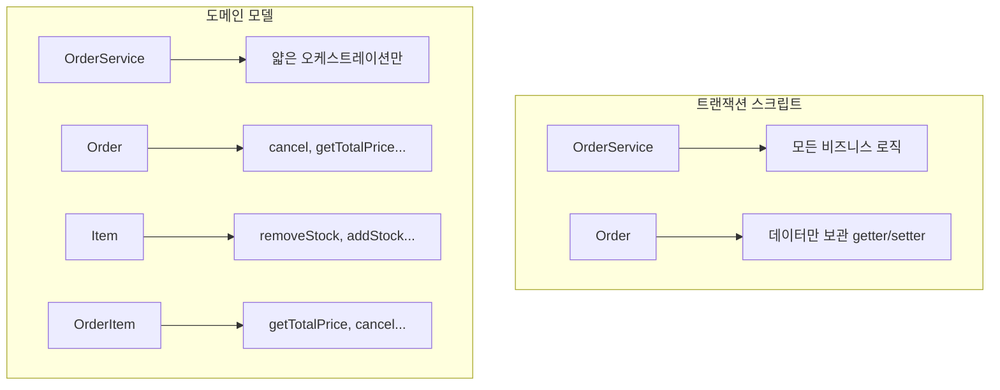
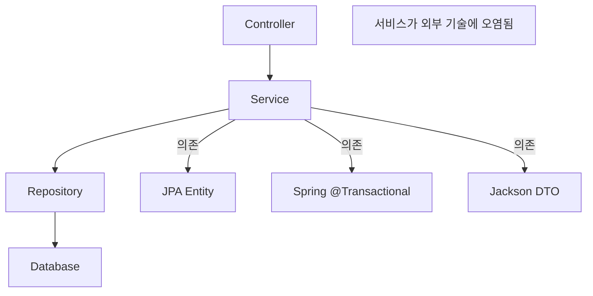
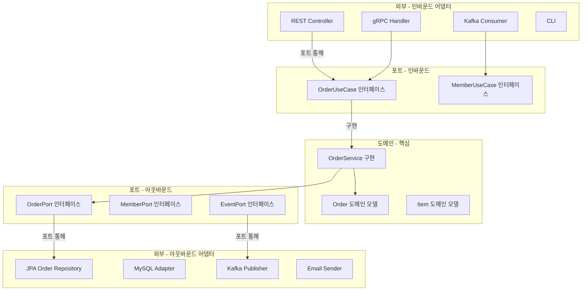

## 1. 비유 — 핵심 엔진과 외장 부품

자동차의 핵심은 엔진입니다. 엔진은 휘발유든 전기든 연료를 받아 동력을 만듭니다. 연료 주입 방식(주유구 vs 충전 포트)이 바뀌어도 엔진 설계는 동일합니다. 헥사고날 아키텍처에서 도메인(엔진)은 DB, API, 메시지큐 같은 외부 기술(외장 부품)에 의존하지 않습니다. 포트(인터페이스)를 통해 연결만 됩니다.

---

## 2. 트랜잭션 스크립트 vs 도메인 모델

### 2.1 트랜잭션 스크립트 패턴

비즈니스 로직이 서비스 계층에 절차적으로 집중됩니다.

```java
// 트랜잭션 스크립트 방식
@Service
@Transactional
public class OrderService {

    public void createOrder(Long memberId, Long itemId, int quantity) {
        // 모든 비즈니스 로직이 서비스에
        Member member = memberRepository.findById(memberId).orElseThrow();
        Item item = itemRepository.findById(itemId).orElseThrow();

        if (item.getStockQuantity() < quantity) {
            throw new NotEnoughStockException("재고 부족");
        }

        int totalPrice = item.getPrice() * quantity;

        if (member.getMoney() < totalPrice) {
            throw new InsufficientFundsException("잔액 부족");
        }

        // 재고 차감
        item.setStockQuantity(item.getStockQuantity() - quantity);

        // 포인트 차감
        member.setMoney(member.getMoney() - totalPrice);

        // 주문 생성
        Order order = new Order();
        order.setMemberId(memberId);
        order.setItemId(itemId);
        order.setQuantity(quantity);
        order.setTotalPrice(totalPrice);
        order.setStatus(OrderStatus.ORDERED);
        order.setCreatedAt(LocalDateTime.now());

        orderRepository.save(order);
        itemRepository.save(item);
        memberRepository.save(member);
    }
}
```

문제점: 비즈니스 규칙이 서비스에 흩어짐, 테스트 시 Spring 컨텍스트 필요, 도메인 객체가 데이터 보관만 함(빈혈 도메인).

### 2.2 도메인 모델 패턴

비즈니스 로직이 도메인 객체에 있습니다.

```java
// 풍부한 도메인 모델 (Rich Domain Model)
@Entity
public class Order {

    @Id @GeneratedValue
    private Long id;

    @ManyToOne(fetch = FetchType.LAZY)
    private Member member;

    @OneToMany(mappedBy = "order", cascade = CascadeType.ALL)
    private List<OrderItem> orderItems = new ArrayList<>();

    @Enumerated(EnumType.STRING)
    private OrderStatus status;

    // 팩토리 메서드 — 생성 규칙을 도메인에서 관리
    public static Order create(Member member, Item item, int quantity) {
        Order order = new Order();
        order.member = member;
        order.status = OrderStatus.ORDERED;

        OrderItem orderItem = OrderItem.create(order, item, quantity);
        order.orderItems.add(orderItem);

        return order;
    }

    // 비즈니스 메서드 — 도메인 로직을 도메인 객체에서 처리
    public void cancel() {
        if (status == OrderStatus.DELIVERY) {
            throw new IllegalStateException("배송 중에는 취소 불가");
        }
        this.status = OrderStatus.CANCELLED;
        orderItems.forEach(OrderItem::cancel);
    }

    public int getTotalPrice() {
        return orderItems.stream()
            .mapToInt(OrderItem::getTotalPrice)
            .sum();
    }
}

@Entity
public class OrderItem {

    @ManyToOne(fetch = FetchType.LAZY)
    private Item item;

    private int orderPrice;
    private int count;

    public static OrderItem create(Order order, Item item, int count) {
        item.removeStock(count); // 재고 차감을 Item이 처리
        OrderItem orderItem = new OrderItem();
        orderItem.item = item;
        orderItem.orderPrice = item.getPrice();
        orderItem.count = count;
        return orderItem;
    }

    public void cancel() {
        item.addStock(count); // 재고 복구
    }

    public int getTotalPrice() {
        return orderPrice * count;
    }
}

@Entity
public class Item {

    private int stockQuantity;
    private int price;

    // 재고 관련 로직은 Item이 처리
    public void removeStock(int quantity) {
        int restStock = stockQuantity - quantity;
        if (restStock < 0) {
            throw new NotEnoughStockException("재고 부족. 현재: " + stockQuantity);
        }
        this.stockQuantity = restStock;
    }

    public void addStock(int quantity) {
        this.stockQuantity += quantity;
    }
}

// 서비스는 얇아짐 (Thin Service)
@Service
@Transactional
public class OrderService {

    public Long createOrder(Long memberId, Long itemId, int count) {
        Member member = memberRepository.findById(memberId).orElseThrow();
        Item item = itemRepository.findById(itemId).orElseThrow();

        Order order = Order.create(member, item, count); // 도메인에서 처리
        orderRepository.save(order);
        return order.getId();
    }

    public void cancelOrder(Long orderId) {
        Order order = orderRepository.findById(orderId).orElseThrow();
        order.cancel(); // 도메인에서 처리
    }
}
```



---

## 3. 헥사고날 아키텍처 (Ports & Adapters)

### 3.1 전통적인 계층형 아키텍처의 문제



### 3.2 헥사고날 아키텍처 구조



---

## 4. 헥사고날 실제 구현

### 4.1 디렉토리 구조

```
src/main/java/com/example/
├── domain/                           # 도메인 계층 (순수 Java)
│   ├── order/
│   │   ├── Order.java                # 도메인 엔티티
│   │   ├── OrderItem.java
│   │   ├── OrderStatus.java
│   │   └── OrderValidator.java
│   └── member/
│       └── Member.java
│
├── application/                      # 애플리케이션 계층
│   ├── port/
│   │   ├── in/                       # 인바운드 포트 (Use Case)
│   │   │   ├── CreateOrderUseCase.java
│   │   │   └── CancelOrderUseCase.java
│   │   └── out/                      # 아웃바운드 포트
│   │       ├── LoadOrderPort.java
│   │       ├── SaveOrderPort.java
│   │       └── LoadMemberPort.java
│   └── service/
│       └── OrderService.java         # Use Case 구현
│
└── adapter/                          # 어댑터 계층
    ├── in/
    │   └── web/
    │       ├── OrderController.java  # REST 어댑터
    │       └── OrderRequest.java
    └── out/
        └── persistence/
            ├── OrderJpaEntity.java   # JPA 엔티티 (별도!)
            ├── OrderJpaRepository.java
            └── OrderPersistenceAdapter.java
```

### 4.2 인바운드 포트 (Use Case)

```java
// 인바운드 포트 — 무엇을 할 수 있는지 정의
public interface CreateOrderUseCase {

    Long createOrder(CreateOrderCommand command);

    // Command 객체로 입력 캡슐화
    record CreateOrderCommand(
        Long memberId,
        Long itemId,
        int quantity
    ) {
        public CreateOrderCommand {
            Objects.requireNonNull(memberId);
            Objects.requireNonNull(itemId);
            if (quantity <= 0) throw new IllegalArgumentException("수량은 1 이상이어야 합니다");
        }
    }
}

public interface CancelOrderUseCase {
    void cancelOrder(Long orderId);
}
```

### 4.3 아웃바운드 포트

```java
// 아웃바운드 포트 — 외부 자원에 접근하는 방법 정의
public interface LoadOrderPort {
    Optional<Order> loadOrder(Long orderId);
    List<Order> loadOrdersByMember(Long memberId);
}

public interface SaveOrderPort {
    Order saveOrder(Order order);
}

public interface LoadMemberPort {
    Optional<Member> loadMember(Long memberId);
}

public interface LoadItemPort {
    Optional<Item> loadItem(Long itemId);
}

public interface PublishOrderEventPort {
    void publishOrderCreated(Long orderId);
    void publishOrderCancelled(Long orderId);
}
```

### 4.4 도메인 서비스 (Use Case 구현)

```java
// 핵심 서비스 — Spring에 전혀 의존하지 않을 수 있음
@Service
@Transactional
@RequiredArgsConstructor
public class OrderService implements CreateOrderUseCase, CancelOrderUseCase {

    // 아웃바운드 포트에만 의존 (구현체 모름)
    private final LoadMemberPort loadMemberPort;
    private final LoadItemPort loadItemPort;
    private final SaveOrderPort saveOrderPort;
    private final PublishOrderEventPort publishOrderEventPort;

    @Override
    public Long createOrder(CreateOrderCommand command) {
        // 도메인 객체 로드
        Member member = loadMemberPort.loadMember(command.memberId())
            .orElseThrow(() -> new MemberNotFoundException(command.memberId()));
        Item item = loadItemPort.loadItem(command.itemId())
            .orElseThrow(() -> new ItemNotFoundException(command.itemId()));

        // 도메인 로직 실행 (순수 Java)
        Order order = Order.create(member, item, command.quantity());

        // 저장
        Order saved = saveOrderPort.saveOrder(order);

        // 이벤트 발행
        publishOrderEventPort.publishOrderCreated(saved.getId());

        return saved.getId();
    }

    @Override
    public void cancelOrder(Long orderId) {
        Order order = loadOrderPort.loadOrder(orderId)
            .orElseThrow(() -> new OrderNotFoundException(orderId));

        order.cancel(); // 도메인 로직

        saveOrderPort.saveOrder(order);
        publishOrderEventPort.publishOrderCancelled(orderId);
    }
}
```

### 4.5 웹 어댑터 (인바운드)

```java
@RestController
@RequestMapping("/api/orders")
@RequiredArgsConstructor
public class OrderController {

    // Use Case 인터페이스에만 의존
    private final CreateOrderUseCase createOrderUseCase;
    private final CancelOrderUseCase cancelOrderUseCase;

    @PostMapping
    public ResponseEntity<CreateOrderResponse> createOrder(
            @RequestBody @Valid CreateOrderRequest request,
            @AuthenticationPrincipal CustomUserDetails userDetails) {

        CreateOrderUseCase.CreateOrderCommand command =
            new CreateOrderUseCase.CreateOrderCommand(
                userDetails.getId(),
                request.itemId(),
                request.quantity()
            );

        Long orderId = createOrderUseCase.createOrder(command);
        return ResponseEntity.created(URI.create("/api/orders/" + orderId))
            .body(new CreateOrderResponse(orderId));
    }

    @DeleteMapping("/{orderId}")
    @ResponseStatus(HttpStatus.NO_CONTENT)
    public void cancelOrder(@PathVariable Long orderId) {
        cancelOrderUseCase.cancelOrder(orderId);
    }
}

record CreateOrderRequest(Long itemId, @Min(1) int quantity) {}
record CreateOrderResponse(Long orderId) {}
```

### 4.6 영속성 어댑터 (아웃바운드)

```java
// JPA Entity — 도메인과 분리
@Entity
@Table(name = "orders")
public class OrderJpaEntity {

    @Id @GeneratedValue
    private Long id;
    private Long memberId;
    private Long itemId;
    private int quantity;
    private int totalPrice;
    private String status;
    private LocalDateTime createdAt;

    // 도메인 객체 ↔ JPA 엔티티 변환
    public static OrderJpaEntity fromDomain(Order order) {
        OrderJpaEntity entity = new OrderJpaEntity();
        entity.id = order.getId();
        entity.memberId = order.getMember().getId();
        // ...
        return entity;
    }

    public Order toDomain() {
        // JPA 엔티티 → 도메인 객체 변환
        return Order.reconstruct(id, /* ... */);
    }
}

// 영속성 어댑터 — 아웃바운드 포트 구현
@Component
@RequiredArgsConstructor
public class OrderPersistenceAdapter implements LoadOrderPort, SaveOrderPort {

    private final OrderJpaRepository jpaRepository;

    @Override
    public Optional<Order> loadOrder(Long orderId) {
        return jpaRepository.findById(orderId)
            .map(OrderJpaEntity::toDomain); // JPA 엔티티 → 도메인
    }

    @Override
    public Order saveOrder(Order order) {
        OrderJpaEntity entity = OrderJpaEntity.fromDomain(order); // 도메인 → JPA 엔티티
        OrderJpaEntity saved = jpaRepository.save(entity);
        return saved.toDomain();
    }
}
```

---

## 5. 테스트 용이성

### 5.1 도메인 단위 테스트 (Spring 불필요)

```java
class OrderTest {

    @Test
    void 주문_생성_시_재고가_차감된다() {
        // given
        Member member = Member.create("홍길동", 100000);
        Item item = Item.create("노트북", 50000, 10);

        // when
        Order order = Order.create(member, item, 2);

        // then
        assertThat(item.getStockQuantity()).isEqualTo(8);
        assertThat(order.getTotalPrice()).isEqualTo(100000);
        assertThat(order.getStatus()).isEqualTo(OrderStatus.ORDERED);
    }

    @Test
    void 재고_부족_시_예외가_발생한다() {
        Member member = Member.create("홍길동", 100000);
        Item item = Item.create("노트북", 50000, 1);

        assertThatThrownBy(() -> Order.create(member, item, 5))
            .isInstanceOf(NotEnoughStockException.class);
    }

    @Test
    void 배송_중에는_취소할_수_없다() {
        Order order = OrderFixture.deliveryOrder();

        assertThatThrownBy(order::cancel)
            .isInstanceOf(IllegalStateException.class)
            .hasMessage("배송 중에는 취소 불가");
    }
}
```

### 5.2 Use Case 단위 테스트 (Mock 활용)

```java
class OrderServiceTest {

    @Mock
    private LoadMemberPort loadMemberPort;

    @Mock
    private LoadItemPort loadItemPort;

    @Mock
    private SaveOrderPort saveOrderPort;

    @Mock
    private PublishOrderEventPort publishOrderEventPort;

    @InjectMocks
    private OrderService orderService;

    @Test
    void 주문_생성_성공() {
        // given
        Member member = MemberFixture.activeMember();
        Item item = ItemFixture.inStockItem();

        given(loadMemberPort.loadMember(1L)).willReturn(Optional.of(member));
        given(loadItemPort.loadItem(1L)).willReturn(Optional.of(item));
        given(saveOrderPort.saveOrder(any())).willAnswer(invoc -> {
            Order order = invoc.getArgument(0);
            return order; // 저장된 것 반환
        });

        // when
        CreateOrderUseCase.CreateOrderCommand command =
            new CreateOrderUseCase.CreateOrderCommand(1L, 1L, 2);
        orderService.createOrder(command);

        // then
        verify(saveOrderPort, times(1)).saveOrder(any());
        verify(publishOrderEventPort, times(1)).publishOrderCreated(any());
    }
}
```

### 5.3 어댑터 통합 테스트

```java
@DataJpaTest
class OrderPersistenceAdapterTest {

    @Autowired
    private OrderJpaRepository jpaRepository;

    private OrderPersistenceAdapter adapter;

    @BeforeEach
    void setUp() {
        adapter = new OrderPersistenceAdapter(jpaRepository);
    }

    @Test
    void 저장하고_조회할_수_있다() {
        Order order = OrderFixture.newOrder();
        Order saved = adapter.saveOrder(order);
        Optional<Order> loaded = adapter.loadOrder(saved.getId());

        assertThat(loaded).isPresent();
        assertThat(loaded.get().getTotalPrice()).isEqualTo(order.getTotalPrice());
    }
}
```

---

## 6. 도메인 이벤트

```java
// 도메인 이벤트 정의
public record OrderCreatedEvent(Long orderId, Long memberId, int totalPrice) {}

// 도메인에서 이벤트 발생
@Entity
public class Order {

    @Transient
    private final List<Object> domainEvents = new ArrayList<>();

    public static Order create(Member member, Item item, int quantity) {
        Order order = new Order();
        // ... 생성 로직 ...
        order.domainEvents.add(new OrderCreatedEvent(order.id, member.getId(), order.getTotalPrice()));
        return order;
    }

    public List<Object> getDomainEvents() {
        return Collections.unmodifiableList(domainEvents);
    }
}

// Spring의 ApplicationEventPublisher 활용
@Service
public class OrderService implements CreateOrderUseCase {

    private final ApplicationEventPublisher eventPublisher;

    @Override
    @Transactional
    public Long createOrder(CreateOrderCommand command) {
        // ...
        Order order = Order.create(member, item, command.quantity());
        Order saved = saveOrderPort.saveOrder(order);

        // 도메인 이벤트 발행
        saved.getDomainEvents().forEach(eventPublisher::publishEvent);

        return saved.getId();
    }
}

// 이벤트 리스너
@Component
public class OrderEventHandler {

    @EventListener
    public void handleOrderCreated(OrderCreatedEvent event) {
        log.info("주문 생성: orderId={}, totalPrice={}", event.orderId(), event.totalPrice());
        // 이메일 발송, 재고 알림 등
    }

    @TransactionalEventListener(phase = TransactionPhase.AFTER_COMMIT)
    public void publishToKafka(OrderCreatedEvent event) {
        // 트랜잭션 커밋 후 Kafka 발행 (데이터 정합성 보장)
        kafkaTemplate.send("order-created", event);
    }
}
```

---

<details class="extreme-scenario-details" ontoggle="if(this.open){var ad=this.querySelector('.extreme-scenario-ad');if(ad&&!ad.dataset.loaded){ad.dataset.loaded='1';(adsbygoogle=window.adsbygoogle||[]).push({});}}">
<summary class="extreme-scenario-summary">
<span class="extreme-scenario-icon">🔥</span>
<span class="extreme-scenario-label">극한 시나리오 — 클릭하여 펼치기</span>
<span class="extreme-scenario-toggle"></span>
</summary>
<div class="extreme-scenario-body">
<div class="extreme-scenario-ad" style="text-align:center; margin-bottom:1.5em;">
<ins class="adsbygoogle"
     style="display:block"
     data-ad-client="ca-pub-7225106491387870"
     data-ad-slot="0000000000"
     data-ad-format="auto"
     data-full-width-responsive="true"></ins>
</div>
<div class="extreme-scenario-content" markdown="1">

```java
// 순수 도메인 테스트 — Spring 의존성 0개
class PureOrderDomainTest {

    @Test
    void 복잡한_주문_생성_시나리오() {
        // Spring, JPA, DB 없이 순수 Java로만 테스트
        Member vipMember = new Member("VIP", 500000, MemberGrade.VIP);
        Item laptop = new Item("노트북", 200000, 5);
        Item mouse = new Item("마우스", 30000, 20);

        Order order = Order.create(vipMember, List.of(
            OrderItemCommand.of(laptop, 2),
            OrderItemCommand.of(mouse, 3)
        ));

        assertThat(order.getTotalPrice()).isEqualTo(490000); // 200000*2 + 30000*3
        assertThat(laptop.getStockQuantity()).isEqualTo(3);
        assertThat(mouse.getStockQuantity()).isEqualTo(17);

        // VIP 할인 적용 여부
        assertThat(order.getDiscountedPrice()).isEqualTo(441000); // 10% 할인
    }
}
```

---
</div>
</div>
</details>

## 8. 계층형 vs 헥사고날 비교

| 항목 | 계층형 아키텍처 | 헥사고날 아키텍처 |
|------|--------------|---------------|
| 복잡도 | 낮음 | 높음 |
| 도메인 순수성 | DB 기술에 오염 가능 | 완전 독립 가능 |
| 테스트 용이성 | Spring 필요 | 순수 Java 가능 |
| 기술 교체 | 어려움 | 어댑터만 교체 |
| 적합한 규모 | 소~중규모 | 중~대규모, 복잡 도메인 |
| 학습 곡선 | 낮음 | 높음 |

---

## 9. 요약

| 개념 | 설명 | 핵심 포인트 |
|------|------|-----------|
| 빈혈 도메인 | 데이터만 보관, 로직 없음 | 피해야 할 안티패턴 |
| 풍부한 도메인 | 비즈니스 로직을 도메인에 | 높은 응집도 |
| 헥사고날 | 도메인이 중심, 어댑터가 연결 | 기술 독립 |
| 인바운드 포트 | Use Case 인터페이스 | 무엇을 할 수 있나 |
| 아웃바운드 포트 | 외부 자원 접근 인터페이스 | 어떻게 가져오나 |
| 어댑터 | 포트 구현체 | REST, JPA, Kafka 등 |
| 도메인 이벤트 | 도메인에서 발생한 사실 | 느슨한 결합 |
