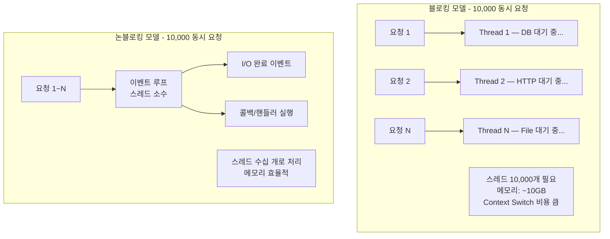
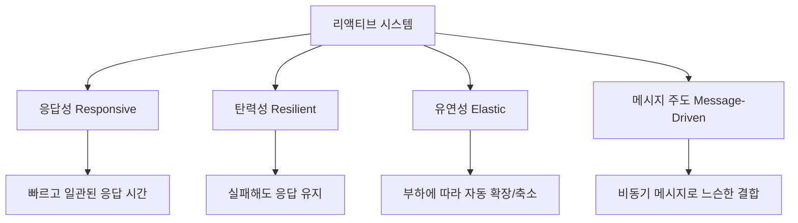
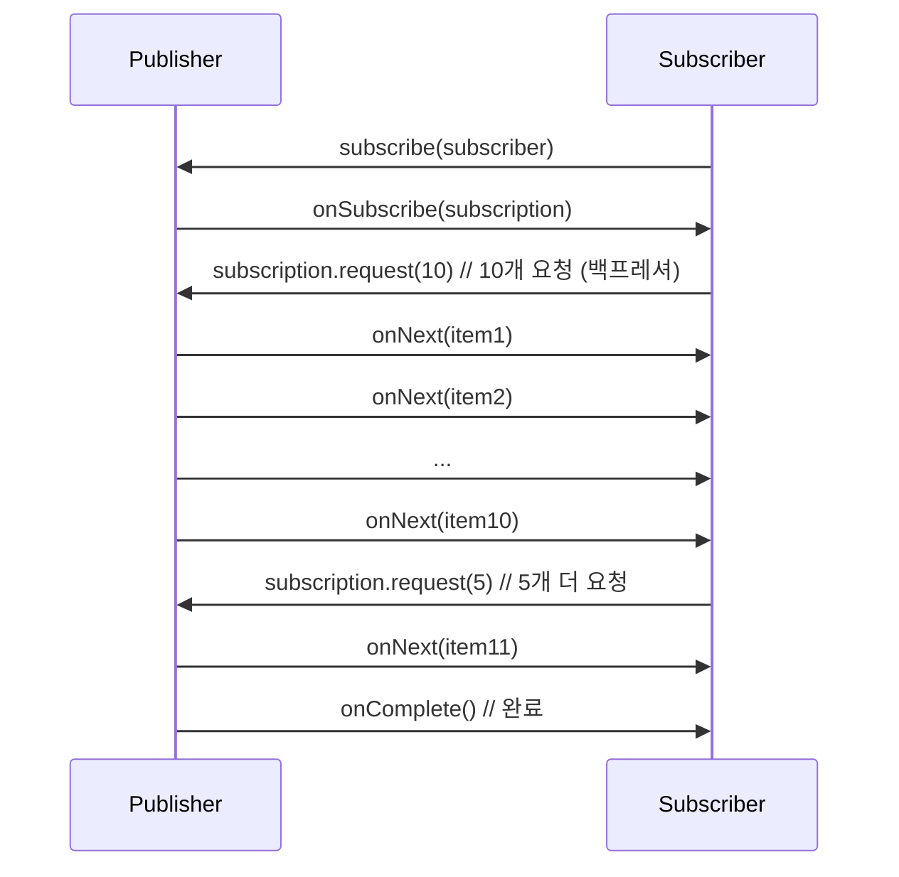
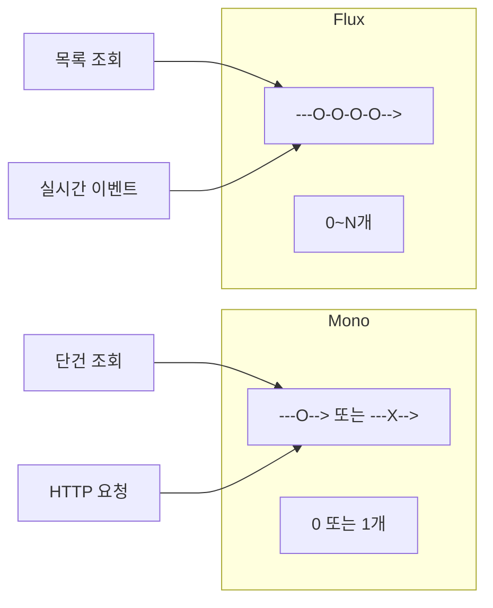
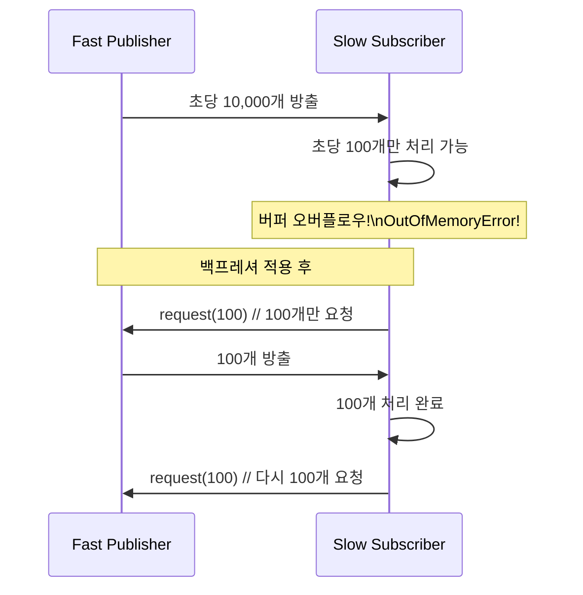
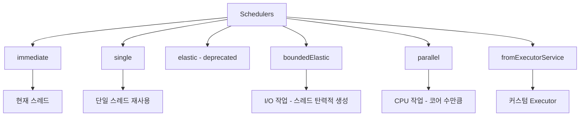
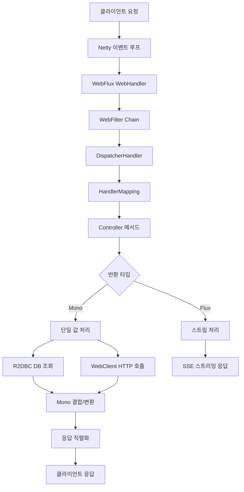

## 1. 비유 — 신문 구독과 전화 주문

두 가지 방식으로 뉴스를 받을 수 있습니다.

**전통적 방식 (블로킹)**: 신문사에 전화해서 "오늘 신문 있나요?"를 물어보고, 준비될 때까지 전화를 끊지 않고 기다립니다. 신문이 준비되면 받습니다. 그동안 다른 일을 할 수 없습니다.

**리액티브 방식 (논블로킹)**: 신문을 구독합니다. 새 신문이 발행될 때마다 자동으로 배달됩니다. 그동안 다른 일을 할 수 있습니다. 구독을 취소(backpressure)하면 더 이상 배달되지 않습니다.

리액티브 프로그래밍은 이 구독 모델입니다.

---

## 2. 왜 리액티브인가?

### 2.1 전통적 블로킹 I/O의 한계



### 2.2 리액티브 시스템의 특성



---

## 3. Reactive Streams 표준

### 3.1 4개의 인터페이스

```java
// Publisher — 데이터 발행자
public interface Publisher<T> {
    void subscribe(Subscriber<? super T> subscriber);
}

// Subscriber — 데이터 구독자
public interface Subscriber<T> {
    void onSubscribe(Subscription s);   // 구독 시작
    void onNext(T t);                    // 다음 데이터 수신
    void onError(Throwable t);           // 에러 발생
    void onComplete();                   // 완료
}

// Subscription — 구독 관계
public interface Subscription {
    void request(long n);  // n개 데이터 요청 (백프레셔!)
    void cancel();          // 구독 취소
}

// Processor — Publisher + Subscriber
public interface Processor<T, R> extends Subscriber<T>, Publisher<R> {}
```

### 3.2 Reactive Streams 흐름



---

## 4. Project Reactor — Mono와 Flux

### 4.1 Mono — 0 또는 1개의 데이터

```java
// Mono 생성
Mono<String> just = Mono.just("Hello");             // 값 1개
Mono<String> empty = Mono.empty();                   // 빈 Mono
Mono<String> error = Mono.error(new RuntimeException("에러"));
Mono<String> fromSupplier = Mono.fromSupplier(() -> findUser());

// 비동기 실행
Mono<User> userMono = Mono.fromCallable(() -> userRepository.findById(1L))
    .subscribeOn(Schedulers.boundedElastic()); // I/O 스레드풀에서 실행

// 변환
Mono<String> name = userMono
    .map(User::getName)
    .map(String::toUpperCase)
    .defaultIfEmpty("Unknown");  // null 대신 기본값

// 실행 (구독)
userMono.subscribe(
    user -> System.out.println("성공: " + user),
    error -> System.err.println("에러: " + error),
    () -> System.out.println("완료")
);
```

### 4.2 Flux — 0~N개의 데이터 스트림

```java
// Flux 생성
Flux<Integer> range = Flux.range(1, 10);             // 1~10
Flux<String> just = Flux.just("a", "b", "c");
Flux<Long> interval = Flux.interval(Duration.ofSeconds(1)); // 1초마다 0, 1, 2, ...

// Iterable에서
Flux<User> fromList = Flux.fromIterable(userList);

// 무한 스트림 (주기적 데이터)
Flux<String> heartbeat = Flux.interval(Duration.ofSeconds(1))
    .map(i -> "heartbeat-" + i);

// 변환
Flux<OrderResponse> orderFlux = Flux.fromIterable(orders)
    .filter(order -> order.getStatus() == OrderStatus.COMPLETED)
    .map(OrderResponse::from)
    .sort(Comparator.comparing(OrderResponse::getCreatedAt).reversed())
    .take(10);  // 앞에서 10개만
```

### 4.3 Mono vs Flux 비교



---

## 5. Reactor 핵심 연산자

### 5.1 변환 연산자

```java
Flux<User> users = userRepository.findAll();

// map — 동기 변환
Flux<UserDto> dtos = users.map(UserDto::from);

// flatMap — 비동기 변환 (순서 보장 X, 병렬)
Flux<Order> orders = users
    .flatMap(user -> orderRepository.findByMemberId(user.getId()));

// concatMap — 비동기 변환 (순서 보장, 직렬)
Flux<Order> orderedOrders = users
    .concatMap(user -> orderRepository.findByMemberId(user.getId()));

// switchMap — 최신 값만 (검색 자동완성에 유용)
Flux<SearchResult> searchResults = searchInput
    .switchMap(query -> searchService.search(query)); // 이전 요청은 취소

// scan — 누적 값
Flux<Integer> runningSum = Flux.range(1, 5)
    .scan(0, Integer::sum);
// 0, 1, 3, 6, 10, 15
```

### 5.2 필터링 연산자

```java
Flux<Integer> numbers = Flux.range(1, 20);

numbers.filter(n -> n % 2 == 0)    // 짝수만
       .take(5)                      // 앞에서 5개
       .skip(2)                      // 앞에서 2개 스킵
       .takeLast(3)                  // 뒤에서 3개
       .distinct()                   // 중복 제거
       .distinctUntilChanged()       // 연속 중복만 제거
       .elementAt(3)                 // 3번째 원소 (Mono)
       .next()                       // 첫 번째 원소 (Mono)
```

### 5.3 집계 연산자

```java
Flux<Integer> flux = Flux.range(1, 5);

Mono<Integer> sum = flux.reduce(0, Integer::sum);  // 15
Mono<List<Integer>> list = flux.collectList();      // [1,2,3,4,5]
Mono<Long> count = flux.count();                    // 5

// groupBy
Flux<GroupedFlux<String, User>> grouped = userFlux
    .groupBy(user -> user.getCity());

grouped.flatMap(group -> group
    .count()
    .map(count -> group.key() + ": " + count)
).subscribe(System.out::println);

// window — N개씩 묶음
flux.window(3)
    .flatMap(window -> window.collectList())
    .subscribe(System.out::println);
// [1, 2, 3], [4, 5]

// buffer — N개씩 List로
flux.buffer(3)
    .subscribe(System.out::println);
// [1, 2, 3], [4, 5]
```

### 5.4 결합 연산자

```java
Mono<User> userMono = userRepository.findById(1L);
Mono<List<Order>> ordersMono = orderRepository.findByMemberId(1L);

// zip — 모두 완료될 때 결합
Mono<UserProfile> profile = Mono.zip(userMono, ordersMono)
    .map(tuple -> UserProfile.of(tuple.getT1(), tuple.getT2()));

// zipWith
Mono<UserProfile> profile2 = userMono
    .zipWith(ordersMono)
    .map(tuple -> UserProfile.of(tuple.getT1(), tuple.getT2()));

// merge — 두 Flux를 하나로 (순서 미보장)
Flux<Event> allEvents = Flux.merge(clickEvents, keyboardEvents);

// concat — 첫 번째 완료 후 두 번째 시작
Flux<Integer> combined = Flux.concat(Flux.range(1, 3), Flux.range(10, 3));
// 1, 2, 3, 10, 11, 12

// combineLatest — 둘 중 하나라도 값 방출 시 최신값 결합
Flux.combineLatest(flux1, flux2, (v1, v2) -> v1 + "," + v2);
```

---

## 6. 백프레셔 (Backpressure)

### 6.1 백프레셔가 필요한 이유



### 6.2 백프레셔 전략

```java
// BUFFER — 처리 못한 것을 버퍼에 쌓음 (메모리 위험)
Flux.range(1, 10000)
    .onBackpressureBuffer(100)  // 최대 100개 버퍼
    .subscribe(/* 느린 구독자 */);

// DROP — 처리 못한 것을 버림
Flux.range(1, 10000)
    .onBackpressureDrop(dropped -> log.warn("버림: {}", dropped))
    .subscribe(/* 느린 구독자 */);

// LATEST — 가장 최신 것만 유지
Flux.range(1, 10000)
    .onBackpressureLatest()
    .subscribe(/* 느린 구독자 */);

// ERROR — 버퍼 초과 시 에러
Flux.range(1, 10000)
    .onBackpressureError()
    .subscribe(/* 느린 구독자 */);
```

---

## 7. 에러 처리

```java
Flux<User> userFlux = userRepository.findAll();

// onErrorReturn — 에러 시 기본값 반환
userFlux
    .onErrorReturn(DatabaseException.class, User.anonymous())

// onErrorResume — 에러 시 다른 Publisher로 대체
userFlux
    .onErrorResume(e -> {
        log.error("DB 오류, 캐시에서 조회", e);
        return userCacheRepository.findAll();
    })

// onErrorMap — 에러 변환
userFlux
    .onErrorMap(DatabaseException.class, e ->
        new ServiceUnavailableException("사용자 서비스 일시 중단", e))

// retry — 재시도
userFlux
    .retry(3)  // 최대 3회 재시도

// retryWhen — 조건부 재시도
userFlux
    .retryWhen(Retry.backoff(3, Duration.ofSeconds(1))
        .maxBackoff(Duration.ofSeconds(10))
        .filter(e -> e instanceof TransientException))

// doOnError — 에러 시 부수 효과 (에러는 그대로 전파)
userFlux
    .doOnError(e -> log.error("에러 발생", e))
```

---

## 8. Schedulers — 스레드 스케줄링

```java
// subscribeOn — 구독 실행 스레드 결정 (소스 연산에 영향)
Flux.range(1, 100)
    .subscribeOn(Schedulers.boundedElastic())  // I/O 작업
    .map(i -> i * 2)
    .subscribe(System.out::println);

// publishOn — 이후 연산자의 실행 스레드 결정
Flux.range(1, 100)
    .subscribeOn(Schedulers.boundedElastic())
    .map(i -> i * 2)           // boundedElastic 스레드
    .publishOn(Schedulers.parallel())
    .filter(i -> i > 50)       // parallel 스레드
    .subscribe(System.out::println);
```



---

## 9. Spring WebFlux

### 9.1 WebFlux vs MVC

```mermaid
graph TD
    subgraph Spring MVC
        A["클라이언트"] --> B["Tomcat 스레드풀"]
        B --> C["서블릿 필터"]
        C --> D[DispatcherServlet]
        D --> E["Controller - 블로킹"]
        E --> F["DB/HTTP 블로킹 대기"]
    end

    subgraph Spring WebFlux
        G["클라이언트"] --> H["Netty 이벤트 루프"]
        H --> I[WebFilter]
        I --> J[DispatcherHandler]
        J --> K["Controller - 논블로킹"]
        K --> L["Mono/Flux 반환"]
        L --> M["비동기 완료 시 응답"]
    end
```



| 항목 | Spring MVC | Spring WebFlux |
|------|-----------|---------------|
| 실행 모델 | 스레드당 요청 (블로킹) | 이벤트 루프 (논블로킹) |
| 서버 | Tomcat, Jetty | Netty, Undertow, Tomcat |
| 반환 타입 | 일반 객체 | Mono, Flux |
| DB 드라이버 | JDBC (블로킹) | R2DBC (논블로킹) |
| 적합한 경우 | 일반 웹 앱, CRUD | 고동시성, 스트리밍 |
| 학습 곡선 | 낮음 | 높음 |

### 9.2 WebFlux 컨트롤러

```java
@RestController
@RequestMapping("/api/orders")
public class OrderController {

    private final OrderService orderService;

    // Mono 반환 — 단건
    @GetMapping("/{id}")
    public Mono<OrderResponse> getOrder(@PathVariable Long id) {
        return orderService.findById(id)
            .map(OrderResponse::from)
            .switchIfEmpty(Mono.error(new OrderNotFoundException(id)));
    }

    // Flux 반환 — 목록
    @GetMapping
    public Flux<OrderResponse> getAllOrders(@RequestParam(defaultValue = "0") int page) {
        return orderService.findAll(page)
            .map(OrderResponse::from);
    }

    // Server-Sent Events — 실시간 스트리밍
    @GetMapping(value = "/stream", produces = MediaType.TEXT_EVENT_STREAM_VALUE)
    public Flux<ServerSentEvent<OrderEvent>> streamOrders() {
        return orderService.getOrderEventStream()
            .map(event -> ServerSentEvent.<OrderEvent>builder()
                .id(String.valueOf(event.getId()))
                .event(event.getType())
                .data(event)
                .build());
    }

    // 요청 바디 처리
    @PostMapping
    public Mono<ResponseEntity<OrderResponse>> createOrder(
            @RequestBody Mono<CreateOrderRequest> requestMono) {
        return requestMono
            .flatMap(request -> orderService.create(request))
            .map(order -> ResponseEntity
                .created(URI.create("/api/orders/" + order.getId()))
                .body(OrderResponse.from(order)));
    }
}
```

### 9.3 WebFlux 서비스

```java
@Service
public class OrderService {

    private final OrderRepository orderRepository;  // R2DBC
    private final MemberRepository memberRepository;
    private final WebClient externalApiClient;

    public Mono<Order> findById(Long id) {
        return orderRepository.findById(id)
            .switchIfEmpty(Mono.error(new OrderNotFoundException(id)));
    }

    // 여러 비동기 작업 조합
    public Mono<OrderDetail> getOrderDetail(Long orderId) {
        return orderRepository.findById(orderId)
            .flatMap(order -> Mono.zip(
                Mono.just(order),
                memberRepository.findById(order.getMemberId()),
                fetchExternalProductInfo(order.getProductId())
            ))
            .map(tuple -> OrderDetail.of(tuple.getT1(), tuple.getT2(), tuple.getT3()));
    }

    // 외부 API 호출
    private Mono<ProductInfo> fetchExternalProductInfo(Long productId) {
        return externalApiClient.get()
            .uri("/products/{id}", productId)
            .retrieve()
            .bodyToMono(ProductInfo.class)
            .timeout(Duration.ofSeconds(5))
            .onErrorReturn(ProductInfo.unknown());
    }

    // 스트리밍
    public Flux<OrderEvent> getOrderEventStream() {
        return orderRepository.findAll()
            .delayElements(Duration.ofMillis(100))  // 시연용
            .map(order -> new OrderEvent(order.getId(), "CREATED"));
    }
}
```

---

## 10. R2DBC — 리액티브 DB 접근

```java
// R2DBC Repository
public interface OrderRepository extends ReactiveCrudRepository<Order, Long> {

    Flux<Order> findByMemberId(Long memberId);

    @Query("SELECT * FROM orders WHERE status = :status ORDER BY created_at DESC")
    Flux<Order> findByStatus(String status);

    Mono<Long> countByStatus(String status);
}

// 트랜잭션
@Service
public class OrderService {

    private final TransactionalOperator transactionalOperator;

    public Mono<Order> createOrderTransactional(CreateOrderCommand command) {
        return orderRepository.save(Order.from(command))
            .flatMap(order -> stockRepository.decreaseStock(command.itemId(), command.quantity())
                .thenReturn(order))
            .as(transactionalOperator::transactional);
    }
}
```

---

## 11. WebClient — 리액티브 HTTP 클라이언트

```java
// WebClient 설정
@Bean
public WebClient webClient() {
    return WebClient.builder()
        .baseUrl("https://api.example.com")
        .defaultHeader(HttpHeaders.CONTENT_TYPE, MediaType.APPLICATION_JSON_VALUE)
        .defaultHeader(HttpHeaders.ACCEPT, MediaType.APPLICATION_JSON_VALUE)
        .codecs(configurer -> configurer.defaultCodecs().maxInMemorySize(10 * 1024 * 1024))
        .filter(ExchangeFilterFunctions.basicAuthentication("user", "password"))
        .build();
}

// 사용
@Service
public class ExternalApiService {

    private final WebClient webClient;

    public Mono<User> fetchUser(Long id) {
        return webClient.get()
            .uri("/users/{id}", id)
            .retrieve()
            .onStatus(HttpStatus::is4xxClientError, response ->
                Mono.error(new ClientException("클라이언트 오류: " + response.statusCode())))
            .onStatus(HttpStatus::is5xxServerError, response ->
                Mono.error(new ServerException("서버 오류: " + response.statusCode())))
            .bodyToMono(User.class)
            .timeout(Duration.ofSeconds(10))
            .retryWhen(Retry.backoff(3, Duration.ofSeconds(1)));
    }

    // 여러 API 병렬 호출
    public Mono<UserEnrichedData> fetchEnrichedData(Long userId) {
        Mono<User> userMono = fetchUser(userId);
        Mono<List<Order>> ordersMono = fetchOrders(userId);
        Mono<UserStats> statsMono = fetchStats(userId);

        return Mono.zip(userMono, ordersMono, statsMono)
            .map(tuple -> UserEnrichedData.of(tuple.getT1(), tuple.getT2(), tuple.getT3()));
    }
}
```

---

<details class="extreme-scenario-details" ontoggle="if(this.open){var ad=this.querySelector('.extreme-scenario-ad');if(ad&&!ad.dataset.loaded){ad.dataset.loaded='1';(adsbygoogle=window.adsbygoogle||[]).push({});}}">
<summary class="extreme-scenario-summary">
<span class="extreme-scenario-icon">🔥</span>
<span class="extreme-scenario-label">극한 시나리오 — 클릭하여 펼치기</span>
<span class="extreme-scenario-toggle"></span>
</summary>
<div class="extreme-scenario-body">
<div class="extreme-scenario-ad" style="text-align:center; margin-bottom:1.5em;">
<ins class="adsbygoogle"
     style="display:block"
     data-ad-client="ca-pub-7225106491387870"
     data-ad-slot="0000000000"
     data-ad-format="auto"
     data-full-width-responsive="true"></ins>
</div>
<div class="extreme-scenario-content" markdown="1">

```java
@Service
public class RealtimeOrderProcessor {

    // Kafka → 주문 스트림 → DB 저장 → 알림 발송
    public Flux<ProcessedOrder> processOrderStream(Flux<KafkaMessage<Order>> kafkaStream) {
        return kafkaStream
            .map(KafkaMessage::value)                     // Kafka 메시지에서 주문 추출
            .filter(order -> order.getStatus() == OrderStatus.NEW)
            .groupBy(Order::getMemberId)                   // 회원별로 그룹핑
            .flatMap(memberOrders ->
                memberOrders
                    .buffer(Duration.ofSeconds(1))          // 1초 단위로 배치
                    .filter(batch -> !batch.isEmpty())
                    .flatMap(batch -> processBatch(batch))
            )
            .doOnNext(order -> metricsService.recordProcessed())
            .doOnError(e -> metricsService.recordError());
    }

    private Mono<ProcessedOrder> processBatch(List<Order> orders) {
        return Flux.fromIterable(orders)
            .flatMap(order ->
                orderRepository.save(order)
                    .flatMap(saved ->
                        notificationService.sendPush(saved.getMemberId(), "주문 처리 완료")
                            .thenReturn(ProcessedOrder.from(saved))
                    )
            )
            .collectList()
            .flatMap(processed ->
                Mono.just(processed.get(0)) // 배치 대표 반환
            );
    }
}
```

---
</div>
</div>
</details>

## 13. 테스트

```java
// StepVerifier — 리액티브 스트림 테스트
class OrderServiceTest {

    @Test
    void getOrder_shouldReturnOrder() {
        Mono<Order> orderMono = Mono.just(new Order(1L, "주문1"));

        StepVerifier.create(orderMono)
            .expectNext(new Order(1L, "주문1"))
            .verifyComplete();
    }

    @Test
    void getOrders_shouldReturnMultiple() {
        Flux<Integer> flux = Flux.range(1, 5);

        StepVerifier.create(flux)
            .expectNext(1, 2, 3, 4, 5)
            .verifyComplete();
    }

    @Test
    void shouldHandleError() {
        Mono<User> errorMono = Mono.error(new UserNotFoundException(1L));

        StepVerifier.create(errorMono)
            .expectError(UserNotFoundException.class)
            .verify();
    }

    @Test
    void shouldRespectBackpressure() {
        StepVerifier.create(Flux.range(1, 100), 10) // 10개만 요청
            .expectNextCount(10)
            .thenCancel()  // 구독 취소
            .verify();
    }

    @Test
    void testWithVirtualTime() {
        StepVerifier.withVirtualTime(() ->
            Flux.interval(Duration.ofSeconds(1)).take(3))
            .thenAwait(Duration.ofSeconds(3))  // 가상 시간 진행
            .expectNext(0L, 1L, 2L)
            .verifyComplete();
    }
}
```

---

## 14. 전체 흐름 정리



---

## 15. 요약

| 개념 | 설명 | 핵심 포인트 |
|------|------|-----------|
| Reactive Streams | 비동기 스트림 표준 | Publisher, Subscriber, Subscription |
| Mono | 0~1개 데이터 | 단건 조회, HTTP 응답 |
| Flux | 0~N개 데이터 스트림 | 목록, 이벤트 스트림 |
| 백프레셔 | 소비자가 생산 속도 제어 | request(n)으로 N개만 요청 |
| flatMap | 비동기 변환 (병렬) | 순서 미보장 |
| concatMap | 비동기 변환 (직렬) | 순서 보장 |
| subscribeOn | 구독 스레드 결정 | I/O 작업 시 boundedElastic |
| publishOn | 이후 연산자 스레드 결정 | 스레드 전환 |
| WebFlux | 논블로킹 웹 프레임워크 | Netty 기반 |
| R2DBC | 리액티브 DB 드라이버 | 논블로킹 DB 접근 |
| WebClient | 리액티브 HTTP 클라이언트 | RestTemplate 대체 |
| StepVerifier | 리액티브 테스트 | 스트림 단계별 검증 |
