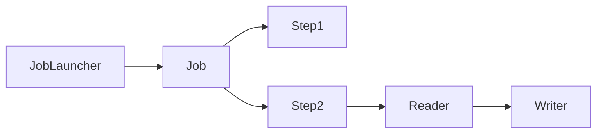
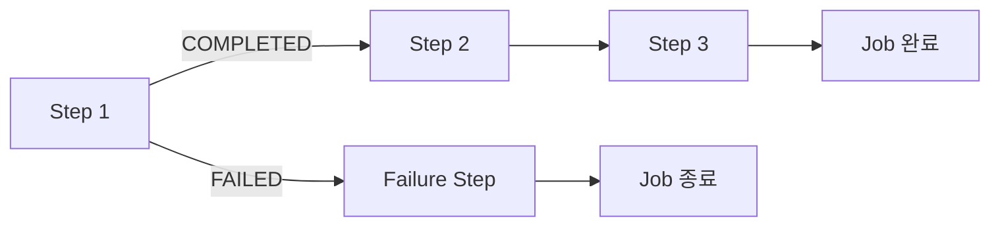
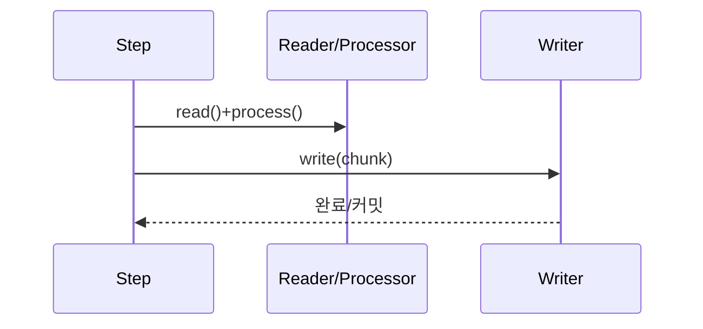
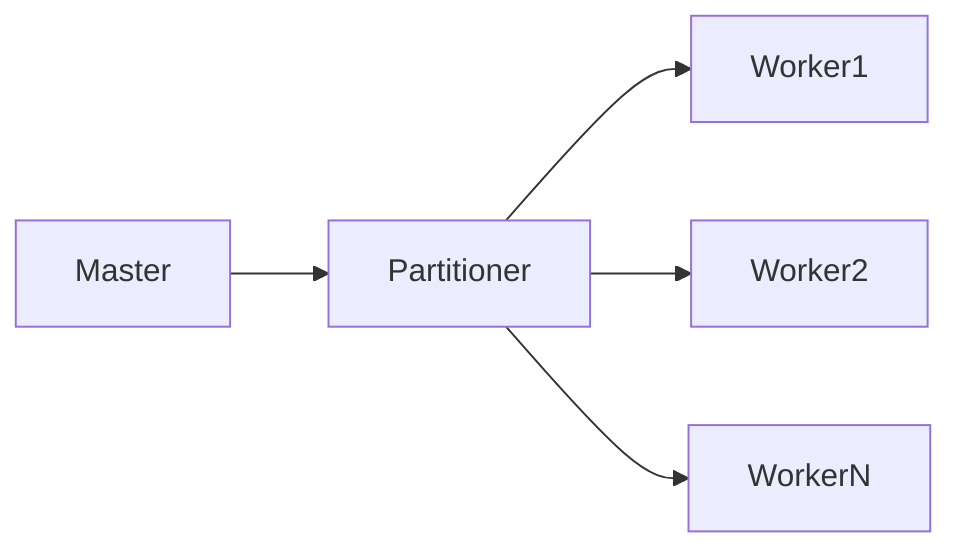
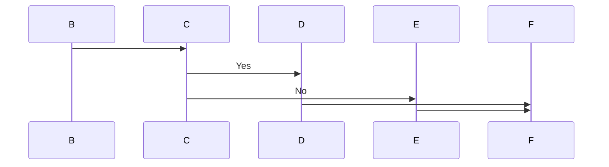

## 1. 비유 — 공장 생산 라인

배치(Batch) 처리는 공장 생산 라인과 같습니다. 수백만 개의 제품을 하나씩 수작업으로 처리하면 너무 느립니다. 공장에서는 컨베이어 벨트(Chunk)로 일정량씩 묶어 처리합니다. 재료를 가져오는 사람(ItemReader), 가공하는 사람(ItemProcessor), 포장해서 내보내는 사람(ItemWriter)이 분업합니다. 만약 중간에 기계가 멈춰도(실패), 처리된 부분부터 재시작할 수 있습니다.

---

## 2. Spring Batch 도메인 구조



### 2.1 메타 테이블 구조

Spring Batch는 실행 이력을 DB에 저장합니다.


---

## 3. Job 설정

```java
@Configuration
@EnableBatchProcessing
public class BatchConfig {

    @Bean
    public Job importUserJob(JobRepository jobRepository,
                              Step step1, Step step2,
                              JobCompletionNotificationListener listener) {
        return new JobBuilder("importUserJob", jobRepository)
            .incrementer(new RunIdIncrementer())  // 매번 새 JobInstance 생성
            .listener(listener)
            .start(step1)
            .next(step2)
            .build();
    }
}
```

### 3.1 Job 흐름 제어

```java
@Bean
public Job conditionalJob(JobRepository jobRepository) {
    return new JobBuilder("conditionalJob", jobRepository)
        .start(step1())
            .on("COMPLETED").to(step2())  // 성공 시
            .on("FAILED").to(failureStep())  // 실패 시
        .from(step2())
            .on("*").to(step3())  // 항상
        .from(failureStep())
            .on("*").end()  // 종료
        .end()
        .build();
}
```



---

## 4. Chunk 기반 처리

### 4.1 Chunk 처리 흐름



### 4.2 기본 Chunk Step 구성

```java
@Bean
public Step chunkStep(JobRepository jobRepository,
                       PlatformTransactionManager transactionManager) {
    return new StepBuilder("chunkStep", jobRepository)
        .<User, ProcessedUser>chunk(100, transactionManager) // chunk size: 100
        .reader(userItemReader())
        .processor(userItemProcessor())
        .writer(userItemWriter())
        .faultTolerant()
        .skipLimit(10)
        .skip(ValidationException.class)
        .retryLimit(3)
        .retry(DeadlockLoserDataAccessException.class)
        .build();
}
```

---

## 5. ItemReader 구현

### 5.1 JdbcCursorItemReader (대용량 DB 읽기)

```java
@Bean
public JdbcCursorItemReader<User> jdbcCursorItemReader(DataSource dataSource) {
    return new JdbcCursorItemReaderBuilder<User>()
        .name("userItemReader")
        .dataSource(dataSource)
        .sql("SELECT id, name, email, status FROM users WHERE status = 'ACTIVE'")
        .rowMapper(new BeanPropertyRowMapper<>(User.class))
        .fetchSize(100)  // DB에서 한 번에 가져오는 크기
        .build();
}
```

### 5.2 JdbcPagingItemReader (페이지 단위 읽기)

```java
@Bean
public JdbcPagingItemReader<User> jdbcPagingItemReader(DataSource dataSource) {
    Map<String, Order> sortKeys = new HashMap<>();
    sortKeys.put("id", Order.ASCENDING);

    return new JdbcPagingItemReaderBuilder<User>()
        .name("pagingUserReader")
        .dataSource(dataSource)
        .selectClause("SELECT id, name, email")
        .fromClause("FROM users")
        .whereClause("WHERE status = 'ACTIVE'")
        .sortKeys(sortKeys)
        .pageSize(100)
        .rowMapper(new BeanPropertyRowMapper<>(User.class))
        .build();
}
```

### 5.3 FlatFileItemReader (CSV 읽기)

```java
@Bean
public FlatFileItemReader<UserCsvDto> csvItemReader() {
    return new FlatFileItemReaderBuilder<UserCsvDto>()
        .name("csvUserReader")
        .resource(new ClassPathResource("users.csv"))
        .delimited()
        .delimiter(",")
        .names("id", "name", "email", "age")
        .targetType(UserCsvDto.class)
        .linesToSkip(1)  // 헤더 행 스킵
        .build();
}
```

### 5.4 커스텀 ItemReader

```java
@Component
@StepScope
public class ApiItemReader implements ItemReader<ExternalData> {

    private final ExternalApiClient apiClient;
    private final List<ExternalData> buffer = new ArrayList<>();
    private int nextIndex = 0;
    private int page = 0;
    private static final int PAGE_SIZE = 100;

    @Override
    public ExternalData read() throws Exception {
        if (nextIndex >= buffer.size()) {
            fetchNextPage();
            if (buffer.isEmpty()) {
                return null; // 데이터 끝
            }
        }
        return buffer.get(nextIndex++);
    }

    private void fetchNextPage() {
        buffer.clear();
        nextIndex = 0;
        List<ExternalData> data = apiClient.fetchPage(page++, PAGE_SIZE);
        buffer.addAll(data);
    }
}
```

---

## 6. ItemProcessor 구현

```java
@Component
@StepScope
public class UserItemProcessor implements ItemProcessor<User, ProcessedUser> {

    private final EmailValidator emailValidator;

    @Override
    public ProcessedUser process(User user) throws Exception {
        // null 반환 시 해당 아이템은 건너뜀 (skip)
        if (!emailValidator.isValid(user.getEmail())) {
            log.warn("유효하지 않은 이메일, 건너뜀: {}", user.getEmail());
            return null;
        }

        if (user.getAge() < 18) {
            return null; // 미성년자 제외
        }

        // 데이터 변환
        return ProcessedUser.builder()
            .userId(user.getId())
            .fullName(user.getFirstName() + " " + user.getLastName())
            .email(user.getEmail().toLowerCase())
            .processedAt(LocalDateTime.now())
            .build();
    }
}
```

### 6.1 CompositeItemProcessor — 여러 Processor 체인

```java
@Bean
public CompositeItemProcessor<User, FinalUser> compositeProcessor() {
    CompositeItemProcessor<User, FinalUser> processor = new CompositeItemProcessor<>();
    processor.setDelegates(List.of(
        new ValidationProcessor(),
        new TransformProcessor(),
        new EnrichmentProcessor()
    ));
    return processor;
}
```

---

## 7. ItemWriter 구현

### 7.1 JdbcBatchItemWriter

```java
@Bean
public JdbcBatchItemWriter<ProcessedUser> jdbcBatchItemWriter(DataSource dataSource) {
    return new JdbcBatchItemWriterBuilder<ProcessedUser>()
        .itemSqlParameterSourceProvider(new BeanPropertyItemSqlParameterSourceProvider<>())
        .sql("INSERT INTO processed_users (user_id, full_name, email, processed_at) " +
             "VALUES (:userId, :fullName, :email, :processedAt) " +
             "ON DUPLICATE KEY UPDATE full_name = :fullName, email = :email")
        .dataSource(dataSource)
        .build();
}
```

### 7.2 FlatFileItemWriter (CSV 출력)

```java
@Bean
@StepScope
public FlatFileItemWriter<ProcessedUser> csvItemWriter(
        @Value("#{jobParameters['outputFile']}") String outputFile) {

    BeanWrapperFieldExtractor<ProcessedUser> extractor = new BeanWrapperFieldExtractor<>();
    extractor.setNames(new String[]{"userId", "fullName", "email"});

    DelimitedLineAggregator<ProcessedUser> aggregator = new DelimitedLineAggregator<>();
    aggregator.setDelimiter(",");
    aggregator.setFieldExtractor(extractor);

    return new FlatFileItemWriterBuilder<ProcessedUser>()
        .name("csvUserWriter")
        .resource(new FileSystemResource(outputFile))
        .lineAggregator(aggregator)
        .headerCallback(writer -> writer.write("userId,fullName,email"))
        .append(false)
        .build();
}
```

### 7.3 CompositeItemWriter

```java
@Bean
public CompositeItemWriter<ProcessedUser> compositeWriter() {
    CompositeItemWriter<ProcessedUser> writer = new CompositeItemWriter<>();
    writer.setDelegates(List.of(
        jdbcBatchItemWriter(),    // DB 저장
        csvItemWriter(),           // CSV 파일 출력
        kafkaItemWriter()          // Kafka 발행
    ));
    return writer;
}
```

---

## 8. Tasklet 방식

단순하거나 단일 작업에 적합합니다.

```java
// 파일 삭제 Tasklet
@Component
public class FileCleanupTasklet implements Tasklet {

    @Value("${batch.temp-dir}")
    private String tempDir;

    @Override
    public RepeatStatus execute(StepContribution contribution, ChunkContext chunkContext)
            throws Exception {
        File directory = new File(tempDir);
        if (directory.exists()) {
            FileUtils.cleanDirectory(directory);
            log.info("임시 디렉토리 정리 완료: {}", tempDir);
        }
        return RepeatStatus.FINISHED; // CONTINUABLE 반환 시 반복 실행
    }
}

// Step에 적용
@Bean
public Step cleanupStep(JobRepository jobRepository,
                         PlatformTransactionManager transactionManager) {
    return new StepBuilder("cleanupStep", jobRepository)
        .tasklet(fileCleanupTasklet(), transactionManager)
        .build();
}
```

### 8.1 Chunk vs Tasklet 비교

| 항목 | Chunk | Tasklet |
|------|-------|---------|
| 처리 단위 | N개씩 묶어 처리 | 전체를 한 번에 |
| 트랜잭션 | Chunk 단위 | Step 전체 |
| 재시작 | Chunk 단위 재시작 가능 | 처음부터 재시작 |
| 적합한 경우 | 대용량 데이터 처리 | DB 테이블 초기화, 파일 조작, API 단순 호출 |
| 메모리 | 효율적 | 단순 |

---

## 9. JobParameters와 @StepScope

```java
// JobParameters 전달
JobParameters params = new JobParametersBuilder()
    .addString("targetDate", "2026-05-02")
    .addLong("batchSize", 500L)
    .addString("outputPath", "/data/output/")
    .toJobParameters();

jobLauncher.run(importJob, params);
```

```java
// @StepScope: Step 실행 시점에 빈 생성 (JobParameters 접근 가능)
@Bean
@StepScope
public JdbcCursorItemReader<Order> orderReader(
        DataSource dataSource,
        @Value("#{jobParameters['targetDate']}") String targetDate) {

    return new JdbcCursorItemReaderBuilder<Order>()
        .name("orderReader")
        .dataSource(dataSource)
        .sql("SELECT * FROM orders WHERE order_date = ?")
        .preparedStatementSetter(ps -> ps.setString(1, targetDate))
        .rowMapper(new BeanPropertyRowMapper<>(Order.class))
        .build();
}
```

---

## 10. 파티셔닝 — 병렬 처리

### 10.1 파티셔닝 구조



```java
@Bean
public Step masterStep(JobRepository jobRepository,
                        TaskExecutor taskExecutor) {
    return new StepBuilder("masterStep", jobRepository)
        .partitioner("workerStep", rangePartitioner())
        .step(workerStep())
        .gridSize(4)  // 파티션 수
        .taskExecutor(taskExecutor)
        .build();
}

@Bean
public Partitioner rangePartitioner() {
    return gridSize -> {
        Map<String, ExecutionContext> partitions = new HashMap<>();
        long totalCount = userRepository.count();
        long partitionSize = totalCount / gridSize;

        for (int i = 0; i < gridSize; i++) {
            ExecutionContext context = new ExecutionContext();
            context.putLong("minId", i * partitionSize + 1);
            context.putLong("maxId", (i == gridSize - 1) ? totalCount : (i + 1) * partitionSize);
            partitions.put("partition" + i, context);
        }
        return partitions;
    };
}

@Bean
@StepScope
public JdbcCursorItemReader<User> partitionedReader(
        DataSource dataSource,
        @Value("#{stepExecutionContext['minId']}") Long minId,
        @Value("#{stepExecutionContext['maxId']}") Long maxId) {

    return new JdbcCursorItemReaderBuilder<User>()
        .name("partitionedUserReader")
        .dataSource(dataSource)
        .sql("SELECT * FROM users WHERE id BETWEEN ? AND ?")
        .preparedStatementSetter(ps -> {
            ps.setLong(1, minId);
            ps.setLong(2, maxId);
        })
        .rowMapper(new BeanPropertyRowMapper<>(User.class))
        .build();
}
```

### 10.2 멀티스레드 Step

```java
@Bean
public TaskExecutor batchTaskExecutor() {
    ThreadPoolTaskExecutor executor = new ThreadPoolTaskExecutor();
    executor.setCorePoolSize(4);
    executor.setMaxPoolSize(8);
    executor.setQueueCapacity(100);
    executor.setThreadNamePrefix("batch-");
    executor.initialize();
    return executor;
}

@Bean
public Step multiThreadStep(JobRepository jobRepository,
                             PlatformTransactionManager transactionManager) {
    return new StepBuilder("multiThreadStep", jobRepository)
        .<User, ProcessedUser>chunk(100, transactionManager)
        .reader(synchronizedReader())  // 스레드 안전한 Reader 필요!
        .processor(userProcessor())
        .writer(userWriter())
        .taskExecutor(batchTaskExecutor())
        .throttleLimit(4)
        .build();
}

// JdbcPagingItemReader는 Thread-safe, CursorItemReader는 동기화 필요
@Bean
public SynchronizedItemStreamReader<User> synchronizedReader() {
    return new SynchronizedItemStreamReaderBuilder<User>()
        .delegate(jdbcCursorItemReader())
        .build();
}
```

---

## 11. 재시작과 재시도

### 11.1 재시작 (Restart)

```java
// 실패한 Job 재시작 — JobRepository가 이전 상태를 기억
jobLauncher.run(job, lastFailedJobParams); // 실패한 Step부터 재시작

// 특정 Step을 항상 처음부터 실행하도록 설정
@Bean
public Step alwaysRestartStep(JobRepository jobRepository) {
    return new StepBuilder("alwaysRestartStep", jobRepository)
        .<User, ProcessedUser>chunk(100, transactionManager)
        .allowStartIfComplete(true)  // 완료돼도 재실행 허용
        .startLimit(3)  // 최대 3번까지만 시작 허용
        .reader(reader())
        .writer(writer())
        .build();
}
```

### 11.2 Skip (건너뛰기)

```java
@Bean
public Step skipableStep(JobRepository jobRepository) {
    return new StepBuilder("skipableStep", jobRepository)
        .<User, ProcessedUser>chunk(100, transactionManager)
        .reader(reader())
        .processor(processor())
        .writer(writer())
        .faultTolerant()
        .skipLimit(5)  // 최대 5건까지 skip 허용
        .skip(ValidationException.class)
        .skip(ParseException.class)
        .noSkip(DatabaseException.class)  // 이 예외는 skip 금지
        .skipPolicy(new AlwaysSkipItemSkipPolicy())
        .listener(new SkipListener<User, ProcessedUser>() {
            @Override
            public void onSkipInRead(Throwable t) {
                log.warn("읽기 중 skip: {}", t.getMessage());
            }
            @Override
            public void onSkipInProcess(User item, Throwable t) {
                log.warn("처리 중 skip, item={}: {}", item.getId(), t.getMessage());
            }
            @Override
            public void onSkipInWrite(ProcessedUser item, Throwable t) {
                log.warn("쓰기 중 skip, item={}: {}", item.getUserId(), t.getMessage());
            }
        })
        .build();
}
```

---

## 12. 스케줄링 연동

### 12.1 Spring Scheduler + Batch

```java
@Component
@EnableScheduling
public class BatchScheduler {

    private final JobLauncher jobLauncher;
    private final Job dailyReportJob;

    // 매일 새벽 2시 실행
    @Scheduled(cron = "0 0 2 * * ?")
    public void runDailyReport() {
        try {
            JobParameters params = new JobParametersBuilder()
                .addString("date", LocalDate.now().toString())
                .addLong("time", System.currentTimeMillis())
                .toJobParameters();

            JobExecution execution = jobLauncher.run(dailyReportJob, params);
            log.info("배치 실행 상태: {}", execution.getStatus());
        } catch (Exception e) {
            log.error("배치 실행 실패", e);
        }
    }
}
```

### 12.2 JobLauncher 비동기 설정

```java
@Bean
public JobLauncher asyncJobLauncher(JobRepository jobRepository) throws Exception {
    TaskExecutorJobLauncher jobLauncher = new TaskExecutorJobLauncher();
    jobLauncher.setJobRepository(jobRepository);
    jobLauncher.setTaskExecutor(new SimpleAsyncTaskExecutor()); // 비동기 실행
    jobLauncher.afterPropertiesSet();
    return jobLauncher;
}
```

---


## 극한 시나리오

```java
@Configuration
public class LargeScaleBatchConfig {

    // 1. JPA 대신 JDBC 사용 (성능)
    // 2. Cursor 대신 Paging (메모리)
    // 3. 파티셔닝 (병렬)
    // 4. 청크 사이즈 튜닝

    @Bean
    public Job processHundredMillionRecords(JobRepository jobRepository) {
        return new JobBuilder("hundredMillionJob", jobRepository)
            .start(masterStep())
            .build();
    }

    @Bean
    public Step masterStep() {
        return new StepBuilder("masterStep", jobRepository)
            .partitioner("workerStep", columnRangePartitioner())
            .step(workerStep())
            .gridSize(10)  // 10개 파티션
            .taskExecutor(partitionTaskExecutor())
            .build();
    }

    @Bean
    @StepScope
    public JdbcPagingItemReader<RawData> largeReader(
            @Value("#{stepExecutionContext['minId']}") Long minId,
            @Value("#{stepExecutionContext['maxId']}") Long maxId) {

        return new JdbcPagingItemReaderBuilder<RawData>()
            .name("largeReader")
            .dataSource(dataSource)
            .selectClause("SELECT id, data")
            .fromClause("FROM raw_data")
            .whereClause("WHERE id BETWEEN " + minId + " AND " + maxId)
            .sortKeys(Map.of("id", Order.ASCENDING))
            .pageSize(1000)  // 청크 사이즈와 일치 권장
            .rowMapper(new BeanPropertyRowMapper<>(RawData.class))
            .build();
    }

    @Bean
    public Step workerStep() {
        return new StepBuilder("workerStep", jobRepository)
            .<RawData, ProcessedData>chunk(1000, transactionManager) // 1000건씩
            .reader(largeReader(null, null))
            .processor(rawDataProcessor())
            .writer(processedDataWriter())
            .faultTolerant()
            .skipLimit(1000)
            .skip(Exception.class)
            .build();
    }
}
```

예상 처리 시간 (10개 파티션, 청크 1000):
- 단순 처리: 1억 / 10 / 1000 = 10,000회 쓰기 작업
- DB 쓰기 지연 10ms 기준: 100초 수준

---
## 14. 전체 흐름 정리



---

## 15. 요약

| 개념 | 설명 | 핵심 포인트 |
|------|------|-----------|
| Job | 배치 작업 단위 | 여러 Step으로 구성 |
| Step | Job의 처리 단계 | Chunk or Tasklet |
| Chunk | N건씩 묶어 처리 | Read → Process → Write |
| ItemReader | 데이터 읽기 | null 반환 시 종료 |
| ItemProcessor | 데이터 변환/필터 | null 반환 시 해당 건 skip |
| ItemWriter | 데이터 저장 | 리스트 단위로 받음 |
| Tasklet | 단순 작업 | FINISHED or CONTINUABLE |
| @StepScope | Step 실행 시 빈 생성 | JobParameters 주입 가능 |
| 파티셔닝 | 데이터를 나눠 병렬 처리 | 대용량 필수 기법 |
| JobRepository | 배치 메타데이터 관리 | 재시작 핵심 |

---

## 왜 이 기술인가?

| 방식 | 재시작/재개 | 병렬 처리 | 모니터링 | 적합한 상황 |
|---|---|---|---|---|
| 순수 Java 스케줄러 | X | 수동 | 없음 | 단순 1회성 작업 |
| Spring Batch | O | O (Partitioning) | JobRepository | 대용량 데이터, 실패 재처리 |
| Quartz Scheduler | O (트리거) | X | 제한적 | 스케줄링 전용 |
| Apache Spark | O | O (분산) | Spark UI | 빅데이터 (수억 건) |
| Kafka Streams | O | O | Kafka UI | 스트리밍 데이터 처리 |

**결론:** 수백만 건 이하의 정기 배치 처리(정산, 통계, 마이그레이션)에는 Spring Batch가 표준이다. 재시작 가능성, 실패 Skip/Retry, 병렬 처리(Partitioning)를 선언적으로 제공하며 Spring 생태계와 완벽히 통합된다.

---

## 실무에서 자주 하는 실수

1. **Chunk 크기를 너무 작게 또는 너무 크게 설정** — Chunk가 작으면 트랜잭션 오버헤드가 커지고, 너무 크면 하나의 실패로 많은 데이터가 재처리된다. 보통 100~1000 사이에서 시작해 성능 테스트로 최적값을 찾아야 한다. OOM이 발생하면 Chunk를 줄이는 것이 우선이다.

2. **Tasklet과 Chunk를 혼동** — 단순한 한 번의 작업(파일 삭제, 테이블 초기화)은 Tasklet, 반복적인 읽기-처리-쓰기는 Chunk를 사용해야 한다. Chunk 구조에 억지로 단순 작업을 끼워넣으면 불필요한 복잡도가 생긴다.

3. **JobParameter 없이 같은 Job을 여러 번 실행 시도** — Spring Batch는 같은 `JobParameters`로 실행된 Job이 이미 완료(COMPLETED)됐으면 재실행을 거부한다. 타임스탬프나 UUID를 JobParameter에 추가해 매번 다른 인스턴스로 실행해야 한다.

4. **ItemWriter에서 개별 건마다 트랜잭션 커밋** — `ItemWriter`에서 건마다 직접 `save()`를 호출하면 Chunk의 트랜잭션 관리를 우회한다. Spring Batch의 Chunk는 write 단계 전체를 하나의 트랜잭션으로 처리하므로, `saveAll()`로 배치 삽입을 활용해야 한다.

5. **Partitioning 설정 후 SlaveStep에 트랜잭션 설정 누락** — 멀티스레드 Partitioning에서 각 파티션 Step의 `ItemReader`가 스레드 안전하지 않으면 데이터 중복 처리가 발생한다. `JpaPagingItemReader`는 스레드 안전하지 않으므로 `synchronized`하거나 스레드 당 독립 인스턴스를 사용해야 한다.

---

## 면접 포인트

**Q1. Spring Batch의 Job, Step, Chunk의 관계는?**
> Job은 전체 배치 작업의 최상위 단위. Step은 Job을 구성하는 독립적인 처리 단계로, 순차/조건부 실행이 가능하다. Chunk는 Step의 처리 방식 중 하나로 `ItemReader → ItemProcessor → ItemWriter`를 N건 단위로 반복한다. 각 Chunk는 하나의 트랜잭션으로 처리된다.

**Q2. Skip과 Retry의 차이와 설정 방법은?**
> Retry: 실패 시 최대 N번 재시도한다. 일시적 오류(네트워크 타임아웃)에 적합. Skip: 특정 예외 발생 시 해당 건을 건너뛰고 계속 진행한다. 데이터 불량으로 처리 불가한 건에 적합. `faultTolerant().retry(Exception.class).retryLimit(3).skip(DataFormatException.class).skipLimit(100)`으로 선언적 설정.

**Q3. Partitioning과 Multi-threaded Step의 차이는?**
> Multi-threaded Step: 하나의 Step을 여러 스레드가 동시에 처리. ItemReader를 공유하므로 스레드 안전성 주의. Partitioning: MasterStep이 데이터를 N개 파티션으로 분할하고, SlaveStep 인스턴스가 각 파티션을 독립적으로 처리. 스레드 안전 문제가 없고 더 안정적이다.

**Q4. JobRepository의 역할은?**
> Job 실행 메타데이터(JobInstance, JobExecution, StepExecution)를 DB에 저장한다. 이를 통해 실패 재시작 시 어느 Chunk까지 처리됐는지 추적하고, 같은 Job의 중복 실행을 방지한다. 운영에서는 반드시 영속성 DB(H2 아닌 실제 DB)를 사용해야 한다.

**Q5. Spring Batch에서 대용량 처리 시 성능 최적화 방법은?**
> ① `JdbcBatchItemWriter`로 bulk insert 사용. ② Chunk 크기 최적화(100~1000). ③ `JpaPagingItemReader` 대신 `JdbcPagingItemReader` 사용(JPA 1차 캐시 오버헤드 제거). ④ Partitioning으로 병렬 처리. ⑤ `entityManager.clear()`로 JPA 1차 캐시 주기적 정리.
