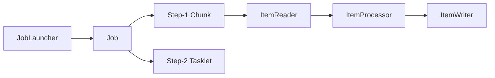
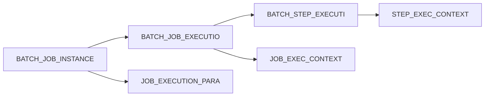
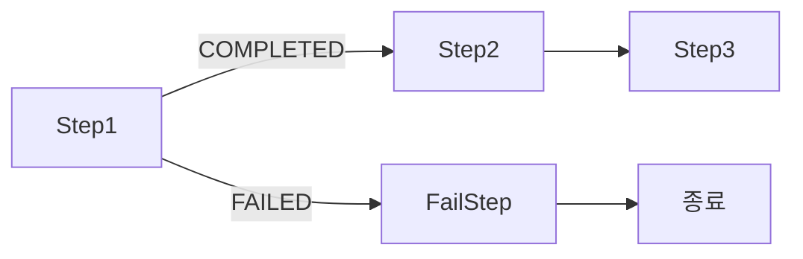
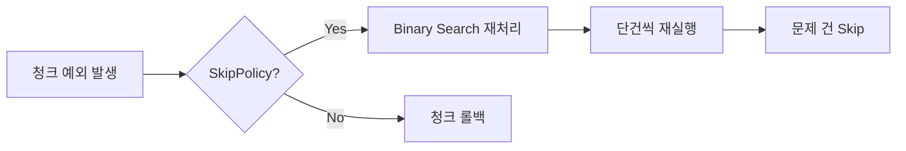
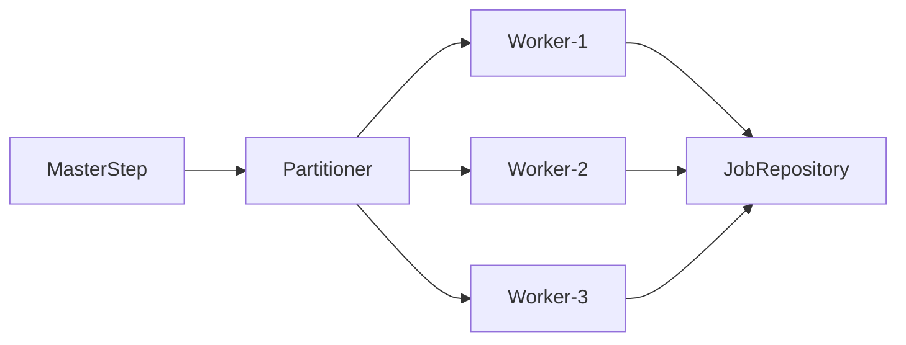
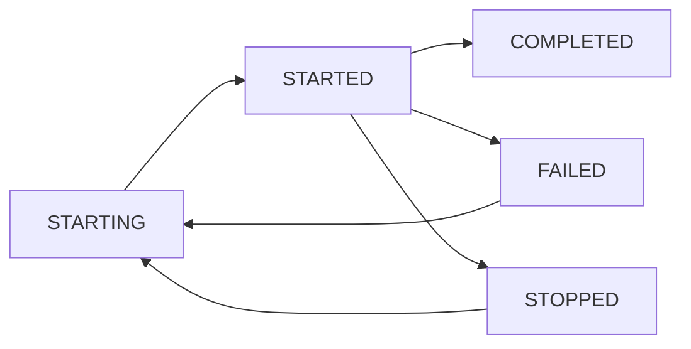

## 1. 왜 Spring Batch인가 — 공장 컨베이어 벨트 비유

월말 정산 배치를 상상해 보자. 주문 테이블에 3,000만 건이 쌓여 있다. 이것을 한 트랜잭션으로 처리하면 어떻게 될까? 처리 중 서버가 죽으면 전부 롤백되어 처음부터 다시 시작해야 한다. 메모리는 3,000만 건을 동시에 들고 있어야 하므로 OOM(OutOfMemoryError)이 터진다. 재시도 로직, 실패 로깅, 진행 상황 추적은 모두 직접 구현해야 한다.

Spring Batch는 이 문제를 **공장 컨베이어 벨트** 방식으로 해결한다.

- **컨베이어 벨트(Chunk)**: 3,000만 건을 1,000건씩 묶어 처리한다. 999번째 청크까지 완료된 상태에서 서버가 죽으면, 재시작 시 1,000번째 청크부터 이어서 처리한다.
- **분업(Reader / Processor / Writer)**: 재료를 가져오는 사람, 가공하는 사람, 포장하는 사람이 분리되어 있다. 각 역할이 명확하므로 테스트와 교체가 쉽다.
- **품질 관리(Skip / Retry)**: 불량품이 나오면 해당 건만 빼고(Skip) 계속 진행하거나, 일시적 오류면 다시 시도(Retry)한다.
- **공장 관리 대장(JobRepository)**: 어떤 라인이 몇 번째 제품까지 처리했는지 DB에 기록해 두어 언제든지 재개할 수 있다.

---

## 2. 아키텍처 전체 조감도



### 2.1 핵심 도메인 객체의 역할

| 객체 | 역할 | 유추 |
|------|------|------|
| `JobLauncher` | Job 실행 진입점. JobParameters를 받아 Job을 실행 | 공장장이 "오늘 오전 2시에 가동해" 라고 지시 |
| `Job` | 전체 배치 작업 정의. 여러 Step의 시퀀스 또는 흐름 | 제품 생산 공정 전체 설명서 |
| `Step` | Job 내 하나의 독립 처리 단계 | 특정 공정 라인 |
| `JobInstance` | 동일 Job + 동일 JobParameters의 논리적 실행 단위 | "2026-05-13 정산 배치" 라는 작업 개념 |
| `JobExecution` | 특정 JobInstance의 실제 실행 1회 | 해당 작업을 오전 2시에 실행한 기록 |
| `StepExecution` | Step 1회 실행 기록. `ExecutionContext` 보유 | 특정 라인의 처리 기록 |
| `JobRepository` | 위 메타데이터를 모두 DB에 저장/조회 | 공장 관리 대장 |
| `ExecutionContext` | StepExecution/JobExecution에 붙는 K-V 저장소 | 이 라인이 몇 번까지 처리했는지 메모 |

### 2.2 JobRepository 메타 테이블 구조

Spring Batch는 기동 시 메타 테이블을 자동으로 생성한다(`spring.batch.jdbc.initialize-schema=always`). 총 6개 테이블의 관계는 다음과 같다.



**왜 JobInstance와 JobExecution을 분리하는가?**

`JobInstance`는 "어떤 데이터를 처리하는 작업인가"의 논리적 개념이다. `2026-05-13` 날짜 정산이라는 개념은 하나이지만, 그 날 실패해서 두 번 실행했다면 `JobExecution`은 두 개가 생긴다. Spring Batch는 같은 `JobParameters`로 이미 `COMPLETED` 상태인 `JobInstance`가 있으면 재실행을 거부한다. 이 메커니즘이 **중복 실행 방지**의 핵심이다.

```sql
-- 메타 테이블 직접 확인 예시
SELECT ji.JOB_NAME, ji.JOB_KEY,
       je.STATUS, je.START_TIME, je.END_TIME,
       je.EXIT_CODE
FROM BATCH_JOB_INSTANCE ji
JOIN BATCH_JOB_EXECUTION je ON ji.JOB_INSTANCE_ID = je.JOB_INSTANCE_ID
WHERE ji.JOB_NAME = 'settlementJob'
ORDER BY je.START_TIME DESC;
```

---

## 3. Job 설정 — JobBuilder 내부 동작

### 3.1 @EnableBatchProcessing vs DefaultBatchConfiguration (Spring Batch 5)

**Spring Batch 4 (Spring Boot 2.x)**에서는 `@EnableBatchProcessing` 어노테이션 하나가 `JobRepository`, `JobLauncher`, `TransactionManager` 등을 모두 자동으로 빈으로 등록했다.

**Spring Batch 5 (Spring Boot 3.x / Jakarta EE)**에서는 이 방식이 근본적으로 바뀌었다.

```java
// Spring Batch 5 — @EnableBatchProcessing 없이 DefaultBatchConfiguration 상속
@Configuration
public class BatchConfig extends DefaultBatchConfiguration {

    // DataSource를 주입하면 자동으로 JobRepository, JobLauncher 구성
    // 커스터마이징이 필요하면 메서드 오버라이드
    @Override
    protected DataSource getDataSource() {
        return dataSource;
    }

    @Override
    protected PlatformTransactionManager getTransactionManager() {
        return transactionManager;
    }
}
```

**왜 바뀌었나?** `@EnableBatchProcessing`은 `@Import`를 통해 `BatchConfigurationSelector`를 로드하는 방식이었는데, Spring Boot의 자동 구성(`BatchAutoConfiguration`)과 충돌이 자주 발생했다. Spring Batch 5는 Spring Boot의 자동 구성 철학에 맞추어, `@EnableBatchProcessing`을 사용하면 Boot의 자동 구성이 **비활성화**된다. 즉, Spring Boot 3 + Spring Batch 5 환경에서는 `@EnableBatchProcessing`을 **쓰지 않는 것**이 기본이다.

```java
// Spring Batch 5 표준 Job 설정
@Configuration
public class UserMigrationJobConfig {

    @Bean
    public Job userMigrationJob(JobRepository jobRepository,
                                 Step validateStep,
                                 Step migrateStep,
                                 Step notifyStep) {
        return new JobBuilder("userMigrationJob", jobRepository)
            .incrementer(new RunIdIncrementer())
            .start(validateStep)
            .next(migrateStep)
            .next(notifyStep)
            .build();
    }
}
```

### 3.2 RunIdIncrementer — 왜 필요한가

Spring Batch는 동일한 `JobParameters`로 이미 `COMPLETED`된 Job의 재실행을 거부한다. 이는 **멱등성(idempotency)** 보장을 위한 설계다. 그러나 스케줄러로 매일 같은 배치를 실행하려면 매번 다른 `JobInstance`를 만들어야 한다.

```java
// RunIdIncrementer 내부 구현 (Spring Batch 소스)
public class RunIdIncrementer implements JobParametersIncrementer {

    private static final String RUN_ID_KEY = "run.id";

    @Override
    public JobParameters getNext(JobParameters parameters) {
        JobParameters params = (parameters == null) ? new JobParameters() : parameters;
        long id = params.getLong(RUN_ID_KEY, 0L) + 1;
        return new JobParametersBuilder(params)
            .addLong(RUN_ID_KEY, id)
            .toJobParameters();
    }
}
```

`run.id`라는 파라미터를 자동으로 1씩 증가시켜 매번 새로운 `JobInstance`를 생성한다. 운영 환경에서는 `run.id` 대신 실행 날짜를 파라미터로 쓰는 것이 더 명시적이다.

```java
// 날짜 기반 커스텀 Incrementer
public class DateJobParametersIncrementer implements JobParametersIncrementer {

    @Override
    public JobParameters getNext(JobParameters parameters) {
        return new JobParametersBuilder()
            .addString("targetDate", LocalDate.now().toString())
            .addLong("timestamp", System.currentTimeMillis()) // 같은 날 재실행 허용
            .toJobParameters();
    }
}
```

**같은 날 재실행이 필요한 이유**: 오전 2시 배치가 DB 타임아웃으로 실패했다면, 담당자가 오전 6시에 수동으로 재실행해야 한다. `timestamp`를 추가하면 같은 `targetDate`라도 새로운 `JobInstance`로 인식되어 재실행이 가능하다.

---

## 4. Job 흐름 제어 — Conditional Flow, Split, Decision

### 4.1 Conditional Flow (조건부 흐름)



```java
@Bean
public Job conditionalJob(JobRepository jobRepository) {
    return new JobBuilder("conditionalJob", jobRepository)
        .start(step1())
            .on("COMPLETED").to(step2())
            .on("FAILED").to(failureNotifyStep())
        .from(step2())
            .on("*").to(step3())          // 모든 ExitStatus
        .from(failureNotifyStep())
            .on("*").end()                // Job 종료 (STOPPED 상태로)
        .end()
        .build();
}
```

**`on()`의 매칭 규칙**: `ExitStatus`의 문자열 값과 와일드카드(`*`, `?`) 패턴 매칭이다. `*`는 임의 길이 문자열, `?`는 문자 1개를 매칭한다. `"COMPLETED"`는 정확히 `ExitStatus.COMPLETED`와 일치할 때만 적용된다.

**커스텀 ExitStatus**: Processor나 Listener에서 `StepExecution.setExitStatus(new ExitStatus("PARTIAL_SUCCESS"))`를 설정하면 `on("PARTIAL_SUCCESS")`로 분기할 수 있다. 이를 통해 단순 성공/실패보다 풍부한 흐름 제어가 가능하다.

### 4.2 Split — 병렬 Step 실행

```java
@Bean
public Job parallelStepsJob(JobRepository jobRepository,
                              TaskExecutor splitTaskExecutor) {
    // step2와 step3를 동시에 실행, 둘 다 완료 후 step4 실행
    Flow flow1 = new FlowBuilder<SimpleFlow>("flow1")
        .start(step2())
        .build();
    Flow flow2 = new FlowBuilder<SimpleFlow>("flow2")
        .start(step3())
        .build();

    Flow splitFlow = new FlowBuilder<SimpleFlow>("splitFlow")
        .split(splitTaskExecutor)
        .add(flow1, flow2)
        .build();

    return new JobBuilder("parallelStepsJob", jobRepository)
        .start(step1())
        .next(splitFlow)
        .next(step4())
        .build();
}
```

**Split의 내부 동작**: `FlowExecutor`가 각 `Flow`를 별도 스레드로 실행한다. 모든 Flow가 완료될 때까지 메인 스레드가 대기한다(`CountDownLatch` 방식). 하나의 Flow가 `FAILED`이면 전체 Job이 `FAILED`가 된다.

### 4.3 Decision — 런타임 조건 분기

```java
// JobExecutionDecider: 실행 결과나 DB 조회 결과로 다음 Step 결정
@Component
public class DataSizeDecider implements JobExecutionDecider {

    private final DataRepository dataRepository;

    @Override
    public FlowExecutionStatus decide(JobExecution jobExecution,
                                      StepExecution stepExecution) {
        long count = dataRepository.countPendingRecords();
        if (count == 0) {
            return new FlowExecutionStatus("NO_DATA");
        } else if (count > 1_000_000) {
            return new FlowExecutionStatus("LARGE_BATCH");
        } else {
            return new FlowExecutionStatus("NORMAL_BATCH");
        }
    }
}

@Bean
public Job decisionJob(JobRepository jobRepository,
                        DataSizeDecider decider) {
    return new JobBuilder("decisionJob", jobRepository)
        .start(prepareStep())
        .next(decider)
            .on("NO_DATA").end()
            .on("LARGE_BATCH").to(partitionedStep())
            .on("NORMAL_BATCH").to(singleThreadStep())
        .end()
        .build();
}
```

---

## 5. Chunk 처리 — 왜 청크인가, 내부 트랜잭션 경계

### 5.1 청크가 해결하는 3가지 문제

**문제 1 — 메모리**: 3,000만 건을 한 번에 메모리에 올리면 `List<Order>`가 수십 GB를 차지한다. 청크는 1,000건씩 읽고, 처리하고, 쓰고, GC에 반환한다. 항상 메모리에는 `chunk_size`만큼의 데이터만 존재한다.

**문제 2 — 트랜잭션 경계**: DB 트랜잭션은 짧을수록 Lock 경합이 적다. 3,000만 건짜리 단일 트랜잭션은 테이블 전체를 수십 분간 Lock하여 다른 쿼리를 차단한다. 청크 단위 트랜잭션은 1,000건 처리 시간(수 ms ~ 수 초) 동안만 Lock을 유지한다.

**문제 3 — 재시작 지점**: `ExecutionContext`에 청크 처리 커서(읽은 개수, 처리 완료 개수)를 저장한다. 재시작 시 `ItemReader`가 `ExecutionContext`를 읽어 이미 처리한 데이터를 건너뛴다.

### 5.2 Chunk 처리 내부 루프 — 실제 코드 흐름

```
ChunkOrientedTasklet.execute()
  └─ ChunkProvider.provide()           // Reader 루프
       └─ ItemReader.read() × chunk_size번
            → 데이터 없으면(null) 루프 종료
  └─ ChunkProcessor.process()          // Processor + Writer
       └─ ItemProcessor.process() × items.size()번
            → null 반환하면 해당 item 제외
       └─ ItemWriter.write(Chunk<O>)   // 청크 전체를 한 번에 전달
  └─ TransactionManager.commit()       // 청크 1개 완료
```

```java
// Chunk Step 기본 구성 (Spring Batch 5)
@Bean
public Step settlementStep(JobRepository jobRepository,
                             PlatformTransactionManager transactionManager) {
    return new StepBuilder("settlementStep", jobRepository)
        .<Order, Settlement>chunk(1000, transactionManager)  // I → O 타입, 청크 사이즈
        .reader(orderItemReader())
        .processor(settlementProcessor())
        .writer(settlementItemWriter())
        .faultTolerant()
        .skipLimit(100)
        .skip(InvalidOrderException.class)
        .retryLimit(3)
        .retry(TransientDataAccessException.class)
        .listener(new ItemReadListener<Order>() {
            @Override
            public void onReadError(Exception ex) {
                log.error("Read error", ex);
            }
        })
        .build();
}
```

### 5.3 청크 사이즈 튜닝 — 왜 100도 1,000도 아닌 "측정값"인가

```
청크 사이즈 영향 분석:
- 너무 작음(10): 트랜잭션 오버헤드 × 300만 회 = 커밋 폭풍
- 너무 큼(10000): 청크 1개 실패 시 10,000건 전체 재처리, OOM 위험
- 적정 범위: 보통 100~2000, DB IOPS와 Row 크기가 결정

튜닝 공식:
  최적 chunk_size = min(가용 힙 / (평균 Row 크기 × 3), DB batch size 상한)
  → 3배는 Reader buffer + Processor 결과 + Writer 리스트 동시 존재 고려
```

```java
// 런타임 chunk_size 파라미터화
@Bean
@StepScope
public Step dynamicChunkStep(
        JobRepository jobRepository,
        PlatformTransactionManager tm,
        @Value("#{jobParameters['chunkSize'] ?: '500'}") String chunkSizeStr) {

    int chunkSize = Integer.parseInt(chunkSizeStr);
    return new StepBuilder("dynamicChunkStep", jobRepository)
        .<Order, Settlement>chunk(chunkSize, tm)
        .reader(orderReader())
        .writer(settlementWriter())
        .build();
}
```

---

## 6. ItemReader 구현 — 내부 메커니즘 심층 분석

### 6.1 JdbcCursorItemReader — ResultSet 커서의 실제 동작


```java
@Bean
public JdbcCursorItemReader<Order> orderCursorReader(DataSource dataSource) {
    return new JdbcCursorItemReaderBuilder<Order>()
        .name("orderCursorReader")
        .dataSource(dataSource)
        .sql("SELECT order_id, user_id, amount, status FROM orders " +
             "WHERE status = 'PENDING' ORDER BY order_id")
        .rowMapper(new BeanPropertyRowMapper<>(Order.class))
        .fetchSize(1000)   // JDBC 드라이버가 한 번에 DB에서 가져오는 행 수
        .verifyCursorPosition(false)  // ResultSet 커서 위치 검증 비활성화 (성능)
        .build();
}
```

**내부 동작**: `JdbcCursorItemReader`는 Step 시작 시 `Connection`을 열고 `Statement`를 실행한다. `fetchSize`는 네트워크 왕복을 줄이기 위해 DB 드라이버가 한 번에 클라이언트로 가져오는 Row 수다. `read()` 호출마다 `ResultSet.next()`를 한 번씩 호출하여 1건을 반환한다. `null` 반환 시(`ResultSet` 끝) 청크 루프가 종료된다.

**치명적 주의사항**: DB Connection이 Step 전체 실행 동안 열려 있다. Step이 30분 걸리면 Connection이 30분간 점유된다. Connection Pool이 고갈되거나 DB 타임아웃이 발생할 수 있다. **멀티스레드 Step에서 절대 사용 불가** — 여러 스레드가 하나의 `ResultSet`을 공유하면 커서 위치가 꼬인다.

**cursor vs paging 선택 기준**:

| 기준 | CursorItemReader | PagingItemReader |
|------|-----------------|-----------------|
| 메모리 효율 | 매우 높음 (1건씩) | fetchSize만큼 메모리 |
| DB Connection | Step 내내 유지 | 페이지 요청 시만 |
| 정렬 요구사항 | 불필요 | 필수 (페이지 경계 결정) |
| 멀티스레드 | 불가 (동기화 필요) | 가능 (JPA는 별도 주의) |
| 대용량 단순 순회 | 최적 | 오버헤드 있음 |
| Connection Pool 제약 | 주의 필요 | 안전 |

### 6.2 JpaPagingItemReader — 왜 페이징인가, 왜 JPA 1차 캐시가 문제인가

```java
@Bean
@StepScope
public JpaPagingItemReader<Order> orderJpaReader(
        EntityManagerFactory entityManagerFactory,
        @Value("#{jobParameters['targetDate']}") String targetDate) {

    return new JpaPagingItemReaderBuilder<Order>()
        .name("orderJpaReader")
        .entityManagerFactory(entityManagerFactory)
        .queryString("SELECT o FROM Order o WHERE o.orderDate = :date " +
                     "AND o.status = 'PENDING' ORDER BY o.id ASC")
        .parameterValues(Map.of("date", LocalDate.parse(targetDate)))
        .pageSize(500)
        .build();
}
```

**왜 페이징인가?** 페이징 쿼리(`LIMIT offset, size`)는 매 페이지마다 새로운 쿼리를 실행한다. Connection이 페이지 요청 사이에 반환되므로 Connection Pool 친화적이다. 단, `ORDER BY`가 없으면 같은 데이터를 두 번 읽거나 빠뜨리는 현상이 발생한다.

**JPA 1차 캐시 문제**: `JpaPagingItemReader`는 페이지마다 `EntityManager`를 사용한다. 기본 설정에서는 읽은 엔티티가 1차 캐시에 축적된다. 페이지 500건씩 6,000페이지를 읽으면 300만 건의 엔티티가 1차 캐시에 쌓여 결국 OOM이 발생한다.

```java
// JPA 1차 캐시 문제 해결 — 페이지마다 EntityManager clear
@Bean
@StepScope
public JpaPagingItemReader<Order> safeOrderJpaReader(
        EntityManagerFactory emf) {

    JpaPagingItemReader<Order> reader = new JpaPagingItemReader<>() {
        @Override
        protected void doReadPage() {
            super.doReadPage();
            // 페이지 읽기 후 1차 캐시 비움
            if (entityManager != null) {
                entityManager.clear();
            }
        }
    };
    reader.setName("safeOrderJpaReader");
    reader.setEntityManagerFactory(emf);
    reader.setQueryString("SELECT o FROM Order o WHERE o.status = 'PENDING' ORDER BY o.id");
    reader.setPageSize(500);
    return reader;
}
```

**실무 권장**: 대용량 읽기에는 `JpaPagingItemReader` 대신 `JdbcPagingItemReader`를 쓴다. JDBC는 1차 캐시가 없고, 네이티브 SQL이라 인덱스 힌트나 `FORCE INDEX` 활용이 가능하다.

### 6.3 JdbcPagingItemReader — offset 폭발 문제와 No-offset 해결

```java
@Bean
@StepScope
public JdbcPagingItemReader<Order> orderPagingReader(DataSource dataSource) {
    Map<String, Order> sortKeys = new LinkedHashMap<>();
    sortKeys.put("order_id", Order.ASCENDING);   // ORDER BY 기준 — 필수!

    SqlPagingQueryProviderFactoryBean queryProvider = new SqlPagingQueryProviderFactoryBean();
    queryProvider.setDataSource(dataSource);
    queryProvider.setSelectClause("SELECT order_id, user_id, amount, status");
    queryProvider.setFromClause("FROM orders");
    queryProvider.setWhereClause("WHERE status = 'PENDING'");
    queryProvider.setSortKeys(sortKeys);

    return new JdbcPagingItemReaderBuilder<Order>()
        .name("orderPagingReader")
        .dataSource(dataSource)
        .queryProvider(queryProvider.getObject())
        .pageSize(1000)
        .rowMapper(new BeanPropertyRowMapper<>(Order.class))
        .build();
}
```

**offset 폭발 문제**: `LIMIT 1000000, 1000` 같은 쿼리는 DB가 100만 건을 읽고 버린 후 1,000건을 반환한다. 페이지가 늘어날수록 점점 느려진다. `JdbcPagingItemReader`의 내부 구현은 이를 **WHERE 조건 기반 페이징(No-offset)**으로 변환한다.

```sql
-- 1페이지: ORDER BY + LIMIT
SELECT order_id, ... FROM orders WHERE status = 'PENDING'
ORDER BY order_id ASC LIMIT 1000;

-- 2페이지: 마지막 id 기억하여 WHERE로 필터 (offset 없음!)
SELECT order_id, ... FROM orders WHERE status = 'PENDING'
AND order_id > 1000   -- 이전 페이지 마지막 order_id
ORDER BY order_id ASC LIMIT 1000;
```

`JdbcPagingItemReader`는 이전 페이지 마지막 Row의 sortKey 값을 `ExecutionContext`에 저장하고, 다음 페이지 쿼리의 WHERE 조건으로 사용한다. **이것이 cursor 방식 없이도 대용량 페이징이 가능한 이유다.**

### 6.4 FlatFileItemReader — 토큰화 내부 구조

```java
@Bean
public FlatFileItemReader<OrderCsvDto> csvOrderReader() {
    return new FlatFileItemReaderBuilder<OrderCsvDto>()
        .name("csvOrderReader")
        .resource(new ClassPathResource("orders.csv"))
        .encoding("UTF-8")
        .linesToSkip(1)         // 헤더 1행 스킵
        .delimited()
        .delimiter(",")
        .quoteCharacter('"')    // CSV 인용 처리
        .names("orderId", "userId", "amount", "status")
        .targetType(OrderCsvDto.class)
        .build();
}
```

`FlatFileItemReader`의 처리 파이프라인:

```
LineReader.readLine()
  → LineMapper.mapLine(line, lineNumber)
       → LineTokenizer.tokenize(line)      // 구분자로 분리 → FieldSet
            → FieldSetMapper.mapFieldSet() // FieldSet → 도메인 객체
```

**멀티라인 레코드 처리**: 레코드 하나가 여러 줄에 걸쳐 있으면 `PatternMatchingCompositeLineMapper`와 `DefaultMultiLineAggregator`를 조합한다.

```java
// 고정 길이(Fixed Width) 형식 읽기
@Bean
public FlatFileItemReader<TradeRecord> fixedWidthReader() {
    return new FlatFileItemReaderBuilder<TradeRecord>()
        .name("fixedWidthReader")
        .resource(new FileSystemResource("/data/trades.txt"))
        .fixedLength()
        .columns(new Range[]{
            new Range(1, 10),    // tradeId: 1~10자
            new Range(11, 20),   // accountId: 11~20자
            new Range(21, 35)    // amount: 21~35자
        })
        .names("tradeId", "accountId", "amount")
        .targetType(TradeRecord.class)
        .build();
}
```

### 6.5 커스텀 ItemReader — 멱등성(Idempotent) 패턴

외부 API나 메시지 큐에서 읽을 때는 **재시작 시 어디서부터 읽을지**를 `ExecutionContext`에 저장해야 한다.

```java
@Component
@StepScope
public class IdempotentApiItemReader implements ItemReader<Payment>,
                                                ItemStream {

    private final PaymentApiClient apiClient;
    private final List<Payment> buffer = new ArrayList<>();
    private int bufferIndex = 0;
    private int currentPage = 0;
    private static final int PAGE_SIZE = 200;
    private static final String CURRENT_PAGE_KEY = "current.page";
    private static final String BUFFER_INDEX_KEY = "buffer.index";

    @Override
    public void open(ExecutionContext executionContext) {
        // 재시작 시 이전 상태 복원
        if (executionContext.containsKey(CURRENT_PAGE_KEY)) {
            currentPage = executionContext.getInt(CURRENT_PAGE_KEY);
            bufferIndex = executionContext.getInt(BUFFER_INDEX_KEY);
            // 현재 페이지 재로드
            List<Payment> page = apiClient.fetchPage(currentPage, PAGE_SIZE);
            buffer.addAll(page);
        }
    }

    @Override
    public Payment read() throws Exception {
        if (bufferIndex >= buffer.size()) {
            currentPage++;
            buffer.clear();
            bufferIndex = 0;
            List<Payment> page = apiClient.fetchPage(currentPage, PAGE_SIZE);
            if (page.isEmpty()) return null;  // 데이터 끝
            buffer.addAll(page);
        }
        return buffer.get(bufferIndex++);
    }

    @Override
    public void update(ExecutionContext executionContext) {
        // 청크 커밋마다 호출 — 현재 위치 저장
        executionContext.putInt(CURRENT_PAGE_KEY, currentPage);
        executionContext.putInt(BUFFER_INDEX_KEY, bufferIndex);
    }

    @Override
    public void close() {
        buffer.clear();
    }
}
```

**`ItemStream`의 역할**: `open()`, `update()`, `close()`는 `ItemStream` 인터페이스다. Spring Batch는 청크 커밋 시마다 `update()`를 호출하여 `ExecutionContext`를 `BATCH_STEP_EXECUTION_CONTEXT` 테이블에 저장한다. 재시작 시 `open()`에서 저장된 값을 읽어 이전 위치로 복원한다.

---

## 7. ItemProcessor — 변환, 필터링, 체이닝

### 7.1 기본 구현 — null 반환의 의미

```java
@Component
@StepScope
public class OrderSettlementProcessor implements ItemProcessor<Order, Settlement> {

    private final ExchangeRateService exchangeRateService;
    private final String targetDate;

    public OrderSettlementProcessor(
            ExchangeRateService exchangeRateService,
            @Value("#{jobParameters['targetDate']}") String targetDate) {
        this.exchangeRateService = exchangeRateService;
        this.targetDate = targetDate;
    }

    @Override
    public Settlement process(Order order) throws Exception {
        // null 반환 = 이 item은 Writer에 전달하지 않음 (skip과 다름!)
        if (order.isCanceled()) {
            return null;  // 취소 주문은 정산 대상 아님
        }
        if (order.getAmount().compareTo(BigDecimal.ZERO) <= 0) {
            throw new InvalidOrderException("Amount must be positive: " + order.getId());
        }

        BigDecimal rate = exchangeRateService.getRate(order.getCurrency(), targetDate);
        return Settlement.builder()
            .orderId(order.getId())
            .settledAmount(order.getAmount().multiply(rate))
            .settledDate(LocalDate.parse(targetDate))
            .build();
    }
}
```

**null 반환 vs throw Exception 차이**:
- `null` 반환: 정상 필터링. `skip` 카운트에 포함되지 않는다. Writer에 전달되지 않는다.
- `throw Exception`: 오류 발생. `faultTolerant().skip(...)`에 설정된 예외면 skip 카운트 증가. 미설정 예외면 청크 전체 롤백.

### 7.2 CompositeItemProcessor — 책임 연쇄 패턴

```java
@Bean
public CompositeItemProcessor<Order, EnrichedSettlement> orderProcessor() {
    var composite = new CompositeItemProcessor<Order, EnrichedSettlement>();
    composite.setDelegates(List.of(
        new OrderValidationProcessor(),      // Order → Order (유효성 검사)
        new CurrencyConversionProcessor(),   // Order → NormalizedOrder
        new SettlementCalculationProcessor(),// NormalizedOrder → Settlement
        new TaxEnrichmentProcessor()         // Settlement → EnrichedSettlement
    ));
    return composite;
}
```

**타입 안전성 주의**: `CompositeItemProcessor`는 제네릭 타입 체크를 런타임에만 한다. 각 Processor의 출력 타입이 다음 Processor의 입력 타입과 일치해야 한다. 타입 불일치는 컴파일 시 잡히지 않고 런타임 `ClassCastException`으로 나타난다.

### 7.3 AsyncItemProcessor — 외부 API 호출 병렬화

```java
@Bean
public AsyncItemProcessor<Order, Settlement> asyncSettlementProcessor() {
    AsyncItemProcessor<Order, Settlement> processor = new AsyncItemProcessor<>();
    processor.setDelegate(orderSettlementProcessor()); // 실제 처리 로직
    processor.setTaskExecutor(new SimpleAsyncTaskExecutor("async-processor-"));
    return processor;
}

@Bean
public AsyncItemWriter<Settlement> asyncSettlementWriter() {
    AsyncItemWriter<Settlement> writer = new AsyncItemWriter<>();
    writer.setDelegate(settlementJdbcWriter()); // 실제 쓰기 로직
    return writer;
}

@Bean
public Step asyncStep(JobRepository jobRepository,
                       PlatformTransactionManager tm) {
    return new StepBuilder("asyncStep", jobRepository)
        // Future<Settlement>를 반환/받음
        .<Order, Future<Settlement>>chunk(200, tm)
        .reader(orderReader())
        .processor(asyncSettlementProcessor())
        .writer(asyncSettlementWriter())
        .build();
}
```

**내부 동작**: `AsyncItemProcessor.process()`는 `Future<O>`를 즉시 반환한다. 실제 처리는 `TaskExecutor` 스레드풀에서 비동기로 실행된다. `AsyncItemWriter`는 `Future.get()`을 호출하여 결과를 수집한 후 실제 Writer에게 전달한다. 외부 API 호출처럼 I/O 대기 시간이 긴 Processor에서 큰 효과를 발휘한다.

---

## 8. ItemWriter — 쓰기 내부 메커니즘

### 8.1 JdbcBatchItemWriter — rewriteBatchedStatements의 비밀

```java
@Bean
public JdbcBatchItemWriter<Settlement> settlementJdbcWriter(DataSource dataSource) {
    return new JdbcBatchItemWriterBuilder<Settlement>()
        .dataSource(dataSource)
        .sql("INSERT INTO settlements (order_id, settled_amount, settled_date, status) " +
             "VALUES (:orderId, :settledAmount, :settledDate, 'COMPLETED') " +
             "ON DUPLICATE KEY UPDATE " +
             "settled_amount = :settledAmount, status = 'COMPLETED'")
        .beanMapped()  // BeanPropertyItemSqlParameterSourceProvider 자동 설정
        .assertUpdates(true)  // 각 항목이 정확히 1건 update 됐는지 검증
        .build();
}
```

**내부 동작 — JDBC Batch의 실제 메커니즘**:

```java
// JdbcBatchItemWriter 내부 (단순화)
@Override
public void write(Chunk<? extends T> chunk) {
    // Spring의 NamedParameterJdbcTemplate.batchUpdate() 호출
    // → PreparedStatement.addBatch() × chunk_size번
    // → PreparedStatement.executeBatch() 1번
    namedParameterJdbcTemplate.batchUpdate(sql, paramSources);
}
```

`executeBatch()` 1번으로 여러 행을 한 번의 네트워크 왕복으로 DB에 전송한다. MySQL의 경우 JDBC URL에 `rewriteBatchedStatements=true`를 추가하면 `INSERT`문을 단일 멀티값 INSERT로 재작성한다.

```
# rewriteBatchedStatements=false (기본):
INSERT INTO settlements VALUES (1, 100, ...);
INSERT INTO settlements VALUES (2, 200, ...);
-- 1,000건 = 1,000번 INSERT 실행 (네트워크 왕복 1번이지만 SQL 파싱 1,000번)

# rewriteBatchedStatements=true:
INSERT INTO settlements VALUES (1, 100, ...), (2, 200, ...), ..., (1000, N, ...);
-- 1,000건 = SQL 1번 실행 (DB 엔진 파싱 1번, 성능 10배+)
```

```yaml
# application.yml
spring:
  datasource:
    url: jdbc:mysql://localhost:3306/batch_db?rewriteBatchedStatements=true&useSSL=false
```

### 8.2 JpaItemWriter — merge vs persist, flush 타이밍

```java
@Bean
public JpaItemWriter<Settlement> settlementJpaWriter(
        EntityManagerFactory entityManagerFactory) {
    JpaItemWriter<Settlement> writer = new JpaItemWriter<>();
    writer.setEntityManagerFactory(entityManagerFactory);
    writer.setUsePersist(true);  // true: persist(), false: merge() (기본값)
    return writer;
}
```

**merge() vs persist()의 차이**:

`merge()` (기본값): 엔티티가 영속성 컨텍스트에 없으면 SELECT 후 병합한다. 새 엔티티마다 `SELECT`가 발생하여 INSERT 1건당 SELECT + INSERT 2번의 쿼리가 실행된다. 1,000건 청크 → 2,000번 쿼리.

`persist()` (`setUsePersist(true)`): 새 엔티티임을 명시하므로 SELECT 없이 바로 INSERT한다. 1,000건 청크 → 1,000번 INSERT. 단, 이미 존재하는 ID로 persist하면 `EntityExistsException` 발생.

**flush 타이밍**: `JpaItemWriter.write()` 마지막에 `entityManager.flush()`가 호출된다. flush는 영속성 컨텍스트의 변경사항을 DB로 전송하는 시점이다. flush 후 `TransactionManager.commit()`이 호출되어 트랜잭션이 완료된다.

```
JpaItemWriter.write()
  → entityManager.persist(item) × chunk_size  // 1차 캐시에 등록
  → entityManager.flush()                     // INSERT SQL 실제 실행
  → (Spring Batch) TransactionManager.commit() // DB 커밋
  → entityManager.clear()  // 1차 캐시 비움 (자동)
```

**JpaItemWriter를 대용량에서 피해야 하는 이유**: flush 전까지 모든 엔티티가 1차 캐시에 쌓인다. 청크 사이즈 1,000 × 엔티티 크기가 한꺼번에 메모리를 점유한다. `rewriteBatchedStatements` 같은 JDBC 최적화를 활용할 수 없다. **대용량 쓰기에는 `JdbcBatchItemWriter`를 권장한다.**

### 8.3 FlatFileItemWriter — 파일 원자적 쓰기

```java
@Bean
@StepScope
public FlatFileItemWriter<Settlement> settlementCsvWriter(
        @Value("#{jobParameters['outputPath']}") String outputPath) {

    BeanWrapperFieldExtractor<Settlement> extractor = new BeanWrapperFieldExtractor<>();
    extractor.setNames(new String[]{"orderId", "settledAmount", "settledDate"});

    DelimitedLineAggregator<Settlement> aggregator = new DelimitedLineAggregator<>();
    aggregator.setDelimiter(",");
    aggregator.setFieldExtractor(extractor);

    return new FlatFileItemWriterBuilder<Settlement>()
        .name("settlementCsvWriter")
        .resource(new FileSystemResource(outputPath + "/settlement.csv"))
        .lineAggregator(aggregator)
        .headerCallback(w -> w.write("order_id,settled_amount,settled_date"))
        .footerCallback(w -> w.write("# Generated at " + LocalDateTime.now()))
        .shouldDeleteIfExists(true)    // 재실행 시 기존 파일 삭제
        .transactional(false)          // 파일 쓰기는 트랜잭션 외부
        .build();
}
```

**재시작 시 파일 중복 문제**: `FlatFileItemWriter`는 기본적으로 append 모드다. Step이 실패 후 재시작되면 파일에 이전 청크 데이터가 남아 있어 중복이 발생한다. `shouldDeleteIfExists(true)`는 Step 시작 시 파일을 삭제하지만, 이미 완료된 청크 데이터도 사라진다. **파일 출력 Step은 `allowStartIfComplete(true)`와 조합하여 항상 처음부터 재실행하는 전략이 안전하다.**

### 8.4 CompositeItemWriter — 다중 저장소 동시 쓰기

```java
@Bean
public CompositeItemWriter<Settlement> multiTargetWriter(DataSource dataSource) {
    // 각 Writer는 독립적으로 실행. 하나가 실패하면 청크 전체 롤백.
    CompositeItemWriter<Settlement> writer = new CompositeItemWriter<>();
    writer.setDelegates(List.of(
        settlementJdbcWriter(dataSource),   // Primary DB 저장
        auditLogWriter(dataSource),          // 감사 로그 저장
        settlementCsvWriter()               // 파일 출력
    ));
    return writer;
}
```

---

## 9. Skip / Retry — 내부 메커니즘과 선택 기준

### 9.1 Skip 내부 동작 — Binary Search 재처리



청크 중간에 예외가 발생하면 Spring Batch는 **Binary Search** 방식으로 문제 건을 찾는다.

```
청크 [1, 2, 3, ..., 100] 처리 중 #73에서 예외 발생:
1. 청크 전체 롤백
2. [1..50] 단건씩 재처리 → 성공 → 커밋
3. [51..75] 단건씩 재처리 → #73에서 예외 → SkipPolicy 확인
4. #73 Skip 처리 (SkipListener.onSkipInProcess 호출)
5. [74..100] 단건씩 재처리 → 성공 → 커밋
```

**실제로는 Binary Search가 아닌 단순 순차 재처리지만**, 어떤 예외가 `skip` 가능한지에 따라 동작이 달라진다.

```java
@Bean
public Step faultTolerantStep(JobRepository jobRepository,
                               PlatformTransactionManager tm) {
    return new StepBuilder("faultTolerantStep", jobRepository)
        .<Order, Settlement>chunk(1000, tm)
        .reader(orderReader())
        .processor(settlementProcessor())
        .writer(settlementWriter())
        .faultTolerant()
        // Skip 설정
        .skipLimit(500)                          // 전체 Skip 허용 최대 건수
        .skip(InvalidOrderException.class)       // 이 예외는 skip
        .skip(DataParseException.class)
        .noSkip(DataAccessException.class)       // DB 오류는 skip 금지
        // Retry 설정
        .retryLimit(3)                           // 최대 재시도 횟수
        .retry(TransientDataAccessException.class) // 일시적 DB 오류
        .retry(OptimisticLockingFailureException.class)
        .noRetry(InvalidOrderException.class)   // 이 예외는 재시도 금지
        // Skip Listener
        .listener(new SkipListener<Order, Settlement>() {
            @Override
            public void onSkipInRead(Throwable t) {
                // Reader에서 skip 발생 시 — 주로 파일 파싱 오류
                log.error("Read skip: {}", t.getMessage());
                skipAuditService.recordReadSkip(t);
            }

            @Override
            public void onSkipInProcess(Order item, Throwable t) {
                // Processor에서 skip 발생 시
                log.error("Process skip, orderId={}: {}", item.getId(), t.getMessage());
                skipAuditService.recordProcessSkip(item.getId(), t);
            }

            @Override
            public void onSkipInWrite(Settlement item, Throwable t) {
                // Writer에서 skip 발생 시 — 단건씩 재처리 중 예외
                log.error("Write skip, orderId={}: {}", item.getOrderId(), t.getMessage());
                skipAuditService.recordWriteSkip(item.getOrderId(), t);
            }
        })
        .build();
}
```

### 9.2 Skip vs Retry 선택 기준

| 예외 유형 | 권장 처리 | 이유 |
|-----------|----------|------|
| `InvalidOrderException` (데이터 오류) | Skip | 재시도해도 같은 오류. 데이터 자체가 잘못됨 |
| `TransientDataAccessException` (DB 일시 오류) | Retry | 잠시 후 재시도하면 성공 가능 |
| `OptimisticLockingFailureException` | Retry | 충돌이 일시적이므로 재시도 시 성공 가능 |
| `DeadlockLoserDataAccessException` | Retry | 데드락은 재시도 시 보통 해소됨 |
| `DataAccessException` (영구 DB 오류) | noSkip + noRetry | Job 전체를 멈추고 DBA 개입 필요 |
| `OutOfMemoryError` | noSkip + noRetry | 시스템 문제. 재시도 무의미 |

### 9.3 커스텀 SkipPolicy

```java
public class BusinessSkipPolicy implements SkipPolicy {

    private final int maxSkipCount;
    private final double maxSkipRatio;  // 전체 처리 건수 대비 skip 비율

    @Override
    public boolean shouldSkip(Throwable t, long skipCount) throws SkipLimitExceededException {
        // 시스템 오류는 절대 skip 금지
        if (t instanceof DataAccessException) {
            return false;
        }
        // skip 건수 제한
        if (skipCount >= maxSkipCount) {
            throw new SkipLimitExceededException(maxSkipCount, t);
        }
        // 비즈니스 예외만 skip 허용
        return t instanceof BusinessValidationException
            || t instanceof DataFormatException;
    }
}
```

---

## 10. Partitioning — Master-Worker 패턴 심층

### 10.1 왜 Partitioning인가 — Multi-thread Step과의 차이



**Multi-thread Step**: 하나의 `StepExecution`을 여러 스레드가 공유하여 처리한다. `ItemReader`를 스레드들이 공유하므로 `synchronized`가 필요하다. 하나의 `StepExecution`에 모든 결과가 집계된다.

**Partitioning**: Master Step이 `Partitioner`를 통해 N개의 독립적인 `StepExecution`을 생성한다. 각 Worker는 자신만의 `StepExecution`과 `ExecutionContext`를 가진다. Worker들은 서로 데이터를 공유하지 않으므로 Thread-safe 문제가 없다. 각 Worker의 처리 결과가 독립적으로 `JobRepository`에 저장된다.

**재시작 시 차이**: Multi-thread Step은 어디까지 처리했는지 추적이 어렵다. Partitioning은 Worker별 `StepExecution` 상태가 저장되므로, 실패한 Worker만 재처리할 수 있다.

### 10.2 Range Partitioner 구현

```java
@Component
public class OrderRangePartitioner implements Partitioner {

    private final JdbcTemplate jdbcTemplate;

    @Override
    public Map<String, ExecutionContext> partition(int gridSize) {
        // 처리 대상 ID 범위 조회
        Long minId = jdbcTemplate.queryForObject(
            "SELECT MIN(order_id) FROM orders WHERE status = 'PENDING'",
            Long.class);
        Long maxId = jdbcTemplate.queryForObject(
            "SELECT MAX(order_id) FROM orders WHERE status = 'PENDING'",
            Long.class);

        if (minId == null || maxId == null) {
            return Map.of("partition0",
                new ExecutionContext(Map.of("minId", 0L, "maxId", 0L)));
        }

        long targetSize = (maxId - minId) / gridSize + 1;
        Map<String, ExecutionContext> result = new HashMap<>();

        for (int i = 0; i < gridSize; i++) {
            ExecutionContext ctx = new ExecutionContext();
            long start = minId + (i * targetSize);
            long end = (i == gridSize - 1) ? maxId : start + targetSize - 1;
            ctx.putLong("minId", start);
            ctx.putLong("maxId", end);
            ctx.putString("partitionKey", "partition" + i);
            result.put("partition" + i, ctx);
        }
        return result;
    }
}
```

**gridSize 결정 기준**:

```
gridSize = min(
    CPU 코어 수,
    DB Connection Pool 크기 - 예비 Connection 수,
    처리 대상 건수 / 최소 파티션 크기
)

예: 코어 8개, Connection Pool 20개, 처리 건수 1,000만 건
→ gridSize = min(8, 20-5, 1000만/10만) = min(8, 15, 100) = 8
```

### 10.3 Master-Worker Step 연결

```java
@Bean
public Step orderMasterStep(JobRepository jobRepository,
                              TaskExecutor partitionTaskExecutor) {
    return new StepBuilder("orderMasterStep", jobRepository)
        .partitioner("orderWorkerStep", orderRangePartitioner())  // Worker Step 이름 + Partitioner
        .step(orderWorkerStep())                                   // 실제 Worker Step 정의
        .gridSize(8)                                               // 파티션 수
        .taskExecutor(partitionTaskExecutor())                    // 병렬 실행 Executor
        .build();
}

@Bean
public Step orderWorkerStep(JobRepository jobRepository,
                              PlatformTransactionManager tm) {
    return new StepBuilder("orderWorkerStep", jobRepository)
        .<Order, Settlement>chunk(1000, tm)
        .reader(partitionedOrderReader(null, null))   // null은 StepScope에서 주입됨
        .processor(settlementProcessor())
        .writer(settlementJdbcWriter(null))
        .build();
}

@Bean
@StepScope
public JdbcPagingItemReader<Order> partitionedOrderReader(
        DataSource dataSource,
        @Value("#{stepExecutionContext['minId']}") Long minId,
        @Value("#{stepExecutionContext['maxId']}") Long maxId) {

    SqlPagingQueryProviderFactoryBean qp = new SqlPagingQueryProviderFactoryBean();
    qp.setDataSource(dataSource);
    qp.setSelectClause("SELECT order_id, user_id, amount, status");
    qp.setFromClause("FROM orders");
    qp.setWhereClause("WHERE order_id BETWEEN " + minId + " AND " + maxId
        + " AND status = 'PENDING'");
    qp.setSortKeys(Map.of("order_id", Order.ASCENDING));

    return new JdbcPagingItemReaderBuilder<Order>()
        .name("partitionedOrderReader")
        .dataSource(dataSource)
        .queryProvider(qp.getObject())
        .pageSize(1000)
        .rowMapper(new BeanPropertyRowMapper<>(Order.class))
        .build();
}

@Bean
public TaskExecutor partitionTaskExecutor() {
    ThreadPoolTaskExecutor executor = new ThreadPoolTaskExecutor();
    executor.setCorePoolSize(8);
    executor.setMaxPoolSize(8);
    executor.setQueueCapacity(0);           // 큐 없음 — 즉시 거부
    executor.setRejectedExecutionHandler(new ThreadPoolExecutor.CallerRunsPolicy());
    executor.setThreadNamePrefix("partition-worker-");
    executor.setWaitForTasksToCompleteOnShutdown(true);
    executor.setAwaitTerminationSeconds(60);
    executor.initialize();
    return executor;
}
```

---

## 11. 병렬 처리 비교 — Multi-thread vs Async vs Partition

### 11.1 Multi-thread Step

```java
@Bean
public Step multiThreadedStep(JobRepository jobRepository,
                               PlatformTransactionManager tm) {
    return new StepBuilder("multiThreadedStep", jobRepository)
        .<Order, Settlement>chunk(200, tm)
        .reader(synchronizedOrderReader())   // 반드시 Thread-safe Reader
        .processor(settlementProcessor())    // Stateless여야 안전
        .writer(settlementWriter())
        .taskExecutor(stepTaskExecutor())
        .build();
}

// CursorItemReader는 자체적으로 Thread-safe하지 않음 → 동기화 래핑
@Bean
public SynchronizedItemStreamReader<Order> synchronizedOrderReader() {
    SynchronizedItemStreamReader<Order> reader = new SynchronizedItemStreamReader<>();
    reader.setDelegate(orderCursorReader(dataSource));
    return reader;
}
```

**Thread-safe 보장이 필요한 이유**: `JdbcCursorItemReader`의 `read()` 메서드는 내부적으로 `ResultSet.next()`와 `ResultSet.getXxx()`를 연속으로 호출한다. 두 스레드가 동시에 `read()`를 호출하면 스레드 A가 `next()`로 커서를 이동시킨 직후 스레드 B가 `next()`를 호출하여 커서가 2칸 이동하고, 스레드 A가 읽는 데이터는 원래 의도한 Row가 아닌 다음 Row가 된다.

### 11.2 병렬 처리 방식 비교

| 항목 | Multi-thread Step | AsyncItemProcessor | Partitioning |
|------|------------------|-------------------|--------------|
| 구현 복잡도 | 낮음 | 중간 | 높음 |
| Thread-safe 요구 | Reader 필수 | Processor만 | 없음 |
| StepExecution 수 | 1개 | 1개 | gridSize개 |
| 재시작 정밀도 | 낮음 | 낮음 | Worker 단위 |
| 적합한 경우 | Processor 병렬화 | I/O 대기 병렬화 | 대용량 데이터 분할 |
| DB Connection | Reader 공유 | Writer 공유 | Worker별 독립 |

---

## 12. 재시작 / 복구 — JobExecution 상태와 Checkpoint

### 12.1 JobExecution 상태 전이



| 상태 | 의미 | 재시작 가능 |
|------|------|-----------|
| `STARTING` | Job 시작 중 | N/A |
| `STARTED` | 실행 중 | N/A |
| `COMPLETED` | 성공 완료 | 불가 (동일 파라미터) |
| `FAILED` | 실패 | 가능 |
| `STOPPED` | 수동 중지 | 가능 |
| `ABANDONED` | 포기 (수동 처리) | 불가 |

### 12.2 재시작 동작 원리

```java
// 실패한 Job 재실행 — 동일 JobParameters 사용
public void restartFailedJob(String jobName, JobParameters failedParams) throws Exception {
    // JobRepository에서 마지막 실패한 JobExecution 조회
    JobExecution lastExecution = jobExplorer.getLastJobExecution(
        jobExplorer.getLastJobInstance(jobName, PageRequest.of(0, 1)).get(0)
    );

    if (lastExecution.getStatus() == BatchStatus.FAILED) {
        // 동일 파라미터로 재실행 → JobRepository가 FAILED 상태의 JobExecution을 이어받음
        jobLauncher.run(job, failedParams);
    }
}
```

**재시작 내부 동작**:
1. `JobRepository`에서 이전 `JobExecution`의 상태 조회
2. 이전 실행에서 `COMPLETED`된 Step은 건너뜀 (기본값)
3. `FAILED`나 `STARTED` 상태인 Step부터 재시작
4. `ItemReader`가 `open(ExecutionContext)`에서 이전 checkpoint 위치로 복원
5. 이전 청크 이후부터 처리 재개

```java
// Step 레벨 재시작 제어
@Bean
public Step settlementStep(JobRepository jobRepository,
                             PlatformTransactionManager tm) {
    return new StepBuilder("settlementStep", jobRepository)
        .<Order, Settlement>chunk(1000, tm)
        .reader(orderReader())
        .writer(settlementWriter())
        .allowStartIfComplete(false)  // COMPLETED 상태면 재시작 시 건너뜀 (기본값)
        .startLimit(5)                // 이 Step의 최대 실행 횟수 (초과 시 예외)
        .build();
}

// 항상 재실행해야 하는 Step (집계/통계 Step)
@Bean
public Step summaryStep(JobRepository jobRepository,
                         PlatformTransactionManager tm) {
    return new StepBuilder("summaryStep", jobRepository)
        .tasklet(summaryTasklet(), tm)
        .allowStartIfComplete(true)   // COMPLETED여도 재실행
        .build();
}
```

### 12.3 ExecutionContext Checkpoint 전략

`ExecutionContext`는 `BATCH_STEP_EXECUTION_CONTEXT` 테이블에 JSON 형태로 저장된다.

```java
// 체크포인트 저장 (ItemStream.update()에서 호출됨)
executionContext.putLong("current.order.id", lastProcessedOrderId);
executionContext.putInt("processed.count", processedCount);

// 재시작 시 복원 (ItemStream.open()에서)
long resumeFromId = executionContext.getLong("current.order.id", 0L);
```

**저장 타이밍**: `ItemStream.update()`는 청크 커밋(트랜잭션 완료) 시마다 호출된다. 즉, 청크 1,000건이 커밋되면 그 시점의 cursor 위치가 DB에 저장된다. 다음 청크 처리 중 서버가 죽어도 마지막 커밋된 청크 이후부터 재시작이 가능하다.

---

## 13. Job Parameters 심층 — 타입, 전파, @StepScope

### 13.1 JobParameters 타입과 전달

```java
// JobParameters 생성
JobParameters params = new JobParametersBuilder()
    .addString("targetDate", "2026-05-13")          // String
    .addLong("batchSize", 1000L)                    // Long
    .addDouble("exchangeRate", 1350.5)               // Double
    .addDate("runAt", new Date())                    // Date
    .addLocalDate("date", LocalDate.now())           // Spring Batch 5: LocalDate
    .addLocalDateTime("startTime", LocalDateTime.now()) // LocalDateTime
    .addJobParameter("chunkSize",                   // 직접 JobParameter 생성
        new JobParameter<>(500, Integer.class, false)) // identifying=false
    .toJobParameters();

jobLauncher.run(settlementJob, params);
```

**`identifying` 파라미터**: `true`(기본값)이면 `JobInstance`를 구분하는 키로 사용된다. `false`이면 `JobInstance`를 구분하지 않는다. `timestamp`처럼 매번 바뀌지만 "어떤 데이터를 처리하는가"와 무관한 파라미터는 `false`로 설정한다.

### 13.2 @StepScope와 @JobScope — Late Binding

```java
// @StepScope: Step 실행 시점에 빈 생성 (JobParameters, StepExecutionContext 주입 가능)
@Bean
@StepScope
public JdbcPagingItemReader<Order> dateRangeOrderReader(
        DataSource dataSource,
        @Value("#{jobParameters['startDate']}") String startDate,
        @Value("#{jobParameters['endDate']}") String endDate) {

    // 이 빈은 Step이 실행될 때 생성되므로 JobParameters 값을 사용 가능
    return new JdbcPagingItemReaderBuilder<Order>()
        .name("dateRangeOrderReader")
        .dataSource(dataSource)
        .selectClause("SELECT order_id, user_id, amount")
        .fromClause("FROM orders")
        .whereClause("WHERE order_date BETWEEN '" + startDate + "' AND '" + endDate + "'")
        .sortKeys(Map.of("order_id", Order.ASCENDING))
        .pageSize(1000)
        .rowMapper(new BeanPropertyRowMapper<>(Order.class))
        .build();
}

// @JobScope: Job 실행 시점에 빈 생성 (Step 레벨보다 넓은 범위)
@Bean
@JobScope
public Step conditionalStep(
        JobRepository jobRepository,
        PlatformTransactionManager tm,
        @Value("#{jobParameters['processingMode']}") String mode) {

    if ("FAST".equals(mode)) {
        return fastModeStep(jobRepository, tm);
    }
    return normalModeStep(jobRepository, tm);
}
```

**왜 Late Binding이 필요한가**: Spring의 일반 빈은 ApplicationContext 초기화 시 생성된다. 이 시점에는 `JobParameters`가 존재하지 않는다. `@StepScope`는 해당 빈을 Step 실행 직전에 생성하도록 지연시켜 `JobParameters` 값을 생성자나 `@Value`로 주입받을 수 있게 한다.

**`@StepScope` 없는 `@Value("#{jobParameters[...]}")` 사용의 위험**: 일반 빈에서 이 표현식을 쓰면 ApplicationContext 초기화 시 `JobParameters`가 없으므로 `null` 또는 오류가 발생한다.

---

## 14. Spring Batch 5 주요 변경사항

### 14.1 Jakarta EE 9 마이그레이션

```java
// Spring Batch 4 (javax)
import javax.batch.api.BatchProperty;
import javax.persistence.EntityManagerFactory;

// Spring Batch 5 (jakarta)
import jakarta.batch.api.BatchProperty;
import jakarta.persistence.EntityManagerFactory;
```

패키지명만 `javax` → `jakarta`로 변경되었다. Spring Boot 3.x + Spring Batch 5 조합에서는 모든 의존성이 `jakarta` 패키지를 사용해야 한다.

### 14.2 @EnableBatchProcessing 동작 변경

```java
// Spring Batch 4: @EnableBatchProcessing이 모든 인프라 빈을 자동 등록
@Configuration
@EnableBatchProcessing  // JobRepository, JobLauncher, JobExplorer 등 자동 등록
public class OldBatchConfig {
    // ...
}

// Spring Batch 5 권장 방식 A: @EnableBatchProcessing 미사용 (Boot 자동 구성 활용)
@Configuration
public class NewBatchConfig {
    // BatchAutoConfiguration이 자동으로 인프라 빈 등록
    @Bean
    public Job myJob(JobRepository jobRepository, Step step) {
        return new JobBuilder("myJob", jobRepository)
            .start(step)
            .build();
    }
}

// Spring Batch 5 권장 방식 B: DefaultBatchConfiguration 상속 (커스터마이징 필요 시)
@Configuration
public class CustomBatchConfig extends DefaultBatchConfiguration {
    @Autowired
    private DataSource dataSource;

    @Override
    protected DataSource getDataSource() {
        return dataSource;
    }

    // TransactionIsolationLevel, TablePrefix 등 커스터마이징
    @Override
    protected Charset getCharset() {
        return StandardCharsets.UTF_8;
    }
}
```

### 14.3 JobBuilder, StepBuilder API 변경

```java
// Spring Batch 4: JobBuilderFactory, StepBuilderFactory 사용
@Autowired
private JobBuilderFactory jobBuilderFactory;
@Autowired
private StepBuilderFactory stepBuilderFactory;

Job job = jobBuilderFactory.get("myJob").start(step).build();
Step step = stepBuilderFactory.get("myStep").<I, O>chunk(100).reader(r).writer(w).build();

// Spring Batch 5: JobBuilder, StepBuilder 직접 사용 (Factory 클래스 제거됨)
Job job = new JobBuilder("myJob", jobRepository).start(step).build();
Step step = new StepBuilder("myStep", jobRepository)
    .<I, O>chunk(100, transactionManager)
    .reader(r).writer(w).build();
```

**`chunk()` 메서드 시그니처 변경**: Spring Batch 4에서는 `TransactionManager`가 `StepBuilderFactory`에 이미 주입되어 있었다. Spring Batch 5에서는 `chunk(int, PlatformTransactionManager)`으로 직접 전달해야 한다. 이는 트랜잭션 관리를 더 명시적으로 만들기 위한 변경이다.

### 14.4 JobExplorer, JobOperator 변경

```java
// Spring Batch 5: JobExplorer를 통한 실행 이력 조회
@Autowired
private JobExplorer jobExplorer;

// 특정 Job의 실행 이력 조회
List<JobInstance> instances = jobExplorer.getJobInstances("settlementJob", 0, 10);
for (JobInstance instance : instances) {
    List<JobExecution> executions = jobExplorer.getJobExecutions(instance);
    executions.forEach(e -> log.info("Status: {}, StartTime: {}",
        e.getStatus(), e.getStartTime()));
}

// 실행 중인 Job 조회
Set<JobExecution> runningJobs = jobExplorer.findRunningJobExecutions("settlementJob");
```

---

## 15. 극한 시나리오 — 1억 건 일일 정산 배치

은행 시스템에서 오전 2시에 시작하여 오전 6시까지 1억 건의 거래를 처리해야 하는 정산 배치를 설계한다.

**제약 조건**:
- DB: MySQL 8.0, Connection Pool 50개
- 서버: 32코어, 128GB RAM
- 처리 시간 목표: 4시간 이내
- 허용 오류율: 0.001% 이하 (10만 건 중 1건)

```java
@Configuration
public class BankSettlementJobConfig {

    // 1억 건 / 4시간 = 초당 약 6,944건 처리 필요
    // 파티션 16개 × 청크 2000건 × 초당 2청크 = 초당 64,000건 (목표의 9배 여유)

    @Bean
    public Job bankSettlementJob(JobRepository jobRepository,
                                  Step validationStep,
                                  Step settlementMasterStep,
                                  Step reconciliationStep) {
        return new JobBuilder("bankSettlementJob", jobRepository)
            .start(validationStep)          // 입력 데이터 검증 (단일 스레드, 빠름)
            .next(settlementMasterStep)      // 메인 정산 (파티션 16개)
            .next(reconciliationStep)        // 정산 결과 검증 (단일 스레드)
            .build();
    }

    @Bean
    public Step settlementMasterStep(JobRepository jobRepository) {
        return new StepBuilder("settlementMasterStep", jobRepository)
            .partitioner("settlementWorkerStep", transactionRangePartitioner())
            .step(settlementWorkerStep())
            .gridSize(16)
            .taskExecutor(settlementPartitionExecutor())
            .build();
    }

    @Bean
    @StepScope
    public JdbcPagingItemReader<Transaction> partitionedTransactionReader(
            DataSource dataSource,
            @Value("#{stepExecutionContext['minId']}") Long minId,
            @Value("#{stepExecutionContext['maxId']}") Long maxId) {

        SqlPagingQueryProviderFactoryBean qp = new SqlPagingQueryProviderFactoryBean();
        qp.setDataSource(dataSource);
        qp.setSelectClause("SELECT tx_id, account_id, amount, currency, tx_type");
        qp.setFromClause("FROM transactions FORCE INDEX (idx_tx_id_status)");
        qp.setWhereClause("WHERE tx_id BETWEEN " + minId + " AND " + maxId
            + " AND status = 'PENDING' AND tx_date = CURDATE()");
        qp.setSortKeys(Map.of("tx_id", Order.ASCENDING));

        return new JdbcPagingItemReaderBuilder<Transaction>()
            .name("partitionedTransactionReader")
            .dataSource(dataSource)
            .queryProvider(qp.getObject())
            .pageSize(2000)                              // 청크 크기와 동일
            .rowMapper(new BeanPropertyRowMapper<>(Transaction.class))
            .build();
    }

    @Bean
    public Step settlementWorkerStep(JobRepository jobRepository,
                                      PlatformTransactionManager tm) {
        return new StepBuilder("settlementWorkerStep", jobRepository)
            .<Transaction, Settlement>chunk(2000, tm)
            .reader(partitionedTransactionReader(null, null, null))
            .processor(settlementCalculationProcessor())
            .writer(compositeSettlementWriter())
            .faultTolerant()
            .skipLimit(1000)                             // 파티션당 최대 1,000건 skip
            .skip(InvalidTransactionException.class)
            .skip(UnsupportedCurrencyException.class)
            .noSkip(DataAccessException.class)           // DB 오류는 즉시 중단
            .retryLimit(3)
            .retry(TransientDataAccessException.class)
            .listener(new SettlementSkipListener())
            .build();
    }

    @Bean
    public CompositeItemWriter<Settlement> compositeSettlementWriter(DataSource dataSource) {
        CompositeItemWriter<Settlement> writer = new CompositeItemWriter<>();
        writer.setDelegates(List.of(
            // 1. 정산 결과 벌크 INSERT (rewriteBatchedStatements=true 활용)
            settlementBulkWriter(dataSource),
            // 2. 원본 거래 상태 UPDATE
            transactionStatusUpdateWriter(dataSource),
            // 3. 감사 로그 비동기 기록
            auditLogWriter()
        ));
        return writer;
    }

    @Bean
    public JdbcBatchItemWriter<Settlement> settlementBulkWriter(DataSource dataSource) {
        return new JdbcBatchItemWriterBuilder<Settlement>()
            .dataSource(dataSource)
            .sql("INSERT INTO settlements " +
                 "(tx_id, account_id, settled_amount, currency, settled_at, status) " +
                 "VALUES (:txId, :accountId, :settledAmount, :currency, NOW(), 'COMPLETED')")
            .beanMapped()
            .build();
    }

    @Bean
    public TaskExecutor settlementPartitionExecutor() {
        ThreadPoolTaskExecutor executor = new ThreadPoolTaskExecutor();
        executor.setCorePoolSize(16);         // gridSize와 동일
        executor.setMaxPoolSize(16);
        executor.setQueueCapacity(0);
        executor.setThreadNamePrefix("settlement-partition-");
        executor.setWaitForTasksToCompleteOnShutdown(true);
        executor.setAwaitTerminationSeconds(300);  // 5분 대기
        executor.initialize();
        return executor;
    }
}
```

**예상 성능**:

```
1억 건 / 16파티션 = 파티션당 625만 건
625만 건 / 청크 2000 = 파티션당 3,125 청크
청크당 처리 시간 ≈ 0.5초 (DB 쓰기 2000건 × 0.25ms)
파티션당 처리 시간 ≈ 3,125 × 0.5 = 1,562초 ≈ 26분
16파티션 병렬 → 전체 처리 시간 ≈ 26분

목표 4시간 대비 여유 9배 → 성능 목표 달성
```

---

## 16. 면접 포인트 5개 — 심층 WHY 답변

### Q1. Chunk 기반 처리에서 트랜잭션 경계는 어떻게 설정되며, Writer에서 예외 발생 시 어떻게 처리되는가?

**핵심 답변**:

트랜잭션은 청크(N건)를 단위로 설정된다. `Reader`가 청크 사이즈만큼 데이터를 읽고, `Processor`가 변환하고, `Writer`가 한 번에 리스트로 저장하는 일련의 과정이 하나의 트랜잭션 안에서 실행된다.

`Writer`에서 예외가 발생하면:
1. 현재 청크 전체를 **롤백**한다 (`transactionManager.rollback()`)
2. `faultTolerant()`가 설정되어 있으면, 청크 내 아이템을 **1건씩 개별 재처리**한다
3. 각 단건 처리 중 예외가 발생하면 `SkipPolicy`를 확인한다
4. Skip 가능하면 해당 건을 건너뛰고, 불가능하면 Step 전체를 실패 처리한다

**왜 청크 단위 트랜잭션인가?**
단일 대용량 트랜잭션은 DB Lock을 오래 유지하여 다른 쿼리를 차단한다. 청크 단위로 자주 커밋하면 Lock 유지 시간을 최소화하고, 실패 시 재처리 범위도 청크 크기로 한정된다. 이것이 Writer가 단건이 아닌 **리스트(`Chunk<O>`)**를 받는 이유이기도 하다 — 배치 INSERT/UPDATE를 통해 DB 왕복을 줄이기 위함이다.

---

### Q2. JdbcCursorItemReader와 JpaPagingItemReader의 내부 동작 차이, 그리고 멀티스레드 환경에서의 제약은?

**핵심 답변**:

`JdbcCursorItemReader`는 `ResultSet` 커서를 열고 `read()` 호출마다 `ResultSet.next()`로 1건씩 반환한다. **DB Connection이 Step 전체 실행 동안 유지**된다. 여러 스레드가 `read()`를 동시에 호출하면 커서 위치가 꼬이므로 **멀티스레드에서 사용 불가**하다. 사용하려면 `SynchronizedItemStreamReader`로 감싸야 하지만, 이 경우 Reader가 병목이 된다.

`JpaPagingItemReader`는 페이지 단위로 JPQL 쿼리를 실행한다. `EntityManager`의 1차 캐시가 페이지마다 누적되어 대용량 처리 시 OOM 위험이 있다. 멀티스레드에서는 각 스레드가 같은 `EntityManager`를 공유하면 1차 캐시 오염이 발생하므로 **`@StepScope`로 각 파티션별 독립 인스턴스**를 사용해야 한다.

대용량 멀티스레드 환경의 최선: `JdbcPagingItemReader`를 사용하되, No-offset 방식으로 페이징하고 각 파티션에 독립적인 `DataSource` 및 쿼리 범위를 할당한다.

---

### Q3. Skip과 Retry가 동시에 설정된 경우 실행 순서는? skipLimit과 retryLimit의 상호작용은?

**핵심 답변**:

같은 예외에 Retry와 Skip이 모두 설정된 경우, **Retry가 먼저** 실행된다.

```
예외 발생 →
  retryLimit 이하: 재시도 →
    성공: 계속 진행
    retryLimit 초과: SkipPolicy 확인 →
      skip 가능: skip 카운트 증가, 해당 건 제외
      skip 불가 또는 skipLimit 초과: Step FAILED
```

**극한 시나리오**: retryLimit=3, skipLimit=10으로 설정 시, 같은 예외 유형의 건이 4번 연속 오면:
- 1~3번: 재시도 (retry 소진)
- 4번: SkipPolicy 확인 → skip 가능하면 skip
- 즉, **1건에 최대 retry+1번의 처리 시도**가 발생한다

DB Deadlock(`DeadlockLoserDataAccessException`) 예시:

```java
.retryLimit(3)
.retry(DeadlockLoserDataAccessException.class)
// skipLimit 미설정 or .noSkip(DeadlockLoserDataAccessException.class)
// → 3번 재시도 후에도 실패하면 Step 전체 실패 (데드락이 지속되면 DBA 개입 필요)
```

---

### Q4. JobRepository가 없으면 어떤 일이 발생하는가? 운영에서 H2 대신 실제 DB를 써야 하는 이유는?

**핵심 답변**:

`JobRepository`는 모든 Spring Batch 기능의 **메타데이터 저장소**다. 없으면:
- 같은 Job의 중복 실행을 막을 수 없다 (멱등성 보장 불가)
- 실패 후 재시작 시 어느 청크까지 완료됐는지 알 수 없어 처음부터 재처리한다
- `ExecutionContext` checkpoint가 저장되지 않아 재시작 시 데이터 중복 또는 누락이 발생한다
- 실행 이력, 처리 건수, 오류 건수 등 운영 모니터링 데이터가 없다

**H2 인메모리 DB 사용 시 문제**:
서버가 재시작되면 H2 메모리가 초기화된다. 실패 후 서버를 재시작하면 이전 실행 이력이 사라져 Spring Batch는 새로운 Job으로 인식하고 처음부터 처리한다. **3,000만 건 중 2,000만 건이 이미 처리됐어도 처음부터 1,000만 건이 중복 처리된다.** 결제, 정산, 알림 배치에서 이런 중복은 치명적이다.

운영 환경에서는 반드시 MySQL, PostgreSQL 등 영속성 DB에 메타 테이블을 구성해야 한다. 메타 테이블 초기화 스크립트는 `spring-batch-core` jar 내 `org/springframework/batch/core/schema-mysql.sql` 등에 포함되어 있다.

---

### Q5. 1억 건 배치를 4시간 내에 처리하기 위한 튜닝 전략을 단계적으로 설명하라.

**핵심 답변**:

**1단계 — 병목 측정**: Reader, Processor, Writer 각각의 처리 시간을 측정한다. 대부분의 경우 Writer(DB 쓰기)가 병목이다.

**2단계 — Writer 최적화**:
- `JpaItemWriter` → `JdbcBatchItemWriter`로 교체 (JPA 오버헤드 제거, SELECT 제거)
- MySQL: `rewriteBatchedStatements=true` 활성화 (멀티값 INSERT 변환)
- `ON DUPLICATE KEY UPDATE` 또는 `INSERT IGNORE`로 멱등한 쓰기 구현

**3단계 — Reader 최적화**:
- `JdbcCursorItemReader` → `JdbcPagingItemReader`로 교체 (Connection Pool 친화적)
- No-offset 페이징 활용 (sortKey 기반 WHERE 조건)
- `fetchSize`를 청크 사이즈와 동일하게 설정

**4단계 — 병렬화**:
- `Partitioner`로 데이터를 N개 범위로 분할
- `gridSize = min(CPU코어, DB Connection Pool 여유분)`
- 각 Worker가 독립 DB Connection으로 병렬 처리

**5단계 — 청크 사이즈 튜닝**:
- 너무 작음(10): 트랜잭션 오버헤드 × 수백만 회
- 너무 큼(10000): 단일 청크 실패 시 10,000건 재처리, OOM 위험
- 권장: 1,000~5,000 사이에서 성능 측정 후 결정

**6단계 — JVM 및 GC 튜닝**:
- `G1GC` 사용, Heap을 가용 RAM의 70%로 설정
- GC pause time 목표: 200ms 이하 (`-XX:MaxGCPauseMillis=200`)

**극한 시나리오 — 청크 중간 서버 OOM 발생 시**:
- `ExecutionContext`에 저장된 마지막 checkpoint (읽은 pageKey)로 재시작
- 이미 커밋된 청크는 `assertUpdates=true` 설정으로 중복 INSERT 감지
- `ON DUPLICATE KEY UPDATE`로 멱등한 쓰기 보장

---

## 17. 실무에서 자주 하는 실수

**1. CursorItemReader를 멀티스레드에서 사용**

`JdbcCursorItemReader`는 `ResultSet` 커서를 공유한다. 멀티스레드 환경에서는 커서 위치 경합으로 같은 데이터를 두 번 읽거나 건너뛴다. 멀티스레드 Step에는 `JdbcPagingItemReader` 또는 `SynchronizedItemStreamReader`를 사용한다.

**2. JpaItemWriter + 대용량 처리**

`merge()` 기본 동작으로 인해 INSERT 1건마다 SELECT가 발생한다. 10만 건 처리 = 20만 쿼리. `setUsePersist(true)`로 전환하거나, 아예 `JdbcBatchItemWriter`로 교체한다.

**3. @StepScope 없이 JobParameters 주입 시도**

```java
// 잘못된 코드 — ApplicationContext 초기화 시점에 JobParameters 없음
@Bean  // @StepScope 누락
public ItemReader<Order> reader(@Value("#{jobParameters['date']}") String date) {
    // date는 null
}
```

**4. assertUpdates=true 설정 + ON DUPLICATE KEY UPDATE 조합**

`JdbcBatchItemWriter`의 `assertUpdates(true)`는 각 SQL이 정확히 1건을 처리했는지 검증한다. `ON DUPLICATE KEY UPDATE`는 중복 키 시 UPDATE(영향 행 2)를 반환하는 DB가 있어 `EmptyResultDataAccessException`이 발생한다. 멱등한 쓰기가 필요하면 `assertUpdates(false)`로 설정한다.

**5. 같은 JobParameters로 재실행 시도**

```
JobInstanceAlreadyCompleteException:
A job instance already exists and is complete for parameters={targetDate=2026-05-13}.
```

`RunIdIncrementer` 또는 `timestamp` 파라미터로 매번 새로운 `JobInstance`를 생성한다. 의도적인 재실행이 필요하면 `JobRepository`에서 이전 `JobExecution`을 `ABANDONED`로 변경 후 재실행한다.

---

## 18. 전체 구조 요약


| 개념 | 역할 | 핵심 포인트 |
|------|------|-----------|
| `Job` | 배치 작업 전체 정의 | Step 시퀀스, 조건 흐름 |
| `Step` | 독립적 처리 단계 | Chunk 또는 Tasklet |
| `Chunk` | N건 묶음 처리 | 트랜잭션 경계, 메모리 효율 |
| `ItemReader` | 데이터 소스에서 읽기 | null 반환 = 데이터 끝 |
| `ItemProcessor` | 변환/필터링 | null 반환 = 해당 건 제외 |
| `ItemWriter` | 결과 저장 | 리스트 단위 배치 처리 |
| `Tasklet` | 단순 1회 작업 | FINISHED or CONTINUABLE |
| `JobRepository` | 메타데이터 영속화 | 재시작·중복방지 핵심 |
| `ExecutionContext` | 진행 상황 checkpoint | Step 재시작 위치 복원 |
| `@StepScope` | Step 실행 시 빈 생성 | JobParameters Late Binding |
| `Partitioner` | 데이터 범위 분할 | Worker별 독립 실행 |
| `SkipPolicy` | 건너뛰기 정책 | 데이터 오류 내성 |
| `RetryPolicy` | 재시도 정책 | 일시적 오류 복구 |

---

## 19. 기술 선택 가이드

| 방식 | 재시작 | 병렬 | 모니터링 | 적합한 상황 |
|------|--------|------|---------|-----------|
| 순수 Java 스케줄러 | X | 수동 | 없음 | 단순 1회성, 수천 건 |
| Spring Batch | O | O (Partition) | JobRepository | 수만~수억 건 정기 배치 |
| Quartz + Spring | O (트리거) | X | 제한적 | 스케줄링 전용 |
| Apache Spark | O | O (분산) | Spark UI | 수억 건 이상, 빅데이터 |
| Kafka Streams | O | O | Kafka UI | 실시간 스트리밍 처리 |

**결론**: 수만~수억 건 규모의 정기 배치(정산, 통계, 마이그레이션, 알림)에는 Spring Batch가 사실상 표준이다. 선언적 Skip/Retry, JobRepository 기반 재시작, Partitioning 병렬 처리, Spring 생태계 통합, 풍부한 ItemReader/Writer 구현체가 운영 배치의 요구사항 대부분을 커버한다.
