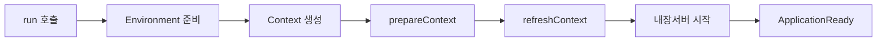
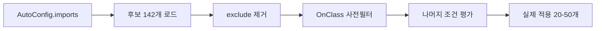
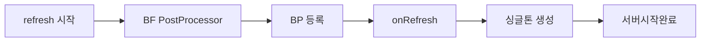
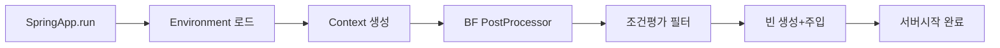

> **한 줄 요약:** Spring Boot 자동 구성은 `SpringApplication.run()` 한 줄에서 출발해 classpath 분석, `@Conditional` 평가, 조건부 빈 등록까지 수백 개의 자동 설정 후보를 걸러내는 정교한 파이프라인이다. 내부 메커니즘을 모르면 디버깅이 불가능하고, 알면 5분 안에 어디서 막혔는지 찾을 수 있다.

---

## 1. 비유 — 스마트 공장 라인과 품질 검수

> **비유:** 전통 Spring 설정은 수작업 공장이다. 부품(빈)을 일일이 조립 지시서(XML 또는 Java Config)에 적어야 한다. Spring Boot는 스마트 공장이다. 컨베이어 벨트 위에 수백 개의 부품 후보가 올라오지만, 각 부품 앞에 품질 검사관(`@Conditional`)이 서 있다. 검사관은 "이 부품이 실제로 필요한가? 이미 다른 부품이 같은 역할을 하는가?"를 체크한다. 통과한 부품만 최종 라인(ApplicationContext)으로 넘어간다.
>
> 중요한 점은 검사관이 단순히 "있냐 없냐"가 아니라 **타이밍**까지 따진다는 것이다. `@ConditionalOnMissingBean`은 사용자가 먼저 등록한 빈이 있는지를 본다. 사용자 설정이 자동 설정보다 **먼저** 처리되어야 이 조건이 의미가 있다. Spring Boot가 `DeferredImportSelector`를 쓰는 이유가 바로 이 순서 보장 때문이다.

---

## 2. SpringApplication.run() 내부 — 한 줄이 촉발하는 연쇄 반응

`SpringApplication.run(MyApplication.class, args)` 한 줄이 실행되면 내부적으로 8단계 파이프라인이 동작한다.

```java
// SpringApplication.java 핵심 흐름 (간략화)
public ConfigurableApplicationContext run(String... args) {

    // 1단계: SpringApplicationRunListeners 초기화
    //        META-INF/spring.factories에서 리스너 목록 로드
    SpringApplicationRunListeners listeners = getRunListeners(args);
    listeners.starting(bootstrapContext, this.mainApplicationClass);

    // 2단계: Environment 준비 — application.yml, 환경변수, 커맨드라인 인수 로드
    ConfigurableEnvironment environment = prepareEnvironment(listeners, bootstrapContext, applicationArguments);

    // 3단계: ApplicationContext 타입 결정 및 생성
    //        SERVLET 환경 → AnnotationConfigServletWebServerApplicationContext
    //        REACTIVE 환경 → AnnotationConfigReactiveWebServerApplicationContext
    //        NONE 환경 → AnnotationConfigApplicationContext
    context = createApplicationContext();

    // 4단계: FailureAnalyzer 등록 — 시작 실패 시 친절한 에러 메시지 제공
    context.setApplicationStartup(this.applicationStartup);

    // 5단계: prepareContext — BeanDefinitionLoader로 메인 클래스 등록
    //        여기서 @SpringBootApplication이 붙은 클래스가 BeanDefinition으로 등록됨
    prepareContext(bootstrapContext, context, environment, listeners,
                   applicationArguments, printedBanner);

    // 6단계: refreshContext — Spring의 핵심 refresh() 호출
    //        빈 정의 로드 → @Conditional 평가 → 빈 생성 → 의존성 주입
    //        내장 서버 시작도 여기서 발생
    refreshContext(context);

    // 7단계: afterRefresh — ApplicationRunner, CommandLineRunner 호출
    afterRefresh(context, applicationArguments);

    // 8단계: ApplicationReadyEvent 발행
    listeners.ready(context, timeTakenToReady);

    return context;
}
```



**refreshContext가 핵심인 이유:** 6단계 `refreshContext()`가 실제로 가장 많은 일을 한다. 이 안에서 `invokeBeanFactoryPostProcessors()`가 실행되고, `ConfigurationClassPostProcessor`가 모든 `@Configuration` 클래스를 파싱해 `@Bean` 메서드를 처리한다. 자동 구성 클래스들도 이 단계에서 `@Conditional` 평가를 거쳐 빈 정의에 추가되거나 제외된다.

---

## 3. @SpringBootApplication 분해 — 3개 어노테이션의 합성이 설계된 이유

```java
// @SpringBootApplication 소스 (핵심만 발췌)
@Target(ElementType.TYPE)
@Retention(RetentionPolicy.RUNTIME)
@Documented
@Inherited
@SpringBootConfiguration        // (1) = @Configuration의 특수화 버전
@EnableAutoConfiguration        // (2) 자동 구성 활성화 — 핵심
@ComponentScan(excludeFilters = {
    // TypeExcludeFilter: @SpringBootTest 테스트 시 사용하는 컴포넌트 분리용
    @Filter(type = FilterType.CUSTOM, classes = TypeExcludeFilter.class),
    // AutoConfigurationExcludeFilter: @Configuration이면서 자동 구성이기도 한 클래스를
    // 컴포넌트 스캔 대상에서 제외 — 자동 구성 클래스가 두 번 등록되는 것 방지
    @Filter(type = FilterType.CUSTOM, classes = AutoConfigurationExcludeFilter.class)
})
public @interface SpringBootApplication {

    // exclude: 특정 자동 구성 클래스를 클래스 레퍼런스로 제외
    @AliasFor(annotation = EnableAutoConfiguration.class)
    Class<?>[] exclude() default {};

    // excludeName: 클래스가 classpath에 없을 때도 이름으로 제외 가능
    @AliasFor(annotation = EnableAutoConfiguration.class)
    String[] excludeName() default {};

    // scanBasePackages: 컴포넌트 스캔 범위를 명시적으로 지정
    @AliasFor(annotation = ComponentScan.class, attribute = "basePackages")
    String[] scanBasePackages() default {};
}
```

### 3.1 @SpringBootConfiguration이 @Configuration과 다른 점

```java
@Target(ElementType.TYPE)
@Retention(RetentionPolicy.RUNTIME)
@Configuration
@Indexed   // ← 이것이 핵심 차이
public @interface SpringBootConfiguration {
    @AliasFor(annotation = Configuration.class)
    boolean proxyBeanMethods() default true;
}
```

`@Indexed`는 Spring의 컴포넌트 인덱스 기능을 위한 것이다. 컴파일 시 `META-INF/spring.components` 파일을 생성해 런타임에 classpath 스캔 비용을 줄인다. 또한 애플리케이션 컨텍스트 내에서 `@SpringBootConfiguration`이 붙은 클래스가 **정확히 하나**임을 보장하는 검증 로직(`SpringBootConfigurationFinder`)이 있다. 두 개 이상 존재하면 예외가 발생한다. `@SpringBootTest`가 설정 클래스를 자동으로 찾을 때도 `@SpringBootConfiguration`을 마커로 사용한다.

### 3.2 @ComponentScan basePackages를 명시하지 않는 이유와 함정

지정하지 않으면 `@SpringBootApplication`이 선언된 클래스의 패키지가 루트가 된다.

```
com.example.myapp
├── MyApplication.java         ← @SpringBootApplication 위치
├── controller
│   └── OrderController.java   ← 스캔됨
├── service
│   └── OrderService.java      ← 스캔됨
└── repository
    └── OrderRepository.java   ← 스캔됨
```

**함정 시나리오 1 — 메인 클래스를 하위 패키지에 배치할 때:**

```
com.example.myapp
├── config
│   └── MyApplication.java     ← 잘못된 위치: com.example.myapp.config 기준으로 스캔
├── controller
│   └── OrderController.java   ← 스캔 안 됨!
└── service
    └── OrderService.java      ← 스캔 안 됨!
```

`OrderController`는 `NoSuchBeanDefinitionException`이 아니라 HTTP 404로 나타나기 때문에 원인을 찾기가 더 어렵다.

**함정 시나리오 2 — 멀티 모듈 프로젝트에서 스캔 범위 불일치:**

```java
// 모듈 A: com.example.core 패키지에 공통 서비스
// 모듈 B: com.example.web 패키지에 메인 앱
@SpringBootApplication  // com.example.web만 스캔 → core 모듈 빈 미등록
public class WebApplication {}

// 해결책 1: scanBasePackages 명시
@SpringBootApplication(scanBasePackages = {"com.example.core", "com.example.web"})
public class WebApplication {}

// 해결책 2: 공통 상위 패키지에 메인 클래스 배치 (권장)
// com.example.Application → com.example.* 전체 스캔
```

```mermaid
graph LR
    A[@SpringBootApp] --> B[@SpringBootConfig]
    A --> C[@EnableAutoConfig]
    A --> D[@ComponentScan]
    C --> E[ImportSelector]
    E --> F[@Conditional 평가]
    F --> G[빈 등록]
```

---

## 4. @EnableAutoConfiguration과 AutoConfigurationImportSelector 내부 메커니즘

### 4.1 DeferredImportSelector — 왜 Deferred인가

```java
// AutoConfigurationImportSelector.java
public class AutoConfigurationImportSelector
        implements DeferredImportSelector,   // ← Deferred가 핵심
                   BeanClassLoaderAware,
                   ResourceLoaderAware,
                   BeanFactoryAware,
                   EnvironmentAware,
                   Ordered {

    @Override
    public Class<? extends Group> getImportGroup() {
        // AutoConfigurationGroup이 selectImports보다 나중에 실행되도록 그룹화
        return AutoConfigurationGroup.class;
    }
}
```

`DeferredImportSelector`는 일반 `ImportSelector`와 달리 **모든 `@Configuration` 클래스가 처리된 후** 실행된다. 이것이 결정적으로 중요하다.

- 일반 `ImportSelector`: 발견되는 즉시 실행 → 사용자 `@Bean`과 자동 구성 `@Bean` 중 누가 먼저 처리될지 불확실
- `DeferredImportSelector`: 사용자 `@Configuration`이 모두 처리된 후 실행 → `@ConditionalOnMissingBean`이 사용자 빈을 확실히 인식

이 설계가 없으면 `@ConditionalOnMissingBean`이 신뢰성 있게 동작하지 않는다.

### 4.2 selectImports 전체 흐름 — 142개 후보에서 실제 적용까지

```java
// AutoConfigurationGroup.process() — 간략화
public void process(AnnotationMetadata annotationMetadata,
                    DeferredImportSelector deferredImportSelector) {

    AutoConfigurationEntry autoConfigurationEntry =
        ((AutoConfigurationImportSelector) deferredImportSelector)
            .getAutoConfigurationEntry(annotationMetadata);

    this.autoConfigurationEntries.add(autoConfigurationEntry);
}

// AutoConfigurationImportSelector.getAutoConfigurationEntry()
protected AutoConfigurationEntry getAutoConfigurationEntry(
        AnnotationMetadata annotationMetadata) {

    // 1단계: AutoConfiguration.imports 파일에서 후보 목록 로드
    List<String> configurations = getCandidateConfigurations(
        annotationMetadata, attributes);
    // → 결과: 142개 (Spring Boot 3.2 기준)

    // 2단계: Set으로 중복 제거
    configurations = removeDuplicates(configurations);

    // 3단계: @SpringBootApplication(exclude=...) 또는
    //        spring.autoconfigure.exclude 프로퍼티로 지정된 것 제거
    Set<String> exclusions = getExclusions(annotationMetadata, attributes);
    checkExcludedClasses(configurations, exclusions);
    configurations.removeAll(exclusions);

    // 4단계: AutoConfigurationMetadata로 @ConditionalOnClass 사전 필터링
    //        실제 클래스를 로드하지 않고 메타데이터만 보는 것 — 성능 최적화
    configurations = getConfigurationClassFilter().filter(configurations);
    // → 결과: classpath 조건 미달로 대부분 탈락, 수십 개만 남음

    // 5단계: AutoConfigurationImportEvent 발행 (리스너에 통지)
    fireAutoConfigurationImportEvents(configurations, exclusions);

    return new AutoConfigurationEntry(configurations, exclusions);
}
```

### 4.3 AutoConfiguration.imports 파일 — Spring Boot 3.x 변경 이유

```
# 파일 위치: META-INF/spring/org.springframework.boot.autoconfigure.AutoConfiguration.imports
# Spring Boot 3.x (Spring Framework 6.x)

org.springframework.boot.autoconfigure.aop.AopAutoConfiguration
org.springframework.boot.autoconfigure.cache.CacheAutoConfiguration
org.springframework.boot.autoconfigure.context.MessageSourceAutoConfiguration
org.springframework.boot.autoconfigure.data.jpa.JpaRepositoriesAutoConfiguration
org.springframework.boot.autoconfigure.jackson.JacksonAutoConfiguration
org.springframework.boot.autoconfigure.jdbc.DataSourceAutoConfiguration
org.springframework.boot.autoconfigure.orm.jpa.HibernateJpaAutoConfiguration
org.springframework.boot.autoconfigure.security.servlet.SecurityAutoConfiguration
org.springframework.boot.autoconfigure.web.servlet.DispatcherServletAutoConfiguration
org.springframework.boot.autoconfigure.web.servlet.WebMvcAutoConfiguration
# ... 132개 더
```

**Spring Boot 2.x의 `spring.factories`에서 3.x의 `AutoConfiguration.imports`로 바뀐 이유:**

Spring Boot 2.x까지는 `META-INF/spring.factories`에 `EnableAutoConfiguration` 키로 자동 구성 목록을 관리했다. 이 파일은 자동 구성 외에도 `ApplicationListener`, `ApplicationContextInitializer` 등 여러 종류의 팩토리가 혼재했다. Spring Boot 3.x에서는 자동 구성만을 위한 별도 파일로 분리했다. GraalVM 네이티브 이미지 컴파일 시 메타데이터 처리가 명확해지고, AOT(Ahead-of-Time) 처리 단계에서 자동 구성 후보를 정적으로 분석하기 위해서다.



---

## 5. @Conditional 어노테이션 — 평가 타이밍과 내부 동작

### 5.1 @ConditionalOnClass — classpath 검사의 함정

```java
// DataSourceAutoConfiguration에서 실제 사용 예
@AutoConfiguration(before = SqlInitializationAutoConfiguration.class)
@ConditionalOnClass({ DataSource.class, EmbeddedDatabaseType.class })
@ConditionalOnMissingBean(type = "io.r2dbc.spi.ConnectionFactory")
@EnableConfigurationProperties(DataSourceProperties.class)
@Import(DataSourcePoolMetadataProvidersConfiguration.class)
public class DataSourceAutoConfiguration {
    // ...
}
```

`@ConditionalOnClass`의 내부 동작:

```java
// OnClassCondition.java (간략화)
@Order(Ordered.HIGHEST_PRECEDENCE)
class OnClassCondition extends FilteringSpringBootCondition {

    @Override
    protected final ConditionOutcome[] getOutcomes(
            String[] autoConfigurationClasses,
            AutoConfigurationMetadata autoConfigurationMetadata) {

        // 성능 최적화: 클래스를 실제로 로드하지 않고 ClassLoader.findResource()로 확인
        // com.example.Foo → com/example/Foo.class 파일 존재 여부만 체크
        // 실제 클래스 초기화 비용 없음
        return split(autoConfigurationClasses.length / 2)
            .mapToObj(i -> getOutcome(autoConfigurationClasses[i * 2],
                                     autoConfigurationClasses[i * 2 + 1],
                                     autoConfigurationMetadata))
            .toArray(ConditionOutcome[]::new);
    }
}
```

**함정 — 클래스는 있지만 기능이 없는 경우:**

```java
// 잘못된 자동 구성 설계
@ConditionalOnClass(RedisTemplate.class)
public class RedisAutoConfiguration {
    // RedisTemplate 클래스만 있고 실제 서버 연결 정보가 없어도 빈을 등록 시도
    // → spring.redis.host를 별도로 체크해야 함
}

// 올바른 설계
@ConditionalOnClass(RedisTemplate.class)
@ConditionalOnProperty(name = "spring.redis.host")  // 연결 정보도 필수
public class RedisAutoConfiguration {
    // 클래스도 있고 설정도 있을 때만 등록
}
```

### 5.2 @ConditionalOnMissingBean — 사용자 오버라이드의 핵심 메커니즘

```java
// 실제 Jackson 자동 구성에서의 패턴
@Configuration(proxyBeanMethods = false)
@ConditionalOnClass(ObjectMapper.class)
public class JacksonAutoConfiguration {

    @Configuration(proxyBeanMethods = false)
    @ConditionalOnClass(Jackson2ObjectMapperBuilder.class)
    static class JacksonObjectMapperBuilderConfiguration {

        @Bean
        @Scope("prototype")
        // ObjectMapper 빈이 없을 때만 — 핵심
        @ConditionalOnMissingBean
        Jackson2ObjectMapperBuilder jacksonObjectMapperBuilder(
                JacksonProperties jacksonProperties,
                List<Jackson2ObjectMapperBuilderCustomizer> customizers) {
            // 기본 ObjectMapper 빌더 생성
        }
    }

    @Configuration(proxyBeanMethods = false)
    @ConditionalOnClass(Jackson2ObjectMapperBuilder.class)
    static class JacksonObjectMapperConfiguration {

        @Bean
        @Primary
        @ConditionalOnMissingBean   // 사용자가 ObjectMapper를 직접 만들면 스킵
        ObjectMapper jacksonObjectMapper(Jackson2ObjectMapperBuilder builder) {
            return builder.build();
        }
    }
}
```

사용자가 직접 `ObjectMapper`를 정의하는 경우:

```java
// 사용자 설정 클래스 — DeferredImportSelector 덕분에 자동 구성보다 먼저 처리됨
@Configuration
public class AppConfig {

    @Bean
    public ObjectMapper customObjectMapper() {
        return Jackson2ObjectMapperBuilder.json()
            // ISO 8601 날짜 형식
            .featuresToDisable(SerializationFeature.WRITE_DATES_AS_TIMESTAMPS)
            // null 필드 제외
            .serializationInclusion(JsonInclude.Include.NON_NULL)
            // snake_case 변환
            .propertyNamingStrategy(PropertyNamingStrategies.SNAKE_CASE)
            .build();
    }
}
```

이 경우 `JacksonObjectMapperConfiguration`의 `@ConditionalOnMissingBean`이 `false`가 되어 자동 구성의 `ObjectMapper`는 생성되지 않는다. 사용자 `ObjectMapper`만 남는다.

**주의사항 — `@ConditionalOnMissingBean`의 타입 지정:**

```java
// 타입을 지정하지 않으면 해당 @Bean 메서드의 반환 타입으로 체크
@Bean
@ConditionalOnMissingBean           // ObjectMapper 타입으로 체크
ObjectMapper jacksonObjectMapper() {}

// 타입을 명시적으로 지정
@Bean
@ConditionalOnMissingBean(ObjectMapper.class)  // 명확
ObjectMapper jacksonObjectMapper() {}

// 이름으로 체크 — 타입이 달라도 이름이 같으면 스킵
@Bean
@ConditionalOnMissingBean(name = "objectMapper")
ObjectMapper jacksonObjectMapper() {}
```

### 5.3 @ConditionalOnProperty — 기능 플래그 패턴

```java
// 캐시 자동 구성 예시
@AutoConfiguration(after = CacheAutoConfiguration.class)
@ConditionalOnClass(RedisCacheManager.class)
// spring.cache.type=redis 또는 spring.cache.type이 없을 때 (matchIfMissing=true면 기본 활성화)
@ConditionalOnProperty(
    prefix = "spring.cache",
    name = "type",
    havingValue = "redis",
    matchIfMissing = false
)
public class RedisCacheAutoConfiguration {
    // redis 캐시 타입이 명시적으로 설정됐을 때만 적용
}
```

```java
// 실무 패턴 — 피처 플래그
@Configuration
@ConditionalOnProperty(
    prefix = "feature",
    name = "new-order-flow.enabled",
    havingValue = "true",
    matchIfMissing = false  // 기본값: 비활성화 (안전)
)
public class NewOrderFlowConfiguration {

    @Bean
    public OrderFlowService newOrderFlowService() {
        return new NewOrderFlowService();
    }
}
```

```yaml
# application.yml
feature:
  new-order-flow:
    enabled: false  # 기본 비활성화

---
spring:
  config:
    activate:
      on-profile: canary
feature:
  new-order-flow:
    enabled: true  # canary 프로파일에서만 활성화
```

### 5.4 기타 중요 @Conditional 어노테이션

```java
// 웹 환경 여부 체크
@ConditionalOnWebApplication(type = ConditionalOnWebApplication.Type.SERVLET)
public class WebMvcAutoConfiguration { }

// 특정 빈이 이미 등록되어 있을 때만 (OnMissingBean의 반대)
@ConditionalOnBean(DataSource.class)
public class JpaAutoConfiguration { }

// 특정 리소스가 classpath에 있을 때
@ConditionalOnResource(resources = "classpath:hibernate.cfg.xml")
public class HibernateAutoConfiguration { }

// 표현식 기반 — SpEL 사용
@Conditional(OnMyCustomCondition.class)
public class MyAutoConfiguration { }

// 직접 Condition 구현
public class OnMyCustomCondition implements Condition {

    @Override
    public boolean matches(ConditionContext context, AnnotatedTypeMetadata metadata) {
        // context.getEnvironment()로 환경 접근
        // context.getBeanFactory()로 등록된 빈 확인
        // context.getClassLoader()로 classpath 확인
        String osName = context.getEnvironment()
            .getProperty("os.name", "").toLowerCase();
        return osName.contains("linux");  // Linux에서만 활성화
    }
}
```

**@Conditional 평가 타이밍 — 중요:**

```
BeanDefinition 등록 단계 (refresh → invokeBeanFactoryPostProcessors)
  ↓
ConfigurationClassParser가 @Configuration 클래스 파싱
  ↓
각 @Bean 메서드에 달린 @Conditional 평가
  ↓
조건 통과 → BeanDefinition 등록
조건 실패 → 해당 BeanDefinition 건너뜀
```

조건 평가는 빈 **생성** 시점이 아니라 빈 **정의 등록** 시점이다. 이것이 중요한 이유는 `@ConditionalOnMissingBean`이 이미 등록된 BeanDefinition을 기준으로 체크하기 때문이다.

---

## 6. @ConfigurationProperties — 외부 설정 바인딩의 내부 동작

### 6.1 Binder API — relaxed binding 규칙 완전 분석

Spring Boot의 `Binder`는 다양한 형식의 프로퍼티 키를 하나의 표준 형식으로 정규화한 후 바인딩한다.

```java
// 표준 형식: kebab-case (권장)
// 아래 4가지 모두 spring.datasource.maximumPoolSize에 바인딩됨
spring.datasource.maximum-pool-size=10      // kebab-case (공식 권장)
spring.datasource.maximumPoolSize=10        // camelCase
spring.datasource.maximum_pool_size=10      // underscore
SPRING_DATASOURCE_MAXIMUM_POOL_SIZE=10      // 환경변수 (대문자 + 언더스코어)
```

`Binder` 내부 정규화 로직:

```java
// ConfigurationPropertyName.java (간략화)
public class ConfigurationPropertyName {

    // "maximumPoolSize" → ["maximum", "pool", "size"]
    // "maximum-pool-size" → ["maximum", "pool", "size"]
    // "MAXIMUM_POOL_SIZE" → ["maximum", "pool", "size"]
    // 모두 동일한 내부 표현으로 정규화
    private static List<String> splitElements(CharSequence name) {
        // 대문자, 하이픈, 언더스코어로 분리하는 로직
        // 결과는 소문자 요소 리스트
    }
}
```

```java
// @ConfigurationProperties 실제 활용
@ConfigurationProperties(prefix = "myapp.datasource")
@Validated
public class MyDataSourceProperties {

    @NotBlank
    private String url;

    @NotBlank
    private String username;

    private String password;

    // Duration 타입 자동 파싱
    // application.yml: myapp.datasource.connection-timeout=30s
    // → 30초 Duration으로 자동 변환
    @DurationUnit(ChronoUnit.SECONDS)
    private Duration connectionTimeout = Duration.ofSeconds(30);

    // DataSize 타입 자동 파싱
    // application.yml: myapp.datasource.max-buffer-size=1MB
    @DataSizeUnit(DataUnit.MEGABYTES)
    private DataSize maxBufferSize = DataSize.ofMegabytes(10);

    // List, Map 바인딩
    // myapp.datasource.allowed-hosts[0]=host1
    // myapp.datasource.allowed-hosts[1]=host2
    private List<String> allowedHosts = new ArrayList<>();

    // Map 바인딩
    // myapp.datasource.properties.cachePrepStmts=true
    private Map<String, String> properties = new HashMap<>();

    // getter, setter 필수 (record 타입이면 생략 가능 — Spring Boot 3.x)
}
```

**Spring Boot 3.x에서 record 타입 지원:**

```java
// Spring Boot 3.x — record로 불변 프로퍼티 객체
@ConfigurationProperties(prefix = "myapp.server")
public record ServerProperties(
    @NotBlank String host,
    @Min(1) @Max(65535) int port,
    @NotNull Duration timeout
) {}
```

### 6.2 @Value vs @ConfigurationProperties — 왜 타입 안전이 중요한가

```java
// @Value 방식의 문제점
@Component
public class EmailService {

    // 1. 오타가 컴파일 타임에 잡히지 않음
    @Value("${myapp.mail.smptHost}")  // "smtp"를 "smpt"로 오타 → 런타임 에러
    private String smtpHost;

    // 2. SpEL 기본값 표현이 복잡함
    @Value("${myapp.mail.port:587}")
    private int port;

    // 3. 타입 변환 실패가 런타임에만 발견됨
    @Value("${myapp.mail.timeout}")  // "30초" 같은 값이면 int 파싱 실패
    private int timeout;

    // 4. @Validated 적용 불가 → 잘못된 설정이 앱 시작 후에야 발견됨

    // 5. IDE 자동 완성 없음
}
```

```java
// @ConfigurationProperties 방식의 장점
@ConfigurationProperties(prefix = "myapp.mail")
@Validated
public class MailProperties {

    @NotBlank
    // IDE에서 myapp.mail.smtp-host 자동 완성 지원
    // spring-boot-configuration-processor가 metadata/spring-configuration-metadata.json 생성
    private String smtpHost;

    @Min(1) @Max(65535)
    private int port = 587;

    // Duration 타입으로 "30s", "1m", "PT30S" 모두 파싱
    private Duration timeout = Duration.ofSeconds(30);

    private boolean useSsl = true;

    // 시작 시점에 @NotBlank 위반 즉시 예외 발생 → 빠른 실패(fail-fast)
}
```

### 6.3 spring-boot-configuration-processor — 메타데이터 생성

```xml
<!-- pom.xml에 추가 -->
<dependency>
    <groupId>org.springframework.boot</groupId>
    <artifactId>spring-boot-configuration-processor</artifactId>
    <optional>true</optional>  <!-- 컴파일 시에만 필요, 런타임 불필요 -->
</dependency>
```

프로세서가 컴파일 시 `META-INF/spring-configuration-metadata.json`을 생성한다:

```json
{
  "groups": [{
    "name": "myapp.mail",
    "type": "com.example.MailProperties",
    "sourceType": "com.example.MailProperties"
  }],
  "properties": [{
    "name": "myapp.mail.smtp-host",
    "type": "java.lang.String",
    "description": "SMTP 서버 호스트명",
    "sourceType": "com.example.MailProperties"
  }, {
    "name": "myapp.mail.port",
    "type": "java.lang.Integer",
    "description": "SMTP 포트",
    "defaultValue": 587,
    "sourceType": "com.example.MailProperties"
  }]
}
```

IntelliJ, VS Code가 이 메타데이터를 읽어 `application.yml` 편집 시 자동 완성과 타입 검증을 제공한다.

### 6.4 설정 우선순위 — PropertySource 체인 내부

```
우선순위 (높음 → 낮음):
1. 커맨드라인 인수       --server.port=9090
2. SPRING_APPLICATION_JSON (환경변수 또는 시스템 프로퍼티)
3. ServletConfig init-params
4. ServletContext init-params
5. JNDI (java:comp/env/...)
6. Java 시스템 프로퍼티  -Dserver.port=9090
7. OS 환경변수           SERVER_PORT=9090
8. RandomValuePropertySource (random.*)
9. application-{profile}.yml (활성 프로파일)
10. application.yml
11. @PropertySource 어노테이션
12. 기본값 (SpringApplication.setDefaultProperties)
```

**왜 이 우선순위로 설계됐는가:**

Docker/Kubernetes 환경에서 실행 중인 컨테이너의 설정을 변경할 때 재배포 없이 환경변수나 커맨드라인으로 오버라이드할 수 있어야 한다. 코드(application.yml)에 박힌 값이 가장 낮은 우선순위이고, 런타임 주입 방식이 높은 우선순위를 가지는 이유다.

---

## 7. Spring Boot 스타트업 상세 — BeanDefinitionLoader와 컨텍스트 준비

### 7.1 prepareContext 단계 — 메인 클래스 등록 과정

```java
// SpringApplication.java
private void prepareContext(DefaultBootstrapContext bootstrapContext,
                            ConfigurableApplicationContext context,
                            ConfigurableEnvironment environment,
                            SpringApplicationRunListeners listeners,
                            ApplicationArguments applicationArguments,
                            Banner printedBanner) {

    // Environment를 컨텍스트에 연결
    context.setEnvironment(environment);

    // ApplicationContext 후처리 (BeanNameGenerator, ResourceLoader 등 설정)
    postProcessApplicationContext(context);

    // ApplicationContextInitializer 호출
    // META-INF/spring.factories에 등록된 초기화 로직
    applyInitializers(context);

    listeners.contextPrepared(context);

    // 메인 클래스(@SpringBootApplication 클래스)를 BeanDefinitionLoader로 등록
    // 이것이 컴포넌트 스캔의 시작점
    load(context, sources.toArray(new Object[0]));

    listeners.contextLoaded(context);
}

// BeanDefinitionLoader.load()
void load(Object source) {
    if (source instanceof Class<?> clazz) {
        // 어노테이션 기반 — @SpringBootApplication 클래스가 여기 해당
        load(clazz);
    } else if (source instanceof Resource resource) {
        // XML 기반 — 레거시
        load(resource);
    } else if (source instanceof Package pkg) {
        // 패키지 기반 스캔
        load(pkg);
    }
}
```

### 7.2 refreshContext — 가장 중요한 단계

```java
// AbstractApplicationContext.refresh() 핵심 단계들
public void refresh() throws BeansException, IllegalStateException {

    // 1. BeanFactory 준비
    ConfigurableListableBeanFactory beanFactory = obtainFreshBeanFactory();
    prepareBeanFactory(beanFactory);

    // 2. BeanFactoryPostProcessor 실행
    //    ConfigurationClassPostProcessor가 여기서 실행됨
    //    → @Configuration, @Bean, @ComponentScan, @Import 처리
    //    → AutoConfigurationImportSelector (DeferredImportSelector) 처리
    //    → 모든 BeanDefinition이 이 단계에서 등록 완료
    invokeBeanFactoryPostProcessors(beanFactory);

    // 3. BeanPostProcessor 등록
    //    @Autowired, @Value 처리할 AutowiredAnnotationBeanPostProcessor 등
    registerBeanPostProcessors(beanFactory);

    // 4. MessageSource 초기화 (i18n)
    initMessageSource();

    // 5. ApplicationEventMulticaster 초기화
    initApplicationEventMulticaster();

    // 6. 서브클래스 훅 — 웹 컨텍스트에서 여기서 내장 서버 생성
    //    AnnotationConfigServletWebServerApplicationContext.onRefresh()
    //    → TomcatServletWebServerFactory.getWebServer() 호출
    onRefresh();

    // 7. ApplicationListener 등록
    registerListeners();

    // 8. 나머지 싱글톤 빈 생성 (지연 로딩이 아닌 것들)
    //    @Autowired 의존성 주입, @PostConstruct 실행
    finishBeanFactoryInitialization(beanFactory);

    // 9. 컨텍스트 완료
    //    내장 서버 시작 완료, ContextRefreshedEvent 발행
    finishRefresh();
}
```



---

## 8. 내장 서버 자동 구성 — Tomcat이 JAR 안에 있는 이유

### 8.1 ServletWebServerFactory 추상화

```java
// 내장 서버 추상화 인터페이스
public interface ServletWebServerFactory {
    WebServer getWebServer(ServletContextInitializer... initializers);
}

// Tomcat 구현체
public class TomcatServletWebServerFactory implements ServletWebServerFactory {

    @Override
    public WebServer getWebServer(ServletContextInitializer... initializers) {
        Tomcat tomcat = new Tomcat();

        // 임시 디렉토리 설정
        File baseDir = createTempDir("tomcat");
        tomcat.setBaseDir(baseDir.getAbsolutePath());

        // 커넥터 설정
        Connector connector = new Connector(this.protocol);
        connector.setThrowOnFailure(true);
        tomcat.getService().addConnector(connector);
        customizeConnector(connector);
        tomcat.setConnector(connector);

        // 호스트 설정
        tomcat.getHost().setAutoDeploy(false);

        // Context 설정 (웹 앱 컨텍스트)
        prepareContext(tomcat.getHost(), initializers);

        return getTomcatWebServer(tomcat);
    }
}
```

### 8.2 EmbeddedWebServerFactoryCustomizerAutoConfiguration — 자동 구성 체인

```java
// 내장 서버 자동 구성 흐름
@AutoConfiguration
@ConditionalOnWebApplication   // 웹 앱일 때만
@EnableConfigurationProperties(ServerProperties.class)  // server.* 바인딩
public class EmbeddedWebServerFactoryCustomizerAutoConfiguration {

    @Configuration(proxyBeanMethods = false)
    @ConditionalOnClass({ Tomcat.class, UpgradeProtocol.class })
    public static class TomcatWebServerFactoryCustomizerConfiguration {

        @Bean
        public TomcatWebServerFactoryCustomizer tomcatWebServerFactoryCustomizer(
                Environment environment, ServerProperties serverProperties) {
            // ServerProperties를 Tomcat 설정에 적용
            // server.tomcat.max-threads, server.tomcat.accept-count 등
            return new TomcatWebServerFactoryCustomizer(environment, serverProperties);
        }
    }

    @Configuration(proxyBeanMethods = false)
    @ConditionalOnClass({ Server.class, Loader.class, WebAppContext.class })
    public static class JettyWebServerFactoryCustomizerConfiguration {
        // Jetty가 classpath에 있을 때
    }

    @Configuration(proxyBeanMethods = false)
    @ConditionalOnClass({ Undertow.class, SslClientAuthMode.class })
    public static class UndertowWebServerFactoryCustomizerConfiguration {
        // Undertow가 classpath에 있을 때
    }
}
```

### 8.3 Tomcat에서 Undertow로 교체 — @Conditional이 교체를 가능하게 하는 이유

```xml
<!-- Tomcat 제거 후 Undertow 사용 -->
<dependency>
    <groupId>org.springframework.boot</groupId>
    <artifactId>spring-boot-starter-web</artifactId>
    <exclusions>
        <exclusion>
            <groupId>org.springframework.boot</groupId>
            <artifactId>spring-boot-starter-tomcat</artifactId>
        </exclusion>
    </exclusions>
</dependency>
<dependency>
    <groupId>org.springframework.boot</groupId>
    <artifactId>spring-boot-starter-undertow</artifactId>
</dependency>
```

Tomcat을 제외하면 `Tomcat.class`가 classpath에서 사라진다. `TomcatWebServerFactoryCustomizerConfiguration`의 `@ConditionalOnClass({ Tomcat.class, ... })`가 `false`가 된다. Undertow를 추가하면 `Undertow.class`가 생기고 `UndertowWebServerFactoryCustomizerConfiguration`의 조건이 `true`가 된다. 코드 변경 없이 의존성만 교체하면 서버가 바뀌는 이유다.

**Undertow를 선택하는 실제 이유:**

Undertow는 NIO 기반 비동기 아키텍처로 설계되어 Tomcat보다 컨텍스트 스위칭 비용이 낮다. 특히 초당 수천 개의 짧은 연결을 처리하는 API 게이트웨이나 마이크로서비스에서 Tomcat 대비 10~30% 낮은 메모리 사용량을 보인다. 그러나 JSP, CGI 같은 레거시 기능이 필요하면 Tomcat이 필수다.

```java
// 커스텀 Tomcat 설정 — WebServerFactoryCustomizer 구현
@Component
public class CustomTomcatCustomizer
        implements WebServerFactoryCustomizer<TomcatServletWebServerFactory> {

    @Override
    public void customize(TomcatServletWebServerFactory factory) {
        // 커넥터 최적화
        factory.addConnectorCustomizers(connector -> {
            ProtocolHandler handler = connector.getProtocolHandler();
            if (handler instanceof Http11NioProtocol protocol) {
                protocol.setMaxThreads(200);
                protocol.setMinSpareThreads(20);
                protocol.setAcceptCount(100);
                // Keep-alive 최적화
                protocol.setMaxKeepAliveRequests(100);
                protocol.setKeepAliveTimeout(20000);
            }
        });

        // AJP 비활성화 (보안)
        factory.setProtocol("org.apache.coyote.http11.Http11NioProtocol");

        // 압축 설정
        factory.addContextCustomizers(context -> {
            context.addFilterDef(createGzipFilterDef());
        });
    }
}
```

---

## 9. Actuator — 운영 계기판의 내부 구조

### 9.1 Health 엔드포인트 내부 — CompositeHealthContributor

```java
// Actuator Health 체계
// HealthEndpoint → CompositeHealthContributor → 개별 HealthIndicator

@Endpoint(id = "health")
public class HealthEndpoint extends HealthEndpointSupport<HealthContributor, HealthComponent> {

    @ReadOperation
    public HealthComponent health() {
        // 모든 HealthIndicator를 취합
        return getHealth(ApiVersion.V3, WebEndpointResponse.STATUS_OK);
    }
}
```

Spring Boot가 자동으로 등록하는 `HealthIndicator`:

```java
// DataSourceHealthIndicator — DB 연결 상태
@Bean
@ConditionalOnBean(DataSource.class)
@ConditionalOnEnabledHealthIndicator("db")
DataSourceHealthIndicator dbHealthIndicator(Map<String, DataSource> dataSources) {
    return new DataSourceHealthIndicator(dataSources, this.properties.getValidationQuery());
}

// DiskSpaceHealthIndicator — 디스크 여유 공간
// RedisHealthIndicator — Redis 연결
// RabbitHealthIndicator — RabbitMQ 연결
```

커스텀 `HealthIndicator` 구현:

```java
@Component
// "externalPayment" 이름으로 /actuator/health 응답에 포함됨
public class PaymentGatewayHealthIndicator implements HealthIndicator {

    private final PaymentGatewayClient client;
    private final HealthIndicatorProperties properties;

    @Override
    public Health health() {
        try {
            // 타임아웃 설정 — 느린 외부 서비스가 health 체크 전체를 지연시키지 않도록
            long startTime = System.currentTimeMillis();
            PingResponse response = client.ping(Duration.ofSeconds(3));
            long elapsed = System.currentTimeMillis() - startTime;

            return Health.up()
                .withDetail("gateway", "reachable")
                .withDetail("responseTimeMs", elapsed)
                .withDetail("version", response.getApiVersion())
                .build();

        } catch (TimeoutException e) {
            return Health.down()
                .withDetail("gateway", "timeout after 3s")
                .withDetail("action", "check payment gateway connectivity")
                .build();

        } catch (Exception e) {
            // 스택 트레이스를 그대로 노출하면 내부 정보 유출
            return Health.down()
                .withDetail("gateway", "unreachable")
                .withDetail("errorType", e.getClass().getSimpleName())
                // 민감 정보(URL, 포트)는 포함하지 않음
                .build();
        }
    }
}
```

**Kubernetes와의 통합 — readiness vs liveness:**

```yaml
management:
  endpoint:
    health:
      probes:
        enabled: true   # /actuator/health/liveness, /actuator/health/readiness 활성화
  health:
    livenessState:
      enabled: true
    readinessState:
      enabled: true
```

```java
// 어플리케이션이 준비되지 않았음을 programmatically 신호
@EventListener(ApplicationReadyEvent.class)
public void onReady(ApplicationReadyEvent event) {
    // 워밍업 작업 (캐시 로드, 커넥션 풀 준비 등)
    warmUpCaches();

    // 준비 완료 신호 — Kubernetes가 트래픽을 보내기 시작
    AvailabilityChangeEvent.publish(event.getApplicationContext(),
        ReadinessState.ACCEPTING_TRAFFIC);
}
```

### 9.2 Micrometer — 메트릭 수집 계층

```java
// MeterRegistry를 통한 메트릭 기록
@Service
public class OrderService {

    private final MeterRegistry meterRegistry;
    private final Counter orderCreatedCounter;
    private final Timer orderProcessingTimer;

    public OrderService(MeterRegistry meterRegistry) {
        this.meterRegistry = meterRegistry;

        // 카운터 — 단순 증가
        this.orderCreatedCounter = Counter.builder("orders.created")
            .description("생성된 주문 수")
            .tag("region", "kr")
            .register(meterRegistry);

        // 타이머 — 소요 시간과 횟수
        this.orderProcessingTimer = Timer.builder("orders.processing.time")
            .description("주문 처리 소요 시간")
            .publishPercentiles(0.5, 0.95, 0.99)  // p50, p95, p99
            .register(meterRegistry);
    }

    public Order createOrder(CreateOrderRequest request) {
        orderCreatedCounter.increment();

        return orderProcessingTimer.record(() -> {
            // 실제 주문 생성 로직
            return processOrder(request);
        });
    }
}
```

```yaml
# Prometheus 메트릭 노출
management:
  endpoints:
    web:
      exposure:
        include: health, info, metrics, prometheus
  metrics:
    export:
      prometheus:
        enabled: true
    tags:
      application: ${spring.application.name}
      environment: ${spring.profiles.active}
```

Micrometer가 추상화 계층을 제공하기 때문에 `MeterRegistry` 코드를 변경하지 않고 Prometheus, Datadog, CloudWatch 등으로 백엔드를 교체할 수 있다. 의존성 교체만으로 충분하다.

### 9.3 Info 엔드포인트 커스터마이징

```java
// 빌드 정보 포함
// pom.xml에서 spring-boot-maven-plugin의 buildInfo() 설정 시 자동 생성
@Component
public class CustomInfoContributor implements InfoContributor {

    private final BuildProperties buildProperties;
    private final GitProperties gitProperties;

    @Override
    public void contribute(Info.Builder builder) {
        builder.withDetail("build", Map.of(
            "version", buildProperties.getVersion(),
            "time", buildProperties.getTime(),
            "artifact", buildProperties.getArtifact()
        ));

        builder.withDetail("git", Map.of(
            "branch", gitProperties.getBranch(),
            "commit", gitProperties.getShortCommitId(),
            "time", gitProperties.getCommitTime()
        ));

        // 런타임 정보
        Runtime runtime = Runtime.getRuntime();
        builder.withDetail("runtime", Map.of(
            "javaVersion", System.getProperty("java.version"),
            "processors", runtime.availableProcessors(),
            "maxMemoryMB", runtime.maxMemory() / 1024 / 1024
        ));
    }
}
```

### 9.4 Actuator 보안 설정 — 운영 필수

```java
// Actuator 엔드포인트 보안
@Configuration
@EnableWebSecurity
public class ActuatorSecurityConfig {

    @Bean
    public SecurityFilterChain actuatorSecurityFilterChain(HttpSecurity http) throws Exception {
        http
            .securityMatcher("/actuator/**")
            .authorizeHttpRequests(auth -> auth
                // health, info는 익명 접근 허용 (Kubernetes probe용)
                .requestMatchers("/actuator/health/**", "/actuator/info")
                    .permitAll()
                // 나머지는 ACTUATOR_ADMIN 권한 필요
                .requestMatchers("/actuator/**")
                    .hasRole("ACTUATOR_ADMIN")
                .anyRequest().denyAll()
            )
            // 내부 네트워크에서만 접근 가능하도록 IP 제한
            .requestMatchers(request ->
                isInternalNetwork(request.getRemoteAddr()));

        return http.build();
    }

    private boolean isInternalNetwork(String remoteAddr) {
        // 10.0.0.0/8, 172.16.0.0/12, 192.168.0.0/16 체크
        return remoteAddr.startsWith("10.") ||
               remoteAddr.startsWith("172.") ||
               remoteAddr.startsWith("192.168.");
    }
}
```

---

## 10. 커스텀 스타터 구현 — autoconfigure 모듈 + starter 모듈

### 10.1 스타터 모듈 구조 — 두 개 모듈로 분리하는 이유

```
my-notification-starter/           ← 루트 프로젝트
├── my-notification-autoconfigure/ ← 실제 자동 구성 로직
│   ├── src/main/java/
│   │   └── com/example/notification/
│   │       ├── autoconfigure/
│   │       │   └── NotificationAutoConfiguration.java
│   │       ├── NotificationProperties.java
│   │       └── NotificationService.java
│   └── src/main/resources/
│       └── META-INF/spring/
│           └── org.springframework.boot.autoconfigure.AutoConfiguration.imports
└── my-notification-starter/       ← 의존성 집합만 관리 (코드 없음)
    └── pom.xml
```

**왜 두 모듈로 분리하는가:**

`autoconfigure` 모듈: 자동 구성 로직. 자동 구성이 필요한 라이브러리들을 `optional` 의존성으로 선언. `@ConditionalOnClass`로 해당 라이브러리가 있을 때만 활성화.

`starter` 모듈: 코드 없음. 사용자가 추가할 의존성의 집합만 관리. `autoconfigure` 모듈 + 필요한 라이브러리들을 `compile` 의존성으로 묶음.

이 분리 덕분에 `autoconfigure` 모듈만 다른 자동 구성과 함께 사용할 수 있다. `starter` 없이 `autoconfigure`만 직접 사용하는 고급 사용 시나리오를 지원한다.

### 10.2 완전한 커스텀 스타터 구현 — Slack 알림 예시

```java
// 1. Properties 클래스
@ConfigurationProperties(prefix = "notification.slack")
@Validated
public class SlackNotificationProperties {

    /** Slack Webhook URL */
    @NotBlank
    private String webhookUrl;

    /** 기본 채널 (웹훅 URL에 이미 채널이 설정되어 있으면 무시됨) */
    private String defaultChannel = "#alerts";

    /** 알림 발신자 이름 */
    private String username = "Spring Boot App";

    /** 타임아웃 */
    private Duration timeout = Duration.ofSeconds(5);

    /** 재시도 횟수 */
    @Min(0) @Max(5)
    private int retryCount = 2;

    // getter, setter 생략
}
```

```java
// 2. 알림 서비스
public class SlackNotificationService {

    private final RestTemplate restTemplate;
    private final SlackNotificationProperties properties;

    public SlackNotificationService(RestTemplate restTemplate,
                                    SlackNotificationProperties properties) {
        this.restTemplate = restTemplate;
        this.properties = properties;
    }

    public void sendAlert(String message, NotificationLevel level) {
        String emoji = switch (level) {
            case INFO -> ":information_source:";
            case WARNING -> ":warning:";
            case ERROR -> ":red_circle:";
        };

        Map<String, Object> payload = Map.of(
            "username", properties.getUsername(),
            "channel", properties.getDefaultChannel(),
            "text", emoji + " " + message
        );

        // 재시도 로직
        for (int attempt = 0; attempt <= properties.getRetryCount(); attempt++) {
            try {
                restTemplate.postForObject(
                    properties.getWebhookUrl(), payload, String.class);
                return;  // 성공
            } catch (RestClientException e) {
                if (attempt == properties.getRetryCount()) {
                    throw new NotificationException("Slack 전송 실패", e);
                }
            }
        }
    }
}
```

```java
// 3. AutoConfiguration 클래스
@AutoConfiguration
// RestTemplate이 있을 때만 (spring-web 의존성 필요)
@ConditionalOnClass(RestTemplate.class)
// notification.slack.webhook-url이 설정된 경우에만
// matchIfMissing=false: 설정 없이는 자동으로 비활성화 (안전한 기본값)
@ConditionalOnProperty(
    prefix = "notification.slack",
    name = "webhook-url",
    matchIfMissing = false
)
@EnableConfigurationProperties(SlackNotificationProperties.class)
public class SlackNotificationAutoConfiguration {

    @Bean
    @ConditionalOnMissingBean
    public RestTemplate slackRestTemplate(SlackNotificationProperties properties) {
        SimpleClientHttpRequestFactory factory = new SimpleClientHttpRequestFactory();
        factory.setConnectTimeout((int) properties.getTimeout().toMillis());
        factory.setReadTimeout((int) properties.getTimeout().toMillis());
        return new RestTemplate(factory);
    }

    @Bean
    @ConditionalOnMissingBean(SlackNotificationService.class)
    public SlackNotificationService slackNotificationService(
            RestTemplate slackRestTemplate,
            SlackNotificationProperties properties) {
        return new SlackNotificationService(slackRestTemplate, properties);
    }

    // 자동 구성이 적용됐을 때 로그 출력 — 디버깅 편의
    @Bean
    public BeanDefinitionRegistryPostProcessor slackNotificationLogger() {
        return registry -> {
            // 자동 구성이 실제로 등록됐음을 로그로 확인
        };
    }
}
```

```
# META-INF/spring/org.springframework.boot.autoconfigure.AutoConfiguration.imports
com.example.notification.autoconfigure.SlackNotificationAutoConfiguration
```

```yaml
# 사용하는 서비스의 application.yml
notification:
  slack:
    webhook-url: https://hooks.slack.com/services/xxx/yyy/zzz
    default-channel: "#backend-alerts"
    retry-count: 3
```

```java
// 사용하는 서비스 코드
@Service
public class OrderService {

    // 스타터를 의존성에 추가하고 webhook-url만 설정하면 자동 주입됨
    private final SlackNotificationService slackNotificationService;

    public void createOrder(CreateOrderRequest request) {
        try {
            Order order = processOrder(request);
            slackNotificationService.sendAlert(
                "주문 생성 완료: " + order.getId(), NotificationLevel.INFO);
        } catch (PaymentException e) {
            slackNotificationService.sendAlert(
                "결제 실패: " + e.getMessage(), NotificationLevel.ERROR);
            throw e;
        }
    }
}
```

---

## 11. 프로파일 메커니즘 — 환경별 설정의 내부 동작

### 11.1 프로파일 활성화 방법 4가지

```bash
# 방법 1: 커맨드라인 인수 (가장 우선순위 높음)
java -jar myapp.jar --spring.profiles.active=prod

# 방법 2: 환경변수 (CI/CD, Kubernetes에서 주로 사용)
SPRING_PROFILES_ACTIVE=prod java -jar myapp.jar

# 방법 3: JVM 시스템 프로퍼티
java -Dspring.profiles.active=prod -jar myapp.jar

# 방법 4: application.yml (기본값 설정, 다른 방법으로 오버라이드 가능)
```

```yaml
# application.yml에서 기본 프로파일 설정
spring:
  profiles:
    default: local  # 프로파일 미지정 시 "local" 사용
    active: ${SPRING_PROFILES_ACTIVE:local}  # 환경변수 없으면 local
```

### 11.2 프로파일 그룹 — Spring Boot 2.4+

```yaml
spring:
  profiles:
    group:
      # "production" 프로파일 활성화 시 아래 3개 프로파일도 자동 활성화
      production:
        - proddb
        - prodmq
        - prodcache
      # "local" 프로파일 활성화 시
      local:
        - localdb
        - h2console
```

**왜 프로파일 그룹이 필요한가:**

마이크로서비스 환경에서 운영 프로파일이 수십 개의 세부 프로파일로 구성될 수 있다. DB, MQ, 캐시, 외부 API 각각에 대한 설정이 다르다. 그룹 없이는 `SPRING_PROFILES_ACTIVE=prod,proddb,prodmq,prodcache`처럼 나열해야 한다. 그룹을 쓰면 `SPRING_PROFILES_ACTIVE=production` 하나로 충분하다.

### 11.3 @Profile과 환경변수의 차이

```java
// @Profile — 빈 등록 자체를 프로파일로 제어
@Component
@Profile("dev")
public class MockPaymentGateway implements PaymentGateway {
    // 개발환경: 실제 결제 없이 성공 응답 반환
    @Override
    public PaymentResult process(PaymentRequest request) {
        return PaymentResult.success("mock-txn-" + UUID.randomUUID());
    }
}

@Component
@Profile("!dev")  // dev 제외한 모든 프로파일
public class RealPaymentGateway implements PaymentGateway {
    // 실제 PG사 연동
}
```

**환경변수로 대신할 수 없는 이유:**

환경변수는 값을 바꿀 수 있지만 **어떤 빈을 등록할지**를 바꿀 수는 없다. `@Profile("dev")`는 빈 등록 자체를 조건부로 만든다. `MockPaymentGateway`는 dev 프로파일이 아니면 스프링 컨텍스트에 존재하지 않는다. 환경변수 기반으로 구현하면 `RealPaymentGateway`가 항상 등록되고, 코드 내부에서 `if (isDev) { mock... }` 분기를 해야 한다. 이는 운영 코드에 개발 코드가 섞이는 나쁜 패턴이다.

### 11.4 profile-specific 프로퍼티 파일 우선순위

```
application-prod.yml    (높음)
application.yml         (낮음)

로딩 순서:
1. application.yml 로드
2. 활성 프로파일에 따라 application-{profile}.yml 로드
3. application-{profile}.yml이 application.yml을 오버라이드
```

```yaml
# application.yml — 공통 기본값
server:
  port: 8080
logging:
  level:
    root: INFO

spring:
  jpa:
    open-in-view: false  # 모든 환경에서 동일

---
# application-local.yml
server:
  port: 8080
spring:
  datasource:
    url: jdbc:h2:mem:localdb
  h2:
    console:
      enabled: true  # 로컬에서만 H2 콘솔 접근
logging:
  level:
    com.example: DEBUG  # 로컬에서 상세 로그

---
# application-prod.yml
server:
  port: 80
spring:
  datasource:
    url: ${DB_URL}           # 환경변수 필수
    username: ${DB_USERNAME}
    password: ${DB_PASSWORD}
  jpa:
    hibernate:
      ddl-auto: validate  # 운영에서 스키마 자동 변경 금지
logging:
  level:
    root: WARN
    com.example: INFO
```

---

## 12. FailureAnalyzer — 시작 실패를 친절한 메시지로

### 12.1 FailureAnalyzer 인터페이스와 동작 원리

```java
// FailureAnalyzer 인터페이스
public interface FailureAnalyzer {
    // 예외를 분석하고 설명과 해결책을 제공
    FailureAnalysis analyze(Throwable failure);
}

// Spring Boot가 기본 제공하는 분석기 예시
public class NoSuchBeanDefinitionFailureAnalyzer
        extends AbstractFailureAnalyzer<NoSuchBeanDefinitionException> {

    @Override
    protected FailureAnalysis analyze(Throwable rootFailure,
                                      NoSuchBeanDefinitionException cause) {
        // 빈이 없는 이유를 분석
        String description = String.format(
            "'%s' 타입의 빈이 없습니다.", cause.getBeanType().getName());

        String action = "다음을 확인하세요:\n" +
            "1. @Component, @Service, @Repository가 선언되었는지\n" +
            "2. 해당 클래스가 컴포넌트 스캔 범위 안에 있는지\n" +
            "3. @Autowired 타입이 정확한지";

        return new FailureAnalysis(description, action, cause);
    }
}
```

### 12.2 커스텀 FailureAnalyzer 구현

```java
// 커스텀 예외 정의
public class PaymentGatewayConfigException extends RuntimeException {
    public PaymentGatewayConfigException(String message) {
        super(message);
    }
}

// 커스텀 FailureAnalyzer
public class PaymentGatewayConfigFailureAnalyzer
        extends AbstractFailureAnalyzer<PaymentGatewayConfigException> {

    @Override
    protected FailureAnalysis analyze(Throwable rootFailure,
                                      PaymentGatewayConfigException cause) {
        return new FailureAnalysis(
            // 설명: 무엇이 잘못됐는지
            "결제 게이트웨이 설정이 유효하지 않습니다: " + cause.getMessage(),

            // 해결책: 어떻게 고쳐야 하는지
            "application.yml에 다음 설정을 확인하세요:\n" +
            "  payment:\n" +
            "    gateway:\n" +
            "      api-key: [필수 — PG사에서 발급받은 API 키]\n" +
            "      merchant-id: [필수 — 가맹점 ID]\n" +
            "      base-url: [선택 — 기본값: https://api.payment.co.kr]\n" +
            "\n개발 환경에서는 'mock' 프로파일을 사용하세요.",

            cause
        );
    }
}
```

```
# META-INF/spring.factories에 등록
org.springframework.boot.diagnostics.FailureAnalyzer=\
  com.example.PaymentGatewayConfigFailureAnalyzer
```

`FailureAnalyzer`가 없으면 시작 실패 시 길고 복잡한 스택 트레이스만 출력된다. `FailureAnalyzer`가 있으면:

```
***************************
APPLICATION FAILED TO START
***************************

Description:
결제 게이트웨이 설정이 유효하지 않습니다: API 키가 비어있습니다.

Action:
application.yml에 다음 설정을 확인하세요:
  payment:
    gateway:
      api-key: [필수 — PG사에서 발급받은 API 키]
      merchant-id: [필수 — 가맹점 ID]
```

팀 내 신규 개발자가 설정 오류로 앱 시작에 실패할 때, 스택 트레이스를 해독하는 시간이 크게 줄어든다.

---

## 13. 자동 구성 디버깅 — 실전 트러블슈팅

### 13.1 조건 평가 리포트 분석

```bash
# 방법 1: 실행 시 --debug 플래그
java -jar myapp.jar --debug

# 방법 2: application.yml
logging:
  level:
    org.springframework.boot.autoconfigure: DEBUG

# 방법 3: Actuator conditions 엔드포인트 (런타임 확인)
curl http://localhost:8080/actuator/conditions
```

출력 분석:

```
CONDITIONS EVALUATION REPORT
============================

Positive matches (적용된 자동 구성):
-----------------
   DataSourceAutoConfiguration matched:
      - @ConditionalOnClass found required classes
        'javax.sql.DataSource', 'org.springframework.jdbc.datasource.embedded.EmbeddedDatabaseType'
        (OnClassCondition)

   HikariCPConnectionPoolAutoConfiguration matched:
      - @ConditionalOnClass found required class 'com.zaxxer.hikari.HikariDataSource'
      - @ConditionalOnProperty (spring.datasource.type=com.zaxxer.hikari.HikariDataSource)
        matched (OnPropertyCondition)

Negative matches (제외된 자동 구성):
-----------------
   MongoAutoConfiguration:
      Did not match:
         - @ConditionalOnClass did not find required class
           'com.mongodb.MongoClient' (OnClassCondition)

   RedisAutoConfiguration:
      Did not match:
         - @ConditionalOnClass did not find required class
           'org.springframework.data.redis.core.RedisOperations' (OnClassCondition)

   MyCustomAutoConfiguration:
      Did not match:
         - @ConditionalOnMissingBean (types: com.example.MyService)
           found bean 'myCustomService' (OnBeanCondition)
           → 사용자가 이미 MyService 빈을 등록했기 때문에 자동 구성 스킵
```

### 13.2 특정 자동 구성 제외 시나리오

```java
// 시나리오 1: DB 없이 실행해야 하는 배치 앱
// JPA 의존성은 있지만 DB 연결 없이 시작해야 할 때
@SpringBootApplication(exclude = {
    DataSourceAutoConfiguration.class,
    DataSourceTransactionManagerAutoConfiguration.class,
    HibernateJpaAutoConfiguration.class
})
public class BatchApplication {}

// 시나리오 2: Security 자동 구성을 직접 제어
@SpringBootApplication(exclude = SecurityAutoConfiguration.class)
public class CustomSecurityApplication {}

// 시나리오 3: 클래스가 classpath에 없어서 클래스 레퍼런스 불가능할 때
// excludeName으로 문자열 지정
@SpringBootApplication(excludeName = {
    "org.springframework.boot.autoconfigure.security.SecurityAutoConfiguration"
})
public class MyApplication {}
```

```yaml
# application.yml로도 제외 가능
spring:
  autoconfigure:
    exclude:
      - org.springframework.boot.autoconfigure.jdbc.DataSourceAutoConfiguration
```

---

## 14. 자동 구성 순서 제어 — @AutoConfiguration의 before/after

```java
// 자동 구성 순서가 중요한 이유
// A 자동 구성이 B 자동 구성이 만든 빈에 의존할 때

@AutoConfiguration(after = DataSourceAutoConfiguration.class)
// DataSource가 먼저 등록된 후에 JPA를 설정해야 함
public class HibernateJpaAutoConfiguration {

    @Bean
    @ConditionalOnMissingBean
    public LocalContainerEntityManagerFactoryBean entityManagerFactory(
            DataSource dataSource,  // DataSourceAutoConfiguration이 만든 빈
            JpaProperties jpaProperties) {
        // EntityManagerFactory 설정
    }
}

@AutoConfiguration(
    after = HibernateJpaAutoConfiguration.class,
    before = UserDetailsServiceAutoConfiguration.class
)
public class JpaRepositoriesAutoConfiguration {
    // JPA 설정 후, 보안 설정 전에 실행
}
```

**순서가 지켜지지 않으면 발생하는 문제:**

`DataSourceAutoConfiguration` 전에 `HibernateJpaAutoConfiguration`이 실행되면 `DataSource` 빈이 없어서 `EntityManagerFactory` 생성에 실패한다. `@AutoConfiguration(after=...)` 없이 `@ConditionalOnBean(DataSource.class)`만 사용하면 타이밍 문제로 조건이 `false`가 될 수 있다.

---

## 15. 전체 자동 구성 플로우 요약



---

## 16. 실무 함정 — 시니어가 반드시 알아야 하는 케이스

### 함정 1: @ConditionalOnMissingBean의 제네릭 타입

```java
// 잘못된 예 — 제네릭 타입이 다르면 별개 빈으로 취급
@Bean
@ConditionalOnMissingBean
public Jackson2ObjectMapperBuilder<OrderDto> orderObjectMapperBuilder() {}

// ObjectMapper 빈이 없다는 기준 — ObjectMapper의 타입 파라미터는 없음
// Jackson2ObjectMapperBuilder<OrderDto>와 Jackson2ObjectMapperBuilder<?>는
// @ConditionalOnMissingBean에서 동일한 원시 타입으로 체크됨
// 제네릭 타입으로 구분되지 않음 — 의도와 다른 동작 발생 가능
```

### 함정 2: 자동 구성 클래스를 @ComponentScan으로 스캔

```java
// 문제: AutoConfiguration.imports에도 등록되어 있고
// 컴포넌트 스캔 범위에도 있으면 두 번 등록 시도
// → BeanDefinitionStoreException 또는 예상치 못한 동작

// 해결: AutoConfigurationExcludeFilter가 이것을 막아줌
// @SpringBootApplication의 @ComponentScan에 포함된 이유
@ComponentScan(excludeFilters = {
    @Filter(type = FilterType.CUSTOM,
            classes = AutoConfigurationExcludeFilter.class)
})
// 자동 구성 클래스 패키지가 컴포넌트 스캔 범위에 포함돼도 안전
```

### 함정 3: @ConfigurationProperties에 @Component 없이 사용

```java
// 잘못된 예 — @Component 없으면 빈으로 등록되지 않아 바인딩 안 됨
@ConfigurationProperties(prefix = "myapp")
public class MyAppProperties {  // @Component 누락!
    private String name;
}

// 올바른 예 1: @Component 추가
@Component
@ConfigurationProperties(prefix = "myapp")
public class MyAppProperties {
    private String name;
}

// 올바른 예 2: @EnableConfigurationProperties로 명시 등록
@Configuration
@EnableConfigurationProperties(MyAppProperties.class)
public class MyAppConfig {}

// 올바른 예 3: @ConfigurationPropertiesScan (Spring Boot 2.2+)
@SpringBootApplication
@ConfigurationPropertiesScan("com.example.properties")
public class MyApplication {}
```

### 함정 4: 프로파일 없는 환경에서 conditional 빈 누락

```java
// dev 프로파일에서만 등록되는 빈에 의존하는 공통 서비스
@Service
public class ReportService {

    // DevDataSourceHealthIndicator는 dev 프로파일에서만 존재
    // prod에서 실행하면 NoSuchBeanDefinitionException
    @Autowired
    private DevDataSourceHealthIndicator healthIndicator;
}

// 해결: @Autowired(required = false) 또는 Optional 사용
@Autowired(required = false)
private DevDataSourceHealthIndicator healthIndicator;

// 또는 @ConditionalOnBean 사용
@Service
@ConditionalOnBean(DevDataSourceHealthIndicator.class)
public class DevReportService {}
```

### 함정 5: 내장 서버 포트 충돌 시 FailureAnalyzer 없이 발생하는 혼란

```java
// 포트 충돌 예시 — Spring Boot는 기본 FailureAnalyzer 제공
// "Web server failed to start. Port 8080 was already in use."
// 기본 PortInUseFailureAnalyzer가 이 메시지를 만들어줌

// 테스트에서 랜덤 포트 사용 — 충돌 완전 회피
@SpringBootTest(webEnvironment = SpringBootTest.WebEnvironment.RANDOM_PORT)
class MyIntegrationTest {

    @LocalServerPort  // 실제 할당된 포트 주입
    private int port;

    @Autowired
    private TestRestTemplate restTemplate;

    @Test
    void testEndpoint() {
        ResponseEntity<String> response =
            restTemplate.getForEntity("/api/health", String.class);
        assertThat(response.getStatusCode()).isEqualTo(HttpStatus.OK);
    }
}
```

---

## 17. 면접 포인트 5가지 — 심층 WHY 답변

### Q1. @EnableAutoConfiguration이 DeferredImportSelector를 사용하는 이유는?

> **표면 답변:** 자동 구성 후보를 나중에 처리하기 위해서.
>
> **심층 답변:** `@ConditionalOnMissingBean`의 신뢰성을 보장하기 위해서다. `DeferredImportSelector`는 일반 `ImportSelector`와 달리 **모든 사용자 정의 `@Configuration` 클래스가 처리된 후** 실행된다. 사용자가 `@Bean DataSource myDataSource()`를 정의했다면, 자동 구성이 실행될 때 이미 `DataSource` `BeanDefinition`이 등록되어 있다. `@ConditionalOnMissingBean(DataSource.class)`가 `false`를 반환해 자동 구성의 `DataSource`가 등록되지 않는다. 만약 일반 `ImportSelector`를 썼다면 사용자 빈과 자동 구성 빈의 처리 순서가 비결정적이 되어 `@ConditionalOnMissingBean`이 제대로 동작하지 않는다.

### Q2. Spring Boot 3.x에서 spring.factories에서 AutoConfiguration.imports로 바뀐 이유는?

> **표면 답변:** 파일 분리.
>
> **심층 답변:** GraalVM 네이티브 이미지 지원 때문이다. `spring.factories`는 런타임에 동적으로 로드되는 구조로 AOT 처리에 불리하다. `AutoConfiguration.imports`는 자동 구성만을 위한 전용 파일로, Spring AOT 엔진이 컴파일 타임에 정적으로 분석할 수 있다. 네이티브 이미지는 리플렉션과 동적 클래스 로딩을 제한하므로, 컴파일 시 어떤 빈이 등록될지 미리 알아야 한다. 파일 분리는 또한 자동 구성 클래스의 AOT 처리를 개선해 네이티브 이미지에서 불필요한 빈 처리 비용을 줄인다.

### Q3. @ConditionalOnClass와 @ConditionalOnBean의 차이점과 각각 언제 써야 하는가?

> **표면 답변:** 클래스 존재 여부 vs 빈 존재 여부.
>
> **심층 답변:** `@ConditionalOnClass`는 **BeanDefinition 등록 전** classpath에서 `.class` 파일 존재만 확인한다. 실제 클래스를 로드하지 않아 성능 비용이 낮다. 자동 구성 클래스 레벨에 사용해 해당 라이브러리가 없을 때 클래스 자체를 처리하지 않는다. `@ConditionalOnBean`은 **BeanFactory에 이미 등록된 BeanDefinition**을 확인한다. 따라서 평가 시점에 의존하는 빈이 먼저 등록되어 있어야 한다. 자동 구성 내부의 `@Bean` 메서드에 사용하며, `@AutoConfiguration(after=...)` 없이 사용하면 순서 보장이 안 돼 조건이 예상과 다르게 동작할 수 있다.

### Q4. Relaxed binding이 편리함 이상의 의미를 갖는 이유는?

> **표면 답변:** 다양한 형식의 키를 인식하기 위해.
>
> **심층 답변:** 운영 환경에서 설정을 주입하는 방식이 다양하기 때문이다. Kubernetes ConfigMap에서는 `_` 구분자가 자연스럽다. Helm 차트에서는 camelCase를 쓸 수 있다. OS 환경변수는 대문자와 `_`만 허용한다. 만약 키 형식이 정확히 일치해야 한다면, `spring.datasource.maximum-pool-size`를 환경변수로 주입하려면 `SPRING_DATASOURCE_MAXIMUM-POOL-SIZE`가 필요한데 `-`는 환경변수 이름에 쓸 수 없다. Relaxed binding 덕분에 `SPRING_DATASOURCE_MAXIMUM_POOL_SIZE`로 동일한 설정에 매핑된다. 코드 변경 없이 어떤 배포 환경에서도 동일한 설정 키를 다양한 방식으로 주입할 수 있다.

### Q5. 극한 시나리오 — 자동 구성이 적용됐는데 이상한 빈이 주입되는 문제를 어떻게 추적하는가?

> **시나리오:** `ObjectMapper`를 주입받은 API가 날짜를 타임스탬프로 직렬화한다. 개발자는 `ISO 8601`로 설정했다고 확신한다. 그러나 실제로는 자동 구성의 기본 `ObjectMapper`가 주입되고 있다.
>
> **추적 방법:**
>
> 1단계: `--debug` 플래그로 조건 평가 리포트 확인. `JacksonAutoConfiguration`의 `@ConditionalOnMissingBean` 결과 확인. "found bean 'objectMapper'"가 없다면 개발자의 빈이 실제로 등록되지 않은 것.
>
> 2단계: `/actuator/beans`로 등록된 `ObjectMapper` 빈 목록과 출처 확인. `scope`, `type`, `resource` 필드로 어떤 클래스에서 정의됐는지 추적.
>
> 3단계: `/actuator/conditions`에서 `jacksonObjectMapper` 빈 조건 확인. `@ConditionalOnMissingBean`이 왜 false였는지 (이미 있는 빈을 찾음) 또는 왜 true였는지 (사용자 빈이 없다고 판단) 확인.
>
> 4단계: 개발자 `@Configuration` 클래스에 `@Primary`가 누락됐거나, 빈 이름 충돌로 다른 `ObjectMapper`가 우선 선택됐을 가능성 검토. `@Qualifier("customObjectMapper")`로 특정 빈을 명시적으로 주입.
>
> **근본 원인:** `@SpringBootApplication`의 `scanBasePackages`가 개발자의 `@Configuration` 클래스를 스캔하지 못했거나, `@Configuration` 클래스가 올바른 패키지에 없는 것이 대부분의 원인이다.

---

## 18. 요약 테이블

| 개념 | 핵심 메커니즘 | 내부 동작 | 실무 의미 |
|------|-------------|---------|---------|
| `@SpringBootApplication` | 3개 어노테이션 합성 | `@SpringBootConfiguration` + `@EnableAutoConfiguration` + `@ComponentScan` | 최상위 패키지에 위치해야 전체 스캔 동작 |
| `AutoConfiguration.imports` | 자동 구성 후보 목록 | `SpringFactoriesLoader`가 런타임에 로드, AOT는 컴파일 타임 처리 | Spring Boot 3.x 전환 시 `spring.factories` 마이그레이션 필요 |
| `DeferredImportSelector` | 사용자 빈 우선 보장 | 모든 `@Configuration` 처리 후 자동 구성 실행 | `@ConditionalOnMissingBean` 신뢰성의 근거 |
| `@ConditionalOnClass` | classpath 검사 | 실제 클래스 로드 없이 `.class` 파일 존재 확인 | 라이브러리 없을 때 `ClassNotFoundException` 방지 |
| `@ConditionalOnMissingBean` | 사용자 오버라이드 | BeanFactory에 등록된 BeanDefinition 검사 | 자동 구성을 사용자 설정으로 대체하는 핵심 |
| `Binder` relaxed binding | 키 정규화 | kebab, camelCase, UPPER_UNDERSCORE → 동일 표현으로 변환 | 환경변수, YAML, 커맨드라인 형식 차이 흡수 |
| `@AutoConfiguration(after=)` | 자동 구성 순서 | `ConfigurationClassPostProcessor`가 위상 정렬 수행 | 의존 관계 있는 자동 구성 간 순서 보장 |
| `ServletWebServerFactory` | 내장 서버 추상화 | `onRefresh()` 훅에서 서버 생성 | 의존성 교체만으로 Tomcat/Jetty/Undertow 변경 |
| `HealthIndicator` | 헬스 체크 조합 | `CompositeHealthContributor`가 취합 | K8s readiness/liveness probe와 통합 |
| `FailureAnalyzer` | 시작 실패 분석 | 예외 타입별로 등록된 분석기 실행 | 친절한 에러 메시지로 디버깅 시간 단축 |

---

## 왜 이 기술인가 — 대안과 비교

| 방식 | 조건부 설정 | 오버라이드 | AOT/네이티브 | 학습 곡선 |
|------|-----------|---------|------------|---------|
| Spring Boot Auto-config | `@Conditional` (런타임) | `@ConditionalOnMissingBean` | Spring Boot 3.x AOT | 중간 (내부 이해 필요) |
| Micronaut | 컴파일 타임 조건 | `@Replaces` | 기본 지원 | 중간 |
| Quarkus CDI | 컴파일 타임 | `@Alternative` | 기본 지원 | 높음 |
| 순수 Spring XML | 없음 (직접 관리) | 수동 오버라이드 | 제한적 | 높음 |

**Spring Boot를 선택하는 이유:** 생태계 성숙도, 자동 구성 후보 142개+의 방대한 커버리지, `@ConditionalOnMissingBean` 패턴으로 "합리적인 기본값 + 필요시 오버라이드"를 우아하게 구현한 설계 철학. 내부 메커니즘을 이해하면 블랙박스가 아닌 완전히 예측 가능한 시스템이 된다.
