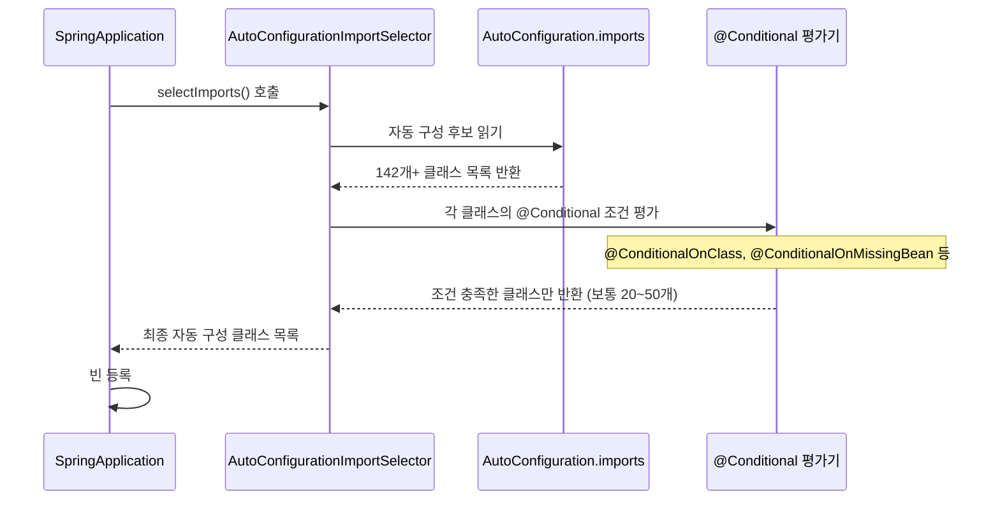
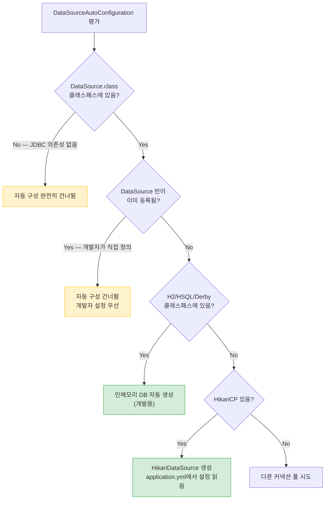
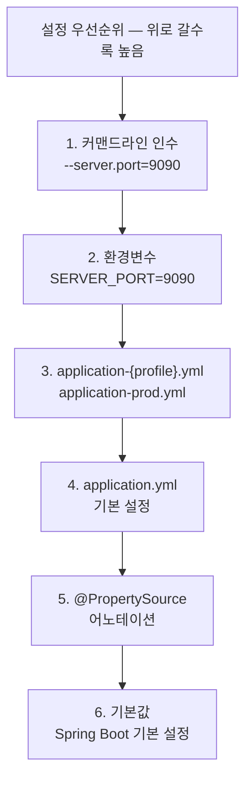
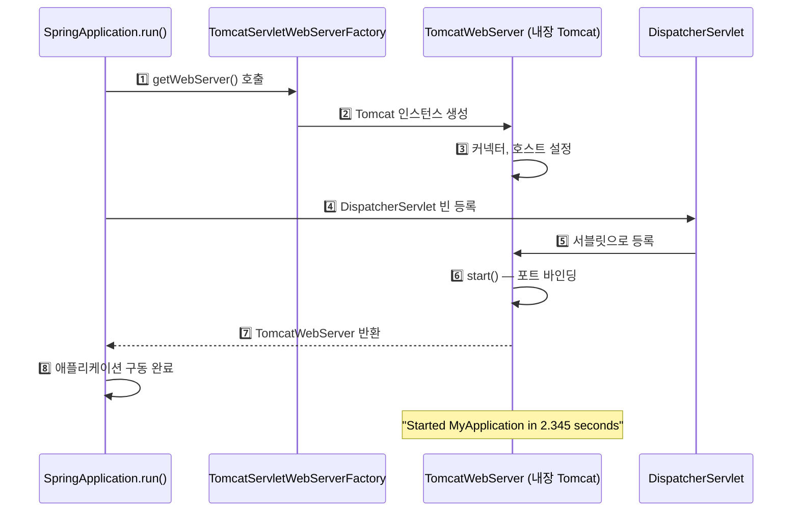
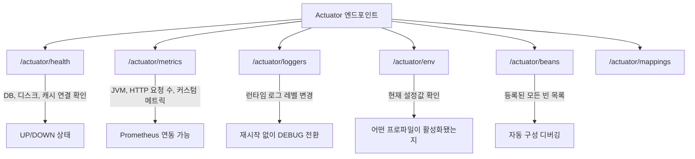
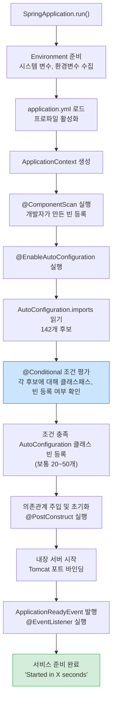

> **한 줄 요약:** Spring Boot 자동 구성은 클래스패스와 이미 등록된 빈을 분석해서, 필요한 빈을 조건부로 자동 등록합니다. `@Conditional` 어노테이션이 그 판단 기준입니다.

## 1. 비유 — 스마트폰과 앱스토어

> **비유:** 일반 Spring으로 웹 앱을 만드는 것은 스마트폰을 조립하는 것과 같았다. CPU, 메모리, 화면, 배터리를 각각 사서 직접 조립해야 했다. Spring Boot는 이미 다 조립된 스마트폰을 주는 것이다. 여기서 더 나아가, 앱을 설치하면(의존성 추가) 앱에 필요한 설정이 자동으로 완료된다(자동 구성).
>
> 단순히 "편리하다"는 것이 아니다. 자동 구성의 핵심은 **조건부 등록**이다. JPA가 클래스패스에 없으면 JPA 관련 빈은 등록되지 않는다. H2가 있으면 인메모리 DB를 자동으로 만들어준다. 개발자가 직접 설정하면 자동 구성을 덮어쓴다.

---

## 2. Spring Boot 이전 — 수동 설정의 고통을 체험하기

### 2.1 XML 기반 Spring MVC 설정

Spring MVC 프로젝트를 시작하려면 최소한 이것들이 필요했습니다.

```xml
<!-- web.xml — 서블릿 컨테이너에 DispatcherServlet 등록 -->
<servlet>
  <servlet-name>dispatcher</servlet-name>
  <servlet-class>org.springframework.web.servlet.DispatcherServlet</servlet-class>
  <init-param>
    <param-name>contextConfigLocation</param-name>
    <param-value>/WEB-INF/spring/servlet-context.xml</param-value>
  </init-param>
  <load-on-startup>1</load-on-startup>
</servlet>
<servlet-mapping>
  <servlet-name>dispatcher</servlet-name>
  <url-pattern>/</url-pattern>
</servlet-mapping>
```

그리고 별도의 `servlet-context.xml`에 ViewResolver, 컴포넌트 스캔, 리소스 핸들러 등을 설정해야 했습니다. 데이터베이스를 쓰려면 `DataSource`, `EntityManagerFactory`, `TransactionManager` 빈을 직접 등록해야 했습니다. 새 프로젝트를 시작할 때마다 이 반복 작업을 처음부터 해야 했습니다.

### 2.2 Spring Boot — 3줄로 시작하기

```java
@SpringBootApplication
public class MyApplication {
    public static void main(String[] args) {
        SpringApplication.run(MyApplication.class, args);
    }
}
```

이 3줄이 전부입니다. `spring-boot-starter-web` 의존성만 추가하면 Tomcat이 내장되고, DispatcherServlet이 등록되고, Jackson이 설정됩니다. `spring-boot-starter-data-jpa`를 추가하면 JPA, 트랜잭션 매니저, 엔티티 스캔까지 자동으로 설정됩니다.

**왜 이게 가능한가?** 그냥 마법이 아닙니다. 뒤에서 `@Conditional` 어노테이션들이 클래스패스를 분석하고, 조건에 맞는 빈만 선택적으로 등록합니다.

---

## 3. @SpringBootApplication 분해 — 사실은 3개 어노테이션의 합성

```java
// @SpringBootApplication은 사실 아래 세 어노테이션을 합친 것
@SpringBootConfiguration   // 1. 이 클래스는 설정 클래스다 (@Configuration 포함)
@EnableAutoConfiguration   // 2. 자동 구성을 활성화하라 — 핵심!
@ComponentScan(excludeFilters = {
    @Filter(type = FilterType.CUSTOM, classes = TypeExcludeFilter.class),
    @Filter(type = FilterType.CUSTOM, classes = AutoConfigurationExcludeFilter.class)
})                          // 3. 현재 패키지부터 하위 패키지를 컴포넌트 스캔
```

```mermaid
graph TD
    A[@SpringBootApplication] --> B[@SpringBootConfiguration]
    A --> C[@EnableAutoConfiguration]
    A --> D[@ComponentScan]

    B --> E["@Configuration: 설정 클래스로 등록\n@Bean 메서드 사용 가능"]
    C --> F["AutoConfigurationImportSelector 실행"]
    D --> G["현재 패키지 하위의 @Component,\n@Service, @Repository 등 자동 스캔"]

    F --> H["AutoConfiguration.imports 파일 읽기"]
    H --> I["142개 이상의 자동 구성 클래스 후보"]
    I --> J["@Conditional 조건 평가"]
    J --> K["조건 충족한 것만 빈 등록"]

    classDef key fill:#cce5ff,stroke:#007bff
    classDef result fill:#d4edda,stroke:#28a745
    class C key
    class K result
```

**`@ComponentScan`의 basePackages가 지정되지 않은 이유:** 지정하지 않으면 `@SpringBootApplication`이 붙은 클래스의 패키지를 기준으로 하위 패키지를 스캔합니다. 그래서 메인 클래스는 항상 최상위 패키지에 위치해야 합니다. 예를 들어 `com.example.MyApplication`이면 `com.example` 하위의 모든 컴포넌트가 스캔됩니다.

**만약 메인 클래스를 하위 패키지에 놓으면?** 상위 패키지의 컴포넌트는 스캔되지 않습니다. `com.example.web.MyApplication`을 메인으로 쓰면 `com.example.service`, `com.example.repository`의 빈이 등록되지 않아 `NoSuchBeanDefinitionException`이 발생합니다.

---

## 4. @EnableAutoConfiguration 동작 원리 — 내부에서 무슨 일이 일어나는가

### 4.1 AutoConfigurationImportSelector — 자동 구성 후보를 고르는 과정

> **비유:** 식당(Spring Boot 앱)이 오픈할 때 메뉴(자동 구성 클래스)를 결정한다. 메뉴 후보 목록(AutoConfiguration.imports)에는 200가지가 있지만, 실제로 재료(클래스패스 라이브러리)가 없는 메뉴는 올리지 않는다. 손님(개발자)이 이미 직접 만든 메뉴가 있으면 자동으로 만들 필요도 없다.

```java
// Spring Boot 내부 동작 (간략화)
public class AutoConfigurationImportSelector implements DeferredImportSelector {

    @Override
    public String[] selectImports(AnnotationMetadata annotationMetadata) {
        // 1단계: 모든 자동 구성 후보 목록 로드 (142개+)
        List<String> configurations = getCandidateConfigurations(annotationMetadata, attributes);

        // 2단계: 중복 제거
        configurations = removeDuplicates(configurations);

        // 3단계: @SpringBootApplication(exclude=...)로 명시 제외한 것 제거
        Set<String> exclusions = getExclusions(annotationMetadata, attributes);
        configurations.removeAll(exclusions);

        // 4단계: @Conditional 조건 평가 — 가장 중요한 단계
        // 여기서 대부분의 후보가 탈락하고, 실제 적용될 것만 남음
        configurations = filter(configurations, autoConfigurationMetadata);

        return configurations.toArray(new String[0]);
    }
}
```

### 4.2 자동 구성 후보 파일 위치

```
# Spring Boot 3.x
META-INF/spring/org.springframework.boot.autoconfigure.AutoConfiguration.imports

# 내용 예시
org.springframework.boot.autoconfigure.web.servlet.DispatcherServletAutoConfiguration
org.springframework.boot.autoconfigure.jackson.JacksonAutoConfiguration
org.springframework.boot.autoconfigure.data.jpa.JpaRepositoriesAutoConfiguration
org.springframework.boot.autoconfigure.jdbc.DataSourceAutoConfiguration
# ... 100개 이상 계속 ...
```



142개 후보 중 실제로 조건을 통과하는 것은 프로젝트에 따라 다르지만 보통 20~50개입니다. `--debug` 플래그로 실행하면 어떤 자동 구성이 적용됐고 왜 나머지는 제외됐는지 볼 수 있습니다.

---

## 5. @Conditional 어노테이션들 — 조건부 빈 등록의 핵심

### 5.1 주요 @Conditional 종류 — 각각 언제 쓰는가

```java
// "이 클래스가 클래스패스에 있을 때만 이 빈을 등록해라"
// 용도: 라이브러리에 의존하는 자동 구성에서 라이브러리가 없으면 에러 방지
@ConditionalOnClass(DataSource.class)

// "이 빈이 아직 등록되지 않았을 때만 등록해라"
// 용도: 개발자가 직접 정의한 빈이 있으면 자동 구성을 건너뜀
// 이것이 "자동 구성을 오버라이드"하는 핵심 메커니즘
@ConditionalOnMissingBean(DataSource.class)

// "특정 프로퍼티가 설정됐을 때만 등록해라"
// 용도: feature flag, 기능 on/off
@ConditionalOnProperty(name = "feature.cache.enabled", havingValue = "true")

// "웹 애플리케이션일 때만 등록해라"
// 용도: 웹 전용 빈(DispatcherServlet 등)을 배치 앱에서 등록하지 않으려고
@ConditionalOnWebApplication

// "특정 빈이 이미 등록되어 있을 때만 등록해라"
// 용도: 다른 자동 구성에 의존하는 경우
@ConditionalOnBean(DataSource.class)
```

### 5.2 실제 DataSourceAutoConfiguration 분석 — 조건들이 어떻게 조합되는가

```java
@AutoConfiguration(before = SqlInitializationAutoConfiguration.class)
// 조건 1: DataSource 클래스가 클래스패스에 있어야 함 (jdbc 의존성 필요)
@ConditionalOnClass({ DataSource.class, EmbeddedDatabaseType.class })
// 조건 2: R2DBC(리액티브 DB)가 없을 때 — R2DBC 쓰면 이 자동 구성 건너뜀
@ConditionalOnMissingBean(type = "io.r2dbc.spi.ConnectionFactory")
@EnableConfigurationProperties(DataSourceProperties.class)
public class DataSourceAutoConfiguration {

    // 내부 설정 1: 임베디드 DB (H2, HSQL, Derby)
    @Configuration(proxyBeanMethods = false)
    @Conditional(EmbeddedDatabaseCondition.class)
    // 조건: DataSource 빈이 없을 때만 — 개발자가 직접 만들었으면 건너뜀
    @ConditionalOnMissingBean({ DataSource.class, XADataSource.class })
    @Import(EmbeddedDataSourceConfiguration.class)
    protected static class EmbeddedDatabaseConfiguration {
    }

    // 내부 설정 2: 커넥션 풀 (HikariCP 등)
    @Configuration(proxyBeanMethods = false)
    @Conditional(PooledDataSourceCondition.class)
    @ConditionalOnMissingBean({ DataSource.class, XADataSource.class })
    @Import({ DataSourceConfiguration.Hikari.class,
              DataSourceConfiguration.Tomcat.class })
    protected static class PooledDataSourceConfiguration {
    }
}
```



**이 흐름이 실무에서 왜 중요한가?** `application.yml`에 DB URL을 설정하지 않아도 H2가 클래스패스에 있으면 자동으로 인메모리 DB를 쓰게 됩니다. 운영 환경에서 실수로 H2 의존성을 포함했다면 연결이 끊겨도 앱이 시작되는 것처럼 보일 수 있습니다. 운영용 DB URL 설정을 빠뜨리면 H2를 쓰게 되는 사고가 발생합니다. `@ConditionalOnMissingBean`을 이해하면 이런 상황을 미리 예방할 수 있습니다.

---

## 6. @ConfigurationProperties — 외부 설정을 Java 객체로 바인딩하기

### 6.1 왜 @Value 대신 @ConfigurationProperties를 쓰는가

> **비유:** `@Value`는 필요한 값을 하나씩 주문하는 것이다. `@ConfigurationProperties`는 관련된 설정들을 하나의 상자에 담아서 받는 것이다. 설정이 10개라면 `@Value`를 10번 쓰는 대신, `@ConfigurationProperties` 클래스 하나에 모두 담는다.

```yaml
# application.yml
app:
  datasource:
    url: jdbc:mysql://localhost:3306/mydb
    username: root
    password: secret
    maximum-pool-size: 10
    connection-timeout: 30000

  mail:
    host: smtp.gmail.com
    port: 587
    username: myapp@gmail.com
```

```java
// @Value 방식 — 설정이 많아지면 클래스가 지저분해짐
@Component
public class DatabaseConfig {
    @Value("${app.datasource.url}")
    private String url;
    @Value("${app.datasource.username}")
    private String username;
    @Value("${app.datasource.maximum-pool-size}")
    private int maximumPoolSize;
    // ... 10개 더
}

// @ConfigurationProperties 방식 — 훨씬 깔끔하고 검증도 가능
@ConfigurationProperties(prefix = "app.datasource")
@Validated  // Bean Validation 적용 가능
public class AppDataSourceProperties {

    @NotBlank
    private String url;

    @NotBlank
    private String username;

    private String password;

    @Min(1) @Max(100)
    private int maximumPoolSize = 10; // 기본값 설정 가능

    private long connectionTimeout = 30000;
    // getter, setter 필수
}
```

`@ConfigurationProperties`의 추가 장점:
- IDE에서 자동 완성 지원 (`spring-boot-configuration-processor` 추가 시)
- `@Validated`로 시작 시점에 설정값 검증 — 잘못된 설정으로 인한 런타임 오류 방지
- 설정이 한 클래스에 모여있어 어떤 설정이 있는지 파악하기 쉬움

### 6.2 환경 변수 / 설정 우선순위 — 어떤 설정이 이긴다



**왜 이 순서가 중요한가?** Docker 컨테이너나 쿠버네티스에서 운영할 때, 코드에 박힌 설정보다 환경변수나 커맨드라인 인수가 항상 이깁니다. 운영 DB 비밀번호를 `application.yml`에 쓰지 않고 환경변수(`DB_PASSWORD`)로 주입하면, 비밀번호가 소스 코드 저장소에 노출되지 않습니다.

**`spring.datasource.url`을 환경변수로 설정하려면?** Spring Boot는 환경변수의 `_`를 `.`로, 대문자를 소문자로 변환합니다. `SPRING_DATASOURCE_URL=jdbc:mysql://...`을 환경변수로 설정하면 `spring.datasource.url`에 자동으로 매핑됩니다.

---

## 7. 프로파일 (Profile) — 환경별로 다른 설정을 적용하는 방법

### 7.1 프로파일 기반 설정 분리

> **비유:** 개발자가 출근할 때(prod)와 재택근무할 때(dev) 사용하는 환경이 다르다. 출근할 때는 회사 서버에 연결하고, 재택 시에는 로컬 환경을 쓴다. 코드는 동일하지만 환경 설정이 다르다. 프로파일은 이 전환을 자동화한다.

```yaml
# application.yml (공통 설정 — 모든 환경에서 적용)
spring:
  application:
    name: my-app

---
# 개발 환경 설정
spring:
  config:
    activate:
      on-profile: dev
  datasource:
    url: jdbc:h2:mem:devdb  # 인메모리 DB — 빠른 시작, 데이터 휘발
    driver-class-name: org.h2.Driver

logging:
  level:
    root: DEBUG  # 개발 시 상세 로그

---
# 운영 환경 설정
spring:
  config:
    activate:
      on-profile: prod
  datasource:
    url: jdbc:mysql://prod-db:3306/mydb
    username: ${DB_USERNAME}   # 환경변수로 주입 — 소스코드에 비밀번호 하드코딩 금지
    password: ${DB_PASSWORD}

logging:
  level:
    root: WARN  # 운영 시 경고 이상만 로그
```

```java
// 특정 프로파일에서만 실행되는 컴포넌트
@Component
@Profile("dev")
public class DevDataInitializer implements ApplicationRunner {

    @Override
    public void run(ApplicationArguments args) {
        // 개발 환경에서만 테스트 데이터 초기화
        // 운영 환경에서는 이 빈 자체가 등록되지 않음
        initTestData();
    }
}
```

**만약 프로파일을 쓰지 않으면?** 개발 시에 운영 DB URL을 주석 처리하고, 배포할 때 다시 주석을 풀어야 합니다. 실수로 H2 URL을 그대로 올리거나, 운영 DB URL을 커밋하는 사고가 발생합니다. 프로파일을 쓰면 `spring.profiles.active=prod` 환경변수 하나로 환경 전환이 완전히 자동화됩니다.

---

## 8. 커스텀 스타터 만들기 — 팀 공통 설정을 라이브러리로

### 8.1 스타터가 필요한 상황

> **비유:** 회사에 5개의 백엔드 서비스가 있다. 모두 동일한 로깅 설정, 인증 필터, Slack 알림 연동이 필요하다. 복붙하면 나중에 설정이 달라지는 문제가 생긴다. 이것을 스타터 라이브러리 하나로 만들면, 서비스마다 의존성 하나만 추가해서 공통 설정을 자동으로 적용받는다.

### 8.2 커스텀 스타터 구현 — HTTP 클라이언트 예시

```java
// 1. Properties 클래스 — application.yml에서 설정받을 값들
@ConfigurationProperties(prefix = "my.http-client")
public class HttpClientProperties {
    private String baseUrl = "http://localhost:8080"; // 기본값
    private int connectTimeout = 5000;
    private int readTimeout = 10000;
    private int maxConnections = 10;
    // getter, setter
}

// 2. 실제 서비스 클래스
public class HttpClientService {

    private final RestTemplate restTemplate;
    private final HttpClientProperties properties;

    public HttpClientService(RestTemplate restTemplate, HttpClientProperties properties) {
        this.restTemplate = restTemplate;
        this.properties = properties;
    }

    public <T> T get(String path, Class<T> responseType) {
        return restTemplate.getForObject(properties.getBaseUrl() + path, responseType);
    }
}

// 3. AutoConfiguration 클래스 — 조건부 자동 등록
@AutoConfiguration
// RestTemplate이 클래스패스에 있을 때만 (spring-web 의존성 있을 때)
@ConditionalOnClass(RestTemplate.class)
@EnableConfigurationProperties(HttpClientProperties.class)
public class HttpClientAutoConfiguration {

    // RestTemplate 빈이 없을 때만 기본 RestTemplate 생성
    // 사용자가 직접 RestTemplate을 만들면 이것은 건너뜀
    @Bean
    @ConditionalOnMissingBean
    public RestTemplate restTemplate(HttpClientProperties properties) {
        SimpleClientHttpRequestFactory factory = new SimpleClientHttpRequestFactory();
        factory.setConnectTimeout(properties.getConnectTimeout());
        factory.setReadTimeout(properties.getReadTimeout());
        return new RestTemplate(factory);
    }

    // HttpClientService 빈이 없을 때만 자동 생성
    @Bean
    @ConditionalOnMissingBean
    public HttpClientService httpClientService(RestTemplate restTemplate,
                                                HttpClientProperties properties) {
        return new HttpClientService(restTemplate, properties);
    }
}
```

```
# META-INF/spring/org.springframework.boot.autoconfigure.AutoConfiguration.imports
# 이 파일이 있어야 Spring Boot가 자동 구성 클래스를 인식함
com.example.HttpClientAutoConfiguration
```

**`@ConditionalOnMissingBean`이 오버라이드를 가능하게 하는 원리:** 사용자가 `@Bean RestTemplate myRestTemplate() {...}`를 직접 정의하면, `RestTemplate` 빈이 이미 등록된 상태입니다. 이후 자동 구성이 실행될 때 `@ConditionalOnMissingBean(RestTemplate.class)` 조건이 false가 되어 자동 구성의 `restTemplate()` 메서드를 건너뜁니다. 사용자 정의 빈이 항상 자동 구성보다 우선합니다.

---

## 9. Spring Boot 내장 서버 — 왜 Tomcat이 JAR 안에 있는가

### 9.1 내장 톰캣 동작 원리

> **비유:** 전통적인 방식은 레스토랑(WAS)이 있고, 음식(WAR 파일)을 가져다 놓는 것이다. 레스토랑이 먼저 열려있어야 음식을 팔 수 있다. Spring Boot 방식은 음식 트럭처럼 주방(Tomcat)과 음식(앱 코드)이 함께 다닌다. `java -jar myapp.jar`만 실행하면 서버도 뜨고 앱도 뜬다.



내장 Tomcat의 장점은 단순히 편리함이 아닙니다. WAR 배포는 WAS 서버 설정에 의존합니다. 서버 버전이 다르면 동작이 달라질 수 있습니다. 내장 서버는 테스트 환경과 운영 환경이 완전히 동일한 Tomcat 버전을 사용한다는 것을 보장합니다. "내 로컬에서는 됐는데 서버에선 안 돼요" 문제를 줄여줍니다.

### 9.2 서버 교체 — 왜 Undertow로 바꾸는가

```xml
<!-- Tomcat 제거 후 Undertow 사용 -->
<dependency>
    <groupId>org.springframework.boot</groupId>
    <artifactId>spring-boot-starter-web</artifactId>
    <exclusions>
        <exclusion>
            <groupId>org.springframework.boot</groupId>
            <artifactId>spring-boot-starter-tomcat</artifactId>
        </exclusion>
    </exclusions>
</dependency>

<dependency>
    <groupId>org.springframework.boot</groupId>
    <artifactId>spring-boot-starter-undertow</artifactId>
</dependency>
```

**왜 Undertow를 선택하는 경우가 있는가?** Undertow는 논블로킹 I/O 기반으로, 높은 동시 접속 처리에서 Tomcat보다 메모리 사용량이 적은 경향이 있습니다. 하지만 대부분의 경우 Tomcat으로 충분하고, 성능 이슈가 실측으로 확인된 후에 교체를 검토합니다. 교체가 이렇게 쉬운 이유는 `ServletWebServerFactory` 추상화 덕분입니다. 코드를 전혀 바꾸지 않고 의존성만 교체하면 됩니다.

---

## 10. Actuator — 운영 중인 앱의 상태를 들여다보기

### 10.1 Actuator가 필요한 이유

> **비유:** 비행기에는 수백 개의 계기판이 있다. 연료, 속도, 고도, 엔진 상태... 이것 없이 비행하면 문제가 생겼을 때 원인을 모른다. Actuator는 운영 중인 Spring Boot 앱의 계기판이다. JVM 메모리, HTTP 요청 수, DB 커넥션 풀 상태, 각 빈의 등록 여부까지 실시간으로 볼 수 있다.

```xml
<dependency>
    <groupId>org.springframework.boot</groupId>
    <artifactId>spring-boot-starter-actuator</artifactId>
</dependency>
```

```yaml
management:
  endpoints:
    web:
      exposure:
        include: health,info,metrics,loggers,env,beans
  endpoint:
    health:
      show-details: always  # "UP" 뿐만 아니라 DB, 디스크 등 세부 상태 표시
```



**`/actuator/loggers`가 특히 유용한 이유:** 운영 중에 특정 클래스의 로그가 갑자기 많이 필요해졌습니다. 재배포 없이 `curl -X POST /actuator/loggers/com.example.OrderService -d '{"configuredLevel":"DEBUG"}'`로 즉시 DEBUG 레벨로 전환할 수 있습니다. 문제 해결 후 다시 INFO로 복구합니다.

**Actuator 엔드포인트를 외부에 노출할 때 주의사항:** `/actuator/env`에는 환경변수가 모두 표시됩니다. DB 비밀번호, API 키가 노출될 수 있습니다. Spring Security로 `/actuator/**` 접근을 내부망이나 관리자로 제한해야 합니다.

### 10.2 커스텀 Health Indicator — 외부 서비스 상태 모니터링

```java
@Component
public class ExternalApiHealthIndicator implements HealthIndicator {

    private final RestTemplate restTemplate;

    @Override
    public Health health() {
        try {
            long start = System.currentTimeMillis();
            ResponseEntity<String> response =
                restTemplate.getForEntity("http://external-api/health", String.class);
            long responseTime = System.currentTimeMillis() - start;

            if (response.getStatusCode().is2xxSuccessful()) {
                return Health.up()
                    .withDetail("externalApi", "Available")
                    .withDetail("responseTimeMs", responseTime)
                    .build();
            }
            return Health.down()
                .withDetail("externalApi", "Returned " + response.getStatusCode())
                .build();

        } catch (Exception e) {
            // 예외 메시지를 그대로 노출하면 내부 정보가 유출될 수 있음
            return Health.down()
                .withDetail("externalApi", "Unreachable")
                .withDetail("error", e.getClass().getSimpleName())
                .build();
        }
    }
}
```

`/actuator/health`를 쿠버네티스 liveness/readiness probe와 연결합니다. 외부 API 연결이 끊기면 readiness가 DOWN이 되고, 쿠버네티스가 이 파드로 트래픽을 보내지 않습니다. 연결이 복구되면 자동으로 트래픽이 재개됩니다.

---

## 11. 자동 구성 디버깅 — 왜 적용됐는지/안 됐는지 알아내기

### 11.1 조건 평가 리포트 확인하기

```bash
# 실행 시 자동 구성 리포트 출력
java -jar myapp.jar --debug
```

출력 예시:
```
CONDITIONS EVALUATION REPORT
============================

Positive matches (적용된 자동 구성):
-----------------
   DataSourceAutoConfiguration matched:
      - @ConditionalOnClass found required classes 'javax.sql.DataSource' (OnClassCondition)

Negative matches (제외된 자동 구성):
-----------------
   ActiveMQAutoConfiguration:
      Did not match:
         - @ConditionalOnClass did not find required class
           'javax.jms.ConnectionFactory' (OnClassCondition)
   MongoAutoConfiguration:
      Did not match:
         - @ConditionalOnClass did not find required class
           'com.mongodb.MongoClient' (OnClassCondition)
```

이 리포트를 읽으면 "왜 내 설정이 적용되지 않았는가?"를 바로 파악할 수 있습니다. `@ConditionalOnMissingBean`이 true가 되어야 하는데, 다른 곳에서 이미 같은 타입의 빈이 등록되어 조건이 false가 된 경우도 이 리포트에서 확인됩니다.

### 11.2 특정 자동 구성 제외 — 원치 않는 자동 구성 비활성화

```java
// 특정 자동 구성을 명시적으로 제외
@SpringBootApplication(exclude = {
    DataSourceAutoConfiguration.class,        // DB 없는 앱에서
    SecurityAutoConfiguration.class,          // 보안 설정을 직접 할 때
    JpaRepositoriesAutoConfiguration.class    // JPA를 커스텀 설정할 때
})
public class MyApplication {}
```

**`DataSourceAutoConfiguration`을 제외해야 하는 상황:** 메시지 큐만 쓰는 배치 앱에서 `spring-boot-starter-data-jpa`가 포함되어 있지만 DB 연결 없이 실행해야 할 때입니다. `DataSourceAutoConfiguration`이 DB URL을 찾다가 실패하면 앱이 시작되지 않습니다. 제외하면 DB 없이도 정상 시작됩니다.

---

## 12. @SpringBootTest와 테스트 슬라이스 — 테스트 속도를 높이는 방법

### 12.1 왜 테스트를 나누는가

> **비유:** 자동차를 테스트할 때, 엔진만 테스트할 때는 차 전체를 조립할 필요가 없다. 엔진 테스트대에서 엔진만 돌리면 된다. Spring Boot 테스트 슬라이스는 이것과 같다. 컨트롤러만 테스트할 때는 JPA, Kafka, Redis가 뜰 필요가 없다.

```java
// 전체 컨텍스트 로드 — 가장 느림, 통합 테스트에 적합
@SpringBootTest
@AutoConfigureMockMvc
class IntegrationTest {

    @Autowired
    private MockMvc mockMvc;

    @Test
    void testEndpoint() throws Exception {
        mockMvc.perform(get("/api/orders"))
            .andExpect(status().isOk());
    }
}
```

```java
// 웹 계층만 테스트 — 빠름, 컨트롤러 단위 테스트에 적합
// DispatcherServlet, HandlerMapping, ArgumentResolver 등만 뜸
// Service, Repository는 뜨지 않음 → @MockBean으로 대체
@WebMvcTest(OrderController.class)
class OrderControllerTest {

    @Autowired
    private MockMvc mockMvc;

    @MockBean  // Service는 실제 객체 대신 목 객체 사용
    private OrderService orderService;

    @Test
    void getOrder_shouldReturn200() throws Exception {
        given(orderService.findById(1L)).willReturn(new OrderResponse(1L, "주문1"));

        mockMvc.perform(get("/orders/1"))
            .andExpect(status().isOk())
            .andExpect(jsonPath("$.name").value("주문1"));
    }
}
```

```java
// JPA 계층만 테스트 — 빠름, 레포지토리 테스트에 적합
// H2 인메모리 DB 자동 설정, JPA 관련 빈만 뜸
// Service, Controller는 뜨지 않음
@DataJpaTest
class OrderRepositoryTest {

    @Autowired
    private OrderRepository orderRepository;

    @Test
    void save_shouldPersistOrder() {
        Order order = new Order("주문자", 10000);
        Order saved = orderRepository.save(order);
        assertThat(saved.getId()).isNotNull();
    }
}
```

**테스트 슬라이스를 쓰면 테스트가 얼마나 빨라지는가?** `@SpringBootTest`는 모든 빈을 로드하므로 시작에 5~20초가 걸립니다. `@WebMvcTest`는 웹 계층 관련 빈만 로드하므로 1~2초입니다. 100개의 컨트롤러 테스트가 있다면 전체 테스트 시간이 5~10배 차이날 수 있습니다.

---

## 13. 전체 자동 구성 흐름 정리



---

## 14. 요약 — 개념과 왜 중요한지

| 기능 | 어노테이션/설정 | 왜 중요한가 |
|------|---------------|-----------|
| 자동 구성 활성화 | @EnableAutoConfiguration | 수동 설정 없이 시작 가능 |
| 조건부 빈 등록 | @ConditionalOnClass 등 | 불필요한 빈 미등록, 오버라이드 가능 |
| 개발자 빈 우선 | @ConditionalOnMissingBean | 커스터마이즈의 핵심 |
| 외부 설정 바인딩 | @ConfigurationProperties | 타입 안전, 검증 가능 |
| 설정 우선순위 | 커맨드라인 > 환경변수 > yml | 환경별 설정 분리, 비밀정보 보호 |
| 자동 구성 제외 | exclude 속성 | 불필요한 자동 구성 비활성화 |
| 테스트 슬라이스 | @WebMvcTest, @DataJpaTest | 빠른 테스트, 필요한 계층만 로드 |
| 운영 모니터링 | Actuator | 재배포 없이 상태 확인, 로그 레벨 변경 |
