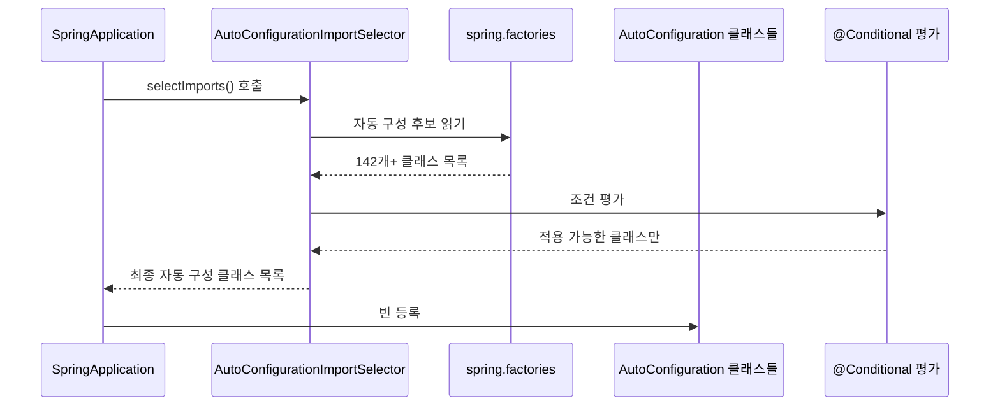
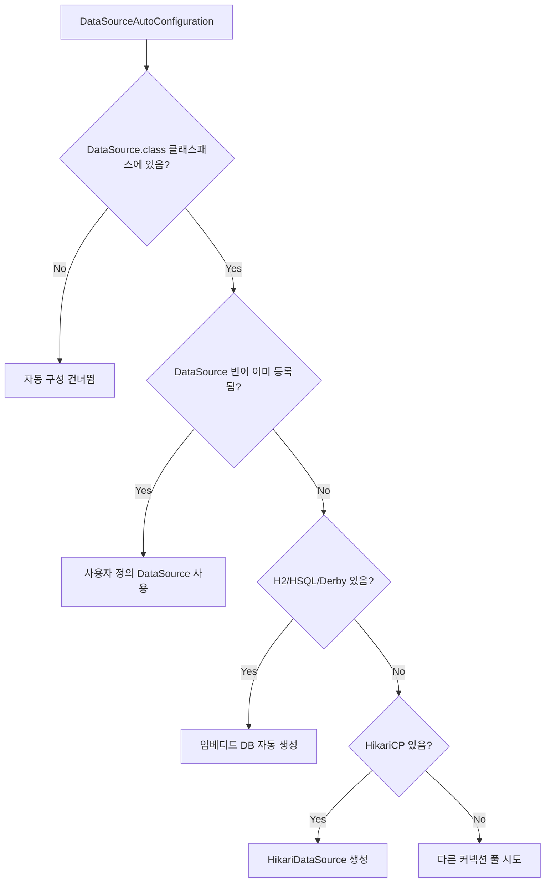
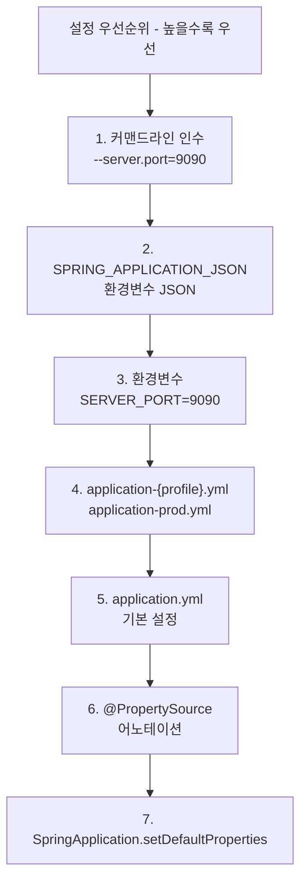
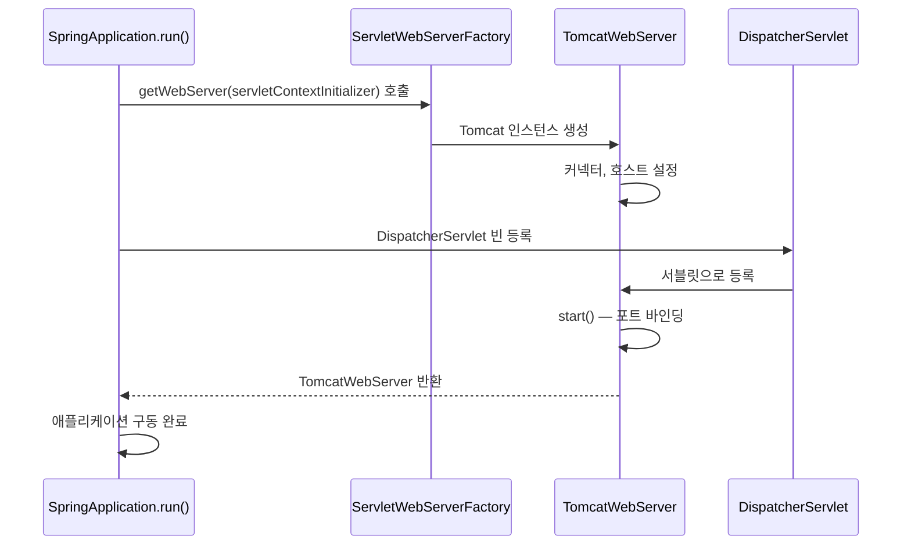
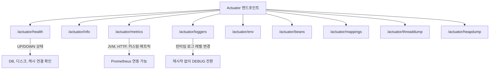
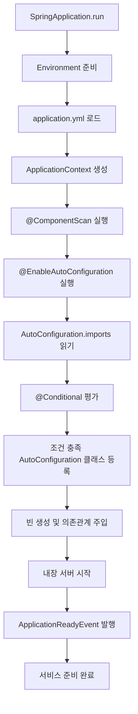

## 1. 비유 — 스마트폰과 앱스토어

일반 Java 웹 애플리케이션을 만들 때는 마치 스마트폰을 조립하는 것과 같았습니다. 메인보드, CPU, 메모리, 화면을 각각 사서 직접 조립해야 했죠. Spring Boot는 이미 다 조립된 스마트폰을 주는 것입니다. 여기서 더 나아가, 앱을 설치하면(의존성 추가) 앱에 필요한 설정이 자동으로 완료됩니다(자동 구성).

---

## 2. Spring Boot 이전 — 수동 설정의 고통

```xml
<!-- 기존 Spring MVC를 위한 web.xml -->
<servlet>
  <servlet-name>dispatcher</servlet-name>
  <servlet-class>org.springframework.web.servlet.DispatcherServlet</servlet-class>
  <init-param>
    <param-name>contextConfigLocation</param-name>
    <param-value>/WEB-INF/spring/appServlet/servlet-context.xml</param-value>
  </init-param>
  <load-on-startup>1</load-on-startup>
</servlet>

<servlet-mapping>
  <servlet-name>dispatcher</servlet-name>
  <url-pattern>/</url-pattern>
</servlet-mapping>
```

```java
// Spring Boot 사용 시
@SpringBootApplication
public class MyApplication {
    public static void main(String[] args) {
        SpringApplication.run(MyApplication.class, args);
    }
}
```

이 세 줄이 전부입니다.

---

## 3. @SpringBootApplication 분해

```java
@SpringBootApplication
// 이것은 사실 아래 세 어노테이션의 합성입니다:

@SpringBootConfiguration   // @Configuration 포함
@EnableAutoConfiguration   // 자동 구성 활성화 — 핵심!
@ComponentScan(excludeFilters = {
    @Filter(type = FilterType.CUSTOM, classes = TypeExcludeFilter.class),
    @Filter(type = FilterType.CUSTOM, classes = AutoConfigurationExcludeFilter.class)
})
```

```mermaid
graph TD
    A[@SpringBootApplication] --> B[@SpringBootConfiguration]
    A --> C[@EnableAutoConfiguration]
    A --> D[@ComponentScan]

    B --> E["@Configuration: 설정 클래스로 등록"]
    C --> F["AutoConfigurationImportSelector 동작"]
    D --> G["현재 패키지부터 하위 패키지 스캔"]

    F --> H["spring.factories 또는 imports 파일 읽기"]
    H --> I["자동 구성 클래스 로드"]
    I --> J["@Conditional 조건 평가"]
    J --> K["조건 충족 시 빈 등록"]
```

---

## 4. @EnableAutoConfiguration 동작 원리

### 4.1 AutoConfigurationImportSelector

```java
// Spring Boot 내부 동작 (간략화)
public class AutoConfigurationImportSelector implements DeferredImportSelector {

    @Override
    public String[] selectImports(AnnotationMetadata annotationMetadata) {
        // 1. 자동 구성 후보 목록 로드
        List<String> configurations = getCandidateConfigurations(annotationMetadata, attributes);

        // 2. 중복 제거
        configurations = removeDuplicates(configurations);

        // 3. 제외 목록 처리 (@SpringBootApplication exclude 속성)
        Set<String> exclusions = getExclusions(annotationMetadata, attributes);
        configurations.removeAll(exclusions);

        // 4. 필터 적용 (@Conditional 평가)
        configurations = filter(configurations, autoConfigurationMetadata);

        return configurations.toArray(new String[0]);
    }
}
```

### 4.2 자동 구성 후보 파일 위치

```
# Spring Boot 2.x
META-INF/spring.factories
org.springframework.boot.autoconfigure.EnableAutoConfiguration=\
  org.springframework.boot.autoconfigure.web.servlet.DispatcherServletAutoConfiguration,\
  org.springframework.boot.autoconfigure.jackson.JacksonAutoConfiguration,\
  org.springframework.boot.autoconfigure.data.jpa.JpaRepositoriesAutoConfiguration,\
  ...

# Spring Boot 3.x (변경됨)
META-INF/spring/org.springframework.boot.autoconfigure.AutoConfiguration.imports
org.springframework.boot.autoconfigure.web.servlet.DispatcherServletAutoConfiguration
org.springframework.boot.autoconfigure.jackson.JacksonAutoConfiguration
...
```



---

## 5. @Conditional 어노테이션들

### 5.1 주요 @Conditional 종류

```java
// 클래스패스에 특정 클래스가 있을 때
@ConditionalOnClass(DataSource.class)

// 클래스패스에 특정 클래스가 없을 때
@ConditionalOnMissingClass("com.example.SomeClass")

// 특정 빈이 등록되어 있을 때
@ConditionalOnBean(DataSource.class)

// 특정 빈이 없을 때 (사용자 정의 빈이 없을 때 기본 제공)
@ConditionalOnMissingBean(DataSource.class)

// 프로퍼티 값이 특정 값일 때
@ConditionalOnProperty(name = "feature.enabled", havingValue = "true")

// 웹 애플리케이션일 때
@ConditionalOnWebApplication

// 리소스 파일이 있을 때
@ConditionalOnResource(resources = "classpath:config.properties")

// 표현식 평가
@ConditionalOnExpression("${server.port} > 8000")
```

### 5.2 실제 DataSourceAutoConfiguration 분석

```java
@AutoConfiguration(before = SqlInitializationAutoConfiguration.class)
@ConditionalOnClass({ DataSource.class, EmbeddedDatabaseType.class })
@ConditionalOnMissingBean(type = "io.r2dbc.spi.ConnectionFactory")
@EnableConfigurationProperties(DataSourceProperties.class)
@Import(DataSourcePoolMetadataProvidersConfiguration.class)
public class DataSourceAutoConfiguration {

    @Configuration(proxyBeanMethods = false)
    @Conditional(EmbeddedDatabaseCondition.class)
    @ConditionalOnMissingBean({ DataSource.class, XADataSource.class })
    @Import(EmbeddedDataSourceConfiguration.class)
    protected static class EmbeddedDatabaseConfiguration {
    }

    @Configuration(proxyBeanMethods = false)
    @Conditional(PooledDataSourceCondition.class)
    @ConditionalOnMissingBean({ DataSource.class, XADataSource.class })
    @Import({ DataSourceConfiguration.Hikari.class,
              DataSourceConfiguration.Tomcat.class,
              DataSourceConfiguration.Dbcp2.class,
              DataSourceConfiguration.OracleUcp.class,
              DataSourceConfiguration.Generic.class,
              DataSourceJmxConfiguration.class })
    protected static class PooledDataSourceConfiguration {
    }
}
```



---

## 6. @ConfigurationProperties — 외부 설정 바인딩

### 6.1 기본 사용법

```yaml
# application.yml
app:
  datasource:
    url: jdbc:mysql://localhost:3306/mydb
    username: root
    password: secret
    maximum-pool-size: 10
    connection-timeout: 30000

  mail:
    host: smtp.gmail.com
    port: 587
    username: myapp@gmail.com
    password: app-password
    properties:
      mail.smtp.auth: true
      mail.smtp.starttls.enable: true
```

```java
@ConfigurationProperties(prefix = "app.datasource")
@Validated
public class AppDataSourceProperties {

    @NotBlank
    private String url;

    @NotBlank
    private String username;

    private String password;

    @Min(1) @Max(100)
    private int maximumPoolSize = 10;

    private long connectionTimeout = 30000;

    // getter, setter 필수 (또는 @ConstructorBinding)
}

@ConfigurationProperties(prefix = "app.mail")
public record MailProperties(
    String host,
    int port,
    String username,
    String password,
    Map<String, String> properties
) {}
```

```java
// 활성화 방법
@SpringBootApplication
@EnableConfigurationProperties({AppDataSourceProperties.class, MailProperties.class})
public class MyApplication {}

// 또는 @ConfigurationPropertiesScan
@SpringBootApplication
@ConfigurationPropertiesScan
public class MyApplication {}
```

### 6.2 환경 변수 / 시스템 프로퍼티 우선순위



---

## 7. 프로파일 (Profile)

### 7.1 프로파일 기반 설정 분리

```yaml
# application.yml (공통)
spring:
  application:
    name: my-app

server:
  port: 8080

---
# application-dev.yml
spring:
  config:
    activate:
      on-profile: dev
  datasource:
    url: jdbc:h2:mem:devdb
    driver-class-name: org.h2.Driver

logging:
  level:
    root: DEBUG

---
# application-prod.yml
spring:
  config:
    activate:
      on-profile: prod
  datasource:
    url: jdbc:mysql://prod-db:3306/mydb
    username: ${DB_USERNAME}
    password: ${DB_PASSWORD}

logging:
  level:
    root: WARN
```

```java
// 코드에서 프로파일 지정
@Component
@Profile("dev")
public class DevDataInitializer implements ApplicationRunner {
    @Override
    public void run(ApplicationArguments args) {
        // 개발 환경에서만 테스트 데이터 초기화
        initTestData();
    }
}
```

---

## 8. 커스텀 스타터 만들기

### 8.1 스타터 구조

```
my-custom-starter/
├── my-custom-autoconfigure/        # 자동 구성 모듈
│   ├── src/main/java/
│   │   └── com/example/
│   │       ├── MyServiceAutoConfiguration.java
│   │       ├── MyServiceProperties.java
│   │       └── MyService.java
│   └── src/main/resources/
│       └── META-INF/spring/
│           └── org.springframework.boot.autoconfigure.AutoConfiguration.imports
└── my-custom-spring-boot-starter/  # 스타터 모듈 (의존성만)
    └── pom.xml
```

### 8.2 구현 예시 — HTTP 클라이언트 스타터

```java
// 1. Properties 클래스
@ConfigurationProperties(prefix = "my.http-client")
public class HttpClientProperties {
    private String baseUrl = "http://localhost:8080";
    private int connectTimeout = 5000;
    private int readTimeout = 10000;
    private int maxConnections = 10;
    // getter, setter
}

// 2. 실제 서비스
public class HttpClientService {
    private final RestTemplate restTemplate;
    private final HttpClientProperties properties;

    public HttpClientService(RestTemplate restTemplate, HttpClientProperties properties) {
        this.restTemplate = restTemplate;
        this.properties = properties;
    }

    public <T> T get(String path, Class<T> responseType) {
        return restTemplate.getForObject(properties.getBaseUrl() + path, responseType);
    }
}

// 3. AutoConfiguration 클래스
@AutoConfiguration
@ConditionalOnClass(RestTemplate.class)
@EnableConfigurationProperties(HttpClientProperties.class)
public class HttpClientAutoConfiguration {

    @Bean
    @ConditionalOnMissingBean
    public RestTemplate restTemplate(HttpClientProperties properties) {
        SimpleClientHttpRequestFactory factory = new SimpleClientHttpRequestFactory();
        factory.setConnectTimeout(properties.getConnectTimeout());
        factory.setReadTimeout(properties.getReadTimeout());
        return new RestTemplate(factory);
    }

    @Bean
    @ConditionalOnMissingBean
    public HttpClientService httpClientService(RestTemplate restTemplate,
                                                HttpClientProperties properties) {
        return new HttpClientService(restTemplate, properties);
    }
}
```

```
# META-INF/spring/org.springframework.boot.autoconfigure.AutoConfiguration.imports
com.example.HttpClientAutoConfiguration
```

### 8.3 스타터 pom.xml

```xml
<!-- my-custom-spring-boot-starter/pom.xml -->
<dependencies>
    <!-- 자동 구성 모듈 -->
    <dependency>
        <groupId>com.example</groupId>
        <artifactId>my-custom-autoconfigure</artifactId>
    </dependency>

    <!-- Spring Boot Starter 기본 의존성 -->
    <dependency>
        <groupId>org.springframework.boot</groupId>
        <artifactId>spring-boot-starter</artifactId>
    </dependency>
</dependencies>
```

---

## 9. Spring Boot 내장 서버

### 9.1 내장 톰캣 동작 원리



### 9.2 서버 교체

```xml
<!-- Tomcat 제거 후 Undertow 사용 -->
<dependency>
    <groupId>org.springframework.boot</groupId>
    <artifactId>spring-boot-starter-web</artifactId>
    <exclusions>
        <exclusion>
            <groupId>org.springframework.boot</groupId>
            <artifactId>spring-boot-starter-tomcat</artifactId>
        </exclusion>
    </exclusions>
</dependency>

<dependency>
    <groupId>org.springframework.boot</groupId>
    <artifactId>spring-boot-starter-undertow</artifactId>
</dependency>
```

---

## 10. Actuator — 운영 모니터링

```xml
<dependency>
    <groupId>org.springframework.boot</groupId>
    <artifactId>spring-boot-starter-actuator</artifactId>
</dependency>
```

```yaml
management:
  endpoints:
    web:
      exposure:
        include: health,info,metrics,loggers,env,beans,mappings
  endpoint:
    health:
      show-details: always
  info:
    env:
      enabled: true

info:
  app:
    name: My Application
    version: 1.0.0
    build-time: "@maven.build.timestamp@"
```



### 10.1 커스텀 Health Indicator

```java
@Component
public class ExternalApiHealthIndicator implements HealthIndicator {

    private final RestTemplate restTemplate;

    @Override
    public Health health() {
        try {
            ResponseEntity<String> response =
                restTemplate.getForEntity("http://external-api/health", String.class);

            if (response.getStatusCode().is2xxSuccessful()) {
                return Health.up()
                    .withDetail("externalApi", "Available")
                    .withDetail("responseTime", "< 100ms")
                    .build();
            }
            return Health.down()
                .withDetail("externalApi", "Returned " + response.getStatusCode())
                .build();
        } catch (Exception e) {
            return Health.down()
                .withException(e)
                .build();
        }
    }
}
```

---

## 11. 극한 시나리오 — 자동 구성 디버깅

### 자동 구성이 왜 적용/미적용됐는지 확인

```bash
# 실행 시 자동 구성 리포트 출력
java -jar myapp.jar --debug

# 또는
spring.main.log-startup-info=true
```

출력 예시:
```
CONDITIONS EVALUATION REPORT
============================
Positive matches:
-----------------
   DataSourceAutoConfiguration matched:
      - @ConditionalOnClass found required classes 'javax.sql.DataSource',
        'org.springframework.jdbc.datasource.embedded.EmbeddedDatabaseType' (OnClassCondition)

Negative matches:
-----------------
   ActiveMQAutoConfiguration:
      Did not match:
         - @ConditionalOnClass did not find required class 'javax.jms.ConnectionFactory' (OnClassCondition)
```

### 특정 자동 구성 제외

```java
@SpringBootApplication(exclude = {
    DataSourceAutoConfiguration.class,
    JpaRepositoriesAutoConfiguration.class
})
public class MyApplication {}
```

---

## 12. @SpringBootTest와 테스트 슬라이스

```java
// 전체 컨텍스트 로드
@SpringBootTest
@AutoConfigureMockMvc
class IntegrationTest {

    @Autowired
    private MockMvc mockMvc;

    @Test
    void testEndpoint() throws Exception {
        mockMvc.perform(get("/api/orders"))
            .andExpect(status().isOk())
            .andExpect(jsonPath("$").isArray());
    }
}

// 웹 계층만 테스트 (빠름)
@WebMvcTest(OrderController.class)
class OrderControllerTest {

    @Autowired
    private MockMvc mockMvc;

    @MockBean
    private OrderService orderService;

    @Test
    void getOrder_shouldReturn200() throws Exception {
        given(orderService.findById(1L)).willReturn(new OrderResponse(1L, "주문1"));

        mockMvc.perform(get("/orders/1"))
            .andExpect(status().isOk())
            .andExpect(jsonPath("$.name").value("주문1"));
    }
}

// JPA 계층만 테스트
@DataJpaTest
class OrderRepositoryTest {

    @Autowired
    private OrderRepository orderRepository;

    @Test
    void save_shouldPersistOrder() {
        Order order = new Order("주문자", 10000);
        Order saved = orderRepository.save(order);
        assertThat(saved.getId()).isNotNull();
    }
}
```

---

## 13. 전체 자동 구성 흐름



---

## 14. 요약

| 기능 | 어노테이션/설정 | 동작 |
|------|---------------|------|
| 자동 구성 활성화 | @EnableAutoConfiguration | AutoConfiguration.imports 읽어 빈 등록 |
| 조건부 빈 등록 | @ConditionalOnClass 등 | 조건 충족 시만 빈 등록 |
| 외부 설정 바인딩 | @ConfigurationProperties | yml → Java 객체 자동 매핑 |
| 프로파일 분리 | @Profile, spring.profiles.active | 환경별 다른 빈/설정 적용 |
| 자동 구성 제외 | exclude 속성 | 특정 자동 구성 비활성화 |
| 운영 모니터링 | spring-boot-starter-actuator | health, metrics, loggers 엔드포인트 |
| 테스트 슬라이스 | @WebMvcTest, @DataJpaTest | 필요한 계층만 로드 |
