## 1. 실생활 비유 — 경호원과 핵심 업무

국회의원이 국정 업무를 볼 때, 직접 본인이 건물 경비를 서거나 방문자 신원을 확인하지 않습니다. **경호원(프록시)**이 이 모든 부가적인 업무를 대신 처리하고, 국회의원은 핵심 업무에만 집중합니다.

Spring AOP가 바로 이 구조입니다. 로깅, 보안 검사, 트랜잭션 처리 같은 **횡단 관심사(Cross-Cutting Concern)**를 프록시가 담당하고, 비즈니스 로직은 핵심 업무에만 집중합니다.

---

## 2. 횡단 관심사(Cross-Cutting Concern) 문제

### 2.1 문제 상황

```java
// 로그를 남기고 싶은 서비스들
public class OrderService {
    public void createOrder(Order order) {
        log.info("OrderService.createOrder 시작");  // 중복!
        long start = System.currentTimeMillis();    // 중복!

        // 핵심 비즈니스 로직
        orderRepository.save(order);

        long end = System.currentTimeMillis();
        log.info("OrderService.createOrder 종료 — {}ms", end - start);  // 중복!
    }
}

public class MemberService {
    public void join(Member member) {
        log.info("MemberService.join 시작");  // 또 중복!
        long start = System.currentTimeMillis();

        memberRepository.save(member);

        long end = System.currentTimeMillis();
        log.info("MemberService.join 종료 — {}ms", end - start);
    }
}
```

로깅 코드가 모든 서비스에 흩어져 있습니다. 100개의 서비스라면 100곳을 수정해야 합니다.

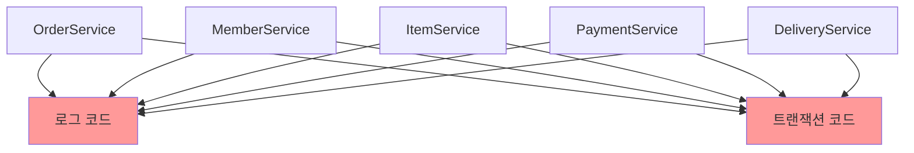

### 2.2 AOP로 해결

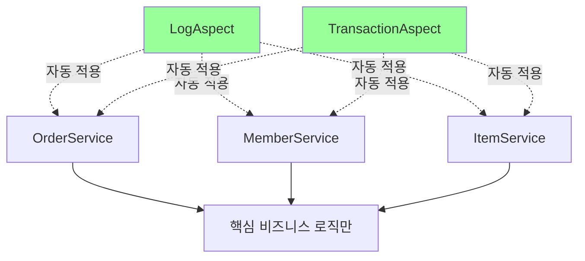

---

## 3. 프록시 패턴 기초

### 3.1 프록시의 두 가지 역할

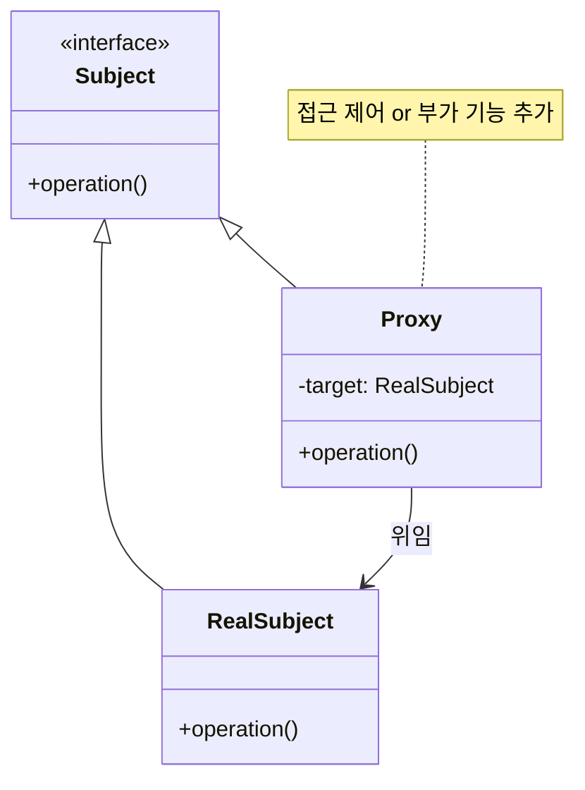

**역할 1: 접근 제어 (Protection Proxy)**
```java
public class CacheProxy implements Subject {
    private Subject target;
    private String cacheValue;

    @Override
    public String operation() {
        if (cacheValue == null) {
            cacheValue = target.operation(); // 실제 호출
        }
        return cacheValue; // 캐시 반환
    }
}
```

**역할 2: 부가 기능 추가 (Decorator Proxy)**
```java
public class TimeDecorator implements Subject {
    private Subject target;

    @Override
    public String operation() {
        long start = System.currentTimeMillis();
        String result = target.operation(); // 위임
        long end = System.currentTimeMillis();
        log.info("실행 시간: {}ms", end - start);
        return result;
    }
}
```

### 3.2 프록시 체인

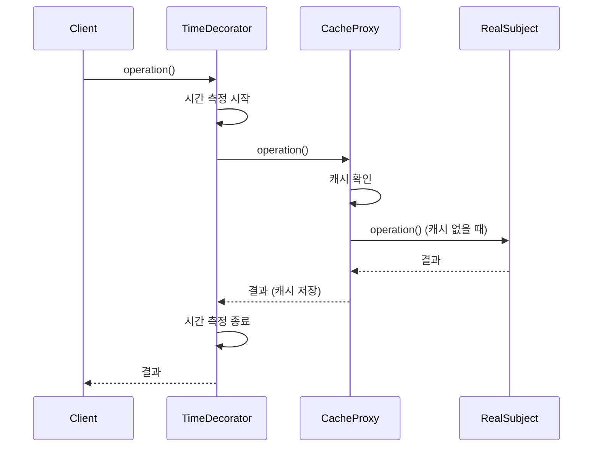

---

## 4. JDK 동적 프록시 vs CGLIB

### 4.1 JDK 동적 프록시

인터페이스 기반으로 프록시를 생성합니다.

```java
// 인터페이스가 있어야 함
public interface MemberService {
    String hello(String name);
}

public class MemberServiceImpl implements MemberService {
    @Override
    public String hello(String name) {
        return "hello " + name;
    }
}
```

```java
// InvocationHandler 구현
public class LogInvocationHandler implements InvocationHandler {
    private final Object target;

    public LogInvocationHandler(Object target) {
        this.target = target;
    }

    @Override
    public Object invoke(Object proxy, Method method, Object[] args) throws Throwable {
        log.info("[로그] {} 메서드 호출", method.getName());
        Object result = method.invoke(target, args);
        log.info("[로그] {} 메서드 종료", method.getName());
        return result;
    }
}

// 프록시 생성
MemberService target = new MemberServiceImpl();
MemberService proxy = (MemberService) Proxy.newProxyInstance(
    target.getClass().getClassLoader(),
    new Class[]{MemberService.class},
    new LogInvocationHandler(target)
);

proxy.hello("Spring"); // 로그 + 실제 호출
```

### 4.2 CGLIB (Code Generation Library)

클래스를 상속하여 프록시를 생성합니다. 인터페이스가 없어도 됩니다.

```java
// 인터페이스 없는 클래스도 프록시 가능
public class ConcreteService {
    public String call() {
        return "ConcreteService 호출";
    }
}
```

```java
// MethodInterceptor 구현
public class TimeMethodInterceptor implements MethodInterceptor {
    private final Object target;

    @Override
    public Object intercept(Object obj, Method method, Object[] args,
                           MethodProxy proxy) throws Throwable {
        long start = System.currentTimeMillis();
        Object result = proxy.invoke(target, args); // 실제 호출
        long end = System.currentTimeMillis();
        log.info("실행 시간: {}ms", end - start);
        return result;
    }
}

// CGLIB 프록시 생성
Enhancer enhancer = new Enhancer();
enhancer.setSuperclass(ConcreteService.class);
enhancer.setCallback(new TimeMethodInterceptor(target));
ConcreteService proxy = (ConcreteService) enhancer.create();
```

### 4.3 JDK vs CGLIB 비교

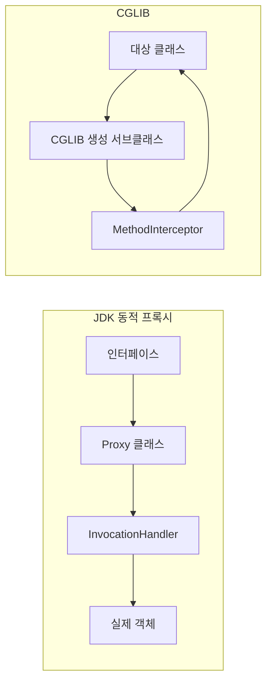

| 특성 | JDK 동적 프록시 | CGLIB |
|------|----------------|-------|
| 의존 | 인터페이스 필수 | 클래스만으로 가능 |
| 생성 방식 | 인터페이스 구현 | 클래스 상속 |
| 성능 | 리플렉션 사용 | 바이트코드 생성 (더 빠름) |
| 제약 | - | final 클래스/메서드 불가 |
| Spring Boot | 기본 CGLIB 사용 | `spring.aop.proxy-target-class=true` |

Spring Boot는 기본적으로 CGLIB을 사용합니다.

---

## 5. ProxyFactory — 통합 프록시 생성

Spring은 JDK/CGLIB 선택을 자동화하는 `ProxyFactory`를 제공합니다.

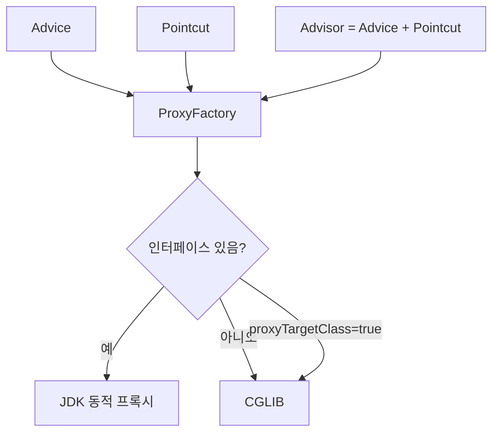

```java
ServiceInterface target = new ServiceImpl();
ProxyFactory proxyFactory = new ProxyFactory(target);

// Advice: 부가 기능 로직
proxyFactory.addAdvice(new MethodInterceptor() {
    @Override
    public Object invoke(MethodInvocation invocation) throws Throwable {
        log.info("호출 전");
        Object result = invocation.proceed(); // 실제 메서드 호출
        log.info("호출 후");
        return result;
    }
});

ServiceInterface proxy = (ServiceInterface) proxyFactory.getProxy();
proxy.save();
```

---

## 6. AOP 핵심 개념

### 6.1 용어 정리

```mermaid
graph TD
    A[AOP 개념] --> B[Aspect]
    A --> C[Join Point]
    A --> D[Pointcut]
    A --> E[Advice]
    A --> F[Weaving]
    A --> G[Target]
    A --> H[Proxy]

    B -->|부가 기능 모듈| I[@Aspect 클래스]
    C -->|어드바이스 적용 가능 지점| J[메서드 실행, 필드 접근 등]
    D -->|어드바이스 적용 위치 선택| K[execution 표현식]
    E -->|실제 부가 기능| L[@Before, @After, @Around]
    F -->|어드바이스를 대상에 적용| M[컴파일/로드/런타임 시점]
    G -->|어드바이스 받는 객체| N[실제 비즈니스 로직]
    H -->|AOP 적용 결과| O[프록시 객체]
```

### 6.2 Advice 종류

```java
@Aspect
@Component
public class AllLogAspect {

    // @Before: 메서드 실행 전
    @Before("execution(* hello.service.*.*(..))")
    public void before(JoinPoint joinPoint) {
        log.info("[Before] {}", joinPoint.getSignature());
    }

    // @AfterReturning: 정상 반환 후
    @AfterReturning(value = "execution(* hello.service.*.*(..))", returning = "result")
    public void afterReturning(JoinPoint joinPoint, Object result) {
        log.info("[AfterReturning] {} return={}", joinPoint.getSignature(), result);
    }

    // @AfterThrowing: 예외 발생 후
    @AfterThrowing(value = "execution(* hello.service.*.*(..))", throwing = "ex")
    public void afterThrowing(JoinPoint joinPoint, Exception ex) {
        log.info("[AfterThrowing] {} message={}", joinPoint.getSignature(), ex.getMessage());
    }

    // @After: 정상/예외 관계없이 항상
    @After("execution(* hello.service.*.*(..))")
    public void after(JoinPoint joinPoint) {
        log.info("[After] {}", joinPoint.getSignature());
    }

    // @Around: 가장 강력, 모든 제어 가능
    @Around("execution(* hello.service.*.*(..))")
    public Object around(ProceedingJoinPoint joinPoint) throws Throwable {
        log.info("[Around 전] {}", joinPoint.getSignature());
        Object result = joinPoint.proceed(); // 실제 메서드 실행
        log.info("[Around 후] {}", joinPoint.getSignature());
        return result;
    }
}
```

### 6.3 Advice 실행 순서

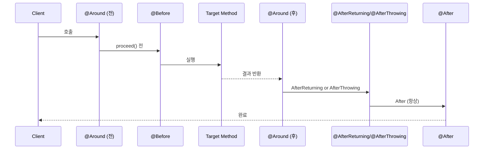

---

## 7. Pointcut 표현식

### 7.1 execution 표현식

```
execution(접근제어자? 반환타입 선언타입?메서드이름(파라미터) 예외?)
```

```java
// 모든 public 메서드
execution(public * *(..))

// 특정 패키지의 모든 메서드
execution(* hello.service.*.*(..))

// 특정 클래스의 모든 메서드
execution(* hello.service.OrderService.*(..))

// 특정 메서드
execution(* hello.service.OrderService.createOrder(..))

// 반환 타입 지정
execution(String hello.service.*.*(..))

// 파라미터 타입 지정
execution(* *(String))
execution(* *(String, ..))  // 첫 번째가 String이고 나머지는 무관
```

### 7.2 다양한 Pointcut 지시자

```java
@Aspect
@Component
public class PointcutExample {

    // within: 특정 타입 내의 조인 포인트
    @Pointcut("within(hello.service.OrderService)")
    public void inOrderService() {}

    // @annotation: 특정 어노테이션이 붙은 메서드
    @Pointcut("@annotation(hello.annotation.Loggable)")
    public void loggableMethods() {}

    // bean: 스프링 빈 이름으로 지정
    @Pointcut("bean(orderService)")
    public void orderServiceBean() {}

    // 포인트컷 조합
    @Pointcut("inOrderService() && loggableMethods()")
    public void orderServiceAndLoggable() {}

    @Around("orderServiceAndLoggable()")
    public Object combined(ProceedingJoinPoint joinPoint) throws Throwable {
        return joinPoint.proceed();
    }
}
```

### 7.3 커스텀 어노테이션으로 AOP 적용

```java
// 커스텀 어노테이션 정의
@Target(ElementType.METHOD)
@Retention(RetentionPolicy.RUNTIME)
public @interface Retry {
    int maxAttempts() default 3;
}

// 사용
@Service
public class ExternalApiService {

    @Retry(maxAttempts = 5)
    public String callExternalApi() {
        // 외부 API 호출
    }
}

// Aspect
@Aspect
@Component
public class RetryAspect {

    @Around("@annotation(retry)")
    public Object retry(ProceedingJoinPoint joinPoint, Retry retry) throws Throwable {
        int maxAttempts = retry.maxAttempts();
        Exception lastException = null;

        for (int i = 0; i < maxAttempts; i++) {
            try {
                return joinPoint.proceed();
            } catch (Exception e) {
                lastException = e;
                log.warn("재시도 {}/{}", i + 1, maxAttempts);
            }
        }
        throw lastException;
    }
}
```

---

## 8. 어드바이저 (Advisor)

어드바이저 = 포인트컷(어디에) + 어드바이스(무엇을)

```java
// 포인트컷
AspectJExpressionPointcut pointcut = new AspectJExpressionPointcut();
pointcut.setExpression("execution(* hello.service.*.*(..))");

// 어드바이스
Advice advice = new MethodInterceptor() {
    @Override
    public Object invoke(MethodInvocation invocation) throws Throwable {
        log.info("트랜잭션 시작");
        Object result = invocation.proceed();
        log.info("트랜잭션 커밋");
        return result;
    }
};

// 어드바이저 = 포인트컷 + 어드바이스
DefaultPointcutAdvisor advisor = new DefaultPointcutAdvisor(pointcut, advice);

// ProxyFactory에 적용
ProxyFactory proxyFactory = new ProxyFactory(target);
proxyFactory.addAdvisor(advisor);
```

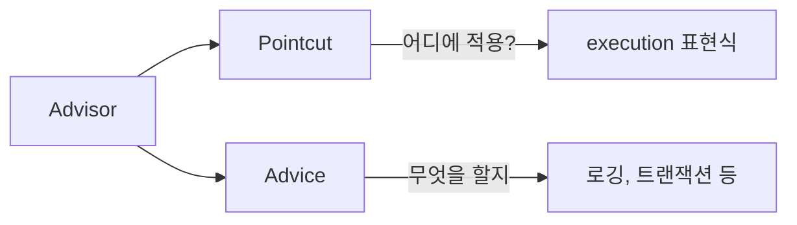

---

## 9. 빈 후처리기 (BeanPostProcessor)

### 9.1 동작 원리

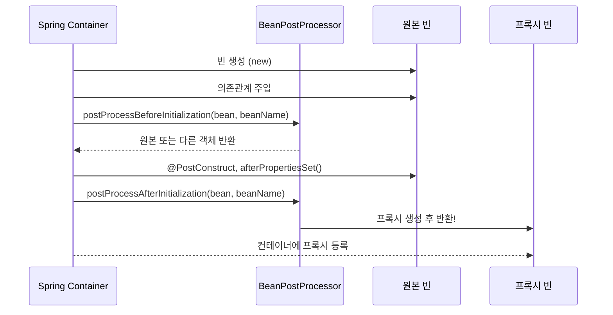

### 9.2 커스텀 BeanPostProcessor

```java
@Component
public class PackageLogTracePostProcessor implements BeanPostProcessor {

    private final String basePackage;
    private final Advisor advisor;

    public PackageLogTracePostProcessor(String basePackage, Advisor advisor) {
        this.basePackage = basePackage;
        this.advisor = advisor;
    }

    @Override
    public Object postProcessAfterInitialization(Object bean, String beanName) throws BeansException {
        log.info("후처리기 실행 — bean={}, beanName={}", bean.getClass(), beanName);

        // 패키지 확인
        Class<?> beanClass = bean.getClass();
        if (!beanClass.getPackageName().startsWith(basePackage)) {
            return bean; // 해당 패키지가 아니면 원본 반환
        }

        // 프록시 생성
        ProxyFactory proxyFactory = new ProxyFactory(bean);
        proxyFactory.addAdvisor(advisor);
        Object proxy = proxyFactory.getProxy();
        log.info("프록시 생성 — target={}, proxy={}", bean.getClass(), proxy.getClass());
        return proxy;
    }
}
```

### 9.3 자동 프록시 생성기 (AutoProxyCreator)

Spring AOP가 내부적으로 사용하는 `AnnotationAwareAspectJAutoProxyCreator`는 `BeanPostProcessor`의 구현체입니다.

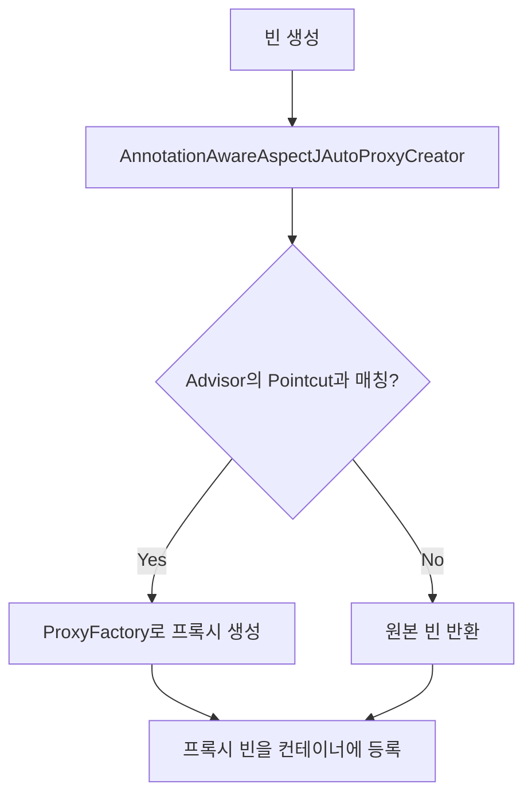

---

## 10. @Aspect — 실전 예시들

### 10.1 실행 시간 측정

```java
@Aspect
@Component
@Slf4j
public class ExecutionTimeAspect {

    @Around("@annotation(org.springframework.web.bind.annotation.GetMapping) || " +
            "@annotation(org.springframework.web.bind.annotation.PostMapping)")
    public Object measureTime(ProceedingJoinPoint joinPoint) throws Throwable {
        StopWatch stopWatch = new StopWatch();
        stopWatch.start();

        try {
            return joinPoint.proceed();
        } finally {
            stopWatch.stop();
            log.info("{} 실행 시간: {}ms",
                joinPoint.getSignature().getName(),
                stopWatch.getTotalTimeMillis());
        }
    }
}
```

### 10.2 메서드 파라미터 로깅

```java
@Aspect
@Component
@Slf4j
public class MethodLoggingAspect {

    @Pointcut("execution(* hello.service..*(..))")
    private void serviceLayer() {}

    @Before("serviceLayer()")
    public void logBefore(JoinPoint joinPoint) {
        String method = joinPoint.getSignature().toShortString();
        Object[] args = joinPoint.getArgs();
        log.info(">>> {} 호출, args={}", method, Arrays.toString(args));
    }

    @AfterReturning(pointcut = "serviceLayer()", returning = "result")
    public void logAfterReturning(JoinPoint joinPoint, Object result) {
        String method = joinPoint.getSignature().toShortString();
        log.info("<<< {} 반환, result={}", method, result);
    }

    @AfterThrowing(pointcut = "serviceLayer()", throwing = "ex")
    public void logAfterThrowing(JoinPoint joinPoint, Exception ex) {
        String method = joinPoint.getSignature().toShortString();
        log.error("!!! {} 예외 발생, exception={}", method, ex.getMessage());
    }
}
```

### 10.3 캐싱 AOP

```java
@Target(ElementType.METHOD)
@Retention(RetentionPolicy.RUNTIME)
public @interface Cacheable {
    String key();
    long ttlSeconds() default 60;
}

@Aspect
@Component
public class CacheAspect {

    private final Map<String, Object> cache = new ConcurrentHashMap<>();

    @Around("@annotation(cacheable)")
    public Object cache(ProceedingJoinPoint joinPoint, Cacheable cacheable) throws Throwable {
        String cacheKey = cacheable.key() + ":" + Arrays.toString(joinPoint.getArgs());

        if (cache.containsKey(cacheKey)) {
            log.info("캐시 히트: {}", cacheKey);
            return cache.get(cacheKey);
        }

        Object result = joinPoint.proceed();
        cache.put(cacheKey, result);
        log.info("캐시 저장: {}", cacheKey);
        return result;
    }
}
```

---

## 11. AOP 내부 호출 문제

### 11.1 문제 상황

```java
@Service
public class CallService {

    public void external() {
        log.info("external 호출");
        internal(); // 내부 호출 — AOP 미적용!
    }

    @Transactional // 내부 호출 시 트랜잭션 시작 안 됨
    public void internal() {
        log.info("internal 호출");
    }
}
```

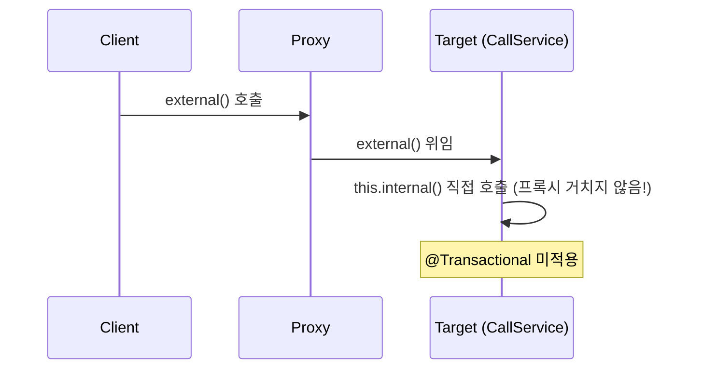

### 11.2 해결 방법

**방법 1: 자기 자신을 주입**

```java
@Service
public class CallService {

    @Autowired
    private CallService self; // 자기 자신의 프록시를 주입

    public void external() {
        self.internal(); // 프록시를 통해 호출
    }

    @Transactional
    public void internal() { ... }
}
```

**방법 2: 별도 클래스로 분리 (권장)**

```java
@Service
public class ExternalService {

    private final InternalService internalService;

    public void external() {
        internalService.internal(); // 다른 빈이므로 프록시 통과
    }
}

@Service
public class InternalService {

    @Transactional
    public void internal() { ... }
}
```

---

## 12. Spring AOP vs AspectJ

| 특성 | Spring AOP | AspectJ |
|------|-----------|---------|
| 위빙 시점 | 런타임 (프록시) | 컴파일 / 로드타임 / 런타임 |
| 적용 범위 | Spring Bean 메서드만 | 모든 Java 코드 |
| 성능 | 프록시 오버헤드 | 더 빠름 |
| 기능 | 제한적 | 필드, 생성자 등 모두 가능 |
| 설정 복잡도 | 간단 | 복잡 |
| 실무 사용 | 대부분의 경우 | 특수한 경우만 |

실무에서는 Spring AOP로 99% 해결됩니다.

---

## 13. 극한 시나리오 — 분산 추적 AOP

```java
@Aspect
@Component
@Slf4j
public class DistributedTracingAspect {

    private static final ThreadLocal<String> TRACE_ID = new ThreadLocal<>();

    @Around("execution(* hello..*(..))")
    public Object trace(ProceedingJoinPoint joinPoint) throws Throwable {
        boolean isRoot = TRACE_ID.get() == null;

        if (isRoot) {
            TRACE_ID.set(UUID.randomUUID().toString().substring(0, 8));
        }

        String traceId = TRACE_ID.get();
        String method = joinPoint.getSignature().toShortString();

        log.info("[{}] >>> {}", traceId, method);
        long start = System.currentTimeMillis();

        try {
            Object result = joinPoint.proceed();
            log.info("[{}] <<< {} ({}ms)", traceId, method,
                System.currentTimeMillis() - start);
            return result;
        } catch (Exception e) {
            log.error("[{}] !!! {} 예외: {}", traceId, method, e.getMessage());
            throw e;
        } finally {
            if (isRoot) {
                TRACE_ID.remove(); // 루트에서만 정리
            }
        }
    }
}
```

출력 예시:
```
[a1b2c3d4] >>> OrderController.createOrder(..)
[a1b2c3d4] >>> OrderService.createOrder(..)
[a1b2c3d4] >>> OrderRepository.save(..)
[a1b2c3d4] <<< OrderRepository.save(..) (5ms)
[a1b2c3d4] <<< OrderService.createOrder(..) (8ms)
[a1b2c3d4] <<< OrderController.createOrder(..) (12ms)
```

---

## 14. 전체 흐름 정리

```mermaid
flowchart TD
    A[Spring Boot 시작] --> B[@Aspect 클래스 스캔]
    B --> C[AnnotationAwareAspectJAutoProxyCreator 등록]
    C --> D[빈 생성 과정]
    D --> E[BeanPostProcessor 실행]
    E --> F{Pointcut 매칭?}
    F -->|Yes| G[ProxyFactory로 프록시 생성]
    F -->|No| H[원본 빈 등록]
    G --> I[프록시 빈 등록]
    I --> J[클라이언트 호출]
    J --> K[프록시 intercept]
    K --> L[Advice 실행 - Before]
    L --> M[실제 메서드 실행]
    M --> N[Advice 실행 - After]
    N --> O[결과 반환]
```

---

## 15. 요약

| 개념 | 역할 | 핵심 포인트 |
|------|------|-----------|
| AOP | 횡단 관심사 분리 | 비즈니스 로직에 집중 |
| JDK 동적 프록시 | 인터페이스 기반 프록시 | 인터페이스 필수 |
| CGLIB | 클래스 기반 프록시 | 상속 기반, final 불가 |
| ProxyFactory | JDK/CGLIB 자동 선택 | Spring이 제공 |
| BeanPostProcessor | 빈 생성 후 가공 | 프록시 자동 등록의 핵심 |
| @Aspect | AOP 선언 | @Around 가장 강력 |
| Pointcut | 어디에 적용할지 | execution 표현식 |
| Advice | 무엇을 할지 | @Before, @After, @Around |
| Advisor | Pointcut + Advice | Spring AOP의 기본 단위 |
