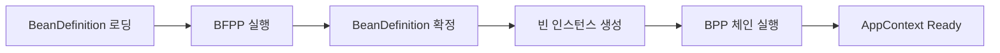
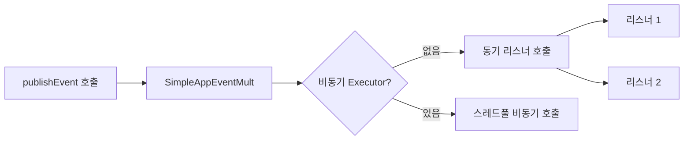
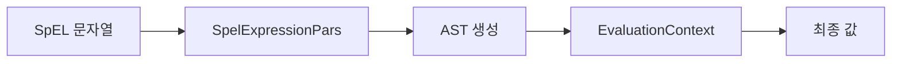
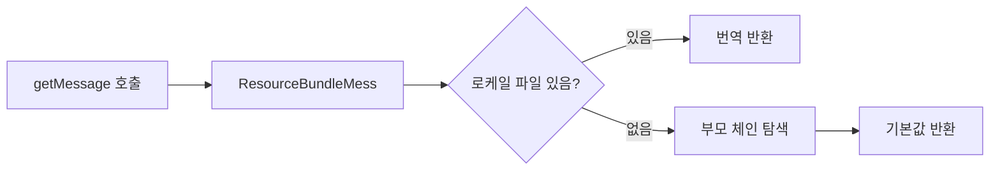
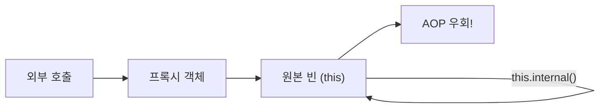
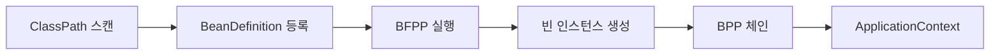

> **한 줄 요약:** Spring 컨테이너는 단순한 빈 저장소가 아니다. BeanPostProcessor 체인이 `@Autowired`·AOP 프록시·`@Async`를 자동화하고, BeanFactoryPostProcessor가 설정을 주입하며, ApplicationEventPublisher·SpEL·MessageSource·TaskScheduler가 하나의 유기체를 이룬다. 각 기계 장치가 어떻게 맞물려 돌아가는지 내부 메커니즘까지 이해해야 장애를 예방할 수 있다.

---

## 1. 실무 시나리오 — "Spring을 쓰는데 왜 이게 안 되지?"

시니어 개발자 면접에서 가장 많이 나오는 질문 유형은 **"왜 동작하지 않는가"** 다. `@Transactional`이 자기 메서드 안에서 안 먹히는 이유, `@Async`가 같은 빈 안에서 무시되는 이유, `@Value`가 null인 이유, `@EventListener`가 두 번 호출되는 이유. 이 모든 것은 Spring 컨테이너의 내부 부품을 모르기 때문에 발생한다.

> **비유:** 자동차 운전은 할 줄 알지만 엔진 구조를 모르면, 이상한 소리가 날 때 왜 그런지 알 수 없다. Spring 컨테이너의 내부 부품을 이해하면, 어떤 장애 상황에서도 원인을 추론할 수 있다.

이 글은 Spring의 "부품"을 하나씩 해부한다. 각 부품의 역할, 작동 순서, 그리고 그것을 잘못 사용했을 때 어떤 일이 벌어지는지를 Java/Spring 코드와 함께 설명한다.

---

## 2. Spring 컨테이너 초기화 전체 흐름

가장 먼저 전체 그림을 보자. 컨테이너가 시작될 때 무슨 일이 일어나는지 순서를 파악해야 나머지 개념이 제자리를 찾는다.



1. **BeanDefinition 로딩** — `@ComponentScan`, `@Configuration`, XML 등에서 빈 메타데이터를 읽어 `BeanDefinition` 객체로 등록한다. 실제 인스턴스는 아직 없다.
2. **BeanFactoryPostProcessor(BFPP) 실행** — `BeanDefinition`을 수정할 수 있는 유일한 단계다. `${db.url}` 같은 플레이스홀더를 실제 값으로 교체하거나, 새 `BeanDefinition`을 동적으로 추가할 수 있다.
3. **빈 인스턴스 생성** — 생성자 호출로 실제 Java 객체가 만들어진다.
4. **BeanPostProcessor(BPP) 체인 실행** — 각 BPP가 순서대로 빈을 가공한다. `@Autowired` 주입, `@PostConstruct` 실행, AOP 프록시 생성이 모두 여기서 일어난다.
5. **ApplicationContext Ready** — 모든 준비가 끝나면 `ApplicationReadyEvent`가 발행된다.

**핵심 구분:** BFPP는 인스턴스가 생성되기 **전**에 `BeanDefinition`을 수정하고, BPP는 인스턴스가 생성된 **후**에 인스턴스를 수정한다.

---

## 3. BeanFactoryPostProcessor — 빈 정의를 수술하는 단계

### 3.1 BFPP의 역할과 시점

`BeanFactoryPostProcessor`는 컨테이너가 빈 정의를 모두 로딩한 뒤, 실제 인스턴스를 만들기 전에 실행된다. 이 인터페이스를 구현하면 `BeanDefinition`을 읽고 쓰고 추가하는 것이 모두 가능하다.

```java
@FunctionalInterface
public interface BeanFactoryPostProcessor {
    void postProcessBeanFactory(ConfigurableListableBeanFactory beanFactory)
        throws BeansException;
}
```

`ConfigurableListableBeanFactory`를 통해 등록된 모든 `BeanDefinition`에 접근할 수 있다.

### 3.2 PropertySourcesPlaceholderConfigurer — ${...} 치환의 실제 구현자

`@Value("${server.port}")`가 실제 값으로 치환되는 과정을 모르는 개발자가 많다. 이것은 `PropertySourcesPlaceholderConfigurer`라는 BFPP가 담당한다.

```java
// 동작 순서 시뮬레이션

// 1단계: @PropertySource가 Environment에 PropertySource를 등록
@Configuration
@PropertySource("classpath:application.properties")
public class AppConfig {
    // application.properties → Environment에 적재됨
}

// 2단계: BFPP가 BeanDefinition 내의 ${...}를 실제 값으로 교체
// 내부 의사코드
public class PropertySourcesPlaceholderConfigurer
    implements BeanFactoryPostProcessor, EnvironmentAware {

    @Override
    public void postProcessBeanFactory(ConfigurableListableBeanFactory beanFactory) {
        // 모든 BeanDefinition을 순회
        for (String beanName : beanFactory.getBeanDefinitionNames()) {
            BeanDefinition bd = beanFactory.getBeanDefinition(beanName);
            // PropertyValues 안의 ${key} 패턴을 Environment에서 찾아 치환
            resolvePropertyValues(bd, beanFactory);
        }
    }
}

// 3단계: 개발자가 사용하는 방식
@Component
public class DataSourceConfig {

    @Value("${db.url}")            // BeanDefinition 단계에서 이미 치환됨
    private String dbUrl;

    @Value("${db.pool.size:10}")   // 기본값 10, 프로퍼티 없으면 10 사용
    private int poolSize;

    @Value("${db.password}")       // 없으면 BeanCreationException 발생
    private String password;
}
```

**왜 BFPP 단계에서 해야 하는가?** 빈 인스턴스가 만들어질 때 생성자나 필드에 실제 값이 주입되어야 하기 때문이다. 인스턴스 생성 이후에 플레이스홀더를 치환하면 이미 null이나 리터럴 `"${db.url}"` 문자열이 주입된 상태가 된다.

```java
// 자주 하는 실수 — @Value가 null인 경우
@Component
public class BadService {

    // 이 클래스가 static 내부 클래스라면 Spring 빈으로 관리되지 않아 @Value가 null
    static class InnerHelper {
        @Value("${timeout}") // null! Spring이 관리하지 않음
        private int timeout;
    }

    // new로 직접 생성한 객체도 동일하게 null
    public void doSomething() {
        BadService copy = new BadService(); // Spring 컨텍스트 밖
        // copy.someValue == null
    }
}
```

### 3.3 ConfigurationClassPostProcessor — @Configuration의 진짜 처리자

`@Configuration`, `@ComponentScan`, `@Import`, `@Bean`을 해석하는 핵심 BFPP다. Spring Boot의 자동 설정(`@EnableAutoConfiguration`)도 이것을 통해 동작한다.

```java
// Spring 내부 등록 과정 (AnnotationConfigApplicationContext 생성자에서)
// ConfigurationClassPostProcessor는 우선순위 가장 높게 자동 등록됨

public class ConfigurationClassPostProcessor
    implements BeanDefinitionRegistryPostProcessor,
               PriorityOrdered {  // PriorityOrdered → 가장 먼저 실행

    @Override
    public void postProcessBeanDefinitionRegistry(BeanDefinitionRegistry registry) {
        // 1. @Configuration 클래스를 파싱
        // 2. @ComponentScan → 스캔 → BeanDefinition 등록
        // 3. @Import → ImportSelector, ImportBeanDefinitionRegistrar 실행
        // 4. @Bean 메서드 → BeanDefinition 생성
        // 5. @PropertySource → Environment에 PropertySource 추가
    }
}
```

**`BeanDefinitionRegistryPostProcessor` vs `BeanFactoryPostProcessor`의 차이:**

`BeanDefinitionRegistryPostProcessor`는 BFPP의 서브 인터페이스로, `postProcessBeanDefinitionRegistry()`가 먼저 실행되어 새 `BeanDefinition`을 **등록**할 수 있다. 이후 `postProcessBeanFactory()`가 실행된다. `ConfigurationClassPostProcessor`가 이것을 구현하기 때문에 `@ComponentScan`으로 발견된 빈들이 다른 BFPP보다 먼저 등록된다.

```java
// 커스텀 BeanDefinitionRegistryPostProcessor 예시
// 동적으로 빈 등록이 필요한 경우 (예: 설정 파일 기반 동적 Repository 생성)
@Component
public class DynamicRepositoryRegistrar implements BeanDefinitionRegistryPostProcessor {

    @Override
    public void postProcessBeanDefinitionRegistry(BeanDefinitionRegistry registry) {
        // 외부 설정에서 읽은 엔티티 목록을 기반으로 Repository 빈 동적 등록
        List<String> entities = loadEntitiesFromConfig();
        for (String entity : entities) {
            GenericBeanDefinition bd = new GenericBeanDefinition();
            bd.setBeanClass(GenericRepository.class);
            bd.getPropertyValues().add("entityName", entity);
            registry.registerBeanDefinition(entity + "Repository", bd);
        }
    }

    @Override
    public void postProcessBeanFactory(ConfigurableListableBeanFactory beanFactory) {
        // 추가 수정이 필요한 경우
    }
}
```

---

## 4. BeanPostProcessor 체인 — 빈 인스턴스 가공의 파이프라인

### 4.1 BPP 인터페이스 구조

```java
public interface BeanPostProcessor {

    // 초기화(InitializingBean, @PostConstruct, init-method) 실행 전
    default Object postProcessBeforeInitialization(Object bean, String beanName)
        throws BeansException {
        return bean;
    }

    // 초기화 실행 후 — 여기서 AOP 프록시로 교체
    default Object postProcessAfterInitialization(Object bean, String beanName)
        throws BeansException {
        return bean;
    }
}
```

**반환값이 중요하다.** `postProcessAfterInitialization`에서 다른 객체를 반환하면, 컨테이너에는 그 객체가 등록된다. AOP 프록시 교체가 이 방식으로 작동한다. 원본 `OrderService` 대신 `OrderService$$SpringCGLIB$$0`가 등록된다.

### 4.2 BPP 실행 순서와 대표 구현체


실제 실행 순서는 `PriorityOrdered` > `Ordered` > 나머지 순이다. 각 구현체가 무엇을 담당하는지 하나씩 해부한다.

### 4.3 AutowiredAnnotationBeanPostProcessor — @Autowired의 실제 구현자

`@Autowired`, `@Value`, `@Inject`를 처리하는 BPP다. `postProcessBeforeInitialization` 단계에서 실행된다.

```java
// Spring 내부 동작 의사코드
public class AutowiredAnnotationBeanPostProcessor
    implements InstantiationAwareBeanPostProcessor,
               MergedBeanDefinitionPostProcessor {

    // 빈 인스턴스 생성 직후 — 주입 메타데이터 수집
    @Override
    public void postProcessMergedBeanDefinition(
        RootBeanDefinition beanDefinition, Class<?> beanType, String beanName) {

        // @Autowired, @Value가 붙은 필드/메서드를 스캔하여 캐싱
        InjectionMetadata metadata = findAutowiringMetadata(beanName, beanType, null);
        metadata.checkConfigMembers(beanDefinition);
    }

    // 프로퍼티 설정 단계 — 실제 주입 수행
    @Override
    public PropertyValues postProcessProperties(PropertyValues pvs,
        Object bean, String beanName) {

        InjectionMetadata metadata = findAutowiringMetadata(beanName, bean.getClass(), pvs);
        // 리플렉션으로 필드/메서드에 의존성 주입
        metadata.inject(bean, beanName, pvs);
        return pvs;
    }
}
```

**왜 생성자 주입이 필드 주입보다 권장되는가:**

필드 주입은 `AutowiredAnnotationBPP`가 리플렉션으로 `field.setAccessible(true)` 후 값을 세팅한다. 이 방식은 순환 참조를 숨기고, 테스트 시 Spring 컨텍스트 없이는 주입할 수 없다. 생성자 주입은 인스턴스 생성 시점에 모든 의존성이 확정되므로 불변성이 보장되고 순환 참조가 컴파일 타임에 드러난다.

```java
// 필드 주입 — 테스트하기 어렵고 순환 참조 숨김
@Service
public class OrderService {
    @Autowired
    private PaymentService paymentService; // null 가능성, 순환 참조 숨김
}

// 생성자 주입 — 권장 방식
@Service
@RequiredArgsConstructor // Lombok이 생성자 생성
public class OrderService {
    private final PaymentService paymentService; // final 보장, 테스트 용이
}

// 순환 참조 시 생성자 주입은 명확하게 실패
// A → B → A: BeanCurrentlyInCreationException 즉시 발생
// 필드 주입은 허용했다가 Spring 6.x부터 기본 금지
```

### 4.4 CommonAnnotationBeanPostProcessor — JSR-250 어노테이션 처리

`@PostConstruct`, `@PreDestroy`, `@Resource`를 처리하는 BPP다.

```java
// CommonAnnotationBPP 내부 동작 요약
public class CommonAnnotationBeanPostProcessor
    extends InitDestroyAnnotationBeanPostProcessor
    implements InstantiationAwareBeanPostProcessor {

    public CommonAnnotationBeanPostProcessor() {
        // @PostConstruct와 @PreDestroy를 처리할 어노테이션으로 등록
        setInitAnnotationType(PostConstruct.class);
        setDestroyAnnotationType(PreDestroy.class);
    }
}
```

`@PostConstruct`와 `@PreDestroy`의 실행 시점을 정확히 이해해야 한다.

```java
@Service
public class CacheService {

    private final Map<String, Object> cache = new ConcurrentHashMap<>();

    // @PostConstruct: 의존성 주입 완료 후 호출됨
    // 생성자에서는 아직 @Autowired 필드들이 null일 수 있음
    @PostConstruct
    public void initCache() {
        // 이 시점에 @Autowired 필드 모두 주입 완료
        // 안전하게 초기화 로직 수행 가능
        log.info("캐시 초기화 시작");
        loadInitialData();
    }

    // @PreDestroy: 컨텍스트 종료 직전 호출됨
    @PreDestroy
    public void clearCache() {
        // 리소스 정리, 연결 해제
        cache.clear();
        log.info("캐시 정리 완료");
    }
}
```

**`@PostConstruct` vs `InitializingBean.afterPropertiesSet()` vs `init-method`의 실행 순서:**

```
1. @PostConstruct (CommonAnnotationBPP가 postProcessBeforeInitialization에서 실행)
2. InitializingBean.afterPropertiesSet() (Spring 콜백)
3. @Bean(initMethod="...") 또는 XML init-method
```

세 가지를 동시에 쓰면 위 순서대로 실행된다. 일반적으로 `@PostConstruct` 하나만 쓰는 것이 가장 깔끔하다.

### 4.5 AsyncAnnotationBeanPostProcessor — @Async의 실제 처리자

`@Async`가 붙은 메서드를 프록시로 감싸 별도 스레드에서 실행하게 만드는 BPP다.

```java
// @EnableAsync가 import하는 설정
@Configuration
public class AsyncAnnotationBeanPostProcessorRegistrar {
    // AsyncAnnotationBeanPostProcessor를 BPP로 등록
    // 이것이 @Async 메서드를 찾아 프록시를 생성
}

// @Async 올바른 사용법
@Service
public class EmailService {

    // @Async는 반드시 별도 빈에서 외부 호출로만 동작
    // 반환 타입: void 또는 Future/CompletableFuture
    @Async("emailTaskExecutor")  // 특정 Executor 지정
    public CompletableFuture<Boolean> sendEmail(String to, String subject) {
        // 비동기로 실행됨 — 별도 스레드
        boolean result = smtpClient.send(to, subject);
        return CompletableFuture.completedFuture(result);
    }
}

// 극한 시나리오: @Async가 무시되는 경우들
@Service
public class BrokenAsyncService {

    // 케이스 1: 자기 자신 내부 호출 — 프록시 우회
    public void trigger() {
        sendReport(); // this.sendReport() — @Async 무시됨
    }

    @Async
    public void sendReport() { /* 실제로는 동기 실행 */ }

    // 케이스 2: private 메서드 — 프록시 오버라이드 불가
    @Async
    private void privateAsync() { /* 완전히 무시됨 */ }

    // 케이스 3: final 메서드 — CGLIB 서브클래스 오버라이드 불가
    @Async
    public final void finalAsync() { /* 무시됨 */ }
}
```

**`@Async` 예외 처리의 함정:**

```java
@Async
public void asyncMethod() {
    throw new RuntimeException("비동기 예외");
    // 이 예외는 호출자 스레드로 전파되지 않음!
    // 로그도 안 찍힐 수 있음
}

// 해결책: AsyncUncaughtExceptionHandler 등록
@Configuration
@EnableAsync
public class AsyncConfig implements AsyncConfigurer {

    @Override
    public AsyncUncaughtExceptionHandler getAsyncUncaughtExceptionHandler() {
        return (ex, method, params) -> {
            log.error("비동기 메서드 예외: {}.{}",
                method.getDeclaringClass().getSimpleName(),
                method.getName(), ex);
            // 알림 발송, 메트릭 기록 등
        };
    }
}
```

### 4.6 AbstractAutoProxyCreator — AOP 프록시 생성의 핵심

`AnnotationAwareAspectJAutoProxyCreator`가 이것을 상속하며, `@Aspect` 클래스로 선언된 모든 Advisor를 수집하고, 각 빈에 대해 Pointcut 매칭 여부를 확인한 뒤 프록시를 생성한다.

```java
// 내부 동작 의사코드
public abstract class AbstractAutoProxyCreator extends ProxyProcessorSupport
    implements SmartInstantiationAwareBeanPostProcessor {

    @Override
    public Object postProcessAfterInitialization(Object bean, String beanName) {
        if (bean != null) {
            Object cacheKey = getCacheKey(bean.getClass(), beanName);
            // 순환 참조로 이미 프록시 생성된 경우 스킵
            if (!this.earlyProxyReferences.contains(cacheKey)) {
                return wrapIfNecessary(bean, beanName, cacheKey);
            }
        }
        return bean;
    }

    protected Object wrapIfNecessary(Object bean, String beanName, Object cacheKey) {
        // 1. 이미 인프라 빈이면 스킵 (BPP 자신들은 프록시 대상 아님)
        if (isInfrastructureClass(bean.getClass())) return bean;

        // 2. 적용 가능한 Advisor 목록 수집 (Pointcut 매칭)
        Object[] specificInterceptors = getAdvicesAndAdvisorsForBean(
            bean.getClass(), beanName, null);

        // 3. 적용할 Advisor가 있으면 프록시 생성
        if (specificInterceptors != DO_NOT_PROXY) {
            return createProxy(bean.getClass(), beanName,
                specificInterceptors, new SingletonTargetSource(bean));
        }
        return bean; // 없으면 원본 반환
    }
}
```

**왜 BPP 자신들은 프록시 대상에서 제외되는가:** BPP는 빈 초기화 과정을 담당한다. 만약 BPP 자체가 AOP 프록시로 감싸진다면, 프록시 생성 과정에서 무한 재귀가 발생한다. `isInfrastructureClass()`가 `BeanPostProcessor`, `AopInfrastructureBean` 구현체를 감지해 제외한다.

---

## 5. @Autowired 주입 방식 심층 — ObjectProvider와 Lazy 주입

### 5.1 일반 @Autowired의 한계

```java
// 문제: 빈이 없으면 NoSuchBeanDefinitionException
// 문제: 빈이 여러 개면 NoUniqueBeanDefinitionException
@Autowired
private PaymentGateway gateway; // 정확히 1개 있어야 함
```

### 5.2 ObjectProvider — 지연 조회와 선택적 주입

`ObjectProvider<T>`는 `ApplicationContext.getBean()`을 래핑한 타입 안전 버전이다. 빈을 즉시 가져오지 않고 필요할 때 조회한다.

```java
@Service
public class OrderService {

    // ObjectProvider: 빈이 없어도 예외 없음, 있을 때만 사용
    private final ObjectProvider<DiscountPolicy> discountPolicyProvider;
    private final ObjectProvider<List<PaymentGateway>> gatewaysProvider;

    public OrderService(ObjectProvider<DiscountPolicy> discountPolicyProvider,
                        ObjectProvider<List<PaymentGateway>> gatewaysProvider) {
        this.discountPolicyProvider = discountPolicyProvider;
        this.gatewaysProvider = gatewaysProvider;
    }

    public BigDecimal calculatePrice(Order order) {
        // getIfAvailable: 빈이 없으면 null (예외 없음)
        DiscountPolicy policy = discountPolicyProvider.getIfAvailable();
        BigDecimal price = order.getBasePrice();

        if (policy != null) {
            price = policy.apply(price);
        }

        return price;
    }

    public void processPayment(Order order) {
        // ifAvailable: Consumer 방식
        discountPolicyProvider.ifAvailable(policy -> {
            log.info("할인 정책 적용: {}", policy.getClass().getSimpleName());
        });

        // stream(): 모든 매칭 빈을 스트림으로
        gatewaysProvider.stream()
            .filter(gw -> gw.supports(order.getCurrency()))
            .findFirst()
            .orElseThrow(() -> new IllegalStateException("지원하는 게이트웨이 없음"));
    }

    // 프로토타입 빈을 싱글톤에서 올바르게 사용하는 방법
    @Autowired
    private ObjectProvider<PrototypeBean> prototypeBeanProvider;

    public void usePrototype() {
        // 호출할 때마다 새 인스턴스 생성됨
        PrototypeBean bean = prototypeBeanProvider.getObject();
        bean.doWork();
    }
}
```

**왜 프로토타입 빈을 싱글톤에서 직접 `@Autowired`로 주입받으면 안 되는가:**

싱글톤 빈은 컨테이너 시작 시 한 번만 생성된다. 이때 프로토타입 빈이 주입되면 그 인스턴스가 고정된다. 이후 호출에서도 같은 인스턴스를 사용하므로, 프로토타입의 의미(요청마다 새 인스턴스)가 사라진다. `ObjectProvider`나 `ApplicationContext.getBean()`으로 매번 새로 조회해야 한다.

### 5.3 @Lazy — 순환 참조 해결과 지연 초기화

```java
@Service
public class ServiceA {
    // @Lazy: ServiceB를 프록시로 주입, 실제 사용 시점에 초기화
    // 순환 참조 A → B → A 해결에 활용
    @Autowired
    @Lazy
    private ServiceB serviceB;

    public void doA() {
        // 이 시점에 ServiceB가 실제로 초기화됨
        serviceB.doB();
    }
}

@Service
public class ServiceB {
    @Autowired
    private ServiceA serviceA;
}
```

**`@Lazy` 내부 메커니즘:** `AutowiredAnnotationBPP`가 `@Lazy`를 감지하면 실제 빈 대신 CGLIB 프록시를 주입한다. 프록시의 첫 메서드 호출 시 `ApplicationContext`에서 실제 빈을 조회해 위임한다. 빈이 없거나 타입이 맞지 않으면 그때 예외가 발생한다.

---

## 6. ApplicationEventPublisher — 이벤트 내부 메커니즘

### 6.1 이벤트 기반 설계의 이유

> **비유:** 회사에서 "신규 주문이 들어왔다"는 공지를 게시판에 올리면, 관심있는 팀들이 각자 알아서 반응한다. 주문팀이 배송팀, 재고팀, 회계팀에 각각 직접 전화하지 않아도 된다. 이 방식은 각 팀을 느슨하게 연결한다.

직접 호출 방식은 `OrderService`가 `InventoryService`, `ShippingService`, `AccountingService`를 모두 알아야 한다. 새 팀이 추가되면 `OrderService`를 수정해야 한다. 이벤트 방식은 `OrderService`가 "주문 완료됨"이라는 이벤트만 발행하면 된다. 각 서비스는 그 이벤트를 구독하면 된다.

```java
// 이벤트 객체 — 불변으로 설계
public record OrderCompletedEvent(
    Long orderId,
    String customerId,
    BigDecimal totalAmount,
    Instant occurredAt
) {
    public OrderCompletedEvent(Long orderId, String customerId, BigDecimal totalAmount) {
        this(orderId, customerId, totalAmount, Instant.now());
    }
}

// 이벤트 발행자
@Service
@RequiredArgsConstructor
public class OrderService {

    private final ApplicationEventPublisher eventPublisher;
    private final OrderRepository orderRepository;

    @Transactional
    public void completeOrder(Long orderId) {
        Order order = orderRepository.findById(orderId)
            .orElseThrow(() -> new OrderNotFoundException(orderId));

        order.complete();
        orderRepository.save(order);

        // 이벤트 발행 — InventoryService, ShippingService 등을 직접 알 필요 없음
        eventPublisher.publishEvent(
            new OrderCompletedEvent(orderId, order.getCustomerId(), order.getTotalAmount())
        );
    }
}
```

### 6.2 이벤트 리스너 등록 방식들

```java
// 방식 1: @EventListener — 가장 단순
@Component
@Slf4j
public class InventoryEventHandler {

    @EventListener
    public void handleOrderCompleted(OrderCompletedEvent event) {
        log.info("재고 차감 처리: orderId={}", event.orderId());
        // 재고 처리 로직
    }

    // 조건부 처리 — SpEL 표현식으로 필터링
    @EventListener(condition = "#event.totalAmount > 100000")
    public void handleHighValueOrder(OrderCompletedEvent event) {
        log.info("고액 주문 특별 처리: {}", event.totalAmount());
    }
}

// 방식 2: SmartApplicationListener — 순서 제어
@Component
public class AuditEventListener implements SmartApplicationListener {

    @Override
    public boolean supportsEventType(Class<? extends ApplicationEvent> eventType) {
        return OrderCompletedEvent.class.isAssignableFrom(eventType);
    }

    @Override
    public int getOrder() {
        return Ordered.HIGHEST_PRECEDENCE; // 가장 먼저 실행
    }

    @Override
    public void onApplicationEvent(ApplicationEvent event) {
        // 감사 로그 기록
    }
}
```

### 6.3 ApplicationEventPublisher 내부 구조



```java
// ApplicationEventPublisher.publishEvent() 내부 흐름
// AbstractApplicationContext.publishEvent()
protected void publishEvent(Object event, ResolvableType eventType) {
    // ApplicationEvent로 래핑 (필요한 경우)
    ApplicationEvent applicationEvent = ...;

    // 부모 컨텍스트에도 전파
    if (this.parent != null) {
        this.parent.publishEvent(event);
    }

    // SimpleApplicationEventMulticaster에 위임
    getApplicationEventMulticaster().multicastEvent(applicationEvent, eventType);
}

// SimpleApplicationEventMulticaster.multicastEvent()
public void multicastEvent(ApplicationEvent event, ResolvableType eventType) {
    Executor executor = getTaskExecutor(); // null이면 동기

    for (ApplicationListener<?> listener : getApplicationListeners(event, eventType)) {
        if (executor != null) {
            executor.execute(() -> invokeListener(listener, event));
        } else {
            invokeListener(listener, event); // 동기 호출
        }
    }
}
```

**기본값이 동기인 이유:** 이벤트 발행과 처리가 같은 트랜잭션 안에 있어야 하는 경우가 많다. 비동기로 만들면 트랜잭션 경계가 분리되어 이벤트 처리 도중 실패해도 원래 트랜잭션은 이미 커밋된 상태가 된다.

### 6.4 @TransactionalEventListener — 트랜잭션과 이벤트 연동

```java
@Component
public class OrderEventHandler {

    // 트랜잭션 커밋 이후에만 실행 — 커밋 실패 시 이벤트 처리 안 함
    @TransactionalEventListener(phase = TransactionPhase.AFTER_COMMIT)
    public void onOrderCommitted(OrderCompletedEvent event) {
        // 이 시점에 DB에 주문이 확정됨
        // 외부 시스템 연동, 이메일 발송 등 부수효과 실행
        emailService.sendConfirmation(event.customerId());
    }

    // AFTER_ROLLBACK: 롤백 후 실행 — 실패 알림에 활용
    @TransactionalEventListener(phase = TransactionPhase.AFTER_ROLLBACK)
    public void onOrderRollback(OrderCompletedEvent event) {
        log.error("주문 처리 롤백: orderId={}", event.orderId());
        alertService.notifyFailure(event.orderId());
    }

    // BEFORE_COMMIT: 커밋 직전 — 추가 검증에 활용
    @TransactionalEventListener(phase = TransactionPhase.BEFORE_COMMIT)
    public void validateBeforeCommit(OrderCompletedEvent event) {
        // 커밋 전 최종 검증, 실패 시 롤백 가능
        fraudDetectionService.check(event);
    }
}
```

**극한 시나리오 — 트랜잭션 없이 `@TransactionalEventListener` 호출:**

`@TransactionalEventListener`는 기본적으로 트랜잭션 밖에서 이벤트를 발행하면 **무시된다**. 트랜잭션이 없으면 커밋/롤백 단계 자체가 없기 때문이다. `fallbackExecution = true`를 설정해야 트랜잭션 없이도 실행된다.

```java
@TransactionalEventListener(
    phase = TransactionPhase.AFTER_COMMIT,
    fallbackExecution = true  // 트랜잭션 없어도 실행
)
public void handleEvent(OrderCompletedEvent event) { ... }
```

---

## 7. SpEL (Spring Expression Language) — 표현식 엔진 내부

### 7.1 SpEL이 필요한 이유

`@Value("${db.url}")`은 프로퍼티 치환이다. `@Value("#{...}")`은 SpEL 평가다. 이 둘은 완전히 다른 메커니즘이다.

```java
@Component
public class SpelExamples {

    // 프로퍼티 치환 — PropertySourcesPlaceholderConfigurer가 처리
    @Value("${server.port}")
    private int serverPort;

    // SpEL — ExpressionParser가 런타임에 평가
    @Value("#{systemProperties['java.version']}")
    private String javaVersion;

    // SpEL로 다른 빈의 프로퍼티 참조
    @Value("#{orderService.maxOrderSize}")
    private int maxOrderSize;

    // SpEL 조건식
    @Value("#{environment.getProperty('feature.discount') == 'true' ? 0.1 : 0.0}")
    private double discountRate;

    // 컬렉션 필터링
    @Value("#{@orderRepository.findAll().?[status == 'PENDING']}")
    private List<Order> pendingOrders;
}
```

### 7.2 SpEL 파서 내부 구조



```java
// SpEL 파서 직접 사용 — 내부 동작 이해
public class SpelDeepDive {

    public void demonstrateParser() {
        ExpressionParser parser = new SpelExpressionParser();

        // 1. 단순 산술
        Expression expr = parser.parseExpression("100 * 2 + 50");
        Integer result = expr.getValue(Integer.class); // 250

        // 2. 객체 접근 (표준 점 표기법)
        Order order = new Order("ORD-001", new BigDecimal("50000"));
        Expression orderExpr = parser.parseExpression("totalAmount * 0.9");
        BigDecimal discounted = orderExpr.getValue(order, BigDecimal.class);

        // 3. EvaluationContext — 변수, 함수, 빈 참조 제공
        StandardEvaluationContext context = new StandardEvaluationContext(order);
        context.setVariable("discountRate", 0.1);
        context.registerFunction("round",
            Math.class.getDeclaredMethod("round", double.class));

        Expression complex = parser.parseExpression(
            "totalAmount * (1 - #discountRate)");
        BigDecimal finalPrice = complex.getValue(context, BigDecimal.class);

        // 4. 컬렉션 선택 (.?[조건]) — SQL WHERE와 유사
        List<Order> orders = getOrders();
        Expression filter = parser.parseExpression(
            "orders.?[totalAmount > 10000]");
        // orders 변수에서 totalAmount > 10000인 것만 선택

        // 5. 컬렉션 투영 (.![표현식]) — SQL SELECT와 유사
        Expression projection = parser.parseExpression(
            "orders.![orderId]"); // orderId만 추출한 List
    }
}
```

### 7.3 @Cacheable에서 SpEL 활용

`@Cacheable`의 `key`, `condition`, `unless` 속성이 SpEL로 평가된다.

```java
@Service
public class ProductService {

    // 기본: 모든 파라미터가 키
    @Cacheable("products")
    public Product findById(Long id) { ... }

    // SpEL로 복합 키 생성
    @Cacheable(value = "products", key = "#category + ':' + #page")
    public Page<Product> findByCategory(String category, int page) { ... }

    // 조건부 캐시 — price > 1000인 경우만 캐시
    @Cacheable(value = "products",
               condition = "#result != null && #result.price > 1000")
    public Product findExpensiveProduct(String name) { ... }

    // unless — 결과가 null이면 캐시하지 않음
    @Cacheable(value = "products", unless = "#result == null")
    public Optional<Product> findOptional(Long id) { ... }

    // 커스텀 KeyGenerator와 SpEL 조합
    @CachePut(value = "products", key = "#product.id")
    public Product updateProduct(Product product) { ... }

    @CacheEvict(value = "products",
                key = "#id",
                condition = "#id > 0")
    public void deleteProduct(Long id) { ... }
}
```

### 7.4 @PreAuthorize에서 SpEL

Spring Security의 메서드 보안도 SpEL 기반이다.

```java
@Service
public class AdminService {

    // 역할 체크
    @PreAuthorize("hasRole('ADMIN')")
    public void adminOnly() { ... }

    // 파라미터 활용
    @PreAuthorize("hasRole('ADMIN') or #userId == authentication.principal.id")
    public UserProfile getProfile(Long userId) { ... }

    // 커스텀 보안 표현식 (SecurityExpressionRoot 확장)
    @PreAuthorize("@securityService.canAccessOrder(authentication, #orderId)")
    public Order getOrder(Long orderId) { ... }

    // @PostAuthorize — 결과 검증
    @PostAuthorize("returnObject.ownerId == authentication.principal.id")
    public Order getOrderById(Long id) { ... }
}
```

---

## 8. MessageSource — 국제화(i18n) 내부 메커니즘

### 8.1 MessageSource 구조



```java
// 설정
@Configuration
public class MessageSourceConfig {

    @Bean
    public MessageSource messageSource() {
        ReloadableResourceBundleMessageSource ms =
            new ReloadableResourceBundleMessageSource();

        ms.setBasename("classpath:messages"); // messages.properties, messages_ko.properties 등
        ms.setDefaultEncoding("UTF-8");
        ms.setCacheSeconds(3600); // 1시간마다 재로딩 (운영 환경 핫리로딩 가능)
        ms.setFallbackToSystemLocale(false); // 시스템 로케일 폴백 비활성화
        ms.setDefaultLocale(Locale.KOREAN); // 기본 로케일

        return ms;
    }
}
```

```
# messages.properties (기본)
order.complete=Order {0} completed. Amount: {1}
error.not.found=Item not found: {0}

# messages_ko.properties (한국어)
order.complete=주문 {0}번이 완료되었습니다. 금액: {1}원
error.not.found={0}을(를) 찾을 수 없습니다.

# messages_en.properties (영어)
order.complete=Order #{0} has been completed. Total: ${1}
error.not.found={0} not found.
```

```java
@Service
@RequiredArgsConstructor
public class OrderNotificationService {

    private final MessageSource messageSource;

    public String buildCompletionMessage(Long orderId, BigDecimal amount, Locale locale) {
        // MessageFormat 패턴으로 파라미터 치환
        return messageSource.getMessage(
            "order.complete",
            new Object[]{orderId, amount},
            locale
        );
    }

    // Validation 에러 메시지도 MessageSource 활용
    public String getErrorMessage(String code, Object[] args, Locale locale) {
        return messageSource.getMessage(
            code,
            args,
            "알 수 없는 오류", // 기본값
            locale
        );
    }
}
```

### 8.2 MessageSourceResolvable과 BindingResult

Spring MVC의 폼 검증 에러 메시지도 `MessageSource`를 통해 처리된다.

```java
@RestController
@RequiredArgsConstructor
public class OrderController {

    private final MessageSource messageSource;

    @PostMapping("/orders")
    public ResponseEntity<?> createOrder(
        @Valid @RequestBody OrderRequest request,
        BindingResult bindingResult,
        Locale locale) {

        if (bindingResult.hasErrors()) {
            List<String> errors = bindingResult.getAllErrors().stream()
                .map(error -> messageSource.getMessage(error, locale))
                // MessageSourceResolvable 인터페이스 — 오류 코드 체인을 순서대로 탐색
                // NotNull.orderRequest.amount → NotNull.amount → NotNull
                .collect(Collectors.toList());
            return ResponseEntity.badRequest().body(errors);
        }

        return ResponseEntity.ok().build();
    }
}
```

```
# 검증 에러 메시지 키 우선순위
# 1. NotNull.orderRequest.amount (필드명 포함, 가장 구체적)
# 2. NotNull.amount
# 3. NotNull.java.math.BigDecimal
# 4. NotNull (가장 일반적)
NotNull.orderRequest.amount=주문 금액은 필수입니다.
NotNull=필수 항목입니다.
```

---

## 9. TaskExecutor / TaskScheduler — 비동기 실행과 스케줄링

### 9.1 ThreadPoolTaskExecutor 설정과 튜닝

```java
@Configuration
@EnableAsync
@EnableScheduling
public class TaskConfig {

    // 비동기 실행 Executor
    @Bean("asyncTaskExecutor")
    public ThreadPoolTaskExecutor asyncTaskExecutor() {
        ThreadPoolTaskExecutor executor = new ThreadPoolTaskExecutor();

        // 핵심 스레드 수: 항상 살아있는 스레드
        executor.setCorePoolSize(10);

        // 최대 스레드 수: 큐가 가득 찼을 때 생성
        executor.setMaxPoolSize(50);

        // 큐 용량: corePoolSize 초과 작업을 쌓아두는 공간
        // 큐가 가득 차면 maxPoolSize까지 스레드 추가
        // maxPoolSize도 가득 차면 RejectionPolicy 적용
        executor.setQueueCapacity(100);

        // 대기 가능 시간: corePoolSize 초과 스레드의 유휴 시간
        executor.setKeepAliveSeconds(60);

        // 스레드 이름 접두사 — 로그에서 식별 용이
        executor.setThreadNamePrefix("async-task-");

        // 종료 시 대기 중인 작업 완료 후 종료
        executor.setWaitForTasksToCompleteOnShutdown(true);
        executor.setAwaitTerminationSeconds(30);

        // RejectionPolicy — 큐와 스레드가 모두 가득 찼을 때
        // CallerRunsPolicy: 호출자 스레드에서 직접 실행 (백프레셔)
        // AbortPolicy: RejectedExecutionException (기본값)
        // DiscardPolicy: 작업 버림
        executor.setRejectedExecutionHandler(new ThreadPoolExecutor.CallerRunsPolicy());

        executor.initialize();
        return executor;
    }

    // 스케줄링 Executor
    @Bean
    public TaskScheduler taskScheduler() {
        ThreadPoolTaskScheduler scheduler = new ThreadPoolTaskScheduler();
        scheduler.setPoolSize(5); // 스케줄링은 단일/소수 스레드로 충분
        scheduler.setThreadNamePrefix("scheduler-");
        scheduler.setErrorHandler(t -> log.error("스케줄 작업 예외", t));
        return scheduler;
    }
}
```

**스레드 풀 튜닝 원칙:**

```
CPU 집약적 작업: corePoolSize = CPU 코어 수 + 1
IO 집약적 작업 (DB, HTTP): corePoolSize = CPU 코어 수 × (1 + 대기시간/처리시간)

예: 평균 대기 50ms, 처리 10ms, 8코어 → 8 × (1 + 50/10) = 48 스레드
```

### 9.2 @Scheduled 동작 방식

```java
@Component
@Slf4j
public class ScheduledTasks {

    // 고정 지연: 이전 실행 종료 후 5초 대기
    // 이전 작업이 길면 다음 실행도 늦어짐
    @Scheduled(fixedDelay = 5000)
    public void fixedDelayTask() {
        log.info("fixedDelay 실행: {}", LocalDateTime.now());
        // 3초 걸리는 작업이면 총 간격 = 3초 + 5초 = 8초
    }

    // 고정 속도: 실행 시작 기준 5초마다
    // 이전 작업이 5초를 넘으면 다음 실행이 즉시 시작됨
    @Scheduled(fixedRate = 5000)
    public void fixedRateTask() {
        log.info("fixedRate 실행: {}", LocalDateTime.now());
    }

    // cron 표현식: 더 세밀한 제어
    // 초 분 시 일 월 요일
    @Scheduled(cron = "0 0 9 * * MON-FRI") // 평일 오전 9시
    public void workdayMorningTask() {
        log.info("영업일 아침 작업");
    }

    // 프로퍼티로 cron 외부화 — 환경별 다른 스케줄
    @Scheduled(cron = "${batch.cron:0 0 * * * *}") // 기본값: 매 시간 정각
    public void configurableCron() {
        log.info("설정 가능한 스케줄 작업");
    }

    // 초기 지연: 앱 시작 후 10초 후 첫 실행
    @Scheduled(fixedRate = 60000, initialDelay = 10000)
    public void delayedStart() {
        log.info("초기 지연 후 실행");
    }
}
```

**`@Scheduled`의 기본 동작 함정:**

`@Scheduled`는 기본적으로 단일 스레드에서 실행된다. 여러 `@Scheduled` 메서드가 있으면 순차적으로 실행된다. 하나가 오래 걸리면 다른 스케줄이 지연된다.

```java
// 해결책 1: @Async + @Scheduled 조합
@Scheduled(fixedRate = 1000)
@Async("asyncTaskExecutor")
public void asyncScheduled() {
    // 별도 스레드에서 실행
    longRunningTask();
}

// 해결책 2: 위에서 설정한 ThreadPoolTaskScheduler 사용
// poolSize > 1이면 병렬 실행 가능
```

### 9.3 SchedulingConfigurer — 동적 스케줄 등록

```java
@Configuration
@EnableScheduling
public class DynamicScheduleConfig implements SchedulingConfigurer {

    @Override
    public void configureTasks(ScheduledTaskRegistrar registrar) {
        registrar.setScheduler(taskScheduler());

        // 동적으로 스케줄 등록 — DB에서 읽어오는 등
        registrar.addTriggerTask(
            () -> log.info("동적 스케줄 실행"),
            triggerContext -> {
                // 다음 실행 시간을 동적으로 계산
                CronExpression cron = CronExpression.parse(getScheduleFromDb());
                LocalDateTime next = cron.next(LocalDateTime.now());
                return next == null ? null
                    : next.toInstant(ZoneOffset.UTC);
            }
        );
    }

    private String getScheduleFromDb() {
        // DB에서 cron 표현식 조회 — 운영 중 변경 가능
        return "0 */5 * * * *"; // 예시
    }
}
```

---

## 10. AOP 내부 메커니즘 — JDK Dynamic Proxy vs CGLIB 심층

### 10.1 JDK Dynamic Proxy의 실제 동작

```java
// JDK 동적 프록시가 생성하는 클래스 (의사코드)
// 실제로는 런타임에 바이트코드로 생성됨
public final class $Proxy0 extends Proxy implements OrderService {

    private static Method m1; // equals
    private static Method m2; // hashCode
    private static Method m3; // createOrder
    private static Method m4; // cancelOrder

    static {
        try {
            m3 = Class.forName("OrderService").getMethod("createOrder", Long.class);
            m4 = Class.forName("OrderService").getMethod("cancelOrder", Long.class);
        } catch (Exception e) { throw new Error(e); }
    }

    public $Proxy0(InvocationHandler h) {
        super(h); // Proxy 클래스에 InvocationHandler 저장
    }

    @Override
    public void createOrder(Long orderId) {
        try {
            // 모든 메서드 호출이 InvocationHandler.invoke()로 위임
            h.invoke(this, m3, new Object[]{orderId});
        } catch (RuntimeException e) { throw e; }
        catch (Throwable e) { throw new UndeclaredThrowableException(e); }
    }
}
```

### 10.2 CGLIB 프록시의 실제 동작

```java
// CGLIB이 생성하는 서브클래스 (의사코드)
public class OrderServiceImpl$$SpringCGLIB$$0 extends OrderServiceImpl {

    private MethodInterceptor CGLIB$CALLBACK_0; // Advice 체인

    @Override
    public void createOrder(Long orderId) {
        MethodInterceptor interceptor = CGLIB$CALLBACK_0;
        if (interceptor == null) {
            // 인터셉터 없으면 원본 호출
            super.createOrder(orderId);
        } else {
            // MethodProxy를 통해 인터셉터 호출
            interceptor.intercept(this, CGLIB$createOrder$0$Method,
                new Object[]{orderId}, CGLIB$createOrder$0$Proxy);
        }
    }

    // MethodProxy를 통한 super 호출 — 리플렉션보다 빠름
    final void CGLIB$createOrder$0(Long orderId) {
        super.createOrder(orderId); // 원본 메서드 직접 호출
    }
}
```

### 10.3 ProxyFactory — 두 방식의 통합 추상화

```java
// ProxyFactory 사용 예시 — 내부 작동 방식 이해용
@Test
void proxyFactoryTest() {
    // 인터페이스 있는 경우
    ServiceInterface concreteWithInterface = new ServiceImpl();
    ProxyFactory factory1 = new ProxyFactory(concreteWithInterface);
    factory1.addAdvice(new LogAdvice());

    // Spring Boot 기본: proxyTargetClass=true → CGLIB 사용
    factory1.setProxyTargetClass(true);
    ServiceInterface proxy1 = (ServiceInterface) factory1.getProxy();
    assertThat(proxy1).isInstanceOf(ServiceImpl.class); // CGLIB 서브클래스

    // 인터페이스 없는 경우 — 항상 CGLIB
    ConcreteOnly concreteOnly = new ConcreteOnly();
    ProxyFactory factory2 = new ProxyFactory(concreteOnly);
    factory2.addAdvice(new LogAdvice());
    ConcreteOnly proxy2 = (ConcreteOnly) factory2.getProxy();
    // AopUtils.isCglibProxy(proxy2) == true
}

// Advice 구현
public class LogAdvice implements MethodInterceptor {
    @Override
    public Object invoke(MethodInvocation invocation) throws Throwable {
        log.info("호출 전: {}", invocation.getMethod().getName());
        Object result = invocation.proceed();
        log.info("호출 후: {}", invocation.getMethod().getName());
        return result;
    }
}
```

### 10.4 Pointcut 표현식 심층

```java
@Aspect
@Component
public class DeepPointcutAspect {

    // execution — 가장 강력하고 유연
    // 반환타입 패키지.클래스.메서드(파라미터)
    @Pointcut("execution(public * com.example.service..*Service.*(..))")
    public void serviceLayer() {}

    // within — 타입 범위로 매칭
    @Pointcut("within(com.example.service..*)")
    public void inServicePackage() {}

    // @annotation — 어노테이션 기반 매칭
    @Pointcut("@annotation(com.example.annotation.Loggable)")
    public void loggable() {}

    // @within — 클래스 레벨 어노테이션
    @Pointcut("@within(org.springframework.stereotype.Service)")
    public void serviceAnnotated() {}

    // args — 파라미터 타입 매칭
    @Pointcut("args(com.example.domain.Order, ..)")
    public void orderArgs() {}

    // bean — Spring 빈 이름 패턴
    @Pointcut("bean(*Service)")
    public void serviceBean() {}

    // 조합 — AND, OR, NOT
    @Pointcut("serviceLayer() && loggable()")
    public void serviceAndLoggable() {}

    @Around("serviceAndLoggable()")
    public Object aroundServiceLoggable(ProceedingJoinPoint pjp) throws Throwable {
        // 서비스 레이어이면서 @Loggable이 붙은 메서드만 적용
        return pjp.proceed();
    }
}
```

### 10.5 Advisor 체인 순서 제어

```java
// 여러 Aspect가 같은 메서드에 적용될 때 실행 순서

@Aspect
@Component
@Order(1) // 가장 먼저 실행 (가장 바깥 프록시)
public class SecurityAspect {
    @Around("execution(* com.example.service.*.*(..))")
    public Object security(ProceedingJoinPoint pjp) throws Throwable {
        // 1. 권한 체크
        checkSecurity();
        try {
            return pjp.proceed();
        } finally {
            // 6. 보안 정리
        }
    }
}

@Aspect
@Component
@Order(2)
public class TransactionAspect {
    @Around("execution(* com.example.service.*.*(..))")
    public Object transaction(ProceedingJoinPoint pjp) throws Throwable {
        // 2. 트랜잭션 시작
        beginTransaction();
        try {
            Object result = pjp.proceed();
            // 5. 트랜잭션 커밋
            commit();
            return result;
        } catch (Exception e) {
            rollback();
            throw e;
        }
    }
}

@Aspect
@Component
@Order(3) // 가장 나중 실행 (가장 안쪽 프록시)
public class LoggingAspect {
    @Around("execution(* com.example.service.*.*(..))")
    public Object logging(ProceedingJoinPoint pjp) throws Throwable {
        // 3. 로그 시작
        log.info("시작");
        Object result = pjp.proceed();
        // 4. 로그 종료
        log.info("종료");
        return result;
    }
}

// 실행 순서:
// Security(시작) → Transaction(시작) → Logging(시작)
//   → 실제 메서드 실행
// Logging(종료) → Transaction(커밋) → Security(정리)
```

---

## 11. 자기 호출 문제 — AOP의 가장 치명적인 함정

### 11.1 왜 this.method()가 프록시를 우회하는가



```java
@Service
public class OrderService {

    @Transactional
    public void processOrder(Long orderId) {
        // this는 원본 OrderService 인스턴스
        // 프록시를 거치지 않음 → @Transactional 무시
        validateOrder(orderId);
        // validateOrder의 트랜잭션 전파 설정이 있어도 의미없음
    }

    @Transactional(propagation = Propagation.REQUIRES_NEW)
    public void validateOrder(Long orderId) {
        // 외부에서 직접 호출 시에만 새 트랜잭션 시작
        // processOrder에서 this로 호출 시 기존 트랜잭션 그대로 사용
    }
}
```

### 11.2 해결 방법 비교

```java
// 방법 1: 별도 빈으로 분리 (권장)
@Service
@RequiredArgsConstructor
public class OrderService {

    private final OrderValidationService validationService;

    @Transactional
    public void processOrder(Long orderId) {
        // 별도 빈 호출 → 프록시 통과 → @Transactional 정상 적용
        validationService.validateOrder(orderId);
    }
}

@Service
public class OrderValidationService {
    @Transactional(propagation = Propagation.REQUIRES_NEW)
    public void validateOrder(Long orderId) { ... }
}

// 방법 2: AopContext.currentProxy() (비권장 — 강한 결합)
@Service
public class OrderService {

    @Transactional
    public void processOrder(Long orderId) {
        // 현재 프록시를 가져와서 호출
        ((OrderService) AopContext.currentProxy()).validateOrder(orderId);
        // 단점: Spring AOP에 강하게 결합됨, 테스트 어려움
    }

    @Transactional(propagation = Propagation.REQUIRES_NEW)
    public void validateOrder(Long orderId) { ... }
}
// AopContext.currentProxy() 사용 시 @EnableAspectJAutoProxy(exposeProxy = true) 필요

// 방법 3: ApplicationContext에서 self 조회 (비권장)
@Service
public class OrderService implements ApplicationContextAware {

    private OrderService self;

    @Override
    public void setApplicationContext(ApplicationContext ctx) {
        this.self = ctx.getBean(OrderService.class);
    }

    public void processOrder(Long orderId) {
        self.validateOrder(orderId); // 프록시 통과
    }
}
```

---

## 12. 극한 시나리오 — 실전 장애 케이스

### 12.1 시나리오: @Async + @Transactional 조합에서 데이터 누락

```java
@Service
public class ReportService {

    @Async
    @Transactional
    public CompletableFuture<Report> generateReport(Long reportId) {
        // 문제: @Async가 @Transactional보다 바깥에 있음
        // AsyncAnnotationBPP가 AbstractAutoProxyCreator보다 나중에 실행되거나
        // Advisor 순서에 따라 @Async 프록시가 @Transactional 프록시를 감쌀 수 있음

        // @Async 프록시가 먼저 실행 → 새 스레드에서 실행
        // → 새 스레드에서 @Transactional 프록시 실행
        // → 실제로는 이 조합이 동작하지만 위험 요소가 있음

        Report report = createReport(reportId);
        return CompletableFuture.completedFuture(report);
    }
}

// 안전한 분리 방법
@Service
public class ReportService {

    private final ReportTransactionalService reportTxService;

    @Async
    public CompletableFuture<Report> generateReportAsync(Long reportId) {
        // @Async: 비동기 실행만 담당
        Report report = reportTxService.generateReportInTransaction(reportId);
        return CompletableFuture.completedFuture(report);
    }
}

@Service
public class ReportTransactionalService {

    @Transactional
    public Report generateReportInTransaction(Long reportId) {
        // @Transactional: 트랜잭션만 담당
        return createReport(reportId);
    }
}
```

### 12.2 시나리오: BPP가 BFPP보다 일찍 초기화될 때의 문제

```java
// BPP가 @Autowired로 BFPP를 주입받으려 할 때 문제 발생
// BPP는 BFPP 실행 전에 초기화가 완료되어야 함
// 그런데 BFPP를 주입받으려면 BFPP 빈이 먼저 있어야 함

@Component
public class ProblematicBPP implements BeanPostProcessor {

    // 이 주입이 BPP 초기화 시점을 BFPP 이후로 미루는 문제를 일으킬 수 있음
    @Autowired
    private PropertySourcesPlaceholderConfigurer configurer; // BFPP!

    // 해결책: BPP는 BFPP에 의존하지 않도록 설계
    // 또는 Ordered 구현으로 초기화 순서 명시
}

// 올바른 설계: ApplicationContextAware로 나중에 참조
@Component
public class SafeBPP implements BeanPostProcessor, ApplicationContextAware {

    private ApplicationContext context;

    @Override
    public void setApplicationContext(ApplicationContext ctx) {
        this.context = ctx;
    }

    @Override
    public Object postProcessAfterInitialization(Object bean, String beanName) {
        // 필요할 때 context에서 직접 조회
        return bean;
    }
}
```

### 12.3 시나리오: 이벤트 리스너가 두 번 호출되는 문제

```java
// 원인: 부모/자식 컨텍스트 구조에서 이벤트가 두 번 전파됨
// Spring MVC: Root ApplicationContext + DispatcherServlet 자식 컨텍스트

@Component
public class OrderEventListener {

    @EventListener
    public void handleOrderEvent(OrderCompletedEvent event) {
        log.info("이벤트 처리: {}", event.orderId());
        // 웹 애플리케이션에서 두 번 호출될 수 있음
        // Root Context에서 한 번, DispatcherServlet Context에서 한 번
    }
}

// 해결책: 리스너를 Root Context 빈으로만 등록
// @Service, @Repository는 Root Context에 속함
// @Controller는 자식 Context에 속함
// 이벤트 리스너는 @Service 빈에 정의하면 중복 호출 없음

// Spring Boot에서는 단일 ApplicationContext이므로 이 문제가 없음
// 하지만 여러 ApplicationContext를 프로그래밍으로 생성하면 동일 문제 발생
```

---

## 13. ObjectProvider 고급 활용 — 다형성과 전략 패턴

```java
// 전략 패턴과 ObjectProvider 조합
public interface PaymentGateway {
    boolean supports(Currency currency);
    PaymentResult process(Payment payment);
}

@Component
public class KrwPaymentGateway implements PaymentGateway {
    @Override
    public boolean supports(Currency currency) {
        return currency == Currency.KRW;
    }
    @Override
    public PaymentResult process(Payment payment) { ... }
}

@Component
public class UsdPaymentGateway implements PaymentGateway {
    @Override
    public boolean supports(Currency currency) {
        return currency == Currency.USD;
    }
    @Override
    public PaymentResult process(Payment payment) { ... }
}

@Service
@RequiredArgsConstructor
public class PaymentService {

    // 모든 PaymentGateway 구현체를 자동 수집
    private final ObjectProvider<List<PaymentGateway>> gatewaysProvider;

    public PaymentResult processPayment(Payment payment) {
        List<PaymentGateway> gateways = gatewaysProvider.getObject();

        return gateways.stream()
            .filter(gw -> gw.supports(payment.getCurrency()))
            .findFirst()
            .map(gw -> gw.process(payment))
            .orElseThrow(() -> new UnsupportedCurrencyException(payment.getCurrency()));
    }
}

// 더 직접적인 방법: Map 주입
@Service
public class PaymentServiceV2 {

    private final Map<String, PaymentGateway> gatewayMap;

    // 빈 이름 → 빈 인스턴스 Map으로 자동 주입
    public PaymentServiceV2(Map<String, PaymentGateway> gatewayMap) {
        this.gatewayMap = gatewayMap;
        // {"krwPaymentGateway": KrwPaymentGateway, "usdPaymentGateway": UsdPaymentGateway}
    }
}
```

---

## 14. 면접 포인트 5개 — 깊이 있는 WHY 답변

## 면접 포인트

### 면접 포인트 1: BeanPostProcessor와 BeanFactoryPostProcessor의 차이

> **Q: BPP와 BFPP의 차이를 설명하고, 각각 어떤 상황에서 사용하는지 말해주세요.**

**핵심 차이는 실행 시점과 대상이다.**

BFPP는 `BeanDefinition`(메타데이터)을 수정하며, 실제 인스턴스 생성 전에 실행된다. `PropertySourcesPlaceholderConfigurer`가 `${db.url}`을 실제 값으로 치환하고, `ConfigurationClassPostProcessor`가 `@ComponentScan`을 처리하는 것이 BFPP의 역할이다.

BPP는 실제 빈 인스턴스를 수정하며, 인스턴스 생성 후에 실행된다. `AutowiredAnnotationBeanPostProcessor`가 `@Autowired` 의존성을 주입하고, `AbstractAutoProxyCreator`가 AOP 프록시로 교체하는 것이 BPP의 역할이다.

**극한 시나리오:** BPP 구현체 안에서 `@Autowired`로 일반 빈을 주입받으면 문제가 생긴다. BPP가 초기화될 때 아직 다른 빈들이 완전히 초기화되지 않을 수 있어, `@Autowired` 주입 대상이 아직 BFPP 처리를 받지 못한 상태일 수 있다. 이 경우 `@Value`가 플레이스홀더 문자열 그대로(`"${db.url}"`) 주입될 수 있다. Spring은 이 문제에 대해 경고 로그를 남긴다.

### 면접 포인트 2: @Transactional이 동작하지 않는 모든 경우

> **Q: @Transactional이 적용되지 않는 케이스를 모두 설명해주세요.**

1. **자기 호출 (Self-Invocation):** 같은 클래스 내에서 `this.method()`로 호출 시 프록시를 우회한다.

2. **private 메서드:** CGLIB 서브클래스와 JDK 동적 프록시 모두 private 메서드를 오버라이드할 수 없다. `@Transactional`을 붙여도 완전히 무시된다.

3. **final 메서드 (CGLIB):** CGLIB은 상속으로 동작하므로 final 메서드를 오버라이드할 수 없다.

4. **Spring Bean으로 관리되지 않는 객체:** `new OrderService()`로 직접 생성한 객체는 프록시가 아니므로 `@Transactional`이 없다.

5. **`@Transactional`이 없는 메서드에서 호출:** `A.methodA()`가 `@Transactional`이고 내부에서 `this.methodB()`를 호출할 때, `methodB`의 `@Transactional`은 무시된다.

6. **전파 옵션이 `NOT_SUPPORTED`, `NEVER`:** 명시적으로 트랜잭션을 비활성화한 경우.

7. **예외 타입 불일치:** 기본적으로 `RuntimeException`과 `Error`만 롤백한다. `CheckedException`을 던지면 롤백되지 않는다. `@Transactional(rollbackFor = Exception.class)`로 설정해야 한다.

### 면접 포인트 3: @Async와 @Transactional을 같이 쓰면 어떻게 되는가

> **Q: 같은 메서드에 @Async와 @Transactional을 동시에 붙이면 어떻게 되나요?**

`@Async`가 새 스레드를 시작하고, `@Transactional`이 그 스레드 내에서 트랜잭션을 관리한다. 트랜잭션은 스레드 로컬 변수(`ThreadLocal<TransactionSynchronizationManager>`)로 관리되므로, 새 스레드에서는 항상 새 트랜잭션이 시작된다.

문제는 두 Aspect의 순서다. `@Async` 프록시가 먼저 실행되어 새 스레드를 만들고, 그 안에서 `@Transactional` 프록시가 실행된다면 정상 동작한다. 반대로 `@Transactional`이 먼저 실행되면 호출자 스레드에서 트랜잭션이 시작되고, `@Async`로 새 스레드가 만들어지면서 트랜잭션 컨텍스트가 전달되지 않는다.

실무에서는 이 두 어노테이션을 같은 메서드에 쓰지 않는 것을 권장한다. 비동기 메서드와 트랜잭션 메서드를 분리하는 것이 안전하다.

### 면접 포인트 4: ApplicationEventPublisher의 트랜잭션 처리

> **Q: @Transactional 메서드 안에서 이벤트를 발행했는데, 이벤트 리스너에서 그 데이터가 조회되지 않는 경우가 있습니다. 원인을 설명해주세요.**

기본 `@EventListener`는 이벤트 발행 시점에 동기적으로 실행된다. `@Transactional` 메서드가 아직 커밋되기 전에 이벤트 리스너가 실행되므로, 리스너에서 DB를 조회하면 아직 커밋되지 않은 데이터를 보지 못한다(기본 격리 수준 `READ_COMMITTED` 기준).

해결책은 `@TransactionalEventListener(phase = TransactionPhase.AFTER_COMMIT)`을 사용하는 것이다. 이렇게 하면 트랜잭션이 성공적으로 커밋된 후에 리스너가 실행되므로, 커밋된 데이터를 안전하게 조회할 수 있다.

**추가 주의사항:** `AFTER_COMMIT` 단계에서 실행되는 리스너에서 DB 쓰기 작업을 하려면 새 트랜잭션이 필요하다. 기존 트랜잭션은 이미 완료 상태이므로, 리스너 메서드에 `@Transactional(propagation = Propagation.REQUIRES_NEW)`를 붙여야 한다.

### 면접 포인트 5: Spring 컨테이너에서 순환 참조가 왜 문제이고 어떻게 해결하는가

> **Q: Spring에서 순환 참조가 왜 문제이며, Spring이 이것을 어떻게 감지하고 처리하는가요? Spring 6.x에서 달라진 점은?**

**왜 문제인가:** 생성자 주입에서 A가 B를 필요로 하고 B가 A를 필요로 하면, A를 생성하려면 B가 필요하고 B를 생성하려면 A가 필요한 닭-달걀 문제가 발생한다. `BeanCurrentlyInCreationException`이 즉시 발생한다.

**Spring이 과거에 처리한 방법 (세터/필드 주입):** 빈 생성 3단계 구조를 활용했다.
1. 빈 인스턴스 생성 (생성자 호출, 이때는 아직 의존성 없음)
2. 의존성 주입 (세터, 필드)
3. 초기화

단계 1에서 `singletonObjects`(3차 캐시)에 등록하기 전에 `singletonFactories`(1차 캐시)에 미완성 빈 팩토리를 등록한다. 다른 빈이 아직 미완성인 A를 필요로 하면 팩토리에서 조기 참조(early reference)를 제공한다.

**Spring 6.x (Spring Boot 3.x)의 변경:** `spring.main.allow-circular-references=false`가 기본값이 되었다. 순환 참조는 기본적으로 허용되지 않고 시작 시 실패한다. 이는 설계 문제를 명확히 드러내기 위한 의도적 결정이다. 순환 참조가 있다면 빈 분리, 이벤트 기반 설계, 또는 `@Lazy` 주입으로 해결해야 한다.

---

## 15. 전체 구조 통합 — 컨테이너 초기화 완전 흐름



```java
// 컨테이너 초기화 과정을 직접 관찰하는 방법
@Component
@Slf4j
public class ContainerLifecycleObserver
    implements BeanPostProcessor,
               ApplicationListener<ApplicationReadyEvent>,
               InitializingBean {

    // 1. BPP.postProcessBeforeInitialization — 모든 빈에 대해 호출
    @Override
    public Object postProcessBeforeInitialization(Object bean, String beanName) {
        if (!beanName.contains("CGLIB") && !beanName.startsWith("org.springframework")) {
            log.debug("BPP Before: {}", beanName);
        }
        return bean;
    }

    // 2. InitializingBean.afterPropertiesSet — 이 빈 자신의 초기화
    @Override
    public void afterPropertiesSet() {
        log.info("ContainerLifecycleObserver 초기화 완료");
    }

    // 3. BPP.postProcessAfterInitialization — 모든 빈에 대해 호출
    @Override
    public Object postProcessAfterInitialization(Object bean, String beanName) {
        if (AopUtils.isAopProxy(bean)) {
            log.debug("AOP 프록시 등록: {} → {}",
                beanName, bean.getClass().getSuperclass().getSimpleName());
        }
        return bean;
    }

    // 4. ApplicationReadyEvent — 모든 초기화 완료 후
    @Override
    public void onApplicationEvent(ApplicationReadyEvent event) {
        ConfigurableApplicationContext ctx = event.getApplicationContext();
        log.info("=== ApplicationContext 준비 완료 ===");
        log.info("등록된 빈 수: {}", ctx.getBeanDefinitionCount());
        log.info("활성 프로파일: {}", Arrays.toString(ctx.getEnvironment().getActiveProfiles()));
    }
}
```

---

## 16. 핵심 정리표

| 컴포넌트 | 실행 시점 | 역할 | 잘못 쓰면? |
|----------|-----------|------|------------|
| ConfigurationClassPostProcessor | BFPP (빈 정의 단계) | @Configuration, @ComponentScan 파싱 | 없으면 @Bean, @Component 동작 안 함 |
| PropertySourcesPlaceholderConfigurer | BFPP (빈 정의 단계) | ${...} 플레이스홀더 치환 | @Value가 리터럴 문자열로 주입됨 |
| AutowiredAnnotationBPP | BPP Before | @Autowired, @Value, @Inject 주입 | 수동 등록 필요 (보통 자동) |
| CommonAnnotationBPP | BPP Before | @PostConstruct, @PreDestroy, @Resource | JSR-250 어노테이션 무시됨 |
| AsyncAnnotationBPP | BPP After | @Async 메서드 프록시화 | @EnableAsync 없으면 동기 실행 |
| AbstractAutoProxyCreator | BPP After | AOP 프록시 생성 | @Aspect 자동 적용 안 됨 |
| ApplicationEventMulticaster | 런타임 | 이벤트 멀티캐스팅 | 기본 동기 — 리스너 블로킹 시 전체 지연 |
| SpelExpressionParser | 런타임 | SpEL 표현식 평가 | 잘못된 표현식 → EvaluationException |
| ThreadPoolTaskExecutor | 런타임 | @Async 스레드 관리 | 큐 가득 시 RejectedExecutionException |
| TaskScheduler | 런타임 | @Scheduled 실행 | 단일 스레드 기본 — 작업 중첩 위험 |

---

## 17. 실무에서 자주 하는 실수 — 체크리스트

1. **@Transactional + 자기 호출:** 같은 클래스 내부에서 `@Transactional` 메서드를 `this`로 호출하면 트랜잭션이 무시된다. 항상 다른 빈을 통해 호출하거나 메서드를 별도 클래스로 분리한다.

2. **@Async void 예외 소실:** `void` 반환 `@Async` 메서드에서 예외가 발생하면 기본적으로 로그도 안 남고 사라진다. `AsyncUncaughtExceptionHandler`를 반드시 등록한다.

3. **@Value가 null — Spring 관리 밖 객체:** `new`로 직접 생성한 객체나 static 필드에는 `@Value`가 적용되지 않는다. 반드시 Spring이 관리하는 빈이어야 한다.

4. **@TransactionalEventListener + @Transactional 누락:** `AFTER_COMMIT` 단계에서 DB 쓰기를 하려면 `@Transactional(propagation = REQUIRES_NEW)`가 필요하다. 없으면 `IllegalTransactionStateException`이 발생한다.

5. **ObjectProvider 사용 전 프로토타입 빈 직접 주입:** 싱글톤에 프로토타입을 직접 `@Autowired`로 주입하면 싱글톤처럼 동작한다. `ObjectProvider.getObject()`로 매번 새 인스턴스를 가져와야 한다.

6. **@Scheduled 단일 스레드 블로킹:** 여러 `@Scheduled` 메서드 중 하나가 느리면 나머지가 모두 지연된다. `ThreadPoolTaskScheduler`의 `poolSize`를 늘리거나 `@Async`를 함께 쓴다.

7. **SpEL #{...}과 ${...} 혼동:** `#{}` 안에서 `${}` 플레이스홀더를 혼용하면 예상치 못한 결과가 나온다. 프로퍼티 값을 SpEL로 참조하려면 `#{'${db.url}'}` 형식을 쓴다.

8. **@EventListener 트랜잭션 안에서 즉시 조회:** 커밋 전에 이벤트 리스너가 실행되어 DB에서 아직 안 보이는 데이터를 조회한다. `@TransactionalEventListener(phase = AFTER_COMMIT)` 사용.
