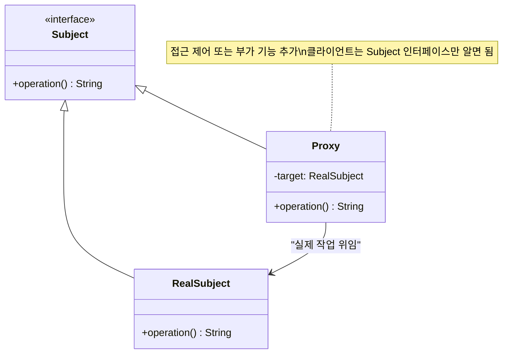
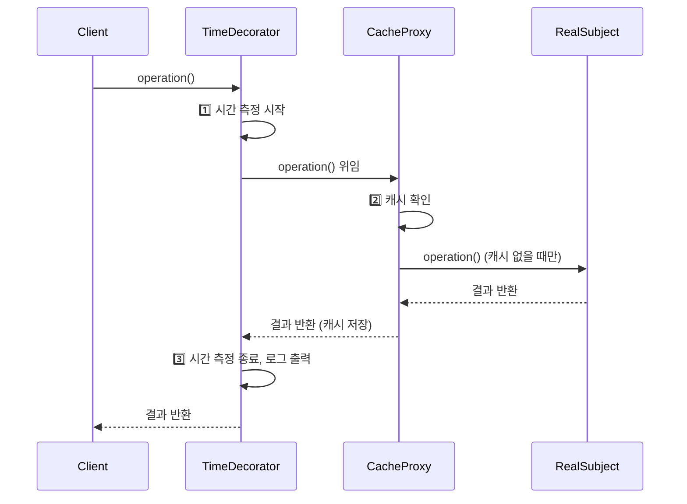
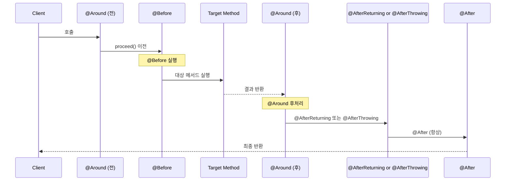
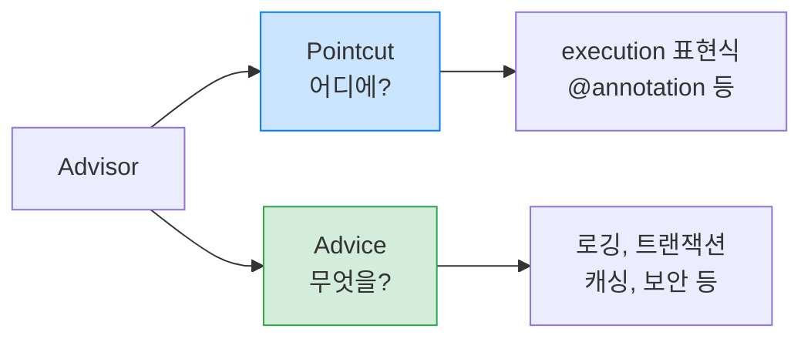
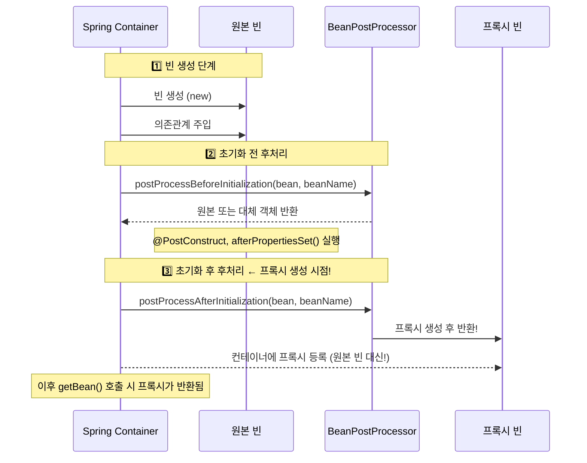
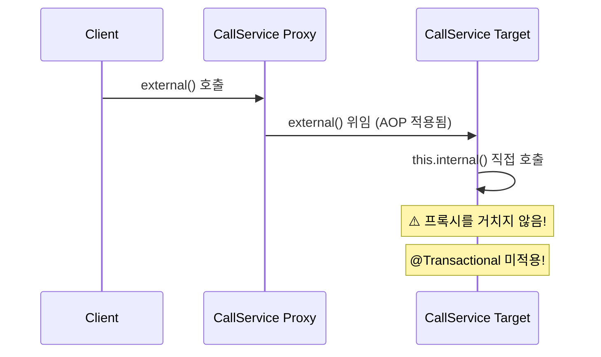

> **한 줄 요약:** Spring AOP는 프록시 기반으로 로깅·트랜잭션 같은 횡단 관심사를 비즈니스 로직과 분리하며, BeanPostProcessor가 그 자동화를 담당합니다.

## 1. 실무 시나리오 — 100개 서비스에 로그를 추가하라

어느 날 팀장이 요청합니다. "모든 서비스 메서드에 실행 시간 로그를 추가해 주세요." 서비스 클래스가 100개라면 어떻게 할까요? 직접 수정하면 100개 파일을 열어야 하고, 나중에 로그 포맷을 바꾸면 또 100곳을 수정해야 합니다.

로깅, 보안 검사, 트랜잭션 처리처럼 여러 클래스에 걸쳐 반복되는 코드를 **횡단 관심사(Cross-Cutting Concern)**라고 합니다. 비즈니스 로직과는 무관하지만 모든 곳에 필요합니다. 이를 각 클래스에 직접 넣으면 중복 코드가 폭발적으로 늘어납니다.

Spring AOP는 이 문제를 **프록시 패턴**으로 해결합니다. 실제 객체 앞에 대리인(Proxy)을 세워, 부가 기능은 프록시가 처리하고 핵심 로직은 원본 객체가 담당합니다. 마치 국회의원(핵심 업무 담당)과 경호원(보안·접견 담당)의 역할 분리처럼요.

---

## 2. 횡단 관심사 문제

### 2.1 문제 상황 — 코드 중복 폭발

```java
// 로그를 남기고 싶은 서비스들 — 모두 동일한 패턴 반복
public class OrderService {
    public void createOrder(Order order) {
        log.info("OrderService.createOrder 시작");   // 중복!
        long start = System.currentTimeMillis();     // 중복!

        // 핵심 비즈니스 로직 (단 1줄)
        orderRepository.save(order);

        long end = System.currentTimeMillis();
        log.info("OrderService.createOrder 종료 — {}ms", end - start); // 중복!
    }
}

public class MemberService {
    public void join(Member member) {
        log.info("MemberService.join 시작");  // 또 중복!
        long start = System.currentTimeMillis();
        memberRepository.save(member);
        long end = System.currentTimeMillis();
        log.info("MemberService.join 종료 — {}ms", end - start);
    }
}
```

```mermaid
graph TD
    subgraph "횡단 관심사 — AOP 적용 전"
        A["OrderService"] --> G["로그 코드\n("중복")"]
        B["MemberService"] --> G
        C["ItemService"] --> G
        D["PaymentService"] --> G
        E["DeliveryService"] --> G
        A --> H["트랜잭션 코드\n("중복")"]
        B --> H
        C --> H
        D --> H
        E --> H
    end

    classDef red fill:#f8d7da,stroke:#dc3545
    class G,H red
```

### 2.2 AOP로 해결 — 관심사 분리

```mermaid
graph TD
    subgraph "횡단 관심사 — AOP 적용 후"
        A["OrderService"] --> F["핵심 비즈니스 로직만"]
        B["MemberService"] --> F
        C["ItemService"] --> F
    end

    subgraph "Aspect — 한 곳에서 관리"
        G["LogAspect\n로그 처리"]
        H["TransactionAspect\n트랜잭션 처리"]
    end

    G -. "자동 적용 ("프록시")" .--> A
    G -. "자동 적용 ("프록시")" .--> B
    G -. "자동 적용 ("프록시")" .--> C
    H -. "자동 적용 ("프록시")" .--> A
    H -. "자동 적용 ("프록시")" .--> B
    H -. "자동 적용 ("프록시")" .--> C

    classDef green fill:#d4edda,stroke:#28a745
    class G,H green
```

---

## 3. 프록시 패턴 기초

### 3.1 프록시의 두 가지 역할



**역할 1: 접근 제어 (Cache Proxy)**
```java
public class CacheProxy implements Subject {
    private Subject target;      // 실제 객체
    private String cacheValue;   // 캐시

    @Override
    public String operation() {
        if (cacheValue == null) {
            // 처음 호출 시에만 실제 객체 호출
            cacheValue = target.operation();
        }
        return cacheValue; // 이후에는 캐시에서 반환 (실제 객체 미호출)
    }
}
```

**역할 2: 부가 기능 추가 (Decorator Proxy)**
```java
public class TimeDecorator implements Subject {
    private Subject target;

    @Override
    public String operation() {
        long start = System.currentTimeMillis();
        String result = target.operation(); // 실제 객체에 위임
        long end = System.currentTimeMillis();
        log.info("실행 시간: {}ms", end - start);
        return result;
    }
}
```

### 3.2 프록시 체인 — 여러 기능 조합



---

## 4. JDK 동적 프록시 vs CGLIB

### 4.1 JDK 동적 프록시 — 인터페이스 기반

```java
// 인터페이스가 반드시 있어야 함
public interface MemberService {
    String hello(String name);
    void join(Member member);
}

public class MemberServiceImpl implements MemberService {
    @Override
    public String hello(String name) { return "hello " + name; }

    @Override
    public void join(Member member) { /* DB 저장 */ }
}
```

```java
// InvocationHandler — 모든 메서드 호출이 여기를 통과
public class LogInvocationHandler implements InvocationHandler {
    private final Object target; // 실제 객체

    public LogInvocationHandler(Object target) {
        this.target = target;
    }

    @Override
    public Object invoke(Object proxy, Method method, Object[] args) throws Throwable {
        // 부가 기능: 모든 메서드에 자동 적용
        log.info("[로그 시작] {}", method.getName());
        Object result = method.invoke(target, args); // 실제 메서드 호출
        log.info("[로그 종료] {}", method.getName());
        return result;
    }
}

// 프록시 생성
MemberService target = new MemberServiceImpl();
MemberService proxy = (MemberService) Proxy.newProxyInstance(
    target.getClass().getClassLoader(),
    new Class[]{MemberService.class},        // 구현할 인터페이스
    new LogInvocationHandler(target)          // 부가 기능
);

proxy.hello("Spring"); // 로그 + 실제 호출
```

### 4.2 CGLIB — 클래스 상속 기반

```java
// 인터페이스 없어도 프록시 가능 — 클래스를 상속
public class ConcreteService {
    public String call() {
        return "ConcreteService 호출";
    }
}
```

```java
// MethodInterceptor 구현
public class TimeMethodInterceptor implements MethodInterceptor {
    private final Object target;

    @Override
    public Object intercept(Object obj, Method method, Object[] args,
                           MethodProxy methodProxy) throws Throwable {
        long start = System.currentTimeMillis();
        // methodProxy.invoke() 사용 — 리플렉션보다 빠름
        Object result = methodProxy.invoke(target, args);
        log.info("실행 시간: {}ms", System.currentTimeMillis() - start);
        return result;
    }
}

// CGLIB 프록시 생성
Enhancer enhancer = new Enhancer();
enhancer.setSuperclass(ConcreteService.class); // 상속할 클래스
enhancer.setCallback(new TimeMethodInterceptor(target));
ConcreteService proxy = (ConcreteService) enhancer.create();
```

### 4.3 JDK 동적 프록시 vs CGLIB 비교

```mermaid
graph LR
    subgraph "JDK 동적 프록시"
        A["인터페이스\nMemberService"] --> B["Proxy 구현체\n("런타임 생성")"]
        B --> C["InvocationHandler\n부가 기능"]
        C --> D["실제 객체\nMemberServiceImpl"]
    end

    subgraph "CGLIB"
        E["원본 클래스\nConcreteService"] --> F["CGLIB 서브클래스\n("런타임 생성")"]
        F --> G["MethodInterceptor\n부가 기능"]
        G --> E
    end

    classDef blue fill:#cce5ff,stroke:#007bff
    classDef green fill:#d4edda,stroke:#28a745
    class A,B blue
    class E,F green
```

| 특성 | JDK 동적 프록시 | CGLIB |
|------|----------------|-------|
| 조건 | 인터페이스 필수 | 클래스만으로 가능 |
| 생성 방식 | 인터페이스 구현 | 클래스 상속 |
| 성능 | 리플렉션 기반 | 바이트코드 생성 (더 빠름) |
| 제약 | - | final 클래스/메서드 불가 |
| Spring Boot 기본 | CGLIB (`proxyTargetClass=true`) | - |

Spring Boot는 기본적으로 **CGLIB**을 사용합니다. 인터페이스가 있어도 CGLIB을 사용하도록 설정되어 있습니다.

#### 실무에서 자주 하는 실수

CGLIB은 `final` 클래스와 `final` 메서드에는 프록시를 만들 수 없습니다. `@Transactional`이 붙은 메서드를 `final`로 선언하면 트랜잭션이 전혀 적용되지 않습니다. 컴파일은 정상이지만 런타임에 조용히 무시됩니다.

---

## 5. ProxyFactory — 통합 프록시 생성

Spring은 JDK/CGLIB 선택을 자동화하는 `ProxyFactory`를 제공합니다.

```mermaid
flowchart TD
    A["ProxyFactory 생성\nnew ProxyFactory(target)"] --> B{"인터페이스 있음?"}
    B -->|"있음"| C["JDK 동적 프록시 생성"]
    B -->|"없음"| D["CGLIB 생성"]
    B -->|"proxyTargetClass=true\n("Spring Boot 기본")"| D

    E["Advice 추가\n부가 기능 로직"] --> A
    F["Pointcut 설정\n어디에 적용?"] --> A

    classDef blue fill:#cce5ff,stroke:#007bff
    classDef green fill:#d4edda,stroke:#28a745
    class C,D green
    class A blue
```

```java
ServiceInterface target = new ServiceImpl();
ProxyFactory proxyFactory = new ProxyFactory(target);

// Advice: Advisor의 부가 기능 부분
proxyFactory.addAdvice((MethodInterceptor) invocation -> {
    log.info("[ProxyFactory] 호출 전: {}", invocation.getMethod().getName());
    Object result = invocation.proceed(); // 실제 메서드 호출
    log.info("[ProxyFactory] 호출 후: {}", invocation.getMethod().getName());
    return result;
});

ServiceInterface proxy = (ServiceInterface) proxyFactory.getProxy();
proxy.save(); // 로그 + 실제 호출
```

---

## 6. AOP 핵심 개념

### 6.1 용어 정리 — 한눈에 보기

```mermaid
graph TD
    A["AOP 개념 체계"] --> B["Aspect\n부가 기능 모듈"]
    A --> C["Join Point\n적용 가능 지점"]
    A --> D["Pointcut\n적용 위치 선택"]
    A --> E["Advice\n실제 부가 기능"]
    A --> F["Weaving\n어드바이스 적용"]
    A --> G["Target\n어드바이스 받는 객체"]
    A --> H["Proxy\nAOP 적용 결과"]

    B -->|"구현"| I["@Aspect 클래스"]
    C -->|"Spring AOP 지원"| J["메서드 실행 시점만"]
    D -->|"표현식"| K["execution(* hello..*.*(..))"]
    E -->|"종류"| L["@Before, @After, @Around"]
    F -->|"시점"| M["런타임 ("프록시 생성")"]
    G -->|"예시"| N["OrderService ("실제 빈")"]
    H -->|"예시"| O["OrderService Proxy (CGLIB)"]

    classDef blue fill:#cce5ff,stroke:#007bff
    classDef green fill:#d4edda,stroke:#28a745
    class B,D,E green
    class C,F,G,H blue
```

### 6.2 Advice 5가지 종류

```java
@Aspect
@Component
@Slf4j
public class AllLogAspect {

    // @Before: 메서드 실행 전 (예외 발생해도 실행됨)
    @Before("execution(* hello.service.*.*(..))")
    public void before(JoinPoint joinPoint) {
        log.info("[Before] {} 시작, args={}",
            joinPoint.getSignature().toShortString(),
            Arrays.toString(joinPoint.getArgs()));
    }

    // @AfterReturning: 정상 반환 후 (반환값 접근 가능)
    @AfterReturning(value = "execution(* hello.service.*.*(..))", returning = "result")
    public void afterReturning(JoinPoint joinPoint, Object result) {
        log.info("[AfterReturning] {} 완료, result={}",
            joinPoint.getSignature().toShortString(), result);
    }

    // @AfterThrowing: 예외 발생 후 (예외 정보 접근 가능)
    @AfterThrowing(value = "execution(* hello.service.*.*(..))", throwing = "ex")
    public void afterThrowing(JoinPoint joinPoint, Exception ex) {
        log.error("[AfterThrowing] {} 예외 발생, message={}",
            joinPoint.getSignature().toShortString(), ex.getMessage());
    }

    // @After: 정상/예외 관계없이 항상 실행 (finally와 유사)
    @After("execution(* hello.service.*.*(..))")
    public void after(JoinPoint joinPoint) {
        log.info("[After] {} 종료 (정상/예외 무관)",
            joinPoint.getSignature().toShortString());
    }

    // @Around: 가장 강력 — 실행 전/후 모두 제어 가능
    @Around("execution(* hello.service.*.*(..))")
    public Object around(ProceedingJoinPoint joinPoint) throws Throwable {
        log.info("[Around 전] {}", joinPoint.getSignature().toShortString());
        try {
            Object result = joinPoint.proceed(); // 실제 메서드 실행
            log.info("[Around 후] 결과={}", result);
            return result;
        } catch (Exception e) {
            log.error("[Around 예외] {}", e.getMessage());
            throw e;
        }
    }
}
```

### 6.3 Advice 실행 순서



---

## 7. Pointcut 표현식

### 7.1 execution 표현식 — 가장 많이 사용

```
execution(접근제어자? 반환타입 선언타입?메서드이름(파라미터) 예외?)
```

```java
// 모든 public 메서드
execution(public * *(..))

// 특정 패키지의 모든 메서드 (서브패키지 포함: ..)
execution(* hello.service..*.*(..))

// 특정 클래스의 모든 메서드
execution(* hello.service.OrderService.*(..))

// 특정 메서드명 패턴
execution(* create*(..))            // create로 시작하는 메서드
execution(* get*(String))           // get으로 시작, String 파라미터 하나

// 파라미터 타입 지정
execution(* *(String))              // String 파라미터 정확히 1개
execution(* *(String, ..))          // 첫 번째가 String, 나머지는 무관
execution(* *(..))                  // 모든 파라미터
```

### 7.2 다양한 Pointcut 지시자

```java
@Aspect
@Component
public class PointcutExample {

    // within: 특정 타입 내의 조인 포인트
    @Pointcut("within(hello.service.OrderService)")
    public void inOrderService() {}

    // @annotation: 특정 어노테이션이 붙은 메서드
    @Pointcut("@annotation(hello.annotation.Loggable)")
    public void loggableMethods() {}

    // @within: 특정 어노테이션이 붙은 클래스의 모든 메서드
    @Pointcut("@within(org.springframework.stereotype.Service)")
    public void allServiceMethods() {}

    // bean: 스프링 빈 이름으로 지정
    @Pointcut("bean(orderService)")
    public void orderServiceBean() {}

    // 포인트컷 조합 (AND, OR, NOT)
    @Pointcut("inOrderService() && loggableMethods()")
    public void orderServiceAndLoggable() {}

    @Pointcut("allServiceMethods() && !bean(*Repository*)")
    public void serviceButNotRepository() {}
}
```

### 7.3 커스텀 어노테이션으로 AOP 적용 — 실무 패턴

```java
// 1. 커스텀 어노테이션 정의
@Target(ElementType.METHOD)
@Retention(RetentionPolicy.RUNTIME)
public @interface Retry {
    int maxAttempts() default 3;
    long delayMs() default 1000;
    Class<? extends Exception>[] retryOn() default {Exception.class};
}

// 2. 어노테이션 사용
@Service
public class ExternalApiService {

    @Retry(maxAttempts = 5, delayMs = 500)
    public String callExternalApi(String param) {
        // 외부 API 호출 — 간헐적 실패 가능
        return restTemplate.getForObject(apiUrl, String.class);
    }
}

// 3. Aspect 구현
@Aspect
@Component
@Slf4j
public class RetryAspect {

    // @annotation(retry)로 파라미터 바인딩 — 어노테이션 값 접근 가능
    @Around("@annotation(retry)")
    public Object retry(ProceedingJoinPoint joinPoint, Retry retry) throws Throwable {
        int maxAttempts = retry.maxAttempts();
        Exception lastException = null;

        for (int attempt = 1; attempt <= maxAttempts; attempt++) {
            try {
                return joinPoint.proceed();
            } catch (Exception e) {
                lastException = e;
                log.warn("[Retry] {}/{} 실패: {}",
                    attempt, maxAttempts, e.getMessage());

                if (attempt < maxAttempts) {
                    Thread.sleep(retry.delayMs()); // 재시도 전 대기
                }
            }
        }
        log.error("[Retry] 최대 재시도 횟수({}) 초과", maxAttempts);
        throw lastException;
    }
}
```

---

## 8. 어드바이저 (Advisor)

어드바이저 = **포인트컷(어디에)** + **어드바이스(무엇을)**

```java
// 포인트컷: 어디에 적용?
AspectJExpressionPointcut pointcut = new AspectJExpressionPointcut();
pointcut.setExpression("execution(* hello.service.*.*(..))");

// 어드바이스: 무엇을 할지?
Advice advice = (MethodInterceptor) invocation -> {
    log.info("트랜잭션 시작");
    try {
        Object result = invocation.proceed();
        log.info("트랜잭션 커밋");
        return result;
    } catch (Exception e) {
        log.error("트랜잭션 롤백");
        throw e;
    }
};

// 어드바이저 = 포인트컷 + 어드바이스
DefaultPointcutAdvisor advisor = new DefaultPointcutAdvisor(pointcut, advice);

// ProxyFactory에 적용
ProxyFactory proxyFactory = new ProxyFactory(target);
proxyFactory.addAdvisor(advisor);
```



---

## 9. 빈 후처리기 (BeanPostProcessor)

### 9.1 동작 원리 — AOP 자동화의 핵심



### 9.2 커스텀 BeanPostProcessor

```java
@Component
public class PackageLogTracePostProcessor implements BeanPostProcessor {

    private final String basePackage;
    private final Advisor advisor;

    public PackageLogTracePostProcessor(String basePackage, Advisor advisor) {
        this.basePackage = basePackage;
        this.advisor = advisor;
    }

    @Override
    public Object postProcessAfterInitialization(Object bean, String beanName) throws BeansException {
        // 특정 패키지에 속한 빈만 처리
        String packageName = bean.getClass().getPackageName();
        if (!packageName.startsWith(basePackage)) {
            return bean; // 해당 없으면 원본 반환
        }

        // 프록시 생성
        ProxyFactory proxyFactory = new ProxyFactory(bean);
        proxyFactory.addAdvisor(advisor);
        Object proxy = proxyFactory.getProxy();

        log.info("프록시 생성: {} → {}",
            bean.getClass().getSimpleName(),
            proxy.getClass().getSimpleName());
        return proxy; // 원본 대신 프록시를 컨테이너에 등록
    }
}
```

### 9.3 자동 프록시 생성기 (AutoProxyCreator)

`@Aspect`를 사용하면 Spring이 내부적으로 `AnnotationAwareAspectJAutoProxyCreator`(BeanPostProcessor 구현체)를 통해 자동으로 프록시를 생성합니다.

```mermaid
flowchart TD
    A["빈 생성 완료"] --> B["AnnotationAwareAspectJAutoProxyCreator\n(BeanPostProcessor)"]
    B --> C{"등록된 Advisor의\nPointcut과 매칭?"}
    C -->|"매칭 ("하나 이상")"| D["ProxyFactory로 프록시 생성\n매칭된 Advisor 모두 적용"]
    C -->|"미매칭"| E["원본 빈 그대로 등록"]
    D --> F["프록시 빈을 컨테이너에 등록"]
    E --> F

    classDef green fill:#d4edda,stroke:#28a745
    classDef blue fill:#cce5ff,stroke:#007bff
    class D green
    class B blue
```

---

## 10. @Aspect 실전 예시들

### 10.1 실행 시간 측정 — 슬로우 쿼리 탐지

```java
@Aspect
@Component
@Slf4j
public class ExecutionTimeAspect {

    private static final long SLOW_THRESHOLD_MS = 100;

    @Around("execution(* hello..*(..))")
    public Object measureTime(ProceedingJoinPoint joinPoint) throws Throwable {
        StopWatch stopWatch = new StopWatch();
        stopWatch.start();

        try {
            return joinPoint.proceed();
        } finally {
            stopWatch.stop();
            long elapsed = stopWatch.getTotalTimeMillis();

            if (elapsed > SLOW_THRESHOLD_MS) {
                // 100ms 초과 시 경고 로그
                log.warn("[SLOW] {} — {}ms (임계값: {}ms)",
                    joinPoint.getSignature().toShortString(),
                    elapsed, SLOW_THRESHOLD_MS);
            } else {
                log.debug("[TIME] {} — {}ms",
                    joinPoint.getSignature().toShortString(), elapsed);
            }
        }
    }
}
```

### 10.2 메서드 파라미터 감사 로그

```java
@Aspect
@Component
@Slf4j
public class AuditLogAspect {

    @Pointcut("execution(* hello.service..*(..))")
    private void serviceLayer() {}

    @Before("serviceLayer()")
    public void logBefore(JoinPoint joinPoint) {
        String method = joinPoint.getSignature().toShortString();
        Object[] args = joinPoint.getArgs();
        log.info("[AUDIT >>>] {}, args={}", method, Arrays.toString(args));
    }

    @AfterReturning(pointcut = "serviceLayer()", returning = "result")
    public void logAfterReturning(JoinPoint joinPoint, Object result) {
        log.info("[AUDIT <<<] {}, result={}", joinPoint.getSignature().toShortString(), result);
    }

    @AfterThrowing(pointcut = "serviceLayer()", throwing = "ex")
    public void logAfterThrowing(JoinPoint joinPoint, Exception ex) {
        log.error("[AUDIT !!!] {}, exception={}",
            joinPoint.getSignature().toShortString(), ex.getMessage());
    }
}
```

### 10.3 간단한 캐싱 AOP

```java
@Target(ElementType.METHOD)
@Retention(RetentionPolicy.RUNTIME)
public @interface SimpleCache {
    String key();
    long ttlSeconds() default 60;
}

@Aspect
@Component
@Slf4j
public class SimpleCacheAspect {

    private final Map<String, CacheEntry> cache = new ConcurrentHashMap<>();

    @Around("@annotation(simpleCache)")
    public Object cache(ProceedingJoinPoint joinPoint, SimpleCache simpleCache) throws Throwable {
        String cacheKey = simpleCache.key() + ":" + Arrays.toString(joinPoint.getArgs());
        CacheEntry entry = cache.get(cacheKey);

        // 캐시 히트 — 유효 시간 내
        if (entry != null && !entry.isExpired()) {
            log.debug("[Cache HIT] key={}", cacheKey);
            return entry.value();
        }

        // 캐시 미스 — 실제 메서드 실행
        log.debug("[Cache MISS] key={}", cacheKey);
        Object result = joinPoint.proceed();
        cache.put(cacheKey, new CacheEntry(result, simpleCache.ttlSeconds()));
        return result;
    }

    record CacheEntry(Object value, long expiresAt) {
        CacheEntry(Object value, long ttlSeconds) {
            this(value, System.currentTimeMillis() + ttlSeconds * 1000);
        }
        boolean isExpired() {
            return System.currentTimeMillis() > expiresAt;
        }
    }
}
```

---

## 11. AOP 내부 호출 문제 — 가장 흔한 실수

### 11.1 문제 상황

```java
@Service
public class CallService {

    public void external() {
        log.info("external 호출");
        internal(); // 내부 호출 — this.internal() 와 동일!
        // 프록시를 거치지 않으므로 @Transactional 미적용!
    }

    @Transactional // 내부 호출 시 트랜잭션 시작 안 됨
    public void internal() {
        log.info("internal 호출");
    }
}
```



### 11.2 해결 방법

**방법 1: 자기 자신을 주입 (Lazy)**

```java
@Service
public class CallService {

    @Autowired
    @Lazy // 순환 주입 방지를 위해 지연 주입
    private CallService self; // 자기 자신의 프록시를 주입

    public void external() {
        self.internal(); // 프록시를 통해 호출 — @Transactional 적용됨
    }

    @Transactional
    public void internal() { ... }
}
```

**방법 2: 별도 클래스로 분리 (권장)**

```java
@Service
public class ExternalService {

    private final InternalService internalService; // 별도 빈

    public void external() {
        internalService.internal(); // 다른 빈이므로 프록시 통과!
    }
}

@Service
public class InternalService {

    @Transactional // 정상 적용
    public void internal() { ... }
}
```

#### 면접 포인트

> **Q: @Transactional 내부 호출 문제가 왜 발생하나요?**
>
> Spring AOP는 프록시 기반입니다. 외부에서 빈을 호출할 때는 프록시가 가로채지만, 같은 클래스 내부에서 `this.method()`를 호출하면 프록시를 거치지 않고 직접 호출됩니다. 따라서 `@Transactional`, `@Cacheable` 같은 AOP 기반 어노테이션이 무시됩니다.

---

## 12. Spring AOP vs AspectJ

| 특성 | Spring AOP | AspectJ |
|------|-----------|---------|
| 위빙 시점 | 런타임 (프록시 기반) | 컴파일 / 로드타임 / 런타임 |
| 적용 범위 | Spring Bean 메서드만 | 모든 Java 코드 (생성자, 필드 등) |
| 성능 | 프록시 오버헤드 존재 | 더 빠름 (바이트코드 직접 수정) |
| 기능 | 제한적 (메서드 실행만) | 필드, 생성자 등 모두 가능 |
| 설정 복잡도 | 간단 (@Aspect만으로 가능) | 복잡 (별도 컴파일러 필요) |
| 실무 사용 | 대부분의 경우 | 극히 드문 특수 상황 |

실무에서는 Spring AOP로 99% 해결됩니다. `@Transactional`, `@Cacheable`, `@PreAuthorize`는 모두 Spring AOP로 구현되어 있습니다.

---

## 13. 극한 시나리오 — 분산 추적 AOP

```java
@Aspect
@Component
@Slf4j
public class DistributedTracingAspect {

    private static final ThreadLocal<String> TRACE_ID = new ThreadLocal<>();
    private static final ThreadLocal<Integer> DEPTH = new ThreadLocal<>();

    @Around("execution(* hello..*(..))")
    public Object trace(ProceedingJoinPoint joinPoint) throws Throwable {
        boolean isRoot = TRACE_ID.get() == null;

        if (isRoot) {
            TRACE_ID.set(UUID.randomUUID().toString().substring(0, 8));
            DEPTH.set(0);
        }

        String traceId = TRACE_ID.get();
        int depth = DEPTH.get();
        String indent = "  ".repeat(depth); // 호출 깊이 시각화
        String method = joinPoint.getSignature().toShortString();

        log.info("[{}] {}>>> {}", traceId, indent, method);
        DEPTH.set(depth + 1);
        long start = System.currentTimeMillis();

        try {
            Object result = joinPoint.proceed();
            log.info("[{}] {}<<< {} ({}ms)",
                traceId, indent, method, System.currentTimeMillis() - start);
            return result;
        } catch (Exception e) {
            log.error("[{}] {}!!! {} 예외: {}", traceId, indent, method, e.getMessage());
            throw e;
        } finally {
            DEPTH.set(depth);
            if (isRoot) {
                TRACE_ID.remove(); // 루트에서만 정리 — 메모리 누수 방지
                DEPTH.remove();
            }
        }
    }
}
```

출력 예시:
```
[a1b2c3d4] >>> OrderController.createOrder(..)
[a1b2c3d4]   >>> OrderService.createOrder(..)
[a1b2c3d4]     >>> OrderRepository.save(..)
[a1b2c3d4]     <<< OrderRepository.save(..) (5ms)
[a1b2c3d4]   <<< OrderService.createOrder(..) (8ms)
[a1b2c3d4] <<< OrderController.createOrder(..) (12ms)
```

---

## 14. 전체 흐름 정리

```mermaid
flowchart TD
    A["Spring Boot 시작"] --> B["@Aspect 클래스 스캔\n@Component로 빈 등록"]
    B --> C["AnnotationAwareAspectJAutoProxyCreator 등록\n("BeanPostProcessor 구현체")"]
    C --> D["모든 빈 생성 시작"]
    D --> E["개별 빈 생성 및 의존관계 주입"]
    E --> F["postProcessAfterInitialization() 호출"]
    F --> G{"등록된 Pointcut과\n매칭되는 Advisor 있음?"}
    G -->|"있음"| H["1️⃣ ProxyFactory 생성\n2️⃣ Advisor 등록\n3️⃣ 프록시 생성 (JDK or CGLIB)"]
    G -->|"없음"| I["원본 빈 그대로 등록"]
    H --> J["프록시 빈을 ApplicationContext에 등록"]
    I --> J
    J --> K["클라이언트 호출"]
    K --> L["1️⃣ 프록시가 요청 가로챔\n2️⃣ Advice 실행 (Before)\n3️⃣ 실제 메서드 실행\n4️⃣ Advice 실행 (After)\n5️⃣ 결과 반환"]

    classDef green fill:#d4edda,stroke:#28a745
    classDef blue fill:#cce5ff,stroke:#007bff
    classDef orange fill:#fff3cd,stroke:#ffc107
    class H green
    class C,F blue
    class L orange
```

---

## 15. 핵심 포인트 정리

| 개념 | 역할 | 핵심 포인트 |
|------|------|-----------|
| AOP | 횡단 관심사 분리 | 비즈니스 로직에 집중 가능 |
| JDK 동적 프록시 | 인터페이스 기반 프록시 | 인터페이스 필수 |
| CGLIB | 클래스 상속 기반 프록시 | final 클래스/메서드 불가 |
| ProxyFactory | JDK/CGLIB 자동 선택 | Spring이 추상화 제공 |
| BeanPostProcessor | 빈 생성 후 가공 | 프록시 자동 등록의 핵심 |
| @Aspect | AOP 선언 | @Around 가장 강력 |
| Pointcut | 어디에 적용할지 | execution, @annotation 주로 사용 |
| Advice | 무엇을 할지 | @Before, @After, @Around |
| Advisor | Pointcut + Advice | Spring AOP의 기본 단위 |
| 내부 호출 | this.method() 프록시 미통과 | 별도 클래스로 분리 권장 |
