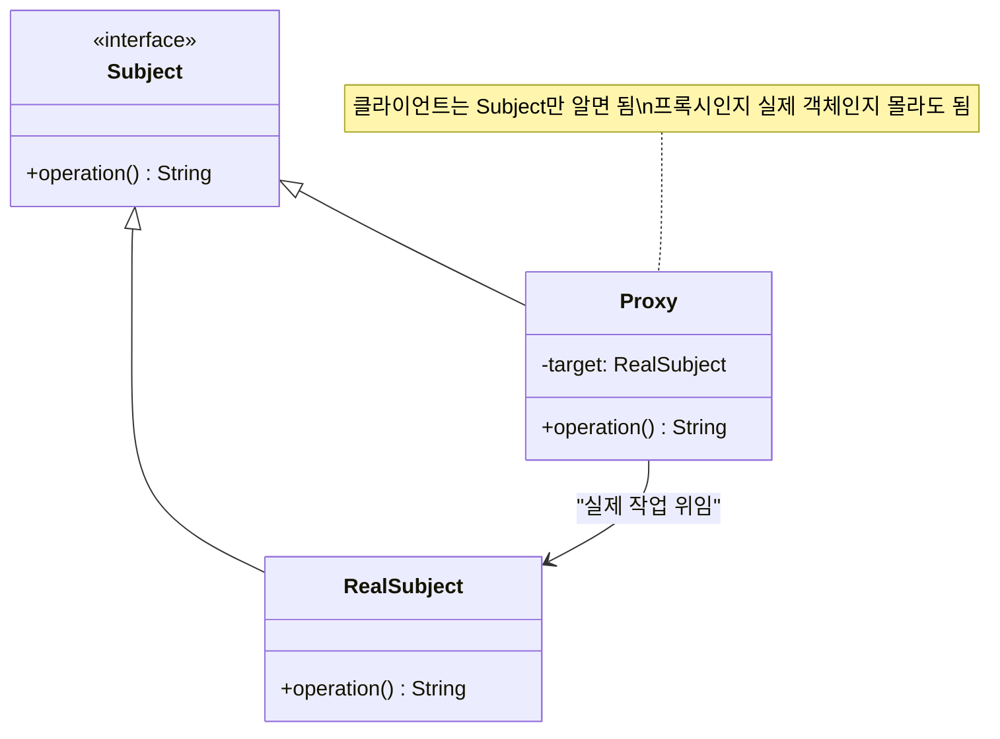
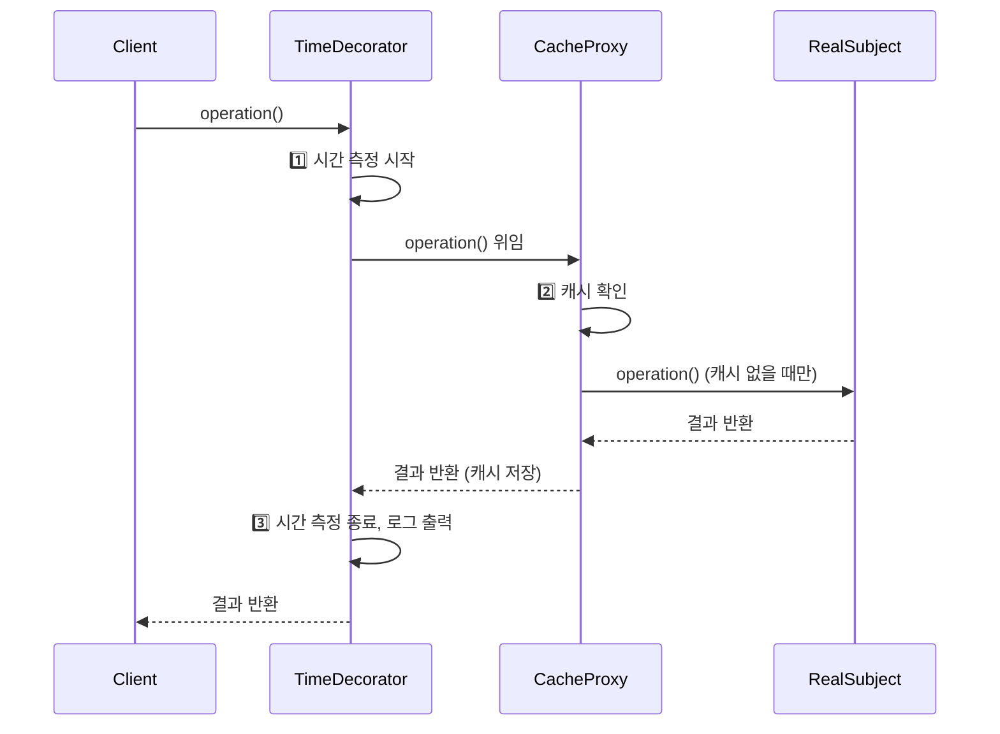
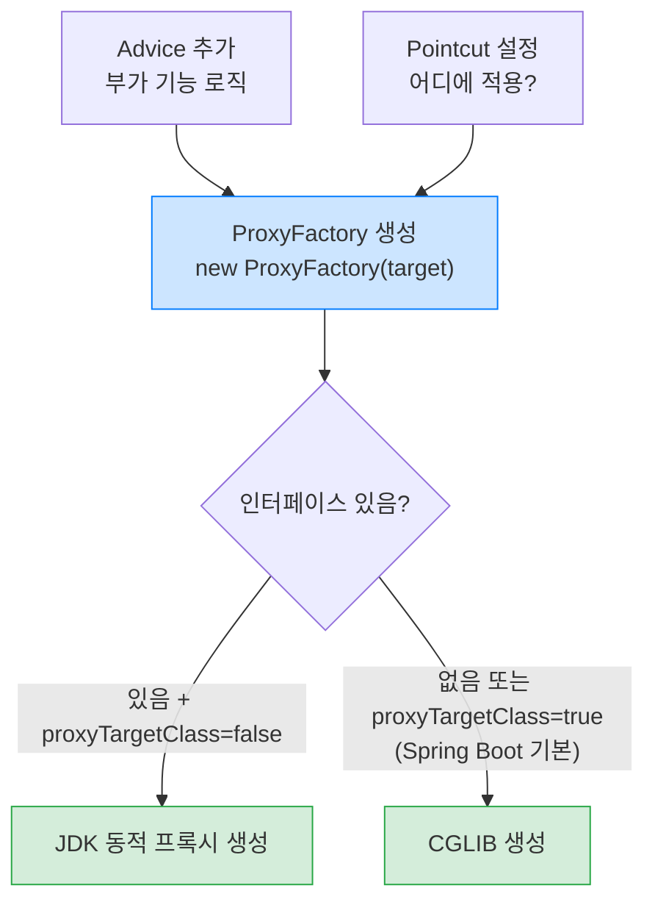
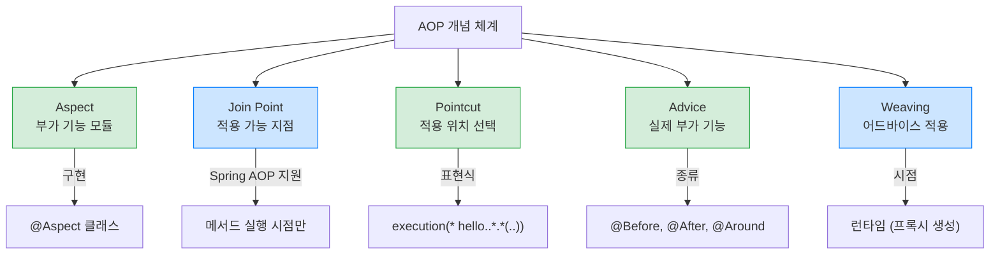
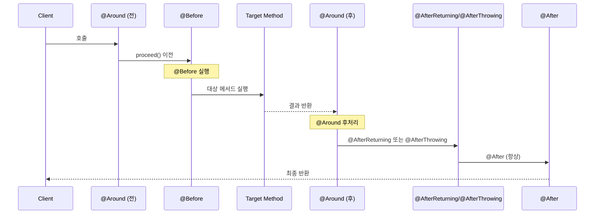
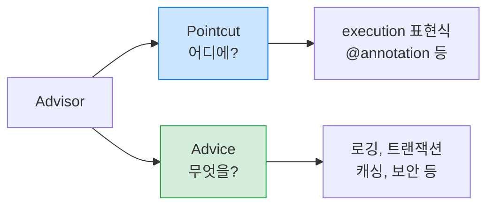
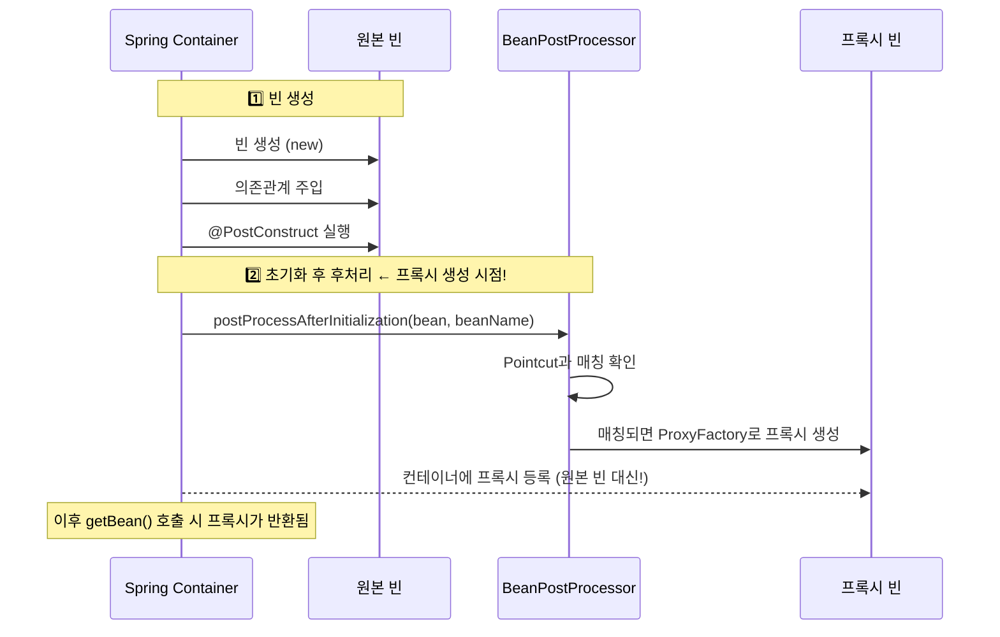
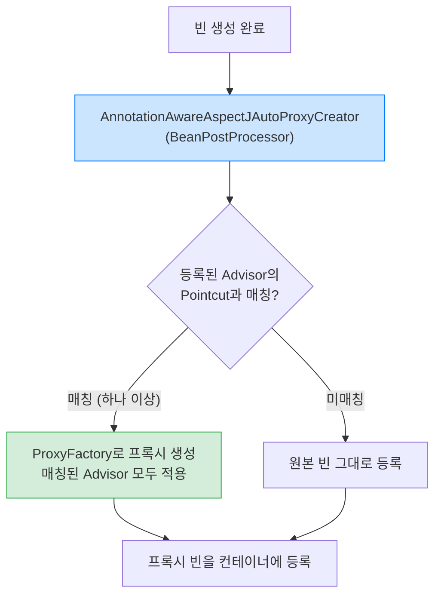
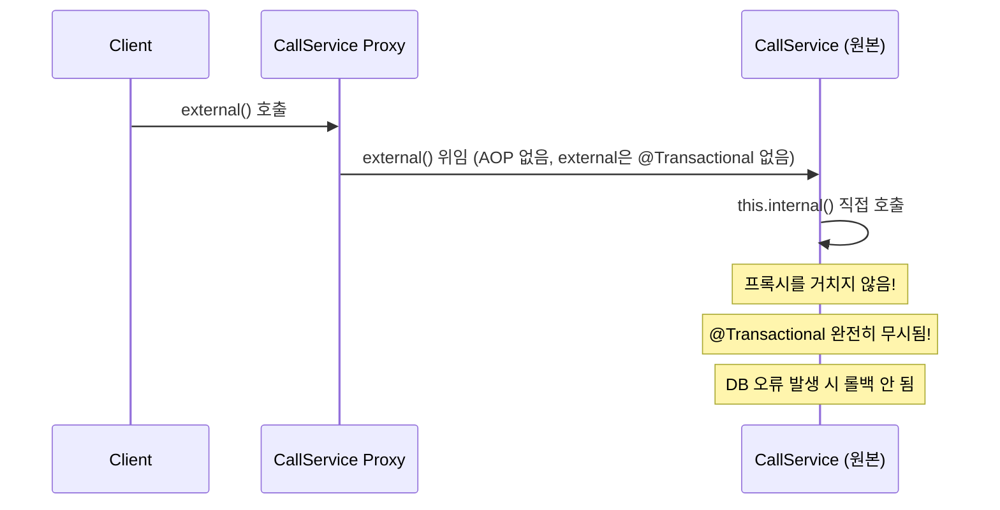
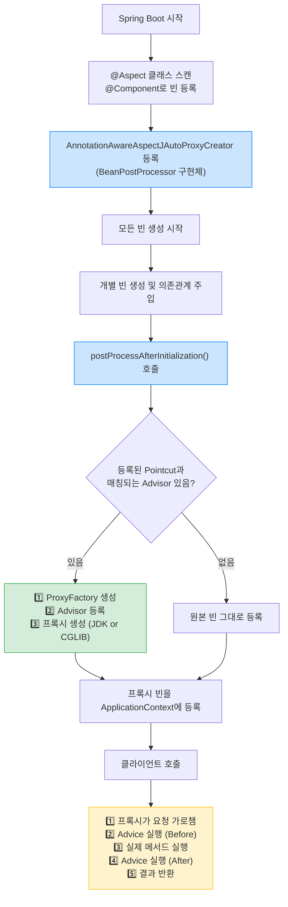

> **한 줄 요약:** Spring AOP는 프록시 기반으로 로깅·트랜잭션 같은 횡단 관심사를 비즈니스 로직과 분리하며, BeanPostProcessor가 그 자동화를 담당합니다.

## 1. 실무 시나리오 — 100개 서비스에 로그를 추가하라

> **비유:** 100명의 직원이 있는 회사에서 "모든 직원의 출퇴근 시간을 기록하라"는 지시가 내려왔다. 직접 방식은 직원 100명에게 각자 일지를 쓰라고 한다. 이후 기록 양식이 바뀌면 100명 모두 새 양식을 배워야 한다. AOP 방식은 출입구에 자동 카드리더기를 설치한다. 직원들은 아무것도 바꾸지 않아도 되고, 양식이 바뀌면 카드리더기 설정만 바꾸면 된다.

어느 날 팀장이 요청합니다. "모든 서비스 메서드에 실행 시간 로그를 추가해 주세요." 서비스 클래스가 100개라면 어떻게 할까요?

직접 수정하면 100개 파일을 열어야 합니다. 나중에 로그 포맷을 바꾸면 또 100곳을 수정해야 합니다. 측정 방식을 `System.currentTimeMillis()`에서 `StopWatch`로 바꾸기로 했다면? 다시 100곳.

이처럼 여러 클래스에 걸쳐 반복되는 코드를 **횡단 관심사(Cross-Cutting Concern)**라고 합니다. 비즈니스 로직과는 무관하지만 모든 곳에 필요합니다. Spring AOP는 이 문제를 **프록시 패턴**으로 해결합니다.

---

## 2. 횡단 관심사 — 문제를 눈으로 확인하기

### 2.1 코드 중복이 얼마나 심각해지는가

```java
// 로그를 남기고 싶은 서비스들 — 모두 동일한 패턴 반복
public class OrderService {
    public void createOrder(Order order) {
        log.info("OrderService.createOrder 시작");   // 중복!
        long start = System.currentTimeMillis();     // 중복!

        // 핵심 비즈니스 로직 (단 1줄)
        orderRepository.save(order);

        long end = System.currentTimeMillis();
        log.info("OrderService.createOrder 종료 — {}ms", end - start); // 중복!
    }
}

public class MemberService {
    public void join(Member member) {
        log.info("MemberService.join 시작");  // 또 중복!
        long start = System.currentTimeMillis();
        memberRepository.save(member);
        long end = System.currentTimeMillis();
        log.info("MemberService.join 종료 — {}ms", end - start);
    }
}
```

핵심 로직은 `orderRepository.save(order)` 한 줄인데, 그것을 감싸는 로그 코드가 6줄입니다. 서비스가 100개라면 로그 관련 코드만 600줄입니다. 그리고 이 600줄은 모두 **완벽히 동일한 패턴**입니다.

**만약 AOP 없이 이대로 가면?** 로그 포맷 하나를 바꾸는 작업이 "100개 파일 수정 + 테스트 + 배포"가 됩니다. 실수로 일부 파일을 빠뜨리면 로그가 일관성 없어집니다. 신규 개발자가 새 서비스를 만들 때 이 패턴을 모르면 로그가 누락됩니다.

### 2.2 AOP로 관심사를 분리하면

```mermaid
graph TD
    subgraph "AOP 적용 후 — 각자 자기 일만"
        A["OrderService"] --> F["핵심 비즈니스 로직만"]
        B["MemberService"] --> F
        C["ItemService"] --> F
    end

    subgraph "Aspect — 한 곳에서 관리"
        G["LogAspect\n로그 처리"]
        H["TransactionAspect\n트랜잭션 처리"]
    end

    G -. "자동 적용 (프록시)" .--> A
    G -. "자동 적용 (프록시)" .--> B
    G -. "자동 적용 (프록시)" .--> C

    classDef green fill:#d4edda,stroke:#28a745
    class G,H green
```

`LogAspect` 하나만 바꾸면 100개 서비스에 일괄 적용됩니다. 새 서비스를 추가해도 자동으로 로그가 붙습니다. 비즈니스 로직에는 단 한 줄도 추가할 필요가 없습니다.

---

## 3. 프록시 패턴 기초 — AOP의 토대

### 3.1 프록시가 무엇인지 정확히 이해하기

> **비유:** 연예인(RealSubject)에게 직접 연락하려면 매니저(Proxy)를 통해야 한다. 매니저는 불필요한 요청을 걸러내고(접근 제어), 일정 관리나 계약 검토 같은 부가 업무를 처리한다(부가 기능). 외부에서 보면 연예인인지 매니저인지 구별하기 어렵다 — 둘 다 같은 인터페이스를 구현하기 때문이다.



클라이언트는 `Subject` 인터페이스만 알고 있습니다. 실제로 `RealSubject`를 받든 `Proxy`를 받든 코드를 바꿀 필요가 없습니다. Spring이 이 원리를 이용해서, 기존 `OrderService` 코드를 건드리지 않고 앞에 프록시를 세워 로그를 추가합니다.

**역할 1: 접근 제어 (Cache Proxy)**
```java
public class CacheProxy implements Subject {
    private Subject target;
    private String cacheValue;

    @Override
    public String operation() {
        if (cacheValue == null) {
            // 처음 호출 시에만 실제 객체 호출
            cacheValue = target.operation();
        }
        // 이후에는 캐시에서 반환 — 실제 객체 미호출
        return cacheValue;
    }
}
```

**역할 2: 부가 기능 추가 (Decorator Proxy)**
```java
public class TimeDecorator implements Subject {
    private Subject target;

    @Override
    public String operation() {
        long start = System.currentTimeMillis();
        String result = target.operation(); // 실제 객체에 위임
        log.info("실행 시간: {}ms", System.currentTimeMillis() - start);
        return result;
    }
}
```

### 3.2 프록시 체인 — 여러 기능을 조합하는 방법



시간 측정 → 캐시 → 실제 로직 순서로 연결됩니다. 순서를 바꾸고 싶거나 새 기능을 추가하고 싶으면 체인에 하나만 추가하면 됩니다. `RealSubject`는 전혀 건드리지 않습니다.

---

## 4. JDK 동적 프록시 vs CGLIB — Spring이 두 가지 방식을 쓰는 이유

### 4.1 JDK 동적 프록시 — 인터페이스가 있을 때

> **비유:** 채용 공고(인터페이스)에 맞춰 가상의 직원을 만드는 것이다. 채용 공고가 있어야만 만들 수 있다.

```java
public interface MemberService {
    String hello(String name);
}

// InvocationHandler — 모든 메서드 호출이 여기를 통과
public class LogInvocationHandler implements InvocationHandler {
    private final Object target;

    @Override
    public Object invoke(Object proxy, Method method, Object[] args) throws Throwable {
        log.info("[로그 시작] {}", method.getName());
        Object result = method.invoke(target, args); // 실제 메서드 호출
        log.info("[로그 종료] {}", method.getName());
        return result;
    }
}

// 프록시 생성
MemberService proxy = (MemberService) Proxy.newProxyInstance(
    target.getClass().getClassLoader(),
    new Class[]{MemberService.class},
    new LogInvocationHandler(target)
);
```

한 개의 `InvocationHandler`가 모든 메서드 호출을 가로챕니다. 메서드가 100개여도 `InvocationHandler` 하나만 구현하면 됩니다.

**제약:** 인터페이스가 없으면 사용할 수 없습니다. `ConcreteService extends Object`처럼 인터페이스 없이 클래스만 있으면 JDK 동적 프록시로는 프록시를 만들 수 없습니다.

### 4.2 CGLIB — 클래스만 있어도 프록시 가능

> **비유:** 기존 직원(클래스)을 복제해서 확장된 직원을 만드는 것이다. 원본을 상속받아 메서드를 오버라이드한다.

```java
// 인터페이스 없어도 프록시 가능 — 클래스를 상속
public class ConcreteService {
    public String call() {
        return "ConcreteService 호출";
    }
}

public class TimeMethodInterceptor implements MethodInterceptor {
    private final Object target;

    @Override
    public Object intercept(Object obj, Method method, Object[] args,
                           MethodProxy methodProxy) throws Throwable {
        long start = System.currentTimeMillis();
        // methodProxy.invoke() 사용 — 리플렉션보다 빠름
        Object result = methodProxy.invoke(target, args);
        log.info("실행 시간: {}ms", System.currentTimeMillis() - start);
        return result;
    }
}
```

CGLIB은 바이트코드를 조작해서 `ConcreteService`를 상속받는 서브클래스를 런타임에 생성합니다. 상속받은 모든 메서드를 오버라이드해서 `MethodInterceptor`를 통해 부가 기능을 실행합니다.

### 4.3 왜 Spring Boot는 기본적으로 CGLIB을 쓰는가

| 특성 | JDK 동적 프록시 | CGLIB |
|------|----------------|-------|
| 조건 | 인터페이스 필수 | 클래스만으로 가능 |
| 생성 방식 | 인터페이스 구현 | 클래스 상속 |
| 성능 | 리플렉션 기반 | 바이트코드 생성 (더 빠름) |
| 제약 | - | final 클래스/메서드 불가 |
| Spring Boot 기본 | X | O (proxyTargetClass=true) |

Spring Boot는 인터페이스가 있어도 CGLIB을 씁니다. 이유는 JDK 동적 프록시는 인터페이스 타입으로만 캐스팅할 수 있기 때문입니다. `@Autowired MemberServiceImpl impl`처럼 구체 클래스 타입으로 주입받으면 `ClassCastException`이 발생합니다. CGLIB은 원본 클래스의 서브클래스이므로 구체 클래스 타입으로도 주입받을 수 있습니다.

**실무에서 자주 하는 실수 — final 메서드에 @Transactional:**

```java
@Service
public class OrderService {

    @Transactional // 이 어노테이션은 완전히 무시됩니다
    public final void createOrder(Order order) { // final이 문제!
        orderRepository.save(order);
    }
}
```

CGLIB은 서브클래스를 만들어 메서드를 오버라이드하는 방식인데, `final` 메서드는 오버라이드할 수 없습니다. 그래서 `@Transactional`이 적용된 프록시 메서드를 만들 수 없고, 결국 트랜잭션이 동작하지 않습니다. 컴파일 오류도, 런타임 예외도 없습니다. DB에 오류가 나도 롤백되지 않는다는 것을 배포 후에야 알게 됩니다.

---

## 5. ProxyFactory — Spring이 JDK/CGLIB 선택을 자동화하는 방법

> **비유:** 프록시팩토리는 총기 상점이다. 손님(개발자)이 "방어용 도구 주세요"라고만 하면, 상황에 맞는 총을 알아서 골라준다. 손님은 JDK 동적 프록시인지 CGLIB인지 알 필요가 없다.



```java
ServiceInterface target = new ServiceImpl();
ProxyFactory proxyFactory = new ProxyFactory(target);

proxyFactory.addAdvice((MethodInterceptor) invocation -> {
    log.info("[ProxyFactory] 호출 전: {}", invocation.getMethod().getName());
    Object result = invocation.proceed(); // 실제 메서드 실행
    log.info("[ProxyFactory] 호출 후: {}", invocation.getMethod().getName());
    return result;
});

ServiceInterface proxy = (ServiceInterface) proxyFactory.getProxy();
proxy.save();
```

`ProxyFactory`를 직접 쓸 일은 거의 없습니다. 실무에서는 `@Aspect`로 선언하면 Spring이 내부적으로 `ProxyFactory`를 사용합니다. 하지만 동작 원리를 이해해야 트러블슈팅이 가능합니다.

---

## 6. AOP 핵심 개념 — 용어를 이야기로 이해하기

### 6.1 용어 정리 — 하나의 시나리오로 연결하기

> **시나리오:** 회사 출입구에 자동 카드리더기를 설치한다.
> - **Aspect(측면):** 출입 기록 시스템 전체 (관심사 모듈)
> - **Join Point(결합 지점):** 직원이 출입문을 통과하는 모든 순간 (적용 가능한 모든 지점)
> - **Pointcut(포인트컷):** "지하주차장 출입구와 정문만" (어디에 적용할지 선택)
> - **Advice(어드바이스):** 카드를 찍는 실제 동작 (부가 기능 로직)
> - **Target(대상):** 출입하는 직원들 (어드바이스 받는 객체)
> - **Proxy(프록시):** 카드리더기가 설치된 출입문 (AOP 적용 결과)
> - **Weaving(위빙):** 출입문에 카드리더기를 설치하는 작업



**왜 Spring AOP는 메서드 실행 시점만 지원하는가?** AspectJ는 필드 접근, 생성자 호출, 정적 메서드 등 모든 지점에 적용할 수 있습니다. 하지만 그만큼 설정이 복잡하고 컴파일 시점 위빙이 필요합니다. Spring AOP는 런타임 프록시만 사용하므로 별도 설정 없이 쓸 수 있고, 실무에서 필요한 99%의 케이스(서비스 메서드 감싸기)를 커버합니다.

### 6.2 Advice 5가지 — 실행 순서와 적합한 용도

```java
@Aspect
@Component
@Slf4j
public class AllLogAspect {

    // @Before: 메서드 실행 전
    // 용도: 파라미터 로깅, 권한 사전 체크
    @Before("execution(* hello.service.*.*(..))")
    public void before(JoinPoint joinPoint) {
        log.info("[Before] {} 시작, args={}",
            joinPoint.getSignature().toShortString(),
            Arrays.toString(joinPoint.getArgs()));
    }

    // @AfterReturning: 정상 반환 후 (예외 시 실행 안 됨)
    // 용도: 반환값 로깅, 캐시 저장
    @AfterReturning(value = "execution(* hello.service.*.*(..))", returning = "result")
    public void afterReturning(JoinPoint joinPoint, Object result) {
        log.info("[AfterReturning] {} 완료, result={}",
            joinPoint.getSignature().toShortString(), result);
    }

    // @AfterThrowing: 예외 발생 후 (정상 완료 시 실행 안 됨)
    // 용도: 예외 알림, 에러 로깅
    @AfterThrowing(value = "execution(* hello.service.*.*(..))", throwing = "ex")
    public void afterThrowing(JoinPoint joinPoint, Exception ex) {
        log.error("[AfterThrowing] {} 예외 발생: {}",
            joinPoint.getSignature().toShortString(), ex.getMessage());
    }

    // @After: 정상/예외 관계없이 항상 (finally와 유사)
    // 용도: 리소스 해제, ThreadLocal 정리
    @After("execution(* hello.service.*.*(..))")
    public void after(JoinPoint joinPoint) {
        log.info("[After] {} 종료 (정상/예외 무관)",
            joinPoint.getSignature().toShortString());
    }

    // @Around: 가장 강력 — 실행 전/후 모두 제어
    // 용도: 실행 시간 측정, 트랜잭션, 재시도 로직
    @Around("execution(* hello.service.*.*(..))")
    public Object around(ProceedingJoinPoint joinPoint) throws Throwable {
        log.info("[Around 전] {}", joinPoint.getSignature().toShortString());
        try {
            Object result = joinPoint.proceed(); // 이 한 줄이 실제 메서드 실행
            log.info("[Around 후] 결과={}", result);
            return result;
        } catch (Exception e) {
            log.error("[Around 예외] {}", e.getMessage());
            throw e; // 반드시 다시 던져야 함 (삼키면 예외 은폐)
        }
    }
}
```

**@Around에서 `joinPoint.proceed()`를 호출하지 않으면?** 실제 메서드가 실행되지 않습니다. 컴파일도 되고 아무 오류도 없지만, 비즈니스 로직이 통째로 건너뜁니다. 이 버그는 찾기 매우 어렵습니다. 항상 `proceed()`를 호출하고 결과를 반환하는지 확인해야 합니다.

### 6.3 Advice 실행 순서



---

## 7. Pointcut 표현식 — 정확히 어디에 적용할지

### 7.1 execution 표현식 — 가장 많이 사용하는 형식

```
execution(접근제어자? 반환타입 선언타입?메서드이름(파라미터) 예외?)
# ?는 생략 가능
```

```java
// 가장 구체적인 것부터 가장 넓은 것까지

// 딱 이 메서드 하나
execution(public String hello.service.OrderService.createOrder(Long, String, int))

// OrderService의 모든 메서드
execution(* hello.service.OrderService.*(..))

// hello.service 패키지의 모든 클래스, 모든 메서드
execution(* hello.service.*.*(..))

// hello.service와 하위 패키지(..)의 모든 메서드
execution(* hello.service..*.*(..))

// create로 시작하는 모든 메서드
execution(* create*(..))

// String 파라미터 정확히 1개
execution(* *(String))

// 모든 파라미터 (없어도 됨)
execution(* *(..))
```

너무 넓게 잡으면 (예: `execution(* *.*(..))`) Spring 프레임워크 내부 클래스에도 Aspect가 적용되어 예기치 않은 동작이 생깁니다. 너무 좁게 잡으면 새 서비스를 추가할 때마다 Pointcut도 수정해야 합니다. 패키지 단위로 잡는 `execution(* hello.service..*.*(..))` 방식이 균형점입니다.

### 7.2 커스텀 어노테이션으로 AOP 적용 — 실무에서 가장 깔끔한 방법

> **비유:** "이 팻말(@Retry)이 붙은 문에는 자동 재시도 시스템을 달아라"는 규칙이다. 팻말이 어디 붙었는지 AOP가 스캔해서 자동으로 처리해준다.

```java
// 1. 어노테이션 정의 — 의도를 명확히 표현
@Target(ElementType.METHOD)
@Retention(RetentionPolicy.RUNTIME) // 런타임에 읽어야 하므로 RUNTIME 필수
public @interface Retry {
    int maxAttempts() default 3;
    long delayMs() default 1000;
}

// 2. 서비스에서 사용 — 비즈니스 로직이 깔끔해짐
@Service
public class ExternalApiService {

    @Retry(maxAttempts = 5, delayMs = 500) // "이 메서드는 최대 5번까지 재시도"
    public String callExternalApi(String param) {
        return restTemplate.getForObject(apiUrl, String.class);
    }
}

// 3. Aspect 구현
@Aspect
@Component
@Slf4j
public class RetryAspect {

    @Around("@annotation(retry)")
    public Object retry(ProceedingJoinPoint joinPoint, Retry retry) throws Throwable {
        int maxAttempts = retry.maxAttempts();
        Exception lastException = null;

        for (int attempt = 1; attempt <= maxAttempts; attempt++) {
            try {
                return joinPoint.proceed();
            } catch (Exception e) {
                lastException = e;
                log.warn("[Retry] {}/{} 실패: {}", attempt, maxAttempts, e.getMessage());
                if (attempt < maxAttempts) {
                    Thread.sleep(retry.delayMs());
                }
            }
        }
        log.error("[Retry] 최대 재시도 횟수({}) 초과", maxAttempts);
        throw lastException;
    }
}
```

이 방식의 장점은 코드를 읽을 때 `@Retry`가 붙은 것만 봐도 "이 메서드는 재시도 로직이 있다"는 것을 즉시 알 수 있다는 점입니다. 반면 `execution` 기반은 어떤 메서드에 AOP가 적용되는지 Aspect 파일을 직접 열어봐야 합니다.

---

## 8. 어드바이저 — Pointcut + Advice의 결합

어드바이저는 "어디에(Pointcut) 무엇을(Advice) 적용할지"의 쌍입니다.



여러 Advisor가 같은 메서드에 적용될 때는 `@Order`로 순서를 지정합니다. 트랜잭션 Advisor가 로그 Advisor보다 바깥에 있어야 "로그 기록 → 트랜잭션 시작 → 비즈니스 로직 → 트랜잭션 커밋 → 로그 종료" 순서가 됩니다. 반대로 하면 트랜잭션이 커밋되기 전에 로그가 끝납니다.

---

## 9. 빈 후처리기 (BeanPostProcessor) — AOP 자동화의 실제 메커니즘

### 9.1 동작 원리 — "빈이 완성된 직후 가공한다"

> **비유:** 자동차 공장 컨베이어 벨트 끝에 품질 검사관이 있다. 자동차(빈)가 완성되면 검사관(BeanPostProcessor)이 확인하고, 필요한 경우 부품을 추가하거나 아예 다른 차로 교체한다. Spring은 여기서 "AOP 대상이면 프록시로 교체"한다.



이 사실이 중요한 이유: `@PostConstruct`는 원본 빈에서 실행됩니다. 하지만 컨테이너에 등록되는 것은 프록시입니다. 즉, `@PostConstruct` 안에서 `this`는 원본 객체이고, 외부에서 주입받는 것은 프록시입니다. 대부분의 경우 문제없지만, `@PostConstruct` 안에서 프록시 메서드를 호출해야 하는 상황이라면 주의가 필요합니다.

### 9.2 자동 프록시 생성기 — @Aspect를 쓰면 내부에서 무슨 일이 일어나는가

`@Aspect`를 선언하면 Spring이 내부적으로 `AnnotationAwareAspectJAutoProxyCreator`라는 `BeanPostProcessor` 구현체를 등록합니다. 이 클래스가 모든 빈의 생성을 감시하다가, Pointcut과 매칭되는 빈이 있으면 자동으로 프록시를 생성합니다.



개발자가 해야 할 일은 `@Aspect` 클래스를 작성하고 `@Component`로 등록하는 것뿐입니다. 나머지는 Spring이 알아서 합니다. 그러나 내부 동작을 모르면, "왜 이 메서드에는 AOP가 안 먹히지?"라는 문제를 해결하기 어렵습니다.

---

## 10. @Aspect 실전 예시들

### 10.1 실행 시간 측정 — 슬로우 메서드 감지

```java
@Aspect
@Component
@Slf4j
public class ExecutionTimeAspect {

    private static final long SLOW_THRESHOLD_MS = 100;

    @Around("execution(* hello..*(..))")
    public Object measureTime(ProceedingJoinPoint joinPoint) throws Throwable {
        StopWatch stopWatch = new StopWatch();
        stopWatch.start();

        try {
            return joinPoint.proceed();
        } finally {
            stopWatch.stop();
            long elapsed = stopWatch.getTotalTimeMillis();

            if (elapsed > SLOW_THRESHOLD_MS) {
                // 100ms 초과 시 경고 로그 — 성능 이슈 탐지
                log.warn("[SLOW] {} — {}ms (임계값: {}ms)",
                    joinPoint.getSignature().toShortString(),
                    elapsed, SLOW_THRESHOLD_MS);
            }
        }
    }
}
```

이 Aspect 하나만 등록하면, 모든 메서드의 실행 시간을 모니터링할 수 있습니다. 슬로우 쿼리나 느린 외부 API 호출을 자동으로 감지합니다. 기존 서비스 코드는 한 줄도 수정하지 않습니다.

### 10.2 분산 추적 — 호출 계층을 시각화하기

```java
@Aspect
@Component
@Slf4j
public class DistributedTracingAspect {

    private static final ThreadLocal<String> TRACE_ID = new ThreadLocal<>();
    private static final ThreadLocal<Integer> DEPTH = new ThreadLocal<>();

    @Around("execution(* hello..*(..))")
    public Object trace(ProceedingJoinPoint joinPoint) throws Throwable {
        boolean isRoot = TRACE_ID.get() == null;

        if (isRoot) {
            TRACE_ID.set(UUID.randomUUID().toString().substring(0, 8));
            DEPTH.set(0);
        }

        String traceId = TRACE_ID.get();
        int depth = DEPTH.get();
        String indent = "  ".repeat(depth);

        log.info("[{}] {}>>> {}", traceId, indent, joinPoint.getSignature().toShortString());
        DEPTH.set(depth + 1);

        try {
            Object result = joinPoint.proceed();
            log.info("[{}] {}<<< {} (완료)", traceId, indent, joinPoint.getSignature().toShortString());
            return result;
        } catch (Exception e) {
            log.error("[{}] {}!!! {} 예외: {}", traceId, indent, joinPoint.getSignature().toShortString(), e.getMessage());
            throw e;
        } finally {
            DEPTH.set(depth);
            if (isRoot) {
                TRACE_ID.remove(); // 루트에서만 정리 — 메모리 누수 방지
                DEPTH.remove();
            }
        }
    }
}
```

출력 예시:
```
[a1b2c3d4] >>> OrderController.createOrder(..)
[a1b2c3d4]   >>> OrderService.createOrder(..)
[a1b2c3d4]     >>> OrderRepository.save(..)
[a1b2c3d4]     <<< OrderRepository.save(..) (완료)
[a1b2c3d4]   <<< OrderService.createOrder(..) (완료)
[a1b2c3d4] <<< OrderController.createOrder(..) (완료)
```

`ThreadLocal`을 쓰는 이유: 여러 요청이 동시에 들어올 때 각 요청의 traceId와 depth가 서로 섞이지 않기 위해서입니다. 각 스레드는 자신만의 `ThreadLocal` 값을 가집니다. 반드시 루트에서 `remove()`를 호출해야 합니다. 안 하면 스레드 풀에서 스레드가 재사용될 때 이전 요청의 traceId가 남아있게 됩니다.

---

## 11. AOP 내부 호출 문제 — 가장 흔하고 치명적인 실수

### 11.1 문제 상황 — 왜 this.method() 호출이 위험한가

> **비유:** 국회의원(핵심 로직)과 경호원(프록시)이 있다. 외부에서 "국회의원 만나고 싶다"고 하면 경호원이 먼저 받고(AOP 적용), 확인 후 국회의원에게 연결해준다. 하지만 국회의원이 자기 비서에게 직접 전화할 때는 경호원을 거치지 않는다. 내부 호출은 프록시를 우회한다.

```java
@Service
public class CallService {

    public void external() {
        log.info("external 호출");
        internal(); // this.internal() 와 동일 — 프록시를 거치지 않음!
    }

    @Transactional // 외부에서 직접 호출할 때만 적용됨
    public void internal() {
        log.info("internal 호출");
        orderRepository.save(order); // 트랜잭션 없이 실행됨!
    }
}
```



**실제로 이런 장애가 발생한다:** `external()`이 여러 단계를 거쳐 `internal()`을 호출하는 구조에서, `internal()`에 `@Transactional`이 있다고 믿고 예외 처리를 생략했습니다. 실제로는 트랜잭션이 없어서 중간에 예외가 나도 이미 저장된 데이터는 롤백되지 않습니다. 데이터 정합성이 깨집니다. 이 버그는 단일 메서드 단위 테스트에서 절대 발견되지 않습니다.

### 11.2 해결 방법 — 별도 클래스로 분리 (권장)

```java
@Service
public class ExternalService {

    private final InternalService internalService; // 별도 빈

    public void external() {
        internalService.internal(); // 다른 빈이므로 프록시 통과!
    }
}

@Service
public class InternalService {

    @Transactional // 정상 적용됨 — 외부에서 프록시를 통해 호출되므로
    public void internal() {
        orderRepository.save(order);
    }
}
```

클래스를 분리하면 `internalService`는 Spring이 관리하는 프록시 빈입니다. `external()`이 `internalService.internal()`을 호출할 때 프록시를 통과하므로 `@Transactional`이 정상 적용됩니다.

#### 면접 포인트

> **Q: @Transactional 내부 호출 문제가 왜 발생하나요?**
>
> Spring AOP는 프록시 기반입니다. 외부에서 빈을 호출할 때는 Spring이 만든 프록시가 요청을 가로채지만, 같은 클래스 내부에서 `this.method()`를 호출하면 원본 객체의 메서드가 직접 호출됩니다. 프록시를 거치지 않으므로 `@Transactional`, `@Cacheable` 같은 AOP 기반 어노테이션이 무시됩니다. 해결책은 해당 메서드를 별도 빈으로 분리하는 것입니다.

---

## 12. Spring AOP vs AspectJ — 언제 어느 것을 쓸까

| 특성 | Spring AOP | AspectJ |
|------|-----------|---------|
| 위빙 시점 | 런타임 (프록시 기반) | 컴파일 / 로드타임 / 런타임 |
| 적용 범위 | Spring Bean 메서드만 | 모든 Java 코드 (생성자, 필드 등) |
| 성능 | 프록시 오버헤드 | 더 빠름 (바이트코드 직접 수정) |
| 설정 | 간단 (@Aspect만으로 가능) | 복잡 (별도 컴파일러 필요) |
| 실무 사용 | 대부분의 경우 | 극히 드문 특수 상황 |

실무에서는 Spring AOP로 99% 해결됩니다. `@Transactional`, `@Cacheable`, `@PreAuthorize`는 모두 Spring AOP로 구현되어 있습니다. AspectJ가 필요한 경우는 Spring 빈이 아닌 도메인 객체(예: `new Order()`)에 AOP를 적용해야 하는 상황뿐입니다.

---

## 13. 전체 흐름 정리



---

## 14. 핵심 포인트 정리

| 개념 | 역할 | 만약 이걸 잘못 쓰면? |
|------|------|------------------|
| AOP | 횡단 관심사 분리 | 100개 파일에 중복 코드 |
| CGLIB | 클래스 상속 기반 프록시 | final 메서드에 @Transactional 무시 |
| BeanPostProcessor | 빈 생성 후 프록시로 교체 | 없으면 @Aspect 자동 등록 불가 |
| @Around | 실행 전/후 모두 제어 | proceed() 미호출 시 비즈니스 로직 건너뜀 |
| 내부 호출 | this.method() 프록시 우회 | @Transactional 롤백 안 됨, 데이터 정합성 깨짐 |
| ThreadLocal | 스레드별 독립 저장소 | 미정리 시 스레드 풀 오염 |
