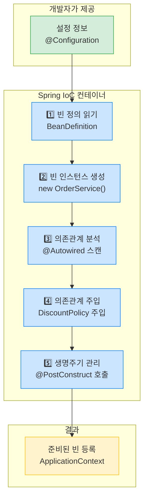
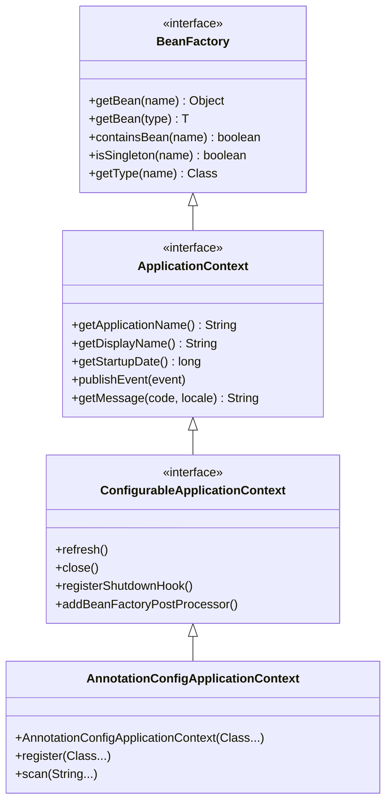
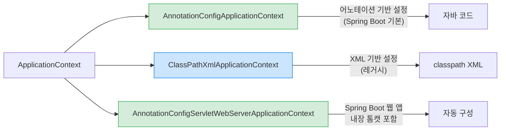
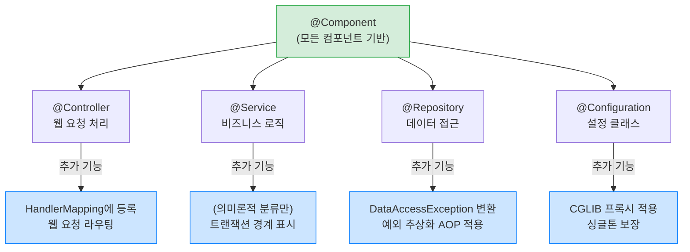
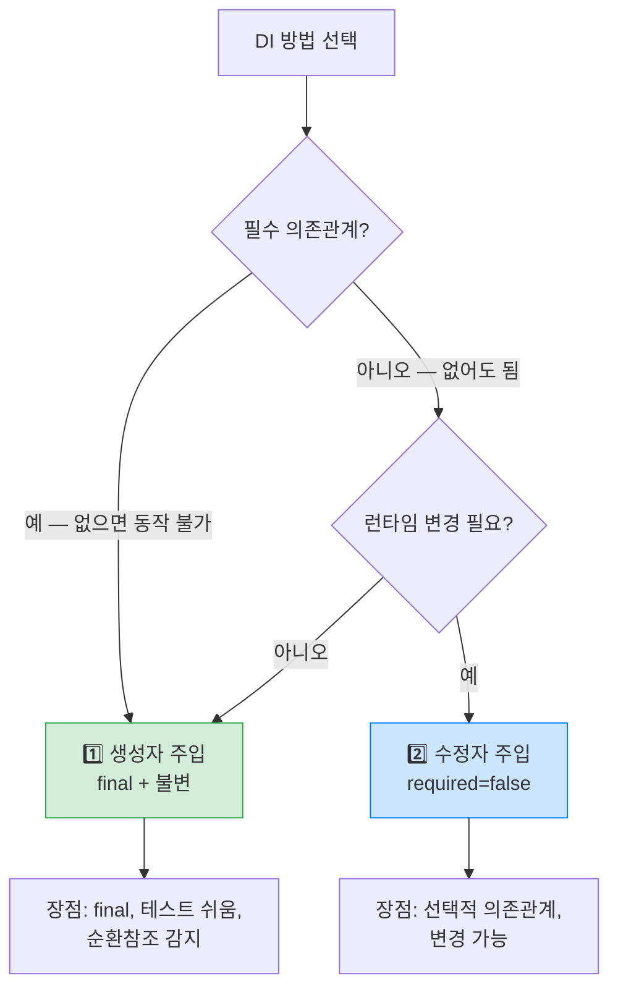
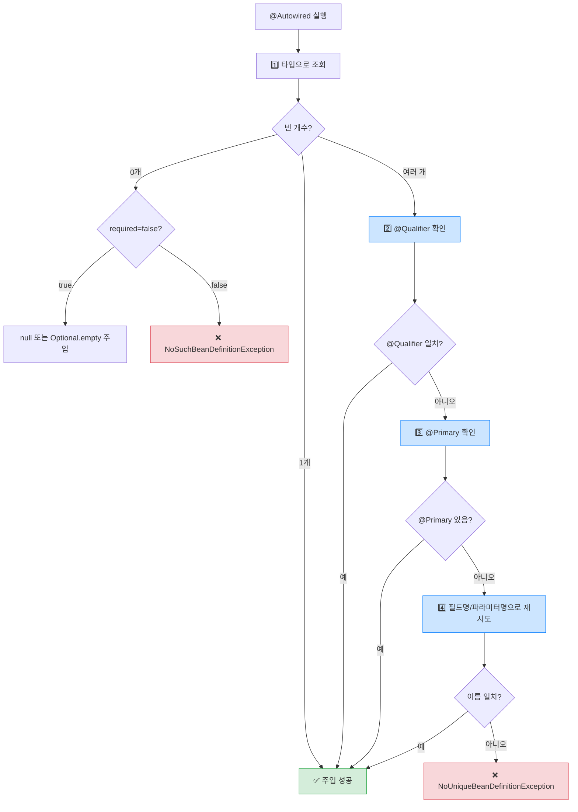
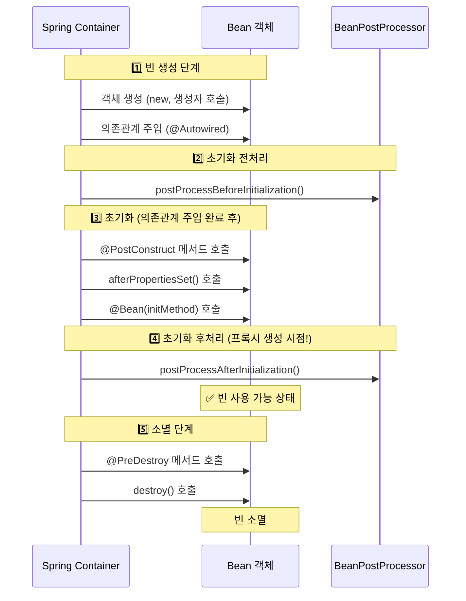
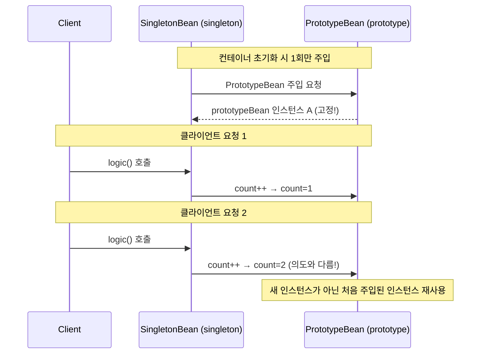
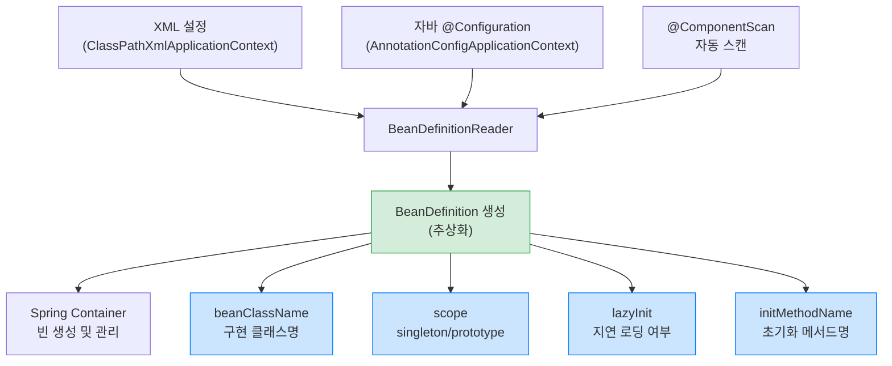
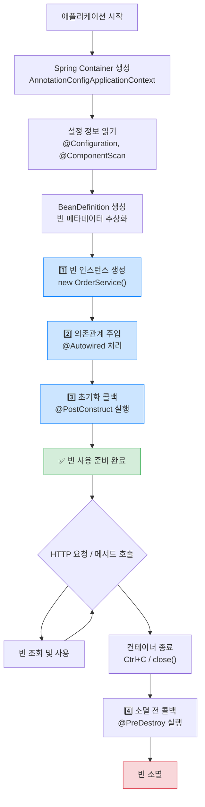

> **한 줄 요약:** Spring IoC/DI는 "객체가 스스로 의존관계를 만들지 않고, 외부 컨테이너가 주입해 준다"는 원칙으로, 느슨한 결합과 테스트 용이성을 가능하게 합니다.

## 1. 실무 시나리오 — 코드가 왜 갈수록 엉키는가

> **비유:** 처음에는 작은 분식집이었다. 주방장이 직접 식재료를 사고, 요리하고, 서빙까지 한다. 손님이 10명일 때는 문제없다. 그런데 손님이 100명이 되면? 주방장이 모든 것을 혼자 하다가 쓰러진다.

실제 서비스를 개발하다 보면 처음에는 단순했던 코드가 어느 순간 손댈 수 없는 수준으로 복잡해집니다. `OrderService`가 처음 등장할 때는 단순했습니다. 하지만 곧 이런 요구사항이 쏟아집니다.

- "JPA로 전환해 주세요" → `OrderService`를 수정해야 한다
- "할인 정책을 바꿔야 해요" → `OrderService`를 수정해야 한다
- "결제 방식을 추가해야 해요" → 또 `OrderService`를 수정해야 한다

이 문제의 근본 원인은 **강한 결합(Tight Coupling)**입니다. `OrderService`가 `new JdbcOrderRepository()`를 직접 생성하는 순간, 그것은 JDBC 기술과 영원히 묶여버립니다. 기술 선택이 비즈니스 로직 속에 박혀 있기 때문에, 기술을 바꾸려면 비즈니스 로직을 건드려야 합니다.

**실제로 이런 장애가 발생한다:** 레거시 시스템에서 JDBC를 JPA로 전환하는 프로젝트를 맡았다고 가정해봅시다. 100개의 Service 클래스를 열어보니 모두 `new JdbcXxxRepository()`가 하드코딩되어 있습니다. 하나씩 바꿀 때마다 다른 곳이 깨집니다. 이것이 강한 결합이 실무에서 만들어내는 공포입니다.

Spring IoC/DI는 이 문제를 근본적으로 해결하기 위해 탄생했습니다. 객체 생성과 의존관계 설정을 프레임워크에 위임함으로써, 개발자는 비즈니스 로직에만 집중할 수 있습니다.

---

## 2. IoC (Inversion of Control) — 제어의 역전

### 2.1 전통적인 방식 vs IoC 방식

> **비유:** 전통 방식은 직원이 자기 도구를 직접 사는 것과 같다. 도구가 바뀌면 직원이 직접 새것을 사야 한다. IoC 방식은 회사가 도구를 준비해두고 직원에게 지급하는 것이다. 도구를 바꿔야 하면 회사(컨테이너)만 바꾸면 된다.

**전통적인 방식: 개발자가 모든 것을 제어**

```java
public class OrderService {
    // 직접 생성 — 강한 결합
    // RateDiscountPolicy를 FixDiscountPolicy로 바꾸려면 이 줄을 수정해야 함
    private DiscountPolicy discountPolicy = new RateDiscountPolicy();
    private OrderRepository orderRepository = new JdbcOrderRepository();

    public Order createOrder(Long memberId, String itemName, int itemPrice) {
        int discountPrice = discountPolicy.discount(memberId, itemPrice);
        return new Order(memberId, itemName, itemPrice, discountPrice);
    }
}
```

이 코드의 문제는 `OrderService`가 두 가지 책임을 지고 있다는 것입니다.
1. **어떤 구현체를 쓸지 결정**하는 책임 (설계 결정)
2. **비즈니스 로직을 처리**하는 책임 (핵심 업무)

이 둘이 섞여 있으면, 설계 결정을 바꿀 때마다 비즈니스 로직 코드도 손대야 합니다.

**IoC 방식: Spring이 객체를 생성하고 주입**

```java
public class OrderService {
    // 인터페이스에만 의존 — 느슨한 결합
    // 어떤 구현체가 들어올지 알 필요 없음
    private final DiscountPolicy discountPolicy;
    private final OrderRepository orderRepository;

    // Spring이 알맞은 구현체를 주입해 줌
    public OrderService(DiscountPolicy discountPolicy, OrderRepository orderRepository) {
        this.discountPolicy = discountPolicy;
        this.orderRepository = orderRepository;
    }
}
```

이제 `OrderService`는 `DiscountPolicy`가 어떤 구현체인지 전혀 모릅니다. 알 필요도 없습니다. "할인 계산을 해주는 무언가"가 있다는 것만 알면 됩니다. 누가 무엇을 주입할지는 외부(Spring 컨테이너)가 결정합니다. 이것이 제어가 역전된 것입니다.

**왜 이게 중요한가?** OCP(개방-폐쇄 원칙)와 DIP(의존 역전 원칙)를 동시에 달성합니다. `RateDiscountPolicy`에서 `VipDiscountPolicy`로 전환해도 `OrderService` 코드를 한 줄도 수정할 필요가 없습니다. 이것이 유지보수성의 핵심입니다.

**만약 IoC를 사용하지 않으면?** 할인 정책을 변경하는 요구사항 하나가 연쇄적으로 수십 개의 파일을 수정하게 만듭니다. 테스트할 때도 실제 DB 없이는 `OrderService` 단위 테스트 자체가 불가능해집니다.

### 2.2 IoC 컨테이너가 하는 일 — 5단계



**실무에서 자주 하는 실수 — `new`로 직접 생성하는 경우**

```java
// 이렇게 하면 Spring의 관리 밖으로 벗어납니다
MyService service = new MyService();
service.doSomething(); // @Transactional이 적용되지 않습니다!
```

`@Transactional`, `@Async`, `@Cacheable` 같은 AOP 기반 어노테이션은 Spring이 관리하는 빈에만 동작합니다. Spring이 빈을 등록할 때 내부적으로 프록시 객체를 만들어 대리인을 세우는데, `new`로 직접 생성하면 이 프록시가 없는 날것의 객체를 사용하는 것입니다. 트랜잭션이 전혀 작동하지 않지만 컴파일도 되고 대부분의 기능도 동작하기 때문에, 이 버그는 배포 후 데이터 정합성 문제로 발견됩니다.

---

## 3. Spring 컨테이너 계층 구조

### 3.1 BeanFactory vs ApplicationContext — 왜 두 개인가?

> **비유:** BeanFactory는 냉장고다. 음식(빈)을 저장하고 꺼낼 수 있다. ApplicationContext는 주방 전체다. 냉장고뿐만 아니라 조리 도구, 레시피북, 알람 시스템까지 갖추고 있다. 실제 요리를 하려면 당연히 주방 전체가 필요하다.



| 특성 | BeanFactory | ApplicationContext |
|------|------------|-------------------|
| 빈 조회 | O | O |
| 국제화(i18n) | X | O (MessageSource) |
| 이벤트 발행 | X | O (ApplicationEventPublisher) |
| 환경변수 | X | O (EnvironmentCapable) |
| AOP, @Transactional | X | O (BeanPostProcessor) |
| 사용 권장 | X | O |

`BeanFactory`만 사용하면 `@Transactional`이 동작하지 않습니다. 왜냐하면 트랜잭션 AOP는 `BeanPostProcessor`라는 인프라가 필요한데, 이것은 `ApplicationContext`에서만 제공되기 때문입니다. 실무에서는 항상 `ApplicationContext`를 사용합니다. `BeanFactory`는 메모리가 극히 제한된 임베디드 환경 같은 특수 상황에서만 씁니다.

### 3.2 ApplicationContext 구현체들 — 무엇을 써야 하나?



Spring Boot를 사용한다면 `AnnotationConfigServletWebServerApplicationContext`가 자동으로 생성됩니다. 개발자가 직접 선택할 일은 거의 없습니다. 이 사실이 중요한 이유는, 테스트 코드에서 `@SpringBootTest`를 쓰면 이 전체 컨텍스트가 뜨기 때문입니다. 무겁고 느린 이유가 여기 있습니다. 단위 테스트에서는 Spring 컨텍스트 없이 직접 `new`로 객체를 생성해서 테스트하는 것이 훨씬 빠릅니다.

---

## 4. 빈(Bean) 등록 방법

### 4.1 자바 설정 클래스 방식 — 명시적 등록

> **비유:** 요리사(빈)를 고용할 때 고용 계약서(@Configuration)에 누구를 어떤 역할로 채용하는지 명시하는 것이다. 명시적이기 때문에 나중에 누가 어떤 역할인지 계약서만 봐도 알 수 있다.

```java
@Configuration
public class AppConfig {

    @Bean
    public MemberService memberService() {
        // memberRepository()를 호출해도 CGLIB 프록시 덕분에 싱글톤 보장
        return new MemberServiceImpl(memberRepository());
    }

    @Bean
    public MemberRepository memberRepository() {
        return new MemoryMemberRepository();
    }

    @Bean
    public DiscountPolicy discountPolicy() {
        // 여기 한 줄만 바꾸면 전체 할인 정책이 교체됨
        return new RateDiscountPolicy();
    }
}
```

**`@Configuration`이 없으면 싱글톤이 깨지는 이유:**

`@Configuration`이 붙은 클래스는 Spring이 CGLIB으로 프록시 처리합니다. 그래서 `memberRepository()`를 여러 번 호출해도 항상 같은 인스턴스가 반환됩니다. `@Configuration` 없이 `@Bean`만 쓰면, `memberRepository()` 메서드가 호출될 때마다 `new MemoryMemberRepository()`가 실행되어 서로 다른 인스턴스가 만들어집니다. 회원 서비스와 주문 서비스가 서로 다른 리포지토리를 쓰는 끔찍한 상황이 됩니다.

### 4.2 컴포넌트 스캔 방식 — 자동 등록

> **비유:** 명시적 고용 계약서 방식이 아니라, "우리 회사 뱃지(@Component)를 달고 있는 사람이면 누구나 직원이다"라는 규칙을 만드는 것이다. Spring이 패키지를 순회하면서 뱃지 달린 사람을 자동으로 직원 명부에 올린다.

```java
@Component
public class MemberServiceImpl implements MemberService {

    private final MemberRepository memberRepository;

    @Autowired
    public MemberServiceImpl(MemberRepository memberRepository) {
        this.memberRepository = memberRepository;
    }
}
```

### 4.3 컴포넌트 스캔 대상 어노테이션들의 차이

`@Controller`, `@Service`, `@Repository`, `@Configuration`은 모두 내부에 `@Component`를 포함합니다. 그런데 왜 구분해서 쓸까요?



`@Repository`가 특히 중요한 이유를 설명하겠습니다. JPA를 쓰다 보면 `EntityNotFoundException`, `PersistenceException` 등 JPA 전용 예외가 발생합니다. 만약 서비스 레이어에서 이 예외를 잡으려면 JPA에 종속된 코드를 작성해야 합니다. 나중에 MyBatis로 바꾸면 다른 예외가 나오므로 서비스 코드도 바꿔야 합니다.

`@Repository`는 Spring이 `PersistenceExceptionTranslationPostProcessor`를 통해 모든 JPA/JDBC 예외를 `DataAccessException` 계층으로 자동 변환해 줍니다. 서비스 레이어는 `DataAccessException`만 처리하면 되고, 하위 기술이 바뀌어도 서비스 코드는 그대로입니다.

**만약 `@Repository` 대신 `@Component`를 쓰면?** 예외 변환이 일어나지 않습니다. JPA 예외가 서비스까지 올라오고, 서비스가 JPA에 종속됩니다. DB 기술을 바꿀 때 서비스 코드도 수정해야 하는 상황이 됩니다.

#### 면접 포인트

> **Q: @Service와 @Component의 차이는?**
>
> 기능적으로는 동일합니다. `@Service`는 `@Component`를 포함하며, 서비스 계층임을 명시하는 의미론적 역할만 합니다. 반면 `@Repository`는 예외 변환 AOP가 추가로 적용되고, `@Controller`는 Spring MVC 핸들러로 등록되는 실질적 차이가 있습니다.

---

## 5. 의존관계 주입(DI) 4가지 방법

### 5.1 생성자 주입 — 왜 가장 권장하는가

> **비유:** 레스토랑 주방장을 고용할 때, 채용 계약서에 "칼 1개, 도마 1개는 반드시 지급받아야 일 시작"이라고 명시하는 것이다. 이 조건이 충족되지 않으면 출근 자체가 불가능하다. 생성자 주입은 이처럼 필수 의존성을 계약으로 강제한다.

```java
@Component
public class OrderServiceImpl implements OrderService {

    // final로 선언 — 불변성 보장, 누락 시 컴파일 에러
    private final MemberRepository memberRepository;
    private final DiscountPolicy discountPolicy;

    @Autowired
    public OrderServiceImpl(MemberRepository memberRepository,
                            DiscountPolicy discountPolicy) {
        this.memberRepository = memberRepository;
        this.discountPolicy = discountPolicy;
    }
}
```

생성자 주입이 권장되는 구체적인 이유를 하나씩 설명합니다.

**이유 1 — `final` 키워드 사용 가능:**
`final`은 한 번 할당되면 변경할 수 없습니다. `memberRepository`가 중간에 `null`로 바뀌거나 다른 구현체로 교체되는 일이 원천 차단됩니다. 멀티스레드 환경에서 안전성이 높아집니다.

**이유 2 — 순환 참조 조기 발견:**
A가 B를 필요로 하고, B가 A를 필요로 하면 Spring이 컨테이너 시작 시점에 바로 오류를 내뱉습니다. 필드 주입이나 수정자 주입은 이 문제를 런타임에, 실제 메서드가 호출될 때 발견합니다.

**이유 3 — 순수 자바 단위 테스트:**
```java
// Spring 없이 단위 테스트 가능
OrderServiceImpl service = new OrderServiceImpl(
    new MockMemberRepository(),
    new MockDiscountPolicy()
);
```
필드 주입이었다면 `@SpringBootTest`로 무거운 컨텍스트를 띄워야 합니다.

### 5.2 수정자 주입 — 언제 쓰는가

```java
@Component
public class OrderServiceImpl implements OrderService {

    private MemberRepository memberRepository;

    @Autowired
    public void setMemberRepository(MemberRepository memberRepository) {
        this.memberRepository = memberRepository;
    }

    // 선택적 의존관계 — 빈이 없어도 오류 발생 안 함
    @Autowired(required = false)
    public void setDiscountPolicy(DiscountPolicy discountPolicy) {
        this.discountPolicy = discountPolicy;
    }
}
```

수정자 주입은 **선택적 의존관계**에 적합합니다. 예를 들어, 캐시 서버가 있을 때만 캐싱 기능을 활성화하고, 없어도 서비스가 동작해야 하는 경우입니다. `required = false`를 설정하면 해당 빈이 없어도 예외가 발생하지 않습니다.

### 5.3 필드 주입 — 왜 비권장인가

```java
@Component
public class OrderServiceImpl implements OrderService {

    @Autowired
    private MemberRepository memberRepository;  // 테스트 어려움!
}
```

겉보기에는 가장 간편해 보이지만, 테스트가 불가능에 가깝습니다. `memberRepository`는 `private`이고, Spring 컨텍스트 없이는 값을 주입할 방법이 없습니다. 단위 테스트를 쓰려고 하면 반드시 `@SpringBootTest`를 붙여야 하고, 그러면 모든 빈이 다 뜨는 무거운 통합 테스트가 됩니다.

**실제로 이런 장애가 발생한다:** 팀에서 필드 주입만 쓰다가 단위 테스트 실행 시간이 점점 늘어납니다. 100개의 테스트가 있는데 모두 Spring 컨텍스트를 뜨기 때문에 전체 테스트가 10분씩 걸립니다. 생성자 주입으로 바꾸면 같은 100개 테스트가 1분 안에 끝납니다.

### 5.4 주입 방법 결정 흐름



---

## 6. @Autowired 상세 동작

### 6.1 자동 주입 충돌 — 왜 발생하고 어떻게 해결하는가

> **비유:** 회사에 "개발팀장"이라는 직책이 두 명이면, "개발팀장한테 보고하세요"라는 지시가 모호해진다. Spring도 마찬가지다. `DiscountPolicy` 타입의 빈이 두 개면 어느 것을 주입해야 할지 모른다.

```java
@Component
public class FixDiscountPolicy implements DiscountPolicy { ... }

@Component
public class RateDiscountPolicy implements DiscountPolicy { ... }

// 오류 발생! NoUniqueBeanDefinitionException
@Autowired
private DiscountPolicy discountPolicy;
```

**해결 방법 1: @Qualifier — 가장 명시적**

```java
@Component
@Qualifier("mainDiscountPolicy")
public class RateDiscountPolicy implements DiscountPolicy { ... }

@Autowired
@Qualifier("mainDiscountPolicy")
private DiscountPolicy discountPolicy;
```

**해결 방법 2: @Primary — 기본값 지정**

```java
@Component
@Primary // 같은 타입 중 기본으로 선택될 빈
public class RateDiscountPolicy implements DiscountPolicy { ... }
```

`@Primary`는 "기본값이지만 필요하면 다른 것도 쓸 수 있는" 상황에 적합합니다. `@Qualifier`는 "항상 이 특정 구현체여야 한다"는 강한 명시가 필요할 때 씁니다. `@Primary`가 있어도 `@Qualifier`가 더 높은 우선순위를 가집니다.

**우선순위: @Qualifier > @Primary > 필드명 매칭**

### 6.2 @Autowired 매칭 규칙 흐름



---

## 7. 빈 생명주기 (Bean Lifecycle)

### 7.1 왜 생성자에서 초기화를 하면 안 되는가

> **비유:** 요리사가 출근하자마자(생성자 호출) 바로 손님 음식을 만들려 한다. 그런데 주방 도구(의존관계)는 아직 반납도 안 됐다. 생성자 호출 시점에는 의존관계 주입이 완료되지 않았기 때문에, DB 연결 같은 초기화 작업은 @PostConstruct까지 기다려야 한다.

```java
@Component
public class NetworkClient {

    private String url;

    // 생성자 시점: url은 아직 null (의존관계 주입 전!)
    public NetworkClient() {
        System.out.println("생성자 호출 — url = " + url); // null 출력
        // connect(); // 이 시점에 연결하면 NullPointerException!
    }

    @Autowired
    public void setUrl(String url) {
        this.url = url; // 의존관계 주입 완료
    }

    // 의존관계 주입 완료 후 호출 — url 세팅 완료
    @PostConstruct
    public void init() {
        System.out.println("초기화 콜백 — url = " + url); // 값 있음
        connect(); // 이제 안전하게 연결 시작
    }
}
```

**실제로 이런 장애가 발생한다:** 생성자에서 DB 커넥션 풀을 초기화하는 코드를 작성했는데, 생성자 시점에는 `dataSource` 필드가 아직 주입되지 않아 `NullPointerException`이 발생합니다. 그런데 이 예외는 "애플리케이션 시작 실패"로만 나타나서 왜 실패했는지 찾기 어렵습니다.

### 7.2 전체 생명주기 — 한 번에 보기



### 7.3 초기화 / 소멸 콜백 방법 비교

**방법 1: @PostConstruct / @PreDestroy (권장)**

```java
@Component
public class CacheManager {

    private Map<String, Object> cache;

    @PostConstruct
    public void init() {
        // 의존관계 주입 완료 후 — 안전하게 초기화
        this.cache = new ConcurrentHashMap<>();
        loadFromDatabase(); // DB가 이미 주입되어 있음
    }

    @PreDestroy
    public void cleanup() {
        // 애플리케이션 종료 전 — 캐시 플러시, 연결 정리
        flushToDatabase();
        cache.clear();
    }
}
```

이것이 권장되는 이유는 Java 표준(`javax.annotation`)이기 때문입니다. Spring에 종속되지 않습니다. 톰캣 없이 순수 Java에서도 동작하고, 다른 DI 컨테이너로 이전해도 코드 수정이 없습니다.

**방법 2: @Bean의 initMethod / destroyMethod — 외부 라이브러리용**

```java
// 외부 라이브러리 (소스 코드 수정 불가)
public class ExternalNetworkClient {
    public void start() { /* 연결 시작 */ }
    public void stop() { /* 연결 종료 */ }
}

@Configuration
public class AppConfig {

    // @PostConstruct를 붙일 수 없는 외부 클래스에 생명주기 연결
    @Bean(initMethod = "start", destroyMethod = "stop")
    public ExternalNetworkClient networkClient() {
        ExternalNetworkClient client = new ExternalNetworkClient();
        client.setUrl("http://example.com");
        return client;
    }
}
```

외부 라이브러리의 `close()`, `shutdown()` 같은 메서드를 애플리케이션 종료 시 자동 호출할 수 있습니다. 만약 이를 설정하지 않으면, 애플리케이션이 종료될 때 커넥션이 정리되지 않아 다음 번 시작 시 "이미 사용 중인 포트" 오류가 발생하거나, DB 커넥션 풀이 제대로 닫히지 않아 DB 서버에 좀비 커넥션이 남습니다.

| 방법 | 외부 라이브러리 | 코드 침투 | 권장 |
|------|--------------|---------|------|
| @PostConstruct / @PreDestroy | X | 없음 | 최우선 |
| InitializingBean / DisposableBean | X | Spring 종속 | 비권장 |
| @Bean initMethod / destroyMethod | O | 없음 | 외부 라이브러리용 |

---

## 8. 빈 스코프 (Bean Scope)

### 8.1 싱글톤 스코프 — 상태 관리가 왜 위험한가

> **비유:** 회사 공용 화이트보드(싱글톤 빈)에 직원들이 각자 내용을 적는다고 생각해보자. 한 직원이 쓴 내용이 다른 직원에게 그대로 보인다. 공유 자원에 상태(필드 값)가 있으면 이처럼 의도치 않은 데이터 공유가 발생한다.

```java
@Component
public class OrderService {
    // 위험! 싱글톤이므로 모든 HTTP 요청이 이 카운터를 공유함
    // private int requestCount = 0;

    // 안전! 의존 주입된 객체 참조는 OK (변경되지 않음)
    private final OrderRepository orderRepository;
}
```

**실제로 이런 장애가 발생한다:** 싱글톤 빈에 `private String currentUser;` 같은 필드를 두고 각 요청마다 현재 사용자를 저장했다고 가정합니다. 동시에 두 명이 접속하면, A의 요청을 처리하다가 B의 요청이 `currentUser`를 덮어씁니다. A가 자기 주문을 조회했는데 B의 주문이 나오는 심각한 데이터 노출 사고가 발생합니다. 이런 버그는 단일 사용자 테스트에서는 절대 발견되지 않습니다.

### 8.2 프로토타입 스코프 — 주의사항

```java
@Component
@Scope("prototype")
public class ShoppingCart {

    private List<Item> items = new ArrayList<>();

    @PreDestroy  // 호출 안 됨! Spring이 소멸을 관리하지 않습니다
    public void destroy() {
        System.out.println("장바구니 소멸");
    }

    public void addItem(Item item) { items.add(item); }
    public List<Item> getItems() { return items; }
}
```

프로토타입 빈은 `getBean()`을 호출할 때마다 새로운 인스턴스를 돌려줍니다. Spring은 생성 및 의존관계 주입까지만 담당하고, **그 이후는 클라이언트 코드의 책임**입니다. `@PreDestroy`가 호출되지 않기 때문에, 리소스 정리를 직접 해야 합니다.

### 8.3 싱글톤 빈에서 프로토타입 빈 사용 — 흔히 빠지는 함정



싱글톤 빈이 생성될 때 프로토타입 빈이 주입됩니다. 이후 싱글톤 빈은 계속 살아있고, 그 안의 프로토타입 빈도 계속 같은 인스턴스를 참조합니다. 프로토타입 빈이 "요청마다 새 인스턴스"라는 의미가 완전히 사라집니다.

**해결책: ObjectProvider로 매번 새 인스턴스 획득**

```java
@Component
public class SingletonBean {

    @Autowired
    private ObjectProvider<PrototypeBean> prototypeBeanProvider;

    public int logic() {
        // getObject() 호출 시마다 컨테이너에서 새 PrototypeBean을 생성
        PrototypeBean prototypeBean = prototypeBeanProvider.getObject();
        prototypeBean.addCount();
        return prototypeBean.getCount(); // 항상 1 반환
    }
}
```

`ObjectProvider`는 빈을 즉시 가져오는 대신 "빈을 꺼낼 수 있는 수단"을 주입받는 것입니다. `getObject()`를 호출하는 시점에 Spring 컨테이너에서 새 인스턴스를 가져옵니다.

### 8.4 웹 스코프 — Request 스코프 실전 예시

> **비유:** 요청 스코프 빈은 손님이 레스토랑에 들어올 때 생성되고, 음식을 다 먹고 나갈 때 사라지는 개인 주문서다. 같은 테이블에 다른 손님이 앉으면 새 주문서가 생긴다.

```java
@Component
@Scope(value = "request", proxyMode = ScopedProxyMode.TARGET_CLASS)
public class MyLogger {

    private String uuid;
    private String requestURL;

    @PostConstruct
    public void init() {
        // HTTP 요청마다 새 UUID 생성 — 요청 추적에 활용
        this.uuid = UUID.randomUUID().toString();
    }

    @PreDestroy
    public void close() {
        System.out.println("[" + uuid + "] request scope bean close");
    }

    public void log(String message) {
        System.out.println("[" + uuid + "][" + requestURL + "] " + message);
    }
}
```

`proxyMode = ScopedProxyMode.TARGET_CLASS`가 필요한 이유: `MyLogger`는 HTTP 요청이 있을 때만 존재하는데, 싱글톤인 `Controller`가 애플리케이션 시작 시점에 `MyLogger`를 주입받으려 합니다. 아직 요청이 없으니 `MyLogger`가 존재하지 않아 오류가 납니다.

CGLIB 프록시를 사용하면 진짜 `MyLogger` 대신 껍데기 프록시를 주입합니다. `log()` 메서드가 호출되는 순간, 프록시가 "현재 HTTP 요청에 해당하는 진짜 `MyLogger`"를 찾아서 실제 메서드를 위임합니다.


---

## 9. 설정 방법 비교

### 9.1 BeanDefinition — Spring이 설정을 추상화하는 방법

> **비유:** XML, 자바 코드, 어노테이션 스캔은 각각 다른 언어로 작성된 이력서와 같다. Spring은 이 다양한 형식의 이력서를 내부적으로 표준 양식(BeanDefinition)으로 변환해서 처리한다.



이 추상화 덕분에 Spring 컨테이너는 XML이든 자바 코드든 상관없이 동일한 방식으로 빈을 처리합니다. 개발자 입장에서는 설정 방식을 언제든지 바꿀 수 있습니다.

---

## 10. 프로파일 기반 설정

> **비유:** 개발자가 집에서 일할 때(dev)와 회사에서 일할 때(prod) 사용하는 도구가 다르다. 집에서는 간단한 노트북, 회사에서는 고사양 워크스테이션. 코드는 동일하지만 환경은 다르다.

```java
@Configuration
public class DataSourceConfig {

    // 개발 환경: H2 인메모리 DB — 빠른 시작, 데이터 휘발성
    @Bean
    @Profile("dev")
    public DataSource devDataSource() {
        return new EmbeddedDatabaseBuilder()
            .setType(EmbeddedDatabaseType.H2)
            .build();
    }

    // 운영 환경: MySQL — 영구 저장, 고가용성
    @Bean
    @Profile("prod")
    public DataSource prodDataSource() {
        HikariDataSource dataSource = new HikariDataSource();
        dataSource.setJdbcUrl("jdbc:mysql://prod-server:3306/mydb");
        // 환경변수로 주입 — 소스 코드에 비밀번호 하드코딩 절대 금지
        dataSource.setUsername(System.getenv("DB_USERNAME"));
        dataSource.setPassword(System.getenv("DB_PASSWORD"));
        return dataSource;
    }
}
```

**만약 프로파일을 쓰지 않으면?** 개발 환경 설정과 운영 환경 설정이 같은 파일에 섞입니다. 개발자가 운영 DB에 실수로 접근하거나, 운영 서버에 H2 인메모리 DB가 올라가는 사고가 발생합니다.

---

## 11. 실무 트러블슈팅

### 시나리오 1: 순환 참조 — 설계 문제의 신호

```java
@Component
public class A {
    @Autowired private B b; // A가 B를 필요로 함
}

@Component
public class B {
    @Autowired private A a; // B가 A를 필요로 함 — 순환!
}
```

Spring Boot 2.6+에서는 기본적으로 `BeanCurrentlyInCreationException`이 발생합니다.

순환 참조는 단순히 기술적 문제가 아닙니다. A가 B에 의존하고 B가 A에 의존한다는 것은, 두 클래스가 서로의 책임을 침범하고 있다는 설계상의 신호입니다. `@Lazy`나 수정자 주입으로 임시 우회하는 것은 증상 완화이지, 근본 해결이 아닙니다.

```java
// 올바른 해결: 공통 기능을 별도 컴포넌트로 분리
@Component
public class Common {
    public void commonOperation() { ... }
}

@Component
public class A {
    @Autowired private Common common; // A → Common (순환 없음)
}

@Component
public class B {
    @Autowired private Common common; // B → Common (순환 없음)
}
```

### 시나리오 2: 같은 타입 빈 여러 개 — Map/List 주입 활용

```java
@Component
public class DiscountService {

    // 모든 DiscountPolicy 빈을 맵으로 주입 — 전략 패턴
    private final Map<String, DiscountPolicy> policyMap;

    @Autowired
    public DiscountService(Map<String, DiscountPolicy> policyMap) {
        this.policyMap = policyMap;
        // {"rateDiscountPolicy": ..., "fixDiscountPolicy": ...}
    }

    // 할인 코드에 따라 동적으로 정책 선택
    public int discount(Member member, int price, String discountCode) {
        DiscountPolicy discountPolicy = policyMap.get(discountCode);
        if (discountPolicy == null) {
            throw new IllegalArgumentException("알 수 없는 할인 코드: " + discountCode);
        }
        return discountPolicy.discount(member, price);
    }
}
```

새로운 할인 정책을 추가할 때 `DiscountService`를 수정할 필요가 없습니다. `@Component`를 붙인 새 할인 정책 클래스만 만들면 자동으로 `policyMap`에 등록됩니다. 이것이 개방-폐쇄 원칙의 실제 적용 사례입니다.

---

## 12. 전체 흐름 정리



---

## 13. 핵심 포인트 정리

| 개념 | 핵심 원리 | 만약 이걸 안 하면? |
|------|----------|----------------|
| IoC | 객체 생성 제어권을 컨테이너에 위임 | 기술 변경 시 비즈니스 코드까지 수정해야 함 |
| 생성자 주입 | 의존성을 생성 시점에 강제 | 테스트 불가, 순환 참조 런타임에 발견 |
| Singleton | 하나의 인스턴스 공유 | 상태(필드) 가지면 멀티스레드 데이터 오염 |
| @PostConstruct | 의존관계 주입 완료 후 초기화 | 생성자에서 하면 NullPointerException |
| @PreDestroy | 빈 소멸 전 리소스 정리 | 커넥션 미반납, 좀비 커넥션 발생 |
| @Repository | 예외를 DataAccessException으로 변환 | 서비스 레이어가 특정 DB 기술에 종속 |

Spring IoC/DI의 핵심은 "객체가 스스로 의존관계를 만들지 않고, 외부(컨테이너)가 주입해 준다"는 것입니다. 이를 통해 느슨한 결합, 테스트 용이성, 유연한 설계가 가능해집니다.
