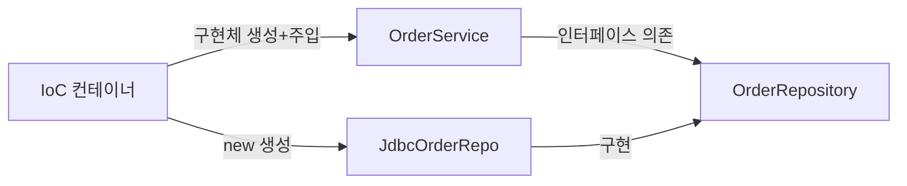
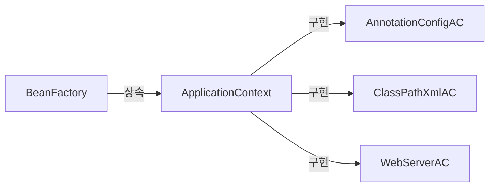
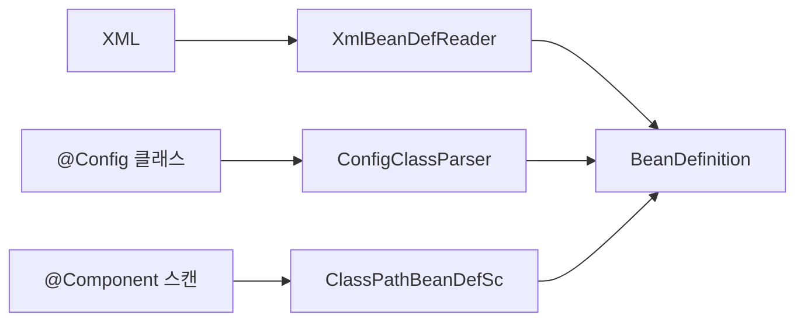
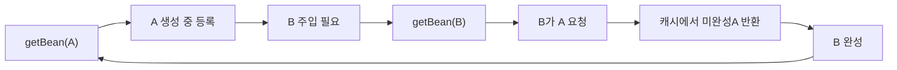
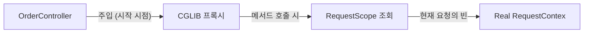

> **한 줄 요약:** Spring IoC 컨테이너는 BeanDefinition 메타데이터를 읽어 싱글톤 레지스트리를 구성하고, BeanPostProcessor 체인으로 AOP 프록시를 씌운 뒤, 완성된 객체를 주입한다. "프레임워크가 내 코드를 호출한다"는 제어 역전이 유지보수성·테스트 용이성의 근간이다.

---

## 1. 왜 강한 결합은 재앙인가 — 실무 시나리오

### 1.1 강한 결합의 실체

처음 작성할 때는 단순했다. `OrderService`가 할인 정책과 저장소를 직접 생성한다.

```java
public class OrderService {
    // 구체 클래스에 직접 의존 — 컴파일 타임에 구현체가 고정됨
    private DiscountPolicy discountPolicy = new RateDiscountPolicy();
    private OrderRepository  orderRepository  = new JdbcOrderRepository();

    public Order createOrder(Long memberId, String itemName, int itemPrice) {
        int discountPrice = discountPolicy.discount(memberId, itemPrice);
        return new Order(memberId, itemName, itemPrice, discountPrice);
    }
}
```

이 코드는 두 가지 책임을 동시에 진다.

1. **어떤 구현체를 쓸지 결정** (설계·기술 선택)
2. **비즈니스 로직 실행** (핵심 관심사)

"JPA로 바꿔주세요"라는 요구 한 줄이 왜 100개 파일을 건드려야 하는가? `new JdbcOrderRepository()`가 100군데에 박혀 있기 때문이다. 기술 선택이 비즈니스 코드 속에 용해되어 있다.

### 1.2 DIP와 OCP — 이론이 실무와 만나는 지점

> **DIP(의존 역전 원칙):** 고수준 모듈은 저수준 모듈에 의존하면 안 된다. 둘 다 추상에 의존해야 한다.
>
> **OCP(개방-폐쇄 원칙):** 확장에는 열려 있어야 하고, 수정에는 닫혀 있어야 한다.

```java
// DIP 위반 — OrderService(고수준)가 JdbcOrderRepository(저수준)에 직접 의존
private OrderRepository repo = new JdbcOrderRepository();

// DIP 준수 — 인터페이스(추상)에만 의존, 구현체는 런타임에 결정
private final OrderRepository repo;  // 어떤 구현체인지 모름, 알 필요도 없음

public OrderService(OrderRepository repo) {
    this.repo = repo;
}
```

그런데 여기서 진짜 질문이 나온다. "인터페이스에 의존하겠다는 건 알겠는데, 그럼 누가 `new JdbcOrderRepository()`를 만들어서 넣어주나?" 이 역할을 담당하는 것이 **IoC 컨테이너**다.



---

## 2. IoC(Inversion of Control) — 제어의 역전 원리

### 2.1 제어가 역전된다는 것의 의미

전통적인 프로그래밍에서는 개발자 코드가 라이브러리를 호출한다. IoC에서는 **프레임워크가 개발자 코드를 호출**한다. 이것이 라이브러리와 프레임워크를 구분하는 핵심이다.

서블릿도 IoC다. `doGet()`은 개발자가 직접 호출하지 않는다. Tomcat이 HTTP 요청을 받으면 서블릿 컨테이너가 `doGet()`을 호출한다. 개발자는 "이 메서드가 언제 호출될지"를 제어하지 않는다.

Spring IoC 컨테이너도 동일하다. `@PostConstruct` 메서드를 개발자가 직접 호출하지 않는다. 컨테이너가 빈 초기화 시점에 호출한다. 이 "언제 호출되는가"의 제어권이 컨테이너에 있다.

### 2.2 IoC 컨테이너가 하는 일 — 단계별 분해


각 단계를 구체적으로 살펴본다.

**1단계 — 설정 메타데이터 읽기:**
XML, `@Configuration` 클래스, `@Component` 스캔 결과를 `BeanDefinitionReader`가 읽어 `BeanDefinition` 객체 목록으로 변환한다.

**2단계 — BeanDefinition 등록:**
`BeanDefinitionRegistry`에 빈 이름 → `BeanDefinition` 매핑을 저장한다. 이 시점에는 실제 객체가 없다. 설계도(메타데이터)만 있다.

**3단계 — BeanFactoryPostProcessor 실행:**
`PropertySourcesPlaceholderConfigurer` 같은 클래스가 `${db.url}` 플레이스홀더를 실제 값으로 치환한다. 빈이 생성되기 전에 `BeanDefinition` 자체를 수정할 수 있는 훅이다.

**4단계 — 싱글톤 빈 생성 및 의존관계 주입:**
`DefaultListableBeanFactory`가 `BeanDefinition`을 보고 `Constructor.newInstance()` 또는 팩토리 메서드로 객체를 생성한 뒤, 의존관계를 주입한다.

**5단계 — BeanPostProcessor 체인 실행:**
`AutowiredAnnotationBeanPostProcessor`, `CommonAnnotationBeanPostProcessor`, `AbstractAutoProxyCreator` 등이 순차적으로 실행된다. AOP 프록시 생성이 여기서 일어난다.

**6단계 — 초기화 콜백:**
`@PostConstruct` → `InitializingBean.afterPropertiesSet()` → `initMethod` 순으로 호출된다.

---

## 3. Spring 컨테이너 내부 구조 — BeanFactory vs ApplicationContext

### 3.1 BeanFactory — 최소 컨테이너

`BeanFactory`는 Spring 컨테이너 계층의 루트 인터페이스다. 딱 한 가지만 한다: **빈을 등록하고 꺼낸다.**

```java
public interface BeanFactory {
    Object getBean(String name) throws BeansException;
    <T> T getBean(String name, Class<T> requiredType) throws BeansException;
    boolean containsBean(String name);
    boolean isSingleton(String name) throws NoSuchBeanDefinitionException;
    boolean isPrototype(String name) throws NoSuchBeanDefinitionException;
    Class<?> getType(String name) throws NoSuchBeanDefinitionException;
}
```

`BeanFactory` 구현체(`DefaultListableBeanFactory`)는 싱글톤 레지스트리를 `ConcurrentHashMap<String, Object> singletonObjects`로 관리한다. `getBean()` 최초 호출 시 인스턴스를 생성하고 맵에 넣는다(지연 로딩). 이후 호출은 맵에서 꺼낸다.

**핵심 한계:** `BeanFactory`만으로는 `@Transactional`, `@Async` 같은 AOP가 동작하지 않는다. AOP는 `BeanPostProcessor`가 처리하는데, `BeanFactory`는 `BeanPostProcessor`를 자동으로 탐지하지 않는다. 개발자가 수동으로 `addBeanPostProcessor()`를 호출해야 한다.

### 3.2 ApplicationContext — 실무 컨테이너

`ApplicationContext`는 `BeanFactory`를 포함하며 추가 기능을 제공하는 인터페이스다.

```java
public interface ApplicationContext extends
        EnvironmentCapable,           // Environment/Profile/PropertySource
        ListableBeanFactory,          // 빈 목록 조회
        HierarchicalBeanFactory,      // 부모 컨테이너 계층
        MessageSource,                // 국제화(i18n)
        ApplicationEventPublisher,    // 이벤트 발행
        ResourcePatternResolver {     // 리소스 로딩
}
```

`ApplicationContext`는 컨테이너 시작 시점에 `BeanPostProcessor`를 자동으로 탐지하고 등록한다(`refresh()` 내 `registerBeanPostProcessors()` 단계). `@Transactional`이 동작하는 이유는 `InfrastructureAdvisorAutoProxyCreator`라는 `BeanPostProcessor`가 자동으로 등록되어 트랜잭션 어드바이저를 빈에 씌우기 때문이다.



| 기능 | BeanFactory | ApplicationContext |
|------|:-----------:|:------------------:|
| 빈 등록·조회 | O | O |
| 싱글톤 레지스트리 | O | O |
| BeanPostProcessor 자동 등록 | X | O |
| AOP / @Transactional | X | O |
| MessageSource (i18n) | X | O |
| ApplicationEvent 발행·구독 | X | O |
| Environment / Profile | X | O |
| ResourcePatternResolver | X | O |
| 즉시 로딩(Eager Loading) | X | O |

**결론:** 실무에서 `BeanFactory`를 직접 사용하는 경우는 없다고 봐도 된다. `ApplicationContext`가 표준이다. `BeanFactory`를 직접 다루는 경우는 커스텀 Spring 확장 포인트를 만들 때뿐이다.

### 3.3 ApplicationContext 구현체 선택

```java
// 1. 순수 자바 환경 (테스트, 배치)
ApplicationContext ctx =
    new AnnotationConfigApplicationContext(AppConfig.class);

// 2. XML 기반 레거시
ApplicationContext ctx =
    new ClassPathXmlApplicationContext("classpath:applicationContext.xml");

// 3. Spring Boot 웹 앱 — 자동으로 선택됨
// AnnotationConfigServletWebServerApplicationContext
// (내부적으로 EmbeddedTomcat을 생성·관리)
```

Spring Boot를 사용하면 `SpringApplication.run()`이 실행 환경을 감지해 적절한 구현체를 자동 선택한다. `spring-webmvc`가 클래스패스에 있으면 서블릿 기반, `spring-webflux`만 있으면 반응형 컨텍스트를 생성한다.

### 3.4 ApplicationContext의 refresh() — 컨테이너 초기화 핵심

`ApplicationContext`의 모든 초기화는 `AbstractApplicationContext.refresh()` 메서드 하나에서 시작된다. 소스코드를 따라가면 다음 순서로 동작한다.

```java
// AbstractApplicationContext.refresh() 핵심 흐름 (의사코드)
public void refresh() {
    // 1. BeanFactory 준비 — ClassLoader, BeanPostProcessor 기본 설정
    prepareBeanFactory(beanFactory);

    // 2. BeanFactoryPostProcessor 실행 — BeanDefinition 수정 가능
    invokeBeanFactoryPostProcessors(beanFactory);
    // @PropertySource, @ComponentScan, @Import 처리가 여기서 일어남
    // ConfigurationClassPostProcessor가 핵심

    // 3. BeanPostProcessor 등록 — 빈 생성 후 후처리기 등록
    registerBeanPostProcessors(beanFactory);
    // AutowiredAnnotationBeanPostProcessor 등 등록

    // 4. MessageSource 초기화 (i18n)
    initMessageSource();

    // 5. ApplicationEventMulticaster 초기화
    initApplicationEventMulticaster();

    // 6. 싱글톤 빈 모두 인스턴스화 (Eager Loading)
    finishBeanFactoryInitialization(beanFactory);

    // 7. ContextRefreshedEvent 발행 — 완료 신호
    finishRefresh();
}
```

`invokeBeanFactoryPostProcessors()` 단계가 특히 중요하다. `ConfigurationClassPostProcessor`가 `@Configuration`, `@ComponentScan`, `@Import`, `@Bean`을 모두 처리한다. `@SpringBootApplication` 어노테이션 하나로 전체 자동 구성이 동작하는 이유가 여기에 있다.

---

## 4. BeanDefinition — 빈의 설계도

### 4.1 BeanDefinition이란 무엇인가

Spring 컨테이너가 XML을 쓰든, 자바 코드를 쓰든, 어노테이션을 쓰든 동일하게 동작하는 이유는 모든 설정을 `BeanDefinition`이라는 공통 메타데이터 객체로 변환하기 때문이다.

```java
// BeanDefinition이 담고 있는 정보
public interface BeanDefinition {
    String getBeanClassName();         // 어떤 클래스인지
    String getScope();                 // singleton? prototype?
    boolean isLazyInit();              // 지연 로딩 여부
    String[] getDependsOn();           // 먼저 생성돼야 하는 빈
    ConstructorArgumentValues
        getConstructorArgumentValues(); // 생성자 인자
    MutablePropertyValues
        getPropertyValues();           // 프로퍼티(수정자 주입용)
    String getInitMethodName();        // initMethod
    String getDestroyMethodName();     // destroyMethod
    boolean isPrimary();               // @Primary 여부
    String getFactoryBeanName();       // 팩토리 빈 이름
    String getFactoryMethodName();     // @Bean 메서드 이름
}
```

`@Bean` 메서드로 등록한 빈과 `@Component`로 스캔된 빈의 차이는 `BeanDefinition` 수준에서 `factoryBeanName` / `factoryMethodName` 필드에 값이 있느냐 없느냐의 차이다. 컨테이너 자체는 둘을 동일하게 다룬다.

### 4.2 BeanDefinitionReader 계층



`ClassPathBeanDefinitionScanner`가 컴포넌트 스캔을 수행한다. 내부적으로 ASM(바이트코드 분석 라이브러리)을 사용해 클래스를 **JVM에 로드하지 않고** 바이트코드만 읽어 `@Component` 어노테이션 유무를 판별한다. 이 덕분에 수천 개의 클래스가 있어도 스캔 속도가 빠르다. 클래스를 전부 로드했다면 메모리·시간 비용이 엄청났을 것이다.

```java
// ClassPathScanningCandidateComponentProvider 내부 동작 (의사코드)
for (Resource resource : getResourcePatternResolver().getResources(pattern)) {
    MetadataReader metadataReader =
        getMetadataReaderFactory().getMetadataReader(resource);
    // ASM으로 바이트코드에서 어노테이션 정보만 추출 — 클래스 로드 없음
    AnnotationMetadata metadata = metadataReader.getAnnotationMetadata();
    if (metadata.hasAnnotation("org.springframework.stereotype.Component")
     || metadata.hasMetaAnnotation("org.springframework.stereotype.Component")) {
        // 후보 등록
        candidates.add(new ScannedGenericBeanDefinition(metadataReader));
    }
}
```

### 4.3 CGLIB으로 @Configuration 클래스를 프록시하는 이유

```java
@Configuration
public class AppConfig {

    @Bean
    public MemberService memberService() {
        return new MemberServiceImpl(memberRepository()); // memberRepository() 직접 호출
    }

    @Bean
    public OrderService orderService() {
        return new OrderServiceImpl(memberRepository()); // 또 memberRepository() 호출
    }

    @Bean
    public MemberRepository memberRepository() {
        return new MemoryMemberRepository();
    }
}
```

`@Configuration` 없이 `@Bean`만 쓰면 `memberRepository()`가 두 번 호출되어 서로 다른 두 개의 `MemoryMemberRepository` 인스턴스가 만들어진다. 싱글톤이 깨진다.

`@Configuration`을 붙이면 Spring이 CGLIB으로 `AppConfig`의 서브클래스를 만든다. 이 프록시는 `memberRepository()` 호출을 가로채서, 이미 싱글톤 레지스트리에 인스턴스가 있으면 새로 만들지 않고 캐시에서 꺼낸다.

```java
// CGLIB 프록시가 내부적으로 하는 일 (의사코드)
@Override
public MemberRepository memberRepository() {
    // 이미 싱글톤 레지스트리에 있으면 그것을 반환
    if (beanFactory.containsSingleton("memberRepository")) {
        return (MemberRepository) beanFactory.getSingleton("memberRepository");
    }
    // 없으면 super의 원본 메서드 호출 후 등록
    MemberRepository repo = super.memberRepository();
    beanFactory.registerSingleton("memberRepository", repo);
    return repo;
}
```

**극한 시나리오:** `@Configuration` 대신 `@Component`를 `AppConfig`에 붙이면 어떻게 되는가? `@Bean` 메서드들은 여전히 빈으로 등록되지만 CGLIB 프록시가 생성되지 않는다. `memberRepository()`를 호출할 때마다 `new MemoryMemberRepository()`가 실행된다. `MemberService`와 `OrderService`가 서로 다른 리포지토리 인스턴스를 가지게 되어 데이터 일관성이 깨진다. 이 버그는 단위 테스트에서는 발견되기 어렵고, 통합 테스트에서 "저장했는데 조회가 안 된다"는 형태로 나타난다.

---

## 5. 컴포넌트 스캔 심층 분석

### 5.1 @ComponentScan의 동작 원리

```java
@Configuration
@ComponentScan(
    basePackages = "com.example",          // 스캔 시작 패키지
    excludeFilters = @ComponentScan.Filter(
        type = FilterType.ANNOTATION,
        classes = Configuration.class     // @Configuration 클래스 제외
    )
)
public class AppConfig { }
```

`@ComponentScan`을 처리하는 것은 `ConfigurationClassParser`다. 이 파서가 `ClassPathBeanDefinitionScanner`를 생성하고, `basePackages` 하위의 모든 `.class` 파일을 ASM으로 순회한다.

스캔 필터 종류:

| FilterType | 설명 | 예시 |
|------------|------|------|
| ANNOTATION | 어노테이션 유무 | `@Controller` 달린 클래스만 |
| ASSIGNABLE_TYPE | 특정 타입 하위 | `Repository` 구현체만 |
| ASPECTJ | AspectJ 표현식 | `com.example..*Service+` |
| REGEX | 정규표현식 | 클래스 이름 패턴 |
| CUSTOM | 사용자 정의 | `TypeFilter` 구현 |

### 5.2 @SpringBootApplication의 스캔 범위

```java
@SpringBootApplication  // = @Configuration + @EnableAutoConfiguration + @ComponentScan
public class MyApp {
    public static void main(String[] args) {
        SpringApplication.run(MyApp.class, args);
    }
}
```

`@SpringBootApplication`의 `@ComponentScan`은 `basePackages`를 지정하지 않으면 해당 클래스가 있는 패키지를 기준으로 한다. `com.example.MyApp`이라면 `com.example` 하위 전체를 스캔한다. 이 때문에 `MyApp`을 최상위 패키지에 두는 것이 관례다.

**극한 시나리오:** `MyApp.java`를 `com.example.web` 패키지에 두면 `com.example.service`나 `com.example.repository`가 스캔되지 않는다. 서비스·리포지토리 빈이 등록되지 않아 `NoSuchBeanDefinitionException`이 발생한다. 원인을 찾기 어려운 이유는 컴파일은 완벽하게 되기 때문이다.

### 5.3 @Component 파생 어노테이션과 실질적 차이

`@Controller`, `@Service`, `@Repository`, `@Configuration` 모두 내부에 `@Component`를 포함한다. 컴포넌트 스캔 관점에서는 동일하다. 차이는 **추가 BeanPostProcessor가 적용되느냐**에 있다.

```java
// @Repository의 실질적 차이 — 예외 변환
@Repository  // PersistenceExceptionTranslationPostProcessor 적용
public class JpaUserRepository implements UserRepository {

    @PersistenceContext
    private EntityManager em;

    public User findById(Long id) {
        // JPA 예외(JpaSystemException, EntityNotFoundException) 발생 시
        // Spring의 DataAccessException 계층으로 자동 변환됨
        return em.find(User.class, id);
    }
}
```

`@Repository`가 없으면 JPA 예외가 서비스 레이어까지 전파된다. 서비스가 `jakarta.persistence.EntityNotFoundException`을 직접 처리해야 하므로 JPA에 종속된다. 나중에 MyBatis로 전환하면 서비스 예외 처리 코드도 전부 수정해야 한다.

`@Controller`의 실질적 차이는 Spring MVC의 `RequestMappingHandlerMapping`이 이 클래스를 핸들러로 인식하는 것이다. `@Component`만 붙이면 `@RequestMapping`이 있어도 URL 매핑이 되지 않는다.

---

## 6. 싱글톤 레지스트리 — Spring이 싱글톤을 구현하는 방법

### 6.1 고전적 싱글톤 패턴의 문제

```java
// 고전적 싱글톤 — 안티패턴
public class OrderService {
    private static final OrderService INSTANCE = new OrderService();
    private OrderService() {}  // private 생성자

    public static OrderService getInstance() { return INSTANCE; }
}
```

이 방식의 문제:
1. `private` 생성자로 인해 서브클래싱 불가 → 상속·다형성 차단
2. 테스트에서 Mock으로 교체 불가
3. 의존관계를 내부에서 `new`로 생성 → 강한 결합
4. 클라이언트가 구체 클래스(`OrderService.getInstance()`)에 의존

### 6.2 Spring의 싱글톤 레지스트리

Spring은 `DefaultSingletonBeanRegistry`가 싱글톤 레지스트리를 담당한다.

```java
// DefaultSingletonBeanRegistry 핵심 필드 (단순화)
public class DefaultSingletonBeanRegistry {

    // 완성된 싱글톤 빈 저장소
    private final Map<String, Object> singletonObjects =
        new ConcurrentHashMap<>(256);

    // 생성 중인 빈 (순환 참조 감지용)
    private final Set<String> singletonsCurrentlyInCreation =
        Collections.newSetFromMap(new ConcurrentHashMap<>(16));

    // 조기 노출 빈 (순환 참조 해결용 3단계 캐시)
    private final Map<String, Object> earlySingletonObjects =
        new ConcurrentHashMap<>(16);

    // 싱글톤 팩토리 (AOP 프록시 생성 지점)
    private final Map<String, ObjectFactory<?>> singletonFactories =
        new HashMap<>(16);
}
```

**3단계 캐시(순환 참조 해결):**
`singletonObjects`(1단계) → `earlySingletonObjects`(2단계) → `singletonFactories`(3단계) 순으로 탐색한다. A가 B를 의존하고 B가 A를 의존할 때, A의 생성이 완료되기 전에 미완성 A를 `singletonFactories`에 노출한다. B가 A를 요청하면 미완성 A를 `earlySingletonObjects`로 승격해 반환한다. 이것이 수정자 주입·필드 주입에서 순환 참조가 허용됐던 이유다(Spring Boot 2.6+ 이전).

생성자 주입은 이 3단계 캐시를 활용할 수 없다. A의 생성자가 호출되기 전에 B를 주입해야 하는데, A가 아직 `singletonFactories`에도 등록되지 않았기 때문이다. 그래서 생성자 주입에서는 순환 참조가 즉시 `BeanCurrentlyInCreationException`으로 터진다. **이것이 생성자 주입의 장점이다** — 순환 참조를 시작 시점에 강제로 발견하게 한다.



### 6.3 싱글톤 빈의 상태(State) 관리 — 실무 함정

싱글톤 빈은 모든 요청·스레드가 공유한다. 인스턴스 변수에 요청별 데이터를 저장하면 스레드 간 데이터 오염이 발생한다.

```java
@Service
// 극한 위험 예시 — 절대 이렇게 하면 안 됨
public class UserContextHolder {

    // 모든 스레드가 이 변수를 공유 — 치명적 버그
    private String currentUserId;  // NEVER do this in a singleton

    public void setCurrentUserId(String userId) {
        this.currentUserId = userId;
    }

    public String getCurrentUserId() {
        return currentUserId;  // 다른 스레드의 값이 반환될 수 있음
    }
}

// 올바른 방법 — ThreadLocal로 스레드별 격리
@Service
public class UserContextHolder {

    private static final ThreadLocal<String> currentUserId = new ThreadLocal<>();

    public void setCurrentUserId(String userId) {
        currentUserId.set(userId);
    }

    public String getCurrentUserId() {
        return currentUserId.get();
    }

    // 반드시 요청 종료 시 정리
    public void clear() {
        currentUserId.remove();
    }
}
```

**극한 시나리오:** 동시 사용자 1,000명의 서비스에서 싱글톤 빈에 `private String currentUser`를 두었다. 사용자 A의 요청을 처리하다가 스레드 B가 `currentUser`를 덮어쓴다. A의 결제 확인 메서드가 B의 계정으로 처리된다. 금액이 B 계정에 청구된다. 단일 사용자 테스트·개발 환경에서는 절대 발견되지 않는다.

---

## 7. 의존관계 주입(DI) 심층 분석

### 7.1 생성자 주입이 권장되는 이유 — 기술적 근거

```java
@Service
public class OrderServiceImpl implements OrderService {

    private final MemberRepository memberRepository;
    private final DiscountPolicy  discountPolicy;

    // 생성자가 하나면 @Autowired 생략 가능 (Spring 4.3+)
    public OrderServiceImpl(MemberRepository memberRepository,
                            DiscountPolicy discountPolicy) {
        this.memberRepository = memberRepository;
        this.discountPolicy   = discountPolicy;
    }
}
```

**이유 1 — 불변성(Immutability):**
`final` 키워드를 사용할 수 있다. 생성 이후 `memberRepository`를 `null`로 바꾸거나 다른 구현체로 교체하는 코드를 컴파일 시점에 차단한다. 멀티스레드 환경에서 `final` 필드는 JMM(Java Memory Model) 상 안전하게 공유된다.

**이유 2 — 순환 참조 시작 시점 감지:**
생성자 주입은 순환 참조를 컨테이너 시작 시점에 `BeanCurrentlyInCreationException`으로 강제 노출한다. 운영 중 첫 번째 메서드 호출 시 `StackOverflowError`로 터지는 필드 주입 방식보다 훨씬 안전하다.

**이유 3 — Spring 없는 단위 테스트:**
```java
// Spring 컨텍스트 없이 순수 자바 단위 테스트
class OrderServiceImplTest {

    @Test
    void createOrder_withDiscount() {
        // given
        MemberRepository mockRepo   = new FakeMemberRepository();
        DiscountPolicy   mockPolicy = new FixDiscountPolicy(1000);

        OrderService sut = new OrderServiceImpl(mockRepo, mockPolicy);

        // when
        Order order = sut.createOrder(1L, "itemA", 10000);

        // then
        assertThat(order.getDiscountPrice()).isEqualTo(1000);
    }
}
```
필드 주입이었다면 `@SpringBootTest`로 전체 컨텍스트를 띄워야 한다. 컨텍스트 로딩에만 수십 초가 걸린다.

**이유 4 — 의존관계 명세 문서화:**
생성자 시그니처가 "이 빈이 무엇을 필요로 하는가"를 명시적으로 표현한다. 필드 주입은 클래스 내부를 열어봐야 의존관계를 알 수 있다.

### 7.2 @Autowired 내부 동작 — AutowiredAnnotationBeanPostProcessor

`@Autowired` 주입은 `AutowiredAnnotationBeanPostProcessor`가 처리한다. 이 클래스는 `BeanPostProcessor`를 구현한다.

```
postProcessProperties() 호출 시:
  1. 클래스의 모든 필드·메서드를 리플렉션으로 순회
  2. @Autowired, @Value, @Inject 어노테이션 탐지
  3. 주입 대상 타입으로 BeanFactory.getBean() 호출
  4. Field.set() 또는 Method.invoke()로 주입
```

타입 매칭 → `@Qualifier` → `@Primary` → 필드명/파라미터명 순으로 후보를 좁힌다.

```java
// 매칭 우선순위 예시
@Autowired
private DiscountPolicy discountPolicy;
// 1단계: DiscountPolicy 타입의 빈 목록 조회
// 2단계: 여러 개면 @Qualifier("...") 확인
// 3단계: @Primary 확인
// 4단계: 변수명 "discountPolicy"와 빈 이름 일치 확인
// 5단계: 여전히 모호하면 NoUniqueBeanDefinitionException
```

### 7.3 다중 빈 주입 — List와 Map 활용

```java
@Service
public class DiscountService {

    // 타입이 DiscountPolicy인 모든 빈을 Map으로 주입
    // key: 빈 이름, value: 빈 인스턴스
    private final Map<String, DiscountPolicy> policyMap;
    private final List<DiscountPolicy>        policyList;

    public DiscountService(Map<String, DiscountPolicy> policyMap,
                           List<DiscountPolicy>        policyList) {
        this.policyMap  = policyMap;
        this.policyList = policyList;
        // policyMap  = {rateDiscountPolicy: ..., fixDiscountPolicy: ...}
        // policyList = [RateDiscountPolicy, FixDiscountPolicy] (등록 순서)
    }

    public int discount(Member member, int price, String discountCode) {
        DiscountPolicy policy = policyMap.get(discountCode);
        if (policy == null) {
            throw new IllegalArgumentException("알 수 없는 할인 코드: " + discountCode);
        }
        return policy.discount(member, price);
    }
}
```

새로운 할인 정책을 추가할 때 `DiscountService`를 수정하지 않아도 된다. `@Component`를 붙인 새 클래스를 만들면 자동으로 `policyMap`에 포함된다. OCP의 실제 구현이다.

### 7.4 @Qualifier vs @Primary — 언제 무엇을 쓰는가

```java
// 시나리오: 메인 DB와 읽기 전용 DB가 있는 경우

@Primary
@Bean
public DataSource mainDataSource() {
    // 대부분의 빈이 사용하는 기본 DataSource
    return createHikariDataSource("jdbc:mysql://master:3306/db");
}

@Bean
@Qualifier("readOnly")
public DataSource readOnlyDataSource() {
    // 특정 쿼리 서비스만 사용하는 읽기 전용 DataSource
    return createHikariDataSource("jdbc:mysql://replica:3306/db");
}

// 일반 서비스 — @Primary인 mainDataSource 주입
@Service
public class UserService {
    @Autowired
    private DataSource dataSource; // mainDataSource 주입됨
}

// 조회 전용 서비스 — @Qualifier로 명시적으로 readOnly 지정
@Service
public class UserQueryService {
    @Autowired
    @Qualifier("readOnly")
    private DataSource dataSource; // readOnlyDataSource 주입됨
}
```

**우선순위:** `@Qualifier` > `@Primary` > 변수명 매칭

`@Primary`는 "여러 후보 중 기본값"을 지정한다. `@Qualifier`는 "이 특정 빈이어야 한다"는 강한 명시다. `@Qualifier`가 있으면 `@Primary`를 무시한다.

### 7.5 커스텀 @Qualifier 어노테이션

문자열 `"mainDiscountPolicy"` 대신 타입 안전한 어노테이션을 만들 수 있다.

```java
// 커스텀 Qualifier 어노테이션 정의
@Target({ElementType.FIELD, ElementType.METHOD,
         ElementType.PARAMETER, ElementType.TYPE,
         ElementType.ANNOTATION_TYPE})
@Retention(RetentionPolicy.RUNTIME)
@Inherited
@Qualifier("mainDiscountPolicy")
public @interface MainDiscountPolicy { }

// 사용
@Component
@MainDiscountPolicy
public class RateDiscountPolicy implements DiscountPolicy { ... }

@Autowired
@MainDiscountPolicy
private DiscountPolicy discountPolicy;
```

이 방법을 쓰면 오타로 인한 런타임 오류가 없다. `@MainDiscountPolicy`가 아닌 `@MianDiscountPolicy`라고 쓰면 컴파일 오류가 난다.

---

## 8. 빈 생명주기(Bean Lifecycle) 완전 분석

### 8.1 전체 생명주기 시퀀스


1. **인스턴스화:** `Constructor.newInstance()` 또는 팩토리 메서드
2. **프로퍼티 주입:** `@Autowired` 필드·수정자 주입
3. **`BeanNameAware.setBeanName()`:** 자신의 빈 이름을 알 수 있음
4. **`BeanFactoryAware.setBeanFactory()`:** BeanFactory 참조 획득
5. **`ApplicationContextAware.setApplicationContext()`:** ApplicationContext 참조 획득
6. **`BeanPostProcessor.postProcessBeforeInitialization()`:** AOP 어드바이저 적용 전
7. **`@PostConstruct`** (JSR-250, `CommonAnnotationBeanPostProcessor`가 처리)
8. **`InitializingBean.afterPropertiesSet()`**
9. **`@Bean(initMethod = "...")`**
10. **`BeanPostProcessor.postProcessAfterInitialization()`:** AOP 프록시 생성 여기서!
11. **[사용]**
12. **컨테이너 종료 시작**
13. **`@PreDestroy`**
14. **`DisposableBean.destroy()`**
15. **`@Bean(destroyMethod = "...")`**

### 8.2 @PostConstruct / @PreDestroy — 권장 이유

```java
@Component
public class RedisConnectionPool {

    private final RedisClient redisClient;
    private StatefulRedisConnection<String, String> connection;

    public RedisConnectionPool(RedisClient redisClient) {
        this.redisClient = redisClient;
        // 생성자 시점: redisClient는 주입됐지만 아직 연결 시작하면 안 됨
        // 이유: 다른 BeanPostProcessor가 아직 실행 중일 수 있음
    }

    @PostConstruct
    public void init() {
        // 모든 의존관계 주입 + BeanPostProcessor 전처리 완료 후 실행
        this.connection = redisClient.connect();
        // 이 시점에는 모든 환경 설정이 완료되어 있음
    }

    @PreDestroy
    public void shutdown() {
        // JVM 종료 전 호출됨 (ShutdownHook 등록)
        if (connection != null && connection.isOpen()) {
            connection.close();
            redisClient.shutdown();
        }
        // 이 정리가 없으면 Redis 서버에 좀비 커넥션이 남음
    }
}
```

`@PostConstruct`는 `javax.annotation.PostConstruct`(Java EE) / `jakarta.annotation.PostConstruct`(Jakarta EE) 표준이다. Spring에 종속되지 않아 Quarkus, Micronaut 등 다른 프레임워크에서도 동일하게 동작한다.

### 8.3 외부 라이브러리 생명주기 연결

```java
// 소스 코드 수정 불가능한 외부 라이브러리
public class HikariCPDataSource {
    public void open()  { /* 커넥션 풀 초기화 */ }
    public void close() { /* 커넥션 풀 정리 */ }
}

@Configuration
public class DataSourceConfig {

    @Bean(initMethod = "open", destroyMethod = "close")
    public HikariCPDataSource dataSource() {
        HikariCPDataSource ds = new HikariCPDataSource();
        ds.setJdbcUrl("jdbc:mysql://localhost:3306/mydb");
        return ds;
        // Spring이 자동으로 open() 호출 (초기화)
        // 컨테이너 종료 시 자동으로 close() 호출 (정리)
    }
}
```

`destroyMethod`의 기본값은 `""(inferred)` 모드다. 빈 클래스에 `close()` 또는 `shutdown()` 메서드가 있으면 자동으로 소멸 메서드로 등록한다. 명시적으로 비활성화하려면 `destroyMethod = ""` (빈 문자열)로 설정한다.

### 8.4 @PostConstruct에서 트랜잭션이 안 되는 이유

```java
@Service
public class CacheWarmupService {

    @Autowired
    private UserRepository userRepository;

    @PostConstruct
    @Transactional // 효과 없음!
    public void warmup() {
        // @PostConstruct는 BeanPostProcessor.postProcessBeforeInitialization()
        // 또는 CommonAnnotationBeanPostProcessor에서 호출됨
        // 이 시점에 트랜잭션 AOP 프록시는 아직 생성 중일 수 있음
        List<User> users = userRepository.findAll(); // 트랜잭션 없이 실행
    }
}
```

`@PostConstruct`는 `BeanPostProcessor`의 초기화 전 단계에서 호출된다. AOP 프록시(트랜잭션 포함)는 `postProcessAfterInitialization` 단계에서 생성된다. 즉, `@PostConstruct` 시점에는 트랜잭션 프록시가 아직 적용되지 않은 원본 객체가 실행되는 것이다.

**올바른 방법:**
```java
@Service
public class CacheWarmupService implements ApplicationListener<ContextRefreshedEvent> {

    @Autowired
    private UserRepository userRepository;

    @Override
    @Transactional  // 이제 트랜잭션 AOP가 완전히 적용된 상태
    public void onApplicationEvent(ContextRefreshedEvent event) {
        // ApplicationContext가 완전히 초기화된 후 호출
        // 모든 BeanPostProcessor 처리 완료, AOP 프록시 생성 완료
        List<User> users = userRepository.findAll(); // 트랜잭션 정상 동작
    }
}

// 또는 Spring Boot의 ApplicationReadyEvent 사용
@EventListener(ApplicationReadyEvent.class)
@Transactional
public void onReady() {
    userRepository.findAll();
}
```

---

## 9. 빈 스코프(Bean Scope) 심층 분석

### 9.1 스코프 종류

| 스코프 | 인스턴스 개수 | 생성 시점 | 소멸 시점 |
|--------|:------------:|:--------:|:--------:|
| singleton | 1개 (컨테이너당) | 컨테이너 시작 | 컨테이너 종료 |
| prototype | 요청마다 새로 | getBean() 호출 | 클라이언트 책임 |
| request | 요청당 1개 | HTTP 요청 시작 | HTTP 요청 종료 |
| session | 세션당 1개 | HTTP 세션 생성 | HTTP 세션 만료 |
| application | 서블릿컨텍스트당 1개 | 서블릿 컨텍스트 시작 | 서블릿 컨텍스트 종료 |
| websocket | WebSocket 세션당 1개 | WebSocket 연결 | WebSocket 종료 |

### 9.2 프로토타입 스코프 — Spring이 관리를 포기하는 시점

```java
@Component
@Scope("prototype")
public class Report {

    private String content;

    @PostConstruct
    public void init() {
        System.out.println("Report 생성: " + this);
        // 생성마다 출력됨 — 매번 새 인스턴스
    }

    @PreDestroy
    public void destroy() {
        System.out.println("Report 소멸: " + this);
        // 절대 호출되지 않음!
        // Spring은 prototype 빈의 소멸을 관리하지 않는다
    }
}

// 테스트
ApplicationContext ctx = new AnnotationConfigApplicationContext(AppConfig.class);
Report r1 = ctx.getBean(Report.class);
Report r2 = ctx.getBean(Report.class);
System.out.println(r1 == r2); // false — 다른 인스턴스
```

프로토타입 빈은 `getBean()` 호출 시마다 새 인스턴스를 생성하고, 생성 + 의존관계 주입 + 초기화까지만 Spring이 담당한다. 이후 소멸은 클라이언트 코드의 책임이다. `@PreDestroy`가 호출되지 않으므로 리소스(파일 핸들, DB 커넥션 등)를 가진 프로토타입 빈은 클라이언트가 직접 정리해야 한다.

### 9.3 싱글톤에서 프로토타입 빈 사용 — ObjectProvider

```java
@Component
public class ShoppingCartService {

    // ObjectProvider: 빈을 즉시 꺼내는 대신
    // "빈을 꺼낼 수 있는 수단"을 주입받음
    private final ObjectProvider<ShoppingCart> cartProvider;

    public ShoppingCartService(ObjectProvider<ShoppingCart> cartProvider) {
        this.cartProvider = cartProvider;
    }

    public void addItem(Long userId, Item item) {
        // getObject() 호출 시점에 컨테이너에서 새 ShoppingCart 생성
        ShoppingCart cart = cartProvider.getObject();
        cart.setUserId(userId);
        cart.addItem(item);
        // 사용 후 cart는 GC 대상 (Spring이 소멸 관리 안 함)
    }
}

@Component
@Scope("prototype")
public class ShoppingCart {
    private Long userId;
    private List<Item> items = new ArrayList<>();
    // ...
}
```

`ObjectProvider`는 `JSR-330`의 `Provider<T>`를 Spring이 확장한 것이다. `getObject()` 외에 `getIfAvailable()` (빈 없으면 null), `getIfUnique()` (유일한 빈만 반환) 등 유용한 메서드를 제공한다.

### 9.4 Request 스코프와 프록시 — 왜 ScopedProxyMode가 필요한가

```java
@Component
@Scope(value = "request", proxyMode = ScopedProxyMode.TARGET_CLASS)
public class RequestContext {

    private final String requestId = UUID.randomUUID().toString();
    private String userId;

    @PostConstruct
    public void init() {
        // HTTP 요청이 들어올 때마다 새 인스턴스 생성
        // requestId가 요청 추적 ID로 활용됨
    }

    @PreDestroy
    public void cleanup() {
        // HTTP 요청 처리 완료 후 자동 호출
        MDC.remove("requestId");
    }

    public String getRequestId() { return requestId; }
    public void setUserId(String userId) { this.userId = userId; }
}
```

**`proxyMode = ScopedProxyMode.TARGET_CLASS`가 없으면:**

```
Error: No scope registered for scope name 'request'
(웹 요청 컨텍스트 밖에서 빈을 생성하려 할 때)
```

싱글톤 `OrderController`가 `RequestContext`를 주입받을 때, 컨테이너 시작 시점에는 HTTP 요청이 없다. `request` 스코프 빈을 만들 수 없어 오류가 난다.

`ScopedProxyMode.TARGET_CLASS`를 설정하면 CGLIB 프록시 껍데기를 주입한다. 실제 메서드 호출 시 프록시가 현재 스레드의 HTTP 요청에 연결된 실제 `RequestContext`를 찾아 위임한다.



---

## 10. Environment, PropertySource, Profile 심층 분석

### 10.1 Environment 추상화

`ApplicationContext`는 `EnvironmentCapable`을 구현한다. `Environment` 인터페이스는 두 가지를 추상화한다.

1. **프로파일(Profile):** 어떤 빈 정의 그룹을 활성화할 것인가
2. **프로퍼티(Property):** 환경 변수, 시스템 프로퍼티, `application.properties` 값 등

```java
@Configuration
public class EnvironmentDemo {

    @Autowired
    private Environment env;

    @Bean
    public void printEnv() {
        // 활성 프로파일 조회
        String[] activeProfiles = env.getActiveProfiles();     // ["prod"]
        String[] defaultProfiles = env.getDefaultProfiles();   // ["default"]

        // 프로퍼티 조회 — PropertySource 체인 순서대로 탐색
        String dbUrl  = env.getProperty("spring.datasource.url");
        boolean debug = env.getProperty("debug", Boolean.class, false);

        // 프로파일 확인
        if (env.acceptsProfiles(Profiles.of("prod"))) {
            // prod 환경에서만 실행되는 코드
        }
    }
}
```

### 10.2 PropertySource 우선순위 체인

Spring은 프로퍼티를 `PropertySource` 목록에서 순서대로 탐색한다. 먼저 발견된 값이 우선한다. Spring Boot의 기본 우선순위:

```
1. 테스트에서의 @TestPropertySource
2. 커맨드라인 인수 (--server.port=8081)
3. SPRING_APPLICATION_JSON (환경변수 내 JSON)
4. ServletConfig / ServletContext init parameters
5. JNDI attributes
6. JVM System Properties (System.getProperties())
7. OS 환경변수
8. random.* 프로퍼티
9. application-{profile}.properties
10. application.properties (기본)
11. @PropertySource 어노테이션
12. SpringApplication.setDefaultProperties()
```

```java
// 프로퍼티 우선순위 활용 예시

// application.properties
// db.url=jdbc:h2:mem:test

// 실행 시 커맨드라인 인수로 재정의
// java -jar app.jar --db.url=jdbc:mysql://prod:3306/db

// 환경변수로도 재정의 가능 (SpringBoot가 자동 바인딩)
// export DB_URL=jdbc:mysql://prod:3306/db

@Value("${db.url}")
private String dbUrl;
// 커맨드라인 → 환경변수 → application.properties 순으로 탐색
```

### 10.3 @Profile 내부 동작 — 조건부 빈 등록

`@Profile`은 `@Conditional`의 특수화다.

```java
// @Profile의 실제 구현
@Target({ElementType.TYPE, ElementType.METHOD})
@Retention(RetentionPolicy.RUNTIME)
@Documented
@Conditional(ProfileCondition.class)  // Condition 인터페이스 구현체
public @interface Profile {
    String[] value();
}

// ProfileCondition 내부 (단순화)
public class ProfileCondition implements Condition {
    @Override
    public boolean matches(ConditionContext context, AnnotatedTypeMetadata metadata) {
        MultiValueMap<String, Object> attrs =
            metadata.getAllAnnotationAttributes(Profile.class.getName());
        if (attrs != null) {
            for (Object value : attrs.get("value")) {
                String[] profiles = (String[]) value;
                // Environment의 활성 프로파일과 비교
                if (context.getEnvironment().acceptsProfiles(Profiles.of(profiles))) {
                    return true;
                }
            }
            return false;
        }
        return true;
    }
}
```

```java
// 실전 프로파일 설정

@Configuration
public class DataSourceConfig {

    // 로컬 개발: H2 인메모리
    @Bean
    @Profile("local")
    public DataSource localDataSource() {
        return new EmbeddedDatabaseBuilder()
            .setType(EmbeddedDatabaseType.H2)
            .addScript("schema.sql")
            .addScript("data.sql")  // 테스트 데이터 자동 투입
            .build();
    }

    // CI 테스트: Testcontainers MySQL
    @Bean
    @Profile("test")
    public DataSource testDataSource() {
        MySQLContainer<?> mysql = new MySQLContainer<>("mysql:8.0");
        mysql.start();
        HikariDataSource ds = new HikariDataSource();
        ds.setJdbcUrl(mysql.getJdbcUrl());
        return ds;
    }

    // 운영: RDS Aurora
    @Bean
    @Profile("prod")
    public DataSource prodDataSource() {
        HikariDataSource ds = new HikariDataSource();
        ds.setJdbcUrl(System.getenv("DB_URL"));
        ds.setUsername(System.getenv("DB_USERNAME"));
        ds.setPassword(System.getenv("DB_PASSWORD")); // 절대 하드코딩 금지
        ds.setMaximumPoolSize(50);
        ds.setMinimumIdle(10);
        return ds;
    }
}
```

프로파일 활성화 방법:

```bash
# 방법 1: application.properties
spring.profiles.active=prod

# 방법 2: 커맨드라인 인수
java -jar app.jar --spring.profiles.active=prod

# 방법 3: 환경변수
export SPRING_PROFILES_ACTIVE=prod

# 방법 4: 코드에서 직접 (테스트용)
System.setProperty("spring.profiles.active", "test");
```

### 10.4 @Conditional — 더 유연한 조건부 빈 등록

`@Profile`은 단순히 프로파일 이름 기반이지만, `@Conditional`은 임의의 조건으로 빈 등록을 제어할 수 있다.

```java
// 커스텀 Condition 구현
public class OnRedisAvailableCondition implements Condition {

    @Override
    public boolean matches(ConditionContext context, AnnotatedTypeMetadata metadata) {
        try {
            // Redis 서버에 연결 시도
            String host = context.getEnvironment()
                .getProperty("spring.redis.host", "localhost");
            Socket socket = new Socket();
            socket.connect(new InetSocketAddress(host, 6379), 1000);
            socket.close();
            return true;  // Redis 사용 가능 → 빈 등록
        } catch (IOException e) {
            return false;  // Redis 없음 → 빈 등록 안 함
        }
    }
}

@Bean
@Conditional(OnRedisAvailableCondition.class)
public CacheManager redisCacheManager(RedisConnectionFactory factory) {
    return RedisCacheManager.builder(factory).build();
}

@Bean
@ConditionalOnMissingBean(CacheManager.class)  // Spring Boot 제공
public CacheManager localCacheManager() {
    return new ConcurrentMapCacheManager();
}
```

Spring Boot의 자동 구성(`@EnableAutoConfiguration`)은 전부 이 `@Conditional` 기반이다. `@ConditionalOnClass`, `@ConditionalOnMissingBean`, `@ConditionalOnProperty` 등으로 클래스패스·빈 존재·프로퍼티 값에 따라 자동으로 빈을 등록하거나 건너뛴다.

---

## 11. BeanPostProcessor 심층 — AOP의 탄생 지점

### 11.1 BeanPostProcessor 인터페이스

```java
public interface BeanPostProcessor {

    // 초기화 콜백(@PostConstruct, afterPropertiesSet) 이전에 호출
    @Nullable
    default Object postProcessBeforeInitialization(Object bean, String beanName)
            throws BeansException {
        return bean;
    }

    // 초기화 콜백 이후에 호출 — AOP 프록시가 여기서 생성됨
    @Nullable
    default Object postProcessAfterInitialization(Object bean, String beanName)
            throws BeansException {
        return bean;
    }
}
```

`postProcessAfterInitialization()`의 반환값이 원본 빈을 대체한다. AOP는 이 메서드에서 원본 빈 대신 프록시 객체를 반환하는 방식으로 동작한다.

### 11.2 주요 BeanPostProcessor 목록

| BeanPostProcessor | 담당 기능 |
|-------------------|-----------|
| `AutowiredAnnotationBeanPostProcessor` | `@Autowired`, `@Value`, `@Inject` 처리 |
| `CommonAnnotationBeanPostProcessor` | `@PostConstruct`, `@PreDestroy`, `@Resource` 처리 |
| `PersistenceAnnotationBeanPostProcessor` | `@PersistenceContext`, `@PersistenceUnit` 처리 |
| `AbstractAutoProxyCreator` | AOP 프록시 생성 (`@Transactional`, `@Async` 등) |
| `RequiredAnnotationBeanPostProcessor` | `@Required` 검증 (deprecated) |

### 11.3 커스텀 BeanPostProcessor로 로깅 주입

```java
@Component
public class LoggingBeanPostProcessor implements BeanPostProcessor {

    @Override
    public Object postProcessAfterInitialization(Object bean, String beanName) {
        // @Service 어노테이션이 붙은 빈에만 로깅 프록시 적용
        if (bean.getClass().isAnnotationPresent(Service.class)) {
            return Proxy.newProxyInstance(
                bean.getClass().getClassLoader(),
                bean.getClass().getInterfaces(),
                (proxy, method, args) -> {
                    long start = System.currentTimeMillis();
                    try {
                        return method.invoke(bean, args);
                    } finally {
                        long elapsed = System.currentTimeMillis() - start;
                        System.out.printf("[%s.%s] %dms%n",
                            beanName, method.getName(), elapsed);
                    }
                }
            );
        }
        return bean;
    }
}
```

이것이 Spring AOP의 핵심 원리다. `@Transactional`도 동일한 방식으로 동작한다: `AbstractAutoProxyCreator`가 `@Transactional`이 붙은 빈을 감지하고, `postProcessAfterInitialization()`에서 트랜잭션 처리 로직이 포함된 프록시로 교체한다.

---

## 12. 실무 트러블슈팅 시나리오

### 12.1 순환 참조 — 설계 문제의 진단과 해결

```java
// 문제 상황
@Service
public class UserService {
    @Autowired private OrderService orderService; // UserService → OrderService
}

@Service
public class OrderService {
    @Autowired private UserService userService;   // OrderService → UserService (순환!)
}
// BeanCurrentlyInCreationException (Spring Boot 2.6+)
```

순환 참조는 단순 기술 문제가 아니라 **설계 문제의 신호**다. A가 B에 의존하고 B가 A에 의존한다면, 두 클래스의 경계(책임)가 불분명하다는 뜻이다.

**올바른 해결: 공통 기능을 별도 컴포넌트로 분리**

```java
// 수정 전: User → Order, Order → User (순환)
// 수정 후: User → UserOrderSummary ← Order (단방향)

@Component
public class UserOrderSummary {
    // UserService와 OrderService가 모두 필요로 하는 공통 기능
    public int calculateTotalAmount(Long userId, List<Long> orderIds) { ... }
}

@Service
public class UserService {
    @Autowired private UserOrderSummary summary; // 단방향 의존
}

@Service
public class OrderService {
    @Autowired private UserOrderSummary summary; // 단방향 의존
}
```

### 12.2 @Transactional이 동작하지 않는 시나리오들

```java
@Service
public class UserService {

    // 시나리오 1: self-invocation (자기 호출) — 프록시 우회
    public void createUser(User user) {
        validateUser(user);
        // 같은 클래스 내 this.saveUser() 호출 — 프록시를 거치지 않음!
        saveUser(user);
    }

    @Transactional
    public void saveUser(User user) {
        // @Transactional이 적용된 것처럼 보이지만 실제로는 적용 안 됨
        userRepository.save(user);
    }
}
```

Spring AOP는 프록시 기반이다. 외부에서 `userService.saveUser()` 호출 시에는 프록시가 트랜잭션을 시작한다. 그러나 같은 클래스 내 `this.saveUser()`는 프록시를 거치지 않고 실제 메서드를 직접 호출한다. 트랜잭션이 없다.

```java
// 해결 방법 1: 메서드 분리 — 별도 클래스로
@Service
public class UserSaver {
    @Transactional
    public void save(User user) {
        userRepository.save(user);
    }
}

@Service
public class UserService {
    @Autowired private UserSaver userSaver;

    public void createUser(User user) {
        validateUser(user);
        userSaver.save(user); // 프록시를 통한 외부 호출 → 트랜잭션 적용
    }
}

// 해결 방법 2: ApplicationContext에서 자기 자신을 꺼내기 (비권장)
@Service
public class UserService implements ApplicationContextAware {
    private ApplicationContext ctx;

    @Override
    public void setApplicationContext(ApplicationContext ctx) {
        this.ctx = ctx;
    }

    public void createUser(User user) {
        validateUser(user);
        // 프록시를 통한 호출
        ctx.getBean(UserService.class).saveUser(user);
    }
}
```

**@Transactional이 안 되는 다른 경우:**
- `private` 메서드에 `@Transactional`: CGLIB이 `private` 메서드를 override할 수 없음
- `final` 메서드에 `@Transactional`: CGLIB이 `final` 메서드를 override할 수 없음
- `@Component`로 등록되지 않은 클래스: 프록시 자체가 생성되지 않음

### 12.3 LazyInitializationException — JPA 영속성 컨텍스트 범위

```java
@Service
public class UserService {

    @Transactional
    public User findUser(Long id) {
        return userRepository.findById(id).orElseThrow();
        // 트랜잭션 종료 → 영속성 컨텍스트 닫힘
    }
}

@RestController
public class UserController {

    @GetMapping("/users/{id}")
    public UserDto getUser(@PathVariable Long id) {
        User user = userService.findUser(id);
        // 이 시점에 트랜잭션이 없음 (서비스 메서드 반환 시 종료됨)
        String teamName = user.getTeam().getName(); // LazyInitializationException!
        // user.getTeam()은 Lazy 로딩 — 영속성 컨텍스트가 이미 닫혀 있음
    }
}
```

**해결 방법:**
```java
// 방법 1: 필요한 것을 트랜잭션 내에서 미리 로딩
@Transactional
public UserDto findUserWithTeam(Long id) {
    User user = userRepository.findById(id).orElseThrow();
    user.getTeam().getName(); // 트랜잭션 내에서 강제 초기화
    return UserDto.from(user); // DTO로 변환 후 반환
}

// 방법 2: JPQL fetch join
@Query("SELECT u FROM User u JOIN FETCH u.team WHERE u.id = :id")
Optional<User> findByIdWithTeam(@Param("id") Long id);

// 방법 3: @EntityGraph
@EntityGraph(attributePaths = {"team"})
Optional<User> findById(Long id);
```

---

## 13. 면접 포인트 5개 — 심층 WHY 답변

### 면접 포인트 1: BeanFactory와 ApplicationContext의 차이는?

> **표면 답변:** ApplicationContext는 BeanFactory를 포함하며 i18n, 이벤트, 환경 변수 기능을 추가로 제공한다.

> **심층 답변:**
>
> 핵심 차이는 **BeanPostProcessor 자동 등록 여부**에 있습니다. `BeanFactory`는 `@Transactional`, `@Async`, `@Cacheable` 같은 AOP 기반 기능의 근간인 `BeanPostProcessor`를 자동으로 탐지하지 않습니다. 개발자가 수동으로 `addBeanPostProcessor()`를 호출해야 합니다.
>
> `ApplicationContext`는 `refresh()` 내 `registerBeanPostProcessors()` 단계에서 컨테이너에 등록된 모든 `BeanPostProcessor` 구현 빈을 자동으로 찾아 등록합니다. `AutowiredAnnotationBeanPostProcessor`, `AbstractAutoProxyCreator` 등이 이 과정에서 등록됩니다.
>
> 또 다른 차이는 **로딩 방식**입니다. `BeanFactory`는 `getBean()` 최초 호출 시 빈을 생성하는 지연 로딩(Lazy)입니다. 설정 오류가 런타임에야 발견됩니다. `ApplicationContext`는 `refresh()` 시 모든 싱글톤 빈을 즉시 생성(Eager)합니다. 오류를 애플리케이션 시작 시점에 잡아냅니다.
>
> 실무에서 `BeanFactory`를 직접 쓰는 경우는 없습니다. Spring 내부 구현을 다루는 확장 포인트를 만들 때만 접하게 됩니다.

---

### 면접 포인트 2: 생성자 주입을 권장하는 이유는?

> **표면 답변:** 불변성, 순환 참조 조기 감지, 테스트 용이성 때문이다.

> **심층 답변:**
>
> 세 가지 기술적 근거를 구분해서 설명합니다.
>
> **첫째, 불변성(Immutability)과 JMM 안전성:** `final` 필드는 JVM이 안전하게 게시(publish)를 보장합니다. JMM 상 `final` 필드가 설정된 객체를 다른 스레드에 공유할 때 동기화 없이도 항상 올바른 값이 보입니다. 필드 주입 객체는 이 보장이 없습니다.
>
> **둘째, 순환 참조 감지 메커니즘:** Spring의 싱글톤 생성은 3단계 캐시(`singletonObjects`, `earlySingletonObjects`, `singletonFactories`)를 활용합니다. 수정자·필드 주입은 객체를 먼저 생성한 뒤(`singletonFactories`에 등록) 의존관계를 주입하므로, 순환 참조 시 미완성 객체를 임시로 노출해 해결할 수 있습니다. 생성자 주입은 객체 생성 자체에 의존관계가 필요하므로 3단계 캐시를 활용할 수 없어 `BeanCurrentlyInCreationException`이 즉시 발생합니다. 이것이 장점입니다 — 설계 문제를 운영 중이 아닌 시작 시점에 발견합니다.
>
> **셋째, 프레임워크 독립 테스트:** 필드 주입된 `private` 필드는 리플렉션으로만 값을 설정할 수 있습니다. `@SpringBootTest`로 전체 컨텍스트를 띄우거나 `ReflectionTestUtils.setField()`를 써야 합니다. 생성자 주입은 `new Service(mockRepo, mockPolicy)`로 스프링 없이 단위 테스트가 가능합니다.

---

### 면접 포인트 3: @Configuration에서 CGLIB 프록시가 필요한 이유는?

> **표면 답변:** `@Bean` 메서드 간 호출 시 싱글톤을 보장하기 위해서다.

> **심층 답변:**
>
> `@Configuration` 클래스의 `@Bean` 메서드를 다른 `@Bean` 메서드에서 직접 호출하는 코드 패턴 때문입니다.
>
> ```java
> @Bean
> public MemberService memberService() {
>     return new MemberServiceImpl(memberRepository()); // 메서드 직접 호출
> }
> ```
>
> Java 언어 수준에서 이 호출은 단순 메서드 호출입니다. `memberRepository()`가 두 번 호출되면 `new MemoryMemberRepository()`도 두 번 실행됩니다. 서로 다른 두 인스턴스가 만들어져 싱글톤이 깨집니다.
>
> CGLIB은 `AppConfig`의 서브클래스를 런타임에 생성합니다. 이 서브클래스가 `memberRepository()` 메서드를 오버라이드하여, 호출 시 싱글톤 레지스트리(`DefaultSingletonBeanRegistry.singletonObjects`)를 먼저 확인합니다. 이미 인스턴스가 있으면 반환하고, 없으면 `super.memberRepository()`를 호출해 생성합니다.
>
> `@Configuration` 대신 `@Component`를 쓰면 CGLIB 서브클래스가 생성되지 않아 이 가로채기가 없습니다. `spring.main.allow-bean-definition-overriding` 없이는 런타임에 조용히 두 개의 리포지토리 인스턴스가 만들어집니다.

---

### 면접 포인트 4: 컴포넌트 스캔에서 ASM을 쓰는 이유는?

> **표면 답변:** 클래스를 JVM에 로드하지 않고 바이트코드만 읽어 어노테이션을 확인하기 때문에 빠르다.

> **심층 답변:**
>
> `ClassPathBeanDefinitionScanner`가 컴포넌트 스캔을 수행할 때, 후보 클래스를 `Class.forName()`으로 JVM에 로드하면 심각한 문제가 생깁니다.
>
> **문제 1 — Static 초기화 블록 실행:** 클래스 로딩 시 `static { ... }` 블록이 실행됩니다. 부작용이 있는 클래스라면 스캔 단계에서 의도치 않은 동작이 발생합니다.
>
> **문제 2 — 메모리:** 수천 개의 클래스를 로드하면 Metaspace(JDK 8+)가 급증합니다. 모든 클래스의 바이트코드, 상수 풀, 메서드 테이블이 메모리에 올라옵니다.
>
> **문제 3 — 속도:** 클래스 로딩은 파일 I/O + 바이트코드 검증 + 링킹을 수행합니다. 단순히 어노테이션 유무만 확인하기 위해 이 비용을 지불하는 것은 낭비입니다.
>
> ASM은 `.class` 파일을 스트림으로 읽으면서 어노테이션 메타데이터만 추출합니다. JVM 로딩 없이 파일 I/O만으로 완료됩니다. Spring의 `SimpleMetadataReaderFactory`가 ASM 기반 `MetadataReader`를 제공하고, `AnnotationMetadata`로 `@Component`(및 메타 어노테이션) 유무를 판별합니다.

---

### 면접 포인트 5: 싱글톤 빈에서 프로토타입 빈을 주입받으면 왜 문제가 되는가?

> **표면 답변:** 싱글톤 빈 생성 시점에 프로토타입 빈이 단 한 번만 주입되어, 이후 항상 같은 인스턴스를 사용하게 된다.

> **심층 답변:**
>
> 원인은 Spring 빈 생성 타이밍에 있습니다. 싱글톤 빈은 `ApplicationContext.refresh()` 시점에 한 번 생성됩니다. 이때 `@Autowired`로 프로토타입 빈이 주입되는데, 이 주입이 전부입니다. 싱글톤은 한 번 생성된 후 컨테이너에 의해 소멸되기 전까지 같은 인스턴스를 유지합니다. 따라서 프로토타입 빈도 처음 주입된 하나의 인스턴스만 계속 참조합니다. "요청마다 새 인스턴스"라는 프로토타입의 의미가 완전히 사라집니다.
>
> 해결책은 빈 자체를 주입받는 것이 아니라 **빈을 꺼낼 수 있는 도구**를 주입받는 것입니다.
>
> ```java
> @Autowired
> private ObjectProvider<PrototypeBean> provider;
>
> public void use() {
>     PrototypeBean bean = provider.getObject(); // 호출마다 새 인스턴스
> }
> ```
>
> `ObjectProvider.getObject()`는 매번 Spring 컨테이너에 `getBean(PrototypeBean.class)`를 호출하는 것과 동일합니다. 컨테이너는 프로토타입 스코프이므로 매번 새 인스턴스를 생성합니다.
>
> `Provider<T>` (JSR-330)로 대체하면 Spring에 덜 종속적인 코드가 됩니다. 단, 기능은 동일합니다.

---

## 14. 극한 시나리오 — 실전 트러블슈팅

### 14.1 @SpringBootTest 없는 통합 테스트가 느린 이유

```java
// 문제 — 모든 테스트가 전체 컨텍스트를 로드
@SpringBootTest  // 수백 개의 빈을 모두 생성
class UserServiceTest {
    @Autowired
    private UserService userService; // 테스트 대상

    @Test
    void test() { ... }
}
```

`@SpringBootTest`는 `@SpringBootApplication`이 가리키는 전체 설정을 로드한다. JPA, Redis, Security, 스케줄러 등 모든 빈이 뜬다. 테스트가 100개면 컨텍스트 캐시로 어느 정도 재사용되지만, 변경이 있으면 재생성된다.

```java
// 해결 1: 단위 테스트 — Spring 없이
class UserServiceTest {
    private UserService sut = new UserService(
        new FakeUserRepository(),
        new FakeEmailService()
    );
    @Test
    void test() { sut.register(...); }
}

// 해결 2: 슬라이스 테스트 — 필요한 레이어만
@DataJpaTest          // JPA 관련 빈만 로드
@WebMvcTest(UserController.class)  // MVC 계층만 로드
@JsonTest             // JSON 직렬화만 로드
```

### 14.2 빈 등록 순서 의존성 — @DependsOn

```java
@Configuration
public class InfraConfig {

    // DatabaseMigration이 DataSource보다 먼저 완료되어야 함
    @Bean
    @DependsOn("flyway")  // flyway 빈이 초기화된 후 생성됨
    public DataSource dataSource() {
        HikariDataSource ds = new HikariDataSource();
        // Flyway 마이그레이션 완료 후 커넥션 풀 초기화
        return ds;
    }

    @Bean("flyway")
    public Flyway flyway(DataSource rawDataSource) {
        Flyway flyway = Flyway.configure()
            .dataSource(rawDataSource)
            .load();
        flyway.migrate(); // DB 스키마 마이그레이션
        return flyway;
    }
}
```

`@DependsOn`이 없으면 Spring이 병렬로 빈을 생성할 때(멀티스레드 초기화 모드) `dataSource`가 마이그레이션 완료 전에 초기화되어 스키마가 없는 DB에 쿼리를 날리는 상황이 발생할 수 있다.

### 14.3 ApplicationEvent로 컴포넌트 간 결합도 낮추기

```java
// 주문 완료 이벤트 정의
public class OrderCompletedEvent {
    private final Long orderId;
    private final Long userId;
    private final int  totalAmount;

    public OrderCompletedEvent(Long orderId, Long userId, int totalAmount) {
        this.orderId     = orderId;
        this.userId      = userId;
        this.totalAmount = totalAmount;
    }
    // getters
}

// 이벤트 발행 — OrderService는 이메일/SMS/포인트 서비스를 전혀 모름
@Service
public class OrderService {

    private final ApplicationEventPublisher eventPublisher;
    private final OrderRepository           orderRepository;

    public OrderService(ApplicationEventPublisher eventPublisher,
                        OrderRepository           orderRepository) {
        this.eventPublisher  = eventPublisher;
        this.orderRepository = orderRepository;
    }

    @Transactional
    public Order completeOrder(Long orderId) {
        Order order = orderRepository.findById(orderId).orElseThrow();
        order.complete();
        orderRepository.save(order);

        // 이벤트 발행 — 트랜잭션 커밋 전에 동기 발행 (기본)
        eventPublisher.publishEvent(
            new OrderCompletedEvent(orderId, order.getUserId(), order.getTotalAmount())
        );

        return order;
    }
}

// 이벤트 구독 — 각 리스너는 독립적으로 수정 가능
@Component
public class EmailNotificationListener {

    @EventListener
    @Async  // 비동기 처리
    public void onOrderCompleted(OrderCompletedEvent event) {
        emailService.sendOrderConfirmation(event.getUserId(), event.getOrderId());
    }
}

@Component
public class PointAccrualListener {

    @EventListener
    @TransactionalEventListener(phase = TransactionPhase.AFTER_COMMIT)
    // 트랜잭션 커밋 후 실행 — 주문이 실제로 저장된 후에 포인트 적립
    public void onOrderCompleted(OrderCompletedEvent event) {
        pointService.accrue(event.getUserId(), event.getTotalAmount() / 100);
    }
}
```

`OrderService`는 이메일, SMS, 포인트 서비스를 직접 의존하지 않는다. 새로운 부가 기능(쿠폰 발급, 알림 등)을 추가할 때 `OrderService`를 수정하지 않고 새 리스너를 추가하면 된다. 완벽한 OCP 실현이다.

---

## 15. 설정 방법 비교 — XML vs Java Config vs 어노테이션

### 15.1 세 가지 방식의 진화

```xml
<!-- 1세대: XML (Spring 1.x ~ 2.x) -->
<beans>
    <bean id="memberService" class="com.example.MemberServiceImpl">
        <constructor-arg ref="memberRepository"/>
    </bean>
    <bean id="memberRepository" class="com.example.MemoryMemberRepository"/>
</beans>
```

```java
// 2세대: Java Config (Spring 3.x)
@Configuration
public class AppConfig {
    @Bean
    public MemberService memberService() {
        return new MemberServiceImpl(memberRepository());
    }
    @Bean
    public MemberRepository memberRepository() {
        return new MemoryMemberRepository();
    }
}
```

```java
// 3세대: 어노테이션 + 컴포넌트 스캔 (Spring 2.5+, 현재 주류)
@Component
public class MemberServiceImpl implements MemberService {
    private final MemberRepository memberRepository;

    public MemberServiceImpl(MemberRepository memberRepository) {
        this.memberRepository = memberRepository;
    }
}
```

### 15.2 방식별 장단점

| 기준 | XML | Java Config | 어노테이션 스캔 |
|------|:---:|:-----------:|:--------------:|
| 타입 안전성 | X | O | O |
| 리팩토링 용이성 | X (문자열) | O | O |
| 외부 라이브러리 빈 등록 | O | O | X |
| 설정과 코드 분리 | O | 부분 | X |
| 자동화 수준 | 낮음 | 중간 | 높음 |
| 가시성 (어디서 등록됐는지) | 명확 | 명확 | 추적 필요 |

**언제 각 방식을 쓰는가:**
- **어노테이션 스캔:** 직접 만든 클래스의 기본 등록 방식
- **Java Config `@Bean`:** 외부 라이브러리, 조건부 설정, 설정이 복잡한 빈
- **XML:** 레거시 시스템 유지보수, 설정을 WAR/JAR 외부에서 관리해야 하는 경우

---

## 16. Lombok과 생성자 주입 조합

```java
// @RequiredArgsConstructor: final 필드에 대한 생성자를 컴파일 시 자동 생성
@Service
@RequiredArgsConstructor
public class UserService {

    private final UserRepository    userRepository;
    private final PasswordEncoder   passwordEncoder;
    private final ApplicationEventPublisher eventPublisher;
    // @Autowired 없이 생성자 주입 완성 — 생성자가 하나면 @Autowired 생략 가능

    public void register(RegisterRequest req) {
        String encoded = passwordEncoder.encode(req.getPassword());
        User user = new User(req.getUsername(), encoded);
        userRepository.save(user);
        eventPublisher.publishEvent(new UserRegisteredEvent(user.getId()));
    }
}
```

`@RequiredArgsConstructor`가 컴파일 시 생성하는 코드:
```java
public UserService(UserRepository userRepository,
                   PasswordEncoder passwordEncoder,
                   ApplicationEventPublisher eventPublisher) {
    this.userRepository  = userRepository;
    this.passwordEncoder = passwordEncoder;
    this.eventPublisher  = eventPublisher;
}
```

생성자가 단 하나이므로 Spring 4.3+에서는 `@Autowired`가 자동으로 인식된다. Lombok + 생성자 주입 조합이 현재 표준 관례다.

---

## 17. 전체 흐름 — 한 눈에 보기


| 단계 | 담당 클래스 | 설명 |
|------|------------|------|
| 설정 읽기 | `ConfigurationClassPostProcessor` | `@Config`, `@Scan`, `@Import` 처리 |
| BeanDefinition 등록 | `DefaultListableBeanFactory` | 이름 → 설계도 매핑 |
| 프로퍼티 치환 | `PropertySourcesPlaceholderConfigurer` | `${...}` 치환 |
| 빈 생성 | `DefaultListableBeanFactory` | `Constructor.newInstance()` |
| @Autowired 주입 | `AutowiredAnnotationBeanPostProcessor` | 리플렉션으로 필드·메서드 주입 |
| @PostConstruct | `CommonAnnotationBeanPostProcessor` | 초기화 콜백 실행 |
| AOP 프록시 생성 | `AbstractAutoProxyCreator` | `postProcessAfterInitialization()` |
| 사용 | | 프록시 객체 반환 |
| @PreDestroy | `CommonAnnotationBeanPostProcessor` | 소멸 콜백 실행 |

---

## 18. 핵심 요약

| 개념 | 핵심 메커니즘 | 안 하면 생기는 문제 |
|------|-------------|------------------|
| IoC 컨테이너 | BeanDefinition → 싱글톤 레지스트리 | 구현체 변경 시 비즈니스 코드 수정 |
| 생성자 주입 | final + 시작 시 순환 참조 감지 | 테스트 불가, 순환 참조 운영 중 발견 |
| @Configuration CGLIB | @Bean 메서드 호출 가로채기 | 같은 빈이 여러 인스턴스로 분열 |
| 컴포넌트 스캔 ASM | 클래스 로드 없이 바이트코드 분석 | 스캔 비용이 수십 배 증가 |
| 싱글톤 3단계 캐시 | 생성 중 빈 조기 노출 | 수정자 주입 순환 참조 처리 불가 |
| BeanPostProcessor | 초기화 전후 빈 교체 가능 | AOP(@Transactional) 작동 안 함 |
| @PostConstruct | 의존관계 주입 완료 후 초기화 | 생성자에서 NullPointerException |
| @PreDestroy | 컨테이너 종료 전 정리 | 커넥션 미반납, 좀비 프로세스 |
| @Repository 예외 변환 | PersistenceException → DataAccessException | 서비스가 DB 기술에 종속 |
| Request 스코프 프록시 | CGLIB 껍데기 → 실제 빈 위임 | 싱글톤 시작 시점에 빈 없어 오류 |
| PropertySource 체인 | 커맨드라인 > 환경변수 > 파일 순 탐색 | 환경별 설정 분리 불가 |
| @Profile @Conditional | ProfileCondition.matches() 평가 | 환경별 빈 분리 불가 |

Spring IoC 컨테이너의 본질은 **BeanDefinition이라는 메타데이터에서 시작하여 BeanPostProcessor 체인을 거쳐 완성된 AOP 프록시를 싱글톤 레지스트리에 보관하는 파이프라인**이다. "프레임워크가 내 코드를 호출한다"는 제어 역전이 그 근간이며, 이것이 느슨한 결합·테스트 용이성·유지보수성을 동시에 달성하게 해주는 원리다.
