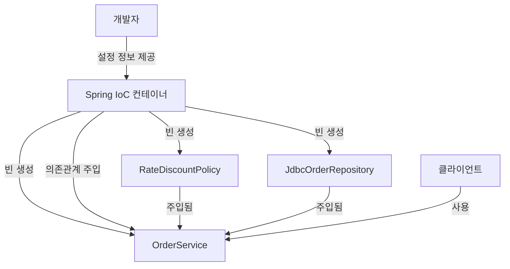
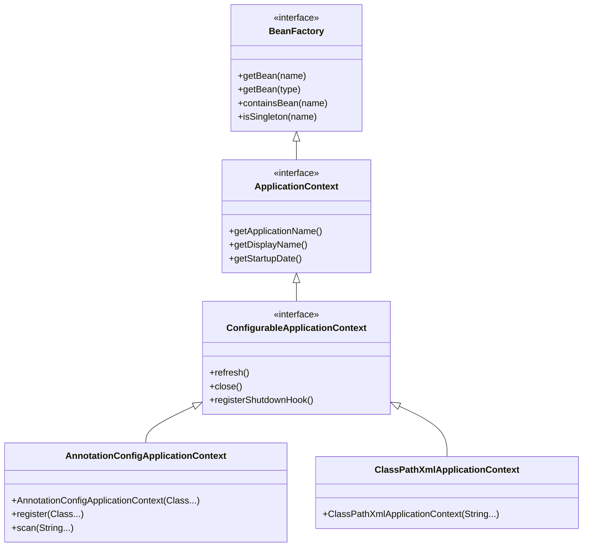
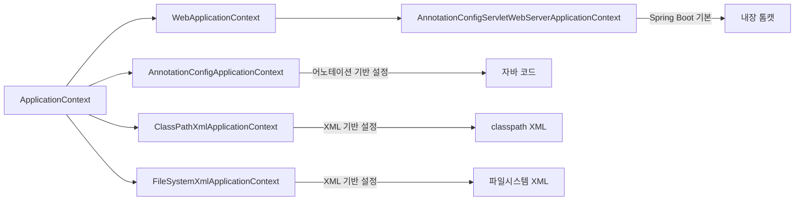
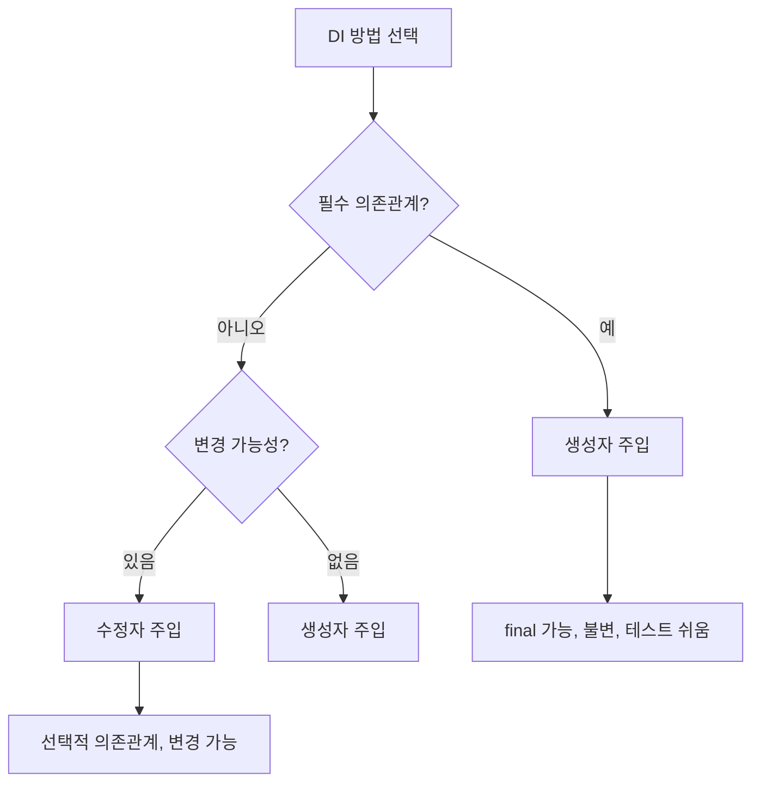
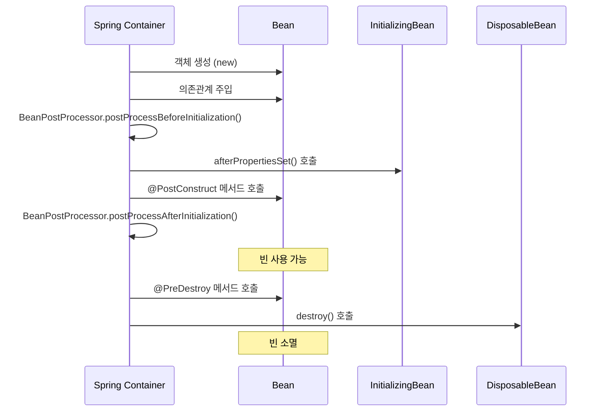
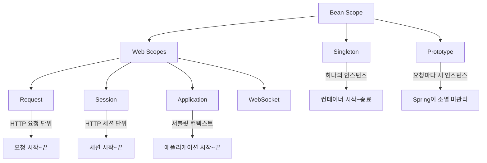
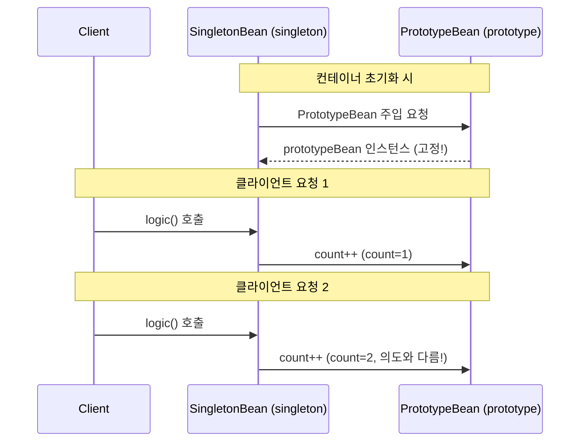
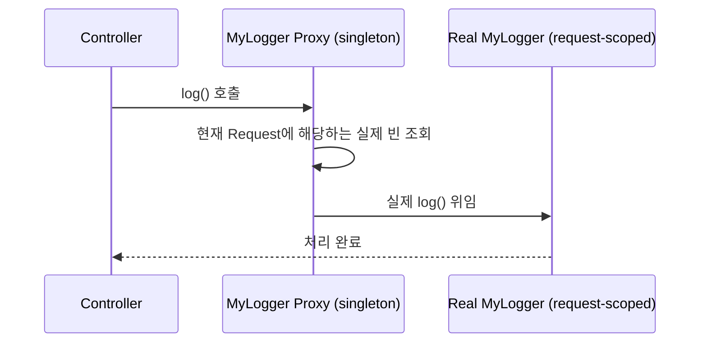

## 1. 일상 속의 비유로 시작하기

카페를 운영한다고 상상해 보세요. 손님이 아메리카노를 주문할 때마다 직접 에스프레소 머신을 가져와서, 원두를 갈고, 물을 끓이고, 조립하는 과정을 반복한다면 어떨까요? 매우 비효율적입니다.

실제 카페에서는 **중앙 주방(IoC 컨테이너)**이 모든 장비와 재료를 미리 준비해 두고, 바리스타가 필요할 때마다 꺼내 씁니다. 바리스타는 "에스프레소 머신을 어떻게 만드는지" 알 필요가 없습니다. 그냥 "주세요"라고 하면 됩니다.

Spring의 IoC/DI가 바로 이 개념입니다.

---

## 2. IoC (Inversion of Control) — 제어의 역전

### 2.1 전통적인 방식 vs IoC 방식

**전통적인 방식 (개발자가 객체를 직접 생성)**

```java
public class OrderService {
    // 직접 생성 — 강한 결합
    private DiscountPolicy discountPolicy = new RateDiscountPolicy();
    private OrderRepository orderRepository = new JdbcOrderRepository();

    public Order createOrder(Long memberId, String itemName, int itemPrice) {
        int discountPrice = discountPolicy.discount(memberId, itemPrice);
        return new Order(memberId, itemName, itemPrice, discountPrice);
    }
}
```

문제점: `OrderService`가 `RateDiscountPolicy`와 `JdbcOrderRepository`에 강하게 결합되어 있습니다. 할인 정책을 바꾸려면 `OrderService` 코드를 직접 수정해야 합니다.

**IoC 방식 (Spring이 객체를 생성하고 주입)**

```java
public class OrderService {
    // 인터페이스에만 의존 — 느슨한 결합
    private final DiscountPolicy discountPolicy;
    private final OrderRepository orderRepository;

    // Spring이 알맞은 구현체를 주입
    public OrderService(DiscountPolicy discountPolicy, OrderRepository orderRepository) {
        this.discountPolicy = discountPolicy;
        this.orderRepository = orderRepository;
    }
}
```

### 2.2 IoC 컨테이너의 역할



IoC 컨테이너는 다음을 담당합니다:
1. 빈(Bean) 객체 생성
2. 의존관계 파악 및 주입
3. 빈 생명주기 관리
4. 빈 스코프 관리

---

## 3. Spring 컨테이너 계층 구조

### 3.1 BeanFactory vs ApplicationContext



| 특성 | BeanFactory | ApplicationContext |
|------|------------|-------------------|
| 빈 조회 | O | O |
| 국제화(i18n) | X | O (MessageSource) |
| 이벤트 발행 | X | O (ApplicationEventPublisher) |
| 환경변수 | X | O (EnvironmentCapable) |
| 리소스 로딩 | X | O (ResourceLoader) |
| 지연 로딩 | 기본값 | 설정 가능 |
| 사용 권장 | X | O |

실무에서는 항상 **ApplicationContext**를 사용합니다. BeanFactory는 직접 사용할 일이 거의 없습니다.

### 3.2 ApplicationContext 구현체들



---

## 4. 빈(Bean) 등록 방법

### 4.1 자바 설정 클래스 방식

```java
@Configuration
public class AppConfig {

    @Bean
    public MemberService memberService() {
        return new MemberServiceImpl(memberRepository());
    }

    @Bean
    public MemberRepository memberRepository() {
        return new MemoryMemberRepository();
    }

    @Bean
    public OrderService orderService() {
        return new OrderServiceImpl(memberRepository(), discountPolicy());
    }

    @Bean
    public DiscountPolicy discountPolicy() {
        return new RateDiscountPolicy();
    }
}
```

주의: `@Configuration`이 붙은 클래스는 CGLIB으로 프록시 처리됩니다. 따라서 `memberRepository()`를 여러 번 호출해도 싱글톤이 보장됩니다.

### 4.2 컴포넌트 스캔 방식

```java
@Component
public class MemberServiceImpl implements MemberService {

    private final MemberRepository memberRepository;

    @Autowired
    public MemberServiceImpl(MemberRepository memberRepository) {
        this.memberRepository = memberRepository;
    }
}

@Component
public class MemoryMemberRepository implements MemberRepository {
    // ...
}
```

```java
@Configuration
@ComponentScan(
    basePackages = "hello.core",
    excludeFilters = @ComponentScan.Filter(
        type = FilterType.ANNOTATION,
        classes = Configuration.class
    )
)
public class AutoAppConfig {
    // 빈 등록 코드 없음 — 자동 스캔
}
```

### 4.3 컴포넌트 스캔 대상 어노테이션

```mermaid
graph TD
    A[@Component] --> B[@Controller]
    A --> C[@Service]
    A --> D[@Repository]
    A --> E[@Configuration]

    B -->|MVC 컨트롤러 인식| F[HandlerMapping 등록]
    C -->|비즈니스 로직 계층| G[특별 부가 기능 없음]
    D -->|데이터 접근 계층| H[예외 변환 AOP 적용]
    E -->|설정 클래스| I[CGLIB 프록시 적용]
```

---

## 5. 의존관계 주입(DI) 4가지 방법

### 5.1 생성자 주입 (Constructor Injection) — 권장

```java
@Component
public class OrderServiceImpl implements OrderService {

    private final MemberRepository memberRepository;
    private final DiscountPolicy discountPolicy;

    // @Autowired는 생성자가 하나일 때 생략 가능
    @Autowired
    public OrderServiceImpl(MemberRepository memberRepository,
                            DiscountPolicy discountPolicy) {
        this.memberRepository = memberRepository;
        this.discountPolicy = discountPolicy;
    }
}
```

생성자 주입의 장점:
- `final` 키워드 사용 가능 → 불변성 보장
- 순환 참조 컴파일 시점 감지 (Spring Boot 2.6+)
- 테스트 코드 작성 용이
- 필수 의존관계에 적합

### 5.2 수정자 주입 (Setter Injection)

```java
@Component
public class OrderServiceImpl implements OrderService {

    private MemberRepository memberRepository;
    private DiscountPolicy discountPolicy;

    @Autowired
    public void setMemberRepository(MemberRepository memberRepository) {
        this.memberRepository = memberRepository;
    }

    @Autowired(required = false) // 선택적 의존관계
    public void setDiscountPolicy(DiscountPolicy discountPolicy) {
        this.discountPolicy = discountPolicy;
    }
}
```

수정자 주입은 선택적 의존관계나 변경 가능한 의존관계에 사용합니다.

### 5.3 필드 주입 (Field Injection) — 비권장

```java
@Component
public class OrderServiceImpl implements OrderService {

    @Autowired
    private MemberRepository memberRepository;  // 테스트 어려움!

    @Autowired
    private DiscountPolicy discountPolicy;
}
```

필드 주입의 단점:
- 순수 자바 코드로 테스트 불가 (Spring 없이는 주입 불가)
- `final` 키워드 사용 불가
- 외부에서 변경 불가

### 5.4 일반 메서드 주입

```java
@Component
public class OrderServiceImpl implements OrderService {

    private MemberRepository memberRepository;
    private DiscountPolicy discountPolicy;

    @Autowired
    public void init(MemberRepository memberRepository,
                     DiscountPolicy discountPolicy) {
        this.memberRepository = memberRepository;
        this.discountPolicy = discountPolicy;
    }
}
```

### 5.5 주입 방법 비교



---

## 6. @Autowired 상세 동작

### 6.1 자동 주입 충돌 해결

같은 타입의 빈이 여러 개일 때:

```java
@Component
public class FixDiscountPolicy implements DiscountPolicy { ... }

@Component
public class RateDiscountPolicy implements DiscountPolicy { ... }
```

```java
// NoUniqueBeanDefinitionException 발생!
@Autowired
private DiscountPolicy discountPolicy;
```

**해결 방법 1: @Qualifier**

```java
@Component
@Qualifier("mainDiscountPolicy")
public class RateDiscountPolicy implements DiscountPolicy { ... }

@Autowired
@Qualifier("mainDiscountPolicy")
private DiscountPolicy discountPolicy;
```

**해결 방법 2: @Primary**

```java
@Component
@Primary // 우선순위 지정
public class RateDiscountPolicy implements DiscountPolicy { ... }

@Autowired
private DiscountPolicy discountPolicy; // RateDiscountPolicy 주입됨
```

**해결 방법 3: 필드명으로 매칭**

```java
@Autowired
private DiscountPolicy rateDiscountPolicy; // 빈 이름과 필드명 일치
```

**우선순위: @Qualifier > @Primary > 필드명 매칭**

### 6.2 @Autowired 매칭 규칙

```mermaid
flowchart TD
    A[@Autowired 실행] --> B[타입으로 조회]
    B --> C{빈 개수?}
    C -->|1개| D[주입 성공]
    C -->|0개| E{required=false?}
    E -->|true| F[null 또는 Optional.empty 주입]
    E -->|false| G[NoSuchBeanDefinitionException]
    C -->|여러 개| H[@Qualifier 확인]
    H --> I{@Qualifier 일치?}
    I -->|예| D
    I -->|아니오| J[@Primary 확인]
    J --> K{@Primary 있음?}
    K -->|예| D
    K -->|아니오| L[필드명/파라미터명으로 재시도]
    L --> M{이름 일치?}
    M -->|예| D
    M -->|아니오| N[NoUniqueBeanDefinitionException]
```

---

## 7. 빈 생명주기 (Bean Lifecycle)

### 7.1 전체 생명주기



### 7.2 초기화 / 소멸 콜백 방법

**방법 1: @PostConstruct / @PreDestroy (권장)**

```java
@Component
public class NetworkClient {

    private String url;

    public NetworkClient() {
        System.out.println("생성자 호출 — url = " + url); // null
    }

    public void setUrl(String url) {
        this.url = url;
    }

    @PostConstruct
    public void init() {
        System.out.println("초기화 콜백 — url = " + url); // 값 있음
        connect();
    }

    @PreDestroy
    public void close() {
        System.out.println("소멸 전 콜백 — url = " + url);
        disconnect();
    }

    private void connect() { System.out.println("connect: " + url); }
    private void disconnect() { System.out.println("close: " + url); }
}
```

**방법 2: InitializingBean / DisposableBean 인터페이스**

```java
@Component
public class NetworkClient implements InitializingBean, DisposableBean {

    @Override
    public void afterPropertiesSet() throws Exception {
        // 의존관계 주입 후 초기화
        connect();
    }

    @Override
    public void destroy() throws Exception {
        // 소멸 전 처리
        disconnect();
    }
}
```

단점: Spring 전용 인터페이스에 의존, 코드 수정 불가한 외부 라이브러리에 적용 불가.

**방법 3: @Bean의 initMethod / destroyMethod**

```java
public class NetworkClient {

    public void init() { connect(); }
    public void close() { disconnect(); }
}

@Configuration
public class AppConfig {

    @Bean(initMethod = "init", destroyMethod = "close")
    public NetworkClient networkClient() {
        NetworkClient client = new NetworkClient();
        client.setUrl("http://example.com");
        return client;
    }
}
```

외부 라이브러리에도 적용 가능합니다.

---

## 8. 빈 스코프 (Bean Scope)

### 8.1 스코프 종류



### 8.2 싱글톤 스코프 (기본값)

```java
@Component
// @Scope("singleton") // 기본값이므로 생략 가능
public class SingletonBean {
    // 애플리케이션 전체에서 하나의 인스턴스
}
```

```java
ApplicationContext ac = new AnnotationConfigApplicationContext(AppConfig.class);

SingletonBean bean1 = ac.getBean(SingletonBean.class);
SingletonBean bean2 = ac.getBean(SingletonBean.class);

System.out.println(bean1 == bean2); // true — 같은 인스턴스
```

### 8.3 프로토타입 스코프

```java
@Component
@Scope("prototype")
public class PrototypeBean {

    @PostConstruct
    public void init() { System.out.println("PrototypeBean.init"); }

    @PreDestroy  // 호출 안 됨! Spring이 관리 안 함
    public void destroy() { System.out.println("PrototypeBean.destroy"); }
}
```

```java
PrototypeBean bean1 = ac.getBean(PrototypeBean.class);
PrototypeBean bean2 = ac.getBean(PrototypeBean.class);

System.out.println(bean1 == bean2); // false — 다른 인스턴스
```

### 8.4 싱글톤 빈에서 프로토타입 빈 사용 문제



**해결책 1: ObjectProvider**

```java
@Component
public class SingletonBean {

    @Autowired
    private ObjectProvider<PrototypeBean> prototypeBeanProvider;

    public int logic() {
        PrototypeBean prototypeBean = prototypeBeanProvider.getObject(); // 매번 새로 생성
        prototypeBean.addCount();
        return prototypeBean.getCount();
    }
}
```

**해결책 2: Provider (JSR-330)**

```java
// javax.inject:javax.inject:1 의존성 필요
@Component
public class SingletonBean {

    @Autowired
    private Provider<PrototypeBean> provider;

    public int logic() {
        PrototypeBean prototypeBean = provider.get(); // 매번 새로 생성
        prototypeBean.addCount();
        return prototypeBean.getCount();
    }
}
```

### 8.5 웹 스코프 — Request 스코프 예시

```java
@Component
@Scope(value = "request", proxyMode = ScopedProxyMode.TARGET_CLASS)
public class MyLogger {

    private String uuid;
    private String requestURL;

    @PostConstruct
    public void init() {
        this.uuid = UUID.randomUUID().toString();
        System.out.println("[" + uuid + "] request scope bean create: " + this);
    }

    @PreDestroy
    public void close() {
        System.out.println("[" + uuid + "] request scope bean close: " + this);
    }

    public void log(String message) {
        System.out.println("[" + uuid + "][" + requestURL + "] " + message);
    }

    public void setRequestURL(String requestURL) {
        this.requestURL = requestURL;
    }
}
```

`proxyMode = ScopedProxyMode.TARGET_CLASS`를 사용하면 CGLIB 프록시를 통해 싱글톤처럼 주입 가능합니다.



---

## 9. 스프링 컨테이너 설정 방법 비교

### 9.1 XML vs 자바 설정 vs 어노테이션

| 방법 | 장점 | 단점 | 권장 상황 |
|------|------|------|----------|
| XML | 변경 시 재컴파일 불필요 | 장황함, 타입 안전 X | 레거시 |
| 자바 @Configuration | 타입 안전, IDE 지원 | 재컴파일 필요 | 중규모 이상 |
| @ComponentScan | 간결함, 자동화 | 명시적 제어 어려움 | Spring Boot |

### 9.2 빈 메타데이터 — BeanDefinition

```mermaid
graph TD
    A[XML 설정] --> C[BeanDefinitionReader]
    B[자바 @Configuration] --> C
    D[@ComponentScan] --> C
    C --> E[BeanDefinition 생성]
    E --> F[Spring Container]

    E --> G[beanClassName]
    E --> H[scope]
    E --> I[lazyInit]
    E --> J[initMethodName]
    E --> K[destroyMethodName]
    E --> L[constructorArgumentValues]
    E --> M[propertyValues]
```

---

## 10. 실전 패턴 — 설정 분리

### 10.1 계층별 설정 분리

```java
// 웹 계층 설정
@Configuration
@ComponentScan(basePackages = "hello.web")
public class WebConfig {

    @Bean
    public ViewResolver viewResolver() {
        return new InternalResourceViewResolver("/WEB-INF/views/", ".jsp");
    }
}

// 서비스 계층 설정
@Configuration
@ComponentScan(basePackages = "hello.service")
public class ServiceConfig {
    // ...
}

// 데이터 접근 계층 설정
@Configuration
@ComponentScan(basePackages = "hello.repository")
public class RepositoryConfig {

    @Bean
    public DataSource dataSource() {
        // ...
    }
}
```

### 10.2 프로파일 기반 설정

```java
@Configuration
public class DataSourceConfig {

    @Bean
    @Profile("dev")
    public DataSource devDataSource() {
        return new EmbeddedDatabaseBuilder()
            .setType(EmbeddedDatabaseType.H2)
            .build();
    }

    @Bean
    @Profile("prod")
    public DataSource prodDataSource() {
        HikariDataSource dataSource = new HikariDataSource();
        dataSource.setJdbcUrl("jdbc:mysql://prod-server:3306/mydb");
        dataSource.setUsername("prod_user");
        dataSource.setPassword("prod_password");
        return dataSource;
    }
}
```

```yaml
# application.yml
spring:
  profiles:
    active: dev
```

---

## 11. 극한 시나리오 — 실무 트러블슈팅

### 시나리오 1: 순환 참조 (Circular Dependency)

```java
@Component
public class A {
    @Autowired
    private B b; // A가 B를 필요로 함
}

@Component
public class B {
    @Autowired
    private A a; // B가 A를 필요로 함 — 순환!
}
```

Spring Boot 2.6+에서는 기본적으로 `BeanCurrentlyInCreationException`이 발생합니다.

**해결책:**

```java
// 방법 1: @Lazy로 지연 주입
@Component
public class A {
    @Autowired
    @Lazy
    private B b;
}

// 방법 2: 수정자 주입으로 전환
@Component
public class A {
    private B b;

    @Autowired
    public void setB(B b) { this.b = b; }
}

// 방법 3: 설계 개선 (추천) — 공통 기능을 별도 컴포넌트로 분리
@Component
public class Common {
    // A와 B가 공통으로 필요한 기능
}

@Component
public class A {
    @Autowired
    private Common common;
}

@Component
public class B {
    @Autowired
    private Common common;
}
```

### 시나리오 2: 같은 타입 빈 여러 개 — List 주입

```java
// 여러 할인 정책을 동시에 지원하고 싶을 때
@Component
public class DiscountService {

    private final Map<String, DiscountPolicy> policyMap;
    private final List<DiscountPolicy> policies;

    @Autowired
    public DiscountService(Map<String, DiscountPolicy> policyMap,
                          List<DiscountPolicy> policies) {
        this.policyMap = policyMap;   // 빈 이름 -> 빈 객체
        this.policies = policies;       // 모든 DiscountPolicy 빈 목록
    }

    public int discount(Member member, int price, String discountCode) {
        DiscountPolicy discountPolicy = policyMap.get(discountCode);
        return discountPolicy.discount(member, price);
    }
}
```

### 시나리오 3: 프로토타입 빈 메모리 누수

```java
// 잘못된 사용 — PrototypeBean이 누수됨
@Component
public class BadService {

    private final PrototypeBean prototypeBean; // 한 번만 주입됨

    @Autowired
    public BadService(PrototypeBean prototypeBean) {
        this.prototypeBean = prototypeBean;
    }
}

// 올바른 사용 — ObjectProvider 활용
@Component
public class GoodService {

    private final ObjectProvider<PrototypeBean> provider;

    @Autowired
    public GoodService(ObjectProvider<PrototypeBean> provider) {
        this.provider = provider;
    }

    public void doSomething() {
        PrototypeBean bean = provider.getObject(); // 매 호출마다 새 인스턴스
        bean.doWork();
        // Spring이 관리 안 하므로 사용 후 처리 책임은 개발자에게
    }
}
```

---

## 12. 전체 흐름 정리

```mermaid
flowchart TD
    A[애플리케이션 시작] --> B[Spring Container 생성]
    B --> C[설정 정보 읽기]
    C --> D[@Configuration, @ComponentScan, XML]
    D --> E[BeanDefinition 생성]
    E --> F[빈 인스턴스 생성]
    F --> G[의존관계 주입]
    G --> H[초기화 콜백]
    H --> I[@PostConstruct, InitializingBean, initMethod]
    I --> J[빈 사용 준비 완료]
    J --> K{요청}
    K --> L[빈 조회/사용]
    L --> K
    K --> M[컨테이너 종료]
    M --> N[소멸 전 콜백]
    N --> O[@PreDestroy, DisposableBean, destroyMethod]
    O --> P[빈 소멸]
```

---

## 13. 요약 — 핵심 정리

| 개념 | 설명 | 실무 포인트 |
|------|------|------------|
| IoC | 객체 생성/관리 제어권을 프레임워크에 위임 | 직접 new 하지 말것 |
| DI | 필요한 의존관계를 외부에서 주입 | 생성자 주입 권장 |
| BeanFactory | 빈 관리 핵심 인터페이스 | 직접 사용 안 함 |
| ApplicationContext | BeanFactory + 부가 기능 | 항상 이것 사용 |
| Singleton | 기본 스코프, 하나의 인스턴스 | 상태 관리 주의 |
| Prototype | 요청마다 새 인스턴스, 소멸 미관리 | ObjectProvider 활용 |
| @PostConstruct | 의존관계 주입 완료 후 초기화 | 권장 초기화 방법 |
| @PreDestroy | 빈 소멸 전 정리 | 권장 소멸 방법 |

Spring IoC/DI의 핵심은 "객체가 스스로 의존관계를 만들지 않고, 외부(컨테이너)가 주입해 준다"는 것입니다. 이를 통해 느슨한 결합, 테스트 용이성, 유연한 설계가 가능해집니다.
