> **한 줄 요약:** Spring IoC/DI는 "객체가 스스로 의존관계를 만들지 않고, 외부 컨테이너가 주입해 준다"는 원칙으로, 느슨한 결합과 테스트 용이성을 가능하게 합니다.

## 1. 실무 시나리오 — 코드가 왜 갈수록 엉키는가

실제 서비스를 개발하다 보면 처음에는 단순했던 코드가 어느 순간 손댈 수 없는 수준으로 복잡해집니다. 이커머스 플랫폼을 예로 들면, 주문 서비스가 등장할 때만 해도 `OrderService`는 `JdbcOrderRepository`를 직접 생성했습니다. 이후 JPA로 전환하려 하니 `OrderService`를 수정해야 하고, 할인 정책을 바꾸려 해도 `OrderService`를 수정해야 했습니다. 비즈니스 로직과 기술 선택, 인프라 결정이 모두 한 클래스에 뒤섞인 것입니다.

이 문제의 근본 원인은 **강한 결합(Tight Coupling)**입니다. 객체가 스스로 의존하는 객체를 생성하면, 그 구현 기술에 종속됩니다. 테스트할 때도 실제 DB 없이는 동작하지 않습니다. 수백 개의 클래스가 이런 방식으로 얽히면 어느 것 하나 바꾸기가 두렵습니다.

Spring IoC/DI는 이 문제를 해결하기 위해 탄생했습니다. 객체 생성과 의존관계 설정을 프레임워크에 위임함으로써, 개발자는 비즈니스 로직에만 집중할 수 있습니다. 마치 카페 바리스타가 에스프레소 머신을 직접 조립하지 않고, 주방이 미리 준비해 둔 장비를 가져다 쓰는 것과 같습니다.

---

## 2. IoC (Inversion of Control) — 제어의 역전

### 2.1 전통적인 방식 vs IoC 방식

**전통적인 방식: 개발자가 모든 것을 제어**

```java
public class OrderService {
    // 직접 생성 — 강한 결합
    // RateDiscountPolicy를 FixDiscountPolicy로 바꾸려면 이 줄을 수정해야 함
    private DiscountPolicy discountPolicy = new RateDiscountPolicy();
    private OrderRepository orderRepository = new JdbcOrderRepository();

    public Order createOrder(Long memberId, String itemName, int itemPrice) {
        // OrderService가 DiscountPolicy의 구체 구현을 알고 있음
        int discountPrice = discountPolicy.discount(memberId, itemPrice);
        return new Order(memberId, itemName, itemPrice, discountPrice);
    }
}
```

**IoC 방식: Spring이 객체를 생성하고 주입**

```java
public class OrderService {
    // 인터페이스에만 의존 — 느슨한 결합
    // 어떤 구현체가 들어올지 알 필요 없음
    private final DiscountPolicy discountPolicy;
    private final OrderRepository orderRepository;

    // Spring이 알맞은 구현체를 주입해 줌
    public OrderService(DiscountPolicy discountPolicy, OrderRepository orderRepository) {
        this.discountPolicy = discountPolicy;
        this.orderRepository = orderRepository;
    }
}
```

#### 왜 이게 중요한가?

OCP(개방-폐쇄 원칙)와 DIP(의존 역전 원칙)를 동시에 달성합니다. `OrderService`는 `DiscountPolicy` 인터페이스에만 의존하므로, `RateDiscountPolicy`에서 `VipDiscountPolicy`로 전환해도 `OrderService` 코드를 한 줄도 수정할 필요가 없습니다. 이것이 유지보수성의 핵심입니다.

### 2.2 IoC 컨테이너의 역할

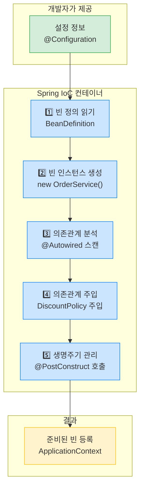

#### 실무에서 자주 하는 실수

`new`로 직접 객체를 생성하면 Spring의 관리 밖으로 벗어납니다. `@Transactional`, `@Async`, `@Cacheable` 같은 AOP 기반 어노테이션은 Spring이 관리하는 빈에만 동작합니다. `new MyService()`로 생성한 객체에서는 트랜잭션이 전혀 작동하지 않습니다.

---

## 3. Spring 컨테이너 계층 구조

### 3.1 BeanFactory vs ApplicationContext

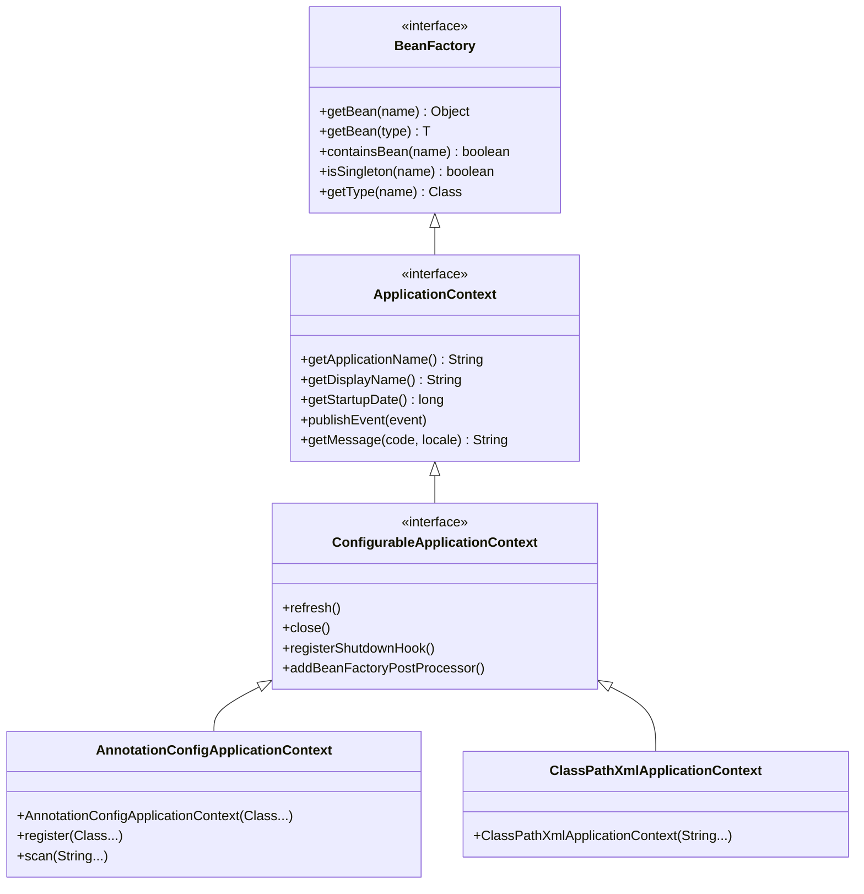

| 특성 | BeanFactory | ApplicationContext |
|------|------------|-------------------|
| 빈 조회 | O | O |
| 국제화(i18n) | X | O (MessageSource) |
| 이벤트 발행 | X | O (ApplicationEventPublisher) |
| 환경변수 | X | O (EnvironmentCapable) |
| 리소스 로딩 | X | O (ResourceLoader) |
| 지연 로딩 | 기본값 | 설정 가능 |
| AOP, @Transactional | X | O (BeanPostProcessor) |
| 사용 권장 | X | O |

`BeanFactory`는 빈 조회 기능만 제공합니다. 실무에서는 항상 **ApplicationContext**를 사용합니다. `@Transactional`, `@Cacheable` 같은 기능은 `ApplicationContext`의 `BeanPostProcessor` 인프라가 필요하기 때문입니다.

### 3.2 ApplicationContext 구현체들

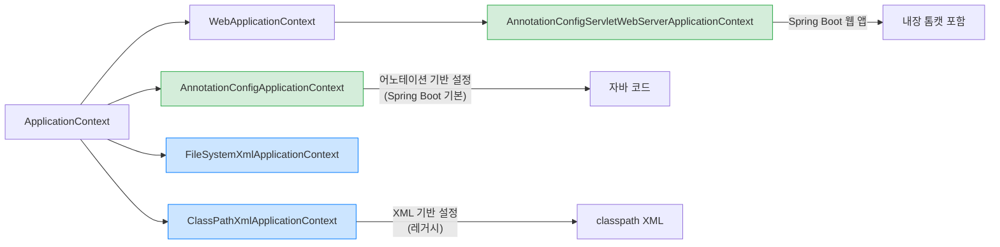

---

## 4. 빈(Bean) 등록 방법

### 4.1 자바 설정 클래스 방식 — 명시적 등록

```java
@Configuration
public class AppConfig {

    // @Bean 메서드가 반환하는 객체가 스프링 빈으로 등록됨
    @Bean
    public MemberService memberService() {
        // memberRepository()를 호출해도 CGLIB 프록시 덕분에 싱글톤 보장
        return new MemberServiceImpl(memberRepository());
    }

    @Bean
    public MemberRepository memberRepository() {
        return new MemoryMemberRepository();
    }

    @Bean
    public OrderService orderService() {
        return new OrderServiceImpl(memberRepository(), discountPolicy());
    }

    @Bean
    public DiscountPolicy discountPolicy() {
        // 여기를 RateDiscountPolicy → VipDiscountPolicy로만 바꾸면 됨
        return new RateDiscountPolicy();
    }
}
```

**중요:** `@Configuration`이 붙은 클래스는 CGLIB으로 프록시 처리됩니다. `memberRepository()`를 여러 번 호출해도 항상 같은 인스턴스가 반환됩니다. `@Configuration` 없이 `@Bean`만 사용하면 싱글톤이 깨집니다.

### 4.2 컴포넌트 스캔 방식 — 자동 등록

```java
@Component
public class MemberServiceImpl implements MemberService {

    private final MemberRepository memberRepository;

    // 생성자가 하나일 때 @Autowired 생략 가능 (Spring 4.3+)
    @Autowired
    public MemberServiceImpl(MemberRepository memberRepository) {
        this.memberRepository = memberRepository;
    }
}

@Component
public class MemoryMemberRepository implements MemberRepository {
    // ...
}
```

```java
@Configuration
@ComponentScan(
    basePackages = "hello.core",          // 스캔 시작 패키지
    excludeFilters = @ComponentScan.Filter(
        type = FilterType.ANNOTATION,
        classes = Configuration.class    // 명시적 설정 클래스는 제외
    )
)
public class AutoAppConfig {
    // 빈 등록 코드 없음 — 자동 스캔으로 처리
}
```

### 4.3 컴포넌트 스캔 대상 어노테이션

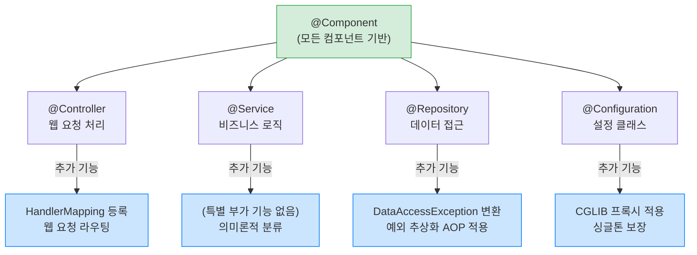

`@Repository`는 단순히 의미론적 표시가 아닙니다. Spring이 `PersistenceExceptionTranslationPostProcessor`를 통해 JPA/JDBC 예외를 `DataAccessException` 계층으로 자동 변환해 줍니다.

#### 면접 포인트

> **Q: @Service와 @Component의 차이는?**
>
> 기능적으로는 동일합니다. `@Service`는 `@Component`를 포함하며, 서비스 계층임을 명시하는 의미론적 역할만 합니다. 반면 `@Repository`는 예외 변환 AOP가 추가로 적용되고, `@Controller`는 Spring MVC 핸들러로 등록되는 실질적 차이가 있습니다.

---

## 5. 의존관계 주입(DI) 4가지 방법

### 5.1 생성자 주입 (Constructor Injection) — 권장

```java
@Component
public class OrderServiceImpl implements OrderService {

    // final로 선언 — 불변성 보장, 누락 시 컴파일 에러
    private final MemberRepository memberRepository;
    private final DiscountPolicy discountPolicy;

    // @Autowired는 생성자가 하나일 때 생략 가능 (Spring 4.3+)
    @Autowired
    public OrderServiceImpl(MemberRepository memberRepository,
                            DiscountPolicy discountPolicy) {
        this.memberRepository = memberRepository;    // 반드시 주입되어야 함
        this.discountPolicy = discountPolicy;         // 반드시 주입되어야 함
    }
}
```

생성자 주입이 권장되는 이유:
- `final` 키워드 사용 가능 → 불변성 보장, 런타임 변경 불가
- 순환 참조 컴파일 시점 감지 (Spring Boot 2.6+는 기본 차단)
- 테스트 코드 작성 시 `new OrderServiceImpl(mockRepo, mockPolicy)`로 간단히 주입
- 필수 의존관계가 명확 — 생성자 호출 시점에 모든 의존성 제공 강제

### 5.2 수정자 주입 (Setter Injection)

```java
@Component
public class OrderServiceImpl implements OrderService {

    private MemberRepository memberRepository;
    private DiscountPolicy discountPolicy;

    // 필수 의존관계
    @Autowired
    public void setMemberRepository(MemberRepository memberRepository) {
        this.memberRepository = memberRepository;
    }

    // 선택적 의존관계 — 빈이 없어도 오류 발생 안 함
    @Autowired(required = false)
    public void setDiscountPolicy(DiscountPolicy discountPolicy) {
        this.discountPolicy = discountPolicy;
    }
}
```

수정자 주입은 **선택적 의존관계**나 **변경 가능한 의존관계**에 적합합니다. 예를 들어, 특정 플러그인이 설치된 경우에만 기능을 활성화하거나, 런타임에 전략을 교체해야 할 때 사용합니다.

### 5.3 필드 주입 (Field Injection) — 비권장

```java
@Component
public class OrderServiceImpl implements OrderService {

    @Autowired
    private MemberRepository memberRepository;  // 테스트 어려움!

    @Autowired
    private DiscountPolicy discountPolicy;
}
```

필드 주입의 단점:
- 순수 Java 코드로 테스트 불가 — Spring 컨텍스트 없이는 주입 불가
- `final` 키워드 사용 불가 → 불변성 보장 불가
- 외부에서 변경 불가 → 의존성 교체 어려움
- 숨겨진 의존관계 — 클래스 API만 봐서는 어떤 의존관계가 있는지 알 수 없음

#### 실무에서 자주 하는 실수

테스트 코드에서 `@SpringBootTest`를 붙이지 않으면 필드 주입 빈의 의존관계가 null이 되어 `NullPointerException`이 발생합니다. 그래서 테스트마다 무거운 Spring 컨텍스트를 띄우게 됩니다. 생성자 주입을 쓰면 `new` 키워드만으로 가볍게 단위 테스트할 수 있습니다.

### 5.4 주입 방법 결정 흐름

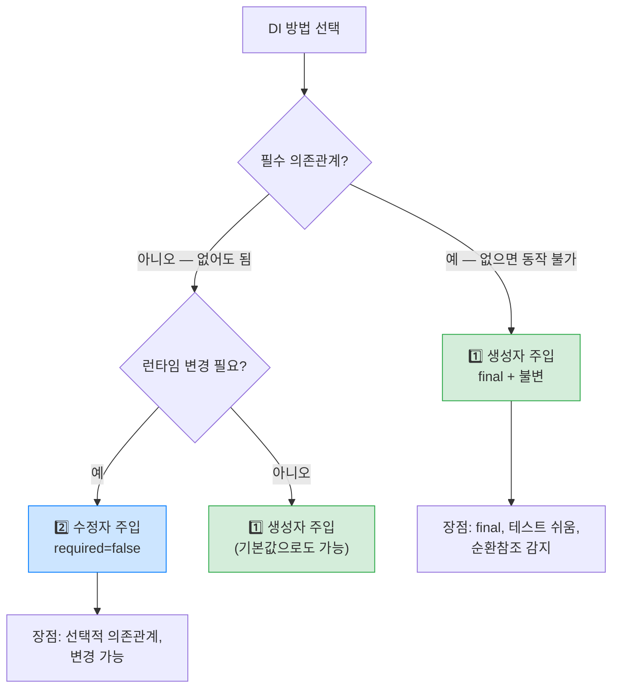

---

## 6. @Autowired 상세 동작

### 6.1 자동 주입 충돌 해결

같은 타입의 빈이 여러 개 등록된 경우 `NoUniqueBeanDefinitionException`이 발생합니다.

```java
@Component
public class FixDiscountPolicy implements DiscountPolicy { ... }

@Component
public class RateDiscountPolicy implements DiscountPolicy { ... }

// 오류 발생!
@Autowired
private DiscountPolicy discountPolicy;
```

**해결 방법 1: @Qualifier — 가장 명시적**

```java
@Component
@Qualifier("mainDiscountPolicy")
public class RateDiscountPolicy implements DiscountPolicy { ... }

@Autowired
@Qualifier("mainDiscountPolicy")
private DiscountPolicy discountPolicy;
```

**해결 방법 2: @Primary — 가장 간편**

```java
@Component
@Primary // 같은 타입 중 기본으로 선택될 빈
public class RateDiscountPolicy implements DiscountPolicy { ... }

@Autowired
private DiscountPolicy discountPolicy; // RateDiscountPolicy 자동 주입
```

**해결 방법 3: 필드명/파라미터명으로 매칭**

```java
@Autowired
// 필드명이 빈 이름(rateDiscountPolicy)과 일치하면 자동 선택
private DiscountPolicy rateDiscountPolicy;
```

**우선순위: @Qualifier > @Primary > 필드명 매칭**

#### 면접 포인트

> **Q: @Qualifier vs @Primary 중 언제 어느 것을 쓰나요?**
>
> 하나의 기본 구현체가 있고 특수 상황에서만 다른 것을 쓴다면 `@Primary`가 편합니다. 반면 여러 구현체 중 명시적으로 선택해야 하거나, 같은 타입을 여러 곳에서 서로 다른 구현체로 주입받아야 한다면 `@Qualifier`가 적합합니다.

### 6.2 @Autowired 매칭 규칙 흐름

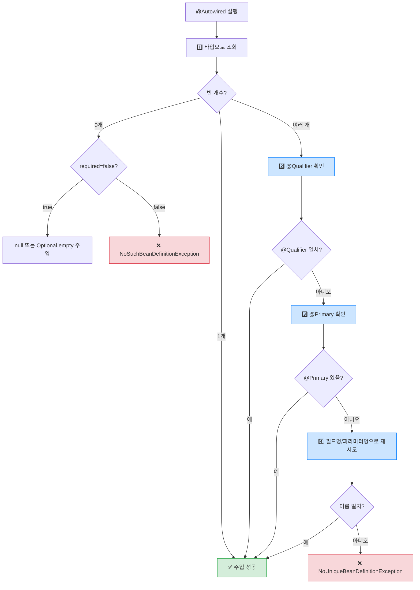

---

## 7. 빈 생명주기 (Bean Lifecycle)

### 7.1 전체 생명주기

Spring 빈은 다음 순서로 생성되고 소멸합니다.

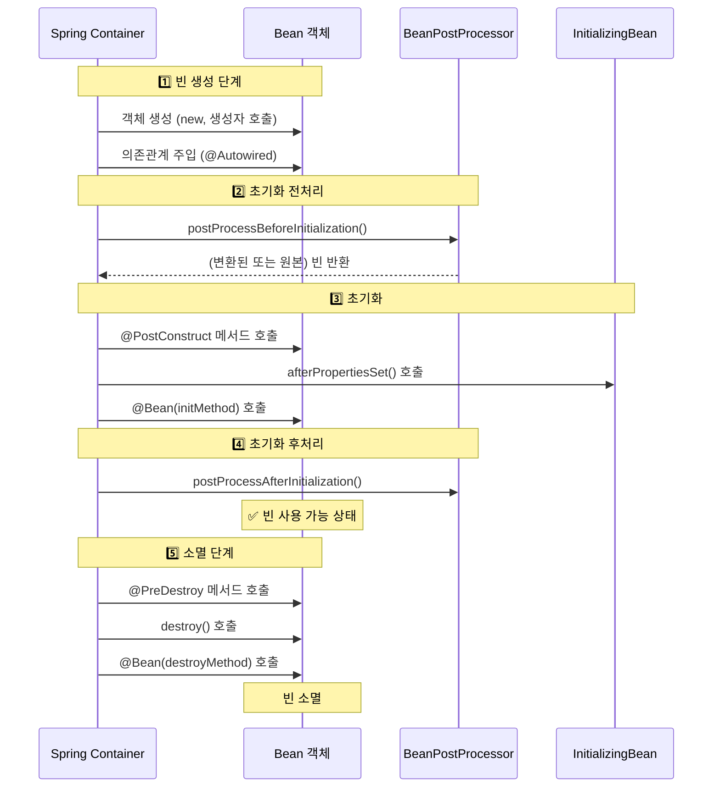

왜 생성자에서 초기화를 하지 않는가? 생성자 호출 시점에는 아직 의존관계가 주입되지 않았습니다. DB 커넥션을 열거나 외부 서비스에 연결하려면 의존관계 주입이 완료된 후 실행되는 `@PostConstruct`를 사용해야 합니다.

### 7.2 초기화 / 소멸 콜백 방법

**방법 1: @PostConstruct / @PreDestroy (권장)**

```java
@Component
public class NetworkClient {

    private String url;

    // 생성자 시점: url은 아직 null
    public NetworkClient() {
        System.out.println("생성자 호출 — url = " + url);
    }

    public void setUrl(String url) {
        this.url = url;
    }

    // 의존관계 주입 완료 후 호출 — url 세팅 완료
    @PostConstruct
    public void init() {
        System.out.println("초기화 콜백 — url = " + url); // 값 있음
        connect();    // 안전하게 연결 시작
    }

    // 빈 소멸 직전 호출 — 리소스 정리
    @PreDestroy
    public void close() {
        System.out.println("소멸 전 콜백 — url = " + url);
        disconnect(); // 연결 종료
    }

    private void connect() {
        System.out.println("connect: " + url);
    }
    private void disconnect() {
        System.out.println("close: " + url);
    }
}
```

**방법 2: InitializingBean / DisposableBean 인터페이스**

```java
@Component
public class NetworkClient implements InitializingBean, DisposableBean {

    @Override
    public void afterPropertiesSet() throws Exception {
        // 의존관계 주입 후 초기화
        connect();
    }

    @Override
    public void destroy() throws Exception {
        // 소멸 전 처리
        disconnect();
    }
}
```

단점: Spring 전용 인터페이스에 의존, 코드 수정 불가한 외부 라이브러리에 적용 불가.

**방법 3: @Bean의 initMethod / destroyMethod — 외부 라이브러리에 적합**

```java
// 외부 라이브러리 (수정 불가)
public class ExternalNetworkClient {
    public void start() { /* 연결 시작 */ }
    public void stop() { /* 연결 종료 */ }
}

@Configuration
public class AppConfig {

    // 외부 라이브러리도 생명주기 관리 가능
    @Bean(initMethod = "start", destroyMethod = "stop")
    public ExternalNetworkClient networkClient() {
        ExternalNetworkClient client = new ExternalNetworkClient();
        client.setUrl("http://example.com");
        return client;
    }
}
```

| 방법 | 외부 라이브러리 | 코드 침투 | 권장 |
|------|--------------|---------|------|
| @PostConstruct / @PreDestroy | X | 없음 | ✅ 최우선 |
| InitializingBean / DisposableBean | X | Spring 종속 | 비권장 |
| @Bean initMethod / destroyMethod | O | 없음 | ✅ 외부 라이브러리용 |

---

## 8. 빈 스코프 (Bean Scope)

### 8.1 스코프 종류와 생명주기

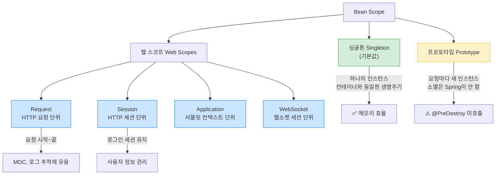

### 8.2 싱글톤 스코프 — 상태 관리 주의

```java
@Component
// @Scope("singleton") // 기본값이므로 생략 가능
public class OrderService {
    // 싱글톤이므로 상태(필드)를 가지면 안 됨!
    // private int requestCount = 0; // 위험! 모든 요청이 공유됨

    private final OrderRepository orderRepository; // 의존 주입은 OK

    public OrderService(OrderRepository orderRepository) {
        this.orderRepository = orderRepository;
    }
}
```

```java
ApplicationContext ac = new AnnotationConfigApplicationContext(AppConfig.class);

OrderService service1 = ac.getBean(OrderService.class);
OrderService service2 = ac.getBean(OrderService.class);

System.out.println(service1 == service2); // true — 같은 인스턴스
```

### 8.3 프로토타입 스코프 — 요청마다 새 인스턴스

```java
@Component
@Scope("prototype")
public class PrototypeBean {

    private int count = 0;

    @PostConstruct
    public void init() {
        System.out.println("PrototypeBean.init: " + this);
    }

    @PreDestroy  // 호출 안 됨! Spring이 소멸을 관리하지 않음
    public void destroy() {
        System.out.println("PrototypeBean.destroy");
    }

    public void addCount() { count++; }
    public int getCount() { return count; }
}
```

```java
PrototypeBean bean1 = ac.getBean(PrototypeBean.class);
PrototypeBean bean2 = ac.getBean(PrototypeBean.class);

System.out.println(bean1 == bean2); // false — 다른 인스턴스
```

### 8.4 싱글톤 빈에서 프로토타입 빈 사용 문제

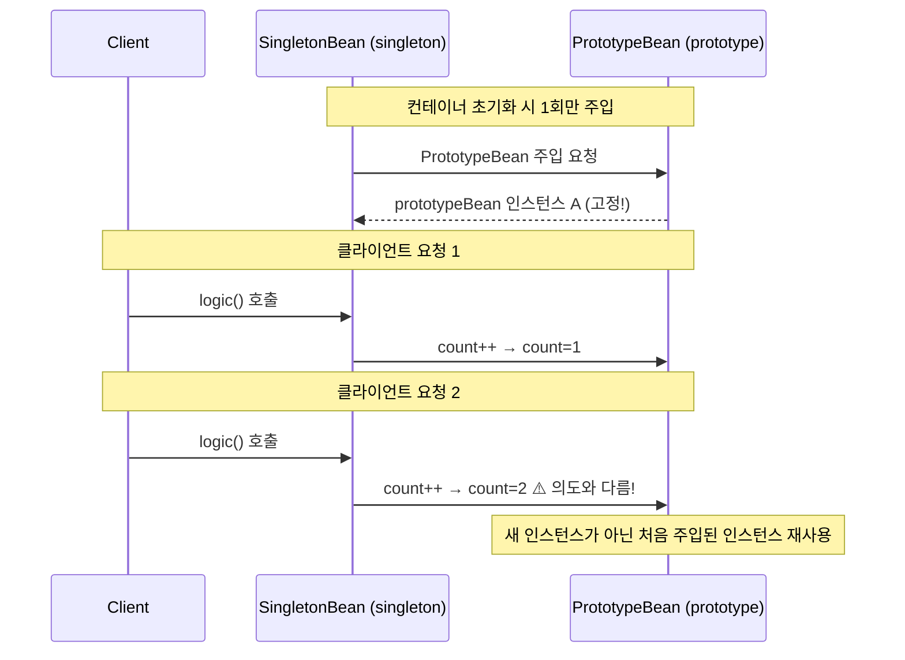

**해결책: ObjectProvider로 매번 새 인스턴스 획득**

```java
@Component
public class SingletonBean {

    // ObjectProvider: 조회 대신 Provider를 주입받아 필요할 때 꺼내씀
    @Autowired
    private ObjectProvider<PrototypeBean> prototypeBeanProvider;

    public int logic() {
        // getObject() 호출 시마다 컨테이너에서 새 PrototypeBean을 생성
        PrototypeBean prototypeBean = prototypeBeanProvider.getObject();
        prototypeBean.addCount();
        return prototypeBean.getCount(); // 항상 1 반환
    }
}
```

### 8.5 웹 스코프 — Request 스코프 예시

```java
@Component
@Scope(value = "request", proxyMode = ScopedProxyMode.TARGET_CLASS)
public class MyLogger {

    private String uuid;
    private String requestURL;

    @PostConstruct
    public void init() {
        // HTTP 요청마다 새 UUID 생성
        this.uuid = UUID.randomUUID().toString();
        System.out.println("[" + uuid + "] request scope bean create: " + this);
    }

    @PreDestroy
    public void close() {
        System.out.println("[" + uuid + "] request scope bean close: " + this);
    }

    public void log(String message) {
        System.out.println("[" + uuid + "][" + requestURL + "] " + message);
    }

    public void setRequestURL(String requestURL) {
        this.requestURL = requestURL;
    }
}
```

`proxyMode = ScopedProxyMode.TARGET_CLASS`를 사용하면 CGLIB 프록시가 생성되어, 싱글톤 빈처럼 주입하면서 실제 요청 시점에 request-scoped 빈을 조회합니다.

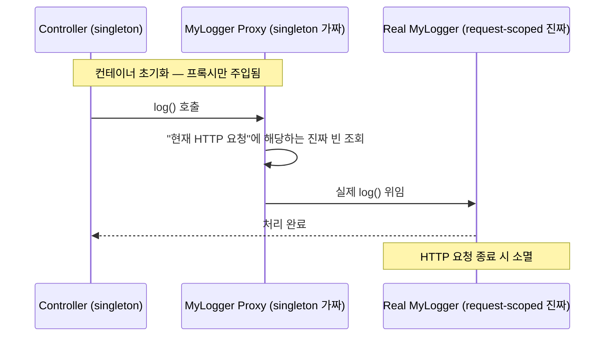

---

## 9. 스프링 컨테이너 설정 방법 비교

### 9.1 XML vs 자바 설정 vs 어노테이션

| 방법 | 장점 | 단점 | 권장 상황 |
|------|------|------|----------|
| XML | 변경 시 재컴파일 불필요 | 장황함, 타입 안전 X | 레거시 유지보수 |
| 자바 @Configuration | 타입 안전, IDE 지원, 리팩토링 쉬움 | 재컴파일 필요 | 복잡한 빈 설정 |
| @ComponentScan | 간결함, 자동화 | 명시적 제어 어려움 | Spring Boot 기본 |

### 9.2 빈 메타데이터 — BeanDefinition

Spring은 다양한 설정 방식을 `BeanDefinition`으로 통일합니다.

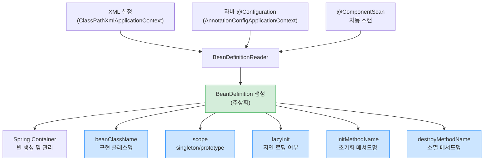

---

## 10. 프로파일 기반 설정

```java
@Configuration
public class DataSourceConfig {

    // 개발 환경: H2 인메모리 DB
    @Bean
    @Profile("dev")
    public DataSource devDataSource() {
        return new EmbeddedDatabaseBuilder()
            .setType(EmbeddedDatabaseType.H2)
            .build();
    }

    // 운영 환경: MySQL
    @Bean
    @Profile("prod")
    public DataSource prodDataSource() {
        HikariDataSource dataSource = new HikariDataSource();
        dataSource.setJdbcUrl("jdbc:mysql://prod-server:3306/mydb");
        dataSource.setUsername(System.getenv("DB_USERNAME"));
        dataSource.setPassword(System.getenv("DB_PASSWORD"));
        return dataSource;
    }
}
```

```yaml
# application.yml
spring:
  profiles:
    active: dev  # 개발 환경에서 H2 사용
```

---

## 11. 실무 트러블슈팅 — 자주 겪는 문제들

### 시나리오 1: 순환 참조 (Circular Dependency)

```java
@Component
public class A {
    @Autowired
    private B b; // A가 B를 필요로 함
}

@Component
public class B {
    @Autowired
    private A a; // B가 A를 필요로 함 — 순환!
}
```

Spring Boot 2.6+에서는 기본적으로 `BeanCurrentlyInCreationException`이 발생합니다.

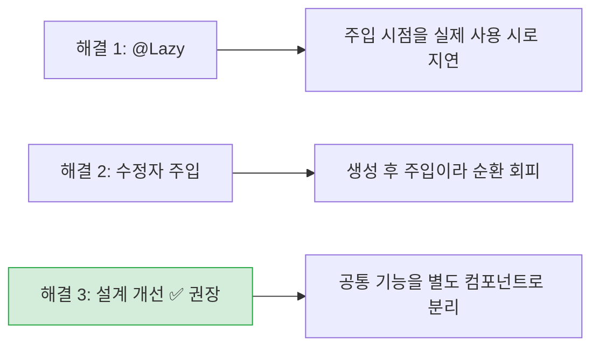

```java
// 방법 3 — 설계 개선 (가장 좋은 해결책)
@Component
public class Common {
    // A와 B가 공통으로 필요한 기능만 담당
    public void commonOperation() { ... }
}

@Component
public class A {
    @Autowired
    private Common common; // A → Common (순환 없음)
}

@Component
public class B {
    @Autowired
    private Common common; // B → Common (순환 없음)
}
```

### 시나리오 2: 같은 타입 빈 여러 개 — Map/List 주입

```java
// 여러 할인 정책을 동적으로 선택할 때
@Component
public class DiscountService {

    // 모든 DiscountPolicy 빈을 맵으로 주입
    private final Map<String, DiscountPolicy> policyMap;
    private final List<DiscountPolicy> policies;

    @Autowired
    public DiscountService(Map<String, DiscountPolicy> policyMap,
                          List<DiscountPolicy> policies) {
        this.policyMap = policyMap;   // {"rateDiscountPolicy": ..., "fixDiscountPolicy": ...}
        this.policies = policies;       // [RateDiscountPolicy, FixDiscountPolicy]
    }

    // 할인 코드에 따라 동적으로 정책 선택 — 전략 패턴
    public int discount(Member member, int price, String discountCode) {
        DiscountPolicy discountPolicy = policyMap.get(discountCode);
        if (discountPolicy == null) {
            throw new IllegalArgumentException("알 수 없는 할인 코드: " + discountCode);
        }
        return discountPolicy.discount(member, price);
    }
}
```

### 시나리오 3: 프로토타입 빈 메모리 누수

```java
// 잘못된 사용 — PrototypeBean이 싱글톤처럼 재사용됨
@Component
public class BadService {

    // 생성자 주입으로 1회만 주입됨 — Prototype의 의미가 없어짐!
    private final PrototypeBean prototypeBean;

    @Autowired
    public BadService(PrototypeBean prototypeBean) {
        this.prototypeBean = prototypeBean; // 이후 계속 같은 인스턴스 사용
    }
}

// 올바른 사용 — ObjectProvider로 매번 새 인스턴스
@Component
public class GoodService {

    private final ObjectProvider<PrototypeBean> provider;

    @Autowired
    public GoodService(ObjectProvider<PrototypeBean> provider) {
        this.provider = provider;
    }

    public void doSomething() {
        PrototypeBean bean = provider.getObject(); // 매 호출마다 새 인스턴스
        bean.doWork();
        // 사용 후 처리 책임은 개발자에게 (Spring이 소멸 관리 안 함)
    }
}
```

---

## 12. 전체 흐름 정리

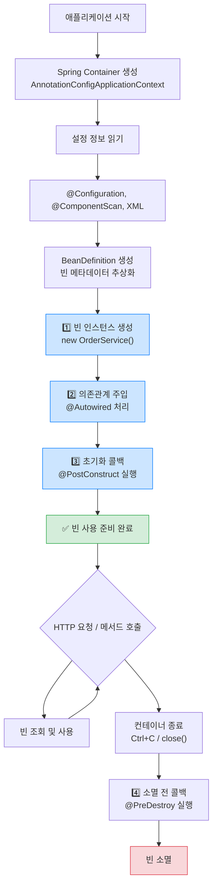

---

## 13. 핵심 포인트 정리

| 개념 | 설명 | 실무 포인트 |
|------|------|------------|
| IoC | 객체 생성/관리 제어권을 프레임워크에 위임 | `new`로 직접 생성하지 말 것 |
| DI | 필요한 의존관계를 외부에서 주입 | 생성자 주입 권장 |
| BeanFactory | 빈 관리 핵심 인터페이스 | 직접 사용 안 함 |
| ApplicationContext | BeanFactory + 부가 기능 | 항상 이것 사용 |
| Singleton | 기본 스코프, 하나의 인스턴스 | 상태(필드) 관리 주의 |
| Prototype | 요청마다 새 인스턴스, 소멸 미관리 | ObjectProvider 활용 |
| @PostConstruct | 의존관계 주입 완료 후 초기화 | 권장 초기화 방법 |
| @PreDestroy | 빈 소멸 전 정리 | 권장 소멸 방법 |
| @Qualifier | 같은 타입 빈 구분 | @Primary보다 명시적 |
| @Primary | 기본 빈 지정 | 전체 기본값 설정 시 |

Spring IoC/DI의 핵심은 "객체가 스스로 의존관계를 만들지 않고, 외부(컨테이너)가 주입해 준다"는 것입니다. 이를 통해 느슨한 결합, 테스트 용이성, 유연한 설계가 가능해집니다.
