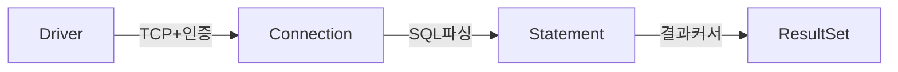
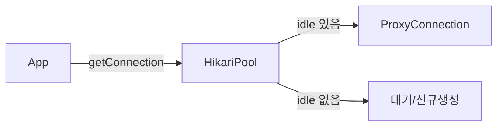
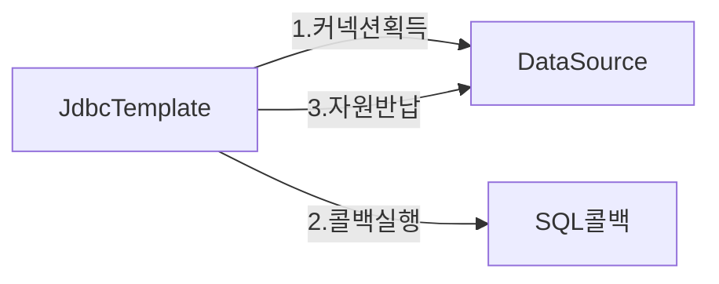
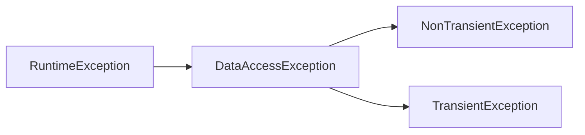
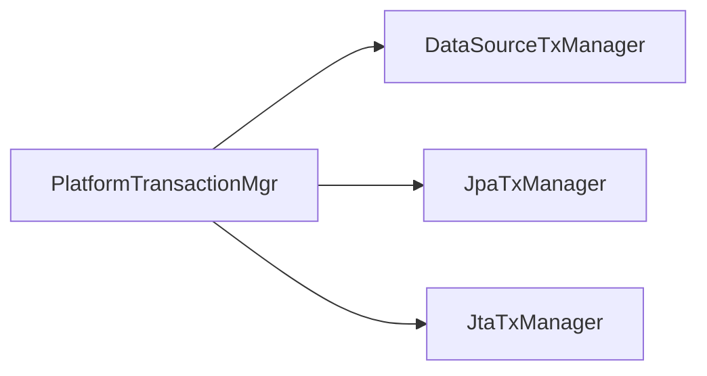
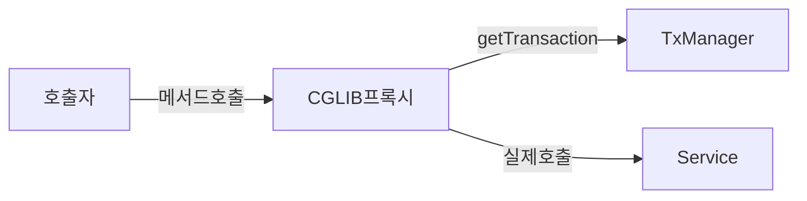
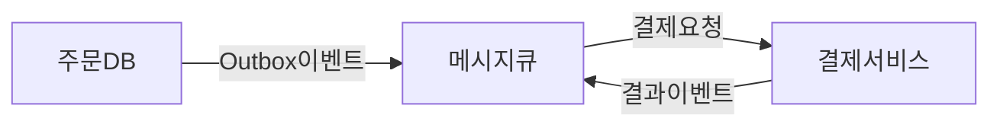
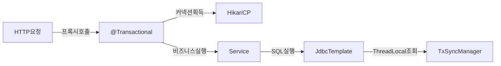

> **한 줄 요약:** Spring JDBC는 Driver→Connection→Statement→ResultSet이라는 JDBC 4단계 프로토콜을 JdbcTemplate 템플릿 메서드 패턴으로 감싸고, DataSourceTransactionManager와 ThreadLocal 동기화로 트랜잭션 경계를 비즈니스 로직에서 완전히 분리한다.

---

## 1. 비유 — 은행 창구와 공유 전화선

JDBC 연결을 이해하는 가장 좋은 비유는 은행 창구입니다. 손님(애플리케이션)이 창구(Connection)를 통해 금고(DB)에 접근합니다. 창구를 새로 만들 때마다 건물 공사가 필요하다면(DriverManager 직접 연결) 손님이 올 때마다 수십 분이 걸립니다. 대신 미리 10개 창구(HikariCP pool)를 열어두고 손님이 오면 즉시 배정하고 업무가 끝나면 반납하게 합니다.

트랜잭션은 "계좌 이체 전표"와 같습니다. A에서 100만 원을 빼고 B에게 입금하는 두 단계를 하나의 전표로 묶어, 두 단계 모두 성공해야 최종 승인(COMMIT)하고 하나라도 실패하면 전표 전체를 파기(ROLLBACK)합니다. 중간에 전산이 다운돼도 반만 처리된 상태는 있을 수 없습니다.

JDBC가 제공하는 4가지 핵심 객체 — Driver, Connection, Statement, ResultSet — 는 이 전표 처리의 각 단계를 담당합니다. Spring JdbcTemplate은 이 반복적인 전표 처리 절차를 표준화해서 개발자가 SQL과 비즈니스 로직에만 집중하게 만듭니다.

---

## 2. JDBC 내부 동작 원리

### 2.1 JDBC 4단계 프로토콜

JDBC(Java Database Connectivity)는 자바와 데이터베이스를 연결하는 표준 API입니다. 핵심은 4개의 인터페이스가 서로 협력하는 프로토콜에 있습니다.



각 단계가 왜 필요한지를 이해하는 것이 핵심입니다.

**Driver** — DB 벤더별 통신 구현체입니다. MySQL, Oracle, H2는 각자 다른 네트워크 프로토콜을 사용합니다. `com.mysql.cj.jdbc.Driver`는 MySQL Wire Protocol을 구현하고, `oracle.jdbc.OracleDriver`는 TNS 프로토콜을 구현합니다. `DriverManager.getConnection()`이 호출되면 등록된 드라이버 목록을 순회하며 URL 패턴을 인식하는 드라이버를 찾아 연결을 위임합니다.

**Connection** — TCP 소켓 + DB 세션입니다. 연결이 수립되는 순간 DB는 이 커넥션 전용 메모리(세션)를 할당하고, 트랜잭션 상태, 실행 컨텍스트, 임시 버퍼를 관리합니다. MySQL InnoDB 기준으로 커넥션 하나에 약 4~8MB 메모리가 사용됩니다.

**Statement / PreparedStatement** — SQL을 DB로 전송하는 통로입니다. `PreparedStatement`는 SQL을 먼저 파싱·컴파일해서 실행 계획을 캐시합니다. 같은 SQL을 100번 실행할 때 `Statement`는 100번 파싱하지만 `PreparedStatement`는 1번만 파싱합니다. 그리고 파라미터 바인딩으로 SQL Injection을 원천 차단합니다.

**ResultSet** — DB가 반환한 결과를 가리키는 커서(Cursor)입니다. 결과 전체를 메모리에 올리지 않고 `next()`로 한 행씩 읽습니다. `rs.close()` 전까지 DB와의 연결이 유지됩니다.

### 2.2 DriverManager 직접 사용 — 문제의 시작

```java
public class MemberRepositoryV0 {

    private static final String URL = "jdbc:mysql://localhost:3306/mydb";
    private static final String USERNAME = "user";
    private static final String PASSWORD = "pass";

    public Member save(Member member) throws SQLException {
        String sql = "INSERT INTO member(member_id, money) VALUES(?, ?)";

        Connection con = null;
        PreparedStatement pstmt = null;

        try {
            // 매번 새 TCP 연결 + DB 세션 생성 — 최소 수십ms
            con = DriverManager.getConnection(URL, USERNAME, PASSWORD);
            pstmt = con.prepareStatement(sql);
            pstmt.setString(1, member.getMemberId());
            pstmt.setInt(2, member.getMoney());
            pstmt.executeUpdate(); // INSERT/UPDATE/DELETE
            return member;

        } catch (SQLException e) {
            log.error("DB 오류", e);
            throw e;
        } finally {
            // ResultSet → Statement → Connection 역순으로 반드시 닫아야 함
            // 하나라도 실패하면 나머지 close()가 실행 안 될 위험
            closeQuietly(pstmt);
            closeQuietly(con);
        }
    }

    public Member findById(String memberId) throws SQLException {
        String sql = "SELECT * FROM member WHERE member_id = ?";

        Connection con = null;
        PreparedStatement pstmt = null;
        ResultSet rs = null;

        try {
            con = DriverManager.getConnection(URL, USERNAME, PASSWORD);
            pstmt = con.prepareStatement(sql);
            pstmt.setString(1, memberId);
            rs = pstmt.executeQuery(); // SELECT

            if (rs.next()) {
                Member member = new Member();
                member.setMemberId(rs.getString("member_id"));
                member.setMoney(rs.getInt("money"));
                return member;
            } else {
                throw new NoSuchElementException("member not found: " + memberId);
            }
        } finally {
            // rs가 닫히지 않으면 DB 커서가 계속 열린 채로 남음
            closeQuietly(rs);
            closeQuietly(pstmt);
            closeQuietly(con);
        }
    }

    private void closeQuietly(AutoCloseable resource) {
        if (resource != null) {
            try { resource.close(); }
            catch (Exception e) { log.warn("자원 닫기 실패", e); }
        }
    }
}
```

이 코드에는 구조적 문제가 세 가지 있습니다.

**성능 문제:** `DriverManager.getConnection()`은 매 호출마다 TCP 3-way handshake → DB 인증 → 세션 생성 과정을 거칩니다. MySQL 로컬 연결도 최소 1~5ms, 원격 연결은 10~50ms가 소요됩니다. 초당 100 요청을 처리하는 서비스에서 모든 쿼리마다 새 연결을 만들면 연결 오버헤드만으로 TPS의 절반이 날아갑니다.

**반복 코드:** try-catch-finally 블록, null 체크, 역순 close() 로직이 모든 메서드에서 복사됩니다. 새 메서드를 추가할 때마다 실수가 발생할 여지가 있습니다.

**예외 누출:** `throws SQLException`이 Repository에서 Service, Controller까지 전파됩니다. MySQL을 Oracle로 바꾸면 `getErrorCode()`가 달라지므로 비즈니스 로직 코드까지 수정해야 합니다.

---

## 3. DataSource — 커넥션 획득 추상화

### 3.1 DataSource 인터페이스의 의미

```java
// javax.sql.DataSource — JDBC 표준 인터페이스
public interface DataSource {
    Connection getConnection() throws SQLException;
    Connection getConnection(String username, String password) throws SQLException;
}
```

`DataSource`는 "어디서, 어떻게 커넥션을 가져오느냐"를 추상화합니다. 구현체는 세 종류입니다.

- `DriverManagerDataSource` — 매번 새 연결 생성. 테스트용.
- `HikariDataSource` — 커넥션풀에서 대여. 운영용.
- `EmbeddedDatabase` — 인메모리 H2/HSQLDB. 통합 테스트용.

```java
@Repository
@RequiredArgsConstructor
public class MemberRepositoryV1 {

    // 구현체에 의존하지 않음 — 테스트에서 H2, 운영에서 HikariCP 주입
    private final DataSource dataSource;

    public Member save(Member member) throws SQLException {
        String sql = "INSERT INTO member(member_id, money) VALUES(?, ?)";
        Connection con = null;
        PreparedStatement pstmt = null;
        try {
            con = dataSource.getConnection(); // 풀에서 대여 or 새 연결
            pstmt = con.prepareStatement(sql);
            pstmt.setString(1, member.getMemberId());
            pstmt.setInt(2, member.getMoney());
            pstmt.executeUpdate();
            return member;
        } finally {
            closeQuietly(pstmt);
            closeQuietly(con); // HikariCP라면 실제 종료가 아닌 풀 반납
        }
    }
}
```

HikariCP의 `con.close()`는 실제 TCP 연결을 끊지 않습니다. `ProxyConnection.close()`가 호출되어 커넥션을 풀의 idle 큐에 돌려놓습니다. 다음 `getConnection()` 호출자가 즉시 이 커넥션을 재사용합니다.

### 3.2 HikariCP 내부 동작 원리



HikariCP는 ConcurrentBag이라는 자료구조로 커넥션을 관리합니다. `getConnection()` 흐름은 다음과 같습니다.

1. 현재 스레드가 이전에 사용했던 커넥션이 있으면 우선 반환합니다(thread-local cache).
2. 없으면 공유 idle 큐에서 꺼냅니다.
3. 큐가 비어 있고 `maximum-pool-size` 미만이면 새 커넥션을 생성합니다.
4. `maximum-pool-size`에 도달했으면 `connection-timeout`(기본 30초) 동안 대기합니다.
5. 타임아웃 초과 시 `SQLTimeoutException`을 던집니다.

```yaml
spring:
  datasource:
    url: jdbc:mysql://localhost:3306/mydb?useSSL=false&serverTimezone=Asia/Seoul&characterEncoding=UTF-8&rewriteBatchedStatements=true
    username: ${DB_USERNAME}
    password: ${DB_PASSWORD}
    driver-class-name: com.mysql.cj.jdbc.Driver
    hikari:
      pool-name: MyHikariPool
      minimum-idle: 5
      # (CPU 코어 수 × 2) + 디스크 수 가 출발점. SSD 환경에서는 보통 10~20
      maximum-pool-size: 10
      # 풀이 꽉 찼을 때 최대 대기 시간. 운영에서는 5000ms 이하로 fast-fail
      connection-timeout: 5000
      # 유휴 커넥션을 풀에서 제거하는 시간. minimum-idle보다 큰 커넥션에만 적용
      idle-timeout: 600000
      # 커넥션 최대 수명. DB의 wait_timeout보다 반드시 짧아야 함
      max-lifetime: 1800000
      # 방화벽/LB가 유휴 연결을 끊기 전에 keepalive 쿼리 전송
      keepalive-time: 60000
```

**max-lifetime이 DB wait_timeout보다 짧아야 하는 이유:** DB가 유휴 연결을 서버 측에서 끊으면 풀은 이를 즉시 알지 못합니다. 풀이 죽은 커넥션을 대여해주면 첫 쿼리에서 `CommunicationsException`이 발생합니다. `max-lifetime`을 `wait_timeout`보다 짧게 설정하면 HikariCP가 먼저 커넥션을 정리하므로 이 문제를 원천 차단할 수 있습니다.

---

## 4. JdbcTemplate — 템플릿 메서드 패턴으로 반복 제거

### 4.1 JdbcTemplate이 하는 일

`JdbcTemplate`은 GoF 디자인 패턴 중 **템플릿 메서드 패턴**을 JDBC에 적용한 결과입니다. 변하지 않는 코드(커넥션 획득, PreparedStatement 생성, 예외 처리, 자원 반납)는 템플릿이 담당하고, 변하는 부분(SQL, 파라미터 바인딩, 결과 매핑)만 콜백으로 위임합니다.



`JdbcTemplate.update()` 내부를 추적하면 다음 흐름입니다.

```
JdbcTemplate.update(sql, args)
  → execute(PreparedStatementCreator psc, PreparedStatementCallback<T> action)
    → con = DataSourceUtils.getConnection(obtainDataSource())  // 트랜잭션 동기화 고려
    → pstmt = psc.createPreparedStatement(con)
    → action.doInPreparedStatement(pstmt)  // 여기서 실제 SQL 실행
    → finally: JdbcUtils.closeStatement(stmt)
                DataSourceUtils.releaseConnection(con, ds)    // 반납 or 동기화 유지
```

핵심은 `DataSourceUtils.getConnection()`과 `DataSourceUtils.releaseConnection()`입니다. 이 두 메서드가 트랜잭션 동기화 매니저(`TransactionSynchronizationManager`)를 조회해서, 현재 스레드에 이미 바인딩된 커넥션이 있으면 그것을 재사용합니다. `@Transactional` 메서드 안에서 JdbcTemplate을 여러 번 호출해도 모두 같은 커넥션을 쓰는 이유가 여기에 있습니다.

### 4.2 JdbcTemplate CRUD 전체 예제

```java
@Repository
@RequiredArgsConstructor
public class MemberJdbcTemplateRepository {

    private final JdbcTemplate jdbcTemplate;

    // INSERT — update() 메서드 사용
    public Member save(Member member) {
        String sql = "INSERT INTO member(member_id, money) VALUES(?, ?)";
        jdbcTemplate.update(sql, member.getMemberId(), member.getMoney());
        return member;
    }

    // INSERT — KeyHolder로 auto_increment PK 획득
    public Member saveAndGetKey(Member member) {
        String sql = "INSERT INTO member(member_id, money) VALUES(?, ?)";
        KeyHolder keyHolder = new GeneratedKeyHolder();

        jdbcTemplate.update(connection -> {
            PreparedStatement ps = connection.prepareStatement(sql,
                Statement.RETURN_GENERATED_KEYS);
            ps.setString(1, member.getMemberId());
            ps.setInt(2, member.getMoney());
            return ps;
        }, keyHolder);

        long generatedId = keyHolder.getKey().longValue();
        member.setId(generatedId);
        return member;
    }

    // SELECT 단건 — queryForObject() + RowMapper
    public Member findById(String memberId) {
        String sql = "SELECT member_id, money FROM member WHERE member_id = ?";
        return jdbcTemplate.queryForObject(sql, memberRowMapper(), memberId);
        // 결과 없으면 EmptyResultDataAccessException (NoSuchElementException 아님!)
        // 결과 2개 이상이면 IncorrectResultSizeDataAccessException
    }

    // SELECT 다건 — query() + RowMapper
    public List<Member> findAll() {
        String sql = "SELECT member_id, money FROM member ORDER BY member_id";
        return jdbcTemplate.query(sql, memberRowMapper());
    }

    // SELECT 특정 컬럼 단일값 — queryForObject() + 타입 클래스
    public int countAll() {
        String sql = "SELECT COUNT(*) FROM member";
        return jdbcTemplate.queryForObject(sql, Integer.class);
    }

    // UPDATE
    public void update(String memberId, int money) {
        String sql = "UPDATE member SET money = ? WHERE member_id = ?";
        int affected = jdbcTemplate.update(sql, money, memberId);
        if (affected == 0) {
            throw new NoSuchElementException("member not found: " + memberId);
        }
    }

    // DELETE
    public void delete(String memberId) {
        String sql = "DELETE FROM member WHERE member_id = ?";
        jdbcTemplate.update(sql, memberId);
    }

    // RowMapper — ResultSet 한 행을 객체로 변환하는 콜백
    private RowMapper<Member> memberRowMapper() {
        return (rs, rowNum) -> {
            Member member = new Member();
            member.setMemberId(rs.getString("member_id"));
            member.setMoney(rs.getInt("money"));
            return member;
        };
    }
}
```

### 4.3 RowMapper vs ResultSetExtractor

`RowMapper`와 `ResultSetExtractor`는 결과 매핑 콜백의 두 가지 형태입니다.

```java
// RowMapper: JdbcTemplate이 rs.next() 루프를 담당, 개발자는 행 하나만 처리
RowMapper<Member> rowMapper = (rs, rowNum) -> {
    return new Member(rs.getString("member_id"), rs.getInt("money"));
};

// ResultSetExtractor: ResultSet 전체를 직접 순회. 복잡한 매핑(1:N 조인 결과 등)에 적합
ResultSetExtractor<List<OrderWithItems>> extractor = rs -> {
    Map<Long, OrderWithItems> map = new LinkedHashMap<>();
    while (rs.next()) {
        Long orderId = rs.getLong("order_id");
        OrderWithItems order = map.computeIfAbsent(orderId, id ->
            new OrderWithItems(id, rs.getString("order_name"))
        );
        // ORDER JOIN ITEM 결과에서 같은 orderId인 행들을 하나의 객체로 합치기
        Long itemId = rs.getLong("item_id");
        if (itemId != null && itemId > 0) {
            order.addItem(new Item(itemId, rs.getString("item_name")));
        }
    }
    return new ArrayList<>(map.values());
};

List<OrderWithItems> result = jdbcTemplate.query(
    "SELECT o.order_id, o.order_name, i.item_id, i.item_name " +
    "FROM orders o LEFT JOIN order_items i ON o.order_id = i.order_id",
    extractor
);
```

`RowMapper`는 JdbcTemplate이 루프를 제어하므로 행 순서가 보장됩니다. `ResultSetExtractor`는 개발자가 직접 `rs.next()`를 호출하므로 1:N 관계를 하나의 쿼리로 조립할 때 사용합니다. JPA의 `@OneToMany` 페치가 N+1 문제를 일으킬 때 JdbcTemplate + ResultSetExtractor 조합으로 단일 쿼리로 해결하는 패턴이 실무에서 자주 쓰입니다.

### 4.4 BeanPropertyRowMapper — 리플렉션 기반 자동 매핑

```java
// 컬럼명과 필드명이 스네이크_케이스 ↔ 카멜케이스 자동 변환
// member_id → memberId, created_at → createdAt
RowMapper<Member> autoMapper = BeanPropertyRowMapper.newInstance(Member.class);

// 단, 주의사항:
// 1. 기본 생성자 필수 (리플렉션으로 인스턴스 생성)
// 2. setter 필수 (리플렉션으로 필드 주입)
// 3. 컬럼명과 필드명 매핑이 맞지 않으면 null
// 4. 리플렉션 오버헤드 — 고성능이 필요하면 람다 RowMapper 직접 작성
public List<Member> findAllWithAutoMapper() {
    return jdbcTemplate.query(
        "SELECT member_id, money FROM member",
        BeanPropertyRowMapper.newInstance(Member.class)
    );
}
```

---

## 5. NamedParameterJdbcTemplate — 이름 기반 파라미터

### 5.1 왜 필요한가

`JdbcTemplate`의 `?` 방식은 파라미터가 많아지면 위치를 틀리기 쉽습니다.

```java
// ? 방식 — 순서가 틀리면 조용한 버그 발생
jdbcTemplate.update(
    "UPDATE member SET money = ?, name = ?, email = ? WHERE member_id = ?",
    money, name, email, memberId  // 순서 하나만 틀려도 데이터가 잘못 저장됨
);
```

`NamedParameterJdbcTemplate`은 `:파라미터명` 으로 위치 대신 이름을 씁니다.

```java
@Repository
@RequiredArgsConstructor
public class MemberNamedJdbcRepository {

    // NamedParameterJdbcTemplate은 내부적으로 JdbcTemplate을 래핑
    private final NamedParameterJdbcTemplate namedJdbcTemplate;

    public Member save(Member member) {
        String sql = "INSERT INTO member(member_id, money) VALUES(:memberId, :money)";

        // SqlParameterSource 방식 1: Map
        MapSqlParameterSource params = new MapSqlParameterSource()
            .addValue("memberId", member.getMemberId())
            .addValue("money", member.getMoney());

        namedJdbcTemplate.update(sql, params);
        return member;
    }

    // SqlParameterSource 방식 2: BeanPropertySqlParameterSource
    // 객체 필드명을 자동으로 파라미터명으로 매핑
    public Member saveWithBean(Member member) {
        String sql = "INSERT INTO member(member_id, money) VALUES(:memberId, :money)";

        // member.getMemberId() → :memberId 자동 연결
        BeanPropertySqlParameterSource params = new BeanPropertySqlParameterSource(member);
        namedJdbcTemplate.update(sql, params);
        return member;
    }

    // IN 절에 컬렉션 직접 바인딩 — ? 방식으로는 불가능
    public List<Member> findByIds(List<String> memberIds) {
        String sql = "SELECT member_id, money FROM member WHERE member_id IN (:memberIds)";
        Map<String, Object> params = Map.of("memberIds", memberIds);
        return namedJdbcTemplate.query(sql, params,
            BeanPropertyRowMapper.newInstance(Member.class));
        // JdbcTemplate이라면 IN (?,?,?) 를 memberIds.size()만큼 직접 만들어야 함
    }

    public Member findById(String memberId) {
        String sql = "SELECT member_id, money FROM member WHERE member_id = :memberId";
        Map<String, Object> params = Map.of("memberId", memberId);
        return namedJdbcTemplate.queryForObject(sql, params,
            BeanPropertyRowMapper.newInstance(Member.class));
    }
}
```

### 5.2 NamedParameterJdbcTemplate 내부 변환 원리

`NamedParameterJdbcTemplate`은 `:파라미터명` SQL을 실제 실행 전에 `?` SQL로 변환합니다. `ParsedSql` 파서가 SQL 문자열을 파싱해서 파라미터 위치와 이름을 추출하고, `BindMarkersFactory`가 DB 방언에 맞는 `?`로 치환합니다. 변환된 SQL과 순서에 맞는 파라미터 배열이 내부 `JdbcTemplate`으로 전달됩니다. 성능 오버헤드는 SQL 파싱뿐이며, 반복 실행 시에는 `ParsedSql` 캐시가 적용됩니다.

---

## 6. SimpleJdbcInsert / SimpleJdbcCall

### 6.1 SimpleJdbcInsert — 메타데이터 기반 INSERT

```java
@Repository
public class MemberSimpleInsertRepository {

    private final SimpleJdbcInsert simpleInsert;

    // DataSource에서 테이블 메타데이터를 읽어 컬럼 정보를 자동 파악
    public MemberSimpleInsertRepository(DataSource dataSource) {
        this.simpleInsert = new SimpleJdbcInsert(dataSource)
            .withTableName("member")
            .usingGeneratedKeyColumns("id") // auto_increment PK 컬럼
            .usingColumns("member_id", "money"); // INSERT 대상 컬럼 명시
    }

    public Member save(Member member) {
        SqlParameterSource params = new BeanPropertySqlParameterSource(member);
        Number key = simpleInsert.executeAndReturnKey(params);
        member.setId(key.longValue());
        return member;
    }

    // Map으로도 가능
    public void saveWithMap(String memberId, int money) {
        Map<String, Object> params = new HashMap<>();
        params.put("member_id", memberId);
        params.put("money", money);
        simpleInsert.execute(params);
    }
}
```

`SimpleJdbcInsert`가 편리한 이유는 `DatabaseMetaData`를 통해 테이블 컬럼 정보를 자동으로 읽기 때문입니다. `usingColumns()`를 생략하면 테이블의 모든 컬럼을 대상으로 INSERT합니다. 단, 초기화 시점에 메타데이터 쿼리가 발생하므로 애플리케이션 기동 시 한 번만 생성해서 재사용해야 합니다.

### 6.2 SimpleJdbcCall — 저장 프로시저 호출

```java
@Repository
public class StoredProcedureRepository {

    private final SimpleJdbcCall calcInterestCall;

    public StoredProcedureRepository(DataSource dataSource) {
        this.calcInterestCall = new SimpleJdbcCall(dataSource)
            .withProcedureName("calc_interest")
            .declareParameters(
                new SqlParameter("p_member_id", Types.VARCHAR),
                new SqlParameter("p_rate", Types.DECIMAL),
                new SqlOutParameter("p_interest", Types.INTEGER)
            );
    }

    public int calculateInterest(String memberId, double rate) {
        Map<String, Object> params = Map.of(
            "p_member_id", memberId,
            "p_rate", rate
        );
        Map<String, Object> result = calcInterestCall.execute(params);
        return (Integer) result.get("p_interest");
    }
}
```

---

## 7. Spring 예외 추상화 — DataAccessException 계층

### 7.1 벤더 종속 예외의 문제

순수 JDBC를 쓰면 DB별로 에러 코드가 다릅니다.

```java
// 중복 키 에러 코드
// MySQL:  1062
// Oracle: 1 (ORA-00001)
// H2:     23505
// PostgreSQL: 23505

// 벤더 종속 코드 — DB 교체 시 전면 수정 필요
catch (SQLException e) {
    if (e.getErrorCode() == 1062) { // MySQL만 동작
        throw new DuplicateMemberException();
    }
}
```

### 7.2 DataAccessException 계층 구조



Spring은 `SQLExceptionTranslator`를 통해 `SQLException`을 `DataAccessException` 하위 예외로 자동 변환합니다.

주요 예외 클래스는 다음과 같습니다.

| 예외 클래스 | 발생 원인 | 재시도 가능 |
|---|---|---|
| `DuplicateKeyException` | PK/UK 중복 (MySQL 1062, Oracle 1) | 아니오 |
| `DataIntegrityViolationException` | FK 위반, NOT NULL 위반 | 아니오 |
| `BadSqlGrammarException` | SQL 문법 오류 | 아니오 |
| `QueryTimeoutException` | 쿼리 타임아웃 | 예 |
| `CannotAcquireLockException` | 락 획득 실패 (데드락) | 예 |
| `TransientDataAccessException` | 네트워크 장애, DB 일시적 오류 | 예 |
| `EmptyResultDataAccessException` | queryForObject 결과 없음 | 아니오 |

### 7.3 SQLExceptionTranslator 동작 방식

```java
// Spring이 DataSource 빈 등록 시 자동으로 구성하는 변환기
// SQLErrorCodeSQLExceptionTranslator: sql-error-codes.xml에 벤더별 에러코드 → 예외 매핑
// SQLStateSQLExceptionTranslator: SQLSTATE 표준 코드 기반 fallback

@Repository
@RequiredArgsConstructor
public class MemberRepository {

    private final JdbcTemplate jdbcTemplate;

    public void save(Member member) {
        try {
            jdbcTemplate.update(
                "INSERT INTO member(member_id, money) VALUES(?, ?)",
                member.getMemberId(), member.getMoney()
            );
        } catch (DuplicateKeyException e) {
            // MySQL이든 Oracle이든 H2든 항상 DuplicateKeyException
            // DB 교체해도 이 코드는 변경 불필요
            throw new MemberAlreadyExistsException(member.getMemberId(), e);
        }
        // 다른 SQLException은 JdbcTemplate이 DataAccessException으로 변환
        // throws SQLException 없음 — 서비스 계층이 JDBC에 무관
    }

    // 수동으로 예외 변환이 필요한 경우 (JdbcTemplate 밖에서 JDBC 직접 사용 시)
    @Autowired
    private SQLExceptionTranslator exTranslator;

    public void manualSave(Member member) throws SQLException {
        try {
            // ... 직접 JDBC 코드 ...
        } catch (SQLException e) {
            // DataAccessException으로 수동 변환
            throw exTranslator.translate("save", "INSERT INTO ...", e);
        }
    }
}
```

`DataAccessException`이 `RuntimeException`을 상속하는 이유는 체크 예외 강제가 코드를 오염시키기 때문입니다. JDBC `SQLException`은 체크 예외라서 모든 메서드에 `throws SQLException`이 전파됩니다. Spring은 이를 언체크 예외로 바꿔서 처리하고 싶은 계층에서만 잡게 합니다.

---

## 8. 트랜잭션 관리 — DataSourceTransactionManager

### 8.1 트랜잭션 없을 때의 문제

```java
// 계좌 이체 — 트랜잭션 없는 경우
@Service
@RequiredArgsConstructor
public class MemberServiceV0 {

    private final MemberRepository memberRepository;

    public void transfer(String fromId, String toId, int money) {
        Member from = memberRepository.findById(fromId);
        Member to = memberRepository.findById(toId);

        // 1단계: A 계좌 차감 — 새 커넥션으로 실행 후 자동 커밋
        memberRepository.update(fromId, from.getMoney() - money);

        // 여기서 NullPointerException, 네트워크 오류, 서버 다운 발생!

        // 2단계: B 계좌 증가 — 영원히 실행되지 않음
        memberRepository.update(toId, to.getMoney() + money);

        // 결과: A에서 돈은 빠졌고 B에는 입금 안 됨
    }
}
```

이 문제의 근본 원인은 두 `update()` 호출이 각각 다른 커넥션에서 실행되어 서로 다른 트랜잭션에 속하기 때문입니다. 1단계가 성공하면 즉시 커밋(autoCommit=true 기본값)됩니다.

### 8.2 JDBC 수동 트랜잭션

```java
@Service
@RequiredArgsConstructor
public class MemberServiceV1 {

    private final DataSource dataSource;
    private final MemberRepository memberRepository;

    public void transfer(String fromId, String toId, int money) throws SQLException {
        Connection con = dataSource.getConnection();
        try {
            con.setAutoCommit(false); // 트랜잭션 시작

            // 같은 Connection으로 두 UPDATE를 실행해야 같은 트랜잭션
            // → Repository가 Connection을 파라미터로 받아야 함
            Member from = memberRepository.findById(con, fromId);
            Member to = memberRepository.findById(con, toId);

            memberRepository.update(con, fromId, from.getMoney() - money);
            validate(to); // 검증 실패 시 예외 발생
            memberRepository.update(con, toId, to.getMoney() + money);

            con.commit(); // 정상 완료
        } catch (Exception e) {
            con.rollback(); // 실패 시 원상 복구
            throw new IllegalStateException(e);
        } finally {
            con.setAutoCommit(true); // 풀 반납 전 autoCommit 복원 (필수!)
            con.close(); // 풀에 반납
        }
    }
}
```

`autoCommit(true)` 복원이 중요한 이유: HikariCP는 커넥션을 재사용합니다. `autoCommit=false` 상태로 반납된 커넥션을 다음 사용자가 받으면, 명시적 커밋 없이 실행한 모든 SQL이 자동으로 묶입니다. 이전 트랜잭션의 잔여 상태가 다음 요청을 오염시킵니다.

하지만 이 방법은 Repository 메서드 시그니처에 `Connection`이 노출됩니다. JPA로 전환하면 `Connection`이 아닌 `EntityManager`를 써야 하므로 Repository를 전면 수정해야 합니다.

### 8.3 PlatformTransactionManager — 트랜잭션 추상화



```java
// 트랜잭션 관리 인터페이스 — 기술에 무관한 추상화
public interface PlatformTransactionManager extends TransactionManager {
    TransactionStatus getTransaction(TransactionDefinition definition)
        throws TransactionException;
    void commit(TransactionStatus status) throws TransactionException;
    void rollback(TransactionStatus status) throws TransactionException;
}
```

```java
@Service
@RequiredArgsConstructor
public class MemberServiceV2 {

    // JDBC → JPA 전환 시 이 의존성만 교체, 서비스 코드 변경 없음
    private final PlatformTransactionManager transactionManager;
    private final MemberRepository memberRepository;

    public void transfer(String fromId, String toId, int money) {
        // 트랜잭션 시작 (내부적으로 con.setAutoCommit(false) 실행)
        TransactionStatus status = transactionManager.getTransaction(
            new DefaultTransactionDefinition()
        );

        try {
            Member from = memberRepository.findById(fromId);
            Member to = memberRepository.findById(toId);

            memberRepository.update(fromId, from.getMoney() - money);
            validate(to);
            memberRepository.update(toId, to.getMoney() + money);

            transactionManager.commit(status); // 정상 완료
        } catch (Exception e) {
            transactionManager.rollback(status); // 실패 시 롤백
            throw new IllegalStateException(e);
        }
    }
}
```

### 8.4 트랜잭션 동기화 매니저 — ThreadLocal 원리

같은 트랜잭션 내에서 Repository를 여러 번 호출해도 같은 커넥션을 써야 합니다. Spring은 `TransactionSynchronizationManager`로 이를 해결합니다.

```java
// TransactionSynchronizationManager 핵심 동작 (단순화)
public abstract class TransactionSynchronizationManager {

    // 스레드별로 독립된 Map — 스레드A의 커넥션이 스레드B에 노출되지 않음
    private static final ThreadLocal<Map<Object, Object>> resources =
        new NamedThreadLocal<>("Transactional resources");

    // 커넥션 등록 (트랜잭션 시작 시 호출)
    public static void bindResource(Object key, Object value) {
        resources.get().put(key, value); // DataSource를 키로, Connection을 값으로
    }

    // 커넥션 조회 (Repository에서 커넥션 요청 시)
    public static Object getResource(Object key) {
        return resources.get().get(key);
    }
}

// DataSourceUtils.getConnection() 내부 동작
public static Connection getConnection(DataSource dataSource) throws CannotGetJdbcConnectionException {
    ConnectionHolder conHolder = (ConnectionHolder)
        TransactionSynchronizationManager.getResource(dataSource);

    if (conHolder != null && conHolder.hasConnection()) {
        // 트랜잭션이 시작됐다면 기존 커넥션 반환 (같은 트랜잭션 유지)
        return conHolder.getConnection();
    }
    // 트랜잭션이 없으면 새 커넥션 획득
    return dataSource.getConnection();
}
```

이 메커니즘 덕분에 Repository는 `Connection`을 파라미터로 받을 필요가 없습니다. JdbcTemplate 내부의 `DataSourceUtils.getConnection()`이 자동으로 현재 트랜잭션의 커넥션을 찾아옵니다.

---

## 9. @Transactional — 선언적 트랜잭션

### 9.1 AOP 프록시 동작 원리

`@Transactional`은 스프링 AOP가 Bean을 생성할 때 CGLIB 프록시 클래스를 자동 생성합니다.



```java
// Spring이 생성하는 CGLIB 프록시의 개념적 코드
class MemberService$$SpringCGLIB extends MemberService {

    @Override
    public void transfer(String fromId, String toId, int money) {
        // 1. 트랜잭션 시작
        TransactionStatus status = transactionManager.getTransaction(txDefinition);
        try {
            // 2. 실제 메서드 호출 (상위 클래스 = 원본 MemberService)
            super.transfer(fromId, toId, money);
            // 3. 정상 완료 → 커밋
            transactionManager.commit(status);
        } catch (RuntimeException | Error e) {
            // 4. RuntimeException, Error → 롤백
            transactionManager.rollback(status);
            throw e;
        } catch (Exception e) {
            // 5. 체크 예외 → 기본적으로 커밋 (주의!)
            transactionManager.commit(status);
            throw e;
        }
    }
}
```

```java
@Service
@RequiredArgsConstructor
public class MemberService {

    private final MemberRepository memberRepository;

    // 선언적 트랜잭션 — 비즈니스 로직만 남음
    @Transactional
    public void transfer(String fromId, String toId, int money) {
        Member from = memberRepository.findById(fromId);
        Member to = memberRepository.findById(toId);

        memberRepository.update(fromId, from.getMoney() - money);
        validate(to);
        memberRepository.update(toId, to.getMoney() + money);
    }

    // 읽기 전용 트랜잭션 — 최적화 힌트
    // JPA: 스냅샷 저장 생략, 변경 감지 미실행 → 성능 향상
    // MySQL: 복제 환경에서 Slave DB로 라우팅 가능
    @Transactional(readOnly = true)
    public Member findById(String memberId) {
        return memberRepository.findById(memberId);
    }
}
```

### 9.2 @Transactional 적용 규칙과 주의사항

**Private 메서드에 적용 불가:**

```java
@Service
public class OrderService {

    @Transactional
    public void createOrder(Order order) {
        // 정상 — 프록시가 이 메서드를 가로챔
        internalProcess(order); // 같은 클래스 내부 호출
    }

    @Transactional // 아무 효과 없음!
    private void internalProcess(Order order) {
        // 프록시를 거치지 않고 직접 호출됨
        // 이 메서드의 @Transactional은 무시됨
    }
}
```

CGLIB 프록시는 `OrderService`를 상속한 서브클래스입니다. `createOrder()`에서 `internalProcess()`를 호출할 때 `this.internalProcess()`로 자기 자신을 직접 호출하므로 프록시를 우회합니다. 해결책은 `internalProcess`를 다른 빈으로 분리하거나 `ApplicationContext`에서 자기 자신을 주입받는 방법입니다.

**인터페이스 vs 클래스 기반 프록시:**

Spring Boot는 기본적으로 CGLIB(클래스 기반) 프록시를 사용합니다. `@Transactional`을 인터페이스에 붙이면 CGLIB 프록시에서 인식하지 못할 수 있으므로 구체 클래스 메서드에 붙이는 것이 안전합니다.

### 9.3 트랜잭션 전파(Propagation) 심화

```java
@Service
public class OrderService {

    @Transactional
    public void createOrder(Order order) {
        orderRepository.save(order);           // 같은 트랜잭션 TX1
        paymentService.processPayment(order);  // REQUIRED → TX1 참여
        auditService.logEvent("ORDER_CREATED"); // REQUIRES_NEW → TX2 별도
    }
}

@Service
public class PaymentService {

    @Transactional(propagation = Propagation.REQUIRED)
    public void processPayment(Order order) {
        // TX1에 참여 중
        // processPayment에서 예외 발생 → TX1 전체 롤백
        // createOrder에서 저장한 order도 함께 롤백
        paymentRepository.save(Payment.from(order));
    }
}

@Service
public class AuditService {

    @Transactional(propagation = Propagation.REQUIRES_NEW)
    public void logEvent(String event) {
        // TX1을 일시 중단하고 TX2를 새로 시작
        // TX2가 커밋되면 TX1 재개
        // logEvent에서 예외 발생해도 TX1에 영향 없음
        // TX1이 롤백돼도 TX2는 이미 커밋됨 → 감사 로그는 남음
        auditRepository.save(new AuditLog(event));
    }
}
```

전파 레벨 선택 기준을 정리하면 다음과 같습니다.

| 전파 레벨 | 동작 | 사용 사례 |
|---|---|---|
| `REQUIRED` (기본) | 기존 TX 참여, 없으면 새로 생성 | 일반 비즈니스 로직 |
| `REQUIRES_NEW` | 기존 TX 중단, 새 TX 시작 | 감사 로그, 독립 이벤트 저장 |
| `SUPPORTS` | TX 있으면 참여, 없어도 실행 | 읽기 전용 조회 |
| `NOT_SUPPORTED` | 기존 TX 중단, 비트랜잭션 실행 | 배치 대용량 처리 |
| `MANDATORY` | 반드시 기존 TX 안에서 실행 | 내부 전용 메서드 보호 |
| `NEVER` | TX 있으면 예외 | 트랜잭션 금지 구역 |
| `NESTED` | 중첩 트랜잭션(Savepoint) | 부분 롤백 |

### 9.4 롤백 규칙 — 체크 예외의 함정

```java
// 기본 규칙: RuntimeException/Error → 롤백, CheckedException → 커밋

@Transactional
public void dangerousMethod() throws IOException {
    orderRepository.save(order);   // 저장
    throw new IOException("파일 읽기 실패"); // CheckedException → 커밋!
    // order가 DB에 영구 저장됨 — 의도하지 않은 동작
}

// 체크 예외도 롤백하려면
@Transactional(rollbackFor = IOException.class)
public void safeSave() throws IOException {
    orderRepository.save(order);
    throw new IOException("파일 읽기 실패"); // 이제 롤백됨
}

// RuntimeException이지만 롤백 방지 (비즈니스 예외로 커밋 유지)
@Transactional(noRollbackFor = InsufficientBalanceException.class)
public void transferWithRecord() {
    transferLog.save(log); // 이체 시도 기록 커밋 유지
    throw new InsufficientBalanceException("잔액 부족"); // 롤백 안 함
}
```

체크 예외가 기본적으로 커밋되는 이유는 Java 설계 철학과 관련이 있습니다. 체크 예외는 "복구 가능한 상황"을 나타내도록 설계되었습니다. `FileNotFoundException`이 발생해도 DB 작업은 정상이라는 관점입니다. 하지만 Spring 에코시스템은 런타임 예외 중심으로 이동했고, 실무에서는 `rollbackFor = Exception.class`를 팀 표준으로 정하는 경우가 많습니다.

### 9.5 격리 수준(Isolation Level)

```java
// DB 기본값 사용 (권장 — DB 설정을 따름)
@Transactional
public void defaultIsolation() { }

// MySQL InnoDB 기본: REPEATABLE_READ
@Transactional(isolation = Isolation.REPEATABLE_READ)
public void repeatableRead() { }

// Oracle, PostgreSQL 기본: READ_COMMITTED
@Transactional(isolation = Isolation.READ_COMMITTED)
public void readCommitted() { }
```

| 격리 수준 | Dirty Read | Non-Repeatable Read | Phantom Read | 성능 |
|---|---|---|---|---|
| `READ_UNCOMMITTED` | 가능 | 가능 | 가능 | 최고 |
| `READ_COMMITTED` | 방지 | 가능 | 가능 | 높음 |
| `REPEATABLE_READ` | 방지 | 방지 | 가능 (InnoDB는 MVCC로 방지) | 중간 |
| `SERIALIZABLE` | 방지 | 방지 | 방지 | 최저 |

InnoDB가 `REPEATABLE_READ`에서 Phantom Read를 방지하는 방법: 일반 `SELECT`는 트랜잭션 시작 시점의 MVCC 스냅샷을 읽습니다. 트랜잭션 도중 다른 트랜잭션이 새 행을 추가해도 스냅샷에 없으므로 보이지 않습니다. 단, `SELECT ... FOR UPDATE`는 현재 버전을 Gap Lock으로 잠가서 새 행 삽입 자체를 차단합니다.

---

## 10. DataSourceTransactionManager 내부 동작 추적

`@Transactional`이 선언된 메서드가 호출될 때 내부에서 일어나는 일을 코드 수준으로 추적합니다.

```
1. CGLIB 프록시 → TransactionInterceptor.invoke()
2. TransactionAspectSupport.invokeWithinTransaction()
3. PlatformTransactionManager.getTransaction(txDefinition)
   └─ DataSourceTransactionManager.doBegin()
      ├─ con = dataSource.getConnection()       // HikariCP에서 대여
      ├─ con.setAutoCommit(false)               // 트랜잭션 시작
      └─ TransactionSynchronizationManager
             .bindResource(dataSource, conHolder) // ThreadLocal에 바인딩

4. 실제 Service 메서드 실행
   └─ JdbcTemplate.update()
      └─ DataSourceUtils.getConnection(dataSource)
         └─ TransactionSynchronizationManager
                .getResource(dataSource)         // ThreadLocal에서 조회 → 기존 con 반환

5. 성공 시: DataSourceTransactionManager.doCommit()
   └─ con.commit()

6. 실패 시: DataSourceTransactionManager.doRollback()
   └─ con.rollback()

7. DataSourceTransactionManager.doCleanupAfterCompletion()
   ├─ TransactionSynchronizationManager
          .unbindResource(dataSource)            // ThreadLocal에서 제거
   ├─ con.setAutoCommit(true)                   // autoCommit 복원
   └─ con.close()                               // 풀에 반납
```

이 흐름을 이해하면 "왜 같은 트랜잭션 내에서 여러 Repository가 같은 커넥션을 쓰는가", "왜 트랜잭션 외부에서 JdbcTemplate을 호출하면 각 쿼리가 별도 커넥션을 쓰는가"를 설명할 수 있습니다.

---

## 11. 배치 처리 — batchUpdate()

```java
@Service
@RequiredArgsConstructor
public class BulkMemberService {

    private final JdbcTemplate jdbcTemplate;
    private final NamedParameterJdbcTemplate namedJdbcTemplate;

    // 대량 INSERT — 한 번의 네트워크 왕복으로 여러 행 삽입
    @Transactional
    public void bulkSave(List<Member> members) {
        String sql = "INSERT INTO member(member_id, money) VALUES(?, ?)";

        // BatchPreparedStatementSetter: 각 인덱스에 대한 파라미터 설정
        int[] results = jdbcTemplate.batchUpdate(sql,
            new BatchPreparedStatementSetter() {
                @Override
                public void setValues(PreparedStatement ps, int i) throws SQLException {
                    ps.setString(1, members.get(i).getMemberId());
                    ps.setInt(2, members.get(i).getMoney());
                }
                @Override
                public int getBatchSize() { return members.size(); }
            }
        );
        // results[i]: 각 INSERT의 영향 받은 행 수
    }

    // NamedParameterJdbcTemplate으로 배치 — 가독성 향상
    @Transactional
    public void bulkSaveNamed(List<Member> members) {
        String sql = "INSERT INTO member(member_id, money) VALUES(:memberId, :money)";

        SqlParameterSource[] batchParams = SqlParameterSourceUtils
            .createBatch(members.toArray());
        // BeanPropertySqlParameterSource를 배열로 생성

        namedJdbcTemplate.batchUpdate(sql, batchParams);
    }
}
```

MySQL에서 `rewriteBatchedStatements=true` JDBC URL 파라미터를 추가하면 `batchUpdate()`가 단일 `INSERT INTO ... VALUES (...), (...), (...)` 문으로 변환되어 성능이 크게 향상됩니다. 이 최적화 없이는 `addBatch()`를 여러 번 호출하지만 실제로는 개별 쿼리로 전송됩니다.

---

## 12. 실무 패턴 — 트랜잭션 안에서 외부 시스템 호출

### 12.1 위험 패턴 — 트랜잭션 안 HTTP 호출

```java
// 절대 하면 안 되는 패턴
@Transactional
public void createOrderAndNotify(OrderRequest request) {
    Order order = orderRepository.save(Order.from(request));

    // DB 커넥션을 잡은 채로 외부 HTTP 호출!
    // 외부 API가 3초 응답 지연 → 커넥션 3초 점유
    // pool-size=10, 동시 요청 10개면 → 풀 고갈, 신규 요청 대기
    notificationClient.sendPush(order.getUserId(), "주문 완료");
}
```

### 12.2 올바른 패턴 — 트랜잭션 이벤트 리스너

```java
@Service
@RequiredArgsConstructor
public class OrderService {

    private final OrderRepository orderRepository;
    private final ApplicationEventPublisher eventPublisher;

    @Transactional
    public void createOrder(OrderRequest request) {
        Order order = orderRepository.save(Order.from(request));
        // 트랜잭션 커밋 후에 이벤트 발행하도록 예약
        eventPublisher.publishEvent(new OrderCreatedEvent(order));
        // 여기서 메서드 종료 → 커밋 → 커넥션 반납
    }
}

@Component
@RequiredArgsConstructor
public class OrderNotificationHandler {

    private final NotificationClient notificationClient;

    // AFTER_COMMIT: 트랜잭션 커밋 성공 후에만 실행
    // 커밋 전 예외 발생 시 이 핸들러는 실행되지 않음
    @TransactionalEventListener(phase = TransactionPhase.AFTER_COMMIT)
    public void onOrderCreated(OrderCreatedEvent event) {
        // 트랜잭션이 이미 끝났으므로 커넥션 미점유
        notificationClient.sendPush(event.getUserId(), "주문 완료");
    }
}
```

---

## 13. 극한 시나리오 — 분산 환경에서의 트랜잭션

마이크로서비스 환경에서 주문 서비스와 결제 서비스가 별도 DB를 씁니다. `@Transactional` 하나로 두 서비스를 원자적으로 처리할 수 없습니다. JTA(Java Transaction API)로 XA 트랜잭션을 구성하면 가능하지만, 분산 락과 2PC(Two-Phase Commit) 오버헤드가 극심하고 가용성이 낮아집니다.



실무에서는 **Saga 패턴**과 **Transactional Outbox 패턴**을 조합합니다.

```java
// Transactional Outbox 패턴
// 핵심 아이디어: 이벤트 발행과 DB 저장을 같은 로컬 트랜잭션으로 묶기
@Service
@RequiredArgsConstructor
public class OrderService {

    private final OrderRepository orderRepository;
    private final OutboxRepository outboxRepository;

    @Transactional
    public void createOrder(OrderRequest request) {
        Order order = orderRepository.save(Order.from(request));

        // 이벤트를 메시지큐에 직접 보내지 않고 같은 DB에 저장
        // 주문 저장 + 이벤트 저장이 하나의 트랜잭션
        OutboxEvent event = OutboxEvent.builder()
            .aggregateId(order.getId().toString())
            .aggregateType("Order")
            .eventType("ORDER_CREATED")
            .payload(toJson(order))
            .status(OutboxStatus.PENDING)
            .build();
        outboxRepository.save(event);

        // 만약 여기서 예외 발생 → 주문도 이벤트도 모두 롤백
        // 주문만 저장되고 이벤트가 유실되는 상황은 발생하지 않음
    }
}

// 별도 스케줄러가 PENDING 이벤트를 폴링해서 메시지큐로 발행
@Scheduled(fixedDelay = 1000)
@Transactional
public void publishOutboxEvents() {
    List<OutboxEvent> pendingEvents = outboxRepository.findByStatus(OutboxStatus.PENDING);
    for (OutboxEvent event : pendingEvents) {
        messageQueue.publish(event.getEventType(), event.getPayload());
        event.markPublished(); // PUBLISHED 상태로 변경
        outboxRepository.save(event);
    }
}
```

이 패턴이 필요한 근본 이유: DB 저장과 메시지 발행은 두 개의 독립 시스템입니다. DB 트랜잭션이 커밋된 직후 메시지 발행 전에 서버가 죽으면 이벤트가 유실됩니다. Outbox는 이벤트를 DB에 저장(같은 트랜잭션)해서 유실 가능성을 제거합니다. 최소 한 번(at-least-once) 발행은 보장되고, 멱등성 처리로 중복을 처리합니다.

---

## 14. 면접 포인트 5가지

### Q1. JdbcTemplate 내부에서 같은 트랜잭션 커넥션을 어떻게 공유하나요?

`JdbcTemplate`은 커넥션을 직접 관리하지 않습니다. `DataSourceUtils.getConnection(dataSource)`를 호출하는데, 이 메서드가 `TransactionSynchronizationManager`(ThreadLocal)를 조회합니다. `@Transactional` 메서드가 시작될 때 `DataSourceTransactionManager`가 커넥션을 획득하고 `TransactionSynchronizationManager.bindResource(dataSource, conHolder)`로 현재 스레드에 바인딩합니다. 같은 스레드에서 JdbcTemplate을 호출하면 ThreadLocal에서 동일한 커넥션을 가져와서 같은 트랜잭션에 참여합니다. 트랜잭션이 없는 경우에는 새 커넥션을 획득하고 쿼리 후 즉시 반납합니다.

### Q2. @Transactional이 private 메서드에서 동작하지 않는 이유는?

Spring AOP의 `@Transactional`은 CGLIB 바이트코드 프록시로 구현됩니다. CGLIB은 원본 클래스를 상속한 서브클래스를 생성하고, `@Transactional`이 붙은 public 메서드를 오버라이드해서 트랜잭션 처리 코드를 삽입합니다. Private 메서드는 Java 상속 규칙상 오버라이드가 불가능하므로 CGLIB이 인터셉트할 수 없습니다. 동일 클래스 내부 호출(`this.method()`)도 마찬가지입니다. 프록시 객체를 거치지 않고 원본 객체의 메서드를 직접 호출하므로 트랜잭션 어드바이스가 적용되지 않습니다. 해결책: 내부 호출 메서드를 별도 `@Component` 빈으로 분리합니다.

### Q3. 체크 예외(Checked Exception)가 발생해도 @Transactional이 커밋하는 이유는?

EJB 설계 관례를 Spring이 계승했습니다. 체크 예외는 "애플리케이션이 예상하고 복구할 수 있는 상황"을 표현하도록 Java 언어가 설계되었습니다. `FileNotFoundException`, `IOException` 같은 예외는 파일 경로를 수정하거나 재시도하는 등 복구 가능한 상황입니다. DB 작업 자체는 정상일 수 있으므로 커밋이 적절합니다. 반면 `RuntimeException`은 "프로그래밍 오류 또는 복구 불가능한 시스템 오류"를 의미합니다. 실무에서는 팀 컨벤션으로 `@Transactional(rollbackFor = Exception.class)`를 사용하거나, 모든 예외를 `RuntimeException`으로 래핑하는 방식을 택합니다.

### Q4. HikariCP `maximum-pool-size`를 어떻게 결정하나요? 크면 클수록 좋나요?

크면 클수록 좋지 않습니다. DB 서버는 각 커넥션에 전용 메모리를 할당합니다. MySQL 기준 커넥션 하나에 약 4~8MB가 필요하고, 스레드와 파일 디스크립터도 소비합니다. 커넥션이 많아지면 DB CPU가 컨텍스트 스위칭 오버헤드로 낭비됩니다. PostgreSQL 공식 문서 권장값은 `(CPU 코어 수 × 2) + 유효 디스크 스핀들 수`입니다. SSD 환경에서는 `CPU 코어 수 × 2`가 출발점입니다. 중요한 것은 애플리케이션 인스턴스 수 × 풀 크기가 DB의 `max_connections`를 초과하지 않아야 한다는 것입니다. 서버 20대에 각각 `maximum-pool-size=100`이면 DB에 2,000개 커넥션이 동시에 붙습니다. 부하 테스트를 통해 TPS와 레이턴시를 모니터링하면서 조정해야 합니다.

### Q5. DataAccessException이 RuntimeException을 상속하는 이유와 장단점은?

**이유:** 원래 JDBC `SQLException`은 체크 예외라서 모든 DB 접근 메서드에 `throws SQLException`을 선언해야 합니다. 이것이 Repository → Service → Controller까지 전파되어 코드를 오염시킵니다. 또한 `SQLException`에는 DB 벤더 종속 에러 코드가 담겨 있어 MySQL에서 Oracle로 바꾸면 예외 처리 코드 전체를 수정해야 합니다. Spring은 이를 벤더 독립적 `RuntimeException` 계층으로 변환해서, 처리하고 싶은 계층에서만 잡도록 했습니다.

**장점:** 코드가 깔끔해지고, DB 교체 시 예외 처리 로직을 수정할 필요가 없습니다. 복구 가능한 예외(`TransientDataAccessException`)와 불가능한 예외(`NonTransientDataAccessException`)를 계층으로 구분해서 재시도 로직을 작성하기도 편합니다.

**단점:** 언체크 예외는 컴파일러가 강제하지 않으므로 개발자가 명시적으로 처리하지 않으면 예외가 상위로 전파되어 트랜잭션이 롤백됩니다. `DuplicateKeyException`을 잡지 않으면 의도치 않은 HTTP 500이 발생할 수 있습니다. 팀 내에서 어떤 예외를 어느 계층에서 처리할지 명확한 규칙이 필요합니다.

---

## 15. 실무에서 자주 하는 실수

**1. max-lifetime > DB wait_timeout 설정**

HikariCP `max-lifetime`이 MySQL `wait_timeout`(기본 8시간)보다 길면, DB가 먼저 유휴 커넥션을 끊습니다. 풀은 이를 모르고 죽은 커넥션을 대여합니다. 첫 쿼리에서 `CommunicationsException: The last packet sent successfully...` 오류가 발생합니다. `max-lifetime`을 `wait_timeout`보다 최소 30초 이상 짧게 설정하세요.

**2. 트랜잭션 안에서 외부 HTTP/gRPC 호출**

`@Transactional` 메서드 안에서 외부 API를 호출하면 DB 커넥션이 외부 API 응답을 기다리는 동안 계속 점유됩니다. 외부 API가 1초 지연되면 동시 요청 수만큼의 커넥션이 점유됩니다. `pool-size=10`인데 동시 요청 10개가 각각 1초씩 지연되면 풀이 고갈됩니다. `@TransactionalEventListener(phase = AFTER_COMMIT)`으로 외부 호출을 트랜잭션 밖으로 분리하세요.

**3. 대용량 결과를 List로 한 번에 로드**

```java
// 위험 — 100만 행을 메모리에 올림
List<Member> allMembers = jdbcTemplate.query("SELECT * FROM member", rowMapper);

// 안전 — 커서 스트리밍
jdbcTemplate.query("SELECT * FROM member", rs -> {
    while (rs.next()) {
        process(rowMapper.mapRow(rs, 0));
    }
});
```

`query()`에 `ResultSetExtractor`를 직접 넘기면 `ResultSet`을 스트리밍으로 처리할 수 있습니다. `RowMapper` 버전은 내부적으로 `List`에 모든 결과를 담아 반환합니다.

**4. queryForObject()에서 EmptyResultDataAccessException 미처리**

```java
// 결과가 없으면 EmptyResultDataAccessException 발생 (NoSuchElementException 아님!)
Member member = jdbcTemplate.queryForObject(sql, rowMapper, memberId);

// 안전한 처리 방법
Optional<Member> findById(String memberId) {
    try {
        return Optional.of(jdbcTemplate.queryForObject(sql, rowMapper, memberId));
    } catch (EmptyResultDataAccessException e) {
        return Optional.empty();
    }
}

// 또는 query() + stream()
Optional<Member> findById2(String memberId) {
    return jdbcTemplate.query(sql, rowMapper, memberId)
        .stream().findFirst();
}
```

**5. 배치 없이 반복 단건 INSERT**

```java
// 위험 — 10,000번 네트워크 왕복
for (Member member : members) {
    jdbcTemplate.update("INSERT INTO member VALUES(?, ?)",
        member.getMemberId(), member.getMoney());
}

// 안전 — 단일 배치로 처리 + rewriteBatchedStatements=true
jdbcTemplate.batchUpdate("INSERT INTO member VALUES(?, ?)",
    new BatchPreparedStatementSetter() {
        public void setValues(PreparedStatement ps, int i) throws SQLException {
            ps.setString(1, members.get(i).getMemberId());
            ps.setInt(2, members.get(i).getMoney());
        }
        public int getBatchSize() { return members.size(); }
    });
```

---

## 16. 전체 아키텍처 흐름 정리



---

## 17. 기술 선택 비교표

| 방식 | 반복 코드 | 커넥션 재사용 | 예외 추상화 | SQL 제어 | 적합한 상황 |
|---|---|---|---|---|---|
| 순수 JDBC (DriverManager) | 매우 많음 | X | X | 완전 | 학습용 |
| DataSource + 순수 JDBC | 많음 | O | X | 완전 | 최소 추상화 |
| JdbcTemplate | 중간 | O | O | 완전 | SQL 직접 제어 필요 |
| NamedParameterJdbcTemplate | 중간 | O | O | 완전 | 파라미터 많은 SQL |
| SimpleJdbcInsert | 적음 | O | O | INSERT 한정 | 단순 INSERT |
| JPA / Spring Data JPA | 매우 적음 | O | O | 제한적 | 도메인 중심 개발 |
| MyBatis | 중간 | O | 부분 | 완전 | 복잡한 SQL + 매핑 |

**결론:** `JdbcTemplate`은 SQL을 완전히 제어하면서도 JDBC 반복 코드를 제거하고 예외를 추상화합니다. 복잡한 통계 쿼리, 대용량 배치, JPA N+1 해결을 위한 네이티브 쿼리 등에서 JPA와 함께 병용하는 전략이 실무에서 가장 일반적입니다. 어떤 기술을 선택하든 HikariCP 커넥션풀과 `@Transactional` 선언적 트랜잭션은 공통 기반으로 동작합니다.
