> **한 줄 요약:** Spring은 JDBC 반복 코드를 DataSource로 추상화하고, HikariCP로 커넥션을 재사용하며, @Transactional AOP로 트랜잭션 관리 코드를 비즈니스 로직에서 완전히 분리한다.

## 1. 비유 — 수도 시스템과 계좌 이체

데이터베이스 연결은 수도 시스템과 같습니다. 물이 필요할 때마다 새로 배관 공사를 할 수는 없습니다. 미리 파이프(커넥션)를 여러 개 설치해 두고(커넥션풀), 필요할 때 꺼내 쓰고 반납합니다. 그리고 수도 공사 중 정전이 나면 공사를 완전히 완료하거나 처음 상태로 되돌려야 합니다 — 이것이 트랜잭션입니다.

실제로 발생한 장애를 생각해봅시다. A가 B에게 100만 원을 이체하는 도중 서버가 다운됐습니다. A 계좌에서 100만 원이 빠져나갔는데 B 계좌엔 입금이 안 됐습니다. 트랜잭션이 없다면 이런 일이 실제로 일어납니다. 트랜잭션은 "전부 성공하거나, 전부 실패하거나" 둘 중 하나만을 보장합니다.

이 포스트는 Spring이 JDBC, 커넥션풀, 트랜잭션을 어떻게 추상화하고 자동화하는지를 순서대로 살펴봅니다.

---

## 2. JDBC 직접 사용

### 2.1 JDBC 기본 동작

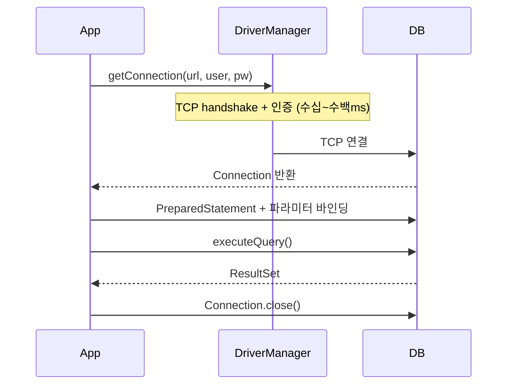

### 2.2 순수 JDBC 코드 — 문제점 직면

```java
// 반복 코드와 예외 처리로 가득 찬 JDBC 직접 사용
public class MemberRepositoryV0 {

    public Member save(Member member) throws SQLException {
        String sql = "INSERT INTO member(member_id, money) VALUES(?, ?)";

        Connection con = null;
        PreparedStatement pstmt = null;

        try {
            // 매번 새 연결 생성 — 수십ms 소요
            con = DriverManager.getConnection(URL, USERNAME, PASSWORD);
            pstmt = con.prepareStatement(sql);
            pstmt.setString(1, member.getMemberId());  // ? 위치에 바인딩
            pstmt.setInt(2, member.getMoney());
            pstmt.executeUpdate();
            return member;
        } catch (SQLException e) {
            log.error("DB 오류", e);
            throw e;
        } finally {
            // 반드시 역순으로 닫아야 함! rs → pstmt → con
            if (pstmt != null) {
                try { pstmt.close(); } catch (SQLException e) { log.error("pstmt close 오류", e); }
            }
            if (con != null) {
                try { con.close(); } catch (SQLException e) { log.error("con close 오류", e); }
            }
        }
    }

    public Member findById(String memberId) throws SQLException {
        String sql = "SELECT * FROM member WHERE member_id = ?";

        Connection con = null;
        PreparedStatement pstmt = null;
        ResultSet rs = null; // SELECT 결과는 ResultSet으로 반환

        try {
            con = DriverManager.getConnection(URL, USERNAME, PASSWORD);
            pstmt = con.prepareStatement(sql);
            pstmt.setString(1, memberId);
            rs = pstmt.executeQuery(); // SELECT는 executeQuery

            if (rs.next()) { // 결과가 있으면 커서 이동
                Member member = new Member();
                member.setMemberId(rs.getString("member_id"));
                member.setMoney(rs.getInt("money"));
                return member;
            } else {
                throw new NoSuchElementException("member not found: " + memberId);
            }
        } finally {
            close(con, pstmt, rs); // 자원 정리
        }
    }

    private void close(Connection con, Statement stmt, ResultSet rs) {
        // rs → stmt → con 순서로 닫기
        if (rs != null) {
            try { rs.close(); } catch (SQLException e) { log.error("rs close 오류", e); }
        }
        if (stmt != null) {
            try { stmt.close(); } catch (SQLException e) { log.error("stmt close 오류", e); }
        }
        if (con != null) {
            try { con.close(); } catch (SQLException e) { log.error("con close 오류", e); }
        }
    }
}
```

**문제점 세 가지:**
1. **성능** — 매 요청마다 TCP 연결 생성/해제 (수십~수백ms)
2. **반복 코드** — try-catch-finally, close() 로직이 메서드마다 똑같이 반복
3. **예외 누출** — `throws SQLException`으로 JDBC 예외가 서비스 계층까지 오염

---

## 3. 커넥션풀 (Connection Pool)

### 3.1 커넥션풀이 필요한 이유

DB 연결 한 번의 비용:
- TCP 3-way handshake
- DB 로그인 인증 처리
- DB 내부 세션 생성

이 과정이 최소 수십ms에서 최대 수백ms가 걸립니다. 초당 100개 요청을 처리하는 서비스에서 매번 새 연결을 만들면 심각한 지연이 발생합니다.

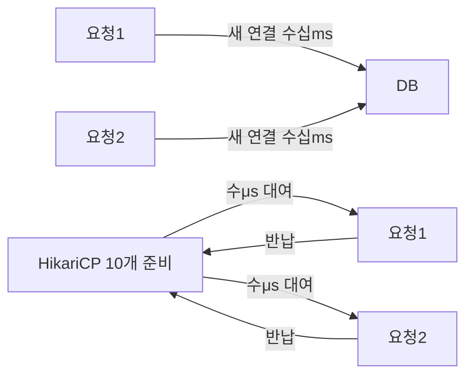

### 3.2 HikariCP 동작 원리

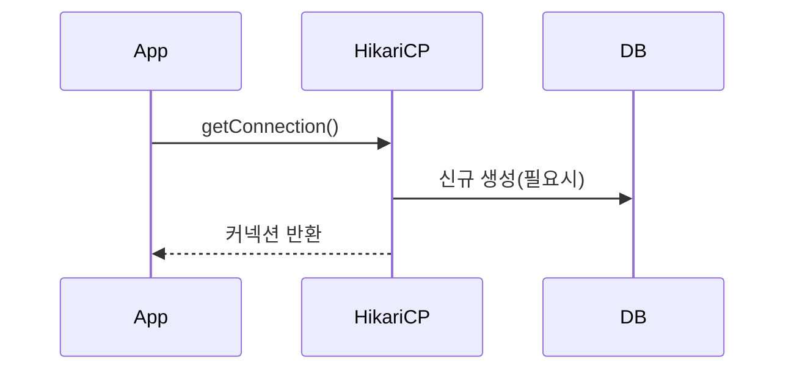

### 3.3 HikariCP 설정

```yaml
spring:
  datasource:
    url: jdbc:mysql://localhost:3306/mydb?useSSL=false&serverTimezone=Asia/Seoul&characterEncoding=UTF-8
    username: ${DB_USERNAME}
    password: ${DB_PASSWORD}
    driver-class-name: com.mysql.cj.jdbc.Driver
    hikari:
      pool-name: MyHikariPool
      minimum-idle: 5           # 최소 유지 커넥션 수 (트래픽 낮을 때도 5개 유지)
      maximum-pool-size: 20     # 최대 커넥션 수 (이 이상은 대기)
      connection-timeout: 30000 # 커넥션 획득 대기 시간 30초
      idle-timeout: 600000      # 유휴 커넥션 제거 대기 시간 10분
      max-lifetime: 1800000     # 커넥션 최대 수명 30분 (DB의 wait_timeout보다 짧게!)
      keepalive-time: 60000     # Keep-alive 쿼리 주기 1분 (방화벽 타임아웃 방지)
      connection-test-query: SELECT 1  # 커넥션 유효성 확인 쿼리
```

> **실무에서 자주 하는 실수 — maximum-pool-size를 너무 크게 설정**
>
> 커넥션 수가 많다고 좋은 게 아닙니다. DB 서버도 각 커넥션에 메모리와 CPU를 할당합니다. MySQL 기준 커넥션 하나당 약 4~8MB 메모리가 필요합니다. 서버 50대에 각각 pool-size=100으로 설정하면 DB에 5,000개 동시 연결이 생깁니다. 공식 권장값: `(CPU 코어 수 * 2) + 유효 스핀들 수`. 보통 10~20이 적당합니다.

### 3.4 DataSource 추상화

```java
// DataSource 인터페이스 — HikariCP, DBCP2, Tomcat JDBC 등에 독립적
public interface DataSource {
    Connection getConnection() throws SQLException;
}

// Spring Boot는 HikariDataSource를 자동으로 빈 등록
// DataSource에 의존하면 구현체를 교체해도 코드 변경 없음!
@Repository
@RequiredArgsConstructor
public class MemberRepositoryV1 {

    private final DataSource dataSource; // HikariCP, DriverManager 어느 것이든 OK

    public Member save(Member member) throws SQLException {
        String sql = "INSERT INTO member(member_id, money) VALUES(?, ?)";
        Connection con = null;
        PreparedStatement pstmt = null;

        try {
            con = dataSource.getConnection(); // 구현체에 상관없이 동일
            pstmt = con.prepareStatement(sql);
            pstmt.setString(1, member.getMemberId());
            pstmt.setInt(2, member.getMoney());
            pstmt.executeUpdate();
            return member;
        } finally {
            close(con, pstmt, null);
        }
    }
}
```

---

## 4. 트랜잭션 (Transaction)

### 4.1 ACID 속성

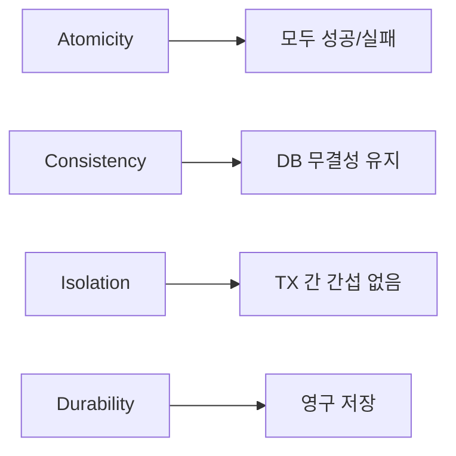

### 4.2 트랜잭션 없을 때 발생하는 문제

```java
// 계좌 이체 — 트랜잭션 없는 경우
public void transfer(String fromId, String toId, int money) throws SQLException {
    Member from = findById(fromId);   // SELECT
    Member to = findById(toId);       // SELECT

    // 1단계: A 잔액 차감
    update(fromId, from.getMoney() - money);  // UPDATE → 성공!

    // ⚠️ 여기서 서버 장애, 네트워크 오류, 예외 발생!

    // 2단계: B 잔액 증가 — 실행되지 않음!
    update(toId, to.getMoney() + money);

    // 결과: A에서 돈은 빠졌는데 B에는 입금 안 됨
    // → 돈이 공중으로 사라짐!
}
```

### 4.3 JDBC 수동 트랜잭션

```java
// autoCommit=false로 설정하면 명시적 commit/rollback 필요
public void transfer(String fromId, String toId, int money) throws SQLException {
    Connection con = dataSource.getConnection();
    try {
        con.setAutoCommit(false); // 트랜잭션 시작!

        // 같은 Connection으로 모든 SQL 실행 (같은 트랜잭션)
        Member from = findById(con, fromId);
        Member to = findById(con, toId);

        update(con, fromId, from.getMoney() - money); // 1단계
        validateBalance(to);                           // 검증 (예외 가능)
        update(con, toId, to.getMoney() + money);      // 2단계

        con.commit(); // 🟢 정상 완료 — 커밋
    } catch (Exception e) {
        con.rollback(); // 🔴 실패 — 처음 상태로 되돌리기
        throw new IllegalStateException(e);
    } finally {
        con.setAutoCommit(true); // 원래대로 복원 (풀 반납 시 중요!)
        con.close();
    }
}
```

**문제:** 서비스 계층이 `Connection`을 직접 다루면서 JDBC에 강하게 결합됩니다. JPA로 전환하려면 서비스 코드도 수정해야 합니다.

---

## 5. 트랜잭션 매니저 — 기술 독립적 트랜잭션

### 5.1 PlatformTransactionManager 추상화

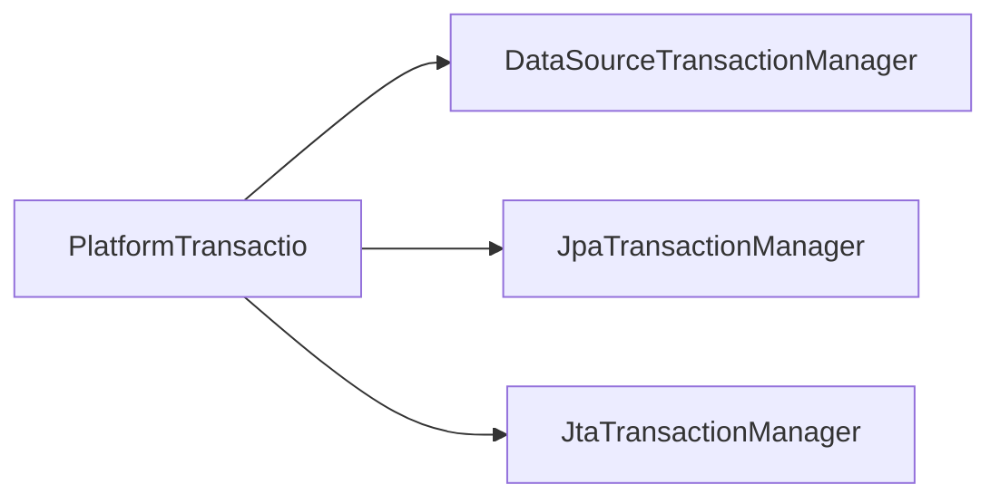

```java
// 서비스 계층은 PlatformTransactionManager에만 의존
// JDBC → JPA로 바꿔도 서비스 코드 변경 없음
@Service
@RequiredArgsConstructor
public class MemberServiceV3 {

    private final PlatformTransactionManager transactionManager; // 추상화!
    private final MemberRepository memberRepository;

    public void transfer(String fromId, String toId, int money) {
        TransactionStatus status = transactionManager
            .getTransaction(new DefaultTransactionDefinition());
        try {
            bizLogic(fromId, toId, money);
            transactionManager.commit(status);
        } catch (Exception e) {
            transactionManager.rollback(status);
            throw new IllegalStateException(e);
        }
    }
}
```

### 5.2 트랜잭션 동기화 매니저 — ThreadLocal 활용

같은 트랜잭션 내에서 여러 Repository가 같은 Connection을 써야 합니다. Spring은 `ThreadLocal`로 이를 해결합니다.

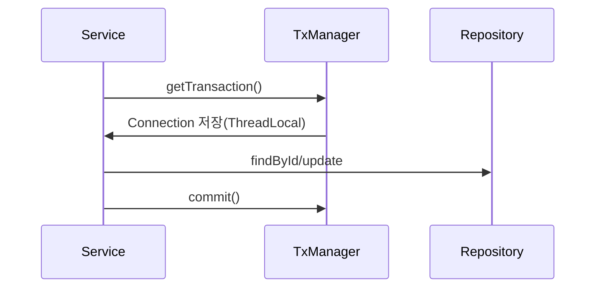

---

## 6. @Transactional — 선언적 트랜잭션

### 6.1 AOP로 트랜잭션 코드 분리

```java
// @Transactional 하나로 모든 트랜잭션 코드가 사라짐!
@Service
@RequiredArgsConstructor
public class MemberService {

    private final MemberRepository memberRepository;

    @Transactional
    public void transfer(String fromId, String toId, int money) {
        // 비즈니스 로직만 남음
        Member fromMember = memberRepository.findById(fromId);
        Member toMember = memberRepository.findById(toId);

        memberRepository.update(fromId, fromMember.getMoney() - money);
        validateBalance(toMember);
        memberRepository.update(toId, toMember.getMoney() + money);
        // 예외 없으면 자동 커밋, RuntimeException 발생 시 자동 롤백
    }
}
```

### 6.2 @Transactional 내부 동작 — AOP 프록시

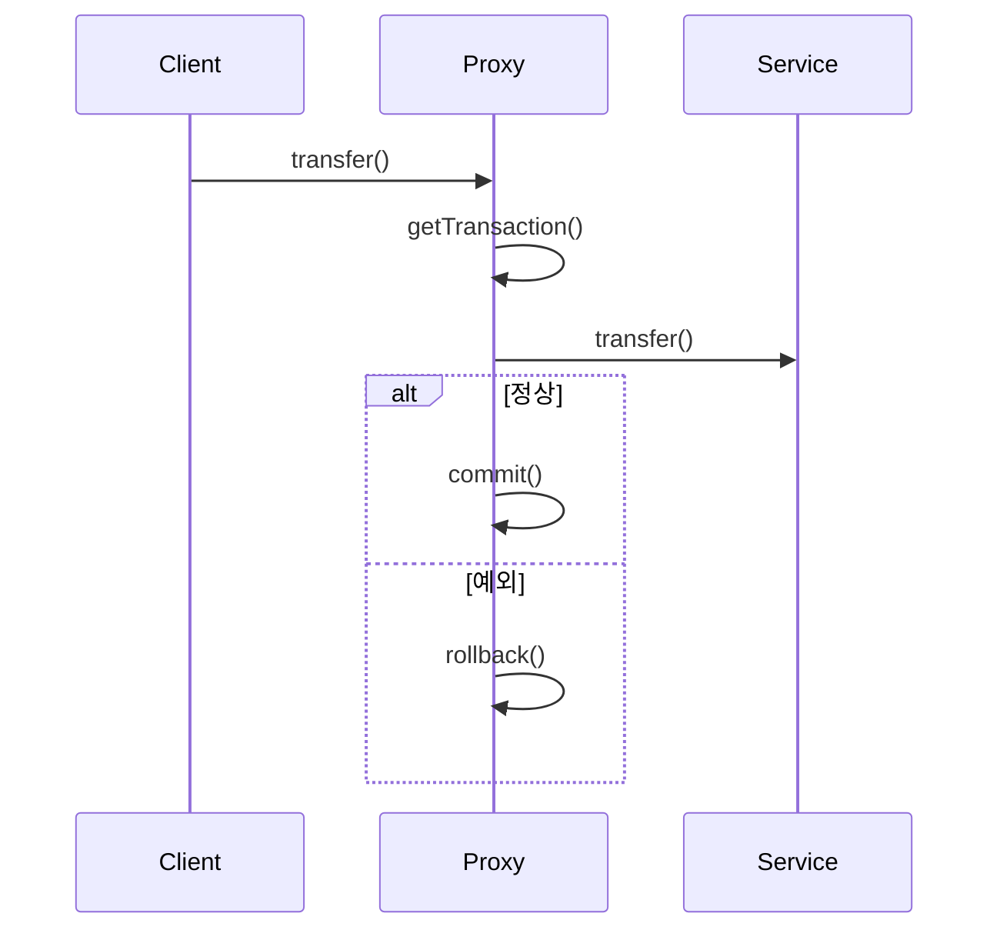

### 6.3 트랜잭션 전파 (Propagation)

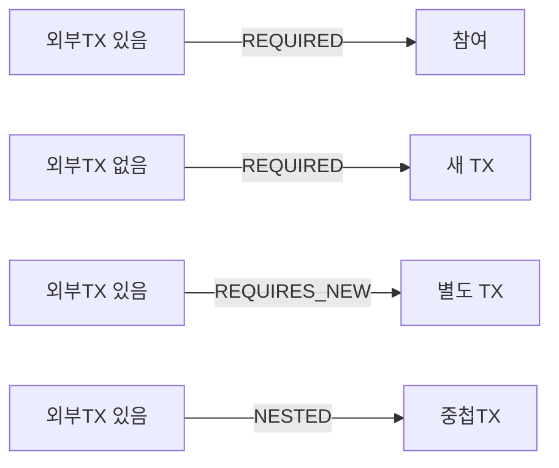

```java
@Service
public class OrderService {

    @Transactional
    public void createOrder(Order order) {
        orderRepository.save(order);            // 같은 트랜잭션
        paymentService.processPayment(order);   // REQUIRED: 같은 트랜잭션 참여
        auditService.logOrderCreated(order);    // REQUIRES_NEW: 별도 트랜잭션
    }
}

@Service
public class PaymentService {

    // REQUIRED (기본): 기존 트랜잭션에 참여, 없으면 새로 생성
    @Transactional(propagation = Propagation.REQUIRED)
    public void processPayment(Order order) {
        // OrderService의 트랜잭션과 같은 트랜잭션
        // processPayment에서 예외 발생 시 createOrder 전체 롤백
        paymentRepository.save(Payment.from(order));
    }
}

@Service
public class AuditService {

    // REQUIRES_NEW: 항상 새 트랜잭션 (기존 일시 중단)
    // 주문 처리가 실패해도 감사 로그는 저장하고 싶을 때
    @Transactional(propagation = Propagation.REQUIRES_NEW)
    public void logOrderCreated(Order order) {
        auditRepository.save(AuditLog.of("ORDER_CREATED", order.getId()));
        // 여기서 예외 발생해도 주문 트랜잭션은 영향 없음
    }

    // SUPPORTS: 트랜잭션이 있으면 참여, 없어도 실행
    @Transactional(propagation = Propagation.SUPPORTS)
    public Order findOrder(Long id) {
        return orderRepository.findById(id).orElseThrow();
    }

    // MANDATORY: 반드시 기존 트랜잭션 안에서만 실행 (없으면 예외)
    @Transactional(propagation = Propagation.MANDATORY)
    public void criticalInternalOperation() {
        // 트랜잭션 없이 호출하면 IllegalTransactionStateException
    }
}
```

### 6.4 롤백 규칙 — 체크 예외 주의

```java
// 기본 규칙:
// - RuntimeException, Error → 자동 롤백
// - CheckedException (IOException, SQLException 등) → 롤백 안 함! (커밋됨)

@Transactional
public void defaultBehavior() throws IOException {
    save(order);              // 성공
    throw new IOException();  // CheckedException → 롤백 안 함! (order가 저장됨)
}

// 체크 예외도 롤백하려면 rollbackFor 명시
@Transactional(rollbackFor = {IOException.class, SQLException.class})
public void rollbackOnChecked() throws IOException {
    save(order);
    throw new IOException();  // 이제 롤백됨
}

// BusinessException이 RuntimeException 하위인데 롤백 방지하고 싶을 때
@Transactional(noRollbackFor = BusinessException.class)
public void noRollback() {
    save(order);
    throw new BusinessException("이미 처리된 주문");  // 롤백 안 함
}
```

> **실무에서 자주 하는 실수 — @Transactional private 메서드**
>
> `@Transactional`은 AOP 프록시 기반이므로 private 메서드에는 적용되지 않습니다. 같은 클래스 내의 internal 메서드 호출도 프록시를 거치지 않아 트랜잭션이 적용되지 않습니다. 반드시 public 메서드에 적용하고, 내부 호출은 별도 빈으로 분리하거나 `@Transactional(propagation = Propagation.REQUIRES_NEW)`를 피해야 합니다.

### 6.5 트랜잭션 격리 수준

```java
@Transactional(isolation = Isolation.READ_COMMITTED)  // MySQL 기본값
@Transactional(isolation = Isolation.REPEATABLE_READ)  // InnoDB 기본값
@Transactional(isolation = Isolation.SERIALIZABLE)     // 완전 순차 처리
```

| 격리 수준 | Dirty Read | Non-Repeatable Read | Phantom Read | 성능 |
|----------|-----------|--------------------|-----------|----|
| `READ_UNCOMMITTED` | 가능 | 가능 | 가능 | 최고 |
| `READ_COMMITTED` | **방지** | 가능 | 가능 | 높음 |
| `REPEATABLE_READ` | **방지** | **방지** | 가능 (InnoDB는 방지) | 중간 |
| `SERIALIZABLE` | **방지** | **방지** | **방지** | 최저 |

> **면접 포인트**
>
> **Q:** REPEATABLE_READ에서 Phantom Read가 발생할 수 있다고 하는데, MySQL InnoDB는 어떻게 방지하나요?
>
> **A:** InnoDB는 REPEATABLE_READ에서 MVCC(Multi-Version Concurrency Control)와 Gap Lock을 사용합니다. 일반 SELECT는 트랜잭션 시작 시점의 스냅샷을 읽어 팬텀 리드를 방지합니다. 단, `SELECT ... FOR UPDATE`나 `SELECT ... LOCK IN SHARE MODE`는 현재 버전을 잠금으로 읽으므로 Gap Lock으로 팬텀 리드를 방지합니다.

---

## 7. 스프링 예외 추상화

### 7.1 문제: DB 벤더마다 다른 에러 코드

```java
// ❌ MySQL에서만 동작하는 코드
catch (SQLException e) {
    if (e.getErrorCode() == 1062) { // MySQL 중복 키 에러 코드
        throw new DuplicateMemberException();
    }
    // Oracle은 1, H2는 23505 — DB 바꾸면 이 코드 전체 수정!
}
```

### 7.2 Spring DataAccessException 계층

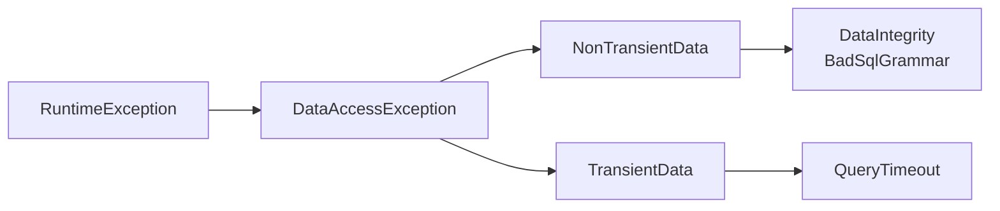

```java
// Spring이 DB별 에러 코드를 자동으로 DataAccessException으로 변환
@Repository
@RequiredArgsConstructor
public class MemberRepository {

    private final JdbcTemplate jdbcTemplate;

    public void save(Member member) {
        try {
            jdbcTemplate.update(
                "INSERT INTO member(member_id, money) VALUES(?, ?)",
                member.getMemberId(), member.getMoney());
        } catch (DuplicateKeyException e) {
            // MySQL이든 Oracle이든 H2든 같은 예외!
            // 코드 변경 없이 DB 교체 가능
            throw new MemberAlreadyExistsException(member.getMemberId());
        }
        // SQLException은 Spring이 알아서 DataAccessException으로 변환
        // 서비스 계층에 throws SQLException 없음!
    }
}
```

---


## 극한 시나리오

마이크로서비스에서 주문 서비스, 재고 서비스, 결제 서비스가 각각 다른 DB를 씁니다. 하나의 트랜잭션으로 묶을 수 없습니다.

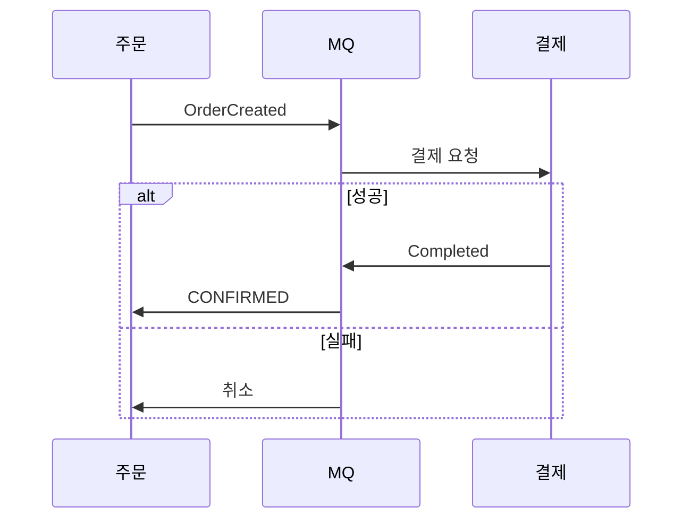

```java
// Outbox 패턴 — 이벤트 발행 보장
@Transactional
public void createOrder(OrderRequest request) {
    Order order = orderRepository.save(Order.from(request)); // 주문 저장

    // 같은 트랜잭션에 이벤트 아웃박스 저장 — 이벤트 유실 방지
    OutboxEvent event = OutboxEvent.of("ORDER_CREATED", order.getId());
    outboxRepository.save(event); // 같은 DB, 같은 트랜잭션!

    // 별도 스케줄러가 outbox 테이블을 읽어 MQ에 발행
    // → DB 저장과 이벤트 발행이 항상 일치함
}
```

---
## 9. 전체 데이터 접근 흐름

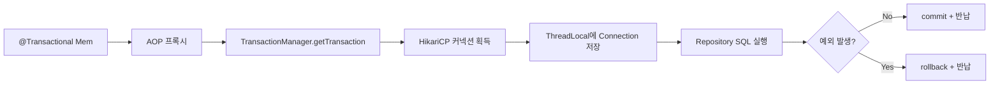

---

## 10. 핵심 포인트 정리

| 개념 | 설명 | 핵심 포인트 |
|------|------|-----------|
| JDBC | Java와 DB 연결 표준 | `DriverManager` → `DataSource`로 진화 |
| HikariCP | Spring Boot 기본 커넥션풀 | `maximum-pool-size` 적절히 설정 (보통 10~20) |
| `DataSource` | 커넥션 획득 추상화 | 구현체 교체 시 코드 변경 없음 |
| `@Transactional` | 선언적 트랜잭션 | AOP 프록시 기반 — public 메서드에만 적용 |
| `Propagation.REQUIRED` | 기존 트랜잭션 참여 (기본값) | 내부 예외 → 외부 트랜잭션도 롤백 |
| `Propagation.REQUIRES_NEW` | 항상 새 트랜잭션 | 로그/감사 용도 — 주문 실패해도 로그는 저장 |
| `rollbackFor` | 롤백 대상 예외 지정 | CheckedException은 기본적으로 롤백 안 함! |
| `Isolation.REPEATABLE_READ` | InnoDB 기본 격리 수준 | MVCC + Gap Lock으로 팬텀 리드 방지 |
| `DataAccessException` | Spring 예외 추상화 | DB 벤더 독립적 예외 처리 가능 |
| Outbox 패턴 | 분산 환경 이벤트 보장 | DB 저장 + 이벤트 발행을 같은 트랜잭션으로 |
