## 1. 비유 — 커피숍과 수도 시스템

데이터베이스 연결은 수도 시스템과 같습니다. 물(데이터)이 필요할 때마다 새로 공사해서 배관을 연결할 수는 없습니다. 미리 파이프(커넥션)를 여러 개 설치해 두고(커넥션풀), 필요할 때 꺼내 쓰고 다시 반납합니다. 그리고 커피를 만드는 과정은 반드시 완성되거나 처음으로 돌아가야 합니다 — 이것이 트랜잭션입니다.

---

## 2. JDBC 직접 사용

### 2.1 JDBC 기본 동작

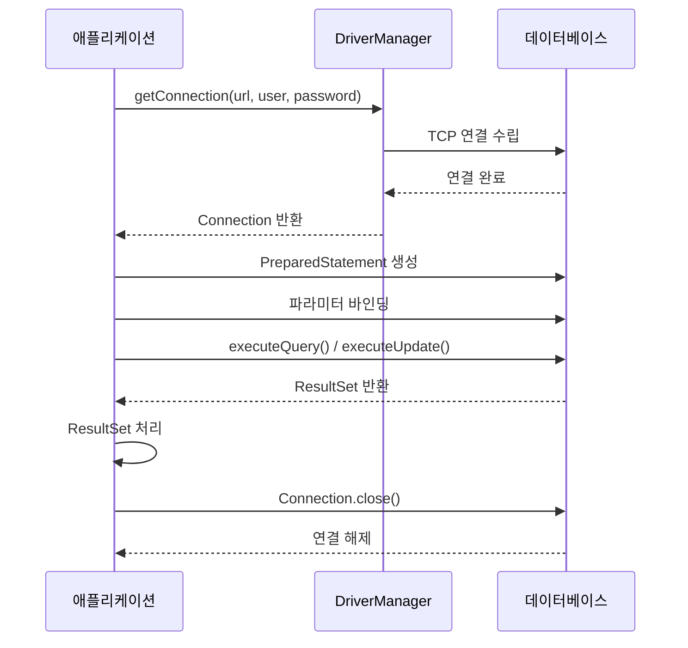

### 2.2 순수 JDBC 코드

```java
public class MemberRepositoryV0 {

    public Member save(Member member) throws SQLException {
        String sql = "INSERT INTO member(member_id, money) VALUES(?, ?)";

        Connection con = null;
        PreparedStatement pstmt = null;

        try {
            con = DriverManager.getConnection(URL, USERNAME, PASSWORD);
            pstmt = con.prepareStatement(sql);
            pstmt.setString(1, member.getMemberId());
            pstmt.setInt(2, member.getMoney());
            pstmt.executeUpdate();
            return member;
        } catch (SQLException e) {
            log.error("DB 오류", e);
            throw e;
        } finally {
            // 반드시 역순으로 닫아야 함!
            if (pstmt != null) {
                try { pstmt.close(); } catch (SQLException e) { log.error("error", e); }
            }
            if (con != null) {
                try { con.close(); } catch (SQLException e) { log.error("error", e); }
            }
        }
    }

    public Member findById(String memberId) throws SQLException {
        String sql = "SELECT * FROM member WHERE member_id = ?";

        Connection con = null;
        PreparedStatement pstmt = null;
        ResultSet rs = null;

        try {
            con = DriverManager.getConnection(URL, USERNAME, PASSWORD);
            pstmt = con.prepareStatement(sql);
            pstmt.setString(1, memberId);
            rs = pstmt.executeQuery();

            if (rs.next()) {
                Member member = new Member();
                member.setMemberId(rs.getString("member_id"));
                member.setMoney(rs.getInt("money"));
                return member;
            } else {
                throw new NoSuchElementException("member not found: " + memberId);
            }
        } catch (SQLException e) {
            throw e;
        } finally {
            close(con, pstmt, rs);
        }
    }

    private void close(Connection con, Statement stmt, ResultSet rs) {
        if (rs != null) {
            try { rs.close(); } catch (SQLException e) { log.error("error", e); }
        }
        if (stmt != null) {
            try { stmt.close(); } catch (SQLException e) { log.error("error", e); }
        }
        if (con != null) {
            try { con.close(); } catch (SQLException e) { log.error("error", e); }
        }
    }
}
```

문제점: 매번 연결/해제 비용, 예외 처리 중복, 리소스 누수 위험.

---

## 3. 커넥션풀 (Connection Pool)

### 3.1 커넥션풀이 필요한 이유

DB 연결 생성 비용:
- TCP 3-way handshake
- DB 로그인 인증
- DB 세션 생성

이 과정이 수십ms ~ 수백ms 소요됩니다.

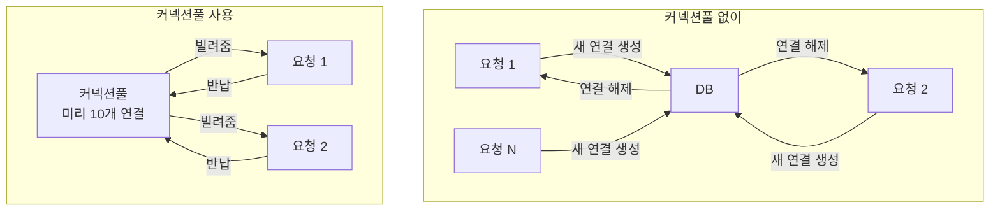

### 3.2 HikariCP 설정

```yaml
spring:
  datasource:
    url: jdbc:mysql://localhost:3306/mydb?useSSL=false&serverTimezone=UTC
    username: root
    password: secret
    driver-class-name: com.mysql.cj.jdbc.Driver
    hikari:
      pool-name: MyHikariPool
      minimum-idle: 5           # 최소 유지 커넥션 수
      maximum-pool-size: 20     # 최대 커넥션 수
      connection-timeout: 30000 # 커넥션 획득 대기 시간 (ms)
      idle-timeout: 600000      # 유휴 커넥션 제거 시간 (ms)
      max-lifetime: 1800000     # 커넥션 최대 수명 (ms)
      keepalive-time: 60000     # Keep-alive 쿼리 주기 (ms)
      connection-test-query: SELECT 1
```

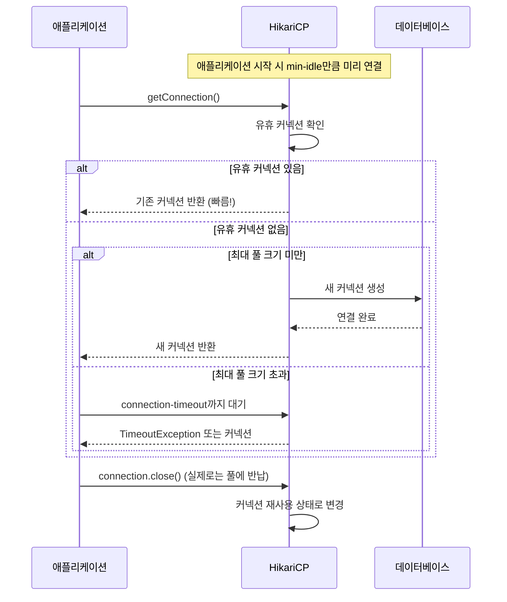

### 3.3 DataSource 추상화

```java
// DataSource 인터페이스 — 커넥션풀 구현체와 독립적
public interface DataSource {
    Connection getConnection() throws SQLException;
    Connection getConnection(String username, String password) throws SQLException;
}

// HikariCP가 DataSource를 구현
// Tomcat JDBC Pool도 DataSource를 구현
// c3p0도 DataSource를 구현

// Spring Boot는 HikariDataSource를 자동 등록
@Repository
public class MemberRepositoryV1 {

    private final DataSource dataSource; // 구현체에 의존 X

    public MemberRepositoryV1(DataSource dataSource) {
        this.dataSource = dataSource;
    }

    public Member save(Member member) throws SQLException {
        String sql = "INSERT INTO member(member_id, money) VALUES(?, ?)";

        Connection con = null;
        PreparedStatement pstmt = null;

        try {
            con = dataSource.getConnection(); // DataSource에서 획득
            // ... 이하 동일
        } finally {
            close(con, pstmt, null);
        }
    }
}
```

---

## 4. 트랜잭션 (Transaction)

### 4.1 ACID 속성

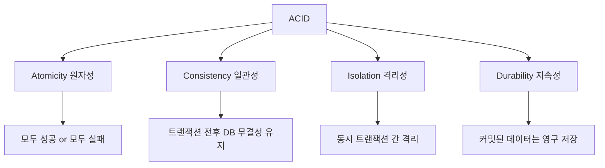

### 4.2 트랜잭션 없이 발생하는 문제

```java
// A가 B에게 2000원 이체
public void transfer(String fromId, String toId, int money) {
    Member from = findById(fromId);
    Member to = findById(toId);

    // from 잔액 차감
    update(fromId, from.getMoney() - money); // 성공

    // 장애 발생!!! (서버 다운, 네트워크 오류 등)

    // to 잔액 증가
    update(toId, to.getMoney() + money); // 실행 안 됨!
    // 결과: A 돈은 빠졌는데 B 돈은 안 들어옴
}
```

### 4.3 트랜잭션 적용 — JDBC 수동

```java
public void transfer(String fromId, String toId, int money) throws SQLException {
    Connection con = dataSource.getConnection();
    try {
        con.setAutoCommit(false); // 트랜잭션 시작!

        bizLogic(con, fromId, toId, money);

        con.commit(); // 성공 시 커밋
    } catch (Exception e) {
        con.rollback(); // 실패 시 롤백
        throw new IllegalStateException(e);
    } finally {
        release(con);
    }
}

private void bizLogic(Connection con, String fromId, String toId, int money) throws SQLException {
    Member fromMember = findById(con, fromId);
    Member toMember = findById(con, toId);

    update(con, fromId, fromMember.getMoney() - money);
    validation(toMember); // 검증
    update(con, toId, toMember.getMoney() + money);
}
```

문제: 서비스 계층이 `Connection`을 직접 다루면서 JDBC에 강하게 결합됩니다.

---

## 5. 트랜잭션 매니저

### 5.1 트랜잭션 추상화

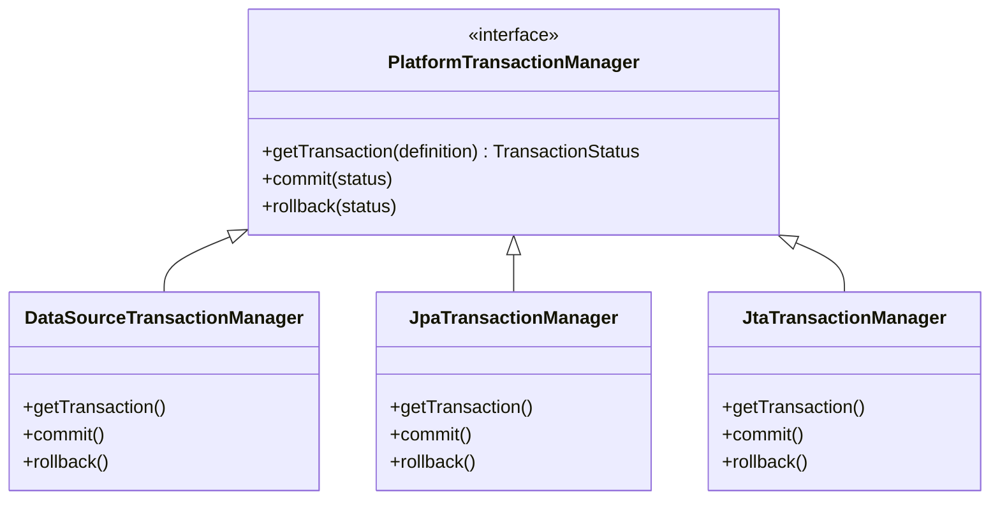

```java
// 트랜잭션 매니저 사용 (여전히 수동)
public void transfer(String fromId, String toId, int money) {
    TransactionStatus status = transactionManager.getTransaction(new DefaultTransactionDefinition());
    try {
        bizLogic(fromId, toId, money);
        transactionManager.commit(status);
    } catch (Exception e) {
        transactionManager.rollback(status);
        throw new IllegalStateException(e);
    }
}
```

### 5.2 트랜잭션 동기화 매니저

트랜잭션 매니저는 같은 트랜잭션 내에서 같은 커넥션을 사용하도록 **트랜잭션 동기화 매니저**를 통해 관리합니다.

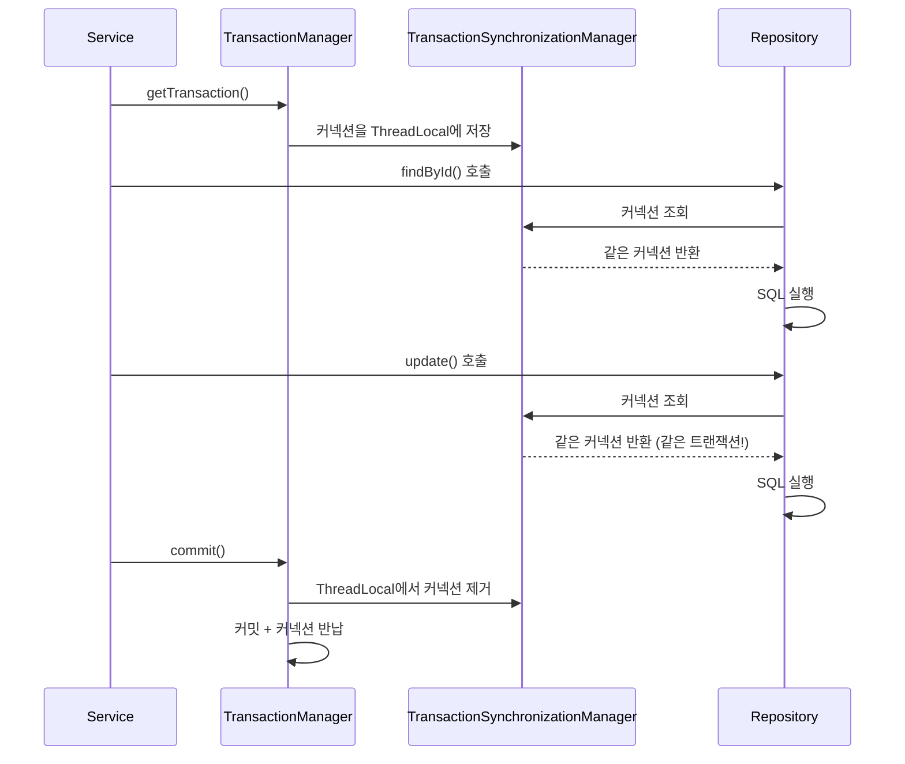

---

## 6. @Transactional — 선언적 트랜잭션

### 6.1 기본 사용

```java
@Service
@RequiredArgsConstructor
public class MemberService {

    private final MemberRepository memberRepository;

    @Transactional
    public void transfer(String fromId, String toId, int money) {
        Member fromMember = memberRepository.findById(fromId);
        Member toMember = memberRepository.findById(toId);

        memberRepository.update(fromId, fromMember.getMoney() - money);
        validation(toMember);
        memberRepository.update(toId, toMember.getMoney() + money);
        // 예외 없으면 자동 커밋, 예외 발생 시 자동 롤백
    }
}
```

### 6.2 @Transactional 내부 동작 (AOP)

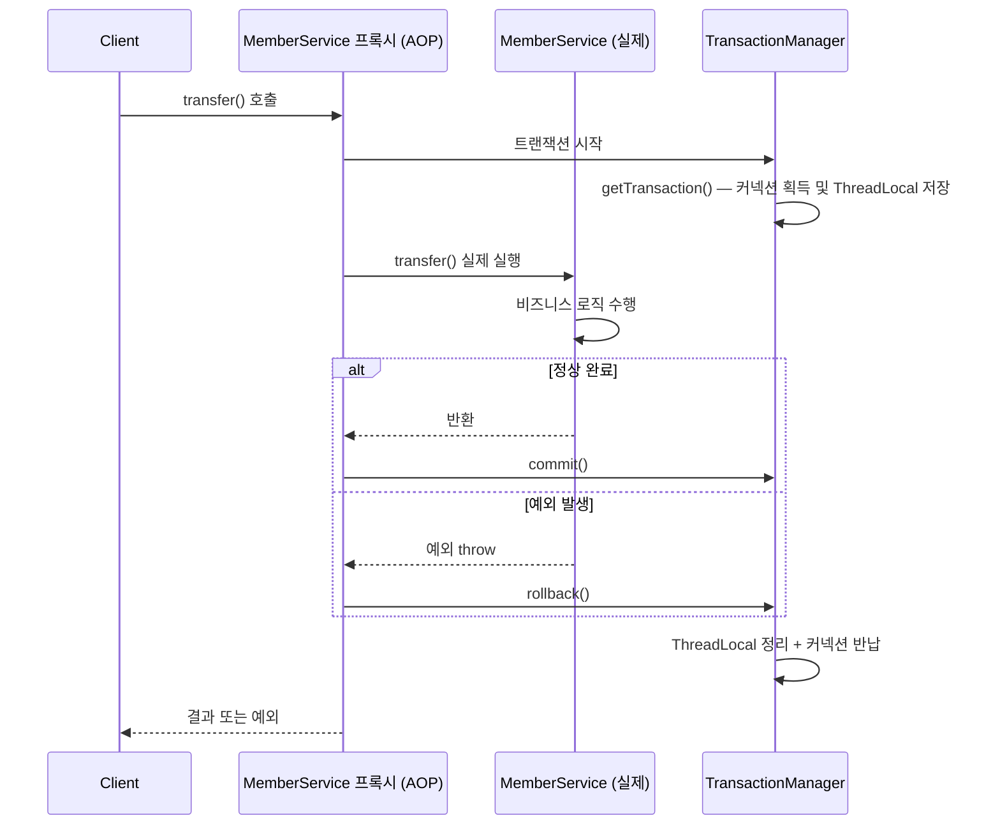

### 6.3 트랜잭션 전파 (Propagation)

```java
@Service
public class OrderService {

    @Transactional
    public void createOrder(Order order) {
        orderRepository.save(order); // 같은 트랜잭션
        paymentService.processPayment(order); // 아래 설정에 따라 다름
    }
}

@Service
public class PaymentService {

    // REQUIRED (기본): 기존 트랜잭션 참여, 없으면 새로 생성
    @Transactional(propagation = Propagation.REQUIRED)
    public void processPayment(Order order) { ... }

    // REQUIRES_NEW: 항상 새 트랜잭션 생성 (기존 트랜잭션은 일시 중단)
    @Transactional(propagation = Propagation.REQUIRES_NEW)
    public void logPaymentAttempt(Order order) {
        // 결제 로그는 실패해도 별도 트랜잭션으로 저장
        paymentLogRepository.save(new PaymentLog(order));
    }

    // SUPPORTS: 기존 트랜잭션 참여, 없어도 됨
    @Transactional(propagation = Propagation.SUPPORTS)
    public Order findOrder(Long id) { ... }

    // NOT_SUPPORTED: 트랜잭션 없이 실행 (기존 트랜잭션 중단)
    @Transactional(propagation = Propagation.NOT_SUPPORTED)
    public void sendEmail(String email) { ... }

    // MANDATORY: 반드시 기존 트랜잭션 내에서 실행
    @Transactional(propagation = Propagation.MANDATORY)
    public void internalOperation() { ... }

    // NEVER: 트랜잭션이 있으면 예외 발생
    @Transactional(propagation = Propagation.NEVER)
    public void nonTransactionalOperation() { ... }

    // NESTED: 중첩 트랜잭션 (savepoint 활용)
    @Transactional(propagation = Propagation.NESTED)
    public void nestedOperation() { ... }
}
```

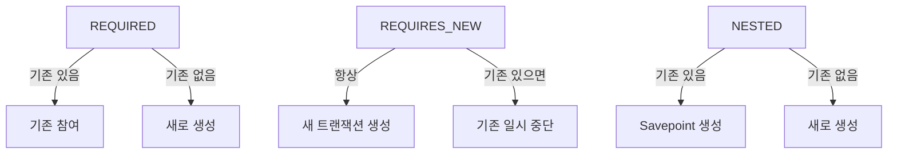

### 6.4 롤백 규칙

```java
// 기본: RuntimeException, Error 발생 시 롤백
//       CheckedException은 롤백 안 함
@Transactional
public void defaultBehavior() throws IOException {
    // RuntimeException → 롤백
    // IOException (CheckedException) → 커밋!
}

// CheckedException도 롤백하고 싶을 때
@Transactional(rollbackFor = {IOException.class, SQLException.class})
public void rollbackOnChecked() throws IOException { ... }

// RuntimeException인데 롤백 하지 않고 싶을 때
@Transactional(noRollbackFor = BusinessException.class)
public void noRollbackOnBusiness() { ... }
```

### 6.5 트랜잭션 격리 수준

```java
@Transactional(isolation = Isolation.READ_COMMITTED) // 기본값 (DB에 따라 다름)
public void readCommitted() { ... }

@Transactional(isolation = Isolation.REPEATABLE_READ)
public void repeatableRead() { ... }

@Transactional(isolation = Isolation.SERIALIZABLE)
public void serializable() { ... }
```

| 격리 수준 | Dirty Read | Non-Repeatable Read | Phantom Read | 성능 |
|----------|-----------|--------------------|-----------|----|
| READ_UNCOMMITTED | 가능 | 가능 | 가능 | 최고 |
| READ_COMMITTED | 방지 | 가능 | 가능 | 높음 |
| REPEATABLE_READ | 방지 | 방지 | 가능(InnoDB는 방지) | 중간 |
| SERIALIZABLE | 방지 | 방지 | 방지 | 최저 |

---

## 7. 예외와 스프링 예외 추상화

### 7.1 문제: DB별로 다른 에러 코드

```java
// MySQL: 1062 (중복 키)
// Oracle: 1 (중복 키)
// H2: 23505 (중복 키)

catch (SQLException e) {
    if (e.getErrorCode() == 1062) { // MySQL에만 동작
        throw new DuplicateMemberException();
    }
}
```

### 7.2 Spring의 DataAccessException 계층

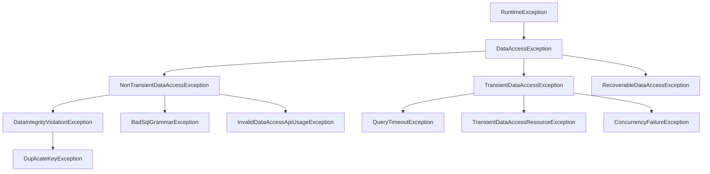

```java
// Spring이 DB별 에러 코드를 변환해 줌
@Repository
public class MemberRepository {

    @Autowired
    private JdbcTemplate jdbcTemplate;

    public void save(Member member) {
        try {
            jdbcTemplate.update("INSERT INTO member VALUES(?, ?)",
                member.getMemberId(), member.getMoney());
        } catch (DuplicateKeyException e) {
            // MySQL이든 Oracle이든 같은 예외!
            throw new MemberAlreadyExistsException(member.getMemberId());
        }
    }
}
```

---

## 8. 극한 시나리오 — 분산 트랜잭션

여러 DB에 걸친 트랜잭션 (2PC, Two-Phase Commit):

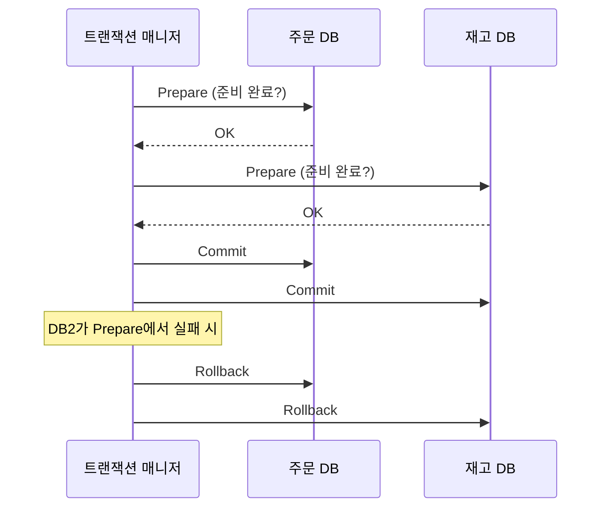

실무에서는 분산 트랜잭션 대신 **Saga 패턴** 또는 **Outbox 패턴**을 사용합니다.

---

## 9. 전체 데이터 접근 흐름

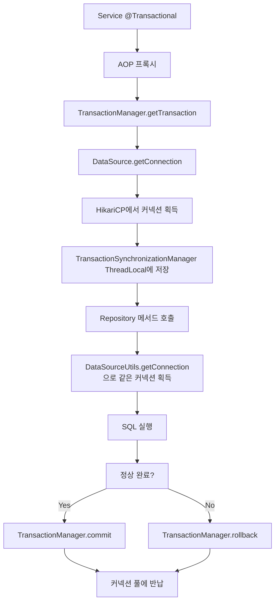

---

## 10. 요약

| 개념 | 설명 | 핵심 포인트 |
|------|------|-----------|
| JDBC | Java와 DB 연결 표준 | DriverManager → DataSource로 진화 |
| HikariCP | 커넥션풀 구현체 | Spring Boot 기본, maximum-pool-size 중요 |
| DataSource | 커넥션 획득 추상화 | 구현체 교체 시 코드 변경 없음 |
| @Transactional | 선언적 트랜잭션 | AOP 프록시 기반 |
| Propagation | 트랜잭션 전파 방식 | REQUIRED가 기본 |
| Isolation | 격리 수준 | 성능과 정확성 트레이드오프 |
| rollbackFor | 롤백 대상 예외 | CheckedException은 기본 롤백 안 함 |
| DataAccessException | Spring 예외 계층 | DB 벤더에 독립적인 예외 처리 |
