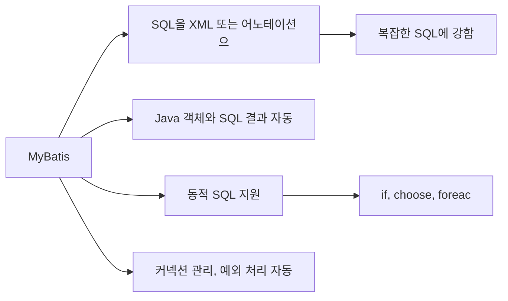
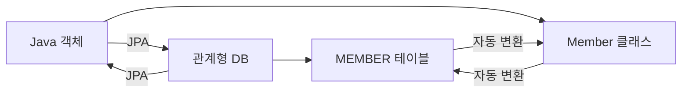
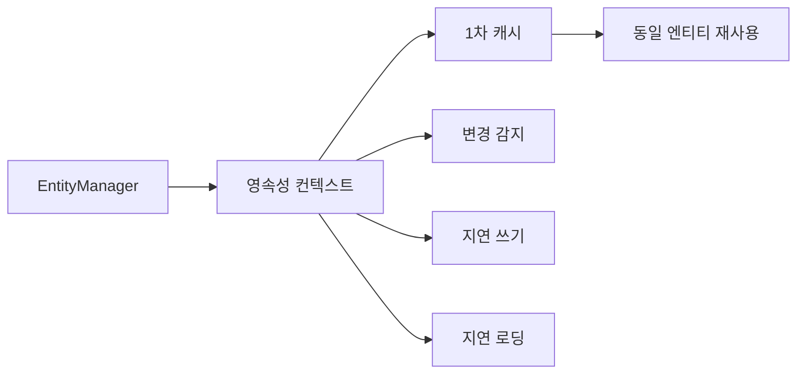
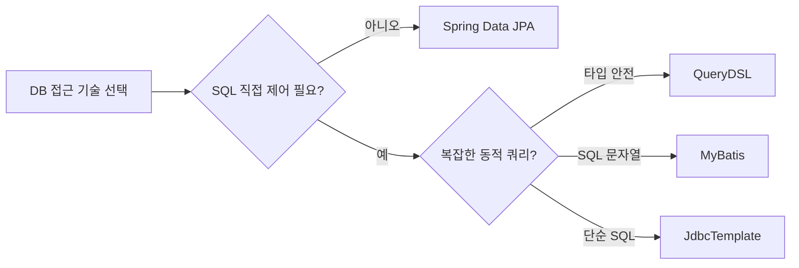

## 1. 비유 — 요리 도구의 진화

데이터베이스 접근 기술의 발전은 요리 도구의 진화와 같습니다. JDBC는 돌칼(직접 모든 것 처리), JdbcTemplate은 주방 칼(편리하지만 여전히 SQL 작성), MyBatis는 반자동 요리기구(SQL을 파일로 분리), JPA는 완전 자동 조리 기계(SQL 자동 생성)입니다. 상황에 따라 적합한 도구를 선택해야 합니다.

---

## 2. JdbcTemplate

### 2.1 순수 JDBC vs JdbcTemplate

```java
// 순수 JDBC — 반복 코드 가득
public Member findById(String memberId) throws SQLException {
    String sql = "SELECT * FROM member WHERE member_id = ?";
    Connection con = null;
    PreparedStatement pstmt = null;
    ResultSet rs = null;
    try {
        con = dataSource.getConnection();
        pstmt = con.prepareStatement(sql);
        pstmt.setString(1, memberId);
        rs = pstmt.executeQuery();
        if (rs.next()) {
            Member member = new Member();
            member.setMemberId(rs.getString("member_id"));
            member.setMoney(rs.getInt("money"));
            return member;
        }
        throw new NoSuchElementException("member not found");
    } catch (SQLException e) {
        throw e;
    } finally {
        close(con, pstmt, rs); // 닫기 코드 반복
    }
}

// JdbcTemplate — 핵심 SQL만 남음
public Member findById(String memberId) {
    String sql = "SELECT * FROM member WHERE member_id = ?";
    return jdbcTemplate.queryForObject(sql,
        (rs, rowNum) -> new Member(rs.getString("member_id"), rs.getInt("money")),
        memberId);
}
```

### 2.2 JdbcTemplate 주요 메서드

```java
@Repository
public class MemberRepositoryV3 {

    private final JdbcTemplate jdbcTemplate;

    public MemberRepositoryV3(DataSource dataSource) {
        this.jdbcTemplate = new JdbcTemplate(dataSource);
    }

    // INSERT, UPDATE, DELETE
    public Member save(Member member) {
        String sql = "INSERT INTO member(member_id, money) VALUES(?, ?)";
        jdbcTemplate.update(sql, member.getMemberId(), member.getMoney());
        return member;
    }

    // 단건 조회
    public Member findById(String memberId) {
        String sql = "SELECT * FROM member WHERE member_id = ?";
        return jdbcTemplate.queryForObject(sql, memberRowMapper(), memberId);
    }

    // 단건 조회 — 단순 타입
    public int getMoney(String memberId) {
        return jdbcTemplate.queryForObject(
            "SELECT money FROM member WHERE member_id = ?",
            Integer.class, memberId);
    }

    // 목록 조회
    public List<Member> findAll() {
        String sql = "SELECT * FROM member";
        return jdbcTemplate.query(sql, memberRowMapper());
    }

    // RowMapper 재사용
    private RowMapper<Member> memberRowMapper() {
        return (rs, rowNum) -> {
            Member member = new Member();
            member.setMemberId(rs.getString("member_id"));
            member.setMoney(rs.getInt("money"));
            return member;
        };
        // 또는: new BeanPropertyRowMapper<>(Member.class)
    }

    // 자동 키 생성
    public Member saveAndGetId(Member member) {
        String sql = "INSERT INTO member(member_id, money) VALUES(?, ?)";
        KeyHolder keyHolder = new GeneratedKeyHolder();
        jdbcTemplate.update(con -> {
            PreparedStatement ps = con.prepareStatement(sql, new String[]{"id"});
            ps.setString(1, member.getMemberId());
            ps.setInt(2, member.getMoney());
            return ps;
        }, keyHolder);
        member.setId(keyHolder.getKey().longValue());
        return member;
    }

    // 이름 기반 파라미터 (NamedParameterJdbcTemplate)
    public Member saveWithNamedParam(Member member) {
        String sql = "INSERT INTO member(member_id, money) VALUES(:memberId, :money)";
        SqlParameterSource param = new BeanPropertySqlParameterSource(member);
        namedJdbcTemplate.update(sql, param);
        return member;
    }

    // 배치 처리
    public void batchInsert(List<Member> members) {
        String sql = "INSERT INTO member(member_id, money) VALUES(?, ?)";
        jdbcTemplate.batchUpdate(sql, members, 100, (ps, member) -> {
            ps.setString(1, member.getMemberId());
            ps.setInt(2, member.getMoney());
        });
    }
}
```

### 2.3 SimpleJdbcInsert

```java
private final SimpleJdbcInsert jdbcInsert;

public MemberRepositoryV3(DataSource dataSource) {
    this.jdbcInsert = new SimpleJdbcInsert(dataSource)
        .withTableName("member")
        .usingGeneratedKeyColumns("id");
}

public Member save(Member member) {
    Map<String, Object> params = new HashMap<>();
    params.put("member_id", member.getMemberId());
    params.put("money", member.getMoney());
    Number key = jdbcInsert.executeAndReturnKey(new MapSqlParameterSource(params));
    member.setId(key.longValue());
    return member;
}
```

---

## 3. MyBatis

### 3.1 MyBatis 특징



### 3.2 MyBatis 설정

```yaml
# application.yml
mybatis:
  type-aliases-package: hello.domain
  configuration:
    map-underscore-to-camel-case: true  # member_id → memberId 자동 변환
    default-fetch-size: 100
    default-statement-timeout: 30
  mapper-locations: classpath:mapper/**/*.xml
```

### 3.3 Mapper 인터페이스

```java
@Mapper
public interface MemberMapper {

    // 어노테이션 방식 (단순 SQL)
    @Insert("INSERT INTO member(member_id, money) VALUES(#{memberId}, #{money})")
    @Options(useGeneratedKeys = true, keyProperty = "id")
    void save(Member member);

    @Select("SELECT * FROM member WHERE member_id = #{memberId}")
    Optional<Member> findById(String memberId);

    @Select("SELECT * FROM member")
    List<Member> findAll();

    @Update("UPDATE member SET money = #{money} WHERE member_id = #{memberId}")
    void update(@Param("memberId") String memberId, @Param("money") int money);

    @Delete("DELETE FROM member WHERE member_id = #{memberId}")
    void delete(String memberId);

    // XML 방식 (복잡한 SQL)
    List<Member> findByCondition(MemberSearchCondition condition);
}
```

### 3.4 XML 매퍼 — 동적 SQL

```xml
<!-- resources/mapper/MemberMapper.xml -->
<?xml version="1.0" encoding="UTF-8"?>
<!DOCTYPE mapper PUBLIC "-//mybatis.org//DTD Mapper 3.0//EN"
        "http://mybatis.org/dtd/mybatis-3-mapper.dtd">

<mapper namespace="hello.mapper.MemberMapper">

    <!-- ResultMap: 복잡한 객체 매핑 -->
    <resultMap id="memberResultMap" type="Member">
        <id property="id" column="id"/>
        <result property="memberId" column="member_id"/>
        <result property="money" column="money"/>
        <collection property="orders" ofType="Order">
            <id property="id" column="order_id"/>
            <result property="itemName" column="item_name"/>
        </collection>
    </resultMap>

    <!-- 동적 WHERE 절 -->
    <select id="findByCondition" resultType="Member">
        SELECT * FROM member
        <where>
            <if test="memberId != null and memberId != ''">
                AND member_id = #{memberId}
            </if>
            <if test="minMoney != null">
                AND money >= #{minMoney}
            </if>
            <if test="maxMoney != null">
                AND money &lt;= #{maxMoney}
            </if>
        </where>
        ORDER BY id DESC
        LIMIT #{pageSize} OFFSET #{offset}
    </select>

    <!-- choose/when/otherwise -->
    <select id="findByStatus" resultType="Member">
        SELECT * FROM member
        WHERE
        <choose>
            <when test="status == 'ACTIVE'">
                deleted_at IS NULL
            </when>
            <when test="status == 'DELETED'">
                deleted_at IS NOT NULL
            </when>
            <otherwise>
                1=1
            </otherwise>
        </choose>
    </select>

    <!-- foreach — IN 절 -->
    <select id="findByIds" resultType="Member">
        SELECT * FROM member
        WHERE id IN
        <foreach item="id" collection="ids" open="(" separator="," close=")">
            #{id}
        </foreach>
    </select>

    <!-- 배치 INSERT -->
    <insert id="batchInsert">
        INSERT INTO member(member_id, money) VALUES
        <foreach item="member" collection="members" separator=",">
            (#{member.memberId}, #{member.money})
        </foreach>
    </insert>

    <!-- trim: 불필요한 AND/OR 제거 -->
    <update id="updateSelective">
        UPDATE member
        <trim prefix="SET" suffixOverrides=",">
            <if test="money != null">money = #{money},</if>
            <if test="updatedAt != null">updated_at = #{updatedAt},</if>
        </trim>
        WHERE member_id = #{memberId}
    </update>

</mapper>
```

### 3.5 MyBatis 사용

```java
@Service
@RequiredArgsConstructor
public class MemberService {

    private final MemberMapper memberMapper; // Spring이 자동으로 구현체 생성

    @Transactional
    public Member join(MemberJoinRequest request) {
        Member member = new Member(request.getMemberId(), request.getMoney());
        memberMapper.save(member);
        return member;
    }

    public List<Member> search(MemberSearchCondition condition) {
        return memberMapper.findByCondition(condition);
    }
}
```

---

## 4. JPA 기본

### 4.1 JPA란?



JPA(Java Persistence API)는 Java 객체와 RDB 테이블을 자동으로 매핑해 주는 ORM(Object-Relational Mapping) 표준입니다.

### 4.2 JPA 엔티티 설정

```java
@Entity
@Table(name = "member")
@Getter @Setter
@NoArgsConstructor(access = AccessLevel.PROTECTED)
public class Member {

    @Id
    @GeneratedValue(strategy = GenerationType.IDENTITY) // AUTO_INCREMENT
    private Long id;

    @Column(name = "member_id", unique = true, nullable = false, length = 20)
    private String memberId;

    @Column(nullable = false)
    private int money;

    @Enumerated(EnumType.STRING) // DB에 "ACTIVE" 문자열로 저장
    private MemberStatus status;

    @CreatedDate
    @Column(updatable = false)
    private LocalDateTime createdAt;

    @LastModifiedDate
    private LocalDateTime updatedAt;

    @OneToMany(mappedBy = "member", cascade = CascadeType.ALL)
    private List<Order> orders = new ArrayList<>();

    public static Member create(String memberId, int money) {
        Member member = new Member();
        member.memberId = memberId;
        member.money = money;
        return member;
    }

    public void addMoney(int amount) {
        this.money += amount;
    }
}
```

### 4.3 JPA Repository

```java
@Repository
@RequiredArgsConstructor
public class MemberRepository {

    private final EntityManager em;

    public Member save(Member member) {
        em.persist(member); // INSERT
        return member;
    }

    public Optional<Member> findById(Long id) {
        return Optional.ofNullable(em.find(Member.class, id));
    }

    public List<Member> findAll() {
        return em.createQuery("SELECT m FROM Member m", Member.class).getResultList();
    }

    public void update(Long id, int money) {
        Member member = em.find(Member.class, id);
        member.setMoney(money); // 변경 감지(Dirty Checking) → UPDATE 자동 실행
    }

    public void delete(Long id) {
        Member member = em.find(Member.class, id);
        em.remove(member); // DELETE
    }

    // JPQL
    public List<Member> findByMinMoney(int minMoney) {
        return em.createQuery(
            "SELECT m FROM Member m WHERE m.money >= :minMoney ORDER BY m.money DESC",
            Member.class)
            .setParameter("minMoney", minMoney)
            .getResultList();
    }
}
```

### 4.4 영속성 컨텍스트 (Persistence Context)



```java
@Transactional
public void example() {
    // 1차 캐시
    Member m1 = em.find(Member.class, 1L); // DB 조회
    Member m2 = em.find(Member.class, 1L); // 1차 캐시 반환 (DB 미조회)
    System.out.println(m1 == m2); // true

    // 변경 감지
    m1.setMoney(99999);
    // 커밋 시 자동으로 UPDATE member SET money=99999 WHERE id=1 실행
}
```

---

## 5. Spring Data JPA

### 5.1 기본 인터페이스

```java
// JpaRepository 상속만으로 기본 CRUD 자동 생성
public interface MemberRepository extends JpaRepository<Member, Long> {

    // 메서드 이름으로 쿼리 자동 생성
    Optional<Member> findByMemberId(String memberId);

    List<Member> findByMoneyGreaterThanEqual(int minMoney);

    List<Member> findByStatusOrderByCreatedAtDesc(MemberStatus status);

    // COUNT
    long countByStatus(MemberStatus status);

    // EXISTS
    boolean existsByMemberId(String memberId);

    // DELETE
    void deleteByMemberId(String memberId);

    // LIKE
    List<Member> findByMemberIdContaining(String keyword);

    // AND, OR
    List<Member> findByMoneyBetweenAndStatus(int minMoney, int maxMoney, MemberStatus status);

    // @Query — JPQL 직접 작성
    @Query("SELECT m FROM Member m WHERE m.money >= :minMoney AND m.status = :status")
    List<Member> findActiveMembers(@Param("minMoney") int minMoney,
                                    @Param("status") MemberStatus status);

    // @Query — 네이티브 SQL
    @Query(value = "SELECT * FROM member WHERE member_id = :memberId", nativeQuery = true)
    Optional<Member> findByMemberIdNative(@Param("memberId") String memberId);

    // Pageable
    Page<Member> findByStatus(MemberStatus status, Pageable pageable);

    // Slice (COUNT 쿼리 없음 — 더 빠름)
    Slice<Member> findSliceByStatus(MemberStatus status, Pageable pageable);
}
```

### 5.2 페이징

```java
@GetMapping("/members")
public Page<MemberResponse> getMembers(
        @RequestParam(defaultValue = "0") int page,
        @RequestParam(defaultValue = "20") int size,
        @RequestParam(defaultValue = "createdAt") String sort) {

    Pageable pageable = PageRequest.of(page, size, Sort.by(Sort.Direction.DESC, sort));
    Page<Member> memberPage = memberRepository.findByStatus(MemberStatus.ACTIVE, pageable);

    return memberPage.map(MemberResponse::from);
    // 응답 포함: content, totalElements, totalPages, number, size
}
```

### 5.3 @EntityGraph — N+1 문제 해결

```java
// N+1 문제: Member 10명 조회 시 각자의 Order를 10번 조회 → 총 11번 쿼리
List<Member> members = memberRepository.findAll(); // SELECT * FROM member
for (Member m : members) {
    m.getOrders().size(); // SELECT * FROM orders WHERE member_id = ? (10번!)
}

// 해결: @EntityGraph로 JOIN FETCH
public interface MemberRepository extends JpaRepository<Member, Long> {

    @EntityGraph(attributePaths = {"orders"})
    @Query("SELECT m FROM Member m")
    List<Member> findAllWithOrders();
}
// 결과: SELECT m.*, o.* FROM member m LEFT JOIN orders o ON o.member_id = m.id
```

---

## 6. QueryDSL

### 6.1 QueryDSL이 필요한 이유

```java
// 문자열 기반 JPQL — 컴파일 시 오류 감지 불가
String jpql = "SELECT m FROM Membar m WHERE m.mnoy >= :money"; // 오타!
// 런타임에서야 에러 발생

// QueryDSL — 타입 안전한 쿼리
QMember m = QMember.member;
List<Member> result = queryFactory
    .selectFrom(m)
    .where(m.money.goe(1000)) // 컴파일 시 오류 감지
    .fetch();
```

### 6.2 QueryDSL 설정

```xml
<!-- build.gradle 또는 pom.xml -->
<dependency>
    <groupId>com.querydsl</groupId>
    <artifactId>querydsl-jpa</artifactId>
    <classifier>jakarta</classifier>
</dependency>
<dependency>
    <groupId>com.querydsl</groupId>
    <artifactId>querydsl-apt</artifactId>
    <classifier>jakarta</classifier>
    <scope>provided</scope>
</dependency>
```

### 6.3 QueryDSL 실전 예시

```java
@Repository
@RequiredArgsConstructor
public class MemberQueryRepository {

    private final JPAQueryFactory queryFactory;

    public List<Member> searchByCondition(MemberSearchCondition condition) {
        QMember member = QMember.member;
        QOrder order = QOrder.order;

        return queryFactory
            .selectFrom(member)
            .leftJoin(member.orders, order).fetchJoin()
            .where(
                memberIdEq(condition.getMemberId()),
                moneyGoe(condition.getMinMoney()),
                moneyLoe(condition.getMaxMoney()),
                statusEq(condition.getStatus())
            )
            .orderBy(member.createdAt.desc())
            .offset(condition.getOffset())
            .limit(condition.getLimit())
            .fetch();
    }

    public long countByCondition(MemberSearchCondition condition) {
        QMember member = QMember.member;

        return queryFactory
            .select(member.count())
            .from(member)
            .where(
                memberIdEq(condition.getMemberId()),
                moneyGoe(condition.getMinMoney()),
                statusEq(condition.getStatus())
            )
            .fetchOne();
    }

    // 동적 조건 메서드 — null이면 조건 무시
    private BooleanExpression memberIdEq(String memberId) {
        return StringUtils.hasText(memberId) ? QMember.member.memberId.eq(memberId) : null;
    }

    private BooleanExpression moneyGoe(Integer minMoney) {
        return minMoney != null ? QMember.member.money.goe(minMoney) : null;
    }

    private BooleanExpression moneyLoe(Integer maxMoney) {
        return maxMoney != null ? QMember.member.money.loe(maxMoney) : null;
    }

    private BooleanExpression statusEq(MemberStatus status) {
        return status != null ? QMember.member.status.eq(status) : null;
    }
}
```

---

## 7. 기술 선택 가이드



### 7.1 기술별 특성 비교

| 기술 | 생산성 | SQL 제어 | 학습 곡선 | 적합한 경우 |
|------|--------|---------|---------|-----------|
| JDBC 직접 | 낮음 | 완전 | 낮음 | 거의 없음 |
| JdbcTemplate | 중간 | 높음 | 낮음 | 단순 프로젝트 |
| MyBatis | 중간 | 높음 | 중간 | DBA 협업, 복잡 SQL |
| JPA + JPQL | 높음 | 중간 | 높음 | 일반적인 경우 |
| Spring Data JPA | 매우 높음 | 낮음 | 중간 | 표준 CRUD |
| QueryDSL | 높음 | 높음 | 높음 | 복잡 동적 쿼리 |

---

## 8. 실무 패턴 — JPA + QueryDSL 조합

```java
// Repository 인터페이스 (Spring Data JPA)
public interface MemberRepository extends JpaRepository<Member, Long>, MemberRepositoryCustom {
    Optional<Member> findByMemberId(String memberId);
    Page<Member> findByStatus(MemberStatus status, Pageable pageable);
}

// 커스텀 인터페이스 (복잡한 쿼리)
public interface MemberRepositoryCustom {
    List<MemberDto> searchWithOrders(MemberSearchCondition condition);
    Page<MemberDto> searchPage(MemberSearchCondition condition, Pageable pageable);
}

// QueryDSL 구현체
@RequiredArgsConstructor
public class MemberRepositoryImpl implements MemberRepositoryCustom {

    private final JPAQueryFactory queryFactory;

    @Override
    public List<MemberDto> searchWithOrders(MemberSearchCondition condition) {
        QMember member = QMember.member;
        QOrder order = QOrder.order;

        return queryFactory
            .select(Projections.constructor(MemberDto.class,
                member.id, member.memberId, member.money,
                order.count()))
            .from(member)
            .leftJoin(order).on(order.member.id.eq(member.id))
            .where(moneyGoe(condition.getMinMoney()))
            .groupBy(member.id)
            .fetch();
    }

    @Override
    public Page<MemberDto> searchPage(MemberSearchCondition condition, Pageable pageable) {
        QMember member = QMember.member;

        List<MemberDto> content = queryFactory
            .select(Projections.bean(MemberDto.class,
                member.id, member.memberId, member.money))
            .from(member)
            .where(statusEq(condition.getStatus()))
            .offset(pageable.getOffset())
            .limit(pageable.getPageSize())
            .fetch();

        JPAQuery<Long> countQuery = queryFactory
            .select(member.count())
            .from(member)
            .where(statusEq(condition.getStatus()));

        return PageableExecutionUtils.getPage(content, pageable, countQuery::fetchOne);
    }
}
```

---


## 극한 시나리오

```java
// 문제: 10만 건 조회 시 OOM 발생 가능
List<Member> all = memberRepository.findAll(); // 메모리에 전부 로드!

// 해결 1: Pageable로 나눠서 처리
Pageable pageable = PageRequest.of(0, 1000);
Page<Member> page;
do {
    page = memberRepository.findByStatus(MemberStatus.ACTIVE, pageable);
    processMembers(page.getContent());
    pageable = pageable.next();
} while (!page.isLast());

// 해결 2: Slice 사용 (COUNT 쿼리 없이 더 빠름)
Slice<Member> slice = memberRepository.findSliceByStatus(MemberStatus.ACTIVE,
    PageRequest.of(0, 1000));

// 해결 3: Stream (JPA - 커서 기반, 메모리 효율)
@Transactional(readOnly = true)
public void processMembersWithStream() {
    try (Stream<Member> memberStream = memberRepository.findAllByStatus(MemberStatus.ACTIVE)) {
        memberStream
            .filter(m -> m.getMoney() > 1000)
            .forEach(this::processOneMember);
    } // try-with-resources로 자동 정리
}

// 해결 4: Projections — 필요한 컬럼만 조회
public interface MemberSummary {
    Long getId();
    String getMemberId();
}

List<MemberSummary> summaries = memberRepository.findByStatus(MemberStatus.ACTIVE, MemberSummary.class);
```

---
## 10. 요약

| 기술 | 핵심 특징 | 주요 사용 케이스 |
|------|---------|--------------|
| JdbcTemplate | JDBC 반복 코드 제거 | 단순 SQL, 레거시 연동 |
| MyBatis | XML 동적 SQL, 유연한 매핑 | DBA 협업, 복잡한 SQL |
| JPA | 객체-테이블 자동 매핑 | ORM 기반 개발 |
| Spring Data JPA | 메서드 이름으로 쿼리 생성 | 빠른 CRUD 개발 |
| QueryDSL | 타입 안전한 동적 쿼리 | 복잡한 검색 조건 |
| @EntityGraph | N+1 문제 해결 | 연관 엔티티 즉시 로딩 |
| Pageable | 페이징/정렬 추상화 | 목록 API |

---

## 왜 이 기술인가?

| 기술 | SQL 제어 | 생산성 | 학습 곡선 | 적합한 상황 |
|---|---|---|---|---|
| JdbcTemplate | 완전 | 중간 | 낮음 | 복잡한 SQL, 성능 최적화 |
| MyBatis | 완전 (XML/어노테이션) | 중간 | 낮음 | DBA가 SQL 관리, 레거시 |
| Spring Data JPA | 낮음 (자동 생성) | 높음 | 중간 | CRUD 중심, 도메인 모델 |
| QueryDSL | 중간 (타입 안전) | 높음 | 중간 | 복잡한 동적 쿼리 |
| jOOQ | 높음 (타입 안전 SQL) | 높음 | 높음 | SQL 중심 + 타입 안전 |

**결론:** 단순 CRUD 중심이면 Spring Data JPA, 복잡한 쿼리가 많으면 JdbcTemplate 또는 MyBatis, 동적 쿼리가 많으면 QueryDSL을 JPA와 조합하는 것이 실무 표준이다.

---

## 실무에서 자주 하는 실수

1. **N+1 문제를 인지하지 못한 채 운영 배포** — JPA에서 `@OneToMany` 연관 엔티티를 Lazy 로딩으로 설정하면, 목록 조회 시 각 엔티티마다 추가 쿼리가 발생한다. 100건 조회 시 101개 쿼리가 실행된다. Fetch Join 또는 `@EntityGraph`로 해결해야 한다.

2. **`findAll()` 후 Java에서 필터링** — `repository.findAll()`로 전체를 조회한 후 Java 스트림으로 필터링하면 DB에서 불필요한 데이터를 전량 로드한다. 조건은 반드시 JPQL 또는 QueryDSL로 DB에서 처리해야 한다.

3. **MyBatis 동적 SQL에서 `#{}` 대신 `${}` 사용** — `${}`는 문자열 그대로 SQL에 삽입되어 SQL 인젝션에 취약하다. 사용자 입력은 반드시 `#{}`(PreparedStatement 파라미터)를 사용해야 한다. `${}`는 컬럼명이나 테이블명처럼 파라미터 바인딩이 불가한 곳에만 신중하게 사용한다.

4. **JPA `save()`가 INSERT인지 UPDATE인지 구분 못 함** — `save()`는 엔티티의 `@Id`가 null이면 `persist(INSERT)`, 값이 있으면 `merge(SELECT → UPDATE)`를 실행한다. `merge`는 SELECT가 한 번 더 실행되므로, ID를 직접 지정하는 경우 `isNew()` 로직을 커스터마이징해야 한다.

5. **트랜잭션 밖에서 Lazy 프록시 접근** — 서비스 레이어에서 엔티티를 조회한 후 컨트롤러 레이어에서 Lazy 연관 엔티티에 접근하면 트랜잭션이 종료된 상태이므로 `LazyInitializationException`이 발생한다. 필요한 데이터는 서비스 레이어(트랜잭션 내)에서 모두 로드하거나 DTO로 변환해서 반환해야 한다.

---

## 면접 포인트

<details>
<summary>펼쳐보기</summary>


**Q1. JdbcTemplate과 JPA의 선택 기준은?**
> 복잡한 JOIN, 집계 쿼리, 성능이 중요한 대용량 쿼리는 JdbcTemplate으로 SQL을 직접 제어한다. 단순 CRUD와 도메인 모델 중심 개발에는 JPA가 생산적이다. 실무에서는 JPA를 기본으로 사용하고, 복잡한 쿼리는 QueryDSL 또는 JdbcTemplate을 함께 사용하는 혼합 전략이 일반적이다.

**Q2. MyBatis의 `#{}` vs `${}` 차이는?**
> `#{}`: PreparedStatement의 `?` 파라미터로 치환. SQL 인젝션 방지. `${}`: 문자열 그대로 SQL에 삽입. SQL 인젝션 위험. 컬럼명, ORDER BY 방향처럼 파라미터 바인딩이 불가한 곳에만 `${}`를 사용하고, 반드시 입력값을 화이트리스트로 검증해야 한다.

**Q3. Spring Data JPA의 `@Query`와 메서드 이름 쿼리의 차이는?**
> 메서드 이름 쿼리(`findByEmailAndStatus`)는 간단한 조건에 적합하고, 복잡해지면 메서드 이름이 매우 길어진다. `@Query`는 JPQL/Native SQL을 직접 작성해 복잡한 쿼리를 처리할 수 있다. 동적 쿼리가 필요하면 `Specification` 또는 QueryDSL을 사용한다.

**Q4. JPA에서 N+1 문제를 해결하는 방법은?**
> ① `@EntityGraph`로 즉시 로딩 선언. ② JPQL의 `JOIN FETCH`. ③ QueryDSL의 `fetchJoin()`. ④ `@BatchSize`로 지연 로딩을 IN 절 배치 로딩으로 최적화. 가장 근본적인 해결책은 연관 관계를 Fetch Join으로 한 번에 가져오는 것이다.

**Q5. JdbcTemplate의 `queryForObject()`에서 데이터가 없을 때 발생하는 예외는?**
> `EmptyResultDataAccessException`이 발생한다. 0건이나 2건 이상일 때 모두 예외가 발생한다. 없을 수도 있는 데이터를 조회할 때는 `Optional`로 감싸거나 `query()`로 목록을 조회한 후 처리해야 한다.

</details>
