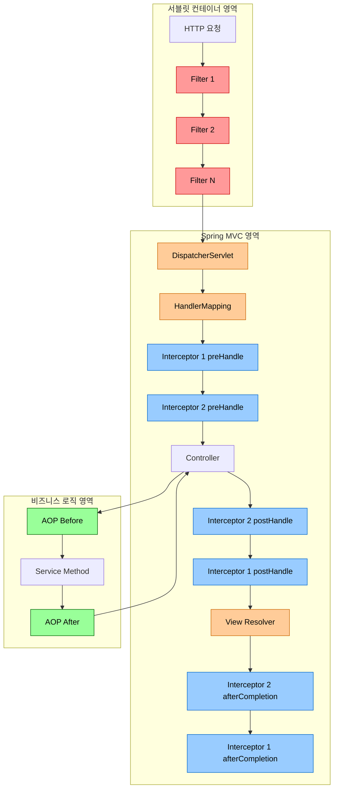
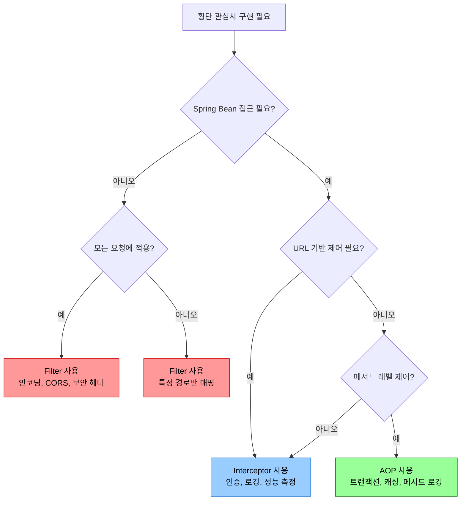
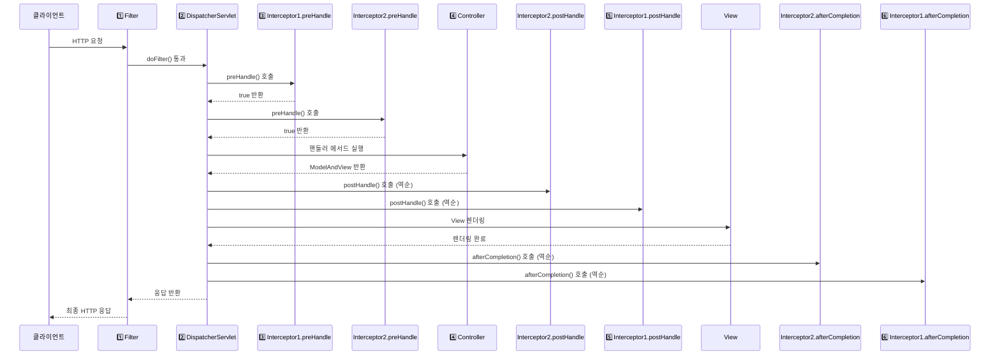
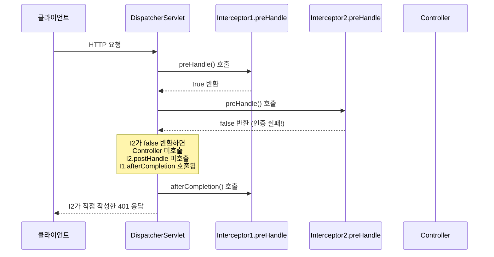
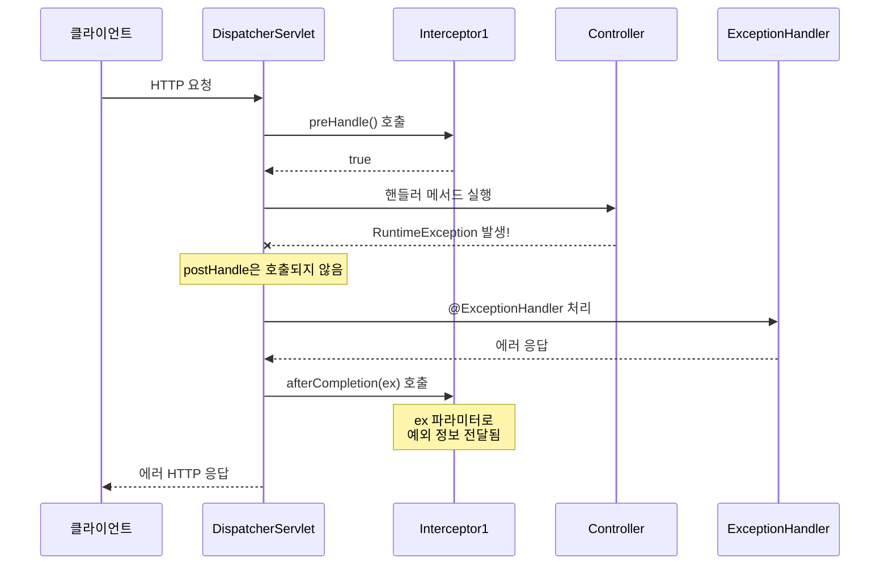
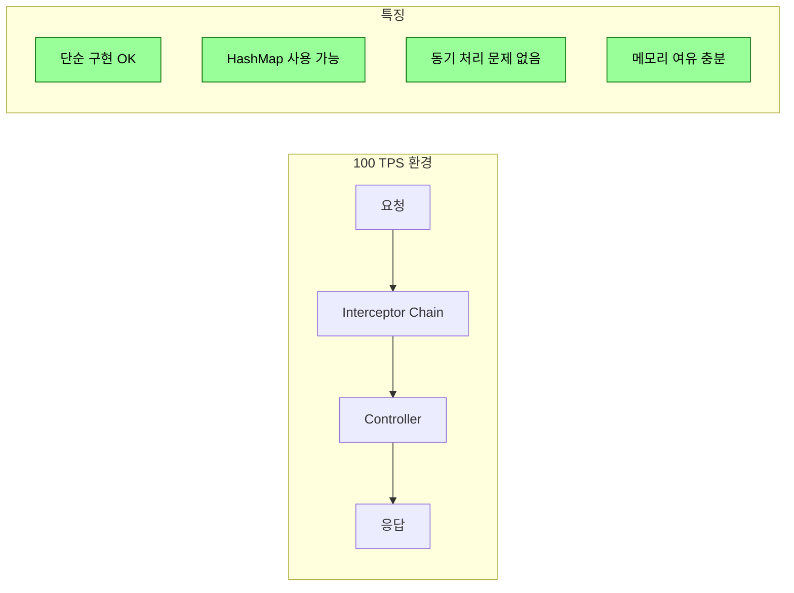
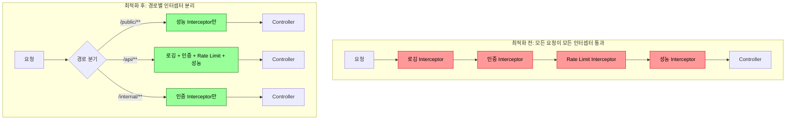
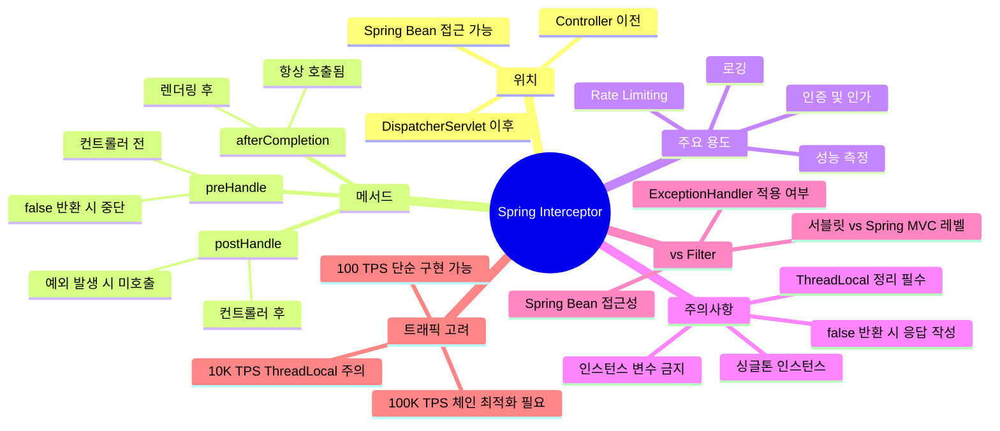

> **한 줄 요약:** Spring Interceptor는 DispatcherServlet과 Controller 사이에서 동작하는 요청/응답 가로채기 메커니즘으로, 인증·로깅·성능 측정 등 횡단 관심사를 컨트롤러 코드 오염 없이 처리하는 핵심 도구다.

---

## 공항 보안 검색대 비유로 시작하기

해외여행을 떠날 때를 상상해보자. 공항에 도착하면 비행기에 탑승하기까지 여러 단계를 거친다.

1. **공항 입구 보안 게이트** — 공항 건물 자체에 들어오는 모든 사람을 확인한다. 여행객이든 직원이든 상관없이 동일한 기본 보안 절차를 밟는다.
2. **탑승 게이트 앞 보안 검색대** — 비행기를 탈 승객에 한해 여권·탑승권을 확인하고, 신체 검색과 수하물 엑스레이를 통과시킨다. 탑승 전에 이루어지고, 탑승 후에도 기록이 남는다.
3. **기내 승무원의 서비스** — 실제 비행기 안에서 개별 승객에게 맞춤 서비스를 제공한다.

이 비유를 Spring의 처리 흐름에 대입해보면 다음과 같다.

| 공항 비유 | Spring 구성 요소 |
|---|---|
| 공항 입구 보안 게이트 | **Filter** (서블릿 컨테이너 레벨) |
| 탑승 게이트 보안 검색대 | **Interceptor** (Spring MVC 레벨) |
| 기내 승무원 | **AOP** (비즈니스 로직 레벨) |

탑승 게이트의 검색대처럼, **Interceptor는 특정 목적지(Controller)로 향하는 요청만 골라 처리하고, 도착 전(preHandle)과 도착 후(postHandle), 그리고 모든 처리가 끝난 뒤(afterCompletion) 각각 개입할 수 있다.**

---

## Interceptor란 무엇인가

### 기본 개념

Spring Interceptor는 **Spring MVC의 DispatcherServlet이 Controller를 호출하기 전후로 요청을 가로채(intercept) 공통 처리를 수행하는 컴포넌트**다.

`javax.servlet.Filter`가 서블릿 컨테이너(Tomcat 등) 레벨에서 모든 요청을 처리하는 것과 달리, Interceptor는 **Spring의 ApplicationContext 안에서 동작**하기 때문에 Spring의 모든 빈(Bean)에 자유롭게 접근할 수 있다.

```
HTTP 요청
  │
  ▼
[Tomcat / 서블릿 컨테이너]
  │
  ▼
[Filter Chain]          ← javax.servlet.Filter
  │
  ▼
[DispatcherServlet]
  │
  ▼
[HandlerMapping]
  │
  ▼
[Interceptor Chain]     ← HandlerInterceptor (여기!)
  │
  ▼
[Controller]
  │
  ▼
[Interceptor Chain]     ← postHandle / afterCompletion
  │
  ▼
HTTP 응답
```

### 왜 Interceptor가 필요한가

컨트롤러마다 인증 확인 코드를 넣는다면 어떻게 될까?

```java
// BAD: 컨트롤러마다 반복되는 인증 코드 (중복의 지옥)
@GetMapping("/orders")
public ResponseEntity<List<Order>> getOrders(HttpServletRequest request) {
    // 모든 컨트롤러에 이 코드가 반복됨
    String token = request.getHeader("Authorization");
    if (token == null || !tokenService.isValid(token)) {
        return ResponseEntity.status(401).build();
    }
    // 실제 비즈니스 로직
    return ResponseEntity.ok(orderService.findAll());
}
```

Interceptor를 사용하면 이 횡단 관심사(cross-cutting concern)를 한 곳에서 처리할 수 있다.

```java
// GOOD: Interceptor로 인증을 한 곳에서 처리
@Component
public class AuthInterceptor implements HandlerInterceptor {
    @Override
    public boolean preHandle(HttpServletRequest request,
                             HttpServletResponse response,
                             Object handler) throws Exception {
        String token = request.getHeader("Authorization");
        if (token == null || !tokenService.isValid(token)) {
            response.setStatus(401);
            return false; // 컨트롤러 진입 차단
        }
        return true;
    }
}
```

---

## Filter vs Interceptor vs AOP 상세 비교

### 비교 표

| 구분 | Filter | Interceptor | AOP |
|---|---|---|---|
| **동작 레벨** | 서블릿 컨테이너 | Spring MVC | Spring AOP (프록시) |
| **관리 주체** | 서블릿 컨테이너 (Tomcat 등) | Spring DispatcherServlet | Spring ApplicationContext |
| **Spring Bean 접근** | 제한적 (DelegatingFilterProxy 사용 시 가능) | 가능 | 가능 |
| **적용 대상** | 모든 HTTP 요청 (정적 리소스 포함) | DispatcherServlet이 처리하는 요청만 | Spring Bean의 메서드 |
| **URL 패턴 지정** | 가능 | 가능 | 불가 (포인트컷으로 메서드 지정) |
| **Request/Response 변경** | 가능 (래핑 등) | 가능 | 불가 (파라미터 수준) |
| **예외 처리** | @ExceptionHandler 미적용 | @ExceptionHandler 적용 가능 | @ExceptionHandler 적용 가능 |
| **주요 용도** | 인코딩 설정, XSS 방어, CORS, 보안 | 인증/인가, 로깅, 성능 측정 | 트랜잭션, 캐싱, 로깅 (메서드 레벨) |
| **실행 시점** | 서블릿 전/후 | 컨트롤러 전/후 | 메서드 전/후 |
| **인터페이스** | `javax.servlet.Filter` | `HandlerInterceptor` | `@Aspect` + `@Around` 등 |

### Mermaid 다이어그램: 처리 흐름 비교



### 언제 무엇을 사용해야 하는가



---

## HandlerInterceptor 인터페이스 상세 분석

### 인터페이스 정의

```java
public interface HandlerInterceptor {

    /**
     * 컨트롤러 실행 전 호출
     * @return true: 다음 단계 진행 / false: 처리 중단 (컨트롤러 미호출)
     */
    default boolean preHandle(HttpServletRequest request,
                               HttpServletResponse response,
                               Object handler) throws Exception {
        return true;
    }

    /**
     * 컨트롤러 실행 후, View 렌더링 전 호출
     * 컨트롤러에서 예외 발생 시 호출되지 않음
     */
    default void postHandle(HttpServletRequest request,
                             HttpServletResponse response,
                             Object handler,
                             @Nullable ModelAndView modelAndView) throws Exception {
    }

    /**
     * View 렌더링 완료 후 호출 (요청 처리의 가장 마지막 단계)
     * 예외 발생 여부와 관계없이 항상 호출됨 (preHandle이 true를 반환한 경우에만)
     */
    default void afterCompletion(HttpServletRequest request,
                                  HttpServletResponse response,
                                  Object handler,
                                  @Nullable Exception ex) throws Exception {
    }
}
```

### preHandle 상세 분석

```java
public boolean preHandle(HttpServletRequest request,
                          HttpServletResponse response,
                          Object handler) throws Exception
```

**호출 시점:** DispatcherServlet이 Controller를 호출하기 직전

**파라미터 분석:**
- `HttpServletRequest request`: 클라이언트의 HTTP 요청 정보 (헤더, 파라미터, 바디 등)
- `HttpServletResponse response`: HTTP 응답 객체 (이 시점에서 직접 응답 작성 가능)
- `Object handler`: 실행될 핸들러(Controller 메서드) 정보. `HandlerMethod`로 캐스팅하면 어노테이션 정보 등을 얻을 수 있음

**반환값의 의미:**
- `true` 반환: 요청 처리를 계속 진행 (다음 Interceptor 또는 Controller 호출)
- `false` 반환: 요청 처리를 여기서 중단 (Controller 호출 안 됨, 직접 응답을 작성해야 함)

```java
@Override
public boolean preHandle(HttpServletRequest request,
                          HttpServletResponse response,
                          Object handler) throws Exception {
    // handler를 HandlerMethod로 캐스팅하여 메서드/클래스 어노테이션 확인
    if (handler instanceof HandlerMethod handlerMethod) {
        // 메서드에 붙은 어노테이션 확인
        LoginRequired loginRequired =
            handlerMethod.getMethodAnnotation(LoginRequired.class);

        // 클래스에 붙은 어노테이션 확인
        if (loginRequired == null) {
            loginRequired = handlerMethod.getBeanType()
                .getAnnotation(LoginRequired.class);
        }

        if (loginRequired != null) {
            // 인증이 필요한 경우 처리
            String token = request.getHeader("Authorization");
            if (!isValidToken(token)) {
                response.setStatus(HttpServletResponse.SC_UNAUTHORIZED);
                response.setContentType("application/json;charset=UTF-8");
                response.getWriter().write("{\"error\": \"인증이 필요합니다\"}");
                return false; // 처리 중단
            }
        }
    }
    return true; // 계속 진행
}
```

### postHandle 상세 분석

```java
public void postHandle(HttpServletRequest request,
                        HttpServletResponse response,
                        Object handler,
                        @Nullable ModelAndView modelAndView) throws Exception
```

**호출 시점:** Controller 실행 완료 후, View 렌더링 전

**주의사항:**
- Controller에서 **예외가 발생하면 호출되지 않는다.**
- `ModelAndView`는 REST API (@ResponseBody, @RestController)에서는 null이다.
- Interceptor가 여러 개일 경우 **역순으로 호출**된다.

```java
@Override
public void postHandle(HttpServletRequest request,
                        HttpServletResponse response,
                        Object handler,
                        ModelAndView modelAndView) throws Exception {
    // REST API라면 modelAndView는 null
    if (modelAndView != null) {
        // 공통 모델 데이터 추가 (예: 메뉴 정보)
        modelAndView.addObject("commonMenus", menuService.getCommonMenus());
    }

    // 응답 헤더 추가
    response.setHeader("X-Processed-By", "MyApp");
}
```

### afterCompletion 상세 분석

```java
public void afterCompletion(HttpServletRequest request,
                              HttpServletResponse response,
                              Object handler,
                              @Nullable Exception ex) throws Exception
```

**호출 시점:** View 렌더링 완료 후 (요청 처리의 가장 마지막)

**핵심 특징:**
- **예외 발생 여부와 관계없이 항상 호출된다** (단, preHandle이 true를 반환한 경우에만)
- 리소스 해제, 로그 마무리 등에 적합
- 예외 정보가 파라미터로 전달된다 (`Exception ex`)
- Interceptor가 여러 개일 경우 **역순으로 호출**된다.

```java
@Override
public void afterCompletion(HttpServletRequest request,
                              HttpServletResponse response,
                              Object handler,
                              Exception ex) throws Exception {
    // 요청 처리 시간 로깅
    Long startTime = (Long) request.getAttribute("START_TIME");
    if (startTime != null) {
        long elapsed = System.currentTimeMillis() - startTime;
        log.info("[{}] {} 처리 완료 - {}ms",
            request.getMethod(), request.getRequestURI(), elapsed);
    }

    // 예외 발생 시 추가 로깅
    if (ex != null) {
        log.error("[{}] {} 예외 발생: {}",
            request.getMethod(), request.getRequestURI(), ex.getMessage());
    }

    // ThreadLocal 정리 (메모리 누수 방지!)
    RequestContextHolder.resetRequestAttributes();
}
```

---

## 실행 순서와 라이프사이클

### 정상 흐름 Sequence Diagram



### preHandle에서 false 반환 시 흐름



### 예외 발생 시 흐름



### 다중 Interceptor 실행 순서 요약

```
등록 순서: Interceptor A → Interceptor B → Interceptor C

preHandle 순서:     A → B → C  (등록 순서대로)
postHandle 순서:    C → B → A  (역순)
afterCompletion 순서: C → B → A  (역순)

B.preHandle()이 false를 반환하면:
- C.preHandle() 미호출
- C.postHandle() 미호출
- B.postHandle() 미호출
- A.postHandle() 미호출
- A.afterCompletion() 호출 (preHandle이 true를 반환했으므로)
- B.afterCompletion() 미호출 (false 반환했으므로)
```

---

## 실전 구현 예제

### 예제 1: 인증/인가 인터셉터

```java
@Slf4j
@Component
@RequiredArgsConstructor
public class AuthInterceptor implements HandlerInterceptor {

    private final JwtTokenProvider jwtTokenProvider;
    private final UserRepository userRepository;

    private static final String AUTHORIZATION_HEADER = "Authorization";
    private static final String BEARER_PREFIX = "Bearer ";

    @Override
    public boolean preHandle(HttpServletRequest request,
                              HttpServletResponse response,
                              Object handler) throws Exception {

        // 정적 리소스나 HandlerMethod가 아닌 경우 통과
        if (!(handler instanceof HandlerMethod handlerMethod)) {
            return true;
        }

        // @NoAuth 어노테이션이 있으면 인증 없이 통과
        if (handlerMethod.hasMethodAnnotation(NoAuth.class) ||
            handlerMethod.getBeanType().isAnnotationPresent(NoAuth.class)) {
            return true;
        }

        // Authorization 헤더 추출
        String authHeader = request.getHeader(AUTHORIZATION_HEADER);
        if (authHeader == null || !authHeader.startsWith(BEARER_PREFIX)) {
            sendUnauthorized(response, "인증 토큰이 없습니다");
            return false;
        }

        String token = authHeader.substring(BEARER_PREFIX.length());

        // 토큰 검증
        if (!jwtTokenProvider.validateToken(token)) {
            sendUnauthorized(response, "유효하지 않은 토큰입니다");
            return false;
        }

        // 토큰에서 사용자 정보 추출 후 request에 저장
        Long userId = jwtTokenProvider.getUserId(token);
        User user = userRepository.findById(userId)
            .orElseThrow(() -> new IllegalStateException("사용자를 찾을 수 없습니다"));

        request.setAttribute("currentUser", user);

        // 역할 기반 인가 확인
        RequireRole requireRole = handlerMethod.getMethodAnnotation(RequireRole.class);
        if (requireRole != null && !user.hasRole(requireRole.value())) {
            sendForbidden(response, "권한이 없습니다");
            return false;
        }

        log.debug("인증 성공 - userId: {}, URI: {}", userId, request.getRequestURI());
        return true;
    }

    private void sendUnauthorized(HttpServletResponse response, String message)
        throws IOException {
        response.setStatus(HttpServletResponse.SC_UNAUTHORIZED);
        writeJsonError(response, 401, message);
    }

    private void sendForbidden(HttpServletResponse response, String message)
        throws IOException {
        response.setStatus(HttpServletResponse.SC_FORBIDDEN);
        writeJsonError(response, 403, message);
    }

    private void writeJsonError(HttpServletResponse response, int code, String message)
        throws IOException {
        response.setContentType("application/json;charset=UTF-8");
        String json = String.format(
            "{\"code\":%d,\"message\":\"%s\",\"timestamp\":\"%s\"}",
            code, message, LocalDateTime.now()
        );
        response.getWriter().write(json);
    }
}
```

커스텀 어노테이션 정의:

```java
// 인증 불필요 표시
@Target({ElementType.METHOD, ElementType.TYPE})
@Retention(RetentionPolicy.RUNTIME)
public @interface NoAuth {}

// 역할 기반 인가
@Target(ElementType.METHOD)
@Retention(RetentionPolicy.RUNTIME)
public @interface RequireRole {
    String value();
}
```

사용 예:

```java
@RestController
@RequestMapping("/api")
public class UserController {

    @NoAuth
    @GetMapping("/public/health")
    public String health() { return "OK"; }

    @GetMapping("/users/me")  // 기본 인증 필요
    public UserDto getMe(@RequestAttribute("currentUser") User user) {
        return UserDto.from(user);
    }

    @RequireRole("ADMIN")
    @DeleteMapping("/users/{id}")
    public void deleteUser(@PathVariable Long id) {
        userService.delete(id);
    }
}
```

---

### 예제 2: 로깅 인터셉터

```java
@Slf4j
@Component
public class LoggingInterceptor implements HandlerInterceptor {

    private static final String START_TIME_ATTR = "LOG_START_TIME";
    private static final String REQUEST_ID_ATTR = "REQUEST_ID";

    @Override
    public boolean preHandle(HttpServletRequest request,
                              HttpServletResponse response,
                              Object handler) {
        String requestId = UUID.randomUUID().toString().substring(0, 8);
        long startTime = System.currentTimeMillis();

        request.setAttribute(START_TIME_ATTR, startTime);
        request.setAttribute(REQUEST_ID_ATTR, requestId);

        // MDC에 요청 ID 설정 (로그 추적용)
        MDC.put("requestId", requestId);

        if (handler instanceof HandlerMethod handlerMethod) {
            log.info("[{}] 요청 시작 - {} {} | Controller: {}.{}",
                requestId,
                request.getMethod(),
                request.getRequestURI(),
                handlerMethod.getBeanType().getSimpleName(),
                handlerMethod.getMethod().getName()
            );
        } else {
            log.info("[{}] 요청 시작 - {} {}",
                requestId,
                request.getMethod(),
                request.getRequestURI()
            );
        }

        // 쿼리 파라미터 로깅 (민감 정보 제외)
        if (log.isDebugEnabled()) {
            logRequestParams(request, requestId);
        }

        return true;
    }

    @Override
    public void afterCompletion(HttpServletRequest request,
                                 HttpServletResponse response,
                                 Object handler,
                                 Exception ex) {
        Long startTime = (Long) request.getAttribute(START_TIME_ATTR);
        String requestId = (String) request.getAttribute(REQUEST_ID_ATTR);

        if (startTime != null) {
            long elapsed = System.currentTimeMillis() - startTime;
            int status = response.getStatus();

            if (ex != null) {
                log.error("[{}] 요청 실패 - {} {} | status={} | elapsed={}ms | error={}",
                    requestId,
                    request.getMethod(),
                    request.getRequestURI(),
                    status,
                    elapsed,
                    ex.getMessage()
                );
            } else {
                log.info("[{}] 요청 완료 - {} {} | status={} | elapsed={}ms",
                    requestId,
                    request.getMethod(),
                    request.getRequestURI(),
                    status,
                    elapsed
                );
            }
        }

        // MDC 정리 (ThreadLocal 기반이므로 반드시 제거)
        MDC.clear();
    }

    private void logRequestParams(HttpServletRequest request, String requestId) {
        // 민감 파라미터 목록
        Set<String> sensitiveParams = Set.of("password", "token", "secret", "key");

        Map<String, String> params = new HashMap<>();
        request.getParameterMap().forEach((key, values) -> {
            if (sensitiveParams.contains(key.toLowerCase())) {
                params.put(key, "***MASKED***");
            } else {
                params.put(key, String.join(",", values));
            }
        });

        if (!params.isEmpty()) {
            log.debug("[{}] 요청 파라미터: {}", requestId, params);
        }
    }
}
```

---

### 예제 3: API 요청 시간 측정 인터셉터

성능 모니터링과 슬로우 쿼리 감지에 활용할 수 있다.

```java
@Slf4j
@Component
public class PerformanceInterceptor implements HandlerInterceptor {

    private static final String START_TIME_KEY = "PERF_START_TIME";

    // 경고 임계값 (밀리초)
    private static final long WARN_THRESHOLD_MS = 500L;
    // 에러 임계값 (밀리초)
    private static final long ERROR_THRESHOLD_MS = 2000L;

    // 메트릭 수집용 (Micrometer 활용)
    private final MeterRegistry meterRegistry;
    private final Timer.Builder timerBuilder;

    public PerformanceInterceptor(MeterRegistry meterRegistry) {
        this.meterRegistry = meterRegistry;
        this.timerBuilder = Timer.builder("http.server.requests.custom");
    }

    @Override
    public boolean preHandle(HttpServletRequest request,
                              HttpServletResponse response,
                              Object handler) {
        request.setAttribute(START_TIME_KEY, System.nanoTime());
        return true;
    }

    @Override
    public void afterCompletion(HttpServletRequest request,
                                 HttpServletResponse response,
                                 Object handler,
                                 Exception ex) {
        Long startNano = (Long) request.getAttribute(START_TIME_KEY);
        if (startNano == null) return;

        long elapsedNano = System.nanoTime() - startNano;
        long elapsedMs = elapsedNano / 1_000_000;

        String uri = request.getRequestURI();
        String method = request.getMethod();
        String status = String.valueOf(response.getStatus());

        // Micrometer 메트릭 기록
        timerBuilder
            .tag("uri", normalizeUri(uri))
            .tag("method", method)
            .tag("status", status)
            .register(meterRegistry)
            .record(elapsedNano, TimeUnit.NANOSECONDS);

        // 임계값에 따른 로그 레벨 구분
        if (elapsedMs >= ERROR_THRESHOLD_MS) {
            log.error("SLOW REQUEST - {} {} | {}ms (임계값: {}ms)",
                method, uri, elapsedMs, ERROR_THRESHOLD_MS);
        } else if (elapsedMs >= WARN_THRESHOLD_MS) {
            log.warn("SLOW REQUEST - {} {} | {}ms (임계값: {}ms)",
                method, uri, elapsedMs, WARN_THRESHOLD_MS);
        } else {
            log.debug("성능 측정 - {} {} | {}ms", method, uri, elapsedMs);
        }
    }

    /**
     * /users/123, /users/456 → /users/{id} 로 정규화
     * (메트릭 카디널리티 폭발 방지)
     */
    private String normalizeUri(String uri) {
        return uri.replaceAll("/\\d+", "/{id}");
    }
}
```

---

### 예제 4: Rate Limiting 인터셉터

```java
@Slf4j
@Component
public class RateLimitInterceptor implements HandlerInterceptor {

    // IP 당 요청 카운터 (실제 운영에서는 Redis 사용 권장)
    private final Map<String, RateLimitBucket> buckets = new ConcurrentHashMap<>();

    // 기본 설정: 분당 100 요청
    private static final int MAX_REQUESTS_PER_MINUTE = 100;
    private static final long WINDOW_MS = 60_000L;

    @Override
    public boolean preHandle(HttpServletRequest request,
                              HttpServletResponse response,
                              Object handler) throws Exception {
        String clientIp = getClientIp(request);
        String key = clientIp + ":" + request.getRequestURI();

        RateLimitBucket bucket = buckets.computeIfAbsent(key,
            k -> new RateLimitBucket(MAX_REQUESTS_PER_MINUTE, WINDOW_MS));

        if (!bucket.tryConsume()) {
            log.warn("Rate limit 초과 - IP: {}, URI: {}", clientIp, request.getRequestURI());

            response.setStatus(429); // Too Many Requests
            response.setHeader("Retry-After", String.valueOf(bucket.getRetryAfterSeconds()));
            response.setHeader("X-RateLimit-Limit", String.valueOf(MAX_REQUESTS_PER_MINUTE));
            response.setHeader("X-RateLimit-Remaining", "0");
            response.setContentType("application/json;charset=UTF-8");
            response.getWriter().write(
                "{\"error\":\"요청 한도를 초과했습니다. 잠시 후 다시 시도해주세요.\"}"
            );
            return false;
        }

        // 남은 요청 수 헤더에 추가
        response.setHeader("X-RateLimit-Limit", String.valueOf(MAX_REQUESTS_PER_MINUTE));
        response.setHeader("X-RateLimit-Remaining", String.valueOf(bucket.getRemainingRequests()));

        return true;
    }

    private String getClientIp(HttpServletRequest request) {
        // 프록시 환경에서의 실제 IP 추출
        String xForwardedFor = request.getHeader("X-Forwarded-For");
        if (xForwardedFor != null && !xForwardedFor.isBlank()) {
            return xForwardedFor.split(",")[0].trim();
        }
        String xRealIp = request.getHeader("X-Real-IP");
        if (xRealIp != null && !xRealIp.isBlank()) {
            return xRealIp;
        }
        return request.getRemoteAddr();
    }

    // 슬라이딩 윈도우 버킷 구현
    @Getter
    private static class RateLimitBucket {
        private final int maxRequests;
        private final long windowMs;
        private final Deque<Long> requestTimestamps = new ArrayDeque<>();

        RateLimitBucket(int maxRequests, long windowMs) {
            this.maxRequests = maxRequests;
            this.windowMs = windowMs;
        }

        synchronized boolean tryConsume() {
            long now = System.currentTimeMillis();
            long windowStart = now - windowMs;

            // 윈도우 밖의 오래된 요청 제거
            while (!requestTimestamps.isEmpty() &&
                   requestTimestamps.peekFirst() < windowStart) {
                requestTimestamps.pollFirst();
            }

            if (requestTimestamps.size() < maxRequests) {
                requestTimestamps.addLast(now);
                return true;
            }
            return false;
        }

        synchronized long getRetryAfterSeconds() {
            if (requestTimestamps.isEmpty()) return 0;
            long oldestRequest = requestTimestamps.peekFirst();
            return Math.max(0, (oldestRequest + windowMs - System.currentTimeMillis()) / 1000);
        }

        synchronized int getRemainingRequests() {
            return Math.max(0, maxRequests - requestTimestamps.size());
        }
    }
}
```

> 실제 운영 환경에서는 인메모리 Map 대신 Redis + Lua 스크립트를 활용하는 것이 강력히 권장된다. `ConcurrentHashMap`은 서버가 여러 대일 때 각 서버가 독립적으로 카운트하기 때문에 실제 Rate Limit 효과를 보장할 수 없다.

---

## WebMvcConfigurer로 등록하기

### 기본 등록 방법

```java
@Configuration
public class WebMvcConfig implements WebMvcConfigurer {

    private final AuthInterceptor authInterceptor;
    private final LoggingInterceptor loggingInterceptor;
    private final PerformanceInterceptor performanceInterceptor;
    private final RateLimitInterceptor rateLimitInterceptor;

    public WebMvcConfig(AuthInterceptor authInterceptor,
                        LoggingInterceptor loggingInterceptor,
                        PerformanceInterceptor performanceInterceptor,
                        RateLimitInterceptor rateLimitInterceptor) {
        this.authInterceptor = authInterceptor;
        this.loggingInterceptor = loggingInterceptor;
        this.performanceInterceptor = performanceInterceptor;
        this.rateLimitInterceptor = rateLimitInterceptor;
    }

    @Override
    public void addInterceptors(InterceptorRegistry registry) {

        // 1. 로깅 인터셉터 (모든 요청)
        registry.addInterceptor(loggingInterceptor)
                .addPathPatterns("/**")
                .order(1); // 가장 먼저 실행

        // 2. 성능 측정 인터셉터 (API 경로만)
        registry.addInterceptor(performanceInterceptor)
                .addPathPatterns("/api/**")
                .order(2);

        // 3. Rate Limiting 인터셉터 (API 경로만)
        registry.addInterceptor(rateLimitInterceptor)
                .addPathPatterns("/api/**")
                .order(3);

        // 4. 인증 인터셉터 (공개 경로 제외)
        registry.addInterceptor(authInterceptor)
                .addPathPatterns("/api/**")
                .excludePathPatterns(
                    "/api/auth/login",
                    "/api/auth/signup",
                    "/api/public/**",
                    "/api/health",
                    "/swagger-ui/**",
                    "/v3/api-docs/**"
                )
                .order(4);
    }
}
```

### order() 값과 실행 순서

```
order(1) 로깅    → order(2) 성능    → order(3) RateLimit → order(4) 인증
                  ↓ preHandle 순서 (낮은 번호 먼저)

order(4) 인증    → order(3) RateLimit → order(2) 성능    → order(1) 로깅
                  ↓ postHandle / afterCompletion 순서 (높은 번호 먼저)
```

### PathPattern 문법

| 패턴 | 설명 | 예시 |
|---|---|---|
| `/api/**` | `/api/` 이하 모든 경로 | `/api/users`, `/api/orders/1` |
| `/api/*` | `/api/` 바로 아래 한 단계 | `/api/users` (O), `/api/users/1` (X) |
| `/api/users/{id}` | 경로 변수 | `/api/users/123` |
| `/**/*.html` | `.html`로 끝나는 모든 경로 | 정적 리소스 제외에 활용 |

---

## 트래픽 시나리오별 분석

### 시나리오 1: 트래픽 적을 때 (100 TPS)



100 TPS 수준에서는 대부분의 구현이 문제없이 동작한다.

**권장 구현 방식:**
- 동기 방식의 단순한 인터셉터 구현
- 인메모리 `HashMap`이나 `ConcurrentHashMap` 사용 가능
- 복잡한 최적화 불필요

```java
// 100 TPS 환경: 단순하고 읽기 쉬운 구현 우선
@Component
public class SimpleAuthInterceptor implements HandlerInterceptor {

    @Autowired
    private TokenService tokenService;

    @Override
    public boolean preHandle(HttpServletRequest request,
                              HttpServletResponse response,
                              Object handler) throws Exception {
        String token = request.getHeader("Authorization");
        if (token == null || !tokenService.validate(token)) {
            response.sendError(401);
            return false;
        }
        return true;
    }
}
```

**주의 사항:**
- 로그를 너무 상세하게 남기면 디스크 I/O가 병목이 될 수 있다. (100 TPS도 하루 860만 요청)
- DB 조회가 포함된 인터셉터라면 커넥션 풀 설정 확인 필요

---

### 시나리오 2: 트래픽 높을 때 (10,000 TPS)

10,000 TPS는 초당 10,000개의 요청, 즉 동시에 수백~수천 개의 스레드가 Interceptor를 통과한다.

**핵심 위험 요소: ThreadLocal 메모리 누수**

```java
// 위험: ThreadLocal을 afterCompletion에서 정리하지 않으면 메모리 누수 발생
@Component
public class DangerousInterceptor implements HandlerInterceptor {

    private static final ThreadLocal<RequestContext> CONTEXT = new ThreadLocal<>();

    @Override
    public boolean preHandle(HttpServletRequest request,
                              HttpServletResponse response,
                              Object handler) {
        CONTEXT.set(new RequestContext(request)); // 설정
        return true;
    }

    @Override
    public void afterCompletion(HttpServletRequest request,
                                 HttpServletResponse response,
                                 Object handler, Exception ex) {
        CONTEXT.remove(); // 반드시 제거! 없으면 스레드 풀에서 재사용될 때 이전 값이 남음
    }
}
```

Tomcat의 스레드 풀은 요청마다 새 스레드를 만들지 않고 재사용한다. `ThreadLocal`을 정리하지 않으면 이전 요청의 데이터가 다음 요청으로 노출되는 보안 이슈와 메모리 누수가 동시에 발생한다.

**10,000 TPS 환경의 권장 구현:**

```java
@Slf4j
@Component
public class OptimizedLoggingInterceptor implements HandlerInterceptor {

    // 비동기 로그 처리로 I/O 블로킹 최소화
    private final AsyncLogger asyncLogger;

    // 인스턴스 변수는 공유 상태가 되므로 절대 요청 정보 저장 금지!
    // private String currentUser; // 절대 금지! 스레드 안전하지 않음

    @Override
    public boolean preHandle(HttpServletRequest request,
                              HttpServletResponse response,
                              Object handler) {
        // request 객체에 상태를 저장 (요청 스코프, 안전)
        request.setAttribute("START_TIME", System.nanoTime());
        return true;
    }

    @Override
    public void afterCompletion(HttpServletRequest request,
                                 HttpServletResponse response,
                                 Object handler, Exception ex) {
        Long startNano = (Long) request.getAttribute("START_TIME");
        if (startNano != null) {
            long elapsed = (System.nanoTime() - startNano) / 1_000_000;
            // 비동기로 로그 기록 (I/O 블로킹 없음)
            asyncLogger.log(request.getMethod(), request.getRequestURI(),
                response.getStatus(), elapsed);
        }
    }
}
```

**10,000 TPS 체크리스트:**

| 항목 | 위험 구현 | 안전 구현 |
|---|---|---|
| 상태 저장 | Interceptor 인스턴스 변수 | `request.setAttribute()` 또는 `ThreadLocal` + 반드시 remove |
| 로그 I/O | 동기 파일 로그 | 비동기 로거 (Logback async appender) |
| DB 조회 | 인터셉터마다 DB 조회 | 캐시 활용 (Redis, Caffeine) |
| 외부 API 호출 | 동기 HTTP 호출 | 비동기 또는 캐시 |
| 객체 생성 | 요청마다 무거운 객체 생성 | 재사용 가능한 객체 풀링 |

---

### 시나리오 3: 극한 트래픽 (100,000 TPS)

100,000 TPS에서는 Interceptor 체인 자체가 병목이 될 수 있다.

**핵심 전략: 불필요한 Interceptor 제거 + 조기 단락(Short-circuit)**

```java
@Component
public class UltraOptimizedInterceptor implements HandlerInterceptor {

    // 핫 패스: 자주 통과하는 경로를 BloomFilter나 Set으로 빠르게 처리
    private static final Set<String> WHITE_LIST_PATHS = Set.of(
        "/api/health", "/api/metrics", "/api/public/status"
    );

    // 컴파일된 패턴 재사용 (매번 컴파일 금지)
    private static final Pattern UUID_PATTERN =
        Pattern.compile("[0-9a-f]{8}-[0-9a-f]{4}-[0-9a-f]{4}-[0-9a-f]{4}-[0-9a-f]{12}");

    @Override
    public boolean preHandle(HttpServletRequest request,
                              HttpServletResponse response,
                              Object handler) {
        String uri = request.getRequestURI();

        // 화이트리스트 경로는 즉시 통과 (Set.contains는 O(1))
        if (WHITE_LIST_PATHS.contains(uri)) {
            return true;
        }

        // handler 타입 체크를 최우선으로 (가장 저렴한 연산)
        if (!(handler instanceof HandlerMethod)) {
            return true;
        }

        // 이후 비용이 드는 처리...
        return doActualWork(request, response, (HandlerMethod) handler);
    }

    private boolean doActualWork(HttpServletRequest request,
                                  HttpServletResponse response,
                                  HandlerMethod handler) {
        // 실제 처리 로직
        return true;
    }
}
```

**Interceptor 체인 최적화 원칙:**



**100,000 TPS 최적화 기법 목록:**

1. **경로 기반 분리 등록**: 불필요한 경로에 인터셉터 등록 않기
2. **토큰 검증 캐싱**: JWT 검증 결과를 짧은 TTL로 Redis 캐싱 (같은 토큰을 매 요청마다 검증하면 CPU 낭비)
3. **비동기 로깅**: Logback의 AsyncAppender 활용, 로그 버퍼링
4. **객체 재사용**: 인터셉터 인스턴스는 싱글톤으로 유지, 요청마다 새 객체 생성 최소화
5. **조기 단락**: 화이트리스트, 빠른 실패(fail-fast) 구현
6. **Rate Limit 분산화**: 인메모리 대신 Redis + Lua 스크립트 (원자적 연산)

```java
// JWT 검증 결과 캐싱 예시
@Component
public class CachedAuthInterceptor implements HandlerInterceptor {

    private final Cache<String, UserInfo> tokenCache = Caffeine.newBuilder()
        .maximumSize(50_000)    // 최대 5만 개 캐시
        .expireAfterWrite(30, TimeUnit.SECONDS)  // 30초 TTL
        .build();

    @Override
    public boolean preHandle(HttpServletRequest request,
                              HttpServletResponse response,
                              Object handler) throws Exception {
        String token = extractToken(request);
        if (token == null) {
            response.sendError(401);
            return false;
        }

        // 캐시에서 먼저 확인 (O(1), JWT 파싱/검증 생략)
        UserInfo userInfo = tokenCache.get(token, this::validateAndGetUserInfo);

        if (userInfo == null) {
            response.sendError(401);
            return false;
        }

        request.setAttribute("userInfo", userInfo);
        return true;
    }

    private UserInfo validateAndGetUserInfo(String token) {
        // 실제 JWT 검증 (캐시 미스 시에만 실행)
        try {
            return jwtProvider.parse(token);
        } catch (Exception e) {
            return null; // null은 캐시되지 않음 (Caffeine 기본 동작)
        }
    }
}
```

---

## 자주 하는 실수 TOP 5

### 실수 1: Interceptor 인스턴스 변수에 상태 저장

```java
// 위험: 멀티스레드 환경에서 데이터 오염
@Component
public class BadInterceptor implements HandlerInterceptor {
    private long startTime; // 공유 상태! 스레드 A의 값이 스레드 B에 의해 덮어쓰여짐

    @Override
    public boolean preHandle(...) {
        startTime = System.currentTimeMillis(); // 위험!
        return true;
    }

    @Override
    public void afterCompletion(...) {
        long elapsed = System.currentTimeMillis() - startTime; // 다른 스레드 값일 수 있음
    }
}

// 올바른 방법: request 객체에 저장
@Component
public class GoodInterceptor implements HandlerInterceptor {
    @Override
    public boolean preHandle(HttpServletRequest request, ...) {
        request.setAttribute("START_TIME", System.currentTimeMillis()); // 요청 스코프
        return true;
    }
}
```

### 실수 2: postHandle에서의 예외 처리를 afterCompletion으로 착각

```java
// 함정: Controller에서 예외 발생 시 postHandle은 호출되지 않는다
@Override
public void postHandle(...) {
    // Controller가 예외를 던지면 이 코드는 실행되지 않는다
    log.info("처리 완료"); // 신뢰할 수 없는 로그
}

// 올바른 방법: 리소스 해제나 반드시 실행되어야 하는 코드는 afterCompletion에
@Override
public void afterCompletion(...) {
    // 예외 여부와 관계없이 항상 실행
    log.info("처리 완료 (예외 여부: {})", ex != null);
    cleanupResources(); // 여기에 넣어야 함
}
```

### 실수 3: false 반환 후 응답 작성 누락

```java
// 위험: false만 반환하고 응답을 작성하지 않으면 클라이언트는 빈 응답을 받는다
@Override
public boolean preHandle(...) {
    if (!isAuthenticated) {
        return false; // 응답 없음! 클라이언트 hang 또는 빈 응답
    }
    return true;
}

// 올바른 방법: false 반환 전 반드시 응답 작성
@Override
public boolean preHandle(HttpServletRequest request,
                          HttpServletResponse response, ...) throws Exception {
    if (!isAuthenticated) {
        response.setStatus(401);
        response.setContentType("application/json;charset=UTF-8");
        response.getWriter().write("{\"error\":\"인증이 필요합니다\"}");
        return false;
    }
    return true;
}
```

### 실수 4: WebMvcConfigurer 대신 @Bean으로 직접 Interceptor 등록

```java
// 위험: 이 방법은 Spring Boot 자동 설정을 우회하여 예기치 않은 동작 발생 가능
@Configuration
public class BadConfig {
    @Bean
    public MappedInterceptor myInterceptor() {
        return new MappedInterceptor(new String[]{"/**"}, new AuthInterceptor()); // 비권장
    }
}

// 올바른 방법: WebMvcConfigurer.addInterceptors() 사용
@Configuration
public class GoodConfig implements WebMvcConfigurer {
    @Override
    public void addInterceptors(InterceptorRegistry registry) {
        registry.addInterceptor(new AuthInterceptor())
                .addPathPatterns("/api/**");
    }
}
```

### 실수 5: excludePathPatterns의 함정 (슬래시 처리)

```java
// 함정: 경로 끝에 슬래시가 있거나 없을 때 매칭이 다를 수 있다
registry.addInterceptor(authInterceptor)
        .addPathPatterns("/api/**")
        .excludePathPatterns("/api/public"); // /api/public/ 은 제외 안 됨!

// 안전한 방법: 슬래시 유무 모두 명시하거나 와일드카드 사용
registry.addInterceptor(authInterceptor)
        .addPathPatterns("/api/**")
        .excludePathPatterns(
            "/api/public",
            "/api/public/",
            "/api/public/**"  // 하위 경로까지 모두 제외
        );
```

---

## 면접 포인트

### Q1. Filter와 Interceptor의 가장 큰 차이점은 무엇인가요?

**모범 답변:**

Filter는 서블릿 컨테이너(Tomcat 등) 레벨에서 동작하며 Spring ApplicationContext 바깥에 위치합니다. 따라서 Spring Bean에 직접 접근하기 어렵고(DelegatingFilterProxy를 사용하면 가능), `@ExceptionHandler`로 예외 처리를 할 수 없습니다.

반면 Interceptor는 Spring MVC의 DispatcherServlet 이후에 동작하며 Spring ApplicationContext 안에 있기 때문에 모든 Spring Bean에 자유롭게 접근할 수 있고, `@ControllerAdvice`를 통한 예외 처리도 가능합니다.

실무에서는 **인코딩 설정, XSS 방어 같은 서블릿 수준 처리는 Filter**, **인증/인가, 로깅 등 Spring 컴포넌트를 활용하는 처리는 Interceptor**를 사용합니다.

---

### Q2. preHandle이 false를 반환하면 어떻게 되나요?

**모범 답변:**

`preHandle`이 `false`를 반환하면:
1. 이후 등록된 Interceptor의 `preHandle`은 호출되지 않습니다.
2. Controller(핸들러 메서드)가 호출되지 않습니다.
3. `postHandle`은 어떤 Interceptor에서도 호출되지 않습니다.
4. `false`를 반환하기 **이전**에 `preHandle`이 `true`를 반환한 Interceptor들의 `afterCompletion`은 **역순으로 호출**됩니다.

따라서 `false`를 반환하기 전에 반드시 적절한 응답(에러 코드, 메시지)을 직접 작성해야 합니다.

---

### Q3. Interceptor를 멀티스레드 환경에서 안전하게 사용하려면 어떻게 해야 하나요?

**모범 답변:**

Interceptor는 Spring에서 **싱글톤 Bean**으로 관리됩니다. 따라서 모든 요청(스레드)이 동일한 Interceptor 인스턴스를 공유합니다.

스레드 안전성을 확보하려면:
1. **인스턴스 변수에 요청별 상태를 저장하지 않는다.** 대신 `request.setAttribute()` 또는 `ThreadLocal`을 사용합니다.
2. **ThreadLocal을 사용할 경우 `afterCompletion`에서 반드시 `remove()`를 호출**합니다. Tomcat은 스레드를 재사용하기 때문에 정리하지 않으면 이전 요청의 데이터가 노출됩니다.
3. **공유 자원(캐시, 카운터 등)은 `ConcurrentHashMap`, `AtomicLong` 등 스레드 안전한 자료구조를 사용**합니다.

---

### Q4. Interceptor와 AOP는 어떤 기준으로 선택하나요?

**모범 답변:**

| 선택 기준 | Interceptor | AOP |
|---|---|---|
| 처리 단위 | HTTP 요청/응답 | 메서드 실행 |
| 적용 범위 | URL 패턴 | 클래스/메서드 (포인트컷) |
| Request/Response 접근 | 직접 가능 | 불편 (파라미터로 주입 필요) |
| 주요 사용처 | 인증, 로깅, CORS | 트랜잭션, 캐싱, 감사 로그 |

**HTTP 요청/응답을 다뤄야 하거나 URL 기반으로 적용 범위를 제어해야 하면 Interceptor**, **특정 메서드나 클래스에 횡단 관심사를 적용해야 하면 AOP**를 선택합니다.

예를 들어 "모든 `/api/admin/**` 요청에 관리자 인증 적용"은 Interceptor가 적합하고, "모든 `@Transactional` 메서드의 실행 시간 측정"은 AOP가 적합합니다.

---

### Q5. Interceptor에서 Spring Bean을 주입받아 사용할 수 있나요?

**모범 답변:**

네, 가능합니다. Interceptor를 `@Component`로 등록하거나 `@Configuration`에서 `@Bean`으로 생성하면 Spring이 관리하는 Bean이 되어 `@Autowired` 또는 생성자 주입으로 다른 Bean을 주입받을 수 있습니다.

단, `WebMvcConfigurer`에서 등록할 때 `new AuthInterceptor()` 처럼 직접 인스턴스를 생성하면 Spring이 관리하지 않아 주입이 되지 않습니다. 반드시 Spring이 관리하는 Bean을 주입받아 사용해야 합니다.

```java
// 올바른 방법
@Configuration
@RequiredArgsConstructor
public class WebMvcConfig implements WebMvcConfigurer {
    private final AuthInterceptor authInterceptor; // Spring Bean 주입

    @Override
    public void addInterceptors(InterceptorRegistry registry) {
        registry.addInterceptor(authInterceptor); // 주입받은 Bean 사용
    }
}
```

---

## 핵심 포인트 정리



### 한눈에 보는 핵심 체크리스트

| 항목 | 설명 |
|---|---|
| **위치** | DispatcherServlet ↔ Controller 사이 |
| **인터페이스** | `HandlerInterceptor` (preHandle/postHandle/afterCompletion) |
| **등록 방법** | `WebMvcConfigurer.addInterceptors()` |
| **Spring Bean 접근** | 가능 (싱글톤 Bean으로 관리) |
| **스레드 안전성** | 인스턴스 변수 사용 금지, request.setAttribute() 활용 |
| **ThreadLocal 사용 시** | afterCompletion에서 반드시 remove() 호출 |
| **false 반환 시** | 반드시 응답 직접 작성 후 반환 |
| **예외와 afterCompletion** | 예외 발생 시에도 afterCompletion은 호출됨 |
| **postHandle 주의** | 컨트롤러 예외 발생 시 호출되지 않음 |
| **실행 순서** | preHandle: 등록 순서, postHandle/afterCompletion: 역순 |

---

Spring Interceptor는 Filter보다 Spring 친화적이고 AOP보다 HTTP 수준에서 직접 다루기 쉬운 절충점에 위치한 강력한 도구다. 인증·로깅·성능 측정 같은 횡단 관심사를 컨트롤러 코드 오염 없이 처리하되, 싱글톤 특성으로 인한 스레드 안전성과 ThreadLocal 정리를 반드시 챙겨야 실무에서 문제 없이 활용할 수 있다.
