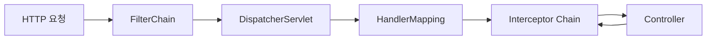
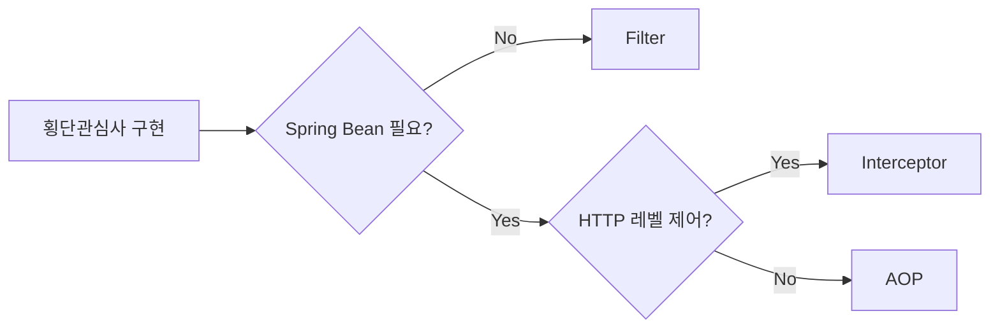
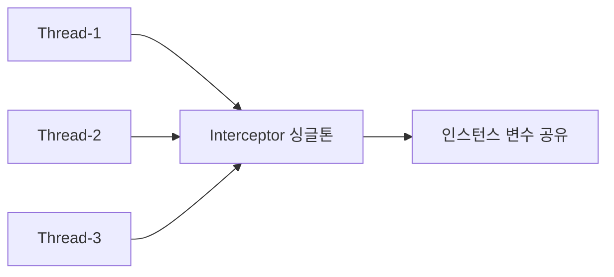
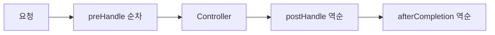

> **한 줄 요약:** Spring Interceptor는 DispatcherServlet이 HandlerMapping으로 컨트롤러를 찾은 직후, 실제 호출 직전에 끼어드는 컴포넌트다. Filter와 달리 Spring ApplicationContext 안에 존재하기 때문에 모든 Bean에 자유롭게 접근할 수 있고, preHandle/postHandle/afterCompletion 세 시점에서 요청 흐름을 정밀하게 제어할 수 있다.

---

## 1. 왜 Interceptor가 탄생했는가 — 근본적인 WHY

### 1-1. Filter만으로는 부족했던 이유

Servlet Filter는 서블릿 컨테이너(Tomcat) 레벨에서 동작한다. 이 말은 Spring ApplicationContext가 시작되기 전, 즉 **Spring의 DI 컨테이너와 완전히 분리된 공간**에서 실행된다는 뜻이다.

실제로 어떤 문제가 생기는지 보자.

```java
// Filter에서 Spring Bean을 주입받으려 하면?
public class AuthFilter implements Filter {

    // 이것은 동작하지 않는다
    // Filter는 서블릿 컨테이너가 관리하기 때문에
    // Spring의 @Autowired가 작동하는 시점이 아님
    @Autowired
    private JwtTokenProvider jwtTokenProvider; // null!

    @Override
    public void doFilter(ServletRequest request, ServletResponse response,
                         FilterChain chain) throws IOException, ServletException {
        // jwtTokenProvider는 null이다 → NullPointerException
        String token = ((HttpServletRequest) request).getHeader("Authorization");
        jwtTokenProvider.validate(token); // NPE 발생
        chain.doFilter(request, response);
    }
}
```

Spring은 이 문제를 해결하기 위해 `DelegatingFilterProxy`를 제공하지만, 이는 우회책이지 본질적인 해결책이 아니다. Filter가 Spring Context 밖에 있다는 근본 문제는 그대로다.

```
[서블릿 컨테이너 레벨]
  Filter → Filter → Servlet(DispatcherServlet)
                         |
                  [Spring Context 레벨]
                  HandlerMapping → Interceptor → Controller
```

Interceptor는 이 문제를 구조적으로 해결한다. **DispatcherServlet 안에서 실행되므로 처음부터 Spring ApplicationContext의 일부다.** Bean 주입, 예외 처리, 트랜잭션, 모두 자연스럽게 동작한다.

### 1-2. AOP만으로는 부족했던 이유

AOP는 Spring Bean의 메서드에 프록시를 씌워 동작한다. 그런데 HTTP 레벨의 작업 — 요청 헤더 읽기, 응답 상태 코드 설정, URL 패턴 기반 분기 — 을 AOP로 처리하면 극도로 불편해진다.

```java
// AOP로 HTTP 인증을 구현하면?
@Aspect
@Component
public class AuthAspect {

    @Around("@annotation(requireAuth)")
    public Object checkAuth(ProceedingJoinPoint pjp, RequireAuth requireAuth)
            throws Throwable {

        // HTTP 요청 객체를 어떻게 얻나?
        // RequestContextHolder를 써야 하는데... 이미 코드가 복잡해진다
        HttpServletRequest request =
            ((ServletRequestAttributes) RequestContextHolder.currentRequestAttributes())
            .getRequest();

        // URL 패턴 기반 제외 처리? AOP 포인트컷으로는 클래스/메서드 단위만 가능
        // /api/public/** 경로 전체를 제외하려면? 모든 메서드에 @NoAuth를 붙여야 한다
        String token = request.getHeader("Authorization");
        if (!validate(token)) {
            // 응답을 직접 조작하려면 또 RequestContextHolder를 써야 한다
            HttpServletResponse response =
                ((ServletRequestAttributes) RequestContextHolder.currentRequestAttributes())
                .getResponse();
            response.setStatus(401);
            return null; // 반환값 타입 문제도 발생
        }
        return pjp.proceed();
    }
}
```

Interceptor를 쓰면 이 모든 복잡함이 사라진다. `HttpServletRequest`와 `HttpServletResponse`를 파라미터로 바로 받고, URL 패턴은 `addPathPatterns()`로 설정 한 줄이면 된다.

**결론:** Interceptor는 "Spring Bean을 쓸 수 있는 Filter"이자 "HTTP를 직접 다룰 수 있는 AOP"다. 두 세계의 장점을 취한 절충 설계다.

---

## 2. HandlerInterceptor 라이프사이클 — 내부 메커니즘 심층 분석

### 2-1. 인터페이스 전체 구조

```java
// spring-webmvc: org.springframework.web.servlet.HandlerInterceptor
public interface HandlerInterceptor {

    // 1단계: 컨트롤러 실행 전
    default boolean preHandle(HttpServletRequest request,
                               HttpServletResponse response,
                               Object handler) throws Exception {
        return true;
    }

    // 2단계: 컨트롤러 실행 후, View 렌더링 전
    // 컨트롤러에서 예외 발생 시 호출되지 않음
    default void postHandle(HttpServletRequest request,
                             HttpServletResponse response,
                             Object handler,
                             @Nullable ModelAndView modelAndView) throws Exception {
    }

    // 3단계: View 렌더링 완료 후 (항상 호출, 예외 발생 시에도)
    // preHandle이 true를 반환한 경우에만 호출됨
    default void afterCompletion(HttpServletRequest request,
                                  HttpServletResponse response,
                                  Object handler,
                                  @Nullable Exception ex) throws Exception {
    }
}
```

세 메서드 모두 `default` 구현이 있으므로 필요한 것만 오버라이드하면 된다. Java 8 이전에는 `HandlerInterceptorAdapter`라는 추상 클래스를 상속해서 사용했지만, Spring 5.3부터 deprecated됐다.

### 2-2. preHandle — 진입 문지기

```
DispatcherServlet.doDispatch()
  → HandlerAdapter를 찾기 전에
  → applyPreHandle() 호출
    → 등록된 Interceptor 순서대로 preHandle() 실행
    → 하나라도 false 반환 시 즉시 중단, triggerAfterCompletion() 호출
```

**내부 구현 (DispatcherServlet 소스 기반):**

```java
// DispatcherServlet.doDispatch() 내부 (Spring 소스 코드 요약)
boolean applyPreHandle(HttpServletRequest request, HttpServletResponse response)
        throws Exception {
    for (int i = 0; i < this.interceptorList.size(); i++) {
        HandlerInterceptor interceptor = this.interceptorList.get(i);
        if (!interceptor.preHandle(request, response, this.handler)) {
            // false를 반환한 순간 즉시 afterCompletion 역순 호출
            triggerAfterCompletion(request, response, null);
            return false; // 컨트롤러 호출 안 됨
        }
        this.interceptorIndex = i; // 몇 번째까지 preHandle 통과했는지 기록
    }
    return true;
}
```

`interceptorIndex`를 기록하는 이유: **preHandle이 true를 반환한 인터셉터만 afterCompletion을 호출해야 하기 때문이다.** 3번 인터셉터에서 false를 반환하면 0, 1, 2번의 afterCompletion만 역순으로 호출된다.

**preHandle의 Object handler 파라미터 활용:**

```java
@Override
public boolean preHandle(HttpServletRequest request,
                          HttpServletResponse response,
                          Object handler) throws Exception {

    // 정적 리소스 요청은 HandlerMethod가 아니라 ResourceHttpRequestHandler
    if (!(handler instanceof HandlerMethod handlerMethod)) {
        return true; // 정적 리소스는 통과
    }

    // HandlerMethod로 캐스팅하면 메서드/클래스 레벨 어노테이션 모두 접근 가능
    Class<?> beanType = handlerMethod.getBeanType();
    Method method = handlerMethod.getMethod();

    // 메서드 어노테이션 우선, 없으면 클래스 어노테이션 확인
    LoginRequired anno = handlerMethod.getMethodAnnotation(LoginRequired.class);
    if (anno == null) {
        anno = AnnotationUtils.findAnnotation(beanType, LoginRequired.class);
    }

    if (anno != null) {
        // 인증 처리
        return authenticate(request, response, anno.roles());
    }

    return true;
}

private boolean authenticate(HttpServletRequest request,
                               HttpServletResponse response,
                               String[] requiredRoles) throws IOException {
    String token = extractBearerToken(request);
    if (token == null) {
        sendError(response, 401, "UNAUTHORIZED", "인증 토큰이 없습니다");
        return false;
    }

    Claims claims;
    try {
        claims = jwtProvider.parseToken(token);
    } catch (ExpiredJwtException e) {
        sendError(response, 401, "TOKEN_EXPIRED", "토큰이 만료되었습니다");
        return false;
    } catch (JwtException e) {
        sendError(response, 401, "INVALID_TOKEN", "유효하지 않은 토큰입니다");
        return false;
    }

    // 역할 검증
    if (requiredRoles.length > 0) {
        List<String> userRoles = claims.get("roles", List.class);
        boolean hasRole = Arrays.stream(requiredRoles)
            .anyMatch(userRoles::contains);
        if (!hasRole) {
            sendError(response, 403, "FORBIDDEN", "권한이 없습니다");
            return false;
        }
    }

    // 이후 컨트롤러에서 사용할 수 있도록 request에 저장
    request.setAttribute("userId", claims.getSubject());
    request.setAttribute("userRoles", claims.get("roles"));
    return true;
}

private String extractBearerToken(HttpServletRequest request) {
    String header = request.getHeader("Authorization");
    if (header != null && header.startsWith("Bearer ")) {
        return header.substring(7);
    }
    return null;
}

private void sendError(HttpServletResponse response,
                        int status, String code, String message) throws IOException {
    response.setStatus(status);
    response.setContentType("application/json;charset=UTF-8");
    String body = String.format(
        "{\"code\":\"%s\",\"message\":\"%s\",\"timestamp\":\"%s\"}",
        code, message, Instant.now()
    );
    response.getWriter().write(body);
}
```

### 2-3. postHandle — 응답 가공 시점

```
컨트롤러 실행 완료
  → ModelAndView 반환
  → applyPostHandle() 호출
    → 등록된 Interceptor 역순으로 postHandle() 실행
  → View 렌더링
```

**postHandle이 역순인 이유:** 인터셉터 체인은 스택(Stack) 구조로 동작한다. preHandle은 push(순서대로 쌓음), postHandle은 pop(역순으로 꺼냄). 이는 '안쪽'에 있는 인터셉터가 먼저 응답 처리를 할 수 있게 한다. 마치 함수 호출 스택처럼, 가장 나중에 진입한 것이 가장 먼저 빠져나온다.

```java
@Override
public void postHandle(HttpServletRequest request,
                        HttpServletResponse response,
                        Object handler,
                        @Nullable ModelAndView modelAndView) throws Exception {

    // REST API에서는 @ResponseBody를 쓰므로 ModelAndView가 null
    // 이 경우 응답 헤더만 조작 가능 (바디는 이미 직렬화됨)
    if (modelAndView == null) {
        // JSON 응답에 공통 헤더 추가
        response.setHeader("X-Api-Version", "v2");
        response.setHeader("X-Request-Id",
            (String) request.getAttribute("REQUEST_ID"));
        return;
    }

    // MVC(Thymeleaf 등) 응답에서는 ModelAndView 조작 가능
    // 공통 레이아웃 데이터 주입
    modelAndView.addObject("serverTime", LocalDateTime.now());
    modelAndView.addObject("appVersion", appConfig.getVersion());

    // 로그인 사용자 정보 모델에 추가
    User user = (User) request.getAttribute("currentUser");
    if (user != null) {
        modelAndView.addObject("loginUser", user);
    }
}
```

**주의: postHandle은 예외 발생 시 호출되지 않는다.**

```java
// Controller가 예외를 던지면 postHandle은 건너뜀
// ExceptionResolver → afterCompletion 순서로 바로 넘어감
@GetMapping("/orders/{id}")
public OrderDto getOrder(@PathVariable Long id) {
    return orderService.findById(id)
        .orElseThrow(() -> new OrderNotFoundException(id));
    // 이 예외 발생 시 postHandle 호출 안 됨
    // afterCompletion은 ex 파라미터에 예외 정보 담아서 호출됨
}
```

### 2-4. afterCompletion — 정리 책임자

```
View 렌더링 완료 (또는 예외 발생)
  → triggerAfterCompletion() 호출
    → interceptorIndex까지 역순으로 afterCompletion() 실행
    → 각 afterCompletion에서 예외 발생해도 나머지 계속 호출
```

`afterCompletion`은 **preHandle이 true를 반환한 인터셉터만** 호출된다. 이 보장 덕분에 preHandle에서 리소스를 획득하면 afterCompletion에서 항상 해제할 수 있다.

```java
@Override
public void afterCompletion(HttpServletRequest request,
                              HttpServletResponse response,
                              Object handler,
                              @Nullable Exception ex) throws Exception {

    // 1. 성능 로그 (항상 실행되어야 하므로 postHandle이 아닌 여기에)
    Long startNano = (Long) request.getAttribute("START_NANO");
    if (startNano != null) {
        long elapsedMs = (System.nanoTime() - startNano) / 1_000_000;
        String uri = request.getRequestURI();
        String method = request.getMethod();
        int status = response.getStatus();

        if (ex != null) {
            log.error("[PERF] {} {} → {} ({}ms) EXCEPTION: {}",
                method, uri, status, elapsedMs, ex.getMessage());
        } else if (elapsedMs > 1000) {
            log.warn("[PERF] SLOW {} {} → {} ({}ms)", method, uri, status, elapsedMs);
        } else {
            log.info("[PERF] {} {} → {} ({}ms)", method, uri, status, elapsedMs);
        }
    }

    // 2. MDC 정리 (스레드 풀 재사용 시 이전 요청 정보 누출 방지)
    MDC.clear();

    // 3. ThreadLocal 정리
    RequestContextHolder.resetRequestAttributes();

    // 4. 임시 파일, DB 커넥션 등 리소스 해제
    TempFileHolder tempFile = (TempFileHolder) request.getAttribute("TEMP_FILE");
    if (tempFile != null) {
        tempFile.cleanup();
    }
}
```

---

## 3. Filter vs Interceptor — 실행 순서의 정확한 이해

### 3-1. 전체 실행 흐름



1. HTTP 요청 도착
2. Filter Chain 진입 (Tomcat 레벨, Spring Context 밖)
3. DispatcherServlet 진입 (Spring MVC 진입점)
4. HandlerMapping → 어떤 컨트롤러를 실행할지 결정
5. HandlerAdapter 선택
6. **Interceptor Chain의 preHandle 순차 실행**
7. Controller(핸들러) 실행
8. **Interceptor Chain의 postHandle 역순 실행** (예외 없을 때만)
9. View 렌더링 (또는 ResponseBody 직렬화)
10. **Interceptor Chain의 afterCompletion 역순 실행** (항상)
11. Filter Chain 복귀
12. HTTP 응답 전송

### 3-2. 코드로 보는 실행 순서 증명

```java
// Filter 구현
@Component
public class TraceFilter implements Filter {
    @Override
    public void doFilter(ServletRequest req, ServletResponse res, FilterChain chain)
            throws IOException, ServletException {
        System.out.println("1. Filter - 요청 진입");
        chain.doFilter(req, res); // 이 안에서 DispatcherServlet 실행
        System.out.println("8. Filter - 응답 반환");
    }
}

// Interceptor 구현
@Component
public class TraceInterceptor implements HandlerInterceptor {
    @Override
    public boolean preHandle(HttpServletRequest req, HttpServletResponse res, Object h) {
        System.out.println("2. Interceptor preHandle");
        return true;
    }

    @Override
    public void postHandle(HttpServletRequest req, HttpServletResponse res,
                            Object h, ModelAndView mv) {
        System.out.println("5. Interceptor postHandle");
    }

    @Override
    public void afterCompletion(HttpServletRequest req, HttpServletResponse res,
                                 Object h, Exception ex) {
        System.out.println("7. Interceptor afterCompletion");
    }
}

// Controller
@RestController
public class TraceController {
    @GetMapping("/trace")
    public String trace() {
        System.out.println("3. Controller 실행");
        return "OK";
        // 반환 후: 4. @ResponseBody 직렬화
        // → 5. postHandle → 6. View 렌더링 → 7. afterCompletion → 8. Filter 복귀
    }
}

// 실행 결과:
// 1. Filter - 요청 진입
// 2. Interceptor preHandle
// 3. Controller 실행
// 5. Interceptor postHandle
// 7. Interceptor afterCompletion
// 8. Filter - 응답 반환
```

### 3-3. Filter vs Interceptor 선택 기준



| 기준 | Filter | Interceptor | AOP |
|---|---|---|---|
| **실행 위치** | Tomcat (Spring 밖) | DispatcherServlet 안 | Spring Proxy 레이어 |
| **Spring Bean 접근** | DelegatingFilterProxy 필요 | 직접 주입 가능 | 직접 주입 가능 |
| **적용 대상** | 모든 HTTP 요청 (정적 리소스 포함) | Spring이 처리하는 요청만 | Bean 메서드 |
| **Request/Response 수정** | 래핑(Wrapper) 가능 | 직접 수정 가능 | 어렵고 비자연스러움 |
| **예외 처리** | @ExceptionHandler 미작동 | @ExceptionHandler 작동 | @ExceptionHandler 작동 |
| **URL 패턴 제어** | web.xml 또는 @WebFilter | addPathPatterns() | 포인트컷(메서드 단위) |
| **실무 용도** | 인코딩, 보안 헤더, HTTPS 강제 | 인증, 로깅, Rate Limit | 트랜잭션, 캐싱, 감사 로그 |

---

## 4. HandlerMapping과 Interceptor Chain의 관계

### 4-1. HandlerMapping이 Interceptor를 포함하는 방식

Spring에서 HandlerMapping은 단순히 "URL → Handler" 매핑만 하지 않는다. `HandlerExecutionChain`이라는 객체를 반환하는데, 이 안에 Handler(컨트롤러)와 해당 요청에 적용될 Interceptor 목록이 함께 담긴다.

```java
// DispatcherServlet이 HandlerMapping에서 받아오는 것
HandlerExecutionChain mappedHandler = getHandler(processedRequest);

// HandlerExecutionChain 내부 구조
public class HandlerExecutionChain {
    private final Object handler;           // 실제 Controller 메서드
    private final List<HandlerInterceptor> interceptorList; // 적용될 Interceptor 목록
    private int interceptorIndex = -1;      // preHandle 통과한 마지막 인덱스
}
```

**핵심:** `mappedHandler.getInterceptors()`는 해당 요청 URL에 매핑된 인터셉터만 포함한다. `/api/public/**`는 제외하도록 설정한 인터셉터는 이 목록에 들어오지 않는다. 즉, 제외된 경로는 인터셉터 코드 자체가 실행되지 않는다.

### 4-2. WebMvcConfigurer가 Interceptor를 등록하는 내부 과정

```java
// WebMvcConfigurer 등록 과정 (Spring 내부)
// WebMvcConfigurationSupport → RequestMappingHandlerMapping 생성 시
// InterceptorRegistry에 등록된 인터셉터들을 MappedInterceptor로 변환
//   → HandlerMapping이 요청을 처리할 때 URL 패턴 매칭 후 적용

@Configuration
public class WebMvcConfig implements WebMvcConfigurer {

    // 빈 주입 - new로 직접 생성하면 Bean이 아니므로 @Autowired 동작 안 함
    private final AuthInterceptor authInterceptor;
    private final LoggingInterceptor loggingInterceptor;
    private final PerformanceInterceptor performanceInterceptor;
    private final RateLimitInterceptor rateLimitInterceptor;
    private final CorsInterceptor corsInterceptor;

    public WebMvcConfig(AuthInterceptor authInterceptor,
                        LoggingInterceptor loggingInterceptor,
                        PerformanceInterceptor performanceInterceptor,
                        RateLimitInterceptor rateLimitInterceptor,
                        CorsInterceptor corsInterceptor) {
        this.authInterceptor = authInterceptor;
        this.loggingInterceptor = loggingInterceptor;
        this.performanceInterceptor = performanceInterceptor;
        this.rateLimitInterceptor = rateLimitInterceptor;
        this.corsInterceptor = corsInterceptor;
    }

    @Override
    public void addInterceptors(InterceptorRegistry registry) {

        // order()는 실행 우선순위를 결정
        // 낮은 숫자가 먼저 preHandle 실행됨 (postHandle/afterCompletion은 역순)

        // 1순위: 로깅 (모든 요청 추적)
        registry.addInterceptor(loggingInterceptor)
                .addPathPatterns("/**")
                .order(1);

        // 2순위: 성능 측정 (API 경로만)
        registry.addInterceptor(performanceInterceptor)
                .addPathPatterns("/api/**")
                .order(2);

        // 3순위: Rate Limiting (API 경로만)
        registry.addInterceptor(rateLimitInterceptor)
                .addPathPatterns("/api/**")
                .order(3);

        // 4순위: 인증 (공개 경로 제외)
        registry.addInterceptor(authInterceptor)
                .addPathPatterns("/api/**")
                .excludePathPatterns(
                    "/api/auth/login",
                    "/api/auth/signup",
                    "/api/auth/refresh",
                    "/api/public/**",
                    "/api/health",
                    "/actuator/**",
                    "/swagger-ui/**",
                    "/v3/api-docs/**"
                )
                .order(4);
    }
}
```

### 4-3. 다중 Interceptor 실행 순서 상세

```
등록: A(order=1) → B(order=2) → C(order=3)

=== 정상 흐름 ===
요청 → A.preHandle → B.preHandle → C.preHandle
     → Controller 실행
     → C.postHandle → B.postHandle → A.postHandle
     → View 렌더링
     → C.afterCompletion → B.afterCompletion → A.afterCompletion

=== B.preHandle이 false 반환 ===
요청 → A.preHandle(true) → B.preHandle(false)
     ← C.preHandle 미호출
     ← Controller 미호출
     ← C.postHandle 미호출, B.postHandle 미호출, A.postHandle 미호출
     → A.afterCompletion (A만 preHandle 통과했으므로)
     ← B.afterCompletion 미호출 (false 반환했으므로)
     ← C.afterCompletion 미호출 (preHandle 미실행이므로)

=== Controller에서 예외 발생 ===
요청 → A.preHandle → B.preHandle → C.preHandle
     → Controller 실행 → 예외 발생
     ← C.postHandle 미호출 (예외 발생)
     ← B.postHandle 미호출
     ← A.postHandle 미호출
     → ExceptionResolver 처리 (예: @ExceptionHandler)
     → C.afterCompletion(ex) → B.afterCompletion(ex) → A.afterCompletion(ex)
```

---

## 5. AsyncHandlerInterceptor — 비동기 요청 처리

### 5-1. 왜 별도 인터페이스가 필요한가

Spring MVC에서 `@Async`, `Callable`, `DeferredResult`, `CompletableFuture`를 컨트롤러에서 반환하면 비동기 처리가 시작된다. 이 경우 일반 `HandlerInterceptor`는 **비동기 처리가 완료되기 전에 afterCompletion이 호출된다.** 즉, 실제 응답이 나가기 전에 정리 코드가 실행된다.

```
일반 HandlerInterceptor + 비동기 컨트롤러:

요청 스레드:
  preHandle → Controller (Callable 반환) → postHandle 미호출
            → afterCompletion 호출 ← 여기! 아직 응답 안 나감

별도 스레드:
  Callable 실행 → 응답 생성
  → 새 요청으로 재진입 → preHandle 다시 호출 → postHandle → afterCompletion
```

이 문제를 해결하는 것이 `AsyncHandlerInterceptor`다.

```java
// AsyncHandlerInterceptor는 HandlerInterceptor를 상속
public interface AsyncHandlerInterceptor extends HandlerInterceptor {

    // 비동기 처리가 시작될 때 호출
    // 이 시점에서 ThreadLocal 정리, MDC 클리어 등을 해야 함
    // (비동기 스레드에는 현재 스레드의 ThreadLocal이 복사되지 않음)
    default void afterConcurrentHandlingStarted(HttpServletRequest request,
                                                 HttpServletResponse response,
                                                 Object handler) throws Exception {
    }
}
```

### 5-2. 비동기 인터셉터 구현

```java
@Slf4j
@Component
public class AsyncLoggingInterceptor implements AsyncHandlerInterceptor {

    private static final String REQUEST_ID_KEY = "REQUEST_ID";
    private static final String START_TIME_KEY = "START_NANO";

    @Override
    public boolean preHandle(HttpServletRequest request,
                              HttpServletResponse response,
                              Object handler) throws Exception {
        String requestId = generateRequestId();
        request.setAttribute(REQUEST_ID_KEY, requestId);
        request.setAttribute(START_TIME_KEY, System.nanoTime());

        // MDC 설정 (이 스레드에서만 유효)
        MDC.put("requestId", requestId);
        MDC.put("uri", request.getRequestURI());

        log.info("[{}] 요청 시작: {} {}", requestId, request.getMethod(),
                 request.getRequestURI());
        return true;
    }

    @Override
    public void afterConcurrentHandlingStarted(HttpServletRequest request,
                                                HttpServletResponse response,
                                                Object handler) throws Exception {
        // 비동기 처리 시작 직전 호출
        // 현재 스레드의 MDC/ThreadLocal을 정리해야 함
        // (비동기 스레드는 별도 스레드이므로 상태가 공유되지 않음)
        String requestId = (String) request.getAttribute(REQUEST_ID_KEY);
        log.debug("[{}] 비동기 처리 시작, 요청 스레드 자원 정리", requestId);
        MDC.clear(); // 요청 스레드의 MDC 정리
    }

    @Override
    public void postHandle(HttpServletRequest request,
                            HttpServletResponse response,
                            Object handler,
                            @Nullable ModelAndView modelAndView) throws Exception {
        // 비동기 완료 후 재진입 시 호출
        String requestId = (String) request.getAttribute(REQUEST_ID_KEY);
        log.debug("[{}] 비동기 처리 완료 후 postHandle", requestId);
    }

    @Override
    public void afterCompletion(HttpServletRequest request,
                                 HttpServletResponse response,
                                 Object handler,
                                 @Nullable Exception ex) throws Exception {
        // 비동기 처리의 경우 비동기 완료 후 재진입된 요청의 afterCompletion
        String requestId = (String) request.getAttribute(REQUEST_ID_KEY);
        Long startNano = (Long) request.getAttribute(START_TIME_KEY);

        long elapsedMs = startNano != null
            ? (System.nanoTime() - startNano) / 1_000_000 : -1;

        log.info("[{}] 요청 완료: {} {} → {} ({}ms)",
            requestId, request.getMethod(), request.getRequestURI(),
            response.getStatus(), elapsedMs);

        MDC.clear();
    }

    private String generateRequestId() {
        return UUID.randomUUID().toString().substring(0, 8).toUpperCase();
    }
}
```

### 5-3. 비동기 컨트롤러와 조합

```java
@RestController
@RequestMapping("/api/async")
public class AsyncController {

    private final OrderService orderService;

    // Callable: 별도 스레드에서 실행, Spring MVC 스레드 풀 활용
    @GetMapping("/orders/callable")
    public Callable<List<OrderDto>> getOrdersCallable() {
        return () -> {
            // 이 코드는 별도 스레드에서 실행됨
            // AsyncHandlerInterceptor.afterConcurrentHandlingStarted 이후
            Thread.sleep(100); // 시뮬레이션
            return orderService.findAll().stream()
                .map(OrderDto::from)
                .collect(toList());
        };
    }

    // DeferredResult: 외부 이벤트 기반 응답
    @GetMapping("/orders/deferred")
    public DeferredResult<List<OrderDto>> getOrdersDeferred() {
        DeferredResult<List<OrderDto>> result = new DeferredResult<>(5000L);
        result.onTimeout(() -> result.setErrorResult(
            ResponseEntity.status(408).body("요청 시간 초과")));

        // 비동기로 결과 설정
        CompletableFuture.supplyAsync(() -> orderService.findAll())
            .thenAccept(orders ->
                result.setResult(orders.stream().map(OrderDto::from).collect(toList())));

        return result;
    }

    // CompletableFuture: Spring이 직접 비동기 처리
    @GetMapping("/orders/future")
    public CompletableFuture<List<OrderDto>> getOrdersFuture() {
        return CompletableFuture.supplyAsync(() ->
            orderService.findAll().stream()
                .map(OrderDto::from)
                .collect(toList()));
    }
}
```

---

## 6. CORS Interceptor — 원리부터 구현까지

### 6-1. CORS를 Interceptor에서 처리하는 이유

Spring Security와 `@CrossOrigin`은 각각 Filter와 HandlerMapping 레벨에서 CORS를 처리한다. 하지만 Interceptor에서 직접 처리하면 **요청별 세밀한 제어**가 가능하다. 예를 들어 인증된 사용자는 더 많은 출처(Origin)를 허용하거나, 특정 API 경로별로 다른 CORS 정책을 적용할 수 있다.

### 6-2. CORS Preflight 흐름 이해

```
브라우저 → OPTIONS 요청 (Preflight)
  headers: Origin, Access-Control-Request-Method, Access-Control-Request-Headers

서버 → 허용 응답
  headers: Access-Control-Allow-Origin, Access-Control-Allow-Methods,
           Access-Control-Allow-Headers, Access-Control-Max-Age

브라우저 → 실제 요청 (Preflight 통과 시)
  headers: Origin

서버 → 실제 응답
  headers: Access-Control-Allow-Origin (매 응답마다 포함)
```

### 6-3. CORS Interceptor 구현

```java
@Slf4j
@Component
public class CorsInterceptor implements HandlerInterceptor {

    // 허용할 출처 목록 (설정으로 관리)
    @Value("${app.cors.allowed-origins:http://localhost:3000}")
    private String allowedOriginsConfig;

    private Set<String> allowedOrigins;
    private static final Set<String> ALLOWED_METHODS =
        Set.of("GET", "POST", "PUT", "PATCH", "DELETE", "OPTIONS");
    private static final String ALLOWED_HEADERS =
        "Authorization, Content-Type, X-Requested-With, X-Request-Id";
    private static final long MAX_AGE_SECONDS = 3600L;

    @PostConstruct
    public void init() {
        allowedOrigins = Arrays.stream(allowedOriginsConfig.split(","))
            .map(String::trim)
            .collect(Collectors.toSet());
    }

    @Override
    public boolean preHandle(HttpServletRequest request,
                              HttpServletResponse response,
                              Object handler) throws Exception {
        String origin = request.getHeader("Origin");

        if (origin == null) {
            // Origin 헤더 없음 = 동일 출처 요청 → CORS 처리 불필요
            return true;
        }

        // 허용된 출처인지 확인
        if (!isOriginAllowed(origin, request)) {
            log.warn("CORS 거부: origin={}, uri={}", origin, request.getRequestURI());
            response.setStatus(HttpServletResponse.SC_FORBIDDEN);
            response.setContentType("application/json;charset=UTF-8");
            response.getWriter().write(
                "{\"error\":\"CORS_REJECTED\",\"message\":\"허용되지 않은 출처입니다\"}");
            return false;
        }

        // CORS 응답 헤더 설정
        response.setHeader("Access-Control-Allow-Origin", origin);
        response.setHeader("Access-Control-Allow-Credentials", "true");
        response.setHeader("Vary", "Origin"); // 캐시 오염 방지

        // Preflight 요청 처리 (OPTIONS)
        if ("OPTIONS".equalsIgnoreCase(request.getMethod())) {
            response.setHeader("Access-Control-Allow-Methods",
                String.join(", ", ALLOWED_METHODS));
            response.setHeader("Access-Control-Allow-Headers", ALLOWED_HEADERS);
            response.setHeader("Access-Control-Max-Age",
                String.valueOf(MAX_AGE_SECONDS));
            response.setStatus(HttpServletResponse.SC_OK);
            return false; // Preflight는 Controller 호출 없이 여기서 종료
        }

        return true;
    }

    private boolean isOriginAllowed(String origin, HttpServletRequest request) {
        // 허용 목록에 있는지 확인
        if (allowedOrigins.contains(origin)) {
            return true;
        }
        // 와일드카드 도메인 처리 (예: *.example.com)
        return allowedOrigins.stream()
            .filter(o -> o.startsWith("*."))
            .anyMatch(pattern -> {
                String domain = pattern.substring(2);
                return origin.endsWith("." + domain) || origin.equals(domain);
            });
    }
}
```

---

## 7. 인증/인가 Interceptor — JWT 기반 완전 구현

### 7-1. 어노테이션 기반 세밀한 인가 제어

```java
// 인증 없이 접근 가능한 API 표시
@Target({ElementType.METHOD, ElementType.TYPE})
@Retention(RetentionPolicy.RUNTIME)
@Documented
public @interface Public {
}

// 역할 기반 인가
@Target({ElementType.METHOD, ElementType.TYPE})
@Retention(RetentionPolicy.RUNTIME)
@Documented
public @interface RequiresRole {
    String[] value();                          // 필요한 역할
    boolean anyOf() default true;              // true: OR 조건, false: AND 조건
}

// 권한 기반 인가 (더 세밀한 제어)
@Target({ElementType.METHOD, ElementType.TYPE})
@Retention(RetentionPolicy.RUNTIME)
@Documented
public @interface RequiresPermission {
    String value();                            // 예: "order:write", "user:delete"
}
```

### 7-2. 완전한 인증/인가 Interceptor

```java
@Slf4j
@Component
@RequiredArgsConstructor
public class AuthInterceptor implements HandlerInterceptor {

    private final JwtTokenProvider jwtTokenProvider;
    private final UserCacheService userCacheService;
    private final AuditEventPublisher auditEventPublisher;

    @Override
    public boolean preHandle(HttpServletRequest request,
                              HttpServletResponse response,
                              Object handler) throws Exception {

        // HandlerMethod가 아닌 경우 (정적 리소스, ResourceHttpRequestHandler 등) 통과
        if (!(handler instanceof HandlerMethod handlerMethod)) {
            return true;
        }

        // @Public 어노테이션 확인 (메서드 > 클래스 우선순위)
        if (isPublicEndpoint(handlerMethod)) {
            return true;
        }

        // JWT 토큰 추출 및 검증
        String token = extractToken(request);
        if (token == null) {
            log.debug("인증 토큰 없음: {} {}", request.getMethod(), request.getRequestURI());
            sendJsonError(response, 401, "TOKEN_MISSING", "인증 토큰이 필요합니다");
            return false;
        }

        // 토큰 파싱 (캐시 활용)
        AuthPrincipal principal;
        try {
            principal = userCacheService.getOrValidate(token);
        } catch (TokenExpiredException e) {
            sendJsonError(response, 401, "TOKEN_EXPIRED", "토큰이 만료되었습니다. 재로그인해주세요");
            return false;
        } catch (InvalidTokenException e) {
            log.warn("유효하지 않은 토큰: {}", e.getMessage());
            sendJsonError(response, 401, "TOKEN_INVALID", "유효하지 않은 토큰입니다");
            return false;
        }

        // 계정 상태 확인 (블랙리스트, 정지 계정 등)
        if (!principal.isActive()) {
            sendJsonError(response, 403, "ACCOUNT_INACTIVE", "비활성화된 계정입니다");
            return false;
        }

        // 역할 기반 인가 확인
        RequiresRole requiresRole = getAnnotation(handlerMethod, RequiresRole.class);
        if (requiresRole != null && !hasRequiredRole(principal, requiresRole)) {
            log.warn("권한 부족: userId={}, required={}, actual={}",
                principal.getUserId(), Arrays.toString(requiresRole.value()),
                principal.getRoles());
            auditEventPublisher.publishAccessDenied(principal, request);
            sendJsonError(response, 403, "INSUFFICIENT_ROLE", "필요한 권한이 없습니다");
            return false;
        }

        // 권한 기반 인가 확인
        RequiresPermission requiresPermission =
            getAnnotation(handlerMethod, RequiresPermission.class);
        if (requiresPermission != null &&
                !principal.hasPermission(requiresPermission.value())) {
            log.warn("권한 없음: userId={}, required={}", principal.getUserId(),
                requiresPermission.value());
            sendJsonError(response, 403, "INSUFFICIENT_PERMISSION", "이 작업을 수행할 권한이 없습니다");
            return false;
        }

        // 인증 성공: 이후 컨트롤러에서 사용하도록 request에 저장
        request.setAttribute("principal", principal);
        request.setAttribute("userId", principal.getUserId());

        log.debug("인증 성공: userId={}, uri={}", principal.getUserId(),
            request.getRequestURI());
        return true;
    }

    private boolean isPublicEndpoint(HandlerMethod handlerMethod) {
        // 메서드 어노테이션 우선
        if (handlerMethod.hasMethodAnnotation(Public.class)) return true;
        // 클래스 어노테이션 확인
        return handlerMethod.getBeanType().isAnnotationPresent(Public.class);
    }

    private <A extends Annotation> A getAnnotation(HandlerMethod method,
                                                    Class<A> annotationType) {
        A anno = method.getMethodAnnotation(annotationType);
        if (anno != null) return anno;
        return AnnotationUtils.findAnnotation(method.getBeanType(), annotationType);
    }

    private boolean hasRequiredRole(AuthPrincipal principal, RequiresRole requiresRole) {
        List<String> userRoles = principal.getRoles();
        String[] required = requiresRole.value();
        if (requiresRole.anyOf()) {
            // OR: 하나라도 있으면 통과
            return Arrays.stream(required).anyMatch(userRoles::contains);
        } else {
            // AND: 모두 있어야 통과
            return Arrays.stream(required).allMatch(userRoles::contains);
        }
    }

    private String extractToken(HttpServletRequest request) {
        String header = request.getHeader("Authorization");
        if (header != null && header.startsWith("Bearer ")) {
            String token = header.substring(7).trim();
            return token.isEmpty() ? null : token;
        }
        // 쿼리 파라미터 폴백 (WebSocket 등에서 활용)
        String paramToken = request.getParameter("access_token");
        return (paramToken != null && !paramToken.isEmpty()) ? paramToken : null;
    }

    private void sendJsonError(HttpServletResponse response,
                                int status, String code, String message)
            throws IOException {
        response.setStatus(status);
        response.setContentType("application/json;charset=UTF-8");
        String body = String.format(
            "{\"success\":false,\"error\":{\"code\":\"%s\",\"message\":\"%s\"}," +
            "\"timestamp\":\"%s\"}",
            code, message, Instant.now()
        );
        response.getWriter().write(body);
    }
}
```

### 7-3. 컨트롤러에서 인증 정보 활용

```java
@RestController
@RequestMapping("/api/orders")
@RequiredArgsConstructor
public class OrderController {

    private final OrderService orderService;

    // 기본 인증 필요 (AuthInterceptor가 처리)
    @GetMapping
    public List<OrderDto> getMyOrders(
            @RequestAttribute("principal") AuthPrincipal principal) {
        return orderService.findByUserId(principal.getUserId());
    }

    // 공개 API (인증 불필요)
    @Public
    @GetMapping("/popular")
    public List<OrderDto> getPopularOrders() {
        return orderService.findPopular();
    }

    // 관리자만 접근 가능
    @RequiresRole("ADMIN")
    @GetMapping("/all")
    public List<OrderDto> getAllOrders() {
        return orderService.findAll();
    }

    // 특정 권한 필요
    @RequiresPermission("order:export")
    @GetMapping("/export")
    public ResponseEntity<byte[]> exportOrders() {
        byte[] data = orderService.exportToCsv();
        return ResponseEntity.ok()
            .header("Content-Disposition", "attachment; filename=orders.csv")
            .contentType(MediaType.TEXT_PLAIN)
            .body(data);
    }
}
```

---

## 8. 로깅/MDC Interceptor — 분산 추적 구현

### 8-1. MDC(Mapped Diagnostic Context)가 필요한 이유

MSA 환경에서는 하나의 사용자 요청이 여러 서비스를 거친다. 로그만 보면 어떤 요청에서 발생한 로그인지 추적이 불가능하다. MDC는 **현재 스레드의 로그에 공통 컨텍스트 정보를 자동으로 추가**해주는 메커니즘이다.

```yaml
# logback-spring.xml 패턴 설정
# MDC의 requestId, userId가 자동으로 로그에 포함됨
<pattern>%d{yyyy-MM-dd HH:mm:ss.SSS} [%thread] [%X{requestId}] [%X{userId}] %-5level %logger{36} - %msg%n</pattern>
```

### 8-2. MDC 기반 로깅 Interceptor

```java
@Slf4j
@Component
public class MdcLoggingInterceptor implements HandlerInterceptor {

    private static final String REQUEST_ID_HEADER = "X-Request-Id";
    private static final String TRACE_ID_HEADER = "X-Trace-Id"; // 분산 추적용
    private static final String REQUEST_ID_ATTR = "REQUEST_ID";
    private static final String START_NANO_ATTR = "START_NANO";

    // 로깅에서 제외할 경로 (헬스체크, 메트릭 등)
    private static final Set<String> SKIP_LOG_PATHS = Set.of(
        "/actuator/health", "/actuator/prometheus", "/api/health"
    );

    // 응답 바디에서 마스킹할 필드
    private static final Set<String> SENSITIVE_PARAMS = Set.of(
        "password", "token", "secret", "card_number", "cvv"
    );

    @Override
    public boolean preHandle(HttpServletRequest request,
                              HttpServletResponse response,
                              Object handler) throws Exception {

        String uri = request.getRequestURI();

        // 헬스체크 등은 로그 스킵 (노이즈 방지)
        boolean skipLog = SKIP_LOG_PATHS.contains(uri);

        // 요청 ID 생성 (상위 서비스에서 전달된 경우 재사용)
        String requestId = Optional.ofNullable(request.getHeader(REQUEST_ID_HEADER))
            .filter(h -> !h.isBlank())
            .orElse(generateRequestId());

        String traceId = Optional.ofNullable(request.getHeader(TRACE_ID_HEADER))
            .filter(h -> !h.isBlank())
            .orElse(requestId);

        // MDC 설정 (이 스레드의 모든 로그에 자동 포함)
        MDC.put("requestId", requestId);
        MDC.put("traceId", traceId);
        MDC.put("uri", uri);
        MDC.put("method", request.getMethod());
        MDC.put("clientIp", getClientIp(request));

        // 응답 헤더에 요청 ID 포함 (클라이언트 디버깅용)
        response.setHeader(REQUEST_ID_HEADER, requestId);
        response.setHeader(TRACE_ID_HEADER, traceId);

        // request에도 저장 (다른 컴포넌트에서 접근 가능)
        request.setAttribute(REQUEST_ID_ATTR, requestId);
        request.setAttribute(START_NANO_ATTR, System.nanoTime());

        if (!skipLog) {
            logRequest(request, requestId);
        }

        return true;
    }

    @Override
    public void afterCompletion(HttpServletRequest request,
                                 HttpServletResponse response,
                                 Object handler,
                                 @Nullable Exception ex) throws Exception {

        Long startNano = (Long) request.getAttribute(START_NANO_ATTR);
        String requestId = (String) request.getAttribute(REQUEST_ID_ATTR);
        long elapsedMs = startNano != null
            ? (System.nanoTime() - startNano) / 1_000_000 : -1;

        String uri = request.getRequestURI();
        boolean skipLog = SKIP_LOG_PATHS.contains(uri);

        if (!skipLog) {
            if (ex != null) {
                log.error("[{}] {} {} → {} ({}ms) EXCEPTION: {}",
                    requestId, request.getMethod(), uri,
                    response.getStatus(), elapsedMs, ex.getMessage());
            } else {
                log.info("[{}] {} {} → {} ({}ms)",
                    requestId, request.getMethod(), uri,
                    response.getStatus(), elapsedMs);
            }
        }

        // userId가 인증 인터셉터에 의해 설정된 경우 MDC에 추가 (afterCompletion에서도 유효)
        // (이미 preHandle에서 인증 처리가 완료되어 request에 저장됨)

        // MDC 반드시 정리 (스레드 풀 재사용 시 다음 요청으로 누출 방지)
        MDC.clear();
    }

    private void logRequest(HttpServletRequest request, String requestId) {
        if (log.isDebugEnabled()) {
            // 요청 파라미터 (민감 정보 마스킹)
            Map<String, String> params = new LinkedHashMap<>();
            request.getParameterMap().forEach((key, values) -> {
                String value = SENSITIVE_PARAMS.contains(key.toLowerCase())
                    ? "***" : String.join(",", values);
                params.put(key, value);
            });

            log.debug("[{}] 요청 파라미터: {}", requestId, params);

            // 주요 헤더 로깅
            List<String> logHeaders = List.of(
                "User-Agent", "Accept", "Content-Type", "X-Forwarded-For"
            );
            Map<String, String> headers = new LinkedHashMap<>();
            logHeaders.forEach(h -> {
                String val = request.getHeader(h);
                if (val != null) headers.put(h, val);
            });
            log.debug("[{}] 요청 헤더: {}", requestId, headers);
        }
    }

    private String getClientIp(HttpServletRequest request) {
        // 프록시 뒤에 있을 때 실제 클라이언트 IP 추출
        String[] headers = {
            "X-Forwarded-For", "X-Real-IP", "Proxy-Client-IP",
            "WL-Proxy-Client-IP", "HTTP_X_FORWARDED_FOR"
        };
        for (String header : headers) {
            String ip = request.getHeader(header);
            if (ip != null && !ip.isBlank() && !"unknown".equalsIgnoreCase(ip)) {
                // X-Forwarded-For는 콤마로 여러 IP가 올 수 있음 (첫 번째가 실제 클라이언트)
                return ip.split(",")[0].trim();
            }
        }
        return request.getRemoteAddr();
    }

    private String generateRequestId() {
        return UUID.randomUUID().toString().replace("-", "").substring(0, 16).toUpperCase();
    }
}
```

---

## 9. Rate Limiting Interceptor — 슬라이딩 윈도우 구현

### 9-1. 왜 Redis 기반 Rate Limiting이 필요한가

인메모리 Map 기반 Rate Limiting은 서버가 한 대일 때만 동작한다. 로드밸런서 뒤에 서버가 3대 있으면, 같은 클라이언트가 각 서버에 100개씩 총 300개 요청을 보낼 수 있다. 분산 환경에서는 **Redis를 공유 저장소로 사용**해야 한다.

### 9-2. Redis + Lua 스크립트 기반 구현

```java
@Slf4j
@Component
@RequiredArgsConstructor
public class RateLimitInterceptor implements HandlerInterceptor {

    private final StringRedisTemplate redisTemplate;

    // Lua 스크립트: 원자적 슬라이딩 윈도우 카운터
    // 여러 Redis 명령을 하나의 원자적 트랜잭션으로 실행
    private static final String RATE_LIMIT_SCRIPT = """
        local key = KEYS[1]
        local window = tonumber(ARGV[1])
        local limit = tonumber(ARGV[2])
        local now = tonumber(ARGV[3])
        local window_start = now - window

        -- 만료된 요청 제거
        redis.call('ZREMRANGEBYSCORE', key, '-inf', window_start)

        -- 현재 윈도우 내 요청 수 확인
        local count = redis.call('ZCARD', key)

        if count >= limit then
            -- 가장 오래된 요청의 만료 시간 반환 (Retry-After 계산용)
            local oldest = redis.call('ZRANGE', key, 0, 0, 'WITHSCORES')
            return {0, tonumber(oldest[2]) + window - now}
        end

        -- 현재 요청 추가
        redis.call('ZADD', key, now, now .. '-' .. math.random())
        redis.call('PEXPIRE', key, window)

        return {1, limit - count - 1}
        """;

    private final RedisScript<List<Long>> luaScript =
        RedisScript.of(RATE_LIMIT_SCRIPT, List.class);

    // Rate Limit 설정
    private static final long WINDOW_MS = 60_000L;       // 1분 윈도우
    private static final int DEFAULT_LIMIT = 100;         // 기본: 분당 100 요청
    private static final int AUTHENTICATED_LIMIT = 1000; // 인증 사용자: 분당 1000 요청

    @Override
    public boolean preHandle(HttpServletRequest request,
                              HttpServletResponse response,
                              Object handler) throws Exception {

        // Rate Limit 제외 경로
        String uri = request.getRequestURI();
        if (uri.startsWith("/actuator") || uri.startsWith("/swagger-ui")) {
            return true;
        }

        String clientKey = buildClientKey(request);
        int limit = determineLimit(request);

        try {
            List<Long> result = redisTemplate.execute(
                luaScript,
                List.of("ratelimit:" + clientKey),
                String.valueOf(WINDOW_MS),
                String.valueOf(limit),
                String.valueOf(System.currentTimeMillis())
            );

            if (result == null || result.isEmpty()) {
                log.error("Rate limit Lua 스크립트 실행 실패");
                return true; // Redis 오류 시 통과 (서비스 중단 방지)
            }

            long allowed = result.get(0);
            long remaining = result.get(1);

            // 응답 헤더 설정
            response.setHeader("X-RateLimit-Limit", String.valueOf(limit));
            response.setHeader("X-RateLimit-Remaining",
                allowed == 1 ? String.valueOf(remaining) : "0");
            response.setHeader("X-RateLimit-Window", "60");

            if (allowed == 0) {
                long retryAfterMs = remaining;
                long retryAfterSec = Math.max(1, retryAfterMs / 1000);

                log.warn("Rate limit 초과: key={}, uri={}", clientKey, uri);
                response.setStatus(429);
                response.setHeader("Retry-After", String.valueOf(retryAfterSec));
                response.setContentType("application/json;charset=UTF-8");
                response.getWriter().write(String.format(
                    "{\"error\":\"RATE_LIMIT_EXCEEDED\"," +
                    "\"message\":\"요청 한도를 초과했습니다\"," +
                    "\"retryAfter\":%d}", retryAfterSec));
                return false;
            }

            return true;

        } catch (Exception e) {
            log.error("Rate limit 처리 중 오류 발생: {}", e.getMessage(), e);
            return true; // 오류 시 통과 (가용성 우선)
        }
    }

    private String buildClientKey(HttpServletRequest request) {
        // 인증된 사용자는 userId로 키 생성 (IP 변경에도 일관된 제한)
        String userId = (String) request.getAttribute("userId");
        if (userId != null) {
            return "user:" + userId;
        }
        // 비인증 요청은 IP로 키 생성
        return "ip:" + getClientIp(request);
    }

    private int determineLimit(HttpServletRequest request) {
        // 인증된 사용자는 더 높은 한도
        if (request.getAttribute("userId") != null) {
            return AUTHENTICATED_LIMIT;
        }
        return DEFAULT_LIMIT;
    }

    private String getClientIp(HttpServletRequest request) {
        String xForwardedFor = request.getHeader("X-Forwarded-For");
        if (xForwardedFor != null && !xForwardedFor.isBlank()) {
            return xForwardedFor.split(",")[0].trim();
        }
        return request.getRemoteAddr();
    }
}
```

---

## 10. Performance Measurement Interceptor — Micrometer 연동

### 10-1. 메트릭 카디널리티 폭발 문제

URI를 그대로 메트릭 태그로 사용하면 `/users/1`, `/users/2`, `/users/999999`가 모두 별개 메트릭으로 저장된다. Prometheus 같은 시계열 DB에서 카디널리티(고유 값의 수)가 폭발하면 심각한 성능 문제가 발생한다.

```java
@Slf4j
@Component
@RequiredArgsConstructor
public class PerformanceInterceptor implements HandlerInterceptor {

    private final MeterRegistry meterRegistry;

    private static final String START_NANO_KEY = "PERF_START_NANO";
    private static final long WARN_THRESHOLD_MS = 500;
    private static final long ERROR_THRESHOLD_MS = 2000;

    @Override
    public boolean preHandle(HttpServletRequest request,
                              HttpServletResponse response,
                              Object handler) throws Exception {
        request.setAttribute(START_NANO_KEY, System.nanoTime());
        return true;
    }

    @Override
    public void afterCompletion(HttpServletRequest request,
                                 HttpServletResponse response,
                                 Object handler,
                                 @Nullable Exception ex) throws Exception {

        Long startNano = (Long) request.getAttribute(START_NANO_KEY);
        if (startNano == null) return;

        long elapsedNano = System.nanoTime() - startNano;
        long elapsedMs = elapsedNano / 1_000_000;

        // URI 정규화: /users/123 → /users/{id} (카디널리티 폭발 방지)
        String normalizedUri = normalizeUri(request, handler);
        String method = request.getMethod();
        String status = String.valueOf(response.getStatus());
        String outcome = resolveOutcome(response.getStatus());

        // Micrometer 타이머 기록
        Timer.builder("http.server.requests")
            .tag("method", method)
            .tag("uri", normalizedUri)
            .tag("status", status)
            .tag("outcome", outcome)
            .tag("exception", ex != null ? ex.getClass().getSimpleName() : "None")
            .description("HTTP 요청 처리 시간")
            .register(meterRegistry)
            .record(elapsedNano, TimeUnit.NANOSECONDS);

        // Micrometer Counter (요청 수)
        Counter.builder("http.server.requests.count")
            .tag("method", method)
            .tag("uri", normalizedUri)
            .tag("outcome", outcome)
            .register(meterRegistry)
            .increment();

        // 임계값 기반 로그
        if (elapsedMs >= ERROR_THRESHOLD_MS) {
            log.error("[SLOW] {} {} → {} {}ms (임계값: {}ms) exception={}",
                method, normalizedUri, status, elapsedMs, ERROR_THRESHOLD_MS,
                ex != null ? ex.getClass().getSimpleName() : "None");
        } else if (elapsedMs >= WARN_THRESHOLD_MS) {
            log.warn("[SLOW] {} {} → {} {}ms (임계값: {}ms)",
                method, normalizedUri, status, elapsedMs, WARN_THRESHOLD_MS);
        }
    }

    /**
     * URI 정규화: 경로 변수의 구체적인 값을 {변수명}으로 대체
     * HandlerMethod의 패턴 정보를 활용하여 정확한 정규화
     */
    private String normalizeUri(HttpServletRequest request, Object handler) {
        // HandlerMethod에서 패턴 정보 추출 (가장 정확)
        if (handler instanceof HandlerMethod) {
            Object pattern = request.getAttribute(
                HandlerMapping.BEST_MATCHING_PATTERN_ATTRIBUTE);
            if (pattern != null) {
                return pattern.toString();
            }
        }
        // 폴백: 숫자를 {id}로 치환
        String uri = request.getRequestURI();
        return uri.replaceAll("/\\d+", "/{id}")
                  .replaceAll("/[0-9a-f]{8}-[0-9a-f]{4}-[0-9a-f]{4}-[0-9a-f]{4}-[0-9a-f]{12}",
                              "/{uuid}");
    }

    private String resolveOutcome(int status) {
        if (status >= 500) return "SERVER_ERROR";
        if (status >= 400) return "CLIENT_ERROR";
        if (status >= 300) return "REDIRECTION";
        if (status >= 200) return "SUCCESS";
        return "UNKNOWN";
    }
}
```

---

## 11. 면접 포인트 5개 — 깊은 WHY 답변

### Q1. Interceptor와 Filter의 차이점을 설명하고, 각각 언제 사용하는지 말씀해주세요.

**핵심 WHY:**

Filter는 javax.servlet 스펙의 일부로, Tomcat 같은 서블릿 컨테이너가 초기화하고 관리한다. Spring ApplicationContext가 아직 시작되지 않은 시점에도 동작할 수 있으며, 이것이 핵심 차이다.

```
[Tomcat 생명주기]
  1. 서블릿 컨테이너 시작
  2. Filter 초기화 (Spring Context 없음)
  3. Spring ApplicationContext 시작
  4. DispatcherServlet 초기화
  5. 요청 처리 시작

[요청 흐름]
  HTTP → Filter(Tomcat 레벨) → DispatcherServlet → Interceptor(Spring 레벨) → Controller
```

이 구조적 차이로 인해:
- Filter에서는 `@Autowired`가 작동하지 않음 (Spring Context가 Filter를 관리하지 않음)
- Filter는 `@ExceptionHandler`나 `@ControllerAdvice`로 예외 처리 불가
- Filter는 정적 리소스(js, css, 이미지)에도 적용됨, Interceptor는 DispatcherServlet이 처리하는 요청만

```java
// 선택 기준
// Filter: Spring Bean 접근 불필요, 서블릿 수준 처리
//   → 문자 인코딩, XSS 필터, HTTPS 강제, 요청 래핑
// Interceptor: Spring Bean 필요, HTTP 요청/응답 처리
//   → JWT 인증, 요청 로깅, Rate Limiting
// AOP: 메서드 수준 처리, HTTP 관계 없음
//   → 트랜잭션, 캐싱, 메서드 실행 로깅
```

---

### Q2. preHandle이 false를 반환하면 afterCompletion은 어떻게 되나요? 내부 동작을 설명해주세요.

**핵심 WHY:**

DispatcherServlet은 `interceptorIndex`라는 변수로 몇 번째 인터셉터까지 preHandle이 true를 반환했는지 추적한다. false를 반환한 인터셉터는 afterCompletion 호출 대상에 포함되지 않는다.

```java
// DispatcherServlet 내부 (개념 코드)
int interceptorIndex = -1;

// preHandle 단계
for (int i = 0; i < interceptors.length; i++) {
    if (!interceptors[i].preHandle(request, response, handler)) {
        // false 반환: 여기서 중단
        // interceptorIndex까지만 afterCompletion 호출
        triggerAfterCompletion(request, response, null);
        return; // Controller 호출 안 됨
    }
    interceptorIndex = i; // true 반환한 마지막 인덱스 기록
}

// afterCompletion 단계 (triggerAfterCompletion)
// interceptorIndex부터 0까지 역순으로 호출
for (int i = interceptorIndex; i >= 0; i--) {
    interceptors[i].afterCompletion(request, response, handler, ex);
}
```

**실용적 함의:** preHandle에서 리소스를 획득한 경우(DB 커넥션, 파일 핸들 등) afterCompletion에서 반드시 해제해야 한다. 이 메커니즘 덕분에 "preHandle에서 true를 반환한 인터셉터는 반드시 afterCompletion이 호출된다"는 보장이 성립한다.

---

### Q3. Interceptor에서 ThreadLocal을 사용할 때 왜 afterCompletion에서 반드시 remove()를 해야 하나요?

**핵심 WHY:**

Tomcat(과 대부분의 WAS)은 스레드 풀을 사용한다. 요청마다 새 스레드를 생성하지 않고 기존 스레드를 재사용한다. ThreadLocal은 스레드에 종속된 저장소이므로, 스레드가 풀로 반환될 때 이전 요청의 데이터가 남아있으면 다음 요청에서 그 데이터를 읽게 된다.

```
[스레드 풀 재사용 시나리오]

1. 요청 A (스레드 T1): ThreadLocal에 userId=100 저장
   → preHandle: ThreadLocal.set(userId=100)
   → afterCompletion에서 remove() 안 함

2. 요청 B (스레드 T1 재사용): ThreadLocal에 userId=100이 남아있음
   → 다른 사용자의 요청인데 userId=100이 보임
   → 보안 취약점 발생!
   → 메모리 누수도 발생 (GC가 수집 못함)
```

```java
// 올바른 ThreadLocal 사용 패턴
@Component
public class SafeInterceptor implements HandlerInterceptor {

    private static final ThreadLocal<RequestContext> CONTEXT = new ThreadLocal<>();

    @Override
    public boolean preHandle(HttpServletRequest request,
                              HttpServletResponse response,
                              Object handler) {
        CONTEXT.set(new RequestContext(request)); // 설정
        return true;
    }

    @Override
    public void afterCompletion(HttpServletRequest request,
                                 HttpServletResponse response,
                                 Object handler, Exception ex) {
        CONTEXT.remove(); // 반드시 제거! try-finally 없이도 afterCompletion은 항상 호출됨
    }

    // 다른 클래스에서 접근 (서비스, 리포지토리에서)
    public static RequestContext getCurrentContext() {
        return CONTEXT.get();
    }
}
```

MDC도 동일한 이유로 `MDC.clear()`가 필수다. Logback의 MDC는 내부적으로 ThreadLocal을 사용한다.

---

### Q4. postHandle이 예외 발생 시 호출되지 않는 이유와, 이것이 실무에서 어떤 문제를 일으킬 수 있나요?

**핵심 WHY:**

DispatcherServlet의 `doDispatch()` 메서드를 보면, Controller 실행 부분이 try-catch로 감싸져 있고 예외 발생 시 postHandle을 건너뛴다.

```java
// DispatcherServlet 내부 (개념 코드)
try {
    // Controller 실행
    mv = ha.handle(processedRequest, response, mappedHandler.getHandler());
    // postHandle 호출 (예외 없을 때만 실행됨)
    mappedHandler.applyPostHandle(processedRequest, response, mv);
} catch (Exception handlerException) {
    dispatchException = handlerException;
}

// afterCompletion은 finally 블록처럼 항상 실행
processDispatchResult(processedRequest, response, mappedHandler, mv, dispatchException);
// processDispatchResult 안에서 afterCompletion 호출
```

**실무 문제 패턴:**

```java
// 안티패턴: 리소스 해제를 postHandle에 구현
@Override
public void postHandle(..., ModelAndView mv) {
    // Controller에서 예외 발생하면 이 코드 실행 안 됨
    dbConnection.close(); // 커넥션 누수!
    tempFile.delete();    // 임시 파일 미삭제!
}

// 올바른 패턴: 반드시 실행되어야 하는 코드는 afterCompletion에
@Override
public void afterCompletion(HttpServletRequest request, HttpServletResponse response,
                              Object handler, Exception ex) {
    // 예외 발생 여부와 관계없이 항상 실행
    dbConnection.close(); // 안전
    tempFile.delete();    // 안전
}
```

정리하면:
- `postHandle`: View에 공통 데이터 추가, 응답 헤더 조작 (예외 없을 때만)
- `afterCompletion`: 리소스 해제, 성능 로그, MDC/ThreadLocal 정리 (항상)

---

### Q5. Interceptor 체인에서 인터셉터가 예외를 던지면 어떻게 되나요? 극한 시나리오를 설명해주세요.

**극한 시나리오 1: preHandle에서 예외 발생**

```java
@Override
public boolean preHandle(HttpServletRequest request, ...) throws Exception {
    // 예외 발생 시 DispatcherServlet이 이를 catch
    // triggerAfterCompletion이 호출되고, 예외가 ExceptionResolver로 전달됨
    throw new RuntimeException("예상치 못한 오류");
}
```

```
결과:
- 이후 인터셉터의 preHandle 미호출
- Controller 미호출
- postHandle 미호출
- 이미 통과한 인터셉터의 afterCompletion 역순 호출 (ex 파라미터에 예외 전달)
- @ExceptionHandler가 예외 처리 (500 응답)
```

**극한 시나리오 2: afterCompletion에서 예외 발생**

```java
@Override
public void afterCompletion(HttpServletRequest request, HttpServletResponse response,
                              Object handler, Exception ex) throws Exception {
    throw new RuntimeException("afterCompletion에서 예외"); // 여기서도 예외 가능
}
```

```java
// DispatcherServlet 내부 처리
for (int i = interceptorIndex; i >= 0; i--) {
    try {
        interceptors[i].afterCompletion(request, response, handler, ex);
    } catch (Throwable ex2) {
        // afterCompletion의 예외는 로그만 남기고 나머지 afterCompletion 계속 호출
        logger.error("HandlerInterceptor.afterCompletion threw exception", ex2);
        // 이미 응답이 완료된 상태이므로 클라이언트에게 영향 없음
    }
}
```

**핵심:** afterCompletion에서 예외가 발생해도 나머지 afterCompletion은 계속 호출된다. 이미 응답이 클라이언트에게 전송된 후이므로 응답 변경은 불가하지만, 리소스 정리는 보장된다.

**극한 시나리오 3: 비동기 + 인터셉터 조합의 함정**

```java
@GetMapping("/async")
public Callable<String> asyncEndpoint() {
    return () -> {
        // 이 코드는 별도 스레드에서 실행
        // AsyncHandlerInterceptor.afterConcurrentHandlingStarted 이후
        // preHandle에서 설정한 ThreadLocal이 없음 (별도 스레드)
        String userId = SafeInterceptor.getCurrentContext().getUserId(); // null!
        return "done";
    };
}
```

해결책은 `AsyncHandlerInterceptor`를 구현하고 `afterConcurrentHandlingStarted`에서 비동기 스레드에 컨텍스트를 전달하는 것이다. 또는 `RequestContextHolder.setRequestAttributes(attributes, true)`의 `true` 파라미터로 자식 스레드에 컨텍스트를 상속시킨다.

---

## 12. 인터셉터 설계 원칙과 실수 방지

### 12-1. 싱글톤 인터셉터의 스레드 안전성



Interceptor는 Spring 싱글톤 Bean이다. 수천 개의 요청 스레드가 동일한 인터셉터 인스턴스를 동시에 사용한다. **인스턴스 변수에 요청별 상태를 저장하면 데이터 레이스(Data Race)가 발생한다.**

```java
// 위험: 인스턴스 변수에 요청 데이터 저장
@Component
public class DangerousInterceptor implements HandlerInterceptor {
    private String currentUserId;  // 수천 스레드가 동시에 쓰고 읽음 → 데이터 오염

    @Override
    public boolean preHandle(HttpServletRequest request, ...) {
        currentUserId = request.getHeader("X-User-Id"); // 위험!
        return true;
    }
}

// 안전: request 스코프에 저장
@Component
public class SafeInterceptor implements HandlerInterceptor {
    @Override
    public boolean preHandle(HttpServletRequest request, ...) {
        request.setAttribute("userId", request.getHeader("X-User-Id")); // 안전
        return true;
    }
}
```

### 12-2. false 반환 전 응답 필수 작성

```java
// 위험: 응답 없이 false 반환
@Override
public boolean preHandle(HttpServletRequest request,
                          HttpServletResponse response, Object handler) {
    if (!isValid()) {
        return false; // 클라이언트는 빈 응답 받음 (HTTP 200 + 빈 바디 또는 연결 끊김)
    }
    return true;
}

// 올바른 방법
@Override
public boolean preHandle(HttpServletRequest request,
                          HttpServletResponse response, Object handler) throws IOException {
    if (!isValid()) {
        response.setStatus(HttpServletResponse.SC_UNAUTHORIZED);
        response.setContentType("application/json;charset=UTF-8");
        response.getWriter().write("{\"error\":\"인증 필요\"}");
        return false;
    }
    return true;
}
```

### 12-3. excludePathPatterns 슬래시 함정

```java
// 함정: 슬래시 유무에 따라 매칭이 달라질 수 있음
registry.addInterceptor(authInterceptor)
        .excludePathPatterns("/api/public"); // /api/public/login은 제외 안 됨!

// 안전한 방법
registry.addInterceptor(authInterceptor)
        .excludePathPatterns(
            "/api/public",     // 슬래시 없는 정확한 경로
            "/api/public/**"   // 하위 경로 모두 제외
        );
```

### 12-4. new로 직접 생성 시 DI 실패

```java
// 위험: new로 생성하면 Spring이 관리하지 않음 → @Autowired null
@Configuration
public class BadConfig implements WebMvcConfigurer {
    @Override
    public void addInterceptors(InterceptorRegistry registry) {
        registry.addInterceptor(new AuthInterceptor()); // @Autowired 동작 안 함!
    }
}

// 올바른 방법: Spring Bean을 주입받아 사용
@Configuration
@RequiredArgsConstructor
public class GoodConfig implements WebMvcConfigurer {
    private final AuthInterceptor authInterceptor; // Spring이 주입

    @Override
    public void addInterceptors(InterceptorRegistry registry) {
        registry.addInterceptor(authInterceptor); // Spring 관리 Bean 사용
    }
}
```

---

## 13. 핵심 정리



| 단계 | 실행 조건 | 실행 순서 | 주요 용도 |
|---|---|---|---|
| **preHandle** | 항상 (등록 순서대로) | 1→2→3 | 인증, Rate Limit, 로깅 시작 |
| **postHandle** | Controller 정상 완료 시만 | 3→2→1 | 응답 헤더 추가, 모델 데이터 주입 |
| **afterCompletion** | preHandle true 반환한 경우만 (예외와 무관) | 3→2→1 | 리소스 해제, 성능 로그, MDC 정리 |

**인터셉터 선택 체크리스트:**
1. Spring Bean이 필요한가? → Filter 대신 Interceptor
2. URL 패턴으로 제어가 필요한가? → AOP 대신 Interceptor
3. HTTP Request/Response를 직접 다뤄야 하는가? → Interceptor
4. 특정 메서드/클래스에만 적용하고 싶은가? → AOP 고려
5. 서블릿 수준의 전처리인가? → Filter

**스레드 안전 원칙:**
- 인터셉터 인스턴스 변수에 요청별 상태 저장 금지
- ThreadLocal 사용 시 afterCompletion에서 반드시 `remove()`
- MDC 설정 시 afterCompletion에서 반드시 `MDC.clear()`
- 분산 환경 Rate Limiting은 Redis + Lua 스크립트 활용

**비동기 주의사항:**
- `@Async`, `Callable`, `DeferredResult` 사용 시 `AsyncHandlerInterceptor` 구현
- `afterConcurrentHandlingStarted`에서 요청 스레드 정리
- 비동기 스레드에 컨텍스트 전달 시 `RequestContextHolder.setRequestAttributes(attrs, true)`
