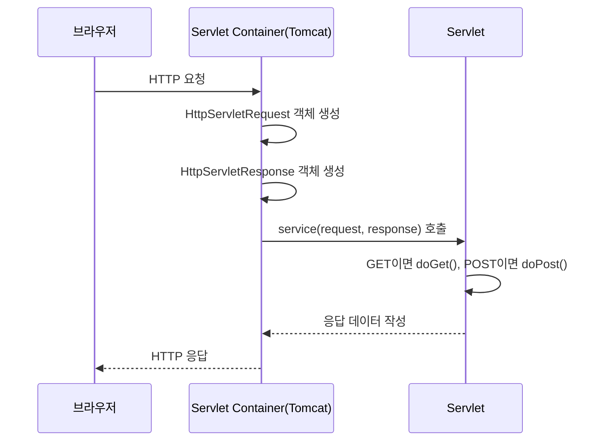
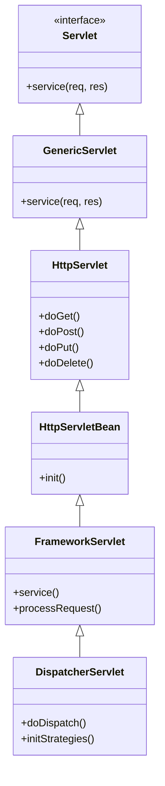
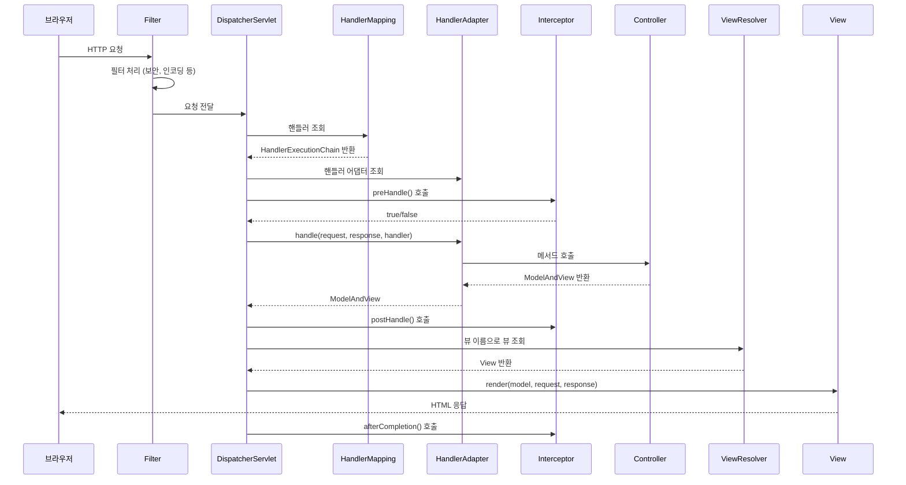
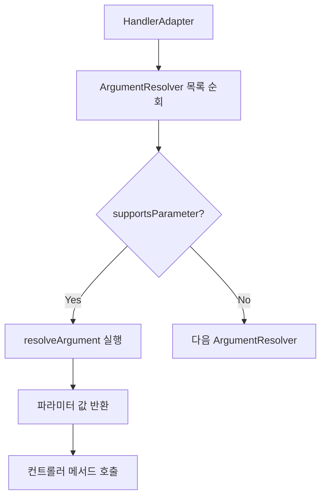
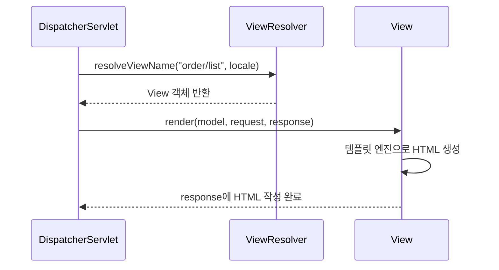
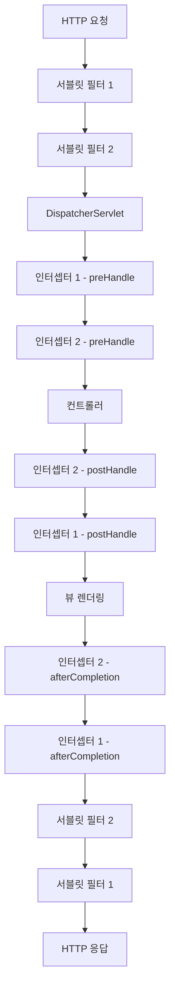

## 1. 비유로 이해하기 — 대형 호텔의 프런트 데스크

대형 호텔에 손님이 들어왔습니다. 손님은 무엇을 원하는지 프런트 데스크(DispatcherServlet)에 말합니다. 프런트는 "어느 직원이 담당인지"(HandlerMapping) 찾고, 해당 직원을 "어떻게 응대할지"(HandlerAdapter) 알아서 연결합니다. 직원이 업무를 처리하고(Controller), 결과를 어떻게 보여줄지(ViewResolver) 결정합니다.

이것이 Spring MVC의 핵심 흐름입니다.

---

## 2. 서블릿(Servlet) 기초

### 2.1 HTTP 요청 처리 방식



### 2.2 서블릿 컨테이너

```java
// 기본 서블릿 작성 예시
@WebServlet(name = "helloServlet", urlPatterns = "/hello")
public class HelloServlet extends HttpServlet {

    @Override
    protected void service(HttpServletRequest request, HttpServletResponse response)
            throws ServletException, IOException {

        String username = request.getParameter("username");
        System.out.println("username = " + username);

        response.setContentType("text/plain");
        response.setCharacterEncoding("utf-8");
        response.getWriter().write("hello " + username);
    }
}
```

---

## 3. DispatcherServlet — Spring MVC의 핵심

### 3.1 DispatcherServlet 계층 구조



### 3.2 DispatcherServlet 내부 초기화

```java
// DispatcherServlet.initStrategies() 요약
protected void initStrategies(ApplicationContext context) {
    initMultipartResolver(context);          // 파일 업로드
    initLocaleResolver(context);             // 다국어
    initThemeResolver(context);              // 테마
    initHandlerMappings(context);            // 핸들러 매핑 목록
    initHandlerAdapters(context);            // 핸들러 어댑터 목록
    initHandlerExceptionResolvers(context);  // 예외 처리
    initRequestToViewNameTranslator(context);
    initViewResolvers(context);              // 뷰 리졸버 목록
    initFlashMapManager(context);
}
```

---

## 4. Spring MVC 요청 처리 전체 흐름



---

## 5. HandlerMapping

### 5.1 HandlerMapping 종류

```mermaid
graph TD
    A[HandlerMapping] --> B[RequestMappingHandlerMapping]
    A --> C[BeanNameUrlHandlerMapping]
    A --> D[RouterFunctionMapping]
    A --> E[SimpleUrlHandlerMapping]

    B -->|@RequestMapping 기반| F[가장 많이 사용]
    C -->|빈 이름이 URL| G[레거시]
    D -->|WebFlux RouterFunction| H[함수형 엔드포인트]
    E -->|URL 패턴 직접 매핑| I[정적 자원]
```

### 5.2 @RequestMapping 상세

```java
@Controller
@RequestMapping("/orders")  // 클래스 레벨 공통 경로
public class OrderController {

    // GET /orders
    @GetMapping
    public String list(Model model) {
        model.addAttribute("orders", orderService.findAll());
        return "order/list";
    }

    // GET /orders/{id}
    @GetMapping("/{id}")
    public String detail(@PathVariable Long id, Model model) {
        model.addAttribute("order", orderService.findById(id));
        return "order/detail";
    }

    // POST /orders
    @PostMapping
    public String create(@ModelAttribute OrderCreateRequest request,
                         BindingResult bindingResult) {
        if (bindingResult.hasErrors()) {
            return "order/createForm";
        }
        orderService.create(request);
        return "redirect:/orders";
    }

    // PUT /orders/{id}
    @PutMapping("/{id}")
    @ResponseBody
    public ResponseEntity<OrderResponse> update(
            @PathVariable Long id,
            @RequestBody @Valid OrderUpdateRequest request) {
        return ResponseEntity.ok(orderService.update(id, request));
    }

    // DELETE /orders/{id}
    @DeleteMapping("/{id}")
    @ResponseStatus(HttpStatus.NO_CONTENT)
    public void delete(@PathVariable Long id) {
        orderService.delete(id);
    }
}
```

---

## 6. HandlerAdapter

### 6.1 HandlerAdapter 종류

| 어댑터 | 처리 대상 | 우선순위 |
|--------|----------|---------|
| RequestMappingHandlerAdapter | @RequestMapping 메서드 | 높음 |
| HttpRequestHandlerAdapter | HttpRequestHandler 구현체 | 중간 |
| SimpleControllerHandlerAdapter | Controller 인터페이스 구현체 | 낮음 |

### 6.2 ArgumentResolver — 메서드 파라미터 처리



```java
// Spring이 자동으로 처리하는 파라미터들
@GetMapping("/example")
public String example(
    HttpServletRequest request,      // 서블릿 요청
    HttpServletResponse response,    // 서블릿 응답
    HttpSession session,             // 세션
    @RequestParam String name,       // 쿼리 파라미터
    @PathVariable Long id,           // 경로 변수
    @RequestHeader String accept,    // 헤더
    @CookieValue String token,       // 쿠키
    @RequestBody UserDto body,       // JSON 바디
    @ModelAttribute UserForm form,   // 폼 데이터
    @RequestAttribute String attr,   // request attribute
    Model model,                     // 모델
    Errors errors,                   // 검증 에러
    Principal principal,             // 인증 정보
    Locale locale                    // 로케일
) {
    return "view";
}
```

### 6.3 커스텀 ArgumentResolver

```java
// 커스텀 어노테이션
@Target(ElementType.PARAMETER)
@Retention(RetentionPolicy.RUNTIME)
public @interface LoginMember {}

// ArgumentResolver 구현
@Component
public class LoginMemberArgumentResolver implements HandlerMethodArgumentResolver {

    @Override
    public boolean supportsParameter(MethodParameter parameter) {
        return parameter.hasParameterAnnotation(LoginMember.class)
            && Member.class.isAssignableFrom(parameter.getParameterType());
    }

    @Override
    public Object resolveArgument(MethodParameter parameter,
                                   ModelAndViewContainer mavContainer,
                                   NativeWebRequest webRequest,
                                   WebDataBinderFactory binderFactory) {
        HttpSession session = ((HttpServletRequest) webRequest.getNativeRequest()).getSession();
        return session.getAttribute("loginMember");
    }
}

// WebMvcConfigurer에 등록
@Configuration
public class WebConfig implements WebMvcConfigurer {

    @Override
    public void addArgumentResolvers(List<HandlerMethodArgumentResolver> resolvers) {
        resolvers.add(new LoginMemberArgumentResolver());
    }
}

// 컨트롤러에서 사용
@GetMapping("/my-page")
public String myPage(@LoginMember Member loginMember, Model model) {
    model.addAttribute("member", loginMember);
    return "member/myPage";
}
```

---

## 7. ViewResolver

### 7.1 ViewResolver 종류

```java
// InternalResourceViewResolver (JSP)
@Bean
public InternalResourceViewResolver viewResolver() {
    InternalResourceViewResolver resolver = new InternalResourceViewResolver();
    resolver.setPrefix("/WEB-INF/views/");
    resolver.setSuffix(".jsp");
    return resolver;
}

// ThymeleafViewResolver (Spring Boot 자동 구성)
// spring.thymeleaf.prefix=classpath:/templates/
// spring.thymeleaf.suffix=.html
```

### 7.2 View 렌더링 흐름



---

## 8. 필터(Filter) vs 인터셉터(Interceptor)

### 8.1 구조적 차이



### 8.2 필터 구현

```java
@Component
public class LogFilter implements Filter {

    @Override
    public void init(FilterConfig filterConfig) throws ServletException {
        log.info("LogFilter.init");
    }

    @Override
    public void doFilter(ServletRequest request, ServletResponse response,
                         FilterChain chain) throws IOException, ServletException {
        HttpServletRequest httpRequest = (HttpServletRequest) request;
        String requestURI = httpRequest.getRequestURI();
        String uuid = UUID.randomUUID().toString();

        try {
            log.info("REQUEST [{}][{}]", uuid, requestURI);
            chain.doFilter(request, response); // 다음 필터 또는 서블릿 호출
        } catch (Exception e) {
            throw e;
        } finally {
            log.info("RESPONSE [{}][{}]", uuid, requestURI);
        }
    }

    @Override
    public void destroy() {
        log.info("LogFilter.destroy");
    }
}

// FilterRegistrationBean으로 등록
@Bean
public FilterRegistrationBean<LogFilter> logFilter() {
    FilterRegistrationBean<LogFilter> filterRegistrationBean = new FilterRegistrationBean<>();
    filterRegistrationBean.setFilter(new LogFilter());
    filterRegistrationBean.setOrder(1);
    filterRegistrationBean.addUrlPatterns("/*");
    return filterRegistrationBean;
}
```

### 8.3 인터셉터 구현

```java
@Component
public class LoginCheckInterceptor implements HandlerInterceptor {

    @Override
    public boolean preHandle(HttpServletRequest request, HttpServletResponse response,
                             Object handler) throws Exception {
        String requestURI = request.getRequestURI();
        log.info("인증 체크 인터셉터 실행 {}", requestURI);

        HttpSession session = request.getSession(false);
        if (session == null || session.getAttribute("loginMember") == null) {
            log.info("미인증 사용자 요청");
            response.sendRedirect("/login?redirectURL=" + requestURI);
            return false; // 컨트롤러 호출 안 함
        }
        return true; // 컨트롤러 호출
    }

    @Override
    public void postHandle(HttpServletRequest request, HttpServletResponse response,
                          Object handler, ModelAndView modelAndView) throws Exception {
        log.info("postHandle [{}]", modelAndView);
    }

    @Override
    public void afterCompletion(HttpServletRequest request, HttpServletResponse response,
                                Object handler, Exception ex) throws Exception {
        if (ex != null) {
            log.error("afterCompletion error", ex);
        }
    }
}

// 인터셉터 등록
@Configuration
public class WebConfig implements WebMvcConfigurer {

    @Override
    public void addInterceptors(InterceptorRegistry registry) {
        registry.addInterceptor(new LoginCheckInterceptor())
            .order(2)
            .addPathPatterns("/**")
            .excludePathPatterns("/", "/members/add", "/login", "/logout",
                                 "/css/**", "/*.ico", "/error");
    }
}
```

### 8.4 필터 vs 인터셉터 비교

| 비교 항목 | 필터 | 인터셉터 |
|----------|------|---------|
| 관리 주체 | 서블릿 컨테이너 | Spring MVC |
| 적용 범위 | DispatcherServlet 이전 | DispatcherServlet 이후 |
| Spring 빈 사용 | 어려움 (DelegatingFilterProxy 필요) | 쉬움 (@Autowired 가능) |
| 예외 처리 | ExceptionHandler 미적용 | ExceptionHandler 적용 가능 |
| 사용 목적 | XSS 방어, CORS, 인코딩 | 인증/인가, 로깅, 공통 처리 |
| handler 정보 | X | O |

---

## 9. 예외 처리

### 9.1 @ExceptionHandler

```java
@RestController
public class OrderController {

    @GetMapping("/orders/{id}")
    public OrderResponse getOrder(@PathVariable Long id) {
        return orderService.findById(id); // OrderNotFoundException 발생 가능
    }

    // 컨트롤러 내부에서만 적용
    @ExceptionHandler(OrderNotFoundException.class)
    public ResponseEntity<ErrorResponse> handleOrderNotFound(OrderNotFoundException e) {
        ErrorResponse error = new ErrorResponse("ORDER_NOT_FOUND", e.getMessage());
        return ResponseEntity.status(HttpStatus.NOT_FOUND).body(error);
    }
}
```

### 9.2 @ControllerAdvice — 전역 예외 처리

```java
@RestControllerAdvice
public class GlobalExceptionHandler {

    // 비즈니스 예외
    @ExceptionHandler(BusinessException.class)
    public ResponseEntity<ErrorResponse> handleBusinessException(BusinessException e) {
        log.error("BusinessException: {}", e.getMessage());
        return ResponseEntity
            .status(e.getErrorCode().getHttpStatus())
            .body(ErrorResponse.of(e.getErrorCode()));
    }

    // 입력 값 검증 실패
    @ExceptionHandler(MethodArgumentNotValidException.class)
    public ResponseEntity<ErrorResponse> handleValidationException(
            MethodArgumentNotValidException e) {
        List<FieldError> fieldErrors = e.getBindingResult().getFieldErrors();
        String message = fieldErrors.stream()
            .map(fe -> fe.getField() + ": " + fe.getDefaultMessage())
            .collect(Collectors.joining(", "));
        return ResponseEntity.badRequest()
            .body(ErrorResponse.of("VALIDATION_ERROR", message));
    }

    // 타입 불일치
    @ExceptionHandler(MethodArgumentTypeMismatchException.class)
    public ResponseEntity<ErrorResponse> handleTypeMismatch(
            MethodArgumentTypeMismatchException e) {
        return ResponseEntity.badRequest()
            .body(ErrorResponse.of("TYPE_MISMATCH", e.getMessage()));
    }

    // 나머지 모든 예외
    @ExceptionHandler(Exception.class)
    public ResponseEntity<ErrorResponse> handleException(Exception e) {
        log.error("Unexpected error", e);
        return ResponseEntity.internalServerError()
            .body(ErrorResponse.of("INTERNAL_ERROR", "서버 오류가 발생했습니다."));
    }
}
```

### 9.3 예외 처리 흐름

```mermaid
flowchart TD
    A[컨트롤러에서 예외 발생] --> B[HandlerExceptionResolver 체인]
    B --> C[ExceptionHandlerExceptionResolver]
    C --> D{@ExceptionHandler 있음?}
    D -->|Yes| E[@ExceptionHandler 메서드 실행]
    D -->|No| F[ResponseStatusExceptionResolver]
    F --> G{@ResponseStatus 있음?}
    G -->|Yes| H[HTTP 상태코드로 응답]
    G -->|No| I[DefaultHandlerExceptionResolver]
    I --> J{Spring MVC 표준 예외?}
    J -->|Yes| K[적절한 HTTP 응답]
    J -->|No| L[500 Internal Server Error]
```

---

## 10. HTTP 메시지 컨버터

### 10.1 동작 원리

```java
// @ResponseBody 또는 @RestController 사용 시
@GetMapping("/api/orders/{id}")
@ResponseBody
public OrderResponse getOrder(@PathVariable Long id) {
    return orderService.findById(id); // Java 객체 → JSON 변환
}

// @RequestBody 사용 시
@PostMapping("/api/orders")
public OrderResponse createOrder(@RequestBody @Valid OrderCreateRequest request) {
    return orderService.create(request); // JSON → Java 객체 변환
}
```

```mermaid
flowchart TD
    A[요청/응답] --> B[HttpMessageConverter 목록]
    B --> C[ByteArrayHttpMessageConverter]
    B --> D[StringHttpMessageConverter]
    B --> E[MappingJackson2HttpMessageConverter]
    B --> F[...]

    C -->|byte[]| G[바이트 배열]
    D -->|String| H[문자열]
    E -->|application/json| I[JSON ↔ Java 객체]
```

### 10.2 canRead / canWrite 결정

```java
// Spring 내부 동작 (간략화)
for (HttpMessageConverter converter : converters) {
    if (converter.canRead(targetType, contentType)) {
        return converter.read(targetType, inputMessage); // 역직렬화
    }
}

for (HttpMessageConverter converter : converters) {
    if (converter.canWrite(valueType, acceptType)) {
        converter.write(value, acceptType, outputMessage); // 직렬화
        return;
    }
}
```

### 10.3 Jackson 설정 커스터마이징

```java
@Configuration
public class JacksonConfig {

    @Bean
    public ObjectMapper objectMapper() {
        return Jackson2ObjectMapperBuilder.json()
            .featuresToDisable(SerializationFeature.WRITE_DATES_AS_TIMESTAMPS)
            .featuresToDisable(DeserializationFeature.FAIL_ON_UNKNOWN_PROPERTIES)
            .modules(new JavaTimeModule())
            .serializationInclusion(JsonInclude.Include.NON_NULL)
            .build();
    }
}
```

---

## 11. 검증 (Validation)

### 11.1 Bean Validation

```java
public class MemberJoinRequest {

    @NotBlank(message = "이름은 필수입니다")
    @Size(min = 2, max = 50, message = "이름은 2~50자여야 합니다")
    private String name;

    @Email(message = "유효한 이메일 형식이어야 합니다")
    @NotBlank
    private String email;

    @Min(value = 18, message = "18세 이상이어야 합니다")
    @Max(value = 100, message = "100세 이하여야 합니다")
    private int age;

    @Pattern(regexp = "^\\d{3}-\\d{3,4}-\\d{4}$", message = "올바른 전화번호 형식이 아닙니다")
    private String phone;
}
```

```java
@PostMapping("/members")
public ResponseEntity<Void> join(@RequestBody @Valid MemberJoinRequest request,
                                  BindingResult bindingResult) {
    if (bindingResult.hasErrors()) {
        // 검증 실패 처리
        return ResponseEntity.badRequest().build();
    }
    memberService.join(request);
    return ResponseEntity.created(URI.create("/members/" + ...)).build();
}
```

### 11.2 커스텀 Validator

```java
@Target({ElementType.FIELD, ElementType.METHOD})
@Retention(RetentionPolicy.RUNTIME)
@Constraint(validatedBy = PhoneNumberValidator.class)
public @interface ValidPhoneNumber {
    String message() default "올바른 전화번호 형식이 아닙니다";
    Class<?>[] groups() default {};
    Class<? extends Payload>[] payload() default {};
}

public class PhoneNumberValidator implements ConstraintValidator<ValidPhoneNumber, String> {

    private static final String PHONE_PATTERN = "^01[016-9]-\\d{3,4}-\\d{4}$";

    @Override
    public boolean isValid(String value, ConstraintValidatorContext context) {
        if (value == null) return true; // @NotNull과 분리
        return value.matches(PHONE_PATTERN);
    }
}
```

---

## 12. 멀티파트 파일 업로드

```java
@PostMapping("/upload")
public ResponseEntity<String> uploadFile(
        @RequestParam("file") MultipartFile file,
        @RequestParam("description") String description) {

    if (file.isEmpty()) {
        return ResponseEntity.badRequest().body("파일을 선택해주세요");
    }

    String originalFilename = file.getOriginalFilename();
    String storedFilename = UUID.randomUUID() + "_" + originalFilename;

    try {
        Path uploadPath = Paths.get("uploads");
        Files.createDirectories(uploadPath);
        file.transferTo(uploadPath.resolve(storedFilename));
        return ResponseEntity.ok("업로드 성공: " + storedFilename);
    } catch (IOException e) {
        return ResponseEntity.internalServerError().body("업로드 실패");
    }
}
```

```yaml
# application.yml
spring:
  servlet:
    multipart:
      enabled: true
      max-file-size: 10MB
      max-request-size: 10MB
```

---

## 13. 극한 시나리오 — 커스텀 ReturnValueHandler

API가 항상 공통 래퍼 포맷으로 응답해야 할 때:

```json
{
  "success": true,
  "data": { ... },
  "timestamp": "2026-05-02T10:00:00"
}
```

```java
// 커스텀 어노테이션
@Target(ElementType.METHOD)
@Retention(RetentionPolicy.RUNTIME)
public @interface ApiResponse {}

// ReturnValueHandler 구현
public class ApiResponseReturnValueHandler implements HandlerMethodReturnValueHandler {

    private final ObjectMapper objectMapper;

    @Override
    public boolean supportsReturnType(MethodParameter returnType) {
        return returnType.hasMethodAnnotation(ApiResponse.class);
    }

    @Override
    public void handleReturnValue(Object returnValue, MethodParameter returnType,
                                   ModelAndViewContainer mavContainer,
                                   NativeWebRequest webRequest) throws Exception {
        mavContainer.setRequestHandled(true);

        HttpServletResponse response = webRequest.getNativeResponse(HttpServletResponse.class);
        response.setContentType("application/json;charset=UTF-8");

        Map<String, Object> wrapper = new LinkedHashMap<>();
        wrapper.put("success", true);
        wrapper.put("data", returnValue);
        wrapper.put("timestamp", LocalDateTime.now());

        response.getWriter().write(objectMapper.writeValueAsString(wrapper));
    }
}
```

---

## 14. 전체 요청 흐름 최종 정리

```mermaid
flowchart LR
    A["HTTP 요청\n(POST /orders)"] --> B["Filter Chain\n(인코딩, 보안)"]
    B --> C["DispatcherServlet\ndoDispatch()"]
    C --> D["HandlerMapping\n@RequestMapping 매핑"]
    D --> E["HandlerExecutionChain\n(핸들러 + 인터셉터)"]
    E --> F["Interceptor.preHandle()"]
    F --> G["HandlerAdapter\n(파라미터 바인딩)"]
    G --> H["ArgumentResolver\n(@RequestBody 역직렬화)"]
    H --> I["Controller\ncreateOrder()"]
    I --> J["ReturnValueHandler\n(@ResponseBody 직렬화)"]
    J --> K["Interceptor.postHandle()"]
    K --> L["ViewResolver / 뷰 렌더링"]
    L --> M["Interceptor.afterCompletion()"]
    M --> N["HTTP 응답"]
```



---

## 15. 요약

| 컴포넌트 | 역할 | 핵심 구현 |
|---------|------|---------|
| DispatcherServlet | 중앙 집중 요청 처리 | doDispatch() |
| HandlerMapping | 요청 → 핸들러 매핑 | RequestMappingHandlerMapping |
| HandlerAdapter | 핸들러 실행 | RequestMappingHandlerAdapter |
| ArgumentResolver | 메서드 파라미터 처리 | 30개 이상 기본 제공 |
| HttpMessageConverter | 직렬화/역직렬화 | Jackson 기반 |
| ViewResolver | 뷰 이름 → View 변환 | ThymeleafViewResolver |
| HandlerInterceptor | 전/후처리 (Spring 계층) | preHandle/postHandle |
| Filter | 전/후처리 (서블릿 계층) | doFilter |
| @ExceptionHandler | 예외 처리 | @ControllerAdvice 전역 |
