> **한 줄 요약:** Spring MVC는 DispatcherServlet이 중앙에서 모든 HTTP 요청을 받아 HandlerMapping → HandlerAdapter → Controller → ViewResolver 순서로 처리하는 프론트 컨트롤러 패턴이다.

## 1. 비유로 이해하기 — 5성급 호텔의 컨시어지

> **비유:** 5성급 호텔에 체크인했다. 레스토랑 예약, 룸서비스, 공항 픽업, 관광 안내... 모든 요청은 **컨시어지 데스크 한 곳**에서 처리된다. 컨시어지는 "어떤 요청인지" 파악하고, "담당 직원"을 찾고, "어떻게 응대할지" 조율한다.
>
> - 컨시어지 = `DispatcherServlet`
> - 담당 직원 찾기 = `HandlerMapping`
> - 응대 방식 결정 = `HandlerAdapter`
> - 결과 전달 형식 = `ViewResolver`

Spring MVC 이전에는 URL마다 별도 서블릿을 등록해야 했습니다. `/orders`는 `OrderServlet`, `/members`는 `MemberServlet`... 인증 로직을 모든 서블릿에 복붙해야 했고, URL이 바뀌면 서블릿 설정 파일도 함께 바꿔야 했습니다.

Spring MVC는 이 문제를 **단 하나의 진입점(DispatcherServlet)**으로 해결했습니다. 공통 관심사(인증, 로깅, 인코딩)는 이 한 곳에서 처리하고, 각 컨트롤러는 비즈니스 로직만 담당합니다.

---

## 2. 서블릿(Servlet) 기초 — Spring MVC가 나오기 전 세상

### 2.1 서블릿이 HTTP 요청을 처리하는 방법

서블릿을 이해해야 Spring MVC가 무엇을 추상화했는지 알 수 있습니다.

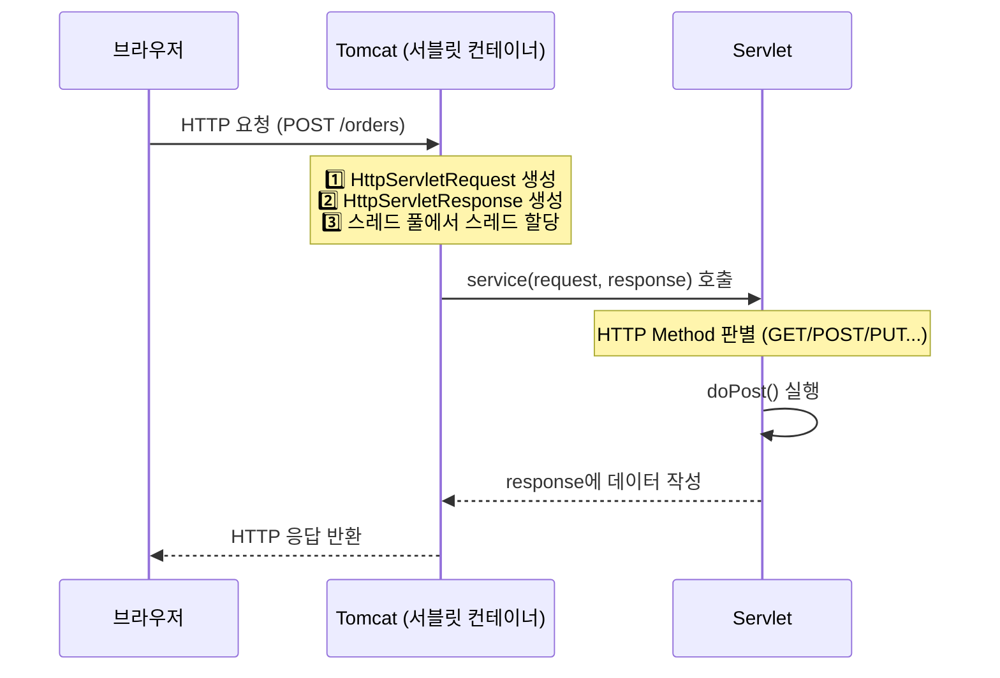

Tomcat이 `HttpServletRequest`와 `HttpServletResponse` 객체를 생성해서 서블릿에 넘겨줍니다. 이 두 객체 안에 HTTP 요청의 모든 정보(헤더, 파라미터, 바디)가 들어있습니다.

### 2.2 서블릿 직접 구현 — 얼마나 번거로웠는지 체험하기

```java
// URL마다 서블릿을 따로 만들어야 하는 방식
@WebServlet(name = "orderServlet", urlPatterns = "/orders")
public class OrderServlet extends HttpServlet {

    private OrderService orderService = new OrderService(); // DI 없음, new로 직접 생성

    @Override
    protected void doPost(HttpServletRequest request, HttpServletResponse response)
            throws ServletException, IOException {

        // 파라미터를 하나하나 손으로 꺼내야 함
        String itemId = request.getParameter("itemId");
        int quantity = Integer.parseInt(request.getParameter("quantity")); // 타입 변환도 수동

        // 공통 인증 로직 — 모든 서블릿에 이 코드를 복붙
        HttpSession session = request.getSession(false);
        if (session == null || session.getAttribute("loginMember") == null) {
            response.sendRedirect("/login");
            return;
        }

        Long orderId = orderService.createOrder(Long.parseLong(itemId), quantity);

        // JSON 직접 조립 — ObjectMapper도 없음
        response.setContentType("application/json;charset=UTF-8");
        response.getWriter().write("{\"orderId\":" + orderId + "}");
    }
}
```

**왜 이게 문제인가?** URL이 100개면 서블릿도 100개입니다. 인증 로직이 바뀌면 100개를 수정해야 합니다. 파라미터 타입 변환, JSON 변환도 전부 수동입니다. 개발자가 실수로 한 곳에서 인증 체크를 빠뜨리면 보안 취약점이 생깁니다.

Spring MVC는 이 모든 반복 작업을 없앴습니다. 파라미터 바인딩, JSON 변환, 공통 처리는 프레임워크가 담당하고 개발자는 비즈니스 로직만 작성합니다.

---

## 3. DispatcherServlet — Spring MVC의 심장

### 3.1 DispatcherServlet 계층 구조 — 왜 이렇게 복잡한가

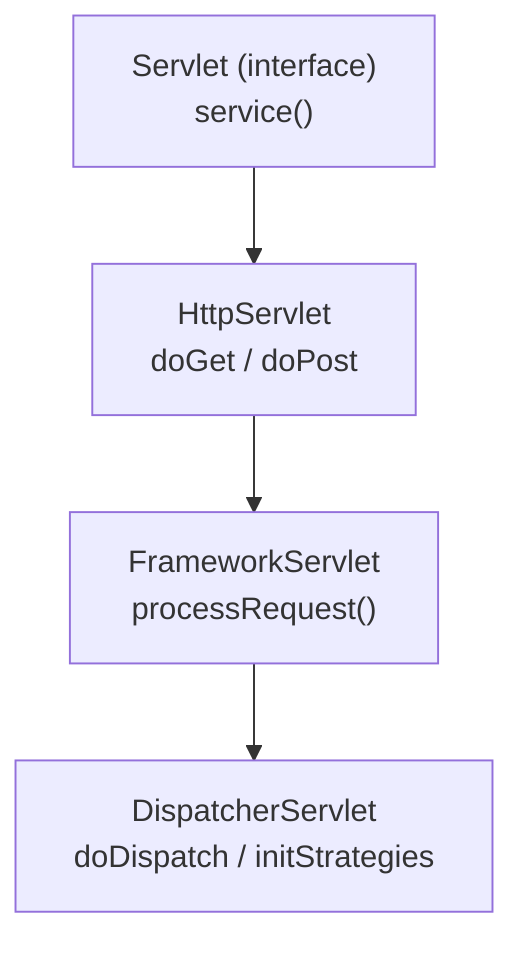

`DispatcherServlet`이 `HttpServlet`을 상속받는 이유는 Tomcat 같은 서블릿 컨테이너가 `HttpServlet` 인터페이스를 통해서만 서블릿을 실행하기 때문입니다. Spring MVC가 서블릿 컨테이너 위에서 동작하려면 이 계층 구조를 따라야 합니다.

실제 요청 처리는 `doDispatch()` 메서드 하나에서 이루어집니다. GET이든 POST든 PUT이든 모두 결국 `doDispatch()`로 모입니다.

### 3.2 DispatcherServlet 초기화 — 애플리케이션 시작 시 한 번만 실행

```java
// DispatcherServlet.initStrategies() — ApplicationContext 준비 후 한 번 실행
protected void initStrategies(ApplicationContext context) {
    initMultipartResolver(context);          // 1️⃣ 파일 업로드 처리
    initLocaleResolver(context);             // 2️⃣ 다국어/지역화
    initHandlerMappings(context);            // 3️⃣ URL → 핸들러 매핑 목록
    initHandlerAdapters(context);            // 4️⃣ 핸들러 실행 어댑터 목록
    initHandlerExceptionResolvers(context);  // 5️⃣ 예외 처리 리졸버
    initViewResolvers(context);              // 6️⃣ 뷰 이름 → View 객체
}
```

이 초기화가 완료되어야 첫 번째 HTTP 요청을 받을 수 있습니다. 만약 `HandlerMapping`이 초기화되지 않으면 모든 요청에 404가 응답됩니다. 이것이 Spring Boot 시작 시간이 오래 걸리는 이유 중 하나입니다 — 수십 개의 컴포넌트가 초기화되어야 합니다.

---

## 4. Spring MVC 요청 처리 전체 흐름

### 4.1 완전한 요청 처리 시퀀스

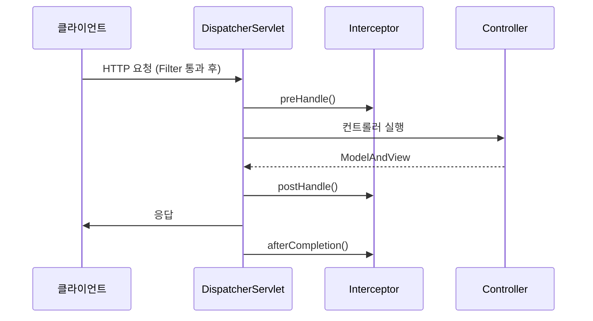

### 4.2 doDispatch() 핵심 로직 — 실제 코드로 보기

```java
// DispatcherServlet.doDispatch() 핵심 흐름 (간략화)
protected void doDispatch(HttpServletRequest request, HttpServletResponse response) {
    HandlerExecutionChain mappedHandler = null;

    try {
        // 1. 이 URL을 처리할 핸들러(컨트롤러 메서드) 찾기
        mappedHandler = getHandler(request);
        if (mappedHandler == null) {
            noHandlerFound(request, response); // 404 응답
            return;
        }

        // 2. 해당 핸들러를 실행할 수 있는 어댑터 찾기
        HandlerAdapter ha = getHandlerAdapter(mappedHandler.getHandler());

        // 3. 인터셉터의 preHandle 실행 — false면 중단
        if (!mappedHandler.applyPreHandle(request, response)) {
            return;
        }

        // 4. 실제 컨트롤러 메서드 호출
        ModelAndView mv = ha.handle(request, response, mappedHandler.getHandler());

        // 5. 인터셉터의 postHandle 실행
        mappedHandler.applyPostHandle(request, response, mv);

        // 6. 뷰 렌더링 또는 JSON 응답
        processDispatchResult(request, response, mappedHandler, mv, null);

    } catch (Exception ex) {
        // afterCompletion은 예외 발생해도 반드시 실행
        triggerAfterCompletion(request, response, mappedHandler, ex);
    }
}
```

`afterCompletion()`이 `try-catch`의 `finally`와 유사하게 예외가 나도 항상 실행됩니다. 이것이 중요한 이유는, `afterCompletion()`에서 MDC 정리, ThreadLocal 정리, 리소스 해제 같은 작업을 하기 때문입니다. 예외 상황에서 이것들이 정리되지 않으면 스레드 풀 오염이나 메모리 누수가 발생합니다.

---

## 5. HandlerMapping — URL이 어떻게 컨트롤러 메서드를 찾아가는가

### 5.1 HandlerMapping 종류와 우선순위

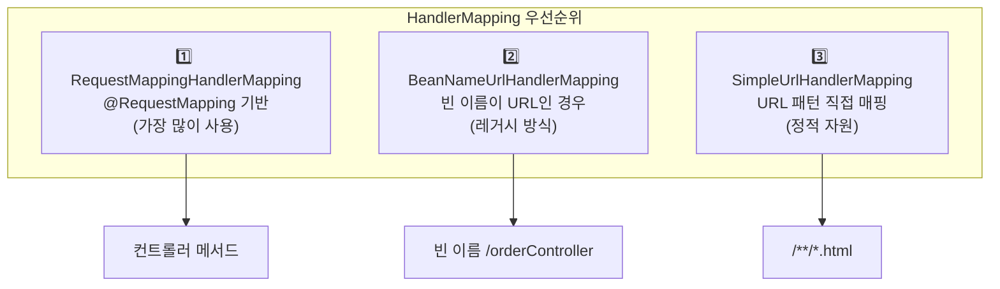

`RequestMappingHandlerMapping`이 애플리케이션 시작 시에 모든 `@RequestMapping` 어노테이션을 스캔해서 "URL 패턴 → 컨트롤러 메서드" 매핑 테이블을 미리 만들어둡니다. 요청이 오면 이 테이블에서 O(1)에 가까운 속도로 핸들러를 찾습니다. 만약 이 초기화가 느리면 서버 시작이 느립니다. `@RequestMapping`이 수천 개인 대형 서비스에서 시작 시간이 길어지는 원인 중 하나입니다.

### 5.2 @RequestMapping 상세 매핑 전략

```java
@Controller
@RequestMapping("/orders")  // 클래스 레벨 공통 경로
public class OrderController {

    // GET /orders?page=0&size=10
    @GetMapping
    public String list(
            @RequestParam(defaultValue = "0") int page,
            @RequestParam(defaultValue = "10") int size,
            Model model) {
        model.addAttribute("orders", orderService.findAll(page, size));
        return "order/list"; // ViewResolver가 처리할 뷰 이름
    }

    // GET /orders/123
    @GetMapping("/{id}")
    public String detail(@PathVariable Long id, Model model) {
        model.addAttribute("order", orderService.findById(id));
        return "order/detail";
    }

    // POST /orders (JSON API)
    @PostMapping
    @ResponseBody
    public ResponseEntity<OrderResponse> create(
            @RequestBody @Valid OrderCreateRequest request) {
        Long orderId = orderService.createOrder(request);
        URI location = URI.create("/orders/" + orderId);
        return ResponseEntity.created(location)
                .body(new OrderResponse(orderId));
    }

    // PATCH /orders/123/status
    @PatchMapping("/{id}/status")
    @ResponseStatus(HttpStatus.NO_CONTENT)
    public void updateStatus(
            @PathVariable Long id,
            @RequestBody @Valid StatusUpdateRequest request) {
        orderService.updateStatus(id, request.getStatus());
    }
}
```

`@GetMapping`은 `@RequestMapping(method = RequestMethod.GET)`의 축약형입니다. 스프링 4.3부터 추가된 이 어노테이션들(`@GetMapping`, `@PostMapping`, `@PutMapping`, `@DeleteMapping`, `@PatchMapping`)은 HTTP 메서드를 명시적으로 드러내어 코드 가독성을 높입니다.

---

## 6. HandlerAdapter — 다양한 핸들러를 일관되게 실행하는 방법

### 6.1 왜 어댑터가 필요한가

> **비유:** 한국 콘센트(DispatcherServlet)에 미국 플러그(핸들러), 유럽 플러그(레거시 컨트롤러), 일본 플러그(함수형 핸들러)를 모두 꽂아야 한다. 플러그 모양이 다르니 어댑터가 필요하다. HandlerAdapter는 서로 다른 형태의 핸들러를 DispatcherServlet이 일관되게 실행할 수 있게 해주는 어댑터다.

| 어댑터 | 처리 대상 | 현재 사용 |
|--------|----------|---------|
| `RequestMappingHandlerAdapter` | `@RequestMapping` 메서드 | 주력 |
| `HttpRequestHandlerAdapter` | `HttpRequestHandler` 구현체 | 정적 자원 |
| `SimpleControllerHandlerAdapter` | `Controller` 인터페이스 구현체 | 레거시 |

### 6.2 ArgumentResolver — 메서드 파라미터 자동 바인딩의 실제 동작

> **비유:** 컨트롤러 메서드는 주방장이다. "재료 주세요"라고 하면 ArgumentResolver가 HTTP 요청의 여러 곳(URL, 헤더, 바디, 세션...)에서 재료를 찾아 손질해서 건네준다. 주방장은 재료가 어디서 왔는지 알 필요 없다.

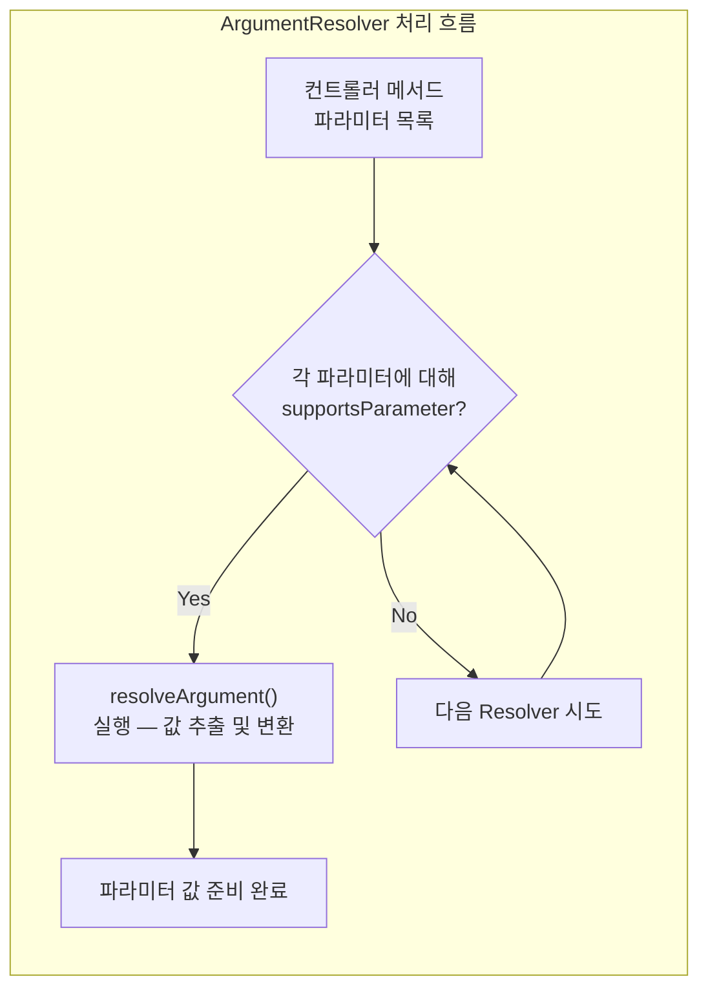

```java
// Spring이 자동으로 처리하는 30+ 종류의 파라미터들
@PostMapping("/orders")
public ResponseEntity<OrderResponse> createOrder(
    HttpServletRequest request,           // 서블릿 원본 요청
    HttpSession session,                  // HTTP 세션
    @RequestParam Long itemId,            // ?itemId=123 쿼리 파라미터
    @RequestParam(required = false,
                  defaultValue = "1") int quantity,  // 없으면 기본값 1
    @PathVariable Long memberId,          // /members/{memberId}/orders
    @RequestHeader("Authorization")
                  String authToken,       // Authorization 헤더
    @RequestBody @Valid OrderRequest body,// JSON 바디 → 객체 자동 변환
    @AuthenticationPrincipal UserDetails user, // Spring Security 인증 정보
    BindingResult errors                  // @Valid 검증 결과
) { ... }
```

30개 이상의 파라미터 타입을 Spring이 자동으로 처리합니다. 서블릿 시대에는 이것들을 전부 `request.getParameter()`, `request.getHeader()`, `request.getInputStream()` 등으로 직접 꺼내야 했습니다.

### 6.3 커스텀 ArgumentResolver — JWT에서 현재 사용자 자동 주입

실무에서 가장 자주 만드는 커스텀 ArgumentResolver입니다. JWT 토큰을 파싱해서 현재 로그인한 사용자를 컨트롤러 파라미터에 자동 주입합니다.

```java
// 1. 커스텀 어노테이션 정의
@Target(ElementType.PARAMETER)
@Retention(RetentionPolicy.RUNTIME)
public @interface CurrentUser {}

// 2. ArgumentResolver 구현
@Component
@RequiredArgsConstructor
public class CurrentUserArgumentResolver implements HandlerMethodArgumentResolver {

    private final JwtTokenProvider jwtTokenProvider;
    private final MemberRepository memberRepository;

    @Override
    public boolean supportsParameter(MethodParameter parameter) {
        // @CurrentUser 어노테이션이 붙고, 타입이 Member인 파라미터만 처리
        return parameter.hasParameterAnnotation(CurrentUser.class)
            && Member.class.isAssignableFrom(parameter.getParameterType());
    }

    @Override
    public Object resolveArgument(MethodParameter parameter,
                                   ModelAndViewContainer mavContainer,
                                   NativeWebRequest webRequest,
                                   WebDataBinderFactory binderFactory) {
        HttpServletRequest request = webRequest.getNativeRequest(HttpServletRequest.class);
        String token = extractToken(request);

        if (token == null || !jwtTokenProvider.validateToken(token)) {
            throw new UnauthorizedException("로그인이 필요합니다");
        }

        Long userId = jwtTokenProvider.getUserId(token);
        return memberRepository.findById(userId)
            .orElseThrow(() -> new EntityNotFoundException("사용자를 찾을 수 없습니다"));
    }

    private String extractToken(HttpServletRequest request) {
        String header = request.getHeader("Authorization");
        if (header != null && header.startsWith("Bearer ")) {
            return header.substring(7);
        }
        return null;
    }
}

// 3. WebMvcConfigurer에 등록
@Configuration
@RequiredArgsConstructor
public class WebConfig implements WebMvcConfigurer {

    private final CurrentUserArgumentResolver currentUserArgumentResolver;

    @Override
    public void addArgumentResolvers(List<HandlerMethodArgumentResolver> resolvers) {
        resolvers.add(currentUserArgumentResolver);
    }
}

// 4. 컨트롤러에서 사용 — 깔끔하게 현재 사용자 주입
@GetMapping("/my/orders")
public List<OrderResponse> getMyOrders(@CurrentUser Member member) {
    return orderService.findByMember(member.getId());
    // JWT 파싱, 토큰 검증, DB 조회가 모두 ArgumentResolver에서 처리됨
}
```

**만약 ArgumentResolver 없이 하면?** 모든 컨트롤러 메서드에서 `request.getHeader("Authorization")`로 토큰을 꺼내고, 파싱하고, DB에서 조회하는 코드를 반복해야 합니다. 그리고 토큰 파싱 로직이 바뀌면 모든 컨트롤러를 수정해야 합니다.

---

## 7. ViewResolver — 뷰 이름을 실제 View로 변환하는 방법

### 7.1 ViewResolver 체인 — 뷰 이름 하나가 어디로 가는가

> **비유:** 컨트롤러가 "order/list"라는 주소를 반환하면, ViewResolver는 네비게이션처럼 "그 주소가 실제로 어떤 파일인지"를 찾아준다.

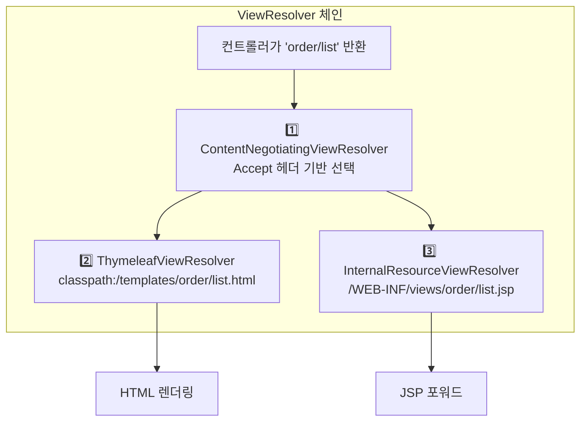

`@RestController`나 `@ResponseBody`를 쓰면 ViewResolver가 사용되지 않습니다. 반환 객체가 `HttpMessageConverter`를 통해 직접 JSON으로 변환되어 응답 바디에 씁니다. 이것이 ViewResolver를 거치는 것보다 빠른 이유입니다.

### 7.2 실무에서 자주 하는 실수 — POST 후 뷰를 직접 반환하면?

```java
// 위험한 코드 — 새로고침하면 주문이 다시 들어감!
@PostMapping("/orders")
public String createOrderBad(OrderCreateRequest request) {
    orderService.create(request);
    return "order/success"; // 뷰를 직접 반환
}

// 올바른 코드 — PRG 패턴 (Post-Redirect-Get)
@PostMapping("/orders")
public String createOrderGood(OrderCreateRequest request) {
    Long orderId = orderService.create(request);
    return "redirect:/orders/" + orderId; // redirect: 접두사로 302 응답
}
```

**왜 PRG 패턴이 필요한가?** POST 요청으로 주문을 생성한 후 뷰 이름을 직접 반환하면, 브라우저는 현재 URL이 POST `/orders`인 상태입니다. 사용자가 F5를 눌러 새로고침하면 브라우저는 "이전 요청(POST /orders)을 다시 보낼까요?"라고 묻고, 사용자가 확인을 누르면 주문이 중복 생성됩니다.

`redirect:`를 사용하면 서버가 302 응답으로 "GET /orders/123으로 이동하라"고 브라우저에 알려줍니다. 브라우저는 새 URL로 GET 요청을 보내고, 이제 새로고침을 해도 GET 요청만 반복됩니다.

---

## 8. 필터(Filter) vs 인터셉터(Interceptor) — 어디서 처리해야 하는가

### 8.1 실행 위치 — 가장 중요한 차이점

> **비유:** 필터는 건물 입구 경비원이다. 건물에 들어오는 모든 사람을 검사한다. 인터셉터는 특정 부서(Spring MVC) 입구의 담당자다. Spring MVC를 통하는 요청만 처리한다. 외부인이 직접 비상구(정적 파일 직접 서빙)로 들어오면 인터셉터는 볼 수 없다.

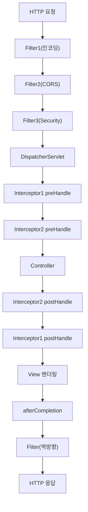

### 8.2 필터 구현 — 서블릿 계층에서 처리해야 할 것들

```java
@Component
@Slf4j
public class RequestLoggingFilter implements Filter {

    @Override
    public void doFilter(ServletRequest request, ServletResponse response,
                         FilterChain chain) throws IOException, ServletException {
        HttpServletRequest httpRequest = (HttpServletRequest) request;
        String requestURI = httpRequest.getRequestURI();
        String traceId = UUID.randomUUID().toString().substring(0, 8);

        long startTime = System.currentTimeMillis();
        log.info("[{}] >>> {} {}", traceId, httpRequest.getMethod(), requestURI);

        // 이후 인터셉터나 컨트롤러에서 traceId를 꺼내 쓸 수 있도록
        httpRequest.setAttribute("traceId", traceId);

        try {
            chain.doFilter(request, response); // 다음 필터 또는 서블릿으로 전달
        } finally {
            // 예외 발생해도 항상 실행 — 로그 종료 기록 보장
            long elapsed = System.currentTimeMillis() - startTime;
            int status = ((HttpServletResponse) response).getStatus();
            log.info("[{}] <<< {} {} {}ms", traceId, status, requestURI, elapsed);
        }
    }
}
```

**왜 `finally` 블록에서 응답 로그를 찍는가?** 컨트롤러에서 예외가 발생해도 응답 시간 로그가 찍혀야 합니다. 예외 상황에서 요청 처리 시간을 알아야 성능 분석이 가능합니다. `finally`가 없으면 예외 케이스의 로그가 누락됩니다.

### 8.3 인터셉터 구현 — Spring MVC 계층에서 처리할 것들

```java
@Slf4j
@Component
@RequiredArgsConstructor
public class LoginCheckInterceptor implements HandlerInterceptor {

    private final JwtTokenProvider jwtTokenProvider;

    @Override
    public boolean preHandle(HttpServletRequest request, HttpServletResponse response,
                             Object handler) throws Exception {
        // 정적 리소스 요청은 HandlerMethod가 아님 — 체크 불필요
        if (!(handler instanceof HandlerMethod)) {
            return true;
        }

        // @PublicApi 어노테이션이 있는 메서드는 인증 없이 허용
        HandlerMethod handlerMethod = (HandlerMethod) handler;
        if (handlerMethod.hasMethodAnnotation(PublicApi.class)) {
            return true;
        }

        // JWT 검증
        String token = extractToken(request);
        if (token == null || !jwtTokenProvider.validateToken(token)) {
            response.setStatus(HttpServletResponse.SC_UNAUTHORIZED);
            response.setContentType("application/json;charset=UTF-8");
            response.getWriter().write("{\"error\":\"로그인이 필요합니다\"}");
            return false; // false 반환 시 컨트롤러 호출 중단
        }

        Long userId = jwtTokenProvider.getUserId(token);
        request.setAttribute("currentUserId", userId);
        return true; // true 반환 시 다음 단계로 진행
    }

    @Override
    public void afterCompletion(HttpServletRequest request, HttpServletResponse response,
                                Object handler, Exception ex) {
        // 예외가 발생했든 안 했든 항상 실행 — 리소스 정리 적합
        MDC.clear(); // 로그 추적 컨텍스트 정리
    }
}

// 인터셉터 등록
@Configuration
@RequiredArgsConstructor
public class WebConfig implements WebMvcConfigurer {

    private final LoginCheckInterceptor loginCheckInterceptor;

    @Override
    public void addInterceptors(InterceptorRegistry registry) {
        registry.addInterceptor(loginCheckInterceptor)
            .order(1)
            .addPathPatterns("/api/**")
            .excludePathPatterns(
                "/api/auth/login",
                "/api/auth/refresh",
                "/api/members/join"
            );
    }
}
```

**인터셉터에서 `handler instanceof HandlerMethod` 체크가 왜 필요한가?** `/favicon.ico`, `/css/style.css` 같은 정적 리소스 요청도 DispatcherServlet을 거칩니다. 이 경우 `handler`는 `HandlerMethod`가 아니라 `ResourceHttpRequestHandler`입니다. `(HandlerMethod) handler`로 강제 캐스팅하면 `ClassCastException`이 발생합니다. 항상 instanceof 체크를 먼저 해야 합니다.

### 8.4 필터 vs 인터셉터 — 무엇을 어디서 해야 하는가

| 비교 항목 | 필터 (Filter) | 인터셉터 (Interceptor) |
|----------|-------------|---------------------|
| 관리 주체 | 서블릿 컨테이너 (Tomcat) | Spring MVC |
| 실행 시점 | DispatcherServlet 이전 | DispatcherServlet 이후 |
| Spring 빈 접근 | @Component 등록 시 가능 | 자유롭게 가능 |
| 예외 처리 | @ExceptionHandler 미적용 | @ExceptionHandler 적용 가능 |
| handler 정보 | 접근 불가 | HandlerMethod로 접근 가능 |
| 주요 용도 | 인코딩, CORS, XSS 방어 | 인증/인가, 권한 체크 |

**실무에서 자주 하는 실수 — 인터셉터에서 할 일을 필터에서 했을 때:**

인터셉터에서 예외를 던지면 `@ExceptionHandler`가 잡아서 일관된 JSON 에러 응답을 만들어줍니다. 하지만 필터에서 예외를 던지면 `@ExceptionHandler` 밖에서 발생한 것이므로 Spring의 예외 처리가 작동하지 않습니다. 서블릿 컨테이너의 기본 에러 페이지(흰 바탕에 HTML 에러 메시지)가 그대로 클라이언트에 전달됩니다. API 서버에서 HTML 에러 페이지가 나오면 프론트엔드가 JSON 파싱에 실패합니다.

---

## 9. 예외 처리 — @ExceptionHandler와 @ControllerAdvice

### 9.1 예외 처리 우선순위 — Spring이 예외를 처리하는 순서

> **비유:** 예외가 발생하면 Spring은 "담당자를 찾는" 작업을 순서대로 한다. 1) 해당 컨트롤러 안에 담당자가 있나? 2) 전역 담당자(@ControllerAdvice)가 있나? 3) HTTP 표준 처리가 가능한가? 4) 아무도 없으면 500 에러.

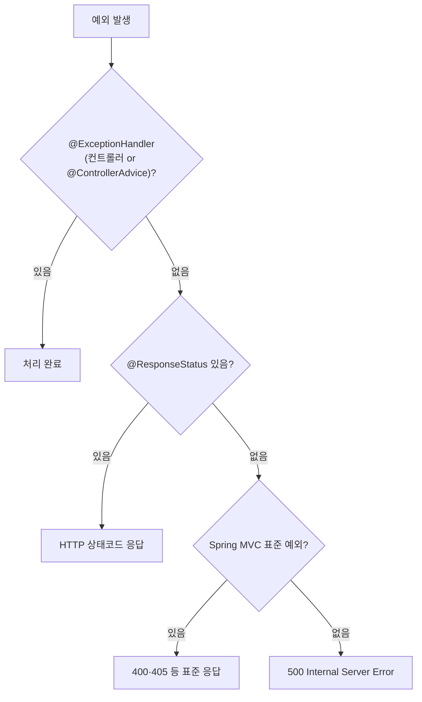

### 9.2 전역 예외 처리 — @RestControllerAdvice로 일관된 에러 응답 만들기

```java
@RestControllerAdvice  // = @ControllerAdvice + @ResponseBody
@Slf4j
public class GlobalExceptionHandler {

    // 1. 비즈니스 예외 — 도메인에서 직접 정의한 예외들
    @ExceptionHandler(BusinessException.class)
    public ResponseEntity<ErrorResponse> handleBusinessException(BusinessException e) {
        log.warn("BusinessException: code={}, message={}", e.getErrorCode(), e.getMessage());
        return ResponseEntity
            .status(e.getErrorCode().getHttpStatus())
            .body(ErrorResponse.of(e.getErrorCode(), e.getMessage()));
    }

    // 2. @Valid 검증 실패 — @RequestBody에 붙은 @Valid가 실패할 때
    // 예: 이메일 형식이 잘못됐거나, 필수 필드가 비었을 때
    @ExceptionHandler(MethodArgumentNotValidException.class)
    public ResponseEntity<ErrorResponse> handleValidation(MethodArgumentNotValidException e) {
        List<ErrorResponse.FieldError> fieldErrors = e.getBindingResult()
            .getFieldErrors()
            .stream()
            .map(fe -> new ErrorResponse.FieldError(
                fe.getField(),
                fe.getRejectedValue(),
                fe.getDefaultMessage()))
            .collect(Collectors.toList());

        return ResponseEntity.badRequest().body(ErrorResponse.ofValidation(fieldErrors));
    }

    // 3. PathVariable 타입 불일치
    // 예: /orders/abc — id가 Long이어야 하는데 문자열이 들어온 경우
    @ExceptionHandler(MethodArgumentTypeMismatchException.class)
    public ResponseEntity<ErrorResponse> handleTypeMismatch(
            MethodArgumentTypeMismatchException e) {
        String message = String.format("파라미터 '%s'의 값 '%s'이 잘못된 타입입니다",
                                       e.getName(), e.getValue());
        return ResponseEntity.badRequest().body(ErrorResponse.of("TYPE_MISMATCH", message));
    }

    // 4. 나머지 모든 예외 — 절대 내부 정보 노출 금지
    @ExceptionHandler(Exception.class)
    public ResponseEntity<ErrorResponse> handleException(Exception e,
                                                          HttpServletRequest request) {
        // 내부 stacktrace는 서버 로그에만 남기고
        log.error("Unexpected error on {}: {}", request.getRequestURI(), e.getMessage(), e);
        // 클라이언트에는 최소한의 정보만 반환
        return ResponseEntity.internalServerError()
            .body(ErrorResponse.of("INTERNAL_ERROR", "서버 오류가 발생했습니다. 잠시 후 다시 시도해주세요."));
    }
}
```

**마지막 `Exception.class` 핸들러에서 내부 메시지를 노출하면 안 되는 이유:** `e.getMessage()`에는 SQL 쿼리, 파일 경로, 클래스명 같은 내부 구현 정보가 담길 수 있습니다. 이것이 클라이언트에 노출되면 공격자가 시스템 구조를 파악하는 데 사용합니다.

---

## 10. HTTP 메시지 컨버터 — 객체가 JSON이 되는 과정

### 10.1 메시지 컨버터 선택 흐름

> **비유:** 번역가 에이전시(HttpMessageConverter 목록)에 의뢰가 들어온다. "Java 객체를 JSON으로 번역해줘." 에이전시는 소속 번역가들을 순서대로 확인한다. "이 언어 쌍 번역할 수 있어?" 가능한 첫 번째 번역가가 작업을 맡는다.

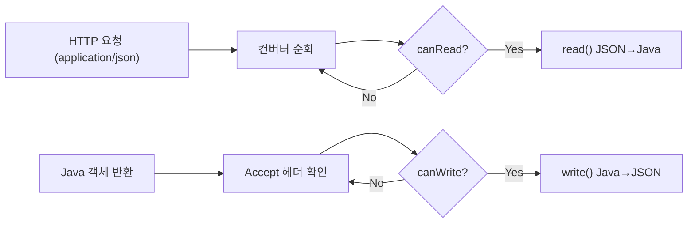

`MappingJackson2HttpMessageConverter`가 `application/json`과 모든 객체 타입을 처리합니다. 만약 응답 객체에 `@JsonIgnore`가 붙어있으면 해당 필드는 직렬화에서 제외됩니다. 만약 Jackson이 클래스패스에 없으면 `@ResponseBody`에서 JSON 변환이 안 됩니다. Spring Boot는 `spring-boot-starter-web` 의존성에 Jackson을 포함시켜서 이런 일이 없도록 합니다.

### 10.2 Jackson 설정 커스터마이징

```java
@Configuration
public class JacksonConfig {

    @Bean
    @Primary
    public ObjectMapper objectMapper() {
        return Jackson2ObjectMapperBuilder.json()
            // LocalDateTime을 "2026-05-02T10:00:00" 형태로 (숫자 타임스탬프 X)
            .featuresToDisable(SerializationFeature.WRITE_DATES_AS_TIMESTAMPS)
            // 클라이언트가 보낸 JSON에 모르는 필드가 있어도 역직렬화 실패 안 함
            // 이게 없으면 새 필드 추가 시 하위 호환성이 깨짐
            .featuresToDisable(DeserializationFeature.FAIL_ON_UNKNOWN_PROPERTIES)
            .modules(new JavaTimeModule())
            // null 필드는 응답에서 제외 — 응답 크기 절약
            .serializationInclusion(JsonInclude.Include.NON_NULL)
            .build();
    }
}
```

`FAIL_ON_UNKNOWN_PROPERTIES`를 비활성화하는 이유를 설명합니다. 마이크로서비스 A가 B에게 JSON을 보낼 때, A가 새 필드를 추가했습니다. B가 이 새 필드를 아직 모른다면 `UnrecognizedPropertyException`이 발생해서 서비스가 다운됩니다. 이 설정을 비활성화하면 모르는 필드는 무시하고 아는 필드만 매핑합니다. 점진적 배포가 가능해집니다.

---

## 11. 검증 (Validation) — 잘못된 입력을 막는 첫 번째 방어선

### 11.1 Bean Validation 어노테이션

```java
@Getter
@NoArgsConstructor
public class MemberJoinRequest {

    @NotBlank(message = "이름은 필수입니다")
    @Size(min = 2, max = 50, message = "이름은 2~50자여야 합니다")
    private String name;

    @NotBlank(message = "이메일은 필수입니다")
    @Email(message = "유효한 이메일 형식이 아닙니다")
    private String email;

    @NotBlank(message = "비밀번호는 필수입니다")
    @Pattern(regexp = "^(?=.*[A-Za-z])(?=.*\\d)(?=.*[@$!%*#?&])[A-Za-z\\d@$!%*#?&]{8,}$",
             message = "비밀번호는 영문, 숫자, 특수문자를 포함한 8자 이상이어야 합니다")
    private String password;

    @Min(value = 14, message = "14세 이상만 가입할 수 있습니다")
    @Max(value = 150, message = "나이를 확인해주세요")
    private int age;
}
```

**왜 서비스 레이어에서만 검증하면 안 되는가?** 서비스까지 가려면 이미 파라미터 바인딩, 인터셉터 등 여러 단계를 거쳐야 합니다. 빈 검증을 컨트롤러 입구에서 먼저 하면 잘못된 요청을 가장 빠른 시점에 차단할 수 있습니다. 서비스, 리포지토리까지 가지 않아도 됩니다. 또한 검증 로직이 DTO에 선언적으로 표현되어 있어 어떤 입력이 유효한지 한눈에 파악할 수 있습니다.

**만약 `BindingResult`를 파라미터에 추가하지 않으면?** `@Valid`가 실패할 때 `MethodArgumentNotValidException`이 자동으로 던져집니다. `BindingResult`를 파라미터에 추가하면 예외가 던져지지 않고 `BindingResult.hasErrors()`로 직접 처리할 수 있습니다. 일반적으로는 `BindingResult`를 생략하고 `@ExceptionHandler`로 전역 처리하는 것이 더 깔끔합니다.

---

## 12. 전체 요청 흐름 최종 정리

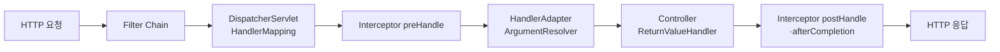

---

## 13. 핵심 포인트 정리

| 컴포넌트 | 역할 | 만약 잘못 이해하면? |
|---------|------|-----------------|
| `DispatcherServlet` | 중앙 집중 요청 처리 | 모든 요청 처리의 시작점임을 모르면 디버깅 어려움 |
| `HandlerMapping` | URL → 핸들러 매핑 | 초기화 시 스캔되므로 런타임 변경 불가 |
| `ArgumentResolver` | 메서드 파라미터 바인딩 | 직접 구현하면 컨트롤러가 깔끔해짐 |
| `Filter` | 서블릿 계층 처리 | 예외를 던지면 @ExceptionHandler 적용 안 됨 |
| `Interceptor` | Spring MVC 계층 처리 | handler instanceof HandlerMethod 체크 필수 |
| PRG 패턴 | POST 후 redirect | 안 하면 새로고침 시 중복 제출 |
| `@ExceptionHandler` | 예외 전역 처리 | Exception.class에서 내부 정보 노출 금지 |

---

## 14. @Controller vs @RestController

```java
@Target(ElementType.TYPE)
@Retention(RetentionPolicy.RUNTIME)
@Controller
@ResponseBody  // 이것이 유일한 차이
public @interface RestController { }
```

`@RestController = @Controller + @ResponseBody`이다. `@ResponseBody`가 붙으면 반환값을 ViewResolver에 보내지 않고 `HttpMessageConverter`로 직렬화해서 응답 Body에 직접 쓴다.

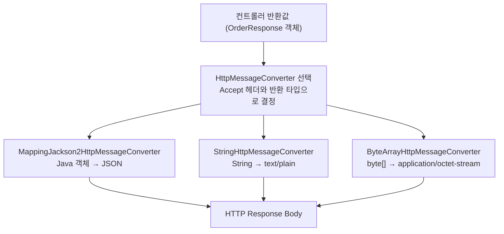

---

## 15. 조건부 매핑 — URL 외 조건으로 핸들러를 선택하는 방법

```java
@RestController
@RequestMapping("/orders")
public class OrderController {

    // 쿼리 파라미터, 헤더, Content-Type, Accept를 조건으로 매핑할 수 있다
    @GetMapping(value = "/search",
                params = "type=recent",        // 쿼리 파라미터 조건
                headers = "X-API-Version=2",   // 헤더 조건
                consumes = "application/json", // Content-Type 조건
                produces = "application/json") // Accept 조건
    public List<Order> searchOrders() { ... }
}
```

같은 URL이라도 API 버전 헤더나 Content-Type에 따라 다른 핸들러로 라우팅할 수 있다. 이 기능은 API 버저닝 전략에서 유용하다.

---

## 16. 전통적 Spring MVC의 설정 구조 (레거시 참고)

Spring Boot 이전의 전통적인 Spring MVC 프로젝트는 XML 기반 설정을 사용했다. Spring Boot가 이 모든 것을 자동 설정으로 대체했지만, 레거시 프로젝트를 이해하려면 이 구조를 알아야 한다.

### 16.1 설정 파일 로딩 순서

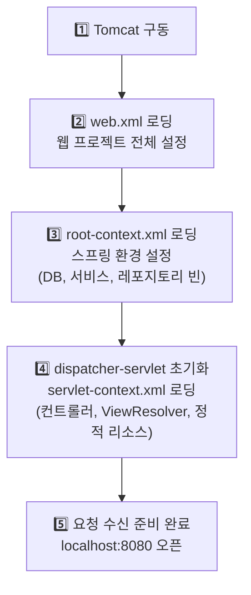

### 16.2 두 개의 ApplicationContext 계층 구조

전통적 Spring MVC는 두 개의 스프링 컨텍스트를 계층 구조로 관리한다.

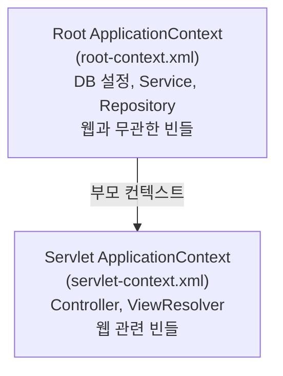

Servlet Context는 Root Context의 빈을 참조할 수 있지만 반대는 불가능하다(부모→자식 단방향). `@Transactional`이 있는 Service는 반드시 Root Context에 등록해야 트랜잭션 프록시가 올바르게 생성된다. Servlet Context에 Service가 스캔되면 `@Transactional`이 작동하지 않는 경우가 발생한다.

### 16.3 Spring Boot에서의 변화

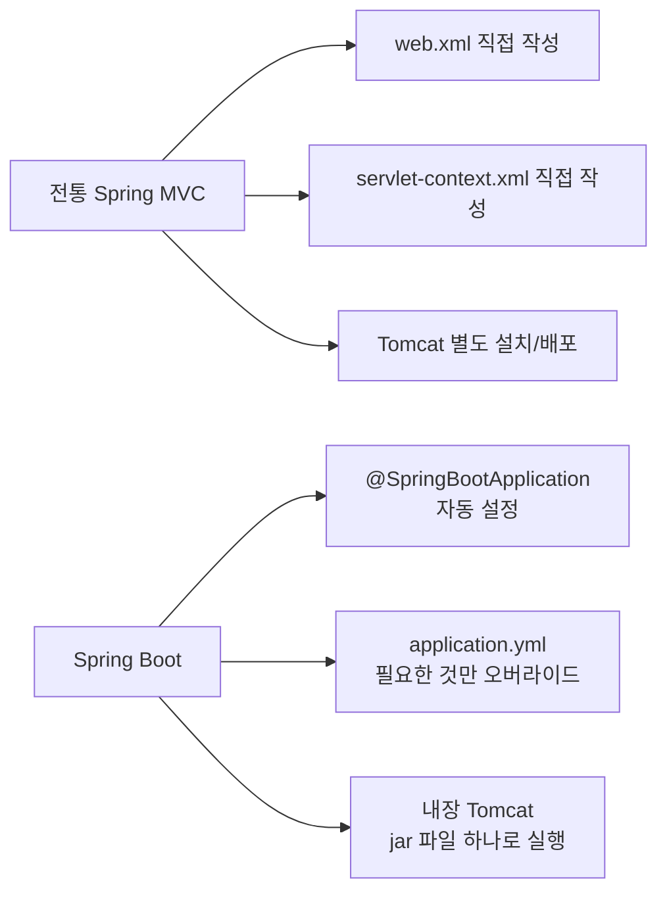

```java
// Spring Boot: 위의 모든 XML 설정을 이 한 줄로 대체한다
@SpringBootApplication
public class Application {
    public static void main(String[] args) {
        SpringApplication.run(Application.class, args);
    }
}
```

### 16.4 레거시 트러블슈팅 — 한국어 깨짐

web.xml에 `CharacterEncodingFilter`가 없거나 DispatcherServlet 이후에 등록된 경우 POST 파라미터의 한글이 `???`로 깨진다. 필터 등록 순서는 `CharacterEncodingFilter`가 가장 먼저여야 한다.
