> **한 줄 요약:** Spring MVC는 DispatcherServlet이 단일 진입점으로 모든 HTTP 요청을 받아 HandlerMapping → HandlerAdapter → ArgumentResolver → Controller → ReturnValueHandler → ViewResolver/MessageConverter 순서로 처리하는 프론트 컨트롤러 패턴이다. 각 단계가 왜 그 자리에 있는지, 내부에서 무슨 일이 벌어지는지 코드 수준으로 파헤친다.

---

## 1. 비유로 시작하기 — 대형 병원 응급실 트리아지 시스템

> 응급실 입구에는 **트리아지 간호사** 한 명이 있다. 어떤 환자가 오든 이 간호사가 먼저 받는다. 간호사는 "어떤 과 담당인지"(HandlerMapping)를 판단하고, "해당 의사에게 어떻게 연결할지"(HandlerAdapter)를 정하고, "환자 정보를 어떻게 정리해서 건넬지"(ArgumentResolver)를 처리한다. 의사(Controller)는 치료(비즈니스 로직)에만 집중하면 된다.

Spring MVC 이전 세계를 생각해보자. URL마다 서블릿을 등록해야 했다. `/orders`는 `OrderServlet`, `/members`는 `MemberServlet`... 인증 로직, 인코딩 처리, 파라미터 파싱을 모든 서블릿에 복붙해야 했다. URL이 100개면 동일한 코드가 100곳에 존재했다.

Spring MVC는 **단 하나의 진입점(DispatcherServlet)**으로 이 문제를 해결했다. 공통 관심사는 중앙에서 처리하고, 컨트롤러는 오직 비즈니스 로직에만 집중한다. 이것이 프론트 컨트롤러 패턴이다.

---

## 2. DispatcherServlet 라이프사이클 — init → service → destroy

### 2.1 계층 구조와 WHY

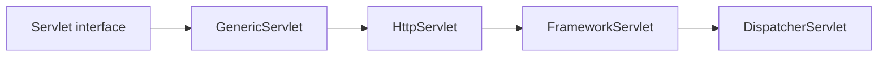

왜 이렇게 4단계 상속 계층인가? Tomcat 같은 서블릿 컨테이너는 `javax.servlet.Servlet` 인터페이스만 알고 있다. Spring MVC가 서블릿 컨테이너 위에서 동작하려면 이 계약을 반드시 따라야 한다. `HttpServlet`은 HTTP 프로토콜 파싱(GET/POST 분기 등)을 담당하고, `FrameworkServlet`은 Spring ApplicationContext 연동을 담당하며, `DispatcherServlet`은 MVC 요청 라우팅을 담당한다. 각 계층이 명확하게 분리된 책임을 가진다.

### 2.2 init 단계 — 애플리케이션 시작 시 단 한 번

```java
// FrameworkServlet.initServletBean() → initWebApplicationContext() → onRefresh()
// → DispatcherServlet.onRefresh() 호출
@Override
protected void onRefresh(ApplicationContext context) {
    initStrategies(context);
}

// DispatcherServlet.initStrategies() — ApplicationContext 준비 후 한 번만 실행
protected void initStrategies(ApplicationContext context) {
    initMultipartResolver(context);          // 파일 업로드 처리기
    initLocaleResolver(context);             // 국제화/지역화 처리기
    initThemeResolver(context);              // 테마 처리기 (현재는 거의 미사용)
    initHandlerMappings(context);            // URL → 핸들러 매핑 목록 로드
    initHandlerAdapters(context);            // 핸들러 실행 어댑터 목록 로드
    initHandlerExceptionResolvers(context);  // 예외 처리 리졸버 목록 로드
    initRequestToViewNameTranslator(context);// URL → 기본 뷰 이름 변환기
    initViewResolvers(context);              // 뷰 이름 → View 객체 변환기
    initFlashMapManager(context);            // redirect 시 임시 데이터 관리
}
```

**왜 init 단계에서 모든 것을 초기화하는가?** 요청이 들어올 때마다 HandlerMapping을 스캔하면 매 요청마다 모든 클래스의 어노테이션을 리플렉션으로 읽어야 한다. 수만 건의 동시 요청이 들어오는 운영 환경에서는 치명적이다. 애플리케이션 시작 시 단 한 번만 스캔하고 결과를 캐시에 보관하면 이후 요청은 캐시 조회로 O(1)에 가깝게 처리된다. 이것이 Spring Boot 시작 시간이 오래 걸리는 이유이기도 하다.

### 2.3 service 단계 — 실제 요청 처리

```java
// FrameworkServlet.service() → processRequest() → doService()
// → DispatcherServlet.doService() → doDispatch()
//
// GET, POST, PUT, DELETE, PATCH 모두 결국 doDispatch()로 모인다
@Override
protected void service(HttpServletRequest request, HttpServletResponse response)
        throws ServletException, IOException {
    HttpMethod httpMethod = HttpMethod.resolve(request.getMethod());
    if (httpMethod == HttpMethod.PATCH || httpMethod == null) {
        processRequest(request, response); // PATCH는 HttpServlet에서 직접 처리 안 함
    } else {
        super.service(request, response);  // GET/POST 등은 HttpServlet에 위임
    }
}
```

**왜 PATCH만 별도 처리하는가?** `HttpServlet`의 `service()` 메서드는 HTTP 1.1 기준으로 설계되어 있어 PATCH를 기본 지원하지 않는다. `FrameworkServlet`이 이 틈을 메워준다.

### 2.4 destroy 단계 — JVM 종료 전 정리

```java
// FrameworkServlet.destroy()
@Override
public void destroy() {
    getServletContext().log("Destroying Spring FrameworkServlet '" + getServletName() + "'");
    if (this.webApplicationContext instanceof ConfigurableApplicationContext
            && !this.webApplicationContextInjected) {
        ((ConfigurableApplicationContext) this.webApplicationContext).close();
        // ApplicationContext가 닫히며 모든 Bean의 @PreDestroy, DisposableBean.destroy() 호출
    }
}
```

---

## 3. 요청 처리 파이프라인 — doDispatch() 내부 해부

### 3.1 전체 파이프라인 흐름

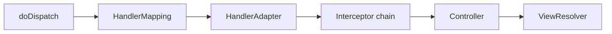

### 3.2 doDispatch() 실제 코드 — 주석 포함 완전 분석

```java
// DispatcherServlet.doDispatch() — Spring MVC의 심장부
protected void doDispatch(HttpServletRequest request, HttpServletResponse response)
        throws Exception {
    HttpServletRequest processedRequest = request;
    HandlerExecutionChain mappedHandler = null;
    boolean multipartRequestParsed = false;

    // 비동기 처리 매니저 — Servlet 3.0 비동기 요청 처리 지원
    WebAsyncManager asyncManager = WebAsyncUtils.getAsyncManager(request);

    try {
        ModelAndView mv = null;
        Exception dispatchException = null;

        try {
            // 1단계: 멀티파트 요청(파일 업로드) 확인 및 래핑
            processedRequest = checkMultipart(request);
            multipartRequestParsed = (processedRequest != request);

            // 2단계: URL에 맞는 핸들러(컨트롤러 메서드) 탐색
            // 등록된 HandlerMapping 목록을 순서대로 조회, 첫 번째 매칭 반환
            mappedHandler = getHandler(processedRequest);
            if (mappedHandler == null) {
                noHandlerFound(processedRequest, response); // 404
                return;
            }

            // 3단계: 핸들러를 실행할 수 있는 HandlerAdapter 탐색
            // supports(handler)를 호출해서 처리 가능한 첫 번째 어댑터 반환
            HandlerAdapter ha = getHandlerAdapter(mappedHandler.getHandler());

            // 4단계: Last-Modified 캐시 최적화 (GET/HEAD만 해당)
            // If-Modified-Since 헤더와 비교해서 변경 없으면 304 반환
            String method = request.getMethod();
            boolean isGet = HttpMethod.GET.matches(method);
            if (isGet || HttpMethod.HEAD.matches(method)) {
                long lastModified = ha.getLastModified(request, mappedHandler.getHandler());
                if (new ServletWebRequest(request, response).checkNotModified(lastModified)
                        && isGet) {
                    return; // 304 Not Modified
                }
            }

            // 5단계: Interceptor preHandle — false 반환 시 처리 중단
            // 인터셉터들이 체인 형태로 순서대로 실행
            if (!mappedHandler.applyPreHandle(processedRequest, response)) {
                return;
            }

            // 6단계: 실제 핸들러 실행 — 이 안에서 ArgumentResolver가 동작
            mv = ha.handle(processedRequest, response, mappedHandler.getHandler());

            // 7단계: 비동기 처리 시작 여부 확인
            if (asyncManager.isConcurrentHandlingStarted()) {
                return; // DeferredResult, Callable 처리 중
            }

            // 8단계: 뷰 이름이 없으면 URL에서 기본 뷰 이름 생성
            applyDefaultViewName(processedRequest, mv);

            // 9단계: Interceptor postHandle — 컨트롤러 실행 후, 뷰 렌더링 전
            mappedHandler.applyPostHandle(processedRequest, response, mv);

        } catch (Exception ex) {
            dispatchException = ex;
        }

        // 10단계: 뷰 렌더링 또는 예외 처리
        // @ResponseBody면 HttpMessageConverter로 직렬화, 아니면 ViewResolver 호출
        processDispatchResult(processedRequest, response, mappedHandler, mv, dispatchException);

    } catch (Exception ex) {
        // 11단계: afterCompletion은 예외 발생해도 반드시 실행
        // ThreadLocal 정리, MDC 정리, 리소스 해제
        triggerAfterCompletion(processedRequest, response, mappedHandler, ex);
    } finally {
        if (multipartRequestParsed) {
            cleanupMultipart(processedRequest); // 업로드된 임시 파일 정리
        }
    }
}
```

**afterCompletion이 반드시 실행되어야 하는 이유:** Tomcat은 스레드 풀에서 스레드를 재사용한다. 요청 처리 중 ThreadLocal에 데이터를 넣고 정리하지 않으면, 그 스레드가 다음 요청에 재사용될 때 이전 요청의 데이터가 남아있다. 이는 데이터 오염, 메모리 누수, 보안 취약점으로 이어진다.

---

## 4. HandlerMapping — URL이 컨트롤러 메서드를 찾아가는 내부 알고리즘

### 4.1 HandlerMapping 종류와 우선순위

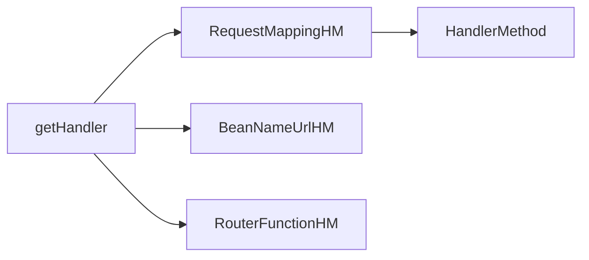

`getHandler()`는 등록된 HandlerMapping 목록을 `order` 순서대로 순회한다. 가장 먼저 매칭되는 핸들러가 사용된다.

| HandlerMapping | 처리 대상 | Order |
|---|---|---|
| `RequestMappingHandlerMapping` | `@RequestMapping` 어노테이션 | 0 |
| `BeanNameUrlHandlerMapping` | 빈 이름이 URL인 경우 | 2 |
| `RouterFunctionMapping` | WebFlux 함수형 라우터 | 3 |
| `SimpleUrlHandlerMapping` | 정적 자원 (`/**`) | `Integer.MAX_VALUE - 1` |

### 4.2 RequestMappingHandlerMapping 초기화 내부

```java
// RequestMappingHandlerMapping은 ApplicationContextAware를 구현
// ApplicationContext가 준비되면 afterPropertiesSet()이 호출됨
@Override
public void afterPropertiesSet() {
    // RequestMappingInfo 설정 (suffix matching, trailing slash 등)
    this.config = new RequestMappingInfo.BuilderConfiguration();
    this.config.setPatternParser(this.patternParser);
    // ...
    super.afterPropertiesSet(); // 부모 클래스에서 실제 스캔 수행
}

// 부모 AbstractHandlerMethodMapping.afterPropertiesSet()
@Override
public void afterPropertiesSet() {
    initHandlerMethods(); // 모든 Bean 스캔 시작
}

protected void initHandlerMethods() {
    // ApplicationContext에 등록된 모든 Bean 이름을 가져와서
    for (String beanName : getCandidateBeanNames()) {
        if (!beanName.startsWith(SCOPED_TARGET_NAME_PREFIX)) {
            // @Controller 또는 @RequestMapping이 있는 Bean만 처리
            processCandidateBean(beanName);
        }
    }
    handlerMethodsInitialized(getHandlerMethods());
}

protected void detectHandlerMethods(Object handler) {
    Class<?> handlerType = (handler instanceof String)
        ? obtainApplicationContext().getType((String) handler) : handler.getClass();

    if (handlerType != null) {
        Class<?> userType = ClassUtils.getUserClass(handlerType); // CGLIB 프록시면 원본 클래스
        // 클래스의 모든 메서드를 순회하며 @RequestMapping 메서드 탐색
        Map<Method, T> methods = MethodIntrospector.selectMethods(userType,
            (MethodIntrospector.MetadataLookup<T>) method -> {
                try {
                    return getMappingForMethod(method, userType); // RequestMappingInfo 생성
                } catch (Throwable ex) {
                    throw new IllegalStateException("...", ex);
                }
            });
        // 찾은 메서드를 MappingRegistry에 등록
        methods.forEach((method, mapping) -> {
            Method invocableMethod = AopUtils.selectInvocableMethod(method, userType);
            registerHandlerMethod(handler, invocableMethod, mapping);
        });
    }
}
```

**왜 CGLIB 프록시를 벗겨내는가?** `@Transactional`이 붙은 컨트롤러는 Spring이 CGLIB 프록시로 감싼다. 프록시 클래스에는 원본 어노테이션이 없어 `@RequestMapping`을 찾을 수 없다. `ClassUtils.getUserClass()`가 CGLIB 프록시(`$$SpringCGLIB$$`)를 감지해서 원본 클래스를 반환한다.

### 4.3 URL 매칭 알고리즘 — PathPattern vs AntPathMatcher

```java
// Spring 5.3+ 기본: PathPatternParser (AntPathMatcher보다 훨씬 빠름)
// 파싱 결과를 PathPattern 객체로 컴파일해서 재사용
PathPatternParser parser = new PathPatternParser();
PathPattern pattern = parser.parse("/orders/{id}");

// 매칭 시 PathContainer로 URL을 파싱 (문자열 조작 최소화)
PathContainer path = PathContainer.parsePath("/orders/123");
PathPattern.PathMatchInfo result = pattern.matchAndExtract(path);
// result.getUriVariables() → {"id": "123"}
```

**왜 PathPatternParser가 AntPathMatcher보다 빠른가?**

- `AntPathMatcher`는 매 요청마다 패턴 문자열을 파싱한다. `/orders/{id}` 패턴을 받으면 그때마다 `{`, `}` 위치를 찾아 파싱한다.
- `PathPatternParser`는 애플리케이션 시작 시 패턴을 한 번 컴파일해서 `PathPattern` 객체로 보관한다. 요청 시에는 이미 컴파일된 객체로 매칭한다.
- 벤치마크 결과 PathPatternParser가 AntPathMatcher보다 약 6~8배 빠르다.

### 4.4 @RequestMapping 조합 매핑

```java
@RestController
@RequestMapping(
    value = "/api/v1/orders",
    produces = MediaType.APPLICATION_JSON_VALUE   // Accept: application/json 필수
)
public class OrderController {

    // GET /api/v1/orders?status=PENDING&page=0
    // 클래스 레벨 + 메서드 레벨 경로가 조합됨
    @GetMapping(params = "status")  // status 파라미터가 있어야 이 핸들러 선택
    public Page<OrderResponse> listByStatus(
            @RequestParam OrderStatus status,
            @RequestParam(defaultValue = "0") int page) {
        return orderService.findByStatus(status, page);
    }

    // POST /api/v1/orders (Content-Type: application/json 필수)
    @PostMapping(consumes = MediaType.APPLICATION_JSON_VALUE)
    @ResponseStatus(HttpStatus.CREATED)
    public OrderResponse create(@RequestBody @Valid OrderCreateRequest req) {
        return orderService.create(req);
    }

    // GET /api/v1/orders/{id}
    // {id:[0-9]+} — 정규식으로 숫자만 허용. 문자열이면 이 핸들러 미매칭
    @GetMapping("/{id:[0-9]+}")
    public OrderResponse detail(@PathVariable Long id) {
        return orderService.findById(id);
    }

    // 같은 URL, 다른 Accept 헤더 → Content Negotiation으로 분기
    // Accept: application/xml → 이 메서드 선택
    @GetMapping(value = "/{id}", produces = MediaType.APPLICATION_XML_VALUE)
    public OrderXmlResponse detailXml(@PathVariable Long id) {
        return orderService.findByIdAsXml(id);
    }
}
```

**매핑 우선순위 규칙:**
1. 더 구체적인 패턴이 우선 (`/orders/active` > `/orders/{id}`)
2. 조건이 많은 매핑이 우선 (params, headers, consumes, produces 조건 포함)
3. 같은 구체도면 먼저 등록된 순서

---

## 5. HandlerAdapter — 왜 어댑터 패턴인가

### 5.1 어댑터 패턴의 WHY

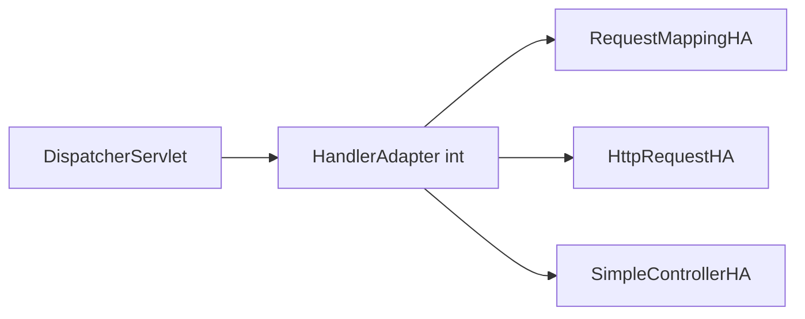

`DispatcherServlet`은 핸들러가 `@RequestMapping` 메서드인지, 레거시 `Controller` 인터페이스 구현체인지, `HttpRequestHandler`인지 알 필요가 없다. `HandlerAdapter` 인터페이스만 알면 된다.

```java
public interface HandlerAdapter {
    boolean supports(Object handler);       // 이 어댑터가 handler를 처리할 수 있는가?
    ModelAndView handle(HttpServletRequest request,
                        HttpServletResponse response,
                        Object handler) throws Exception;
    long getLastModified(HttpServletRequest request, Object handler);
}
```

새로운 핸들러 타입이 생겨도 `HandlerAdapter` 구현체만 추가하면 된다. `DispatcherServlet` 코드를 수정할 필요가 없다. 이것이 개방-폐쇄 원칙(OCP)이다.

### 5.2 RequestMappingHandlerAdapter 내부 처리 흐름

```java
// RequestMappingHandlerAdapter.handle() → invokeHandlerMethod()
protected ModelAndView invokeHandlerMethod(HttpServletRequest request,
        HttpServletResponse response, HandlerMethod handlerMethod) throws Exception {

    ServletWebRequest webRequest = new ServletWebRequest(request, response);
    try {
        // WebDataBinder 팩토리 생성 — @InitBinder 메서드 처리
        WebDataBinderFactory binderFactory = getDataBinderFactory(handlerMethod);

        // ModelFactory 생성 — @ModelAttribute 메서드 처리
        ModelFactory modelFactory = getModelFactory(handlerMethod, binderFactory);

        // 실행 가능한 HandlerMethod 래퍼 생성
        ServletInvocableHandlerMethod invocableMethod = createInvocableHandlerMethod(handlerMethod);

        // ArgumentResolver 목록 설정 (30개 이상)
        if (this.argumentResolvers != null) {
            invocableMethod.setHandlerMethodArgumentResolvers(this.argumentResolvers);
        }
        // ReturnValueHandler 목록 설정
        if (this.returnValueHandlers != null) {
            invocableMethod.setHandlerMethodReturnValueHandlers(this.returnValueHandlers);
        }

        // ...

        // 컨트롤러 메서드 실제 호출
        invocableMethod.invokeAndHandle(webRequest, mavContainer);

        return getModelAndView(mavContainer, modelFactory, webRequest);
    } finally {
        webRequest.requestCompleted();
    }
}
```

### 5.3 ArgumentResolver 체인 — 30개 이상의 리졸버가 동작하는 방식

```java
// HandlerMethodArgumentResolverComposite.resolveArgument()
@Override
@Nullable
public Object resolveArgument(MethodParameter parameter,
                               @Nullable ModelAndViewContainer mavContainer,
                               NativeWebRequest webRequest,
                               @Nullable WebDataBinderFactory binderFactory) throws Exception {
    // 1. 캐시에서 이 파라미터를 처리할 수 있는 리졸버를 먼저 조회
    HandlerMethodArgumentResolver resolver = getArgumentResolver(parameter);
    if (resolver == null) {
        throw new IllegalArgumentException("Unsupported parameter type [" +
                parameter.getParameterType().getName() + "]...");
    }
    return resolver.resolveArgument(parameter, mavContainer, webRequest, binderFactory);
}

private HandlerMethodArgumentResolver getArgumentResolver(MethodParameter parameter) {
    // 캐시 히트: 이미 이 파라미터 타입의 리졸버를 알고 있으면 바로 반환
    HandlerMethodArgumentResolver result = this.argumentResolverCache.get(parameter);
    if (result == null) {
        // 캐시 미스: 30개 이상의 리졸버를 순서대로 순회
        for (HandlerMethodArgumentResolver resolver : this.argumentResolvers) {
            if (resolver.supportsParameter(parameter)) {
                result = resolver;
                // 다음 요청을 위해 캐시에 저장
                this.argumentResolverCache.put(parameter, result);
                break;
            }
        }
    }
    return result;
}
```

**왜 캐시가 중요한가?** 리졸버가 30개 이상이고 매 요청마다 전부 순회하면 성능 저하가 크다. 파라미터 타입은 컴파일 시점에 고정되므로, 첫 요청에서 결정된 리졸버를 `ConcurrentHashMap<MethodParameter, HandlerMethodArgumentResolver>`에 캐시한다. 두 번째 요청부터는 O(1) 조회다.

### 5.4 ReturnValueHandler 체인

```java
// 주요 ReturnValueHandler들
// 반환 타입에 따라 적절한 핸들러가 선택됨
public class HandlerMethodReturnValueHandlerComposite {
    // 등록 순서대로 선택
    // 1. HttpEntityMethodProcessor — ResponseEntity 반환 처리
    // 2. RequestResponseBodyMethodProcessor — @ResponseBody 처리 → MessageConverter 사용
    // 3. ModelAndViewMethodReturnValueHandler — ModelAndView 반환 처리
    // 4. ModelAttributeMethodProcessor — @ModelAttribute 반환 처리
    // 5. ViewNameMethodReturnValueHandler — String 뷰 이름 반환 처리
}
```

---

## 6. @RequestBody 처리 — Content-Type 협상부터 Jackson 내부까지

### 6.1 @RequestBody가 동작하는 내부 흐름

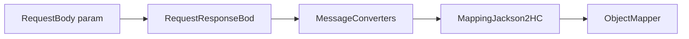

```java
// RequestResponseBodyMethodProcessor.resolveArgument()
@Override
public Object resolveArgument(MethodParameter parameter,
                               @Nullable ModelAndViewContainer mavContainer,
                               NativeWebRequest webRequest,
                               @Nullable WebDataBinderFactory binderFactory) throws Exception {
    parameter = parameter.nestedIfOptional();
    // 1. 요청 본문을 읽어서 Java 객체로 변환
    Object arg = readWithMessageConverters(webRequest, parameter, parameter.getNestedGenericParameterType());

    // 2. @Valid 또는 @Validated가 있으면 Bean Validation 실행
    if (binderFactory != null) {
        String name = Conventions.getVariableNameForParameter(parameter);
        BindingResult bindingResult = null;
        if (arg instanceof BindingResult) {
            bindingResult = (BindingResult) arg;
        } else {
            WebDataBinder binder = binderFactory.createBinder(webRequest, arg, name);
            if (arg != null) {
                validateIfApplicable(binder, parameter); // @Valid 처리
                if (binder.getBindingResult().hasErrors() &&
                        isBindExceptionRequired(binder, parameter)) {
                    throw new MethodArgumentNotValidException(parameter, binder.getBindingResult());
                }
            }
        }
    }
    return adaptArgumentIfNecessary(arg, parameter);
}
```

### 6.2 HttpMessageConverter 선택 알고리즘

```java
// AbstractMessageConverterMethodArgumentResolver.readWithMessageConverters()
protected <T> Object readWithMessageConverters(HttpInputMessage inputMessage,
        MethodParameter parameter, Type targetType) {
    // 요청의 Content-Type 헤더 파싱
    MediaType contentType = inputMessage.getHeaders().getContentType();
    if (contentType == null) {
        contentType = MediaType.APPLICATION_OCTET_STREAM; // 기본값
    }

    // 등록된 MessageConverter를 순서대로 확인
    for (HttpMessageConverter<?> converter : this.messageConverters) {
        if (converter instanceof GenericHttpMessageConverter) {
            GenericHttpMessageConverter<?> genericConverter = (GenericHttpMessageConverter<?>) converter;
            // Content-Type을 읽을 수 있고, targetType으로 변환 가능한지 확인
            if (genericConverter.canRead(targetType, contextClass, contentType)) {
                // Jackson이 application/json을 OrderCreateRequest로 읽기
                return genericConverter.read(targetType, contextClass, inputMessage);
            }
        }
    }
    throw new HttpMediaTypeNotSupportedException(contentType, getSupportedMediaTypes());
}
```

**기본 등록 순서 (이 순서가 매칭에 영향을 미친다):**

| 순서 | 컨버터 | 처리 미디어 타입 |
|---|---|---|
| 1 | `ByteArrayHttpMessageConverter` | `application/octet-stream` |
| 2 | `StringHttpMessageConverter` | `text/plain`, `*/*` |
| 3 | `ResourceHttpMessageConverter` | `*/*` |
| 4 | `MappingJackson2HttpMessageConverter` | `application/json`, `application/*+json` |
| 5 | `MappingJackson2XmlHttpMessageConverter` | `application/xml`, `text/xml` |

### 6.3 Jackson ObjectMapper 내부 — 역직렬화 과정

```java
// Content-Type: application/json, Body: {"itemId":1,"quantity":3}
// 타겟 타입: OrderCreateRequest.class
//
// MappingJackson2HttpMessageConverter.read() → ObjectMapper.readValue()
// Jackson 역직렬화 내부 과정:
// 1. JsonParser로 JSON 토큰 파싱
// 2. BeanDeserializer가 OrderCreateRequest.class의 생성자/setter 탐색
// 3. @JsonCreator가 있으면 해당 생성자 사용, 없으면 기본 생성자 + setter
// 4. 각 JSON 필드를 Java 필드로 매핑 (DeserializationConfig 기반)

@Getter
@NoArgsConstructor  // Jackson 기본 생성자 필수 (기본값)
public class OrderCreateRequest {

    @NotNull(message = "상품 ID는 필수입니다")
    private Long itemId;

    @Min(value = 1, message = "수량은 1 이상이어야 합니다")
    @Max(value = 999, message = "수량은 999 이하이어야 합니다")
    private int quantity;

    @NotBlank(message = "배송 주소는 필수입니다")
    private String deliveryAddress;

    // @JsonCreator를 사용하면 기본 생성자 없이 역직렬화 가능
    // Immutable DTO를 만들 때 유용
    @JsonCreator
    public OrderCreateRequest(
            @JsonProperty("itemId") Long itemId,
            @JsonProperty("quantity") int quantity,
            @JsonProperty("deliveryAddress") String deliveryAddress) {
        this.itemId = itemId;
        this.quantity = quantity;
        this.deliveryAddress = deliveryAddress;
    }
}
```

### 6.4 커스텀 HttpMessageConverter 구현

```java
// 예: CSV 형식 요청/응답 처리 컨버터
public class CsvHttpMessageConverter
        extends AbstractHttpMessageConverter<List<OrderResponse>> {

    public CsvHttpMessageConverter() {
        super(new MediaType("text", "csv", StandardCharsets.UTF_8));
    }

    @Override
    protected boolean supports(Class<?> clazz) {
        return List.class.isAssignableFrom(clazz);
    }

    @Override
    protected List<OrderResponse> readInternal(Class<? extends List<OrderResponse>> clazz,
            HttpInputMessage inputMessage) throws IOException {
        // CSV 파싱 로직
        List<OrderResponse> result = new ArrayList<>();
        try (BufferedReader reader = new BufferedReader(
                new InputStreamReader(inputMessage.getBody(), StandardCharsets.UTF_8))) {
            String line;
            boolean header = true;
            while ((line = reader.readLine()) != null) {
                if (header) { header = false; continue; } // 헤더 스킵
                String[] parts = line.split(",");
                result.add(new OrderResponse(Long.parseLong(parts[0]), parts[1]));
            }
        }
        return result;
    }

    @Override
    protected void writeInternal(List<OrderResponse> orders,
            HttpOutputMessage outputMessage) throws IOException {
        try (PrintWriter writer = new PrintWriter(
                new OutputStreamWriter(outputMessage.getBody(), StandardCharsets.UTF_8))) {
            writer.println("orderId,status"); // 헤더
            for (OrderResponse order : orders) {
                writer.println(order.getOrderId() + "," + order.getStatus());
            }
        }
    }
}

// WebMvcConfigurer에 등록
@Configuration
public class WebConfig implements WebMvcConfigurer {
    @Override
    public void configureMessageConverters(List<HttpMessageConverter<?>> converters) {
        converters.add(new CsvHttpMessageConverter());
        // 주의: configureMessageConverters()는 기본 컨버터를 대체
        // extendMessageConverters()를 쓰면 기본 컨버터 유지 + 추가
    }
}
```

---

## 7. Argument Resolution 심층 분석 — 각 어노테이션의 내부 메커니즘

### 7.1 @PathVariable — URL 템플릿 변수 추출

```java
// PathVariableMethodArgumentResolver.resolveArgument()
// 내부 동작:
// 1. HandlerMapping이 URL 매칭 시 URI 변수를 request attribute로 저장
//    request.setAttribute(HandlerMapping.URI_TEMPLATE_VARIABLES_ATTRIBUTE, uriVariables)
// 2. PathVariableMethodArgumentResolver가 이 attribute에서 변수를 꺼냄
// 3. ConversionService로 String → 타겟 타입 변환

@GetMapping("/orders/{orderId}/items/{itemId}")
public OrderItemResponse getItem(
        @PathVariable Long orderId,    // "123" → Long 123 (ConversionService가 변환)
        @PathVariable("itemId") Long id // 파라미터명과 다를 때 명시적 지정
) {
    return orderService.findItem(orderId, id);
}

// 변환 실패 시 MethodArgumentTypeMismatchException → 400 Bad Request
// /orders/abc → @ExceptionHandler(MethodArgumentTypeMismatchException.class) 가 처리

// Map으로 모든 경로 변수 한 번에 받기
@GetMapping("/orders/{orderId}/items/{itemId}")
public String getItem(@PathVariable Map<String, String> pathVars) {
    // {"orderId": "123", "itemId": "456"}
    return pathVars.get("orderId") + "/" + pathVars.get("itemId");
}
```

### 7.2 @RequestParam — 쿼리 파라미터와 폼 데이터

```java
// RequestParamMethodArgumentResolver.resolveArgument()
// 내부 동작:
// 1. request.getParameter(name) 또는 request.getParameterValues(name) 호출
// 2. ConversionService로 타입 변환
// 3. required=true이고 파라미터 없으면 MissingServletRequestParameterException

@GetMapping("/orders")
public Page<OrderResponse> list(
        // 필수 파라미터 — 없으면 400
        @RequestParam OrderStatus status,

        // 선택적 파라미터, 기본값 지정
        @RequestParam(defaultValue = "0") int page,
        @RequestParam(defaultValue = "20") int size,

        // 여러 값 허용: ?tags=java&tags=spring
        @RequestParam(required = false) List<String> tags,

        // 파라미터명이 다를 때
        @RequestParam("sort_by") String sortBy
) {
    return orderService.search(status, page, size, tags, sortBy);
}

// MultiValueMap으로 모든 파라미터 한 번에 받기
@GetMapping("/search")
public SearchResponse search(@RequestParam MultiValueMap<String, String> params) {
    // {"status": ["PENDING"], "tags": ["java", "spring"]}
    return searchService.search(params);
}
```

### 7.3 @ModelAttribute — 폼 데이터 바인딩 내부

```java
// ModelAttributeMethodProcessor.resolveArgument()
// 내부 동작:
// 1. 타겟 클래스의 기본 생성자로 인스턴스 생성
// 2. WebDataBinder로 request 파라미터를 객체 필드에 바인딩
//    - 필드명과 파라미터명 매칭 (대소문자 구분)
//    - ConversionService로 타입 변환
// 3. @Valid/@Validated 있으면 Bean Validation 실행

@Getter
@Setter // @ModelAttribute 바인딩에는 setter가 필요
public class OrderSearchForm {
    private OrderStatus status;
    private LocalDate fromDate;  // "2026-01-01" → LocalDate (ConversionService)
    private LocalDate toDate;
    private int page = 0;        // 기본값은 필드 초기화로
}

@GetMapping("/orders/search")
public String search(
        @ModelAttribute OrderSearchForm form, // form-data 자동 바인딩
        BindingResult result,                 // 검증 결과 (ModelAttribute 직후 위치 필수)
        Model model) {
    if (result.hasErrors()) {
        return "order/search"; // 폼 다시 표시
    }
    model.addAttribute("orders", orderService.search(form));
    return "order/results";
}

// @ModelAttribute는 생략 가능
// 복합 타입이고 다른 어노테이션이 없으면 자동으로 @ModelAttribute 취급
@GetMapping("/test")
public String test(OrderSearchForm form) { // @ModelAttribute 생략 가능
    return "test";
}
```

**@ModelAttribute vs @RequestBody 결정적 차이:**

| 항목 | @ModelAttribute | @RequestBody |
|---|---|---|
| 입력 형식 | `application/x-www-form-urlencoded`, `multipart/form-data` | `application/json` 등 |
| 바인딩 방식 | `request.getParameter()` + setter | `HttpMessageConverter` (Jackson) |
| 중첩 객체 | 제한적 (`address.city=Seoul`) | 완전 지원 (JSON 중첩) |
| 주로 사용 | HTML 폼 제출 | REST API |

### 7.4 @RequestHeader와 @CookieValue

```java
@GetMapping("/api/data")
public DataResponse getData(
        // 헤더 값 추출
        @RequestHeader("Authorization") String authHeader,
        @RequestHeader(value = "Accept-Language", required = false)
                Locale locale,
        @RequestHeader(value = "X-API-Version", defaultValue = "1")
                int apiVersion,
        // 모든 헤더를 Map으로
        @RequestHeader HttpHeaders headers,

        // 쿠키 값 추출
        @CookieValue(value = "SESSION", required = false) String sessionId
) {
    return dataService.getData(locale, apiVersion, sessionId);
}
```

---

## 8. 커스텀 ArgumentResolver — JWT 사용자 자동 주입 완전 구현

```java
// 1. 커스텀 어노테이션
@Target(ElementType.PARAMETER)
@Retention(RetentionPolicy.RUNTIME)
@Documented
public @interface CurrentUser {}

// 2. ArgumentResolver 구현
@Component
@RequiredArgsConstructor
public class CurrentUserArgumentResolver implements HandlerMethodArgumentResolver {

    private final JwtTokenProvider jwtTokenProvider;
    private final MemberRepository memberRepository;

    @Override
    public boolean supportsParameter(MethodParameter parameter) {
        // @CurrentUser가 붙어 있고, 파라미터 타입이 Member인 경우에만 처리
        return parameter.hasParameterAnnotation(CurrentUser.class)
                && Member.class.isAssignableFrom(parameter.getParameterType());
    }

    @Override
    public Object resolveArgument(MethodParameter parameter,
                                   @Nullable ModelAndViewContainer mavContainer,
                                   NativeWebRequest webRequest,
                                   @Nullable WebDataBinderFactory binderFactory) {
        // NativeWebRequest → HttpServletRequest로 변환
        HttpServletRequest request = webRequest.getNativeRequest(HttpServletRequest.class);
        String token = extractBearerToken(request);

        if (token == null) {
            throw new UnauthorizedException("인증 토큰이 없습니다");
        }
        if (!jwtTokenProvider.validateToken(token)) {
            throw new UnauthorizedException("만료되거나 유효하지 않은 토큰입니다");
        }

        Long memberId = jwtTokenProvider.getMemberId(token);
        return memberRepository.findById(memberId)
                .orElseThrow(() -> new EntityNotFoundException("회원을 찾을 수 없습니다: " + memberId));
    }

    private String extractBearerToken(HttpServletRequest request) {
        String header = request.getHeader(HttpHeaders.AUTHORIZATION);
        if (StringUtils.hasText(header) && header.startsWith("Bearer ")) {
            return header.substring(7).strip();
        }
        return null;
    }
}

// 3. 등록
@Configuration
@RequiredArgsConstructor
public class WebConfig implements WebMvcConfigurer {
    private final CurrentUserArgumentResolver currentUserArgumentResolver;

    @Override
    public void addArgumentResolvers(List<HandlerMethodArgumentResolver> resolvers) {
        resolvers.add(currentUserArgumentResolver);
    }
}

// 4. 사용 — 컨트롤러가 JWT 파싱 로직을 전혀 모른다
@RestController
@RequestMapping("/api/members")
public class MemberController {

    @GetMapping("/me")
    public MemberResponse getMyInfo(@CurrentUser Member member) {
        return MemberResponse.from(member);
    }

    @GetMapping("/me/orders")
    public List<OrderResponse> getMyOrders(
            @CurrentUser Member member,
            @RequestParam(defaultValue = "0") int page) {
        return orderService.findByMemberId(member.getId(), page);
    }
}
```

---

## 9. 예외 처리 아키텍처 — HandlerExceptionResolver 체인

### 9.1 예외 처리 계층 구조

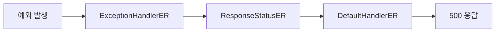

```java
// DispatcherServlet.processHandlerException()
// HandlerExceptionResolver 목록을 순서대로 시도
@Nullable
protected ModelAndView processHandlerException(HttpServletRequest request,
        HttpServletResponse response, @Nullable Object handler, Exception ex) throws Exception {
    ModelAndView exMv = null;
    if (this.handlerExceptionResolvers != null) {
        for (HandlerExceptionResolver resolver : this.handlerExceptionResolvers) {
            exMv = resolver.resolveException(request, response, handler, ex);
            if (exMv != null) {
                if (exMv.isEmpty()) {
                    return null; // 예외 처리됨, 응답은 이미 직접 씀
                }
                // 뷰로 에러 페이지 렌더링
                if (!exMv.hasView()) {
                    String defaultViewName = getDefaultViewName(request);
                    if (defaultViewName != null) {
                        exMv.setViewName(defaultViewName);
                    }
                }
                return exMv;
            }
        }
    }
    throw ex; // 처리 못 하면 서블릿 컨테이너로 위임 → 500
}
```

**HandlerExceptionResolver 우선순위:**

| 순서 | Resolver | 담당 |
|---|---|---|
| 1 | `ExceptionHandlerExceptionResolver` | `@ExceptionHandler` 메서드 |
| 2 | `ResponseStatusExceptionResolver` | `@ResponseStatus` 어노테이션 |
| 3 | `DefaultHandlerExceptionResolver` | Spring MVC 표준 예외 (400, 404, 405...) |

### 9.2 @ControllerAdvice + @ExceptionHandler 내부 동작

```java
// ExceptionHandlerExceptionResolver가 @ControllerAdvice를 처리하는 방법:
// 1. 초기화 시 모든 @ControllerAdvice 빈을 스캔
// 2. 각 @ControllerAdvice의 @ExceptionHandler 메서드를 캐시에 등록
//    캐시 키: (예외 타입 → @ExceptionHandler 메서드)
// 3. 예외 발생 시:
//    a. 먼저 해당 컨트롤러 클래스 내 @ExceptionHandler 탐색
//    b. 없으면 @ControllerAdvice의 @ExceptionHandler 탐색
//    c. 예외 타입이 정확히 일치하는 것 우선, 부모 타입 순서로

@RestControllerAdvice
@Slf4j
public class GlobalExceptionHandler extends ResponseEntityExceptionHandler {
    // ResponseEntityExceptionHandler를 상속하면
    // Spring MVC 내부 예외(MethodArgumentNotValidException 등)를
    // 기본 처리하면서 커스터마이징 가능

    // 커스텀 비즈니스 예외
    @ExceptionHandler(BusinessException.class)
    public ResponseEntity<ErrorResponse> handleBusiness(BusinessException e,
                                                         HttpServletRequest request) {
        log.warn("[{}] {} - {}", request.getMethod(), request.getRequestURI(), e.getMessage());
        return ResponseEntity
                .status(e.getErrorCode().getHttpStatus())
                .body(ErrorResponse.of(e.getErrorCode().name(), e.getMessage()));
    }

    // @RequestBody @Valid 실패 — Spring MVC 내부 예외 재정의
    @Override
    protected ResponseEntity<Object> handleMethodArgumentNotValid(
            MethodArgumentNotValidException ex, HttpHeaders headers,
            HttpStatusCode status, WebRequest request) {
        List<ErrorResponse.FieldError> errors = ex.getBindingResult().getFieldErrors()
                .stream()
                .map(fe -> ErrorResponse.FieldError.builder()
                        .field(fe.getField())
                        .value(String.valueOf(fe.getRejectedValue()))
                        .message(fe.getDefaultMessage())
                        .build())
                .collect(Collectors.toList());
        return ResponseEntity.badRequest()
                .body(ErrorResponse.ofValidation("VALIDATION_FAILED", errors));
    }

    // @PathVariable 타입 불일치
    @ExceptionHandler(MethodArgumentTypeMismatchException.class)
    public ResponseEntity<ErrorResponse> handleTypeMismatch(
            MethodArgumentTypeMismatchException e) {
        String message = String.format("파라미터 '%s'에 잘못된 값 '%s'이 전달되었습니다. 예상 타입: %s",
                e.getName(), e.getValue(),
                e.getRequiredType() != null ? e.getRequiredType().getSimpleName() : "알 수 없음");
        return ResponseEntity.badRequest().body(ErrorResponse.of("TYPE_MISMATCH", message));
    }

    // 리소스 없음 — 명시적 ResponseStatus 대신 예외에 포함
    @ExceptionHandler(EntityNotFoundException.class)
    public ResponseEntity<ErrorResponse> handleNotFound(EntityNotFoundException e) {
        return ResponseEntity.status(HttpStatus.NOT_FOUND)
                .body(ErrorResponse.of("NOT_FOUND", e.getMessage()));
    }

    // 최종 방어선 — 내부 구현 정보 절대 노출 금지
    @ExceptionHandler(Exception.class)
    public ResponseEntity<ErrorResponse> handleUnexpected(Exception e,
                                                           HttpServletRequest request) {
        // stacktrace는 서버 로그에만
        log.error("Unhandled exception on {} {}", request.getMethod(),
                  request.getRequestURI(), e);
        return ResponseEntity.internalServerError()
                .body(ErrorResponse.of("INTERNAL_ERROR", "일시적인 오류가 발생했습니다"));
    }
}
```

### 9.3 @ResponseStatus — 예외 클래스에 HTTP 상태 코드 직접 선언

```java
// ResponseStatusExceptionResolver가 처리
// @ExceptionHandler 없이도 HTTP 상태 코드 지정 가능
@ResponseStatus(
    value = HttpStatus.NOT_FOUND,
    reason = "Order not found" // reason은 응답 body가 아닌 HTTP reason phrase
)
public class OrderNotFoundException extends RuntimeException {
    public OrderNotFoundException(Long id) {
        super("주문을 찾을 수 없습니다: " + id);
    }
}

// Spring 5+ ResponseStatusException — @ResponseStatus 없이 코드에서 직접 던짐
// 더 유연하고 동적인 메시지 가능
throw new ResponseStatusException(HttpStatus.NOT_FOUND,
        "주문 " + id + "를 찾을 수 없습니다");
```

---

## 10. Interceptor vs Filter — 실행 위치와 책임 경계

### 10.1 실행 흐름 전체 그림

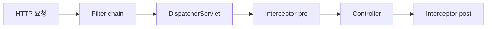

**왜 인터셉터에서 handler 정보에 접근할 수 있는가?** 필터는 DispatcherServlet에 요청이 도달하기 전에 실행되므로, 어떤 컨트롤러 메서드가 처리할지 아직 결정되지 않았다. 인터셉터는 HandlerMapping이 핸들러를 결정한 후에 실행되므로 `HandlerMethod` 객체를 통해 어노테이션, 파라미터, 반환 타입 정보를 모두 알 수 있다.

### 10.2 Filter — 서블릿 컨테이너 레벨

```java
@Component
@Order(1) // 필터 실행 순서 — 낮을수록 먼저
@Slf4j
public class TraceIdFilter implements Filter {

    private static final String TRACE_ID_HEADER = "X-Trace-Id";

    @Override
    public void doFilter(ServletRequest request, ServletResponse response,
                         FilterChain chain) throws IOException, ServletException {
        HttpServletRequest httpRequest = (HttpServletRequest) request;
        HttpServletResponse httpResponse = (HttpServletResponse) response;

        // 외부에서 전달된 추적 ID 재사용 또는 새로 생성
        String traceId = Optional.ofNullable(httpRequest.getHeader(TRACE_ID_HEADER))
                .filter(StringUtils::hasText)
                .orElse(UUID.randomUUID().toString().replace("-", "").substring(0, 16));

        // MDC에 등록 — 이후 모든 로그에 자동 포함
        MDC.put("traceId", traceId);
        // 응답 헤더에도 추가 — 클라이언트가 추적 가능
        httpResponse.setHeader(TRACE_ID_HEADER, traceId);

        try {
            chain.doFilter(request, response);
        } finally {
            // 스레드 반환 전 반드시 MDC 정리 — 스레드 풀 오염 방지
            MDC.remove("traceId");
        }
    }
}
```

### 10.3 Interceptor — Spring MVC 레벨

```java
@Slf4j
@Component
@RequiredArgsConstructor
public class RateLimitInterceptor implements HandlerInterceptor {

    private final RateLimiter rateLimiter; // Spring Bean 자유롭게 주입

    @Override
    public boolean preHandle(HttpServletRequest request, HttpServletResponse response,
                             Object handler) throws Exception {
        // 정적 리소스 핸들러는 레이트 리밋 제외
        if (!(handler instanceof HandlerMethod)) {
            return true;
        }

        HandlerMethod handlerMethod = (HandlerMethod) handler;

        // 메서드 레벨 어노테이션 확인
        RateLimit rateLimit = handlerMethod.getMethodAnnotation(RateLimit.class);
        if (rateLimit == null) {
            // 클래스 레벨 어노테이션 확인
            rateLimit = handlerMethod.getBeanType().getAnnotation(RateLimit.class);
        }

        if (rateLimit != null) {
            String clientIp = getClientIp(request);
            String key = clientIp + ":" + request.getRequestURI();
            if (!rateLimiter.tryAcquire(key, rateLimit.limit(), rateLimit.duration())) {
                response.setStatus(HttpStatus.TOO_MANY_REQUESTS.value());
                response.setContentType(MediaType.APPLICATION_JSON_VALUE);
                response.getWriter().write("{\"error\":\"요청 한도를 초과했습니다\"}");
                return false; // 컨트롤러 호출 중단
            }
        }
        return true;
    }

    @Override
    public void afterCompletion(HttpServletRequest request, HttpServletResponse response,
                                Object handler, @Nullable Exception ex) {
        // ex != null이면 예외 발생 케이스
        if (ex != null) {
            log.warn("Request failed: {} {} - {}",
                    request.getMethod(), request.getRequestURI(), ex.getMessage());
        }
        // 여기서 ThreadLocal 정리, 메트릭 기록 등 수행
    }

    private String getClientIp(HttpServletRequest request) {
        // 로드 밸런서/프록시 뒤에 있을 때 실제 IP 추출
        String forwarded = request.getHeader("X-Forwarded-For");
        if (StringUtils.hasText(forwarded)) {
            return forwarded.split(",")[0].strip();
        }
        return request.getRemoteAddr();
    }
}
```

### 10.4 Filter vs Interceptor 결정 기준표

| 상황 | 선택 | 이유 |
|---|---|---|
| 문자 인코딩 설정 | Filter | DispatcherServlet이 파라미터를 읽기 전에 처리해야 함 |
| CORS 헤더 처리 | Filter | Preflight OPTIONS 요청은 DispatcherServlet 이전에 처리 |
| XSS 방어 | Filter | 입력값 산화는 가장 이른 단계에서 |
| JWT 인증 (Spring 연동) | Interceptor | Spring Bean 접근 필요, @ExceptionHandler 연동 |
| 권한 체크 (핸들러 어노테이션 기반) | Interceptor | `HandlerMethod`에서 어노테이션 정보 필요 |
| 요청/응답 로깅 | Filter | 전체 처리 시간 측정 (DispatcherServlet 포함) |
| API 레이트 리밋 | Interceptor | Spring Bean(Redis 등) 접근 필요 |

---

## 11. Content Negotiation — 같은 URL, 다른 표현

### 11.1 ContentNegotiationManager의 전략

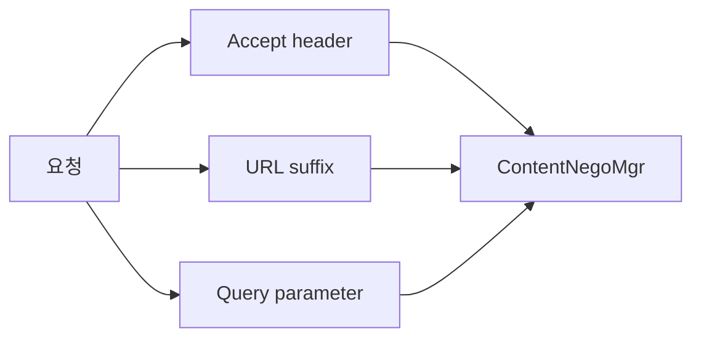

```java
@Configuration
public class WebConfig implements WebMvcConfigurer {

    @Override
    public void configureContentNegotiation(ContentNegotiationConfigurer configurer) {
        configurer
            // 1순위: Accept 헤더 (기본값)
            // Accept: application/json → JSON 응답
            // Accept: application/xml → XML 응답
            .favorParameter(true)  // 2순위: ?format=json 파라미터
            .parameterName("format")
            .ignoreAcceptHeader(false)
            .useRegisteredExtensionsOnly(false)
            .defaultContentType(MediaType.APPLICATION_JSON)
            .mediaType("json", MediaType.APPLICATION_JSON)
            .mediaType("xml", MediaType.APPLICATION_XML);
    }
}

// 컨트롤러에서 produces로 지원 타입 선언
@GetMapping(value = "/orders/{id}",
            produces = {MediaType.APPLICATION_JSON_VALUE,
                       MediaType.APPLICATION_XML_VALUE})
public OrderResponse getOrder(@PathVariable Long id) {
    // 반환 타입은 동일 — Content Negotiation이 표현 형식 결정
    return orderService.findById(id);
}
```

### 11.2 ProducesRequestCondition — produces 조건 매칭 내부

```java
// Accept: application/json 요청이 왔을 때
// produces = "application/json"인 핸들러가 선택됨
// produces = "application/xml"인 핸들러는 HttpMediaTypeNotAcceptableException
//
// Accept: */* (기본값, 대부분의 브라우저/curl)이면 모든 produces와 매칭
// 이 경우 등록 순서대로 첫 번째 매칭 핸들러 선택
```

---

## 12. 비동기 요청 처리 — Servlet 3.0 async 메커니즘

### 12.1 왜 비동기가 필요한가

동기 방식에서는 컨트롤러가 처리 중인 동안 Tomcat 스레드가 블록된다. Tomcat 기본 스레드 풀이 200개이고, 각 요청 처리에 평균 500ms가 걸린다면 초당 최대 400 TPS밖에 처리하지 못한다. 외부 API 호출, DB 쿼리 대기 중에 스레드가 낭비된다.

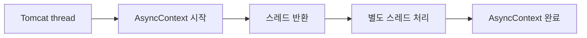

### 12.2 DeferredResult — 다른 스레드에서 결과 설정

```java
@RestController
@RequiredArgsConstructor
public class NotificationController {

    private final Map<Long, DeferredResult<NotificationResponse>> waitingRequests
            = new ConcurrentHashMap<>();

    // 클라이언트가 서버 푸시를 기다리는 엔드포인트 (Long Polling)
    @GetMapping("/notifications/poll")
    public DeferredResult<NotificationResponse> poll(@CurrentUser Member member) {
        // 타임아웃 30초, 타임아웃 시 응답 값
        DeferredResult<NotificationResponse> result = new DeferredResult<>(30_000L,
                NotificationResponse.empty());

        waitingRequests.put(member.getId(), result);

        result.onCompletion(() -> waitingRequests.remove(member.getId()));
        result.onTimeout(() -> {
            waitingRequests.remove(member.getId());
            // 타임아웃은 이미 설정한 기본값으로 응답됨
        });

        // Tomcat 스레드는 여기서 반환됨 (블록 안 됨)
        // 결과는 이벤트가 발생할 때 setResult()로 설정
        return result;
    }

    // 다른 스레드(이벤트 리스너 등)에서 결과 설정
    @EventListener
    public void onNotification(NotificationEvent event) {
        DeferredResult<NotificationResponse> waiting =
                waitingRequests.get(event.getMemberId());
        if (waiting != null) {
            waiting.setResult(NotificationResponse.from(event)); // 클라이언트에 즉시 전송
        }
    }
}
```

### 12.3 Callable — Spring 관리 스레드 풀에서 실행

```java
@GetMapping("/orders/export")
public Callable<byte[]> exportOrders(@CurrentUser Member member) {
    // Callable을 반환하면 Spring이 별도 스레드 풀에서 실행
    // Tomcat 스레드는 즉시 반환
    return () -> {
        // 이 람다는 Spring의 TaskExecutor 스레드에서 실행
        List<Order> orders = orderService.findAllByMember(member.getId());
        return excelExporter.export(orders); // 시간이 걸리는 작업
    };
}

// TaskExecutor 커스텀 설정
@Configuration
public class AsyncConfig implements WebMvcConfigurer {
    @Override
    public void configureAsyncSupport(AsyncSupportConfigurer configurer) {
        configurer.setDefaultTimeout(60_000); // 60초 타임아웃
        configurer.setTaskExecutor(asyncTaskExecutor()); // 커스텀 스레드 풀
    }

    @Bean
    public ThreadPoolTaskExecutor asyncTaskExecutor() {
        ThreadPoolTaskExecutor executor = new ThreadPoolTaskExecutor();
        executor.setCorePoolSize(10);
        executor.setMaxPoolSize(50);
        executor.setQueueCapacity(100);
        executor.setThreadNamePrefix("async-mvc-");
        executor.initialize();
        return executor;
    }
}
```

### 12.4 StreamingResponseBody — 대용량 데이터 스트리밍

```java
@GetMapping("/orders/download")
public ResponseEntity<StreamingResponseBody> downloadOrders(
        @CurrentUser Member member) {

    StreamingResponseBody body = outputStream -> {
        // OutputStreamWriter로 직접 쓰기 — 전체 데이터를 메모리에 올리지 않음
        try (PrintWriter writer = new PrintWriter(
                new OutputStreamWriter(outputStream, StandardCharsets.UTF_8))) {
            writer.println("orderId,status,amount,createdAt");

            // DB에서 스트림으로 읽어서 바로 쓰기 (메모리 절약)
            orderRepository.streamByMemberId(member.getId()).forEach(order -> {
                writer.printf("%d,%s,%.2f,%s%n",
                        order.getId(), order.getStatus(),
                        order.getAmount(), order.getCreatedAt());
                writer.flush(); // 청크 단위로 전송
            });
        }
    };

    return ResponseEntity.ok()
            .header(HttpHeaders.CONTENT_DISPOSITION, "attachment; filename=\"orders.csv\"")
            .contentType(new MediaType("text", "csv", StandardCharsets.UTF_8))
            .body(body);
}
```

---

## 13. Validation 심층 분석 — @Valid vs @Validated, 그룹 검증

### 13.1 @Valid vs @Validated 차이

```java
// @Valid: javax.validation (Jakarta Validation) — 표준 스펙
// @Validated: Spring 확장 — 그룹 검증 지원 + 클래스 레벨 적용 가능

// 그룹 인터페이스 정의
public interface ValidationGroups {
    interface Create {}
    interface Update {}
}

@Getter
public class MemberRequest {

    // Create 그룹에서만 필수 — 생성 시에는 이름 필수, 수정 시에는 선택
    @NotBlank(message = "이름은 필수입니다", groups = ValidationGroups.Create.class)
    private String name;

    // 항상 필수
    @NotBlank(message = "이메일은 필수입니다",
              groups = {ValidationGroups.Create.class, ValidationGroups.Update.class})
    @Email(message = "유효한 이메일 형식이 아닙니다",
           groups = {ValidationGroups.Create.class, ValidationGroups.Update.class})
    private String email;

    // Update 그룹에서만 검증 — 수정 시에만 비밀번호 필드 존재
    @NotBlank(message = "비밀번호는 필수입니다", groups = ValidationGroups.Update.class)
    @Size(min = 8, message = "비밀번호는 8자 이상이어야 합니다",
          groups = ValidationGroups.Update.class)
    private String newPassword;
}

@RestController
@RequestMapping("/api/members")
public class MemberController {

    // @Valid: 그룹 없이 전체 검증 (기본 그룹 = 그룹 없음)
    @PostMapping
    public MemberResponse create(@RequestBody @Validated(ValidationGroups.Create.class)
                                  MemberRequest req) {
        return memberService.create(req);
    }

    // @Validated(Update.class): Update 그룹만 검증
    @PutMapping("/{id}")
    public MemberResponse update(@PathVariable Long id,
                                  @RequestBody @Validated(ValidationGroups.Update.class)
                                  MemberRequest req) {
        return memberService.update(id, req);
    }
}
```

### 13.2 MethodValidationPostProcessor — 메서드 파라미터/반환값 검증

```java
// @Valid는 @RequestBody에만 작동
// 서비스 레이어 메서드 파라미터도 검증하려면 MethodValidationPostProcessor 필요

@Configuration
public class ValidationConfig {
    @Bean
    public MethodValidationPostProcessor methodValidationPostProcessor() {
        return new MethodValidationPostProcessor();
        // 이 Bean이 있으면 @Validated가 붙은 클래스의 모든 메서드를 AOP로 감쌈
        // 파라미터와 반환값에 붙은 제약 어노테이션을 실행 시 검증
    }
}

@Service
@Validated // 이 어노테이션이 있어야 MethodValidationPostProcessor가 감쌈
public class OrderService {

    public OrderResponse findById(@NotNull @Positive Long id) {
        // id가 null이거나 양수가 아니면 ConstraintViolationException 발생
        return orderRepository.findById(id)
                .map(OrderResponse::from)
                .orElseThrow(() -> new EntityNotFoundException("주문 없음: " + id));
    }

    @Valid // 반환값 검증 — 반환 객체의 @NotNull 등 검증
    public @NotNull OrderResponse create(@Valid OrderCreateRequest req) {
        // req의 @NotNull, @Min 등 검증됨
        // 반환값의 @NotNull도 검증됨
        return OrderResponse.from(orderRepository.save(req.toEntity()));
    }
}
```

### 13.3 커스텀 Validator 구현

```java
// 1. 커스텀 제약 어노테이션
@Target({ElementType.FIELD, ElementType.PARAMETER})
@Retention(RetentionPolicy.RUNTIME)
@Constraint(validatedBy = UniqueEmailValidator.class)
public @interface UniqueEmail {
    String message() default "이미 사용 중인 이메일입니다";
    Class<?>[] groups() default {};
    Class<? extends Payload>[] payload() default {};
}

// 2. Validator 구현
@Component
@RequiredArgsConstructor
public class UniqueEmailValidator implements ConstraintValidator<UniqueEmail, String> {

    private final MemberRepository memberRepository;

    @Override
    public boolean isValid(String email, ConstraintValidatorContext context) {
        if (!StringUtils.hasText(email)) {
            return true; // null/blank는 @NotBlank에서 처리
        }
        return !memberRepository.existsByEmail(email);
    }
}

// 3. 사용
public class MemberJoinRequest {
    @NotBlank
    @Email
    @UniqueEmail // DB 조회로 중복 확인
    private String email;
}
```

---

## 14. @Controller vs @RestController — 내부 차이

```java
// @RestController 소스 코드
@Target(ElementType.TYPE)
@Retention(RetentionPolicy.RUNTIME)
@Documented
@Controller
@ResponseBody   // 이것이 유일한 추가 어노테이션
public @interface RestController {
    @AliasFor(annotation = Controller.class)
    String value() default "";
}
```

`@ResponseBody`가 클래스 레벨에 붙으면 해당 클래스의 모든 메서드에 `@ResponseBody`가 적용된다. `@ResponseBody`가 있으면 `RequestResponseBodyMethodProcessor`가 반환값을 `HttpMessageConverter`로 직렬화하여 응답 바디에 직접 쓴다. `ViewResolver`를 거치지 않는다.

```mermaid
graph LR
    A[Controller 반환] --> B{@ResponseBody?}
    B -->|Yes| C[MessageConverter]
    B -->|No| D[ViewResolver]
    C --> E[Response Body]
    D --> F[View 렌더링]
```

---

## 15. 극한 시나리오 — 이런 상황에서 Spring MVC는 어떻게 동작하는가

### 시나리오 1: 1000명이 동시에 파일을 업로드한다

Tomcat 기본 스레드 풀(200개)이 소진된다. 파일이 크면 각 스레드가 오래 블록된다. `MultipartFile`은 임시 디렉토리에 저장(`/tmp`)되는데, 디스크 공간이 부족하면 `IOException`이 발생한다. `doDispatch()` 마지막 `finally`에서 `cleanupMultipart()`가 임시 파일을 정리하지 못하면 `/tmp` 디렉토리가 가득 찬다.

```java
// 방어 설정
@Configuration
public class FileUploadConfig {
    @Bean
    public MultipartResolver multipartResolver() {
        StandardServletMultipartResolver resolver = new StandardServletMultipartResolver();
        return resolver;
    }
}

// application.yml
// spring.servlet.multipart.max-file-size=10MB
// spring.servlet.multipart.max-request-size=100MB
// spring.servlet.multipart.location=/tmp/uploads  # 전용 경로
```

**대용량 파일은 `StreamingResponseBody`처럼 스트리밍으로 받아야 한다.** `MultipartFile`은 전체를 메모리/임시파일에 올리므로 적합하지 않다.

### 시나리오 2: Jackson 역직렬화 중 무한 재귀 발생

양방향 연관관계(`Order` ↔ `Member`)에서 `Order.member.orders.get(0).member.orders...`로 무한 참조가 발생한다. `StackOverflowError`가 발생하고 500이 반환된다. `@ExceptionHandler(Exception.class)`가 잡지만 스택 트레이스가 매우 길다.

```java
// 방어: @JsonManagedReference / @JsonBackReference
@Entity
public class Order {
    @ManyToOne
    @JsonBackReference  // 직렬화 제외 (역방향)
    private Member member;
}

@Entity
public class Member {
    @OneToMany(mappedBy = "member")
    @JsonManagedReference  // 직렬화 포함 (정방향)
    private List<Order> orders;
}

// 또는 별도 DTO를 사용 (엔티티 직접 직렬화 금지 권장)
```

### 시나리오 3: 인터셉터에서 예외를 던졌는데 @ExceptionHandler가 안 잡는다

`preHandle()`에서 예외를 던지면 `doDispatch()`의 catch 블록에서 `processHandlerException()`이 호출되고 `@ExceptionHandler`가 정상 동작한다. 그러나 필터에서 예외를 던지면 `DispatcherServlet`을 완전히 벗어나므로 `@ExceptionHandler`가 동작하지 않는다. 서블릿 컨테이너의 기본 에러 페이지(HTML)가 클라이언트에 전달된다.

```java
// 필터에서 예외 처리가 필요하면 직접 JSON 응답을 써야 한다
@Override
public void doFilter(ServletRequest request, ServletResponse response, FilterChain chain)
        throws IOException, ServletException {
    try {
        chain.doFilter(request, response);
    } catch (JwtException e) {
        HttpServletResponse httpResponse = (HttpServletResponse) response;
        httpResponse.setStatus(HttpServletResponse.SC_UNAUTHORIZED);
        httpResponse.setContentType(MediaType.APPLICATION_JSON_VALUE);
        httpResponse.setCharacterEncoding("UTF-8");
        httpResponse.getWriter().write("{\"error\":\"" + e.getMessage() + "\"}");
    }
}
```

### 시나리오 4: @ControllerAdvice 두 개가 같은 예외를 처리한다

```java
@RestControllerAdvice
@Order(1)  // 숫자가 작을수록 먼저 실행
public class SpecificExceptionHandler {
    @ExceptionHandler(OrderNotFoundException.class) // 더 구체적
    public ResponseEntity<ErrorResponse> handle(OrderNotFoundException e) { ... }
}

@RestControllerAdvice
@Order(2)
public class GlobalExceptionHandler {
    @ExceptionHandler(EntityNotFoundException.class) // 부모 클래스
    public ResponseEntity<ErrorResponse> handle(EntityNotFoundException e) { ... }
}
// OrderNotFoundException extends EntityNotFoundException 이면
// @Order(1)의 SpecificExceptionHandler가 먼저 선택됨
```

### 시나리오 5: ArgumentResolver에서 DB 호출이 N+1 문제를 유발한다

`@CurrentUser`로 주입하는 `Member` 객체가 매 요청마다 DB 조회를 발생시킨다. 컨트롤러 메서드가 10개라면 10번의 추가 쿼리가 발생한다.

```java
// 방어: 요청 범위 캐시 활용
@Override
public Object resolveArgument(...) {
    // request attribute에 캐시 — 같은 요청에서 두 번 resolve하면 DB 한 번만 조회
    Member cached = (Member) webRequest.getAttribute("currentUser",
                                                       RequestAttributes.SCOPE_REQUEST);
    if (cached != null) return cached;

    Long memberId = jwtTokenProvider.getMemberId(extractBearerToken(request));
    Member member = memberRepository.findById(memberId)
            .orElseThrow(() -> new EntityNotFoundException("회원 없음"));

    webRequest.setAttribute("currentUser", member, RequestAttributes.SCOPE_REQUEST);
    return member;
}
```

---

## 16. 전통적 Spring MVC 설정 구조 (레거시 이해)

### 16.1 두 개의 ApplicationContext 계층

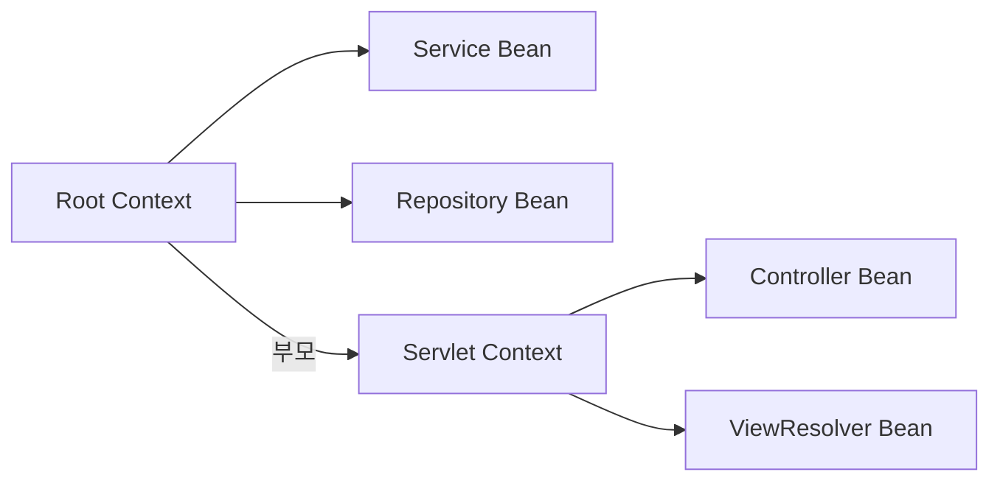

전통적 Spring MVC는 Root Context(공통 빈: Service, Repository, DataSource)와 Servlet Context(MVC 빈: Controller, ViewResolver, HandlerMapping)를 분리한다. Servlet Context는 Root Context의 빈을 참조할 수 있지만 반대는 불가능하다.

**`@Transactional`이 Servlet Context에 등록된 Service에 작동하지 않는 경우:** CGLIB 트랜잭션 프록시는 Root Context에서 생성된다. Service가 Servlet Context에 스캔되면 트랜잭션 프록시 없이 실제 객체가 주입되어 `@Transactional`이 무시된다.

### 16.2 Spring Boot로의 전환

```java
// Spring Boot: 단일 ApplicationContext, 자동 설정으로 모든 XML 설정 대체
@SpringBootApplication
// @ComponentScan + @EnableAutoConfiguration + @Configuration
public class Application {
    public static void main(String[] args) {
        SpringApplication.run(Application.class, args);
        // 내장 Tomcat 시작 → DispatcherServlet 자동 등록 → initStrategies() 실행
    }
}
```

---

## 17. 면접 포인트 5개 — WHY 기반 심층 답변

### Q1. DispatcherServlet이 단일 Front Controller인 이유는 무엇이고, 스레드 안전성은 어떻게 보장하는가?

**핵심 WHY:** URL마다 서블릿을 두면 공통 관심사(인증, 인코딩, 로깅)가 모든 서블릿에 중복된다. 단일 진입점으로 공통 처리를 중앙화하고 각 컨트롤러는 비즈니스 로직에만 집중한다.

**스레드 안전성:** `DispatcherServlet` 인스턴스는 하나지만 동시 요청이 들어오면 Tomcat의 여러 스레드가 `doDispatch()`를 동시에 호출한다. `DispatcherServlet`이 스레드 안전한 이유는 모든 상태가 `init` 단계에서 불변으로 초기화(HandlerMapping 캐시, HandlerAdapter 목록 등)되어 요청 처리 중 변경되지 않기 때문이다. 요청별 가변 상태는 `HttpServletRequest`에 담아 스레드 간 공유하지 않는다.

### Q2. HandlerMapping이 시작 시 초기화되는 이유와 PathPatternParser가 AntPathMatcher보다 빠른 이유는?

**시작 시 초기화 WHY:** 매 요청마다 리플렉션으로 어노테이션을 스캔하면 CPU 비용이 매우 크다. 초기화 한 번에 모든 `@RequestMapping`을 `MappingRegistry`에 등록하고, 이후 요청은 캐시에서 O(1)로 조회한다.

**PathPatternParser WHY:** `AntPathMatcher`는 매 요청마다 `/orders/{id}` 문자열을 파싱한다. `PathPatternParser`는 `PathPattern` 객체로 컴파일해서 재사용한다. 문자열 파싱 대신 컴파일된 객체의 메서드 호출이므로 약 6~8배 빠르다. Spring 5.3부터 기본값이 `PathPatternParser`다.

### Q3. ArgumentResolver 캐시가 없으면 어떤 성능 문제가 발생하는가?

30개 이상의 `HandlerMethodArgumentResolver`를 매 요청마다 순회하면 파라미터가 10개인 메서드는 최악의 경우 300번의 `supportsParameter()` 호출이 발생한다. TPS가 1000이면 초당 300,000번의 리플렉션 호출이다. `ConcurrentHashMap<MethodParameter, HandlerMethodArgumentResolver>` 캐시로 두 번째 요청부터 O(1) 조회로 해결한다. `MethodParameter`가 캐시 키인 이유는 메서드와 파라미터 인덱스의 조합이 컴파일 시 고정되기 때문이다.

### Q4. Filter에서 던진 예외가 @ExceptionHandler에서 처리되지 않는 이유와 해결책은?

`@ExceptionHandler`는 `DispatcherServlet.processHandlerException()`에서 동작한다. Filter는 `DispatcherServlet` 외부(서블릿 컨테이너 레벨)에서 실행되므로 `processHandlerException()`이 호출되지 않는다. 예외가 서블릿 컨테이너까지 전파되면 Tomcat의 기본 에러 페이지(HTML)가 반환된다.

해결책: (1) Filter 내부에서 직접 JSON 응답을 작성한다. (2) `DelegatingFilterProxy` + `OncePerRequestFilter`로 Spring Security 방식을 따른다. (3) Spring Security의 `AuthenticationEntryPoint` 패턴처럼 별도 에러 핸들러를 필터에 주입한다.

### Q5. @Valid와 @Validated의 차이, MethodValidationPostProcessor가 필요한 경우는?

`@Valid`는 Jakarta Validation 표준 스펙이며 그룹 검증을 지원하지 않는다. `@Validated`는 Spring 확장으로 그룹 검증(`groups = Create.class`)을 지원하며 클래스 레벨에 붙여 메서드 파라미터/반환값 전체에 검증을 활성화할 수 있다.

`MethodValidationPostProcessor`가 필요한 경우: 서비스 메서드 파라미터를 검증하고 싶을 때. `@RequestBody`의 `@Valid`는 컨트롤러 파라미터만 검증하지만, 서비스 레이어에서도 검증이 필요하면 `@Validated` 클래스 + `MethodValidationPostProcessor` 빈 조합으로 AOP 기반 검증을 활성화한다.

---

## 18. Spring MVC Jackson 설정 — 운영 환경 완전판

```java
@Configuration
public class JacksonConfig {

    @Bean
    @Primary
    public ObjectMapper objectMapper() {
        return Jackson2ObjectMapperBuilder.json()
                // LocalDateTime → "2026-05-13T10:00:00" (숫자 타임스탬프 금지)
                .featuresToDisable(SerializationFeature.WRITE_DATES_AS_TIMESTAMPS)
                // 모르는 JSON 필드가 있어도 역직렬화 실패 안 함 (하위 호환성)
                .featuresToDisable(DeserializationFeature.FAIL_ON_UNKNOWN_PROPERTIES)
                // null 필드는 응답에서 제외 (응답 크기 절약)
                .serializationInclusion(JsonInclude.Include.NON_NULL)
                // Java 8 날짜/시간 타입 지원
                .modules(new JavaTimeModule())
                // 빈 Bean 직렬화 실패 방지
                .featuresToDisable(SerializationFeature.FAIL_ON_EMPTY_BEANS)
                .build();
    }

    // 특정 모듈에만 다른 ObjectMapper가 필요할 때
    @Bean("xmlMapper")
    public XmlMapper xmlMapper() {
        return XmlMapper.builder()
                .defaultUseWrapper(false)
                .build();
    }
}
```

---

## 19. 전체 요청 흐름 최종 정리

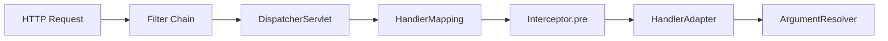

```
요청 처리 완전 순서:

1.  HTTP 요청 도착 (Tomcat 스레드 할당)
2.  Filter Chain 실행 (인코딩, CORS, 추적 ID)
3.  DispatcherServlet.doDispatch() 시작
4.  checkMultipart() — 파일 업로드 처리
5.  HandlerMapping.getHandler() — URL → HandlerExecutionChain (핸들러 + 인터셉터 목록)
6.  HandlerAdapter.getHandlerAdapter() — 처리 가능한 어댑터 선택
7.  Interceptor.preHandle() — 순서대로 실행, false 반환 시 중단
8.  HandlerAdapter.handle()
    ↳ ArgumentResolver 체인 — 각 파라미터를 처리할 리졸버 선택 및 실행
    ↳ @PathVariable, @RequestParam, @RequestBody(@Valid 포함) 등
    ↳ 컨트롤러 메서드 리플렉션 호출
    ↳ ReturnValueHandler — 반환값 처리 (@ResponseBody면 MessageConverter)
9.  Interceptor.postHandle() — 역순 실행 (컨트롤러 실행 후, 뷰 렌더링 전)
10. processDispatchResult() — 뷰 렌더링 또는 예외 처리
11. Interceptor.afterCompletion() — 역순 실행, 예외 발생해도 항상 실행
12. Filter Chain 복귀 (응답 후처리)
13. Tomcat 스레드 반환
```

---

## 핵심 컴포넌트 요약표

| 컴포넌트 | 동작 시점 | 핵심 역할 | 주의사항 |
|---|---|---|---|
| `DispatcherServlet` | 모든 요청 | 중앙 라우터 | 단일 인스턴스, 멀티스레드 |
| `RequestMappingHandlerMapping` | 시작 시 초기화 | URL → 핸들러 캐시 | 런타임 변경 불가 |
| `RequestMappingHandlerAdapter` | 매 요청 | 핸들러 실행 조율 | ArgumentResolver 캐시 활용 |
| `ArgumentResolver` | 매 요청 | 파라미터 바인딩 | supportsParameter 캐시 |
| `HttpMessageConverter` | 매 요청 | 직렬화/역직렬화 | Content-Type 협상 |
| `HandlerInterceptor` | 매 요청 | 전처리/후처리 | `instanceof HandlerMethod` 체크 |
| `Filter` | 매 요청 | 서블릿 레벨 처리 | 예외 → `@ExceptionHandler` 미작동 |
| `@ExceptionHandler` | 예외 발생 시 | 전역 예외 처리 | 필터 예외는 처리 불가 |
| `ViewResolver` | `@ResponseBody` 없을 때 | 뷰 이름 → View 객체 | REST API에서는 미사용 |

---

## 면접 포인트

### Q. DispatcherServlet이 단일 인스턴스인데 멀티스레드에 안전한 이유는?

`DispatcherServlet`은 상태(인스턴스 변수에 요청별 데이터)를 갖지 않는다. `HandlerMapping`, `HandlerAdapter` 등 내부 컴포넌트는 초기화 시 한 번만 설정되고 이후 읽기 전용으로 동작한다. 각 요청은 `HttpServletRequest`/`HttpServletResponse` 객체를 인자로 받아 처리하고, 요청별 상태는 이 객체에 담긴다. 마치 은행 창구 직원(DispatcherServlet) 한 명이 번갈아 손님을 응대할 때, 각 손님의 서류(Request/Response)가 별도로 존재하는 것과 같다. `HandlerMapping`의 URL→Handler 캐시는 `ConcurrentHashMap`으로 스레드 안전하게 관리된다.

### Q. @RequestBody가 JSON을 Java 객체로 변환하는 내부 과정은?

`RequestMappingHandlerAdapter`가 `@RequestBody` 파라미터를 발견하면 `HttpMessageConverter` 목록을 순회한다. 요청의 `Content-Type: application/json`과 파라미터 타입을 보고 `MappingJackson2HttpMessageConverter`가 선택된다. `ObjectMapper.readValue(inputStream, targetType)`으로 JSON을 역직렬화한다. `@Valid`가 함께 있으면 변환 후 `Validator`가 제약 조건을 검사한다. 역방향(`@ResponseBody`)은 반환 객체를 `ObjectMapper.writeValue()`로 직렬화해 응답 스트림에 쓴다. `Content-Type` 협상 실패 시 `HttpMediaTypeNotSupportedException`(415)이 발생한다.

### Q. @ExceptionHandler가 Filter에서 발생한 예외를 처리하지 못하는 이유는?

`@ExceptionHandler`(또는 `@ControllerAdvice`)는 `DispatcherServlet` 내부에서 발생한 예외를 처리한다. Filter는 `DispatcherServlet` 앞단의 서블릿 컨테이너 레벨에서 실행된다. Filter에서 예외가 발생하면 `DispatcherServlet`이 실행되기 전이므로 `@ExceptionHandler`가 개입할 수 없다. 해결책은 두 가지다. 첫째, Filter 내부에서 직접 `response.setStatus()`와 `response.getWriter().write()`로 에러 응답을 작성한다. 둘째, 에러 처리용 `ForwardingFilter`를 앞에 두고 예외를 잡아 `/error` 경로로 포워딩한 뒤 Spring의 `BasicErrorController`가 처리하도록 한다.

### Q. ArgumentResolver 캐싱이 성능에 미치는 영향은?

`RequestMappingHandlerAdapter`는 `HandlerMethod`별로 `InvocableHandlerMethod`를 캐싱한다. 각 파라미터에 어떤 `HandlerMethodArgumentResolver`가 처리할지를 `supportsParameter()` 호출 결과로 미리 결정해 캐싱한다. 첫 번째 요청에서만 모든 Resolver를 순회하고, 이후 요청은 캐시를 바로 사용한다. `HandlerMethodArgumentResolver` 구현 시 `supportsParameter()`를 빠르게 만들어야 한다(`instanceof` 체크 → 어노테이션 presence 체크 순). Resolver가 많을수록 첫 요청의 오버헤드가 커지므로, 커스텀 Resolver는 항상 `@Order`나 등록 순서를 고려해야 한다.

### Q. Content Negotiation이 동작하는 순서는?

클라이언트가 `Accept: application/xml, application/json;q=0.9`를 보내면, `ContentNegotiationManager`가 우선순위 순으로 처리 가능한 `HttpMessageConverter`를 찾는다. 첫째로 Accept 헤더를 기준으로 `application/xml`을 처리할 수 있는 Converter(Jackson XML, JAXB)를 탐색한다. 없으면 `q=0.9`인 `application/json`으로 넘어간다. URL 확장자(`.xml`, `.json`)나 요청 파라미터(`?format=json`) 기반 협상도 설정 가능하다. 단, URL 확장자 협상은 Spring 5.3+에서 보안 이슈로 기본 비활성화됐다. 협상 결과가 없으면 `HttpMediaTypeNotAcceptableException`(406)이 발생한다.
