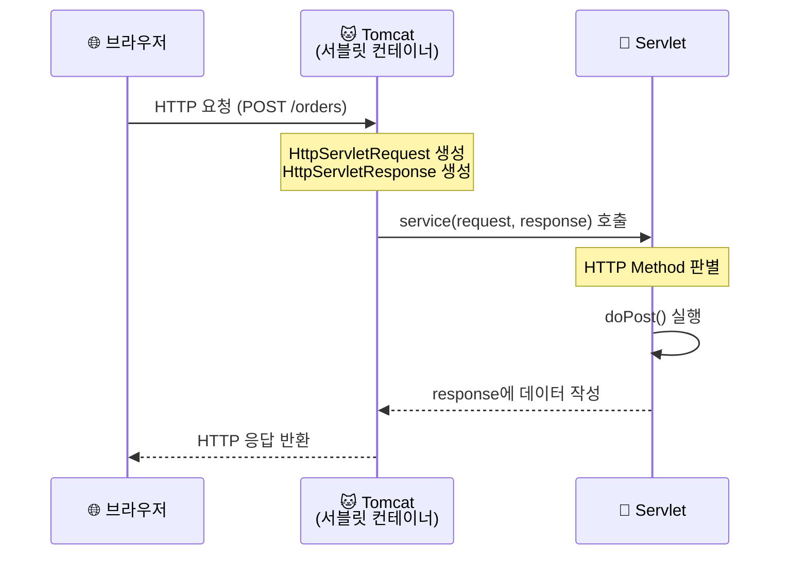
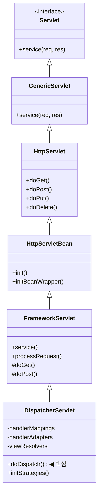
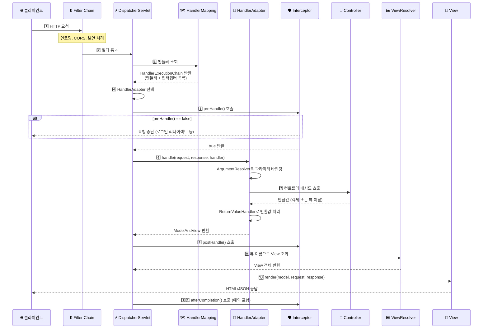
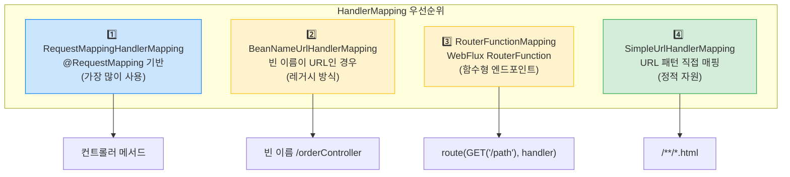
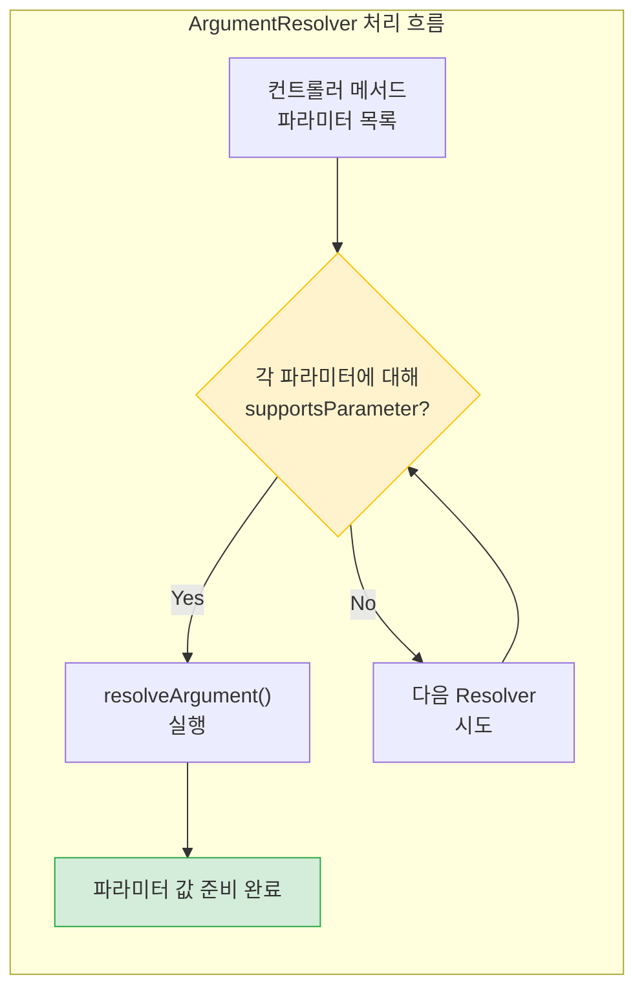
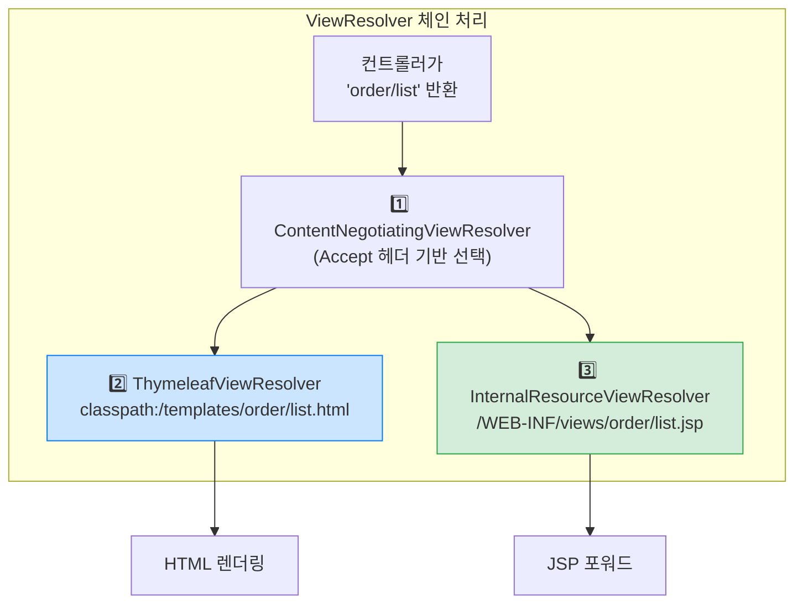
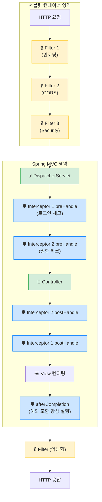
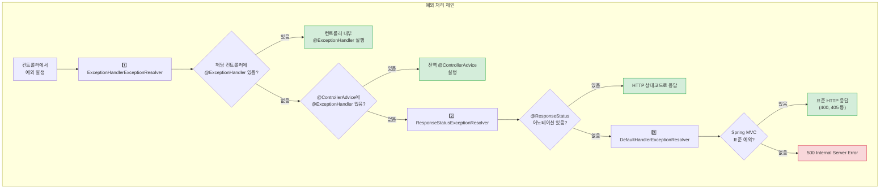
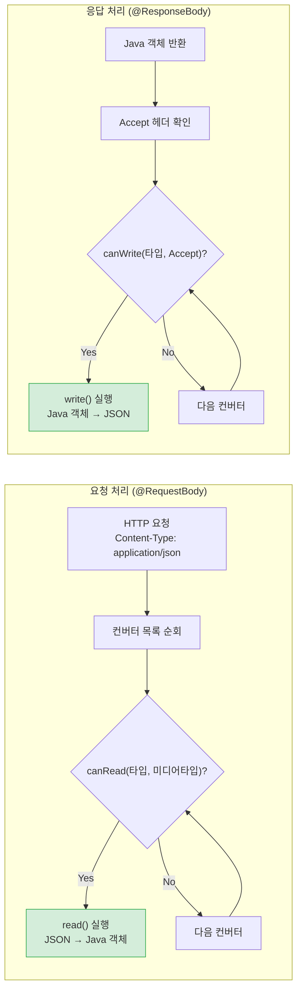

> **한 줄 요약:** Spring MVC는 DispatcherServlet이 중앙에서 모든 HTTP 요청을 받아 HandlerMapping → HandlerAdapter → Controller → ViewResolver 순서로 처리하는 프론트 컨트롤러 패턴이다.

## 1. 비유로 이해하기 — 5성급 호텔의 컨시어지

당신이 5성급 호텔에 체크인했습니다. 레스토랑 예약, 룸서비스, 공항 픽업, 관광 안내... 모든 요청은 **컨시어지 데스크 한 곳**에서 처리됩니다. 컨시어지는 "어떤 요청인지" 파악하고, "담당 직원"을 찾고, "어떻게 응대할지" 조율합니다. 요청을 처리한 후 결과를 어떤 형식으로 전달할지도 결정합니다.

이것이 Spring MVC의 **프론트 컨트롤러 패턴**입니다. 컨시어지는 `DispatcherServlet`, 담당 직원 찾기는 `HandlerMapping`, 응대 방식은 `HandlerAdapter`, 결과 전달 형식은 `ViewResolver`에 해당합니다.

Spring MVC 이전 시대에는 URL마다 별도의 서블릿을 등록해야 했습니다. `/orders`는 `OrderServlet`, `/members`는 `MemberServlet`... 공통 인증 로직을 모든 서블릿에 복붙해야 했고, URL 변경 시 서블릿 설정 파일도 함께 바꿔야 했습니다. Spring MVC는 이 문제를 단 하나의 진입점으로 해결했습니다.

---

## 2. 서블릿(Servlet) 기초

### 2.1 HTTP 요청 처리 방식

서블릿은 Java 웹 애플리케이션의 가장 기본적인 처리 단위입니다. HTTP 요청이 오면 서블릿 컨테이너(Tomcat)가 `HttpServletRequest`/`HttpServletResponse` 객체를 생성하고 서블릿의 `service()` 메서드를 호출합니다.



### 2.2 서블릿 직접 구현 (Spring 이전)

```java
// URL마다 서블릿을 따로 만들어야 하는 구시대 방식
@WebServlet(name = "orderServlet", urlPatterns = "/orders")
public class OrderServlet extends HttpServlet {

    private OrderService orderService = new OrderService(); // 직접 생성 — DI 없음

    @Override
    protected void doPost(HttpServletRequest request, HttpServletResponse response)
            throws ServletException, IOException {

        // 파라미터 직접 파싱
        String itemId = request.getParameter("itemId");
        int quantity = Integer.parseInt(request.getParameter("quantity"));

        // 공통 인증 로직 — 매 서블릿마다 복붙
        HttpSession session = request.getSession(false);
        if (session == null || session.getAttribute("loginMember") == null) {
            response.sendRedirect("/login");
            return;
        }

        // 비즈니스 로직 처리
        Long orderId = orderService.createOrder(Long.parseLong(itemId), quantity);

        // JSON 직접 조립 — ObjectMapper도 없음
        response.setContentType("application/json;charset=UTF-8");
        response.getWriter().write("{\"orderId\":" + orderId + "}");
    }
}
```

> **왜 이게 문제인가?** URL이 100개면 서블릿도 100개입니다. 인증 로직이 바뀌면 100개를 수정해야 합니다. 파라미터 파싱, JSON 변환도 전부 수동입니다. Spring MVC는 이 모든 반복 작업을 없앴습니다.

---

## 3. DispatcherServlet — Spring MVC의 심장

### 3.1 DispatcherServlet 계층 구조



`DispatcherServlet`은 모든 요청을 `doDispatch()` 메서드 하나에서 처리합니다. 초기화 시 `initStrategies()`를 통해 HandlerMapping, HandlerAdapter, ViewResolver 등의 컴포넌트를 ApplicationContext에서 조회하여 등록합니다.

### 3.2 DispatcherServlet 내부 초기화

```java
// DispatcherServlet.initStrategies() — ApplicationContext 준비 후 한 번 실행
protected void initStrategies(ApplicationContext context) {
    initMultipartResolver(context);          // 1️⃣ 파일 업로드 처리
    initLocaleResolver(context);             // 2️⃣ 다국어/지역화
    initThemeResolver(context);              // 3️⃣ 테마 (레거시)
    initHandlerMappings(context);            // 4️⃣ URL → 핸들러 매핑 목록
    initHandlerAdapters(context);            // 5️⃣ 핸들러 실행 어댑터 목록
    initHandlerExceptionResolvers(context);  // 6️⃣ 예외 처리 리졸버
    initRequestToViewNameTranslator(context);// 7️⃣ 뷰 이름 변환
    initViewResolvers(context);              // 8️⃣ 뷰 이름 → View 객체
    initFlashMapManager(context);            // 9️⃣ Redirect 데이터 관리
}
```

---

## 4. Spring MVC 요청 처리 전체 흐름

### 4.1 완전한 요청 처리 시퀀스



### 4.2 doDispatch() 핵심 로직

```java
// DispatcherServlet.doDispatch() 핵심 흐름 (간략화)
protected void doDispatch(HttpServletRequest request, HttpServletResponse response) {
    HandlerExecutionChain mappedHandler = null;

    try {
        // 1. 핸들러 조회
        mappedHandler = getHandler(request);
        if (mappedHandler == null) {
            noHandlerFound(request, response); // 404
            return;
        }

        // 2. 어댑터 조회
        HandlerAdapter ha = getHandlerAdapter(mappedHandler.getHandler());

        // 3. 인터셉터 preHandle
        if (!mappedHandler.applyPreHandle(request, response)) {
            return; // false면 중단
        }

        // 4. 핸들러 실행 (컨트롤러 메서드 호출)
        ModelAndView mv = ha.handle(request, response, mappedHandler.getHandler());

        // 5. 인터셉터 postHandle
        mappedHandler.applyPostHandle(request, response, mv);

        // 6. 뷰 렌더링
        processDispatchResult(request, response, mappedHandler, mv, null);

    } catch (Exception ex) {
        // afterCompletion 보장 (예외 시에도 실행)
        triggerAfterCompletion(request, response, mappedHandler, ex);
    }
}
```

---

## 5. HandlerMapping — URL을 핸들러로 연결

### 5.1 HandlerMapping 종류와 우선순위



### 5.2 @RequestMapping 상세 매핑 전략

```java
@Controller
@RequestMapping("/orders")  // 클래스 레벨 공통 경로
public class OrderController {

    // GET /orders?page=0&size=10
    @GetMapping
    public String list(
            @RequestParam(defaultValue = "0") int page,
            @RequestParam(defaultValue = "10") int size,
            Model model) {
        model.addAttribute("orders", orderService.findAll(page, size));
        return "order/list"; // 뷰 이름 반환
    }

    // GET /orders/123
    @GetMapping("/{id}")
    public String detail(@PathVariable Long id, Model model) {
        model.addAttribute("order", orderService.findById(id));
        return "order/detail";
    }

    // POST /orders (JSON API)
    @PostMapping
    @ResponseBody
    public ResponseEntity<OrderResponse> create(
            @RequestBody @Valid OrderCreateRequest request) {
        Long orderId = orderService.createOrder(request);
        URI location = URI.create("/orders/" + orderId);
        return ResponseEntity.created(location)
                .body(new OrderResponse(orderId));
    }

    // PATCH /orders/123 — 부분 업데이트
    @PatchMapping("/{id}/status")
    @ResponseStatus(HttpStatus.NO_CONTENT) // 204 반환
    public void updateStatus(
            @PathVariable Long id,
            @RequestBody @Valid StatusUpdateRequest request) {
        orderService.updateStatus(id, request.getStatus());
    }

    // DELETE /orders/123
    @DeleteMapping("/{id}")
    @ResponseStatus(HttpStatus.NO_CONTENT)
    public void cancel(@PathVariable Long id) {
        orderService.cancel(id);
    }
}
```

### 5.3 고급 매핑 조건

```java
// Content-Type 조건
@PostMapping(value = "/upload",
             consumes = "multipart/form-data",
             produces = "application/json")
public ResponseEntity<FileResponse> upload(@RequestParam MultipartFile file) { ... }

// 헤더 조건
@GetMapping(value = "/data", headers = "X-API-Version=2")
public DataResponse getDataV2() { ... }

// 파라미터 조건
@GetMapping(value = "/search", params = "type=admin")
public List<Member> getAdmins() { ... }
```

---

## 6. HandlerAdapter — 핸들러 실행 추상화

### 6.1 HandlerAdapter 종류

| 어댑터 | 처리 대상 | 현재 사용 |
|--------|----------|---------|
| `RequestMappingHandlerAdapter` | `@RequestMapping` 메서드 | 주력 |
| `HttpRequestHandlerAdapter` | `HttpRequestHandler` 구현체 | 정적 자원 |
| `SimpleControllerHandlerAdapter` | `Controller` 인터페이스 구현체 | 레거시 |

### 6.2 ArgumentResolver — 메서드 파라미터 자동 바인딩



```java
// Spring이 자동으로 처리하는 30+ 종류의 파라미터들
@PostMapping("/orders")
public ResponseEntity<OrderResponse> createOrder(
    HttpServletRequest request,           // 서블릿 원본 요청
    HttpSession session,                  // HTTP 세션
    @RequestParam Long itemId,            // ?itemId=123
    @RequestParam(required = false,
                  defaultValue = "1") int quantity,  // 선택적 파라미터
    @PathVariable Long memberId,          // /members/{memberId}/orders
    @RequestHeader("Authorization")
                  String authToken,       // 헤더
    @CookieValue(required = false)
                  String refreshToken,    // 쿠키
    @RequestBody @Valid OrderRequest body,// JSON 바디 → 객체
    @ModelAttribute OrderForm form,       // 폼 데이터 → 객체
    @RequestAttribute("traceId")
                  String traceId,         // 이전 필터/인터셉터가 설정한 값
    @AuthenticationPrincipal UserDetails user, // Spring Security 인증 정보
    Locale locale,                        // Accept-Language 헤더
    BindingResult errors                  // @Valid 검증 결과
) { ... }
```

### 6.3 커스텀 ArgumentResolver 구현

실무에서 JWT 토큰에서 현재 사용자를 자동으로 주입받고 싶을 때:

```java
// 1. 커스텀 어노테이션 정의
@Target(ElementType.PARAMETER)
@Retention(RetentionPolicy.RUNTIME)
@Documented
public @interface CurrentUser {}

// 2. ArgumentResolver 구현
@Component
@RequiredArgsConstructor
public class CurrentUserArgumentResolver implements HandlerMethodArgumentResolver {

    private final JwtTokenProvider jwtTokenProvider;
    private final MemberRepository memberRepository;

    @Override
    public boolean supportsParameter(MethodParameter parameter) {
        // @CurrentUser 어노테이션이 붙고, 타입이 Member인 파라미터만 처리
        return parameter.hasParameterAnnotation(CurrentUser.class)
            && Member.class.isAssignableFrom(parameter.getParameterType());
    }

    @Override
    public Object resolveArgument(MethodParameter parameter,
                                   ModelAndViewContainer mavContainer,
                                   NativeWebRequest webRequest,
                                   WebDataBinderFactory binderFactory) {
        HttpServletRequest request = webRequest.getNativeRequest(HttpServletRequest.class);
        String token = extractToken(request);

        if (token == null || !jwtTokenProvider.validateToken(token)) {
            throw new UnauthorizedException("로그인이 필요합니다");
        }

        Long userId = jwtTokenProvider.getUserId(token);
        return memberRepository.findById(userId)
            .orElseThrow(() -> new EntityNotFoundException("사용자를 찾을 수 없습니다"));
    }

    private String extractToken(HttpServletRequest request) {
        String header = request.getHeader("Authorization");
        if (header != null && header.startsWith("Bearer ")) {
            return header.substring(7);
        }
        return null;
    }
}

// 3. WebMvcConfigurer에 등록
@Configuration
@RequiredArgsConstructor
public class WebConfig implements WebMvcConfigurer {

    private final CurrentUserArgumentResolver currentUserArgumentResolver;

    @Override
    public void addArgumentResolvers(List<HandlerMethodArgumentResolver> resolvers) {
        resolvers.add(currentUserArgumentResolver);
    }
}

// 4. 컨트롤러에서 사용 — 깔끔하게 현재 사용자 주입
@GetMapping("/my/orders")
public List<OrderResponse> getMyOrders(@CurrentUser Member member) {
    return orderService.findByMember(member.getId());
}

@PostMapping("/orders")
public ResponseEntity<OrderResponse> createOrder(
        @CurrentUser Member member,
        @RequestBody @Valid OrderCreateRequest request) {
    Long orderId = orderService.createOrder(member.getId(), request);
    return ResponseEntity.created(URI.create("/orders/" + orderId))
            .body(new OrderResponse(orderId));
}
```

> **면접 포인트**
>
> **Q:** `@AuthenticationPrincipal`과 커스텀 ArgumentResolver의 차이는 무엇인가요?
>
> **A:** `@AuthenticationPrincipal`은 Spring Security의 `SecurityContext`에서 인증 객체를 꺼내는 내장 기능입니다. Spring Security를 사용한다면 이를 활용하면 됩니다. 커스텀 ArgumentResolver는 Spring Security 없이도 동작하며, JWT 파싱, DB 조회, 복잡한 조건 처리 등 더 세밀한 제어가 필요할 때 사용합니다.

---

## 7. ViewResolver — 뷰 이름을 실제 View로

### 7.1 ViewResolver 체인



```java
// Spring Boot — Thymeleaf 자동 설정 (application.yml)
// spring.thymeleaf.prefix=classpath:/templates/
// spring.thymeleaf.suffix=.html
// spring.thymeleaf.cache=false (개발 시)

// REST API 전용 — ViewResolver 불필요 (@RestController)
@RestController  // = @Controller + @ResponseBody
@RequestMapping("/api/orders")
public class OrderApiController {

    @GetMapping("/{id}")
    public OrderResponse getOrder(@PathVariable Long id) {
        // ViewResolver를 거치지 않고 HttpMessageConverter로 직접 JSON 변환
        return orderService.findById(id);
    }
}
```

### 7.2 실무에서 자주 하는 실수 — redirect와 forward

```java
// redirect: 브라우저에게 새 URL로 이동하라고 알림 (302)
// 주로 POST 후 중복 제출 방지 (PRG 패턴)
@PostMapping("/orders")
public String createOrder(OrderCreateRequest request) {
    Long orderId = orderService.create(request);
    return "redirect:/orders/" + orderId; // redirect: 접두사
}

// forward: 서버 내부에서 다른 URL로 이동 (브라우저 URL 변경 없음)
// 주로 에러 페이지 내부 포워드
@GetMapping("/error")
public String error() {
    return "forward:/error-page/500"; // forward: 접두사
}

// 실수: POST 후 뷰 이름을 직접 반환하면 새로고침 시 중복 제출!
@PostMapping("/orders")
public String createOrderBad(OrderCreateRequest request) {
    orderService.create(request);
    return "order/success"; // ← 위험! 새로고침하면 주문이 다시 들어감
}
```

---

## 8. 필터(Filter) vs 인터셉터(Interceptor)

### 8.1 실행 위치 구조



### 8.2 필터 구현 — 서블릿 계층 처리

```java
@Component
@Slf4j
public class RequestLoggingFilter implements Filter {

    @Override
    public void doFilter(ServletRequest request, ServletResponse response,
                         FilterChain chain) throws IOException, ServletException {
        HttpServletRequest httpRequest = (HttpServletRequest) request;
        String requestURI = httpRequest.getRequestURI();
        String traceId = UUID.randomUUID().toString().substring(0, 8);

        // 요청 전 처리
        long startTime = System.currentTimeMillis();
        log.info("[{}] >>> {} {}", traceId, httpRequest.getMethod(), requestURI);

        // 다음 필터 또는 서블릿에 traceId 전달
        httpRequest.setAttribute("traceId", traceId);

        try {
            chain.doFilter(request, response); // 체인 계속 진행
        } finally {
            // 응답 후 처리 — 예외 발생해도 항상 실행
            long elapsed = System.currentTimeMillis() - startTime;
            int status = ((HttpServletResponse) response).getStatus();
            log.info("[{}] <<< {} {} {}ms", traceId, status, requestURI, elapsed);
        }
    }
}

// 특정 URL 패턴에만 적용하려면 FilterRegistrationBean 사용
@Bean
public FilterRegistrationBean<RequestLoggingFilter> loggingFilter() {
    FilterRegistrationBean<RequestLoggingFilter> bean = new FilterRegistrationBean<>();
    bean.setFilter(new RequestLoggingFilter());
    bean.setOrder(1);                           // 필터 순서
    bean.addUrlPatterns("/api/*");              // API 경로만
    return bean;
}
```

### 8.3 인터셉터 구현 — Spring MVC 계층 처리

```java
@Slf4j
@Component
@RequiredArgsConstructor
public class LoginCheckInterceptor implements HandlerInterceptor {

    private final JwtTokenProvider jwtTokenProvider;

    @Override
    public boolean preHandle(HttpServletRequest request, HttpServletResponse response,
                             Object handler) throws Exception {
        // 정적 리소스는 HandlerMethod가 아님 — 스킵
        if (!(handler instanceof HandlerMethod)) {
            return true;
        }

        // @PublicApi 어노테이션이 있으면 인증 패스
        HandlerMethod handlerMethod = (HandlerMethod) handler;
        if (handlerMethod.hasMethodAnnotation(PublicApi.class)) {
            return true;
        }

        // JWT 검증
        String token = extractToken(request);
        if (token == null || !jwtTokenProvider.validateToken(token)) {
            response.setStatus(HttpServletResponse.SC_UNAUTHORIZED);
            response.setContentType("application/json;charset=UTF-8");
            response.getWriter().write("{\"error\":\"로그인이 필요합니다\"}");
            return false; // 컨트롤러 호출 중단
        }

        // 다음 처리에서 사용할 정보 저장
        Long userId = jwtTokenProvider.getUserId(token);
        request.setAttribute("currentUserId", userId);
        return true;
    }

    @Override
    public void afterCompletion(HttpServletRequest request, HttpServletResponse response,
                                Object handler, Exception ex) {
        if (ex != null) {
            log.error("요청 처리 중 예외 발생: {}", ex.getMessage(), ex);
        }
        // MDC 정리, ThreadLocal 정리 등 리소스 해제 작업
        MDC.clear();
    }

    private String extractToken(HttpServletRequest request) {
        String header = request.getHeader("Authorization");
        return (header != null && header.startsWith("Bearer "))
               ? header.substring(7) : null;
    }
}

// 인터셉터 등록 — URL 패턴으로 세밀하게 제어
@Configuration
@RequiredArgsConstructor
public class WebConfig implements WebMvcConfigurer {

    private final LoginCheckInterceptor loginCheckInterceptor;

    @Override
    public void addInterceptors(InterceptorRegistry registry) {
        registry.addInterceptor(loginCheckInterceptor)
            .order(1)
            .addPathPatterns("/api/**")       // API 경로 전체
            .excludePathPatterns(             // 인증 불필요 경로 제외
                "/api/auth/login",
                "/api/auth/refresh",
                "/api/members/join",
                "/api/public/**"
            );
    }
}
```

### 8.4 필터 vs 인터셉터 비교표

| 비교 항목 | 필터 (Filter) | 인터셉터 (Interceptor) |
|----------|-------------|---------------------|
| 관리 주체 | 서블릿 컨테이너 (Tomcat) | Spring MVC |
| 적용 범위 | DispatcherServlet **이전** | DispatcherServlet **이후** |
| Spring 빈 접근 | 어려움 (DelegatingFilterProxy 필요) | 쉬움 (@Autowired 가능) |
| 예외 처리 | `@ExceptionHandler` 미적용 | `@ExceptionHandler` 적용 가능 |
| handler 정보 | 접근 불가 | `HandlerMethod`로 접근 가능 |
| 요청/응답 조작 | `HttpServletRequestWrapper` 활용 | 제한적 |
| 주요 용도 | 인코딩, CORS, XSS 방어, 요청 로깅 | 인증/인가, 권한 체크, 공통 로직 |

> **실무에서 자주 하는 실수 — 필터에서 Spring 빈을 직접 주입받으려 할 때**
>
> 일반 `@Component` 필터도 Spring Boot에서는 자동 빈 등록되므로 `@Autowired`가 동작합니다. 하지만 `FilterRegistrationBean`으로 `new Filter()`를 넘기면 Spring이 관리하지 않아 빈 주입이 안 됩니다. 이 경우 `@Component`로 등록된 필터를 `FilterRegistrationBean`에 `@Autowired`로 주입해서 사용해야 합니다.

---

## 9. 예외 처리 — @ExceptionHandler와 @ControllerAdvice

### 9.1 예외 처리 우선순위 흐름



### 9.2 전역 예외 처리 — @RestControllerAdvice

```java
@RestControllerAdvice  // = @ControllerAdvice + @ResponseBody
@Slf4j
public class GlobalExceptionHandler {

    // 1. 비즈니스 예외 (직접 정의한 도메인 예외)
    @ExceptionHandler(BusinessException.class)
    public ResponseEntity<ErrorResponse> handleBusinessException(BusinessException e) {
        log.warn("BusinessException: code={}, message={}",
                 e.getErrorCode(), e.getMessage());
        return ResponseEntity
            .status(e.getErrorCode().getHttpStatus())
            .body(ErrorResponse.of(e.getErrorCode(), e.getMessage()));
    }

    // 2. @Valid 검증 실패 — @RequestBody
    @ExceptionHandler(MethodArgumentNotValidException.class)
    public ResponseEntity<ErrorResponse> handleValidation(
            MethodArgumentNotValidException e) {
        List<ErrorResponse.FieldError> fieldErrors = e.getBindingResult()
            .getFieldErrors()
            .stream()
            .map(fe -> new ErrorResponse.FieldError(
                fe.getField(),
                fe.getRejectedValue(),
                fe.getDefaultMessage()))
            .collect(Collectors.toList());

        return ResponseEntity.badRequest()
            .body(ErrorResponse.ofValidation(fieldErrors));
    }

    // 3. @Validated 검증 실패 — @RequestParam, @PathVariable
    @ExceptionHandler(ConstraintViolationException.class)
    public ResponseEntity<ErrorResponse> handleConstraintViolation(
            ConstraintViolationException e) {
        return ResponseEntity.badRequest()
            .body(ErrorResponse.of("CONSTRAINT_VIOLATION", e.getMessage()));
    }

    // 4. PathVariable 타입 불일치 (예: /orders/abc — id가 Long이어야 할 때)
    @ExceptionHandler(MethodArgumentTypeMismatchException.class)
    public ResponseEntity<ErrorResponse> handleTypeMismatch(
            MethodArgumentTypeMismatchException e) {
        String message = String.format("파라미터 '%s'의 값 '%s'이 잘못된 타입입니다",
                                       e.getName(), e.getValue());
        return ResponseEntity.badRequest()
            .body(ErrorResponse.of("TYPE_MISMATCH", message));
    }

    // 5. 리소스 없음
    @ExceptionHandler(EntityNotFoundException.class)
    public ResponseEntity<ErrorResponse> handleNotFound(EntityNotFoundException e) {
        return ResponseEntity.status(HttpStatus.NOT_FOUND)
            .body(ErrorResponse.of("NOT_FOUND", e.getMessage()));
    }

    // 6. 나머지 모든 예외 — 절대 내부 정보 노출 금지
    @ExceptionHandler(Exception.class)
    public ResponseEntity<ErrorResponse> handleException(Exception e,
                                                          HttpServletRequest request) {
        log.error("Unexpected error on {}: {}", request.getRequestURI(), e.getMessage(), e);
        return ResponseEntity.internalServerError()
            .body(ErrorResponse.of("INTERNAL_ERROR", "서버 오류가 발생했습니다. 잠시 후 다시 시도해주세요."));
    }
}

// 일관된 에러 응답 형식
@Getter
@Builder
public class ErrorResponse {
    private final String code;
    private final String message;
    private final List<FieldError> fieldErrors;
    private final LocalDateTime timestamp = LocalDateTime.now();

    @Getter
    @AllArgsConstructor
    public static class FieldError {
        private final String field;
        private final Object rejectedValue;
        private final String reason;
    }

    public static ErrorResponse of(String code, String message) {
        return ErrorResponse.builder().code(code).message(message).build();
    }
}
```

---

## 10. HTTP 메시지 컨버터

### 10.1 메시지 컨버터 선택 흐름



### 10.2 기본 제공 메시지 컨버터

| 컨버터 | 처리 타입 | 미디어 타입 |
|--------|---------|-----------|
| `ByteArrayHttpMessageConverter` | `byte[]` | `application/octet-stream` |
| `StringHttpMessageConverter` | `String` | `text/plain`, `*/*` |
| `ResourceHttpMessageConverter` | `Resource` | `*/*` |
| `MappingJackson2HttpMessageConverter` | 모든 객체 | `application/json` |
| `Jaxb2RootElementHttpMessageConverter` | `@XmlRootElement` | `application/xml` |

### 10.3 Jackson 설정 커스터마이징

```java
@Configuration
public class JacksonConfig {

    @Bean
    @Primary
    public ObjectMapper objectMapper() {
        return Jackson2ObjectMapperBuilder.json()
            // LocalDateTime을 타임스탬프 숫자 대신 ISO 8601 문자열로
            .featuresToDisable(SerializationFeature.WRITE_DATES_AS_TIMESTAMPS)
            // 모르는 필드가 있어도 역직렬화 실패하지 않음
            .featuresToDisable(DeserializationFeature.FAIL_ON_UNKNOWN_PROPERTIES)
            // Java 8 날짜 타입 지원
            .modules(new JavaTimeModule())
            // null 값 필드 응답에서 제외
            .serializationInclusion(JsonInclude.Include.NON_NULL)
            // 스네이크 케이스 자동 변환 (선택)
            // .propertyNamingStrategy(PropertyNamingStrategies.SNAKE_CASE)
            .build();
    }
}

// DTO에서 직렬화 제어
public class MemberResponse {
    private Long id;
    private String name;

    @JsonIgnore  // 응답에서 제외
    private String password;

    @JsonProperty("email_address")  // 필드명을 다른 이름으로
    private String email;

    @JsonFormat(pattern = "yyyy-MM-dd HH:mm:ss")  // 날짜 포맷
    private LocalDateTime createdAt;
}
```

---

## 11. 검증 (Validation)

### 11.1 Bean Validation 어노테이션

```java
@Getter
@NoArgsConstructor
public class MemberJoinRequest {

    @NotBlank(message = "이름은 필수입니다")
    @Size(min = 2, max = 50, message = "이름은 2~50자여야 합니다")
    private String name;

    @NotBlank(message = "이메일은 필수입니다")
    @Email(message = "유효한 이메일 형식이 아닙니다")
    private String email;

    @NotBlank(message = "비밀번호는 필수입니다")
    @Pattern(regexp = "^(?=.*[A-Za-z])(?=.*\\d)(?=.*[@$!%*#?&])[A-Za-z\\d@$!%*#?&]{8,}$",
             message = "비밀번호는 영문, 숫자, 특수문자를 포함한 8자 이상이어야 합니다")
    private String password;

    @Min(value = 14, message = "14세 이상만 가입할 수 있습니다")
    @Max(value = 150, message = "나이를 확인해주세요")
    private int age;

    @NotNull(message = "약관 동의는 필수입니다")
    @AssertTrue(message = "약관에 동의해야 합니다")
    private Boolean agreeToTerms;
}
```

### 11.2 검증 그룹 — 상황에 따라 다른 검증

```java
// 검증 그룹 마커 인터페이스
public interface OnCreate {}
public interface OnUpdate {}

public class OrderRequest {
    @Null(groups = OnCreate.class, message = "생성 시 ID는 없어야 합니다")
    @NotNull(groups = OnUpdate.class, message = "수정 시 ID는 필수입니다")
    private Long id;

    @NotNull(groups = OnCreate.class)
    private Long itemId;
}

@PostMapping("/orders")
public ResponseEntity<?> create(
        @RequestBody @Validated(OnCreate.class) OrderRequest request) { ... }

@PutMapping("/orders/{id}")
public ResponseEntity<?> update(
        @RequestBody @Validated(OnUpdate.class) OrderRequest request) { ... }
```

### 11.3 커스텀 Validator

```java
// 1. 어노테이션 정의
@Target({ElementType.FIELD, ElementType.PARAMETER})
@Retention(RetentionPolicy.RUNTIME)
@Constraint(validatedBy = KoreanPhoneValidator.class)
public @interface KoreanPhone {
    String message() default "올바른 한국 전화번호 형식이 아닙니다";
    Class<?>[] groups() default {};
    Class<? extends Payload>[] payload() default {};
}

// 2. Validator 구현
public class KoreanPhoneValidator implements ConstraintValidator<KoreanPhone, String> {

    // 010-1234-5678, 02-123-4567, 031-123-4567 형식 허용
    private static final Pattern PHONE_PATTERN =
        Pattern.compile("^(01[016-9]|0[2-9][0-9]{0,1})-\\d{3,4}-\\d{4}$");

    @Override
    public boolean isValid(String value, ConstraintValidatorContext context) {
        if (value == null || value.isBlank()) return true; // null 검사는 @NotNull에게
        return PHONE_PATTERN.matcher(value).matches();
    }
}

// 3. 사용
public class ContactRequest {
    @KoreanPhone
    private String phone;
}
```

---

## 12. 멀티파트 파일 업로드

```java
@RestController
@RequestMapping("/files")
@RequiredArgsConstructor
public class FileController {

    private final S3FileStorageService storageService;

    @PostMapping("/upload")
    public ResponseEntity<FileUploadResponse> upload(
            @RequestParam("file") MultipartFile file,
            @RequestParam(required = false) String description) {

        // 파일 유효성 검사
        if (file.isEmpty()) {
            throw new BusinessException(ErrorCode.FILE_EMPTY);
        }

        String contentType = file.getContentType();
        if (contentType == null || !contentType.startsWith("image/")) {
            throw new BusinessException(ErrorCode.FILE_TYPE_NOT_ALLOWED);
        }

        long maxSize = 10 * 1024 * 1024; // 10MB
        if (file.getSize() > maxSize) {
            throw new BusinessException(ErrorCode.FILE_TOO_LARGE);
        }

        // 저장 (S3, 로컬 스토리지 등)
        String fileUrl = storageService.upload(file);

        return ResponseEntity.ok(new FileUploadResponse(fileUrl, file.getOriginalFilename()));
    }

    // 여러 파일 동시 업로드
    @PostMapping("/upload/multiple")
    public ResponseEntity<List<String>> uploadMultiple(
            @RequestParam("files") List<MultipartFile> files) {
        List<String> urls = files.stream()
            .map(storageService::upload)
            .collect(Collectors.toList());
        return ResponseEntity.ok(urls);
    }
}
```

```yaml
# application.yml
spring:
  servlet:
    multipart:
      enabled: true
      max-file-size: 10MB      # 단일 파일 최대 크기
      max-request-size: 30MB   # 요청 전체 최대 크기
      file-size-threshold: 2KB # 이 크기 이상이면 디스크에 임시 저장
```

---

## 13. 극한 시나리오 — 공통 API 응답 래퍼

모든 API가 다음 형식으로 응답해야 하는 요구사항:

```json
{
  "success": true,
  "data": { "orderId": 123 },
  "timestamp": "2026-05-02T10:00:00",
  "traceId": "abc123"
}
```

컨트롤러마다 래핑 코드를 넣으면 중복이 생깁니다. `HandlerMethodReturnValueHandler`로 전역 처리:

```java
// 1. 마커 어노테이션
@Target({ElementType.TYPE, ElementType.METHOD})
@Retention(RetentionPolicy.RUNTIME)
public @interface WrapResponse {}

// 2. 공통 응답 포맷
@Getter
@Builder
public class ApiResult<T> {
    private final boolean success;
    private final T data;
    private final String traceId;
    @JsonFormat(pattern = "yyyy-MM-dd'T'HH:mm:ss")
    private final LocalDateTime timestamp;

    public static <T> ApiResult<T> ok(T data, String traceId) {
        return ApiResult.<T>builder()
            .success(true).data(data).traceId(traceId)
            .timestamp(LocalDateTime.now()).build();
    }
}

// 3. ReturnValueHandler 구현
@Component
@RequiredArgsConstructor
public class ApiResultReturnValueHandler implements HandlerMethodReturnValueHandler {

    private final ObjectMapper objectMapper;

    @Override
    public boolean supportsReturnType(MethodParameter returnType) {
        // 클래스 또는 메서드에 @WrapResponse가 있으면 처리
        return returnType.hasMethodAnnotation(WrapResponse.class)
            || AnnotationUtils.findAnnotation(returnType.getDeclaringClass(),
                                              WrapResponse.class) != null;
    }

    @Override
    public void handleReturnValue(Object returnValue, MethodParameter returnType,
                                   ModelAndViewContainer mavContainer,
                                   NativeWebRequest webRequest) throws Exception {
        mavContainer.setRequestHandled(true); // DispatcherServlet에 직접 응답 처리했음을 알림

        HttpServletRequest request = webRequest.getNativeRequest(HttpServletRequest.class);
        HttpServletResponse response = webRequest.getNativeResponse(HttpServletResponse.class);

        String traceId = (String) request.getAttribute("traceId");
        ApiResult<Object> result = ApiResult.ok(returnValue, traceId);

        response.setStatus(HttpServletResponse.SC_OK);
        response.setContentType("application/json;charset=UTF-8");
        response.getWriter().write(objectMapper.writeValueAsString(result));
    }
}

// 4. WebConfig에 등록 (기존 핸들러보다 앞에 추가해야 함)
@Configuration
@RequiredArgsConstructor
public class WebConfig implements WebMvcConfigurer {

    private final ApiResultReturnValueHandler apiResultHandler;

    @Override
    public void addReturnValueHandlers(List<HandlerMethodReturnValueHandler> handlers) {
        handlers.add(0, apiResultHandler); // 맨 앞에 추가
    }
}

// 5. 컨트롤러에서 사용 — 클린하게 비즈니스 로직만
@RestController
@RequestMapping("/api/v2/orders")
@WrapResponse  // 클래스 전체에 적용
public class OrderApiV2Controller {

    @GetMapping("/{id}")
    public OrderResponse getOrder(@PathVariable Long id) {
        return orderService.findById(id); // 래핑은 자동으로
    }

    @PostMapping
    public OrderResponse createOrder(@RequestBody @Valid OrderCreateRequest request) {
        return orderService.create(request);
    }
}
```

---

## 14. 전체 요청 흐름 최종 정리

```mermaid
flowchart LR
    subgraph "서블릿 계층"
        A["🌐 HTTP 요청\nPOST /api/orders"] --> B["🔒 Filter Chain\n(인코딩·CORS·보안)"]
    end

    subgraph "Spring MVC 핵심"
        B --> C["⚡ DispatcherServlet\ndoDispatch()"]
        C --> D["🗺️ HandlerMapping\n@RequestMapping 매핑"]
        D --> E["📋 HandlerExecutionChain\n핸들러 + 인터셉터 목록"]
        E --> F["🛡️ Interceptor\npreHandle()"]
        F --> G["🔧 HandlerAdapter\n파라미터 바인딩"]
        G --> H["📥 ArgumentResolver\n@RequestBody → 객체"]
        H --> I["🎯 Controller\ncreateOrder()"]
        I --> J["📤 ReturnValueHandler\n객체 → JSON"]
    end

    subgraph "후처리"
        J --> K["🛡️ Interceptor\npostHandle()"]
        K --> L["🛡️ Interceptor\nafterCompletion()"]
        L --> M["🌐 HTTP 응답\n201 Created"]
    end

    classDef filter fill:#fff3cd,stroke:#ffc107
    classDef core fill:#cce5ff,stroke:#007bff
    classDef after fill:#d4edda,stroke:#28a745
    class B filter
    class C,D,E,F,G,H,I,J core
    class K,L,M after
```



---

## 15. 핵심 포인트 정리

| 컴포넌트 | 역할 | 핵심 구현 | 커스터마이즈 방법 |
|---------|------|---------|---------------|
| `DispatcherServlet` | 중앙 집중 요청 처리 | `doDispatch()` | - |
| `HandlerMapping` | 요청 URL → 핸들러 매핑 | `RequestMappingHandlerMapping` | `WebMvcConfigurer` |
| `HandlerAdapter` | 핸들러 실행 추상화 | `RequestMappingHandlerAdapter` | - |
| `ArgumentResolver` | 메서드 파라미터 바인딩 | 30개 이상 기본 제공 | `addArgumentResolvers()` |
| `ReturnValueHandler` | 반환값 처리 | `@ResponseBody` → Jackson | `addReturnValueHandlers()` |
| `HttpMessageConverter` | 직렬화/역직렬화 | `MappingJackson2HttpMessageConverter` | `configureMessageConverters()` |
| `ViewResolver` | 뷰 이름 → View 객체 | `ThymeleafViewResolver` | `application.yml` |
| `HandlerInterceptor` | Spring 계층 전/후처리 | `preHandle/postHandle/afterCompletion` | `addInterceptors()` |
| `Filter` | 서블릿 계층 전/후처리 | `doFilter()` | `FilterRegistrationBean` |
| `@ExceptionHandler` | 예외 전역 처리 | `@RestControllerAdvice` | - |

> **면접 포인트**
>
> **Q:** Filter와 Interceptor 중 어디서 인증/인가를 처리해야 하나요?
>
> **A:** 일반적으로 Spring Security를 사용한다면 Filter 계층에서 처리합니다. Spring Security의 SecurityFilterChain이 서블릿 필터로 동작하기 때문입니다. Spring Security 없이 자체 인증을 구현한다면 Interceptor가 더 편리합니다 — Spring 빈을 직접 사용할 수 있고, `HandlerMethod`를 통해 어노테이션 정보도 읽을 수 있기 때문입니다. 단, Interceptor는 DispatcherServlet 이후에 실행되므로 정적 리소스 요청도 일부 포함됩니다. `handler instanceof HandlerMethod` 체크로 걸러낼 수 있습니다.
