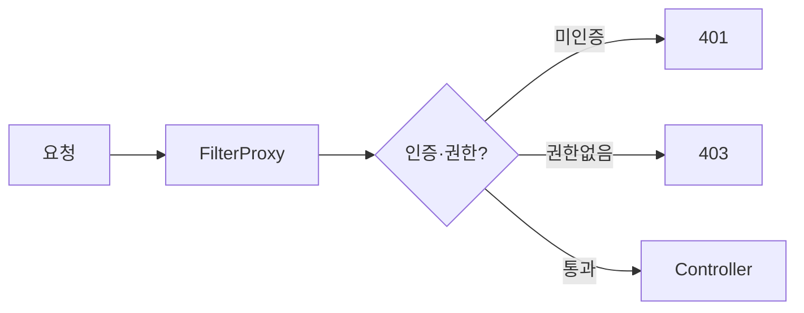
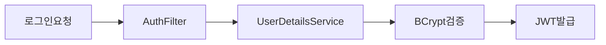
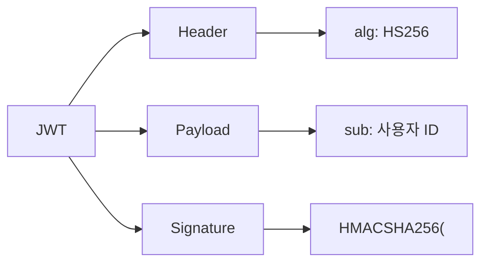
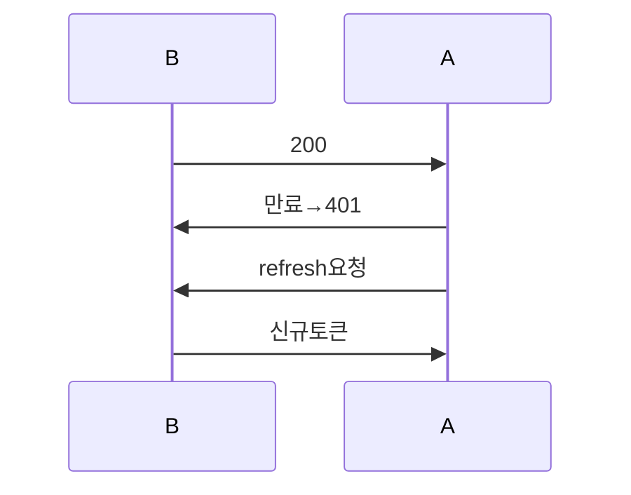
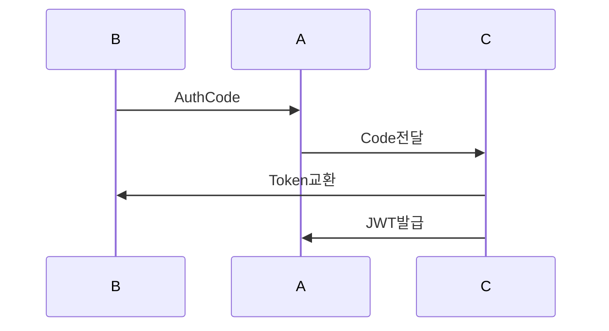
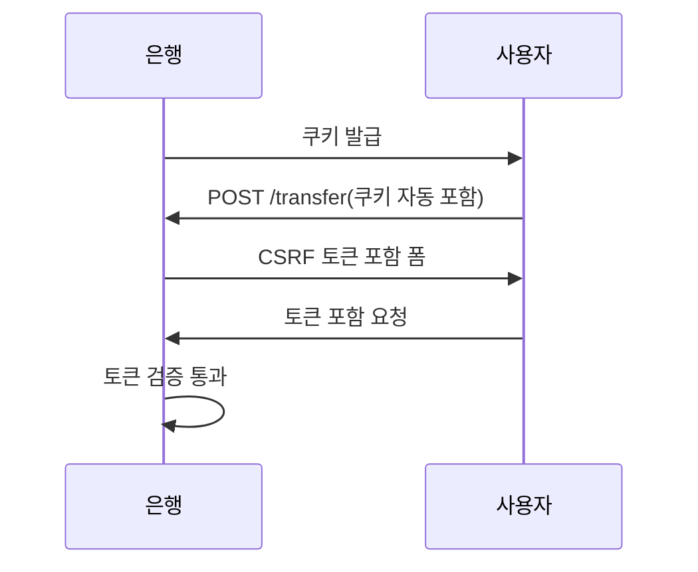
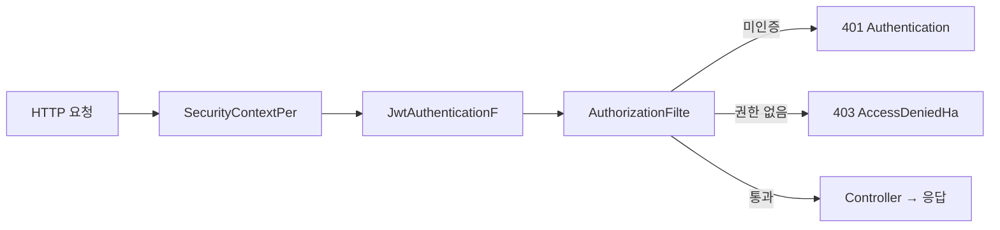

> **한 줄 요약:** Spring Security는 서블릿 필터 체인 위에 구축된 보안 프레임워크로, 인증(Authentication)과 인가(Authorization)를 필터 파이프라인을 통해 처리합니다.

## 1. 비유 — 건물 출입 보안 시스템

> **비유:** 대형 빌딩에 들어가려면 여러 단계를 거친다.
> 1. 건물 입구 경비원(FilterChainProxy)이 신분증을 요구한다
> 2. 안내 데스크(AuthenticationManager)에서 신분증 진위를 확인한다
> 3. 데이터베이스(UserDetailsService)에서 해당 인물의 등록 여부를 조회한다
> 4. 특정 층(리소스)에 가려면 추가 권한(Authorization)이 있는지 확인한다
>
> 이 전체 시스템을 자동화한 것이 Spring Security다.

Spring Security를 처음 보면 복잡해 보입니다. 하지만 핵심은 단순합니다. "모든 HTTP 요청은 컨트롤러에 닿기 전에 보안 필터 파이프라인을 통과해야 한다." 이 파이프라인에서 신원 확인(인증)과 접근 권한 확인(인가)이 이루어집니다.

---

## 2. Spring Security 전체 아키텍처 — 요청이 어디를 통과하는가

### 2.1 DelegatingFilterProxy가 필요한 이유

> **비유:** Spring Security 필터는 Spring 컨테이너에서 관리되는 빈이다. 그런데 서블릿 필터는 서블릿 컨테이너(Tomcat)가 관리한다. 서로 다른 세계다. `DelegatingFilterProxy`는 Tomcat 세계에 있지만, 실제 일은 Spring 세계의 `FilterChainProxy` 빈에게 위임한다. 두 세계 사이의 다리 역할이다.



`FilterChainProxy`가 여러 개의 `SecurityFilterChain`을 가질 수 있는 것이 중요합니다. 관리자 API(`/admin/**`)와 일반 API(`/api/**`)에 서로 다른 보안 정책을 독립적으로 적용할 수 있기 때문입니다. 하나의 설정으로 모든 경로를 처리하다가 충돌하는 문제를 피할 수 있습니다.

---

## 3. SecurityFilterChain 설정 — 무엇을 어떻게 보호하는가

### 3.1 기본 구성 (Spring Security 6.x)

```java
@Configuration
@EnableWebSecurity
public class SecurityConfig {

    @Bean
    public SecurityFilterChain securityFilterChain(HttpSecurity http) throws Exception {
        http
            // REST API는 상태가 없으므로 세션을 만들지 않음
            // 이유: 세션을 만들면 서버가 상태를 유지해야 해서 수평 확장이 어려워짐
            .sessionManagement(session -> session
                .sessionCreationPolicy(SessionCreationPolicy.STATELESS)
            )

            // CSRF 비활성화 — 왜?
            // CSRF 공격은 브라우저가 쿠키를 자동으로 보내는 것을 악용함
            // JWT를 Authorization 헤더로 보내면 브라우저가 자동으로 보내지 않으므로
            // CSRF 공격 자체가 불가능해짐
            .csrf(csrf -> csrf.disable())

            // 요청 인가 규칙 — 위에서 아래로 순서대로 평가됨
            // 순서가 중요! 먼저 매칭되는 규칙이 적용됨
            .authorizeHttpRequests(auth -> auth
                .requestMatchers("/api/public/**").permitAll()      // 누구나 접근 가능
                .requestMatchers("/api/admin/**").hasRole("ADMIN")  // ADMIN만
                .requestMatchers(HttpMethod.GET, "/api/orders").hasAnyRole("USER", "ADMIN")
                .anyRequest().authenticated()                        // 나머지는 인증 필요
            )

            // JWT 검증 필터를 UsernamePasswordAuthenticationFilter 앞에 삽입
            // 이유: JWT 검증이 먼저 되어야 사용자 정보가 SecurityContext에 들어감
            .addFilterBefore(jwtAuthenticationFilter(), UsernamePasswordAuthenticationFilter.class)

            // 예외 처리 — 인증/인가 실패 시 어떻게 응답할지
            .exceptionHandling(ex -> ex
                .authenticationEntryPoint(new HttpStatusEntryPoint(HttpStatus.UNAUTHORIZED))
                .accessDeniedHandler((request, response, e) -> {
                    response.setStatus(HttpStatus.FORBIDDEN.value());
                    response.setContentType("application/json;charset=UTF-8");
                    response.getWriter().write("{\"error\": \"접근 권한이 없습니다\"}");
                })
            );

        return http.build();
    }

    @Bean
    public PasswordEncoder passwordEncoder() {
        // BCrypt를 쓰는 이유:
        // 1. 단방향 해시 — 원본 복원 불가
        // 2. 솔트(salt) 자동 생성 — 같은 비밀번호도 다른 해시값
        // 3. cost factor — 해킹 시도 비용을 높임
        return new BCryptPasswordEncoder(12); // strength 12 = 약 300ms/해시
    }
}
```

**`authorizeHttpRequests`의 순서가 왜 중요한가?** `.anyRequest().authenticated()` 뒤에 `.requestMatchers("/api/public/**").permitAll()`을 쓰면 `anyRequest()`가 먼저 매칭되어 `/api/public/**`도 인증이 필요해집니다. 항상 구체적인 패턴을 먼저, 넓은 패턴을 나중에 써야 합니다.

---

## 4. 인증(Authentication) 흐름 — 비밀번호 로그인 내부 동작

### 4.1 폼 로그인 인증의 7단계

> **비유:** 회사 신입사원 채용 프로세스와 같다.
> 1. 지원자(사용자)가 이름과 스펙(username, password)을 제출
> 2. 인사팀 프론트(AuthenticationFilter)가 서류를 접수
> 3. 채용 담당자(AuthenticationProvider)가 서류 검토
> 4. 인사 DB(UserDetailsService)에서 기존 직원 정보 조회
> 5. 스펙 비교(BCrypt 검증)
> 6. 합격 통보 및 사원증 발급(Authentication 객체 생성)
> 7. 사원증을 금고(SecurityContext)에 보관



**AuthenticationManager가 직접 처리하지 않고 AuthenticationProvider에게 위임하는 이유:** 여러 종류의 인증 방식(폼 로그인, OAuth2, 인증서 기반 등)을 지원하기 위해서입니다. `ProviderManager`(AuthenticationManager 구현체)는 등록된 `AuthenticationProvider` 목록을 순회하면서 현재 토큰을 처리할 수 있는 Provider를 찾습니다. 새로운 인증 방식을 추가할 때 기존 코드를 수정하지 않고 새 Provider만 등록하면 됩니다.

### 4.2 UserDetailsService 구현 — DB에서 사용자 정보를 불러오는 방법

```java
@Service
@RequiredArgsConstructor
public class CustomUserDetailsService implements UserDetailsService {

    private final MemberRepository memberRepository;

    @Override
    public UserDetails loadUserByUsername(String email) throws UsernameNotFoundException {
        // username이 email인 경우 — 설계에 따라 다름
        Member member = memberRepository.findByEmail(email)
            .orElseThrow(() -> new UsernameNotFoundException("사용자를 찾을 수 없습니다: " + email));

        // Spring Security가 비밀번호 검증에 쓸 UserDetails 객체를 반환
        return new CustomUserDetails(member);
    }
}
```

`UsernameNotFoundException`을 던지는 것이 보안상 중요한 이유: 실제로는 Spring Security 내부에서 이 예외를 잡아 `BadCredentialsException`으로 변환합니다. 사용자에게는 "아이디 없음"과 "비밀번호 틀림"을 구분하지 않고 동일한 메시지를 줍니다. 구분하면 공격자가 "이 이메일은 가입되어 있다"는 정보를 얻을 수 있기 때문입니다.

### 4.3 커스텀 UserDetails — 필요한 정보를 담아두는 방법

```java
@Getter
public class CustomUserDetails implements UserDetails {

    private final Long id;           // DB 기본키 — 서비스 레이어에서 사용
    private final String email;
    private final String password;
    private final String nickname;
    private final Collection<? extends GrantedAuthority> authorities;

    public CustomUserDetails(Member member) {
        this.id = member.getId();
        this.email = member.getEmail();
        this.password = member.getPassword();
        this.nickname = member.getNickname();
        // "ROLE_" 접두사가 붙어야 hasRole("USER")가 동작함
        this.authorities = member.getRoles().stream()
            .map(role -> new SimpleGrantedAuthority("ROLE_" + role.name()))
            .collect(Collectors.toList());
    }

    @Override public String getUsername() { return email; }
    @Override public boolean isAccountNonExpired() { return true; }
    @Override public boolean isAccountNonLocked() { return true; }
    @Override public boolean isCredentialsNonExpired() { return true; }
    @Override public boolean isEnabled() { return true; }
}
```

`UserDetails`에 `id`를 저장하는 이유: `@AuthenticationPrincipal`로 주입받은 `CustomUserDetails`에서 바로 `getId()`를 호출해 DB 조회 없이 현재 사용자 ID를 알 수 있습니다. `UserDetails`에 `id`가 없으면 매 요청마다 `email`로 DB를 조회해야 합니다.

---

## 5. JWT (JSON Web Token) 인증 — 상태 없는 인증의 구현

### 5.1 JWT 구조 — 세 부분의 의미

> **비유:** JWT는 회사 사원증과 같다. 사원증에는 이름, 부서, 직급(Payload)이 적혀있고, 회사 직인(Signature)이 찍혀있다. 경비원은 직인이 진짜인지 확인하고(서명 검증), 직급을 보고 접근을 허용하거나 거부한다. 회사 DB를 매번 조회하지 않아도 된다.

```
eyJhbGciOiJIUzI1NiIsInR5cCI6IkpXVCJ9.   ← Header (알고리즘 정보)
eyJzdWIiOiIxMjM0NTY3ODkwIiwibmFtZSI6Ikp. ← Payload (사용자 정보)
SflKxwRJSMeKKF2QT4fwpMeJf36POk6yJV_adQss ← Signature (위변조 방지)
```



Signature의 역할이 핵심입니다. Payload를 아무나 base64 디코딩해서 읽을 수 있습니다(암호화가 아님). 하지만 내용을 조작하면 Signature 검증에서 실패합니다. "userId=1"을 "userId=999"로 바꾸면 서버가 즉시 감지합니다. 따라서 JWT에 민감한 정보(비밀번호 등)를 넣으면 안 됩니다.

### 5.2 JWT 토큰 서비스

```java
@Component
public class JwtTokenProvider {

    @Value("${jwt.secret}")
    private String secretKey;

    @Value("${jwt.access-token-validity-in-seconds}")
    private long accessTokenValidityInSeconds; // 보통 15분 ~ 1시간

    @Value("${jwt.refresh-token-validity-in-seconds}")
    private long refreshTokenValidityInSeconds; // 보통 7일 ~ 30일

    private SecretKey getSigningKey() {
        byte[] keyBytes = secretKey.getBytes(StandardCharsets.UTF_8);
        return Keys.hmacShaKeyFor(keyBytes);
    }

    public String createAccessToken(CustomUserDetails userDetails) {
        Date now = new Date();
        Date expiry = new Date(now.getTime() + accessTokenValidityInSeconds * 1000);

        return Jwts.builder()
            .subject(userDetails.getUsername())
            .claim("id", userDetails.getId())
            .claim("roles", userDetails.getAuthorities().stream()
                .map(GrantedAuthority::getAuthority)
                .collect(Collectors.toList()))
            .issuedAt(now)
            .expiration(expiry)
            .signWith(getSigningKey())
            .compact();
    }

    public Claims validateAndGetClaims(String token) {
        try {
            return Jwts.parser()
                .verifyWith(getSigningKey())
                .build()
                .parseSignedClaims(token)
                .getPayload();
        } catch (ExpiredJwtException e) {
            throw new TokenExpiredException("토큰이 만료되었습니다");
        } catch (JwtException e) {
            throw new InvalidTokenException("유효하지 않은 토큰입니다");
        }
    }
}
```

**액세스 토큰을 짧게 유지하는 이유:** 토큰이 탈취되었을 때 피해를 최소화하기 위해서입니다. 1시간짜리 토큰이 탈취되면 1시간 동안 공격자가 사용할 수 있습니다. 15분짜리 토큰이면 피해 시간이 줄어듭니다. 대신 사용자 경험을 위해 리프레시 토큰으로 자동 갱신합니다.

### 5.3 JWT 인증 필터

```java
@Component
@RequiredArgsConstructor
public class JwtAuthenticationFilter extends OncePerRequestFilter {
    // OncePerRequestFilter: 한 요청에서 이 필터가 정확히 한 번만 실행됨을 보장

    private final JwtTokenProvider jwtTokenProvider;
    private final CustomUserDetailsService userDetailsService;

    @Override
    protected void doFilterInternal(HttpServletRequest request,
                                    HttpServletResponse response,
                                    FilterChain filterChain)
            throws ServletException, IOException {

        String token = extractToken(request);

        if (token != null && jwtTokenProvider.isTokenValid(token)) {
            String email = jwtTokenProvider.extractEmail(token);
            UserDetails userDetails = userDetailsService.loadUserByUsername(email);

            // 인증 객체 생성 — credentials는 null (토큰 기반이므로 비밀번호 불필요)
            UsernamePasswordAuthenticationToken authentication =
                new UsernamePasswordAuthenticationToken(
                    userDetails,
                    null,
                    userDetails.getAuthorities()
                );
            authentication.setDetails(
                new WebAuthenticationDetailsSource().buildDetails(request)
            );

            // SecurityContext에 저장 — 이후 컨트롤러에서 @AuthenticationPrincipal로 꺼낼 수 있음
            SecurityContextHolder.getContext().setAuthentication(authentication);
        }

        // 토큰이 없거나 유효하지 않아도 다음 필터로 진행
        // 이후 AuthorizationFilter에서 인증 여부에 따라 403/401 처리
        filterChain.doFilter(request, response);
    }

    private String extractToken(HttpServletRequest request) {
        String bearerToken = request.getHeader("Authorization");
        if (StringUtils.hasText(bearerToken) && bearerToken.startsWith("Bearer ")) {
            return bearerToken.substring(7);
        }
        return null;
    }

    // 인증 불필요 경로는 필터 자체를 건너뜀 — 불필요한 처리 방지
    @Override
    protected boolean shouldNotFilter(HttpServletRequest request) {
        String path = request.getRequestURI();
        return path.startsWith("/api/auth/") || path.startsWith("/api/public/");
    }
}
```

**토큰이 유효하지 않아도 `filterChain.doFilter()`를 호출하는 이유:** 이 필터의 역할은 "토큰이 있으면 SecurityContext에 넣는 것"이지 "없으면 막는 것"이 아닙니다. 막는 역할은 그 다음의 `AuthorizationFilter`가 합니다. 인증이 필요 없는 공개 API(`/api/public/**`)는 토큰 없이도 통과해야 하기 때문에, 토큰 검증 실패를 여기서 막으면 안 됩니다.

### 5.4 액세스/리프레시 토큰 갱신 전략 — RTR (Refresh Token Rotation)



**RTR(Refresh Token Rotation)을 쓰는 이유:** 리프레시 토큰을 한 번 쓰면 새것으로 교체합니다. 만약 탈취된 리프레시 토큰을 공격자가 사용하면, 정상 사용자가 다음에 갱신을 시도할 때 "이미 사용된 토큰"임을 감지합니다. 리프레시 토큰이 Redis에 저장되는 이유는 서버 재시작 시에도 토큰이 유지되어야 하고, 강제 로그아웃(토큰 즉시 무효화)도 가능해야 하기 때문입니다.

---

## 6. OAuth2 소셜 로그인 — 카카오/구글 로그인의 실제 흐름

### 6.1 OAuth2 흐름 — 왜 이렇게 복잡한가

> **비유:** 공항 입국 심사와 비슷하다. 우리나라(우리 앱)에 입국하려는 외국인(사용자)이 있다. 본국(카카오)이 발행한 여권(액세스 토큰)을 확인하고, 본국에 "이 사람 진짜 국민 맞나요?"라고 문의한다. 확인이 되면 입국을 허가한다.
>
> 왜 이렇게 복잡한가? 사용자의 비밀번호를 우리 서버에서 직접 보지 않기 위해서다. 카카오 비밀번호는 카카오만 안다. 우리는 카카오가 "이 사람 인증됐어요"라는 확인서(토큰)만 받는다.



**Authorization Code를 직접 토큰으로 교환하는 이유:** 4번 단계에서 Authorization Code가 브라우저 URL에 노출됩니다. 만약 여기서 바로 액세스 토큰을 주면 토큰이 URL에 노출됩니다. 브라우저 히스토리, 서버 로그, 프록시 로그에 남을 수 있습니다. Authorization Code는 짧은 유효 시간을 가진 일회용 코드이므로, 설령 노출되더라도 즉시 무효화됩니다. 6번 단계에서 서버 간 통신으로 토큰을 교환하기 때문에 토큰이 외부에 노출되지 않습니다.

### 6.2 Spring Security OAuth2 설정

```yaml
spring:
  security:
    oauth2:
      client:
        registration:
          kakao:
            client-id: ${KAKAO_CLIENT_ID}
            client-secret: ${KAKAO_CLIENT_SECRET}
            authorization-grant-type: authorization_code
            redirect-uri: "{baseUrl}/login/oauth2/code/{registrationId}"
            scope: profile_nickname, account_email
        provider:
          kakao:
            authorization-uri: https://kauth.kakao.com/oauth/authorize
            token-uri: https://kauth.kakao.com/oauth/token
            user-info-uri: https://kapi.kakao.com/v2/user/me
            user-name-attribute: id
```

```java
@Service
@RequiredArgsConstructor
public class CustomOAuth2UserService extends DefaultOAuth2UserService {

    private final MemberRepository memberRepository;

    @Override
    public OAuth2User loadUser(OAuth2UserRequest userRequest) throws OAuth2AuthenticationException {
        OAuth2User oAuth2User = super.loadUser(userRequest);

        String registrationId = userRequest.getClientRegistration().getRegistrationId();
        // 카카오, 구글 등 플랫폼마다 응답 형식이 다름 — Factory 패턴으로 처리
        OAuth2UserInfo userInfo = OAuth2UserInfoFactory
            .getOAuth2UserInfo(registrationId, oAuth2User.getAttributes());

        // 이미 가입된 회원이면 정보 업데이트, 처음이면 신규 가입
        Member member = memberRepository.findByEmail(userInfo.getEmail())
            .map(existing -> existing.update(userInfo.getName(), userInfo.getImageUrl()))
            .orElse(Member.createOAuth2Member(userInfo));

        memberRepository.save(member);

        return new DefaultOAuth2User(
            Collections.singleton(new SimpleGrantedAuthority("ROLE_USER")),
            oAuth2User.getAttributes(),
            userRequest.getClientRegistration()
                .getProviderDetails().getUserInfoEndpoint().getUserNameAttributeName()
        );
    }
}
```

---

## 7. CSRF와 CORS — 자주 혼동하는 두 개념

### 7.1 CSRF (Cross-Site Request Forgery) — 위조 요청 방어

> **비유:** 사용자가 은행 사이트에 로그인한 상태에서 악성 사이트를 방문했다. 악성 사이트가 몰래 은행 사이트에 "10만원 송금" 요청을 보낸다. 브라우저는 은행 쿠키를 자동으로 포함시키기 때문에, 은행 서버는 정상 요청처럼 처리한다.



**JWT 기반 REST API에서 CSRF를 비활성화하는 이유:** CSRF 공격의 핵심은 브라우저가 쿠키를 자동으로 보내는 것을 악용합니다. JWT를 `Authorization: Bearer <token>` 헤더로 보내면, 이 헤더는 JavaScript로만 설정할 수 있고 브라우저가 자동으로 추가하지 않습니다. 따라서 cross-site 요청으로는 이 헤더를 포함시킬 수 없고, CSRF 공격 자체가 성립하지 않습니다.

### 7.2 CORS (Cross-Origin Resource Sharing) — 다른 출처 요청 허용

> **비유:** CORS는 "다른 나라(출처)에서 온 요청을 어디까지 허용할지"에 대한 규정이다. 브라우저는 기본적으로 같은 출처(도메인+포트+프로토콜)에서만 요청하도록 막는다. `api.myapp.com`의 프론트엔드가 `api.myapp.com`의 백엔드를 호출하면 괜찮지만, `localhost:3000`의 프론트가 `api.myapp.com`을 호출하면 브라우저가 차단한다. CORS 설정은 서버가 "이 출처는 허용"이라고 브라우저에게 알려주는 것이다.

```java
@Configuration
public class CorsConfig {

    @Bean
    public CorsConfigurationSource corsConfigurationSource() {
        CorsConfiguration configuration = new CorsConfiguration();

        // 허용할 출처 — 와일드카드(*)는 allowCredentials=true와 함께 사용 불가
        configuration.setAllowedOriginPatterns(List.of(
            "http://localhost:3000",   // 개발 프론트엔드
            "https://*.myapp.com"      // 운영 서브도메인 전체
        ));

        configuration.setAllowedMethods(List.of("GET", "POST", "PUT", "DELETE", "PATCH", "OPTIONS"));
        configuration.setAllowedHeaders(List.of("*"));

        // true로 설정해야 Authorization 헤더와 쿠키를 포함한 요청이 가능
        configuration.setAllowCredentials(true);

        // preflight 캐시 시간 — OPTIONS 요청을 줄여 성능 향상
        configuration.setMaxAge(3600L);

        UrlBasedCorsConfigurationSource source = new UrlBasedCorsConfigurationSource();
        source.registerCorsConfiguration("/**", configuration);
        return source;
    }
}
```

**`setAllowedOrigins("*")`와 `setAllowCredentials(true)`를 함께 쓰면 안 되는 이유:** 브라우저 보안 스펙상 자격증명(쿠키, Authorization 헤더)을 포함하는 요청에는 와일드카드 출처(`*`)를 허용할 수 없습니다. 이 조합을 쓰면 Spring이 예외를 던집니다. 특정 출처 목록이나 패턴을 명시해야 합니다.

---

## 8. 메서드 보안 (@PreAuthorize) — 서비스 레이어 보안

### 8.1 왜 컨트롤러 보안만으로는 부족한가

> **비유:** 건물 입구(컨트롤러)에서만 신분증을 확인하면, 건물 안 특정 방(서비스 메서드)은 누구나 들어갈 수 있다. 중요한 방에는 별도 잠금장치(메서드 보안)가 필요하다.

```java
@Configuration
@EnableMethodSecurity // 이 어노테이션이 있어야 @PreAuthorize 등이 동작함
public class MethodSecurityConfig {}
```

```java
@Service
public class OrderService {

    // 관리자이거나, 자기 자신의 주문만 조회 가능
    // #memberId는 메서드 파라미터를 SpEL로 참조
    @PreAuthorize("hasRole('ADMIN') or #memberId == authentication.principal.id")
    public List<Order> getOrdersByMember(Long memberId) {
        return orderRepository.findByMemberId(memberId);
    }

    // 반환된 주문의 memberId가 현재 사용자와 일치하는지 확인
    // 조회 후 검사이므로 DB 조회는 일어남 — 필요한 경우에만 사용
    @PostAuthorize("returnObject.memberId == authentication.principal.id")
    public Order getOrder(Long orderId) {
        return orderRepository.findById(orderId).orElseThrow();
    }

    @PreAuthorize("hasRole('ADMIN')")
    public void deleteOrder(Long orderId) {
        orderRepository.deleteById(orderId);
    }
}
```

**`@PreAuthorize`가 AOP 기반이므로 내부 호출 시 동작하지 않는다는 점을 주의해야 합니다.** 같은 클래스 내에서 `this.deleteOrder(id)`를 호출하면 프록시를 거치지 않아 권한 체크가 무시됩니다. 이것은 `@Transactional`의 내부 호출 문제와 동일한 원리입니다.

---

## 9. SecurityContext와 인증 정보 조회

### 9.1 SecurityContextHolder의 동작 방식

> **비유:** SecurityContextHolder는 각 스레드의 전용 락커(ThreadLocal)다. HTTP 요청이 들어오면 JwtAuthenticationFilter가 인증 정보를 이 락커에 넣고, 컨트롤러에서 언제든 꺼내 쓸 수 있다. 요청 처리가 끝나면 락커를 비운다(SecurityContextHolder.clearContext()).

```java
// 방법 1: SecurityContextHolder 직접 사용 — 어디서든 접근 가능
public void someMethod() {
    Authentication authentication = SecurityContextHolder.getContext().getAuthentication();
    if (authentication != null && authentication.isAuthenticated()) {
        CustomUserDetails userDetails = (CustomUserDetails) authentication.getPrincipal();
        Long userId = userDetails.getId();
    }
}

// 방법 2: @AuthenticationPrincipal — 컨트롤러에서 깔끔하게 사용
@GetMapping("/my-info")
public ResponseEntity<MemberResponse> getMyInfo(
        @AuthenticationPrincipal CustomUserDetails userDetails) {
    // 파라미터에 자동으로 현재 인증된 사용자 주입
    return ResponseEntity.ok(memberService.findById(userDetails.getId()));
}
```

**SecurityContextHolder가 ThreadLocal을 쓰는 이유:** 여러 HTTP 요청이 동시에 처리될 때, 각 요청은 자신만의 스레드에서 실행됩니다. ThreadLocal을 사용하면 각 스레드가 독립적인 SecurityContext를 가지므로, 요청 간에 인증 정보가 섞이지 않습니다. 만약 인스턴스 변수에 저장했다면 동시 요청에서 서로 다른 사용자의 정보가 덮어씌워집니다.

---

## 10. 비밀번호 암호화 — BCrypt를 쓰는 이유

### 10.1 BCrypt의 작동 원리

> **비유:** BCrypt는 금고 자물쇠다. 일반 해시(MD5)는 열쇠 복사본을 만드는 것과 같아서 공격자가 무한 복사를 빠르게 시도할 수 있다. BCrypt는 자물쇠를 열 때마다 의도적으로 느린 공정(cost factor)을 거치도록 설계됐다. 공격자가 10억 번 시도하는 데 수백 년이 걸리게 만든다.

```java
@Bean
public PasswordEncoder passwordEncoder() {
    return new BCryptPasswordEncoder(12); // strength: 값이 클수록 느려짐
    // strength 10 = 약 100ms, strength 12 = 약 300ms
    // 왜 느린 게 좋은가? 공격자의 무차별 대입(brute force) 비용을 올림
}
```

**평문 비밀번호를 DB에 저장하면?** 2011년 소니 PlayStation Network 해킹 사건에서 7700만 명의 평문 비밀번호가 유출됐습니다. 같은 비밀번호를 다른 서비스에도 쓰는 사람이 많기 때문에, 연쇄 피해가 발생했습니다.

**MD5나 SHA-1 같은 일반 해시를 쓰면?** 레인보우 테이블(미리 계산된 해시값 사전)을 이용해 수초 안에 원본 비밀번호를 찾아낼 수 있습니다. BCrypt는 각 비밀번호마다 고유한 솔트(salt)를 생성해서 레인보우 테이블 공격을 무력화합니다.

```java
@Service
public class MemberService {

    private final PasswordEncoder passwordEncoder;

    public void join(MemberJoinRequest request) {
        // 가입 시 암호화
        String encodedPassword = passwordEncoder.encode(request.getPassword());
        Member member = new Member(request.getEmail(), encodedPassword);
        memberRepository.save(member);
    }

    public boolean checkPassword(String rawPassword, String encodedPassword) {
        // BCrypt는 매번 다른 솔트를 쓰므로 equals()로 비교하면 안 됨
        // matches()가 내부에서 솔트를 추출해 검증함
        return passwordEncoder.matches(rawPassword, encodedPassword);
    }
}
```

---


## 극한 시나리오

### 11.1 관리자 API와 일반 API에 서로 다른 보안 적용

> **비유:** 건물 안에 일반 구역과 보안 구역이 있다. 일반 구역은 직원증으로 들어갈 수 있고, 보안 구역은 생체 인증이 추가로 필요하다. 구역마다 다른 보안 규칙을 적용하는 것이 다중 SecurityFilterChain이다.

```java
@Configuration
@EnableWebSecurity
public class MultiSecurityConfig {

    // 관리자 API 전용 체인 — @Order(1)이므로 먼저 평가됨
    @Bean
    @Order(1)
    public SecurityFilterChain adminSecurityFilterChain(HttpSecurity http) throws Exception {
        http
            .securityMatcher("/admin/**") // 이 패턴에만 이 체인을 적용
            .authorizeHttpRequests(auth -> auth
                .anyRequest().hasRole("ADMIN")
            )
            .httpBasic(Customizer.withDefaults()) // 관리자는 HTTP Basic 인증 사용
            .sessionManagement(s -> s.sessionCreationPolicy(SessionCreationPolicy.STATELESS));
        return http.build();
    }

    // 일반 API 체인
    @Bean
    @Order(2)
    public SecurityFilterChain apiSecurityFilterChain(HttpSecurity http,
                                                       JwtAuthenticationFilter jwtFilter) throws Exception {
        http
            .securityMatcher("/api/**")
            .csrf(csrf -> csrf.disable())
            .sessionManagement(s -> s.sessionCreationPolicy(SessionCreationPolicy.STATELESS))
            .authorizeHttpRequests(auth -> auth
                .requestMatchers("/api/auth/**").permitAll()
                .anyRequest().authenticated()
            )
            .addFilterBefore(jwtFilter, UsernamePasswordAuthenticationFilter.class);
        return http.build();
    }

    // 웹 페이지 체인 — @Order가 없으면 가장 낮은 우선순위
    @Bean
    @Order(3)
    public SecurityFilterChain webSecurityFilterChain(HttpSecurity http) throws Exception {
        http
            .authorizeHttpRequests(auth -> auth
                .requestMatchers("/public/**", "/css/**", "/js/**").permitAll()
                .anyRequest().authenticated()
            )
            .formLogin(form -> form
                .loginPage("/login")
                .defaultSuccessUrl("/dashboard")
                .permitAll()
            );
        return http.build();
    }
}
```

`securityMatcher`가 없으면 모든 요청에 이 체인이 적용됩니다. `securityMatcher("/admin/**")`를 붙이면 `/admin/**` 패턴에 해당하는 요청만 이 체인을 사용합니다. 요청이 어느 체인에 해당하는지는 `@Order` 순서대로 `securityMatcher`와 매칭해봅니다.

---
## 12. 전체 인증 흐름 정리



---

## 13. 요약 — 개념과 실패 케이스

| 기능 | 주요 클래스/어노테이션 | 만약 잘못 쓰면? |
|------|---------------------|--------------|
| 보안 설정 | SecurityFilterChain | authorizeHttpRequests 순서 실수 → 잘못된 접근 허용 |
| 사용자 인증 | UserDetailsService | UsernameNotFoundException 직접 노출 → 계정 존재 여부 노출 |
| 비밀번호 암호화 | BCryptPasswordEncoder | equals() 비교 → 항상 false |
| JWT 인증 | OncePerRequestFilter | filterChain 미호출 → 모든 요청 차단 |
| 메서드 보안 | @PreAuthorize | 내부 호출 → 권한 체크 우회 |
| CSRF 비활성화 | csrf.disable() | 쿠키 기반 앱에서 비활성화 → CSRF 취약점 |
| CORS 설정 | CorsConfigurationSource | allowCredentials + wildcard → 예외 발생 |
| 현재 사용자 | @AuthenticationPrincipal | SecurityContextHolder 직접 사용 → 코드 복잡 |

---

## 왜 이 기술인가?

| 방식 | Spring 통합 | OAuth2/OIDC | 커스터마이징 | 적합한 상황 |
|---|---|---|---|---|
| Spring Security | 완벽 | O (내장) | 높음 | Spring 기반 서비스 표준 |
| Apache Shiro | 보통 | 제한적 | 중간 | 단순 인증·인가 |
| Keycloak (외부 IdP) | 좋음 | O (전용) | 중간 | SSO, 외부 IdP 위임 |
| 직접 구현 | 없음 | 수동 | 완전 | 매우 특수한 요건 |

**결론:** Spring 기반 서비스에서 Spring Security는 사실상 표준이다. OAuth2, JWT, LDAP, 폼 로그인 등 다양한 인증 방식을 선언적으로 구성할 수 있고, Spring Boot Auto-configuration으로 초기 설정이 간단하다.

---

## 실무에서 자주 하는 실수

1. **`SecurityFilterChain` 내 `requestMatchers` 순서 오류** — 광범위한 패턴(`/api/**`)을 구체적인 패턴(`/api/admin/**`)보다 앞에 두면, 관리자 경로가 일반 규칙에 먼저 매칭된다. 구체적인 경로를 항상 먼저 선언해야 한다.

2. **JWT 만료 예외를 401 대신 500으로 반환** — JWT 필터에서 `ExpiredJwtException`을 잡지 않고 그냥 던지면 `ExceptionTranslationFilter`가 처리하지 못해 500이 반환된다. `sendError(HttpServletResponse.SC_UNAUTHORIZED)`를 직접 호출하거나 SecurityContext를 비우고 체인을 계속 진행시켜야 한다.

3. **Refresh Token을 LocalStorage에 저장** — XSS 공격으로 탈취 가능하다. Refresh Token은 HttpOnly + Secure 쿠키에 저장하고, Access Token만 메모리에 보관하는 패턴이 안전하다.

4. **`@PreAuthorize` 미적용으로 URL 우회 가능** — `SecurityFilterChain`의 URL 기반 인가만 적용하면, URL 패턴을 벗어난 접근이나 내부 메서드 직접 호출 시 인가가 우회된다. `@EnableMethodSecurity`와 `@PreAuthorize("hasRole('ADMIN')")`으로 메서드 레벨 인가를 이중 적용해야 한다.

5. **CORS 설정을 SecurityFilterChain과 WebMvcConfigurer 두 곳에 중복 설정** — Spring Security의 `cors()` 설정과 `WebMvcConfigurer.addCorsMappings()`가 충돌하면 CORS 헤더가 두 번 추가되거나 충돌한다. Spring Security를 사용하면 반드시 Security의 `cors()` 설정으로 통일해야 한다.

---

## 면접 포인트

**Q1. Spring Security의 인증(Authentication) 처리 흐름은?**
> ① `UsernamePasswordAuthenticationFilter`가 자격증명 추출 → ② `AuthenticationManager`(구현체: `ProviderManager`)에게 위임 → ③ `DaoAuthenticationProvider`가 `UserDetailsService.loadUserByUsername()`으로 사용자 조회 → ④ `PasswordEncoder`로 비밀번호 검증 → ⑤ 성공 시 `SecurityContextHolder`에 `Authentication` 저장.

**Q2. JWT를 Spring Security에 통합하는 방법은?**
> `OncePerRequestFilter`를 구현해 `Authorization` 헤더에서 JWT를 추출·검증하고, 유효하면 `UsernamePasswordAuthenticationToken`을 생성해 `SecurityContextHolder.getContext().setAuthentication(token)`으로 설정한다. `UsernamePasswordAuthenticationFilter` 앞에 이 필터를 추가한다.

**Q3. OAuth2 로그인을 Spring Security로 구현하는 방법은?**
> `spring-boot-starter-oauth2-client` 추가 후 `http.oauth2Login()`을 설정한다. `application.yml`에 provider(Google, Kakao 등) 클라이언트 ID/시크릿을 설정하면 Auto-configuration이 OAuth2 플로우를 자동으로 처리한다. `OAuth2UserService`를 커스터마이징해 소셜 로그인 사용자를 자체 DB에 저장할 수 있다.

**Q4. `PasswordEncoder`를 반드시 사용해야 하는 이유는?**
> 평문 비밀번호를 저장하면 DB 탈취 시 모든 사용자 계정이 즉시 노출된다. BCrypt는 솔트(salt)를 자동으로 추가해 같은 비밀번호도 다른 해시값을 가진다. 레인보우 테이블 공격과 사전 공격을 방지한다. `BCryptPasswordEncoder`가 Spring Security의 기본 권장 구현체다.

**Q5. `@EnableMethodSecurity`(구 `@EnableGlobalMethodSecurity`)로 활성화하는 기능은?**
> `@PreAuthorize`: 메서드 실행 전 SpEL 표현식으로 인가 검사. `@PostAuthorize`: 메서드 실행 후 반환값 기반 인가. `@Secured`: 역할(Role) 기반 간단한 인가. `@PreFilter`/`@PostFilter`: 컬렉션 파라미터/반환값 필터링. 실무에서는 `@PreAuthorize("hasRole('ADMIN')")`이 가장 많이 사용된다.
