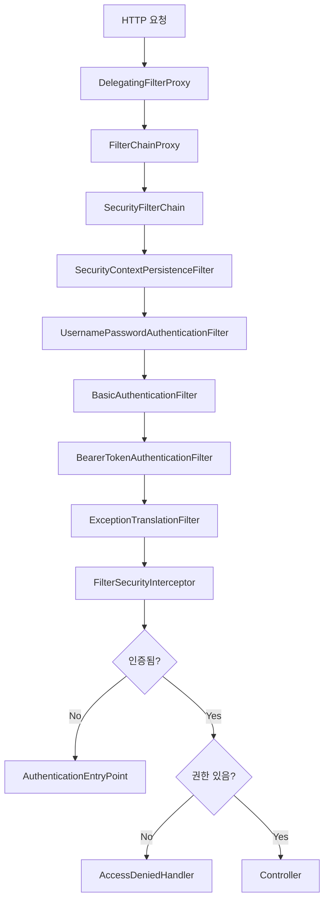
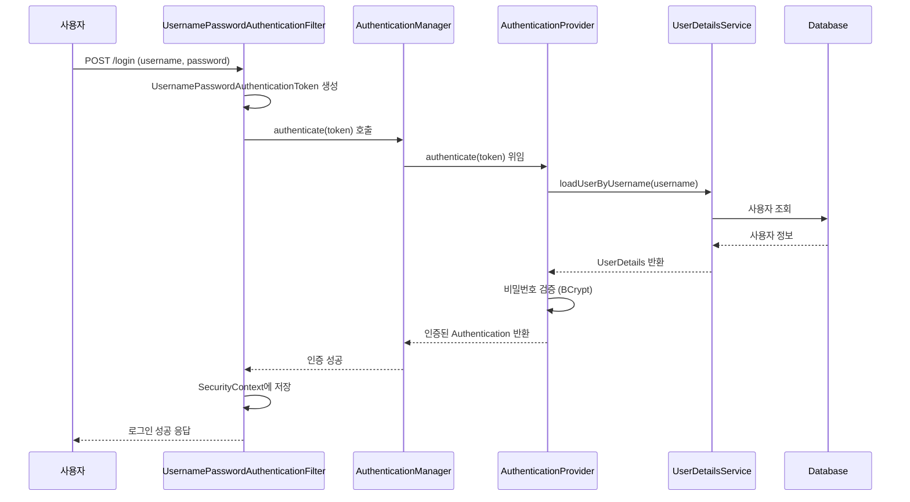
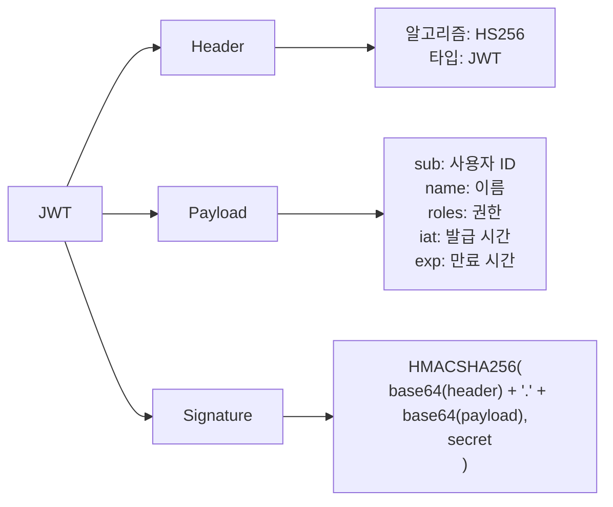
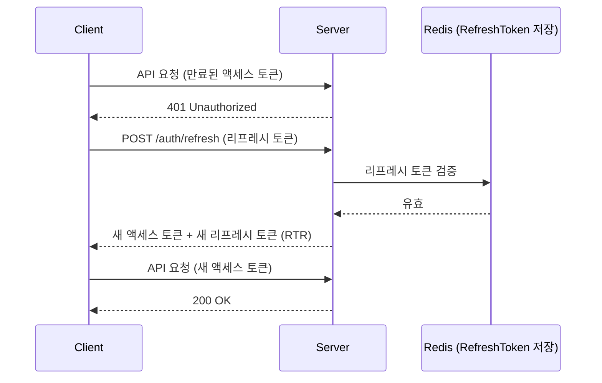
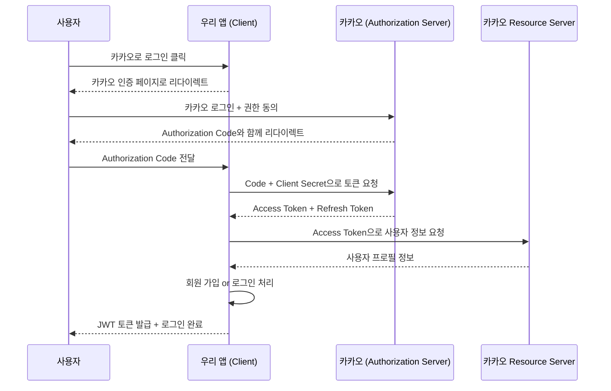
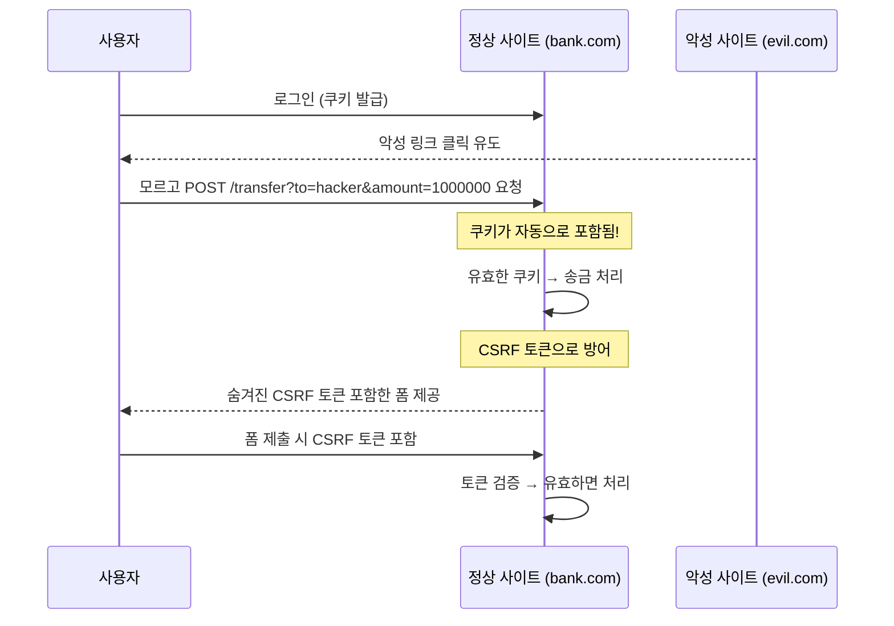
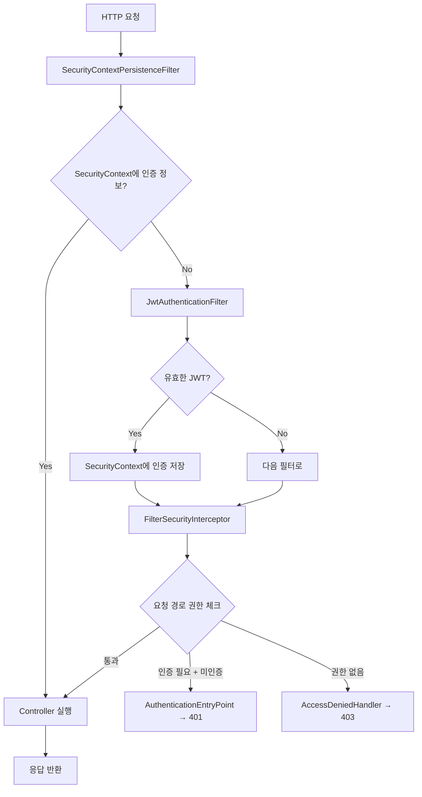

## 1. 비유 — 건물 출입 보안 시스템

대형 빌딩에 들어가려면 여러 단계를 거칩니다. 입구 경비원(Filter Chain)이 신분증을 확인하고, 안내 데스크(AuthenticationManager)에서 방문 목적을 확인합니다. 특정 층에 가려면 추가 권한(Authorization)이 필요합니다. Spring Security는 이 전체 보안 시스템을 자동화합니다.

---

## 2. Spring Security 전체 아키텍처



---

## 3. SecurityFilterChain 설정

### 3.1 기본 구성 (Spring Security 6.x)

```java
@Configuration
@EnableWebSecurity
public class SecurityConfig {

    @Bean
    public SecurityFilterChain securityFilterChain(HttpSecurity http) throws Exception {
        http
            // CSRF 설정
            .csrf(csrf -> csrf
                .csrfTokenRepository(CookieCsrfTokenRepository.withHttpOnlyFalse())
            )

            // 세션 관리
            .sessionManagement(session -> session
                .sessionCreationPolicy(SessionCreationPolicy.STATELESS)
            )

            // 요청 인가 규칙
            .authorizeHttpRequests(auth -> auth
                .requestMatchers("/api/public/**").permitAll()
                .requestMatchers("/api/admin/**").hasRole("ADMIN")
                .requestMatchers(HttpMethod.GET, "/api/orders").hasAnyRole("USER", "ADMIN")
                .anyRequest().authenticated()
            )

            // JWT 필터 추가
            .addFilterBefore(jwtAuthenticationFilter(), UsernamePasswordAuthenticationFilter.class)

            // 예외 처리
            .exceptionHandling(ex -> ex
                .authenticationEntryPoint(new HttpStatusEntryPoint(HttpStatus.UNAUTHORIZED))
                .accessDeniedHandler((request, response, e) -> {
                    response.setStatus(HttpStatus.FORBIDDEN.value());
                    response.getWriter().write("{\"error\": \"Access Denied\"}");
                })
            );

        return http.build();
    }

    @Bean
    public PasswordEncoder passwordEncoder() {
        return new BCryptPasswordEncoder();
    }
}
```

---

## 4. 인증(Authentication) 흐름

### 4.1 폼 로그인 인증 흐름



### 4.2 UserDetailsService 구현

```java
@Service
@RequiredArgsConstructor
public class CustomUserDetailsService implements UserDetailsService {

    private final MemberRepository memberRepository;

    @Override
    public UserDetails loadUserByUsername(String email) throws UsernameNotFoundException {
        Member member = memberRepository.findByEmail(email)
            .orElseThrow(() -> new UsernameNotFoundException("사용자를 찾을 수 없습니다: " + email));

        return User.builder()
            .username(member.getEmail())
            .password(member.getPassword())
            .roles(member.getRole().name()) // "USER", "ADMIN"
            .accountExpired(!member.isActive())
            .credentialsExpired(member.isPasswordExpired())
            .disabled(!member.isEnabled())
            .build();
    }
}
```

### 4.3 커스텀 UserDetails

```java
@Getter
public class CustomUserDetails implements UserDetails {

    private final Long id;
    private final String email;
    private final String password;
    private final String nickname;
    private final Collection<? extends GrantedAuthority> authorities;

    public CustomUserDetails(Member member) {
        this.id = member.getId();
        this.email = member.getEmail();
        this.password = member.getPassword();
        this.nickname = member.getNickname();
        this.authorities = member.getRoles().stream()
            .map(role -> new SimpleGrantedAuthority("ROLE_" + role.name()))
            .collect(Collectors.toList());
    }

    @Override public String getUsername() { return email; }
    @Override public boolean isAccountNonExpired() { return true; }
    @Override public boolean isAccountNonLocked() { return true; }
    @Override public boolean isCredentialsNonExpired() { return true; }
    @Override public boolean isEnabled() { return true; }
}
```

---

## 5. JWT (JSON Web Token) 인증

### 5.1 JWT 구조

```
eyJhbGciOiJIUzI1NiIsInR5cCI6IkpXVCJ9.   ← Header
eyJzdWIiOiIxMjM0NTY3ODkwIiwibmFtZSI6Ikp. ← Payload
SflKxwRJSMeKKF2QT4fwpMeJf36POk6yJV_adQss ← Signature
```



### 5.2 JWT 토큰 서비스

```java
@Component
public class JwtTokenProvider {

    @Value("${jwt.secret}")
    private String secretKey;

    @Value("${jwt.access-token-validity-in-seconds}")
    private long accessTokenValidityInSeconds;

    @Value("${jwt.refresh-token-validity-in-seconds}")
    private long refreshTokenValidityInSeconds;

    private SecretKey getSigningKey() {
        byte[] keyBytes = secretKey.getBytes(StandardCharsets.UTF_8);
        return Keys.hmacShaKeyFor(keyBytes);
    }

    // 액세스 토큰 생성
    public String createAccessToken(CustomUserDetails userDetails) {
        Date now = new Date();
        Date expiry = new Date(now.getTime() + accessTokenValidityInSeconds * 1000);

        return Jwts.builder()
            .subject(userDetails.getUsername())
            .claim("id", userDetails.getId())
            .claim("roles", userDetails.getAuthorities().stream()
                .map(GrantedAuthority::getAuthority)
                .collect(Collectors.toList()))
            .issuedAt(now)
            .expiration(expiry)
            .signWith(getSigningKey())
            .compact();
    }

    // 리프레시 토큰 생성
    public String createRefreshToken(String email) {
        Date now = new Date();
        Date expiry = new Date(now.getTime() + refreshTokenValidityInSeconds * 1000);

        return Jwts.builder()
            .subject(email)
            .issuedAt(now)
            .expiration(expiry)
            .signWith(getSigningKey())
            .compact();
    }

    // 토큰 검증 및 Claims 추출
    public Claims validateAndGetClaims(String token) {
        try {
            return Jwts.parser()
                .verifyWith(getSigningKey())
                .build()
                .parseSignedClaims(token)
                .getPayload();
        } catch (ExpiredJwtException e) {
            throw new TokenExpiredException("토큰이 만료되었습니다");
        } catch (JwtException e) {
            throw new InvalidTokenException("유효하지 않은 토큰입니다");
        }
    }

    public String extractEmail(String token) {
        return validateAndGetClaims(token).getSubject();
    }

    public boolean isTokenValid(String token) {
        try {
            validateAndGetClaims(token);
            return true;
        } catch (Exception e) {
            return false;
        }
    }
}
```

### 5.3 JWT 인증 필터

```java
@Component
@RequiredArgsConstructor
public class JwtAuthenticationFilter extends OncePerRequestFilter {

    private final JwtTokenProvider jwtTokenProvider;
    private final CustomUserDetailsService userDetailsService;

    @Override
    protected void doFilterInternal(HttpServletRequest request,
                                    HttpServletResponse response,
                                    FilterChain filterChain)
            throws ServletException, IOException {

        String token = extractToken(request);

        if (token != null && jwtTokenProvider.isTokenValid(token)) {
            String email = jwtTokenProvider.extractEmail(token);
            UserDetails userDetails = userDetailsService.loadUserByUsername(email);

            UsernamePasswordAuthenticationToken authentication =
                new UsernamePasswordAuthenticationToken(
                    userDetails, null, userDetails.getAuthorities()
                );
            authentication.setDetails(new WebAuthenticationDetailsSource().buildDetails(request));

            SecurityContextHolder.getContext().setAuthentication(authentication);
        }

        filterChain.doFilter(request, response);
    }

    private String extractToken(HttpServletRequest request) {
        String bearerToken = request.getHeader("Authorization");
        if (StringUtils.hasText(bearerToken) && bearerToken.startsWith("Bearer ")) {
            return bearerToken.substring(7);
        }
        return null;
    }

    // 특정 경로는 필터 건너뜀
    @Override
    protected boolean shouldNotFilter(HttpServletRequest request) {
        String path = request.getRequestURI();
        return path.startsWith("/api/auth/") || path.startsWith("/api/public/");
    }
}
```

### 5.4 액세스/리프레시 토큰 갱신 전략



---

## 6. OAuth2 소셜 로그인

### 6.1 OAuth2 흐름



### 6.2 Spring Security OAuth2 설정

```yaml
spring:
  security:
    oauth2:
      client:
        registration:
          google:
            client-id: ${GOOGLE_CLIENT_ID}
            client-secret: ${GOOGLE_CLIENT_SECRET}
            scope: email, profile
          kakao:
            client-id: ${KAKAO_CLIENT_ID}
            client-secret: ${KAKAO_CLIENT_SECRET}
            authorization-grant-type: authorization_code
            redirect-uri: "{baseUrl}/login/oauth2/code/{registrationId}"
            scope: profile_nickname, account_email
        provider:
          kakao:
            authorization-uri: https://kauth.kakao.com/oauth/authorize
            token-uri: https://kauth.kakao.com/oauth/token
            user-info-uri: https://kapi.kakao.com/v2/user/me
            user-name-attribute: id
```

```java
@Service
@RequiredArgsConstructor
public class CustomOAuth2UserService extends DefaultOAuth2UserService {

    private final MemberRepository memberRepository;

    @Override
    public OAuth2User loadUser(OAuth2UserRequest userRequest) throws OAuth2AuthenticationException {
        OAuth2User oAuth2User = super.loadUser(userRequest);

        String registrationId = userRequest.getClientRegistration().getRegistrationId();
        OAuth2UserInfo userInfo = OAuth2UserInfoFactory.getOAuth2UserInfo(registrationId, oAuth2User.getAttributes());

        // 회원 조회 or 신규 가입
        Member member = memberRepository.findByEmail(userInfo.getEmail())
            .map(existing -> existing.update(userInfo.getName(), userInfo.getImageUrl()))
            .orElse(Member.createOAuth2Member(userInfo));

        memberRepository.save(member);

        return new DefaultOAuth2User(
            Collections.singleton(new SimpleGrantedAuthority("ROLE_USER")),
            oAuth2User.getAttributes(),
            userRequest.getClientRegistration().getProviderDetails().getUserInfoEndpoint().getUserNameAttributeName()
        );
    }
}
```

---

## 7. CSRF와 CORS

### 7.1 CSRF (Cross-Site Request Forgery)



```java
// REST API (Stateless)에서는 CSRF 비활성화
http.csrf(csrf -> csrf.disable());

// 전통적인 폼 기반 앱에서는 활성화
http.csrf(csrf -> csrf
    .csrfTokenRepository(CookieCsrfTokenRepository.withHttpOnlyFalse())
    .ignoringRequestMatchers("/api/webhooks/**")
);
```

### 7.2 CORS (Cross-Origin Resource Sharing)

```java
@Configuration
public class CorsConfig {

    @Bean
    public CorsConfigurationSource corsConfigurationSource() {
        CorsConfiguration configuration = new CorsConfiguration();

        // 허용할 출처
        configuration.setAllowedOriginPatterns(List.of(
            "http://localhost:3000",
            "https://*.myapp.com"
        ));

        // 허용할 HTTP 메서드
        configuration.setAllowedMethods(List.of("GET", "POST", "PUT", "DELETE", "PATCH", "OPTIONS"));

        // 허용할 헤더
        configuration.setAllowedHeaders(List.of("*"));

        // 인증 정보 포함 허용 (쿠키, Authorization 헤더)
        configuration.setAllowCredentials(true);

        // preflight 캐시 시간
        configuration.setMaxAge(3600L);

        UrlBasedCorsConfigurationSource source = new UrlBasedCorsConfigurationSource();
        source.registerCorsConfiguration("/**", configuration);
        return source;
    }
}

// SecurityConfig에 적용
http.cors(cors -> cors.configurationSource(corsConfigurationSource()));
```

---

## 8. 메서드 보안 (@PreAuthorize)

```java
@Configuration
@EnableMethodSecurity // @PreAuthorize, @PostAuthorize, @Secured 활성화
public class MethodSecurityConfig {}
```

```java
@Service
public class OrderService {

    // SpEL 표현식으로 세밀한 제어
    @PreAuthorize("hasRole('ADMIN') or #memberId == authentication.principal.id")
    public List<Order> getOrdersByMember(Long memberId) {
        return orderRepository.findByMemberId(memberId);
    }

    // 반환값 기반 권한 체크
    @PostAuthorize("returnObject.memberId == authentication.principal.id")
    public Order getOrder(Long orderId) {
        return orderRepository.findById(orderId).orElseThrow();
    }

    @PreAuthorize("hasRole('ADMIN')")
    public void deleteOrder(Long orderId) {
        orderRepository.deleteById(orderId);
    }

    @Secured({"ROLE_USER", "ROLE_ADMIN"})
    public void createOrder(Order order) {
        orderRepository.save(order);
    }
}
```

---

## 9. SecurityContext와 인증 정보 조회

```java
// 현재 인증된 사용자 정보 조회
@GetMapping("/my-info")
public ResponseEntity<MemberResponse> getMyInfo() {
    // 방법 1: SecurityContextHolder 직접 사용
    Authentication authentication = SecurityContextHolder.getContext().getAuthentication();
    CustomUserDetails userDetails = (CustomUserDetails) authentication.getPrincipal();

    return ResponseEntity.ok(memberService.findById(userDetails.getId()));
}

// 방법 2: @AuthenticationPrincipal 어노테이션
@GetMapping("/my-info")
public ResponseEntity<MemberResponse> getMyInfo(
        @AuthenticationPrincipal CustomUserDetails userDetails) {
    return ResponseEntity.ok(memberService.findById(userDetails.getId()));
}
```

---

## 10. 비밀번호 암호화

```java
@Bean
public PasswordEncoder passwordEncoder() {
    // BCrypt — 가장 권장
    return new BCryptPasswordEncoder(12); // strength: 10~12 권장

    // 또는 DelegatingPasswordEncoder (여러 방식 지원)
    // return PasswordEncoderFactories.createDelegatingPasswordEncoder();
}

// 사용
@Service
public class MemberService {

    private final PasswordEncoder passwordEncoder;

    public void join(MemberJoinRequest request) {
        String encodedPassword = passwordEncoder.encode(request.getPassword());
        Member member = new Member(request.getEmail(), encodedPassword);
        memberRepository.save(member);
    }

    public boolean checkPassword(String rawPassword, String encodedPassword) {
        return passwordEncoder.matches(rawPassword, encodedPassword);
    }
}
```

---

## 11. 극한 시나리오 — 다중 SecurityFilterChain

관리자 API와 일반 API에 서로 다른 보안 정책을 적용:

```java
@Configuration
@EnableWebSecurity
public class MultiSecurityConfig {

    // 관리자 API 전용 체인 (높은 우선순위)
    @Bean
    @Order(1)
    public SecurityFilterChain adminSecurityFilterChain(HttpSecurity http) throws Exception {
        http
            .securityMatcher("/admin/**")
            .authorizeHttpRequests(auth -> auth
                .anyRequest().hasRole("ADMIN")
            )
            .httpBasic(Customizer.withDefaults())
            .sessionManagement(s -> s.sessionCreationPolicy(SessionCreationPolicy.STATELESS));
        return http.build();
    }

    // 일반 API 체인
    @Bean
    @Order(2)
    public SecurityFilterChain apiSecurityFilterChain(HttpSecurity http,
                                                       JwtAuthenticationFilter jwtFilter) throws Exception {
        http
            .securityMatcher("/api/**")
            .csrf(csrf -> csrf.disable())
            .sessionManagement(s -> s.sessionCreationPolicy(SessionCreationPolicy.STATELESS))
            .authorizeHttpRequests(auth -> auth
                .requestMatchers("/api/auth/**").permitAll()
                .anyRequest().authenticated()
            )
            .addFilterBefore(jwtFilter, UsernamePasswordAuthenticationFilter.class);
        return http.build();
    }

    // 웹 페이지 체인 (가장 낮은 우선순위)
    @Bean
    @Order(3)
    public SecurityFilterChain webSecurityFilterChain(HttpSecurity http) throws Exception {
        http
            .authorizeHttpRequests(auth -> auth
                .requestMatchers("/public/**", "/css/**", "/js/**").permitAll()
                .anyRequest().authenticated()
            )
            .formLogin(form -> form
                .loginPage("/login")
                .defaultSuccessUrl("/dashboard")
                .permitAll()
            )
            .logout(logout -> logout
                .logoutUrl("/logout")
                .logoutSuccessUrl("/login?logout")
            );
        return http.build();
    }
}
```

---

## 12. 전체 인증 흐름 정리



---

## 13. 요약

| 기능 | 주요 클래스/어노테이션 | 설명 |
|------|---------------------|------|
| 보안 설정 | SecurityFilterChain | 전체 보안 정책 정의 |
| 사용자 인증 | UserDetailsService | DB에서 사용자 정보 로드 |
| 비밀번호 암호화 | BCryptPasswordEncoder | 단방향 해시 |
| JWT 인증 | OncePerRequestFilter | 매 요청마다 토큰 검증 |
| OAuth2 | OAuth2UserService | 소셜 로그인 처리 |
| 메서드 보안 | @PreAuthorize | SpEL 기반 세밀한 권한 |
| CSRF 방어 | CsrfFilter | CSRF 토큰 검증 |
| CORS 설정 | CorsConfigurationSource | 교차 출처 요청 허용 |
| 현재 사용자 | @AuthenticationPrincipal | 컨트롤러에서 편리하게 조회 |
