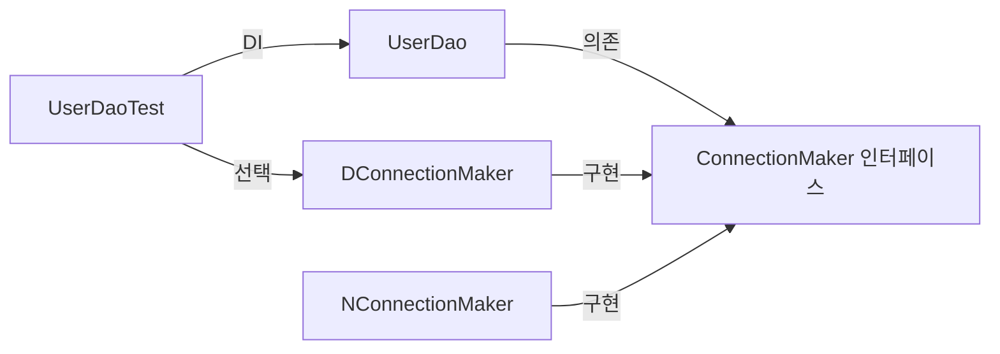
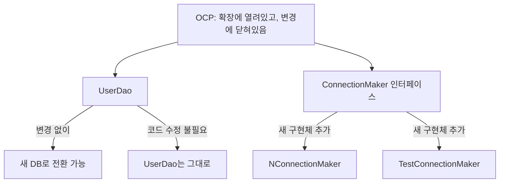
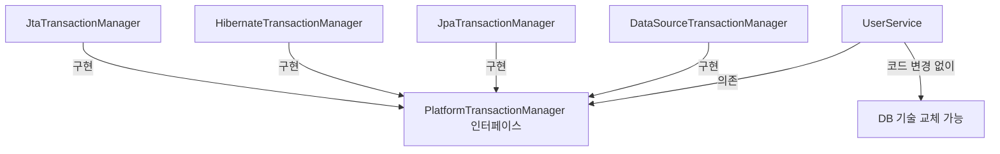
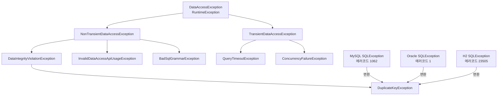
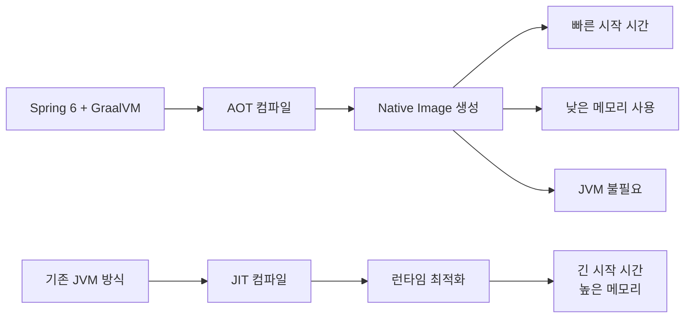
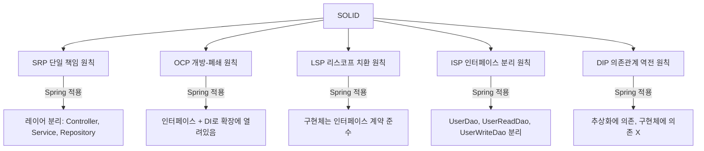
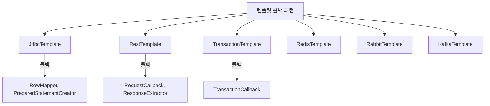

## 1. 비유 — 레고 블록과 조립 설명서

스프링을 이해한다는 것은 레고 블록(객체)을 어떻게 조립하는지(의존관계), 그 설명서(설계 원칙)를 이해하는 것입니다. 토비의 스프링이 가르쳐주는 것은 "어떻게 쓰는가"가 아니라 "왜 이렇게 설계되었는가"입니다.

---

## 2. 오브젝트와 의존관계

### 2.1 관심사의 분리 (Separation of Concerns)

처음에는 모든 것이 하나의 클래스에 있습니다:

```java
// 나쁜 예: 관심사가 뒤섞여 있음
public class UserDao {

    public void add(User user) throws ClassNotFoundException, SQLException {
        // DB 연결 — 관심사 1
        Class.forName("com.mysql.cj.jdbc.Driver");
        Connection c = DriverManager.getConnection(
            "jdbc:mysql://localhost/springbook", "spring", "book");

        // SQL 실행 — 관심사 2
        PreparedStatement ps = c.prepareStatement(
            "INSERT INTO users(id, name, password) VALUES(?,?,?)");
        ps.setString(1, user.getId());
        ps.setString(2, user.getName());
        ps.setString(3, user.getPassword());
        ps.executeUpdate();

        // 리소스 반납 — 관심사 3
        ps.close();
        c.close();
    }
}
```

관심사를 분리하면:

```java
// DB 연결 — 관심사 1 분리
public interface ConnectionMaker {
    Connection makeConnection() throws ClassNotFoundException, SQLException;
}

public class DConnectionMaker implements ConnectionMaker {
    @Override
    public Connection makeConnection() throws ClassNotFoundException, SQLException {
        Class.forName("com.mysql.cj.jdbc.Driver");
        return DriverManager.getConnection("jdbc:mysql://...", "d", "d_password");
    }
}

// UserDao — SQL 실행에만 집중
public class UserDao {
    private ConnectionMaker connectionMaker;

    public UserDao(ConnectionMaker connectionMaker) {
        this.connectionMaker = connectionMaker;
    }

    public void add(User user) throws ClassNotFoundException, SQLException {
        Connection c = connectionMaker.makeConnection();
        // SQL 실행
        PreparedStatement ps = c.prepareStatement("INSERT INTO users...");
        // ...
    }
}
```



### 2.2 개방-폐쇄 원칙 (OCP)



---

## 3. 템플릿 메서드 패턴과 전략 패턴

### 3.1 JDBC 코드의 중복 문제

```java
// 공통 패턴: 연결 → 쿼리 → 예외처리 → 닫기
// add(), get(), delete() 모두 동일한 구조
public void add(User user) throws SQLException {
    Connection c = null;
    PreparedStatement ps = null;
    try {
        c = dataSource.getConnection();
        ps = c.prepareStatement("INSERT ...");  // 이 부분만 다름
        ps.executeUpdate();
    } catch (SQLException e) {
        throw e;
    } finally {
        if (ps != null) try { ps.close(); } catch (SQLException e) {}
        if (c != null) try { c.close(); } catch (SQLException e) {}
    }
}
```

### 3.2 전략 패턴으로 해결

```java
// 전략 인터페이스
@FunctionalInterface
public interface StatementStrategy {
    PreparedStatement makePreparedStatement(Connection c) throws SQLException;
}

// 템플릿 메서드 (변하지 않는 부분)
public class JdbcContext {

    private DataSource dataSource;

    public void workWithStatementStrategy(StatementStrategy stmt) throws SQLException {
        Connection c = null;
        PreparedStatement ps = null;
        try {
            c = dataSource.getConnection();
            ps = stmt.makePreparedStatement(c); // 전략 실행
            ps.executeUpdate();
        } catch (SQLException e) {
            throw e;
        } finally {
            if (ps != null) try { ps.close(); } catch (SQLException e) {}
            if (c != null) try { c.close(); } catch (SQLException e) {}
        }
    }
}

// UserDao — 변하는 부분만 집중
public class UserDao {

    private JdbcContext jdbcContext;

    public void add(final User user) throws SQLException {
        jdbcContext.workWithStatementStrategy(
            c -> {
                PreparedStatement ps = c.prepareStatement("INSERT INTO users(id, name) VALUES(?,?)");
                ps.setString(1, user.getId());
                ps.setString(2, user.getName());
                return ps;
            }
        );
    }

    public void deleteAll() throws SQLException {
        jdbcContext.workWithStatementStrategy(
            c -> c.prepareStatement("DELETE FROM users")
        );
    }
}
```

이것이 JdbcTemplate의 내부 동작 원리입니다!

---

## 4. 서비스 추상화

### 4.1 트랜잭션 서비스 추상화 문제

```java
// JDBC 트랜잭션 — UserService가 JDBC에 의존
public class UserService {

    public void upgradeLevels() throws Exception {
        // JDBC Connection을 직접 다룸 — 문제!
        Connection c = dataSource.getConnection();
        c.setAutoCommit(false);
        try {
            List<User> users = userDao.getAll();
            for (User user : users) {
                if (canUpgradeLevel(user)) {
                    upgradeLevel(user);
                }
            }
            c.commit();
        } catch (Exception e) {
            c.rollback();
            throw e;
        } finally {
            c.close();
        }
    }
}
```

JPA로 교체하면? Hibernate로 교체하면? `UserService`를 수정해야 합니다.

### 4.2 PlatformTransactionManager 추상화

```java
// UserService — 트랜잭션 기술에 독립적
public class UserService {

    private PlatformTransactionManager transactionManager;

    public void upgradeLevels() {
        TransactionStatus status =
            transactionManager.getTransaction(new DefaultTransactionDefinition());
        try {
            List<User> users = userDao.getAll();
            for (User user : users) {
                if (canUpgradeLevel(user)) {
                    upgradeLevel(user);
                }
            }
            transactionManager.commit(status);
        } catch (RuntimeException e) {
            transactionManager.rollback(status);
            throw e;
        }
    }
}
```



---

## 5. 예외 전환 (Exception Translation)

### 5.1 체크 예외의 문제점

```java
// 체크 예외를 강제 처리해야 하는 문제
public void add(User user) throws SQLException { // UserDao 구현 기술 노출!
    // ...
}

// 인터페이스에서도 throws가 필요 — 기술 종속
public interface UserDao {
    void add(User user) throws SQLException; // JDBC에 종속!
}
```

### 5.2 예외 전환 전략

```java
// 1. 예외 포장 (Wrapping) — 체크 예외 → 언체크 예외
public void add(User user) {
    try {
        // ...
    } catch (SQLException e) {
        if (e.getErrorCode() == MysqlErrorNumbers.ER_DUP_ENTRY) {
            throw new DuplicateUserIdException(e); // 비즈니스 의미 있는 예외로 변환
        }
        throw new DataAccessException(e); // 언체크 예외로 포장
    }
}

// 2. 인터페이스는 깔끔하게
public interface UserDao {
    void add(User user); // throws 없음!
    User get(String id);
    List<User> getAll();
}
```

### 5.3 Spring의 DataAccessException 계층



---

## 6. Spring 6 주요 변경점

### 6.1 Jakarta EE 9+ 마이그레이션

```java
// Spring 5 (javax)
import javax.servlet.http.HttpServletRequest;
import javax.persistence.Entity;
import javax.validation.constraints.NotNull;

// Spring 6 (jakarta) — 패키지명 변경!
import jakarta.servlet.http.HttpServletRequest;
import jakarta.persistence.Entity;
import jakarta.validation.constraints.NotNull;
```

### 6.2 Java 17 기준선

```java
// Spring 6은 Java 17 최소 요구
// Records, Sealed Classes, Pattern Matching 활용 가능

// Record 활용
public record UserDto(Long id, String name, String email) {}

// Pattern Matching
if (response instanceof ErrorResponse errorResponse) {
    log.error("에러: {}", errorResponse.message());
}

// Sealed Classes
public sealed interface Result<T> permits Success, Failure {}
public record Success<T>(T value) implements Result<T> {}
public record Failure<T>(String error) implements Result<T> {}
```

### 6.3 AOT (Ahead-of-Time) 처리



```java
// AOT 힌트 제공
@Component
@ImportRuntimeHints(MyRuntimeHintsRegistrar.class)
public class MyComponent {}

public class MyRuntimeHintsRegistrar implements RuntimeHintsRegistrar {
    @Override
    public void registerHints(RuntimeHints hints, ClassLoader classLoader) {
        // 리플렉션이 필요한 클래스 등록
        hints.reflection().registerType(MyDto.class,
            MemberCategory.INVOKE_DECLARED_CONSTRUCTORS,
            MemberCategory.INVOKE_DECLARED_METHODS);

        // 리소스 파일 등록
        hints.resources().registerPattern("templates/*.html");
    }
}
```

### 6.4 HTTP Interface Client

```java
// Spring 6 새 기능: 인터페이스로 HTTP 클라이언트 정의
public interface GithubClient {

    @GetExchange("/repos/{owner}/{repo}")
    GithubRepo getRepo(@PathVariable String owner, @PathVariable String repo);

    @PostExchange("/repos/{owner}/{repo}/issues")
    GithubIssue createIssue(@PathVariable String owner,
                             @PathVariable String repo,
                             @RequestBody CreateIssueRequest request);
}

// 설정
@Bean
public GithubClient githubClient() {
    WebClient webClient = WebClient.builder()
        .baseUrl("https://api.github.com")
        .defaultHeader(HttpHeaders.AUTHORIZATION, "token " + githubToken)
        .build();

    return HttpServiceProxyFactory
        .builderFor(WebClientAdapter.create(webClient))
        .build()
        .createClient(GithubClient.class);
}

// 사용
@Service
public class GithubService {

    private final GithubClient githubClient;

    public GithubRepo getSpringRepo() {
        return githubClient.getRepo("spring-projects", "spring-framework");
    }
}
```

### 6.5 Micrometer Tracing 통합

```java
// Spring 6 + Micrometer Tracing (분산 추적)
@Service
public class OrderService {

    private final Tracer tracer;

    @Observed(name = "order.create", contextualName = "주문 생성")
    public Order createOrder(CreateOrderRequest request) {
        Span span = tracer.currentSpan();
        if (span != null) {
            span.tag("order.memberId", request.getMemberId().toString());
        }
        return orderRepository.save(Order.from(request));
    }
}
```

---

## 7. 스프링 핵심 설계 원칙

### 7.1 SOLID 원칙 적용



### 7.2 템플릿 콜백 패턴 — Spring 전반에서 사용



```java
// TransactionTemplate 사용
@Service
public class UserService {

    private final TransactionTemplate transactionTemplate;

    public void upgradeLevels() {
        transactionTemplate.execute(status -> {
            List<User> users = userDao.getAll();
            for (User user : users) {
                if (canUpgradeLevel(user)) {
                    upgradeLevel(user);
                }
            }
            return null;
        });
    }
}
```

---

## 8. 스프링 테스트 전략

### 8.1 단위 테스트 vs 통합 테스트

```java
// 단위 테스트 — 빠름, Mock 사용
class UserServiceTest {

    @InjectMocks
    private UserService userService;

    @Mock
    private UserDao userDao;

    @Mock
    private MailSender mailSender;

    @Test
    void upgradeLevels() {
        List<User> users = Arrays.asList(
            new User("1", "A", Level.BASIC, 49, 0),
            new User("2", "B", Level.BASIC, 50, 0),  // 업그레이드 대상
            new User("3", "C", Level.SILVER, 60, 29),
            new User("4", "D", Level.SILVER, 60, 30) // 업그레이드 대상
        );

        given(userDao.getAll()).willReturn(users);

        userService.upgradeLevels();

        verify(userDao, times(2)).update(any(User.class));
    }
}

// 통합 테스트 — 느림, 실제 DB 사용
@SpringBootTest
@Transactional // 테스트 후 롤백
class UserServiceIntegrationTest {

    @Autowired
    private UserService userService;

    @Autowired
    private UserDao userDao;

    @Test
    void upgradeLevelsWithRealDb() {
        // 테스트 데이터 준비
        userDao.deleteAll();
        userDao.add(new User("1", "A", Level.BASIC, 50, 0));

        userService.upgradeLevels();

        User upgraded = userDao.get("1");
        assertThat(upgraded.getLevel()).isEqualTo(Level.SILVER);
    }
}
```

---

## 9. 극한 시나리오 — 동적 프록시로 부가 기능 추가

실제 Spring AOP가 동작하는 방식을 직접 구현:

```java
// 부가 기능: 메서드 실행 시간 측정
public class PerformanceAdvice implements MethodInterceptor {

    @Override
    public Object invoke(MethodInvocation invocation) throws Throwable {
        StopWatch stopWatch = new StopWatch(invocation.getMethod().getName());
        stopWatch.start();

        try {
            return invocation.proceed(); // 실제 메서드 실행
        } finally {
            stopWatch.stop();
            if (stopWatch.getTotalTimeMillis() > 100) {
                log.warn("느린 메서드 감지: {} ({}ms)",
                    invocation.getMethod().getName(),
                    stopWatch.getTotalTimeMillis());
            }
        }
    }
}

// ProxyFactory로 프록시 생성
ProxyFactory factory = new ProxyFactory(new UserServiceImpl());
factory.addAdvice(new PerformanceAdvice());
UserService proxied = (UserService) factory.getProxy();

// 이것이 @Transactional의 내부 동작 원리
```

---

## 10. Spring 6 변경점 요약

| 항목 | Spring 5 | Spring 6 |
|------|---------|---------|
| 최소 Java 버전 | Java 8 | Java 17 |
| Jakarta EE | javax.* | jakarta.* |
| HTTP Client | RestTemplate (deprecated) | WebClient, HTTP Interface |
| 관찰성 | 직접 구현 | Micrometer Tracing 통합 |
| AOT/Native | 제한적 | GraalVM Native Image 공식 지원 |
| Spring Security | 5.x | 6.x (SecurityFilterChain 방식) |
| 최소 Tomcat | Tomcat 9 | Tomcat 10 |

---

## 11. 요약

| 개념 | 핵심 교훈 | 현대적 적용 |
|------|---------|-----------|
| 관심사 분리 | 하나의 클래스는 하나의 책임 | @Controller, @Service, @Repository |
| 전략 패턴 | 변하는 것과 변하지 않는 것 분리 | JdbcTemplate, TransactionTemplate |
| 서비스 추상화 | 인터페이스로 기술 종속성 제거 | PlatformTransactionManager |
| 예외 전환 | 체크 예외 → 언체크 예외 | DataAccessException 계층 |
| 템플릿 콜백 | 공통 코드를 템플릿으로 분리 | JdbcTemplate, RestTemplate |
| Spring 6 | Jakarta EE 9+, Java 17 | 최신 생태계 대응 |
