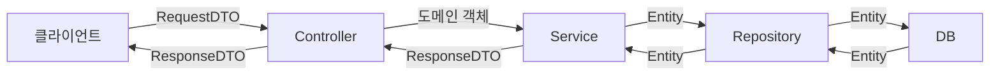
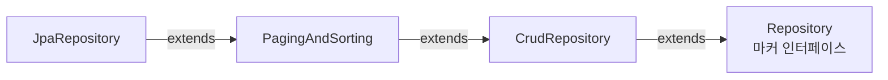
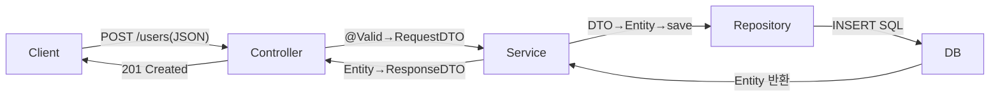
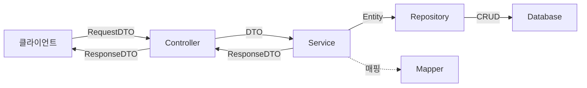

> **한 줄 요약**: Entity는 DB의 거울이고, DTO는 계층 간 택배 상자이며, VO는 값 그 자체가 정체성이고, DAO는 SQL 창고 관리인이며, Repository는 도메인이 말하는 컬렉션이다. 이 다섯 개념을 혼용하는 순간 코드는 조용히 무너지기 시작한다.

---

## 1. 왜 구분하지 않으면 참사가 벌어지는가

신입 개발자가 가장 먼저 저지르는 실수는 Entity를 Controller에서 직접 `@ResponseBody`로 반환하는 것이다. 코드가 짧아서 좋아 보인다. 그런데 프로덕션에 배포하면 세 가지 재앙이 동시에 찾아온다.

### 실제 참사 시나리오

```java
// 절대 하지 말아야 할 코드
@GetMapping("/users/{id}")
public User getUser(@PathVariable Long id) {
    return userRepository.findById(id).orElseThrow();  // Entity 직접 반환!
}
```

이 한 줄이 야기하는 문제는 단순한 코드 스타일 이슈가 아니다. 런타임에서 실제로 서비스가 죽는 버그다.

**문제 1: 양방향 참조 무한 루프 (Jackson StackOverflowError)**

`User` 엔티티가 `Order` 엔티티와 양방향 관계를 맺고 있다면 Jackson이 직렬화할 때 User → Order → User → Order를 무한히 반복한다. 스택이 넘쳐 `StackOverflowError`가 발생하고 API가 500 에러를 반환한다. `@JsonIgnore`나 `@JsonManagedReference`로 임시 방어할 수 있지만, 이는 영속성 로직이 직렬화 규칙에 종속되는 결합을 만든다.

**문제 2: 내부 필드 노출**

`password`, `salt`, `주민번호`, `내부 상태 플래그` 같은 필드가 API 응답에 그대로 나온다. `@JsonIgnore`를 붙이면 되지 않냐고 묻겠지만, Entity에 직렬화 어노테이션이 붙는 순간 그 Entity는 더 이상 순수한 도메인 객체가 아니다. 표현 계층의 관심사가 도메인 계층에 침투한 것이다.

**문제 3: API 스펙이 DB 스키마에 종속**

테이블 컬럼명을 `user_name`에서 `full_name`으로 바꾸면 API 응답 필드명도 같이 바뀐다. 프론트엔드가 즉시 깨진다. 반대로 API 스펙을 변경하지 않으려면 DB 컬럼명을 바꾸지 못한다. DB 설계가 API에 묶이는 역전 현상이 발생한다.

**문제 4: N+1 쿼리를 프론트엔드가 유발**

`User` 엔티티의 `orders` 필드가 `LAZY` 로딩이라면, Jackson이 `orders`를 직렬화하는 순간 Persistence Context 밖에서 추가 쿼리가 발생한다. 트랜잭션이 이미 닫혀 있으면 `LazyInitializationException`이 터진다. 이를 막으려고 `EAGER`로 바꾸면 모든 User 조회 시 항상 Order 전체를 조인한다. 단순 목록 API에서 수십 개의 불필요한 조인이 실행된다.

이 네 가지 문제는 전부 "Entity를 API에 직접 노출"이라는 단 하나의 결정에서 비롯된다.

---

## 2. 5가지 객체의 정의와 "왜" 구분하는가



계층마다 오가는 객체가 다르다. 이 다름을 코드로 강제하는 것이 객체 구분의 목적이다.

---

### Entity

**무엇인가**: JPA 영속성 컨텍스트가 관리하는 DB 테이블 1:1 매핑 객체다. `@Entity` 어노테이션이 붙고, 식별자(`@Id`)를 가지며, 영속성 컨텍스트가 변경 감지(Dirty Checking)로 자동으로 UPDATE 쿼리를 생성한다.

**왜 필요한가**: DB의 레코드를 객체로 표현하고, 객체 상태 변화를 DB에 반영하는 책임을 가진다. ORM의 핵심 단위다. 도메인의 핵심 상태와 비즈니스 규칙을 담는다.

**Entity가 가져도 되는 것**: 도메인 비즈니스 로직. `order.cancel()`, `user.changePassword()` 같이 상태 변경 메서드는 Entity 안에 있는 것이 옳다. 이것이 풍부한 도메인 모델(Rich Domain Model)이다.

**Entity가 가지면 안 되는 것**: 직렬화 어노테이션(`@JsonIgnore`), 표현 계층 포맷팅 로직, 특정 API 응답을 위한 필드. 이런 것이 Entity에 들어오면 Entity가 여러 관심사를 가지게 된다.

```java
@Entity
@Table(name = "users")
@Getter
@NoArgsConstructor(access = AccessLevel.PROTECTED)
public class User {

    @Id
    @GeneratedValue(strategy = GenerationType.IDENTITY)
    private Long id;

    @Column(nullable = false, unique = true)
    private String email;

    @Column(nullable = false)
    private String password;  // API 응답에 절대 포함되면 안 되는 필드

    @Column(nullable = false)
    private String fullName;

    @Enumerated(EnumType.STRING)
    private UserStatus status;

    @OneToMany(mappedBy = "user", fetch = FetchType.LAZY, cascade = CascadeType.ALL)
    private List<Order> orders = new ArrayList<>();

    @CreatedDate
    private LocalDateTime createdAt;

    // 도메인 비즈니스 로직은 Entity 안에 있어도 된다
    public void activate() {
        if (this.status == UserStatus.ACTIVE) {
            throw new IllegalStateException("이미 활성화된 사용자입니다.");
        }
        this.status = UserStatus.ACTIVE;
    }

    public void changePassword(String encodedPassword) {
        this.password = encodedPassword;
    }

    // 생성 팩토리 메서드
    public static User create(String email, String encodedPassword, String fullName) {
        User user = new User();
        user.email = email;
        user.password = encodedPassword;
        user.fullName = fullName;
        user.status = UserStatus.PENDING;
        return user;
    }
}
```

`@NoArgsConstructor(access = AccessLevel.PROTECTED)`는 JPA가 리플렉션으로 인스턴스를 만들 때 필요하지만, 외부에서 `new User()`로 직접 생성하는 것은 막는다. 생성 팩토리 메서드를 통해서만 만들도록 강제하는 패턴이다.

---

### DTO (Data Transfer Object)

**무엇인가**: 계층 간 데이터를 전달하기 위한 전용 객체다. 비즈니스 로직이 없고, 데이터를 담는 것이 유일한 역할이다. 요청 데이터를 담는 Request DTO와 응답 데이터를 담는 Response DTO로 나뉜다.

**왜 Request/Response를 분리하는가**: 생성 API에서는 `password`가 필요하지만 응답에는 절대 포함되면 안 된다. 조회 API 응답에는 `createdAt`이 필요하지만 생성 요청에는 없다. 같은 `User` 데이터지만 맥락에 따라 필요한 필드가 완전히 다르다. 하나의 DTO를 모든 상황에 재사용하면 어느 필드가 어느 상황에 유효한지 알 수 없게 된다.

**왜 불변(Immutable)으로 만드는가**: DTO는 A 계층에서 B 계층으로 전달될 때 내용이 바뀌면 안 된다. 전달 도중 필드가 변경되면 어느 계층에서 바꿨는지 추적이 불가능해진다. 불변으로 만들면 이 문제가 원천 차단된다.

```java
// Request DTO - 생성 요청
@Getter
@NoArgsConstructor
public class UserCreateRequest {

    @NotBlank(message = "이메일은 필수입니다.")
    @Email(message = "올바른 이메일 형식이 아닙니다.")
    private String email;

    @NotBlank
    @Size(min = 8, max = 20, message = "비밀번호는 8~20자여야 합니다.")
    private String password;

    @NotBlank
    private String fullName;
}

// Response DTO - 조회 응답
@Getter
@AllArgsConstructor
public class UserResponse {

    private Long id;
    private String email;
    private String fullName;
    private String status;
    private LocalDateTime createdAt;

    // password 필드 없음 - 의도적 누락
}
```

**Java 16+ Record로 만들면 더 좋다**: 불변성이 언어 레벨에서 보장되고, `equals()`, `hashCode()`, `toString()`이 자동 생성되며, 보일러플레이트 코드가 극적으로 줄어든다.

```java
// Record 버전 - Java 16+
public record UserCreateRequest(
    @NotBlank @Email String email,
    @NotBlank @Size(min = 8, max = 20) String password,
    @NotBlank String fullName
) {}

public record UserResponse(
    Long id,
    String email,
    String fullName,
    String status,
    LocalDateTime createdAt
) {
    // Entity에서 Response를 만드는 정적 팩토리 메서드
    public static UserResponse from(User user) {
        return new UserResponse(
            user.getId(),
            user.getEmail(),
            user.getFullName(),
            user.getStatus().name(),
            user.getCreatedAt()
        );
    }
}
```

Record의 `from()` 정적 팩토리 메서드 패턴은 변환 로직을 DTO 안에 캡슐화한다. Service에서 `UserResponse.from(user)`로 간결하게 변환할 수 있다.

---

### VO (Value Object)

**무엇인가**: 값 자체가 의미인 불변 객체다. `Money`, `Address`, `Email`, `PhoneNumber`, `Coordinates` 같이 도메인에서 의미 있는 값의 묶음이다.

**왜 DTO와 다른가**: DTO는 계층 간 전달이 목적이어서 특정 API 요청/응답 형태에 종속된다. VO는 도메인 개념을 표현하며 도메인 레이어 안에서 존재한다. `Money`는 금액이라는 도메인 개념이지, "이 API에서 돈을 전달하기 위한 객체"가 아니다.

**Entity와의 결정적 차이**: Entity는 식별자(ID)로 동등성을 판단한다. ID가 같으면 같은 Entity다. VO는 필드 값으로 동등성을 판단한다. `Money(1000, "KRW")`와 또 다른 `Money(1000, "KRW")`는 다른 인스턴스지만 같은 값이다.

```java
// VO - 값으로 동등성을 판단
@Embeddable
@Getter
@NoArgsConstructor(access = AccessLevel.PROTECTED)
public class Money {

    private Long amount;

    @Column(name = "currency")
    private String currency;

    private Money(Long amount, String currency) {
        if (amount < 0) throw new IllegalArgumentException("금액은 음수가 될 수 없습니다.");
        this.amount = amount;
        this.currency = currency;
    }

    public static Money of(Long amount, String currency) {
        return new Money(amount, currency);
    }

    public Money add(Money other) {
        if (!this.currency.equals(other.currency)) {
            throw new IllegalArgumentException("통화 단위가 다릅니다.");
        }
        return new Money(this.amount + other.amount, this.currency);
    }

    // VO의 핵심: 필드 값으로 동등성 판단
    @Override
    public boolean equals(Object o) {
        if (this == o) return true;
        if (!(o instanceof Money money)) return false;
        return Objects.equals(amount, money.amount)
            && Objects.equals(currency, money.currency);
    }

    @Override
    public int hashCode() {
        return Objects.hash(amount, currency);
    }
}

// Entity에서 VO 사용
@Entity
public class Order {

    @Id
    @GeneratedValue(strategy = GenerationType.IDENTITY)
    private Long id;

    @Embedded  // VO를 Entity에 포함
    private Money price;  // order_amount, order_currency 컬럼으로 매핑
}
```

VO에 비즈니스 로직(`add()`, `multiply()`)을 넣는 것은 권장된다. `Money`가 덧셈 방법을 아는 것은 자연스럽다. 그것이 도메인 지식의 응집이다.

---

### DAO (Data Access Object)

**무엇인가**: 데이터베이스 접근 로직을 캡슐화한 객체다. CRUD 작업을 위한 SQL 또는 JPQL을 가지고 있으며, 서비스 계층이 DB 접근 방법을 몰라도 되도록 추상화한다.

**왜 Repository와 다른가**: DAO는 SQL 중심의 데이터 접근 기술(JDBC, MyBatis) 관점에서 만들어진 패턴이다. "어떻게 데이터를 가져올 것인가(How)"에 집중한다. 특정 DB 기술에 종속된다. Repository는 DDD(도메인 주도 설계)에서 나온 개념으로 "도메인 객체의 컬렉션처럼 동작하는 인터페이스(What)"에 집중한다.

**왜 요즘은 DAO 대신 Repository를 주로 쓰는가**: Spring Data JPA가 Repository 패턴을 채택했기 때문이다. JpaRepository 인터페이스만 상속하면 기본 CRUD가 자동으로 구현된다. 단, MyBatis를 사용하는 프로젝트에서는 여전히 DAO 패턴이 자연스럽다.

```java
// MyBatis 기반 DAO 패턴
@Repository
public class UserDao {

    private final SqlSession sqlSession;

    public UserDao(SqlSession sqlSession) {
        this.sqlSession = sqlSession;
    }

    public User findById(Long id) {
        return sqlSession.selectOne("UserMapper.findById", id);
    }

    public List<User> findByStatus(String status) {
        return sqlSession.selectList("UserMapper.findByStatus", status);
    }

    public int insert(User user) {
        return sqlSession.insert("UserMapper.insert", user);
    }

    public int update(User user) {
        return sqlSession.update("UserMapper.update", user);
    }

    public int deleteById(Long id) {
        return sqlSession.delete("UserMapper.deleteById", id);
    }
}
```

DAO는 SQL 매퍼(XML 또는 어노테이션)와 항상 짝을 이룬다. SQL을 직접 제어해야 하는 복잡한 쿼리, 레거시 시스템, MyBatis 프로젝트에서 여전히 유효한 패턴이다.

---

### Repository

**무엇인가**: 도메인 객체의 컬렉션 인터페이스다. Eric Evans의 DDD에서 정의한 개념으로, "마치 메모리에 있는 컬렉션처럼 도메인 객체를 조회하고 저장할 수 있는 인터페이스"다. DB라는 기술 세부사항을 숨긴다.

**왜 DAO보다 추상화 수준이 높은가**: DAO를 쓰면 서비스 계층이 `userDao.findByStatus("ACTIVE")`를 호출할 때 "DB에 SQL 쿼리를 보낸다"는 의식이 남아 있다. Repository를 쓰면 `userRepository.findByStatus(UserStatus.ACTIVE)`를 호출할 때 "User 컬렉션에서 ACTIVE 상태인 것을 가져온다"는 도메인 언어로 생각한다. DB 접근이 완전히 투명해진다.

Spring Data JPA의 Repository 계층 구조는 다음과 같다.



실무에서는 보통 `JpaRepository`를 상속한다. 기본 CRUD와 페이징이 모두 제공된다.

```java
// 기본 Repository
public interface UserRepository extends JpaRepository<User, Long> {

    // 메서드 이름으로 쿼리 자동 생성
    Optional<User> findByEmail(String email);
    List<User> findByStatus(UserStatus status);
    boolean existsByEmail(String email);

    // JPQL 직접 작성
    @Query("SELECT u FROM User u WHERE u.status = :status AND u.createdAt >= :since")
    List<User> findActiveUsersSince(
        @Param("status") UserStatus status,
        @Param("since") LocalDateTime since
    );

    // Native Query
    @Query(value = "SELECT * FROM users WHERE MATCH(full_name) AGAINST(:keyword IN BOOLEAN MODE)",
           nativeQuery = true)
    List<User> fullTextSearch(@Param("keyword") String keyword);
}

// 복잡한 동적 쿼리는 QueryDSL + Custom Repository로 분리
public interface UserRepositoryCustom {
    Page<User> searchWithCondition(UserSearchCondition condition, Pageable pageable);
}

public class UserRepositoryImpl implements UserRepositoryCustom {

    private final JPAQueryFactory queryFactory;

    @Override
    public Page<User> searchWithCondition(UserSearchCondition condition, Pageable pageable) {
        List<User> content = queryFactory
            .selectFrom(user)
            .where(
                emailContains(condition.getEmail()),
                statusEq(condition.getStatus())
            )
            .offset(pageable.getOffset())
            .limit(pageable.getPageSize())
            .fetch();

        long total = queryFactory
            .selectFrom(user)
            .where(emailContains(condition.getEmail()), statusEq(condition.getStatus()))
            .fetchCount();

        return new PageImpl<>(content, pageable, total);
    }

    private BooleanExpression emailContains(String email) {
        return email != null ? user.email.containsIgnoreCase(email) : null;
    }

    private BooleanExpression statusEq(UserStatus status) {
        return status != null ? user.status.eq(status) : null;
    }
}
```

---

## 3. 계층 간 변환 — 어디서, 어떻게 변환하는가

### 변환 흐름 전체 그림

```
Controller    →    Service    →    Repository    →    DB
    ↕                 ↕                 ↕
RequestDTO  →   Entity 생성      Entity 저장/조회
ResponseDTO ←   Entity 조회  ←   Entity 반환
```

변환은 Service 계층에서 담당한다. 이 규칙에는 명확한 이유가 있다.

**Controller에서 변환하면 안 되는 이유**: Controller는 HTTP 요청/응답 처리에 집중해야 한다. 요청 파라미터 파싱, 응답 상태 코드 결정, 예외 처리가 Controller의 역할이다. Entity 변환 로직까지 맡으면 Controller가 두 가지 책임을 갖는다. 또한 Entity를 Controller까지 올려보내면 트랜잭션 경계 밖에서 Lazy Loading이 발생할 위험이 생긴다.

**Repository에서 변환하면 안 되는 이유**: Repository는 영속성 레이어다. 도메인 객체를 DB에서 가져오는 것이 유일한 역할이다. 어떤 필드를 API 응답에 포함할지는 Repository가 알 필요도 없고, 알아서도 안 된다.

**Service에서 변환하는 이유**: Service는 비즈니스 로직의 진입점이다. 어떤 데이터를 가져와서 어떤 형태로 반환할지는 비즈니스 요구사항이다. "주문 조회 API는 배송 상태도 포함해야 한다"는 규칙은 Service가 결정한다. 변환 로직도 그 일부다.

```java
@Service
@Transactional(readOnly = true)
@RequiredArgsConstructor
public class UserService {

    private final UserRepository userRepository;
    private final PasswordEncoder passwordEncoder;

    // 생성: RequestDTO → Entity → 저장 → ResponseDTO 반환
    @Transactional
    public UserResponse createUser(UserCreateRequest request) {
        if (userRepository.existsByEmail(request.email())) {
            throw new DuplicateEmailException(request.email());
        }

        // RequestDTO → Entity 변환 (Service에서)
        User user = User.create(
            request.email(),
            passwordEncoder.encode(request.password()),
            request.fullName()
        );

        User saved = userRepository.save(user);

        // Entity → ResponseDTO 변환 (Service에서)
        return UserResponse.from(saved);
    }

    // 조회: Entity → ResponseDTO
    public UserResponse getUser(Long id) {
        User user = userRepository.findById(id)
            .orElseThrow(() -> new UserNotFoundException(id));
        return UserResponse.from(user);
    }
}
```

### 변환 방법 4가지 비교

| 방법 | 장점 | 단점 | 적합한 상황 |
|------|------|------|-------------|
| 수동 변환 메서드 | 명시적, 디버깅 쉬움, 추가 의존성 없음 | 필드 많으면 코드 길어짐 | 필드 10개 미만, 팀 내 통일 선호 |
| MapStruct | 컴파일 타임 코드 생성, 빠름, 타입 안전 | 어노테이션 설정 학습 필요 | 필드 많을 때, 대규모 프로젝트 |
| ModelMapper | 리플렉션 기반 자동 매핑 | 런타임 오버헤드, 타입 불안전 | 프로토타입, 빠른 검증 |
| Record + 정적 팩토리 | 불변성 보장, 간결, 변환 로직 캡슐화 | Java 16+ 필요 | 신규 프로젝트, 모던 스타일 |

**MapStruct 예시**

```java
// build.gradle 의존성
// implementation 'org.mapstruct:mapstruct:1.5.5.Final'
// annotationProcessor 'org.mapstruct:mapstruct-processor:1.5.5.Final'

@Mapper(componentModel = "spring")  // Spring Bean으로 등록
public interface UserMapper {

    // Entity → ResponseDTO 자동 매핑 (필드명이 같으면 자동)
    UserResponse toResponse(User user);

    // 필드명이 다를 때 명시적 매핑
    @Mapping(source = "fullName", target = "name")
    @Mapping(source = "status", target = "statusCode")
    UserSummaryResponse toSummary(User user);

    // RequestDTO → Entity (password 같은 특수 필드는 ignore 후 별도 처리)
    @Mapping(target = "id", ignore = true)
    @Mapping(target = "password", ignore = true)
    @Mapping(target = "orders", ignore = true)
    User toEntity(UserCreateRequest request);

    // List 변환도 자동 지원
    List<UserResponse> toResponseList(List<User> users);
}

// Service에서 사용
@Service
@RequiredArgsConstructor
public class UserService {

    private final UserRepository userRepository;
    private final UserMapper userMapper;  // Spring이 주입

    public UserResponse getUser(Long id) {
        User user = userRepository.findById(id).orElseThrow();
        return userMapper.toResponse(user);  // 한 줄로 변환
    }
}
```

MapStruct는 컴파일 시점에 실제 Java 코드를 생성한다. 생성된 코드를 `build/generated-sources/annotations`에서 직접 확인할 수 있다. 리플렉션이 없으니 성능이 수동 변환과 동일하다.

**Record + 정적 팩토리 예시** (권장 패턴)

```java
public record UserResponse(
    Long id,
    String email,
    String fullName,
    String status,
    LocalDateTime createdAt
) {
    // 변환 로직을 DTO 안에 캡슐화
    public static UserResponse from(User user) {
        return new UserResponse(
            user.getId(),
            user.getEmail(),
            user.getFullName(),
            user.getStatus().name(),
            user.getCreatedAt()
        );
    }

    // Entity 컬렉션 변환 유틸리티
    public static List<UserResponse> fromList(List<User> users) {
        return users.stream()
            .map(UserResponse::from)
            .toList();  // Java 16+ unmodifiableList 반환
    }
}
```

---

## 4. API 요청 처리 전체 흐름



각 계층이 자신의 역할만 수행한다. Controller는 HTTP를 다루고, Service는 비즈니스와 변환을 담당하며, Repository는 영속성만 처리한다. 이 경계가 명확하면 각 계층을 독립적으로 테스트할 수 있다.

---

## 5. 극한 시나리오 3개

### 시나리오 1: Entity 직접 반환으로 무한 루프 폭탄

배달 앱을 개발한다. `Restaurant`과 `Menu`, `Menu`와 `MenuOption`이 양방향 관계다. 코드 리뷰 없이 Entity를 직접 반환한다.

```java
@Entity
public class Restaurant {
    @OneToMany(mappedBy = "restaurant")
    private List<Menu> menus;  // Menu를 참조
}

@Entity
public class Menu {
    @ManyToOne
    private Restaurant restaurant;  // 다시 Restaurant 참조

    @OneToMany(mappedBy = "menu")
    private List<MenuOption> options;  // MenuOption 참조
}
```

`GET /restaurants/1` 호출 시 Jackson이 직렬화를 시작한다. `Restaurant → menus → Menu → restaurant → Restaurant → menus → ...` 무한 재귀. 스택 오버플로우. 503 에러. 배달 앱 전체 다운.

`@JsonIgnore`로 긴급 패치하면 당장은 해결되지만, 다음 달 앱이 특정 화면에서 메뉴 정보가 필요해지면 `@JsonIgnore`를 제거해야 한다. 다시 무한 루프. Response DTO가 있었다면 이 문제는 처음부터 발생하지 않는다.

### 시나리오 2: DTO 폭발 — 클래스가 수백 개로 늘어나는 현상

열심히 DTO를 분리했는데 1년 후 패키지를 열어보니 `UserCreateRequest`, `UserUpdateRequest`, `UserPatchRequest`, `UserDetailResponse`, `UserSummaryResponse`, `UserListResponse`, `UserAdminResponse`, `UserExportResponse`, `UserSearchResponse`... 클래스가 200개를 넘어선다.

이 문제의 해결책은 두 가지다. 첫째, 응답 DTO는 중첩 레코드로 화면 단위로 묶는다. `UserDetailResponse` 안에 `OrderSummary` 레코드를 중첩시키면 클래스 파일이 줄어든다. 둘째, 완전히 같은 구조의 DTO는 제네릭 래퍼로 통일한다.

```java
// 페이지네이션 응답 공통화
public record PageResponse<T>(
    List<T> content,
    long totalElements,
    int totalPages,
    int currentPage,
    boolean hasNext
) {
    public static <T> PageResponse<T> from(Page<T> page) {
        return new PageResponse<>(
            page.getContent(),
            page.getTotalElements(),
            page.getTotalPages(),
            page.getNumber(),
            page.hasNext()
        );
    }
}
```

### 시나리오 3: 변환 로직 중복으로 버그 다양화

User 정보를 반환하는 API가 10개다. `UserService`, `AdminService`, `ReportService`가 각자 Entity → DTO 변환 코드를 갖고 있다. 어느 날 `status` 필드의 표현 방식이 바뀐다. 10개 변환 로직 중 7개를 수정했지만 3개를 놓친다. 이제 같은 사용자를 조회해도 어떤 API에서는 `"ACTIVE"`, 다른 API에서는 `"active"`가 반환된다. 프론트엔드가 왜 어떤 화면에서만 오류가 나는지 밤새 디버깅한다.

해결책은 변환 로직을 DTO의 정적 팩토리 메서드 또는 Mapper 클래스 한 곳에 집중시키는 것이다. `UserResponse.from(user)` 한 곳만 수정하면 모든 곳이 동시에 바뀐다.

---

## 6. 면접 포인트

### 면접 포인트 1️⃣ "DTO와 Entity를 왜 분리하는가?"

단순히 "보안 때문에"라고 답하면 반쪽짜리 답변이다. 완전한 답변은 네 가지다.

1. **내부 필드 보호**: 민감 정보 노출 방지
2. **API 스펙 독립성**: DB 스키마 변경이 API를 깨지 않도록
3. **직렬화 문제 방지**: 양방향 참조 무한 루프 차단
4. **Lazy Loading 제어**: 프론트엔드가 N+1을 유발하지 않도록

깊이 있는 답변은 "트랜잭션 경계 밖에서 Lazy Loading이 발생하는 문제"까지 언급하는 것이다.

### 면접 포인트 2️⃣ "VO와 DTO의 차이?"

DTO는 계층 간 데이터 전달이 목적이다. 특정 API 요청이나 응답 형태에 종속된다. 비즈니스 로직이 없고 불변일 필요도 없다(권장하지만). VO는 도메인 개념을 표현한다. `Money`, `Address`는 어떤 API에도 종속되지 않는 도메인의 고유 개념이다. 반드시 불변이어야 하고, 필드 값으로 동등성을 판단하며, 도메인 로직을 가질 수 있다.

한 줄 요약: DTO는 "전달용", VO는 "도메인 개념"이다.

### 면접 포인트 3️⃣ "DAO와 Repository의 차이?"

DAO는 데이터 접근 기술 관점의 패턴이다. SQL/JPQL 중심이며 특정 DB 기술(JDBC, MyBatis)에 종속된다. Repository는 DDD의 도메인 관점 패턴이다. 도메인 객체의 컬렉션처럼 동작하며 영속성 기술을 은닉한다. Spring Data JPA는 Repository 패턴을 채택했다. 현대 JPA 기반 프로젝트에서는 Repository를 쓰고, MyBatis 기반 레거시에서는 DAO가 여전히 유효하다.

### 면접 포인트 4️⃣ "변환은 어느 계층에서 하는가?"

Service 계층에서 담당한다. Controller는 HTTP 처리에 집중, Repository는 영속성에 집중해야 한다. 변환 로직은 "어떤 데이터를 어떤 형태로 반환할지"라는 비즈니스 결정이므로 Service에 속한다. Entity를 Controller까지 올리면 트랜잭션 밖에서 Lazy Loading이 발생할 수 있고, Entity를 Repository 밖으로 내보내지 않는 아키텍처도 있다.

### 면접 포인트 5️⃣ "Entity에 비즈니스 로직을 넣어도 되는가?"

넣어도 된다. 오히려 넣어야 한다는 것이 DDD 관점이다. `order.cancel()`, `user.activate()` 같이 도메인의 상태를 변경하는 로직은 Entity 안에 있는 것이 자연스럽다. 이것이 빈약한 도메인 모델(Anemic Domain Model) vs 풍부한 도메인 모델(Rich Domain Model)의 차이다. 빈약한 모델은 Entity가 getter/setter만 갖고 모든 로직이 Service에 있다. 이는 절차적 프로그래밍을 객체지향으로 포장한 것이다. 단, Entity에 들어가면 안 되는 것은 표현 계층 로직, 직렬화 어노테이션, 특정 API를 위한 포맷팅이다.

---

## 7. 실무 실수 Top 5

| 순위 | 실수 | 증상 | 올바른 해결 |
|------|------|------|-------------|
| 1 | Entity를 API 응답으로 직접 반환 | 무한 루프 StackOverflow, 민감 정보 노출 | Response DTO 분리 |
| 2 | 하나의 DTO를 요청/응답 겸용 | 유효성 검증 규칙 충돌, 어느 필드가 필수인지 불명확 | Request/Response DTO 분리 |
| 3 | Controller에서 Entity → DTO 변환 | 트랜잭션 밖 Lazy Loading, Controller 책임 과중 | Service에서 변환 |
| 4 | 변환 로직을 여러 Service에 중복 | 필드 변경 시 누락 발생, 응답 불일치 버그 | DTO 정적 팩토리 또는 Mapper 단일화 |
| 5 | VO 대신 원시 타입(Long, String) 남용 | 금액/통화 단위 혼동, 유효성 검증 중복 | 의미 있는 값은 VO로 래핑 |

---

## 8. 전체 아키텍처 다이어그램



Controller는 클라이언트와의 계약(HTTP)을 관리한다. Service는 비즈니스 결정과 변환을 책임진다. Repository는 도메인을 영속성 기술로부터 보호한다. Entity는 도메인의 상태와 규칙을 가진다. VO는 도메인 개념을 값으로 표현한다. DTO는 계층 간 데이터를 안전하게 이동시킨다.

이 여섯 가지가 각자의 자리를 지킬 때, 코드는 변경에 강하고 테스트가 쉬우며 팀 전체가 읽기 쉬운 구조가 된다.
