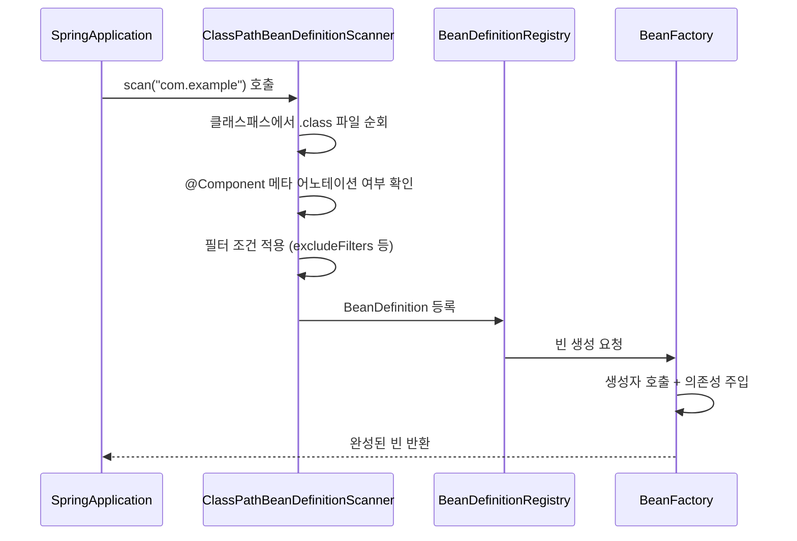
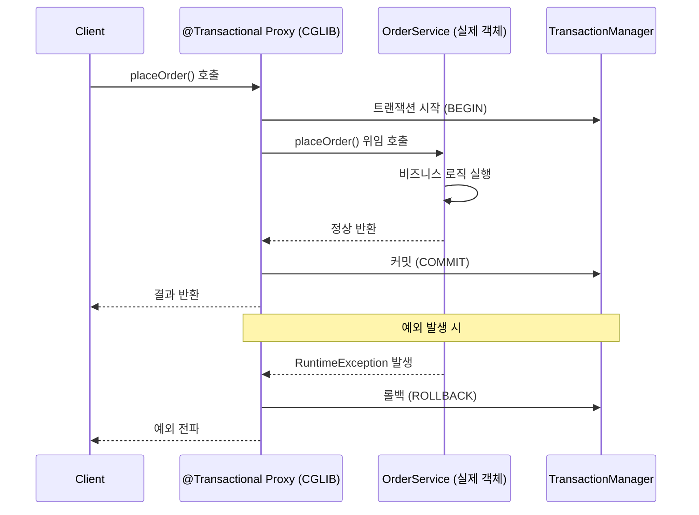
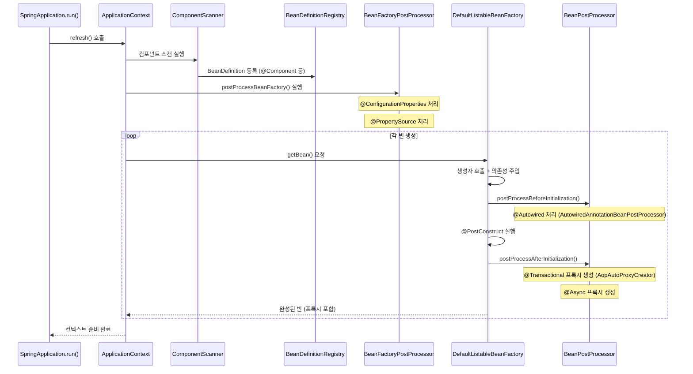
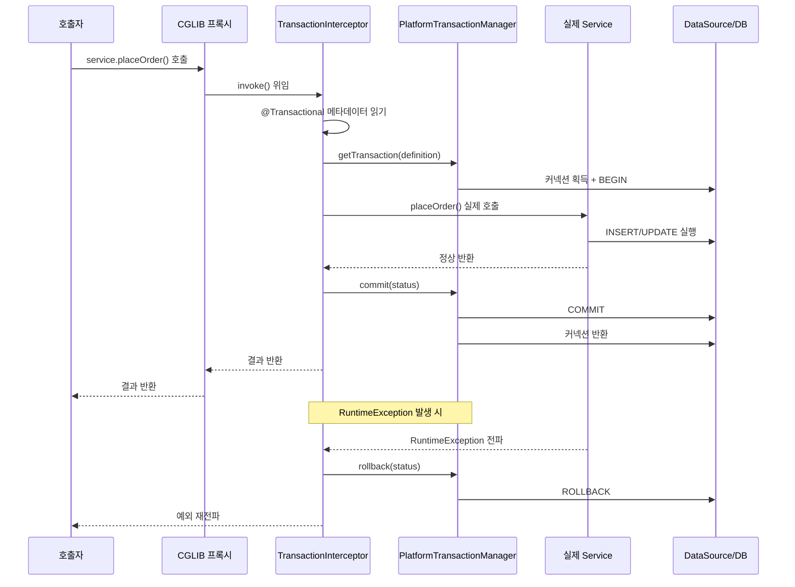

## 왜 어노테이션 동작원리를 알아야 하는가

Spring 어노테이션을 "이렇게 붙이면 된다"고만 알면, 안 될 때 이유를 모릅니다. `@Transactional`을 붙였는데 트랜잭션이 안 걸립니다. `@Cacheable`을 붙였는데 캐시가 안 됩니다. `@Async`를 붙였는데 동기로 실행됩니다. 이 세 가지 문제의 원인은 하나입니다 — **프록시(Proxy)** 동작을 이해하지 못해서입니다.

이 글은 각 어노테이션이 **왜 필요하고**, **내부에서 어떻게 동작하며**, **어떤 함정이 있는가**에 집중합니다. "이렇게 붙이면 된다"는 이미 알고 있다고 가정합니다.

---

## 1. 빈 등록 어노테이션 — 왜 4개로 나뉘어 있는가

### @Component, @Service, @Repository, @Controller의 실제 차이

많은 개발자가 4개 어노테이션을 단순히 "같은 것의 별칭"으로 알고 있습니다. 틀린 말은 아니지만, 절반만 맞습니다. 공통점은 모두 `@Component`를 메타 어노테이션으로 가지므로 컴포넌트 스캔 대상이 됩니다. 그러나 **추가 기능**에서 차이가 있습니다.

**@Repository의 예외 변환:**

```java
@Target({ElementType.TYPE})
@Retention(RetentionPolicy.RUNTIME)
@Documented
@Component
public @interface Repository {
    // @Component의 확장
}
```

`@Repository`가 붙은 클래스는 Spring이 `PersistenceExceptionTranslationPostProcessor`를 통해 JPA, JDBC, Hibernate 등의 기술별 예외를 Spring의 `DataAccessException` 계층으로 자동 변환합니다. `javax.persistence.PersistenceException`이 `org.springframework.dao.DataAccessException`으로 변환됩니다. 왜 이것이 중요한가? Service 레이어가 JPA 예외를 직접 catch하면 JPA에 종속됩니다. `DataAccessException`을 catch하면 기술 독립적입니다.

**@Controller의 뷰 리졸버 연동:**

`@Controller`는 `DispatcherServlet`이 처리할 핸들러로 등록됩니다. 메서드가 `String`을 반환하면 ViewResolver를 통해 뷰 이름으로 처리합니다. `@RestController`는 `@Controller + @ResponseBody`의 조합으로, 반환값을 `HttpMessageConverter`를 통해 JSON/XML로 직렬화합니다.

**@Service:**

현재 Spring 구현상 `@Service`는 `@Component`와 기술적으로 동일합니다. 추가 기능이 없습니다. 그러나 **의도를 표현**합니다 — "이 클래스는 비즈니스 로직을 담당한다." AOP에서 `@Service` 타입을 타겟으로 포인트컷을 작성할 때 의미 있습니다.

### 컴포넌트 스캔 동작원리



컴포넌트 스캔은 `ClassPathBeanDefinitionScanner`가 지정된 베이스 패키지 하위의 모든 `.class` 파일을 읽어 `@Component` 어노테이션(또는 이를 메타 어노테이션으로 가진 어노테이션)이 붙은 클래스를 `BeanDefinition`으로 등록합니다. 이후 `BeanFactory`가 실제 인스턴스를 생성합니다.

`@SpringBootApplication` 하나에 `@ComponentScan`이 포함되어 있습니다. 기본 스캔 패키지는 `@SpringBootApplication`이 붙은 클래스의 패키지입니다. 따라서 **메인 클래스는 항상 최상위 패키지에 위치해야 합니다.** 하위 패키지가 아닌 곳에 있으면 컴포넌트가 스캔되지 않습니다.

---

## 2. 의존성 주입 — 왜 생성자 주입이 최선인가

### @Autowired: 3가지 주입 방식 비교

Spring의 의존성 주입 방식은 필드 주입, Setter 주입, 생성자 주입 세 가지입니다.

```java
// 1. 필드 주입 — 편하지만 문제가 많음
@Service
public class OrderService {
    @Autowired
    private OrderRepository orderRepository;  // 리플렉션으로 직접 주입
}

// 2. Setter 주입 — 선택적 의존성에 적합
@Service
public class OrderService {
    private OrderRepository orderRepository;

    @Autowired
    public void setOrderRepository(OrderRepository orderRepository) {
        this.orderRepository = orderRepository;
    }
}

// 3. 생성자 주입 — 권장
@Service
@RequiredArgsConstructor  // Lombok: final 필드로 생성자 자동 생성
public class OrderService {
    private final OrderRepository orderRepository;  // final — 불변 보장
}
```

**왜 생성자 주입이 최선인가?**

첫째, **불변성(Immutability)**: `final` 키워드로 의존성이 한 번 주입되면 변경 불가능합니다. 스레드 안전성과 예측 가능성이 높아집니다.

둘째, **테스트 용이성**: 생성자로 Mock을 직접 전달할 수 있습니다. Spring 컨텍스트 없이 순수 단위 테스트가 가능합니다.

```java
// 생성자 주입: Spring 없이 테스트 가능
@Test
void placeOrder_success() {
    OrderRepository mockRepo = mock(OrderRepository.class);
    OrderService service = new OrderService(mockRepo);  // 직접 생성
    // 테스트 진행
}

// 필드 주입: Spring 컨텍스트 필요 or 리플렉션 해킹
@Test
void placeOrder_success() {
    // ReflectionTestUtils.setField(service, "orderRepository", mockRepo);
    // 또는 @SpringBootTest로 전체 컨텍스트 로딩
}
```

셋째, **순환 참조 감지**: `OrderService`가 `PaymentService`를 의존하고, `PaymentService`가 `OrderService`를 의존하면 순환 참조입니다. 생성자 주입을 쓰면 Spring 컨텍스트 **시작 시점에** `BeanCurrentlyInCreationException`이 발생합니다. 빠른 실패(Fail Fast)입니다. 필드 주입은 컨텍스트 로딩 시 감지하지 못하고 런타임에 문제가 생길 수 있습니다. (Spring Boot 2.6부터는 순환 참조를 기본 차단합니다.)

### @Qualifier와 @Primary — 같은 타입 빈이 여러 개일 때

```java
public interface NotificationSender {
    void send(String message);
}

@Component("emailSender")
public class EmailNotificationSender implements NotificationSender { ... }

@Component("smsSender")
public class SmsNotificationSender implements NotificationSender { ... }

// @Primary: 기본 빈 지정
@Primary
@Component
public class EmailNotificationSender implements NotificationSender { ... }

// @Qualifier: 특정 빈 지정
@Service
public class NotificationService {
    public NotificationService(@Qualifier("smsSender") NotificationSender sender) {
        this.sender = sender;
    }
}
```

`@Primary`는 "명시적으로 지정하지 않으면 이 빈을 써라"입니다. `@Qualifier`는 "이 빈을 명시적으로 써라"입니다. `@Qualifier`가 `@Primary`보다 우선순위가 높습니다.

---

## 3. @Transactional — 프록시 동작원리와 함정

### AOP 프록시 동작원리



`@Transactional`은 AOP(Aspect-Oriented Programming)로 동작합니다. Spring이 `@Transactional`이 붙은 클래스를 감지하면, 실제 클래스의 **프록시 객체**를 만들어 빈으로 등록합니다. 클라이언트는 프록시와 대화합니다. 프록시가 트랜잭션을 시작하고, 실제 객체에 위임하고, 완료 후 커밋 또는 롤백합니다.

### 왜 같은 클래스 내부 호출에서 @Transactional이 안 먹히는가

```java
@Service
public class OrderService {

    public void processOrder(OrderId id) {
        // 내부 메서드 직접 호출 — 프록시를 거치지 않음!
        this.placeOrder(id);
    }

    @Transactional
    public void placeOrder(OrderId id) {
        // 트랜잭션 적용 의도했지만 실제로는 적용 안 됨
    }
}
```

`processOrder()`는 프록시를 통해 호출됩니다. 그런데 그 안에서 `this.placeOrder()`를 호출하면 `this`는 **실제 객체**를 가리킵니다. 프록시를 우회합니다. `@Transactional` 어노테이션은 있지만 프록시가 개입하지 않으니 트랜잭션이 시작되지 않습니다.

해결책은 두 가지입니다.

첫째, **클래스 분리**: `placeOrder()`를 별도 Service 클래스로 이동합니다. 외부 호출이 되므로 프록시를 거칩니다.

둘째, **Self-injection**: `ApplicationContext`에서 자기 자신을 주입받아 프록시를 통해 호출합니다. 코드가 복잡해지므로 클래스 분리를 권장합니다.

### propagation 옵션별 동작

| 옵션 | 설명 | 언제 쓰는가 |
|------|------|-------------|
| `REQUIRED` (기본값) | 기존 트랜잭션 참여, 없으면 새로 시작 | 대부분의 경우 |
| `REQUIRES_NEW` | 항상 새 트랜잭션 시작 (기존 일시 중단) | 독립적으로 커밋해야 할 때 (감사 로그) |
| `SUPPORTS` | 트랜잭션 있으면 참여, 없으면 없이 실행 | 읽기 전용 조회 |
| `MANDATORY` | 반드시 기존 트랜잭션 내에서만 실행 | 트랜잭션 없이 호출하면 예외 |
| `NEVER` | 트랜잭션 있으면 예외 | 트랜잭션 없이 실행 강제 |
| `NESTED` | 중첩 트랜잭션 (세이브포인트) | 부분 롤백이 필요할 때 |
| `NOT_SUPPORTED` | 트랜잭션 없이 실행 (기존 일시 중단) | 트랜잭션 비용이 큰 배치 |

`REQUIRES_NEW`의 실전 예시: 주문 처리 중 감사 로그를 남겨야 합니다. 주문이 실패해 롤백되어도 감사 로그는 남아야 합니다. `LogService.log()`에 `REQUIRES_NEW`를 붙이면 별도 트랜잭션으로 커밋됩니다.

### rollbackFor 옵션 — 왜 Checked Exception은 기본 롤백이 안 되는가

```java
// 기본: RuntimeException(UncheckedException)만 롤백
@Transactional
public void placeOrder() throws OrderException {
    // OrderException이 Checked Exception이면 롤백 안 됨!
}

// 명시적 지정
@Transactional(rollbackFor = OrderException.class)
public void placeOrder() throws OrderException {
    // 이제 OrderException 발생 시 롤백
}
```

Spring은 EJB 관례를 따라 UncheckedException(RuntimeException 및 하위)은 자동 롤백, CheckedException은 자동 롤백하지 않습니다. CheckedException은 개발자가 명시적으로 처리할 것을 의도한 예외이기 때문입니다. 비즈니스 예외를 Checked Exception으로 정의했다면 `rollbackFor`를 반드시 명시하세요.

### readOnly=true가 왜 성능을 올리는가

```java
@Transactional(readOnly = true)
public List<Order> findOrders(CustomerId customerId) {
    return orderRepository.findByCustomerId(customerId);
}
```

`readOnly = true`는 Hibernate에게 "이 트랜잭션은 조회만 한다"고 알립니다. 그 결과:

1. **Flush 생략**: Hibernate의 더티 체킹(Dirty Checking)은 트랜잭션 종료 시 변경된 엔티티를 DB에 반영합니다. `readOnly = true`이면 변경 감지와 Flush 과정 자체가 생략됩니다.
2. **1차 캐시 스냅샷 미저장**: 더티 체킹을 위해 엔티티 로딩 시 스냅샷을 저장하는데, `readOnly = true`이면 이 스냅샷 저장이 생략됩니다. 메모리 절약입니다.
3. **DB 레플리카 라우팅**: Spring의 `AbstractRoutingDataSource`와 조합하면, `readOnly = true` 트랜잭션을 읽기 전용 레플리카 DB로 자동 라우팅할 수 있습니다.

대량 데이터 조회가 많은 API에서 `readOnly = true`를 붙이는 것만으로 의미 있는 성능 향상이 가능합니다.

---

## 4. @Async — 왜 반환값이 void나 Future여야 하는가

```java
@Configuration
@EnableAsync
public class AsyncConfig implements AsyncConfigurer {

    @Override
    public Executor getAsyncExecutor() {
        ThreadPoolTaskExecutor executor = new ThreadPoolTaskExecutor();
        executor.setCorePoolSize(5);
        executor.setMaxPoolSize(20);
        executor.setQueueCapacity(100);
        executor.setThreadNamePrefix("async-");
        executor.setRejectedExecutionHandler(new ThreadPoolExecutor.CallerRunsPolicy());
        executor.initialize();
        return executor;
    }

    @Override
    public AsyncUncaughtExceptionHandler getAsyncUncaughtExceptionHandler() {
        return (throwable, method, objects) ->
            log.error("Async 예외 발생 — method: {}", method.getName(), throwable);
    }
}

@Service
public class NotificationService {

    // void: 결과 필요 없을 때
    @Async
    public void sendEmail(String email, String content) {
        // 별도 스레드 풀에서 실행
    }

    // CompletableFuture: 결과가 필요하고 논블로킹으로 처리할 때
    @Async
    public CompletableFuture<String> processAsync(String input) {
        String result = heavyProcessing(input);
        return CompletableFuture.completedFuture(result);
    }
}
```

`@Async`도 프록시 기반입니다. 따라서 같은 클래스 내부 호출에서는 동작하지 않습니다. 반환값이 `void`나 `Future`(또는 `CompletableFuture`)여야 하는 이유: 메서드가 별도 스레드에서 비동기 실행되므로 호출자에게 즉시 반환할 값이 없습니다. `void`는 결과를 기다리지 않겠다는 의미이고, `CompletableFuture`는 나중에 결과를 가져오는 핸들을 반환하는 것입니다.

`@Async` 메서드에서 발생한 예외는 호출자에게 전파되지 않습니다. 별도 스레드의 예외이기 때문입니다. `AsyncUncaughtExceptionHandler`를 구현하지 않으면 예외가 **조용히 무시됩니다.** 반드시 예외 핸들러를 등록하세요.

---

## 5. @Scheduled — fixedRate vs fixedDelay vs cron

```java
@Configuration
@EnableScheduling
public class ScheduleConfig {}

@Component
public class BatchScheduler {

    // 이전 실행 시작 시점 기준으로 5초마다 실행
    // 작업이 5초 이상 걸리면 겹쳐서 실행될 수 있음
    @Scheduled(fixedRate = 5000)
    public void fixedRateTask() { }

    // 이전 실행 종료 시점 기준으로 5초 후 실행
    // 작업이 아무리 오래 걸려도 겹치지 않음
    @Scheduled(fixedDelay = 5000)
    public void fixedDelayTask() { }

    // 크론 표현식: 매일 오전 2시
    @Scheduled(cron = "0 0 2 * * *")
    public void dailyTask() { }

    // 초기 지연 + 고정 주기
    @Scheduled(initialDelay = 10000, fixedRate = 5000)
    public void delayedTask() { }
}
```

**fixedRate vs fixedDelay 선택 기준:**

- 작업이 겹쳐 실행되면 안 된다면 → `fixedDelay`
- 정확한 주기로 실행되어야 한다면 → `fixedRate`
- 특정 시각에 실행되어야 한다면 → `cron`

`@Scheduled`는 기본적으로 **단일 스레드**로 실행됩니다. 모든 스케줄링 작업이 하나의 스레드를 공유합니다. 작업 A가 오래 걸리면 작업 B 실행이 지연됩니다. 멀티 스레드가 필요하면 `TaskScheduler` 빈을 별도 설정합니다.

---

## 6. @Cacheable, @CacheEvict, @CachePut — 프록시 함정과 세부 동작

```java
@Configuration
@EnableCaching
public class CacheConfig {
    @Bean
    public CacheManager cacheManager() {
        return new CaffeineCacheManager("products", "orders");
    }
}

@Service
public class ProductService {

    // 캐시 히트: "products" 캐시에서 id에 해당하는 값 반환
    // 캐시 미스: DB 조회 후 캐시에 저장
    @Cacheable(value = "products", key = "#id")
    public Product findById(Long id) {
        return productRepository.findById(id).orElseThrow();
    }

    // 캐시 삭제: 업데이트 후 "products" 캐시에서 id 키 삭제
    @CacheEvict(value = "products", key = "#product.id")
    public void update(Product product) {
        productRepository.save(product);
    }

    // 캐시 갱신: 메서드 실행 후 결과로 캐시 업데이트
    // @Cacheable과 달리 항상 메서드 실행
    @CachePut(value = "products", key = "#product.id")
    public Product refresh(Product product) {
        return productRepository.findById(product.getId()).orElseThrow();
    }

    // allEntries: 해당 캐시의 모든 항목 삭제
    @CacheEvict(value = "products", allEntries = true)
    @Scheduled(cron = "0 0 3 * * *")
    public void clearAllProductCache() { }
}
```

`@Cacheable`도 프록시 기반입니다. 같은 클래스 내부 호출에서 동작하지 않는 이유는 `@Transactional`과 동일합니다.

**condition과 unless로 캐싱 조건 제어:**

```java
// condition: 입력 조건이 맞을 때만 캐싱
@Cacheable(value = "products", key = "#id", condition = "#id > 0")
public Product findById(Long id) { ... }

// unless: 결과 조건이 맞으면 캐싱하지 않음
@Cacheable(value = "products", key = "#id", unless = "#result == null")
public Product findById(Long id) { ... }
```

`null` 결과를 캐싱하는 것은 위험합니다. "데이터가 없다"는 것을 캐싱했다가 데이터가 생겨도 캐시에서 `null`이 반환됩니다. `unless = "#result == null"`로 방어합니다.

---

## 7. @Valid와 @Validated — Bean Validation 동작 흐름

```java
@RestController
@RequestMapping("/api/orders")
@Validated  // 클래스 레벨에서 활성화 (메서드 파라미터 검증 포함)
public class OrderController {

    @PostMapping
    public ResponseEntity<OrderResponse> create(
            @RequestBody @Valid PlaceOrderRequest request) {  // @Valid: 객체 내부 필드 검증
        // ...
    }

    // @PathVariable, @RequestParam 검증 (클래스에 @Validated 필요)
    @GetMapping("/{id}")
    public ResponseEntity<OrderResponse> get(
            @PathVariable @Min(1) Long id) {
        // ...
    }
}

public class PlaceOrderRequest {
    @NotNull(message = "고객 ID는 필수입니다")
    private Long customerId;

    @NotEmpty(message = "주문 항목은 비어 있을 수 없습니다")
    @Size(min = 1, max = 20, message = "주문 항목은 1~20개")
    private List<OrderItemRequest> items;

    @Valid  // 중첩 객체도 검증
    private AddressRequest address;
}
```

`@Valid`와 `@Validated`의 차이:

- `@Valid`는 JSR-303 표준입니다. 객체 내부 필드를 검증합니다. 중첩 객체에 붙이면 재귀 검증합니다.
- `@Validated`는 Spring 전용입니다. 그룹 검증(Validation Groups)을 지원하고, 클래스 레벨에 붙여 메서드 파라미터(`@PathVariable`, `@RequestParam`)도 검증합니다.

Bean Validation 동작 흐름: `HandlerMethodArgumentResolver`가 요청 파라미터를 바인딩할 때, `@Valid`를 감지하면 `javax.validation.Validator`(기본 구현체: Hibernate Validator)를 통해 제약 조건을 검증합니다. 위반 시 `MethodArgumentNotValidException`이 발생하고, `@ExceptionHandler`나 `@ControllerAdvice`에서 처리합니다.

---

## 8. @Configuration과 @Bean — 왜 CGLIB 프록시를 쓰는가

### @Configuration의 CGLIB 프록시

```java
@Configuration
public class AppConfig {

    @Bean
    public OrderService orderService() {
        return new OrderService(orderRepository());  // orderRepository() 호출
    }

    @Bean
    public AuditService auditService() {
        return new AuditService(orderRepository());  // orderRepository() 또 호출
    }

    @Bean
    public OrderRepository orderRepository() {
        return new JpaOrderRepository();  // 매번 new로 생성?
    }
}
```

`orderRepository()`가 두 번 호출됩니다. 그러면 `JpaOrderRepository` 인스턴스가 두 개 생기는 것일까요? 아닙니다. Spring은 `@Configuration` 클래스를 **CGLIB으로 서브클래스화**합니다. CGLIB 프록시 내부에서 `@Bean` 메서드 호출을 가로채, 이미 생성된 빈이 있으면 새로 만들지 않고 기존 빈을 반환합니다. 싱글톤이 보장됩니다.

```java
// 동작 원리 (의사 코드)
class AppConfig$$SpringCGLIB extends AppConfig {
    @Override
    public OrderRepository orderRepository() {
        if (beanFactory.containsBean("orderRepository")) {
            return beanFactory.getBean("orderRepository");  // 기존 빈 반환
        }
        return super.orderRepository();  // 최초 1회만 실제 생성
    }
}
```

`@Configuration(proxyBeanMethods = false)`로 설정하면 CGLIB 프록시를 사용하지 않습니다. 메서드 호출마다 새 인스턴스가 생성됩니다. 빈 간 의존성이 없고 성능을 최적화하려는 경우(ex: `@SpringBootConfiguration`)에 사용합니다.

### @Value vs @ConfigurationProperties

```java
// @Value: 단일 값 바인딩 — 간단한 경우
@Service
public class PaymentService {
    @Value("${payment.api.url}")
    private String apiUrl;

    @Value("${payment.timeout:5000}")  // 기본값 지정
    private int timeout;
}

// @ConfigurationProperties: 관련 속성 그룹 바인딩 — 복잡한 설정
@ConfigurationProperties(prefix = "payment.api")
@Component  // 또는 @EnableConfigurationProperties로 등록
public class PaymentApiProperties {
    private String url;
    private int timeout = 5000;  // Java 코드로 기본값 설정
    private int maxRetries = 3;
    private Duration connectTimeout = Duration.ofSeconds(10);

    // Getter/Setter 필요 (또는 Lombok @Data/@Getter/@Setter)
}
```

`@ConfigurationProperties`가 `@Value`보다 나은 이유:

1. **타입 안전**: `String`을 `Duration`으로, `String`을 `List<String>`으로 자동 변환합니다.
2. **프리픽스 그룹화**: 관련 설정을 클래스로 묶어 관리합니다.
3. **IDE 자동완성**: `spring-boot-configuration-processor`와 함께 쓰면 `application.yml`에서 자동완성이 됩니다.
4. **유효성 검증**: `@Validated` + `@NotNull`, `@Min` 등으로 애플리케이션 시작 시 설정값 검증이 가능합니다.

---

## 9. 빈 등록 흐름 전체 sequenceDiagram



---

## 10. @Transactional 프록시 상세 흐름 sequenceDiagram



---

## 11. 면접 포인트 5가지

### 면접 포인트 1: @Transactional이 같은 클래스 내부 호출에서 동작하지 않는 이유

`@Transactional`은 AOP 프록시를 통해 동작합니다. Spring 컨텍스트에서 빈을 주입받으면 실제 객체가 아닌 프록시 객체입니다. 외부에서 메서드를 호출하면 프록시를 거쳐 트랜잭션이 시작됩니다. 그러나 같은 클래스 내부에서 `this.method()`를 호출하면 `this`는 프록시가 아닌 실제 객체를 가리킵니다. 프록시를 우회하므로 트랜잭션이 적용되지 않습니다. 해결책은 메서드를 별도 빈으로 분리하거나, `ApplicationContext`에서 프록시를 통해 자기 자신을 주입받는 것입니다.

### 면접 포인트 2: @Repository의 예외 변환이 왜 필요한가

JPA, MyBatis, JDBC 각각 고유한 예외 계층이 있습니다. Service 레이어에서 `javax.persistence.PersistenceException`을 직접 catch하면 JPA에 종속됩니다. MyBatis로 교체하면 Service도 수정해야 합니다. `@Repository`가 붙은 클래스에는 `PersistenceExceptionTranslationPostProcessor`가 프록시를 적용해 기술별 예외를 `DataAccessException` 계층으로 통일합니다. Service는 `DataAccessException`만 알면 됩니다. 영속성 기술이 바뀌어도 Service 코드는 변경 불필요합니다.

### 면접 포인트 3: @Configuration 클래스가 CGLIB 프록시를 쓰는 이유

싱글톤 빈의 일관성을 보장하기 위해서입니다. `@Bean` 메서드가 다른 `@Bean` 메서드를 호출할 때, CGLIB 프록시가 이를 가로채 이미 등록된 빈이 있으면 새로 생성하지 않고 기존 인스턴스를 반환합니다. 프록시 없이 `@Bean` 메서드를 직접 호출하면 매번 `new`로 인스턴스가 생성되어 싱글톤이 깨집니다. `@Configuration(proxyBeanMethods = false)`를 쓰면 CGLIB을 생략하지만, 이 경우 `@Bean` 메서드 간 직접 호출은 피해야 합니다.

### 면접 포인트 4: 생성자 주입 vs 필드 주입의 실질적 차이

필드 주입의 문제점은 세 가지입니다. 첫째, `final` 키워드를 쓸 수 없어 의존성이 변경될 위험이 있습니다. 둘째, Spring 없이 단위 테스트 시 Mock 주입이 어렵습니다 — `ReflectionTestUtils.setField()`를 써야 합니다. 셋째, 순환 참조를 시작 시점에 감지하지 못합니다. 생성자 주입은 이 세 문제를 모두 해결합니다. 특히 `@RequiredArgsConstructor`(Lombok)와 함께 쓰면 보일러플레이트 없이 생성자 주입이 가능합니다.

### 면접 포인트 5: @Async 예외가 조용히 사라지는 이유와 해결책

`@Async` 메서드는 별도 스레드에서 실행됩니다. 호출자와 다른 스레드이므로 예외가 호출자 스택으로 전파되지 않습니다. `void` 반환 메서드의 경우 예외가 발생해도 기본적으로 아무 처리 없이 무시됩니다. 해결책은 두 가지입니다. 첫째, `AsyncUncaughtExceptionHandler`를 구현해 등록합니다 — 모든 `void` 반환 `@Async` 메서드의 예외를 처리합니다. 둘째, `CompletableFuture`를 반환하면 `exceptionally()` 체인으로 예외를 처리할 수 있습니다.

---

## 12. 실무 실수 Top 5

**실수 1: @Transactional(readOnly = true)를 쓰기 작업에 적용**

```java
// 나쁜 예: readOnly = true이지만 저장도 함
@Transactional(readOnly = true)
public Order createOrder(PlaceOrderRequest request) {
    Order order = Order.from(request);
    return orderRepository.save(order);  // Flush가 생략되어 실제로 저장 안 될 수 있음
}
```

`readOnly = true` 트랜잭션에서 `save()`를 호출해도 Flush가 생략되어 실제 INSERT가 발생하지 않을 수 있습니다. 읽기와 쓰기 작업을 명확히 구분하세요.

**실수 2: @Async 스레드 풀 미설정**

`@Async`에 별도 `ThreadPoolTaskExecutor`를 설정하지 않으면 기본적으로 `SimpleAsyncTaskExecutor`가 사용됩니다. 이것은 **스레드를 재사용하지 않습니다**. 요청마다 새 스레드를 생성합니다. 트래픽이 몰리면 스레드가 폭발합니다. 반드시 스레드 풀을 명시적으로 설정하세요.

**실수 3: @Cacheable에서 null 결과 캐싱**

데이터가 없어 `null`을 반환하는 메서드에 `@Cacheable`을 붙이면 `null`이 캐시에 저장됩니다. 이후 데이터가 생겨도 캐시에서 `null`을 반환합니다. `unless = "#result == null"` 옵션을 항상 확인하세요.

**실수 4: @Scheduled 단일 스레드 블로킹**

```java
@Scheduled(fixedRate = 1000)
public void fastTask() { /* 0.1초 */ }

@Scheduled(fixedRate = 1000)
public void slowTask() { /* 30초 */ }  // 이 작업이 fastTask도 블로킹
```

기본 스케줄러는 단일 스레드입니다. `slowTask`가 실행 중이면 `fastTask`의 실행이 지연됩니다. `ThreadPoolTaskScheduler`를 `taskScheduler`라는 이름으로 빈 등록하면 Spring이 자동으로 사용합니다.

**실수 5: @Valid와 @Validated 혼용 오해**

`@PathVariable`, `@RequestParam`에 `@NotNull`, `@Min` 같은 제약을 붙여도 클래스에 `@Validated`가 없으면 동작하지 않습니다. `@Valid`는 객체 내부 필드만 검증하고, 메서드 파라미터 자체의 제약은 `@Validated`가 있어야 활성화됩니다. 두 어노테이션의 스코프 차이를 반드시 이해하세요.

---

## 정리

Spring 어노테이션의 대부분은 **프록시 패턴** 위에 구축됩니다. `@Transactional`, `@Async`, `@Cacheable`, `@Validated` — 모두 프록시가 개입해 동작합니다. 따라서 **같은 클래스 내부 호출에서 동작하지 않는다**는 것이 공통 함정입니다.

핵심 원칙 세 가지만 기억하면 됩니다.

첫째, 프록시를 경유해야 어노테이션이 동작합니다. 외부 빈 주입을 통해 호출하세요.

둘째, 어노테이션이 "왜" 필요한지 알면 "언제 쓰면 안 되는지"도 자동으로 알게 됩니다.

셋째, `@Configuration`의 CGLIB, `@Transactional`의 `TransactionInterceptor`, `@Cacheable`의 `CacheInterceptor` — 내부 동작을 알면 예상치 못한 동작을 디버깅할 수 있습니다.
