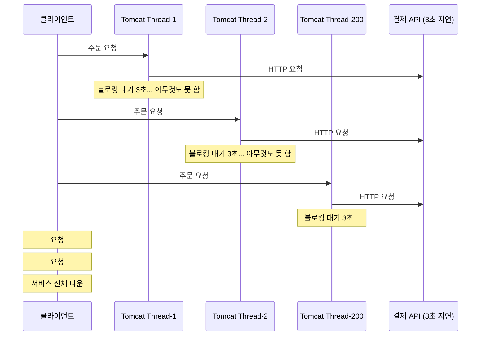
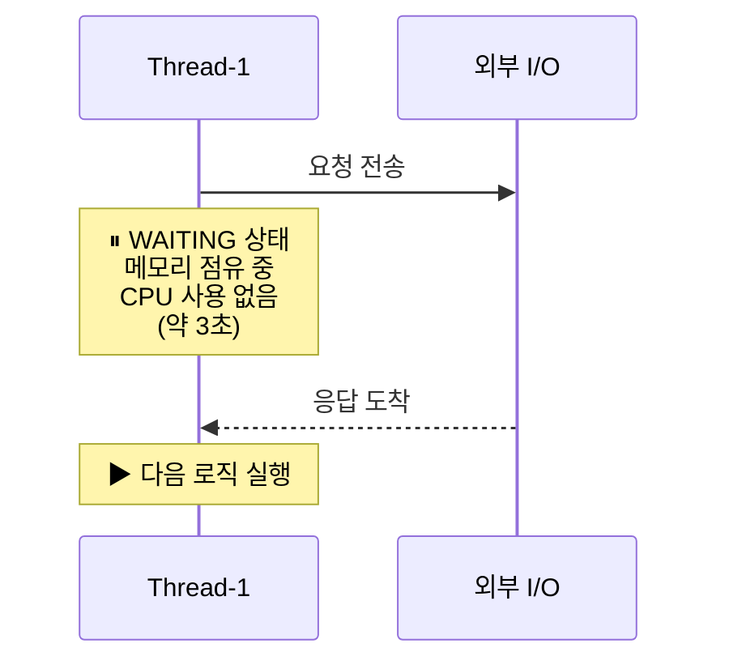
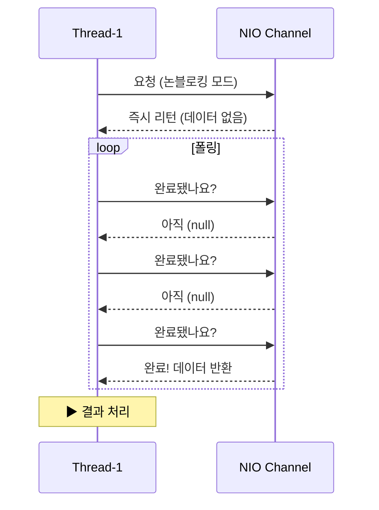
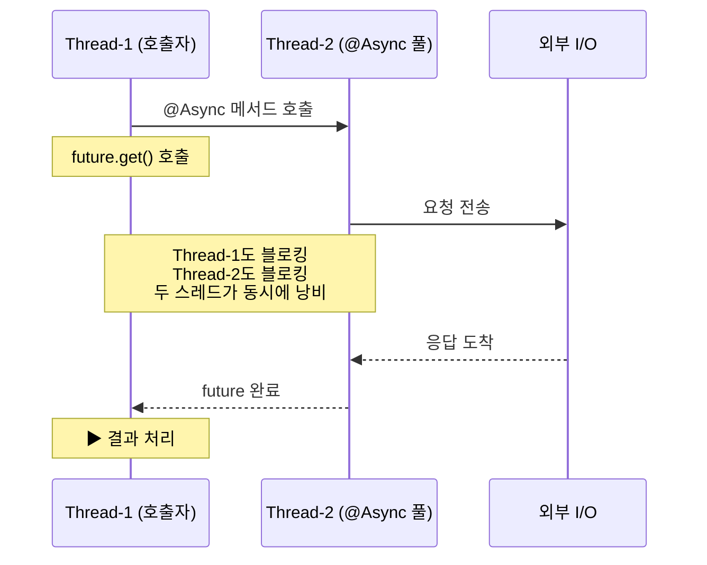
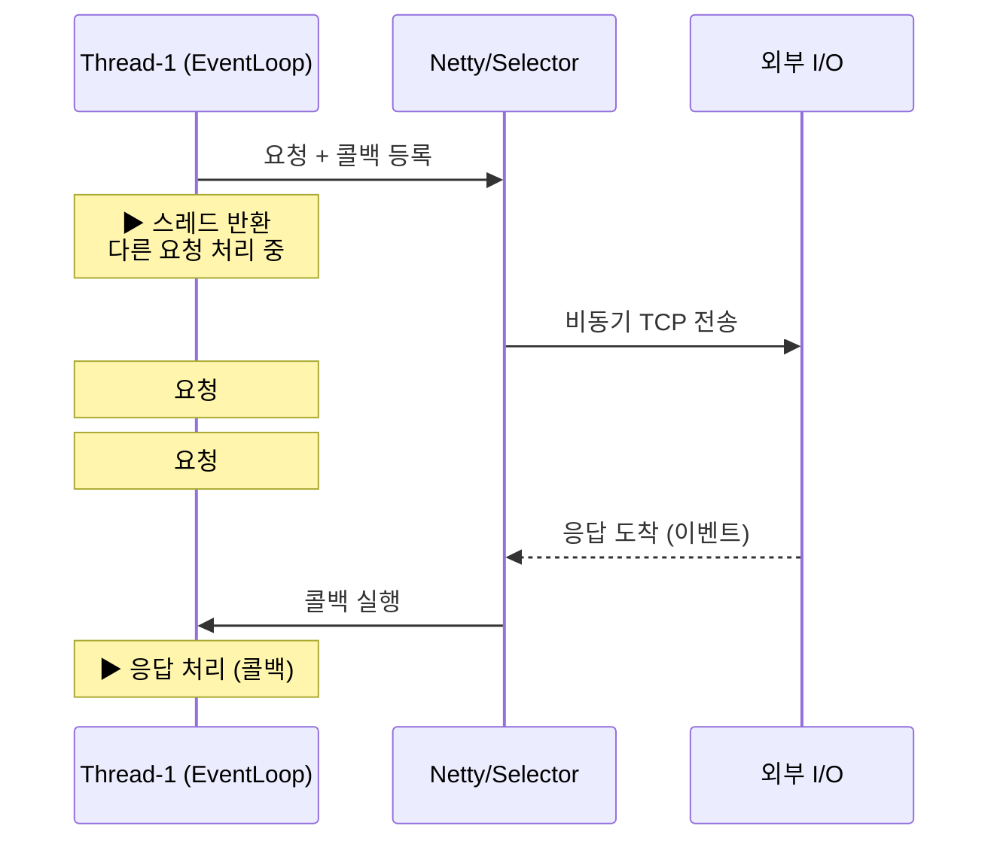
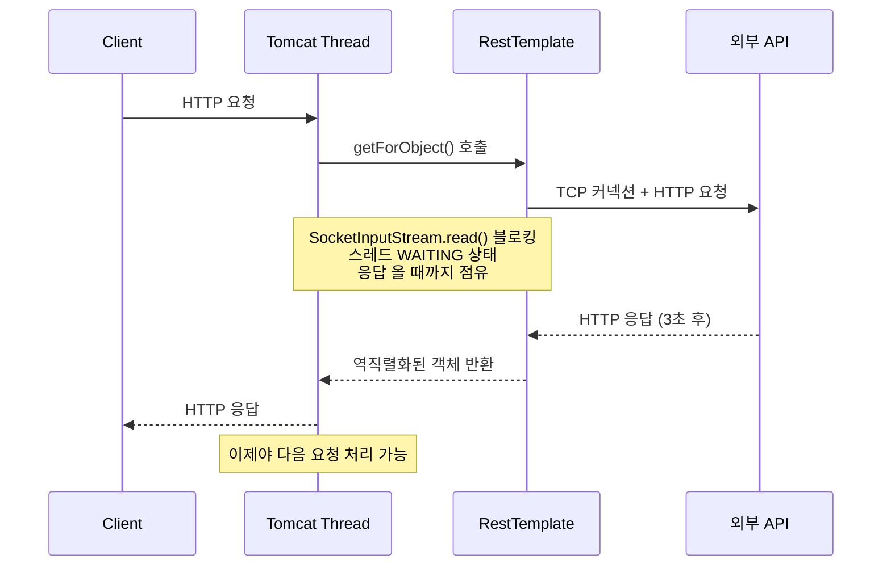
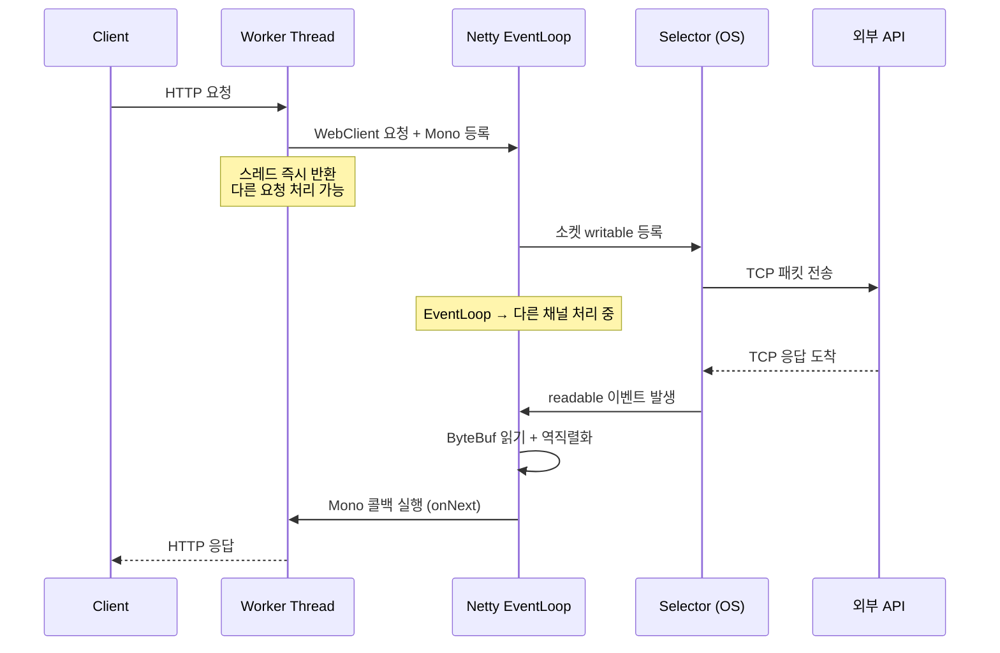
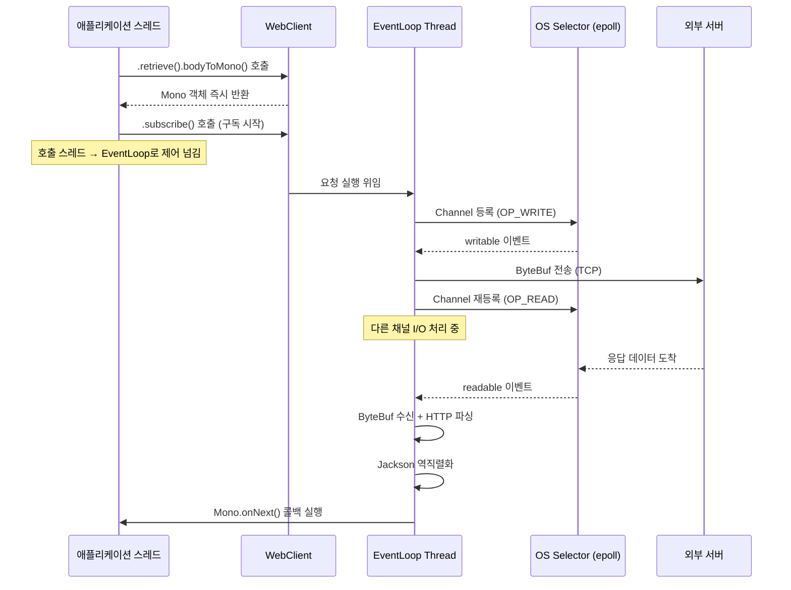
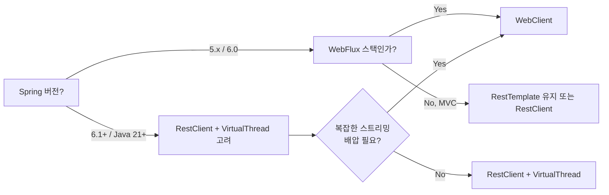

> **비유로 먼저 이해하기**: 음식점에 비유하면, 동기 블로킹은 주방에서 요리가 완성될 때까지 홀 직원이 그 자리에 서서 기다리는 것이다. 비동기 논블로킹은 주문을 넣고 다른 테이블 서빙을 하다가, 주방에서 벨이 울리면 그때 가져가는 것이다. 직원(스레드) 한 명이 처리할 수 있는 테이블 수가 완전히 달라진다.

RestTemplate으로 외부 API를 호출하는 서비스가 있다. 외부 API가 갑자기 3초씩 걸리기 시작했다. Tomcat 스레드 200개가 전부 그 3초를 기다리느라 묶여버렸다. 새 요청은 큐에서 대기하다 타임아웃이 터진다. 서비스 전체가 멈췄다. 이 사고의 근본 원인과 해법을 스레드 수준에서 이해하는 것이 이 글의 목표다.

---

## 1. 실제 사고 — RestTemplate이 서비스를 멈춘 이유

### 사고 재현

운영 중인 주문 서비스가 외부 결제 API를 RestTemplate으로 호출하고 있었다. 평소 결제 API 응답은 200ms였다. 어느 날 결제사 서버 이슈로 응답 시간이 3,000ms로 늘어났다.



스레드 200개가 전부 `InputStream.read()`에서 멈춰있다. 각 스레드는 대기 중에도 스택 메모리(기본 1MB)를 점유한다. 200개 스레드가 동시에 블로킹되면 200MB의 스택이 낭비되고, OS 스케줄러는 아무 일도 안 하는 스레드를 계속 컨텍스트 스위칭한다.

이것이 **동기 블로킹**의 구조적 한계다.

### 핵심 질문 — 스레드는 대기 중에 무엇을 하는가

I/O 대기 중 스레드 상태를 JVM 레벨에서 보면 다음과 같다.

```
java.lang.Thread.State: WAITING (on object monitor)
    at java.net.SocketInputStream.read(SocketInputStream.java)
    at sun.security.ssl.InputRecord.read(InputRecord.java)
    at com.example.OrderService.createOrder(OrderService.java:45)
    at ...
```

`WAITING` 상태다. CPU를 사용하지 않지만, 스레드 자체는 살아있다. OS 커널 입장에서 이 스레드는 **소켓에 데이터가 오면 깨워달라**고 등록된 상태다. 데이터가 오기 전까지 스케줄링 대상에서 제외되지만, 커널 자료구조에는 계속 존재한다.

문제는 스레드 수가 많아질수록 이 "잠자는 스레드"들이 메모리를 점유하고, 깨어났을 때 컨텍스트 스위칭 비용을 발생시킨다는 것이다.

---

## 2. 4가지 조합의 근본 원리 — 스레드 관점

동기/비동기, 블로킹/논블로킹은 서로 독립적인 개념이다. 조합하면 4가지가 나온다. 각각을 **스레드가 시간을 어떻게 쓰는가**로 이해하는 것이 핵심이다.

### 동기 + 블로킹 (Synchronous Blocking)

**스레드가 요청을 보내고 응답이 올 때까지 아무것도 하지 않고 대기한다.** 응답이 오면 그 자리에서 다음 줄을 실행한다.



스레드 타임라인으로 보면 다음과 같다.

```
Thread-1: [요청]──────────────[블로킹 3초 대기]──────────[응답 처리]
Thread-2:                     기다리는 중 (큐)
Thread-3:                     기다리는 중 (큐)
```

대표 기술: `RestTemplate`, `JDBC`, `File I/O`, `Thread.sleep()`

**왜 문제인가**: 스레드가 대기 중에도 OS 커널 자료구조(Task Control Block)에 존재한다. 스택 메모리(기본 1MB)를 점유한다. 스레드 수 = 동시 처리 가능 요청 수라는 상한이 생긴다.

### 동기 + 논블로킹 (Synchronous Non-Blocking)

**스레드가 요청을 보내고 즉시 리턴된다.** 작업이 완료됐는지 스레드가 직접 주기적으로 확인(폴링)한다. 완료됐으면 결과를 처리한다.



스레드 타임라인으로 보면 다음과 같다.

```
Thread-1: [요청]→[폴링]→[폴링]→[폴링]→[폴링]→[폴링]→[완료 처리]
              ↑ CPU 낭비 — 계속 물어보는 중
```

대표 기술: Java NIO `Channel.read()` (non-blocking mode) + 수동 폴링, `Selector` 없이 쓰는 NIO

**왜 비효율인가**: 폴링 루프 자체가 CPU를 소모한다. 폴링 간격을 늘리면 지연이 생기고, 줄이면 CPU를 낭비한다. 실무에서 이 조합을 직접 쓰는 경우는 거의 없다. `Selector`를 쓰면 이벤트 기반으로 전환되어 비동기 논블로킹으로 넘어간다.

### 비동기 + 블로킹 (Asynchronous Blocking)

**별도 스레드에서 작업을 시작하지만, 결과를 받기 위해 호출 스레드가 블로킹 대기한다.**



스레드 타임라인으로 보면 다음과 같다.

```
Thread-1: [future.get() 블로킹]────────────────[완료]
Thread-2: ──────[요청]──[블로킹 대기]──[응답]──
```

대표 기술: `@Async` 메서드 후 `.get()` 대기, `ExecutorService.submit().get()`, `Future.get()`

**왜 무의미한가**: 비동기로 작업을 시작했지만 결과를 `.get()`으로 기다리는 순간 호출 스레드가 블로킹된다. 스레드 2개가 낭비되는 순수한 동기 블로킹보다 오히려 나쁘다. 이 조합은 실수로 발생하는 경우가 많다.

### 비동기 + 논블로킹 (Asynchronous Non-Blocking)

**요청을 보내고 콜백/리액터 체인을 등록한 뒤 스레드가 즉시 반환된다.** 응답이 오면 이벤트로 콜백이 실행된다. 호출 스레드는 그 사이에 다른 요청을 처리한다.



스레드 타임라인으로 보면 다음과 같다.

```
Thread-1: [요청A]→[요청B]→[요청C]→[콜백A]→[요청D]→[콜백B]→[콜백C]
              ↑ 스레드 1개가 수천 요청을 처리
```

대표 기술: `WebClient`, `CompletableFuture.thenApply()`, Netty EventLoop, Node.js

**왜 최적인가**: 스레드가 I/O를 기다리는 시간이 없다. CPU 코어 수만큼의 스레드로 수만 개의 동시 요청을 처리할 수 있다. 스레드 수가 동시 처리 상한이 아니라, I/O 대역폭이 상한이 된다.

### 4가지 종합 비교

| 조합 | 스레드 상태 (대기 중) | 동시 처리 | 코드 복잡도 | 대표 기술 |
|------|-------------------|:---------:|:-----------:|-----------|
| 동기 + 블로킹 | WAITING (점유) | 낮음 (스레드 수) | 낮음 | RestTemplate, JDBC |
| 동기 + 논블로킹 | RUNNABLE (폴링) | 중간 (CPU 낭비) | 높음 | NIO 수동 폴링 |
| 비동기 + 블로킹 | WAITING (두 스레드) | 낮음 (더 나쁨) | 중간 | Future.get() |
| 비동기 + 논블로킹 | 없음 (반환됨) | 높음 (I/O 대역폭) | 높음 | WebClient, Netty |

실무에서 실제로 선택하는 조합은 **동기 블로킹**과 **비동기 논블로킹** 두 가지다. 나머지는 이해를 위한 분류이거나 실수로 빠지는 함정이다.

---

## 3. RestTemplate vs WebClient vs RestClient — 스레드 모델 차이

### RestTemplate (동기 블로킹)

RestTemplate의 내부 구현을 따라가면 결국 `InputStream.read()`에서 멈춘다.

```
RestTemplate.getForObject()
  → execute()
  → doExecute()
  → ClientHttpRequest.execute()   // SimpleClientHttpRequestFactory 또는 HttpClient
  → HttpURLConnection.getInputStream()
  → SocketInputStream.read()      // ← 여기서 블로킹 (응답 올 때까지)
```



**Tomcat 스레드 풀이 동시 처리 상한이다.** `server.tomcat.threads.max`(기본 200)가 곧 서비스 동시 처리 능력이다. 외부 API가 느려지면 그 상한이 순식간에 채워진다.

```java
// RestTemplate — 동기 블로킹 코드
@Service
public class UserService {
    private final RestTemplate restTemplate;

    public User getUser(Long id) {
        // 이 줄에서 스레드가 블로킹됨 — 응답 올 때까지 반환 안 됨
        return restTemplate.getForObject(
            "https://api.example.com/users/{id}", User.class, id
        );
    }
}
```

### WebClient (비동기 논블로킹)

WebClient의 내부는 Reactor Netty 위에서 동작한다. 스레드가 소켓을 직접 기다리지 않고, Netty의 EventLoop가 소켓 이벤트를 관리한다.

```
WebClient.get().uri(...).retrieve().bodyToMono()
  → ExchangeFunction.exchange()
  → reactor.netty.http.client.HttpClient.send()
    → EventLoop Thread로 전환
    → Netty Channel에 요청 ByteBuf 쓰기
    → Selector가 소켓 writable 감지 → 커널이 TCP 전송
  → 호출 스레드 반환 (Mono 객체 리턴)
  → [나중에] Selector가 소켓 readable 감지
    → EventLoop가 ByteBuf 읽기
    → Jackson 역직렬화
  → Mono.subscribe() 콜백 실행
```



**EventLoop 스레드 4개(CPU 코어 수)가 수천 개의 동시 연결을 처리한다.** 소켓 하나당 스레드 하나가 필요 없다. OS의 `epoll`(Linux) 또는 `kqueue`(macOS) 시스템 콜로 수천 개 소켓을 단일 스레드에서 감시한다.

```java
// WebClient — 비동기 논블로킹 코드
@Service
public class UserService {
    private final WebClient webClient;

    public Mono<User> getUser(Long id) {
        // 이 줄은 즉시 반환됨 — Mono는 "나중에 올 값의 약속"
        return webClient.get()
            .uri("/users/{id}", id)
            .retrieve()
            .bodyToMono(User.class);
        // 실제 HTTP 요청은 subscribe() 시점에 발생
    }
}
```

**왜 `.block()`을 쓰면 안 되는가**: WebFlux 환경에서 `Mono.block()`을 호출하면 EventLoop 스레드가 블로킹된다. EventLoop 스레드가 멈추면 그 스레드가 담당하는 모든 소켓의 I/O가 전부 멈춘다. CPU 코어 수만큼의 EventLoop가 전부 블로킹되면 서비스 전체가 데드락에 빠진다.

```java
// 절대 금지 — EventLoop 스레드에서 block() 호출
webClient.get().uri("/users/1").retrieve()
    .bodyToMono(User.class)
    .block(); // ← EventLoop를 블로킹시킴 → 전체 서버 마비 위험
```

### RestClient (Spring 6.1+ — 동기 + Virtual Thread)

Spring 6.1에서 도입된 `RestClient`는 WebClient와 유사한 fluent API를 제공하지만, 내부는 동기 블로킹이다. Java 21의 Virtual Thread와 함께 사용할 때 의미가 있다.

```java
// RestClient — WebClient와 비슷한 API지만 동기
@Service
public class UserService {
    private final RestClient restClient;

    public User getUser(Long id) {
        return restClient.get()
            .uri("/users/{id}", id)
            .retrieve()
            .body(User.class); // 여기서 동기 블로킹
    }
}
```

**Virtual Thread와 조합하면 왜 WebClient 없이도 되는가**: Virtual Thread(가상 스레드)는 JVM이 관리하는 경량 스레드다. OS 커널 스레드가 아닌 JVM 내부의 스케줄러로 동작한다. Virtual Thread가 블로킹 I/O를 만나면, JVM이 해당 Virtual Thread를 중단하고 캐리어 스레드(실제 OS 스레드)를 다른 Virtual Thread에 할당한다. OS 커널 입장에서는 블로킹이 발생하지 않는다.

```
Virtual Thread #1 → SocketInputStream.read() (블로킹 진입)
  → JVM: "이 Virtual Thread park, 캐리어 스레드 다른 VT에 줌"
캐리어 스레드 → Virtual Thread #2 실행
...
소켓 데이터 도착 → JVM: "Virtual Thread #1 unpark"
캐리어 스레드 → Virtual Thread #1 재개
```

결과적으로 단순한 동기 블로킹 코드가 논블로킹처럼 동작한다. 단, Reactor 체인의 복잡성이 없다. 코드 가독성이 훨씬 높아진다.

| 구분 | RestTemplate | WebClient | RestClient + VirtualThread |
|------|-------------|-----------|---------------------------|
| 코드 스타일 | 동기 | 비동기 (Reactor) | 동기 |
| 내부 동작 | OS 스레드 블로킹 | Netty EventLoop | JVM VT 블로킹 |
| 동시 처리 | 스레드 수 제한 | I/O 대역폭 제한 | VT 수 (사실상 무제한) |
| 학습 곡선 | 낮음 | 높음 | 낮음 |
| Spring 지원 | Deprecated 방향 | 현역 | Spring 6.1+ |

---

## 4. WebClient 내부 동작원리 — 요청부터 응답까지

WebClient가 실제로 어떤 경로로 요청을 처리하는지 추적한다.

### 레이어별 흐름


각 레이어의 역할은 다음과 같다.

- **WebClient**: 선언적 API 레이어. URI, 헤더, 바디를 조립한다.
- **ExchangeFunction**: 요청 실행 전후에 필터 체인을 적용한다. 로깅, 인증 토큰 주입 등이 여기서 처리된다.
- **ReactorClientHttpConnector**: WebClient와 Reactor Netty를 연결하는 어댑터다.
- **Reactor Netty HttpClient**: Netty 기반 HTTP 클라이언트. 커넥션 풀 관리, HTTP/1.1-HTTP/2 핸드쉐이크를 담당한다.
- **Netty EventLoop**: 단일 스레드 이벤트 루프. 할당된 채널들의 I/O 이벤트를 처리한다.
- **Java NIO Selector**: OS의 `epoll`/`kqueue`를 Java에서 사용하는 인터페이스.
- **OS epoll**: 수천 개 파일 디스크립터를 단일 시스템 콜로 감시하는 OS 기능.

### 단계별 스레드 전환



핵심은 **애플리케이션 스레드가 EventLoop에 요청을 위임하고 즉시 반환**된다는 것이다. 응답이 오면 EventLoop가 콜백을 실행한다. 애플리케이션 스레드와 EventLoop 스레드 간의 제어 흐름 전환이 논블로킹의 핵심이다.

### Mono/Flux 체인이 어떤 스레드에서 실행되는가

아무 설정이 없으면 WebClient의 Mono 체인은 **Netty의 EventLoop 스레드**에서 실행된다.

```java
webClient.get().uri("/users/1")
    .retrieve()
    .bodyToMono(User.class)
    .map(user -> {
        // 여기는 EventLoop 스레드에서 실행
        // ⚠️ 블로킹 작업 절대 금지
        return user.getName().toUpperCase(); // 빠른 CPU 작업은 OK
    })
    .subscribe(name -> {
        // 여기도 EventLoop 스레드 (또는 publishOn으로 전환된 스레드)
        System.out.println("결과: " + name);
    });
```

---

## 5. subscribeOn vs publishOn — 스레드 전환의 핵심

Reactor의 스레드 전환 연산자 두 가지가 있다. 역할이 다르므로 정확히 구분해야 한다.

| 연산자 | 역할 | 영향 범위 |
|--------|------|----------|
| `subscribeOn(Scheduler)` | 구독 시점에 실행될 스레드 지정 | **전체 체인** (위쪽으로 전파) |
| `publishOn(Scheduler)` | 이후 연산자가 실행될 스레드 지정 | **아래쪽만** (선언 이후) |

### 스케줄러 종류

| 스케줄러 | 스레드 풀 특성 | 용도 |
|---------|-------------|------|
| `Schedulers.boundedElastic()` | 탄력적 스레드 풀 (최대 10 * CPU코어) | 블로킹 I/O (JDBC, 파일) |
| `Schedulers.parallel()` | 고정 스레드 풀 (CPU 코어 수) | CPU 집약 작업 |
| `Schedulers.single()` | 단일 스레드 | 직렬 처리 필요 시 |
| `Schedulers.immediate()` | 현재 스레드 | 전환 없음 |

### 코드로 보는 스레드 전환 추적

```java
Mono.just("데이터")
    .map(data -> {
        // [1] main 스레드 (subscribeOn 없으면 호출 스레드)
        log.info("map-1: {}", Thread.currentThread().getName());
        return data.toUpperCase();
    })
    .publishOn(Schedulers.parallel())      // ← 여기서부터 parallel 스레드
    .map(data -> {
        // [2] parallel-1 스레드 (publishOn 이후)
        log.info("map-2: {}", Thread.currentThread().getName());
        return data + "_PROCESSED";
    })
    .subscribeOn(Schedulers.boundedElastic()) // ← 구독 시점 스레드 전환 (위로 전파)
    .map(data -> {
        // [3] boundedElastic-1 스레드 (subscribeOn이 [1]에도 영향)
        // ※ subscribeOn은 체인 어디에 있어도 구독 시점을 바꿈
        log.info("map-3: {}", Thread.currentThread().getName());
        return data;
    })
    .subscribe();

// 출력:
// map-1: boundedElastic-1   ← subscribeOn이 소급 적용
// map-2: parallel-1          ← publishOn 이후
// map-3: parallel-1          ← publishOn 영향 계속
```

**`subscribeOn`은 체인 어디에 선언해도 구독이 시작되는 스레드를 바꾼다.** 여러 번 선언하면 첫 번째 것만 유효하다. **`publishOn`은 선언 위치 이후의 연산자 스레드를 바꾼다.** 여러 번 선언할 수 있고, 각각 독립적으로 동작한다.

### 왜 DB 접근은 boundedElastic, CPU 작업은 parallel인가

**boundedElastic**: JDBC, 파일 I/O처럼 스레드가 블로킹되는 작업에 사용한다. 스레드 풀이 탄력적으로 늘어나므로(최대 10 * CPU코어 수) 블로킹 스레드가 많아도 다른 스레드가 대기하지 않는다. 단, 무한정 늘어나지 않아 리소스 보호도 된다.

**parallel**: 수학 연산, 데이터 변환 등 CPU를 적극 사용하는 작업에 사용한다. CPU 코어 수와 같은 고정 크기 스레드 풀이므로 오버헤드 없이 CPU를 최대로 활용한다. 블로킹 작업을 여기서 하면 EventLoop처럼 전체 풀이 블로킹될 수 있다.

---

## 6. 실전 패턴

### 패턴 1: 여러 외부 API 동시 호출 (Mono.zip)

순서가 없는 여러 API를 동시에 호출하고 결과를 합산할 때 사용한다. 직렬 호출이면 응답 시간이 합산되지만, `Mono.zip`은 가장 느린 것 기준으로 응답한다.

```java
// ❌ 직렬 호출 — 총 3초 (각 1초 + 1초 + 1초)
User user = webClient.get().uri("/api/user").retrieve().bodyToMono(User.class).block();
Order order = webClient.get().uri("/api/order").retrieve().bodyToMono(Order.class).block();
Product product = webClient.get().uri("/api/product").retrieve().bodyToMono(Product.class).block();

// ✅ 병렬 호출 — 총 1초 (세 요청 동시 발사)
Mono<AggregatedResponse> result = Mono.zip(
    webClient.get().uri("/api/user").retrieve().bodyToMono(User.class),
    webClient.get().uri("/api/order").retrieve().bodyToMono(Order.class),
    webClient.get().uri("/api/product").retrieve().bodyToMono(Product.class)
).map(tuple -> new AggregatedResponse(
    tuple.getT1(),  // User
    tuple.getT2(),  // Order
    tuple.getT3()   // Product
));
```

`Mono.zip`은 내부적으로 세 Mono를 동시에 구독한다. 세 응답이 모두 도착하면 `map` 람다가 실행된다. 가장 느린 응답 하나가 전체를 지연시킨다.

### 패턴 2: 타임아웃 + 폴백

외부 API가 느릴 때 무한정 기다리지 않고, 일정 시간 후 대체 응답을 반환한다.

```java
webClient.get()
    .uri("/api/recommendation")
    .retrieve()
    .bodyToMono(List.class)
    .timeout(Duration.ofSeconds(1))         // 1초 초과 시 TimeoutException
    .onErrorReturn(TimeoutException.class, Collections.emptyList())  // 폴백: 빈 리스트
    .onErrorResume(WebClientResponseException.class, ex -> {
        if (ex.getStatusCode().is5xxServerError()) {
            return getCachedRecommendation(); // 서버 오류 시 캐시 반환
        }
        return Mono.error(ex);              // 4xx는 그대로 전파
    });
```

타임아웃은 Reactor 레벨(위 코드)과 Netty 커넥션 레벨을 모두 설정해야 완전하다. Reactor 타임아웃은 응답 스트림 전체에, Netty 타임아웃은 소켓 레벨에 적용된다.

```java
// WebClient 빈 설정 — Netty 수준 타임아웃
@Bean
public WebClient webClient() {
    HttpClient httpClient = HttpClient.create()
        .option(ChannelOption.CONNECT_TIMEOUT_MILLIS, 3000)   // 커넥션 타임아웃
        .responseTimeout(Duration.ofSeconds(5))                 // 응답 타임아웃
        .doOnConnected(conn ->
            conn.addHandlerLast(new ReadTimeoutHandler(5, TimeUnit.SECONDS))
                .addHandlerLast(new WriteTimeoutHandler(5, TimeUnit.SECONDS)));

    return WebClient.builder()
        .clientConnector(new ReactorClientHttpConnector(httpClient))
        .baseUrl("https://api.example.com")
        .build();
}
```

### 패턴 3: WebClient에서 블로킹 DB 접근

WebFlux 환경에서 JDBC처럼 블로킹 API를 호출해야 할 때, EventLoop 스레드를 보호하면서 처리하는 방법이다.

```java
// ❌ 잘못된 방법 — EventLoop 스레드에서 직접 JDBC 호출
webClient.get().uri("/users/1")
    .retrieve()
    .bodyToMono(User.class)
    .flatMap(user -> {
        // EventLoop 스레드에서 JDBC 호출 → EventLoop 블로킹
        List<Order> orders = jdbcTemplate.query(...); // 위험!
        return Mono.just(orders);
    });

// ✅ 올바른 방법 — boundedElastic 스레드로 블로킹 작업 격리
webClient.get().uri("/users/1")
    .retrieve()
    .bodyToMono(User.class)
    .flatMap(user ->
        Mono.fromCallable(() -> jdbcTemplate.query(
            "SELECT * FROM orders WHERE user_id = ?",
            orderRowMapper,
            user.getId()
        ))
        .subscribeOn(Schedulers.boundedElastic()) // 블로킹을 별도 풀에서 실행
    );
```

`Mono.fromCallable()`은 블로킹 코드를 Mono로 감싸는 방법이다. `subscribeOn(Schedulers.boundedElastic())`으로 실제 실행 스레드를 블로킹 전용 풀로 지정한다. EventLoop 스레드는 이 Mono의 완료 이벤트만 받는다.

### 패턴 4: 재시도 (retry with backoff)

일시적 장애에 대해 점진적으로 간격을 늘리며 재시도한다.

```java
webClient.get().uri("/api/data")
    .retrieve()
    .bodyToMono(Data.class)
    .retryWhen(Retry.backoff(3, Duration.ofMillis(500))  // 최대 3회, 첫 500ms
        .maxBackoff(Duration.ofSeconds(5))               // 최대 5초 간격
        .filter(ex -> ex instanceof WebClientRequestException)); // 네트워크 오류만 재시도
```

---

## 7. 극한 시나리오 3개

### 시나리오 1 — WebClient에서 `.block()` 호출 → EventLoop 데드락

WebFlux 환경에서 `@Service` 빈이 다음과 같이 작성됐다.

```java
// 위험한 코드 — 실제 운영에서 발생하는 패턴
@Service
public class ReportService {
    private final WebClient webClient;

    public Report generateReport() {
        // WebFlux 요청 핸들러에서 이 메서드를 호출하면...
        User user = webClient.get().uri("/api/user")
            .retrieve()
            .bodyToMono(User.class)
            .block(); // ← 여기서 현재 스레드를 블로킹

        // block()을 호출한 스레드가 EventLoop 스레드라면?
        // EventLoop가 멈춤 → 응답을 받을 수단이 없음 → 무한 대기
        return new Report(user);
    }
}
```

**발생 과정**: WebFlux 요청 핸들러 → EventLoop 스레드에서 실행 → `block()` 호출 → EventLoop 스레드 블로킹 → Netty가 소켓 응답을 처리할 스레드 없음 → `block()`이 기다리는 응답이 영원히 오지 않음 → 데드락.

**해법**: `block()`을 제거하고 flatMap으로 체인을 이어가거나, 반드시 필요하다면 `Schedulers.boundedElastic()`에서 실행되도록 격리한다.

```java
// 수정 — block() 없이 체인
public Mono<Report> generateReport() {
    return webClient.get().uri("/api/user")
        .retrieve()
        .bodyToMono(User.class)
        .map(user -> new Report(user));
}
```

### 시나리오 2 — 외부 API 10초 지연 → RestTemplate vs WebClient 결과 비교

결제 API가 10초 응답 지연 상태에서 초당 50개 요청이 들어오는 상황이다.

**RestTemplate 결과**:

```
0초:   요청 1~50 처리 시작 (스레드 50개 블로킹)
2초:   요청 51~100 처리 시작 (스레드 100개 블로킹)
4초:   요청 101~150 처리 시작 (스레드 150개 블로킹)
6초:   요청 151~200 처리 시작 (스레드 200개 블로킹, 풀 고갈)
8초:   요청 301~350 → 큐 대기
10초:  요청 1~50 완료, 스레드 해방 → 큐에서 꺼냄
       그러나 큐에 쌓인 요청 수백 개가 이미 타임아웃
결과:  서비스 사실상 중단. 실질 처리량 0에 수렴.
```

**WebClient 결과**:

```
0초:   요청 1~50 EventLoop에 등록 (스레드 반환)
2초:   요청 51~100 EventLoop에 등록 (스레드 반환)
10초:  요청 1~50 응답 도착, 콜백 처리
10초:  계속해서 다른 요청 처리 중
결과:  모든 요청이 10초에 응답. 서비스 정상 동작.
       (단, 타임아웃 설정이 없으면 메모리에 Mono 누적 → OOM 가능)
```

WebClient도 타임아웃 없이 10초짜리 요청이 무한정 쌓이면 메모리 부족(OOM)이 발생할 수 있다. 반드시 타임아웃을 설정해야 한다.

### 시나리오 3 — subscribeOn 없이 JDBC 호출 → EventLoop 블로킹

WebFlux 컨트롤러에서 JDBC를 직접 호출하는 코드가 배포됐다.

```java
@GetMapping("/users/{id}/full-profile")
public Mono<FullProfile> getFullProfile(@PathVariable Long id) {
    return webClient.get().uri("/external/profile/{id}", id)
        .retrieve()
        .bodyToMono(ExternalProfile.class)
        .flatMap(profile -> {
            // subscribeOn 없이 JDBC 호출
            // 이 flatMap 람다는 Netty EventLoop 스레드에서 실행됨
            UserDetail detail = jdbcTemplate.queryForObject(
                "SELECT * FROM user_detail WHERE id = ?",
                userDetailMapper,
                id
            ); // ← EventLoop 스레드가 JDBC 응답 올 때까지 블로킹
            return Mono.just(new FullProfile(profile, detail));
        });
}
```

**증상**: CPU 코어 4개 서버에서 EventLoop 스레드 4개가 전부 JDBC 대기로 블로킹됨. 모든 WebClient 요청/응답이 멈춤. 서버는 살아있지만 아무 응답도 못 함.

**해법**:

```java
.flatMap(profile ->
    Mono.fromCallable(() -> jdbcTemplate.queryForObject(...))
        .subscribeOn(Schedulers.boundedElastic())  // JDBC를 별도 풀로 분리
        .map(detail -> new FullProfile(profile, detail))
)
```

---

## 8. 면접 포인트 5개

### 면접 포인트 1 — 동기/비동기, 블로킹/논블로킹 차이를 스레드 관점에서 설명하라

**모범 답안**: 동기/비동기는 호출자가 결과를 직접 받느냐(동기), 나중에 통보받느냐(비동기)의 차이다. 블로킹/논블로킹은 호출 후 스레드가 대기하느냐(블로킹), 즉시 반환되느냐(논블로킹)의 차이다. 두 개념은 독립적이므로 4가지 조합이 가능하다. 실무에서 중요한 것은 비동기 논블로킹으로, I/O 대기 중 스레드가 반환되어 다른 요청을 처리할 수 있다.

### 면접 포인트 2 — WebClient가 스레드 4개로 수천 동시 요청을 처리하는 원리

**모범 답안**: Netty의 EventLoop 스레드가 OS의 `epoll`(Linux)을 사용해 수천 개 소켓을 단일 스레드에서 감시한다. 소켓에 이벤트가 발생했을 때만 처리하므로 소켓당 스레드가 필요 없다. EventLoop 스레드 수는 CPU 코어 수와 같게 설정하는 것이 일반적이다. I/O 대기는 OS 커널이 담당하고, EventLoop는 이벤트 발생 시에만 실행된다.

### 면접 포인트 3 — WebClient에서 `.block()`을 호출하면 안 되는 이유

**모범 답안**: WebFlux의 Mono 체인은 Netty EventLoop 스레드에서 실행된다. EventLoop 스레드에서 `block()`을 호출하면 해당 스레드가 블로킹된다. Netty는 이 EventLoop가 담당하는 소켓들의 I/O를 더 이상 처리하지 못한다. `block()`이 기다리는 응답도 같은 EventLoop가 처리해야 하므로 데드락이 발생한다. CPU 코어 수만큼의 EventLoop가 전부 블로킹되면 서버 전체가 멈춘다.

### 면접 포인트 4 — subscribeOn과 publishOn의 차이

**모범 답안**: `subscribeOn`은 체인 어디에 선언해도 구독이 시작되는 스레드를 변경하며, 체인 전체에 소급 적용된다. 여러 번 선언해도 첫 번째 것만 유효하다. `publishOn`은 선언 위치 이후의 연산자 실행 스레드를 변경하며, 선언 이전에는 영향을 주지 않는다. 여러 번 선언 가능하고 각각 독립 동작한다.

### 면접 포인트 5 — RestClient + Virtual Thread vs WebClient 선택 기준

**모범 답안**: Java 21 + Spring 6.1 이상 환경에서 새 프로젝트라면 RestClient + Virtual Thread 조합이 코드 단순성 면에서 유리하다. 기존 Spring MVC 코드베이스에 점진적으로 적용하기 쉽고, 학습 곡선이 낮다. WebClient는 Reactor 체인의 세밀한 제어(subscribeOn, publishOn, 배압, 스트리밍)가 필요하거나 이미 WebFlux 스택으로 구성된 프로젝트에서 사용한다. 성능 차이는 대부분의 실무 수준에서 무시 가능하다.

---

## 9. 실무 실수 Top 5

**실수 1 — WebFlux 컨트롤러에서 `.block()` 호출**

WebFlux 컨트롤러의 리턴 타입은 `Mono` 또는 `Flux`여야 한다. `block()`으로 동기화해서 일반 객체를 리턴하면 EventLoop 데드락이 발생한다. 리턴 타입을 `Mono`로 유지하고 체인을 이어가야 한다.

**실수 2 — flatMap 안에서 JDBC/블로킹 코드 직접 실행**

`flatMap` 람다는 EventLoop 스레드에서 실행된다. 여기서 JDBC나 파일 I/O를 직접 호출하면 EventLoop가 블로킹된다. 반드시 `Mono.fromCallable().subscribeOn(Schedulers.boundedElastic())`으로 격리해야 한다.

**실수 3 — 타임아웃 설정 없이 WebClient 사용**

WebClient는 기본적으로 타임아웃이 없다. 외부 API가 응답하지 않으면 Mono가 메모리에 계속 쌓인다. 운영 환경에서는 반드시 커넥션 타임아웃, 응답 타임아웃, Reactor 레벨 `.timeout()`을 설정해야 한다.

**실수 4 — @Async + Future.get() 조합**

`@Async`로 비동기 메서드를 호출한 뒤 바로 `.get()`으로 결과를 기다리는 패턴이다. 비동기 스레드와 호출 스레드 두 개가 동시에 낭비되며, 순수 동기 호출보다 오히려 스레드를 더 많이 쓴다. `.get()`을 제거하거나 `CompletableFuture.thenApply()`로 논블로킹 체인을 구성해야 한다.

**실수 5 — subscribeOn 위치가 결과에 영향 없다고 가정**

`subscribeOn`은 체인 어디에 있어도 구독 시점 스레드를 변경한다. 여러 개를 선언하면 첫 번째만 유효하다. `publishOn`은 위치가 중요하다. 두 연산자를 혼동하면 블로킹 작업이 엉뚱한 스레드에서 실행되어 버그가 발생한다.

---

## 10. 정리 — 무엇을 언제 쓸 것인가

세 가지 선택지를 실무 기준으로 정리하면 다음과 같다.



**RestTemplate**: Spring MVC + Java 17 이하의 기존 코드베이스. 새 코드에는 쓰지 않는다.

**WebClient**: WebFlux 스택, 스트리밍 응답 처리, 복잡한 비동기 체인이 필요한 경우. Reactor에 대한 팀 역량이 있어야 한다.

**RestClient + Virtual Thread**: Spring 6.1+, Java 21+ 신규 프로젝트. 동기 코드 스타일로 논블로킹 효과를 얻고 싶을 때. 팀 학습 비용을 최소화하면서 성능을 확보할 수 있다.

스레드 모델은 선택의 문제이기 전에 이해의 문제다. 왜 스레드가 블로킹되는지, 어떻게 해방되는지를 알면 장애 상황에서 원인을 정확히 찾을 수 있다. WebClient가 "빠르다"는 것보다, **스레드가 I/O를 기다리지 않도록 설계됐다**는 것을 이해하는 것이 진짜 지식이다.
