---

title: SpringBoot & JPA & Thymeleaf 게시판 - 1
categories:
- Spring Boot
toc: true
toc_sticky: true
toc_label: 목차

---

springboot와 jpa, thymeleaf를 이용한 게시판을 만들어 보겠습니다.

프로젝트 생성은 생략하겠습니다.

간단하게 springboot starter project를 생성하시면 됩니다. 

아무 설정 없이요.

## Step 1:  pom.xml 설정

프로젝트를 생성 하신 후 pom.xml에 jpa, thymeleaf ,mysql 관련 설정을 하겠습니다.

다음과 같이 추가를 하시면 됩니다.

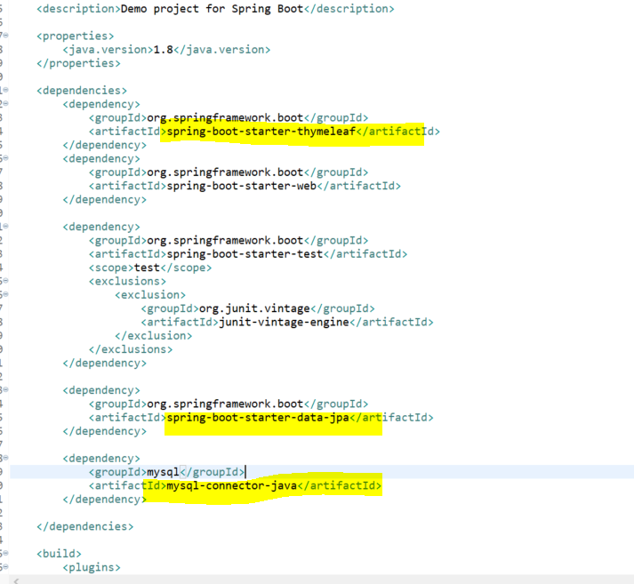

## Step 2:  applicatoin.properties 설정 및 프로젝트 구조

jpa 설정과 mysql의 디비 접속 정보 설정을 합니다.

아래와 같이 하되 본인의 환경에 맞게끔 설정해주세요.

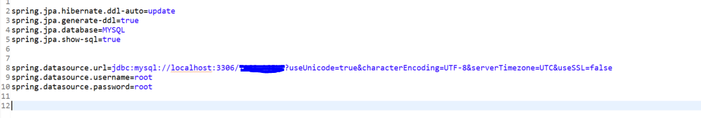

아래는 프로젝트 구조입니다.

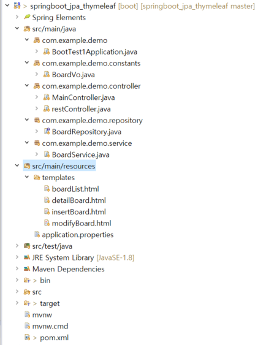

## Step 3:  DB 테이블 생성하기

게시판의 내용을 저장하기 위해서 필요한 데이터베이스의 테이블을 생성하겠습니다.

아래와 같이 생성해주세요. MYSQL입니다.

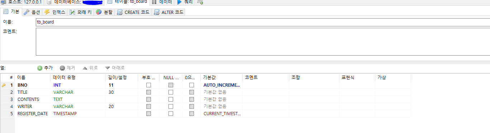

## Step 4:  vo객체 생성하기

jpa는 ORM (Object Relatinal Mapping ) 이라고 흔히 들어보셨을겁니다.

즉, 객체 관계 매핑 디비의 테이블과 vo객체를 1:1 매핑 시켜줘야합니다.

아래와 같이 BoardVo를 생성합니다.

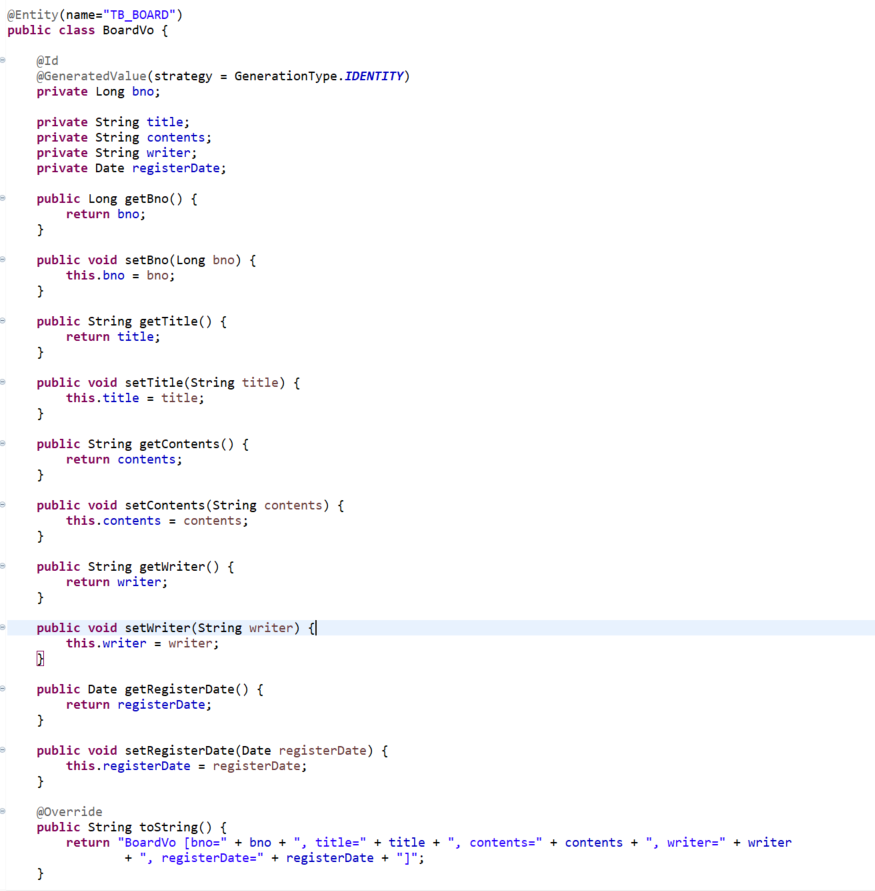

위에 Entity는 TB_BOARD 테이블 개체를 바라보겠다~ 라는 의미로 생각하시면 됩니다.

이제 모든 준비가 끝났습니다. 

이번 글에서는 간단하게 게시물을 등록하기 까지 해보겠습니다.

## Step 5:  등록 화면 & 컨트롤러 만들기

게시글을 작성하려면 등록 화면이 필요합니다.

이를 위해서 우리는 등록화면 insertBoard.html을 생성하고 그에 맞는 컨트롤러를 생성합니다.

아래와 같이 생성하도록합니다. 간단하게 form 태그를 사용하여 게시글을 등록하는 폼을 작성했습니다.

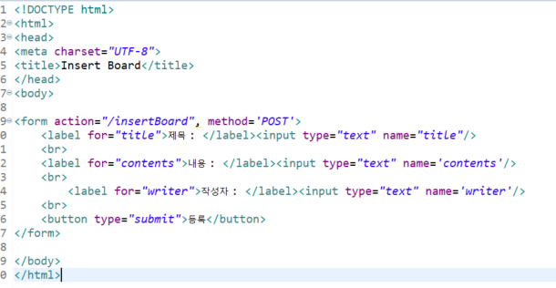

insertBoard.html은 src/main/resource/templates 아래에 생성하시면 됩니다.

이제 html을 보여줘야하는데 사용자가 주소창에 어떤 주소를 입력해야  보여 줄 지를 결정해야합니다.

다음과 같이 MainController를 생성하여 작성하세요

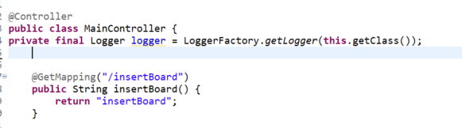

스프링을 공부해보신 분이라면 당연히 아시겠지만 이 의미는 서버 실행 후 브라우저 주소창에 localhost:8080/insertBoard라는 주소를 입력한다면 insertBoard.html이라는 파일을 보여줄거야~ 라는 의미입니다. 물론 지금은 thymeleaf를 사용하기 위해서 html을 사용하지만 jsp를 사용하려면 그와 관련된 설정을 application.properties에 해야합니다.

자 그럼 서버를 실행하고 화면이 제대로 나오는지 확인해 보도록 하겠습니다.

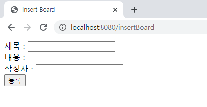

정말 볼품 없지만... 등록 화면이 나오네요.. 예시니까  ui는 신경 쓰지마세요..

## Step 5:  데이터 전송 컨트롤러 & 저장 로직 만들기

위에 보시면 insertBoard.html form 태그 action에 /insertBoard라고 되있습니다.

이 의미는 나는 내가 작성한 데이터를 /insertBoard라는 url로 전송할거야!! 라는 뜻입니다.

그렇다면 이제 /insertBoard로 날라온 데이터를 받아 줄 컨트롤러가 필요하겠죠.

MainController에 다음과 같이 작성합니다.

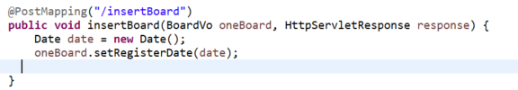

자 이제 우리는 데이터를 전송 받았고 이제 이것을 데이터베이스에 넣는 로직을 만들어야합니다.

우리는 jpa를 사용할 것이기 때문에 다음과 같이 BoardRepository를 생성합니다.

JPA에서 제공하는 JpaRepository를 상속 받습니다. 

제네릭에는 내가 쓸 클래스와 ID로 지정한 타입을 넣습니다.

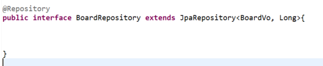

다음으로 다음과 같이 BoardService를 생성합니다.

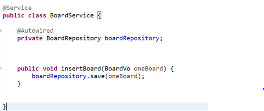

BoardService는 BoardRepository를 주입 받아 boardRepo에 있는 메소드를 호출 할 것입니다.

그런데 잠깐 여기서 뭔가 이상한게 느껴지지 않나요?

네 바로 boardRepository에 save메소드입니다. 어? 나는 save라는 메소드를 만들지 않았는데?

어떻게 오류가 안나는걸까요? 자세히 한 번 살펴보겠습니다.

BoardRepository는 현재 JpaRepository를 상속받고 있습니다.

이 JpaRepository를 타고 들어가보면 CrudRepository를 또 상속받고 있습니다.

이 CrudRepository내부를 살펴보니

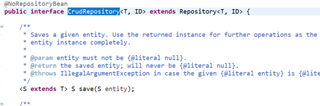

save라는 기능을 지원하고 있습니다.

이와 같이 JPA에서는 CRUD에 대한 메소드를 제공해주고 있기 때문에 상당히 편리합니다.

이제 디비에 저장하는 로직도 만들었으니 다시 컨트롤러로 돌아가 BoardService 의 insertBoard 메소드를 호출하는 로직을 추가해봅시다.

다음과 같이 MainController를 수정하세요

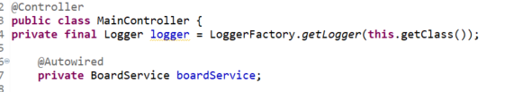

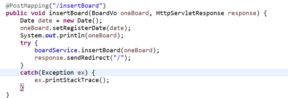

## Step 6:  데이터 전송 후 디비 확인

이제 모든 작업이 끝났습니다. 이제 웹을 실행시켜서 실제로 전송된 데이터가 저장이 되는지를 확인해봅시다.

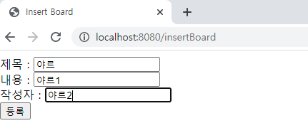

게시글을 작성하고 등록버튼을 누릅니다. 

디비에 저장이 제대로 됬는지 확인해봅시다!

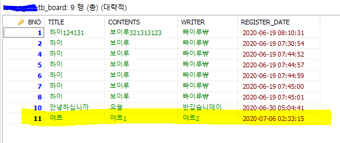

저장이 잘 되었네요~ 

여기까지 등록하기 편이었습니다.

다음 포스팅에서 게시판 나머지 기능들을 차례차례 올려보겠습니다.

이해가 안가시는분들은 댓글 남겨주세요

