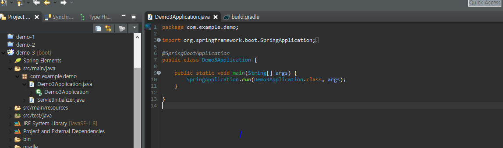

---

title: SpringBoot [gradle] 프로젝트 구성
categories:
- SPRINGBOOT
toc: true
toc_sticky: true
toc_label: 목차
---

이클립스 기준입니다.

## Step 1:  프로젝트 생성

new -> project -> springStarter

type에는 maven과 gradle이 있는데 둘 다 라이브러리를 관리해주는 기능을 가지고 있으며, 예전에는 Maven을 많이 사용했지만, 요즘 추세는 gradle을 많이 사용하고 있다.

스프링 부트를 기반으로 프로젝트를 시작하는데 있어서 어떤 라이브러리를 쓸것인지를 찾아 적용하는게 디펜던시이다.

우선 필자는 가볍게 Spring Web, Thymeleaf라는 라이브러리를 사용할 것이므로 해당 디펜던시를 추가했다.

이후 Finish를 누르면 스프링 부트를 기반으로 한 프로젝트가 생성된다.

생성된 프로젝트를 열어서 초기에 설정했던 디펜던시 내용을 build.gradle에서 확인해보자.

이제 정상적으로 실행이되는지 확인해보자.

프로젝트안에 *Application.java라는 파일이 존재할 것이다

열어보면 상단에 @SpringBootApplication이라고 적혀있다. 해당파일에 마우스 우클릭 후

run -> spring boot app을 클릭한다. 실행하게 되면 아래 콘솔창에

이런식으로 로그가 남게 되고 이제 웹 브라우저를 열어 정상 작동을 확인한다.

오류 같아보이지만 정상작동한거다.. 오해하지말자.. 