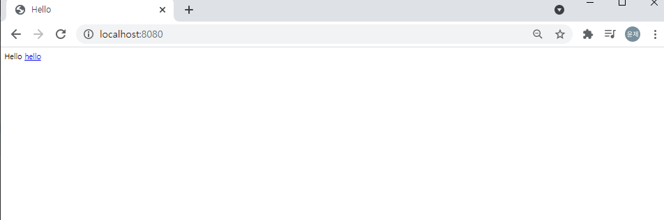

---

title: SpringBoot [gradle] View 환경 설정
categories:
- Spring Boot
toc: true
toc_sticky: true
toc_label: 목차
---

## Step 1:  Welcome Page 만들기

위와 같이 resources 아래 static 폴더 아래에 index.html파일을 생성한다.

생성 후 프로젝트 실행 후 브라우저를 열어 localhost:8080을 입력한다.

정상 실행 된다. 하지만 저 파란색 줄로 표시된 hello를 클릭하게되면 localhost:8080/hello로 이동하게 되며 없는 페이지라고 404 error가 표시가 된다. 

위의 localhost:8080/hello를 처리하기 위한 작업을 해보자.

우선 새로운 패키지를 생성하고 HelloController를 위와 같이 만든다.

다음으로 resources/templates 아래에 hello.html을 아래와 같이 생성한다.

서버를 기동한 후 브라우저창에 localhost:8080/hello를 입력하게되면

아까와는 다르게 /hello에 대한 응답이 만들어졌다.

> 스프링 입문 - 코드로 배우는 스프링 부트, 웹 MVC, DB 접근 기술 강의 

컨트롤러에서 리턴 값으로 문자를 반환하면 ViewResolver가 화면을 찾아서 처리한다.

* 스프링 부트 템플릿 엔진 기본 viewName 매핑

* 'resource:templates/'+{ViewName}+'.html'

참고 : 'spring-boot-devtools' 라이브러리를 추가하면, 'html' 파일을 컴파일만 해주면 서버 재시작 없이 View 파일 변경이 가능하다.