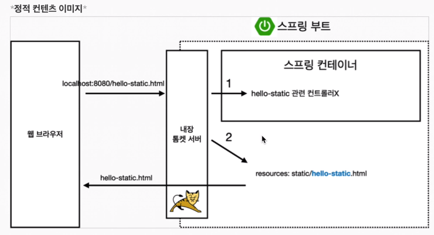
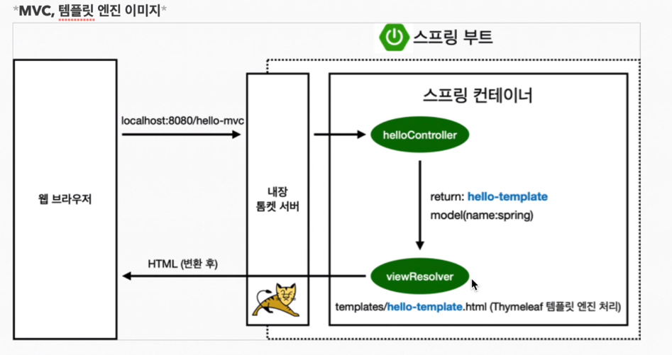
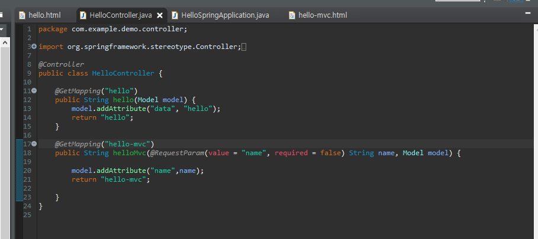
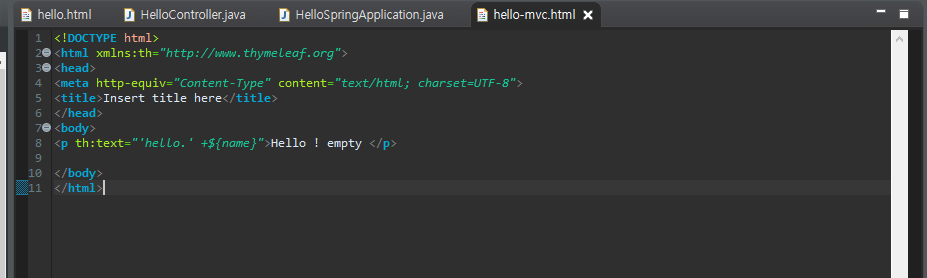
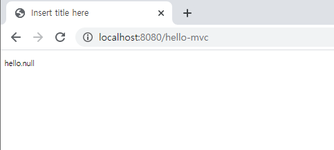
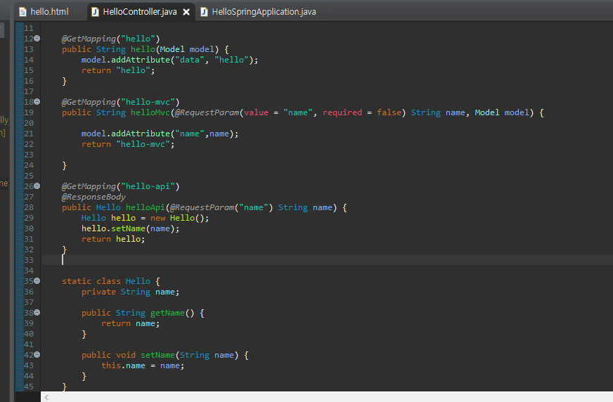
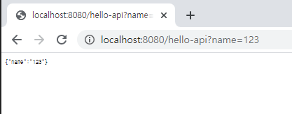
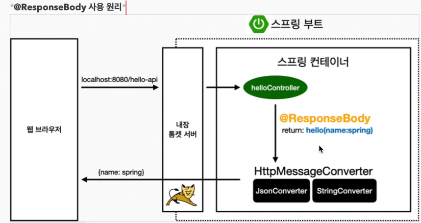

---

title: SpringBoot - 정적 컨텐츠, MVC와 템플릿 엔진, API
categories:
- Spring Boot
toc: true
toc_sticky: true
toc_label: 목차
---


## Step 1:  정적 컨텐츠



```
위 그림 ) 스프링 입문 - 코드로 배우는 스프링 부트, 웹 mvc, DB 접근 기술 강의
```

브라우저에 localhost:8080/hello-static.html을 입력하게되면 스프링에서는 컨트롤러가 hello-static에 관련된 컨트롤러를 찾는다.

컨트롤러를 찾지못하면 resources:static/ 경로 아래에 hello-static.html파일을 찾아 보여준다.


## Step 2:  MVC와 템플릿 엔진



```
위그림 ) 스프링 입문 - 코드로 배우는 스프링 부트, 웹 mvc, DB 접근 기술 강의
```

위 정적 컨텐츠와 달리 hello-mvc라는 주소를 브라우저에 입력시 Controller에서 hello-mvc에 대한 매핑을 찾는다면 View Resolver를 통해 hello-template.html을 Thymeleaf 템플릿 엔진 처리 후 html로 변환하여 브라우저에 반환하여 보여준다.



- 참고로 RequestParam에 required = false 옵션을 주게되면 default로 name에 null이 들어가게 된다.




**실행 화면**




## Step 3:  API

이번엔 API에 대해 알아볼 것이다.

```
API는 응용 프로그램에서 사용할 수 있도록, 운영 체제나 프로그래밍 언어가 제공하는 기능을 제어할 수 있게 만든 인터페이스를 뜻한다. 주로 파일 제어, 창 제어, 화상 처리, 문자 제어 등을 위한 인터페이스를 제공한다. [위키백과](https://ko.wikipedia.org/wiki/API)
```

아래와 같이 컨트롤러의 소스를 수정한 후 서버를 재기동 한 후 브라우저에 다음과 같이 입력한다.




**ResponseBody는 Http 통신 Protocol body부분에 응답 데이터를 직접 넣어주겠다는 의미이다.**

위의 템플릿과는 달리 API는 View를 받는게아니고 요청한 문자를 그대로 받는다.

아래의 데이터 형식을 JSON형식이라 한다. 

*결과화면*





```
위그림 ) 스프링 입문 - 코드로 배우는 스프링 부트, 웹 mvc, DB 접근 기술 강의
```

