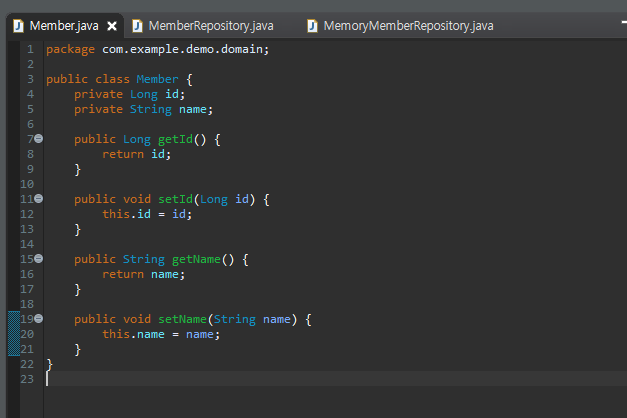
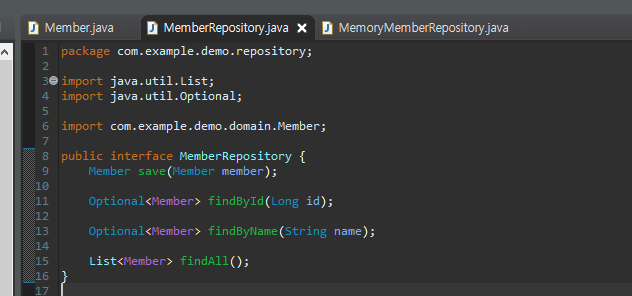
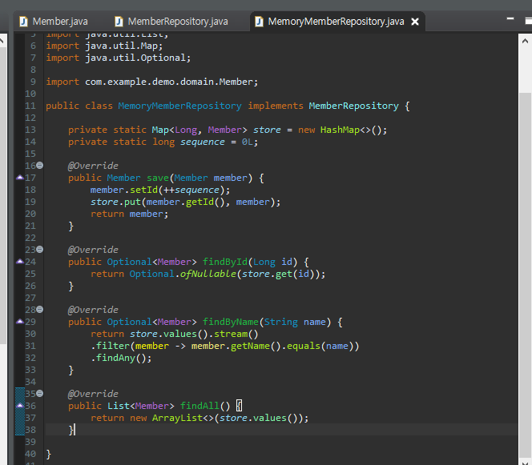
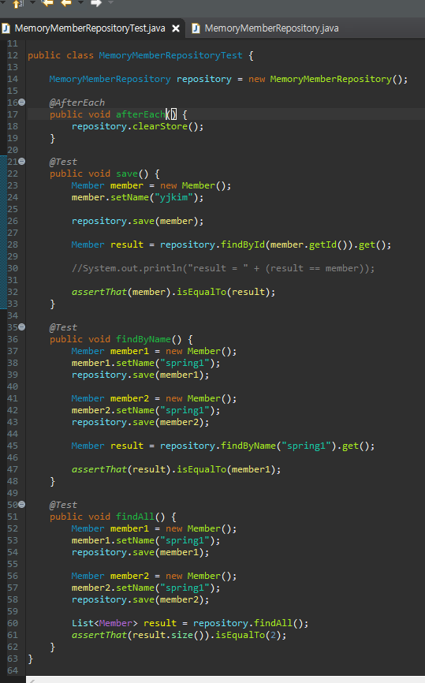
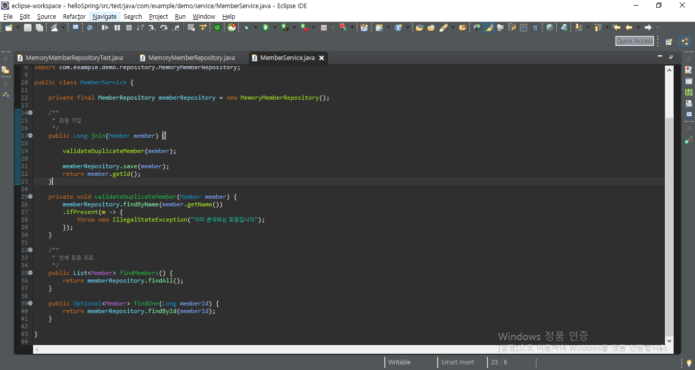

---

title: SpringBoot - 회원 관리 예제
categories:
- Spring Boot
toc: true
toc_sticky: true
toc_label: 목차
---


이번엔 가벼운 회원 관리 프로그램을 만들어 볼 것이다.

DB는 사용하지 않을것이기에 전역변수를 활용한다.

순서는 아래와 같이 진행된다.

## Step 1:  비즈니스 요구사항 정리

데이터 : 회원 ID, 이름

기능 : 회원등록, 조회

가상의 시나리오

## Step 2:  회원 도메인과 레포지토리 만들기

아래와 같이 도메인과 레포지토리를 생성한다.

**회원 ID, 이름을 가진 Member Domain**




**레포지토리 인터페이스와 구현체**







## Step 3: 회원 레포지토리 테스트 케이스 작성

개발한 기능을 실행해서 테스트 할 때 자바의 Main 메소드를 통해 실행하거나, 웹 애플리케이션의 컨트롤러를 통해서 실행하는것은 오래걸리고, 불편한 단점 이 있다. 

**자바에서는 JUnit이라는 프레임워크로 테스트를 실행해서 이러한 문제들을 해결 한다.**

src/test/java 경로 아래에 아래와 같이 생성한다.




맨위에 AfterEach를 통해 각각의 test가 끝날때마다 repository를 clear하는 부분을 추가하였다.

만약 저 부분을 제외한다면, 실행에서 오류가 발생할 것이다.


**실행 방법 : 해당 클래스 마우스 우클릭 -> run As -> Junit**


## Step 4: 회원 서비스 개발




```
김영한님의 스프링 입문 - 코드로 배우는 스프링부트, 웹 MVC, DB접근 기술 강의 참조
```

