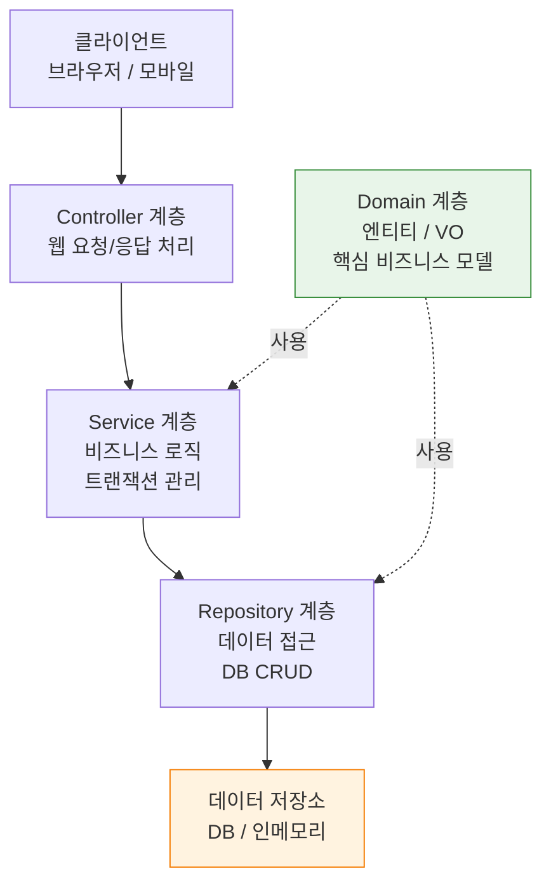
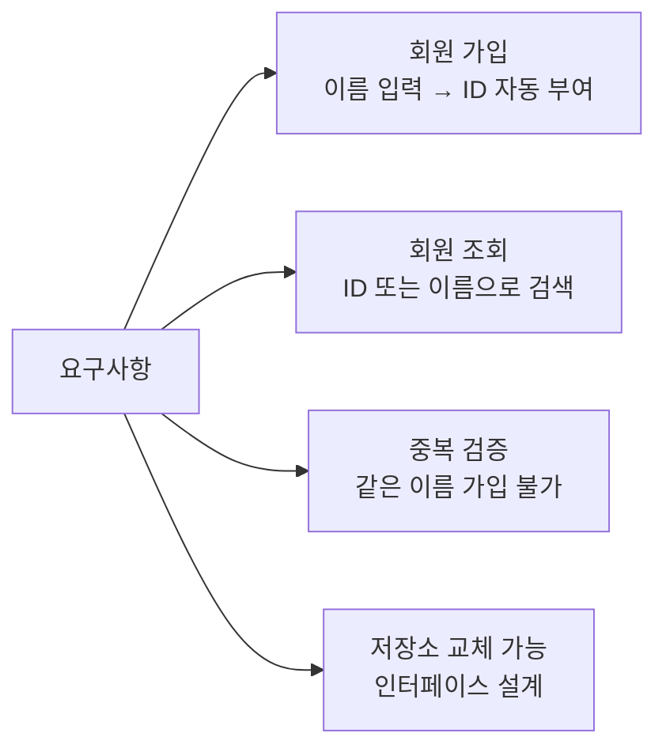
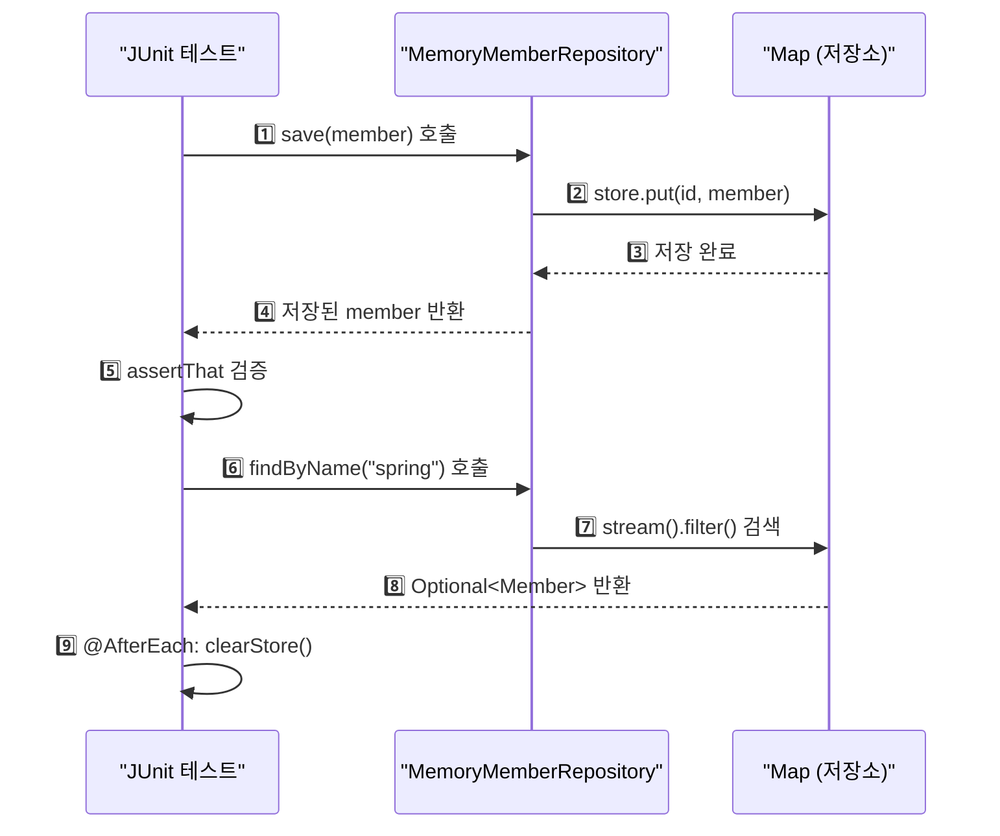
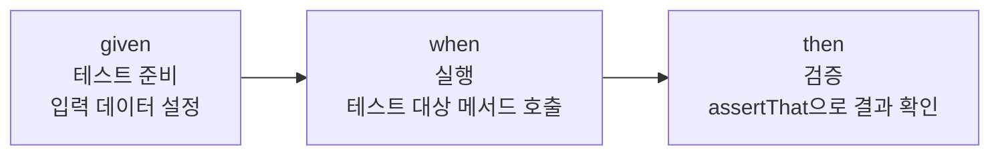
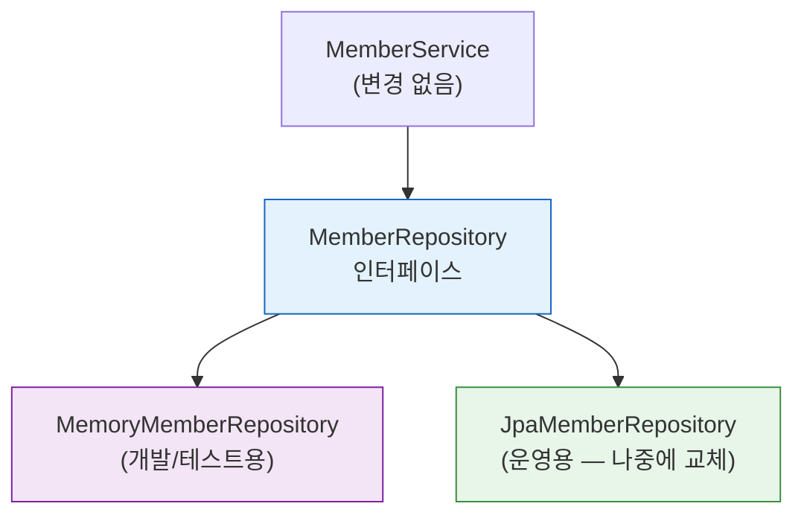

Spring Boot로 실제 동작하는 회원 관리 프로그램을 만들어보면서 레이어드 아키텍처(Layered Architecture)의 각 층이 어떻게 분리되고 협력하는지 이해할 수 있다. 도메인 → 레포지토리 → 서비스 → 테스트 순서로 코드를 작성하면서 Spring의 계층 구조를 익혀보자.

> **비유**: 레이어드 아키텍처는 식당과 같다. 손님(컨트롤러)은 홀 직원(서비스)에게 주문하고, 홀 직원은 주방(레포지토리)에 재료를 요청하며, 주방은 창고(DB)에서 재료를 꺼낸다. 각 층은 자신의 역할만 담당한다.

---

## 1단계: 레이어드 아키텍처 전체 구조


```mermaid
graph TD
    CLI["클라이언트\n브라우저 / 모바일"]
    CTRL["Controller 계층\n웹 요청/응답 처리"]
    SVC["Service 계층\n비즈니스 로직\n트랜잭션 관리"]
    REPO["Repository 계층\n데이터 접근\nDB CRUD"]
    DOMAIN["Domain 계층\n엔티티 / VO\n핵심 비즈니스 모델"]
    DB["데이터 저장소\nDB / 인메모리"]

    CLI --> CTRL
    CTRL --> SVC
    SVC --> REPO
    REPO --> DB
    DOMAIN -.->|"사용"| SVC
    DOMAIN -.->|"사용"| REPO

    style DOMAIN fill:#e8f5e9,stroke:#388e3c
    style DB fill:#fff3e0,stroke:#f57c00
```

이번 예제에서는 DB 없이 메모리(HashMap)에 데이터를 저장하는 방식으로 시작한다. 나중에 JPA로 교체할 수 있도록 Repository를 인터페이스로 분리하는 것이 핵심이다.

---

## 2단계: 비즈니스 요구사항

```
데이터: 회원 ID(자동 생성), 이름
기능: 회원 가입, 전체 회원 조회, ID로 회원 조회, 이름으로 회원 조회
제약: 중복 회원 이름 불가
저장소: 미정 (인터페이스로 분리 → 나중에 DB 교체 가능)
```


```mermaid
graph LR
    REQ["요구사항"]
    REQ --> F1["회원 가입\n이름 입력 → ID 자동 부여"]
    REQ --> F2["회원 조회\nID 또는 이름으로 검색"]
    REQ --> F3["중복 검증\n같은 이름 가입 불가"]
    REQ --> F4["저장소 교체 가능\n인터페이스 설계"]
```

---

## 3단계: 도메인 모델

도메인 계층은 비즈니스의 핵심 개념을 코드로 표현한다.

```java
// src/main/java/com/example/hello/domain/Member.java
package com.example.hello.domain;

public class Member {
    private Long id;     // 시스템이 자동 부여하는 식별자
    private String name; // 회원 이름 (중복 불가)

    public Long getId() { return id; }
    public void setId(Long id) { this.id = id; }
    public String getName() { return name; }
    public void setName(String name) { this.name = name; }
}
```

**핵심 요약**: 도메인 클래스는 순수 Java 객체(POJO)다. Spring이나 JPA에 의존하지 않는다. 나중에 JPA를 적용하면 `@Entity`, `@Id`만 추가하면 된다.

---

## 4단계: 레포지토리 설계

### 인터페이스 먼저 정의

레포지토리를 인터페이스로 정의하면 구현체를 쉽게 교체할 수 있다. 지금은 메모리 구현체를 사용하고, 나중에 JPA 구현체로 바꾼다.

```java
// src/main/java/com/example/hello/repository/MemberRepository.java
package com.example.hello.repository;

import com.example.hello.domain.Member;
import java.util.List;
import java.util.Optional;

public interface MemberRepository {
    Member save(Member member);                  // 저장
    Optional<Member> findById(Long id);          // ID로 조회
    Optional<Member> findByName(String name);    // 이름으로 조회
    List<Member> findAll();                      // 전체 조회
}
```

### 메모리 구현체

```java
// src/main/java/com/example/hello/repository/MemoryMemberRepository.java
package com.example.hello.repository;

import com.example.hello.domain.Member;
import java.util.*;

public class MemoryMemberRepository implements MemberRepository {
    // static: 모든 인스턴스가 공유 (싱글톤처럼 동작)
    private static Map<Long, Member> store = new HashMap<>();
    private static long sequence = 0L; // ID 자동 증가 카운터

    @Override
    public Member save(Member member) {
        member.setId(++sequence); // ID 자동 부여
        store.put(member.getId(), member);
        return member;
    }

    @Override
    public Optional<Member> findById(Long id) {
        // null 반환 대신 Optional로 감싸서 반환
        return Optional.ofNullable(store.get(id));
    }

    @Override
    public Optional<Member> findByName(String name) {
        return store.values().stream()
                .filter(member -> member.getName().equals(name))
                .findAny();
    }

    @Override
    public List<Member> findAll() {
        return new ArrayList<>(store.values());
    }

    // 테스트용: 저장소 초기화 메서드
    public void clearStore() {
        store.clear();
    }
}
```

**핵심 요약**: `Optional`을 사용하면 null 반환을 피할 수 있다. 호출부에서 `ifPresent()`, `orElseThrow()` 등으로 null 체크 없이 안전하게 처리할 수 있다.

---

## 5단계: 레포지토리 테스트

서비스 코드를 작성하기 전에 레포지토리가 올바르게 동작하는지 먼저 테스트한다.

### 테스트 실행 흐름


```mermaid
sequenceDiagram
    participant T as "JUnit 테스트"
    participant R as "MemoryMemberRepository"
    participant S as "Map (저장소)"

    T->>R: 1️⃣ save(member) 호출
    R->>S: 2️⃣ store.put(id, member)
    S-->>R: 3️⃣ 저장 완료
    R-->>T: 4️⃣ 저장된 member 반환
    T->>T: 5️⃣ assertThat 검증
    T->>R: 6️⃣ findByName("spring") 호출
    R->>S: 7️⃣ stream().filter() 검색
    S-->>T: 8️⃣ Optional<Member> 반환
    T->>T: 9️⃣ @AfterEach: clearStore()
```

### JUnit 테스트 코드

```java
// src/test/java/com/example/hello/repository/MemoryMemberRepositoryTest.java
package com.example.hello.repository;

import com.example.hello.domain.Member;
import org.junit.jupiter.api.AfterEach;
import org.junit.jupiter.api.Test;

import java.util.List;

import static org.assertj.core.api.Assertions.assertThat;

class MemoryMemberRepositoryTest {

    MemoryMemberRepository repository = new MemoryMemberRepository();

    // 각 테스트가 끝날 때마다 저장소 초기화
    // 이것 없이는 테스트 간 데이터가 남아 순서에 따라 결과가 달라짐
    @AfterEach
    public void afterEach() {
        repository.clearStore();
    }

    @Test
    public void save() {
        // given: 저장할 회원 준비
        Member member = new Member();
        member.setName("spring");

        // when: 저장 실행
        repository.save(member);

        // then: 저장된 회원 조회해서 검증
        Member result = repository.findById(member.getId()).get();
        assertThat(result).isEqualTo(member);
    }

    @Test
    public void findByName() {
        // given: 두 회원 저장
        Member member1 = new Member();
        member1.setName("spring1");
        repository.save(member1);

        Member member2 = new Member();
        member2.setName("spring2");
        repository.save(member2);

        // when: 이름으로 조회
        Member result = repository.findByName("spring1").get();

        // then: 첫 번째 회원과 동일한지 확인
        assertThat(result).isEqualTo(member1);
    }

    @Test
    public void findAll() {
        // given: 두 회원 저장
        Member member1 = new Member();
        member1.setName("spring1");
        repository.save(member1);

        Member member2 = new Member();
        member2.setName("spring2");
        repository.save(member2);

        // when: 전체 조회
        List<Member> result = repository.findAll();

        // then: 2건이어야 함
        assertThat(result.size()).isEqualTo(2);
    }
}
```

---

## 6단계: 회원 서비스 개발

서비스 계층은 비즈니스 로직을 담당한다. 레포지토리를 직접 사용하지 않고 서비스를 통해 접근하는 이유는 비즈니스 규칙(중복 검증, 트랜잭션 등)을 한 곳에 모으기 위해서다.

```java
// src/main/java/com/example/hello/service/MemberService.java
package com.example.hello.service;

import com.example.hello.domain.Member;
import com.example.hello.repository.MemberRepository;

import java.util.List;
import java.util.Optional;

public class MemberService {

    private final MemberRepository memberRepository;

    // 생성자 주입 — 테스트 시 다른 레포지토리 주입 가능 (테스트 용이성)
    public MemberService(MemberRepository memberRepository) {
        this.memberRepository = memberRepository;
    }

    // 회원 가입
    public Long join(Member member) {
        // 비즈니스 규칙: 같은 이름 중복 회원 불가
        validateDuplicateMember(member);
        memberRepository.save(member);
        return member.getId();
    }

    private void validateDuplicateMember(Member member) {
        memberRepository.findByName(member.getName())
                .ifPresent(m -> {
                    // Optional이 비어있지 않으면 (동일 이름이 있으면) 예외
                    throw new IllegalStateException("이미 존재하는 회원입니다.");
                });
    }

    // 전체 회원 조회
    public List<Member> findMembers() {
        return memberRepository.findAll();
    }

    // 단건 조회
    public Optional<Member> findOne(Long memberId) {
        return memberRepository.findById(memberId);
    }
}
```

**핵심 요약**: 서비스 메서드 이름은 비즈니스 용어를 사용한다(`join`, `findMembers`). 레포지토리 메서드 이름은 기술적 용어를 사용한다(`save`, `findAll`). 이 구분이 코드 가독성을 높인다.

---

## 7단계: 회원 서비스 테스트

서비스 테스트는 비즈니스 로직이 올바르게 동작하는지, 그리고 예외 상황도 올바르게 처리하는지 검증한다.

### 테스트 구조 — given / when / then 패턴


```mermaid
graph LR
    GIVEN["given\n테스트 준비\n입력 데이터 설정"]
    WHEN["when\n실행\n테스트 대상 메서드 호출"]
    THEN["then\n검증\nassertThat으로 결과 확인"]

    GIVEN --> WHEN --> THEN
```

```java
// src/test/java/com/example/hello/service/MemberServiceTest.java
package com.example.hello.service;

import com.example.hello.domain.Member;
import com.example.hello.repository.MemoryMemberRepository;
import org.junit.jupiter.api.AfterEach;
import org.junit.jupiter.api.BeforeEach;
import org.junit.jupiter.api.Test;

import static org.assertj.core.api.Assertions.assertThat;
import static org.junit.jupiter.api.Assertions.assertThrows;

class MemberServiceTest {

    MemberService memberService;
    MemoryMemberRepository memberRepository;

    // 각 테스트 전: 새 레포지토리와 서비스 생성 (테스트 격리)
    @BeforeEach
    public void beforeEach() {
        memberRepository = new MemoryMemberRepository();
        // 같은 레포지토리 인스턴스를 서비스에 주입 (DI)
        memberService = new MemberService(memberRepository);
    }

    // 각 테스트 후: 저장소 초기화
    @AfterEach
    public void afterEach() {
        memberRepository.clearStore();
    }

    @Test
    void 회원가입() {
        // given
        Member member = new Member();
        member.setName("hello");

        // when
        Long savedId = memberService.join(member);

        // then
        Member findMember = memberService.findOne(savedId).get();
        assertThat(member.getName()).isEqualTo(findMember.getName());
    }

    @Test
    void 중복_회원_예외() {
        // given: 동일한 이름의 두 회원 준비
        Member member1 = new Member();
        member1.setName("spring");

        Member member2 = new Member();
        member2.setName("spring");

        // when: 첫 번째는 성공
        memberService.join(member1);

        // then: 두 번째는 예외 발생
        IllegalStateException e = assertThrows(IllegalStateException.class,
                () -> memberService.join(member2));

        // 예외 메시지도 검증
        assertThat(e.getMessage()).isEqualTo("이미 존재하는 회원입니다.");
    }
}
```

**핵심 요약**: 테스트 이름은 한글로 작성해도 된다. 무엇을 테스트하는지 명확하게 표현하는 것이 중요하다. `assertThrows`는 예외가 발생하는 것을 검증한다. 예외가 발생하지 않으면 테스트 실패다.

---

## 8단계: 레포지토리 교체 — 설계의 유연함

인터페이스 분리의 진가는 구현체 교체 시 드러난다.


```mermaid
graph TD
    SVC["MemberService\n(변경 없음)"]
    IFACE["MemberRepository\n인터페이스"]
    MEM["MemoryMemberRepository\n(개발/테스트용)"]
    JPA["JpaMemberRepository\n(운영용 — 나중에 교체)"]

    SVC --> IFACE
    IFACE --> MEM
    IFACE --> JPA

    style IFACE fill:#e3f2fd,stroke:#1565c0
    style MEM fill:#f3e5f5,stroke:#7b1fa2
    style JPA fill:#e8f5e9,stroke:#388e3c
```

```java
// 나중에 JPA 레포지토리로 교체 시
// MemberService 코드는 한 줄도 바꾸지 않아도 됨
public class JpaMemberRepository implements MemberRepository {
    private final EntityManager em;

    @Override
    public Member save(Member member) {
        em.persist(member);
        return member;
    }

    @Override
    public Optional<Member> findById(Long id) {
        Member member = em.find(Member.class, id);
        return Optional.ofNullable(member);
    }

    @Override
    public Optional<Member> findByName(String name) {
        return em.createQuery("select m from Member m where m.name = :name", Member.class)
                .setParameter("name", name)
                .getResultList().stream().findAny();
    }

    @Override
    public List<Member> findAll() {
        return em.createQuery("select m from Member m", Member.class).getResultList();
    }
}
```

```java
// 설정 파일에서 구현체만 교체
@Configuration
public class SpringConfig {

    // 이 한 곳만 변경하면 전체 애플리케이션의 레포지토리가 교체됨
    @Bean
    public MemberRepository memberRepository() {
        // return new MemoryMemberRepository(); // 개발용
        return new JpaMemberRepository(em);    // 운영용으로 교체
    }

    @Bean
    public MemberService memberService() {
        return new MemberService(memberRepository()); // 자동으로 JPA 레포지토리 사용
    }
}
```

---

## 극한 시나리오

### 시나리오 1: @AfterEach 없이 테스트 실행

```java
// @AfterEach clearStore() 없는 경우
@Test void 회원가입() {
    // "spring" 저장
}

@Test void 중복_회원_예외() {
    // 이전 테스트에서 "spring"이 남아있음
    // 첫 번째 join("spring")이 이미 존재하는 회원으로 판단 → 예외 발생
    // → 테스트 실행 순서에 따라 결과가 달라지는 불안정한 테스트
}

// 테스트는 독립적으로 실행되어야 함
// @AfterEach 또는 @Transactional + rollback으로 상태 초기화 필수
```

### 시나리오 2: 서비스에서 레포지토리 직접 new 생성

```java
// 잘못된 코드: 서비스 내부에서 레포지토리 직접 생성
public class MemberService {
    private final MemberRepository memberRepository
        = new MemoryMemberRepository(); // 강한 결합!
}

// 문제:
// 1. 테스트 시 다른 레포지토리 주입 불가
// 2. MemberServiceTest의 memberRepository와 MemberService 내부의 repository가
//    다른 인스턴스 → 데이터가 다른 저장소에 들어감 → 테스트 실패

// 올바른 코드: 생성자 주입
public MemberService(MemberRepository memberRepository) {
    this.memberRepository = memberRepository;
}
```

### 시나리오 3: Optional.get() 직접 호출

```java
// 위험한 코드
Member member = memberRepository.findById(id).get(); // 값 없으면 NoSuchElementException

// 안전한 코드
Member member = memberRepository.findById(id)
        .orElseThrow(() -> new IllegalArgumentException("회원을 찾을 수 없습니다. id=" + id));

// 또는 null 대신 기본값
Member member = memberRepository.findById(id)
        .orElse(new Member()); // 없으면 빈 Member 반환
```

---

## 실무 체크리스트

```
□ Repository는 인터페이스로 정의 (구현체 교체 가능하도록)
□ Optional.get() 직접 호출 금지 — orElseThrow() 사용
□ 테스트는 @BeforeEach/@AfterEach로 격리 (테스트 순서 무관하게 동작)
□ 서비스 계층은 비즈니스 용어, 레포지토리는 기술 용어 사용
□ 생성자 주입으로 DI (필드 주입, setter 주입 비권장)
□ 비즈니스 예외는 커스텀 예외 클래스로 명확하게 표현
□ 테스트 메서드 이름은 한글도 가능 — 무엇을 검증하는지 명확하게
```

---

```
참조 - 스프링 입문 - 코드로 배우는 스프링 부트, 웹 MVC, DB 접근 기술 By 김영한
```
