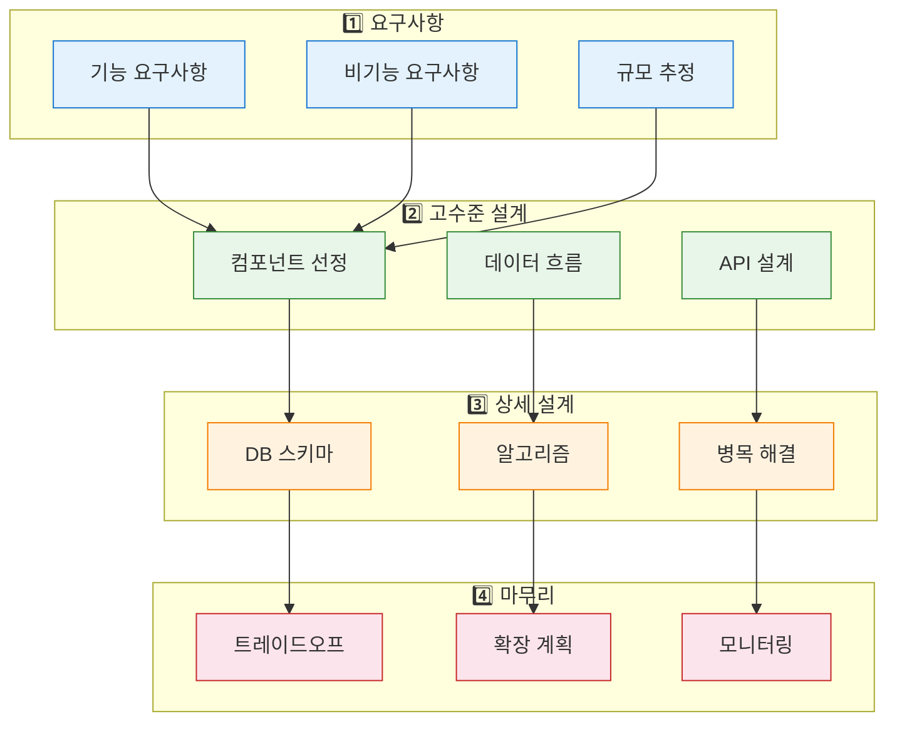
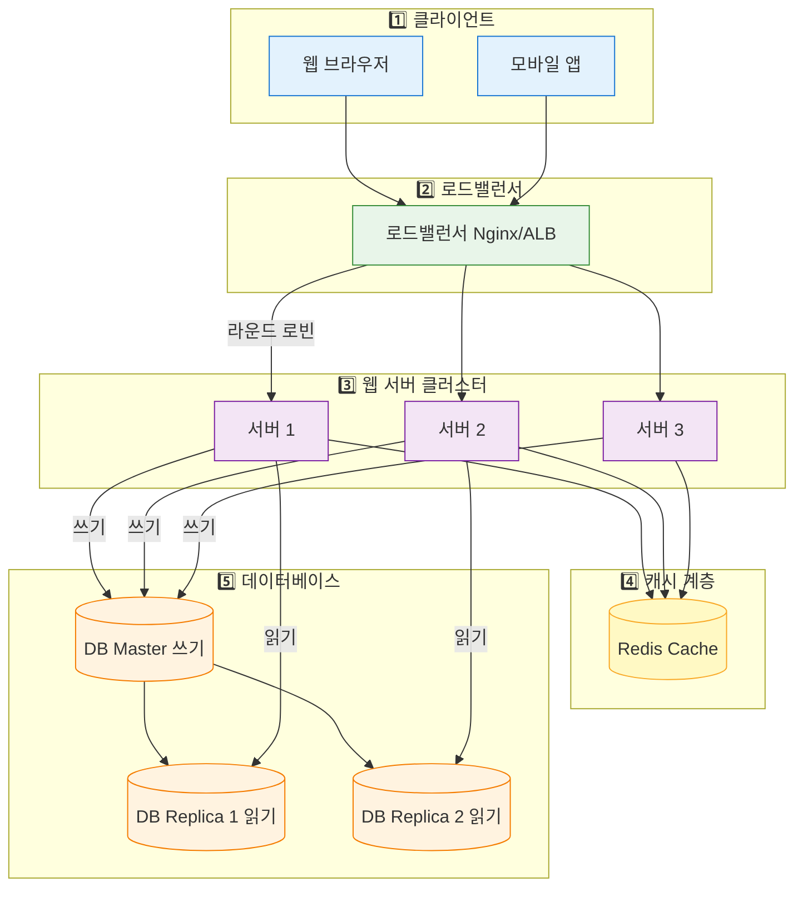
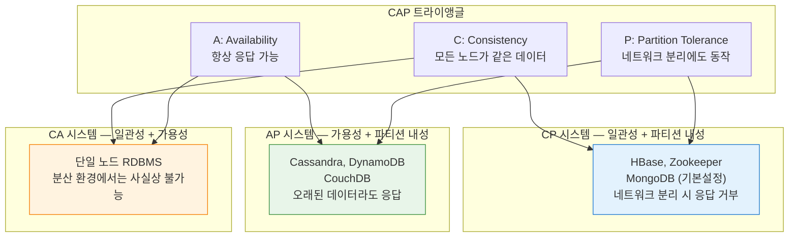
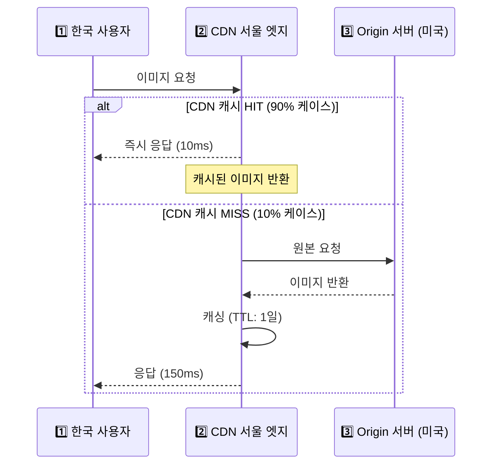
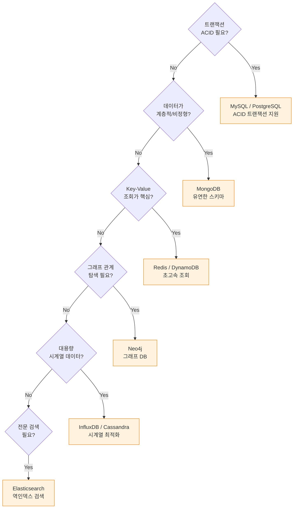
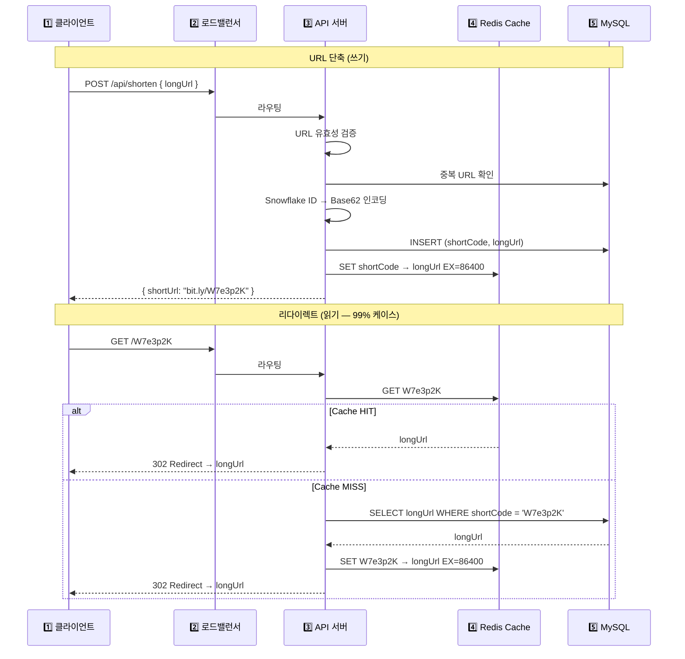

**한 줄 요약**: 시스템 디자인은 "지금 잘 돌아가는 시스템"이 아니라 "10배 커져도 무너지지 않는 시스템"을 설계하는 방법론이다.

## 실생활로 시작하기 — 카페에서 배우는 분산 시스템

수백만 명이 사용하는 카페를 설계한다고 상상해보자. 첫날엔 바리스타 한 명이 모든 걸 한다. 손님이 늘어나면 어떻게 해야 할까?

- 더 빠른 바리스타를 고용한다 → **수직 확장 (Scale-Up)**
- 바리스타를 여러 명 고용한다 → **수평 확장 (Scale-Out)**
- 자주 시키는 음료를 미리 만들어 냉장고에 둔다 → **캐싱**
- 강남, 홍대, 서울역에 지점을 낸다 → **분산 시스템**
- 주문표를 따로 받아두고 천천히 처리한다 → **메시지 큐**
- 어떤 카운터로 갈지 안내해준다 → **로드밸런서**

소프트웨어 시스템도 정확히 같은 원리로 확장된다.

---

## 설계 프로세스 — 면접과 실무 공통 4단계

```
1단계: 요구사항 명확화 (5분)
   - 기능 요구사항: 무엇을 해야 하는가?
   - 비기능 요구사항: 얼마나 커야 하는가? (MAU, TPS, 지연)
   - 제약 조건: 예산, 기술 스택, 팀 규모

2단계: 규모 추정 (Back-of-Envelope, 5분)
   - MAU 1억 → DAU 1000만 → QPS ~1,200
   - 피크 QPS = 평균의 2~3배
   - 저장 용량: 게시글 1억 개 × 1KB = 100GB

3단계: 고수준 설계 (15분)
   - 핵심 컴포넌트 선정
   - 데이터 흐름 설계
   - API 엔드포인트 정의

4단계: 상세 설계 (25분)
   - 병목 지점 해결
   - DB 스키마 설계
   - 트레이드오프 논의
```



---

## 확장성 (Scalability) — 왜 이게 중요한가?

확장성은 "현재 트래픽"이 아니라 "미래 트래픽"을 감당하는 능력이다. 토스가 처음 서비스를 시작했을 때는 MySQL 단일 서버로 충분했다. 하지만 MAU 1500만이 된 지금은? 수십 대의 서버와 복잡한 분산 아키텍처가 필요하다.

### 수직 확장 (Vertical Scaling, Scale-Up)

더 강력한 서버로 교체하는 방식이다.

```
[현재] 4 Core, 16GB RAM → [업그레이드] 32 Core, 256GB RAM
비용: $500/월 → $5,000/월 (10배)
성능: 4배 향상 (선형이 아님!)
```

**장점**: 구현 단순, 기존 코드 변경 없음, 네트워크 지연 없음
**단점**: 하드웨어 한계 존재, 단일 장애점(SPOF), 비용이 기하급수적으로 증가

#### 실무에서 자주 하는 실수
수직 확장만으로 계속 버티려는 시도다. "더 큰 서버를 사면 되지 않나요?"라는 생각은 일정 규모를 넘어서면 경제성이 없어진다.

### 수평 확장 (Horizontal Scaling, Scale-Out)

서버 대수를 늘리는 방식이다.

```
[단일 서버] → [3대] → [10대] → [100대]
비용: $500/월 × N대 (선형)
성능: 이론상 N배 향상
```

**장점**: 이론적으로 무한 확장 가능, 고가용성(HA), 비용 효율적
**단점**: 상태(State) 공유 문제, 데이터 일관성 복잡도, 설계 난이도 증가



---

## CAP 정리 — 분산 시스템의 철학

분산 시스템에서 **일관성(Consistency), 가용성(Availability), 파티션 허용(Partition Tolerance)** 세 가지를 동시에 보장하는 것은 불가능하다.

### 왜 이게 중요한가?

DB를 선택할 때 단순히 "성능"만 보는 게 아니라, 비즈니스 요구사항에 맞는 일관성 모델을 선택해야 한다. 잘못 선택하면 은행 계좌에서 돈이 두 번 빠져나가거나, 재고가 음수가 되는 참사가 발생한다.



**현실**: 네트워크 파티션은 언제든 발생할 수 있으므로 P는 필수다. 따라서 실제 선택은 **CP vs AP**다.

```
은행 계좌 이체: CP 선택
- 일관성 최우선, 잠깐 응답 못해도 괜찮음
- "지금 잔액 확인 불가능합니다" > "틀린 잔액 보여드립니다"

SNS 좋아요 수: AP 선택
- 잠깐 다른 숫자가 보여도 괜찮음, 항상 응답해야 함
- "좋아요 1,234개" vs "좋아요 1,235개" 차이는 비즈니스 임팩트 없음
```

#### 면접 포인트
"CAP 정리에 대해 설명하고, 어떤 DB를 언제 선택하는지 말해보세요." 단순 암기가 아니라, 비즈니스 상황에 따른 판단을 보여줘야 한다.

---

## 로드밸런서 — 트래픽 분산의 핵심

### 왜 이게 중요한가?

서버를 10대 운영해도 모든 트래픽이 서버 1대에만 가면 의미가 없다. 로드밸런서는 서버 증설의 효과를 실제로 실현시켜주는 장치다.

### 알고리즘 비교

| 알고리즘 | 설명 | 적합한 상황 | 단점 |
|---------|------|-----------|------|
| Round Robin | 순서대로 분산 | 서버 성능이 동일할 때 | 요청 처리 시간 차이 무시 |
| Weighted Round Robin | 성능 비율로 분산 | 서버 스펙이 다를 때 | 가중치 수동 관리 |
| Least Connections | 연결 수 적은 서버 우선 | 처리 시간이 다양할 때 | 연결 수 추적 오버헤드 |
| IP Hash | 클라이언트 IP 기반 고정 | 세션 유지 필요할 때 | 특정 IP 집중 가능 |

### L4 vs L7 로드밸런서

```
L4 (Transport Layer): TCP/UDP 기반 라우팅
  - IP:Port만 보고 분산, 패킷 내용 분석 없음
  - 처리 속도 극히 빠름 (마이크로초)
  - 예: AWS NLB, HAProxy (TCP 모드)
  - 적합: 게임 서버, 금융 거래 시스템

L7 (Application Layer): HTTP 헤더/URL/쿠키 기반 라우팅
  - 요청 내용을 분석하여 지능적 라우팅
  - SSL 종료, 캐싱, 압축 가능
  - 예: Nginx, AWS ALB, HAProxy (HTTP 모드)
  - 적합: 웹 애플리케이션, MSA API 게이트웨이
```

#### 실무에서 자주 하는 실수
스티키 세션(Sticky Session)에 의존하는 설계다. 특정 사용자를 항상 같은 서버에 보내면 확장성이 떨어진다. 세션은 Redis 같은 외부 저장소에 저장하는 것이 정석이다.

---

## CDN — 지리적 거리를 극복하는 방법

### 왜 이게 중요한가?

한국 서버에서 미국 사용자에게 이미지를 보내면 왕복 시간만 150ms다. CDN이 있으면 미국 엣지 서버에서 즉시 응답한다.



**정적 파일** (이미지, JS, CSS, 동영상): CDN 필수
**동적 콘텐츠** (로그인 상태, 개인화 데이터): Origin 서버에서 처리

대표 CDN: AWS CloudFront, Cloudflare, Akamai, Fastly

#### 극한 시나리오
넷플릭스는 피크 시간에 전 세계 인터넷 트래픽의 15%를 차지한다. CDN 없이는 불가능한 숫자다. 넷플릭스는 ISP에 직접 서버(OpenConnect)를 설치해 엣지 캐싱을 극단적으로 최적화했다.

---

## 메시지 큐 — 비동기 처리의 핵심

### 왜 이게 중요한가?

동기 처리 방식에서는 하나의 서비스가 느려지면 전체가 느려진다. 메시지 큐는 서비스 간 결합도를 낮추고 처리 속도 차이를 흡수한다.

```
동기 처리 방식:
주문 서비스 → 결제 서비스 → 배송 서비스 → 이메일 서비스
   (결제에 3초 걸리면 사용자가 3초 기다림)
   (이메일 서비스 다운 → 전체 주문 실패!)

비동기 메시지 큐 방식:
주문 서비스 → [Kafka] → 결제/배송/이메일 서비스 (각자 처리)
   (사용자는 "주문 접수됨" 즉시 응답)
   (이메일 서비스 다운 → 이메일만 나중에 처리, 주문은 성공)
```

**활용 패턴:**
- **이벤트 기반**: 주문 완료 → Kafka → 결제/배송/알림 서비스 동시 처리
- **트래픽 완충**: 초당 10만 요청 → 큐 → 서비스가 처리 가능한 속도로 소비
- **서비스 분리**: 생산자와 소비자의 완전한 독립성

---

## DB 선택 기준 — 은빛 총알은 없다



| 요구사항 | DB 선택 | 이유 |
|---------|---------|------|
| 복잡한 쿼리, 트랜잭션 | MySQL, PostgreSQL | ACID 보장, 복잡한 관계 |
| 빠른 Key-Value 조회 | Redis, DynamoDB | 인메모리, O(1) 접근 |
| 유연한 스키마 | MongoDB | 문서 구조, 스키마 진화 쉬움 |
| 대용량 시계열 | InfluxDB, Cassandra | 쓰기 최적화, 시간 범위 쿼리 |
| 소셜 그래프 | Neo4j | 관계 탐색 최적화 |
| 전문 검색 | Elasticsearch | 역인덱스, BM25 랭킹 |

---

## 캐싱 전략 — 속도의 비밀

```
캐시 계층 (왼쪽으로 갈수록 빠름):
CPU 캐시 (ns) → 로컬 메모리 (μs) → Redis (ms) → CDN (100ms) → DB (수백ms)
```

### 캐싱 전략 비교

```
Cache-Aside (Look-Aside): 앱이 캐시 확인 → 미스 시 DB 조회 → 캐시 저장
  장점: 실제 읽은 데이터만 캐싱, DB 장애 시에도 캐시로 서비스 가능
  단점: 첫 요청은 항상 DB 조회 (Cold Start), 코드 복잡도 증가

Write-Through: 쓰기 시 캐시와 DB 동시 업데이트
  장점: 캐시 항상 최신 상태 유지
  단점: 쓰기 지연, 한 번도 읽히지 않는 데이터도 캐싱

Write-Back (Write-Behind): 캐시만 먼저 쓰고 나중에 DB 동기화
  장점: 쓰기 빠름 (캐시 속도), DB 부하 감소
  단점: 캐시 장애 시 데이터 유실 위험
```

#### 면접 포인트
캐시 무효화(Cache Invalidation)는 컴퓨터 과학에서 가장 어려운 문제 중 하나다. "DB를 업데이트했는데 캐시가 오래된 데이터를 반환하는 문제를 어떻게 해결할 것인가?" 질문이 자주 나온다. TTL 기반, 이벤트 기반 무효화, Write-Through 등의 전략을 논의할 수 있어야 한다.

---

## 실전 설계 예제 — URL 단축 서비스

### 규모 추정

```
일일 새 URL 생성: 1억건
읽기:쓰기 = 100:1
일일 리다이렉트: 100억건

쓰기 QPS = 1억 / 86,400 ≈ 1,160 QPS
읽기 QPS = 1,160 × 100 = 116,000 QPS

URL 크기 = 7 + 100 + 16 = ~130B/건
10년 저장 = 1억 × 365 × 10 × 130B ≈ 47.5TB
```

### 단축 코드 생성

```
Snowflake ID → Base62 인코딩:
  64비트 정수 → [0-9a-zA-Z] 62가지 문자
  7자리 Base62 = 62^7 = 3.5조 개 URL 수용

예시: 12345678 → "W7e3p2K"
```



---

<details class="extreme-scenario-details" ontoggle="if(this.open){var ad=this.querySelector('.extreme-scenario-ad');if(ad&&!ad.dataset.loaded){ad.dataset.loaded='1';(adsbygoogle=window.adsbygoogle||[]).push({});}}">
<summary class="extreme-scenario-summary">
<span class="extreme-scenario-icon">🔥</span>
<span class="extreme-scenario-label">극한 시나리오 — 클릭하여 펼치기</span>
<span class="extreme-scenario-toggle"></span>
</summary>
<div class="extreme-scenario-body">
<div class="extreme-scenario-ad" style="text-align:center; margin-bottom:1.5em;">
<ins class="adsbygoogle"
     style="display:block"
     data-ad-client="ca-pub-7225106491387870"
     data-ad-slot="0000000000"
     data-ad-format="auto"
     data-full-width-responsive="true"></ins>
</div>
<div class="extreme-scenario-content" markdown="1">

### 시나리오: 아이돌 컴백 공지 순간

BTS가 신보 링크를 트위터에 올렸다. 순간적으로 평상시의 100배 트래픽이 몰린다.

```
준비 (평상시):
1. HPA로 자동 스케일아웃 설정 (CPU 70% 초과 시 Pod 추가)
2. DB Read Replica로 읽기 분산
3. CDN으로 정적 콘텐츠 오프로드 (트래픽의 70% 감소)
4. 핫 URL은 서버 로컬 캐시에도 저장 (Redis 이전 방어선)

실시간 대응:
5. Circuit Breaker: 백엔드 과부하 시 빠른 실패 반환
6. Rate Limiting: IP당 초당 10건 제한
7. 큐잉: 처리 가능한 속도로 흐름 제어
8. 우선순위 큐: 유료 사용자 요청 우선 처리

성능 목표:
- P50 응답시간: 50ms 이하
- P99 응답시간: 200ms 이하
- 에러율: 0.1% 이하
- 가용성: 99.99%
```

---
</div>
</div>
</details>

## 핵심 포인트 정리

| 개념 | 한 줄 요약 | 언제 사용 |
|------|-----------|---------|
| 수직 확장 | 더 좋은 서버로 교체 | 초기 단계, 단순성 필요 |
| 수평 확장 | 서버 대수 증가 | 대규모 트래픽, 고가용성 |
| 캐싱 | 자주 쓰는 데이터 미리 저장 | 읽기 비율 높은 시스템 |
| 샤딩 | DB를 여러 조각으로 분리 | 수십 TB 이상 데이터 |
| CDN | 지리적 분산 캐시 | 글로벌 서비스, 미디어 파일 |
| 메시지 큐 | 비동기 작업 버퍼 | 처리 시간 긴 작업, 스파이크 완충 |
| 로드밸런서 | 트래픽 분산 | 서버 여러 대 운영 시 필수 |

> 시스템 디자인의 핵심은 **트레이드오프(Trade-off)**다. 완벽한 시스템은 없다. 일관성을 높이면 가용성이 낮아지고, 성능을 높이면 일관성이 약해진다. 최선의 설계는 현재 비즈니스 요구사항에 맞는 적절한 트레이드오프를 선택하는 것이다.
