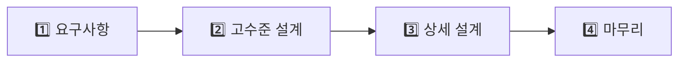

**한 줄 요약**: 시스템 디자인은 "지금 잘 돌아가는 시스템"이 아니라 "10배 커져도 무너지지 않는 시스템"을 설계하는 방법론이다.

## 실생활로 시작하기 — 카페에서 배우는 분산 시스템

수백만 명이 사용하는 카페를 설계한다고 상상해보자. 첫날엔 바리스타 한 명이 모든 걸 한다. 손님이 늘어나면 어떻게 해야 할까?

- 더 빠른 바리스타를 고용한다 → **수직 확장 (Scale-Up)**
- 바리스타를 여러 명 고용한다 → **수평 확장 (Scale-Out)**
- 자주 시키는 음료를 미리 만들어 냉장고에 둔다 → **캐싱**
- 강남, 홍대, 서울역에 지점을 낸다 → **분산 시스템**
- 주문표를 따로 받아두고 천천히 처리한다 → **메시지 큐**
- 어떤 카운터로 갈지 안내해준다 → **로드밸런서**

소프트웨어 시스템도 정확히 같은 원리로 확장된다.

---

## 설계 프로세스 — 면접과 실무 공통 4단계

```
1단계: 요구사항 명확화 (5분)
   - 기능 요구사항: 무엇을 해야 하는가?
   - 비기능 요구사항: 얼마나 커야 하는가? (MAU, TPS, 지연)
   - 제약 조건: 예산, 기술 스택, 팀 규모

2단계: 규모 추정 (Back-of-Envelope, 5분)
   - MAU 1억 → DAU 1000만 → QPS ~1,200
   - 피크 QPS = 평균의 2~3배
   - 저장 용량: 게시글 1억 개 × 1KB = 100GB

3단계: 고수준 설계 (15분)
   - 핵심 컴포넌트 선정
   - 데이터 흐름 설계
   - API 엔드포인트 정의

4단계: 상세 설계 (25분)
   - 병목 지점 해결
   - DB 스키마 설계
   - 트레이드오프 논의
```



---

## 확장성 (Scalability)

트래픽이 10배 늘었을 때 시스템이 버티는 능력이다. **수직 확장(Scale-Up)** 은 더 강력한 서버로 교체하는 방식으로 구현이 단순하지만 하드웨어 한계와 단일 장애점(SPOF)이 존재한다. **수평 확장(Scale-Out)** 은 서버 대수를 늘려 이론상 무한 확장이 가능하지만, 세션·상태 공유 문제를 Redis 같은 외부 저장소로 해결해야 한다. 실무에서는 수직 확장으로 빠르게 대응하고, 한계에 도달하면 수평 확장으로 전환하는 패턴이 일반적이다.

자세한 내용은 [기초편 — 확장성]()을 참고하자.

---

## CAP 정리

분산 시스템에서 일관성(C), 가용성(A), 파티션 허용(P) 세 가지를 동시에 보장하는 것은 불가능하다. 네트워크 파티션은 피할 수 없으므로 P는 필수이고, 실제 선택은 **CP vs AP**다. 은행 계좌처럼 정확성이 생명인 시스템은 CP, SNS 좋아요처럼 잠깐 오래된 데이터를 보여줘도 괜찮은 시스템은 AP를 선택한다. 잘못 선택하면 재고가 음수가 되거나 돈이 두 번 빠져나가는 참사가 생긴다.

자세한 내용은 [기초편 — CAP 정리]()를 참고하자.

---

## 로드밸런서

서버 10대를 운영해도 트래픽이 1대에만 몰리면 의미가 없다. 로드밸런서가 수평 확장의 효과를 실현시켜준다. L4(TCP 기반, 마이크로초 속도)는 WebSocket처럼 장기 연결이 필요한 서비스에 적합하고, L7(HTTP 헤더·URL 기반)은 MSA API 게이트웨이처럼 지능적 라우팅이 필요할 때 쓴다. 스티키 세션에 의존하면 확장성이 무너지므로, 세션은 Redis 같은 외부 저장소에 보관하는 것이 정석이다.

자세한 내용은 [기초편 — 로드밸런싱]()을 참고하자.

---

## CDN

한국 서버에서 미국 사용자에게 이미지를 보내면 왕복 150ms다. CDN은 전 세계 엣지 서버에 콘텐츠를 캐싱해 지리적 지연을 10~30ms로 줄인다. 이미지·JS·CSS·동영상 같은 정적 파일은 CDN 필수이고, 개인화 데이터처럼 사용자마다 다른 동적 콘텐츠는 Origin 서버에서 처리해야 한다. 넷플릭스는 ISP에 직접 서버(OpenConnect)를 설치해 트래픽의 95%를 엣지에서 처리한다.

자세한 내용은 [기초편 — CDN]()을 참고하자.

---

## 메시지 큐

이메일 서비스가 다운됐다고 주문 전체가 실패해선 안 된다. 메시지 큐(Kafka, RabbitMQ)는 생산자와 소비자를 비동기로 분리해, 하나의 서비스 장애가 전파되지 않도록 막는다. 블랙프라이데이에 초당 10만 건이 몰려도 큐가 버퍼 역할을 해서 소비자가 처리 가능한 속도로 소화한다. 결합도를 낮추고 스파이크를 흡수하는 두 가지 역할이 핵심이다.

자세한 내용은 [기초편 — 메시지 큐]()를 참고하자.

---

## DB 선택 기준

"은빛 총알은 없다"는 말처럼, 모든 상황에 맞는 단 하나의 DB는 존재하지 않는다. ACID 트랜잭션이 필요하면 MySQL/PostgreSQL, 빠른 Key-Value 조회는 Redis/DynamoDB, 유연한 스키마는 MongoDB, 소셜 그래프 탐색은 Neo4j, 전문 검색은 Elasticsearch를 선택한다. 잘못된 DB 선택은 나중에 수십 TB 마이그레이션이라는 재앙으로 돌아온다.

자세한 내용은 [기초편 — 데이터베이스 확장]()을 참고하자.

---

## 캐싱 전략

DB 조회는 수십 ms, Redis 캐시는 수십 µs로 약 100~1000배 빠르다. 가장 많이 쓰이는 **Cache-Aside** 패턴은 앱이 캐시 확인 → 미스 시 DB 조회 → 캐시 저장 순서로 동작한다. 캐시 무효화(Cache Invalidation)는 컴퓨터 과학에서 가장 어려운 문제 중 하나다. "DB를 업데이트했는데 캐시가 오래된 데이터를 반환하는 문제를 어떻게 해결할 것인가?"라는 면접 질문에 TTL 기반, 이벤트 기반 무효화, Write-Through 등의 전략을 논의할 수 있어야 한다.

자세한 내용은 [기초편 — 캐싱]()을 참고하자.

---

## 다음 편 예고

이번 편에서는 시스템 디자인의 핵심 개념 지도를 훑어봤다. 다음 편부터는 실제 시스템을 직접 설계한다. **URL 단축기, 채팅 시스템, 뉴스피드** 등 면접에서 가장 자주 등장하는 설계 문제를 하나씩 풀어나간다.

---


## 극한 시나리오

### 시나리오: 아이돌 컴백 공지 순간

BTS가 신보 링크를 트위터에 올렸다. 순간적으로 평상시의 100배 트래픽이 몰린다.

```
준비 (평상시):
1. HPA로 자동 스케일아웃 설정 (CPU 70% 초과 시 Pod 추가)
2. DB Read Replica로 읽기 분산
3. CDN으로 정적 콘텐츠 오프로드 (트래픽의 70% 감소)
4. 핫 URL은 서버 로컬 캐시에도 저장 (Redis 이전 방어선)

실시간 대응:
5. Circuit Breaker: 백엔드 과부하 시 빠른 실패 반환
6. Rate Limiting: IP당 초당 10건 제한
7. 큐잉: 처리 가능한 속도로 흐름 제어
8. 우선순위 큐: 유료 사용자 요청 우선 처리

성능 목표:
- P50 응답시간: 50ms 이하
- P99 응답시간: 200ms 이하
- 에러율: 0.1% 이하
- 가용성: 99.99%
```

---

## 보안 고려사항

> **비유**: 아무리 튼튼한 건물도 현관 잠금장치가 없으면 소용없다. 확장성과 가용성만큼 보안을 설계 초기부터 함께 고려해야 한다.

**인증(Authentication)과 인가(Authorization)**

- **OAuth 2.0**: 구글·카카오 소셜 로그인의 표준. 사용자 대신 제3자 앱이 API를 호출하도록 허용하는 위임 프로토콜
- **JWT**: Stateless 인증 토큰. 서버가 세션을 저장하지 않아 수평 확장에 유리하다. 단, 만료 전 강제 폐기가 어려우므로 Access Token TTL을 짧게(15분) 유지하고 Refresh Token과 병행한다
- **RBAC(역할 기반 접근 제어)**: API 게이트웨이에서 JWT 서명 검증 → 서비스 내부에서 역할 확인. 두 단계를 반드시 분리한다

**전송 보안**

모든 통신에 TLS 1.2 이상을 강제하고, HSTS 헤더를 설정해 다운그레이드 공격을 차단한다.

**Rate Limiting 개요**

로그인·회원가입 같은 인증 엔드포인트는 Brute-Force 공격 대상이 된다. API 게이트웨이 레벨에서 IP당 분당 5회 제한을 적용한다.

---
## 핵심 포인트 정리

| 개념 | 한 줄 요약 | 언제 사용 |
|------|-----------|---------|
| 수직 확장 | 더 좋은 서버로 교체 | 초기 단계, 단순성 필요 |
| 수평 확장 | 서버 대수 증가 | 대규모 트래픽, 고가용성 |
| 캐싱 | 자주 쓰는 데이터 미리 저장 | 읽기 비율 높은 시스템 |
| 샤딩 | DB를 여러 조각으로 분리 | 수십 TB 이상 데이터 |
| CDN | 지리적 분산 캐시 | 글로벌 서비스, 미디어 파일 |
| 메시지 큐 | 비동기 작업 버퍼 | 처리 시간 긴 작업, 스파이크 완충 |
| 로드밸런서 | 트래픽 분산 | 서버 여러 대 운영 시 필수 |

> 시스템 디자인의 핵심은 **트레이드오프(Trade-off)**다. 완벽한 시스템은 없다. 일관성을 높이면 가용성이 낮아지고, 성능을 높이면 일관성이 약해진다. 최선의 설계는 현재 비즈니스 요구사항에 맞는 적절한 트레이드오프를 선택하는 것이다.
