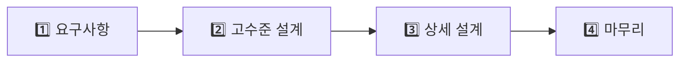
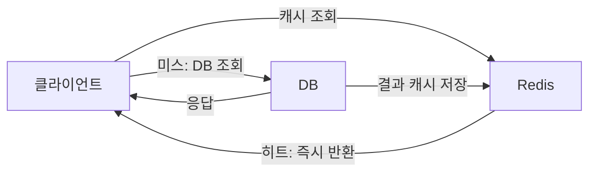
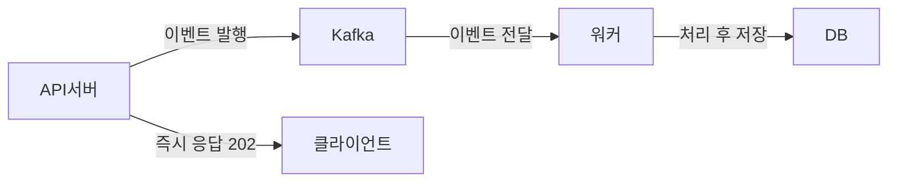

**한 줄 요약**: 시스템 디자인은 "지금 잘 돌아가는 시스템"이 아니라 "10배 커져도 무너지지 않는 시스템"을 설계하는 방법론이다.

## 실생활로 시작하기 — 카페에서 배우는 분산 시스템

수백만 명이 사용하는 카페를 설계한다고 상상해보자. 첫날엔 바리스타 한 명이 모든 걸 한다. 손님이 늘어나면 어떻게 해야 할까?

- 더 빠른 바리스타를 고용한다 → **수직 확장 (Scale-Up)**
- 바리스타를 여러 명 고용한다 → **수평 확장 (Scale-Out)**
- 자주 시키는 음료를 미리 만들어 냉장고에 둔다 → **캐싱**
- 강남, 홍대, 서울역에 지점을 낸다 → **분산 시스템**
- 주문표를 따로 받아두고 천천히 처리한다 → **메시지 큐**
- 어떤 카운터로 갈지 안내해준다 → **로드밸런서**

소프트웨어 시스템도 정확히 같은 원리로 확장된다.

---

## 설계 프로세스 — 면접과 실무 공통 4단계

```
1단계: 요구사항 명확화 (5분)
   - 기능 요구사항: 무엇을 해야 하는가?
   - 비기능 요구사항: 얼마나 커야 하는가? (MAU, TPS, 지연)
   - 제약 조건: 예산, 기술 스택, 팀 규모

2단계: 규모 추정 (Back-of-Envelope, 5분)
   - MAU 1억 → DAU 1000만 → QPS ~1,200
   - 피크 QPS = 평균의 2~3배
   - 저장 용량: 게시글 1억 개 × 1KB = 100GB

3단계: 고수준 설계 (15분)
   - 핵심 컴포넌트 선정
   - 데이터 흐름 설계
   - API 엔드포인트 정의

4단계: 상세 설계 (25분)
   - 병목 지점 해결
   - DB 스키마 설계
   - 트레이드오프 논의
```



---

## 확장성 (Scalability)

트래픽이 10배 늘었을 때 시스템이 버티는 능력이다. **수직 확장(Scale-Up)** 은 더 강력한 서버로 교체하는 방식으로 구현이 단순하지만 하드웨어 한계와 단일 장애점(SPOF)이 존재한다. **수평 확장(Scale-Out)** 은 서버 대수를 늘려 이론상 무한 확장이 가능하지만, 세션·상태 공유 문제를 Redis 같은 외부 저장소로 해결해야 한다. 실무에서는 수직 확장으로 빠르게 대응하고, 한계에 도달하면 수평 확장으로 전환하는 패턴이 일반적이다.

### 왜 확장성을 처음부터 고려해야 하는가

"나중에 고치면 된다"는 생각이 가장 위험하다. 초기에 단일 서버로 구축한 시스템을 수평 확장으로 전환하려면 다음 문제를 전부 해결해야 한다.

- 서버 로컬에 저장한 세션 → 외부 저장소(Redis)로 이전
- 서버 로컬에 저장한 파일 → 분산 스토리지(S3)로 이전
- 단일 DB → 레플리카 + 샤딩으로 재설계
- 동기 처리 로직 → 비동기 큐 기반으로 재작성

이 작업 중에 서비스는 계속 운영되어야 한다. 사용자가 늘어난 뒤 이 변경을 하는 것은 날아가는 비행기의 엔진을 바꾸는 것과 같다. **초기 설계에서 수평 확장 가능한 구조를 잡아두는 것이 훨씬 저렴하다.**

자세한 내용은 [기초편 — 확장성]()을 참고하자.

---

## CAP 정리

분산 시스템에서 일관성(C), 가용성(A), 파티션 허용(P) 세 가지를 동시에 보장하는 것은 불가능하다. 네트워크 파티션은 피할 수 없으므로 P는 필수이고, 실제 선택은 **CP vs AP**다. 은행 계좌처럼 정확성이 생명인 시스템은 CP, SNS 좋아요처럼 잠깐 오래된 데이터를 보여줘도 괜찮은 시스템은 AP를 선택한다. 잘못 선택하면 재고가 음수가 되거나 돈이 두 번 빠져나가는 참사가 생긴다.

### 왜 CAP 정리가 중요한가 — 잘못된 선택의 결과

"그냥 다 보장하면 안 되나?"라는 질문이 나온다. 불가능한 이유를 극단적 예로 보자. 서버 A와 B가 있고 네트워크가 끊어졌다(파티션 발생). 사용자가 A에서 잔액을 인출했다. 이 정보가 B에 전달되지 않는다.

- **일관성 우선(CP)**: B는 "A와 통신 불가, 응답 거부"라고 한다. 서비스가 다운된 것처럼 보인다. 하지만 잔액 오류는 없다.
- **가용성 우선(AP)**: B는 "오래된 잔액 정보로 응답"한다. 서비스는 살아있다. 하지만 같은 돈을 두 곳에서 인출할 수 있다.

은행이 AP를 선택하면? 고객이 ATM 두 대에서 동시에 전액 인출 가능하다. SNS가 CP를 선택하면? 팔로워 수가 네트워크 파티션 순간마다 조회 불가가 된다. **비즈니스 도메인에 따라 선택이 완전히 달라진다.**

| 시스템 | 선택 | 이유 |
|--------|------|------|
| 은행 이체 | CP | 잔액 불일치는 치명적 손실 |
| SNS 좋아요 수 | AP | 1분 뒤에 맞는 숫자가 나와도 OK |
| 재고 관리 | CP | 재고 음수는 출하 불가 사태 |
| DNS | AP | 느린 업데이트보다 응답 가능이 중요 |

자세한 내용은 [기초편 — CAP 정리]()를 참고하자.

---

## 로드밸런서

서버 10대를 운영해도 트래픽이 1대에만 몰리면 의미가 없다. 로드밸런서가 수평 확장의 효과를 실현시켜준다. L4(TCP 기반, 마이크로초 속도)는 WebSocket처럼 장기 연결이 필요한 서비스에 적합하고, L7(HTTP 헤더·URL 기반)은 MSA API 게이트웨이처럼 지능적 라우팅이 필요할 때 쓴다. 스티키 세션에 의존하면 확장성이 무너지므로, 세션은 Redis 같은 외부 저장소에 보관하는 것이 정석이다.

자세한 내용은 [기초편 — 로드밸런싱]()을 참고하자.

---

## CDN

한국 서버에서 미국 사용자에게 이미지를 보내면 왕복 150ms다. CDN은 전 세계 엣지 서버에 콘텐츠를 캐싱해 지리적 지연을 10~30ms로 줄인다. 이미지·JS·CSS·동영상 같은 정적 파일은 CDN 필수이고, 개인화 데이터처럼 사용자마다 다른 동적 콘텐츠는 Origin 서버에서 처리해야 한다. 넷플릭스는 ISP에 직접 서버(OpenConnect)를 설치해 트래픽의 95%를 엣지에서 처리한다.

자세한 내용은 [기초편 — CDN]()을 참고하자.

---

## 메시지 큐

이메일 서비스가 다운됐다고 주문 전체가 실패해선 안 된다. 메시지 큐(Kafka, RabbitMQ)는 생산자와 소비자를 비동기로 분리해, 하나의 서비스 장애가 전파되지 않도록 막는다. 블랙프라이데이에 초당 10만 건이 몰려도 큐가 버퍼 역할을 해서 소비자가 처리 가능한 속도로 소화한다. 결합도를 낮추고 스파이크를 흡수하는 두 가지 역할이 핵심이다.

### 왜 Kafka인가? RabbitMQ, SQS와 무엇이 다른가

| 후보 | 장점 | 단점 | 적합한 상황 |
|------|------|------|------------|
| **Kafka** | 초당 수백만 건 처리, 메시지 영구 보관, 재처리 가능 | 운영 복잡도 높음, 소규모에 과하다 | 대용량 이벤트 스트림, 로그 수집 |
| **RabbitMQ** | 복잡한 라우팅 지원, 우선순위 큐, 운영 쉬움 | 메시지 재처리 어려움, 수백만 QPS 한계 | 작업 큐, 마이크로서비스 간 통신 |
| **AWS SQS** | 완전 관리형, 운영 부담 없음 | Kafka보다 처리량 낮음, 벤더 종속 | 클라우드 네이티브, 스타트업 |

> 핵심: 메시지를 "소비하고 버리는" 작업 큐가 필요하면 RabbitMQ, "이벤트 히스토리를 보관하고 여러 소비자가 독립적으로 읽어야" 하면 Kafka

자세한 내용은 [기초편 — 메시지 큐]()를 참고하자.

---

## DB 선택 기준

"은빛 총알은 없다"는 말처럼, 모든 상황에 맞는 단 하나의 DB는 존재하지 않는다. ACID 트랜잭션이 필요하면 MySQL/PostgreSQL, 빠른 Key-Value 조회는 Redis/DynamoDB, 유연한 스키마는 MongoDB, 소셜 그래프 탐색은 Neo4j, 전문 검색은 Elasticsearch를 선택한다. 잘못된 DB 선택은 나중에 수십 TB 마이그레이션이라는 재앙으로 돌아온다.

### 왜 NoSQL인가? RDB가 병목이 되는 순간

RDB(MySQL, PostgreSQL)가 완벽해 보이지만, 다음 상황에서 물리적 한계에 부딪힌다.

**쿼리 패턴 1 — 단일 키로 수백만 건 조회**: 사용자 프로필 조회는 `SELECT * FROM users WHERE id = ?`다. 이 쿼리 패턴에서 RDB는 인덱스를 타지만 JOIN이 없다면 NoSQL Key-Value(DynamoDB, Redis)가 응답 속도 10배 이상 빠르고 수평 확장도 쉽다.

**쿼리 패턴 2 — 스키마가 사용자마다 다름**: 전자상거래에서 냉장고 스펙(용량, 냉동실 크기)과 신발 스펙(사이즈, 소재)은 완전히 다르다. RDB로 표현하려면 EAV(Entity-Attribute-Value) 패턴이나 JSON 컬럼이 필요하고, 이는 인덱스 효율을 크게 떨어뜨린다. MongoDB 같은 Document DB는 스키마 없이 각 문서가 다른 필드를 가져도 된다.

**쿼리 패턴 3 — 초당 수십만 건 쓰기**: IoT 센서 데이터, 클릭 로그처럼 초당 수십만 건이 쌓이면 RDB의 B-Tree 인덱스 유지 비용이 폭발한다. Cassandra, HBase 같은 LSM-Tree 기반 NoSQL은 쓰기에 최적화되어 RDB 대비 쓰기 처리량이 10~100배 높다.

> 핵심: "JOIN이 많고 트랜잭션이 중요하면 RDB, 단순 조회·대용량 쓰기·유연한 스키마면 NoSQL"

자세한 내용은 [기초편 — 데이터베이스 확장]()을 참고하자.

---

## 캐싱 전략

DB 조회는 수십 ms, Redis 캐시는 수십 µs로 약 100~1000배 빠르다. 가장 많이 쓰이는 **Cache-Aside** 패턴은 앱이 캐시 확인 → 미스 시 DB 조회 → 캐시 저장 순서로 동작한다. 캐시 무효화(Cache Invalidation)는 컴퓨터 과학에서 가장 어려운 문제 중 하나다. "DB를 업데이트했는데 캐시가 오래된 데이터를 반환하는 문제를 어떻게 해결할 것인가?"라는 면접 질문에 TTL 기반, 이벤트 기반 무효화, Write-Through 등의 전략을 논의할 수 있어야 한다.

**실전 구현 — Cache-Aside 패턴 + 규모 추정 계산 (Java/Spring Boot):**

```java
// 1단계: 규모 추정 (Back-of-Envelope)
// MAU 1,000만 → DAU 100만 (10% 활성률)
// DAU 100만 × 하루 10회 요청 = 1,000만 req/day
// QPS = 10,000,000 / 86,400 ≈ 115 QPS (평균)
// Peak QPS = 115 × 3 = 345 QPS (피크 3배)
//
// 저장 용량:
// 게시글 1억 개 × 평균 1KB = 100GB (텍스트)
// 이미지: 게시글 20%가 이미지, 평균 200KB → 1억 × 0.2 × 200KB = 4TB
// 5년 보관 기준: (100GB + 4TB) × 5 = ~20TB

@Service
@RequiredArgsConstructor
public class ProductService {

    private final ProductRepository productRepository;
    private final RedisTemplate<String, Product> redisTemplate;

    private static final String CACHE_KEY_PREFIX = "product:";
    private static final Duration CACHE_TTL = Duration.ofMinutes(30);

    // Cache-Aside 패턴
    public Product getProduct(Long productId) {
        String cacheKey = CACHE_KEY_PREFIX + productId;

        // 1. 캐시 조회
        Product cached = redisTemplate.opsForValue().get(cacheKey);
        if (cached != null) {
            return cached;  // 캐시 히트 → 즉시 반환 (수십 µs)
        }

        // 2. 캐시 미스 → DB 조회 (수십 ms)
        Product product = productRepository.findById(productId)
                .orElseThrow(() -> new ProductNotFoundException(productId));

        // 3. 캐시에 저장 (TTL 30분)
        redisTemplate.opsForValue().set(cacheKey, product, CACHE_TTL);

        return product;
    }

    // 쓰기 시 캐시 무효화 (Cache Invalidation)
    @Transactional
    public Product updateProduct(Long productId, UpdateProductRequest request) {
        Product product = productRepository.findById(productId)
                .orElseThrow(() -> new ProductNotFoundException(productId));

        product.update(request.getName(), request.getPrice());
        productRepository.save(product);

        // DB 업데이트 후 캐시 즉시 삭제 → 다음 조회 시 DB에서 신선한 데이터 로드
        String cacheKey = CACHE_KEY_PREFIX + productId;
        redisTemplate.delete(cacheKey);

        return product;
    }

    // Write-Through 패턴 (쓰기 시 캐시도 동시 업데이트)
    @Transactional
    public Product updateProductWriteThrough(Long productId, UpdateProductRequest request) {
        Product product = productRepository.findById(productId)
                .orElseThrow(() -> new ProductNotFoundException(productId));

        product.update(request.getName(), request.getPrice());
        productRepository.save(product);

        // DB와 캐시를 동시에 업데이트 → 캐시 항상 최신 상태 유지
        String cacheKey = CACHE_KEY_PREFIX + productId;
        redisTemplate.opsForValue().set(cacheKey, product, CACHE_TTL);

        return product;
    }
}

// 캐시 히트율 모니터링 (CloudWatch 커스텀 메트릭 발행)
@Aspect
@Component
public class CacheMetricsAspect {

    private final MeterRegistry meterRegistry;

    // AOP로 캐시 히트/미스 자동 측정
    // 목표: 히트율 > 90% (히트율 70% 이하면 캐시 전략 재검토)
    @Around("@annotation(Cacheable)")
    public Object measureCacheHit(ProceedingJoinPoint joinPoint) throws Throwable {
        Object result = joinPoint.proceed();
        // Spring Cache가 캐시를 사용했는지 여부로 히트/미스 판별
        boolean cacheHit = isCacheHit(joinPoint);
        meterRegistry.counter("cache.requests",
                "hit", String.valueOf(cacheHit)).increment();
        return result;
    }

    private boolean isCacheHit(ProceedingJoinPoint joinPoint) {
        // 실제 구현에서는 CacheManager를 통해 캐시 존재 여부 확인
        return false;
    }
}
```

자세한 내용은 [기초편 — 캐싱]()을 참고하자.

---

## 다음 편 예고

이번 편에서는 시스템 디자인의 핵심 개념 지도를 훑어봤다. 다음 편부터는 실제 시스템을 직접 설계한다. **URL 단축기, 채팅 시스템, 뉴스피드** 등 면접에서 가장 자주 등장하는 설계 문제를 하나씩 풀어나간다.

---


## 극한 시나리오

### 시나리오 0: 단일 서버가 버티다 무너지는 순간

MAU 100만의 스타트업이 단일 서버 1대로 운영 중이다. 평상시 QPS 200으로 문제없다. 그러다 언론에 기사가 나고 QPS가 2,000으로 치솟으면 무슨 일이 생기는가?

```
1단계 (QPS 400): DB 커넥션 풀 고갈 시작. 응답 시간 200ms → 2초
2단계 (QPS 800): 타임아웃 폭발. 클라이언트가 재시도 → QPS 자가 증폭
3단계 (QPS 1,500): CPU 100%, 메모리 스왑 시작. 응답 시간 10초+
4단계 (QPS 2,000): OOM Killer가 프로세스 종료. 서버 다운.

재시작해도? 밀린 요청이 쏟아져 즉시 재다운. 무한 루프.
탈출 방법: Rate Limiting으로 입구를 막고, 수평 확장으로 용량 증설.
```

이것이 확장성 설계가 필요한 이유다. 트래픽이 오기 전에 설계가 완성되어 있어야 한다.

### 시나리오: 아이돌 컴백 공지 순간

BTS가 신보 링크를 트위터에 올렸다. 순간적으로 평상시의 100배 트래픽이 몰린다.

```
준비 (평상시):
1. HPA로 자동 스케일아웃 설정 (CPU 70% 초과 시 Pod 추가)
2. DB Read Replica로 읽기 분산
3. CDN으로 정적 콘텐츠 오프로드 (트래픽의 70% 감소)
4. 핫 URL은 서버 로컬 캐시에도 저장 (Redis 이전 방어선)

실시간 대응:
5. Circuit Breaker: 백엔드 과부하 시 빠른 실패 반환
6. Rate Limiting: IP당 초당 10건 제한
7. 큐잉: 처리 가능한 속도로 흐름 제어
8. 우선순위 큐: 유료 사용자 요청 우선 처리

성능 목표:
- P50 응답시간: 50ms 이하
- P99 응답시간: 200ms 이하
- 에러율: 0.1% 이하
- 가용성: 99.99%
```

---

### 시나리오 2: DB가 병목이 되는 순간 — 캐시 없는 시스템의 한계

DAU 500만 서비스, 읽기 QPS 5,800. DB 서버는 MySQL 1대(r5.2xlarge, 최대 커넥션 500개). 피크 타임 QPS가 15,000으로 치솟으면?

```
문제의 연쇄:
1. 쿼리 15,000 QPS → 커넥션 풀 500개 포화 (평균 응답 30ms 기준)
   → 500개 커넥션 × (1초 / 0.03초) = 초당 16,666 QPS 처리 가능이지만
   → 슬로우 쿼리 1개(300ms)가 섞이면 그 커넥션이 10배 오래 점유
2. 커넥션 대기 큐 폭발 → 애플리케이션 스레드 블로킹
3. 타임아웃 → 클라이언트 재시도 → QPS 자가 증폭

해결 단계:
1단계: Redis 캐시로 읽기 70% 오프로드 (15,000 → 4,500 QPS)
2단계: Read Replica 추가로 남은 읽기 분산
3단계: 슬로우 쿼리 찾아 인덱스 추가 (EXPLAIN ANALYZE)
4단계: Connection Pooling(PgBouncer) 도입
```

캐시 1대(Redis t3.medium, 월 50달러)가 DB 증설(r5.4xlarge, 월 1,000달러)을 막는다.

### 시나리오 3: 분산 시스템에서 CAP를 잘못 선택한 결과

이커머스 재고 시스템을 AP로 구성했다. 재고 DB가 두 리전에 걸쳐 있고 최종 일관성을 허용했다.

```
상황: 한국 서버 재고 1개, 미국 서버에 복제 지연 5초
시각 T+0: 한국 고객이 마지막 재고 1개 구매 → 한국 DB: 재고 0
시각 T+3: 미국 고객이 동일 상품 구매 → 미국 DB: 아직 재고 1 표시 → 구매 허용
시각 T+5: 복제 완료 → 재고가 -1

결과: 재고 없는 상품을 두 명에게 판매. 한 명에게 취소 통보.
비즈니스 손실: 환불 처리 비용 + 고객 신뢰 하락 + CS 비용

올바른 선택: 재고 차감은 CP 시스템(단일 리전 마스터 DB)으로 처리하고,
재고 표시(읽기)만 AP로 허용 (약간 오래된 재고 수치를 보여줄 수 있음).
```

## 보안 고려사항

> **비유**: 아무리 튼튼한 건물도 현관 잠금장치가 없으면 소용없다. 확장성과 가용성만큼 보안을 설계 초기부터 함께 고려해야 한다.

**인증(Authentication)과 인가(Authorization)**

- **OAuth 2.0**: 구글·카카오 소셜 로그인의 표준. 사용자 대신 제3자 앱이 API를 호출하도록 허용하는 위임 프로토콜
- **JWT**: Stateless 인증 토큰. 서버가 세션을 저장하지 않아 수평 확장에 유리하다. 단, 만료 전 강제 폐기가 어려우므로 Access Token TTL을 짧게(15분) 유지하고 Refresh Token과 병행한다
- **RBAC(역할 기반 접근 제어)**: API 게이트웨이에서 JWT 서명 검증 → 서비스 내부에서 역할 확인. 두 단계를 반드시 분리한다

**전송 보안**

모든 통신에 TLS 1.2 이상을 강제하고, HSTS 헤더를 설정해 다운그레이드 공격을 차단한다.

**Rate Limiting 개요**

로그인·회원가입 같은 인증 엔드포인트는 Brute-Force 공격 대상이 된다. API 게이트웨이 레벨에서 IP당 분당 5회 제한을 적용한다.

---

## Day 1에서 Scale까지 — 아키텍처는 어떻게 진화하는가

**Phase 1: MAU 1만 (Day 1)**
- 단일 서버 1대에 웹 + DB + 캐시를 모두 올린다. 배포는 FTP, 모니터링은 없다.
- 월 비용: ~$50 (EC2 t3.small 1대)

**Phase 2: MAU 100만**
- 웹 서버와 DB 서버를 분리한다. Nginx 로드밸런서를 앞에 두고, 읽기 트래픽은 Read Replica로 분산한다. Redis로 세션과 자주 쓰는 조회를 캐시한다.
- 월 비용: ~$800 (EC2 3대 + RDS Multi-AZ + ElastiCache)

**Phase 3: MAU 1000만**
- DB 샤딩을 도입하고, 정적 자산은 CDN으로 배포한다. 느린 작업(이메일, 이미지 처리)은 Kafka + Worker로 비동기화한다. Auto Scaling Group으로 트래픽 급증을 자동 대응한다.
- 월 비용: ~$8,000 (멀티 AZ, Kafka 클러스터, CloudFront)

**Phase 4: MAU 1억**
- 멀티 리전 Active-Active 구성으로 지역별 지연을 최소화한다. 서비스별 독립 배포를 위해 마이크로서비스로 분리하고, 각 서비스는 독립 DB를 가진다. 글로벌 DNS 기반 트래픽 라우팅으로 리전 장애를 자동 우회한다.
- 월 비용: ~$100,000+ (멀티 리전, 서비스 메시, 글로벌 CDN)

---

## 이것만 모니터링하면 된다 — 핵심 메트릭 5개

| 메트릭 | 정상 범위 | 경고 임계값 | 장애 의미 |
|--------|----------|------------|---------|
| P99 응답시간 | < 200ms | > 500ms | DB 슬로우 쿼리 또는 외부 API 지연 |
| 에러율 (5xx) | < 0.1% | > 1% | 서버 크래시 또는 의존 서비스 장애 |
| DB 커넥션 사용률 | < 60% | > 80% | 커넥션 풀 고갈 → 전체 요청 대기 |
| 캐시 히트율 | > 90% | < 70% | 캐시 무효화 폭발 또는 콜드 스타트 |
| CPU / 메모리 | < 70% | > 85% | 용량 부족, Auto Scaling 지연 위험 |

---

## 실제로 이런 일이 일어났다 — 실전 장애 사례

**사례 1: 카카오 데이터센터 화재 (2022년 10월)**
- **상황**: SK C&C 판교 데이터센터 화재로 카카오 서비스 전체가 127시간 장애
- **원인**: 단일 데이터센터에 서비스 대부분이 집중. 이중화 DR이 실제로 작동하지 않음
- **해결**: 수동으로 트래픽을 분산하고 백업 DC를 수동 활성화. 5일 이상 소요
- **교훈**: DR은 설계만으로는 부족하다. 분기별 실제 전환 훈련이 필수다. Active-Active 멀티 DC가 아니면 단일 DC 장애에 무방비다

**사례 2: AWS us-east-1 장애 (2021년 12월)**
- **상황**: AWS 북버지니아 리전 장애로 국내외 수백 개 서비스가 수 시간 중단
- **원인**: AWS 내부 네트워크 자동화 시스템의 버그로 연쇄 장애 발생
- **해결**: 멀티 리전을 구성한 서비스는 자동 페일오버, 단일 리전 의존 서비스는 장애 지속
- **교훈**: 클라우드도 장애난다. 단일 리전 의존은 카카오 화재와 동일한 위험이다. 핵심 서비스는 멀티 AZ 최소, 중요 서비스는 멀티 리전으로 구성해야 한다

**사례 3: Facebook BGP 장애 (2021년 10월)**
- **상황**: Facebook, Instagram, WhatsApp이 약 6시간 전면 중단
- **원인**: BGP 라우팅 설정 변경 실수로 Facebook의 DNS 서버가 인터넷에서 완전히 사라짐
- **해결**: 물리적으로 데이터센터에 접근해 수동 복구. DNS가 없으니 원격 접속 자체가 불가
- **교훈**: 인프라 변경은 단계적 롤아웃(카나리 배포)이 필수다. 변경 하나가 전체 접근성을 끊을 수 있다. 내부 관리 시스템은 외부 서비스와 별도 네트워크로 분리해야 한다

---
## 핵심 포인트 정리

| 개념 | 한 줄 요약 | 언제 사용 |
|------|-----------|---------|
| 수직 확장 | 더 좋은 서버로 교체 | 초기 단계, 단순성 필요 |
| 수평 확장 | 서버 대수 증가 | 대규모 트래픽, 고가용성 |
| 캐싱 | 자주 쓰는 데이터 미리 저장 | 읽기 비율 높은 시스템 |
| 샤딩 | DB를 여러 조각으로 분리 | 수십 TB 이상 데이터 |
| CDN | 지리적 분산 캐시 | 글로벌 서비스, 미디어 파일 |
| 메시지 큐 | 비동기 작업 버퍼 | 처리 시간 긴 작업, 스파이크 완충 |
| 로드밸런서 | 트래픽 분산 | 서버 여러 대 운영 시 필수 |

> 시스템 디자인의 핵심은 **트레이드오프(Trade-off)**다. 완벽한 시스템은 없다. 일관성을 높이면 가용성이 낮아지고, 성능을 높이면 일관성이 약해진다. 최선의 설계는 현재 비즈니스 요구사항에 맞는 적절한 트레이드오프를 선택하는 것이다.

---

## 실무에서 자주 하는 실수

1. **요구사항 확인 없이 설계 시작** — 규모(DAU, QPS, 데이터 크기)를 먼저 추정하지 않으면 과설계 또는 부족 설계가 발생한다. 인터뷰에서도 실무에서도 첫 5분은 반드시 요구사항 명세에 써야 한다.

2. **단일 장애점(SPOF) 무시** — 데이터베이스를 단일 인스턴스로 운영하다 장애 발생 시 전체 서비스가 다운된다. Primary-Replica 구성이나 멀티 AZ 배포를 기본으로 고려해야 한다.

3. **캐시 적용 후 무효화 전략 누락** — 캐시를 도입하면서 TTL과 invalidation 전략을 정하지 않아 오래된 데이터가 서비스에 노출된다. 쓰기 빈도와 신선도 요구사항을 기반으로 전략을 명시해야 한다.

4. **동기 호출 체인 과의존** — 외부 API를 동기 호출로 연쇄하면 하나의 타임아웃이 전체 요청을 실패시킨다. 비핵심 작업은 메시지 큐를 통한 비동기 처리로 분리해야 한다.

5. **수평 확장 시 세션 고착 문제** — 로드밸런서 뒤에 서버를 추가했는데 세션이 특정 서버에 묶여 있어 로그인이 풀린다. 세션은 Redis 같은 외부 저장소에 중앙화해야 한다.

---
## 면접 포인트

### 면접 포인트 1️⃣ "시스템 디자인 면접에서 요구사항 분석을 왜 먼저 해야 하나요?"

"URL 단축 서비스를 설계하라"는 요청에 즉시 아키텍처를 그리기 시작하면, 면접관이 원하는 규모·제약이 반영되지 않습니다. DAU 1만과 DAU 1억은 완전히 다른 설계입니다. 기능 요구사항("단축 URL 생성, 리다이렉트")과 비기능 요구사항("읽기 100K QPS, 99.9% 가용성, 지연 < 10ms")을 먼저 확정해야 어떤 트레이드오프를 선택할지 기준이 생깁니다. 실무에서도 설계 전 요구사항 명세 없이 시작하면 나중에 전면 재설계가 발생합니다.

### 면접 포인트 2️⃣ "수직 확장과 수평 확장의 전환 시점을 어떻게 판단하나요?"

수직 확장(스케일업)은 단일 서버의 CPU·메모리를 늘립니다. 구현 단순, 데이터 일관성 문제 없음. 한계: AWS r6g.metal 기준 최대 1TB RAM, 96코어. 비용이 지수적으로 증가합니다. 수평 확장(스케일아웃)은 서버를 추가합니다. 이론상 무한 확장이지만 세션 공유, 분산 트랜잭션 복잡도가 증가합니다. 전환 시점 판단: 수직 확장 비용 증가분 > 수평 확장 구현 비용이 되는 순간. 실무에서는 단일 서버 CPU 70% 이상 지속 또는 응답 P99가 SLA를 반복적으로 위반할 때 수평 확장을 검토합니다.

### 면접 포인트 3️⃣ "캐시와 DB의 정합성 문제를 어떻게 해결하나요?"

캐시와 DB는 두 곳에 데이터가 있으므로 일관성 문제가 필연적으로 발생합니다. 핵심 트레이드오프: TTL을 짧게 하면 일관성은 높지만 캐시 히트율이 낮아 DB 부하가 증가합니다. TTL을 길게 하면 히트율이 높지만 오래된 데이터가 서빙됩니다. 실무 접근법: 도메인별로 허용 가능한 stale 시간을 정합니다. 상품 가격(즉시 반영 필요) vs 상품 설명(5분 지연 허용). 중요한 쓰기는 Write-Through 또는 Cache Invalidation으로 즉시 반영합니다.



### 면접 포인트 4️⃣ "메시지 큐 없이 대용량 시스템을 운영하면 어떤 문제가 생기나요?"

동기 처리에서 느린 하위 서비스(이메일 발송 3초)가 전체 응답 시간을 지연시킵니다. 트래픽 급증 시 모든 처리가 동시에 실행되어 DB 커넥션 풀이 고갈됩니다. 하위 서비스 장애 시 상위 서비스도 연쇄 실패합니다. 메시지 큐를 도입하면: 비동기 처리로 응답 시간 단축, 큐가 버퍼 역할을 해 트래픽 스파이크 흡수, 하위 서비스 장애가 큐에 메시지 적재로 격리됩니다. 단, 결과적 일관성(Eventual Consistency)을 수용해야 합니다.



### 면접 포인트 5️⃣ "CAP 정리를 실제 시스템 선택에 어떻게 적용하나요?"

P(Partition Tolerance)는 분산 시스템에서 포기할 수 없습니다. 네트워크 파티션은 실제로 발생합니다. 따라서 선택은 C(일관성) vs A(가용성)입니다. CP 선택(일관성 우선): 은행 잔액, 재고, 결제. 파티션 발생 시 서비스를 일시 중단하더라도 데이터 정합성을 보장합니다. AP 선택(가용성 우선): SNS 피드, 좋아요 수, 광고 클릭 수. 파티션 발생 시 오래된 데이터를 서빙하더라도 서비스를 계속합니다. 면접에서 "왜 이 시스템이 CP/AP인지"를 비즈니스 요구사항과 연결해 설명해야 합니다.
