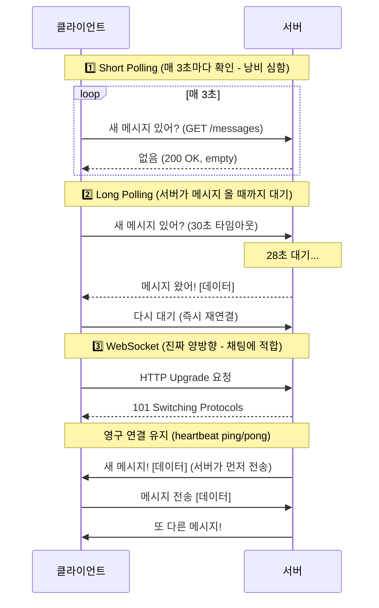
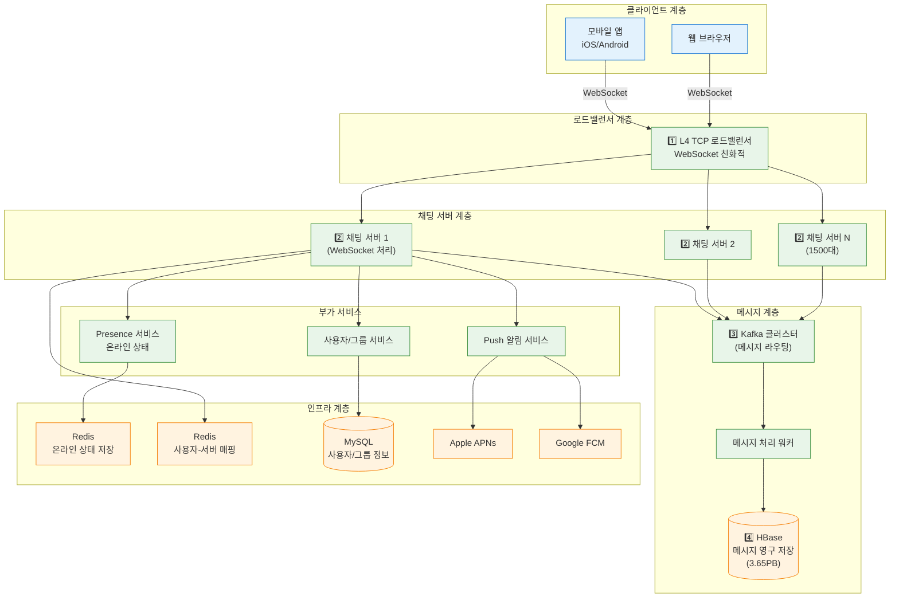
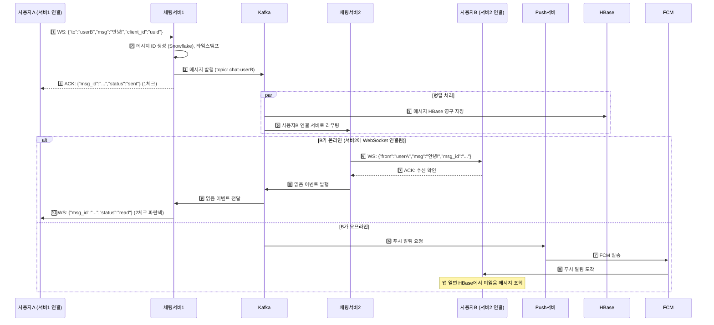
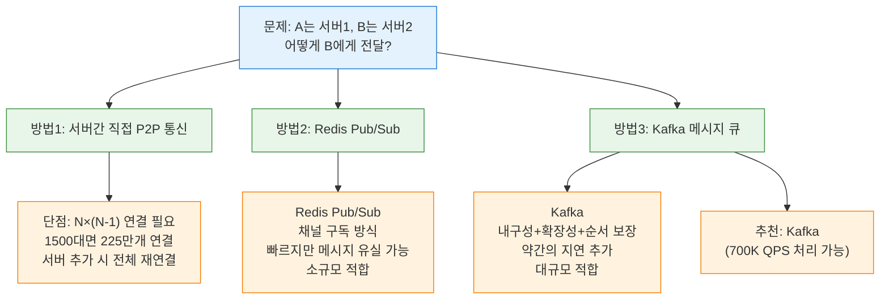
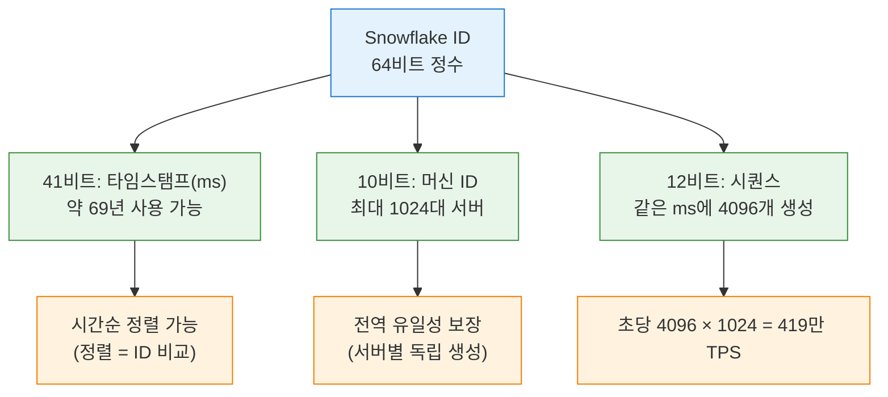
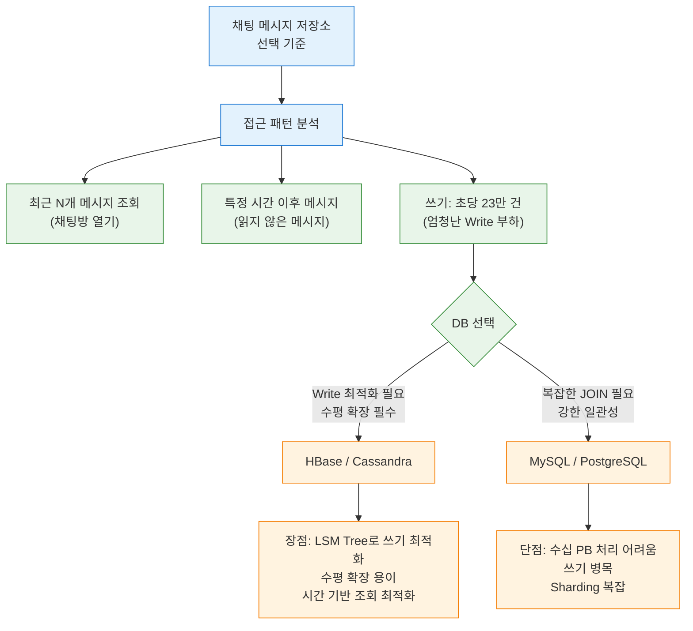
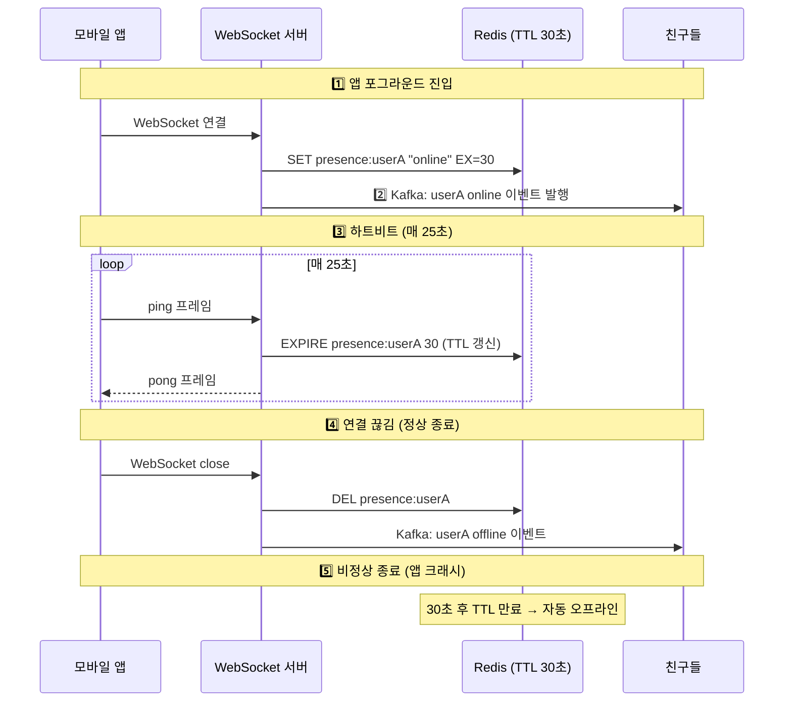
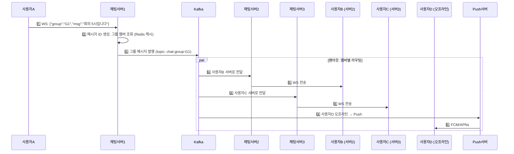
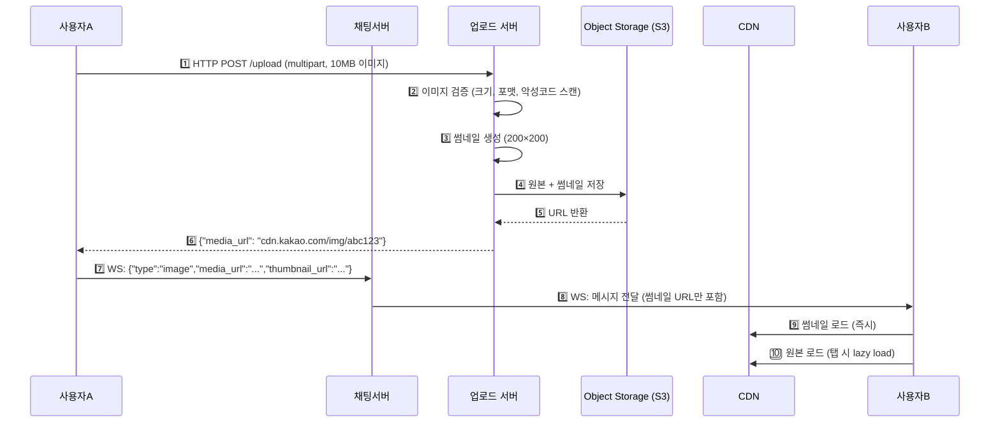

> **한 줄 요약**: 채팅 시스템의 핵심은 WebSocket으로 양방향 실시간 연결을 유지하고, Kafka로 메시지를 라우팅하며, HBase로 수 페타바이트 메시지를 저장하는 것이다.

## 실제 문제: 카카오톡 5억 명이 동시에 채팅하면?

2022년 카카오 데이터센터 화재로 카카오톡이 127시간 부분 마비됐습니다. 국내 MAU 4700만 명이 한꺼번에 접근하는 서비스가 단일 데이터센터에 의존하고 있었던 것입니다. 이 사건은 채팅 시스템 설계에서 **고가용성과 멀티 데이터센터**가 얼마나 중요한지를 극명하게 보여줬습니다.

채팅 시스템은 단순해 보이지만, 내부적으로 수많은 복잡한 문제를 해결해야 합니다:
- 실시간 양방향 통신 (HTTP는 단방향)
- 초당 70만 건의 메시지 처리
- 메시지 순서 보장 (동시 전송 시)
- 오프라인 사용자에게 Push 알림
- 수 페타바이트의 메시지 영구 저장

---

## 1. 요구사항 분석 및 규모 추정

### 기능 요구사항

1. 1:1 채팅 (실시간)
2. 그룹 채팅 (최대 100명)
3. 온라인/오프라인 상태 표시 (Presence)
4. 메시지 전송 확인 (1체크: 전송됨, 2체크: 읽음)
5. 미디어 파일 전송 (이미지, 동영상, 문서)
6. 앱 백그라운드 시 푸시 알림

### 비기능 요구사항

- 지연시간: 메시지 전달 **100ms 미만** (P99)
- 가용성: **99.99%** (연간 52분 이하 다운타임)
- 일관성: 메시지 순서 보장, 유실 없음
- 내구성: 메시지 영구 저장 (최소 5년)

### 규모 추정

```
DAU: 5억명
메시지/일: 5억 × 40개 = 200억건
메시지 QPS = 200억 / 86,400 ≈ 231,000 QPS
피크 QPS ≈ 700,000 QPS (피크는 평균의 3배)

메시지 크기: 텍스트 평균 100B
일일 저장: 200억 × 100B = 2TB/일
5년 저장: 2TB × 365 × 5 ≈ 3.65PB (미디어 제외)
미디어 포함: × 50배 = 182PB

WebSocket 연결 수: DAU의 30% 동시 접속 = 1억 5천만 연결
서버당 WebSocket 연결: 최대 10만개
필요 서버: 1억5천만 / 10만 = 1,500대
```

---

## 2. 핵심 기술: WebSocket

### HTTP Polling vs Long Polling vs WebSocket 비교

기존 HTTP는 **우체국** 방식입니다. 내가 편지를 보내야(요청) 답장이 옵니다(응답). 하지만 채팅은 **전화** 방식이어야 합니다. 상대방이 말하면 즉시 내 귀에 들려야 합니다.



| 방식 | 지연시간 | 서버 부하 | 실시간성 | 사용 케이스 |
|------|---------|---------|---------|-----------|
| Short Polling | 최대 3초 | 매우 높음 (폴링 요청) | 낮음 | 거의 사용 안 함 |
| Long Polling | 수백ms | 높음 (연결 유지) | 중간 | 구형 채팅, 알림 |
| WebSocket | 수십ms | 낮음 (연결당 메모리만) | 높음 | 채팅, 게임, 실시간 |
| SSE | 수십ms | 낮음 | 서버→클라이언트만 | 알림, 피드 업데이트 |

### WebSocket 핸드셰이크 상세

```http
# 클라이언트 → 서버 (HTTP Upgrade)
GET /chat HTTP/1.1
Host: chat.kakao.com
Upgrade: websocket
Connection: Upgrade
Sec-WebSocket-Key: dGhlIHNhbXBsZSBub25jZQ==
Sec-WebSocket-Version: 13

# 서버 → 클라이언트 (프로토콜 전환 완료)
HTTP/1.1 101 Switching Protocols
Upgrade: websocket
Connection: Upgrade
Sec-WebSocket-Accept: s3pPLMBiTxaQ9kYGzzhZRbK+xOo=
# 이후 HTTP가 아닌 WebSocket 프레임으로 통신
```

### 왜 이게 중요한가?

WebSocket 연결은 TCP 연결을 유지하므로, 서버 당 동시 연결 수가 핵심 병목입니다. Linux 기본 설정에서 파일 디스크립터 제한이 1024개이므로, `/etc/security/limits.conf`에서 `nofile=1000000`으로 늘려야 합니다. 또한 로드밸런서가 **L7이 아닌 L4 TCP**여야 WebSocket 연결이 끊기지 않습니다.

---

## 3. 전체 아키텍처



---

## 4. 메시지 전송 흐름 상세

### 1:1 채팅 메시지 완전 흐름



### 서버 간 메시지 라우팅 문제

A가 서버1에, B가 서버2에 연결되어 있을 때 어떻게 메시지를 전달할까요?



---

## 5. 메시지 ID 설계 — Snowflake ID

메시지 순서 보장과 전역 유일성을 위해 **Snowflake ID**를 사용합니다. Twitter가 2010년에 설계한 분산 ID 생성 알고리즘입니다.



```java
public class SnowflakeIdGenerator {
    private static final long EPOCH = 1609459200000L; // 2021-01-01 기준
    private static final long WORKER_ID_BITS = 10L;
    private static final long SEQUENCE_BITS = 12L;

    private static final long MAX_WORKER_ID = ~(-1L << WORKER_ID_BITS); // 1023
    private static final long MAX_SEQUENCE = ~(-1L << SEQUENCE_BITS);   // 4095

    private final long workerId;
    private long lastTimestamp = -1L;
    private long sequence = 0L;

    public SnowflakeIdGenerator(long workerId) {
        if (workerId < 0 || workerId > MAX_WORKER_ID) {
            throw new IllegalArgumentException("workerId must be 0~1023");
        }
        this.workerId = workerId;
    }

    public synchronized long nextId() {
        long timestamp = currentTime();

        if (timestamp < lastTimestamp) {
            // 시계 역행 감지 — 치명적 버그 방지
            throw new RuntimeException("Clock moved backwards by "
                + (lastTimestamp - timestamp) + "ms");
        }

        if (timestamp == lastTimestamp) {
            sequence = (sequence + 1) & MAX_SEQUENCE;
            if (sequence == 0) {
                // 같은 ms에 4096개 소진 → 다음 ms까지 스핀 대기
                timestamp = waitNextMillis(lastTimestamp);
            }
        } else {
            sequence = 0;
        }

        lastTimestamp = timestamp;

        return ((timestamp - EPOCH) << 22)
             | (workerId << 12)
             | sequence;
    }

    private long waitNextMillis(long lastTimestamp) {
        long timestamp = currentTime();
        while (timestamp <= lastTimestamp) {
            timestamp = currentTime();
        }
        return timestamp;
    }

    private long currentTime() {
        return System.currentTimeMillis();
    }
}
```

### 실무에서 자주 하는 실수

Snowflake ID는 **각 서버(Worker)가 독립적으로 생성**하므로 워커 ID가 겹치면 안 됩니다. Kubernetes Pod 재시작 시 워커 ID가 바뀌거나 중복될 수 있습니다. **ZooKeeper 또는 Redis를 통해 워커 ID를 동적으로 할당**해야 합니다.

---

## 6. 메시지 저장소 설계

### 왜 RDBMS가 아닌 HBase/Cassandra인가?



### HBase 스키마 설계

```
테이블: messages
RowKey: {channel_id}_{reversed_timestamp}
  → reversed_timestamp = Long.MAX_VALUE - timestamp
  → 최신 메시지가 앞에 위치 (HBase는 RowKey 순으로 저장)

컬럼 패밀리: msg
  - msg:id       → Snowflake 메시지 ID
  - msg:sender   → 발신자 ID
  - msg:type     → text / image / video / file
  - msg:content  → 텍스트 내용 (미디어는 S3 URL)
  - msg:status   → sent / delivered / read

예시 RowKey:
ch001_9223372036854775807  → 가장 최신 메시지 (역순)
ch001_9223372036854775806
ch001_9223372036854775805

채팅방 최근 50개 메시지 조회:
Scan(startRow="ch001_", limit=50)
→ 역순으로 최신 50개 반환
```

### 대화 목록 스키마 (MySQL)

채팅방 목록, 멤버 정보 같은 **관계형 데이터**는 MySQL에 저장합니다.

```sql
-- 대화방 정보
CREATE TABLE conversations (
    id              BIGINT PRIMARY KEY,
    type            ENUM('direct', 'group') NOT NULL,
    name            VARCHAR(200),             -- 그룹 채팅명
    created_at      DATETIME NOT NULL,
    last_message_id BIGINT,
    last_message_at DATETIME,
    INDEX idx_last_msg_at (last_message_at)
);

-- 대화방 멤버
CREATE TABLE conversation_members (
    conversation_id BIGINT NOT NULL,
    user_id         BIGINT NOT NULL,
    joined_at       DATETIME NOT NULL,
    last_read_msg_id BIGINT DEFAULT 0,       -- 읽음 위치 추적
    notification_enabled BOOLEAN DEFAULT TRUE,
    PRIMARY KEY (conversation_id, user_id),
    INDEX idx_user_conversations (user_id, last_read_msg_id)
);
```

---

## 7. 온라인 상태 서비스 (Presence)

### 온라인 상태 추적 — Redis TTL 활용



### Presence 최적화 — 대규모에서의 팬아웃 문제

친구가 100명이면 온라인 상태 변경 시 100번의 이벤트를 발행해야 합니다. DAU 5억 명이 평균 100명의 친구를 가지면 상태 변경 이벤트만 초당 수백만 건입니다.

```
해결 전략:
1. Lazy Loading: 채팅방을 열 때만 상대방 상태를 조회 (실시간 구독 안 함)
2. 구독 그룹 제한: 최근 대화한 20명만 실시간 상태 구독
3. 배치 갱신: 상태 변경을 1초 단위로 묶어서 전파
4. 그룹 채팅에서는 Presence 비활성화: 100명 그룹에서 개별 상태 표시 불필요
```

---

## 8. 그룹 채팅 설계

### 1:1 채팅과의 차이점

그룹 채팅은 1:1 채팅의 단순한 확장이 아닙니다. 메시지 하나를 보내면 **최대 99명에게 동시에 전달**해야 하므로 팬아웃 문제가 핵심입니다.



### 팬아웃 전략: Write-time vs Read-time

```
Write-time 팬아웃 (카카오톡 방식):
  메시지 전송 시 각 멤버의 수신함에 메시지를 복사
  장점: 읽기가 빠름 (자기 수신함만 조회)
  단점: 쓰기 증폭 (100명 그룹이면 100배)
  적합: 소규모 그룹 (최대 100명)

Read-time 팬아웃 (Twitter Timeline 방식):
  메시지는 원본 1개만 저장, 읽을 때 그룹 메시지를 조회
  장점: 쓰기 효율적
  단점: 읽기 시 조회 비용 증가
  적합: 대규모 채널 (수만 명)

카카오톡 선택: Write-time (그룹 최대 100명 제한이므로 쓰기 증폭 허용 가능)
```

### 읽음 확인 (그룹)

1:1에서는 "읽음/안읽음"이 전부이지만, 그룹에서는 **100명 중 몇 명이 읽었는지** 추적해야 합니다.

```
데이터 구조 (Redis Hash):
  Key: read:{message_id}
  Field: {user_id}
  Value: {read_timestamp}

  예시:
  read:msg_12345 → { "userB": 1717200000, "userC": 1717200005 }
  읽지 않은 수 = 그룹 멤버 수 - Hash 크기

최적화:
  - 읽음 이벤트는 실시간 전파하지 않고 5초 배치로 묶어 전송
  - 오래된 메시지(7일 이후)의 읽음 상태는 HBase로 아카이브
```

---

## 9. 미디어 전송 설계

### 이미지/동영상 전송 흐름

텍스트 메시지와 달리 미디어 파일은 크기가 수 MB~수 GB입니다. WebSocket으로 직접 보내면 연결이 오래 점유되어 다른 메시지가 지연됩니다.



### 미디어 최적화 전략

```
1. 업로드와 메시지를 분리:
   미디어는 HTTP로 업로드 서버에, 메시지는 WebSocket으로 채팅 서버에
   → WebSocket 연결을 대용량 파일 전송으로 점유하지 않음

2. 썸네일 즉시, 원본 지연 로드:
   채팅 목록에서는 200×200 썸네일만 표시 (수 KB)
   사용자가 탭하면 원본(수 MB) 로드 → 대역폭 90% 절감

3. CDN 캐싱:
   자주 공유되는 이미지는 CDN 엣지에 캐싱
   원본 S3까지 갈 필요 없이 가까운 CDN에서 응답

4. 파일 크기 제한:
   이미지: 최대 20MB
   동영상: 최대 300MB (업로드 후 서버 측 트랜스코딩)
   해상도 자동 조정: 원본 보존 + 저해상도 버전 생성

5. 만료 정책:
   1:1 미디어: 영구 보관
   그룹 미디어: 1년 후 S3 Glacier로 이동 (비용 절감)
```

---

<details class="extreme-scenario-details">
<summary class="extreme-scenario-summary">
<span class="extreme-scenario-icon">🔥</span>
<span class="extreme-scenario-label">극한 시나리오 — 클릭하여 펼치기</span>
<span class="extreme-scenario-toggle"></span>
</summary>
<div class="extreme-scenario-body">

<div class="extreme-scenario-content" markdown="1">

### 시나리오 1: 서버 장애 시 메시지 유실 방지

```
상황: 사용자A가 메시지를 보냈고 채팅서버1이 Kafka에 발행 직후 크래시
      사용자B의 채팅서버2는 Kafka에서 메시지를 소비해서 B에게 전달 완료
      하지만 채팅서버1이 죽었으므로 A에게 전송 확인(1체크)을 못 보냄

방어:
  1. 클라이언트 측 재시도: A의 앱이 ACK를 못 받으면 client_id(UUID)와 함께
     재전송. 서버는 client_id로 중복 감지 → 멱등성 보장
  2. Kafka에 이미 저장됐으므로 B에게는 정상 전달됨
  3. A가 재연결하면 미전송 확인 메시지 일괄 전달
```

### 시나리오 2: 네트워크 파티션 — 멀티 데이터센터 분리

```
상황: 한국 IDC와 미국 IDC 간 네트워크 단절
      한국 사용자끼리는 정상, 미국 사용자끼리도 정상
      한국 → 미국 메시지가 전달 안 됨

방어:
  1. 각 IDC에 독립 Kafka 클러스터 + MirrorMaker2로 cross-DC 복제
  2. 네트워크 복구 시 MirrorMaker2가 밀린 메시지를 순서대로 동기화
  3. 사용자에게 "일부 메시지가 지연될 수 있습니다" UI 표시
  4. 메시지 ID가 Snowflake(타임스탬프 기반)이므로 동기화 후 정렬 가능
```

### 시나리오 3: 초대형 그룹 메시지 폭풍 — 팬아웃 폭발

```
상황: 100명 그룹에서 80명이 동시에 메시지 전송 (새해 자정 인사)
      1초에 80건 × 99명 팬아웃 = 7,920건의 전달 이벤트
      그룹이 수만 개면 팬아웃이 초당 수백만 건으로 폭발

방어:
  1. 메시지 배치: 같은 그룹의 메시지를 100ms 윈도우로 묶어 한 번에 팬아웃
  2. 그룹 크기별 전략 분리:
     - 소규모(~20명): Write-time 팬아웃 (각 멤버 수신함에 복사)
     - 대규모(20~100명): 그룹 채널 기반 구독 (멤버가 채널을 poll)
  3. 핫 그룹 감지: 초당 메시지 수가 임계값 초과 시 rate limiting 적용
  4. 클라이언트 측 배치 렌더링: 수백 건의 메시지를 한 번에 받아 묶어 표시
```

### 시나리오 4: 카카오 사태 재발 — 단일 데이터센터 장애

```
상황: 메인 데이터센터 화재/정전으로 전체 서비스 마비
      2022년 카카오 127시간 장애의 재현

방어:
  1. Active-Active 멀티 DC: 최소 2개 데이터센터에서 동시 서빙
  2. DNS 기반 페일오버: DC1 장애 시 DNS가 DC2로 자동 전환 (TTL 60초)
  3. 데이터 동기화: Kafka MirrorMaker2로 DC 간 실시간 복제
  4. 정기 DR 훈련: 분기 1회 DR 전환 훈련으로 실제 전환 시간 검증
  5. 핵심 데이터 3중 복제: 메시지는 2개 DC + S3 백업

비용 vs 리스크:
  Active-Active는 인프라 비용 2배이지만,
  127시간 장애의 비즈니스 손실(광고 수익, 사용자 이탈)에 비하면 보험료 수준
```

---
</div>
</div>
</details>

## 11. 핵심 설계 결정 요약

| 설계 항목 | 선택 | 이유 |
|-----------|------|------|
| 실시간 프로토콜 | WebSocket | 양방향, 저지연, 서버 push 가능 |
| 로드밸런서 | L4 TCP | WebSocket 연결 유지 (L7은 HTTP 종료) |
| 메시지 라우팅 | Kafka | 내구성, 순서 보장, 700K QPS 처리 |
| 메시지 저장소 | HBase | 쓰기 최적화(LSM Tree), 수평 확장, PB 스케일 |
| 관계형 데이터 | MySQL | 사용자/그룹 정보, 강한 일관성 |
| 메시지 ID | Snowflake | 시간순 정렬, 분산 생성, 초당 419만 TPS |
| 온라인 상태 | Redis TTL | 30초 TTL로 자동 만료, 빠른 조회 |
| 미디어 저장 | S3 + CDN | 비용 효율적, 글로벌 배포, 내구성 99.999999999% |
| 그룹 팬아웃 | Write-time | 그룹 최대 100명 제한으로 쓰기 증폭 허용 |
| 읽음 확인 | Redis Hash | 멤버별 읽음 시각 추적, 빠른 카운팅 |
| Push 알림 | FCM/APNs | 오프라인 사용자 도달, 플랫폼 표준 |
| 고가용성 | Active-Active 멀티 DC | 단일 DC 장애 시에도 서비스 유지 |
