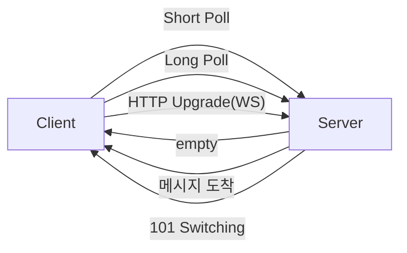
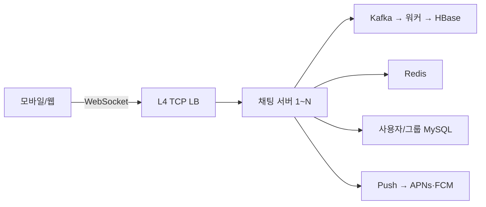
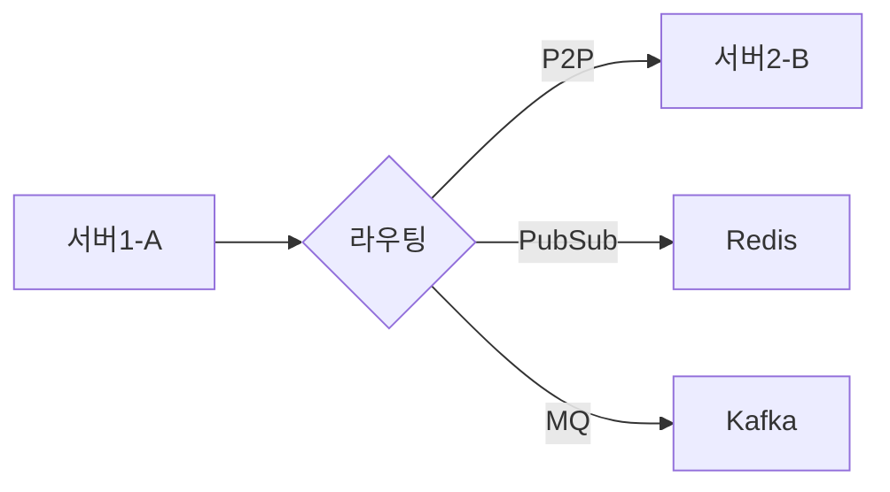
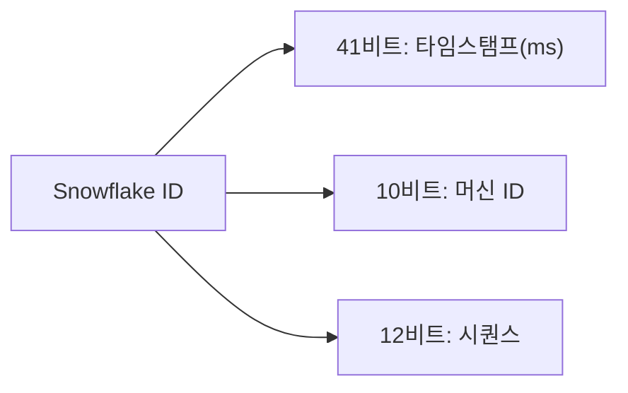
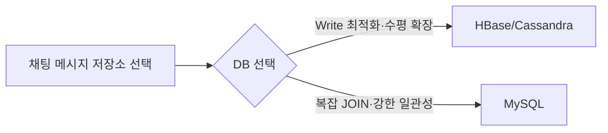
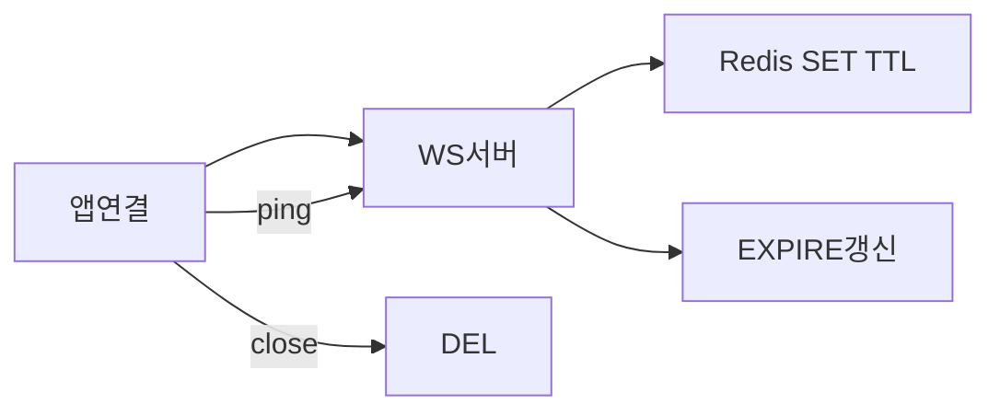
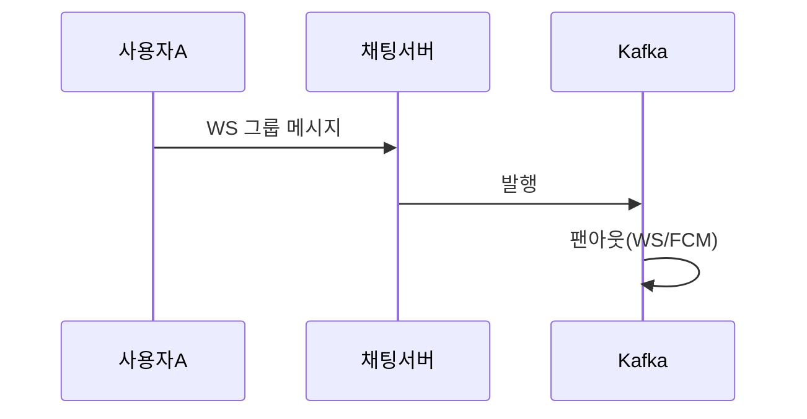

> **한 줄 요약**: 채팅 시스템의 핵심은 WebSocket으로 양방향 실시간 연결을 유지하고, Kafka로 메시지를 라우팅하며, HBase로 수 페타바이트 메시지를 저장하는 것이다.

## 실제 문제: 카카오톡 5억 명이 동시에 채팅하면?

2022년 카카오 데이터센터 화재로 카카오톡이 127시간 부분 마비됐습니다. 국내 MAU 4700만 명이 한꺼번에 접근하는 서비스가 단일 데이터센터에 의존하고 있었던 것입니다. 이 사건은 채팅 시스템 설계에서 **고가용성과 멀티 데이터센터**가 얼마나 중요한지를 극명하게 보여줬습니다.

채팅 시스템은 단순해 보이지만, 내부적으로 수많은 복잡한 문제를 해결해야 합니다:
- 실시간 양방향 통신 (HTTP는 단방향)
- 초당 70만 건의 메시지 처리
- 메시지 순서 보장 (동시 전송 시)
- 오프라인 사용자에게 Push 알림
- 수 페타바이트의 메시지 영구 저장

---

## 1. 요구사항 분석 및 규모 추정

### 기능 요구사항

1. 1:1 채팅 (실시간)
2. 그룹 채팅 (최대 100명)
3. 온라인/오프라인 상태 표시 (Presence)
4. 메시지 전송 확인 (1체크: 전송됨, 2체크: 읽음)
5. 미디어 파일 전송 (이미지, 동영상, 문서)
6. 앱 백그라운드 시 푸시 알림

### 비기능 요구사항

- 지연시간: 메시지 전달 **100ms 미만** (P99)
- 가용성: **99.99%** (연간 52분 이하 다운타임)
- 일관성: 메시지 순서 보장, 유실 없음
- 내구성: 메시지 영구 저장 (최소 5년)

### 규모 추정

```
DAU: 5억명
메시지/일: 5억 × 40개 = 200억건
메시지 QPS = 200억 / 86,400 ≈ 231,000 QPS
피크 QPS ≈ 700,000 QPS (피크는 평균의 3배)

메시지 크기: 텍스트 평균 100B
일일 저장: 200억 × 100B = 2TB/일
5년 저장: 2TB × 365 × 5 ≈ 3.65PB (미디어 제외)
미디어 포함: × 50배 = 182PB

WebSocket 연결 수: DAU의 30% 동시 접속 = 1억 5천만 연결
서버당 WebSocket 연결: 최대 10만개
필요 서버: 1억5천만 / 10만 = 1,500대
```

---

## 설계 의사결정 로드맵

이 시스템을 설계할 때 내려야 하는 핵심 결정 5가지를 순서대로 짚는다. 각 결정에서 "왜 이 선택인가"를 명확히 하지 않으면 면접에서 "그냥 HTTP 쓰면 되지 않나요?"라는 후속 질문에 답할 수 없다.

### 결정 1: 실시간 통신 프로토콜 — HTTP Polling vs SSE vs WebSocket

**문제**: 채팅은 서버가 먼저 메시지를 밀어넣어야 한다. 클라이언트가 요청해야만 응답하는 HTTP의 기본 모델로는 구현 자체가 불가능하거나 극도로 비효율적이다.

| 후보 | 장점 | 단점 | 언제 적합 |
|------|------|------|----------|
| Short Polling | 구현 단순 | 빈 요청 폭발, 최대 3초 지연 | 거의 없음 |
| Long Polling | HTTP 호환 | 연결당 스레드 점유, 수백ms 지연 | 구형 브라우저 지원 필수 |
| SSE | 서버→클라이언트 단방향 간단 | 클라이언트→서버는 별도 HTTP 필요 | 알림, 피드 업데이트 |
| WebSocket | 양방향 지속 연결, 수십ms 지연 | 연결당 파일 디스크립터 소비 | 채팅, 게임, 실시간 |

**우리의 선택: WebSocket**
- 이유: 채팅은 사용자 A→서버→사용자 B의 양방향 흐름이다. SSE는 서버→클라이언트 단방향이라 "메시지 보내기" 자체는 HTTP 요청으로 따로 처리해야 한다. WebSocket은 단일 연결로 양방향 스트림을 유지하므로 지연이 최소화된다. DAU 5억에서 동시 접속자 1억5천만 명이면 WebSocket 연결 1억5천만 개를 유지해야 하는데, 이는 L4 NLB + 연결당 메모리만 소비하는 WebSocket이 최적이다.
- 안 하면: Short Polling으로 500ms 간격으로 폴링하면 DAU 5억 기준 초당 10억 건의 빈 HTTP 요청이 발생한다. DB와 서버 모두 즉시 포화 상태가 된다.

### 결정 2: 메시지 저장소 — MySQL vs MongoDB vs HBase vs Cassandra

**문제**: 일일 200억 건, 5년간 3.65PB(미디어 제외)의 메시지를 저장해야 한다. 어떤 DB가 이 규모를 처리할 수 있는가?

| 후보 | 장점 | 단점 | 언제 적합 |
|------|------|------|----------|
| MySQL | ACID, 복잡한 조인 | 수평 확장 어려움, PB 스케일 불가 | 수천만 건 이하 |
| MongoDB | 유연한 스키마, 수평 확장 | 쓰기 집약적 워크로드에서 B-Tree 부하 | 문서형 데이터 |
| HBase | LSM Tree 쓰기 최적화, RowKey 기반 범위 조회 | 운영 복잡도 높음 | PB 스케일 시계열 |
| Cassandra | 쓰기 최적화, 멀티 DC 복제 | 쿼리 유연성 낮음 | 광역 분산 필요 시 |

**우리의 선택: HBase**
- 이유: 채팅 메시지는 "채팅방 ID + 역순 타임스탬프"로 RowKey를 구성하면 최신 메시지 50개를 항상 순차 스캔으로 조회할 수 있다. HBase의 LSM Tree 저장 엔진은 초당 70만 QPS 쓰기에 최적화되어 있고, 자동 샤딩(Region)으로 PB 스케일을 지원한다. Facebook Messenger도 이 아키텍처를 사용한다.
- 안 하면: MySQL에 일일 200억 건을 INSERT하면 B-Tree 인덱스 재구성 비용 때문에 DB가 즉시 포화된다. 샤딩을 해도 JOIN 없는 KV 접근 패턴에 MySQL의 ACID 오버헤드는 낭비다.

### 결정 3: 메시지 순서 보장 — DB Auto Increment vs UUID vs Snowflake ID

**문제**: 서버 20대가 동시에 메시지 ID를 생성한다. 채팅방에서 메시지가 "시간순으로" 표시되려면 ID가 단조 증가하면서도 전역 유일해야 한다.

| 후보 | 장점 | 단점 | 언제 적합 |
|------|------|------|----------|
| DB Auto Increment | 구현 단순 | 분산 환경에서 중복 발생, 단일 장애점 | 단일 서버 |
| UUID v4 | 전역 유일 | 128비트라 7자 단축 불가, 시간순 정렬 불가 | 순서 불필요 시 |
| Snowflake ID | 64비트, 타임스탬프 포함, 시간순 정렬, 분산 생성 | 워커 ID 관리 필요 | 대규모 분산 시스템 |

**우리의 선택: Snowflake ID**
- 이유: 41비트 타임스탬프 + 10비트 워커 ID + 12비트 시퀀스 = 64비트. 시간순 정렬이 ID만으로 가능하고, 초당 워커당 4096개, 전체 1024대 서버에서 초당 419만 개를 충돌 없이 생성한다. HBase의 RowKey에 포함하면 최신 메시지가 자동으로 앞에 위치한다.
- 안 하면: UUID를 쓰면 채팅방의 메시지를 정렬하기 위해 별도 created_at 컬럼이 필요하고, 밀리초가 같은 경우 순서가 불확정이다. 동시에 보낸 두 메시지의 순서가 클라이언트마다 다르게 보인다.

### 결정 4: 온라인 상태 관리 — DB vs Redis TTL vs Heartbeat

**문제**: "친구가 지금 온라인인가?"를 보여주려면 1억5천만 명의 온라인 상태를 실시간으로 추적해야 한다. 어떻게 저장하고 언제 "오프라인"으로 바꾸는가?

| 후보 | 장점 | 단점 | 언제 적합 |
|------|------|------|----------|
| DB 업데이트 | 영구 저장 | 초당 수백만 UPDATE, DB 포화 | 상태 변경이 드문 경우 |
| Redis TTL | 인메모리 고속, TTL로 자동 만료 | 서버 재시작 시 상태 손실 | 실시간 상태 추적 |
| Heartbeat + DB | 정확한 오프라인 감지 | DB 쓰기 부하, 지연 발생 | 정확성 중요 시 |

**우리의 선택: Redis TTL**
- 이유: `SET presence:{user_id} 1 EX 30` — 앱이 30초마다 heartbeat를 보내면 TTL이 갱신된다. 앱이 종료되거나 네트워크가 끊기면 30초 후 키가 자동 삭제되어 오프라인으로 전환된다. DB 쓰기 없이 Redis 인메모리로 1억5천만 명의 상태를 조회할 수 있다.
- 안 하면: DB에 `UPDATE users SET online=1, last_seen=NOW()` 를 초당 수백만 번 실행하면 DB 커넥션 풀이 즉시 고갈된다. 특히 "오프라인" 전환 감지를 위해 last_seen을 주기적으로 스캔하면 추가 부하가 발생한다.

### 결정 5: 미디어 전송 — 메시지에 포함 vs 별도 업로드+링크

**문제**: 이미지(수 MB), 동영상(수백 MB)을 텍스트 메시지와 같은 경로로 WebSocket으로 전송하면 어떻게 되는가?

| 후보 | 장점 | 단점 | 언제 적합 |
|------|------|------|----------|
| WebSocket에 직접 포함 | 단일 경로로 단순 | 대용량 파일이 연결 점유, 다른 메시지 지연 | 소용량(수 KB 이하) |
| 별도 HTTP 업로드 + S3 링크 | 업로드/메시지 경로 분리, CDN 활용 가능 | 클라이언트 로직 복잡 | 모든 미디어 |

**우리의 선택: 별도 업로드 + 링크**
- 이유: 100MB 동영상을 WebSocket으로 전송하면 해당 연결이 수분간 점유되어 텍스트 메시지가 밀린다. 미디어는 HTTP Multipart로 업로드 서버에 직접 전송하고, 완료 후 S3 URL만 WebSocket 메시지로 보낸다. 수신자는 필요할 때 CDN에서 원본을 lazy load한다.
- 안 하면: 그룹 채팅에서 한 명이 500MB 동영상을 업로드하면 해당 채팅 서버의 WebSocket 연결 대역폭이 포화되어 같은 서버에 연결된 다른 수만 명의 채팅이 전부 지연된다.

---

## 2. 핵심 기술: WebSocket

### HTTP Polling vs Long Polling vs WebSocket 비교

기존 HTTP는 **우체국** 방식입니다. 내가 편지를 보내야(요청) 답장이 옵니다(응답). 하지만 채팅은 **전화** 방식이어야 합니다. 상대방이 말하면 즉시 내 귀에 들려야 합니다.



| 방식 | 지연시간 | 서버 부하 | 실시간성 | 사용 케이스 |
|------|---------|---------|---------|-----------|
| Short Polling | 최대 3초 | 매우 높음 (폴링 요청) | 낮음 | 거의 사용 안 함 |
| Long Polling | 수백ms | 높음 (연결 유지) | 중간 | 구형 채팅, 알림 |
| WebSocket | 수십ms | 낮음 (연결당 메모리만) | 높음 | 채팅, 게임, 실시간 |
| SSE | 수십ms | 낮음 | 서버→클라이언트만 | 알림, 피드 업데이트 |

**실전 구현 — WebSocket 핸들러 (Spring Boot):**

```java
// WebSocket 설정
@Configuration
@EnableWebSocket
public class WebSocketConfig implements WebSocketConfigurer {

    private final ChatWebSocketHandler chatHandler;

    @Override
    public void registerWebSocketHandlers(WebSocketHandlerRegistry registry) {
        registry.addHandler(chatHandler, "/ws/chat")
                .setAllowedOrigins("*")
                // Handshake 인터셉터로 JWT 토큰 검증
                .addInterceptors(new JwtHandshakeInterceptor());
    }
}

// JWT Handshake 인터셉터 — 연결 전 인증
@Component
public class JwtHandshakeInterceptor implements HandshakeInterceptor {

    private final JwtTokenProvider jwtTokenProvider;

    @Override
    public boolean beforeHandshake(ServerHttpRequest request, ServerHttpResponse response,
                                   WebSocketHandler wsHandler, Map<String, Object> attributes) {
        String token = extractToken(request);
        if (token == null || !jwtTokenProvider.validateToken(token)) {
            response.setStatusCode(HttpStatus.UNAUTHORIZED);
            return false;  // 연결 거부
        }
        Long userId = jwtTokenProvider.getUserId(token);
        attributes.put("userId", userId);  // 세션에 userId 저장
        return true;
    }

    private String extractToken(ServerHttpRequest request) {
        List<String> authHeaders = request.getHeaders().get("Authorization");
        if (authHeaders != null && !authHeaders.isEmpty()) {
            String header = authHeaders.get(0);
            if (header.startsWith("Bearer ")) return header.substring(7);
        }
        // WebSocket은 헤더 커스텀이 어려워 쿼리 파라미터로도 수신
        URI uri = request.getURI();
        String query = uri.getQuery();
        if (query != null && query.contains("token=")) {
            return query.split("token=")[1].split("&")[0];
        }
        return null;
    }

    @Override
    public void afterHandshake(ServerHttpRequest request, ServerHttpResponse response,
                               WebSocketHandler wsHandler, Exception exception) {}
}

// WebSocket 핸들러 — 메시지 수신·발송 처리
@Component
@RequiredArgsConstructor
public class ChatWebSocketHandler extends TextWebSocketHandler {

    private final MessageService messageService;
    private final PresenceService presenceService;
    private final ObjectMapper objectMapper;

    // 연결된 세션 관리: userId → WebSocketSession
    // ConcurrentHashMap으로 스레드 안전하게 관리
    private final Map<Long, WebSocketSession> sessions = new ConcurrentHashMap<>();

    @Override
    public void afterConnectionEstablished(WebSocketSession session) {
        Long userId = (Long) session.getAttributes().get("userId");
        sessions.put(userId, session);

        // Redis에 온라인 상태 등록 (TTL 30초)
        presenceService.setOnline(userId);
        System.out.println("User " + userId + " connected. Total: " + sessions.size());
    }

    @Override
    protected void handleTextMessage(WebSocketSession session, TextMessage message) throws Exception {
        Long senderId = (Long) session.getAttributes().get("userId");
        ChatMessage chatMessage = objectMapper.readValue(message.getPayload(), ChatMessage.class);
        chatMessage.setSenderId(senderId);

        switch (chatMessage.getType()) {
            case CHAT -> handleChatMessage(chatMessage);
            case PING -> handlePing(session, senderId);
            case READ -> handleReadReceipt(chatMessage, senderId);
        }
    }

    private void handleChatMessage(ChatMessage msg) throws Exception {
        // 1. 메시지 저장 (Kafka → HBase)
        SavedMessage saved = messageService.saveMessage(msg);

        // 2. 수신자가 같은 서버에 연결되어 있으면 직접 전달
        WebSocketSession receiverSession = sessions.get(msg.getReceiverId());
        if (receiverSession != null && receiverSession.isOpen()) {
            String payload = objectMapper.writeValueAsString(saved);
            receiverSession.sendMessage(new TextMessage(payload));
        } else {
            // 3. 다른 서버에 있거나 오프라인이면 Kafka로 발행 → 해당 서버가 라우팅 or FCM Push
            messageService.publishToKafka(saved);
        }
    }

    private void handlePing(WebSocketSession session, Long userId) throws Exception {
        // Heartbeat: Redis TTL 갱신으로 온라인 상태 유지
        presenceService.refreshTtl(userId);
        session.sendMessage(new TextMessage("{\"type\":\"PONG\"}"));
    }

    private void handleReadReceipt(ChatMessage msg, Long userId) {
        messageService.markAsRead(msg.getMessageId(), userId);
    }

    @Override
    public void afterConnectionClosed(WebSocketSession session, CloseStatus status) {
        Long userId = (Long) session.getAttributes().get("userId");
        sessions.remove(userId);
        presenceService.setOffline(userId);
        System.out.println("User " + userId + " disconnected: " + status);
    }

    @Override
    public void handleTransportError(WebSocketSession session, Throwable exception) {
        Long userId = (Long) session.getAttributes().get("userId");
        sessions.remove(userId);
        presenceService.setOffline(userId);
    }
}

// Kafka 메시지 저장 서비스
@Service
@RequiredArgsConstructor
public class MessageService {

    private final KafkaTemplate<String, SavedMessage> kafkaTemplate;
    private final SnowflakeIdGenerator idGenerator;
    private static final String TOPIC = "chat-messages";

    public SavedMessage saveMessage(ChatMessage msg) {
        SavedMessage saved = SavedMessage.builder()
                .id(idGenerator.nextId())          // Snowflake ID
                .senderId(msg.getSenderId())
                .receiverId(msg.getReceiverId())
                .content(msg.getContent())
                .type(msg.getType())
                .sentAt(Instant.now())
                .build();
        return saved;
    }

    // Kafka로 발행 → Consumer가 HBase에 영구 저장
    public void publishToKafka(SavedMessage message) {
        // Partition Key = conversationId → 같은 대화방 메시지는 같은 파티션에 순서 보장
        String partitionKey = message.getConversationId().toString();
        kafkaTemplate.send(TOPIC, partitionKey, message);
    }
}

// Kafka Consumer — HBase 영구 저장
@Component
@RequiredArgsConstructor
public class MessageStorageConsumer {

    private final HBaseMessageRepository hbaseRepository;

    @KafkaListener(topics = "chat-messages", groupId = "message-storage",
                   concurrency = "10")  // 10개 스레드로 병렬 처리
    public void consume(ConsumerRecord<String, SavedMessage> record) {
        SavedMessage message = record.value();
        // HBase RowKey: {conversationId}_{Long.MAX_VALUE - messageId}
        // → 역순 정렬로 최신 메시지가 앞에 위치
        hbaseRepository.save(message);
    }
}
```

### WebSocket 핸드셰이크 상세

```http
# 클라이언트 → 서버 (HTTP Upgrade)
GET /chat HTTP/1.1
Host: chat.kakao.com
Upgrade: websocket
Connection: Upgrade
Sec-WebSocket-Key: dGhlIHNhbXBsZSBub25jZQ==
Sec-WebSocket-Version: 13

# 서버 → 클라이언트 (프로토콜 전환 완료)
HTTP/1.1 101 Switching Protocols
Upgrade: websocket
Connection: Upgrade
Sec-WebSocket-Accept: s3pPLMBiTxaQ9kYGzzhZRbK+xOo=
# 이후 HTTP가 아닌 WebSocket 프레임으로 통신
```

### 왜 이게 중요한가?

WebSocket 연결은 TCP 연결을 유지하므로, 서버 당 동시 연결 수가 핵심 병목입니다. Linux 기본 설정에서 파일 디스크립터 제한이 1024개이므로, `/etc/security/limits.conf`에서 `nofile=1000000`으로 늘려야 합니다. L7 ALB도 WebSocket을 지원하지만, L4 NLB가 HTTP 파싱 오버헤드 없이 더 효율적입니다. 수십만 동시 연결에서는 L4가 권장됩니다.

---

## 3. 전체 아키텍처



---

## 4. 메시지 전송 흐름 상세

### 1:1 채팅 메시지 완전 흐름

채팅서버 →(WS/Push 전달)→ UserB

### 서버 간 메시지 라우팅 문제

A가 서버1에, B가 서버2에 연결되어 있을 때 어떻게 메시지를 전달할까요?



---

## 5. 메시지 ID 설계 — Snowflake ID

메시지 순서 보장과 전역 유일성을 위해 **Snowflake ID**를 사용합니다. Twitter가 2010년에 설계한 분산 ID 생성 알고리즘입니다.



```java
public class SnowflakeIdGenerator {
    private static final long EPOCH = 1609459200000L; // 2021-01-01 기준
    private static final long WORKER_ID_BITS = 10L;
    private static final long SEQUENCE_BITS = 12L;

    private static final long MAX_WORKER_ID = ~(-1L << WORKER_ID_BITS); // 1023
    private static final long MAX_SEQUENCE = ~(-1L << SEQUENCE_BITS);   // 4095

    private final long workerId;
    private long lastTimestamp = -1L;
    private long sequence = 0L;

    public SnowflakeIdGenerator(long workerId) {
        if (workerId < 0 || workerId > MAX_WORKER_ID) {
            throw new IllegalArgumentException("workerId must be 0~1023");
        }
        this.workerId = workerId;
    }

    public synchronized long nextId() {
        long timestamp = currentTime();

        if (timestamp < lastTimestamp) {
            // 시계 역행 감지 — 치명적 버그 방지
            throw new RuntimeException("Clock moved backwards by "
                + (lastTimestamp - timestamp) + "ms");
        }

        if (timestamp == lastTimestamp) {
            sequence = (sequence + 1) & MAX_SEQUENCE;
            if (sequence == 0) {
                // 같은 ms에 4096개 소진 → 다음 ms까지 스핀 대기
                timestamp = waitNextMillis(lastTimestamp);
            }
        } else {
            sequence = 0;
        }

        lastTimestamp = timestamp;

        return ((timestamp - EPOCH) << 22)
             | (workerId << 12)
             | sequence;
    }

    private long waitNextMillis(long lastTimestamp) {
        long timestamp = currentTime();
        while (timestamp <= lastTimestamp) {
            timestamp = currentTime();
        }
        return timestamp;
    }

    private long currentTime() {
        return System.currentTimeMillis();
    }
}
```

### 실무에서 자주 하는 실수

Snowflake ID는 **각 서버(Worker)가 독립적으로 생성**하므로 워커 ID가 겹치면 안 됩니다. Kubernetes Pod 재시작 시 워커 ID가 바뀌거나 중복될 수 있습니다. **ZooKeeper 또는 Redis를 통해 워커 ID를 동적으로 할당**해야 합니다.

---

## 6. 메시지 저장소 설계

### 왜 RDBMS가 아닌 HBase/Cassandra인가?



### HBase 스키마 설계

```
테이블: messages
RowKey: {channel_id}_{reversed_timestamp}
  → reversed_timestamp = Long.MAX_VALUE - timestamp
  → 최신 메시지가 앞에 위치 (HBase는 RowKey 순으로 저장)

컬럼 패밀리: msg
  - msg:id       → Snowflake 메시지 ID
  - msg:sender   → 발신자 ID
  - msg:type     → text / image / video / file
  - msg:content  → 텍스트 내용 (미디어는 S3 URL)
  - msg:status   → sent / delivered / read

예시 RowKey:
ch001_9223372036854775807  → 가장 최신 메시지 (역순)
ch001_9223372036854775806
ch001_9223372036854775805

채팅방 최근 50개 메시지 조회:
Scan(startRow="ch001_", limit=50)
→ 역순으로 최신 50개 반환
```

### 대화 목록 스키마 (MySQL)

채팅방 목록, 멤버 정보 같은 **관계형 데이터**는 MySQL에 저장합니다.

```sql
-- 대화방 정보
CREATE TABLE conversations (
    id              BIGINT PRIMARY KEY,
    type            ENUM('direct', 'group') NOT NULL,
    name            VARCHAR(200),             -- 그룹 채팅명
    created_at      DATETIME NOT NULL,
    last_message_id BIGINT,
    last_message_at DATETIME,
    INDEX idx_last_msg_at (last_message_at)
);

-- 대화방 멤버
CREATE TABLE conversation_members (
    conversation_id BIGINT NOT NULL,
    user_id         BIGINT NOT NULL,
    joined_at       DATETIME NOT NULL,
    last_read_msg_id BIGINT DEFAULT 0,       -- 읽음 위치 추적
    notification_enabled BOOLEAN DEFAULT TRUE,
    PRIMARY KEY (conversation_id, user_id),
    INDEX idx_user_conversations (user_id, last_read_msg_id)
);
```

---

## 7. 온라인 상태 서비스 (Presence)

### 온라인 상태 추적 — Redis TTL 활용



### Presence 최적화 — 대규모에서의 팬아웃 문제

친구가 100명이면 온라인 상태 변경 시 100번의 이벤트를 발행해야 합니다. DAU 5억 명이 평균 100명의 친구를 가지면 상태 변경 이벤트만 초당 수백만 건입니다.

```
해결 전략:
1. Lazy Loading: 채팅방을 열 때만 상대방 상태를 조회 (실시간 구독 안 함)
2. 구독 그룹 제한: 최근 대화한 20명만 실시간 상태 구독
3. 배치 갱신: 상태 변경을 1초 단위로 묶어서 전파
4. 그룹 채팅에서는 Presence 비활성화: 100명 그룹에서 개별 상태 표시 불필요
```

---

## 8. 그룹 채팅 설계

### 1:1 채팅과의 차이점

그룹 채팅은 1:1 채팅의 단순한 확장이 아닙니다. 메시지 하나를 보내면 **최대 99명에게 동시에 전달**해야 하므로 팬아웃 문제가 핵심입니다.



### 팬아웃 전략: Write-time vs Read-time

```
Write-time 팬아웃 (카카오톡 방식):
  메시지 전송 시 각 멤버의 수신함에 메시지를 복사
  장점: 읽기가 빠름 (자기 수신함만 조회)
  단점: 쓰기 증폭 (100명 그룹이면 100배)
  적합: 소규모 그룹 (최대 100명)

Read-time 팬아웃 (Twitter Timeline 방식):
  메시지는 원본 1개만 저장, 읽을 때 그룹 메시지를 조회
  장점: 쓰기 효율적
  단점: 읽기 시 조회 비용 증가
  적합: 대규모 채널 (수만 명)

카카오톡 선택: Write-time (그룹 최대 100명 제한이므로 쓰기 증폭 허용 가능)
```

### 읽음 확인 (그룹)

1:1에서는 "읽음/안읽음"이 전부이지만, 그룹에서는 **100명 중 몇 명이 읽었는지** 추적해야 합니다.

```
데이터 구조 (Redis Hash):
  Key: read:{message_id}
  Field: {user_id}
  Value: {read_timestamp}

  예시:
  read:msg_12345 → { "userB": 1717200000, "userC": 1717200005 }
  읽지 않은 수 = 그룹 멤버 수 - Hash 크기

최적화:
  - 읽음 이벤트는 실시간 전파하지 않고 5초 배치로 묶어 전송
  - 오래된 메시지(7일 이후)의 읽음 상태는 HBase로 아카이브
```

---

## 9. 미디어 전송 설계

### 이미지/동영상 전송 흐름

텍스트 메시지와 달리 미디어 파일은 크기가 수 MB~수 GB입니다. WebSocket으로 직접 보내면 연결이 오래 점유되어 다른 메시지가 지연됩니다.

participant A as UserA participant UP as Upload/S3 participant S as Chat/UserB

### 미디어 최적화 전략

```
1. 업로드와 메시지를 분리:
   미디어는 HTTP로 업로드 서버에, 메시지는 WebSocket으로 채팅 서버에
   → WebSocket 연결을 대용량 파일 전송으로 점유하지 않음

2. 썸네일 즉시, 원본 지연 로드:
   채팅 목록에서는 200×200 썸네일만 표시 (수 KB)
   사용자가 탭하면 원본(수 MB) 로드 → 대역폭 90% 절감

3. CDN 캐싱:
   자주 공유되는 이미지는 CDN 엣지에 캐싱
   원본 S3까지 갈 필요 없이 가까운 CDN에서 응답

4. 파일 크기 제한:
   이미지: 최대 20MB
   동영상: 최대 300MB (업로드 후 서버 측 트랜스코딩)
   해상도 자동 조정: 원본 보존 + 저해상도 버전 생성

5. 만료 정책:
   1:1 미디어: 영구 보관
   그룹 미디어: 1년 후 S3 Glacier로 이동 (비용 절감)
```

---


## 극한 시나리오

### 시나리오 1: 서버 장애 시 메시지 유실 방지

```
상황: 사용자A가 메시지를 보냈고 채팅서버1이 Kafka에 발행 직후 크래시
      사용자B의 채팅서버2는 Kafka에서 메시지를 소비해서 B에게 전달 완료
      하지만 채팅서버1이 죽었으므로 A에게 전송 확인(1체크)을 못 보냄

방어:
  1. 클라이언트 측 재시도: A의 앱이 ACK를 못 받으면 client_id(UUID)와 함께
     재전송. 서버는 client_id로 중복 감지 → 멱등성 보장
  2. Kafka에 이미 저장됐으므로 B에게는 정상 전달됨
  3. A가 재연결하면 미전송 확인 메시지 일괄 전달
```

### 시나리오 2: 네트워크 파티션 — 멀티 데이터센터 분리

```
상황: 한국 IDC와 미국 IDC 간 네트워크 단절
      한국 사용자끼리는 정상, 미국 사용자끼리도 정상
      한국 → 미국 메시지가 전달 안 됨

방어:
  1. 각 IDC에 독립 Kafka 클러스터 + MirrorMaker2로 cross-DC 복제
  2. 네트워크 복구 시 MirrorMaker2가 밀린 메시지를 순서대로 동기화
  3. 사용자에게 "일부 메시지가 지연될 수 있습니다" UI 표시
  4. 메시지 ID가 Snowflake(타임스탬프 기반)이므로 동기화 후 정렬 가능
```

### 시나리오 3: 초대형 그룹 메시지 폭풍 — 팬아웃 폭발

```
상황: 100명 그룹에서 80명이 동시에 메시지 전송 (새해 자정 인사)
      1초에 80건 × 99명 팬아웃 = 7,920건의 전달 이벤트
      그룹이 수만 개면 팬아웃이 초당 수백만 건으로 폭발

방어:
  1. 메시지 배치: 같은 그룹의 메시지를 100ms 윈도우로 묶어 한 번에 팬아웃
  2. 그룹 크기별 전략 분리:
     - 소규모(~20명): Write-time 팬아웃 (각 멤버 수신함에 복사)
     - 대규모(20~100명): 그룹 채널 기반 구독 (멤버가 채널을 poll)
  3. 핫 그룹 감지: 초당 메시지 수가 임계값 초과 시 rate limiting 적용
  4. 클라이언트 측 배치 렌더링: 수백 건의 메시지를 한 번에 받아 묶어 표시
```

### 시나리오 4: 카카오 사태 재발 — 단일 데이터센터 장애

```
상황: 메인 데이터센터 화재/정전으로 전체 서비스 마비
      2022년 카카오 127시간 장애의 재현

방어:
  1. Active-Active 멀티 DC: 최소 2개 데이터센터에서 동시 서빙
  2. DNS 기반 페일오버: DC1 장애 시 DNS가 DC2로 자동 전환 (TTL 60초)
  3. 데이터 동기화: Kafka MirrorMaker2로 DC 간 실시간 복제
  4. 정기 DR 훈련: 분기 1회 DR 전환 훈련으로 실제 전환 시간 검증
  5. 핵심 데이터 3중 복제: 메시지는 2개 DC + S3 백업

비용 vs 리스크:
  Active-Active는 인프라 비용 2배이지만,
  127시간 장애의 비즈니스 손실(광고 수익, 사용자 이탈)에 비하면 보험료 수준
```

---

## 10. 보안 고려사항

> **비유**: 우체국이 아무리 빠르게 편지를 배달해도, 봉투를 열어볼 수 있다면 의미가 없다. 채팅 시스템에서 서버조차 내용을 읽을 수 없어야 진짜 프라이버시다.

**E2E(End-to-End) 암호화 — Signal Protocol 기반**

- **키 교환**: X3DH(Extended Triple Diffie-Hellman) 알고리즘으로 두 사용자가 서버를 통하지 않고 공유 비밀키를 수립한다. 서버는 공개키만 보관하며 개인키를 절대 알 수 없다
- **메시지 암호화**: Double Ratchet 알고리즘으로 메시지마다 새 키를 파생한다. 키 하나가 노출돼도 다른 메시지는 안전하다(Forward Secrecy)
- **서버는 암호문만 저장**: 서버 DB에는 복호화 불가능한 암호화된 바이트만 저장된다. DB 해킹이나 수사 영장에도 내용을 제공할 수 없다

**그룹 채팅 — Sender Key**

1:1 E2E를 그룹에 그대로 적용하면 100명 그룹에서 메시지 하나를 100번 암호화해야 한다. **Sender Key** 방식은 발신자가 그룹 전용 키 하나를 생성하고 각 멤버에게 1:1로 안전하게 배포한다. 이후 메시지는 그룹 키로 한 번만 암호화한다.

**메시지 만료**

Signal의 "사라지는 메시지"처럼 TTL을 설정하면 클라이언트와 서버 양쪽에서 지정 시간 후 메시지를 삭제한다. 기기 도난 시 과거 대화 노출을 제한한다.

---

### 꼭 직접 만들어야 하는가? — Build vs Buy

| 선택지 | 장점 | 단점 | 적합한 시점 |
|--------|------|------|-----------|
| Firebase Realtime DB / Pusher | 코드 10줄로 채팅 구현, MAU 10만까지 무료~저가 | 커스텀 암호화·번역 불가, 벤더 종속 | Phase 1~2 |
| Sendbird / Stream Chat | 엔터프라이즈 채팅 SDK, 읽음 확인/스레드/검색 내장 | MAU 증가 시 비용 급등, 내부 데이터 외부 저장 | Phase 2~3 |
| 직접 구축 (WebSocket + Kafka + HBase) | 완전한 제어, MAU 1000만+ 시 비용 최적 | 구현 복잡도 높음, 운영 인력 필요 | Phase 3~4 |

**실무 판단 기준**: 메시지 커스텀 로직(암호화, 번역)이 필요하거나, SaaS 비용이 직접 운영 비용의 3배를 넘을 때 전환한다.

> 핵심: Phase 1에서 직접 구축하면 오버 엔지니어링이고, Phase 3에서 SaaS에 의존하면 비용 폭발이다. 현재 MAU에 맞는 선택을 하고, 병목이 실제로 발생할 때 전환한다.

---

## Day 1에서 Scale까지 — 아키텍처는 어떻게 진화하는가

**Phase 1: MAU 1만 (Day 1)**
- Firebase Realtime DB 단일 서버로 시작. 웹소켓 없이 Firebase SDK로 실시간 동기화. 별도 인프라 없이 빠르게 출시한다.
- 월 비용: ~$30 (Firebase Spark 플랜)

**Phase 2: MAU 100만**
- 직접 WebSocket 서버를 구축한다. 사용자당 1개 WebSocket 연결 유지. Redis로 온라인 상태와 메시지 큐를 관리한다. MySQL에 메시지를 저장한다.
- 월 비용: ~$1,500 (EC2 WebSocket 서버 5대 + RDS + ElastiCache)

**Phase 3: MAU 1000만**
- WebSocket 서버를 클러스터화하고 Kafka로 메시지 라우팅을 분리한다. HBase로 메시지 저장소를 교체해 수십 억 건 메시지를 처리한다. Snowflake ID로 분산 메시지 ID를 생성한다.
- 월 비용: ~$15,000 (WebSocket 클러스터 + Kafka + HBase 클러스터)

**Phase 4: MAU 1억**
- 멀티 리전 Active-Active 구성. 한국/일본/동남아 각 리전에 독립 WebSocket 클러스터를 두고 Kafka MirrorMaker2로 DC 간 메시지를 복제한다. DNS 기반 페일오버로 리전 장애 시 자동 전환한다.
- 월 비용: ~$150,000+ (멀티 리전 클러스터, 글로벌 CDN, MirrorMaker)

---

## 이것만 모니터링하면 된다 — 핵심 메트릭 5개

| 메트릭 | 정상 범위 | 경고 임계값 | 장애 의미 |
|--------|----------|------------|---------|
| WebSocket 동시 연결 수 | 서버당 < 5만 | 서버당 > 8만 | 연결 수 한계 → 신규 연결 거부 |
| 메시지 전달 지연 (P99) | < 100ms | > 500ms | Kafka 컨슈머 지연 또는 WebSocket 서버 과부하 |
| 미전달 메시지 큐 크기 | < 1,000건 | > 10,000건 | 오프라인 사용자 급증 또는 Push 실패 |
| Kafka 컨슈머 랙 | < 1,000 | > 50,000 | 팬아웃 처리 속도 한계 → 메시지 지연 폭발 |
| HBase 쓰기 지연 (P99) | < 10ms | > 50ms | Compaction 백로그 또는 RegionServer 과부하 |

---

## 실제로 이런 일이 일어났다 — 실전 장애 사례

**사례 1: 카카오 데이터센터 화재 (2022년 10월)**
- **상황**: SK C&C 판교 데이터센터 화재로 카카오톡을 포함한 카카오 서비스 전체가 127시간 중단
- **원인**: 카카오 서비스의 약 32,000대 서버 중 대다수가 단일 데이터센터에 집중. 예비 전원 장치 이상으로 화재 발생 후 서버 전체가 순차 다운
- **해결**: 분산 배치된 일부 서버로 수동 복구 시도. 카카오페이·카카오맵 등 일부 서비스는 수일 후에도 완전 복구 안 됨
- **교훈**: 채팅 시스템은 가장 먼저 켜지고 가장 나중에 꺼진다(재난 상황 연락 수단). Active-Active 멀티 DC 없이는 단일 물리 장애에 속수무책이다. DR 훈련을 안 하면 DR 계획서는 종이에 불과하다

**사례 2: AWS 서울 리전 간헐적 장애 (2021년 3월)**
- **상황**: AWS ap-northeast-2(서울) 리전 일부 가용 영역 장애로 국내 다수 서비스 수 시간 중단
- **원인**: AWS 내부 네트워킹 장비 이슈. 단일 AZ에만 배포한 서비스는 전면 장애
- **해결**: 멀티 AZ 구성된 서비스는 자동 페일오버로 수 분 내 복구
- **교훈**: 멀티 AZ는 선택이 아닌 기본이다. WebSocket 서버를 단일 AZ에 몰아두면 AZ 장애 시 모든 연결이 끊긴다. 연결 수 기반 오토스케일링 설정도 AZ별로 분산해야 한다

---
---

## 실무에서 놓치기 쉬운 케이스

### 오프라인 메시지 — 상대가 꺼져 있을 때 어디에 쌓이는가

수신자가 오프라인이면 WebSocket 연결 자체가 없다. 이 메시지를 어디에 보관하고 재연결 시 어떻게 전달할까?

```
설계 흐름:
1. 송신자가 메시지 전송 → 채팅 서버가 수신자 온라인 여부 확인 (Redis TTL 조회)
2. 수신자 오프라인이면 → HBase에 메시지 저장 + FCM Push 발송 (앱 백그라운드 깨우기)
3. 수신자가 앱을 열면 → WebSocket 재연결 직후 "마지막 수신 메시지 ID" 이후 미읽음 메시지 일괄 Pull
4. 클라이언트가 cursor 기반으로 미전달 메시지를 HBase에서 배치 조회해 렌더링
```

놓치기 쉬운 지점: 오프라인 중 메시지가 1000개 쌓이면 재접속 시 한꺼번에 Pull하면 응답이 느려진다. 페이지네이션(50개씩)으로 점진적 로딩이 필요하다.

### 메시지 순서 역전 — "안녕"보다 "뭐해?"가 먼저 도착하는 문제

모바일 환경에서 패킷이 다른 경로로 도착하면 전송 순서와 수신 순서가 역전된다.

```
잘못된 설계: 수신 순서대로 렌더링
  송신: [msg_100: "안녕"] → [msg_101: "뭐해?"]
  수신: [msg_101: "뭐해?"] → [msg_100: "안녕"]  ← 화면에 순서가 뒤바뀜

올바른 설계: Snowflake ID(타임스탬프 포함)로 정렬
  클라이언트가 수신된 메시지를 ID 기준으로 정렬 후 렌더링
  서버도 HBase RowKey(역순 타임스탬프)로 정렬을 보장
  → 네트워크 지연에 무관하게 항상 올바른 순서 표시
```

### 그룹채팅 읽음 처리 — 100명 방에서 DB 쓰기 폭발

100명 그룹에서 메시지 1개가 오면 100명 각자의 "읽음 시각"을 DB에 기록해야 한다. 메시지 1000개짜리 대화방에서 100명이 스크롤하면 10만 건의 읽음 이벤트가 발생한다.

```
비효율적 설계:
  읽음 이벤트마다 즉시 DB INSERT → DB 포화

효율적 설계:
  1. 읽음 이벤트를 Redis Hash에 버퍼링
     HSET read:msg_id  user_id  timestamp
  2. 5초 배치로 Redis 데이터를 HBase에 flush
  3. "읽지 않은 수"는 Redis Hash 크기로 실시간 계산
     unread = 그룹 멤버 수 - HLEN read:msg_id
  4. 7일 이상 지난 메시지의 읽음 상태는 TTL로 자동 만료
```

이렇게 하면 DB 쓰기를 최대 90% 줄이면서 읽음 수 표시가 실시간으로 유지된다.

### 메시지 철회 — 이미 상대 기기에 도달한 메시지는 어떻게 지우나

"철회"는 단순 삭제와 다르다. 삭제는 내 화면에서만 없애지만, 철회는 상대방 화면에서도 "삭제된 메시지입니다"로 교체해야 한다.

```
철회 흐름:
1. 철회 요청 → 서버가 HBase의 msg:status를 "withdrawn"으로 업데이트 (Append-Only이므로 역분개 레코드 추가)
2. Kafka에 "메시지 철회" 이벤트 발행
3. 팬아웃 워커가 그룹 멤버 중 온라인인 사람에게 WebSocket으로 철회 이벤트 전송
4. 오프라인인 멤버가 재접속하면 해당 메시지 조회 시 status=withdrawn → "삭제된 메시지" 표시

핵심 제약:
  - 이미 클라이언트 기기에 다운로드된 메시지는 서버에서 강제로 지울 수 없음
  - 철회는 UI 처리이므로, 앱을 루팅/탈옥한 기기에서는 원본 열람이 이론상 가능
  - 2분 이내 철회만 허용하는 정책을 서버에서 강제 (카카오톡 방식)
```

---

## 11. 핵심 설계 결정 요약

| 설계 항목 | 선택 | 이유 |
|-----------|------|------|
| 실시간 프로토콜 | WebSocket | 양방향, 저지연, 서버 push 가능 |
| 로드밸런서 | L4 TCP | WebSocket 연결 유지 (L7은 HTTP 종료) |
| 메시지 라우팅 | Kafka | 내구성, 순서 보장, 700K QPS 처리 |
| 메시지 저장소 | HBase | 쓰기 최적화(LSM Tree), 수평 확장, PB 스케일 |
| 관계형 데이터 | MySQL | 사용자/그룹 정보, 강한 일관성 |
| 메시지 ID | Snowflake | 시간순 정렬, 분산 생성, 초당 419만 TPS |
| 온라인 상태 | Redis TTL | 30초 TTL로 자동 만료, 빠른 조회 |
| 미디어 저장 | S3 + CDN | 비용 효율적, 글로벌 배포, 내구성 99.999999999% |
| 그룹 팬아웃 | Write-time | 그룹 최대 100명 제한으로 쓰기 증폭 허용 |
| 읽음 확인 | Redis Hash | 멤버별 읽음 시각 추적, 빠른 카운팅 |
| Push 알림 | FCM/APNs | 오프라인 사용자 도달, 플랫폼 표준 |
| 고가용성 | Active-Active 멀티 DC | 단일 DC 장애 시에도 서비스 유지 |

---

## 면접 포인트

**Q1. 1:1 채팅과 그룹 채팅의 메시지 저장 스키마를 어떻게 다르게 설계하나요?**
A. 1:1은 conversation_id + sender_id + content 단순 구조로 충분하다. 그룹 채팅은 group_id 기준으로 메시지를 저장하고, 읽음 상태는 별도 테이블(member_id, message_id, read_at)로 분리해 멤버별 추적이 가능하게 한다.

**Q2. 오프라인 사용자에게 메시지를 어떻게 전달하나요?**
A. 서버는 WebSocket 연결 여부를 확인하고, 오프라인이면 FCM/APNs를 통해 푸시 알림을 보낸다. 사용자가 재접속하면 마지막 확인 메시지 ID 이후의 메시지를 폴링으로 가져온다.

**Q3. 메시지 순서 보장을 어떻게 구현하나요?**
A. 메시지 ID에 Snowflake처럼 타임스탬프를 포함시키거나, 채팅방별 단조 증가 sequence를 Redis나 DB로 관리한다. 클라이언트는 sequence 순서대로 렌더링하고, 갭이 있으면 서버에서 재조회한다.

**Q4. 대규모 그룹(10만 명)에서 팬아웃을 어떻게 처리하나요?**
A. Write-time 팬아웃은 수십 명까지만 적합하다. 10만 명 그룹은 Read-time 팬아웃으로 전환해, 메시지를 한 번만 저장하고 읽을 때 그룹 멤버 목록으로 조회하게 한다. Kafka로 파티셔닝하여 병렬 처리한다.

**Q5. WebSocket 연결이 끊어졌을 때 재연결 전략은?**
A. 지수 백오프(1s → 2s → 4s → 최대 30s)로 재연결을 시도한다. 재연결 성공 시 마지막 수신 메시지 ID를 서버에 전달해 누락된 메시지를 동기화한다. Heartbeat ping/pong으로 연결 상태를 주기적으로 확인한다.
