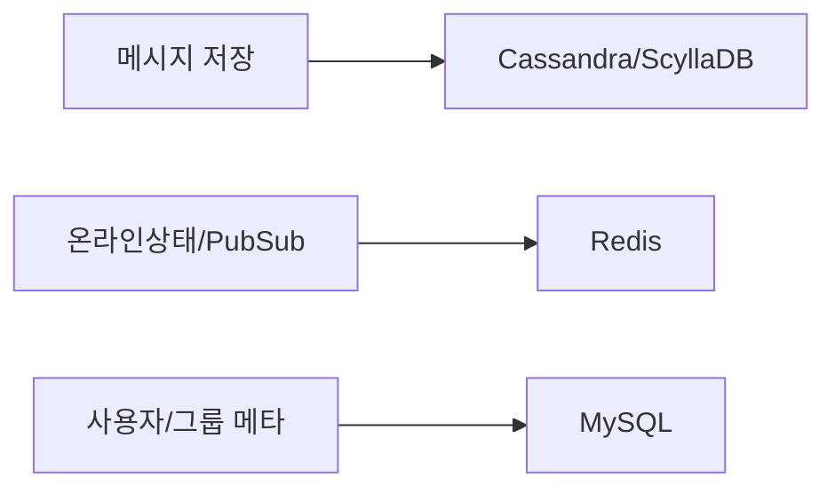
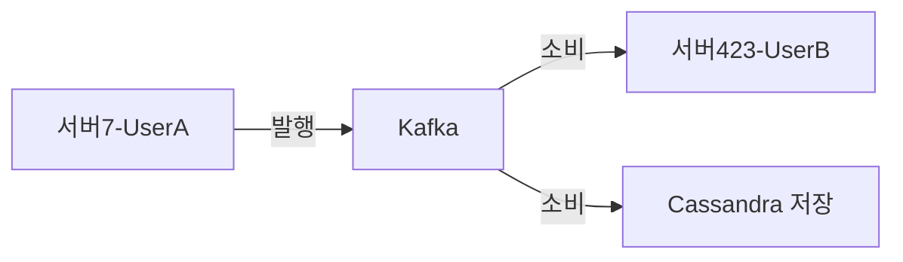
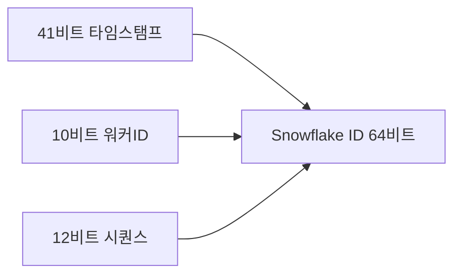
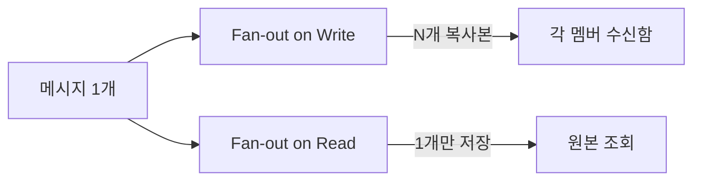
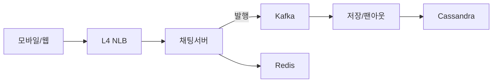
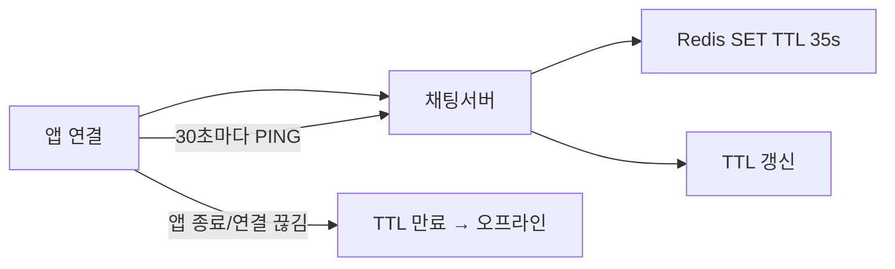
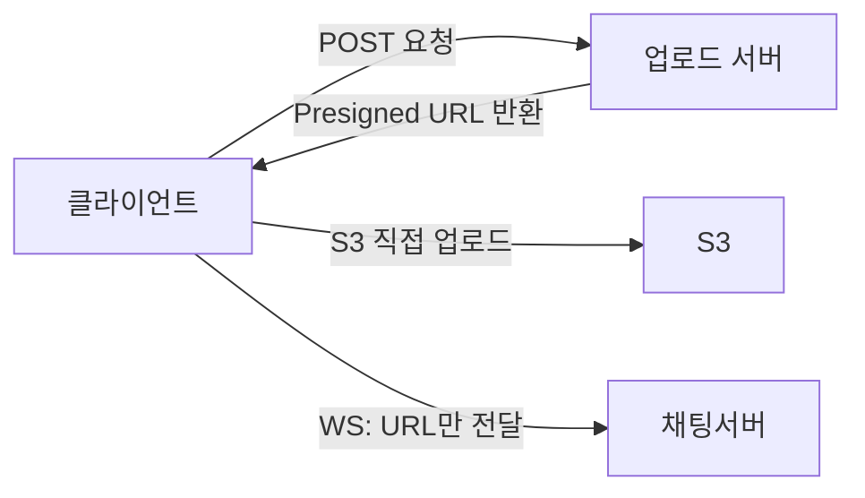

> **한 줄 요약**: 채팅 시스템은 WebSocket으로 양방향 실시간 연결을 유지하고, Kafka로 서버 간 메시지를 라우팅하며, Cassandra로 수 페타바이트 메시지를 저장한다. 각 선택에는 "왜 이것이어야 하는가"라는 명확한 근거가 있다.

## 왜 채팅 시스템이 어려운가

2022년 카카오 데이터센터 화재로 카카오톡이 127시간 부분 마비됐습니다. 국내 MAU 4,700만 명이 한꺼번에 접근하는 서비스가 단일 데이터센터에 의존하고 있었기 때문입니다. 이 사건은 채팅 시스템 설계에서 **아키텍처 선택의 이유**가 얼마나 중요한지를 극명하게 보여줍니다.

면접관이 "왜 WebSocket인가요?", "왜 Cassandra인가요?"라고 물을 때, "실시간이라서요"나 "대용량이라서요"라는 답변은 탈락하는 답변입니다. 이 글은 각 선택의 **WHY**를 숫자와 트레이드오프로 정확하게 설명하는 것을 목표로 합니다.

채팅 시스템이 어려운 이유는 서로 모순되는 세 가지 요구를 동시에 만족해야 하기 때문입니다.

- **속도 vs 내구성**: 메시지를 100ms 내에 전달해야 하면서, 동시에 단 한 건도 유실되어서는 안 됩니다
- **단순성 vs 확장성**: 1:1 채팅은 간단하지만 500명 그룹 채팅의 팬아웃은 완전히 다른 문제입니다
- **실시간성 vs 오프라인 지원**: 온라인 사용자에게는 즉시 전달, 오프라인 사용자에게는 재접속 후 정확히 전달해야 합니다

이 세 긴장 관계가 어떤 설계 결정을 강제하는지를 따라가며 시스템을 설계해봅니다.

---

## 1. 요구사항 분석

요구사항 분석은 기능을 나열하는 것이 아닙니다. 각 요구사항이 나중에 어떤 설계 결정을 **강제**하는지를 파악하는 단계입니다. 면접에서 요구사항 정리를 빠르게 마치고 "이제 설계를 시작하겠습니다"라고 말하는 순간, 면접관은 이 지원자가 요구사항과 아키텍처의 연결 고리를 이해하는지 의심합니다.

### 기능 요구사항 (Functional Requirements)

| 기능 | 설계에 미치는 영향 |
|------|------------------|
| 1:1 채팅 (실시간) | 양방향 지속 연결 필수 → WebSocket |
| 그룹 채팅 (최대 500명) | 팬아웃 전략 결정 (쓰기 시점 vs 읽기 시점) |
| 온라인 상태 표시 (Presence) | 1억 5천만 명 상태를 실시간 추적 → Redis TTL |
| 읽음 확인 (1체크: 전송, 2체크: 읽음) | 그룹에서 N명의 읽음 추적 → Redis Hash 버퍼링 |
| 파일 공유 (이미지, 동영상) | WebSocket 우회 필수 → S3 Presigned URL 별도 경로 |
| 오프라인 메시지 동기화 | 재접속 시 누락 메시지 Pull 메커니즘 필요 |
| 메시지 검색 | 별도 Elasticsearch 클러스터 (Cassandra는 FTS 불가) |

### 비기능 요구사항 (Non-functional Requirements)

| 항목 | 목표 | WHY 이 수치인가 |
|------|------|----------------|
| 메시지 전달 지연 | P99 < 100ms | 인간이 느끼는 "즉각적" 응답의 심리적 임계값 |
| 메시지 순서 보장 | 채팅방 내 전송 순서 = 수신 순서 | 순서가 뒤집히면 대화 맥락이 파괴됨 |
| 전달 보장 수준 | At-least-once | 중복은 클라이언트가 처리 가능, 유실은 복구 불가 |
| 가용성 | 99.99% (연간 52분 이하) | 재난 시 주요 연락 수단 → 금융 수준 가용성 |
| 오프라인 동기화 | 재접속 후 1초 내 누락 메시지 수신 | 끊긴 동안의 대화 맥락 즉시 복원 |
| 스케일 | DAU 5억 명 | WhatsApp 수준의 글로벌 서비스 |

### 핵심 수치가 설계를 강제하는 방식

요구사항을 정리했으면 면접관에게 이렇게 말해야 합니다: "이 수치가 특정 DB를 탈락시키는 이유를 설명하겠습니다." 숫자가 결정을 만든다는 것을 보여주는 것이 핵심입니다.

---

## 2. 용량 추정 (Capacity Estimation)

용량 추정은 암기 문제가 아닙니다. 어떤 숫자가 어떤 설계 결정을 강제하는지를 설명할 수 있어야 합니다.

### 메시지 처리량 추정

```
DAU: 5억 명
사용자당 평균 메시지 수: 40건/일
메시지 총량: 5억 × 40 = 200억 건/일

평균 QPS = 200억 / 86,400 ≈ 231,000 QPS
피크 QPS ≈ 700,000 QPS   (피크는 평균의 3배로 추정)
```

이 숫자가 MySQL을 탈락시킵니다:

```
MySQL 단일 노드 쓰기 한계: ~5,000 QPS
231,000 QPS / 5,000 = 46대 샤드 필요

문제점:
  - 샤드 46대 → 크로스 샤드 JOIN 불가
  - 새해 자정 피크에 추가 샤드 투입 → 수동 리밸런싱, 수 시간 다운타임
  - 결론: 처음부터 Cassandra/ScyllaDB가 맞는 선택
```

### 저장 용량 추정

```
메시지 크기 평균: 100 Bytes (텍스트)
일일 저장량:   200억 × 100B = 2 TB/일
5년 저장량:   2TB × 365 × 5 ≈ 3.65 PB (텍스트만)
미디어 포함:  × 50배 추정 = 182 PB

→ 이 숫자가 MongoDB WiredTiger를 탈락시킵니다:
  B-Tree 엔진은 PB 스케일 쓰기에서 Compaction 폭주
  LSM Tree 기반 Cassandra/ScyllaDB가 필요
```

### 서버 인프라 추정

```
WebSocket 동시 연결: DAU 5억의 30% = 1억 5천만 개

Linux 서버 1대 WebSocket 한계:
  기본 fd limit: 1,024 (너무 낮음)
  /etc/security/limits.conf nofile=1,000,000 조정 후: ~10만 연결

필요 채팅 서버: 1억 5천만 / 10만 = 1,500대

Kafka 처리량:
  피크 700K QPS × 메시지 1KB = 700 MB/s
  Kafka 파티션 1개 한계 ~100MB/s
  → 최소 7개 파티션, 실제 여유 고려 20~50개 파티션
```

---

## 3. DB 선택 — WHY 각 DB인가

DB 선택에서 "어떤 DB를 쓰는가"가 아니라 "왜 이 DB여야 하는가"를 설명해야 합니다. 채팅 시스템은 데이터 성격이 완전히 다른 세 종류가 공존하므로 단일 DB로는 해결이 불가능합니다.



### WHY Cassandra/ScyllaDB — 메시지 저장

**문제 정의**: 초당 231,000건, 5년간 3.65PB의 메시지를 저장해야 합니다. 접근 패턴은 단 두 가지입니다. "채팅방 X의 최근 50개" 조회, 그리고 "채팅방 X에서 메시지 ID N 이전 50개" 페이지네이션.

**왜 Cassandra/ScyllaDB인가:**

첫째, **쓰기 최적화 (LSM Tree)**: Cassandra는 B-Tree가 아닌 LSM Tree 엔진을 사용합니다. 쓰기가 디스크 랜덤 I/O 없이 MemTable(메모리) → SSTable(순차 디스크)로 진행되어 초당 수십만 건 쓰기가 가능합니다. MySQL의 B-Tree는 쓰기마다 인덱스 페이지를 찾아 랜덤 I/O를 수행하므로 이 규모에서 즉시 포화됩니다. SSD를 써도 랜덤 vs 순차 I/O 차이는 10배 이상입니다.

둘째, **시계열 파티셔닝 (Wide-Column)**: Cassandra의 와이드 컬럼 모델은 `(room_id, message_id DESC)` 복합 키로 한 파티션에 수백만 개 메시지를 저장합니다. "채팅방 X의 최신 50개 메시지"는 단일 파티션 범위 스캔으로 처리됩니다. MySQL에서 같은 쿼리는 인덱스 B-Tree를 타고 수십 번의 랜덤 I/O가 필요합니다.

셋째, **수평 확장 (Consistent Hashing)**: Cassandra는 파티션 키 기반으로 노드를 자동으로 추가할 수 있습니다. 트래픽이 2배가 되면 노드를 추가하고 자동 리밸런싱됩니다. MySQL 샤딩은 샤드 리밸런싱이 수동 작업이고 다운타임을 유발합니다.

넷째, **멀티 DC 복제**: Cassandra는 `NetworkTopologyStrategy`로 DC 간 복제를 기본 지원합니다. 카카오 사태 같은 단일 DC 장애에 대응하려면 멀티 DC가 필수인데, MySQL은 멀티 DC 복제가 별도 구성이 필요합니다.

**ScyllaDB vs Cassandra**: ScyllaDB는 Cassandra 호환 API를 유지하면서 C++로 재작성하여 JVM GC 오버헤드를 완전히 제거했습니다. 같은 하드웨어에서 Cassandra 대비 10배 처리량, P99 지연시간이 더 안정적입니다. 신규 구축이라면 ScyllaDB를 강력히 권장합니다.

**안 하면 어떻게 되는가**: MongoDB를 선택하면 일일 200억 건 INSERT에서 B-Tree Compaction이 피크 시간에 쓰기 지연을 10배 폭증시킵니다. HBase는 LSM Tree이지만 HDFS 의존성과 JVM GC가 운영 부담을 키웁니다.

### WHY Redis — 온라인 상태 및 Pub/Sub

**문제 정의**: 1억 5천만 명의 온라인 상태를 실시간으로 추적하고, 서버 간 메시지를 브로드캐스트해야 합니다.

**왜 Redis인가:**

첫째, **인메모리 속도**: "친구가 온라인인가?"를 확인하는 쿼리는 메시지 전달 경로의 핫패스에 있습니다. Cassandra 조회도 수 ms이지만 Redis는 서브 밀리초입니다. 1억 5천만 명의 상태를 매 30초 TTL로 갱신하는 워크로드는 Redis의 O(1) SET/GET으로만 가능합니다.

둘째, **TTL 기반 자동 만료**: `SET presence:{user_id} 1 EX 30` — 앱이 30초마다 Heartbeat를 보내면 TTL이 갱신됩니다. 앱이 죽거나 네트워크가 끊기면 30초 후 키가 자동 삭제되어 오프라인으로 전환됩니다. 별도 배치 잡이나 정리 로직이 필요 없습니다.

셋째, **Hash 자료구조로 읽음 추적**: 그룹 채팅의 읽음 상태를 `HSET read:{message_id} {user_id} {timestamp}`로 관리합니다. 읽지 않은 수는 `HLEN`으로 O(1) 계산합니다. 수백만 건의 읽음 이벤트를 DB 쓰기 없이 버퍼링합니다.

**안 하면 어떻게 되는가**: DB에 `UPDATE users SET online=1, last_seen=NOW()`를 초당 수백만 번 실행하면 DB 커넥션 풀이 즉시 고갈됩니다. TTL 기반 자동 만료 없이 별도 배치로 오프라인 전환을 처리하면 수분 지연이 발생합니다.

### WHY RDB (MySQL) — 사용자/그룹 메타데이터

**문제 정의**: 사용자 계정, 친구 관계, 그룹 멤버십 같은 데이터를 저장해야 합니다.

**왜 MySQL인가:**

첫째, **관계형 데이터 구조**: "A의 친구 목록에서 온라인인 사람 찾기"는 JOIN이 필요합니다. Cassandra에서 JOIN은 불가능하고 여러 번 조회를 해야 합니다. 이런 관계형 쿼리가 많은 데이터는 RDB가 맞습니다.

둘째, **ACID 보장**: 사용자 계정 생성, 그룹 멤버 추가/제거는 트랜잭션이 필요합니다. "그룹에 멤버로 추가했지만 알림 설정 저장에 실패"하는 중간 상태가 있어서는 안 됩니다. Cassandra의 Lightweight Transaction(LWT)은 제한적이고 성능이 낮습니다.

셋째, **낮은 QPS**: 사용자 프로필 조회, 그룹 정보 조회는 메시지 저장의 1/100 수준입니다. MySQL 단일 노드 + 읽기 레플리카로 충분히 처리 가능합니다. Cassandra의 운영 복잡도를 이 데이터에 도입할 이유가 없습니다.

---

## 4. 설계 의사결정 — 각 WHY 설명

### WHY WebSocket — HTTP Polling이 아닌 이유

**비유**: HTTP는 우체국 방식입니다. 내가 먼저 편지를 보내야(요청) 답장이 옵니다(응답). 채팅은 전화 방식이어야 합니다. 상대방이 말하면 즉시 내 귀에 들려야 하며, 내가 먼저 말을 꺼낼 필요가 없어야 합니다.

| 후보 | 서버 Push | 양방향 | 지연시간 | 서버당 연결 비용 | 채팅 적합도 |
|------|----------|--------|---------|----------------|------------|
| Short Polling (500ms) | 불가 | 불가 | 최대 500ms | 초당 수십억 빈 요청 | 불가 |
| Long Polling | 불가 (응답 후 재연결) | 불가 | 수백 ms | 요청당 스레드 점유 | 매우 낮음 |
| SSE | 가능 (단방향만) | 불가 | 수십 ms | 낮음 | 낮음 (단방향) |
| WebSocket | 가능 (양방향) | 가능 | 수십 ms | FD 1개/연결 | 최적 |

**왜 WebSocket인가:**

채팅은 사용자 A → 서버 → 사용자 B의 **양방향** 흐름입니다. SSE는 서버 → 클라이언트 단방향이므로 메시지 보내기는 별도 HTTP POST가 필요합니다. 결국 연결이 두 종류(SSE + HTTP)가 되어 복잡도가 증가합니다.

WebSocket은 단일 TCP 연결에서 양방향 프레임을 교환합니다. HTTP Upgrade 핸드셰이크 이후에는 HTTP 파싱 오버헤드 없이 순수 프레임만 교환하므로 지연이 최소화됩니다.

**연결 수 계산**: 동시 접속자 1억 5천만 명의 연결을 유지해야 합니다. WebSocket 연결은 파일 디스크립터 1개만 소비합니다. Linux에서 `/etc/security/limits.conf`에 `nofile=1,000,000`으로 늘리면 서버 1대에 10만 연결이 가능합니다. 필요 서버 수: 1억 5천만 / 10만 = 1,500대.

**안 하면 어떻게 되는가**: Short Polling으로 500ms 간격 폴링 시, DAU 5억 기준 초당 10억 건의 빈 HTTP 요청이 발생합니다. 각 HTTP 요청은 헤더 파싱, 인증, DB 조회를 수반하므로 DB와 채팅 서버 모두 즉시 포화됩니다.

**Spring Boot WebSocket + STOMP 설정:**

STOMP를 raw WebSocket 위에 쓰는 이유가 있습니다. raw WebSocket은 단순한 바이트 스트림이라 메시지 타입 구분, 구독 라우팅, 인증 통합을 직접 구현해야 합니다. STOMP는 이를 프로토콜 레벨에서 제공합니다. `/topic`(1:N 브로드캐스트), `/queue`(1:1 메시지), Principal 기반 인증이 내장되어 있습니다.

```java
// STOMP over WebSocket 설정
// STOMP가 raw WebSocket보다 나은 이유:
// 1. 메시지 타입(SEND, SUBSCRIBE, DISCONNECT)을 프로토콜 레벨에서 구분
// 2. /topic, /queue 목적지 기반 라우팅 내장
// 3. Spring Security와 Principal 기반 인증 통합 용이
@Configuration
@EnableWebSocketMessageBroker
public class WebSocketStompConfig implements WebSocketMessageBrokerConfigurer {

    @Override
    public void configureMessageBroker(MessageBrokerRegistry registry) {
        // /topic: 1:N 브로드캐스트 (그룹 채팅)
        // /queue: 1:1 개인 메시지
        registry.enableSimpleBroker("/topic", "/queue");
        // 클라이언트가 서버로 보내는 메시지 prefix
        registry.setApplicationDestinationPrefixes("/app");
        // 특정 사용자에게 1:1 메시지 전달 prefix
        registry.setUserDestinationPrefix("/user");
    }

    @Override
    public void registerStompEndpoints(StompEndpointRegistry registry) {
        registry.addEndpoint("/ws/chat")
                .setAllowedOriginPatterns("*")
                .withSockJS(); // WebSocket 미지원 브라우저 fallback
    }

    @Override
    public void configureWebSocketTransport(WebSocketTransportRegistration registration) {
        registration
            .setMessageSizeLimit(128 * 1024)      // 메시지 최대 128KB
            .setSendTimeLimit(15 * 1000)           // 전송 타임아웃 15초
            .setSendBufferSizeLimit(512 * 1024);   // 버퍼 512KB
    }

    @Override
    public void configureClientInboundChannel(ChannelRegistration registration) {
        // STOMP 메시지 수신 시 JWT 검증 인터셉터
        registration.interceptors(new StompAuthChannelInterceptor());
        // 스레드 풀: 기본 1개 → 병렬 처리를 위해 늘림
        registration.taskExecutor().corePoolSize(4).maxPoolSize(10);
    }
}
```

```java
// STOMP 인증 인터셉터 — WebSocket 연결 후 STOMP CONNECT 프레임에서 JWT 검증
// WHY CONNECT 프레임에서만 검증하는가:
// WebSocket 연결 당시 HTTP Upgrade 헤더에 토큰을 담을 수 있지만
// SockJS fallback 환경에서는 URL 쿼리 파라미터에 토큰이 노출됨 (보안 취약)
// STOMP CONNECT 프레임의 헤더는 암호화된 WebSocket 프레임 내부에 있어 안전
@Component
@RequiredArgsConstructor
public class StompAuthChannelInterceptor implements ChannelInterceptor {

    private final JwtTokenProvider jwtTokenProvider;

    @Override
    public Message<?> preSend(Message<?> message, MessageChannel channel) {
        StompHeaderAccessor accessor = MessageHeaderAccessor.getAccessor(
                message, StompHeaderAccessor.class);

        // CONNECT 프레임에서만 인증 수행 (매 메시지마다 검증 불필요)
        if (StompCommand.CONNECT.equals(accessor.getCommand())) {
            String token = accessor.getFirstNativeHeader("Authorization");
            if (token == null || !token.startsWith("Bearer ")) {
                throw new MessagingException("Missing JWT token in STOMP CONNECT header");
            }
            String jwt = token.substring(7);
            if (!jwtTokenProvider.validateToken(jwt)) {
                throw new MessagingException("Invalid or expired JWT token");
            }
            Long userId = jwtTokenProvider.getUserId(jwt);
            // Principal로 등록 → 이후 @MessageMapping에서 Principal로 사용
            // /user/{userId}/queue/messages 라우팅의 핵심
            UsernamePasswordAuthenticationToken auth =
                    new UsernamePasswordAuthenticationToken(
                            userId.toString(), null, List.of());
            accessor.setUser(auth);
        }
        return message;
    }
}
```

```java
// 채팅 메시지 Controller — STOMP 메시지 라우팅
@Controller
@RequiredArgsConstructor
public class ChatMessageController {

    private final MessageService messageService;
    private final PresenceService presenceService;
    private final SimpMessagingTemplate messagingTemplate;

    // 클라이언트: stompClient.send("/app/chat.send", {}, JSON.stringify(msg))
    @MessageMapping("/chat.send")
    public void sendMessage(@Payload ChatMessageRequest request,
                            Principal principal) {
        Long senderId = Long.parseLong(principal.getName());

        // 1. Snowflake ID 부여 후 Kafka 발행 (Cassandra 저장은 Consumer가 비동기 처리)
        SavedMessage saved = messageService.saveAndPublish(request, senderId);

        // 2. 수신자가 온라인이면 WebSocket으로 즉시 전달
        //    오프라인이면 Kafka Consumer가 FCM/APNs Push 처리
        if (presenceService.isOnline(request.getReceiverId())) {
            // /user/{receiverId}/queue/messages 로 1:1 전달
            messagingTemplate.convertAndSendToUser(
                    request.getReceiverId().toString(),
                    "/queue/messages",
                    saved
            );
        }

        // 3. 발신자에게 ACK 전달 (메시지 ID, SENT 상태 확인용)
        messagingTemplate.convertAndSendToUser(
                senderId.toString(),
                "/queue/ack",
                new MessageAck(saved.getId(), MessageStatus.SENT, saved.getSentAt())
        );
    }

    // 그룹 메시지 전송
    @MessageMapping("/chat.group.send")
    public void sendGroupMessage(@Payload GroupMessageRequest request,
                                 Principal principal) {
        Long senderId = Long.parseLong(principal.getName());
        SavedMessage saved = messageService.saveGroupMessage(request, senderId);

        // /topic/group/{roomId} 로 구독자 전체에게 브로드캐스트
        // 그룹 규모에 따라 Fan-out 전략이 달라짐 (아래 섹션 참조)
        messagingTemplate.convertAndSend("/topic/group/" + request.getRoomId(), saved);
    }

    // 읽음 확인 처리
    @MessageMapping("/chat.read")
    public void markAsRead(@Payload ReadReceiptRequest request,
                           Principal principal) {
        Long userId = Long.parseLong(principal.getName());
        messageService.markAsRead(request.getMessageId(), userId);

        // 발신자에게 읽음 이벤트 전달 (2체크 표시)
        messagingTemplate.convertAndSendToUser(
                request.getSenderId().toString(),
                "/queue/read-receipt",
                new ReadReceipt(request.getMessageId(), userId, Instant.now())
        );
    }

    // 재접속 후 누락 메시지 동기화 요청
    @MessageMapping("/chat.sync")
    public void syncMessages(@Payload SyncRequest request, Principal principal) {
        Long userId = Long.parseLong(principal.getName());
        messageService.syncMissedMessages(userId, request.getLastReceivedMessageId(),
                messagingTemplate);
    }
}
```

### WHY Kafka — 채팅 서버 간 메시지 큐

**문제 정의**: 서버 1,500대 중 사용자 A는 서버 7번에, 사용자 B는 서버 423번에 연결되어 있습니다. 어떻게 메시지를 전달할까요?



**왜 서버 간 직접 통신이 아닌 Kafka인가:**

첫째, **수평 확장**: 서버가 1,500대이면 직접 통신을 위한 연결 경우의 수는 1,500 × 1,499 / 2 = 1,124,250개입니다. 서버를 1대 추가할 때마다 1,499개 연결을 새로 맺어야 합니다. Kafka는 서버가 몇 대든 Kafka 브로커에만 연결하면 됩니다. O(N²) 문제를 O(N)으로 줄입니다.

둘째, **서버 장애 내성**: 서버 7번이 Kafka에 메시지를 발행한 직후 크래시했습니다. Kafka에 메시지가 이미 저장되어 있으므로 서버 423번이 정상적으로 소비해서 B에게 전달합니다. 직접 통신이면 서버 7번이 죽는 순간 메시지가 사라집니다.

셋째, **파티션 기반 순서 보장**: `conversationId`를 파티션 키로 사용하면 같은 대화방의 메시지는 항상 같은 파티션에 순서대로 저장됩니다. Consumer는 파티션 내 순서를 보장하므로 메시지 순서가 유지됩니다.

넷째, **At-least-once 전달 보장**: Kafka는 메시지를 디스크에 저장합니다. Consumer가 처리에 실패해도 오프셋을 커밋하지 않으면 재처리됩니다. 이것이 메시지 유실 0의 핵심입니다.

**왜 Redis Pub/Sub이 아닌가**: Redis Pub/Sub은 메시지를 디스크에 저장하지 않습니다. Redis 노드 장애 시 구독 중이던 메시지가 유실됩니다. 또한 Consumer가 오프라인일 때 발행된 메시지는 영구 유실됩니다. Kafka는 설정된 보존 기간(예: 7일) 동안 메시지를 보관합니다.

```java
// 메시지 발행 — conversationId를 파티션 키로 사용하여 같은 대화의 순서 보장
@Service
@RequiredArgsConstructor
public class MessageService {

    private final KafkaTemplate<String, ChatMessage> kafkaTemplate;
    private final SnowflakeIdGenerator idGenerator;
    private static final String CHAT_TOPIC = "chat-messages";

    public SavedMessage saveAndPublish(ChatMessageRequest request, Long senderId) {
        SavedMessage saved = SavedMessage.builder()
                .id(idGenerator.nextId())                         // Snowflake ID
                .senderId(senderId)
                .receiverId(request.getReceiverId())
                .conversationId(request.getConversationId())
                .content(request.getContent())
                .type(MessageType.TEXT)
                .status(MessageStatus.SENT)
                .sentAt(Instant.now())
                .clientMessageId(request.getClientMessageId())    // 클라이언트 중복 방지 ID
                .build();

        // 파티션 키 = conversationId → 같은 대화의 메시지는 같은 파티션에 순서 보장
        kafkaTemplate.send(CHAT_TOPIC, saved.getConversationId().toString(), saved)
                .whenComplete((result, ex) -> {
                    if (ex != null) {
                        // Kafka 전송 실패 → 재시도 큐에 적재 (DB 또는 Redis 기반)
                        log.error("Kafka send failed for message {}", saved.getId(), ex);
                        retryQueue.enqueue(saved);
                    } else {
                        log.debug("Message {} published to partition {}",
                                saved.getId(), result.getRecordMetadata().partition());
                    }
                });

        return saved;
    }

    public void syncMissedMessages(Long userId, Long lastReceivedId,
                                   SimpMessagingTemplate messagingTemplate) {
        List<Long> roomIds = memberRepository.findRoomIdsByUserId(userId);

        for (Long roomId : roomIds) {
            List<Message> missed = cassandraRepo.findMessagesAfterId(
                    roomId, lastReceivedId, 100);
            if (!missed.isEmpty()) {
                messagingTemplate.convertAndSendToUser(
                        userId.toString(),
                        "/queue/sync/" + roomId,
                        new SyncResponse(roomId, missed)
                );
            }
        }
    }
}
```

```java
// Kafka Consumer — Cassandra 영구 저장 + 오프라인 Push 처리
@Component
@RequiredArgsConstructor
public class MessageStorageConsumer {

    private final CassandraMessageRepository cassandraRepo;
    private final PresenceService presenceService;
    private final PushNotificationService pushService;
    private final IdempotentMessageSaver idempotentSaver;

    @KafkaListener(
        topics = "chat-messages",
        groupId = "message-storage",
        concurrency = "20",    // 파티션 수에 맞춰 병렬 처리
        properties = {
            "max.poll.records=500",       // 배치 처리로 처리량 향상
            "fetch.min.bytes=1024",       // 1KB 모일 때까지 대기 (지연 vs 처리량 트레이드오프)
            "enable.auto.commit=false"    // 수동 커밋 → 처리 완료 후에만 오프셋 진행
        }
    )
    public void consume(ConsumerRecord<String, SavedMessage> record,
                        Acknowledgment ack) {
        SavedMessage message = record.value();
        try {
            // 멱등성 보장: 동일 clientMessageId 재처리 시 저장 건너뜀
            boolean saved = idempotentSaver.saveIfNotExists(message);

            if (saved && !presenceService.isOnline(message.getReceiverId())) {
                // 수신자 오프라인 → FCM/APNs Push 발송
                pushService.sendPushNotification(message);
            }

            // 처리 완료 후에만 오프셋 커밋 (at-least-once 보장)
            ack.acknowledge();
        } catch (Exception e) {
            log.error("Failed to process message {}", message.getId(), e);
            // 커밋하지 않으면 자동 재처리
        }
    }
}
```

### WHY Snowflake ID — 메시지 순서 보장

**문제 정의**: 서버 1,500대가 동시에 메시지 ID를 생성합니다. 채팅방에서 메시지가 시간순으로 표시되려면 ID가 단조 증가하면서도 전역 유일해야 합니다.



| 후보 | 시간순 정렬 | 분산 생성 | 크기 | 중앙 조정자 |
|------|-----------|---------|------|-----------|
| DB Auto Increment | 가능 | 불가 (단일 DB) | 64비트 | 필요 (단일 장애점) |
| UUID v4 | 불가 (랜덤) | 가능 | 128비트 | 불필요 |
| UUID v7 | 가능 | 가능 | 128비트 | 불필요 |
| Snowflake ID | 가능 | 가능 | 64비트 | 불필요 |

**왜 Snowflake ID인가:**

첫째, **타임스탬프 기반 정렬**: 41비트 타임스탬프를 최상위 비트에 배치했으므로 ID를 정수로 비교하면 곧 시간순 비교입니다. 별도 `created_at` 컬럼 없이 ID만으로 정렬이 가능합니다. Cassandra의 클러스터링 키로 사용하면 최신 메시지가 물리적으로 앞에 배치됩니다.

둘째, **분산 생성, 중앙 조정자 없음**: 각 서버가 독립적으로 ID를 생성합니다. 10비트 워커 ID(최대 1,024개)로 서버를 구분합니다. DB Auto Increment처럼 중앙 DB가 ID를 발급하면 DB가 단일 장애점입니다.

셋째, **64비트 컴팩트**: UUID v4/v7은 128비트이므로 Cassandra 키 크기가 2배입니다. 수십억 건 메시지에서 이 차이는 상당한 스토리지 비용과 인덱스 크기 차이로 이어집니다. 64비트 Long은 Java에서 기본 타입으로 처리되어 GC 부담도 없습니다.

넷째, **초당 419만 개 생성 능력**: 12비트 시퀀스로 워커당 초당 4,096개, 1,024대 서버에서 초당 419만 개를 충돌 없이 생성합니다. 피크 QPS 70만을 넉넉히 커버합니다.

**안 하면 어떻게 되는가**: UUID v4를 쓰면 채팅방 메시지를 정렬하기 위해 별도 `created_at` 컬럼이 필요합니다. 밀리초가 같은 경우(동시 전송) 순서가 불확정입니다. 동시에 보낸 두 메시지의 순서가 클라이언트마다 다르게 보이는 버그가 발생합니다.

```java
@Component
public class SnowflakeIdGenerator {

    // 2024-01-01 00:00:00 UTC 기준 커스텀 에포크
    // WHY 커스텀 에포크: Unix epoch(1970) 기준이면 이미 41비트 중 절반 이상 소진
    //                   커스텀 에포크는 약 69년간 사용 가능 (2024 + 69 = 2093년)
    private static final long EPOCH = 1704067200000L;

    private static final int WORKER_ID_BITS = 10;
    private static final int SEQUENCE_BITS = 12;
    private static final long MAX_WORKER_ID = ~(-1L << WORKER_ID_BITS); // 1023
    private static final long MAX_SEQUENCE  = ~(-1L << SEQUENCE_BITS);  // 4095

    private static final int WORKER_ID_SHIFT  = SEQUENCE_BITS;
    private static final int TIMESTAMP_SHIFT  = WORKER_ID_BITS + SEQUENCE_BITS; // 22

    private final long workerId;
    private long lastTimestamp = -1L;
    private long sequence = 0L;

    // Redis로 워커 ID를 동적 할당 — Pod 재시작 시 중복 방지
    public SnowflakeIdGenerator(RedisTemplate<String, String> redisTemplate) {
        this.workerId = acquireWorkerId(redisTemplate);
        if (this.workerId > MAX_WORKER_ID) {
            throw new IllegalStateException("No worker ID available. All 1024 slots taken.");
        }
        // 살아있는 동안 TTL 갱신 (Heartbeat 스케줄러 필요)
    }

    private long acquireWorkerId(RedisTemplate<String, String> redis) {
        for (long id = 0; id <= MAX_WORKER_ID; id++) {
            // NX 옵션으로 원자적 획득 + TTL 60초 (죽은 Pod의 ID를 자동 반납)
            Boolean acquired = redis.opsForValue()
                    .setIfAbsent("snowflake:worker:" + id, "1", Duration.ofSeconds(60));
            if (Boolean.TRUE.equals(acquired)) {
                return id;
            }
        }
        return MAX_WORKER_ID + 1;
    }

    public synchronized long nextId() {
        long now = System.currentTimeMillis();

        if (now < lastTimestamp) {
            // 시계 역행 — NTP 동기화 후 발생 가능
            long diff = lastTimestamp - now;
            if (diff > 5) {
                // 5ms 초과 역행은 예외 발생 (시스템 문제 신호)
                throw new RuntimeException(
                        "Clock moved backwards by " + diff + "ms. Refusing to generate ID.");
            }
            // 5ms 이내이면 마지막 타임스탬프에서 이어서 생성
            now = lastTimestamp;
        }

        if (now == lastTimestamp) {
            sequence = (sequence + 1) & MAX_SEQUENCE;
            if (sequence == 0) {
                // 같은 ms에 4,096개 소진 → 다음 ms까지 스핀 대기
                now = waitNextMillis(lastTimestamp);
            }
        } else {
            sequence = 0L;
        }

        lastTimestamp = now;

        return ((now - EPOCH) << TIMESTAMP_SHIFT)
             | (workerId << WORKER_ID_SHIFT)
             | sequence;
    }

    private long waitNextMillis(long last) {
        long ts = System.currentTimeMillis();
        while (ts <= last) {
            ts = System.currentTimeMillis();
        }
        return ts;
    }
}
```

### WHY Fan-out on Write vs Fan-out on Read — 그룹 채팅 전략

**문제 정의**: 그룹 채팅에서 메시지 1개를 500명에게 전달해야 합니다. 어떤 전략이 맞는가?



**Fan-out on Write (쓰기 시 팬아웃):**
- 메시지 전송 시 각 멤버의 수신함에 메시지를 복사합니다
- 읽기: "내 수신함만 조회" → O(1)로 매우 빠름
- 쓰기: 멤버 수만큼 쓰기 증폭 (500명이면 500배)
- **적합 케이스**: 소규모 그룹 (100~200명 이하). 읽기 빈도가 쓰기 비용보다 클 때

**Fan-out on Read (읽기 시 팬아웃):**
- 메시지는 원본 1개만 저장. 읽을 때 그룹 메시지를 조회합니다
- 쓰기: O(1) 단순
- 읽기: 그룹 메시지 조회 → 합산 렌더링 (약간 느림)
- **적합 케이스**: 대규모 채널 (수천~수만 명). 수만 명에게 같은 메시지를 복사하는 것은 불합리

**임계값이 왜 중요한가**: 유명인의 라이브 방송 채팅방(10만 명)에 Fan-out on Write를 적용하면 메시지 1개당 10만 건의 쓰기가 발생합니다. 초당 100건이면 초당 1,000만 건 쓰기입니다. Cassandra도 포화됩니다.

**하이브리드 전략**: 그룹 크기 임계값(예: 200명)을 기준으로 동적 전환합니다.

```java
@Service
@RequiredArgsConstructor
public class GroupFanoutService {

    // WHY 200명: 쓰기 비용(200 × Cassandra 쓰기)과
    //            읽기 비용(멤버 목록 조회 + 메시지 조회)의 손익분기점
    //            실제 운영에서는 A/B 테스트로 최적값을 결정
    private static final int FANOUT_ON_WRITE_THRESHOLD = 200;

    private final GroupMemberRepository memberRepository;
    private final CassandraMessageRepository cassandraRepo;
    private final PresenceService presenceService;
    private final SimpMessagingTemplate messagingTemplate;

    public void fanout(SavedMessage message, Long roomId) {
        int memberCount = memberRepository.countByRoomId(roomId);

        if (memberCount <= FANOUT_ON_WRITE_THRESHOLD) {
            fanoutOnWrite(message, roomId);
        } else {
            fanoutOnRead(message, roomId);
        }
    }

    private void fanoutOnWrite(SavedMessage message, Long roomId) {
        List<Long> memberIds = memberRepository.findMemberIds(roomId);
        Map<Long, Boolean> onlineStatus = presenceService.isOnlineBatch(memberIds);

        // 온라인 멤버: WebSocket으로 즉시 전달
        // 오프라인 멤버: Cassandra 수신함에 적재 → 재접속 시 Pull
        for (List<Long> batch : Lists.partition(memberIds, 50)) {
            batch.parallelStream().forEach(memberId -> {
                if (Boolean.TRUE.equals(onlineStatus.get(memberId))) {
                    messagingTemplate.convertAndSendToUser(
                            memberId.toString(),
                            "/queue/messages",
                            message
                    );
                }
                // 오프라인 멤버는 Cassandra에 이미 저장된 원본을 재접속 시 Pull
            });
        }
    }

    private void fanoutOnRead(SavedMessage message, Long roomId) {
        // 원본 1개만 저장. 온라인 멤버는 STOMP 구독으로 즉시 수신
        // /topic/group/{roomId} 구독자 전체에게 브로드캐스트
        messagingTemplate.convertAndSend("/topic/group/" + roomId, message);
        // 오프라인 멤버는 재접속 시 마지막 메시지 ID 이후를 Cassandra에서 Pull
    }
}
```

### WHY 클라이언트 측 메시지 ID — 중복 방지 멱등성

**문제 정의**: 사용자가 메시지를 보냈는데 네트워크 오류로 ACK를 못 받았습니다. 앱이 재시도를 합니다. 서버가 원래 메시지를 이미 저장했다면 중복이 발생합니다.

**왜 클라이언트 측 UUID인가**: 서버가 생성한 ID는 클라이언트가 ACK를 받아야 알 수 있습니다. ACK를 못 받은 상황이 바로 문제이므로 서버 ID로는 중복을 방지할 수 없습니다. 클라이언트가 UUID v4를 생성해 요청에 포함하고, 서버는 Redis에서 이 ID를 확인해 이미 처리된 경우 저장을 건너뜁니다.

```java
@Service
@RequiredArgsConstructor
public class IdempotentMessageSaver {

    private final CassandraMessageRepository cassandraRepo;
    private final RedisTemplate<String, String> redis;

    public boolean saveIfNotExists(SavedMessage message) {
        String dedupKey = "msg:dedup:" + message.getClientMessageId();

        // Redis NX: 존재하지 않을 때만 SET → 원자적 중복 방지
        // WHY Redis를 Cassandra 조회 전에 확인하는가:
        //   Cassandra 조회는 수 ms, Redis는 서브 ms
        //   중복 요청은 빠르게 차단해야 피크 시 Cassandra 부하를 줄일 수 있음
        Boolean isNew = redis.opsForValue()
                .setIfAbsent(dedupKey, "1", Duration.ofHours(24));

        if (Boolean.FALSE.equals(isNew)) {
            log.info("Duplicate message ignored: clientId={}", message.getClientMessageId());
            return false;
        }

        cassandraRepo.save(message);
        return true;
    }
}
```

---

## 5. 전체 시스템 아키텍처



**왜 L4 NLB인가 (L7 ALB가 아닌 이유):**

L7 ALB는 HTTP 레이어에서 동작합니다. WebSocket은 HTTP Upgrade 이후 HTTP 헤더 없이 순수 이진 프레임을 교환하는데, L7 ALB는 이 프레임을 해석하려고 시도합니다. 내부적으로 HTTP 컨텍스트를 유지하는 오버헤드가 발생합니다.

L4 NLB는 TCP 레벨에서 패킷만 포워딩합니다. HTTP 파싱 오버헤드가 없고, 동시 연결 수 한계가 더 높습니다. 1억 5천만 개의 장기 지속 WebSocket 연결에는 L4 NLB가 맞습니다.

단, L4 NLB는 세션 고정(Sticky Session) 문제가 있습니다. 사용자 A가 서버 7번에 연결되어 있을 때, 로드밸런서가 다른 서버로 라우팅하면 A의 WebSocket 연결이 끊깁니다. 이를 해결하기 위해 L4 NLB에서 IP 해시 기반 세션 고정을 사용하거나, 그보다 더 좋은 방법은 Kafka를 통해 어떤 서버에서도 메시지를 전달 가능하게 만드는 것입니다. 후자가 더 탄력적입니다.

---

## 6. Cassandra 스키마 설계

Cassandra는 접근 패턴이 스키마를 결정합니다. "어떤 쿼리를 실행할 것인가"부터 시작해서 스키마를 역설계합니다.

채팅 메시지의 접근 패턴은 두 가지입니다:
1. "채팅방 X의 최근 50개 메시지 조회" (대화 화면 진입 시)
2. "채팅방 X에서 메시지 ID N 이전 50개 조회" (위로 스크롤 페이지네이션)

이 두 패턴만을 위한 스키마를 설계합니다.

```sql
-- 메시지 테이블
-- WHY (room_id)가 파티션 키인가:
--   "채팅방별 메시지 조회"가 유일한 접근 패턴이므로
--   같은 채팅방의 메시지가 같은 파티션(같은 노드)에 물리적으로 모여있어야 범위 스캔 효율적
-- WHY message_id DESC 클러스터링:
--   최신 메시지가 파티션 앞에 위치 → LIMIT N 조회가 디스크 최상단만 읽음
CREATE TABLE messages (
    room_id       BIGINT,
    message_id    BIGINT,          -- Snowflake ID (타임스탬프 포함)
    sender_id     BIGINT,
    content       TEXT,
    type          TEXT,            -- TEXT, IMAGE, VIDEO, FILE
    status        TEXT,            -- SENT, DELIVERED, READ, WITHDRAWN
    media_url     TEXT,            -- CDN URL (미디어 메시지의 경우)
    client_msg_id UUID,            -- 클라이언트 중복 방지 ID
    sent_at       TIMESTAMP,
    PRIMARY KEY ((room_id), message_id)
) WITH CLUSTERING ORDER BY (message_id DESC)
  AND compaction = {
    'class': 'TimeWindowCompactionStrategy',
    -- WHY TWCS: 채팅 메시지는 시계열 데이터
    --   시간 윈도우별로 SSTable이 구분되어 오래된 데이터 Compaction이 효율적
    --   LCS(Leveled) 대비 쓰기 증폭이 낮음
    'compaction_window_unit': 'DAYS',
    'compaction_window_size': 7
  }
  AND default_time_to_live = 157680000; -- 5년 TTL (초 단위)

-- 읽음 상태 테이블 (그룹 채팅 전용)
-- WHY 별도 테이블인가: messages 테이블에 넣으면 읽음 이벤트마다 메시지 행 업데이트
--   Cassandra에서 UPDATE는 실제로 새 버전을 INSERT하는 것 → 쓰기 증폭
CREATE TABLE message_read_status (
    message_id    BIGINT,
    user_id       BIGINT,
    read_at       TIMESTAMP,
    PRIMARY KEY ((message_id), user_id)
) WITH default_time_to_live = 604800; -- 7일 TTL (오래된 읽음 상태 불필요)

-- 대화방별 마지막 읽음 커서 (MySQL에 저장하는 대안도 있음)
-- WHY 커서 방식인가: 메시지 하나하나 읽음 상태를 저장하는 것이 아니라
--   "어디까지 읽었는가" 포인터만 저장 → 쓰기 1건으로 N개 메시지 읽음 처리
CREATE TABLE read_cursors (
    conversation_id   BIGINT,
    user_id           BIGINT,
    last_read_msg_id  BIGINT,
    updated_at        TIMESTAMP,
    PRIMARY KEY ((conversation_id), user_id)
);
```

```java
// Cassandra 메시지 Repository
@Repository
@RequiredArgsConstructor
public class CassandraMessageRepository {

    private final CassandraTemplate template;

    // 최근 N개 메시지 조회 — 대화 화면 진입 시
    // WHY LIMIT을 Cassandra 레벨에서 처리:
    //   애플리케이션 레벨에서 필터링하면 전체 파티션을 메모리에 올려야 함
    //   Cassandra LIMIT은 파티션에서 N개만 읽고 멈춤 → 효율적
    public List<Message> findRecentMessages(Long roomId, int limit) {
        Select select = QueryBuilder.selectFrom("messages")
                .all()
                .whereColumn("room_id").isEqualTo(literal(roomId))
                .limit(limit);
        return template.select(select, Message.class);
    }

    // 커서 기반 페이지네이션 — 위로 스크롤 시
    // WHY 커서 기반인가:
    //   OFFSET 기반은 ALLOW FILTERING 필요 → 전체 파티션 스캔 → O(N) 성능 재앙
    //   message_id < beforeId 조건은 클러스터링 키 범위 조회 → O(log N)
    public List<Message> findMessagesBeforeId(Long roomId, Long beforeMessageId, int limit) {
        Select select = QueryBuilder.selectFrom("messages")
                .all()
                .whereColumn("room_id").isEqualTo(literal(roomId))
                .whereColumn("message_id").isLessThan(literal(beforeMessageId))
                .limit(limit);
        return template.select(select, Message.class);
    }

    // 재접속 동기화 — afterId 이후 메시지 조회
    public List<Message> findMessagesAfterId(Long roomId, Long afterId, int limit) {
        if (afterId == null || afterId == 0L) {
            return findRecentMessages(roomId, limit);
        }
        // CLUSTERING ORDER BY DESC이므로 afterId보다 큰 값(더 최신)을 찾으려면
        // ORDER BY ASC로 뒤집어서 조회 후 역정렬 필요
        // 또는 별도 ASC 정렬 보조 테이블을 두는 방법도 있음
        Select select = QueryBuilder.selectFrom("messages")
                .all()
                .whereColumn("room_id").isEqualTo(literal(roomId))
                .whereColumn("message_id").isGreaterThan(literal(afterId))
                .limit(limit);
        return template.select(select, Message.class);
    }

    // 배치 읽음 상태 저장 (Redis 버퍼 → Cassandra 플러시)
    public void batchSaveReadStatus(Long messageId, Map<Object, Object> readMap) {
        BatchStatementBuilder batch = BatchStatement.builder(DefaultBatchType.UNLOGGED);
        // WHY UNLOGGED BATCH: LOGGED BATCH는 코디네이터가 일관성 보장을 위해 커밋 로그 추가
        //   읽음 상태는 일시적 불일치가 허용되므로 UNLOGGED로 성능 우선
        readMap.forEach((userId, timestamp) -> {
            SimpleStatement stmt = SimpleStatement.newInstance(
                    "INSERT INTO message_read_status (message_id, user_id, read_at) " +
                    "VALUES (?, ?, ?)",
                    messageId,
                    Long.parseLong(userId.toString()),
                    Instant.ofEpochMilli(Long.parseLong(timestamp.toString()))
            );
            batch.addStatement(stmt);
        });
        template.getCqlOperations().execute(batch.build());
    }
}
```

---

## 7. 온라인 상태 서비스 (Presence)



```java
@Service
@RequiredArgsConstructor
public class PresenceService {

    private final RedisTemplate<String, String> redis;
    private static final String PRESENCE_PREFIX = "presence:";

    // WHY 35초 TTL (30초 Heartbeat + 5초 여유):
    //   Heartbeat 정확히 30초마다 도착을 보장할 수 없음 (네트워크 지연)
    //   5초 여유를 두면 일시적 지연으로 오프라인 오판을 방지
    private static final Duration TTL = Duration.ofSeconds(35);

    // 사용자 온라인 등록 (WebSocket 연결 수립 시 호출)
    public void setOnline(Long userId) {
        redis.opsForValue().set(PRESENCE_PREFIX + userId, "1", TTL);
        // Pub/Sub으로 친구들에게 온라인 이벤트 발행
        redis.convertAndSend("presence:events", userId + ":online");
    }

    // Heartbeat — TTL 갱신 (30초마다 클라이언트 PING 수신 시)
    public void refreshTtl(Long userId) {
        redis.expire(PRESENCE_PREFIX + userId, TTL);
    }

    // 온라인 여부 확인 — O(1) 단순 키 존재 여부
    public boolean isOnline(Long userId) {
        return Boolean.TRUE.equals(redis.hasKey(PRESENCE_PREFIX + userId));
    }

    // 여러 사용자 일괄 확인 — Redis Pipeline으로 N번 왕복을 1번으로 압축
    // WHY Pipeline: 500명 그룹에서 개별 조회하면 500번 네트워크 왕복
    //               Pipeline은 1번 왕복으로 500개 결과 수신 (지연 50배 감소)
    public Map<Long, Boolean> isOnlineBatch(List<Long> userIds) {
        List<Object> results = redis.executePipelined(connection -> {
            userIds.forEach(id ->
                connection.stringCommands().get(
                        (PRESENCE_PREFIX + id).getBytes(StandardCharsets.UTF_8))
            );
            return null;
        });

        Map<Long, Boolean> presenceMap = new HashMap<>(userIds.size());
        for (int i = 0; i < userIds.size(); i++) {
            presenceMap.put(userIds.get(i), results.get(i) != null);
        }
        return presenceMap;
    }

    // 연결 종료 시 즉시 오프라인 처리
    // WHY 즉시 삭제 (TTL 만료 대기 안 하는 이유):
    //   앱이 정상 종료 이벤트를 보내면 즉시 반영이 더 좋은 UX
    //   비정상 종료(네트워크 끊김)는 TTL 만료로 35초 후 자동 처리
    public void setOffline(Long userId) {
        redis.delete(PRESENCE_PREFIX + userId);
        redis.convertAndSend("presence:events", userId + ":offline");
    }
}
```

**Presence 팬아웃 문제 해결 전략:**

DAU 5억 명이 평균 100명의 친구를 가지면, 상태 변경 이벤트 1건당 100건의 알림이 필요합니다. 피크 시간에 초당 수백만 명이 동시에 접속하면 초당 수억 건의 이벤트가 발생합니다.

```
해결 전략 4가지:

1. Lazy Loading (가장 중요):
   채팅 목록을 열 때만 상대방 상태를 조회하고 실시간 구독은 하지 않습니다.
   Facebook이 사용하는 방식입니다. "실시간"처럼 보이지만 탭 전환 시 갱신입니다.

2. 구독 제한:
   최근 7일 내 대화한 상대방만 실시간 상태 구독.
   2년 전에 마지막으로 대화한 친구의 온라인 상태는 실시간으로 볼 필요가 없습니다.

3. 배치 전파:
   상태 변경을 100ms 단위로 묶어서 전파. 같은 100ms 내에 온라인→오프라인→온라인이면
   결과만 전파합니다. 과도한 이벤트를 흡수합니다.

4. 그룹 채팅 Presence 비활성화:
   500명 그룹에서 개별 멤버 온라인 상태 표시는 불필요하고 비용만 큽니다.
   그룹에서는 "마지막 활동 시간"만 표시하는 것이 현실적입니다.
```

---

## 8. 미디어 파일 전송 설계

**왜 WebSocket으로 미디어를 직접 보내면 안 되는가:**

100MB 동영상을 WebSocket 프레임으로 전송하면 해당 TCP 연결이 수 분간 파일 전송에 점유됩니다. 같은 서버에 연결된 다른 수만 명의 텍스트 메시지가 전부 이 연결의 뒤에서 대기합니다. WebSocket은 짧은 메시지 스트림을 위한 프로토콜이지, 대용량 파일 전송을 위한 것이 아닙니다.



```java
// S3 Presigned URL 방식
// WHY Presigned URL인가:
//   클라이언트가 S3에 직접 업로드 → 업로드 서버가 대역폭을 소비하지 않음
//   서버를 거치면 100MB 파일이 클라이언트→서버→S3로 두 번 전송됨 (비용 2배)
//   Presigned URL은 클라이언트→S3 직접 전송 (비용 절반)
@RestController
@RequiredArgsConstructor
public class MediaUploadController {

    private final S3Presigner s3Presigner;
    private final MediaMetadataRepository metadataRepo;

    @PostMapping("/api/media/presigned-url")
    public PresignedUrlResponse getPresignedUrl(
            @RequestBody MediaUploadRequest request,
            @AuthenticationPrincipal UserDetails user) {

        // 파일 크기 제한 (서버 측 검증 + Presigned URL Content-Length 제한으로 이중 방어)
        if (request.getFileSizeBytes() > 300 * 1024 * 1024L) {
            throw new FileTooLargeException("Max file size is 300MB");
        }

        String key = "chat-media/" + UUID.randomUUID() + "/" + request.getFileName();

        // PUT Presigned URL — 클라이언트가 이 URL로 직접 S3에 업로드
        // 15분 유효: 업로드 시작에 충분하고, 만료 후 악용 방지
        PresignedPutObjectRequest presigned = s3Presigner.presignPutObject(r -> r
                .signatureDuration(Duration.ofMinutes(15))
                .putObjectRequest(por -> por
                        .bucket("chat-media-bucket")
                        .key(key)
                        .contentType(request.getContentType())
                        .contentLength(request.getFileSizeBytes())
                )
        );

        // 미디어 메타데이터 사전 등록 (업로드 완료 후 메시지와 연결)
        String mediaId = metadataRepo.create(MediaMetadata.builder()
                .key(key)
                .uploaderId(Long.parseLong(user.getUsername()))
                .contentType(request.getContentType())
                .fileSizeBytes(request.getFileSizeBytes())
                .status(MediaStatus.PENDING)
                .build());

        return PresignedUrlResponse.builder()
                .mediaId(mediaId)
                .uploadUrl(presigned.url().toString())
                // 업로드 완료 후 사용할 CDN URL (S3 직접 URL이 아닌 CloudFront)
                .cdnUrl("https://cdn.chat.example.com/" + key)
                .build();
    }

    // 업로드 완료 확인 — 클라이언트가 S3 업로드 후 호출
    @PostMapping("/api/media/{mediaId}/complete")
    public void confirmUpload(@PathVariable String mediaId,
                              @AuthenticationPrincipal UserDetails user) {
        // S3 HeadObject로 실제 업로드 여부 검증 (클라이언트 허위 신고 방지)
        metadataRepo.verifyAndMarkComplete(mediaId, user.getUsername());
        // 이후 클라이언트가 CDN URL을 포함한 메시지를 WebSocket으로 전송
    }
}
```

**썸네일 최적화**: 채팅 목록에서는 200×200 썸네일만 표시합니다. 원본(수 MB)은 사용자가 탭할 때만 로드합니다. 대역폭의 90%를 절감합니다. 썸네일은 S3 Lambda 트리거로 업로드 즉시 자동 생성합니다.

---

## 9. 읽음 확인 설계

### 1:1 채팅 읽음 확인

단순합니다. "어디까지 읽었는가" 커서만 저장합니다. 메시지 하나하나의 읽음 상태를 저장하는 것은 쓰기 폭발입니다.

```java
// MySQL: 대화방별 마지막 읽음 커서 (읽음 이벤트마다 메시지별 저장 X)
// WHY 커서 방식: 1,000개 메시지를 스크롤하면 1,000번 UPDATE 대신 1번 UPDATE
// AND last_read_message_id < :msgId → 과거 메시지로 커서가 역행하는 버그 방지
@Modifying
@Query("UPDATE conversation_members " +
       "SET last_read_message_id = :msgId, read_at = NOW() " +
       "WHERE conversation_id = :convId AND user_id = :userId " +
       "AND (last_read_message_id IS NULL OR last_read_message_id < :msgId)")
void updateLastReadCursor(
        @Param("convId") Long convId,
        @Param("userId") Long userId,
        @Param("msgId") Long msgId);
```

### 그룹 채팅 읽음 확인

복잡합니다. "500명 중 몇 명이 읽었는가"를 추적해야 합니다. 메시지 하나당 500명의 읽음 이벤트는 초당 수십만 건의 DB 쓰기를 유발합니다.

```java
@Service
@RequiredArgsConstructor
public class GroupReadReceiptService {

    private final RedisTemplate<String, String> redis;
    private final CassandraMessageRepository cassandraRepo;
    private final GroupMemberRepository memberRepository;

    // 읽음 이벤트 — 즉시 DB 쓰기 대신 Redis 버퍼링
    // WHY 버퍼링: 500명 그룹, 초당 100개 메시지 → 초당 50,000건 읽음 이벤트
    //   즉시 Cassandra 쓰기 시 포화. Redis는 초당 수십만 건 처리 가능
    public void markRead(Long messageId, Long userId) {
        String key = "read:" + messageId;

        // Redis Hash: {userId → timestamp}
        redis.opsForHash().put(
                key,
                userId.toString(),
                String.valueOf(Instant.now().toEpochMilli())
        );
        redis.expire(key, Duration.ofDays(7));
    }

    // 읽지 않은 수 계산 — O(1)
    // WHY O(1)인가: HLEN(읽은 수)만 조회하면 됨. 전체 멤버 - 읽은 수 = 안 읽은 수
    public long getUnreadCount(Long messageId, Long roomId) {
        long memberCount = memberRepository.countByRoomId(roomId);
        long readCount = redis.opsForHash().size("read:" + messageId);
        return Math.max(0, memberCount - readCount);
    }

    // 5초마다 Redis → Cassandra 플러시 (배치 처리)
    // WHY 5초 배치: 즉시 Cassandra 쓰기 대비 초당 쓰기를 1/5로 줄임
    //   Redis 장애 시 최대 5초치 읽음 상태 손실 (허용 가능)
    //   Cassandra는 영구 보관 (Redis 재시작 후 복구 가능)
    @Scheduled(fixedDelay = 5000)
    public void flushReadReceipts() {
        Set<String> readKeys = redis.keys("read:*");
        if (readKeys == null || readKeys.isEmpty()) return;

        for (String key : readKeys) {
            Long messageId = Long.parseLong(key.replace("read:", ""));
            Map<Object, Object> readMap = redis.opsForHash().entries(key);
            if (!readMap.isEmpty()) {
                cassandraRepo.batchSaveReadStatus(messageId, readMap);
            }
        }
    }
}
```

---

## 10. 극한 시나리오 — 시스템의 한계를 시험하는 상황

면접에서 "이 시스템이 실패하는 상황을 설명해주세요"라는 질문에 당황하는 지원자가 많습니다. 극한 시나리오를 미리 분석하고 방어책을 준비해두는 것이 시니어 엔지니어의 사고방식입니다.

### 시나리오 1: 서버 장애 — 메시지 유실과 중복 사이에서

```
상황:
  사용자 A가 메시지를 전송
  채팅서버 7번이 Kafka에 발행한 직후 하드웨어 장애로 크래시
  A는 ACK를 받지 못했고, B는 Kafka Consumer가 정상 처리해 수신 완료

문제:
  A의 앱은 ACK 없으므로 메시지가 실패한 것으로 판단 → 재전송
  B는 같은 메시지를 두 번 받음 (중복)

방어 3단계:
  1단계: 클라이언트 생성 UUID(client_message_id)로 멱등성 보장
         재전송 시 동일 ID를 사용하고, 서버가 Redis에서 24시간 TTL로 중복 체크
  2단계: Kafka Consumer가 Cassandra 저장 전 clientMessageId 확인
         이미 저장된 경우 저장 건너뛰고 ACK만 반환
  3단계: 클라이언트도 수신한 Snowflake ID 목록(최근 200개) 유지
         같은 ID 재수신 시 화면에 중복 표시 안 함 (최후 방어선)
```

### 시나리오 2: 단일 데이터센터 장애 (카카오 사태 재현)

```
상황:
  메인 DC 화재로 채팅서버 전체, Kafka, Cassandra 모두 불가
  사용자 5억 명 중 4천만 명(대한민국 인구)이 동시에 연결 시도

방어 아키텍처:
  1. Active-Active 멀티 DC:
     DC1(한국), DC2(일본), DC3(싱가포르) 동시 운영
     평상시: 각 DC가 지역 트래픽을 처리
     DC1 장애: DNS TTL 60초 내에 DC2, DC3로 자동 전환

  2. Cassandra NetworkTopologyStrategy:
     각 DC에 RF=3으로 복제
     DC1 전체 소실 시 DC2의 복제본으로 즉시 서비스 가능

  3. Kafka MirrorMaker2:
     DC 간 토픽 실시간 복제
     DC1 장애 시 DC2가 DC1 Consumer 오프셋 이후부터 처리 이어받음

비용 vs 이익:
  Active-Active = 인프라 비용 3배
  카카오 사태 127시간 장애: 광고 수익 손실 + 사용자 이탈 + 규제 제재
  → 연간 인프라 추가 비용 << 단 한 번의 대형 장애 손실
```

### 시나리오 3: 새해 자정 메시지 폭풍

```
상황:
  12월 31일 23:59:58 ~ 00:00:02, 5억 명이 거의 동시에 새해 인사 전송
  평상시 231K QPS → 순간 5배 폭증: 1,155K QPS

Kafka 버퍼 역할 (핵심):
  채팅 서버 → Kafka 발행: 1,155K QPS (Producer는 비동기, 빠름)
  Kafka → Cassandra 소비: 처리 가능한 속도로 소비 (백프레셔)
  결과: 메시지가 수~수십 초 지연될 수 있지만 유실 없음
  Kafka Consumer Lag 모니터링 → 자동 스케일아웃 트리거

그룹 채팅 팬아웃 폭발:
  500명 그룹 100만 개에서 동시 전송 → 팬아웃 5억 건
  방어: 그룹 크기별 팬아웃 전략 분리 (200명 임계값)
        + 팬아웃 워커를 별도 Kafka Consumer Group으로 분리

클라이언트 Thundering Herd (서버 장애 후 재연결):
  수천만 명이 동시에 WebSocket 재연결 시도
  방어: 지수 백오프 + 지터(jitter)
    delay = min(BASE_MS * 2^retryCount, 30_000) + random(0, delay)
  이 한 줄의 지터가 서버를 살립니다.
```

```java
// Spring Boot WebSocket Heartbeat 핸들러 + 재연결 트리거
// 클라이언트는 30초마다 STOMP PING 전송, 서버가 PONG 미응답 시 재연결
@Component
@RequiredArgsConstructor
public class HeartbeatHandler implements ApplicationListener<SessionConnectedEvent> {

    private final PresenceService presenceService;
    private final SimpMessageSendingOperations messagingTemplate;

    // WebSocket STOMP 세션 연결 이벤트 처리
    @EventListener
    public void handleConnect(SessionConnectedEvent event) {
        StompHeaderAccessor sha = StompHeaderAccessor.wrap(event.getMessage());
        String userId = sha.getUser() != null ? sha.getUser().getName() : null;
        if (userId != null) {
            presenceService.setOnline(Long.parseLong(userId));
        }
    }

    // WebSocket STOMP 세션 해제 이벤트 처리
    @EventListener
    public void handleDisconnect(SessionDisconnectEvent event) {
        StompHeaderAccessor sha = StompHeaderAccessor.wrap(event.getMessage());
        String userId = sha.getUser() != null ? sha.getUser().getName() : null;
        if (userId != null) {
            presenceService.setOffline(Long.parseLong(userId));
        }
    }

    // STOMP PING 수신 → Presence TTL 갱신
    @MessageMapping("/chat.heartbeat")
    public void handleHeartbeat(Principal principal) {
        Long userId = Long.parseLong(principal.getName());
        presenceService.refreshTtl(userId);
    }
}
```

### 시나리오 4: Cassandra 핫 파티션 — 유명인 공개 채팅방

```
상황:
  인플루언서의 공개 채팅방에 초당 10,000건 메시지 전송
  모든 메시지가 같은 room_id 파티션에 집중
  → 특정 Cassandra 노드 CPU 100%, 나머지 노드는 유휴

근본 원인:
  Cassandra는 파티션 키 해시로 노드를 라우팅
  room_id가 같으면 항상 같은 노드 → 수평 확장이 의미 없음

방어 전략 3가지:
  1. 시간 버킷 파티션:
     PRIMARY KEY ((room_id, bucket_id), message_id)
     bucket_id = message_timestamp_ms / 3_600_000  (1시간 단위)
     → 같은 채팅방이라도 시간대별로 다른 파티션 → 다른 노드 분산

  2. Rate Limiting:
     공개 채팅방에서 사용자당 초당 5건, 방 전체 초당 1,000건 제한
     초과 시 클라이언트에 429 Too Many Requests

  3. Fan-out on Read 강제 전환:
     1,000명 초과 방은 Fan-out on Write를 자동 차단
     원본 1개만 저장, 온라인 멤버는 STOMP /topic으로 실시간 수신
```

---

## 11. 보안 — E2E 암호화

**비유**: 우체국이 아무리 빠르게 편지를 배달해도, 우체국 직원이 봉투를 열어볼 수 있다면 의미가 없습니다. 진정한 프라이버시는 서버조차 내용을 읽을 수 없는 End-to-End 암호화입니다.

**Signal Protocol 기반 E2E 암호화:**

```
1단계 — 키 교환 (X3DH: Extended Triple Diffie-Hellman):
   사용자 A와 B는 각자 공개키-비밀키 쌍을 생성
   서버는 공개키만 보관 (비밀키는 기기 내부에만 존재)
   A와 B가 공개키를 교환하고, 각자의 비밀키와 결합해 공유 비밀(Shared Secret) 유도
   서버는 공유 비밀을 절대 알 수 없음

2단계 — 메시지 암호화 (Double Ratchet Algorithm):
   메시지마다 새 암호화 키를 파생 (Ratchet = 래칫, 되돌릴 수 없는 전진)
   키 하나가 노출되어도 과거/미래 메시지는 안전 (Forward + Break-in Secrecy)
   카카오 DB 해킹이나 수사 영장으로도 복호화 불가

3단계 — 서버는 암호문만 저장:
   Cassandra에 저장되는 content 필드는 암호화된 바이트 배열
   단, 메타데이터(누가 누구에게, 언제)는 서버가 알 수 있음 — 완전한 익명은 아님

그룹 채팅 — Sender Key:
   1:1 E2E를 500명 그룹에 그대로 적용하면 메시지 1개를 500번 암호화
   Sender Key 방식: 발신자가 그룹 전용 대칭 키 1개 생성
                    각 멤버에게 이 대칭 키를 1:1 E2E로 안전하게 배포
                    이후 메시지는 그룹 대칭 키로 1번만 암호화 → 효율적
```

---

## 12. 면접 포인트 5개 — 깊이 있는 WHY 답변

<details>
<summary>펼쳐보기</summary>


### Q1. 왜 Cassandra인가? HBase나 MongoDB 대신

**얕은 답**: "대용량 데이터를 저장할 수 있어서요"

**깊은 답**: 워크로드의 구체적인 수치부터 시작합니다.

채팅 메시지의 워크로드: 초당 231,000건 쓰기, 조회는 항상 "특정 채팅방의 최근 N개"라는 단순한 범위 조회입니다. 이 조건에서 각 DB를 분석합니다.

**MongoDB (WiredTiger, B-Tree)**: 쓰기마다 인덱스 페이지를 찾아 랜덤 I/O를 수행합니다. 초당 231,000건 쓰기에서 디스크 포화를 일으킵니다. Compaction 중에는 쓰기 지연이 수십 배 폭증합니다. PB 스케일에서 이 Compaction 폭풍은 예측 불가능한 지연으로 이어집니다.

**HBase (LSM Tree, HDFS)**: 쓰기에 최적화되어 있고 Cassandra와 유사합니다. 하지만 JVM 기반이므로 GC Stop-the-World가 P99 지연에 영향을 줍니다. HDFS 의존성으로 운영 복잡도가 높고(네임노드 단일 장애점), 멀티 DC 복제가 별도 구성이 필요합니다.

**Cassandra/ScyllaDB**: LSM Tree + 멀티 DC 복제 기본 지원 + (ScyllaDB는) JVM 없음. `(room_id, message_id DESC)` 스키마로 두 가지 접근 패턴을 클러스터링 키 범위 스캔으로 처리합니다. 노드 추가만으로 선형 확장됩니다.

**극한 시나리오 연결**: 새해 자정 피크에 쓰기 5배 폭증 시, Cassandra는 노드를 추가하면 Consistent Hashing으로 자동 리밸런싱됩니다. MySQL 샤딩 환경에서 샤드를 추가하려면 수동 마이그레이션과 수 시간 다운타임이 필요합니다. 이것이 처음부터 Cassandra를 선택해야 하는 이유입니다.

### Q2. WebSocket 연결이 끊어졌을 때 재연결 전략은?

**얕은 답**: "재연결 로직을 구현합니다"

**깊은 답**: 재연결에는 세 가지 독립적인 문제가 있습니다.

**1. Thundering Herd 방지**: 서버 장애 시 수만 명이 동시에 재연결을 시도하면 서버가 다시 다운됩니다. 지수 백오프 + 지터(jitter)로 재연결 시도를 분산합니다.

```java
// 클라이언트 측 지수 백오프 + 지터 (개념 코드)
// WHY 지터인가: 지수 백오프만으로는 같은 타이밍에 재연결 시도가 동기화됨
//              랜덤 지터가 이를 분산시킴
long baseDelay = 1000L;   // 1초
long maxDelay  = 30000L;  // 30초

long delay = Math.min(baseDelay * (1L << retryCount), maxDelay);
// 0 ~ 100% 랜덤 추가 (같은 시간대 재연결 방지)
delay += (long)(delay * Math.random());
```

**2. 누락 메시지 동기화**: 재연결 성공 후 STOMP CONNECT와 함께 마지막 수신 메시지 ID를 서버에 전달합니다. 서버는 그 이후 모든 채팅방의 누락 메시지를 Cassandra에서 조회해 일괄 전달합니다. 클라이언트는 이 메시지들을 수신하면 로컬 캐시에 삽입 정렬합니다.

**3. 좀비 연결 감지**: TCP 연결이 OS 레벨에서는 유지되지만 애플리케이션이 응답하지 않는 상태(좀비 연결)가 있습니다. 30초마다 STOMP PING을 보내고 PONG을 받지 못하면 연결을 강제 종료하고 재연결을 시작합니다. 서버 측도 35초 TTL로 Presence를 유지하므로 좀비 연결이 온라인으로 표시되는 것을 방지합니다.

### Q3. 그룹 채팅 팬아웃을 10만 명 규모에서 어떻게 처리하는가?

**얕은 답**: "Read-time 팬아웃을 씁니다"

**깊은 답**: 전략 이름만 말하면 안 됩니다. 언제 어떤 전략으로 전환하는지, 온라인/오프라인 멤버를 어떻게 다르게 처리하는지를 설명해야 합니다.

**10만 명 채널에서 Write-time 팬아웃 시**: 메시지 1건 × 10만 멤버 = 10만 건 Cassandra 쓰기. 초당 메시지 100건이면 초당 1,000만 건 쓰기. Cassandra 클러스터가 포화됩니다.

**Read-time 팬아웃 구현 세부사항**: 메시지 원본 1개만 Cassandra에 저장합니다. 온라인 멤버는 STOMP `/topic/group/{roomId}` 구독으로 실시간 수신합니다. 오프라인 멤버는 재접속 시 마지막 메시지 ID 이후를 Cassandra에서 Pull합니다.

**핵심 최적화**: 10만 명 중 실제 온라인 멤버만 STOMP 브로드캐스트 대상이 됩니다. Redis Pipeline으로 10만 명의 온라인 상태를 1번 왕복으로 조회하고, 온라인 멤버에만 WebSocket 프레임을 보냅니다.

**극한 케이스**: 유명인 라이브 방송 채팅방에 50만 명이 접속하면 STOMP 브로드캐스트 1건이 50만 WebSocket 프레임으로 복사됩니다. 단일 프로세스로 불가능합니다. Kafka 팬아웃 워커를 50대 서버로 분산하여 각각 1만 명씩 담당합니다.

### Q4. 메시지 순서 역전 문제를 어떻게 해결하는가?

**얕은 답**: "타임스탬프로 정렬합니다"

**깊은 답**: 타임스탬프만으로는 두 가지 문제가 있습니다.

**문제 1 — 서버 클럭 불일치**: 서버 A의 시각이 10:00:00.001, 서버 B의 시각이 10:00:00.000일 때 (NTP 동기화 오차), 서버 B에서 "나중에" 보낸 메시지가 더 작은 타임스탬프를 가질 수 있습니다.

**문제 2 — 밀리초 내 순서**: 같은 밀리초에 여러 메시지가 전송되면 타임스탬프만으로 순서가 불확정됩니다.

**Snowflake ID의 해결**: 41비트 타임스탬프 + 10비트 워커 ID + 12비트 시퀀스의 조합. 같은 밀리초에 같은 서버에서 보낸 메시지는 시퀀스(0~4095)로 구분됩니다. 다른 서버에서 보낸 메시지는 워커 ID로 구분됩니다. 클라이언트는 수신 메시지를 Snowflake ID 기준으로 삽입 정렬하여 렌더링합니다.

**"거의" 단조 증가인 이유를 인정하기**: NTP 시계 동기화로 타임스탬프가 역행할 수 있습니다. Snowflake 구현에서 역행 5ms 이내면 대기, 이상이면 예외를 던집니다. 이 5ms 내에서는 타임스탬프가 같은 메시지가 발생할 수 있고 워커 ID로 의사 정렬됩니다. "전송 순서"와 "ID 순서"가 미묘하게 다를 수 있으며, 실제 채팅에서는 허용 가능한 수준입니다. 이 한계를 인정하는 것이 깊은 답변입니다.

### Q5. 메시지 중복 전달을 어떻게 방지하는가?

**얕은 답**: "중복 체크 로직을 추가합니다"

**깊은 답**: 중복은 세 곳에서 독립적으로 발생합니다.

**1. 클라이언트 → 서버 중복 (ACK 유실)**: 클라이언트가 UUID v4로 `client_message_id`를 전송 전에 생성하고, 재전송 시 동일 ID를 사용합니다. 서버는 Redis에 `msg:dedup:{client_message_id}`를 24시간 TTL로 저장합니다. 같은 ID 재수신 시 Cassandra 저장 건너뛰고 ACK만 반환합니다.

**2. Kafka Consumer 중복 (At-least-once)**: Kafka Consumer가 Cassandra 저장 후 오프셋 커밋 전 크래시하면 같은 메시지를 다시 처리합니다. `client_message_id`로 Cassandra 저장 전 Redis에서 중복 체크를 하므로 DB 레벨 중복은 방지됩니다.

**3. 서버 → 클라이언트 중복 (채팅 서버 재시작)**: 채팅 서버가 클라이언트에 전달 후 ACK 전 재시작되면 동일 메시지를 다시 전달할 수 있습니다. 클라이언트가 수신한 Snowflake ID 목록(최근 200개)을 메모리에 유지하고, 수신 시 중복인지 확인합니다. 중복이면 화면에 표시하지 않습니다. 이것이 최후의 방어선입니다.

---

## 13. 핵심 설계 결정 요약

| 설계 항목 | 선택 | WHY 한 줄 근거 |
|-----------|------|--------------|
| 실시간 프로토콜 | WebSocket + STOMP | 양방향 지속 연결. SSE는 단방향이라 채팅에 부적합 |
| 로드밸런서 | L4 NLB | HTTP 파싱 오버헤드 없이 TCP 포워딩. 동시 연결 한계 높음 |
| 서버 간 메시지 라우팅 | Kafka | O(N²) 직접 연결 대신 O(N) 브로커. 장애 내성 + 순서 보장 |
| 메시지 저장소 | Cassandra/ScyllaDB | LSM Tree 쓰기 최적화. 시계열 파티셔닝. 멀티 DC 기본 지원 |
| 관계형 데이터 | MySQL | 사용자/그룹 메타. JOIN + ACID. 낮은 QPS로 과도한 도구 불필요 |
| 온라인 상태 추적 | Redis TTL | O(1) SET/GET. TTL 자동 만료로 배치 정리 불필요 |
| 메시지 ID 생성 | Snowflake ID | 타임스탬프 기반 정렬 + 분산 생성 + 64비트 컴팩트 |
| 미디어 업로드 | S3 Presigned URL + CDN | 업로드 서버 대역폭 0 소비. 클라이언트 → S3 직접 전송 |
| 소규모 팬아웃 (≤200명) | Write-time | 읽기 O(1). 쓰기 증폭이 읽기 절감보다 작음 |
| 대규모 팬아웃 (>200명) | Read-time | 쓰기 O(1). 수천 명 이상 Write-time은 Cassandra 포화 |
| 중복 방지 | client_message_id + Redis | UUID로 클라이언트 생성 → 재전송 멱등성 보장 |
| 읽음 확인 (그룹) | Redis Hash → Cassandra 배치 | 즉시 DB 쓰기 대신 5초 배치로 쓰기 부하 50배 절감 |

---

## 14. 아키텍처 진화 — MAU에 따른 단계별 성장

Phase마다 "왜 이 시점에 전환하는가"를 설명할 수 있어야 합니다. 처음부터 5억 명을 위한 아키텍처를 구축하는 것은 오버엔지니어링입니다.

**Phase 1: MAU 1만 — Firebase + SaaS**

Firebase Realtime DB, Pusher 같은 SaaS로 시작합니다. 채팅 기능을 20줄 코드로 구현합니다. 월 비용 약 $50, 엔지니어링 0명. 이 단계에서 직접 WebSocket 서버를 만들면 오버엔지니어링입니다.

**Phase 2: MAU 100만 — 직접 WebSocket**

SaaS 비용이 직접 구축 비용의 3배를 넘거나 커스텀 로직이 필요할 때 전환합니다. Spring Boot WebSocket + Redis + MySQL. 메시지는 MySQL에 저장(이 규모에서 Cassandra는 과함). 월 비용 약 $2,000.

**Phase 3: MAU 1000만 — Kafka + Cassandra**

MySQL 쓰기 QPS가 3,000을 넘기 시작할 때 Cassandra로 전환합니다. Kafka로 서버 간 메시지 라우팅을 분리합니다. Snowflake ID를 도입합니다. 월 비용 약 $20,000.

**Phase 4: MAU 1억 — 멀티 DC Active-Active**

단일 DC 장애가 서비스 전체 다운으로 이어지는 위험을 허용할 수 없을 때 전환합니다. Cassandra NetworkTopologyStrategy + Kafka MirrorMaker2. DNS 기반 자동 페일오버. 월 비용 약 $200,000 이상.

---

## 15. MySQL 스키마 — 사용자/그룹 메타데이터

Cassandra가 메시지를 담당하지만, 사용자 계정과 그룹 멤버십은 ACID와 JOIN이 필요하므로 MySQL이 담당합니다.

```sql
-- 사용자 테이블
CREATE TABLE users (
    id            BIGINT PRIMARY KEY AUTO_INCREMENT,
    username      VARCHAR(50) NOT NULL UNIQUE,
    phone_number  VARCHAR(20) NOT NULL UNIQUE,
    display_name  VARCHAR(100),
    profile_img   VARCHAR(500),
    created_at    DATETIME DEFAULT CURRENT_TIMESTAMP,
    INDEX idx_phone (phone_number)
);

-- 대화방 테이블 (1:1 및 그룹 통합)
CREATE TABLE conversations (
    id              BIGINT PRIMARY KEY AUTO_INCREMENT,
    type            ENUM('DIRECT', 'GROUP') NOT NULL,
    name            VARCHAR(200),           -- 그룹 이름 (DIRECT는 NULL)
    created_by      BIGINT NOT NULL,
    created_at      DATETIME DEFAULT CURRENT_TIMESTAMP,
    FOREIGN KEY (created_by) REFERENCES users(id)
);

-- 대화방 멤버십 테이블
-- WHY 별도 테이블: 멤버 추가/제거, 마지막 읽음 커서를 한 곳에서 관리
CREATE TABLE conversation_members (
    conversation_id     BIGINT NOT NULL,
    user_id             BIGINT NOT NULL,
    role                ENUM('OWNER', 'ADMIN', 'MEMBER') DEFAULT 'MEMBER',
    joined_at           DATETIME DEFAULT CURRENT_TIMESTAMP,
    last_read_msg_id    BIGINT DEFAULT 0,    -- 읽음 커서
    notification_muted  BOOLEAN DEFAULT FALSE,
    PRIMARY KEY (conversation_id, user_id),
    INDEX idx_user_conversations (user_id)
);

-- 친구 관계 테이블
CREATE TABLE friendships (
    user_id     BIGINT NOT NULL,
    friend_id   BIGINT NOT NULL,
    created_at  DATETIME DEFAULT CURRENT_TIMESTAMP,
    PRIMARY KEY (user_id, friend_id),
    INDEX idx_friend (friend_id)
);
```

```java
// 그룹 생성 — 트랜잭션으로 대화방 생성 + 멤버 일괄 추가 원자성 보장
// WHY @Transactional: 대화방 생성은 성공했지만 멤버 추가가 실패하면
//   빈 채팅방이 남음. 두 작업을 하나의 트랜잭션으로 묶어 원자성 보장
@Service
@RequiredArgsConstructor
public class ConversationService {

    private final ConversationRepository conversationRepo;
    private final ConversationMemberRepository memberRepo;

    @Transactional
    public Conversation createGroupConversation(Long creatorId, String name,
                                                List<Long> memberIds) {
        // 1. 대화방 생성
        Conversation conversation = conversationRepo.save(
                Conversation.builder()
                        .type(ConversationType.GROUP)
                        .name(name)
                        .createdBy(creatorId)
                        .build()
        );

        // 2. 멤버 일괄 추가 (생성자 포함)
        List<ConversationMember> members = Stream.concat(
                        Stream.of(creatorId), memberIds.stream())
                .distinct()
                .map(userId -> ConversationMember.builder()
                        .conversationId(conversation.getId())
                        .userId(userId)
                        .role(userId.equals(creatorId) ?
                                MemberRole.OWNER : MemberRole.MEMBER)
                        .build())
                .collect(Collectors.toList());

        memberRepo.saveAll(members);

        // 두 작업 중 하나라도 실패하면 전체 롤백 (원자성)
        return conversation;
    }
}
```

---

## 참고 자료

- [Designing WhatsApp — High Scalability](http://highscalability.com/blog/2022/1/3/designing-whatsapp.html)
- [Discord Blog — How Discord Stores Billions of Messages](https://discord.com/blog/how-discord-stores-billions-of-messages)
- [Cassandra Data Modeling — TimeWindowCompactionStrategy](https://cassandra.apache.org/doc/latest/cassandra/operating/compaction/twcs.html)
- [Spring WebSocket STOMP Documentation](https://docs.spring.io/spring-framework/docs/current/reference/html/web.html#websocket-stomp)
- [Snowflake ID — Twitter Engineering Blog](https://blog.twitter.com/engineering/en_us/a/2010/announcing-snowflake)
- [Signal Protocol — Double Ratchet Algorithm](https://signal.org/docs/specifications/doubleratchet/)
- [카카오 데이터센터 화재 사후 분석](https://kakaoenterprise.github.io/2023/01/12/kakao-incident-postmortem.html)

</details>
