## 실생활 비유: 우체국 vs 전화

기존 HTTP는 **우체국** 방식입니다. 편지를 보내면(요청) 답장이 올 때까지(응답) 기다려야 합니다. 하지만 채팅은 **전화** 방식이어야 합니다. 상대방이 말하면 즉시 내 귀에 들려야 하고, 내가 말하면 즉시 상대방에게 전달됩니다. 이 "실시간 양방향 통신"을 가능하게 하는 것이 **WebSocket**입니다.

---

## 1. 요구사항 분석

### 기능 요구사항

1. 1:1 채팅
2. 그룹 채팅 (최대 100명)
3. 온라인/오프라인 상태 표시
4. 메시지 전송 확인 (1체크: 전송, 2체크: 읽음)
5. 미디어 파일 전송 (이미지, 동영상)
6. 푸시 알림 (앱 백그라운드 시)

### 비기능 요구사항

- 지연시간: 메시지 전달 100ms 미만
- 가용성: 99.99%
- 일관성: 메시지 순서 보장
- 규모: 5억 DAU, 1인당 하루 40개 메시지

### 규모 추정

```
DAU: 5억명
메시지/일: 5억 × 40 = 200억건
메시지 QPS = 200억 / 86,400 ≈ 231,000 QPS
피크 QPS ≈ 700,000 QPS

메시지 크기: 평균 100B
일일 저장: 200억 × 100B = 2TB/일
5년 저장: 2TB × 365 × 5 ≈ 3.65PB
```

---

## 2. 핵심 기술: WebSocket

### HTTP Polling vs Long Polling vs WebSocket

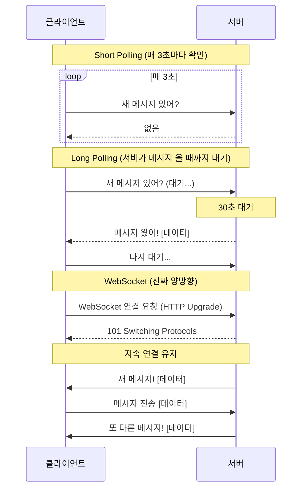

| 방식 | 지연시간 | 서버 부하 | 실시간성 |
|------|---------|---------|---------|
| Short Polling | 높음(3초) | 매우 높음 | 낮음 |
| Long Polling | 중간 | 높음 | 중간 |
| WebSocket | 낮음(ms) | 낮음 | 높음 |
| SSE | 낮음 | 낮음 | 단방향 |

### WebSocket 핸드셰이크

```http
# 클라이언트 → 서버
GET /chat HTTP/1.1
Host: chat.example.com
Upgrade: websocket
Connection: Upgrade
Sec-WebSocket-Key: dGhlIHNhbXBsZSBub25jZQ==
Sec-WebSocket-Version: 13

# 서버 → 클라이언트
HTTP/1.1 101 Switching Protocols
Upgrade: websocket
Connection: Upgrade
Sec-WebSocket-Accept: s3pPLMBiTxaQ9kYGzzhZRbK+xOo=
```

---

## 3. 전체 아키텍처

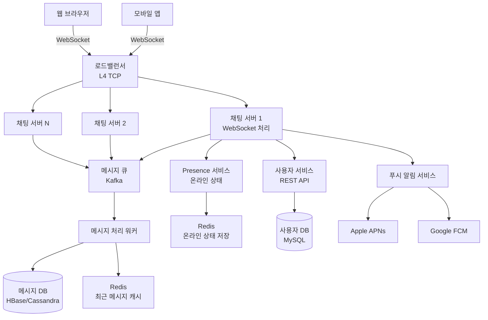

---

## 4. 메시지 전송 흐름

### 1:1 채팅 메시지 흐름

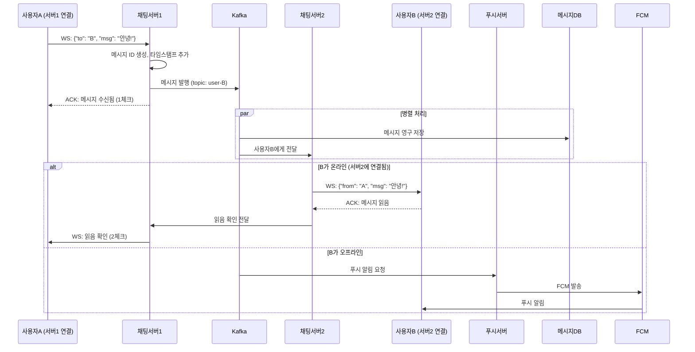

### 다른 서버의 사용자에게 메시지 전달

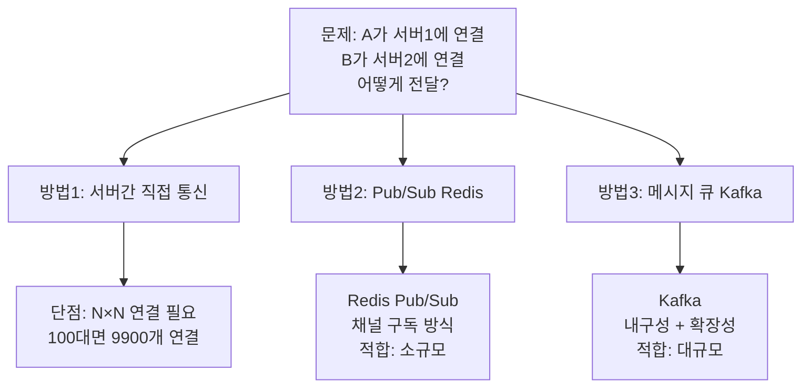

---

## 5. 메시지 ID 설계

메시지 순서를 보장하고 정렬이 가능해야 합니다.

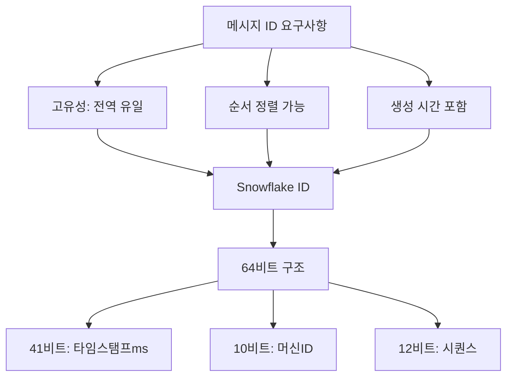

```java
public class MessageIdGenerator {
    private static final long EPOCH = 1609459200000L; // 2021-01-01
    private final long workerId;
    private long lastTimestamp = -1L;
    private long sequence = 0L;

    public synchronized long nextId() {
        long timestamp = System.currentTimeMillis() - EPOCH;

        if (timestamp == lastTimestamp) {
            sequence = (sequence + 1) & 0xFFF; // 12비트 최대 4095
            if (sequence == 0) {
                // 다음 밀리초까지 대기
                while (timestamp <= lastTimestamp) {
                    timestamp = System.currentTimeMillis() - EPOCH;
                }
            }
        } else {
            sequence = 0;
        }

        lastTimestamp = timestamp;
        return (timestamp << 22) | (workerId << 12) | sequence;
    }
}
```

---

## 6. 메시지 저장소 설계

### 왜 NoSQL인가?

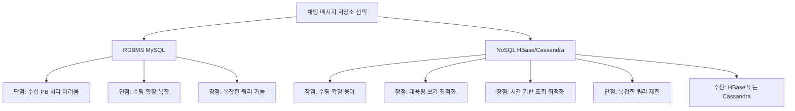

### HBase 스키마 설계

```
테이블: messages
RowKey: {channel_id}_{reversed_timestamp}
  → 역순 타임스탬프로 최신 메시지가 앞에 위치

컬럼 패밀리: msg
  - msg:id       → 메시지 ID
  - msg:sender   → 발신자 ID
  - msg:type     → 메시지 타입 (text/image/video)
  - msg:content  → 내용
  - msg:status   → 전송/읽음 상태

예시 RowKey:
ch001_9999999999999  → 가장 최신 메시지 먼저
ch001_9999999999998
ch001_9999999999997
```

### 대화 목록 (최근 채팅방)

```sql
-- MySQL에 저장 (관계형 데이터에 적합)
CREATE TABLE conversations (
    id              BIGINT PRIMARY KEY,
    type            ENUM('direct', 'group'),
    created_at      DATETIME,
    last_message_id BIGINT,
    last_message_at DATETIME,
    INDEX idx_last_msg_at (last_message_at)
);

CREATE TABLE conversation_members (
    conversation_id BIGINT,
    user_id         BIGINT,
    joined_at       DATETIME,
    last_read_at    DATETIME,  -- 읽음 표시용
    PRIMARY KEY (conversation_id, user_id),
    INDEX idx_user_id (user_id)
);
```

---

## 7. 온라인 상태 서비스 (Presence)

### 온라인 상태 추적 방법

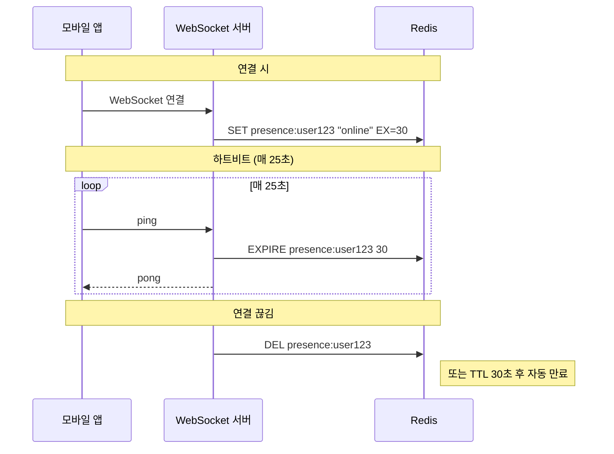

### 온라인 상태 전파

```python
class PresenceService:
    def __init__(self, redis, kafka):
        self.redis = redis
        self.kafka = kafka

    def set_online(self, user_id: str):
        """사용자 온라인 상태 설정"""
        self.redis.setex(f"presence:{user_id}", 30, "online")
        self._notify_friends(user_id, "online")

    def set_offline(self, user_id: str):
        """사용자 오프라인 상태 설정"""
        self.redis.delete(f"presence:{user_id}")
        self._notify_friends(user_id, "offline")

    def is_online(self, user_id: str) -> bool:
        return self.redis.exists(f"presence:{user_id}") > 0

    def _notify_friends(self, user_id: str, status: str):
        """친구들에게 상태 변경 알림 (Kafka 발행)"""
        friends = self._get_friends(user_id)
        for friend_id in friends:
            self.kafka.send('presence-events', {
                'user_id': user_id,
                'status': status,
                'notify_user_id': friend_id,
                'timestamp': time.time()
            })
```

> **주의**: 친구가 1000명이라면 온라인/오프라인 할 때마다 1000개의 이벤트가 발생합니다. **대규모 그룹의 경우 상태 전파를 제한**하거나 **클라이언트가 필요할 때만 조회**하는 방식을 사용합니다.

---

## 8. 그룹 채팅

### 그룹 메시지 전달 방식

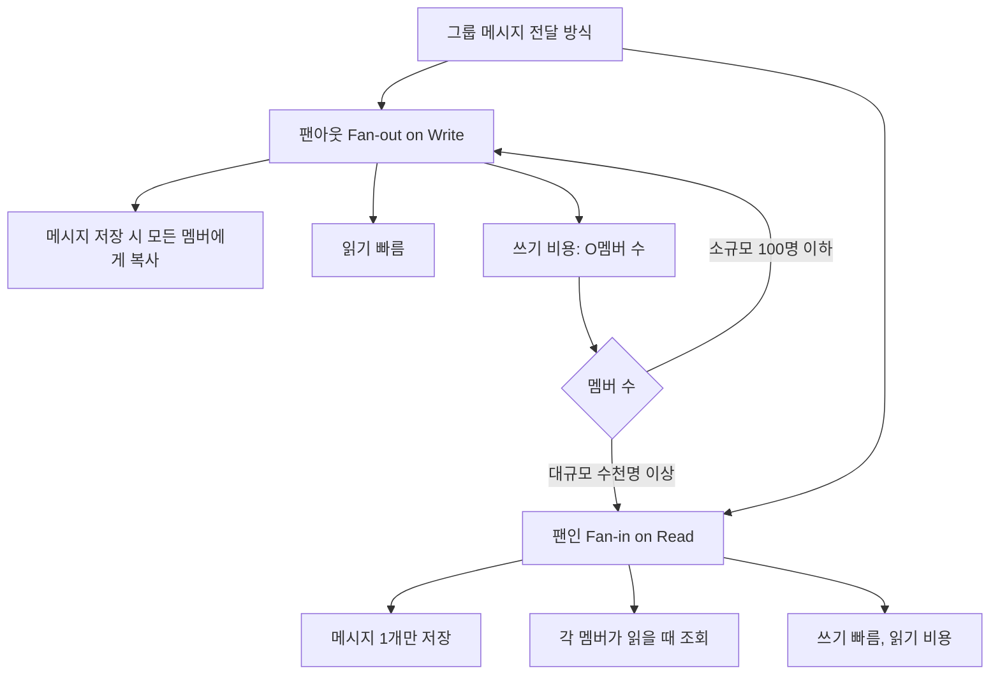

### 그룹 채팅 메시지 흐름

```python
async def send_group_message(
    sender_id: str,
    group_id: str,
    content: str
) -> Message:
    # 1. 메시지 ID 생성
    msg_id = id_generator.next_id()

    # 2. 메시지 저장 (1개)
    message = Message(
        id=msg_id,
        sender_id=sender_id,
        group_id=group_id,
        content=content,
        created_at=datetime.now()
    )
    await message_store.save(message)

    # 3. 그룹 멤버 조회
    members = await group_service.get_members(group_id)

    # 4. 온라인 멤버에게 실시간 전달
    # 오프라인 멤버에게는 푸시 알림
    online_members = []
    offline_members = []

    for member_id in members:
        if presence_service.is_online(member_id):
            online_members.append(member_id)
        else:
            offline_members.append(member_id)

    # 온라인 멤버: WebSocket 전달
    await websocket_dispatcher.send_to_users(
        online_members,
        message.to_dict()
    )

    # 오프라인 멤버: 푸시 알림
    await push_service.send_batch(
        offline_members,
        f"{sender_id}: {content[:50]}"
    )

    return message
```

---

## 9. 읽음 확인 (Read Receipt)

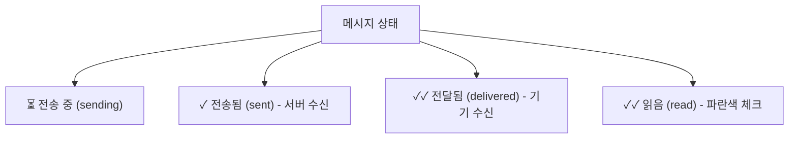

**읽음 상태 저장:**
```python
# 메시지별 읽음 상태 (소규모 그룹)
message_read_status = {
    "msg_id": "12345",
    "read_by": {
        "user_A": "2024-01-01T10:00:00",
        "user_B": "2024-01-01T10:01:00",
        # user_C는 아직 미읽음
    }
}

# 사용자별 마지막 읽은 메시지 ID (대규모 그룹)
# conversation_members 테이블의 last_read_at 활용
def get_unread_count(user_id: str, group_id: str) -> int:
    last_read = db.get_last_read(user_id, group_id)
    return db.count_messages_after(group_id, last_read)
```

---

## 10. 미디어 파일 전송

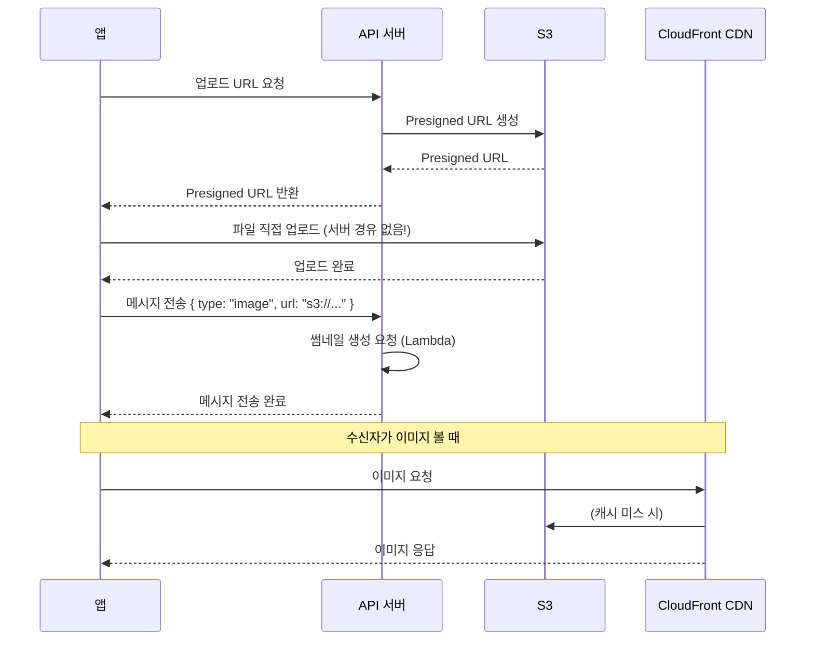

**파일 크기 제한 및 처리:**
```python
FILE_LIMITS = {
    'image': 20 * 1024 * 1024,   # 20MB
    'video': 200 * 1024 * 1024,  # 200MB
    'document': 100 * 1024 * 1024 # 100MB
}

async def process_media_upload(
    file_type: str,
    file_size: int,
    user_tier: str
) -> str:
    # 크기 제한 확인
    if file_size > FILE_LIMITS.get(file_type, 0):
        raise FileTooLargeError()

    # Presigned URL 생성 (15분 유효)
    key = f"chat/{uuid4()}/{file_type}"
    url = s3.generate_presigned_url(
        'put_object',
        Params={'Bucket': 'chat-media', 'Key': key},
        ExpiresIn=900
    )

    return url
```

---

## 11. 푸시 알림

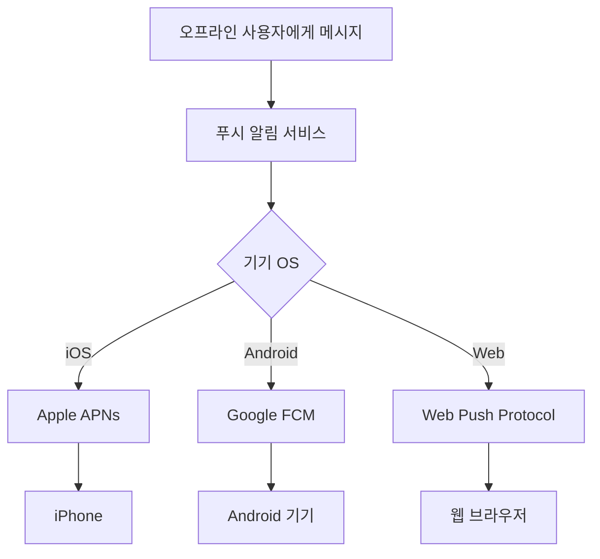

**푸시 알림 구현:**
```java
@Service
public class PushNotificationService {

    private final FirebaseMessaging fcm;
    private final ApnsClient apns;

    public void sendPush(String userId, String title, String body) {
        UserDevice device = userDeviceRepository.findByUserId(userId);

        if (device == null) return;

        switch (device.getOs()) {
            case ANDROID -> sendFcm(device.getToken(), title, body);
            case IOS -> sendApns(device.getToken(), title, body);
        }
    }

    private void sendFcm(String token, String title, String body) {
        Message message = Message.builder()
            .setToken(token)
            .setNotification(Notification.builder()
                .setTitle(title)
                .setBody(body)
                .build())
            .putData("click_action", "OPEN_CHAT")
            .build();

        try {
            fcm.send(message);
        } catch (FirebaseMessagingException e) {
            if (e.getMessagingErrorCode() == MessagingErrorCode.UNREGISTERED) {
                // 기기 토큰 만료 → DB에서 삭제
                userDeviceRepository.deleteByToken(token);
            }
        }
    }
}
```

---

## 12. 서비스 확장 전략

### 채팅 서버 수평 확장

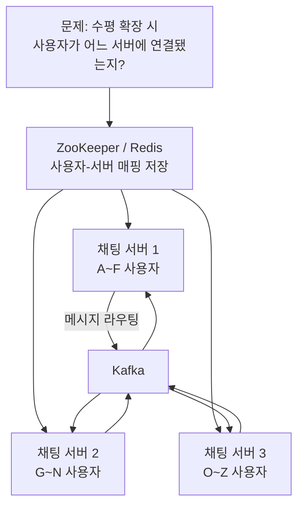

**사용자-서버 매핑:**
```python
class UserServerMapping:
    def __init__(self, redis):
        self.redis = redis

    def register(self, user_id: str, server_id: str):
        """사용자가 어느 서버에 연결됐는지 등록"""
        self.redis.setex(f"ws_server:{user_id}", 3600, server_id)

    def get_server(self, user_id: str) -> str | None:
        """사용자의 연결 서버 조회"""
        return self.redis.get(f"ws_server:{user_id}")

    def deregister(self, user_id: str):
        """연결 끊김 시 제거"""
        self.redis.delete(f"ws_server:{user_id}")
```

---

## 13. 극한 시나리오: 카카오 대규모 장애 상황

2022년 카카오 데이터센터 화재로 카카오톡이 수 시간 다운됐습니다. 어떻게 방지할 수 있었을까요?

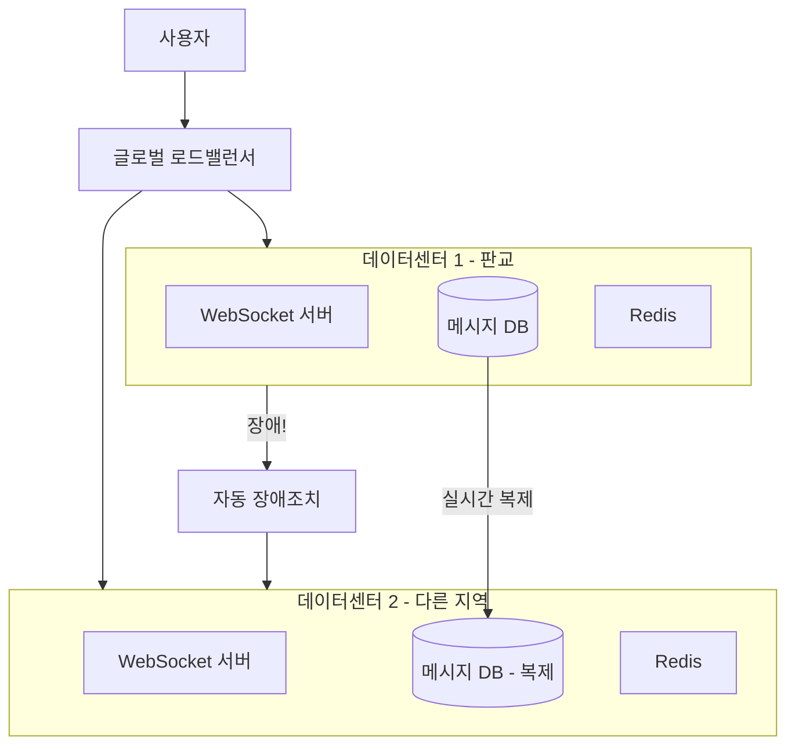

**멀티 데이터센터 설계 요소:**
1. **Active-Active**: 두 DC가 동시에 트래픽 처리
2. **데이터 복제**: 메시지 DB 실시간 양방향 복제
3. **DNS 장애조치**: 하나의 DC 장애 시 DNS가 다른 DC로 라우팅
4. **메시지 큐 이중화**: Kafka 멀티 클러스터

---

## 14. 완성된 채팅 아키텍처

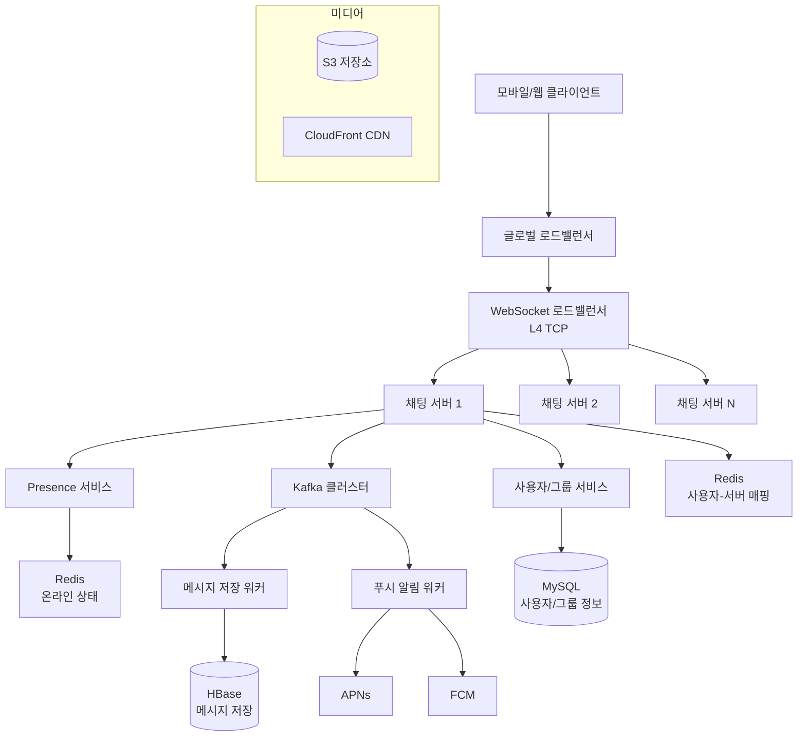

---

## 핵심 설계 결정 요약

| 결정 사항 | 선택 | 이유 |
|----------|------|------|
| 실시간 통신 | WebSocket | 양방향 저지연 |
| 메시지 라우팅 | Kafka | 내구성 + 확장성 |
| 메시지 저장 | HBase | 대용량 쓰기 최적화 |
| 온라인 상태 | Redis TTL | 빠른 읽기/쓰기 |
| 미디어 저장 | S3 + CDN | 비용 효율 + 글로벌 배포 |
| 푸시 알림 | APNs + FCM | 플랫폼 표준 |
| 사용자-서버 매핑 | Redis | 빠른 조회 |
