## 왜 시스템 디자인을 배워야 하는가?

식당을 상상해 보세요. 처음엔 주방장 혼자 요리하고, 홀 직원 한 명이 서빙합니다. 손님이 5명일 때는 완벽하게 돌아갑니다. 그런데 손님이 500명이 되면 어떨까요? 주방장이 아무리 빨리 요리해도 감당이 안 됩니다. 이 문제를 해결하려면 **주방장을 늘리거나(수평 확장)**, **더 좋은 장비를 사거나(수직 확장)**, **여러 지점을 내거나(분산)** 해야 합니다.

대규모 소프트웨어 시스템도 정확히 같은 문제를 겪습니다. 카카오, 네이버, 쿠팡 같은 서비스가 수천만 명의 사용자를 어떻게 감당하는지, 그 설계 원칙을 배우는 것이 바로 **시스템 디자인**입니다.

---

## 1. 확장성 (Scalability)

### 확장성이란?

확장성은 **사용자가 늘어났을 때 시스템이 얼마나 잘 버티는가**를 의미합니다.

> 비유: 고속도로를 생각해 보세요. 차가 많아지면 차선을 늘리거나(수평 확장), 더 빠른 도로를 만들거나(수직 확장) 합니다.

### 수직 확장 (Vertical Scaling) — Scale Up

```
[서버 A: CPU 4코어, RAM 16GB]
          ↓ 업그레이드
[서버 A: CPU 32코어, RAM 256GB]
```

**장점:**
- 구현이 단순함
- 애플리케이션 코드 변경 불필요
- 네트워크 지연 없음

**단점:**
- 하드웨어 한계가 존재 (최대 스펙이 있음)
- 단일 장애점 (SPOF, Single Point of Failure)
- 비용이 기하급수적으로 증가

### 수평 확장 (Horizontal Scaling) — Scale Out

```
[서버 A: CPU 4코어, RAM 16GB]
[서버 B: CPU 4코어, RAM 16GB]
[서버 C: CPU 4코어, RAM 16GB]
          ↕ 로드밸런서
        [사용자 트래픽]
```

**장점:**
- 이론상 무한 확장 가능
- 장애 내성 향상
- 비용 효율적 (범용 서버 사용)

**단점:**
- 분산 시스템 복잡도 증가
- 상태(State) 관리 어려움
- 네트워크 비용 발생

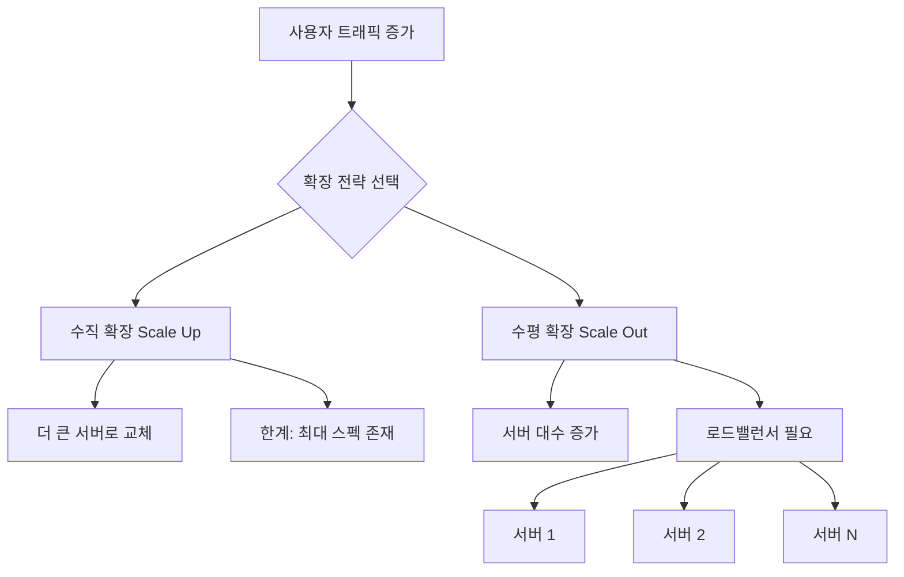

### 확장성 측정 지표

| 지표 | 설명 | 예시 |
|------|------|------|
| TPS (Transactions Per Second) | 초당 처리 건수 | 결제 시스템: 1만 TPS |
| QPS (Queries Per Second) | 초당 쿼리 수 | 검색 서비스: 100만 QPS |
| 응답 시간 (Response Time) | 요청 처리 시간 | P99 < 200ms |
| 처리량 (Throughput) | 단위 시간당 처리량 | 1GB/s 데이터 처리 |

---

## 2. 가용성 (Availability)

### 가용성이란?

가용성은 **시스템이 정상적으로 작동하는 시간의 비율**입니다.

> 비유: 편의점이 24시간 365일 운영된다면 가용성 100%입니다. 하루 1시간만 닫아도 가용성 95.8%가 됩니다.

### 가용성 계산

```
가용성(%) = (정상 운영 시간) / (전체 시간) × 100
```

### "나인(Nine)" 표기법

| 표기 | 가용성 | 연간 다운타임 |
|------|--------|--------------|
| 2 Nines | 99% | 3.65일 |
| 3 Nines | 99.9% | 8.76시간 |
| 4 Nines | 99.99% | 52.6분 |
| 5 Nines | 99.999% | 5.26분 |
| 6 Nines | 99.9999% | 31.5초 |

> 금융 시스템, 의료 시스템은 최소 4~5 Nines를 요구합니다.

### 고가용성 달성 방법

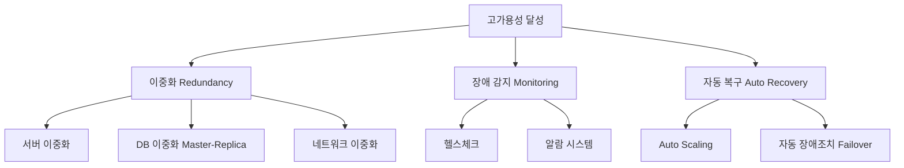

### MTTR과 MTBF

```
MTBF (Mean Time Between Failures): 평균 장애 간격
MTTR (Mean Time To Recovery): 평균 복구 시간

가용성 = MTBF / (MTBF + MTTR)
```

예시: MTBF = 100시간, MTTR = 1시간
- 가용성 = 100 / (100 + 1) = 99.01% (약 2 Nines)

---

## 3. 일관성 (Consistency)

### 일관성이란?

일관성은 **모든 노드가 같은 시점에 같은 데이터를 보는 것**입니다.

> 비유: 은행 계좌를 생각해 보세요. A가 100만원을 이체했을 때, 전 세계 어느 ATM에서 조회해도 즉시 잔액이 업데이트되어야 한다면 강한 일관성입니다. 반면 몇 초 후에 반영되어도 괜찮다면 최종 일관성입니다.

### 일관성 수준

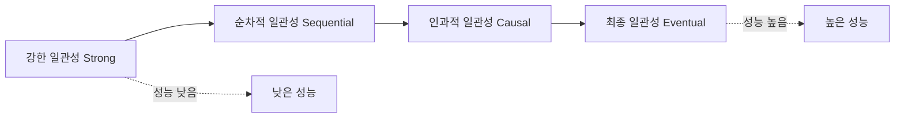

| 일관성 수준 | 설명 | 사용 예 |
|------------|------|---------|
| 강한 일관성 | 모든 읽기에서 최신 쓰기 반환 | 금융 거래, 재고 관리 |
| 순차적 일관성 | 모든 노드가 같은 순서로 작업 관찰 | 분산 락 |
| 인과적 일관성 | 원인-결과 관계 보장 | 소셜 미디어 댓글 |
| 최종 일관성 | 결국에는 같아짐 | DNS, 쇼핑몰 재고 |

---

## 4. CAP 정리

### CAP 정리란?

CAP 정리는 분산 시스템에서 **세 가지 속성 중 동시에 두 가지만 보장 가능**하다는 이론입니다.

- **C (Consistency)**: 모든 노드가 같은 데이터를 봄
- **A (Availability)**: 모든 요청이 응답을 받음
- **P (Partition Tolerance)**: 네트워크 분리가 발생해도 동작

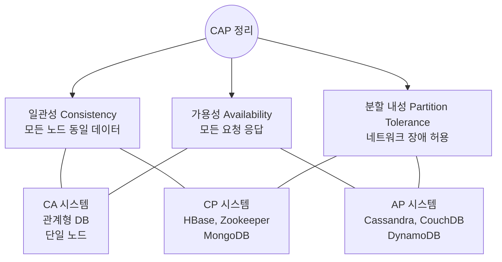

> **현실에서는**: 분산 시스템에서 네트워크 분할(P)은 불가피합니다. 따라서 실질적으로는 **CP vs AP** 선택입니다.

### 시스템별 CAP 위치

| 시스템 | CAP 분류 | 이유 |
|--------|---------|------|
| MySQL (단일) | CA | 분산 아님 |
| MySQL (Cluster) | CP | 일관성 우선 |
| Cassandra | AP | 가용성 우선 |
| HBase | CP | 일관성 우선 |
| DynamoDB | AP (기본) | 최종 일관성 |
| Redis (Cluster) | AP | 가용성 우선 |
| Zookeeper | CP | 일관성 필수 |

### 실전 예시: 네트워크 분할 시 선택

```
[데이터센터 A] ----X---- [데이터센터 B]
    서버 1,2              서버 3,4

네트워크 장애 발생! 어떻게 처리할까?

CP 선택: 서버 3,4에 대한 요청을 거부 (가용성 포기, 일관성 유지)
AP 선택: 서버 3,4가 오래된 데이터로 응답 (일관성 포기, 가용성 유지)
```

---

## 5. PACELC 정리 (CAP의 확장)

CAP은 장애 상황만 다루지만, **평상시에도 일관성과 지연 시간 사이의 트레이드오프**가 존재합니다.

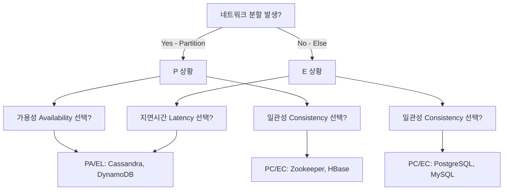

---

## 6. 로드밸런싱 기초

### 로드밸런서란?

> 비유: 대형 마트의 계산대 안내원을 생각해 보세요. 손님들이 줄 서는 대신, 안내원이 각 계산대의 대기 상황을 보고 "3번 줄로 가세요"라고 안내합니다. 이것이 로드밸런서입니다.

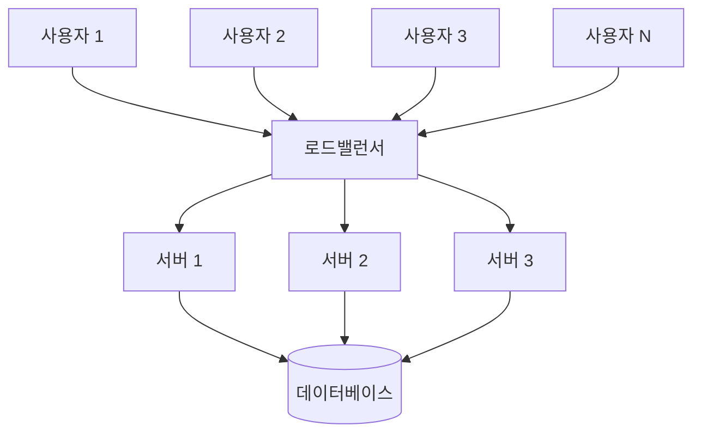

### 로드밸런싱 알고리즘

#### 1) 라운드 로빈 (Round Robin)

```
요청 순서: 1 → 서버A, 2 → 서버B, 3 → 서버C, 4 → 서버A, ...

장점: 단순, 균등 분배
단점: 서버 성능 차이 무시
```

#### 2) 가중치 라운드 로빈 (Weighted Round Robin)

```
서버A (가중치 5): 5번 요청 처리
서버B (가중치 3): 3번 요청 처리
서버C (가중치 2): 2번 요청 처리

장점: 성능 차이 반영
단점: 가중치 설정 필요
```

#### 3) 최소 연결 (Least Connections)

```
현재 상태:
서버A: 연결 10개
서버B: 연결 3개  ← 새 요청 배정
서버C: 연결 7개

장점: 실시간 부하 반영
단점: 연결 수 추적 오버헤드
```

#### 4) IP 해시 (IP Hash)

```
클라이언트 IP → 해시 → 특정 서버 고정

사용자 192.168.1.1 → 항상 서버A
사용자 192.168.1.2 → 항상 서버B

장점: 세션 유지 (Sticky Session)
단점: 특정 서버 과부하 가능
```

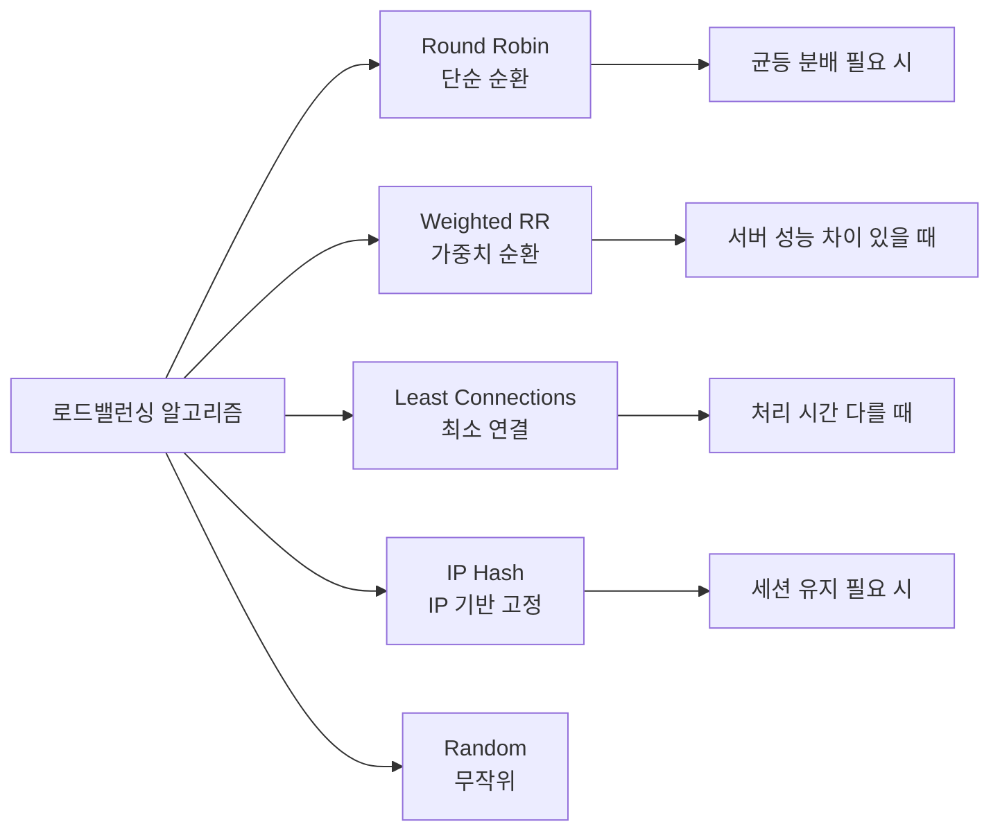

---

## 7. 데이터베이스 확장

### 읽기 복제 (Read Replica)

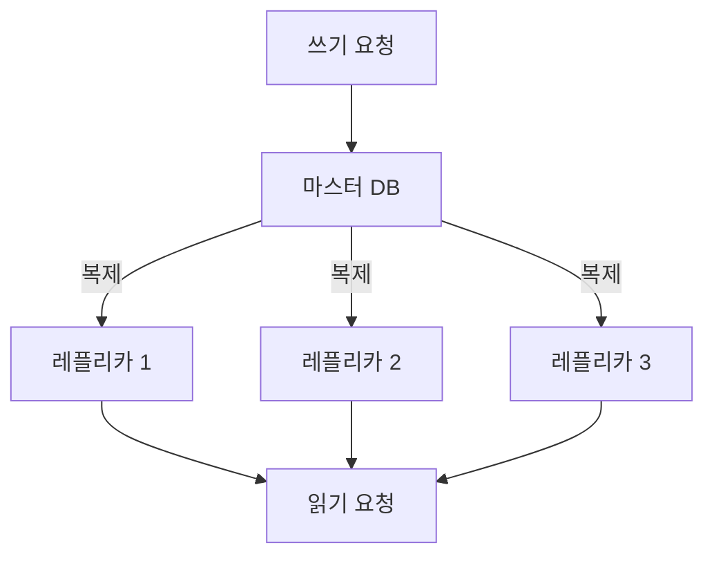

- **마스터**: 쓰기(INSERT, UPDATE, DELETE) 처리
- **레플리카**: 읽기(SELECT) 처리 (읽기 요청 80~90%)
- **주의**: 복제 지연(Replication Lag) 발생 가능

### 샤딩 (Sharding)

> 비유: 도서관에서 책을 분류할 때, 이름순으로 A-G는 1층, H-N은 2층, O-Z는 3층에 배치하는 것과 같습니다.

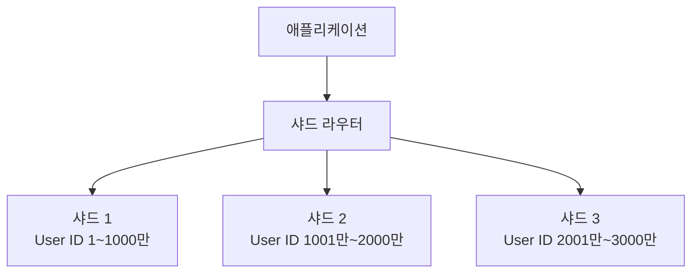

**샤딩 전략:**

| 전략 | 방법 | 장점 | 단점 |
|------|------|------|------|
| 범위 기반 | ID 1-1000 → 샤드1 | 범위 쿼리 효율적 | 핫스팟 가능 |
| 해시 기반 | hash(ID) % N | 균등 분배 | 범위 쿼리 비효율 |
| 디렉토리 기반 | 별도 매핑 테이블 | 유연함 | 매핑 테이블 병목 |

---

## 8. 캐싱 (Caching)

### 캐시란?

> 비유: 자주 가는 편의점을 생각해보세요. 매번 창고에서 물건을 꺼내오는 것보다 진열대(캐시)에 미리 꺼내두면 훨씬 빠릅니다.

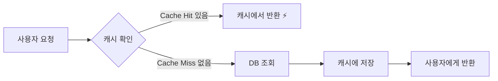

### 캐시 계층 구조

```
L1 캐시: CPU 캐시 (나노초)
L2 캐시: 로컬 메모리 캐시 (마이크로초)
L3 캐시: 분산 캐시 Redis (밀리초)
L4 캐시: CDN (100ms~)
```

### 캐시 전략

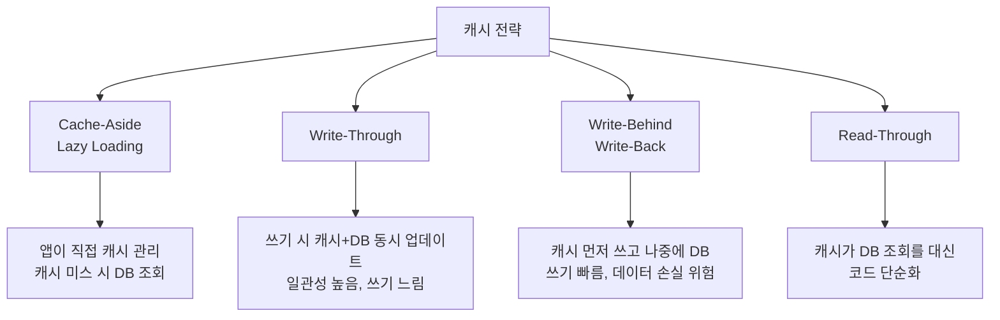

### 캐시 무효화 (Cache Invalidation)

> "컴퓨터 과학에서 어려운 문제는 두 가지: 캐시 무효화와 이름 짓기" — Phil Karlton

**TTL (Time To Live)**: 캐시 만료 시간 설정
```
redis.set("user:1001", userData, EX=3600)  # 1시간 후 자동 만료
```

---

## 9. CDN (Content Delivery Network)

### CDN이란?

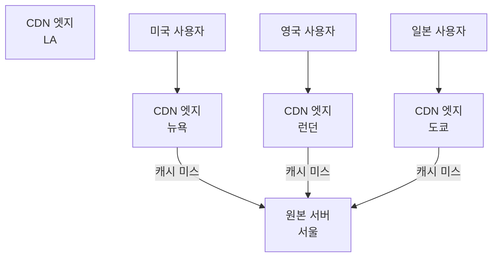

- **정적 파일** (이미지, CSS, JS): CDN에서 캐싱
- **동적 콘텐츠**: 원본 서버에서 처리

---

## 10. 메시지 큐 (Message Queue)

### 메시지 큐란?

> 비유: 식당에서 홀 직원이 주문을 받아 주방에 전달하는 주문표 통을 생각해 보세요. 주방이 바빠도 홀 직원은 주문을 계속 받을 수 있습니다.

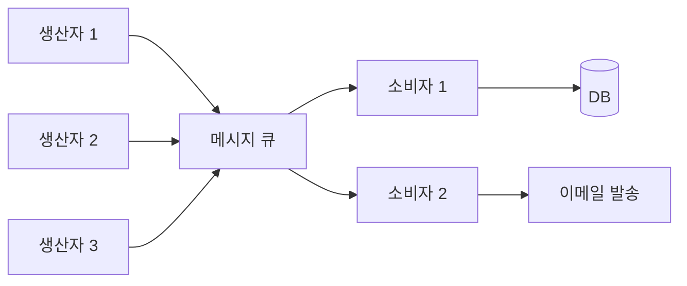

**장점:**
- **비동기 처리**: 생산자와 소비자의 속도 차이 흡수
- **내결함성**: 소비자 장애 시 메시지 유지
- **확장성**: 소비자 수 조절로 처리량 조절

---

## 11. 마이크로서비스 아키텍처 기초

### 모놀리스 vs 마이크로서비스

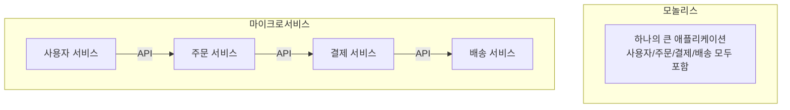

| 특성 | 모놀리스 | 마이크로서비스 |
|------|---------|--------------|
| 배포 | 전체 재배포 | 개별 배포 |
| 확장 | 전체 확장 | 필요한 서비스만 확장 |
| 장애 | 전체 영향 | 서비스 격리 |
| 복잡도 | 낮음 | 높음 |
| 초기 개발 | 빠름 | 느림 |

---

## 12. 통합 아키텍처 예시

실제 대규모 시스템이 어떻게 구성되는지 전체 그림을 보겠습니다.

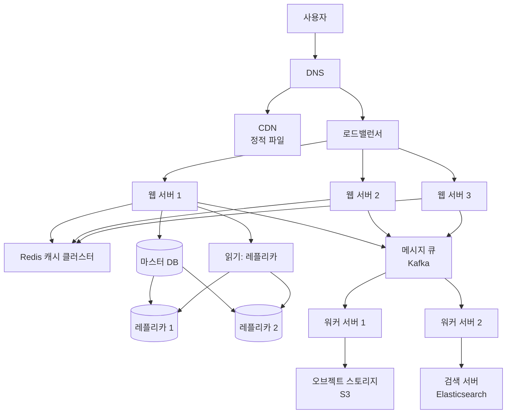

---

## 13. 시스템 설계 면접 접근법

### 4단계 프레임워크

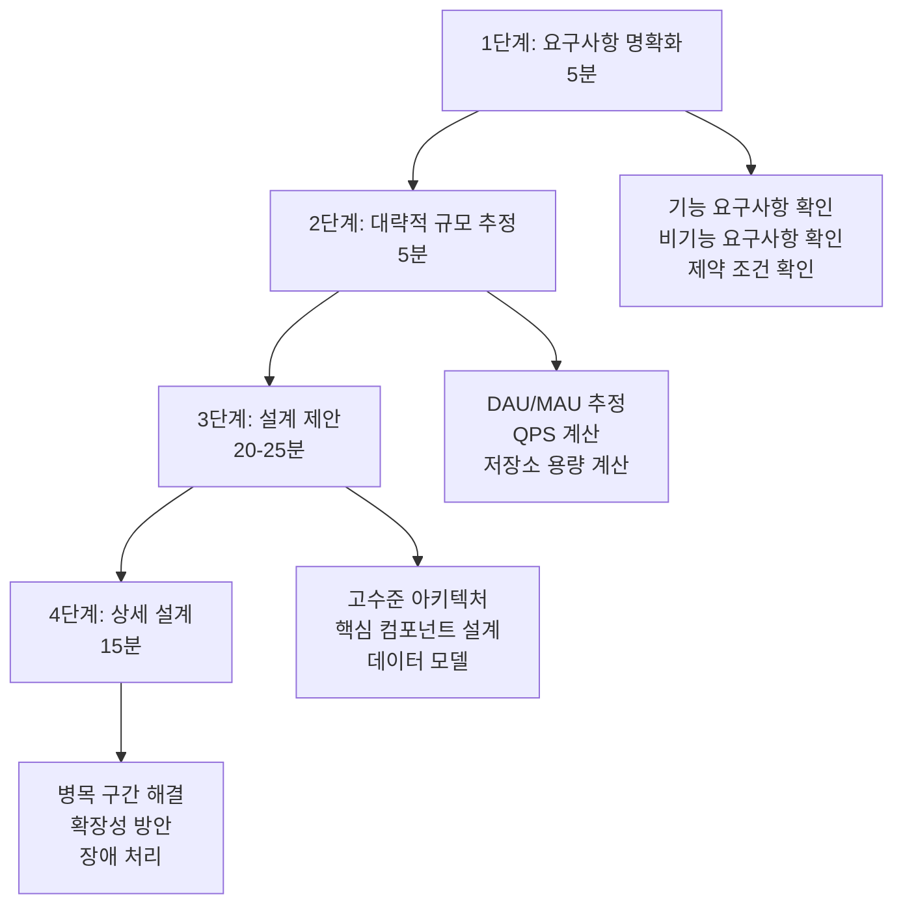

### 규모 추정 공식

```
1일 활성 사용자 (DAU) = X명
쓰기 요청 비율 = Y%
피크 트래픽 = 평균의 2~3배

QPS = DAU × 일일 평균 요청 / 86,400초
피크 QPS = QPS × 3

저장소 = DAU × 데이터 크기 × 365일 × 보관 기간
```

**예시: 트위터와 유사한 시스템**
```
DAU: 1억명
트윗 비율: 10% (1000만명이 하루 1개)
읽기:쓰기 = 100:1

쓰기 QPS = 10,000,000 / 86,400 ≈ 115 QPS
읽기 QPS = 115 × 100 = 11,500 QPS
피크 QPS = 11,500 × 3 = 34,500 QPS

트윗 크기 = 300바이트
일일 저장량 = 10,000,000 × 300B = 3GB/일
5년 저장 = 3GB × 365 × 5 ≈ 5.5TB
```

---

## 14. 극한 시나리오: 넷플릭스급 트래픽 처리

넷플릭스는 피크 시간에 인터넷 트래픽의 15%를 차지합니다. 어떻게 가능할까요?

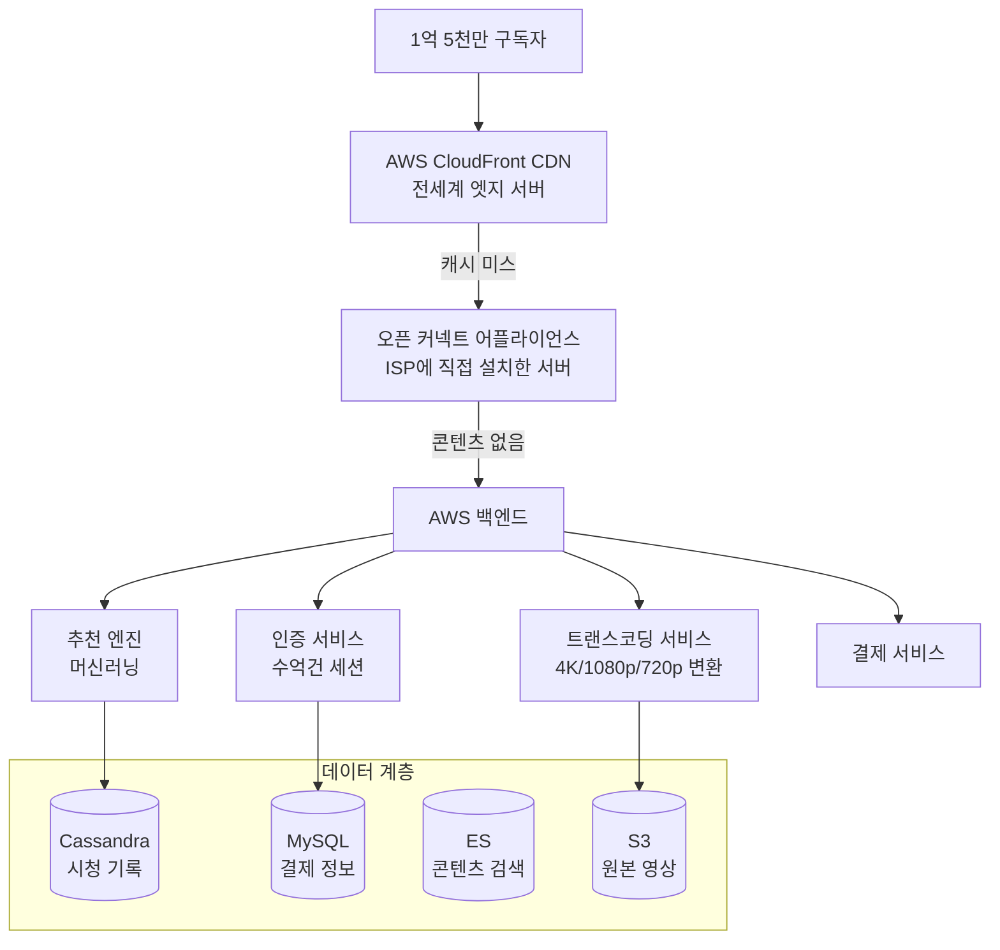

### 핵심 설계 결정들

1. **CDN 최우선**: 트래픽의 95%는 CDN에서 처리, 원본 서버 부하 최소화
2. **마이크로서비스**: 700개 이상의 독립 서비스
3. **Chaos Engineering**: 넷플릭스가 만든 Chaos Monkey로 의도적 장애 주입 테스트
4. **멀티 AZ/리전**: AWS 3개 이상 가용 영역 동시 운영
5. **Circuit Breaker**: 장애 전파 방지

---

## 핵심 정리

| 개념 | 한 줄 요약 | 언제 사용 |
|------|-----------|---------|
| 수직 확장 | 더 좋은 서버 | 초기 단계, 단순성 필요 |
| 수평 확장 | 서버 더 추가 | 대규모 트래픽 |
| 캐싱 | 자주 쓰는 데이터 미리 저장 | 읽기 많은 시스템 |
| 샤딩 | DB를 조각으로 분리 | 수십 테라 이상 데이터 |
| CDN | 지리적 분산 캐시 | 글로벌 서비스 |
| 메시지 큐 | 비동기 작업 처리 | 처리 시간 오래 걸리는 작업 |
| 로드밸런서 | 트래픽 분산 | 서버 여러 대 운영 시 |

> 시스템 디자인의 핵심은 **트레이드오프(Trade-off)**입니다. 완벽한 시스템은 없습니다. 어떤 것을 얻으면 다른 것을 잃습니다. 최선의 설계는 **현재 요구사항에 맞는 적절한 트레이드오프를 선택하는 것**입니다.
