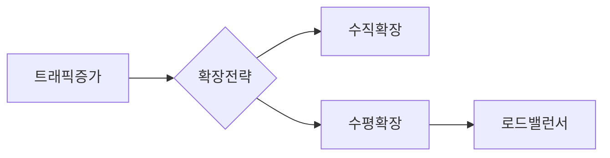
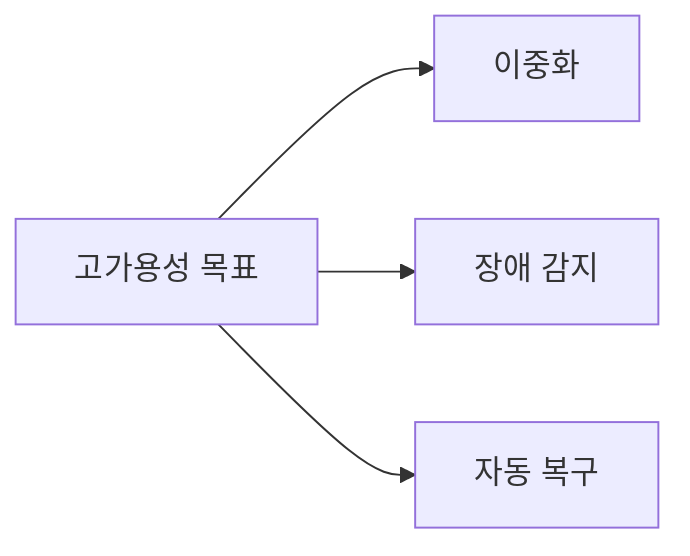
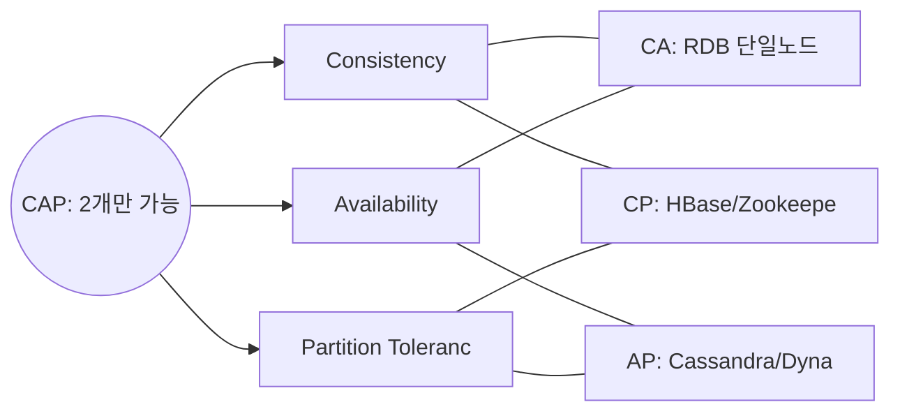
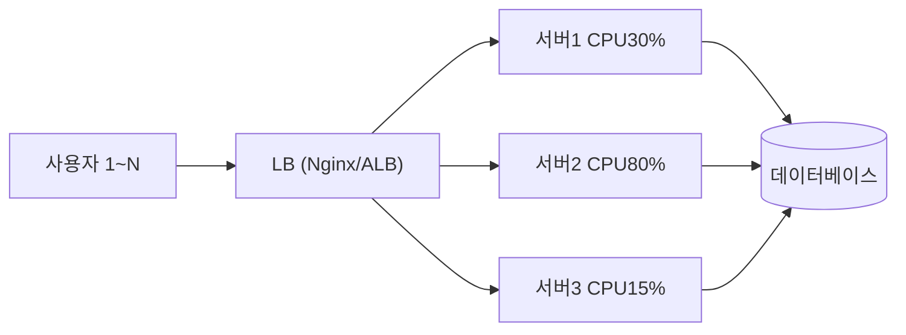
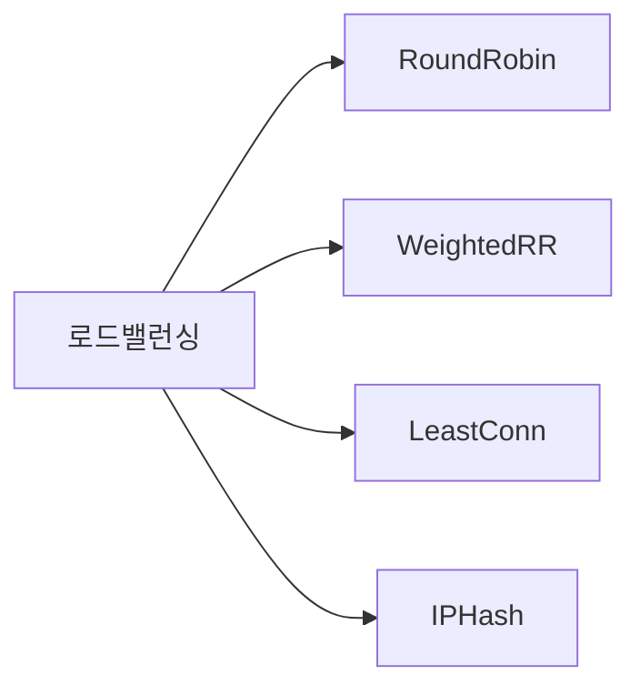
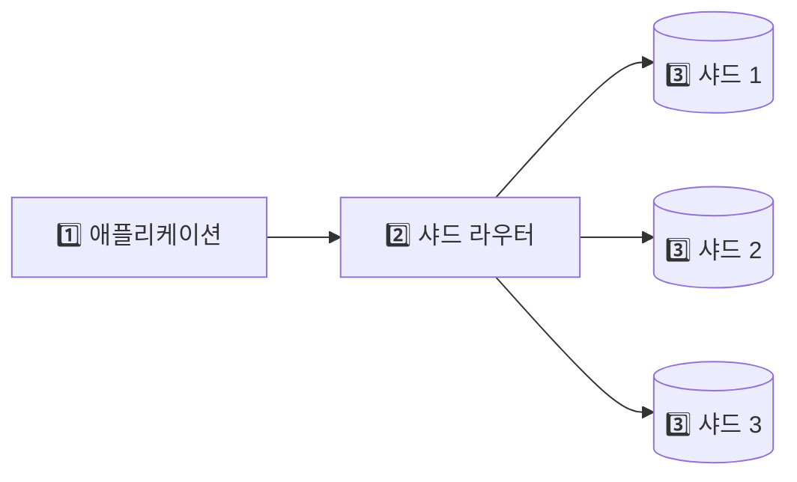
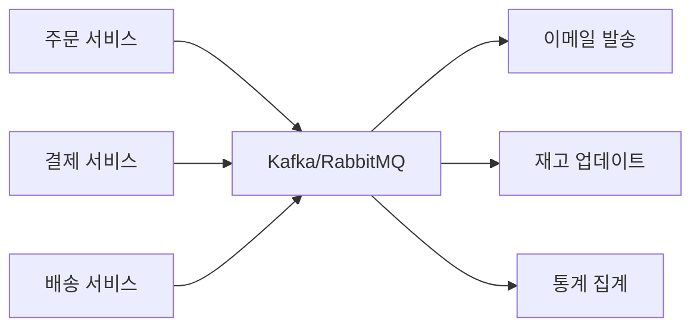
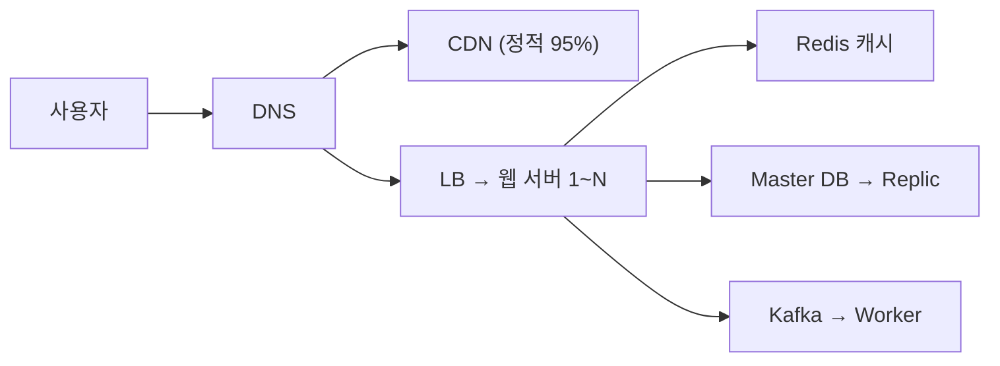
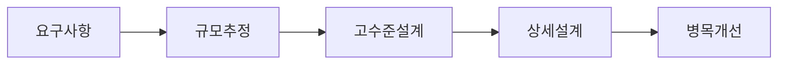
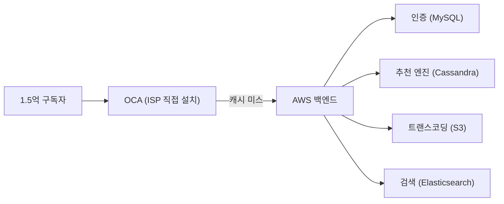

> **한 줄 요약**: 확장성·가용성·일관성은 서로 트레이드오프 관계이며, CAP/PACELC 정리가 분산 시스템 설계의 나침반이다.

## 왜 시스템 디자인 기초가 중요한가?

식당을 상상해 보세요. 주방장 한 명, 홀 직원 한 명일 때는 5명 손님을 완벽하게 처리합니다. 손님이 500명이 되면? 주방장 혼자서는 절대 감당 불가입니다. 해결책은 세 가지입니다. **더 빠른 주방장으로 교체(수직 확장)**, **주방장을 여러 명 고용(수평 확장)**, 또는 **여러 지점을 내고 손님을 분산(분산 시스템)**.

대규모 소프트웨어 시스템도 정확히 같은 문제를 겪습니다. 카카오, 네이버, 쿠팡이 수천만 명의 사용자를 어떻게 감당하는지, 그 설계 원칙을 이해하는 것이 **시스템 디자인**입니다.

면접에서도, 실무에서도 이 기초 개념들의 트레이드오프를 명확히 이해해야 올바른 아키텍처 결정을 내릴 수 있습니다. "캐시를 쓰면 빠르겠지"가 아니라 "어떤 캐시 전략을 왜 써야 하고, 어떤 장애가 날 수 있는지"를 말할 수 있어야 합니다.

---

## 1. 확장성 (Scalability)

### 확장성이란? — "어떻게 트래픽 증가에 대응하는가"

확장성은 단순히 "많은 트래픽을 처리할 수 있는가"를 넘어, 트래픽이 10배 늘었을 때 시스템이 어떻게 반응하는가를 의미합니다. 이상적인 확장성은 트래픽이 10배 늘면 비용도 10배만 늘고 성능은 유지되는 것입니다.

#### 수직 확장 (Vertical Scaling) — Scale Up

더 강력한 단일 서버로 교체하는 방식입니다. 회사 컴퓨터 RAM이 부족하면 8GB에서 64GB로 업그레이드하는 것과 같습니다.

```
[서버 A: CPU 4코어, RAM 16GB]
          ↓ 업그레이드
[서버 A: CPU 128코어, RAM 1TB]
```

**왜 쉬운가**: 애플리케이션 코드를 한 줄도 바꾸지 않아도 됩니다. 서버 간 데이터 동기화 문제가 없습니다. 빠른 성장에 즉각 대응 가능합니다.

**왜 결국 한계에 부딪히는가**: 하드웨어에는 물리적 상한이 있습니다. 더 치명적인 문제는 단일 장애점(SPOF)입니다. 서버 한 대가 죽으면 전체 서비스가 중단됩니다. 고사양 서버일수록 비용이 기하급수적으로 증가합니다. 8코어 서버를 32코어로 업그레이드하면 4배가 아니라 10배 이상 비쌀 수 있습니다.

#### 수평 확장 (Horizontal Scaling) — Scale Out

동일한 서버 여러 대를 로드밸런서 뒤에 두는 방식입니다. 주방장 한 명을 더 빠르게 만드는 게 아니라, 주방장을 여러 명 고용하는 것입니다.

```
[서버 A: CPU 4코어, RAM 16GB]
[서버 B: CPU 4코어, RAM 16GB]
[서버 C: CPU 4코어, RAM 16GB]
          ↕ 로드밸런서
        [사용자 트래픽]
```

**왜 대규모 서비스가 이 방식을 선택하는가**: 이론상 무한 확장 가능합니다. 서버 1대가 죽어도 나머지가 처리를 이어받습니다. 범용 저가 서버를 조합해 비용을 크게 절약할 수 있습니다.

**왜 복잡한가**: 서버가 여러 대가 되는 순간 "상태(State) 공유" 문제가 생깁니다. 로컬 메모리에 세션을 저장하던 애플리케이션은 서버가 2대가 되는 순간, 로그인한 서버가 아닌 서버로 요청이 가면 세션을 잃어버립니다. **Redis 같은 분산 세션 저장소로 전환이 필수**입니다. 이걸 간과하고 수평 확장을 하면 사용자가 갑자기 로그아웃되는 장애가 납니다.



### 확장성 측정 지표

| 지표 | 설명 | 실무 예시 |
|------|------|----------|
| TPS (Transactions Per Second) | 초당 처리 건수 | 결제 시스템: 1만 TPS |
| QPS (Queries Per Second) | 초당 쿼리 수 | 검색 서비스: 100만 QPS |
| P99 응답 시간 | 99번째 백분위 응답시간 | 쿠팡: P99 < 200ms |
| 처리량 (Throughput) | 단위 시간당 데이터 처리량 | Kafka: 1GB/s |

P99를 왜 평균(P50)이 아닌 기준으로 쓸까요? 1000명 중 999명이 10ms 안에 응답받는데 1명이 10초를 기다린다면, 평균은 좋아 보이지만 실제로 그 1명은 서비스를 떠납니다. 대규모 서비스에서 1%는 수십만 명입니다.

---

## 2. 가용성 (Availability)

### 가용성이란? — "얼마나 자주 살아있는가"

**시스템이 정상적으로 작동하는 시간의 비율**입니다. 편의점이 24시간 365일 운영된다면 가용성 100%입니다. 하루 1시간 닫으면 가용성 95.8%입니다.

```
가용성(%) = (정상 운영 시간) / (전체 시간) × 100
```

### "나인(Nine)" 표기법 — 숫자가 직관적이지 않은 이유

| 표기 | 가용성 | 월 다운타임 | 연간 다운타임 |
|------|--------|------------|--------------|
| 2 Nines | 99% | 7.2시간 | 3.65일 |
| 3 Nines | 99.9% | 43.8분 | 8.76시간 |
| 4 Nines | 99.99% | 4.38분 | 52.6분 |
| 5 Nines | 99.999% | 26.3초 | 5.26분 |
| 6 Nines | 99.9999% | 2.63초 | 31.5초 |

99%와 99.99%의 차이는 작아 보이지만, 연간 다운타임은 3.65일 vs 52분입니다. 금융·의료 시스템에서 4 Nines를 달성하려면 연간 모든 장애와 배포 다운타임을 합쳐 52분 이내여야 합니다. 배포 한 번에 5분이 걸리면 1년에 10번밖에 배포 못합니다. 이 제약 때문에 **무중단 배포(블루/그린, 카나리)**가 필수입니다.

### MTBF와 MTTR — 가용성을 높이는 두 가지 축

```
MTBF (Mean Time Between Failures): 평균 장애 간격
MTTR (Mean Time To Recovery): 평균 복구 시간

가용성 = MTBF / (MTBF + MTTR)
```

MTBF = 100시간, MTTR = 1시간이면 가용성 99.01%입니다. MTTR을 0.1시간으로 줄이면 가용성 99.9%가 됩니다. **가용성을 높이는 방법은 두 가지입니다. 장애 자체를 덜 나게(MTBF 증가), 장애가 나도 빨리 복구되게(MTTR 감소).** 자동화된 롤백, 헬스체크, Auto Scaling이 모두 MTTR 감소를 위한 것입니다.



### 면접 포인트

> "99.99% 가용성을 어떻게 달성하나요?" — 단순히 "이중화"라고 답하면 안 됩니다. **배포 전략(블루/그린), DB 페일오버 시간(보통 30~60초), 그 동안의 요청 처리 방법(큐잉/재시도)**까지 구체적으로 답해야 합니다.

---

## 3. 일관성 (Consistency)

### 일관성이란? — "모든 노드가 같은 데이터를 보는가"

은행 계좌에서 A가 100만원을 이체했을 때, 전 세계 어느 ATM에서 조회해도 즉시 잔액이 업데이트되어야 한다면 **강한 일관성**입니다. 반면 몇 초 후에 반영되어도 괜찮다면 **최종 일관성**입니다.

왜 항상 강한 일관성을 쓰지 않을까요? 서울 서버에서 데이터를 썼을 때 뉴욕 서버에도 즉시 반영되려면, 서울이 뉴욕에게 "확인했어?"를 기다려야 합니다. 서울-뉴욕 왕복 지연은 150ms입니다. 모든 쓰기가 150ms씩 느려집니다. SNS 좋아요처럼 초당 수백만 건이 발생하는 연산에 강한 일관성을 적용하면 성능이 수십 배 저하됩니다.

```mermaid
graph LR
    A["강한 일관성"] --> B["순차적 일관성"]
    B --> C["인과적 일관성"]
    C --> D["최종 일관성"]
    A -.->|"성능 낮음\n지연 높음"| E["저성능"]
    D ..|"성능 높음\n지연 낮음"| F["고성능"]
```

| 일관성 수준 | 설명 | 실무 사용 예 |
|------------|------|------------|
| 강한 일관성 | 모든 읽기에서 최신 쓰기 반환 | 금융 거래, 재고 관리 |
| 순차적 일관성 | 모든 노드가 같은 순서로 작업 관찰 | 분산 락, Zookeeper |
| 인과적 일관성 | 원인-결과 관계 보장 | SNS 댓글, 게시물 좋아요 |
| 최종 일관성 | 결국에는 동일한 값으로 수렴 | DNS, 쇼핑몰 조회수 |

일관성 수준을 잘못 선택하면 어떤 장애가 날까요? 쇼핑몰 재고를 최종 일관성으로 관리하면 "마지막 1개 남은 상품"을 여러 명이 동시에 구매하는 오버셀링이 발생합니다. 반대로 SNS 좋아요를 강한 일관성으로 처리하면 매 좋아요마다 분산 락을 잡아야 해 성능이 수십 배 저하됩니다.

---

## 4. CAP 정리

### CAP 정리란?

분산 시스템에서 **세 가지 속성 중 동시에 두 가지만 보장 가능**하다는 이론입니다 (Eric Brewer, 2000년).

- **C (Consistency)**: 모든 노드가 같은 데이터를 봄
- **A (Availability)**: 모든 요청이 응답을 받음 (에러 포함)
- **P (Partition Tolerance)**: 네트워크 분리가 발생해도 동작



### 왜 P를 항상 선택해야 하는가

분산 시스템에서 네트워크 장애는 선택사항이 아닙니다. AWS 서울 리전과 도쿄 리전 사이 네트워크가 잠깐 끊기는 일은 연간 수십 번 발생합니다. P를 포기하면 "네트워크가 절대 끊기지 않는다"를 가정해야 하는데, 이는 물리 법칙을 거스르는 것입니다. 따라서 실제 선택은 항상 **C vs A**입니다.

```
[데이터센터 A] ----X---- [데이터센터 B]
    서버 1,2              서버 3,4

네트워크 장애 발생!

CP 선택 (예: Zookeeper):
  → 서버 3,4에 대한 요청 거부 (에러 반환)
  → 가용성 포기, 일관성 유지
  → 금융, 결제 시스템에 적합

AP 선택 (예: Cassandra):
  → 서버 3,4가 오래된 데이터로 응답
  → 일관성 포기, 가용성 유지
  → SNS, 쇼핑몰 상품 목록에 적합
```

이 선택이 잘못되면 어떤 일이 생길까요? 재고 관리 시스템에서 AP를 선택했습니다. 네트워크 분할 중 두 데이터센터가 독립적으로 "재고 1개 남음"을 각각 차감합니다. 네트워크 복구 후 재고가 -1이 됩니다. 없는 물건을 판 것입니다.

### 시스템별 CAP 위치

| 시스템 | CAP 분류 | 왜 이 분류인가 |
|--------|---------|-------------|
| MySQL (단일 노드) | CA | 분산 아님, 네트워크 분할 없음 |
| MySQL Cluster | CP | 파티션 시 쓰기 거부 |
| Cassandra | AP | 파티션 시 오래된 데이터로 응답 |
| HBase | CP | HDFS 의존, 일관성 우선 |
| DynamoDB | AP (기본) | 최종 일관성이 기본값 |
| Redis Cluster | CP (기본) / 설정에 따라 AP 가능 | cluster-require-full-coverage 설정에 따라 CP/AP가 달라짐. 기본값(yes)은 슬롯 누락 시 전체 거부(CP) |
| Zookeeper | CP | 리더 선출로 일관성 보장 |
| etcd | CP | Raft 합의 알고리즘 |

### 면접 포인트

> "CAP에서 항상 P를 선택해야 하는 이유는?" — 분산 시스템에서 네트워크 장애는 피할 수 없습니다. AWS에서도 연간 수십 번의 네트워크 이슈가 발생합니다. P를 포기하면 분산 시스템을 만드는 의미가 없습니다. 따라서 실제 선택은 C와 A 사이입니다.

---

## 5. PACELC 정리 (CAP의 현실적 확장)

CAP은 장애 상황(Partition)만 다루지만, **평상시(Else)에도 일관성(Consistency)과 지연 시간(Latency) 사이의 트레이드오프**가 존재합니다. Daniel Abadi가 2012년에 제안한 모델입니다.

```
P → A 또는 C 선택 (장애 시)
E → L 또는 C 선택 (평상시)
```

CAP만 알면 장애 시 선택만 이해하지만, 실무에서는 **정상 운영 중 일관성과 속도 사이의 선택**이 훨씬 더 자주 발생합니다. DynamoDB에서 강한 일관성 읽기를 사용하면 지연이 2배 증가합니다. 왜냐하면 강한 일관성은 다수의 복제본에서 확인해야 하기 때문입니다. PACELC는 이 현실적 트레이드오프를 포착합니다.

```mermaid
graph LR
    A["네트워크 분할?"] -->|"Partition"| B{"가용성 vs 일관성"}..|"정상 운영"| C{"지연 vs 일관성"}
..|"가용성"| D["PA/EL: Cassa..|"일관성"| E["PC/EC: Zooke..|"지연"| D
    C -->|"일관성"| F["PC/EC: PostgreSQL"]
```

| 시스템 | PACELC | 특징 |
|--------|--------|------|
| DynamoDB | PA/EL | 가용성+낮은 지연 기본값, 강한 일관성 옵션 추가 가능 |
| Cassandra | PA/EL | 조정 가능한 일관성(QUORUM 등) |
| MySQL | PC/EC | ACID 트랜잭션, 강한 일관성 |
| MongoDB | PC/EC | MongoDB 5.0+ 기본값 writeConcern majority (4.x 이하는 w:1이 기본) |

---

## 6. 로드밸런싱 기초

### 로드밸런서란?

대형 마트의 계산대 안내원을 생각해 보세요. 손님들이 스스로 줄을 서는 대신, 안내원이 각 계산대의 대기 상황을 보고 "3번 계산대가 비었어요"라고 안내합니다. 서버가 1대일 때는 필요 없지만, 서버가 10대가 되는 순간 "어디로 보낼지"를 결정하는 로드밸런서가 필요합니다.



### 로드밸런싱 알고리즘 상세 비교

#### 1) 라운드 로빈 (Round Robin)
```
요청 순서: 1→서버A, 2→서버B, 3→서버C, 4→서버A, ...

단순하고 균등하게 분배합니다. 하지만 처리 시간이 다른 요청이 섞이면 불균형해집니다.
서버A에 10초짜리 요청이 쌓이는 동안 서버B에는 1ms짜리 요청이 연속으로 가면
서버A는 지속적으로 과부하, 서버B는 놉니다.
적합: 동일 스펙 서버, 동일 처리 시간 요청
```

#### 2) 가중치 라운드 로빈 (Weighted Round Robin)
```
서버A (가중치 5, CPU 32코어): 5번 요청
서버B (가중치 3, CPU 16코어): 3번 요청
서버C (가중치 2, CPU 8코어): 2번 요청

성능이 다른 서버들을 혼합 사용할 때, 강한 서버에 더 많은 요청을 보냅니다.
레거시 서버와 신규 서버가 혼재하는 마이그레이션 기간에 특히 유용합니다.
적합: 서버 스펙이 다른 이기종 환경
```

#### 3) 최소 연결 (Least Connections)
```
현재 상태:
서버A: 연결 100개
서버B: 연결 30개  ← 새 요청 배정
서버C: 연결 70개

WebSocket 같은 장기 연결에서 라운드 로빈은 비효율적입니다.
서버A에 오래된 연결 100개가 물려있어도 새 요청이 계속 옵니다.
최소 연결은 실제 부하가 가장 적은 서버를 선택합니다.
적합: WebSocket, 처리 시간이 다양한 작업
```

#### 4) IP 해시 (IP Hash)
```
클라이언트 IP → 해시 → 특정 서버 고정
192.168.1.1 → hash → 항상 서버A
192.168.1.2 → hash → 항상 서버B

같은 사용자가 항상 같은 서버로 가는 게 필요할 때 사용합니다.
단점: 특정 IP 대역(회사 전체가 같은 공인 IP를 쓰는 경우)에서 특정 서버에 쏠림이 생길 수 있습니다.
적합: 세션 친화성(Sticky Session) 필요 시
```



---

**실전 구현 — Nginx 로드밸런서 설정:**

```nginx
# /etc/nginx/nginx.conf

upstream app_servers {
    # 기본: 라운드 로빈
    server app1.internal:8080 weight=5;  # 가중치 5 (고사양)
    server app2.internal:8080 weight=3;  # 가중치 3
    server app3.internal:8080 weight=2;  # 가중치 2 (저사양)

    # 최소 연결 방식 (WebSocket, 파일 업로드 등 장기 연결)
    # least_conn;

    # IP 해시 (세션 유지 필요 시)
    # ip_hash;

    # 헬스체크: 3번 실패 시 30초 제외
    server app1.internal:8080 max_fails=3 fail_timeout=30s;
    server app2.internal:8080 max_fails=3 fail_timeout=30s;

    # keepalive: upstream과 연결 재사용 (TCP handshake 비용 절감)
    keepalive 32;
}

server {
    listen 80;
    server_name api.example.com;

    # HTTP → HTTPS 리다이렉트
    return 301 https://$host$request_uri;
}

server {
    listen 443 ssl http2;
    server_name api.example.com;

    ssl_certificate     /etc/ssl/certs/api.crt;
    ssl_certificate_key /etc/ssl/private/api.key;
    ssl_protocols       TLSv1.2 TLSv1.3;

    # 요청 크기 제한 (파일 업로드 최대 10MB)
    client_max_body_size 10m;

    # 타임아웃 설정
    proxy_connect_timeout 5s;
    proxy_read_timeout    60s;

    location /api/ {
        proxy_pass http://app_servers;
        proxy_http_version 1.1;

        # keepalive 연결 재사용
        proxy_set_header Connection "";

        # 실제 클라이언트 IP 전달
        proxy_set_header X-Real-IP $remote_addr;
        proxy_set_header X-Forwarded-For $proxy_add_x_forwarded_for;
        proxy_set_header Host $host;

        # Rate Limiting: IP당 초당 10건
        limit_req zone=api_limit burst=20 nodelay;
    }

    # WebSocket 프록시
    location /ws/ {
        proxy_pass http://app_servers;
        proxy_http_version 1.1;
        proxy_set_header Upgrade $http_upgrade;
        proxy_set_header Connection "upgrade";
        proxy_read_timeout 3600s;  # WebSocket 장기 연결
    }

    # 정적 파일은 직접 서빙 (upstream 불필요)
    location /static/ {
        alias /var/www/static/;
        expires 30d;
        add_header Cache-Control "public, immutable";
    }
}

# Rate Limiting 존 선언 (http 블록)
# limit_req_zone $binary_remote_addr zone=api_limit:10m rate=10r/s;
```

## 7. 데이터베이스 확장

### 읽기 복제 (Read Replica) — 읽기 부하를 분산하는 가장 쉬운 방법

대부분의 웹 서비스는 읽기:쓰기 비율이 **80:20 또는 90:10**입니다. 쓰기는 마스터에, 읽기는 레플리카에 분산하면 DB 부하를 크게 줄입니다.

```mermaid
graph LR
    W["1️⃣ 쓰기 요청"] --> M[("2️⃣ 마스터 DB")]
    M -->|"3️⃣ 비동기 복제"| R1[("레플리카 1")]
..|"3️⃣ 비동기 복제"| R2[("레플리카 2")]
..|"3️⃣ 비동기 복제"| R3[("레플리카 3")]
    R1 --> Q["4️⃣ 읽기 요청"]
    R2 --> Q
    R3 --> Q
```

**복제 지연(Replication Lag)을 반드시 고려해야 합니다.** 비동기 복제 시 마스터에 쓴 데이터가 레플리카에 반영되는 데 수백 ms ~ 수 초가 걸릴 수 있습니다. 회원가입 직후 프로필을 조회하면 레플리카에 아직 없을 수 있습니다. 이 경우 마스터에서 읽어야 합니다. 이 패턴을 "Read-your-writes Consistency"라고 합니다. 코드에서 이를 명시적으로 처리하지 않으면, 회원가입 직후 "존재하지 않는 사용자"라는 에러가 납니다.

**실전 구현 — Spring Boot 읽기/쓰기 DataSource 분리:**

```java
// application.yml
// datasource:
//   master:
//     url: jdbc:mysql://master.db.internal:3306/myapp
//     username: app_user
//     password: ${DB_PASSWORD}
//   replica:
//     url: jdbc:mysql://replica.db.internal:3306/myapp
//     username: app_readonly
//     password: ${DB_READONLY_PASSWORD}

@Configuration
public class DataSourceConfig {

    @Bean
    @ConfigurationProperties("datasource.master")
    public DataSource masterDataSource() {
        return DataSourceBuilder.create().build();
    }

    @Bean
    @ConfigurationProperties("datasource.replica")
    public DataSource replicaDataSource() {
        return DataSourceBuilder.create().build();
    }

    @Bean
    @Primary
    public DataSource routingDataSource(
            @Qualifier("masterDataSource") DataSource master,
            @Qualifier("replicaDataSource") DataSource replica) {

        Map<Object, Object> sources = new HashMap<>();
        sources.put("master", master);
        sources.put("replica", replica);

        AbstractRoutingDataSource routing = new AbstractRoutingDataSource() {
            @Override
            protected Object determineCurrentLookupKey() {
                // @Transactional(readOnly = true)면 replica, 아니면 master
                boolean isReadOnly = TransactionSynchronizationManager.isCurrentTransactionReadOnly();
                return isReadOnly ? "replica" : "master";
            }
        };
        routing.setTargetDataSources(sources);
        routing.setDefaultTargetDataSource(master);
        routing.afterPropertiesSet();
        return routing;
    }
}

// 서비스 계층에서 readOnly 트랜잭션으로 replica 자동 사용
@Service
@RequiredArgsConstructor
public class ProductService {

    private final ProductRepository productRepository;

    // readOnly=true → replica DataSource 자동 선택
    @Transactional(readOnly = true)
    public List<Product> findAll() {
        return productRepository.findAll();
    }

    // readOnly=false (기본) → master DataSource 선택
    @Transactional
    public Product create(CreateProductRequest req) {
        return productRepository.save(req.toEntity());
    }
}
```

### 샤딩 (Sharding) — DB를 수평으로 나누기

도서관 책을 이름순으로 A-G는 1층, H-N은 2층, O-Z는 3층에 배치하는 것과 같습니다. 특정 책을 찾을 때 해당 층만 가면 됩니다.



**샤딩 전략 비교:**

| 전략 | 방법 | 장점 | 단점 |
|------|------|------|------|
| 범위 기반 | ID 1-1000만 → 샤드1 | 범위 쿼리 효율적 | 핫스팟(최신 데이터 집중) |
| 해시 기반 | hash(ID) % N | 균등 분배 | 범위 쿼리 비효율, 리샤딩 어려움 |
| 디렉토리 기반 | 별도 매핑 테이블 | 유연한 재분배 | 매핑 테이블 병목, SPOF |
| 지리 기반 | 한국 사용자 → 한국 샤드 | 지연 최소화 | 데이터 불균형 가능 |

**샤딩의 진짜 고통**: 여러 샤드에 걸친 JOIN은 애플리케이션 레벨에서 수동으로 해야 합니다. 트랜잭션은 단일 샤드 내에서만 보장됩니다. 사용자가 늘면 샤드를 재분배해야 하는 리샤딩 작업이 수일이 걸릴 수 있습니다. **샤딩 전에 읽기 복제, 캐싱, 쿼리 최적화를 모두 시도한 후 마지막 수단으로 선택해야 합니다.**

---

## 8. 캐싱 (Caching)

### 캐시란? — 자주 쓰는 것을 가까이 두기

자주 가는 편의점을 생각해보세요. 매번 창고에서 물건을 꺼내오는 것보다 진열대(캐시)에 미리 꺼내두면 훨씬 빠릅니다. DB 조회는 수십 ms, Redis 캐시 조회는 수십 µs로 **100~1000배 빠릅니다**.

```mermaid
graph LR
    A["1️⃣ 사용자 요청"] --> B{"2️⃣ 캐시 확인"}
    B -->|"Cache Hit\n캐시 명중"| C["3️⃣ 캐시에서 즉시 ..|"Cache Miss\n캐시 미스"| D["3️⃣ DB 조회"]
    D --> E["4️⃣ 캐시에 저장"]
    E --> F["5️⃣ 사용자에게 반환"]
```

### 캐시 계층 구조

```
L1 캐시: CPU 레지스터/L1-L3 캐시 (나노초, 수십 MB)
L2 캐시: JVM Heap / 로컬 메모리 캐시 (마이크로초, 수 GB)
L3 캐시: 분산 캐시 Redis/Memcached (밀리초, 수십 TB)
L4 캐시: CDN 엣지 서버 (100ms~, 무한 확장)
```

### 캐시 전략 4가지

| 전략 | 쓰기 흐름 | 장점 | 단점 | 언제 선택 |
|------|-----------|------|------|-----------|
| Cache-Aside | 앱이 직접 캐시 미스 시 DB 조회 후 캐시 저장 | 실제로 읽힌 데이터만 캐시 | 첫 요청은 항상 느림, 코드 복잡 | 읽기 많은 일반 서비스 |
| Write-Through | 쓰기 시 캐시·DB 동시 업데이트 | 캐시 항상 최신, 데이터 유실 없음 | 쓰기 지연 2배 (캐시+DB) | 읽기:쓰기 균등, 데이터 정합성 중요 |
| Write-Behind | 캐시에 먼저 쓰고 DB는 비동기 | 쓰기 최고 성능 | **Redis 장애 시 데이터 유실** | 로그 수집, 카운터 (손실 허용) |
| Read-Through | 캐시가 DB 조회 대행 | 앱 코드 단순 | 캐시 미스 시 지연 동일 | ORM 수준 추상화 필요 시 |

**왜 Write-Behind는 결제에 쓰면 안 되는가**: 캐시에 먼저 쓰고 DB는 나중에 씁니다. 캐시 서버(Redis)가 죽으면, DB에 아직 반영 안 된 데이터가 사라집니다. 결제 금액 10만원이 캐시에만 있다가 Redis OOM으로 eviction되면 그 금액은 영원히 사라집니다. 쓰기 속도가 중요하고 약간의 데이터 손실을 허용할 수 있는 경우에만 사용합니다.

**"캐시를 안 쓰면 어떻게 되는가"** — 실제 장애 시나리오: 쇼핑몰 상품 목록을 캐시 없이 MySQL에서 매번 조회하면, 블랙프라이데이 피크 시 상품 목록 쿼리 하나에 JOIN 5개, 풀스캔으로 응답 2초가 걸립니다. DAU 100만이 피크 시 10배로 몰리면 DB 커넥션 풀 1000개가 2초 × 10,000 QPS = 전부 점유. DB가 새 연결을 거부하면서 모든 API가 "Connection Timeout"으로 죽습니다. Redis 캐시 TTL 60초만 설정해도 이 상황을 막을 수 있습니다.

### 캐시 무효화 (Cache Invalidation)

> "컴퓨터 과학에서 어려운 문제는 두 가지: 캐시 무효화와 이름 짓기" — Phil Karlton

**TTL (Time To Live) 기반**:
```java
// Redis에서 1시간 TTL 설정
redisTemplate.opsForValue().set("user:" + userId, userData, Duration.ofHours(1));
```

**이벤트 기반 무효화**:
```java
// DB 업데이트 시 캐시 즉시 삭제
@Transactional
public void updateUser(Long userId, UserRequest req) {
    userRepository.save(req.toEntity(userId));
    redisTemplate.delete("user:" + userId);  // 캐시 즉시 무효화
}
```

**실전 구현 — Redis 캐시 전략 (Spring Boot):**

```java
// application.yml
// spring:
//   data:
//     redis:
//       host: redis.internal
//       port: 6379
//       timeout: 2000ms
//       lettuce:
//         pool:
//           max-active: 20
//           max-idle: 10

@Configuration
public class RedisConfig {

    @Bean
    public RedisTemplate<String, Object> redisTemplate(RedisConnectionFactory factory) {
        RedisTemplate<String, Object> template = new RedisTemplate<>();
        template.setConnectionFactory(factory);

        // Key: String 직렬화
        template.setKeySerializer(new StringRedisSerializer());
        // Value: JSON 직렬화 (ObjectMapper 재사용 불필요)
        template.setValueSerializer(new GenericJackson2JsonRedisSerializer());
        template.setHashKeySerializer(new StringRedisSerializer());
        template.setHashValueSerializer(new GenericJackson2JsonRedisSerializer());
        return template;
    }
}

@Service
@RequiredArgsConstructor
public class CacheService {

    private final RedisTemplate<String, Object> redisTemplate;
    private final ProductRepository productRepository;

    // 1. Cache-Aside 패턴
    public Product getProduct(Long id) {
        String key = "product:" + id;
        Product cached = (Product) redisTemplate.opsForValue().get(key);
        if (cached != null) return cached;

        Product product = productRepository.findById(id)
                .orElseThrow(() -> new ProductNotFoundException(id));
        redisTemplate.opsForValue().set(key, product, Duration.ofMinutes(30));
        return product;
    }

    // 2. 캐시 스탬피드 방지 — Mutex Lock (Redisson)
    public Product getProductWithLock(Long id) {
        String key = "product:" + id;
        Product cached = (Product) redisTemplate.opsForValue().get(key);
        if (cached != null) return cached;

        // 분산 락: 첫 번째 요청만 DB 조회, 나머지는 대기
        String lockKey = "lock:product:" + id;
        Boolean locked = redisTemplate.opsForValue()
                .setIfAbsent(lockKey, "1", Duration.ofSeconds(5));

        if (Boolean.TRUE.equals(locked)) {
            try {
                Product product = productRepository.findById(id).orElseThrow();
                redisTemplate.opsForValue().set(key, product, Duration.ofMinutes(30));
                return product;
            } finally {
                redisTemplate.delete(lockKey);
            }
        } else {
            // 락 획득 실패 → 짧게 대기 후 캐시 재조회
            try { Thread.sleep(50); } catch (InterruptedException e) { Thread.currentThread().interrupt(); }
            return getProductWithLock(id);
        }
    }

    // 3. Write-Through — 쓰기 시 캐시도 동시 업데이트
    @Transactional
    public Product updateProduct(Long id, UpdateProductRequest req) {
        Product product = productRepository.findById(id).orElseThrow();
        product.update(req.getName(), req.getPrice());
        productRepository.save(product);

        // DB와 캐시 동시 업데이트
        redisTemplate.opsForValue().set("product:" + id, product, Duration.ofMinutes(30));
        return product;
    }

    // 4. 랭킹/카운터 — Redis ZSet (Sorted Set)
    public void incrementViewCount(Long productId) {
        // ZINCRBY products:views 1 {productId}
        redisTemplate.opsForZSet().incrementScore("products:views", productId.toString(), 1);
    }

    public List<String> getTopProducts(int count) {
        // 조회수 높은 순으로 상위 N개 반환
        Set<Object> top = redisTemplate.opsForZSet()
                .reverseRange("products:views", 0, count - 1);
        return top == null ? List.of() : top.stream().map(Object::toString).toList();
    }
}
```

**캐시 스탬피드(Cache Stampede)**: 인기 캐시 키가 만료되는 순간 수백 개의 요청이 동시에 DB를 조회하는 문제입니다. 블랙프라이데이에 상품 가격 캐시가 만료되면, 수백 개의 요청이 동시에 DB로 쏠립니다. DB가 과부하로 죽을 수 있습니다. **Mutex Lock 또는 Probabilistic Early Expiration** 기법으로 해결합니다.

**캐시 오염(Cache Pollution)**: 거의 쓰이지 않는 데이터가 캐시를 차지하는 문제입니다. **LRU(Least Recently Used) 정책**으로 해결합니다.

---

## 9. CDN (Content Delivery Network)

### CDN이란? — 지리적 거리를 줄이기

원본 서버(서울)에서 모든 요청을 처리하면 미국 사용자는 150ms, 유럽 사용자는 200ms의 지연이 발생합니다. 빛의 속도 때문에 소프트웨어로 해결할 수 없는 한계입니다. CDN은 전 세계에 엣지 서버를 두고 콘텐츠를 캐싱해 **지리적 지연을 10~30ms로 줄입니다**.

```mermaid
graph LR
    Origin["Origin 서울"]
    U_US["미국 사용자"] -->|요청| NY["CDN 뉴욕 10ms..|요청| LON["CDN 런던 12m..|요청| TOK["CDN 도쿄 15m..|캐시 미스시| Origin
    LON ..|캐시 미스시| Origin
    TOK ..|캐시 미스시| Origin
```

**CDN에 적합한 콘텐츠**: 정적 파일(이미지, CSS, JS, 폰트), 동영상 스트리밍, 다운로드 파일. 이런 파일들은 사용자마다 다르지 않습니다. 10만 명이 같은 이미지를 요청해도 파일은 하나입니다.

**CDN에 부적합한 콘텐츠**: 사용자별 맞춤 데이터, 실시간 재고/가격 정보, API 응답. 이런 데이터를 CDN에 캐시하면 다른 사용자가 내 장바구니를 볼 수도 있습니다.

### 왜 CDN인가 — 대안과 비교

| 방식 | 지연 (미국→한국) | 비용 | 한계 |
|------|----------------|------|------|
| 원본 서버 단독 | 150~200ms | 낮음 | 물리적 광속 한계, Origin 과부하 |
| DNS 기반 지리 라우팅 | 80~120ms | 중간 | 여전히 Origin까지 전송 |
| CDN (Cloudflare/CloudFront) | 5~30ms | 트래픽 기반 | 동적 콘텐츠 캐시 불가 |
| CDN + Origin Shield | 5~30ms | 약간 높음 | **Origin 보호 + 캐시 히트율 최대화** |

**CDN을 안 쓰면 어떻게 되는가**: 글로벌 서비스에서 원본 서버만 운영하면 이미지 한 장(200KB)을 미국 사용자에게 전달하는 데 왕복 150ms + 전송 시간이 더해져 체감 로딩이 1~2초입니다. 페이지에 이미지가 50개면 직렬 로딩 시 100초. 병렬 브라우저 연결 6개를 써도 17초. CDN 없이는 해외 사용자는 사실상 사용 불가 상태가 됩니다. Google이 측정한 결과 로딩 속도가 1초→3초로 늘어나면 이탈률이 32% 증가합니다.

---

## 10. 메시지 큐 (Message Queue)

### 메시지 큐란? — 생산자와 소비자를 분리

식당에서 홀 직원이 주문을 받아 주방 주문통에 넣는 방식입니다. 주방이 아무리 바빠도 홀 직원은 주문을 계속 받을 수 있습니다. **생산자(Producer)와 소비자(Consumer)를 비동기로 분리**하는 것이 핵심입니다.



**메시지 큐를 쓰지 않으면 어떤 장애가 날까요?**

1. **비동기 처리**: 주문 완료 후 이메일 발송을 동기로 처리하면 이메일 서버 장애가 주문 실패로 이어집니다. 이메일 하나 못 보냈다고 주문이 취소되는 것입니다. 큐를 사용하면 주문은 즉시 완료되고 이메일은 나중에 처리됩니다.

2. **부하 완충(Load Leveling)**: 블랙프라이데이에 초당 10만 건 주문이 몰릴 때 이메일 서버가 10만 TPS를 처리할 수 없습니다. 큐가 버퍼 역할을 해서 이메일 서버가 처리 가능한 속도(예: 1000 TPS)로 소화합니다. 이메일이 조금 늦게 가지만 주문은 모두 받습니다.

3. **내결함성**: 이메일 서버가 잠깐 죽어도 메시지는 큐에 보존됩니다. 복구 후 처리를 재개합니다.

### 왜 메시지 큐인가 — RabbitMQ vs Kafka vs SQS 비교

| 항목 | RabbitMQ | Kafka | AWS SQS |
|------|----------|-------|---------|
| 모델 | 메시지 브로커 (Push) | 분산 로그 (Pull) | 관리형 큐 (Pull) |
| 처리량 | 수만 TPS | **수백만 TPS** | 무제한 (관리형) |
| 메시지 보존 | 소비 후 삭제 | **설정 기간 보존** (재처리 가능) | 최대 14일 |
| 순서 보장 | 큐 단위 | 파티션 단위 | FIFO 큐만 |
| 지연 | 1ms 미만 | 수ms | 수ms~수십ms |
| 선택 이유 | 복잡한 라우팅·우선순위 | 대용량 이벤트 스트림·감사 로그 | AWS 완전 관리, 운영 부담 없음 |

**왜 Kafka가 단순 큐보다 강력한가**: RabbitMQ는 메시지를 소비하면 삭제됩니다. 소비자가 버그로 잘못 처리해도 원본 메시지가 없습니다. Kafka는 메시지를 디스크에 보존(기본 7일)하므로 소비자 오프셋을 되돌려 재처리할 수 있습니다. 결제 이벤트를 Kafka로 보내면 버그 배포 후 "어제 오후 2시부터 다시 처리"가 가능합니다. 이 재처리 능력이 대규모 금융·이커머스 시스템에서 Kafka를 선택하는 핵심 이유입니다.

---

## 11. 마이크로서비스 아키텍처 기초

### 모놀리스 vs 마이크로서비스

```mermaid
graph LR
    M["모놀리스 JAR/WAR"]
    US["사용자 서비스"] -->|"HTTP/gRPC"| OS["주문 Svc"]
  ..|"HTTP/gRPC"| PS["결제 Svc"]
  ..|"이벤트"| DS["배송 서비스"]
```

| 특성 | 모놀리스 | 마이크로서비스 |
|------|---------|--------------|
| 배포 | 전체 재배포 (위험도 높음) | 개별 독립 배포 |
| 확장 | 전체 스케일 아웃 | 필요한 서비스만 확장 |
| 장애 범위 | 전체 서비스 영향 | 서비스 격리 (Circuit Breaker) |
| 복잡도 | 코드는 단순 | 분산 트랜잭션, 네트워크 장애 대응 |
| 초기 개발 속도 | 빠름 | 느림 (인프라 셋업) |
| 팀 규모 | 소규모 (5~15명) | 대규모 (서비스당 2 Pizza 팀) |

마이크로서비스가 모놀리스보다 "더 좋다"고 단순히 말하는 건 틀렸습니다. 팀 5명의 스타트업이 MSA를 도입하면, 코드보다 인프라 관리에 더 많은 시간을 씁니다. 비즈니스 기능 개발 속도가 반으로 줄어듭니다.

---

## 12. 통합 아키텍처 — 실제 대규모 시스템



---

## 13. 시스템 설계 면접 4단계 프레임워크



면접에서 가장 많이 하는 실수는 요구사항 확인 없이 바로 설계로 뛰어드는 것입니다. "채팅 시스템 설계해보세요"라는 말에 바로 WebSocket을 그리기 시작하면 안 됩니다. 먼저 "사용자 수는요? 1:1만인가요 그룹도인가요? 메시지 보관은 필요한가요?"를 물어보세요.

### 규모 추정 공식

```
QPS = DAU × 일일 평균 요청 / 86,400초
피크 QPS = QPS × 3  (피크는 평균의 2~3배)

저장소 = DAU × 데이터 크기 × 365일 × 보관 연수
```

**실전 예시: 트위터 유사 시스템**
```
DAU: 1억명
트윗 비율: 10% (1000만명이 하루 1개)
읽기:쓰기 = 100:1

쓰기 QPS = 10,000,000 / 86,400 ≈ 115 QPS
읽기 QPS = 115 × 100 = 11,500 QPS
피크 QPS = 11,500 × 3 = 34,500 QPS

트윗 크기 = 300B (텍스트) + 이미지 링크
텍스트 일일 저장 = 10,000,000 × 300B ≈ 3GB/일
5년 저장 = 3GB × 365 × 5 ≈ 5.5TB (텍스트만)
미디어 포함 시: × 100배 = 550TB
```

---


## 극한 시나리오

### 시나리오 1: 캐시 스탬피드 — 인기 캐시 키가 동시에 만료될 때

블랙프라이데이 자정, 상품 목록 캐시의 TTL이 일제히 만료됩니다. 설계 실수로 같은 시각에 1만 개 캐시 키가 동시에 만료되도록 설정됐습니다. 순간적으로 1만 건의 DB 쿼리가 동시에 실행됩니다.

- **이 수치에서 무너지는 것**: MySQL 커넥션 풀 200개가 1만 건 요청에 동시 점유됩니다. 커넥션 대기열이 쌓이고 타임아웃이 발생합니다. 사용자는 "서버 오류"를 봅니다.
- **방어 전략 1 — TTL 지터(Jitter)**: `TTL = 3600 + random(0, 300)` 으로 만료 시각을 분산합니다. 1만 개 키가 1시간 동안 고르게 만료되도록 합니다.
- **방어 전략 2 — Mutex Lock**: 캐시 미스 시 첫 번째 요청만 DB를 조회하고, 나머지는 잠금 해제를 기다렸다가 캐시에서 읽습니다.
- **방어 전략 3 — 확률적 조기 만료(Probabilistic Early Expiration)**: TTL이 10% 이상 남았을 때 확률적으로 일부 요청이 미리 갱신합니다. 만료 직전 쏠림을 예방합니다.

### 시나리오 2: 샤딩 후 크로스-샤드 쿼리 — "주문한 사용자의 배송 현황 조회"

users 테이블을 user_id 기준으로 샤드 A·B·C에, orders 테이블을 order_id 기준으로 샤드 X·Y·Z에 나눴습니다. "사용자 김철수의 모든 주문 현황"을 조회하려면 users 샤드 A와 orders 샤드 X·Y·Z를 모두 조회한 후 애플리케이션에서 JOIN해야 합니다.

- **이 수치에서 무너지는 것**: 애플리케이션 레벨 JOIN을 위해 orders 샤드 3개에 각각 쿼리를 날려야 합니다. 동시 사용자 10만 명이면 초당 30만 건의 샤드 간 쿼리가 발생합니다. 네트워크 지연이 누적되어 응답이 수 초로 늘어납니다.
- **방어 전략**: 샤딩 키를 처음부터 user_id로 통일합니다. users와 orders를 모두 user_id 기준으로 샤딩하면 같은 사용자의 데이터가 항상 같은 샤드에 존재합니다. 이미 샤딩이 잘못됐다면 — 중간 집계 테이블(denormalization)을 추가해 user_id → order_id 매핑을 별도 저장합니다.

### 시나리오 3: 복제 지연으로 인한 "귀신 데이터" — 결제 직후 잔액 조회

결제 완료 후 사용자가 즉시 잔액을 조회합니다. 쓰기는 Primary에, 읽기는 Replica에서 처리합니다. Primary → Replica 복제 지연이 500ms입니다. 결제 직후 500ms 이내에 조회하면 결제 전 잔액이 보입니다.

- **이 수치에서 무너지는 것**: 결제는 성공했는데 잔액은 그대로입니다. 고객이 결제 취소 요청을 쏟아냅니다. CS 티켓이 폭증합니다.
- **방어 전략**: "Read-your-writes Consistency" 패턴을 적용합니다. 방금 쓰기를 수행한 사용자의 읽기 요청은 일정 시간(1초) 동안 Primary에서 읽도록 세션에 플래그를 표시합니다. 또는 결제 완료 후 응답에 "잔액 반영까지 최대 1초 소요" 문구를 추가해 사용자 기대치를 조정합니다.

---

넷플릭스는 피크 시간에 인터넷 전체 트래픽의 15%를 차지합니다. 초당 수 TB의 데이터를 전 세계에 전달합니다. 일반 CDN으로는 비용이 천문학적이고 성능도 부족합니다.



### 넷플릭스의 5가지 핵심 설계 결정 — 왜 이 선택을 했나

1. **오픈 커넥트(OCA) — CDN을 직접 만들다**: CloudFront나 Akamai 같은 상업 CDN을 쓰면 넷플릭스 규모에서 비용이 수천억 원입니다. 넷플릭스는 ISP(통신사)에 직접 서버를 설치해 트래픽의 95%를 OCA에서 처리합니다. ISP 입장에서도 넷플릭스 트래픽이 자사 인프라를 거쳐 나가는 것보다 내부에서 처리되면 비용이 절감됩니다. 윈-윈입니다.

2. **마이크로서비스 700개+**: 각 팀이 독립적으로 배포합니다. 카탈로그 업데이트가 결제 시스템에 영향을 주지 않습니다. 추천 알고리즘을 매주 개선해도 인증 서비스는 모릅니다.

3. **Chaos Engineering**: Chaos Monkey로 무작위 서버를 의도적으로 죽여 장애 내성을 검증합니다. "장애가 절대 안 나는 시스템"이 아니라 "장애가 나도 사용자가 느끼지 못하는 시스템"을 목표로 합니다.

4. **멀티 AZ/리전**: AWS 3개 이상 가용 영역 동시 운영합니다. 한 리전 전체 장애 시 자동으로 다른 리전으로 페일오버합니다. 2022년 AWS us-east-1 장애 때도 넷플릭스가 정상이었던 이유입니다.

5. **Circuit Breaker**: 추천 서비스가 느려져도 재생은 계속됩니다. 추천 대신 인기 콘텐츠를 보여주는 폴백(Fallback)이 동작합니다. "추천이 안 되면 재생도 안 된다"는 강한 결합을 없앤 것입니다.

---

## 보안 고려사항

> **비유**: 분산 시스템은 문이 수십 개인 건물과 같다. 한 문만 잠그면 의미가 없다. 데이터가 흐르는 모든 경로에 보안 계층을 적용해야 한다.

**데이터 암호화**

- **At Rest(저장 데이터)**: DB 볼륨 암호화(AES-256), 민감 컬럼 애플리케이션 레벨 암호화. 스토리지 탈취 시 데이터 노출을 차단한다
- **In Transit(전송 데이터)**: TLS 1.2+ 강제. 내부 서비스 간 통신(mTLS)도 평문 전송하지 않는다

**보안 계층 — 심층 방어(Defense in Depth)**

- **WAF(Web Application Firewall)**: SQL Injection, XSS 등 L7 공격을 애플리케이션 앞단에서 차단한다. AWS WAF, Cloudflare 등이 대표적이다
- **VPN/Private Subnet**: DB와 내부 서비스는 퍼블릭 인터넷에 노출하지 않고 프라이빗 서브넷에 격리한다

**Zero Trust 모델**

"내부 네트워크는 안전하다"는 가정을 버린다. 내부 서비스 간 요청도 인증·인가를 요구하고, 최소 권한 원칙(Least Privilege)을 적용한다. 직원 계정 탈취나 내부자 위협 시 피해 범위를 최소화한다.

---

## Day 1에서 Scale까지 — 아키텍처는 어떻게 진화하는가

**Phase 1: MAU 1만 (Day 1)**
- 단일 서버 1대에 애플리케이션 + DB + 파일 저장소를 함께 운영한다. 빠른 출시가 우선이다.
- 월 비용: ~$50 (EC2 t3.small 1대)

**Phase 2: MAU 100만**
- DB를 별도 서버로 분리하고 Read Replica를 추가한다. Redis로 API 응답을 캐시하고, 로드밸런서로 웹 서버 2대를 묶는다. 정적 파일은 S3 + CloudFront로 이전한다.
- 월 비용: ~$1,000 (EC2 2대 + RDS + ElastiCache + CloudFront)

**Phase 3: MAU 1000만**
- DB 샤딩 또는 PlanetScale 같은 분산 DB로 전환한다. 무거운 작업은 Kafka 비동기 처리로 분리하고, API Gateway + 마이크로서비스 분리를 시작한다. 멀티 AZ로 고가용성을 확보한다.
- 월 비용: ~$10,000 (샤드 DB 클러스터 + Kafka + API Gateway)

**Phase 4: MAU 1억**
- 멀티 리전 Active-Active 구성. 각 지역 사용자가 가까운 리전에서 읽고 쓴다. 글로벌 데이터 동기화를 위해 CRDTs 또는 Conflict-free 복제를 적용한다. 서비스별 독립 DB(Polyglot Persistence)로 최적화한다.
- 월 비용: ~$200,000+ (멀티 리전 전체 스택, 글로벌 로드밸런싱)

---

## 이것만 모니터링하면 된다 — 핵심 메트릭 5개

| 메트릭 | 정상 범위 | 경고 임계값 | 장애 의미 |
|--------|----------|------------|---------|
| P99 응답시간 | < 200ms | > 500ms | DB 슬로우 쿼리 또는 N+1 문제 |
| 에러율 (5xx) | < 0.1% | > 1% | 서버 크래시 또는 의존 서비스 연쇄 장애 |
| DB 커넥션 사용률 | < 60% | > 80% | 커넥션 풀 고갈 → 전체 요청 큐잉 |
| 캐시 히트율 | > 90% | < 70% | 캐시 스탬피드 또는 TTL 만료 폭발 |
| CPU / 메모리 사용률 | < 70% | > 85% | 용량 부족, 스케일 아웃 필요 |

---

## 실제로 이런 일이 일어났다 — 실전 장애 사례

**사례 1: 카카오 데이터센터 화재 (2022년 10월)**
- **상황**: SK C&C 판교 데이터센터 화재로 카카오 전 서비스 127시간 중단
- **원인**: 단일 DC 집중 배포, 실제로 작동하지 않는 DR 계획
- **해결**: 수동 복구 5일 소요. 일부 서비스는 수주 후에도 완전 복구 안 됨
- **교훈**: 스케일업/스케일아웃 설계만큼 중요한 것이 DR 설계다. "이중화했다"와 "이중화가 실제로 동작한다"는 다르다

**사례 2: Reddit 슬로우 쿼리 장애 (2019년)**
- **상황**: Reddit 특정 피처 배포 후 DB 슬로우 쿼리로 전체 사이트 수십 분 응답 불가
- **원인**: 배포된 코드에 인덱스를 타지 않는 N+1 쿼리 포함. 프로덕션 트래픽에서만 증상 발현
- **해결**: 배포 롤백 + 쿼리 인덱스 추가
- **교훈**: P99 응답시간이 배포 직후 급등하면 즉시 롤백 자동화가 필요하다. 스테이징 환경에서 프로덕션 규모 데이터로 쿼리 플랜을 검증해야 한다

**사례 3: Stack Overflow 단일 서버 한계 극복 (2015년)**
- **상황**: Stack Overflow는 MAU 수천만에도 DB 서버 단 1대로 운영하다 응답 속도 저하
- **원인**: 적절한 캐싱 없이 모든 요청이 DB까지 도달
- **해결**: Redis 캐시 계층 추가 + CDN 적용으로 DB 부하 90% 감소. DB 서버 추가 없이 해결
- **교훈**: 수평 확장 전에 캐싱이 우선이다. 캐시 히트율 1% 개선이 DB 서버 1대 추가보다 비용 효율이 좋다

---
## 핵심 포인트 정리

| 개념 | 핵심 트레이드오프 | 언제 선택 | 주의사항 |
|------|-----------------|---------|---------|
| 수직 확장 | 단순 vs 한계 존재 | 초기, 빠른 성장 대응 | SPOF 위험 |
| 수평 확장 | 무한 확장 vs 복잡도 | 대규모 트래픽 | 세션 공유 문제 |
| 읽기 복제 | 읽기 성능 vs 복제 지연 | 읽기 80%+ | 마스터 읽기 케이스 명시 |
| 샤딩 | 수평 DB 확장 vs 조인 불가 | 수십 TB+ | 마지막 수단 |
| 캐시 | 속도 vs 일관성 | 읽기 많은 시스템 | 캐시 스탬피드, TTL 설정 |
| CDN | 지연 감소 vs 무효화 어려움 | 글로벌 서비스 | 동적 콘텐츠 부적합 |
| 메시지 큐 | 비동기 처리 vs 복잡도 | 느린 작업, 트래픽 급증 | 중복 처리 대비 |
| CAP | C vs A (장애 시) | 시스템 특성에 따라 | 실제론 CP vs AP |

> **시스템 디자인의 황금률**: 완벽한 시스템은 없습니다. 어떤 것을 얻으면 다른 것을 잃습니다. **현재 요구사항에 맞는 적절한 트레이드오프를 선택하고, 그 이유를 명확히 설명하는 것**이 최선입니다.

---

## 실무에서 자주 하는 실수

1. **CAP 이론을 잘못 해석해 설계에 적용** — "우리는 CA 시스템을 쓴다"는 말은 분산 환경에서 성립하지 않는다. 네트워크 파티션은 항상 발생할 수 있으므로 실제 선택지는 CP(일관성 우선)냐 AP(가용성 우선)냐이다.

2. **수직 확장의 한계를 간과하고 단계별 계획 없이 운영** — 서버 사양을 올리는 것은 빠르지만 한계가 있다. 규모 성장 전에 수평 확장 경로를 미리 설계해두지 않으면 나중에 대규모 리아키텍처가 필요하다.

3. **읽기/쓰기 비율 분석 없이 DB 구조 결정** — 읽기 90%, 쓰기 10%인 서비스에 Primary 하나로 모든 트래픽을 처리하다 과부하가 발생한다. Read Replica 분리와 캐싱 계층이 필요하다.

4. **API 설계 시 페이지네이션 누락** — 데이터가 작을 때는 문제없지만 수백만 건으로 늘어나면 전체 조회 API가 타임아웃된다. Cursor 기반 페이지네이션을 처음부터 적용해야 한다.

5. **장애 복구 계획(DR) 없이 운영** — RTO(목표 복구 시간)와 RPO(목표 복구 지점)를 정의하지 않으면 장애 시 혼란이 가중된다. 정기적인 DR 훈련과 백업 복원 테스트가 필수다.
