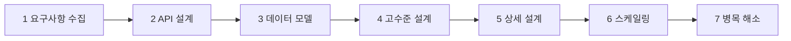
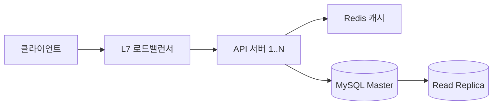
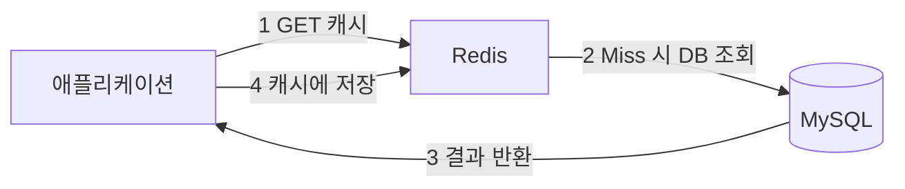
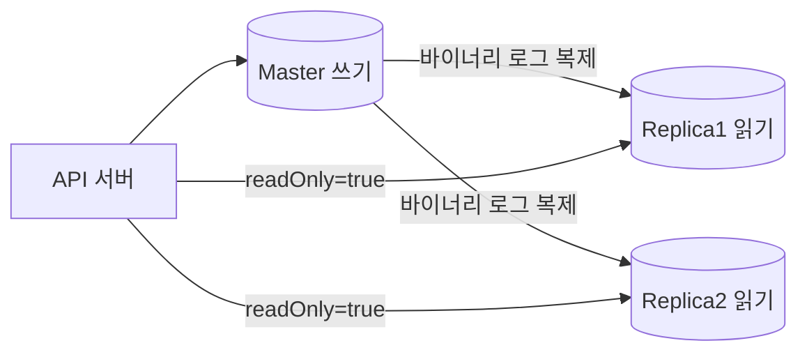
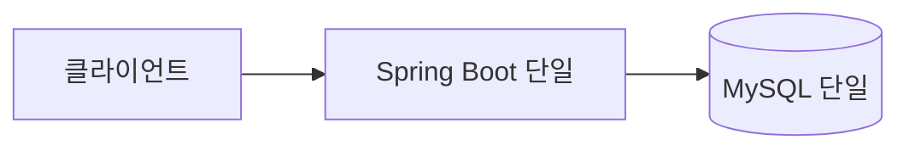
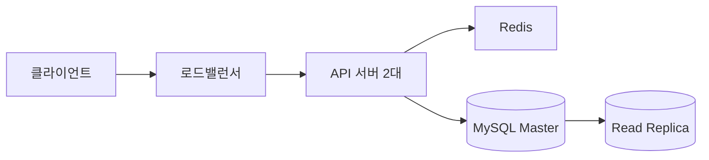
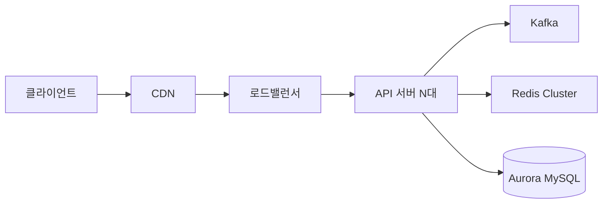
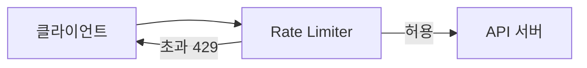

> **한 줄 요약**: 시스템 디자인 면접의 핵심은 컴포넌트 나열이 아니라 "왜 이 선택인가"를 요구사항에서 논리적으로 도출하는 것이다. 암기가 아니라 사고 과정을 보여줘야 시니어 면접관을 설득할 수 있다.

---

## 왜 이 글이 필요한가 — 암기형과 사고형의 차이

면접에서 "URL 단축 서비스를 설계해보세요"라는 말을 들었을 때 두 가지 반응이 있습니다.

**암기형 답변 (탈락 패턴)**: "Redis를 캐시로 쓰고 MySQL을 쓰고 로드밸런서를 앞에 놓겠습니다."

**사고형 답변 (합격 패턴)**: "먼저 확인하겠습니다. 하루 URL 생성이 몇 건인가요? 읽기와 쓰기 비율은요? URL 만료 기능이 필요한가요? 이 숫자들에 따라 DB 선택과 캐시 전략이 달라집니다. QPS를 계산해보면 읽기 QPS가 약 3,480이고 P99 50ms 요건이 있으므로 Redis Cache-Aside가 필요합니다."

시니어 면접관이 원하는 것은 후자입니다. **왜 Redis인가, 왜 MySQL인가, 왜 Kafka인가**를 요구사항에서 도출하는 논리 과정을 봅니다. 이 글은 그 사고 과정을 7단계로 구조화합니다.

예제는 URL 단축 서비스 하나를 전 단계에 관통시킵니다. 실제 면접에서 어떤 주제가 나오든 동일한 7단계를 적용하면 됩니다.

---

## 전체 7단계 흐름 — 순서가 틀리면 설계가 무너진다



각 단계가 다음 단계의 입력이 됩니다. 요구사항을 모르면 API를 잘못 설계하고, API가 없으면 데이터 모델이 어긋납니다. 면접에서 "일단 그림부터 그려볼게요"라고 시작하는 순간 방향을 잃습니다.

면접 시간 배분 기준: 요구사항 5분, API 5분, 데이터 모델 10분, 고수준 설계 10분, 상세 설계 15분, 스케일링 및 병목 10분.

---

## Step 1. 요구사항 수집 — 설계의 제약 조건을 먼저 잡아라

### 왜 요구사항부터 시작하는가

요구사항 없이 설계를 시작하면 잘못된 문제를 풉니다. "SNS 피드 시스템"을 설계하라고 했을 때 MAU 1만이면 단일 MySQL + Spring Boot 하나로 충분합니다. MAU 1억이면 샤딩, 팬아웃 전략, CDN, 글로벌 멀티 리전이 필요합니다. 100배 다른 요구사항에 같은 설계를 내놓으면 틀린 답입니다.

**요구사항 없이 설계를 시작하는 것은 처방전 없이 약을 짓는 것입니다.**

면접에서 면접관이 의도적으로 요구사항을 모호하게 줄 수 있습니다. 이것은 지원자가 요구사항을 적극적으로 수집하는지 보는 테스트입니다. 바로 설계를 시작하면 감점입니다.

### 기능적 요구사항 — 시스템이 무엇을 해야 하는가

URL 단축 서비스 예시:

1. 사용자가 긴 URL을 입력하면 짧은 단축 코드를 반환한다
2. 단축 코드에 접근하면 원본 URL로 리다이렉트한다
3. URL에 만료 일시를 설정할 수 있다 (선택 기능)
4. 사용자가 생성한 URL 목록을 조회할 수 있다 (선택 기능)
5. 클릭 통계를 조회할 수 있다 (선택 기능)

이 목록을 면접관과 함께 만들어야 합니다. 선택 기능(Optional)은 나중에 구현한다고 명시하고, 핵심 기능에 집중합니다.

### 비기능적 요구사항 — 아키텍처를 결정하는 숫자들

비기능적 요구사항이 실제로 어떤 컴포넌트를 쓸지 결정합니다.

| 항목 | 질문해야 할 것 | URL 단축 서비스 예시 |
|------|--------------|---------------------|
| 규모 | DAU, 요청 빈도 | DAU 1억, 읽기:쓰기 = 100:1 |
| 가용성 | 허용 다운타임 | 99.9% (월 43분 허용) |
| 일관성 | 즉시 반영 필요 여부 | 최종 일관성 허용 |
| 지연 | P99 응답시간 목표 | 리다이렉트 P99 < 50ms |
| 데이터 보관 | 얼마나 오래 저장하는가 | 5년 |

**왜 일관성 요구사항을 반드시 확인해야 하는가**: 강한 일관성(Strong Consistency)이 필요하면 Read Replica를 쓸 수 없습니다. Replica에는 복제 지연이 있기 때문입니다. 최종 일관성(Eventual Consistency)을 허용한다면 Replica에서 읽어도 됩니다. 이 선택 하나가 읽기 처리량을 2배 이상 늘려줍니다.

### 용량 추정 — 숫자 없는 설계는 추측이다

용량 추정은 면접관에게 "이 숫자라면 어떤 기술이 필요하다"는 논리를 보여줍니다. 정확한 숫자가 아니어도 됩니다. 10배 이내의 추정이면 아키텍처 선택에 영향이 없습니다.

**QPS 추정 공식:**

```
쓰기 QPS = DAU × 1인당 일일 쓰기 횟수 / 86,400초
읽기 QPS = 쓰기 QPS × 읽기:쓰기 비율
피크 QPS = 평균 QPS × 3  (경험적으로 피크는 평균의 2~3배)
```

**URL 단축 서비스 용량 추정 전체 계산:**

```
[가정]
- DAU: 1억 명
- 1인당 URL 생성: 월 3건 → 일 0.1건
  → 실제 하루 생성 = 1억 × 0.01 = 100만 건/일
- 읽기:쓰기 = 100:1
  → 하루 리다이렉트 = 100만 × 100 = 1억 건/일

[QPS 계산]
쓰기 QPS = 1,000,000 / 86,400 ≈ 12 QPS
읽기 QPS = 100,000,000 / 86,400 ≈ 1,160 QPS
피크 읽기 QPS = 1,160 × 3 = 3,480 QPS

[저장소 추정]
URL 1건 크기:
  - original_url: 평균 200B (긴 URL 2KB, 짧은 URL 50B 중간값)
  - short_code: 8B
  - 메타데이터 (user_id, created_at, expires_at): 50B
  - 합계 ≈ 260B

일일 저장량 = 1,000,000 × 260B = 260MB/일
5년 저장량 = 260MB × 365 × 5 ≈ 475GB

[대역폭 추정]
리다이렉트 응답 크기 = HTTP 302 헤더 ≈ 500B
읽기 대역폭 = 1,160 QPS × 500B ≈ 580KB/s (매우 낮음)
쓰기 대역폭 = 12 QPS × 260B ≈ 3KB/s (무시 가능)

[메모리 추정 (Redis)]
인기 URL 캐시 (상위 20% URL이 80% 트래픽 = 파레토 법칙)
캐시 대상 = 전체 데이터의 20% → 475GB × 20% ≈ 95GB
현실적으로 최근 인기 URL만 캐시 → 수십 GB Redis로 충분
```

**이 숫자에서 도출되는 아키텍처 결론:**

```
쓰기 QPS 12 → MySQL 마스터 단일 인스턴스로 충분 (MySQL 쓰기 최대 수천 QPS)
읽기 QPS 3,480 → MySQL로 가능 (PK 조회 기준 최대 10만 QPS)
                  하지만 P99 < 50ms 요건 → DB 조회만으로는 불안정
                  → Redis 캐시 필수
저장소 475GB → MySQL 단일 인스턴스 충분 (TB 단위까지 가능)
             → 샤딩 불필요
```

요구사항 수집 단계에서 나온 이 숫자들이 이후 모든 선택의 근거가 됩니다. 면접에서 "왜 Redis를 쓰나요?"라는 질문에 "읽기 QPS 3,480에서 P99 50ms를 보장하기 위해"라고 답할 수 있게 됩니다.

---

## Step 2. API 설계 — 시스템의 계약을 정의하라

### 왜 API 설계가 DB 설계보다 먼저인가

API는 시스템의 "계약"입니다. API가 먼저 확정되면 클라이언트 팀과 서버 팀이 독립적으로 개발할 수 있습니다. DB 스키마를 먼저 잡으면 클라이언트 요구가 바뀔 때 DB와 API를 모두 바꿔야 합니다.

**인터페이스에서 구현으로 설계하는 것이 올바른 방향입니다.**

실제로 API 설계 후 DB 스키마를 잡으면 "어떤 컬럼이 필요한가"가 명확해집니다. API의 요청/응답 필드가 곧 DB 컬럼의 후보입니다.

### REST 설계 원칙 — 왜 이 관례를 따르는가

REST 관례는 팀 간 의사소통 비용을 줄이는 공통 언어입니다. `POST /createUrl` 대신 `POST /urls`를 쓰는 이유는, 동사 대신 명사를 쓰는 관례가 API를 예측 가능하게 만들기 때문입니다. 새 팀원이 온보딩할 때 "우리 API 패턴은 명사 + HTTP 메서드"라고 한 줄로 설명할 수 있습니다.

```
[URL 단축 서비스 API 설계]

1. URL 생성
POST /api/v1/urls
Headers: Idempotency-Key: <uuid>
Request:  { "originalUrl": "https://example.com/very/long/path", "expiresAt": "2026-12-31T23:59:59Z" }
Response 201: { "shortCode": "abc12345", "shortUrl": "https://short.ly/abc12345", "expiresAt": "2026-12-31T23:59:59Z" }

2. 리다이렉트
GET /{shortCode}
Response 302: Location: https://example.com/very/long/path
             (캐시 허용 시 Cache-Control: max-age=3600)

3. URL 목록 조회 (커서 기반 페이지네이션)
GET /api/v1/urls?cursor=abc12345&size=20
Response 200: {
  "items": [{ "shortCode": "...", "originalUrl": "...", "clickCount": 42, "createdAt": "..." }],
  "nextCursor": "xyz67890",
  "hasNext": true
}

4. URL 삭제
DELETE /api/v1/urls/{shortCode}
Response 204

5. 클릭 통계 조회
GET /api/v1/urls/{shortCode}/stats
Response 200: { "totalClicks": 1234, "last24h": 56, "topCountries": [...] }
```

**왜 v1 버저닝을 처음부터 넣는가**: API를 바꾸면 기존 클라이언트가 깨집니다. 처음부터 `/api/v1/`을 넣어두면 나중에 v2를 추가할 때 기존 v1 사용자에게 영향이 없습니다. "나중에 추가하면 되지"라고 생각했다가 /api/urls로 배포한 뒤 /api/v1/urls로 바꾸면 수많은 클라이언트 코드를 함께 수정해야 합니다.

### 왜 커서 기반 페이지네이션인가 — Offset vs Cursor

이 선택을 면접에서 설명할 수 있어야 합니다. Offset이 문제가 되는 구체적인 숫자를 들어야 합니다.

```sql
-- Offset 방식의 문제
SELECT * FROM urls ORDER BY created_at DESC LIMIT 20 OFFSET 10000;
-- DB가 10,020개 행을 스캔 후 20개만 반환
-- OFFSET이 커질수록 선형적으로 느려짐
-- 데이터 100만 건에서 OFFSET 999980이면 전체 테이블 스캔

-- 또 다른 문제: 페이지 조회 중 새 URL이 삽입되면
-- OFFSET 20으로 2페이지 요청 시 1페이지 마지막 항목이 2페이지 처음에 중복
```

```sql
-- Cursor 방식
SELECT * FROM urls
WHERE short_code < :lastShortCode  -- 커서: 마지막으로 받은 항목
ORDER BY short_code DESC
LIMIT 20;
-- short_code 인덱스로 바로 위치를 찾아 20개만 읽음
-- 새 데이터가 삽입돼도 중복/누락 없음
-- O(1) 조회 성능 (데이터가 아무리 많아도 동일한 속도)
```

커서 기반 페이지네이션이 필수인 상황: 소셜 미디어 피드, 알림 목록, 채팅 기록 등 **데이터가 계속 추가되고 대량 조회가 필요한 모든 곳**.

### 왜 멱등성(Idempotency)이 필요한가

네트워크는 불신뢰합니다. 클라이언트가 POST 요청을 보냈는데 응답을 못 받으면 같은 요청을 다시 보냅니다. 멱등성이 없으면 같은 긴 URL에 대해 두 개의 단축 코드가 생성됩니다.

```java
// 멱등성 키 처리 — Spring Boot
@PostMapping("/api/v1/urls")
public ResponseEntity<CreateUrlResponse> create(
        @RequestHeader("Idempotency-Key") String idempotencyKey,
        @Valid @RequestBody CreateUrlRequest request,
        @AuthenticationPrincipal Long userId) {

    // 같은 키로 이미 처리된 요청인지 Redis에서 확인
    Optional<CreateUrlResponse> cached = idempotencyStore.find(idempotencyKey);
    if (cached.isPresent()) {
        // 재처리 없이 동일한 응답 반환
        return ResponseEntity.status(HttpStatus.CREATED).body(cached.get());
    }

    CreateUrlResponse response = urlService.create(request, userId);

    // 24시간 동안 이 키의 응답을 캐시 (그 이후 재요청은 새 작업으로 처리)
    idempotencyStore.save(idempotencyKey, response, Duration.ofHours(24));
    return ResponseEntity.status(HttpStatus.CREATED).body(response);
}
```

```java
@Service
@RequiredArgsConstructor
public class IdempotencyStore {

    private final RedisTemplate<String, CreateUrlResponse> redisTemplate;

    public Optional<CreateUrlResponse> find(String key) {
        CreateUrlResponse value = redisTemplate.opsForValue().get("idempotency:" + key);
        return Optional.ofNullable(value);
    }

    public void save(String key, CreateUrlResponse response, Duration ttl) {
        redisTemplate.opsForValue().set("idempotency:" + key, response, ttl);
    }
}
```

결제, 주문, URL 생성 등 **부작용이 있는 모든 POST/PUT 요청에는 멱등성 키를 적용**해야 안전합니다.

---

## Step 3. 데이터 모델 선택 — 액세스 패턴이 DB를 결정한다

### 왜 DB 선택이 가장 중요한 결정인가

DB는 바꾸기 가장 어려운 컴포넌트입니다. MySQL에서 Cassandra로 마이그레이션하면 수개월의 작업과 수십억 원의 비용이 들 수 있습니다. 반면 API 라우팅 로직은 하루 만에 바꿀 수 있습니다.

처음부터 올바른 DB를 선택해야 합니다. 그 기준은 "이 DB가 유명한가"가 아니라 **"이 요구사항의 액세스 패턴에 어떤 DB가 맞는가"**입니다.

### DB 선택 결정 트리 — 4가지 질문으로 결정하라

```
Q1. 여러 테이블을 한 번에 변경해야 하는 트랜잭션이 필요한가?
    또는 강한 일관성(읽은 즉시 최신 데이터)이 필요한가?
    → YES: RDB (MySQL / PostgreSQL)
    → NO: 다음 질문

Q2. 쓰기가 초당 수만 건 이상이고, 최종 일관성을 허용하는가?
    (이벤트 로그, IoT 데이터, 타임라인)
    → YES: Cassandra (마스터 없이 모든 노드에 쓰기, 선형 확장)
    → NO: 다음 질문

Q3. 스키마가 자주 바뀌거나 중첩 JSON 구조를 저장해야 하는가?
    (상품 카탈로그, CMS 콘텐츠)
    → YES: MongoDB (유연한 문서 모델)
    → NO: 다음 질문

Q4. 1ms 이하의 응답이 필요하고 데이터가 수십GB 이하인가?
    (세션, 토큰, 랭킹)
    → YES: Redis (인메모리)
    → NO: 기본 RDB로 충분
```

면접에서 이 결정 트리를 소리 내어 따라가면서 "URL 단축 서비스는 Q1에서 강한 일관성이 필요합니다. shortCode 중복이 생기면 안 되니까요. 그래서 MySQL을 선택합니다"라고 설명하면 됩니다.

### DB 선택 비교표

| 선택 근거 | 추천 DB | 실전 예시 | 포기하는 것 |
|-----------|---------|---------|-------------|
| ACID 트랜잭션, 강한 일관성 | MySQL / PostgreSQL | 결제, 재고, 회원 | 쓰기 확장성 |
| 대용량 쓰기, 최종 일관성 허용 | Cassandra | 이벤트 로그, IoT | JOIN, 트랜잭션 |
| 유연한 스키마, 중첩 문서 | MongoDB | 상품 카탈로그, CMS | 강한 일관성 |
| 빠른 읽기, 소량 데이터 | Redis | 세션, 토큰, 캐시 | 영속성, 용량 |
| 전문 검색, 집계 분석 | Elasticsearch | 로그 분석, 상품 검색 | 트랜잭션 |
| 관계 탐색 (친구의 친구) | Neo4j | SNS 소셜 그래프 | 대용량 쓰기 |

### URL 단축 서비스 데이터 모델 결정

```
[액세스 패턴 분석]
핵심 쿼리 1: short_code → original_url 조회 (QPS 3,480, 단순 PK 조회)
핵심 쿼리 2: user_id별 URL 목록 (QPS 낮음, 페이지네이션)
핵심 쿼리 3: URL 생성 (QPS 12, 단순 INSERT)

[일관성 요구사항]
short_code는 전역 유일 → 중복 허용 안 됨 → 강한 일관성

[결론]
→ MySQL 선택: 단순 PK 조회, 강한 일관성, 저장소 475GB (MySQL 범위)
→ Redis 캐시 추가: P99 50ms 요건, 읽기의 80%가 상위 20% 인기 URL (캐시 효율 높음)
→ Cassandra/MongoDB 제외: 트랜잭션 필요, 스키마 변경 빈도 낮음
```

```java
// JPA 엔티티 — MySQL 스키마 반영
@Entity
@Table(name = "urls",
    indexes = {
        @Index(name = "uk_short_code", columnList = "shortCode", unique = true),
        @Index(name = "idx_user_created", columnList = "userId, createdAt DESC")
    })
@Getter
@NoArgsConstructor(access = AccessLevel.PROTECTED)
public class Url {

    @Id
    @GeneratedValue(strategy = GenerationType.IDENTITY)
    private Long id;

    @Column(name = "short_code", nullable = false, length = 8)
    private String shortCode;

    @Column(name = "original_url", nullable = false, columnDefinition = "TEXT")
    private String originalUrl;

    @Column(name = "user_id")
    private Long userId;

    @Column(name = "created_at", nullable = false, updatable = false)
    private LocalDateTime createdAt;

    @Column(name = "expires_at")
    private LocalDateTime expiresAt;

    @Column(name = "click_count", nullable = false)
    private long clickCount = 0;

    @Builder
    public Url(String shortCode, String originalUrl, Long userId, LocalDateTime expiresAt) {
        this.shortCode = shortCode;
        this.originalUrl = originalUrl;
        this.userId = userId;
        this.createdAt = LocalDateTime.now();
        this.expiresAt = expiresAt;
    }

    public boolean isExpired() {
        return expiresAt != null && LocalDateTime.now().isAfter(expiresAt);
    }

    // 패키지 내부에서만 사용 — 서비스 계층에서 직접 필드 수정 방지
    void incrementClickCount(long delta) {
        this.clickCount += delta;
    }
}
```

```java
// Repository — 필요한 쿼리만 정의
public interface UrlRepository extends JpaRepository<Url, Long> {

    // 리다이렉트 핵심 쿼리: short_code 인덱스 활용
    Optional<Url> findByShortCode(String shortCode);

    // 사용자별 목록: 커서 기반 페이지네이션
    @Query("""
        SELECT u FROM Url u
        WHERE u.userId = :userId
          AND (:cursor IS NULL OR u.shortCode < :cursor)
        ORDER BY u.shortCode DESC
        """)
    List<Url> findByUserIdWithCursor(
            @Param("userId") Long userId,
            @Param("cursor") String cursor,
            Pageable pageable);

    // 클릭 수 배치 증가 (Kafka 컨슈머에서 사용)
    @Modifying
    @Query("UPDATE Url u SET u.clickCount = u.clickCount + :delta WHERE u.shortCode = :shortCode")
    void incrementClickCount(@Param("shortCode") String shortCode, @Param("delta") long delta);
}
```

**왜 click_count를 URL 테이블에 두는가**: 별도 테이블을 만들면 리다이렉트 시 JOIN이 필요해집니다. 핫 URL에서 초당 10만 번의 JOIN은 감당할 수 없습니다. 클릭 수는 정확한 실시간 값보다 "대략적인 집계값"이 허용되므로, 메인 테이블 컬럼으로 두고 Kafka 배치 처리로 비동기 업데이트합니다.

---

## Step 4. 고수준 아키텍처 — 각 컴포넌트가 존재하는 이유

### 컴포넌트 선택의 기준

아키텍처 다이어그램을 그릴 때 모든 컴포넌트는 "왜 여기에 있는가"라는 질문에 답할 수 있어야 합니다. "다들 쓰니까 넣었습니다"는 면접에서 감점입니다.



### 각 컴포넌트가 존재하는 이유

**L7 로드밸런서가 필요한 이유:**

API 서버가 1대이면 배포나 장애 시 전체 서비스가 중단됩니다. 로드밸런서가 있으면 서버 N대를 순서대로 재시작해도 서비스가 유지됩니다. L7(HTTP 레벨)을 쓰는 이유는 URL 경로 기반 라우팅, SSL 종료(offload), 헬스체크를 애플리케이션 레벨에서 할 수 있기 때문입니다. L4(TCP 레벨)는 이 기능이 없습니다.

```
헬스체크 동작:
로드밸런서 → GET /actuator/health → 200 OK → 정상 서버 유지
                                   → 연결 실패 또는 5xx → 서버 제거, 다른 서버로 라우팅
```

**API 서버 N대의 전제 조건 — Stateless:**

API 서버를 여러 대 두려면 서버가 상태를 로컬에 저장하면 안 됩니다. 사용자 A의 요청이 서버 1로 갔다가 다음 요청이 서버 2로 가도 동일하게 동작해야 합니다. 세션을 로컬 메모리에 두면 서버 1에만 세션이 있어서 서버 2로 가면 로그인이 풀립니다.

```
Stateless 전환 규칙:
세션 데이터 → Redis
업로드 파일 → S3
로컬 캐시 → Redis (공유 캐시)
```

**Redis 캐시가 필요한 이유 — 숫자로 설명:**

```
MySQL PK 조회 응답 시간: 평균 5ms (좋은 날), 피크 시 50ms+
Redis 조회 응답 시간: 평균 0.1ms

P99 50ms 목표에서 MySQL 단독 사용:
→ 피크 QPS에서 DB 부하 상승 → 응답시간 50ms 초과 → 요건 미달

Redis 추가 시:
→ 읽기 요청의 80%가 캐시 히트 → Redis에서 0.1ms 응답
→ 나머지 20%만 DB 조회 → DB 부하 80% 감소 → P99 안정
```

**MySQL Master + Read Replica 구조의 이유:**

쓰기 QPS는 12이고 읽기 QPS는 1,160입니다. 쓰기와 읽기를 같은 인스턴스에 두면 읽기 트래픽이 쓰기 트랜잭션의 Lock을 기다리게 됩니다. Master는 쓰기 전용, Replica는 읽기 전용으로 분리하면 서로 간섭이 없습니다.

### Spring Boot 계층 구조 — 책임의 분리

```java
// Controller: HTTP 입출력만 담당, 비즈니스 로직 없음
@RestController
@RequestMapping("/api/v1/urls")
@RequiredArgsConstructor
@Slf4j
public class UrlController {

    private final UrlService urlService;
    private final IdempotencyStore idempotencyStore;

    @PostMapping
    public ResponseEntity<CreateUrlResponse> create(
            @RequestHeader(value = "Idempotency-Key", required = false) String idempotencyKey,
            @Valid @RequestBody CreateUrlRequest request,
            @AuthenticationPrincipal Long userId) {

        if (idempotencyKey != null) {
            Optional<CreateUrlResponse> cached = idempotencyStore.find(idempotencyKey);
            if (cached.isPresent()) {
                return ResponseEntity.status(HttpStatus.CREATED).body(cached.get());
            }
        }

        CreateUrlResponse response = urlService.create(request, userId);

        if (idempotencyKey != null) {
            idempotencyStore.save(idempotencyKey, response, Duration.ofHours(24));
        }

        return ResponseEntity.status(HttpStatus.CREATED).body(response);
    }

    @GetMapping
    public ResponseEntity<PageResponse<UrlSummary>> list(
            @RequestParam(required = false) String cursor,
            @RequestParam(defaultValue = "20") @Max(100) int size,
            @AuthenticationPrincipal Long userId) {

        return ResponseEntity.ok(urlService.listByUser(userId, cursor, size));
    }

    @DeleteMapping("/{shortCode}")
    public ResponseEntity<Void> delete(
            @PathVariable String shortCode,
            @AuthenticationPrincipal Long userId) {

        urlService.delete(shortCode, userId);
        return ResponseEntity.noContent().build();
    }
}
```

```java
// 리다이렉트 컨트롤러: 별도 분리 (경로 충돌 방지 + 관심사 분리)
@Controller
@RequiredArgsConstructor
@Slf4j
public class RedirectController {

    private final UrlService urlService;

    @GetMapping("/{shortCode:[a-zA-Z0-9]{6,8}}")  // 정규식으로 shortCode 형식 제한
    public ResponseEntity<Void> redirect(@PathVariable String shortCode,
                                          HttpServletRequest request) {
        String originalUrl = urlService.resolveUrl(shortCode);

        // 클릭 이벤트 비동기 발행 (응답 속도에 영향 없음)
        urlService.publishClickEvent(shortCode, request.getRemoteAddr(),
                request.getHeader("User-Agent"));

        return ResponseEntity.status(HttpStatus.FOUND)
                .location(URI.create(originalUrl))
                .build();
    }
}
```

```java
// Service: 비즈니스 로직 집중
@Service
@RequiredArgsConstructor
@Slf4j
public class UrlService {

    private final UrlRepository urlRepository;
    private final UrlCacheService cacheService;
    private final ShortCodeGenerator shortCodeGenerator;
    private final ClickEventPublisher clickEventPublisher;

    @Transactional
    public CreateUrlResponse create(CreateUrlRequest request, Long userId) {
        String shortCode = shortCodeGenerator.generate();

        Url url = Url.builder()
                .shortCode(shortCode)
                .originalUrl(request.getOriginalUrl())
                .userId(userId)
                .expiresAt(request.getExpiresAt())
                .build();

        urlRepository.save(url);

        // Write-through: 생성 직후 캐시에 미리 로드 (첫 조회 지연 방지)
        cacheService.put(shortCode, request.getOriginalUrl(), request.getExpiresAt());

        log.info("URL created: shortCode={}, userId={}", shortCode, userId);
        return CreateUrlResponse.from(url);
    }

    // readOnly=true → AbstractRoutingDataSource가 Read Replica로 라우팅
    @Transactional(readOnly = true)
    public String resolveUrl(String shortCode) {
        // 1. L1 로컬 캐시 → 2. L2 Redis → 3. DB (Read Replica)
        return cacheService.get(shortCode)
                .orElseGet(() -> loadFromDb(shortCode));
    }

    private String loadFromDb(String shortCode) {
        Url url = urlRepository.findByShortCode(shortCode)
                .orElseThrow(() -> new UrlNotFoundException(shortCode));

        if (url.isExpired()) {
            throw new UrlExpiredException(shortCode);
        }

        cacheService.put(shortCode, url.getOriginalUrl(), url.getExpiresAt());
        return url.getOriginalUrl();
    }

    public void publishClickEvent(String shortCode, String ip, String userAgent) {
        // 비동기 Kafka 발행 — 리다이렉트 응답 후 실행
        clickEventPublisher.publishAsync(shortCode, ip, userAgent);
    }

    @Transactional
    public void delete(String shortCode, Long userId) {
        Url url = urlRepository.findByShortCode(shortCode)
                .orElseThrow(() -> new UrlNotFoundException(shortCode));

        if (!url.getUserId().equals(userId)) {
            throw new ForbiddenException("본인이 생성한 URL만 삭제할 수 있습니다.");
        }

        urlRepository.delete(url);
        cacheService.evict(shortCode);  // 캐시 무효화
    }

    @Transactional(readOnly = true)
    public PageResponse<UrlSummary> listByUser(Long userId, String cursor, int size) {
        List<Url> urls = urlRepository.findByUserIdWithCursor(
                userId, cursor, PageRequest.of(0, size + 1));

        boolean hasNext = urls.size() > size;
        List<Url> items = hasNext ? urls.subList(0, size) : urls;
        String nextCursor = hasNext ? items.get(items.size() - 1).getShortCode() : null;

        return PageResponse.of(
                items.stream().map(UrlSummary::from).toList(),
                nextCursor,
                hasNext);
    }
}
```

---

## Step 5. 상세 설계 — 캐시·메시지큐·CDN을 언제 왜 쓰는가

### 캐시 전략 — 4가지 중 왜 Cache-Aside인가

캐시 전략은 4가지입니다. URL 단축 서비스에서 왜 Cache-Aside를 선택하는지 다른 전략과 비교합니다.



**Cache-Aside (Lazy Loading) — URL 단축 서비스 선택 이유:**

실제로 클릭된 URL만 캐시에 들어옵니다. 전체 URL이 475GB인데 모두 캐시에 올릴 필요 없습니다. 인기 URL 상위 20%가 트래픽의 80%를 차지하므로, 조회될 때만 자동으로 캐시에 올라오는 방식이 가장 효율적입니다.

```java
@Service
@RequiredArgsConstructor
public class UrlCacheService {

    private static final Duration BASE_TTL = Duration.ofHours(24);
    private static final long JITTER_MAX_SECONDS = 1800; // 30분

    private final Cache<String, String> localCache = Caffeine.newBuilder()
            .maximumSize(1_000)
            .expireAfterWrite(30, TimeUnit.SECONDS)
            .recordStats()
            .build();

    private final RedisTemplate<String, String> redisTemplate;

    public Optional<String> get(String shortCode) {
        // L1: JVM 로컬 캐시 (나노초 응답)
        String localHit = localCache.getIfPresent(shortCode);
        if (localHit != null) {
            return Optional.of(localHit);
        }

        // L2: Redis 분산 캐시 (0.1ms 응답)
        String redisHit = redisTemplate.opsForValue().get(cacheKey(shortCode));
        if (redisHit != null) {
            localCache.put(shortCode, redisHit);
            return Optional.of(redisHit);
        }

        return Optional.empty(); // DB 조회 필요
    }

    public void put(String shortCode, String originalUrl, LocalDateTime expiresAt) {
        Duration ttl = computeTtl(expiresAt);
        if (ttl.isNegative() || ttl.isZero()) {
            return; // 이미 만료된 URL은 캐시 저장 안 함
        }

        redisTemplate.opsForValue().set(cacheKey(shortCode), originalUrl, ttl);
        localCache.put(shortCode, originalUrl);
    }

    public void evict(String shortCode) {
        redisTemplate.delete(cacheKey(shortCode));
        localCache.invalidate(shortCode);
    }

    private Duration computeTtl(LocalDateTime expiresAt) {
        if (expiresAt == null) {
            // TTL 지터: 동시 만료로 인한 캐시 스탬피드 방지
            long jitter = ThreadLocalRandom.current().nextLong(0, JITTER_MAX_SECONDS);
            return BASE_TTL.plusSeconds(jitter);
        }
        // URL 만료 시간보다 1분 짧게 설정 (안전 마진)
        Duration untilExpiry = Duration.between(LocalDateTime.now(), expiresAt);
        return untilExpiry.minus(Duration.ofMinutes(1));
    }

    private String cacheKey(String shortCode) {
        return "url:" + shortCode;
    }
}
```

**왜 Write-Through를 쓰지 않는가:**

Write-Through는 쓰기 시 캐시와 DB에 동시에 씁니다. URL 단축 서비스에서 쓰기 QPS는 12로 매우 낮습니다. 모든 URL을 캐시에 올려야 할 이유가 없습니다. 대부분의 URL은 클릭이 거의 없으므로 캐시에 올려도 메모리만 낭비합니다.

**왜 Write-Behind를 절대 쓰면 안 되는가:**

Write-Behind는 캐시에 먼저 쓰고 DB는 비동기로 나중에 씁니다. Redis 장애 시 아직 DB에 반영되지 않은 데이터가 영원히 사라집니다. 사용자가 만든 URL이 사라지는 것은 허용할 수 없는 데이터 유실입니다.

### Read Replica 자동 라우팅 — readOnly 어노테이션의 마법

```java
// DataSource 라우팅 설정 — @Transactional(readOnly) 기반
@Configuration
public class DataSourceRoutingConfig {

    @Bean
    @Primary
    public DataSource routingDataSource(
            @Qualifier("masterDataSource") DataSource master,
            @Qualifier("replicaDataSource") DataSource replica) {

        AbstractRoutingDataSource routing = new AbstractRoutingDataSource() {
            @Override
            protected Object determineCurrentLookupKey() {
                boolean isReadOnly = TransactionSynchronizationManager
                        .isCurrentTransactionReadOnly();
                return isReadOnly ? "replica" : "master";
            }
        };

        Map<Object, Object> sources = new HashMap<>();
        sources.put("master", master);
        sources.put("replica", replica);

        routing.setTargetDataSources(sources);
        routing.setDefaultTargetDataSource(master);
        routing.afterPropertiesSet();
        return routing;
    }
}
```

```java
// 서비스 계층: 어노테이션 하나로 자동 분기
@Service
public class UrlService {

    // @Transactional(readOnly = true) → Read Replica
    @Transactional(readOnly = true)
    public String resolveUrl(String shortCode) { ... }

    // @Transactional (기본, readOnly = false) → Master
    @Transactional
    public CreateUrlResponse create(CreateUrlRequest request, Long userId) { ... }
}
```

**복제 지연(Replication Lag) 문제:**

비동기 복제이므로 Master에 쓴 직후 Replica에서 읽으면 데이터가 없을 수 있습니다.

```
[문제 시나리오]
1. 사용자가 URL 생성 → Master에 INSERT
2. 즉시 "내 URL 목록" 조회 → Replica에서 SELECT
3. Replica 복제 지연 500ms → 방금 만든 URL이 목록에 없음
4. 사용자 혼란: "방금 만든 게 왜 없어?"

[해결: 쓰기 직후 일정 시간 Master에서 읽기]
```

```java
// Read-Your-Writes 패턴 구현
@Service
@RequiredArgsConstructor
public class UrlService {

    private final RedisTemplate<String, Boolean> redisTemplate;

    @Transactional
    public CreateUrlResponse create(CreateUrlRequest request, Long userId) {
        // ... 생성 로직 ...

        // 이 사용자는 1초간 Master에서 읽도록 마킹
        String flagKey = "ryw:" + userId;
        redisTemplate.opsForValue().set(flagKey, true, Duration.ofSeconds(1));

        return response;
    }

    @Transactional(readOnly = true)
    public PageResponse<UrlSummary> listByUser(Long userId, String cursor, int size) {
        // 쓰기 직후 사용자면 Master에서 읽기 (복제 지연 우회)
        String flagKey = "ryw:" + userId;
        Boolean isFreshWriter = redisTemplate.opsForValue().get(flagKey);

        if (Boolean.TRUE.equals(isFreshWriter)) {
            return listFromMaster(userId, cursor, size);
        }
        return listFromReplica(userId, cursor, size);
    }
}
```

### 메시지 큐 — 언제, 왜 도입하는가

메시지 큐가 필요한 신호 3가지:

1. **핵심 기능과 부수 기능이 같은 트랜잭션 안에 있을 때**: 주문(핵심) + 이메일 발송(부수). 이메일 서버 장애로 주문이 실패하면 안 됩니다.
2. **소비 속도보다 생산 속도가 빠를 때**: 클릭 이벤트는 초당 10,000건인데 DB 업데이트 처리는 초당 1,000건뿐일 때 큐가 버퍼 역할을 합니다.
3. **소비자 장애 시에도 메시지를 잃으면 안 될 때**: 분석 서버가 일시 다운돼도 클릭 이벤트는 Kafka에 보존됩니다.

URL 단축 서비스에서 클릭 수 집계를 예로 들겠습니다. 클릭마다 DB UPDATE를 동기로 하면:

```
[극한 시나리오]
유명인이 단축 URL을 공유 → 순간 초당 50,000 클릭
→ 50,000번의 UPDATE urls SET click_count = click_count + 1 WHERE short_code = 'abc123'
→ 동일 행 Lock 경쟁으로 대기열 폭발
→ MySQL 커넥션 풀 200개가 모두 대기 상태
→ 리다이렉트 API가 DB Lock 때문에 타임아웃
→ 핵심 기능(리다이렉트)이 부수 기능(통계) 때문에 다운
```

Kafka로 비동기 분리하면:

```java
// 클릭 이벤트 발행 — 리다이렉트 응답 후 즉시 반환
@Service
@RequiredArgsConstructor
public class ClickEventPublisher {

    private final KafkaTemplate<String, ClickEvent> kafkaTemplate;

    // 비동기 발행 — 리다이렉트 응답 속도에 0ms 영향
    public void publishAsync(String shortCode, String ip, String userAgent) {
        ClickEvent event = ClickEvent.builder()
                .shortCode(shortCode)
                .ip(ip)
                .userAgent(userAgent)
                .timestamp(Instant.now())
                .build();

        kafkaTemplate.send("url-clicks", shortCode, event)
                .whenComplete((result, ex) -> {
                    if (ex != null) {
                        log.warn("Click event publish failed: shortCode={}", shortCode, ex);
                        // 통계 누락은 허용 — 리다이렉트는 이미 성공
                    }
                });
    }
}
```

```java
// 클릭 이벤트 소비 — 별도 컨슈머 그룹, 배치 처리
@Component
@RequiredArgsConstructor
@Slf4j
public class ClickEventConsumer {

    private final UrlRepository urlRepository;

    // 100건씩 배치로 읽어 집계 후 한 번의 UPDATE
    @KafkaListener(
            topics = "url-clicks",
            groupId = "click-aggregator",
            containerFactory = "batchKafkaListenerContainerFactory"
    )
    @Transactional
    public void consume(List<ConsumerRecord<String, ClickEvent>> records) {
        // shortCode별 클릭 수 집계
        Map<String, Long> countByCode = records.stream()
                .collect(Collectors.groupingBy(
                        r -> r.value().getShortCode(),
                        Collectors.counting()));

        // 1 shortCode당 1번의 UPDATE (배치 처리로 Lock 경쟁 최소화)
        countByCode.forEach((code, count) -> {
            try {
                urlRepository.incrementClickCount(code, count);
            } catch (Exception e) {
                log.error("Failed to increment click count: shortCode={}, count={}", code, count, e);
                // 통계 오차 허용 — 재시도 또는 Dead Letter Queue로 이동
            }
        });

        log.info("Aggregated {} click events across {} URLs",
                records.size(), countByCode.size());
    }
}
```

### CDN — 글로벌 서비스에만 필수인 이유

CDN 도입이 의미 있는 조건 3가지를 모두 만족해야 합니다:

1. 사용자가 지리적으로 분산되어 있다 (글로벌 서비스)
2. 콘텐츠가 사용자마다 동일하다 (정적 또는 공유 데이터)
3. 원본 서버 대역폭/부하를 줄여야 한다

URL 단축 서비스에서 CDN이 효과적인 부분과 그렇지 않은 부분:

```
CDN이 효과적인 부분:
- 대시보드 정적 리소스 (JS/CSS/이미지) → 전 세계 엣지 캐시
- OG 이미지(미리보기 썸네일) → 소셜 공유 시 빠른 로드

CDN이 효과적이지 않은 부분:
- 리다이렉트 자체 (GET /{shortCode})
  → 사용자마다 다른 곳으로 리다이렉트되는 것이 아님
  → 동일한 shortCode는 항상 같은 original_url로 이동
  → Cloudflare Workers 같은 엣지 컴퓨팅에서 Redis 조회 후 엣지 리다이렉트 가능
    (원본 서버까지 요청이 오지 않아도 됨)

국내 전용 서비스라면:
- CDN은 불필요한 복잡도
- 서울 리전 단일 배포가 더 단순하고 비용 효율적
```

---

## Step 6. 스케일링 — 언제 무엇으로 확장하는가

### 수직 확장 vs 수평 확장 — 언제 각각인가

이 선택은 "더 좋은 방법"이 없습니다. 상황에 따라 다릅니다.

```
수직 확장이 정답인 때:
- 트래픽이 갑자기 폭증해 즉각 대응이 필요할 때 (CPU 업그레이드가 즉각적)
- 애플리케이션이 Stateful해 수평 확장이 어려울 때 (레거시 모놀리스)
- 규모가 작아 단일 서버로 충분할 때 (MAU 10만 이하)

한계: 물리적 상한 (CPU 수백 코어, RAM 수 TB)
      단일 서버이므로 SPOF — 이 서버가 죽으면 전체 다운

수평 확장이 정답인 때:
- 수직 확장의 비용이 수평 확장보다 높아질 때
- 고가용성이 필요해 SPOF를 제거해야 할 때
- 트래픽이 계속 성장해 이론적 무한 확장이 필요할 때

전제 조건: 애플리케이션이 완전히 Stateless여야 함
```

### Read Replica — 읽기 부하를 분산하는 가장 빠른 방법



Read Replica는 샤딩 없이 읽기 처리량을 선형으로 늘리는 가장 단순한 방법입니다. Replica 1대 → 읽기 처리량 2배, 3대 → 3배.

```java
// HikariCP 설정 — 커넥션 풀 크기 계산 근거
// 공식: pool_size = core_count * 2 + effective_spindle_count
// AWS RDS m5.xlarge (4 vCPU) → 권장 pool_size = 4 * 2 + 1 = 9 (10으로 올림)
```

```yaml
spring:
  datasource:
    master:
      hikari:
        maximum-pool-size: 10
        minimum-idle: 3
        connection-timeout: 3000      # 3초 이상 기다리면 503이 낫다
        idle-timeout: 600000          # 유휴 커넥션 10분 후 반납
        max-lifetime: 1800000         # 커넥션 최대 수명 30분 (DB 세션 타임아웃보다 짧게)
        leak-detection-threshold: 60000 # 60초 이상 커넥션을 반납 안 하면 경고
    replica:
      hikari:
        maximum-pool-size: 20         # 읽기 트래픽이 더 많으므로 더 크게
        minimum-idle: 5
        connection-timeout: 3000
```

**커넥션 풀 고갈 시 연쇄 장애:**

```
[극한 시나리오]
트래픽 폭증 → DB 응답 느려짐 → 요청이 커넥션 대기
→ API 스레드 풀이 커넥션 대기로 모두 Block
→ 새 요청이 스레드 풀에 들어올 자리가 없음
→ API 서버 전체가 응답 불능
→ 로드밸런서가 헬스체크 실패 감지 → 서버 제거
→ 나머지 서버에 트래픽 집중 → 연쇄 장애

[방어: 타임아웃 + Circuit Breaker]
커넥션 획득 타임아웃 3초 → 3초 초과 시 즉시 503 반환
Circuit Breaker: 5회 연속 실패 → Circuit Open → 즉시 503
→ DB 장애가 API 서버 전체로 전파되지 않음
```

### 샤딩 — 언제, 왜 마지막 수단인가

샤딩은 DB를 여러 노드에 수평 분할하는 기법입니다. URL 서비스에서는 데이터가 475GB이므로 샤딩이 불필요합니다. MAU가 10억으로 성장해 데이터가 수십 TB가 되면 단일 MySQL로는 불가합니다.

**샤딩 전에 반드시 먼저 시도해야 할 것들 (순서대로):**

```
1단계: 인덱스 최적화 — EXPLAIN으로 Full Scan 제거
2단계: 쿼리 최적화 — N+1 제거, 불필요한 JOIN 제거
3단계: 캐시 레이어 — DB 부하 80% 이상 감소 가능
4단계: Read Replica — 읽기 처리량 N배 증가
5단계: 수직 확장 — DB 서버 스펙 업그레이드

위 방법들을 모두 써도 한계에 도달했을 때만 샤딩을 선택합니다.
```

**샤딩의 비용 (왜 마지막 수단인가):**

```
Cross-shard JOIN 불가
→ user_id별 URL 목록 조회 시 모든 shard에서 조회 후 앱에서 합산

분산 트랜잭션 어려움
→ Two-Phase Commit (2PC) 필요 → 성능 저하 + 구현 복잡도 급증

리샤딩 비용
→ 사용자가 10억이 되어 shard를 3개 → 5개로 늘리면
→ 기존 데이터의 40%를 다른 shard로 마이그레이션
→ 수일 ~ 수주의 다운타임 또는 복잡한 Zero-downtime 마이그레이션

운영 복잡도
→ 각 shard별 모니터링, 백업, 장애 처리가 N배
```

**URL 서비스 샤딩 전략 예시 (필요해진 상황 가정):**

```java
// 해시 기반 샤딩: short_code의 해시값으로 shard 결정
@Component
public class ShardRouter {

    private static final int SHARD_COUNT = 4;

    public DataSource getShardForCode(String shortCode) {
        int shardIndex = Math.abs(shortCode.hashCode() % SHARD_COUNT);
        return shardDataSources.get(shardIndex);
    }

    // 단점: user_id로 해당 사용자의 모든 URL을 찾으려면
    // 모든 shard에 쿼리를 날려야 함 (Scatter-Gather)
    public List<Url> findByUserId(Long userId) {
        return shardDataSources.parallelStream()
                .flatMap(ds -> queryUserUrls(ds, userId).stream())
                .sorted(Comparator.comparing(Url::getCreatedAt).reversed())
                .collect(Collectors.toList());
    }
}
```

---

## Step 7. 병목 식별과 해소 — 숫자로 찾고 숫자로 해소한다

### 병목은 감각이 아니라 메트릭으로 찾는다

"느린 것 같다"는 감각으로 최적화를 시작하면 잘못된 곳을 최적화합니다. 도널드 커누스의 격언: **"조기 최적화는 모든 악의 근원"**. 측정 후 병목이 확인된 곳만 최적화합니다.

| 메트릭 | 정상 | 경고 신호 | 의미 |
|--------|------|---------|------|
| P99 응답시간 | < 100ms | > 500ms | DB 슬로우 쿼리 또는 N+1 |
| DB 커넥션 사용률 | < 60% | > 80% | 커넥션 풀 고갈 임박 |
| 캐시 히트율 | > 90% | < 70% | 캐시 미스 폭발 → DB 과부하 |
| CPU 사용률 | < 70% | > 85% | 서버 증설 또는 로직 최적화 |
| GC Stop-the-World | < 100ms | > 500ms | JVM 힙 설정 또는 메모리 누수 |
| DB Slow Query 비율 | < 1% | > 5% | 인덱스 누락 또는 풀 스캔 |

### 병목 패턴 1: N+1 쿼리

N+1은 가장 흔하고 가장 치명적인 성능 문제입니다. 100개 행을 보여주는 데 101번의 쿼리가 나갑니다.

```java
// 문제 코드 — 사용자 목록과 각 사용자의 URL 수를 보여주는 어드민 페이지
List<User> users = userRepository.findAll(); // 쿼리 1번
for (User user : users) {
    // user가 1000명이면 여기서 1000번 쿼리 → 총 1001번
    int urlCount = urlRepository.countByUserId(user.getId());
    adminDto.add(new UserAdminDto(user, urlCount));
}

// 해결 1: JOIN FETCH
@Query("""
    SELECT u, COUNT(url) as urlCount
    FROM User u LEFT JOIN Url url ON url.userId = u.id
    GROUP BY u.id
    """)
List<Object[]> findAllWithUrlCount();

// 해결 2: @BatchSize (컬렉션 로딩 최적화)
@Entity
public class User {
    @OneToMany(fetch = FetchType.LAZY)
    @BatchSize(size = 100)  // 100개씩 IN 쿼리로 묶어서 조회
    private List<Url> urls;
}

// 해결 3: 쿼리 2번으로 분리 (가장 명확)
List<User> users = userRepository.findAll(); // 쿼리 1
List<Long> userIds = users.stream().map(User::getId).toList();
Map<Long, Long> countByUserId = urlRepository.countByUserIdIn(userIds); // 쿼리 2 (IN 절)
// 앱에서 합산
```

### 병목 패턴 2: 인덱스 미사용

```sql
-- EXPLAIN으로 확인
EXPLAIN SELECT * FROM urls WHERE original_url LIKE '%github.com%';
-- type=ALL → Full Table Scan → URL이 100만 건이면 100만 행 스캔

-- 해결 방향
-- 1. LIKE '%prefix%'는 B-tree 인덱스 사용 불가
--    → Elasticsearch로 이관 (전문 검색 전용)

-- 2. 자주 쓰는 조합에 복합 인덱스
CREATE INDEX idx_user_created ON urls (user_id, created_at DESC);
-- user_id = ? AND created_at < ? 형태 쿼리에 최적

-- 3. 커버링 인덱스 (인덱스만으로 응답, 실제 행 접근 없음)
CREATE INDEX idx_short_code_original ON urls (short_code, original_url(255));
-- short_code로 original_url을 찾는 쿼리가 인덱스만으로 완결
```

```java
// Spring Boot에서 슬로우 쿼리 자동 감지
@Configuration
public class SlowQueryLogging {

    @Bean
    public DataSource slowQueryDataSource(DataSource delegate) {
        // P6Spy로 100ms 이상 쿼리 자동 로깅
        return ProxyDataSourceBuilder.create(delegate)
                .logSlowQueryBySlf4j(100, TimeUnit.MILLISECONDS)
                .countQuery()
                .build();
    }
}
```

### 병목 패턴 3: 애플리케이션 레벨 메트릭 수집

병목을 찾으려면 어디서 시간이 걸리는지 보여야 합니다. Micrometer + Prometheus + Grafana 조합이 Spring Boot 표준입니다.

```java
@Configuration
public class MetricsConfig {

    @Bean
    public TimedAspect timedAspect(MeterRegistry registry) {
        return new TimedAspect(registry); // @Timed 어노테이션 활성화
    }
}

@Service
@RequiredArgsConstructor
public class UrlService {

    private final MeterRegistry registry;

    @Timed(value = "url.resolve",
           description = "URL 리다이렉트 해소 시간",
           percentiles = {0.5, 0.95, 0.99},  // P50/P95/P99 자동 계산
           histogram = true)
    @Transactional(readOnly = true)
    public String resolveUrl(String shortCode) {
        Counter cacheHitCounter = registry.counter("url.cache.hit");
        Counter cacheMissCounter = registry.counter("url.cache.miss");

        return cacheService.get(shortCode)
                .map(url -> {
                    cacheHitCounter.increment();
                    return url;
                })
                .orElseGet(() -> {
                    cacheMissCounter.increment();
                    return loadFromDb(shortCode);
                });
    }
}
```

```yaml
# Prometheus 메트릭 노출
management:
  endpoints:
    web:
      exposure:
        include: health, metrics, prometheus
  metrics:
    export:
      prometheus:
        enabled: true
    distribution:
      percentiles-histogram:
        url.resolve: true
      slo:
        url.resolve: 10ms, 50ms, 100ms, 500ms
```

Grafana 대시보드에서 `url.resolve_seconds_bucket` 메트릭을 보면 어느 percentile에서 느려지는지 정확히 알 수 있습니다.

---

## 면접 포인트 5가지 — 깊은 WHY와 극한 시나리오

<details>
<summary>펼쳐보기</summary>


### 면접 포인트 1: shortCode를 어떻게 생성하는가

이 질문의 핵심은 **분산 환경에서의 유일성 보장**입니다. 단순히 "랜덤으로"라고 답하면 감점입니다.

**방법 비교:**

| 방법 | 장점 | 단점 | 적합한 규모 |
|------|------|------|-------------|
| DB Auto Increment + Base62 | 구현 단순, 순서 보장 | Master DB SPOF | 중소규모 |
| Snowflake ID | DB 없이 분산 생성, 순서 보장 | 시계 동기화 필요 | 대규모 |
| 랜덤 + 충돌 감지 | 예측 불가 (보안 높음) | 충돌 확률, 재시도 필요 | 소규모 |

```java
// 방법 1: DB Auto Increment + Base62
@Component
public class Base62ShortCodeGenerator {

    private static final String ALPHABET =
            "0123456789ABCDEFGHIJKLMNOPQRSTUVWXYZabcdefghijklmnopqrstuvwxyz";

    // DB에서 채번 후 Base62 인코딩
    // 62^8 = 218조 → URL이 1조 건이 돼도 충분
    public String encode(long id) {
        if (id == 0) return "0";
        StringBuilder sb = new StringBuilder();
        long n = id;
        while (n > 0) {
            sb.insert(0, ALPHABET.charAt((int)(n % 62)));
            n /= 62;
        }
        return sb.toString();
    }
}
```

```java
// 방법 2: Snowflake ID (분산 환경 권장)
// 구조: [41비트 타임스탬프][10비트 머신ID][12비트 시퀀스]
// 생성 가능 ID: 초당 4096 × 1024머신 = 420만/초
@Component
public class SnowflakeIdGenerator {

    private static final long EPOCH = 1704067200000L; // 2024-01-01 기준
    private static final long MACHINE_ID_BITS = 10L;
    private static final long SEQUENCE_BITS = 12L;
    private static final long MAX_SEQUENCE = ~(-1L << SEQUENCE_BITS); // 4095

    private final long machineId;
    private long lastTimestamp = -1L;
    private long sequence = 0L;

    public SnowflakeIdGenerator(@Value("${app.machine-id}") long machineId) {
        this.machineId = machineId;
    }

    public synchronized String generate() {
        long timestamp = System.currentTimeMillis() - EPOCH;

        if (timestamp == lastTimestamp) {
            sequence = (sequence + 1) & MAX_SEQUENCE;
            if (sequence == 0) {
                // 같은 밀리초에 4096개 초과 → 다음 밀리초 대기
                while (System.currentTimeMillis() - EPOCH <= lastTimestamp) {
                    Thread.onSpinWait();
                }
                timestamp = System.currentTimeMillis() - EPOCH;
            }
        } else {
            sequence = 0L;
        }
        lastTimestamp = timestamp;

        long id = (timestamp << (MACHINE_ID_BITS + SEQUENCE_BITS))
                | (machineId << SEQUENCE_BITS)
                | sequence;

        return base62Encode(id).substring(0, 8);
    }
}
```

```java
// 충돌 감지 + 재시도 (어떤 방법을 써도 필요)
@Service
@RequiredArgsConstructor
@Slf4j
public class UrlCreationService {

    private static final int MAX_RETRIES = 3;

    private final UrlRepository urlRepository;
    private final ShortCodeGenerator generator;

    @Transactional
    public Url createWithRetry(String originalUrl, Long userId, LocalDateTime expiresAt) {
        for (int attempt = 1; attempt <= MAX_RETRIES; attempt++) {
            try {
                String shortCode = generator.generate();
                Url url = Url.builder()
                        .shortCode(shortCode)
                        .originalUrl(originalUrl)
                        .userId(userId)
                        .expiresAt(expiresAt)
                        .build();
                return urlRepository.save(url);

            } catch (DataIntegrityViolationException e) {
                // UNIQUE 제약 위반 → shortCode 충돌
                log.warn("ShortCode collision on attempt {}/{}", attempt, MAX_RETRIES);
                if (attempt == MAX_RETRIES) {
                    throw new ShortCodeGenerationException(
                            "shortCode 생성에 " + MAX_RETRIES + "번 실패했습니다.");
                }
                // 다음 시도 전 짧은 대기 (동시 충돌 회피)
                try { Thread.sleep(attempt * 10L); } catch (InterruptedException ie) {
                    Thread.currentThread().interrupt();
                    throw new ShortCodeGenerationException("중단됨");
                }
            }
        }
        throw new ShortCodeGenerationException("도달 불가 코드");
    }
}
```

**극한 시나리오**: API 서버 50대가 동시에 같은 shortCode를 생성하면? UNIQUE 인덱스가 있으면 1개만 성공하고 49개는 `DataIntegrityViolationException`. 재시도 3번으로 처리합니다. Snowflake ID는 머신 ID와 밀리초 시퀀스가 포함되므로 같은 밀리초 안에서는 수학적으로 충돌이 불가능합니다. 이것이 Snowflake가 분산 환경에서 권장되는 이유입니다.

---

### 면접 포인트 2: 캐시 스탬피드를 어떻게 방지하는가

캐시 스탬피드는 인기 캐시 키가 만료되는 순간 수천 개의 요청이 동시에 DB로 쏠리는 현상입니다.

```
[극한 시나리오]
블랙프라이데이 자정, 이벤트 상품 캐시 TTL 24시간이 일제히 만료
→ 대기 중이던 50만 명이 동시에 접근
→ 0.1초 안에 50만 건의 DB 쿼리 폭발
→ MySQL 커넥션 풀 200개가 순식간에 소진
→ 이후 모든 요청: "Connection Timeout" → 사이트 전체 다운
```

**방어 전략 3가지:**

```java
// 전략 1: TTL 지터 — 만료 시각 분산 (가장 단순하고 효과적)
public void put(String key, String value) {
    // 24시간 ± 랜덤 30분 → 만료 시각이 30분에 걸쳐 분산
    long jitter = ThreadLocalRandom.current().nextLong(0, 1800);
    redisTemplate.opsForValue().set(key, value,
            Duration.ofHours(24).plusSeconds(jitter));
}

// 전략 2: Mutex Lock — 첫 번째 요청만 DB 조회, 나머지는 대기
public String getWithMutex(String shortCode) {
    String cacheKey = "url:" + shortCode;
    String cached = redisTemplate.opsForValue().get(cacheKey);
    if (cached != null) return cached;

    String lockKey = "rebuild_lock:" + shortCode;
    // Redis SETNX로 분산 락 획득 (5초 TTL: 락 획득 후 프로세스 죽어도 자동 해제)
    Boolean acquired = redisTemplate.opsForValue()
            .setIfAbsent(lockKey, "1", Duration.ofSeconds(5));

    if (Boolean.TRUE.equals(acquired)) {
        try {
            // 락 획득 성공 → 이 인스턴스만 DB 조회
            String url = urlRepository.findOriginalUrl(shortCode);
            redisTemplate.opsForValue().set(cacheKey, url, Duration.ofHours(24));
            return url;
        } finally {
            redisTemplate.delete(lockKey); // 반드시 finally로 락 해제
        }
    }

    // 락 획득 실패 → 20ms 후 캐시 재확인
    try { Thread.sleep(20); } catch (InterruptedException e) {
        Thread.currentThread().interrupt();
    }
    cached = redisTemplate.opsForValue().get(cacheKey);
    return cached != null ? cached : loadFromDb(shortCode); // 최대 재시도 횟수 제한 필요
}

// 전략 3: Probabilistic Early Recompute (PER) — TTL 만료 전 확률적 선제 갱신
public String getWithPER(String shortCode) {
    String cacheKey = "url:" + shortCode;
    String cached = redisTemplate.opsForValue().get(cacheKey);
    Long remainingTtl = redisTemplate.getExpire(cacheKey, TimeUnit.SECONDS);

    if (cached != null && remainingTtl != null) {
        // 남은 TTL이 전체 TTL의 5% 미만이고 10% 확률이면 선제 갱신
        boolean nearExpiry = remainingTtl < (BASE_TTL.toSeconds() * 0.05);
        boolean shouldRecompute = ThreadLocalRandom.current().nextDouble() < 0.10;

        if (nearExpiry && shouldRecompute) {
            // 백그라운드에서 갱신 (현재 요청은 캐시 값 그대로 반환)
            CompletableFuture.runAsync(() -> refreshCache(shortCode));
        }
        return cached;
    }

    return loadFromDb(shortCode);
}
```

**어떤 전략을 언제 쓰는가:**
- TTL 지터: 항상 기본으로 적용. 구현 비용 없음.
- Mutex Lock: 캐시 미스가 발생했을 때 DB로의 집중을 막아야 할 때.
- PER: 캐시 만료 자체를 막고 싶을 때. 만료 직전에 백그라운드로 갱신.

---

### 면접 포인트 3: "RDB vs NoSQL을 어떻게 결정하는가"

"RDB는 정형 데이터, NoSQL은 비정형 데이터"라고 답하면 틀렸습니다. 올바른 기준은 **액세스 패턴과 일관성 모델**입니다.

**잘못된 DB 선택의 실제 결과:**

```
시나리오 A: SNS 댓글을 MongoDB로 구현
나중에 "특정 사용자의 모든 댓글 삭제 (GDPR 탈퇴)" 요건 추가

MongoDB:
db.comments.deleteMany({ userId: "user123" })
→ userId에 인덱스 없으면 전체 컬렉션 스캔
→ 댓글 5억 건이면 수십 분 소요

MySQL:
DELETE FROM comments WHERE user_id = 'user123'
→ user_id 인덱스로 해당 행만 삭제 → 수초

처음부터 "사용자 ID로 필터링하는 쿼리가 있는가?"를 물었다면
MongoDB 인덱스 설계 또는 MySQL 선택을 했을 것입니다.
```

```
시나리오 B: 결제 시스템을 Cassandra로 구현
"한 번에 포인트 차감 + 결제 내역 기록"이 필요

Cassandra:
→ 분산 트랜잭션 지원 안 함
→ Lightweight Transaction (CAS)은 단일 파티션 내에서만 가능
→ 포인트 차감과 결제 내역이 다른 파티션이면 원자성 보장 불가
→ 결제 실패 시 포인트는 차감됐는데 내역은 없는 상태 발생

MySQL:
BEGIN TRANSACTION;
UPDATE accounts SET points = points - 100 WHERE user_id = ?;
INSERT INTO payment_history ...;
COMMIT;
→ 원자성 100% 보장
```

**결론**: DB 선택은 "이 DB의 강점이 무엇인가"와 "이 시스템의 액세스 패턴이 무엇인가"를 매칭하는 과정입니다.

---

### 면접 포인트 4: 99.9% 가용성을 어떻게 달성하는가

"이중화"라고만 답하면 부족합니다. 구체적인 페일오버 시간과 데이터 유실 허용 범위(RPO/RTO)를 함께 답해야 합니다.

```
99.9% 가용성 = 연간 8.7시간 다운타임 허용
99.99% 가용성 = 연간 52분 허용
99.999% 가용성 = 연간 5.25분 허용

[컴포넌트별 페일오버 시간 계산]
로드밸런서: 0ms (AWS ALB Active-Active, 자동)
API 서버: 헬스체크 주기(30초) + 트래픽 드레인(30초) = 약 60초
MySQL Master: 장애 감지(10초) + Replica 승격(20초) = 30~60초
Redis (Sentinel): 장애 감지 + 새 Master 선출 = 10~30초

[DB 페일오버 60초 동안 쓰기 처리 전략]

옵션 1: 503 반환 (가장 단순)
→ 60초간 URL 생성 불가
→ 적합한 경우: "서비스 잠깐 못 쓰는 것이 데이터 불일치보다 낫다"

옵션 2: 메시지 큐에 임시 저장
→ Kafka에 쓰기 요청 보관 → DB 복구 후 처리
→ 사용자에게 "잠시 후 생성 완료" 비동기 응답
→ 적합한 경우: 사용자가 즉각 응답을 기다리지 않아도 되는 경우

옵션 3: Aurora Multi-AZ (동기 복제)
→ 페일오버 30초 이내, 데이터 유실 0
→ 비용: 단일 인스턴스 대비 2배
→ 쓰기 지연 약간 증가 (동기 복제 확인 대기)
```

```java
// Circuit Breaker — DB 장애가 앱 전체로 전파되지 않도록
@Service
@RequiredArgsConstructor
public class ResilientUrlService {

    private final UrlService urlService;
    private final CircuitBreakerRegistry circuitBreakerRegistry;

    public String resolveUrl(String shortCode) {
        CircuitBreaker cb = circuitBreakerRegistry.circuitBreaker("db");

        try {
            return cb.executeSupplier(() -> urlService.resolveUrl(shortCode));
        } catch (CallNotPermittedException e) {
            // Circuit Open 상태 (DB 장애 감지됨) → 즉시 503
            throw new ServiceUnavailableException("서비스 일시 불가");
        }
    }
}
```

```yaml
# resilience4j Circuit Breaker 설정
resilience4j:
  circuitbreaker:
    instances:
      db:
        sliding-window-type: COUNT_BASED
        sliding-window-size: 10           # 최근 10번 요청 기준
        failure-rate-threshold: 50        # 50% 이상 실패 시 Circuit Open
        wait-duration-in-open-state: 30s  # 30초 후 Half-Open 시도
        permitted-number-of-calls-in-half-open-state: 3
```

**Circuit Breaker가 없으면 생기는 일:**

```
DB 장애 → API 서버가 DB 응답을 계속 기다림
→ 스레드가 DB 응답 대기로 모두 Block
→ API 서버가 새 요청을 받을 수 없음
→ 로드밸런서가 API 서버 전체를 죽었다고 판단
→ 서비스 전체 다운 (DB 장애 1개가 전체 시스템으로 전파)

Circuit Breaker가 있으면:
DB 5회 연속 실패 → Circuit Open
→ 이후 요청은 DB에 접근도 안 하고 즉시 503 반환
→ DB 복구 후 Half-Open으로 자동 전환 → 소수 요청으로 복구 확인
→ 전체 서비스는 유지 (URL 생성만 503, 리다이렉트는 캐시로 계속 동작)
```

---

### 면접 포인트 5: 1억 건 데이터에서 어떻게 빠르게 조회하는가

"인덱스를 씁니다"로 끝내면 안 됩니다. 어떤 인덱스를 왜 쓰는지, 인덱스로 해결 안 되는 케이스는 무엇인지까지 답해야 합니다.

```sql
-- URL 서비스의 핵심 쿼리 분석

-- 쿼리 1: 리다이렉트 (1초에 3,480번)
SELECT original_url FROM urls WHERE short_code = 'abc12345';
-- short_code UNIQUE 인덱스 → B-tree O(log n) → 1억 건에서도 ~1ms

-- 쿼리 2: 사용자별 목록 (커서 기반)
SELECT * FROM urls
WHERE user_id = 123 AND short_code < 'abc12345'
ORDER BY short_code DESC LIMIT 20;
-- 복합 인덱스 (user_id, short_code DESC) 필요
-- user_id로 필터 후 short_code 역순으로 20개만 읽음

-- 쿼리 3: 만료된 URL 정리 (배치 작업)
DELETE FROM urls WHERE expires_at < NOW() AND expires_at IS NOT NULL;
-- expires_at 인덱스 없으면 Full Table Scan
-- 인덱스 추가: CREATE INDEX idx_expires_at ON urls (expires_at)
```

```java
// 1억 건 만료 URL 삭제 배치 — 한 번에 다 지우면 Lock 폭발
@Scheduled(cron = "0 0 3 * * *")  // 매일 새벽 3시 (최저 트래픽 시간)
@Transactional
public void cleanupExpiredUrls() {
    int batchSize = 1000;
    int totalDeleted = 0;

    while (true) {
        // 1000건씩 지우며 커밋 → Lock 유지 시간 최소화
        int deleted = urlRepository.deleteExpiredBatch(LocalDateTime.now(), batchSize);
        totalDeleted += deleted;

        if (deleted < batchSize) break; // 더 이상 삭제할 것 없음

        try { Thread.sleep(100); } catch (InterruptedException e) {
            Thread.currentThread().interrupt();
            break;
        }
    }

    log.info("Expired URL cleanup: {} records deleted", totalDeleted);
}
```

```java
// Repository
public interface UrlRepository extends JpaRepository<Url, Long> {

    @Modifying
    @Query("""
        DELETE FROM Url u
        WHERE u.id IN (
            SELECT id FROM (
                SELECT id FROM urls
                WHERE expires_at < :now AND expires_at IS NOT NULL
                LIMIT :batchSize
            ) tmp
        )
        """)
    int deleteExpiredBatch(@Param("now") LocalDateTime now,
                           @Param("batchSize") int batchSize);
}
```

**극한 시나리오**: 만료 URL이 5000만 건이고 한 번에 DELETE하면?

```
DELETE FROM urls WHERE expires_at < NOW()
→ 5000만 행에 Exclusive Lock
→ 이 DELETE가 완료되는 수십 분 동안 다른 모든 쓰기 요청 대기
→ 리다이렉트 쓰기 QPS가 Lock 대기로 타임아웃
→ 서비스 장애

해결: 1000건씩 배치 DELETE + 100ms 슬립
→ 각 배치의 Lock 유지 시간 < 100ms
→ 다른 쓰기 작업이 Lock을 빼앗길 기회 발생
→ 서비스 영향 없이 점진적 정리
```

---

## Day 1에서 MAU 1억까지 — 아키텍처 진화

URL 단축 서비스가 성장함에 따라 아키텍처가 어떻게 달라지는지 보겠습니다. 각 단계의 변경은 **그 시점의 병목을 해소하기 위한 것**입니다.

### Phase 1: MAU 1만 (Day 1) — 단순하게 시작하라



단일 서버로 시작합니다. 월 비용 약 $50. 이 단계에서 Redis Cluster, Kafka, Read Replica를 도입하는 것은 오버엔지니어링입니다. 개발 속도만 느려집니다.

**이 단계에서 반드시 해야 할 것:**
- 인덱스 설계 (나중에 추가하면 마이그레이션 비용 발생)
- API 버저닝 (`/api/v1/`) — 나중에 추가하면 모든 클라이언트 수정 필요
- 기본 모니터링 (Spring Actuator + 클라우드 메트릭)
- 슬로우 쿼리 로깅 활성화

### Phase 2: MAU 100만 — 첫 번째 병목 해소

**병목**: DB 읽기 부하 증가 (QPS 100+), API 서버 단일 장애점



**각 컴포넌트를 도입하는 이유:**
- 로드밸런서: API 서버 재시작 중 서비스 중단 방지 → 가용성
- Redis: 읽기 QPS 100+에서 P99 50ms 보장 → 성능
- Read Replica: 읽기 트래픽과 쓰기 트래픽 분리 → 확장성

월 비용 약 $500~1,000.

### Phase 3: MAU 1000만 — 비동기 분리 + 클러스터

**병목**: 클릭 통계 실시간 집계 DB 병목, Redis 단일 인스턴스 한계, 글로벌 사용자 증가



**도입 이유:**
- CDN: 글로벌 사용자 대상 정적 리소스 지연 감소
- Kafka: 클릭 통계 비동기 처리 → 리다이렉트 API 속도 유지
- Redis Cluster: 단일 Redis 10만 QPS 한계 초과 → 샤딩으로 확장
- Aurora MySQL: 단일 MySQL 대비 5배 쓰기 성능, Multi-AZ 자동 페일오버 30초

월 비용 약 $5,000~15,000.

### Phase 4: MAU 1억 — 글로벌 멀티 리전

**병목**: 리전 간 지연, 단일 리전 장애 시 글로벌 서비스 중단

```
글로벌 Active-Active 아키텍처:
- 한국, 미국, 유럽 리전 독립 운영
- GeoDNS로 가장 가까운 리전으로 라우팅
- Aurora Global Database: 리전 간 복제 지연 < 1초
- shortCode 전역 유일성: Snowflake ID에 리전 비트(5비트) 포함

비용: 월 $100,000+
이 단계에 이르면 비용보다 SLA와 사용자 경험이 우선
```

**핵심 원칙**: 현재 병목을 측정으로 확인하고, 그것만 해소하는 최소한의 변경이 올바른 접근입니다. Phase 1에서 Phase 4 아키텍처를 미리 구축하면 복잡도 증가로 개발 속도가 10분의 1이 됩니다.

---

## CAP 정리 — URL 서비스에 직접 적용

CAP 정리는 분산 시스템에서 Consistency(일관성), Availability(가용성), Partition Tolerance(분할 허용성) 중 셋 모두를 동시에 보장할 수 없다는 정리입니다.

**왜 Partition Tolerance는 항상 선택해야 하는가**: 네트워크 분할(장애)은 피할 수 없습니다. AWS에서도 연간 수십 번의 네트워크 이슈가 발생합니다. P를 포기하면 단일 서버로만 운영해야 합니다. 분산 시스템에서 P는 선택지가 아닙니다.

따라서 실제 선택은 **CP (일관성 우선) vs AP (가용성 우선)** 입니다.

```
[URL 단축 서비스에서 기능별 CP/AP 선택]

URL 생성 → CP 선택
이유: shortCode 중복은 치명적 (같은 코드가 두 URL을 가리키면 데이터 부정합)
동작: 네트워크 분할 시 쓰기는 거부 (503 반환), 일관성 유지

URL 리다이렉트 → AP 선택
이유: 0.5초 전 데이터로 리다이렉트해도 사용자에게 무해
     리다이렉트가 느려지거나 503이 되는 것이 훨씬 나쁨
동작: 네트워크 분할 시 오래된 캐시 데이터로 계속 서빙, 가용성 유지

클릭 통계 → AP 선택
이유: 통계가 100% 정확할 필요 없음 (99%도 충분)
동작: 네트워크 분할 시 나중에 집계, 가용성 유지
```

같은 서비스 내에서 기능별로 CP/AP를 다르게 선택할 수 있다는 점이 시니어와 주니어의 차이입니다.

---

## 극한 시나리오 3가지 — 설계가 무너지는 지점

### 시나리오 1: 핫 URL — 단일 URL에 트래픽 집중

유명인이 단축 URL을 SNS에 공유하면 순간적으로 초당 100만 클릭이 발생할 수 있습니다.

```
[무엇이 무너지는가]
Redis 단일 인스턴스: 단일 키에 초당 10만 READ가 상한
→ 초당 100만 중 90만이 Redis 큐잉 또는 타임아웃
→ 나머지가 DB로 오면 DB도 과부하

[방어 전략: L1 로컬 캐시]
API 서버 10대 × JVM Caffeine 캐시
→ 인기 URL 상위 1000개를 로컬 메모리에 유지
→ Redis 접근 없이 나노초 응답
→ Redis 장애 시에도 30초간 L1으로 서비스 지속
```

```java
// 핫 URL 자동 L1 캐시 승격
@Service
public class HotUrlDetector {

    // 최근 1분 내 100회 이상 조회된 URL을 핫 URL로 판단
    private final Cache<String, AtomicLong> accessCounter = Caffeine.newBuilder()
            .maximumSize(10_000)
            .expireAfterWrite(1, TimeUnit.MINUTES)
            .build();

    private final Cache<String, String> hotUrlCache = Caffeine.newBuilder()
            .maximumSize(1_000)
            .expireAfterWrite(30, TimeUnit.SECONDS)
            .build();

    public String resolve(String shortCode, Supplier<String> dbFetcher) {
        // 핫 URL 확인
        String hotHit = hotUrlCache.getIfPresent(shortCode);
        if (hotHit != null) return hotHit;

        // 접근 카운터 증가
        AtomicLong counter = accessCounter.get(shortCode, k -> new AtomicLong(0));
        long count = counter.incrementAndGet();

        String url = dbFetcher.get();

        // 1분 내 100회 이상이면 L1 핫 캐시에 승격
        if (count >= 100) {
            hotUrlCache.put(shortCode, url);
        }

        return url;
    }
}
```

### 시나리오 2: 만료 URL이 캐시에 살아있을 때

```
[시나리오]
사용자가 URL 만료일을 2026-06-01로 설정
6월 1일이 됐지만 Redis TTL이 아직 24시간 남음
→ 만료된 URL로 리다이렉트 계속 발생
→ 사용자 클릭 시 "이미 만료된 URL입니다" 대신 원본 페이지로 이동

[원인]
URL 만료 시간과 Redis TTL이 별개로 관리됨
캐시 저장 시 expires_at을 고려하지 않음

[해결: TTL을 URL 만료 시간에 맞춤]
```

```java
public void putWithExpirySync(String shortCode, String originalUrl, LocalDateTime expiresAt) {
    if (expiresAt != null) {
        Duration untilExpiry = Duration.between(LocalDateTime.now(), expiresAt);
        if (untilExpiry.isNegative() || untilExpiry.isZero()) {
            // 이미 만료됐으면 캐시에 저장하지 않음
            return;
        }
        // URL 만료 1분 전에 캐시 만료 (안전 마진)
        Duration cacheTtl = untilExpiry.minus(Duration.ofMinutes(1));
        redisTemplate.opsForValue().set("url:" + shortCode, originalUrl, cacheTtl);
    } else {
        // 만료 없는 URL은 24시간 + 지터
        long jitter = ThreadLocalRandom.current().nextLong(0, 1800);
        redisTemplate.opsForValue().set("url:" + shortCode, originalUrl,
                Duration.ofHours(24).plusSeconds(jitter));
    }
}
```

### 시나리오 3: 데이터베이스 마스터 장애

```
[시나리오]
MySQL Master 디스크 장애 → 즉시 쓰기 불가
Replica 승격까지 30~60초 소요
이 60초 동안 QPS 12 × 60초 = 720건의 URL 생성 요청 처리 방법은?

[옵션 1: 503 즉시 반환]
장점: 단순, 클라이언트가 재시도 가능
단점: 60초간 URL 생성 불가

[옵션 2: Spring Retry로 자동 재시도]
DB 복구를 기다리며 재시도 (최대 60초)
장점: 사용자는 기다리면 성공
단점: 스레드가 대기 중 → 대규모 트래픽이면 스레드 풀 고갈

[옵션 3: Kafka 임시 보관]
쓰기 요청을 Kafka에 저장 → DB 복구 후 소비
장점: 데이터 유실 없음, 사용자는 즉시 응답 수신
단점: URL이 즉시 접근 가능하지 않음 (비동기 처리)
```

```java
// Spring Retry 구현
@Component
public class DatabaseRetryPolicy {

    @Retryable(
        retryFor = { TransientDataAccessException.class,
                     DataAccessResourceFailureException.class },
        maxAttempts = 3,
        backoff = @Backoff(delay = 1000, multiplier = 2, maxDelay = 10000)
        // 1초 대기 → 2초 → 4초 → 최대 10초
    )
    @Transactional
    public Url createUrl(CreateUrlRequest request, Long userId) {
        return urlRepository.save(request.toEntity(userId));
    }

    @Recover
    public Url recover(DataAccessException e, CreateUrlRequest request, Long userId) {
        // 3번 모두 실패 → 503 반환
        log.error("URL creation failed after retries: userId={}", userId, e);
        throw new ServiceUnavailableException("데이터베이스 장애로 URL 생성이 일시 불가합니다.");
    }
}
```

---

## Rate Limiting — 서비스를 보호하는 마지막 방어선



Rate Limiting이 없으면 단일 클라이언트가 서버 전체 자원을 독점할 수 있습니다. 악의적인 봇이 초당 10만 번 리다이렉트 요청을 보내면 Redis와 DB가 모두 과부하됩니다.

```java
// Bucket4j + Redis — 분산 환경에서의 Rate Limiting
@Component
@RequiredArgsConstructor
public class RateLimiter {

    private final ProxyManager<String> proxyManager;  // Redis 기반 버킷

    // IP당 초당 100회, 분당 1000회 제한
    private static final BandwidthBuilder.BandwidthBuilderCapacityStage LIMIT_PER_SECOND =
            Bandwidth.builder().capacity(100).refillGreedy(100, Duration.ofSeconds(1));

    public boolean tryConsume(String clientIp) {
        BucketProxy bucket = proxyManager.builder()
                .build(clientIp, () -> BucketConfiguration.builder()
                        .addLimit(LIMIT_PER_SECOND)
                        .build());

        return bucket.tryConsume(1);
    }
}

@RestController
@RequiredArgsConstructor
public class RedirectController {

    private final RateLimiter rateLimiter;
    private final UrlService urlService;

    @GetMapping("/{shortCode:[a-zA-Z0-9]{6,8}}")
    public ResponseEntity<Void> redirect(
            @PathVariable String shortCode,
            HttpServletRequest request) {

        String clientIp = getClientIp(request);

        if (!rateLimiter.tryConsume(clientIp)) {
            return ResponseEntity.status(HttpStatus.TOO_MANY_REQUESTS)
                    .header("Retry-After", "1")
                    .build();
        }

        String originalUrl = urlService.resolveUrl(shortCode);
        urlService.publishClickEvent(shortCode, clientIp,
                request.getHeader("User-Agent"));

        return ResponseEntity.status(HttpStatus.FOUND)
                .location(URI.create(originalUrl))
                .build();
    }

    private String getClientIp(HttpServletRequest request) {
        // 로드밸런서 뒤에서는 X-Forwarded-For 헤더 사용
        String forwarded = request.getHeader("X-Forwarded-For");
        if (forwarded != null && !forwarded.isEmpty()) {
            return forwarded.split(",")[0].trim();
        }
        return request.getRemoteAddr();
    }
}
```

---

## 핵심 요약 — 면접 치트시트

| 결정 포인트 | 핵심 질문 | 선택 기준 |
|------------|---------|---------|
| DB 선택 | ACID 트랜잭션 필요? | YES → MySQL/PostgreSQL |
| DB 선택 | 쓰기 초당 수만 건? | YES → Cassandra |
| DB 선택 | 스키마 유연해야? | YES → MongoDB |
| DB 선택 | 1ms 이하 응답 필요? | YES → Redis |
| 캐시 전략 | 어떤 데이터를 캐시할지 예측 가능한가? | NO → Cache-Aside |
| 캐시 전략 | 쓰기 즉시 캐시 반영? | YES → Write-Through |
| 캐시 전략 | 데이터 유실 허용? | NO → Write-Behind 절대 금지 |
| 페이지네이션 | 실시간으로 데이터 추가? | YES → Cursor 기반 |
| 확장 전략 | 즉각 대응, 소규모? | 수직 확장 |
| 확장 전략 | 지속 성장, 고가용성? | 수평 확장 (Stateless 필수) |
| 일관성 | 금융·재고·계정? | 강한 일관성 (CP) |
| 일관성 | SNS·피드·통계? | 최종 일관성 (AP) |
| 메시지 큐 | 핵심 기능과 부수 기능이 같은 트랜잭션? | 비동기 분리 |
| CDN | 글로벌 + 정적 콘텐츠? | CDN 필수 |
| Rate Limiting | 외부 트래픽을 직접 받는가? | 항상 적용 |
| Circuit Breaker | 외부 의존성 있는가? | 항상 적용 |

> **시스템 디자인의 핵심**: 완벽한 시스템은 없습니다. 모든 선택은 트레이드오프입니다. 면접에서 중요한 것은 정답을 맞추는 것이 아니라, **왜 이 선택인지를 요구사항에서 논리적으로 도출하는 과정**을 보여주는 것입니다.
>
> "Redis를 씁니다" → 탈락 후보
> "읽기 QPS 3,480에서 P99 50ms를 달성하기 위해, 인기 URL 상위 20%를 Cache-Aside로 Redis에 올립니다. TTL은 24시간 ± 30분 지터로 설정해 스탬피드를 방지합니다" → 시니어 합격 답변

</details>
